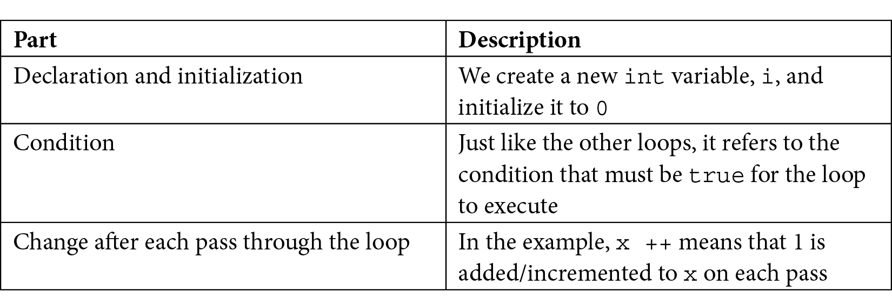
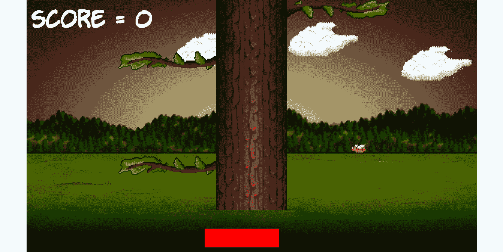

# 第五章：*第四章*：循环、数组、开关、枚举和函数——实现游戏机制

本章可能比本书中任何其他章节都包含更多的 C++信息。它充满了基本概念，将极大地推动我们的理解。它还将开始揭示我们一直略过的一些模糊区域，例如函数和游戏循环。

一旦我们探索了整个 C++语言必需品的列表，我们就会使用我们所知道的一切来制作主要游戏机制——树分支。到本章结束时，我们将为最终阶段和 Timber!!!的完成做好准备。

在本章中，我们将涵盖以下主题：

+   循环

+   数组

+   使用`switch`做出决定

+   枚举

+   开始使用函数

+   创建和移动树分支

# 循环

在编程中，我们经常需要多次执行相同的事情。我们迄今为止看到的明显例子是游戏循环。去掉所有代码后，我们的游戏循环看起来像这样：

```cpp
while (window.isOpen())
{
}
```

有几种不同的循环类型，我们在这里将查看最常用的几种。这种类型的循环的正确术语是**while**循环。

## 循环

`while`循环相当简单。回想一下`if`语句及其评估为`true`或`false`的表达式。我们可以在`while`循环的条件表达式中使用完全相同的运算符和变量的组合。

与`if`语句类似，如果表达式为`true`，则代码执行。然而，与`while`循环的区别在于，其中的 C++代码将反复执行，直到条件为`false`。看看下面的代码。

```cpp
int numberOfZombies = 100;
while(numberOfZombies > 0)
{
    // Player kills a zombie
    numberOfZombies--;
    // numberOfZombies decreases each pass through the loop
}
// numberOfZombies is no longer greater than 0
```

让我们回顾一下前一段代码中发生的事情。在`while`循环外部，`int numberOfZombies`被声明并初始化为`100`。然后，`while`循环开始。它的条件表达式是`numberOfZombies > 0`。因此，`while`循环将继续循环通过其体内的代码，直到条件评估为`false`。这意味着前面的代码将执行 100 次。

在循环的第一遍中，`numberOfZombies`等于 100，然后是 99，然后是 98，以此类推。但是一旦`numberOfZombies`等于零，它当然就不再是*大于*零了。然后，代码将跳出`while`循环，并在闭合的大括号之后继续运行。

就像`if`语句一样，`while`循环甚至可能一次都不会执行。看看下面的代码：

```cpp
int availableCoins = 10;
while(availableCoins > 10)
{
    // more code here.
    // Won't run unless availableCoins is greater than 10
}
```

在`while`循环内部的先前代码将不会执行，因为条件是错误的。

注意，表达式或循环体内的代码量的复杂性没有限制。考虑以下假设的游戏循环变体：

```cpp
int playerLives = 3;
int alienShips = 10;
while(playerLives !=0 && alienShips !=0 )
{
    // Handle input
    // Update the scene
    // Draw the scene
}
// continue here when either playerLives or alienShips equals 0
```

前面的`while`循环将继续执行，直到`playerLives`或`alienShips`等于零。一旦这些条件中的任何一个发生，表达式就会评估为`false`，程序将继续从`while`循环后的第一行代码执行。

值得注意的是，一旦进入循环体，它将始终至少执行一次，即使表达式在中间评估为假，因为它不会再次测试，直到代码尝试开始另一轮。让我们看看一个例子：

```cpp
int x = 1;
while(x > 0)
{
    x--;
    // x is now 0 so the condition is false
    // But this line still runs
    // and this one
    // and me!
}
// Now I'm done!
```

前面的循环体将执行一次。我们还可以设置一个将永远运行的`while`循环，不出所料，它被称为**无限循环**。以下是一个示例：

```cpp
int y = 0;
while(true)
{
    y++; // Bigger... Bigger...
}
```

如果你觉得前面的循环很复杂，只需字面理解它。循环在其条件为`true`时执行。嗯，`true`始终是`true`，因此会一直执行。

### 从`while`循环中跳出

我们可能会使用一个无限循环，这样我们就可以在循环体内决定何时退出循环，而不是在表达式中。我们可以通过在准备好离开循环体时使用**break**关键字来实现，可能如下所示：

```cpp
int z = 0;
while(true)
{
    z++; // Bigger... Bigger...
    break; // No you're not

    // Code doesn't reach here
}
```

在前面的代码中，循环体内的代码将执行一次，直到包括`break`语句在内，然后执行将继续在`while`循环的闭合花括号之后。

如你所猜测，我们可以在`while`循环和其他循环类型中结合任何 C++决策工具，如`if`、`else`，以及我们很快将要学习的另一个名为`switch`的工具。考虑以下示例：

```cpp
int x = 0;
int max = 10;
while(true)
{
    x++; // Bigger... Bigger...
    if(x == max){
        break;
    } // No you're not
    // code reaches here only until max = 10
}
```

在前面的代码中，`if`条件决定何时执行`break`语句。在这种情况下，代码将一直循环，直到`max`达到 10。

我们可以长时间地查看 C++ `while`循环的各种排列组合，但，在某个时候，我们希望回到制作游戏。所以，让我们继续讨论另一种类型的循环：`for`循环。

## `for`循环

`while`循环因为它需要三个部分来设置。首先看看下面的代码。我们将在以下内容之后将其分解：

```cpp
for(int x = 0; x < 100; x ++)
{
    // Something that needs to happen 100 times goes here
}
```

下面是`for`循环条件中所有部分的作用：

```cpp
for(; ; )
```

为了进一步阐明这一点，这里有一个表格来解释前一个`for`循环示例中出现的三个关键部分：



我们可以修改`for`循环，使其执行更多操作。下面是另一个简单的例子，它从 10 开始倒数：

```cpp
for(int i = 10; i > 0; i--)
{
    // countdown
}
// blast off
```

`for`循环负责初始化、条件评估和控制变量的控制。我们将在本章后面使用`for`循环来编写游戏。

现在，我们可以继续讨论 C++数组的话题，它可以帮助我们存储大量相关数据。

# 数组

如果一个变量是一个可以存储特定类型值的盒子，例如`int`、`float`或`char`，那么我们可以将数组想象成一排盒子。这些盒子的行可以几乎任何大小和类型，包括由类创建的对象。然而，所有的盒子必须是同一类型的。

小贴士

一旦我们学习了更多高级的 C++，就可以在一定程度上绕过必须在每个盒子中使用相同类型的限制。

这个数组听起来可能对我们*第二章*中的云很有用，变量、运算符和决策——精灵动画。那么，我们如何创建和使用数组呢？

## 声明一个数组

我们可以声明一个`int`类型的变量数组如下：

```cpp
int someInts[10];
```

现在，我们有一个名为`someInts`的数组，可以存储十个`int`值。然而，目前它是空的。

## 初始化数组的元素

要向数组的元素中添加值，我们可以使用我们已熟悉的语法类型，同时引入一些新的语法，称为数组第一个**元素**中的`99`：

```cpp
someInts[0] = 99;
```

为了在第二个元素中存储值 999，我们需要使用以下代码：

```cpp
someInts[1] = 999;
```

我们可以将值 3 存储在最后一个元素中，如下所示：

```cpp
someInts[9] = 3;
```

注意，数组的元素始终从零开始，到数组大小减一。类似于普通变量，我们可以操作数组中存储的值。唯一的区别是我们会使用数组表示法来这样做，因为尽管我们的数组有一个名字——`someInts`——但各个元素没有。

在以下代码中，我们将第一个和第二个元素相加，并将结果存储在第三个：

```cpp
someInts[2] = someInts[0] + someInts[1];
```

数组也可以与普通变量无缝交互，例如：

```cpp
int a = 9999;
someInts[4] = a;
```

我们可以以更多的方式初始化数组，现在让我们看看其中一种方法。

### 快速初始化数组的元素

我们可以快速向元素中添加值，如下所示。此示例使用一个`float`数组：

```cpp
float myFloatingPointArray[3] {3.14f, 1.63f, 99.0f};
```

现在，`3.14`、`1.63`和`99.0`值分别存储在第一个、第二个和第三个位置。记住，当我们使用数组表示法来访问这些值时，我们会使用[0]、[1]和[2]。

初始化数组元素的其他方法。这个稍微抽象的例子展示了使用`for`循环将值 0 到 9 放入`uselessArray`数组中：

```cpp
for(int i = 0; i < 10; i++)
{
    uselessArray[i] = i;
}
```

上述代码假设`uslessArray`之前已经被初始化，以存储至少 10 个`int`变量。

但为什么我们需要数组？

## 这些数组对我们游戏到底有什么作用？

我们可以在任何可以使用普通变量的地方使用数组——例如在以下表达式中使用：

```cpp
// someArray[4] is declared and initialized to 9999
for(int i = 0; i < someArray[4]; i++)
{
    // Loop executes 9999 times
}
```

本节开头暗示了数组在游戏代码中的一个最大好处。数组可以存储对象（类的实例）。让我们想象我们有一个`Zombie`类，我们想要存储一大堆。我们可以这样做：

```cpp
Zombie horde [5] {zombie1, zombie2, zombie3}; // etc...
```

现在的`horde`数组包含了大量的`Zombie`类实例。每一个都是一个独立的、活着的（某种程度上）、呼吸的、自我决定的`Zombie`对象。然后我们可以遍历`horde`数组，每个对象都会通过游戏循环，移动僵尸，并检查它们的头部是否遇到了斧头，或者它们是否设法抓住了玩家。

如果我们当时就知道它们，数组将完美地用于处理我们的云朵，请参阅*第二章*，“变量、运算符和决策 – 动画精灵”。我们可以拥有我们想要的任意数量的云朵，并且编写的代码比我们为那三个可怜的云朵编写的代码要少。

小贴士

要查看改进后的云代码的完整内容和实际应用，请查看下载包中的 Timber!!!（代码和可玩游戏）的增强版本。或者，您可以在查看代码之前尝试自己使用数组实现云朵。

最好的方法是看到所有这些数组功能在实际中的应用。我们将在我们实现树分支时这样做。

现在，我们将保持我们的云代码不变，以便我们能够尽快回到添加游戏功能的工作中。但首先，让我们用**switch**做一些更多的 C++决策。

# 使用 switch 进行决策

我们已经看到了`if`，它允许我们根据其表达式的结果决定是否执行代码块。但有时，C++中的决策可以通过其他更好的方式来实现。

当我们必须根据一个清晰的可能结果列表做出决策，而这些结果不涉及复杂的组合或广泛的值范围时，`switch`通常是最佳选择。我们可以这样开始一个`switch`决策：

```cpp
switch(expression)
{
    // More code here
}
```

在前面的例子中，`expression`可以是实际的表达式，也可以只是一个变量。然后，在大括号内，我们可以根据表达式的结果或变量的值做出决策。我们使用`case`和`break`关键字来完成这项工作：

```cpp
case x:
    //code for x
    break;

case y:
    //code for y
    break;
```

如您所见，每个`case`都声明了一个可能的结果，每个`break`都表示该`case`的结束以及执行离开`switch`块的时刻。

可选地，我们也可以使用不带值的`default`关键字来运行一些代码，以防没有`case`语句评估为`true`，如下所示：

```cpp
default: // Look no value
    // Do something here if no other case statements are true
    break;
```

作为`switch`的最后一个和更具体的例子，考虑一个复古文字冒险游戏，玩家输入字母“n”、“e”、“s”或“w”来向北、向东、向南或向西移动。可以使用`switch`块来处理玩家可能的每个输入：

```cpp
// get input from user in a char called command
switch(command){
    case 'n':
        // Handle move here
        break;
    case 'e':
        // Handle move here
        break;
    case 's':
        // Handle move here
        break;
    case 'w':
        // Handle move here
        break;

    // more possible cases
    default:
        // Ask the player to try again
        break;
}
```

理解我们关于`switch`所看到的一切的最佳方式是将它们付诸实践，同时结合我们正在学习的所有其他新概念。

接下来，我们将学习另一个在编写更多代码之前我们需要理解的 C++概念。让我们看看类枚举。

# 类枚举

**枚举**是一个逻辑集合中所有可能值的列表。C++枚举是列举事物的一种很好的方式。例如，如果我们的游戏使用的变量只能在一个特定的值范围内，并且这些值可以逻辑上形成一个集合或一组，那么枚举可能就是合适的。它们会使你的代码更清晰，更不容易出错。

在 C++中声明类枚举时，我们可以使用这两个关键字`enum class`一起，后面跟着枚举的名称，然后是枚举可以包含的值，用一对花括号 `{...}` 括起来。

例如，检查以下枚举声明。请注意，按照惯例，枚举的可能值应该使用大写字母声明：

```cpp
enum class zombieTypes {
   REGULAR, RUNNER, 
   CRAWLER, SPITTER, BLOATER 
};
```

注意，到目前为止，我们还没有声明`zombieType`的任何实例，只是声明了类型本身。如果这听起来很奇怪，可以这样想。SFML 创建了`Sprite`、`RectangleShape`和`RenderWindow`类，但为了使用这些类，我们必须声明一个对象/实例。

到目前为止，我们已经创建了一个名为`zombieTypes`的新类型，但我们还没有它的实例。所以，让我们现在就做：

```cpp
zombieType jeremy = zombieTypes::CRAWLER;
zombieType anna = zombieTypes::SPITTER;
zombieType diane = zombieTypes::BLOATER;
/*
    Zombies are fictional creatures and any resemblance
    to real people is entirely coincidental
*/
```

接下来是即将添加到 Timber!!!的代码类型的预览。我们希望跟踪树枝或玩家在树的哪一侧，因此我们将声明一个名为`side`的枚举，如下所示：

```cpp
enum class side { LEFT, RIGHT, NONE };
```

我们可以将玩家定位在左侧，如下所示：

```cpp
// The player starts on the left
side playerSide = side::LEFT;
```

我们可以使树枝位置数组的第四级（数组从零开始）没有任何树枝，如下所示：

```cpp
branchPositions[3] = side::NONE;
```

我们也可以在表达式中使用枚举：

```cpp
if(branchPositions[5] == playerSide)
{
    // The lowest branch is the same side as the player
    // SQUISHED!!
}
```

以下代码测试数组位置[5]的分支是否与玩家在同一个方向上。

我们将探讨一个重要的 C++主题，那就是函数，然后我们将回到编写游戏代码。当我们想要将一些执行特定任务的代码封装起来时，我们可以使用函数。

# 开始学习函数

C++函数究竟是什么？函数是一系列变量、表达式和**控制流语句**（循环和分支）的集合。实际上，我们在本书中到目前为止所学的任何代码都可以用在函数中。我们编写的函数的第一部分被称为**签名**。以下是一个函数签名的示例：

```cpp
void shootLazers(int power, int direction);
```

如果我们在函数执行的一些代码旁边添加一对开闭花括号 `{...}`，我们就会得到一个完整的函数，即一个**定义**：

```cpp
void shootLazers(int power, int direction)
{
    // ZAPP!
}
```

然后，我们可以从代码的另一个部分使用我们新的函数，可能如下所示：

```cpp
// Attack the player
shootLazers(50, 180) // Run the code in the function
// I'm back again - code continues here after the function ends
```

当我们使用一个函数时，我们说我们在“发射激光”，我们的程序执行分支到该函数内部包含的代码。函数将运行，直到它到达末尾或被指示“返回”。然后，代码将从函数调用后的第一行继续运行。我们已经在使用 SFML 提供的函数。这里的不同之处在于，我们将学习编写和调用我们自己的函数。

这里是另一个函数的示例，包括使函数返回到调用它的代码的代码：

```cpp
int addAToB(int a, int b)
{
    int answer = a + b;
    return answer;
}
```

我们可以使用以下方式调用该函数：

```cpp
int myAnswer = addAToB(2, 4);
```

显然，我们不需要编写函数来将两个变量相加，但这个例子帮助我们了解函数的工作原理。首先，我们传递值 `2` 和 `4`。在函数签名中，值 `2` 被分配给 `int a`，值 `4` 被分配给 `int b`。

在函数体内部，变量 `a` 和 `b` 被相加，并用于初始化新变量 `int answer`。`return answer;` 这一行正是这样做的。它将存储在 `answer` 中的值返回给调用代码，导致 `myAnswer` 被初始化为值 `6`。

注意，前面示例中的每个函数签名都有所不同。这是因为 C++ 函数签名非常灵活，允许我们构建我们需要的精确函数。

函数签名如何定义函数必须如何调用以及函数必须如何返回值，这值得进一步讨论。让我们给这个签名的每一部分起个名字，这样我们就可以将其分解成部分并了解它们。

这里是一个带有其各部分通过其正式/技术术语描述的函数签名：

```cpp
return type | name of function | (parameters)
```

这里有一些我们可以用于这些部分的示例：

+   `void`，`bool`，`float`，`int` 等等，或者任何 C++ 类型或表达式

+   `shootLazers`，`addAToB` 等等

+   `(int number, bool hitDetected)`, `(int x, int y)`, `(float a, float b)`

现在，让我们逐一查看每个部分，从返回类型开始。

## 函数返回类型

返回类型，正如其名称所暗示的，是函数将返回给调用代码的值的类型：

```cpp
int addAToB(int a, int b){

    int answer = a + b;
    return answer;

}
```

在我们之前看过的稍微有点无聊但很有用的 `addAtoB` 示例中，签名中的返回类型是 `int`。`addAToB` 函数将返回一个值，这个值将适合放入一个 `int` 变量中，返回给调用它的代码。返回类型可以是到目前为止我们看到的任何 C++ 类型，或者是我们还没有看到的类型之一。

函数根本不需要返回值。在这种情况下，签名必须使用 `void` 关键字作为返回类型。当使用 `void` 关键字时，函数体不得尝试返回值，因为这将导致错误。然而，它可以不带有值使用 `return` 关键字。以下是一些有效的返回类型和 `return` 关键字使用的组合：

```cpp
void doWhatever(){

    // our code
    // I'm done going back to calling code here
    // no return is necessary

}
```

另一种可能性如下：

```cpp
void doSomethingCool(){

    // our code

    // I can do this if I don't try and use a value
    return;
}
```

以下代码是更多可能的函数示例。务必阅读注释以及代码：

```cpp
void doYetAnotherThing(){
    // some code

    if(someCondition){

        // if someCondition is true returning to calling code
        // before the end of the function body
        return;
    }

    // More code that might or might not get executed

    return;

    // As I'm at the bottom of the function body
    // and the return type is void, I'm
    // really not necessary but I suppose I make it
    // clear that the function is over.
}

bool detectCollision(Ship a, Ship b){

    // Detect if collision has occurred
    if(collision)
    {
        // Bam!!!
        return true;
    }
    else
    {
        // Missed
        return false;
    }

}
```

在前面代码中的最后一个函数示例，即`detectCollision`，是对我们 C++代码未来近期的预览，并展示了我们也可以将用户定义的类型，即对象，传递给函数，以便在它们上进行计算。

我们可以依次调用每个函数，如下所示：

```cpp
// OK time to call some functions
doWhatever();
doSomethingCool();
doYetAnotherThing();

if (detectCollision(milleniumFalcon, lukesXWing))
{
    // The jedi are doomed!
    // But there is always Leia.
    // Unless she was on the Falcon?
}
else
{
    // Live to fight another day
}

// Continue with code from here
```

不要担心关于`detectCollision`函数看起来奇怪的语法；我们很快就会看到这样的真实代码。简单来说，我们正在使用返回值（`true`或`false`）作为`if`语句中的表达式。

## 函数名称

当我们设计自己的函数时，我们使用的函数名称几乎可以是任何东西。但最好使用单词，通常是动词，清楚地说明函数将做什么。例如，看看以下函数：

```cpp
void functionaroonieboonie(int blibbityblob, float floppyfloatything)
{
    //code here
}
```

前面的函数是完全合法的，并且会正常工作，但以下函数名称更清晰：

```cpp
void doSomeVerySpecificTask()
{
    //code here
}

int getMySpaceShipHealth()
{
    //code here
}

void startNewGame()
{
    //code here
}
```

使用像前面三个例子中那样的清晰和描述性的函数名称是一个好的做法，但正如我们从`functionaroonieboonie`函数中看到的那样，这不是编译器强制执行的规定。接下来，我们将更仔细地看看我们如何与函数共享一些值。

## 函数参数

我们知道一个函数可以返回结果给调用代码。但如果我们需要从调用代码中共享一些数据值给函数呢？**参数**允许我们与函数共享值。在我们查看返回类型时，我们已经看到了参数的例子。我们将查看相同的例子，但更仔细一些：

```cpp
int addAToB(int a, int b)
{ 
    int answer = a + b;
    return answer; 
}
```

在这里，参数是`int a`和`int b`。注意，在函数主体的第一行，我们使用`a + b`就像它们已经是声明并初始化的变量一样。嗯，那是因为它们确实是。函数签名中的参数是它们的声明，调用函数的代码初始化它们。

重要术语说明

注意，我们在这里指的是函数签名括号中的变量`(int a, int b)`，我们称之为参数。当我们从调用代码向函数传递值时，这些值被称为参数。当参数到达时，它们被参数用来初始化真实、可用的变量，例如：

`int returnedAnswer = addAToB(10,5);`

此外，正如我们在前面的例子中部分看到的那样，我们不必在我们的参数中只使用`int`。我们可以使用任何 C++类型。我们也可以使用尽可能多的参数来解决我们的问题，但保持参数列表尽可能短，因此尽可能易于管理是一个好的做法。

正如我们将在未来的章节中看到的那样，我们在这个入门教程中省略了一些函数的酷用，这样我们就可以在学习函数之前先了解相关的 C++概念。

## 函数主体

主体是我们一直避免的部分，其中包含如下注释：

```cpp
// code here
// some code
```

实际上，我们在这里已经知道该做什么了！到目前为止我们所学的任何 C++代码都可以在函数体中使用。

## 函数原型

到目前为止，我们已经看到了如何编写函数以及如何调用函数。然而，我们还需要做一件事才能使它们正常工作。所有函数都必须有一个**原型**。原型是让编译器知道我们的函数，没有原型整个游戏将无法编译。幸运的是，原型很简单。

我们可以简单地重复函数的签名，然后跟一个分号。需要注意的是，原型必须在尝试调用或定义函数之前出现。因此，一个完全可用的函数的最简单示例如下。仔细查看注释和代码中函数不同部分出现的位置：

```cpp
// The prototype
// Notice the semicolon on the end
int addAToB(int a, int b);

int main()
{ 
    // Call the function
    // Store the result in answer
    int answer = addAToB(2,2);

    // Called before the definition
    // but that's OK because of the prototype

    // Exit main
    return 0;

}// End of main

// The function definition
int addAToB(int a, int b)
{
    return a + b;
}
```

之前代码展示的是以下内容：

+   原型位于`main`函数之前。

+   使用函数的调用正如我们所预期的那样，在`main`函数内部。

+   定义位于`main`函数之后/外部。

    重要提示

    注意，当函数的定义出现在使用函数之前时，我们可以省略函数原型并直接进入定义。然而，随着我们的代码变得越来越长，并分散到多个文件中，这种情况几乎不会发生。我们将会一直使用单独的原型和定义。

让我们看看我们如何保持函数的有序性。

## 组织函数

值得指出的是，如果我们有多个函数，尤其是如果它们相当长，我们的`.cpp`文件将很快变得难以管理。这违背了函数旨在实现的部分目标。在下一个项目中，我们将看到解决方案，即我们可以将所有函数原型添加到我们自己的头文件（`.hpp`或`.h`）中。然后，我们可以在另一个`.cpp`文件中编写所有函数，并在我们的主`.cpp`文件中简单地添加另一个`#include...`指令。这样，我们可以使用任意数量的函数，而无需将它们的代码（原型或定义）添加到主代码文件中。

## 函数陷阱！

我们还应该讨论的关于函数的另一个点是**作用域**。如果我们在一个函数中声明一个变量，无论是直接声明还是在参数中声明，那么这个变量在该函数外部不可用/不可见。此外，在函数内部声明的任何变量在函数内部也看不见/不可用。

我们应该在函数代码和调用代码之间通过参数/参数和返回值来共享值。

当一个变量不可用，因为它来自另一个函数时，我们说它超出了作用域。当它可用且可使用时，我们说它在作用域内。

重要提示

在 C++中，任何块内声明的变量仅在該块的作用域内有效！这包括循环和`if`块。在`main`函数顶部声明的变量在`main`函数的任何地方都有作用域，在游戏循环中声明的变量仅在游戏循环中有作用域，依此类推。在函数或其他块内声明的变量称为**局部变量**。我们编写的代码越多，这一点就越有意义。每次我们在代码中遇到关于作用域的问题时，我都会讨论它，以便让大家明白。下一节将出现这样一个问题。还有一些其他的 C++基本概念会使这个问题更加突出。它们被称为**引用**和**指针**，我们将在*第九章*，“C++引用、精灵图集和顶点数组”和*第十章*，“指针、标准模板库和纹理管理”中分别学习它们。

## 更多关于函数的内容

我们甚至可以学习更多关于函数的知识，但我们已经足够了解它们，可以实施游戏下一部分的功能。而且，如果所有像参数、签名和定义这样的技术术语还没有完全理解，请不要担心。当我们开始使用这些概念时，它们会变得更加清晰。

## 关于函数的绝对最终话——现在

可能你没有注意到，我们一直在通过在函数名之前添加对象名称和一个点来调用函数，特别是 SFML 函数，如下所示：

```cpp
spriteBee.setPosition...
window.draw...
// etc
```

尽管如此，我们关于函数的整个讨论都是关于调用没有对象的函数。我们可以将函数作为类的一部分编写，或者简单地作为一个独立的函数编写。当我们将函数作为类的一部分编写时，我们需要该类的对象来调用该函数，但是当我们有一个独立的函数时，我们不需要。

我们将在一分钟内编写一个独立的函数，并从*第六章*，“面向对象编程 - 开始 Pong 游戏”开始编写带有函数的类。到目前为止，我们所了解到的关于函数的一切在两种情况下都是相关的。

现在，我们可以回到编写 Timber!!!游戏中的分支代码。

# 分支的生长

接下来，正如我在过去 20 页中承诺的那样，我们将使用我们学到的所有新的 C++技术来绘制和移动我们树上的一些分支。

在`main`函数外部添加以下代码。为了绝对清楚，我的意思是*在*`int main()`代码之前：

```cpp
#include <sstream>
#include <SFML/Graphics.hpp>
using namespace sf;
// Function declaration
void updateBranches(int seed);
const int NUM_BRANCHES = 6;
Sprite branches[NUM_BRANCHES];
// Where is the player/branch?
// Left or Right
enum class side { LEFT, RIGHT, NONE };
side branchPositions[NUM_BRANCHES];
int main()
```

我们用新代码实现了相当多的事情：

+   首先，我们为名为`updateBranches`的函数编写了一个函数原型。我们可以看到它不返回值（`void`），并且接受一个名为`seed`的`int`参数。我们很快将编写函数定义，然后我们将看到它确切地做了什么。

+   接下来，我们声明一个名为 `NUM_BRANCHES` 的 `int` 常量并将其初始化为 `6`。树上将会有六个移动的分支，我们很快就会看到 `NUM_BRANCHES` 如何对我们有所帮助。

+   在此之后，我们声明了一个名为 `branches` 的 `Sprite` 对象数组，它可以容纳六个 `Sprite` 实例。

+   之后，我们声明了一个名为 `side` 的新枚举，有三个可能的值：`LEFT`、`RIGHT` 和 `NONE`。这将被用来描述代码中几个地方单个分支以及玩家的位置。

+   最后，在前面提到的代码中，我们初始化了一个大小为 `NUM_BRANCHES`（6）的 `side` 类型数组。为了清楚地了解这实现了什么，我们将有一个包含六个值的数组，名为 `branchPositions`。这些值都是 `side` 类型，可以是 `LEFT`、`RIGHT` 或 `NONE`。

    重要提示

    当然，你真正想知道的是为什么常量、两个数组和枚举被声明在 `main` 函数的外部。通过在 `main` 之上声明它们，现在它们对 `main` 函数和 `updateBranches` 函数都是可见的。请注意，将所有变量尽可能本地化到它们实际使用的位置是一种良好的实践。虽然将所有内容都设置为全局可能看起来很有用，但这会导致难以阅读和容易出错的代码。

## 准备分支

现在，我们将准备我们的六个 `Sprite` 对象并将它们加载到 `branches` 数组中。在我们的游戏循环之前添加以下突出显示的代码：

```cpp
// Position the text
FloatRect textRect = messageText.getLocalBounds();
messageText.setOrigin(textRect.left +
    textRect.width / 2.0f,
    textRect.top +
    textRect.height / 2.0f);
messageText.setPosition(1920 / 2.0f, 1080 / 2.0f);
scoreText.setPosition(20, 20);
// Prepare 6 branches
Texture textureBranch;
textureBranch.loadFromFile("graphics/branch.png");
// Set the texture for each branch sprite
for (int i = 0; i < NUM_BRANCHES; i++) {
    branches[i].setTexture(textureBranch);
    branches[i].setPosition(-2000, -2000);
    // Set the sprite's origin to dead centre
    // We can then spin it round without changing its position
    branches[i].setOrigin(220, 20);
}
while (window.isOpen())
```

在前面的代码中，我们正在执行以下操作：

1.  首先，我们声明一个 SFML `Texture` 对象并将 `branch.png` 图形加载到其中。

1.  接下来，我们创建一个 `for` 循环，将 `i` 设置为零，并在每次循环中递增 `i` 一次，直到 `i` 不再小于 `NUM_BRANCHES`。这正是正确的，因为 `NUM_BRANCHES` 是 `6`，而 `branches` 数组有位置 `0` 到 `5`。

1.  在 `for` 循环内部，我们使用 `setTexture` 为 `branches` 数组中的每个 `Sprite` 设置 `Texture`，然后使用 `setPosition` 将其隐藏在屏幕之外。

1.  最后，我们使用 `setOrigin` 将精灵的原点（用于在绘制时定位精灵的点）设置为精灵的中心。很快，我们将旋转这些精灵。将原点放在中心意味着它们将很好地旋转，而不会将精灵移出位置。

现在我们已经准备好了所有分支，我们可以编写一些代码来在每一帧更新它们。

## 每帧更新分支精灵

在下面的代码中，我们将根据它们在数组中的位置和 `branchPositions` 数组中相应的 `side` 值设置 `branches` 数组中所有精灵的位置。添加以下突出显示的代码，并在我们详细解释之前先尝试理解它：

```cpp
    // Update the score text
    std::stringstream ss;
    ss << "Score: " << score;
    scoreText.setString(ss.str());
    // update the branch sprites
    for (int i = 0; i < NUM_BRANCHES; i++)
    {
        float height = i * 150;
        if (branchPositions[i] == side::LEFT)
        {
            // Move the sprite to the left side
            branches[i].setPosition(610, height);
            // Flip the sprite round the other way
            branches[i].setRotation(180);
        }
        else if (branchPositions[i] == side::RIGHT)
        {
            // Move the sprite to the right side
            branches[i].setPosition(1330, height);
            // Set the sprite rotation to normal
            branches[i].setRotation(0);
        }
        else
        {
            // Hide the branch
            branches[i].setPosition(3000, height);
        }
    }
} // End if(!paused)
/*
****************************************
Draw the scene
****************************************
```

我们刚刚添加的代码是一个大型的 `for` 循环，它将 `i` 设置为零，并在每次循环中递增 `i` 一次，直到 `i` 不再小于 `6`。

在`for`循环内部，一个新的`float`变量`height`被设置为`i * 150`。这意味着第一个分支的高度为 0，第二个为 150，第六个为 750。

接下来，我们有一个`if`和`else`代码块的结构。看看去掉代码后的结构：

```cpp
if()
{
}
else if()
{
}
else
{
}
```

第一个`if`语句使用`branchPositions`数组来判断当前分支是否应该在左侧。如果是，它将`branches`数组中对应的`Sprite`设置到屏幕上的一个位置，适合左侧（610 像素）和当前的`height`。然后通过 180 度翻转精灵，因为`branch.png`图形默认是向右悬挂的。

注意，只有当分支不在左侧时，`else if`才会执行。它使用相同的方法来判断分支是否在右侧。如果是，则分支将在右侧（1,330 像素）绘制。然后，将精灵旋转设置为 0 度，以防它之前是 180 度。如果 x 坐标看起来有点奇怪，只需记住我们已将分支精灵的起点设置为它们的中心。

最后的`else`语句正确地假设当前的`branchPosition`必须是`NONE`，并将分支隐藏在屏幕外的 3,000 像素处。

到目前为止，我们的分支已经定位好，准备绘制。

## 绘制分支

这里，我们将使用另一个`for`循环来遍历整个`branches`数组，从 0 到 5，并绘制每个分支精灵。添加以下高亮代码：

```cpp
// Draw the clouds
window.draw(spriteCloud1);
window.draw(spriteCloud2);
window.draw(spriteCloud3);
// Draw the branches
for (int i = 0; i < NUM_BRANCHES; i++) {
    window.draw(branches[i]);
}
// Draw the tree
window.draw(spriteTree);
```

当然，我们还没有编写移动所有分支的函数。一旦我们编写了这个函数，我们还需要确定何时以及如何调用它。让我们先解决第一个问题并编写这个函数。

## 移动分支

我们已经在上面的`main`函数上方添加了函数原型。现在，我们可以编写函数的实际定义，该函数每次被调用时都会将所有分支向下移动一个位置。我们将分两部分编写这个函数，以便我们可以轻松检查正在发生的事情。

在`main`函数的闭合花括号之后添加`updateBranches`函数的第一部分：

```cpp
// Function definition
void updateBranches(int seed)
{
    // Move all the branches down one place
    for (int j = NUM_BRANCHES-1; j > 0; j--) {	
        branchPositions[j] = branchPositions[j - 1];
    }
}
```

在函数的这一部分，我们只是将所有分支逐个向下移动一个位置，从第六个分支开始。这是通过使`for`循环从 5 计数到 0 来实现的。注意`branchPositions[j] = branchPositions[j - 1];`实际上实现了移动。

在此之前的代码中需要注意的另一件事是，在将位置 4 的分支移动到位置 5，然后将位置 3 的分支移动到位置 4，依此类推之后，我们需要在位置 0 添加一个新的分支，这是树的顶部。

现在，我们可以在树的顶部生成一个新的分支。添加以下高亮代码，然后我们将讨论它：

```cpp
// Function definition
void updateBranches(int seed)
{
    // Move all the branches down one place
    for (int j = NUM_BRANCHES-1; j > 0; j--) {	
        branchPositions[j] = branchPositions[j - 1];
    }
    // Spawn a new branch at position 0
    // LEFT, RIGHT or NONE
    srand((int)time(0)+seed);
    int r = (rand() % 5);
    switch (r) {
    case 0:
        branchPositions[0] = side::LEFT;
        break;
    case 1:
        branchPositions[0] = side::RIGHT;
        break;
    default:
        branchPositions[0] = side::NONE;
        break;
    }
}
```

在 `updateBranches` 函数的最后部分，我们使用传递给函数调用的整数 `seed` 变量。我们这样做是为了确保随机数种子总是不同的。我们将在下一章看到我们是如何得到这个值的。

接下来，我们在零和四之间生成一个随机数，并将结果存储在名为 `r` 的 `int` 变量中。现在，我们使用 `r` 作为表达式进行 `switch`。

`case` 语句意味着如果 `r` 等于零，那么我们在树的左侧顶部添加一个新的分支。如果 `r` 等于 1，那么分支将向右延伸。如果 `r` 是其他任何值（2、3 或 4），那么 `default` 确保不会在顶部添加任何分支。这种左、右和没有分支的平衡使树看起来更真实，游戏运行得相当好。你可以轻松地更改代码，使分支更频繁或更少。

即使在所有这些分支代码之后，我们仍然在游戏中看不到任何一个分支。这是因为在我们能够调用 `updateBranches` 函数之前，我们还有更多的工作要做。

如果你现在想看到分支，你可以添加一些临时代码，并在游戏循环之前，每次使用一个独特的种子调用该函数五次：

```cpp
updateBranches(1);
updateBranches(2);
updateBranches(3);
updateBranches(4);
updateBranches(5);
while (window.isOpen())
{
```

你现在可以看到分支的位置了。但如果分支要真正移动，我们就需要定期调用 `updateBranches`：



小贴士

在继续之前，不要忘记删除临时代码。

现在，我们也可以将注意力转向玩家，因为真正调用 `updateBranches` 函数。我们将在下一章这样做。

# 摘要

虽然不是最长的章节，但可能是我们迄今为止涵盖的 C++ 内容最多的章节。我们研究了我们可以使用的不同类型的循环，例如 `for` 和 `while` 循环。然后我们研究了数组，我们可以使用它们来处理大量的变量和对象，而不会感到吃力。我们还学习了枚举和 `switch`。本章最大的概念可能是函数，它允许我们组织和抽象我们游戏的代码。我们将在本书的几个地方更深入地研究函数。

现在我们已经有一个完全“工作”的树了，我们可以完成游戏，我们将在下一章和这个项目的最后一章中这样做。

# 常见问题解答

Q) 你提到还有更多种类的 C++ 循环。我可以在哪里找到关于它们的信息？

A) 是的，查看这个关于 `do while` 循环的教程和解释：[`www.tutorialspoint.com/cplusplus/cpp_do_while_loop.htm`](http://www.tutorialspoint.com/cplusplus/cpp_do_while_loop.htm)。

Q) 我现在可以假设自己是数组方面的专家吗？

A) 就像本书中的许多主题一样，总有更多东西可以学习。你关于数组的知识已经足够继续前进，但如果你渴望更多，请查看这个更全面的数组教程：[`www.cplusplus.com/doc/tutorial/arrays/`](http://www.cplusplus.com/doc/tutorial/arrays/)。

Q) 我可以假设自己是函数方面的专家吗？

A) 与本书中的许多主题一样，总有更多东西可以学习。你对函数的了解已经足够继续前进，但如果你还想了解更多，请查看这个教程：[`www.cplusplus.com/doc/tutorial/functions/`](http://www.cplusplus.com/doc/tutorial/functions/).
