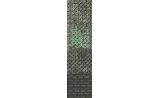
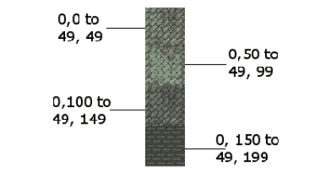
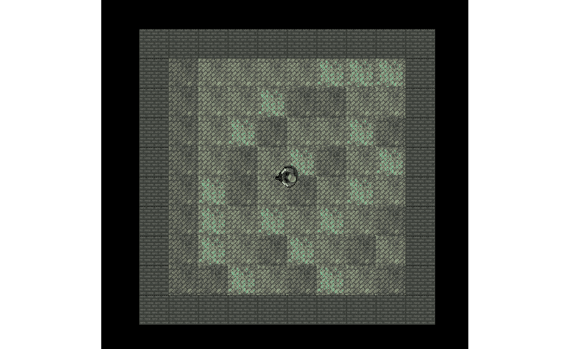

# 第十章：*第九章*：C++引用、精灵图集和顶点数组

在*第四章*，“循环、数组、开关、枚举和函数 – 实现游戏机制”中，我们讨论了作用域的概念。这个概念是指函数或代码内部块中声明的变量只在该函数或块中具有作用域（即，可以被*看到*或使用）。仅使用我们目前所拥有的 C++知识，这可能会导致问题。如果我们需要在`main`函数中处理几个复杂的对象，我们会怎么做？这可能意味着所有代码都必须放在`main`函数中。

在本章中，我们将探讨 C++ **引用**，它允许我们处理那些通常超出作用域的变量和对象。此外，这些引用将帮助我们避免在函数之间传递大型对象，这是一个缓慢的过程。这是因为每次我们这样做时，都必须制作变量或对象的副本。

带着对引用的新知识，我们将探讨 SFML 的`VertexArray`类，它允许我们构建一个大型图像，可以通过单个图像文件中的多个部分快速有效地绘制到屏幕上。到本章结束时，我们将拥有一个可缩放的、随机的、滚动的背景，它是通过引用和`VertexArray`对象制作的。

在本章中，我们将讨论以下主题：

+   C++引用

+   SFML 顶点数组

+   编写随机滚动的背景

# C++引用

当我们将值传递给函数或从函数返回值时，这正是我们所做的——通过**值**传递/返回。发生的情况是，变量所持有的值的副本被制作并发送到函数，在那里它被使用。

这的重要性有两方面：

1.  如果我们希望函数对变量进行永久性更改，这个系统对我们来说毫无用处。

1.  当复制值作为参数传递或从函数返回时，会消耗处理能力和内存。对于简单的`int`，甚至可能是一个`Sprite`，这微不足道。然而，对于复杂的对象，比如整个游戏世界（或背景），复制过程将严重影响我们的游戏性能。

参考文献是解决这两个问题的方案。**引用**是一种特殊的变量类型。引用*指向*另一个变量。以下是一个例子，帮助您更好地理解这一点：

```cpp
int numZombies = 100;
int& rNumZombies = numZombies;
```

在前面的代码中，我们声明并初始化了一个名为`numZombies`的普通`int`变量。然后我们声明并初始化了一个名为`rNumZombies`的`int`引用。引用操作符`&`位于类型之后，表明正在声明一个引用。

小贴士

引用名称前面的`r`前缀是可选的，但有助于记住我们正在处理一个引用。

现在，我们有一个名为`numZombies`的`int`变量，它存储的值是 100，还有一个名为`rNumZombies`的`int`引用，它指向`numZombies`。

我们对 `numZombies` 所做的任何操作都可以通过 `rNumZombies` 看到并且我们对 `rNumZombies` 所做的任何操作实际上是对 `numZombies` 的操作。看看以下代码：

```cpp
int score = 10;
int& rScore = score;
score ++;
rScore ++;
```

在之前的代码中，我们声明了一个名为 `score` 的 `int` 变量。接下来，我们声明了一个名为 `rScore` 的 `int` 引用，它指向 `score`。记住，我们对 `score` 所做的任何操作都可以被 `rScore` 看到并且我们对 `rScore` 所做的任何操作实际上是对 `score` 的操作。

因此，考虑当我们这样增加 `score` 时会发生什么：

```cpp
score ++;
```

`score` 变量现在存储的值是 11。除此之外，如果我们输出 `rScore`，它也会输出 11。下一行代码如下：

```cpp
rScore ++;
```

现在，`score` 实际上持有值 12，因为我们对 `rScore` 所做的任何操作实际上是对 `score` 的操作。

小贴士

如果你想知道 *它是如何工作的*，那么在下一章中我们将讨论 **指针** 时会有更多的揭示。简单来说，你可以将引用视为存储在计算机内存中的位置/地址。这个内存中的位置与它所引用的变量存储其值的位置相同。因此，对引用或变量的操作具有完全相同的效果。

目前，更重要的是讨论引用的 *原因*。使用引用有两个原因，我们已经在前面提到了。这里它们是，再次总结：

1.  在另一个函数中更改/读取变量的值/对象，该函数否则不在作用域内。

1.  不进行复制（因此更高效）地传递/返回函数。

研究以下代码，然后我们将讨论它：

```cpp
void add(int n1, int n2, int a);
void referenceAdd(int n1, int n2, int& a);
int main()
{
    int number1 = 2;
    int number2 = 2;
    int answer = 0;

    add(number1, number2, answer);
    // answer still equals zero because it is passed as a copy
    // Nothing happens to answer in the scope of main
    referenceAdd(number1, number2, answer);
    // Now answer equals 4 because it was passed by reference
    // When the referenceAdd function did this:
    // answer = num1 + num 2;
    // It is actually changing the value stored by answer
    return 0;
}
// Here are the two function definitions
// They are exactly the same except that
// the second passes a reference to a
void add(int n1, int n2, int a)
{
    a = n1 + n2;
    // a now equals 4
    // But when the function returns a is lost forever
}
void referenceAdd(int n1, int n2, int& a)
{
    a = n1 + n2;
    // a now equals 4
    // But a is a reference!
    // So, it is actually answer, back in main, that equals 4
}
```

之前的代码以两个函数的原型开始：`add` 和 `referenceAdd`。`add` 函数接受三个 `int` 变量，而 `referenceAdd` 函数接受两个 `int` 变量和一个 `int` 引用。

当调用 `add` 函数时，将 `number1`、`number2` 和 `answer` 变量传递进去，会制作值的副本，并操作 `add` 函数中局部的新变量（即 `n1`、`n2` 和 `a`）。因此，`main` 中的 `answer` 保持为零。

当调用 `referenceAdd` 函数时，`number1` 和 `number2` 再次按值传递。然而，`answer` 是按引用传递的。当将加到 `n2` 上的 `n1` 的值赋给引用 `a` 时，实际上发生的是这个值被赋回到 `main` 函数中的 `answer`。

很明显，我们永远不会需要为这样简单的事情使用引用。然而，这确实演示了按引用传递的机制。

让我们总结一下我们对引用的了解。

## 引用总结

之前的代码演示了如何使用引用通过在另一个作用域中的代码来改变变量的值。除了非常方便之外，通过引用传递也非常高效，因为它没有进行复制。我们的例子，即使用引用来传递一个 `int`，有点含糊不清，因为作为一个 `int` 非常小，所以没有真正的效率提升。在本章后面，我们将使用引用来传递整个关卡布局，效率提升将是显著的。

小贴士

关于引用有一个需要注意的地方！您必须在创建引用时将其分配给一个变量。这意味着它并不完全灵活。现在不用担心这个问题。我们将在下一章进一步探讨引用，以及它们更灵活（并且稍微复杂一些）的关系，例如**指针**。

这对于 `int` 类型来说在很大程度上是不相关的，但对于一个大型类对象来说可能具有潜在的重要性。在我们本章后面实现僵尸竞技场游戏的滚动背景时，我们将使用这种精确的技术。

# SFML 顶点数组和精灵表

我们几乎准备好实现滚动背景了。我们只需要了解 SFML 顶点数组和精灵表。

## 什么是精灵表？

**精灵表**是一组图像，可以是动画帧，也可以是包含在一个图像文件中的完全独立的图形。仔细看看这个精灵表，它包含四个单独的图像，这些图像将被用来在我们的僵尸竞技场游戏中绘制背景：



SFML 允许我们将精灵表加载为常规纹理，就像我们在这本书中迄今为止为每个纹理所做的那样。当我们将多个图像作为单个纹理加载时，GPU 可以更高效地处理它。

小贴士

实际上，现代 PC 可以不使用精灵表就处理这四个纹理。然而，学习这些技术是值得的，因为我们的游戏将开始对我们的硬件提出越来越高的要求。

当我们从精灵表中绘制图像时，我们需要确保我们引用的是所需的精灵表部分的精确像素坐标，如下所示：



之前的图例用坐标和它们在精灵表中的位置标记了每个部分/瓦片。这些坐标被称为**纹理坐标**。我们将在我们的代码中使用这些纹理坐标来绘制所需的正确部分。

## 什么是顶点数组？

首先，我们需要问，什么是顶点？**顶点**是一个单独的图形点，即一个坐标。这个点由水平和垂直位置定义。顶点的复数形式是 vertices。因此，顶点数组就是顶点的整个集合。

在 SFML 中，顶点数组中的每个顶点都有一个颜色和相关的附加顶点（即一对坐标），称为**纹理坐标**。纹理坐标是我们想要在精灵图中使用的图像的位置。稍后，我们将看到我们如何使用单个顶点数组来定位图形和选择精灵图中要显示的每个位置的部分。

SFML 的`VertexArray`类可以持有不同类型的顶点集。但每个`VertexArray`只能持有一种类型的集。我们使用适合场合的集类型。

视频游戏中的常见场景包括但不限于以下**原语**类型：

+   **点**: 每个点一个顶点。

+   **线**: 每组有两个顶点，定义了线的起点和终点。

+   **三角形**: 每个点有三个顶点。这是在复杂 3D 模型中最常用（成千上万）的，或者成对使用来创建一个简单的矩形，如精灵。

+   **四边形**: 每组有四个顶点。这是从精灵图中映射矩形区域的一种方便方式。

我们将在本项目中使用四边形。

## 从瓷砖构建背景

僵尸竞技场背景将由随机排列的方形图像组成。你可以将这种排列想象成地板上的瓷砖。

在本项目中，我们将使用带有**四边形**集的顶点数组。每个顶点将是一个由四个顶点组成的集合的一部分（即一个四边形）。每个顶点将定义背景中的一个瓷砖的角落，而每个纹理坐标将根据精灵图中的特定图像持有适当的值。

让我们看看一些代码以帮助我们开始。这不是我们在项目中将使用的确切代码，但它很接近，并允许我们在进行实际实现之前研究顶点数组。

## 构建顶点数组

就像我们在创建类实例时做的那样，我们声明我们的新对象。以下代码声明了一个新的`VertexArray`类型的对象，名为`background`：

```cpp
// Create a vertex array
VertexArray background;
```

我们希望让我们的`VertexArray`实例知道我们将使用哪种类型的原语。记住，点、线、三角形和四边形都有不同数量的顶点。通过将`VertexArray`实例设置为特定类型，将能够知道每个原语的开始。在我们的情况下，我们想要四边形。以下是实现这一点的代码：

```cpp
// What primitive type are we using
background.setPrimitiveType(Quads);
```

就像常规 C++数组一样，`VertexArray`实例需要设置到特定的大小。然而，`VertexArray`类比常规数组更灵活。它允许我们在游戏运行时更改其大小。大小可以在声明时配置，但我们的背景需要随着每一波而扩展。`VertexArray`类通过`resize`函数提供了这种功能。以下是设置我们的竞技场大小为 10x10 瓷砖大小的代码：

```cpp
// Set the size of the vertex array
background.resize(10 * 10 * 4);
```

在上一行代码中，第一个 `10` 是宽度，第二个 `10` 是高度，4 是四边形中的顶点数。我们本可以直接传递 400，但这样展示计算过程可以使我们清楚我们在做什么。当我们真正编写项目代码时，我们将进一步采取步骤以增加清晰度，并为计算的每个部分声明变量。

现在，我们有一个 `VertexArray` 实例，可以配置其数百个顶点。以下是我们在前四个顶点上设置位置坐标的方法（即第一个四边形）：

```cpp
// Position each vertex in the current quad
background[0].position = Vector2f(0, 0);
background[1].position = Vector2f(49, 0);
background[2].position = Vector2f(49,49);
background[3].position = Vector2f(0, 49);
```

这里展示了我们如何将这些相同顶点的纹理坐标设置到精灵图中的第一张图片。这些坐标在图片文件中是从 0,0（在左上角）到 49,49（在右下角）：

```cpp
// Set the texture coordinates of each vertex
background[0].texCoords = Vector2f(0, 0);
background[1].texCoords = Vector2f(49, 0);
background[2].texCoords = Vector2f(49, 49);
background[3].texCoords = Vector2f(0, 49);
```

如果我们想要将纹理坐标设置到精灵图中的第二张图片，我们会像这样编写代码：

```cpp
// Set the texture coordinates of each vertex
background[0].texCoords = Vector2f(0, 50);
background[1].texCoords = Vector2f(49, 50);
background[2].texCoords = Vector2f(49, 99);
background[3].texCoords = Vector2f(0, 99);
```

当然，如果我们像这样逐个定义每个顶点，那么即使是简单的 10x10 场地配置也将花费很长时间。

当我们真正实现背景时，我们将设计一组嵌套的 `for` 循环，遍历每个四边形，随机选择一个背景图片，并分配适当的纹理坐标。

代码需要相当智能。它需要知道何时是边缘瓦片，以便可以使用精灵图中的墙壁图像。它还需要使用适当的变量，这些变量知道精灵图中每个背景瓦片的位置，以及所需竞技场的整体大小。

我们将通过将所有代码放入一个单独的函数和一个单独的文件中来使这种复杂性变得可管理。我们将通过使用 C++ 引用来使 `VertexArray` 实例在 `main` 中可用。

我们将在稍后检查这些细节。你可能已经注意到，我们从未在任何地方将纹理（带有顶点数组的精灵图）关联起来。现在让我们看看如何做到这一点。

## 使用顶点数组绘制

我们可以像加载任何其他纹理一样加载精灵图作为纹理，如下面的代码所示：

```cpp
// Load the texture for our background vertex array
Texture textureBackground;
textureBackground.loadFromFile("graphics/background_sheet.png");
```

我们可以通过一次调用 `draw` 来绘制整个 `VertexArray`：

```cpp
// Draw the background
window.draw(background, &textureBackground);
```

之前的代码比逐个绘制每个瓦片作为单独的精灵要高效得多。

重要提示

在我们继续之前，注意 `textureBackground` 代码前面的 `&` 符号看起来有点奇怪。你可能会立即想到这与引用有关。这里发生的事情是我们正在传递 `Texture` 实例的地址而不是实际的 `Texture` 实例。我们将在下一章中了解更多关于这一点。

现在我们能够利用我们对引用和顶点数组的了解来实现僵尸竞技场项目的下一阶段。

# 创建随机生成的滚动背景

在本节中，我们将创建一个函数，在单独的文件中创建背景。我们将通过使用顶点数组引用来确保背景对 `main` 函数可用（在作用域内）。

由于我们将编写其他与 `main` 函数共享数据的函数，我们将它们都写入它们自己的 `.cpp` 文件中。我们将在一个新的头文件中提供这些函数的原型，并将该头文件（通过 `#include` 指令）包含在 `ZombieArena.cpp` 中。

为了实现这一点，让我们创建一个新的头文件 `ZombieArena.h`。我们现在准备好编写我们新函数的头文件了。

在这个新的 `ZombieArena.h` 头文件中，添加以下突出显示的代码，包括函数原型：

```cpp
#pragma once
using namespace sf;
int createBackground(VertexArray& rVA, IntRect arena);
```

之前的代码允许我们编写一个名为 `createBackground` 的函数的定义。为了与原型匹配，函数定义必须返回一个 `int` 值，并接收一个 `VertexArray` 引用和一个 `IntRect` 对象作为参数。

现在，我们可以在新的 `.cpp` 文件中创建一个新的文件，我们将在这个文件中编写函数定义。创建一个名为 `CreateBackground.cpp` 的新文件。我们现在准备好编写创建我们背景的函数定义了。

将以下代码添加到 `CreateBackground.cpp` 文件中，然后我们将对其进行审查：

```cpp
#include "ZombieArena.h"
int createBackground(VertexArray& rVA, IntRect arena)
{
    // Anything we do to rVA we are really doing
    // to background (in the main function)

    // How big is each tile/texture
    const int TILE_SIZE = 50;
    const int TILE_TYPES = 3;
    const int VERTS_IN_QUAD = 4;
    int worldWidth = arena.width / TILE_SIZE;
    int worldHeight = arena.height / TILE_SIZE;
    // What type of primitive are we using?
    rVA.setPrimitiveType(Quads);
    // Set the size of the vertex array
    rVA.resize(worldWidth * worldHeight * VERTS_IN_QUAD);
    // Start at the beginning of the vertex array
    int currentVertex = 0;
    return TILE_SIZE;
}
```

在之前的代码中，我们写下了函数签名以及标记函数体的开始和结束的大括号。

在函数体内部，我们声明并初始化了三个新的 `int` 常量来保存我们需要在函数的其余部分引用的值。它们是 `TILE_SIZE`、`TILE_TYPES` 和 `VERTS_IN_QUAD`。

`TILE_SIZE` 常量指的是精灵图中每个瓦片的大小（以像素为单位）。`TILE_TYPES` 常量指的是精灵图中不同瓦片的数量。我们可以将更多瓦片添加到我们的精灵图中，并更改 `TILE_TYPES` 以匹配更改，而我们即将编写的代码仍然可以工作。`VERTS_IN_QUAD` 指的是每个四边形中都有四个顶点。使用这个常量比总是输入数字 `4` 更不容易出错，因为 `4` 更不清晰。

我们首先声明并初始化两个 `int` 变量：`worldWidth` 和 `worldHeight`。这些变量的用途可能看起来很明显。它们的名字揭示了这一点，但值得指出的是，它们指的是世界宽度和高度，以瓦片数量而非像素为单位。`worldWidth` 和 `worldHeight` 变量是通过将传入的竞技场的高度和宽度除以 `TILE_SIZE` 常量来初始化的。

接下来，我们第一次使用我们的引用。记住，我们对 `rVA` 所做的任何操作实际上都是对在 `main` 函数中（或当我们编写它时）作用域内的变量所做的操作。

然后，我们使用 `rVA.setType` 来准备使用四边形的顶点数组，然后通过调用 `rVA.resize` 来使其达到正确的大小。我们将 `resize` 函数的参数传递为 `worldWidth * worldHeight * VERTS_IN_QUAD` 的结果，这正好等于我们在准备完成后顶点数组将拥有的顶点数量。

代码的最后一句声明并初始化 `currentVertex` 为零。我们将使用 `currentVertex` 在遍历顶点数组时初始化所有顶点。

现在，我们可以编写嵌套 `for` 循环的第一部分，该循环将准备顶点数组。添加以下突出显示的代码，并根据我们对顶点数组所了解的内容，尝试弄清楚它做了什么：

```cpp
    // Start at the beginning of the vertex array
    int currentVertex = 0;
    for (int w = 0; w < worldWidth; w++)
    {
        for (int h = 0; h < worldHeight; h++)
        {
            // Position each vertex in the current quad
rVA[currentVertex + 0].position = 
                Vector2f(w * TILE_SIZE, h * TILE_SIZE);

            rVA[currentVertex + 1].position =
                Vector2f((w * TILE_SIZE) + TILE_SIZE, h * TILE_SIZE);

            rVA[currentVertex + 2].position =
Vector2f((w * TILE_SIZE) + TILE_SIZE, (h * TILE_SIZE) 
                + TILE_SIZE);

            rVA[currentVertex + 3].position =
Vector2f((w * TILE_SIZE), (h * TILE_SIZE) 
                + TILE_SIZE);

            // Position ready for the next four vertices
            currentVertex = currentVertex + VERTS_IN_QUAD;
        }
    }
    return TILE_SIZE;
}
```

我们刚刚添加的代码通过使用嵌套的 `for` 循环遍历顶点数组，首先遍历前四个顶点：`currentVertex + 1`、`currentVertex + 2`，依此类推。

我们使用数组表示法访问数组中的每个顶点，例如 `rvA[currentVertex + 0]..`，依此类推。使用数组表示法，我们调用 `position` 函数，`rvA[currentVertex + 0].position...`。

向 `position` 函数传递每个顶点的水平和垂直坐标。我们可以通过组合使用 `w`、`h` 和 `TILE_SIZE` 来程序化地计算出这些坐标。

在上一段代码的末尾，我们定位 `currentVertex`，为嵌套 `for` 循环的下一轮迭代做准备，通过将其增加四个位置（即加四）来实现，即 `currentVertex = currentVertex + VERTS_IN_QUAD`。

当然，所有这些只是设置了我们的顶点坐标；它并没有从精灵图中分配纹理坐标。这是我们接下来要做的。

为了使新代码的位置绝对清晰，我在上下文中展示了它，包括我们刚才写的所有代码。添加并学习以下突出显示的代码：

```cpp
for (int w = 0; w < worldWidth; w++)
    {
        for (int h = 0; h < worldHeight; h++)
        {
            // Position each vertex in the current quad
            rVA[currentVertex + 0].position = 
                Vector2f(w * TILE_SIZE, h * TILE_SIZE);

            rVA[currentVertex + 1].position =
                Vector2f((w * TILE_SIZE) + TILE_SIZE, h * TILE_SIZE);

            rVA[currentVertex + 2].position =
                Vector2f((w * TILE_SIZE) + TILE_SIZE, (h * TILE_SIZE) 
                + TILE_SIZE);

            rVA[currentVertex + 3].position =
                Vector2f((w * TILE_SIZE), (h * TILE_SIZE) 
                + TILE_SIZE);

            // Define the position in the Texture for current quad
            // Either grass, stone, bush or wall
if (h == 0 || h == worldHeight-1 || 
                w == 0 || w == worldWidth-1)
            {
                // Use the wall texture
rVA[currentVertex + 0].texCoords = 
                    Vector2f(0, 0 + TILE_TYPES * TILE_SIZE);

rVA[currentVertex + 1].texCoords = 
Vector2f(TILE_SIZE, 0 + 
                    TILE_TYPES * TILE_SIZE);

rVA[currentVertex + 2].texCoords = 
Vector2f(TILE_SIZE, TILE_SIZE + 
                    TILE_TYPES * TILE_SIZE);

rVA[currentVertex + 3].texCoords = 
Vector2f(0, TILE_SIZE + 
                    TILE_TYPES * TILE_SIZE);
            }

            // Position ready for the next for vertices
            currentVertex = currentVertex + VERTS_IN_QUAD;
        }
    }
    return TILE_SIZE;
}
```

上述突出显示的代码设置了与每个顶点相关的精灵图中的坐标。注意那个相对较长的 `if` 条件。该条件检查当前四边形是否是竞技场中非常第一个或最后一个四边形之一。如果是（第一个或最后一个之一），那么这意味着它是边界的一部分。然后我们可以使用一个简单的公式，结合 `TILE_SIZE` 和 `TILE_TYPES`，从精灵图中定位墙纹理。

数组表示法和 `texCoords` 成员依次初始化，为每个顶点分配精灵图中墙纹理的适当角落。

以下代码被包裹在一个 `else` 块中。这意味着每次四边形不表示边界/墙砖时，它都会通过嵌套的 `for` 循环运行。在现有代码中添加以下突出显示的代码，然后我们将检查它：

```cpp
            // Define position in Texture for current quad
            // Either grass, stone, bush or wall
            if (h == 0 || h == worldHeight-1 ||
                w == 0 || w == worldWidth-1)
            {
                // Use the wall texture
                rVA[currentVertex + 0].texCoords = 
                    Vector2f(0, 0 + TILE_TYPES * TILE_SIZE);

                rVA[currentVertex + 1].texCoords = 
                    Vector2f(TILE_SIZE, 0 + 
                    TILE_TYPES * TILE_SIZE);

                rVA[currentVertex + 2].texCoords = 
                    Vector2f(TILE_SIZE, TILE_SIZE + 
                    TILE_TYPES * TILE_SIZE);

                rVA[currentVertex + 3].texCoords = 
                    Vector2f(0, TILE_SIZE + 
                    TILE_TYPES * TILE_SIZE);
            }
            else
            {
                // Use a random floor texture
                srand((int)time(0) + h * w - h);
                int mOrG = (rand() % TILE_TYPES);
                int verticalOffset = mOrG * TILE_SIZE;
rVA[currentVertex + 0].texCoords = 
                    Vector2f(0, 0 + verticalOffset);

rVA[currentVertex + 1].texCoords = 
                    Vector2f(TILE_SIZE, 0 + verticalOffset);

rVA[currentVertex + 2].texCoords = 
                    Vector2f(TILE_SIZE, TILE_SIZE + verticalOffset);

rVA[currentVertex + 3].texCoords = 
                    Vector2f(0, TILE_SIZE + verticalOffset);
            }            
            // Position ready for the next for vertices
            currentVertex = currentVertex + VERTS_IN_QUAD;
        }
    }
    return TILE_SIZE;
}
```

上述突出显示的代码首先使用一个公式初始化随机数生成器，该公式在每次循环迭代中都会不同。然后，`mOrG` 变量被初始化为一个介于 0 和 `TILE_TYPES` 之间的数字。这正是我们随机选择一个砖块类型所需要的。

重要提示

`mOrG` 代表“泥或草”。这个名字是任意的。

现在，我们通过将 `mOrG` 乘以 `TileSize` 来声明并初始化一个名为 `verticalOffset` 的变量。我们现在在精灵图中有一个垂直参考点，指向随机选择的当前四边形的纹理的起始高度。

现在，我们使用一个涉及 `TILE_SIZE` 和 `verticalOffset` 的简单公式来分配纹理每个角落的确切坐标到相应的顶点。

我们现在可以在游戏引擎中使用我们的新函数了。

# 使用背景

我们已经完成了复杂的部分，所以接下来的步骤将会很简单。共有三个步骤，如下：

1.  创建一个 `VertexArray`。

1.  在每一波升级后初始化它。

1.  在每一帧中绘制它。

将以下加粗的代码添加到声明名为 `background` 的 `VertexArray` 实例中，并加载 `background_sheet.png` 文件作为纹理：

```cpp
// Create an instance of the Player class
Player player;
// The boundaries of the arena
IntRect arena;
// Create the background
VertexArray background;
// Load the texture for our background vertex array
Texture textureBackground;
textureBackground.loadFromFile("graphics/background_sheet.png");
// The main game loop
while (window.isOpen())
```

添加以下代码来调用 `createBackground` 函数，传入 `background` 作为引用和 `arena` 作为值。注意，在加粗的代码中，我们还修改了初始化 `tileSize` 变量的方式。请按照所示添加加粗的代码：

```cpp
if (state == State::PLAYING)
{
    // Prepare the level
    // We will modify the next two lines later
    arena.width = 500;
    arena.height = 500;
    arena.left = 0;
    arena.top = 0;
// Pass the vertex array by reference 
    // to the createBackground function
    int tileSize = createBackground(background, arena);
    // We will modify this line of code later
    // int tileSize = 50;
    // Spawn the player in the middle of the arena
    player.spawn(arena, resolution, tileSize);
    // Reset the clock so there isn't a frame jump
    clock.restart();
}
```

注意，我们已经替换了 `int tileSize = 50` 这行代码，因为我们直接从 `createBackground` 函数的返回值中获取值。

小贴士

为了未来代码的清晰性，你应该删除 `int tileSize = 50` 这行代码及其相关注释。我只是将其注释掉，以便为新代码提供一个更清晰的上下文。

最后，是时候进行绘制了。这真的很简单。我们只是调用 `window.draw` 并传递 `VertexArray` 实例以及 `textureBackground` 纹理：

```cpp
/*
 **************
 Draw the scene
 **************
 */
if (state == State::PLAYING)
{
    window.clear();
    // Set the mainView to be displayed in the window
    // And draw everything related to it
    window.setView(mainView);
    // Draw the background
    window.draw(background, &textureBackground);
    // Draw the player
    window.draw(player.getSprite());
}
```

小贴士

如果你想知道 `textureBackground` 前面那个看起来奇怪的 `&` 符号是什么意思，那么所有的问题将在下一章中变得清晰。

你现在可以运行游戏了。你将看到以下输出：



在这里，注意玩家精灵如何在竞技场范围内平滑地滑行和旋转。尽管当前 `main` 函数中的代码绘制了一个小竞技场，但 `CreateBackground` 函数可以创建任何大小的竞技场。我们将在 *第十三章* 中看到比屏幕更大的竞技场，*声音效果、文件输入/输出和完成游戏*。

# 摘要

在本章中，我们发现了 C++ 引用，它们是作为另一个变量的别名而存在的特殊变量。当我们通过引用而不是值传递变量时，我们对引用所做的任何操作都会影响到调用函数中的变量。

我们还学习了关于顶点数组的内容，并创建了一个充满四边形的顶点数组，用于从精灵图中绘制作为背景的瓦片。

当然，房间里的大象是我们这款僵尸游戏没有僵尸。我们将在下一章通过学习 C++ 指针和**标准模板库**（**STL**）来解决这个问题。

# 常见问题解答

这里有一些可能出现在你脑海中的问题：

Q) 你能再次总结这些引用吗？

A) 您必须立即初始化引用，并且不能将其更改为引用另一个变量。使用引用与函数一起使用，这样您就不是在处理副本。这对效率有好处，因为它避免了复制，并有助于我们更容易地将代码抽象为函数。

Q) 有没有简单的方法来记住使用引用的主要好处？

A) 为了帮助您记住引用的用途，请考虑以下简短的韵文：

*        移动大对象可能会使我们的游戏变得卡顿，*

*        通过引用传递比复制更快。*
