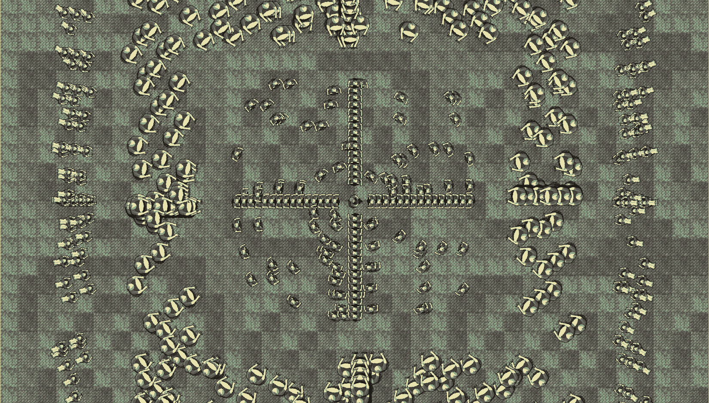

# 第十一章：*第十章*：指针、标准模板库和纹理管理

在本章中，我们将学习很多内容，并在游戏方面完成很多工作。我们首先将学习 C++的基本主题**指针**。指针是持有内存地址的变量。通常，指针将持有另一个变量的内存地址。这听起来有点像引用，但我们将看到它们要强大得多，并使用指针来处理不断增长的僵尸群。

我们还将了解**标准模板库**（**STL**），这是一个允许我们快速轻松地实现常见数据管理技术的类集合。

一旦我们理解了 STL 的基础知识，我们就能使用这些新知识来管理游戏中的所有纹理，因为如果我们有 1,000 个僵尸，我们真的不希望为每个僵尸加载一个图形副本到 GPU 中。

我们还将深入探讨面向对象编程（OOP），并使用一个**静态**函数，这是一个不需要类实例就可以调用的类函数。同时，我们将看到如何设计一个类，以确保只有一个实例可以存在。当我们需要确保代码的不同部分使用相同的数据时，这是理想的。

在本章中，我们将涵盖以下主题：

+   学习指针

+   学习 STL（标准模板库）

+   使用静态函数和**单例**类实现`TextureHolder`类

+   实现指向僵尸群组的指针

+   编辑一些现有的代码以使用`TextureHolder`类来处理玩家和背景

# 学习指针

指针在学习编写 C++代码时可能会引起挫败感。然而，这个概念很简单。

重要提示

**指针**是一个变量，它持有内存地址。

就这些了！没有什么需要担心的。可能让初学者感到沮丧的是语法——我们用来处理指针的代码。我们将逐步讲解使用指针的代码的每个部分。然后你可以开始掌握它们的持续过程。

小贴士

在本节中，我们将实际上学习比本项目所需更多的指针知识。在下一个项目中，我们将更多地使用指针。尽管如此，我们只是触及了这个主题的表面。进一步的学习绝对推荐，我们将在最后一章中更多地讨论这一点。

我很少建议通过记忆事实、数字或语法来学习是最好的方法。然而，记忆与指针相关的简短但至关重要的语法可能是有价值的。这将确保信息深深地植入我们的脑海，我们永远不会忘记它。然后我们可以讨论为什么我们需要指针，并检查它们与引用的关系。一个指针的类比可能会有所帮助：

小贴士

如果一个变量是一栋房子，其内容是它持有的值，那么指针就是房子的地址。

在上一章讨论引用时，我们了解到当我们向函数传递值或从函数返回值时，我们实际上是在创建一个全新的房子，但它与之前的房子完全相同。我们正在创建传递给或从函数传递的值的副本。

到目前为止，指针可能开始听起来有点像引用。这是因为它们确实有点像引用。然而，指针要灵活得多，功能更强大，并且有自己的特殊和独特用途。这些特殊和独特用途需要特殊的和独特的语法。

## 指针语法

与指针相关联的主要运算符有两个。第一个是**地址**运算符：

```cpp
&
```

第二个是**解引用**运算符：

```cpp
*
```

我们现在将探讨我们可以用指针使用这些运算符的不同方式。

你首先会注意到运算符的地址与引用运算符相同。为了给有志于成为 C++游戏程序员的初学者增添麻烦，这些运算符在不同的上下文中做不同的事情。从一开始就了解这一点是非常有价值的。如果你正在查看一些涉及指针的代码，感觉像是要发疯，请记住：

提示

你完全正常！你只需要查看上下文的细节。

现在，你知道如果某事不清楚且立即明显，那不是你的错。指针不清楚且立即明显，但仔细观察上下文将揭示正在发生的事情。

带着需要比之前的语法更注意指针的知识，以及两个运算符（**地址**和**解引用**）是什么，我们现在可以开始查看一些真正的指针代码。

提示

确保你在继续之前已经记住了这两个运算符。

## 声明指针

要声明一个新的指针，我们使用解引用运算符，以及指针将要持有的变量的类型。在我们进一步讨论指针之前，看看以下代码：

```cpp
// Declare a pointer to hold 
// the address of a variable of type int
int* pHealth;
```

上述代码声明了一个名为 `pHealth` 的新指针，它可以持有 `int` 类型变量的地址。注意我说的是*可以*持有 `int` 类型的变量。像其他变量一样，指针也需要初始化为一个值，以便正确使用它。

变量名 `pHealth`，就像其他变量一样，是任意的。

提示

常规做法是在指针变量的名称前加上 `p` 前缀。这样，当我们处理指针时，就更容易记住，并且可以区分它们和常规变量。

在解引用运算符周围使用的空白是可选的，因为 C++很少关心语法中的空白。然而，建议使用它，因为它有助于可读性。看看以下三行代码，它们都做了相同的事情。

我们在先前的例子中已经看到了以下格式，解引用运算符紧挨着类型：

```cpp
int* pHealth;
```

以下代码显示了解引用运算符两边的空白：

```cpp
int * pHealth;
```

以下代码展示了在指针名称旁边使用解引用运算符：

```cpp
int *pHealth;
```

值得注意的是这些可能性，这样当你阅读代码时，也许是在网上，你会理解它们都是相同的。在这本书中，我们将始终使用带有解引用运算符靠近类型的第一个选项。

正如常规变量只能成功包含适当类型的数据一样，指针应该只持有适当类型变量的地址。

指向 `int` 类型的指针不应持有 `String`、`Zombie`、`Player`、`Sprite`、`float` 或任何其他类型的地址，除了 `int`。

让我们看看我们如何初始化我们的指针。

## 初始化指针

接下来，我们将看看如何将变量的地址放入指针中。看看下面的代码：

```cpp
// A regular int variable called health
int health = 5;
// Declare a pointer to hold the address of a variable of type int
int* pHealth;
// Initialize pHealth to hold the address of health,
// using the "address of" operator
pHealth = &health;
```

在前面的代码中，我们声明了一个名为 `health` 的 `int` 变量，并将其初始化为 `5`。尽管我们之前从未讨论过这个问题，但这个变量必须在我们的计算机内存中的某个地方。它必须有一个内存地址。

我们可以使用 `pHealth` 和 `health` 的地址来访问这个地址，如下所示：

```cpp
  pHealth = &health;
```

我们的 `pHealth` 指针现在持有常规 `int`，`health` 的地址。

小贴士

在 C++ 术语中，我们说 `pHealth` 指向 `health`。

我们可以通过将 `pHealth` 传递给函数来使用它，这样函数就可以在 `health` 上工作，就像我们使用引用一样。

如果我们只是用指针做这些事情，那么就没有必要使用指针了，所以让我们看看如何重新初始化它们。

## 指针的重新初始化

指针与引用不同，可以被重新初始化以指向不同的地址。看看下面的代码：

```cpp
// A regular int variable called health
int health = 5;
int score = 0;
// Declare a pointer to hold the address of a variable of type int
int* pHealth;
// Initialize pHealth to hold the address of health
pHealth = &health;
// Re-initialize pHealth to hold the address of score
pHealth = &score;
```

现在，`pHealth` 指向 `int` 类型的变量，`score`。

当然，我们的指针名称 `pHealth` 现在是模糊的，可能应该被称为 `pIntPointer`。这里的关键是要理解我们*可以*这样做重新分配。

在这个阶段，我们实际上并没有使用指针做任何事情，除了简单地指向（持有内存地址）。让我们看看我们如何访问指针指向的地址中存储的值。这将使它们真正有用。

## 解引用指针

我们知道指针在内存中持有地址。如果我们要在我们的游戏中输出这个地址，比如在我们的 HUD 中，在声明和初始化之后，它可能看起来像这样：**9876**。

它只是一个值——一个表示内存地址的值。在不同的操作系统和硬件类型中，这些值的范围会有所不同。在本书的上下文中，我们永远不需要直接操作地址。我们只关心指针指向的地址中存储的值。

变量实际使用的地址是在游戏执行时（在运行时）确定的，因此在我们编写游戏代码时，我们无法知道变量的地址以及指针中存储的值。

我们可以通过使用 **解引用** 操作符来访问指针指向的地址存储的值：

```cpp
*
```

以下代码直接通过指针操作一些变量。试着跟上来，然后我们将逐一分析：

小贴士

警告！下面的代码毫无意义（本意如此）。它只是演示了指针的使用。

```cpp
// Some regular int variables
int score = 0;
int hiScore = 10;
// Declare 2 pointers to hold the addresses of int
int* pIntPointer1;
int* pIntPointer2;
// Initialize pIntPointer1 to hold the address of score
pIntPointer1 = &score;
// Initialize pIntPointer2 to hold the address of hiScore
pIntPointer2 = &hiScore;
// Add 10 to score directly
score += 10;
// Score now equals 10
// Add 10 to score using pIntPointer1
*pIntPointer1 += 10;
// score now equals 20\. A new high score
// Assign the new hi score to hiScore using only pointers
*pIntPointer2 = *pIntPointer1;
// hiScore and score both equal 20
```

在前面的代码中，我们声明了两个 `int` 变量，`score` 和 `hiScore`。然后，我们分别用 0 和 10 的值初始化它们。接下来，我们声明了两个指向 `int` 的指针。这些是 `pIntPointer1` 和 `pIntPointer2`。我们在声明它们的同时初始化它们，以存储（指向）`score` 和 `hiScore` 变量的地址。

接下来，我们以通常的方式给 `score` 加 10，即 `score += 10`。然后，我们可以看到通过在指针上使用解引用操作符，我们可以访问它们指向的地址存储的值。以下代码改变了由 `pIntPointer1` 指向的变量存储的值：

```cpp
// Add 10 to score using pIntPointer1
*pIntPointer1 += 10;
// score now equals 20, A new high score
```

上述代码的最后部分解引用了两个指针，将 `pIntPointer1` 指向的值赋给 `pIntPointer2` 指向的值：

```cpp
// Assign the new hi-score to hiScore with only pointers
*pIntPointer2 = *pIntPointer1;
// hiScore and score both equal 20
```

`score` 和 `hiScore` 现在都等于 20。

## 指针是多才多艺且强大的

我们可以用指针做很多事情。这里只列出了我们可以做的几个有用的事情。

### 动态分配的内存

我们之前看到的所有指针都指向作用域仅限于它们创建的函数的内存地址。因此，如果我们声明并初始化一个指向局部变量的指针，当函数返回时，指针、局部变量和内存地址都将消失。它们超出了作用域。

到目前为止，我们一直在使用预先决定的游戏执行前固定数量的内存。此外，我们一直在使用的内存是由操作系统控制的，变量在我们调用和从函数返回时丢失和创建。我们需要一种方法来使用始终在作用域内的内存，直到我们完成它。我们希望有权访问我们可以称之为自己的内存，并对其负责。

当我们声明变量（包括指针）时，它们位于一个称为 **栈** 的内存区域。还有一个内存区域，尽管它由操作系统分配和控制，但可以在运行时分配。这个其他内存区域被称为 **自由存储区**，有时也称为 **堆**。

小贴士

堆上的内存没有特定于某个函数的作用域。函数返回不会删除堆上的内存。

这赋予我们巨大的力量。有了对仅限于我们游戏运行在的计算机资源限制的内存的访问，我们可以规划包含大量对象的游戏。在我们的例子中，我们想要一大群僵尸。然而，蜘蛛侠的叔叔不会犹豫提醒我们，“能力越大，责任越大。”

让我们看看我们如何使用指针利用空闲存储中的内存，以及我们如何在完成使用后将其释放回操作系统。

要创建一个指向堆上值的指针，我们需要一个指针：

```cpp
int* pToInt = nullptr;
```

在上一行代码中，我们以我们之前看到的方式声明了一个指针，但由于我们没有初始化它指向一个变量，我们将其初始化为 `nullptr`。我们这样做是因为这是一个好的实践。考虑当你甚至不知道它指向什么时解引用一个指针（改变它指向的地址中的值）。这将编程上的射击场，蒙上眼睛，让人转圈，然后告诉他们射击。通过将指针指向空（`nullptr`），我们无法对它造成任何伤害。

当我们准备在空闲存储中请求内存时，我们使用 `new` 关键字，如下面的代码行所示：

```cpp
pToInt = new int;
```

`pToInt` 现在持有空闲存储上空间的内存地址，这个空间正好可以存放一个 `int` 值。

提示

当程序结束时，任何分配的内存都会被返回。然而，重要的是要意识到，除非我们手动释放，否则这块内存（在我们的游戏执行过程中）永远不会被释放。如果我们继续从空闲存储中获取内存而不归还，最终内存会用尽，游戏将会崩溃。

我们偶尔从空闲存储中取 `int` 大小的块，不太可能耗尽内存。但如果我们的程序中有一个或多个函数或循环请求内存，并且这个函数或循环在整个游戏过程中定期执行，最终游戏会变慢，然后崩溃。此外，如果我们错误地分配了大量对象到空闲存储，那么这种情况可能会很快发生。

以下代码行将 `pToInt` 之前指向的空闲存储中的内存归还（删除）：

```cpp
delete pToInt;
```

现在，之前由 `pToInt` 指向的内存不再属于我们可以随意操作的范围；我们必须采取预防措施。尽管内存已经被归还给操作系统，但 `pToInt` 仍然持有这块内存的地址，而这块内存已经不再属于我们。

以下代码行确保 `pToInt` 不能被用来尝试操作或访问这块内存：

```cpp
pToInt = nullptr;
```

提示

如果一个指针指向一个无效的地址，它被称为 **野指针** 或 **悬垂指针**。如果你尝试解引用一个悬垂指针，如果你幸运，游戏会崩溃，你会得到一个内存访问违规错误。如果你不幸，你将创建一个难以发现的 bug。此外，如果我们使用在函数生命周期之后仍然存在的空闲存储上的内存，我们必须确保保留一个指向它的指针，否则我们将泄漏内存。

现在，我们可以声明指针并将它们指向在自由存储上分配的新内存。我们可以通过解引用它们来操作和访问它们指向的内存。我们还可以在完成使用后将其返回到自由存储，并且我们知道如何避免悬挂指针。

让我们看看指针的一些更多优点。

### 将指针传递给函数

为了将指针传递给函数，我们需要编写一个在原型中包含指针的函数，如下面的代码所示：

```cpp
void myFunction(int *pInt)
{
   // Dereference and increment the value stored 
   // at the address pointed to by the pointer
   *pInt ++
   return;
}
```

前面的函数只是解引用了指针，并将存储在指向的地址中的值增加 1。

现在，我们可以使用该函数，并显式地传递变量的地址或另一个指向变量的指针：

```cpp
int someInt = 10;
int* pToInt = &someInt;
myFunction(&someInt);
// someInt now equals 11
myFunction(pToInt);
// someInt now equals 12
```

如前述代码所示，在函数内部，我们正在操作来自调用代码的变量，并且可以使用变量的地址或指向该变量的指针来这样做，因为这两个操作本质上是一样的。

指针也可以指向类的实例。

### 声明和使用对象的指针

指针不仅适用于常规变量。我们还可以声明指向用户定义类型（如我们的类）的指针。这就是我们声明指向 `Player` 类型对象的指针的方式：

```cpp
Player player;
Player* pPlayer = &Player;
```

我们甚至可以直接从指针访问 `Player` 对象的成员函数，如下面的代码所示：

```cpp
// Call a member function of the player class
pPlayer->moveLeft()
```

注意这个微妙但至关重要的区别：使用指向对象的指针而不是直接使用对象来访问函数时，会使用 -> 操作符。在这个项目中，我们不需要使用对象的指针，但在做之前，我们将更仔细地探索它们，这将在下一个项目中进行。

在我们谈论一些全新的内容之前，让我们再回顾一个关于指针的新话题。

## 指针和数组

数组和指针有一些共同之处。数组的名称是一个内存地址。更具体地说，数组的名称是该数组第一个元素的内存地址。为了更清楚地说明这一点，我们可以阅读以下示例。

我们可以创建一个指向数组所持类型的指针，然后使用该指针，使用与数组完全相同的语法：

```cpp
// Declare an array of ints
int arrayOfInts[100];
// Declare a pointer to int and initialize it 
// with the address of the first
// element of the array, arrayOfInts
int* pToIntArray = arrayOfInts;
// Use pToIntArray just as you would arrayOfInts
arrayOfInts[0] = 999;
// First element of arrayOfInts now equals 999
pToIntArray[0] = 0;
// First element of arrayOfInts now equals 0
```

这也意味着一个原型接受指针的函数也接受指向其指向类型的数组的指针。当我们在构建我们不断增长的僵尸群时，我们将使用这个事实。

小贴士

关于指针和引用之间的关系，编译器实际上在实现我们的引用时使用指针。这意味着引用只是一个方便的工具（在底层使用指针）。你可以把引用想象成一个自动变速器，它在市区驾驶时既好又方便，而指针则是一个手动变速器——更复杂，但正确使用时，它们可以提供更好的结果/性能/灵活性。

## 指针总结

指针有时有点棘手。实际上，我们对指针的讨论只是对这个主题的介绍。要想对它们感到舒适，唯一的方法就是尽可能多地使用它们。为了完成这个项目，你需要了解关于指针的以下内容：

+   指针是存储内存地址的变量。

+   我们可以将指针传递给函数，以便在调用函数的作用域内直接操作被调用函数中的值。

+   数组名称持有第一个元素的内存地址。我们可以将这个地址作为指针传递，因为这正是它的作用。

+   我们可以使用指针来指向空闲存储器上的内存。这意味着在游戏运行时，我们可以动态地分配大量内存。

    小贴士

    还有更多使用指针的方法。一旦我们习惯了使用常规指针，我们将在最终项目中学习关于**智能指针**的内容。

在我们再次开始编码僵尸竞技场项目之前，还有一个主题需要介绍。

# 标准模板库

**标准模板库（STL）**是一组数据容器和操作这些容器中数据的途径。如果我们想更具体一点，它是一种存储和操作不同类型的 C++变量和类的方法。

我们可以将不同的容器视为定制和更高级的数组。STL 是 C++的一部分。它不是像 SFML 那样需要设置的选项。

标准模板库（STL）是 C++的一部分，因为其容器以及操作它们的代码对于许多应用程序需要使用的许多类型的代码来说是基本的。

简而言之，STL 实现了我们和几乎所有 C++程序员几乎注定需要使用的代码，至少在某些时候，而且可能相当频繁。

如果我们编写自己的代码来包含和管理我们的数据，那么我们不太可能写得像编写 STL 的人那样高效。

因此，通过使用 STL，我们保证我们正在使用管理我们数据可能写出的最佳代码。甚至 SFML 也使用 STL。例如，在底层，`VertexArray`类使用 STL。

我们需要做的只是从可用的容器中选择正确的类型。通过 STL 可用的容器类型包括以下几种：

+   **向量**：这就像是一个带有助推器的数组。它处理动态调整大小、排序和搜索。这可能是最有用的容器。

+   **列表**：一个允许对数据进行排序的容器。

+   **映射**：一个关联容器，允许用户将数据作为键/值对存储。这是其中一块数据是找到另一块数据的“键”。映射也可以增长和缩小，以及进行搜索。

+   **集合**：一个保证每个元素都是唯一的容器。

    重要提示

    要获取 STL 容器类型的完整列表、它们的用途和解释，请查看以下链接：[`www.tutorialspoint.com/cplusplus/cpp_stl_tutorial.htm`](http://www.tutorialspoint.com/cplusplus/cpp_stl_tutorial.htm)。

在僵尸竞技场游戏中，我们将使用 `map`。

小贴士

如果你想窥视 STL 为我们节省的复杂性的类型，那么请查看这个教程，它实现了列表会执行的那种类型的事情。请注意，该教程仅实现了列表的最简单裸骨实现：[`www.sanfoundry.com/cpp-program-implement-single-linked-list/`](http://www.sanfoundry.com/cpp-program-implement-single-linked-list/)。

如果我们探索 STL，我们可以节省大量时间，并最终制作出更好的游戏。让我们更仔细地看看如何使用 `Map` 实例，然后我们将看到它在僵尸竞技场游戏中将如何对我们有用。

## 什么是 `map`？

与 STL 中的其他容器相比，`map` 类的特殊之处在于我们访问其中数据的方式。

`map` 实例中的数据以对的形式存储。考虑一种情况，你使用用户名和密码登录账户。`map` 对于查找用户名然后检查关联密码的值来说非常完美。

`map` 对于诸如账户名称和号码，或者公司名称和股价等事物来说也非常合适。

注意，当我们从 STL 中使用 `map` 时，我们决定构成键值对的值的类型。这些值可以是 `string` 实例和 `int` 实例，例如账户号码；`string` 实例和其他 `string` 实例，例如用户名和密码；或者用户定义的类型，如对象。

以下是一些真正的代码，让我们熟悉 `map`。

## 声明 `map`

这就是我们如何声明一个 `map`：

```cpp
map<string, int> accounts;
```

上一行代码声明了一个新的 `map`，名为 `accounts`，它有一个 `string` 对象键，每个键都将指向一个 `int` 类型的值。

我们现在可以存储 `string` 类型的键值对，这些键值对指向 `int` 类型的值。我们将在下一节中看到我们如何做到这一点。

## 向 `Map` 中添加数据

让我们继续添加一个键值对到账户中：

```cpp
accounts["John"] = 1234567;
```

现在，在 `map` 中有一个条目，可以使用键 `John` 访问。以下代码向账户 `map` 中添加了两个额外的条目：

```cpp
accounts["Smit"] = 7654321;
accounts["Larissa"] = 8866772;
```

我们的 `map` 中有三个条目。让我们看看我们如何访问账户号码。

## 在 `map` 中查找数据

我们将使用与添加数据相同的方式访问数据：使用键。例如，我们可以将存储在 `Smit` 键中的值赋给一个新的 `int`，`accountNumber`，如下所示：

```cpp
int accountNumber = accounts["Smit"];
```

`int` 变量 `accountNumber` 现在存储的值是 `7654321`。我们可以对存储在 `map` 实例中的值做任何我们可以对该类型做的事情。

## 从 `map` 中删除数据

从我们的 `map` 中取出值也是直接的。以下代码行移除了键 `John` 和其关联的值：

```cpp
accounts.erase("John");
```

让我们看看我们可以用`map`做的一些其他事情。

## 检查映射的大小

我们可能想知道我们的映射中有多少键值对。以下代码行正是这样做的：

```cpp
int size = accounts.size();
```

`int`变量`size`现在持有`2`的值。这是因为`accounts`包含了 Smit 和 Larissa 的值，因为我们删除了 John。

## 在映射中检查键

`map`最相关的特性是它能够使用键来查找值。我们可以这样测试特定键的存在性：

```cpp
if(accounts.find("John") != accounts.end())
{
    // This code won't run because John was erased
}
if(accounts.find("Smit") != accounts.end())
{
    // This code will run because Smit is in the map
}
```

在之前的代码中，`!= accounts.end`的值用于确定键是否存在。如果搜索的键不在`map`中，那么`accounts.end`将是`if`语句的结果。

让我们看看我们如何通过遍历映射来测试或使用映射中的所有值。

## 遍历/迭代映射的键值对

我们已经看到如何使用`for`循环遍历数组的所有值。但是，如果我们想对映射做类似的事情怎么办？

以下代码展示了我们如何遍历账户的`map`中的每个键值对，并将每个账户号码增加`1`：

```cpp
for (map<string,int>::iterator it = accounts.begin(); 
    it != accounts.end();  
    ++ it)
{
    it->second += 1;
}
```

`for`循环的条件可能是之前代码中最有趣的部分。条件的第一部分是最长的部分。`map<string,int>::iterator it = accounts.begin()`如果分解开来会更容易理解。

`map<string,int>::iterator`是一个类型。我们声明了一个适合`map`的`iterator`，其键值对为`string`和`int`。迭代器的名称是`it`。我们将`accounts.begin()`返回的值赋给`it`。现在，迭代器`it`持有`accounts`映射的第一个键值对。

`for`循环的其余条件如下。`it != accounts.end()`意味着循环将继续，直到达到映射的末尾，而`++it`则简单地移动到映射中的下一个键值对，每次循环通过。

在`for`循环内部，`it->second`访问键值对的值并将值增加`1`。注意，我们可以使用`it->first`访问键（键值对的第一部分）。

你可能已经注意到，设置映射循环的语法相当冗长。C++有一种方法可以减少这种冗长。

## `auto`关键字

`for`循环条件中的代码相当冗长——特别是在`map<string,int>::iterator`方面。C++提供了一个使用`auto`关键字来减少冗长的简洁方法。使用`auto`关键字，我们可以改进之前的代码：

```cpp
for (auto it = accounts.begin(); it != accounts.end(); ++ it)
{
    it->second += 1;
}
```

`auto`关键字指示编译器为我们自动推断类型。这将在我们编写的下一个类中特别有用。

## STL 总结

就像本书中我们讨论的几乎所有 C++ 概念一样，STL 是一个庞大的主题。已经有许多书籍专门介绍 STL。然而，到目前为止，我们已经足够了解如何构建一个使用 STL `map` 来存储 SFML `Texture` 对象的类。然后我们可以通过使用文件名作为键值对的键来检索/加载纹理。

为什么我们会选择这种额外的复杂度，而不是像以前一样继续使用 `Texture` 类，随着我们的深入探讨将会变得清晰。

# `TextureHolder` 类

数千个僵尸代表了一个新的挑战。不仅加载、存储和处理数千个不同僵尸纹理的副本会占用大量内存，还会消耗大量处理能力。我们将创建一种新的类类型，以克服这个问题，并允许我们只存储每种纹理的一个副本。

我们还将以这种方式编写类，以确保只能有一个其实例。这种类型的类被称为 **单例**。

小贴士

单例是一种设计模式。设计模式是一种结构化我们代码的方式，它已被证明是有效的。

此外，我们还将编写这个类，使其可以在游戏代码的任何地方直接通过类名使用，而不需要访问其实例。

## 编写 TextureHolder 头文件

让我们创建一个新的头文件。右键点击 `TextureHolder.h`。

将以下代码添加到 `TextureHolder.h` 文件中，然后我们可以讨论它：

```cpp
#pragma once
#ifndef TEXTURE_HOLDER_H
#define TEXTURE_HOLDER_H
#include <SFML/Graphics.hpp>
#include <map>
using namespace sf;
using namespace std;
class TextureHolder
{
private:
    // A map container from the STL,
    // that holds related pairs of String and Texture
    map<    string, Texture> m_Textures;
    // A pointer of the same type as the class itself
    // the one and only instance
    static TextureHolder* m_s_Instance;
public:
    TextureHolder();
    static Texture& GetTexture(string const& filename);
};
#endif
```

在前面的代码中，请注意我们有一个来自 STL 的 `map` 的 `include` 指令。我们声明了一个 `map` 实例，它持有 `string` 类型以及 SFML `Texture` 类型，以及键值对。这个 `map` 被称为 `m_Textures`。

在前面的代码中，这一行紧随其后：

```cpp
static TextureHolder* m_s_Instance;
```

前一行代码非常有趣。我们正在声明一个指向 `TextureHolder` 类型对象的静态指针 `m_s_Instance`。这意味着 `TextureHolder` 类有一个与自身类型相同的对象。不仅如此，因为它静态，所以可以通过类本身使用，而不需要类的实例。当我们编写相关的 `.cpp` 文件时，我们将看到如何使用它。

在类的 `public` 部分中，我们有构造函数的原型 `TextureHolder`。构造函数不接受任何参数，并且，像往常一样，没有返回类型。这与默认构造函数相同。我们将用定义来覆盖默认构造函数，使我们的单例按我们的意愿工作。

我们还有一个名为 `GetTexture` 的函数。让我们再次查看签名并分析到底发生了什么：

```cpp
static Texture& GetTexture(string const& filename);
```

首先，请注意函数返回一个`Texture`的引用。这意味着`GetTexture`将返回一个引用，这是高效的，因为它避免了复制可能很大的图形。此外，请注意函数被声明为`static`。这意味着函数可以在没有类实例的情况下使用。函数接受一个作为参数的`string`常量引用。这种效果有两方面。首先，操作是高效的，其次，因为引用是常量，所以不能被更改。

## 编写 TextureHolder 函数定义

现在，我们可以创建一个新的`.cpp`文件，它将包含函数定义。这将使我们能够看到我们新类型函数和变量的原因。右键单击`TextureHolder.cpp`。最后，点击**添加**按钮。我们现在可以开始编写类的代码了。

添加以下代码，然后我们可以讨论它：

```cpp
#include "TextureHolder.h"
// Include the "assert feature"
#include <assert.h>
TextureHolder* TextureHolder::m_s_Instance = nullptr;
TextureHolder::TextureHolder()
{
    assert(m_s_Instance == nullptr);
    m_s_Instance = this;
}
```

在之前的代码中，我们将`TextureHolder`类型的指针初始化为`nullptr`。在构造函数中，`assert(m_s_Instance == nullptr)`确保`m_s_Instance`等于`nullptr`。如果不等于，游戏将退出执行。然后，`m_s_Instance = this`将指针赋给`this`实例。现在，考虑这段代码的位置。代码位于构造函数中。构造函数是我们从类创建对象实例的方式。因此，实际上我们现在有一个指向`TextureHolder`的指针，它指向唯一的实例本身。

将代码的最后一部分添加到`TextureHolder.cpp`文件中。这里注释比代码多。在添加代码的同时阅读以下注释，然后我们可以一起过一遍：

```cpp
Texture& TextureHolder::GetTexture(string const& filename)
{
    // Get a reference to m_Textures using m_s_Instance
    auto& m = m_s_Instance->m_Textures;
    // auto is the equivalent of map<string, Texture>
    // Create an iterator to hold a key-value-pair (kvp)
    // and search for the required kvp
    // using the passed in file name
    auto keyValuePair = m.find(filename);
    // auto is equivalent of map<string, Texture>::iterator

    // Did we find a match?
    if (keyValuePair != m.end())
    {
        // Yes
        // Return the texture,
        // the second part of the kvp, the texture
        return keyValuePair->second;
    }
    else
    {
        // File name not found
        // Create a new key value pair using the filename
        auto& texture = m[filename];
        // Load the texture from file in the usual way
        texture.loadFromFile(filename);
        // Return the texture to the calling code
        return texture;
    }
}
```

你可能首先注意到的上一段代码中的是`auto`关键字。`auto`关键字在上一节中已经解释过了。

小贴士

如果你想知道被`auto`替换的实际类型，那么请查看上一段代码中每次使用`auto`之后的注释。

在代码的开始部分，我们获取对`m_textures`的引用。然后，我们尝试获取传递的文件名（`filename`）表示的键值对的迭代器。如果我们找到一个匹配的键，我们通过`return keyValuePair->second`返回纹理。否则，我们将纹理添加到映射中，然后将其返回给调用代码。

诚然，`TextureHolder`类引入了许多新的概念（单例、`static`函数、常量引用、`this`和`auto`关键字）和语法。再加上我们刚刚才学习了指针和 STL，这一部分的代码可能有点令人望而生畏。

那么，这一切都值得吗？

## 我们通过 TextureHolder 实现了什么？

重点是，现在我们有了这个类，我们可以在代码的任何地方随意使用纹理，而不用担心内存不足或无法访问特定函数或类中的任何纹理。我们很快就会看到如何使用`TextureHolder`。

# 构建僵尸群

现在，我们有了`TextureHolder`类来确保我们的僵尸纹理可以轻松获取，并且只加载到 GPU 一次。然后，我们可以调查创建一大群僵尸的方法。

我们将使用数组来存储僵尸。由于构建和孵化一大群僵尸的过程涉及相当多的代码行，因此将其抽象为单独的函数是一个很好的选择。很快，我们将编写`CreateHorde`函数，但当然，我们首先需要一个`Zombie`类。

## 编写`Zombie.h`文件

构建表示僵尸的类的第一步是在头文件中编写成员变量和函数原型。

右键点击`Zombie.h`。

将以下代码添加到`Zombie.h`文件中：

```cpp
#pragma once
#include <SFML/Graphics.hpp>
using namespace sf;
class Zombie
{
private:
    // How fast is each zombie type?
    const float BLOATER_SPEED = 40;
    const float CHASER_SPEED = 80;
    const float CRAWLER_SPEED = 20;
    // How tough is each zombie type
    const float BLOATER_HEALTH = 5;
    const float CHASER_HEALTH = 1;
    const float CRAWLER_HEALTH = 3;
    // Make each zombie vary its speed slightly
    const int MAX_VARRIANCE = 30;
    const int OFFSET = 101 - MAX_VARRIANCE;
    // Where is this zombie?
    Vector2f m_Position;
    // A sprite for the zombie
    Sprite m_Sprite;
    // How fast can this one run/crawl?
    float m_Speed;
    // How much health has it got?
    float m_Health;
    // Is it still alive?
    bool m_Alive;

    // Public prototypes go here
};
```

之前的代码声明了`Zombie`类的所有私有成员变量。在之前代码的顶部，我们有三个常量变量来存储每种类型僵尸的速度：一个非常慢的爬行者、一个稍微快一点的膨胀者，以及一个速度较快的追逐者。我们可以通过实验这三个常量的值来帮助平衡游戏的难度级别。这里也值得提一下，这三个值仅作为每种僵尸类型速度的起始值。正如我们将在本章后面看到的那样，我们将根据这些值对每个僵尸的速度进行小百分比的调整。这可以防止同类型的僵尸在追逐玩家时聚集在一起。

接下来的三个常量决定了每种僵尸的健康水平。请注意，膨胀者是最坚韧的，其次是爬行者。为了平衡，追逐者僵尸将是最容易杀死的。

接下来，我们还有两个额外的常量，`MAX_VARRIANCE`和`OFFSET`。这些将帮助我们确定每个僵尸的个体速度。我们将在编写`Zombie.cpp`文件时看到具体是如何实现的。

在这些常量之后，我们声明了一堆看起来很熟悉的变量，因为我们之前在`Player`类中也有非常相似的变量。`m_Position`、`m_Sprite`、`m_Speed`和`m_Health`变量分别对应它们的名字所暗示的内容：僵尸对象的位置、精灵、速度和健康。

最后，在之前的代码中，我们声明了一个名为`m_Alive`的布尔值，当僵尸存活并正在狩猎时为真，而当其健康值降至零时为假，此时它只是我们原本漂亮的背景上的一滩血。

现在，我们可以完成`Zombie.h`文件。添加以下代码中突出显示的函数原型，然后我们将讨论它们：

```cpp
    // Is it still alive?
    bool m_Alive;

    // Public prototypes go here    
public:

    // Handle when a bullet hits a zombie
    bool hit();
    // Find out if the zombie is alive
    bool isAlive();
    // Spawn a new zombie
    void spawn(float startX, float startY, int type, int seed);
    // Return a rectangle that is the position in the world
    FloatRect getPosition();
    // Get a copy of the sprite to draw
    Sprite getSprite();
    // Update the zombie each frame
    void update(float elapsedTime, Vector2f playerLocation);
};
```

在之前的代码中，有一个`hit`函数，每次僵尸被子弹击中时都可以调用。该函数可以采取必要的步骤，例如从僵尸那里减去健康值（减少`m_Health`的值）或将其杀死（将`m_Alive`设置为假）。

`isAlive`函数返回一个布尔值，让调用代码知道僵尸是活着还是死了。我们不希望执行碰撞检测或从玩家那里移除健康值，因为玩家走过血迹。

`spawn`函数接受一个起始位置、一个类型（爬行者、膨胀者或追击者，由一个`int`表示），以及用于某些随机数生成的一个种子，这些随机数生成将在下一节中看到。

就像我们在`Player`类中做的那样，`Zombie`类有`getPosition`和`getSprite`函数来获取表示僵尸占据的空间和每帧可以绘制的精灵的矩形。

上一段代码中的最后一个原型是`update`函数。我们可能已经猜到它将接收自上一帧以来的经过时间，但请注意，它还接收一个名为`playerLocation`的`Vector2f`向量。这个向量确实将是玩家中心的精确坐标。我们很快就会看到我们如何使用这个向量来追逐玩家。

现在，我们可以在`.cpp`文件中编写函数定义。

## 编写`Zombie.cpp`文件

接下来，我们将编写`Zombie`类的功能——函数定义。

创建一个新的`.cpp`文件，该文件将包含函数定义。右键单击`Zombie.cpp`。最后，单击**添加**按钮。我们现在准备好编写类了。

将以下代码添加到`Zombie.cpp`文件中：

```cpp
#include "zombie.h"
#include "TextureHolder.h"
#include <cstdlib>
#include <ctime>
using namespace std;
```

首先，我们添加必要的包含指令，然后`using namespace std`。你可能记得我们曾经在前缀我们的对象声明中使用`std::`。这个`using`指令意味着我们不需要在这个文件中的代码中这样做。

现在，添加以下代码，这是`spawn`函数的定义。在你添加了代码之后，请研究一下代码，然后我们将讨论它：

```cpp
void Zombie::spawn(float startX, float startY, int type, int seed)
{

    switch (type)
    {
    case 0:
        // Bloater
        m_Sprite = Sprite(TextureHolder::GetTexture(
            "graphics/bloater.png"));
        m_Speed = BLOATER_SPEED;
        m_Health = BLOATER_HEALTH;
        break;
    case 1:
        // Chaser
        m_Sprite = Sprite(TextureHolder::GetTexture(
            "graphics/chaser.png"));
        m_Speed = CHASER_SPEED;
        m_Health = CHASER_HEALTH;
        break;
    case 2:
        // Crawler
        m_Sprite = Sprite(TextureHolder::GetTexture(
            "graphics/crawler.png"));
        m_Speed = CRAWLER_SPEED;
        m_Health = CRAWLER_HEALTH;
        break;
    }
    // Modify the speed to make the zombie unique
    // Every zombie is unique. Create a speed modifier
    srand((int)time(0) * seed);
    // Somewhere between 80 and 100
    float modifier = (rand() % MAX_VARRIANCE) + OFFSET;
    // Express this as a fraction of 1
    modifier /= 100; // Now equals between .7 and 1
    m_Speed *= modifier;

    // Initialize its location
    m_Position.x = startX;
    m_Position.y = startY;
    // Set its origin to its center
    m_Sprite.setOrigin(25, 25);
    // Set its position
    m_Sprite.setPosition(m_Position);
}
```

函数首先执行的是基于传入参数的`int`值的执行路径`switch`。在`switch`块中，为每种僵尸类型都有一个`case`。根据僵尸的类型，适当的纹理、速度和健康值被初始化到相关的成员变量中。

小贴士

我们本可以使用枚举来表示不同的僵尸类型。项目完成后，请随意升级您的代码。

这里值得注意的是，我们使用静态的`TextureHolder::GetTexture`函数来分配纹理。这意味着无论我们生成多少僵尸，GPU 内存中最多只有三个纹理。

下面的三行代码（不包括注释）执行以下操作：

+   使用作为参数传入的`seed`变量来初始化随机数生成器。

+   使用`rand`函数和`MAX_VARRIANCE`和`OFFSET`常量声明并初始化`modifier`变量。结果是介于零和一之间的分数，可以用来使每个僵尸的速度独特。我们想要这样做的原因是，我们不希望僵尸太多地堆叠在一起。

+   现在，我们可以将`m_Speed`乘以`modifier`，这样我们就会有一个速度在定义此类僵尸速度的常数的`MAX_VARRIANCE`百分比范围内的僵尸。

在我们解决了速度之后，我们将传入的位置`startX`和`startY`分别赋值给`m_Position.x`和`m_Position.y`。

前一个代码列表中的最后两行将精灵的原点设置为中心，并使用`m_Position`向量设置精灵的位置。

现在，将以下`hit`函数的代码添加到`Zombie.cpp`文件中：

```cpp
bool Zombie::hit()
{
    m_Health--;
    if (m_Health < 0)
    {
        // dead
        m_Alive = false;
        m_Sprite.setTexture(TextureHolder::GetTexture(
            "graphics/blood.png"));
        return true; 
    }
    // injured but not dead yet
    return false;
}
```

`hit`函数很简单：将`m_Health`减一，然后检查`m_Health`是否低于零。

如果温度低于零，则将`m_Alive`设置为 false，将僵尸的纹理更换为血迹，并返回`true`给调用代码，以便它知道僵尸现在已死亡。如果僵尸幸存，则击中返回`false`。

添加以下三个获取器函数，它们只是将值返回给调用代码：

```cpp
bool Zombie::isAlive()
{
    return m_Alive;
}
FloatRect Zombie::getPosition()
{
    return m_Sprite.getGlobalBounds();
}
Sprite Zombie::getSprite()
{
    return m_Sprite;
}
```

前三个函数相当直观，也许除了`getPosition`函数之外，该函数使用`m_Sprite.getLocalBounds`函数来获取`FloatRect`实例，然后将其返回给调用代码。

最后，对于`Zombie`类，我们需要添加`update`函数的代码。仔细查看以下代码，然后我们将逐一分析：

```cpp
void Zombie::update(float elapsedTime, 
    Vector2f playerLocation)
{
    float playerX = playerLocation.x;
    float playerY = playerLocation.y;
    // Update the zombie position variables
    if (playerX > m_Position.x)
    {
        m_Position.x = m_Position.x + 
            m_Speed * elapsedTime;
    }
    if (playerY > m_Position.y)
    {
        m_Position.y = m_Position.y + 
            m_Speed * elapsedTime;
    }

    if (playerX < m_Position.x)
    {
        m_Position.x = m_Position.x - 
            m_Speed * elapsedTime;
    }
    if (playerY < m_Position.y)
    {
        m_Position.y = m_Position.y - 
            m_Speed * elapsedTime;
    }
    // Move the sprite
    m_Sprite.setPosition(m_Position);
    // Face the sprite in the correct direction
    float angle = (atan2(playerY - m_Position.y,
        playerX - m_Position.x)
        * 180) / 3.141;
    m_Sprite.setRotation(angle);
}
```

在前面的代码中，我们将`playerLocation.x`和`playerLocation.y`复制到局部变量`playerX`和`playerY`中。

接下来，有四个`if`语句。它们检查僵尸是否在当前玩家的左侧、右侧、上方或下方。当这四个`if`语句评估为真时，将使用通常的公式（即速度乘以上一帧以来经过的时间）适当地调整僵尸的`m_Position.x`和`m_Position.y`值。更具体地说，代码是`m_Speed * elapsedTime`。

在四个`if`语句之后，`m_Sprite`被移动到其新位置。

然后，我们使用之前与玩家和鼠标指针相同的计算方法，但这次是为僵尸和玩家进行的。这个计算找到了面向玩家的僵尸所需的角度。

最后，对于这个函数和类，我们调用`m_Sprite.setRotation`来实际旋转僵尸精灵。记住，这个函数将在游戏的每一帧为每个（存活的）僵尸调用。

但是，我们想要一大群僵尸。

## 使用`Zombie`类创建僵尸群

现在我们有了创建一个有生命、能攻击和可被杀死的僵尸的类，我们想要孵化一大群它们。

为了实现这一点，我们将编写一个单独的函数，并使用指针以便我们可以引用在`main`中声明但在不同作用域中配置的我们的僵尸群。

在 Visual Studio 中打开`ZombieArena.h`文件，并添加以下突出显示的代码行：

```cpp
#pragma once
#include "Zombie.h"
using namespace sf;
int createBackground(VertexArray& rVA, IntRect arena);
Zombie* createHorde(int numZombies, IntRect arena);
```

现在我们有了原型，我们可以编写函数定义。

创建一个新的`.cpp`文件，它将包含函数定义。右键单击`CreateHorde.cpp`。最后，点击**添加**按钮。

将以下代码添加到`CreateHorde.cpp`文件中，并对其进行研究。之后，我们将将其分解成块并讨论它：

```cpp
#include "ZombieArena.h"
#include "Zombie.h"
Zombie* createHorde(int numZombies, IntRect arena) 
{
    Zombie* zombies = new Zombie[numZombies];
    int maxY = arena.height - 20;
    int minY = arena.top + 20;
    int maxX = arena.width - 20;
    int minX = arena.left + 20;
    for (int i = 0; i < numZombies; i++)
    {

        // Which side should the zombie spawn
        srand((int)time(0) * i);
        int side = (rand() % 4);
        float x, y;
        switch (side)
        {
        case 0:
            // left
            x = minX;
            y = (rand() % maxY) + minY;
            break;
        case 1:
            // right
            x = maxX;
            y = (rand() % maxY) + minY;
            break;
        case 2:
            // top
            x = (rand() % maxX) + minX;
            y = minY;
            break;
        case 3:
            // bottom
            x = (rand() % maxX) + minX;
            y = maxY;
            break;
        }
        // Bloater, crawler or runner
        srand((int)time(0) * i * 2);
        int type = (rand() % 3);
        // Spawn the new zombie into the array
        zombies[i].spawn(x, y, type, i);

    }
    return zombies;
}
```

让我们再次仔细查看所有之前的代码，分成小块来分析。首先，我们添加了现在熟悉的`include`指令：

```cpp
#include "ZombieArena.h"
#include "Zombie.h"
```

接下来是函数签名。请注意，该函数必须返回一个指向`Zombie`对象的指针。我们将创建一个`Zombie`对象的数组。一旦我们完成僵尸群的创建，我们将返回该数组。当我们返回数组时，我们实际上返回的是数组的第一个元素的地址。正如我们在本章早些时候关于指针的部分所学的，这与指针是相同的。签名还显示我们有两个参数。第一个参数`numZombies`将是当前僵尸群所需的僵尸数量，第二个参数`arena`是一个`IntRect`，它包含创建此僵尸群时当前竞技场的大小。

在函数签名之后，我们声明了一个指向`Zombie`类型的指针，名为`zombies`，并用堆上动态分配的数组的第一个元素的内存地址对其进行初始化：

```cpp
Zombie* createHorde(int numZombies, IntRect arena) 
{
    Zombie* zombies = new Zombie[numZombies];
```

代码的下一部分简单地将竞技场的边缘复制到`maxY`、`minY`、`maxX`和`minX`中。我们在右侧和底部减去二十像素，同时在顶部和左侧加上二十像素。我们使用这四个局部变量来帮助定位每个僵尸。我们进行了二十像素的调整，以防止僵尸出现在墙上：

```cpp
int maxY = arena.height - 20;
int minY = arena.top + 20;
int maxX = arena.width - 20;
int minX = arena.left + 20;
```

现在，我们进入一个`for`循环，它会遍历`zombies`数组中的每个`Zombie`对象，从零到`numZombies`：

```cpp
for (int i = 0; i < numZombies; i++)
```

在`for`循环内部，代码首先初始化随机数生成器，然后生成一个介于零和三之间的随机数。这个数字存储在`side`变量中。我们将使用`side`变量来决定僵尸是在竞技场的左侧、顶部、右侧还是底部孵化。我们还声明了两个`int`类型的变量`x`和`y`。这两个变量将暂时保存当前僵尸的实际水平和垂直坐标：

```cpp
// Which side should the zombie spawn
srand((int)time(0) * i);
int side = (rand() % 4);
float x, y;
```

仍然在`for`循环内部，我们有一个包含四个`case`语句的`switch`块。请注意，`case`语句对应于`0`、`1`、`2`和`3`，`switch`语句中的参数是`side`。在每个`case`块内部，我们将`x`和`y`初始化为一个预定的值和一个随机生成的值。仔细观察每个预定值和随机值的组合。你会发现它们适合将当前僵尸随机定位在左侧、顶部、右侧或底部的边缘上。这种效果将使得每个僵尸可以随机孵化，在任何竞技场的外边缘上：

```cpp
switch (side)
{
    case 0:
        // left
        x = minX;
        y = (rand() % maxY) + minY;
        break;
    case 1:
        // right
        x = maxX;
        y = (rand() % maxY) + minY;
        break;
    case 2:
        // top
        x = (rand() % maxX) + minX;
        y = minY;
        break;
    case 3:
        // bottom
        x = (rand() % maxX) + minX;
        y = maxY;
        break;        
}
```

仍然在`for`循环内部，我们再次对随机数生成器进行播种，并生成一个介于 0 和 2 之间的随机数。我们将这个数字存储在`type`变量中。`type`变量将决定当前僵尸将是追击者、膨胀者还是爬行者。

确定类型后，我们在`zombies`数组中的当前`Zombie`对象上调用`spawn`函数。作为提醒，传递给`spawn`函数的参数决定了僵尸的起始位置和它将成为的类型。显然任意的`i`作为参数传递，因为它用作一个独特的种子，在适当的范围内随机变化僵尸的速度。这阻止了我们的僵尸“聚集成团”并变成一团而不是一群：

```cpp
// Bloater, crawler or runner
srand((int)time(0) * i * 2);
int type = (rand() % 3);
// Spawn the new zombie into the array
zombies[i].spawn(x, y, type, i);
```

`for`循环对每个僵尸重复一次，由`numZombies`中包含的值控制，然后我们返回数组。再次提醒，数组仅仅是它自己的第一个元素地址。数组是在堆上动态分配的，因此在函数返回后仍然存在：

```cpp
return zombies;
```

现在，我们可以让我们的僵尸复活。

## 让僵尸群复活（再次复活）

我们有一个`Zombie`类和一个用于生成随机出现的僵尸群的函数。我们有一个`TextureHolder`单例，作为一种巧妙的方式来保存仅用于数十个甚至数千个僵尸的三个纹理。现在，我们可以在`main`中将僵尸群添加到我们的游戏引擎中：

添加以下高亮代码来包含`TextureHolder`类。然后，就在`main`函数内部，我们将初始化唯一的`TextureHolder`实例，它可以在我们的游戏中的任何地方使用：

```cpp
#include <SFML/Graphics.hpp>
#include "ZombieArena.h"
#include "Player.h"
#include "TextureHolder.h"
using namespace sf;
int main()
{
    // Here is the instance of TextureHolder
    TextureHolder holder;
    // The game will always be in one of four states
    enum class State { PAUSED, LEVELING_UP, GAME_OVER, PLAYING };
    // Start with the GAME_OVER state
    State state = State::GAME_OVER;
```

以下几行高亮代码声明了一些控制变量，用于波次开始时的僵尸数量、仍需被杀死的僵尸数量，以及当然，一个指向`Zombie`的指针`zombies`，我们将其初始化为`nullptr`：

```cpp
// Create the background
VertexArray background;
// Load the texture for our background vertex array
Texture textureBackground;
textureBackground.loadFromFile("graphics/background_sheet.png");
// Prepare for a horde of zombies
int numZombies;
int numZombiesAlive;
Zombie* zombies = nullptr;
// The main game loop
while (window.isOpen())
```

接下来，在`PLAYING`部分，嵌套在`LEVELING_UP`部分内部，我们添加了以下代码：

+   将`numZombies`初始化为`10`。随着项目的进展，这最终将变为动态的，并基于当前波次。

+   删除任何先前分配的内存。否则，每次调用`createHorde`都会占用越来越多的内存，但不会释放先前僵尸群的内存。

+   然后，我们调用`createHorde`函数并将返回的内存地址赋值给`zombies`。

+   我们还用`numZombies`初始化`zombiesAlive`，因为我们此时还没有杀死任何僵尸。

添加以下高亮代码，这是我们刚刚讨论过的：

```cpp
if (state == State::PLAYING)
{
    // Prepare the level
    // We will modify the next two lines later
    arena.width = 500;
    arena.height = 500;
    arena.left = 0;
    arena.top = 0;
    // Pass the vertex array by reference 
    // to the createBackground function
    int tileSize = createBackground(background, arena);
    // Spawn the player in the middle of the arena
    player.spawn(arena, resolution, tileSize);
    // Create a horde of zombies
    numZombies = 10;
    // Delete the previously allocated memory (if it exists)
    delete[] zombies;
    zombies = createHorde(numZombies, arena);
    numZombiesAlive = numZombies;
    // Reset the clock so there isn't a frame jump
    clock.restart();
}
```

现在，将以下高亮代码添加到`ZombieArena.cpp`文件中：

```cpp
/*
 ****************
 UPDATE THE FRAME
 ****************
 */
if (state == State::PLAYING)
{
    // Update the delta time
    Time dt = clock.restart();
    // Update the total game time
    gameTimeTotal += dt;
    // Make a decimal fraction of 1 from the delta time
    float dtAsSeconds = dt.asSeconds();
    // Where is the mouse pointer
    mouseScreenPosition = Mouse::getPosition();
    // Convert mouse position to world coordinates of mainView
    mouseWorldPosition = window.mapPixelToCoords(
        Mouse::getPosition(), mainView);
    // Update the player
    player.update(dtAsSeconds, Mouse::getPosition());
    // Make a note of the players new position
    Vector2f playerPosition(player.getCenter());
    // Make the view centre around the player                
    mainView.setCenter(player.getCenter());
    // Loop through each Zombie and update them
    for (int i = 0; i < numZombies; i++)
    {
        if (zombies[i].isAlive())
        {
            zombies[i].update(dt.asSeconds(), playerPosition);
        }
    }
}// End updating the scene
```

所有新的前置代码只是遍历僵尸数组，检查当前僵尸是否存活，如果是，就使用必要的参数调用它的`update`函数。

添加以下代码来绘制所有僵尸：

```cpp
/*
 **************
 Draw the scene
 **************
 */
if (state == State::PLAYING)
{
    window.clear();
    // set the mainView to be displayed in the window
    // And draw everything related to it
    window.setView(mainView);
    // Draw the background
    window.draw(background, &textureBackground);
    // Draw the zombies
    for (int i = 0; i < numZombies; i++)
    {
        window.draw(zombies[i].getSprite());
    }
    // Draw the player
    window.draw(player.getSprite());
}
```

之前的代码遍历所有僵尸，并调用 `getSprite` 函数，以便 `draw` 函数执行其工作。我们不检查僵尸是否存活，因为即使僵尸已经死亡，我们也希望绘制血液飞溅。

在主函数的末尾，我们需要确保删除我们的指针，因为这不仅是良好的实践，而且在很多情况下也是必要的。然而，从技术上讲，这并不是必要的，因为游戏即将退出，操作系统将在 `return 0` 语句之后回收所有使用的内存：

```cpp
    }// End of main game loop
     // Delete the previously allocated memory (if it exists)
    delete[] zombies;
    return 0;
}
```

您可以运行游戏，并看到僵尸在竞技场边缘孵化。它们将以各自的速度立即直奔玩家。为了好玩，我增加了竞技场的大小，并将僵尸的数量增加到 1,000，如下面的截图所示：



这将导致不良后果！

注意，由于我们在 *第八章* 中编写的代码，您也可以使用 *Enter* 键暂停和恢复群魔的进攻。

让我们修复一些类仍然直接使用 `Texture` 实例并修改为使用新的 `TextureHolder` 类的事实。

# 使用 `TextureHolder` 类管理所有纹理

由于我们有 `TextureHolder` 类，我们不妨保持一致，并使用它来加载所有我们的纹理。让我们对现有代码进行一些非常小的修改，这些代码用于加载背景精灵图和玩家的纹理。

## 改变背景获取纹理的方式

在 `ZombieArena.cpp` 文件中，找到以下代码：

```cpp
// Load the texture for our background vertex array
Texture textureBackground;
textureBackground.loadFromFile("graphics/background_sheet.png");
```

删除之前高亮的代码，并用以下高亮的代码替换它，该代码使用了我们新的 `TextureHolder` 类：

```cpp
// Load the texture for our background vertex array
Texture textureBackground = TextureHolder::GetTexture(
    "graphics/background_sheet.png");
```

让我们更新 `Player` 类获取纹理的方式。

## 改变玩家获取纹理的方式

在 `Player.cpp` 文件中，在构造函数内，找到以下代码：

```cpp
#include "player.h"
Player::Player()
{
    m_Speed = START_SPEED;
    m_Health = START_HEALTH;
    m_MaxHealth = START_HEALTH;
    // Associate a texture with the sprite
    // !!Watch this space!!
    m_Texture.loadFromFile("graphics/player.png");
    m_Sprite.setTexture(m_Texture);
    // Set the origin of the sprite to the centre, 
    // for smooth rotation
    m_Sprite.setOrigin(25, 25);
}
```

删除之前高亮的代码，并用以下高亮的代码替换它，该代码使用了我们新的 `TextureHolder` 类。此外，添加 `include` 指令将 `TextureHolder` 头文件添加到文件中。新的代码如下所示高亮，并处于上下文中：

```cpp
#include "player.h"
#include "TextureHolder.h"
Player::Player()
{
    m_Speed = START_SPEED;
    m_Health = START_HEALTH;
    m_MaxHealth = START_HEALTH;
    // Associate a texture with the sprite
    // !!Watch this space!!
    m_Sprite = Sprite(TextureHolder::GetTexture(
            "graphics/player.png"));
    // Set the origin of the sprite to the centre, 
    // for smooth rotation
    m_Sprite.setOrigin(25, 25);
}
```

小贴士

从现在起，我们将使用 `TextureHolder` 类来加载所有纹理。

# 摘要

在本章中，我们介绍了指针，并讨论了它们是持有特定类型对象内存地址的变量。随着本书的进展和指针力量的揭示，其全部意义将开始显现。我们还使用了指针来创建一大群僵尸，可以使用指针访问，这实际上也是数组第一个元素相同的东西。

我们学习了 STL，特别是 `map` 类。我们实现了一个类，用于存储所有我们的纹理，并提供对它们的访问。

你可能已经注意到僵尸看起来并不危险。它们只是穿过玩家而不会留下任何痕迹。目前，这是好事，因为玩家没有防御自己的方法。

在下一章中，我们将创建两个更多的类：一个用于弹药和健康拾取，另一个用于玩家可以射击的子弹。在完成这些之后，我们将学习如何检测碰撞，以便子弹和僵尸造成伤害，玩家可以收集拾取物。

# FAQ

这里有一些可能出现在你脑海中的问题：

Q) 指针和引用有什么区别？

A) 指针就像带有助推器的引用。指针可以被改变以指向不同的变量（内存地址），以及指向自由存储上的动态分配内存。

Q) 数组和指针之间有什么关系？

A) 数组实际上是它们第一个元素的常量指针。

Q) 你能提醒我一下`new`关键字和内存泄漏吗？

A) 当我们使用`new`关键字在自由存储上分配内存时，即使创建它的函数已经返回并且所有局部变量都已消失，内存仍然存在。当我们完成在自由存储上使用内存后，我们必须释放它。因此，如果我们想在函数的生命周期之外持久化使用自由存储上的内存，我们必须确保保留对其的指针，否则我们将会有内存泄漏。这就像把所有的东西都放在我们的房子里，然后忘记我们住在哪里！当我们从`createHorde`返回`zombies`数组时，就像从`createHorde`传递接力棒（内存地址）到`main`。这就像说：“好吧，这是你的僵尸群——现在它们是你的责任了。”而且，我们不想有任何泄漏的僵尸在我们的 RAM 中四处游荡！所以，我们必须记得调用`delete`来删除动态分配内存的指针。
