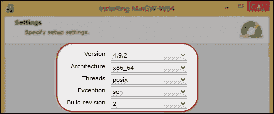
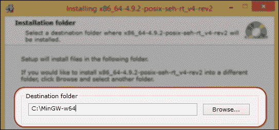
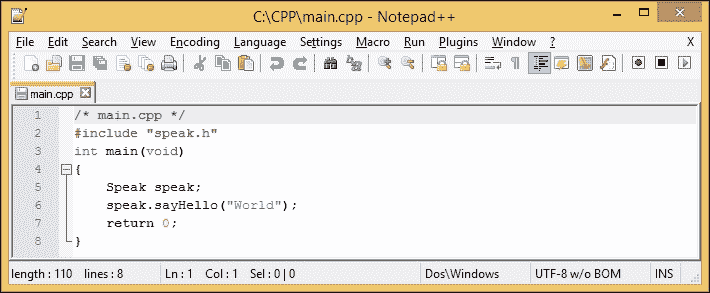
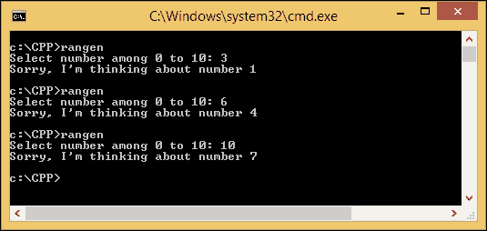
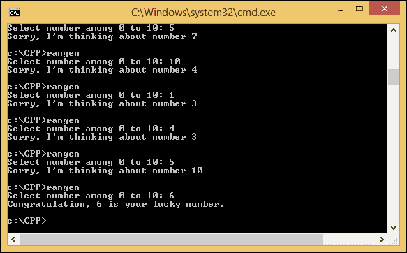
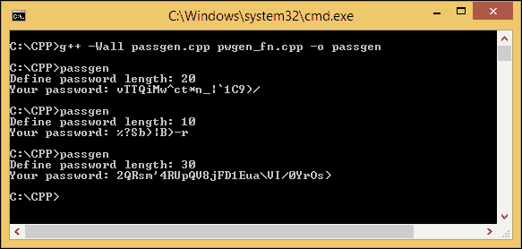
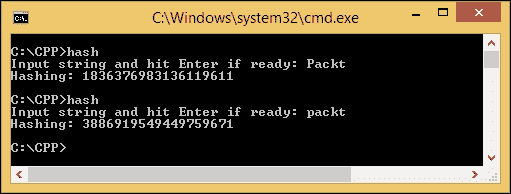

# 第一章。简化 C++中的网络编程

我们可以从网络上选择几个 C++编译器。为了让您更容易地跟随本书中的所有代码，我选择了一个可以使编程过程更简单的编译器——绝对是最简单的一个。在本章中，您将发现以下主题：

+   设置 MinGW 编译器

+   在 C++中编译

+   GCC C++中的故障排除

# 设置 MinGW 编译器和文本编辑器

这是最难的部分——我们必须在其他编译器中选择一个。尽管我意识到每个编译器都有其优势和劣势，但我想让你更容易地浏览本章中的所有代码。因此，我建议您应用与我们相同的环境，包括我们使用的编译器。

我将使用**GCC**，GNU 编译器集合，因为它被广泛使用的开源。由于我的环境包括 Microsoft Windows 作为操作系统，我将使用**Windows 的 Minimalistic GCC**（**MinGW**）作为我的 C++编译器。对于那些没有听说过 GCC 的人，它是一个可以在 Linux 操作系统中找到的 C/C++编译器，也包含在 Linux 发行版中。MinGW 是 GCC 在 Windows 环境中的一个移植。因此，本书中的整个代码和示例都适用于任何其他 GCC 版本。

## 安装 MinGW-w64

为了您的方便，由于我们使用 64 位 Windows 操作系统，我们选择了 MinGW-w64，因为它可以用于 Windows 32 位和 64 位架构。要安装它，只需打开您的互联网浏览器，导航到[`sourceforge.net/projects/mingw-w64/`](http://sourceforge.net/projects/mingw-w64/)，转到下载页面，然后点击**下载**按钮。等待片刻，直到`mingw-w64-install.exe`文件完全下载。请参考以下屏幕截图以找到**下载**按钮：


现在，执行安装程序文件。您将会看到一个**欢迎**对话框。只需按**下一步**按钮，进入**设置设置**对话框。在此对话框中，选择最新的 GCC 版本（在撰写本文时，是**4.9.2**），其余选项选择如下：



点击**下一步**按钮继续并进入安装位置选项。在这里，您可以更改默认安装位置。我将更改安装位置为`C:\MinGW-w64`，以便使我们的下一个设置更容易，但如果您愿意，也可以保留此默认位置。



点击**下一步**按钮，进入下一步，并等待片刻，直到文件下载和安装过程完成。

## 设置路径环境

现在您已经在计算机上安装了 C++编译器，但只能从其安装目录访问它。为了从系统中的任何目录访问编译器，您必须通过执行以下步骤设置**PATH 环境**：

1.  通过按*Windows* + *R*键以管理员身份运行命令提示符。在文本框中键入`cmd`，而不是按*Enter*键，按*Ctrl* + *Shift* + *Enter*以以管理员模式运行命令提示符。然后将出现**用户账户控制**对话框。选择**是**以确认您打算以管理员模式运行命令提示符。如果您正确执行此操作，您将获得一个标有**管理员：命令提示符**的标题栏。如果您没有获得它，您可能没有管理员权限。在这种情况下，您必须联系计算机的管理员。

1.  在管理员模式下的命令提示符中键入以下命令：

```cpp
    rundll32.exe sysdm.cpl,EditEnvironmentVariables

    ```

1.  按下*Enter*键，命令提示符将立即运行**环境变量**窗口。然后，转到**系统变量**，选择名为**Path**的变量，单击**编辑**按钮打开**编辑系统变量**对话框，然后在最后的**变量值**参数中添加以下字符串：

```cpp
    ;C:\MinGW-w64\mingw64\bin
    ```

（否则，如果您使用默认位置，安装向导中给出的安装目录路径将需要进行调整）

1.  单击**编辑系统变量**对话框中的**确定**按钮，然后在**环境变量**对话框中再次单击**确定**按钮以保存这些更改。

是时候尝试我们的环境变量设置了。在任何活动目录中打开一个新的命令提示符窗口，可以是管理员模式或非管理员模式，但不能是`C:\MinGW-w64`，然后输入以下命令：

```cpp
g++ --version

```

如果您看到输出通知您以下信息，那么您已经配置了正确的设置：

```cpp
g++ (x86_64-posix-seh-rev2, Built by MinGW-W64 project) 4.9.2

```

如果显示的是不同的版本号，您的计算机上可能有另一个 GCC 编译器。为了解决这个问题，您可以修改**环境变量**并删除与其他 GCC 编译器相关的所有路径环境设置，例如`C:\StrawberryPerl\c\bin`。

然而，如果您确信已经正确地按照所有步骤操作，但仍然收到错误消息，如下面的片段所示，您可能需要重新启动计算机以设置新的系统设置：

```cpp
'g++' is not recognized as an internal or external command, operable program or batch file.

```

## 选择和安装文本编辑器

Microsoft Windows 已经配备了**Notepad**，一个简单的文本编辑器，用于创建纯文本文件。您可以使用 Notepad 创建一个 C++文件，其中文件必须只包含纯文本格式。当您想要编辑代码时，您也可以转向重量级的**集成开发环境**（**IDE**），但我更喜欢一个简单、轻量级和可扩展的编程纯文本编辑器，因此我选择使用文本编辑器而不是 IDE。由于在编写代码时我需要语法高亮以使其更易于阅读和理解，我选择了**Notepad++**作为我们的文本编辑器。您可以选择您喜欢的文本编辑器，只要将输出文件保存为纯文本即可。以下是 Notepad++中语法高亮的示例：



如果您决定像我一样使用 Notepad++，您可以访问[`notepad-plus-plus.org/`](http://notepad-plus-plus.org/)获取最新版本的 Notepad++。在主页上找到**下载**菜单，选择当前版本链接。在那里，您将找到下载安装程序文件的链接。使用**Notepad++安装程序**文件而不是包文件，按照安装向导上的所有说明来设置它在您的计算机上的安装方式。


# 使用 GCC C++编译器

现在我们的开发准备好了，我们可以编写我们的第一个 C++程序。为了保持清洁，创建一个`CPP`文件夹在 C 盘（`C:\CPP`）中存储我们的示例代码。您可以在您的系统上具有相同的目录位置，以便更方便地按照所有步骤进行。否则，如果您决定使用不同的目录位置，您将需要进行一点修改。

## 编译 C++程序

我们不会为我们的第一个示例代码创建 Hello World!程序。在我看来，这很无聊，而且到目前为止，您应该已经知道如何编写 Hello World!程序了。我们将创建一个简单的随机数生成器。您可以使用这个程序和朋友一起玩。他们必须猜测程序将显示哪个数字。如果答案不正确，您可以用记号划掉他/她的脸，并继续玩下去，直到您无法再认出您朋友的脸为止。以下是创建此生成器的代码：

```cpp
/* rangen.cpp */
#include <cstdlib>
#include <iostream>
#include <ctime>
int main(void) {
  int guessNumber;
  std::cout << "Select number among 0 to 10:";
  std::cin >> guessNumber;
  if(guessNumber < 0 || guessNumber > 10) {
    return 1;
  }
  std::srand(std::time(0));
  int randomNumber = (std::rand() % (10 + 1));
  if(guessNumber == randomNumber) {
    std::cout << "Congratulation, " <<guessNumber<<" is your lucky number.\n";
  }
  else {
    std::cout << "Sorry, I'm thinking about number \n" << randomNumber;
  }
  return 0;
}
```

在文本编辑器中输入代码，并将其保存为文件名为`rangen.cpp`的文件，保存在`C:\CPP`位置。然后，打开命令提示符，并通过在命令提示符中输入以下命令将活动目录指向`C:\CPP`位置：

```cpp
cd C:\CPP

```

接下来，在控制台中输入以下命令来编译代码：

```cpp
g++ -Wall rangen.cpp -o rangen

```

上述命令使用可执行文件`rangen.exe`编译`rangen.cpp`文件，其中包含一堆机器代码（`exe`扩展名会自动添加以指示该文件是 Microsoft Windows 中的可执行文件）。使用`-o`选项指定机器代码的输出文件。如果使用此选项，必须同时指定输出文件的名称；否则，编译器将报告缺少文件名的错误。如果省略`-o`选项和输出文件的文件名，输出将写入默认文件`a.exe`。

### 提示

当前目录中具有与已编译源文件相同名称的可执行文件将被覆盖。

我建议您使用`-Wall`选项并养成习惯，因为此选项将打开所有最常用的编译器警告。如果禁用此选项，GCC 将不会给出任何警告。因为我们的随机数生成器代码是完全有效的，所以在编译时 GCC 不会给出任何警告。这就是为什么我们依赖于编译器警告来确保我们的代码是有效的并且编译干净的原因。

要运行程序，在控制台中输入`rangen`，并将`C:\CPP`位置作为活动目录，将显示欢迎词：**在 0 到 10 之间选择数字**。按照指示选择`0`到`10`之间的数字。然后，按下*Enter*，程序将输出一个数字。将其与你自己的数字进行比较。如果两个数字相同，你将受到祝贺。然而，如果你选择的数字与代码生成的数字不同，你将得到相同的通知。程序的输出将如下截图所示：



很遗憾，我在三次尝试中从未猜对正确的数字。事实上，即使每次生成数字时都使用新的种子，也很难猜到`rand()`函数生成了哪个数字。为了减少混乱，我将会解析`rangen.cpp`代码，如下所示：

```cpp
int guessNumber;
std::cout << "Select number among 0 to 10: ";
std::cin >> guessNumber;

```

我保留了一个名为`guessNumber`的变量来存储用户输入的整数，并使用`std::cin`命令从控制台获取输入的数字。

```cpp
if(guessNumber < 0 || guessNumber > 10) {
 return 1;
}

```

如果用户给出超出范围的数字，通知操作系统程序中发生了错误——我发送了错误 1，但实际上，你可以发送任何数字——并让它处理错误。

```cpp
std::srand(std::time(0));
int randomNumber = (std::rand() % (10 + 1);

```

`std::srand`函数用于初始化种子，为了在每次调用`std::rand()`函数时生成不同的随机数，我们使用`ctime`头文件中的`std::time(0)`函数。为了生成一系列随机数，我们使用`模数`方法，如果调用`std::rand() % n`这样的函数，将生成一个从 0 到(n-1)的随机数。如果要包括数字*n*，只需将*n*与`1`相加。

```cpp
if(guessNumber == randomNumber) {
 std::cout << "Congratulation ,"<< guessNumber<<" is your lucky number.\n";
}
else {
 std::cout << "Sorry, I'm thinking about number " << randomNumber << "\n";
}

```

这是有趣的部分，程序将用户猜测的数字与生成的随机数字进行比较。无论发生什么，用户都将通过程序得到结果的通知。让我们看看以下代码：

```cpp
return 0;

```

返回`0`告诉操作系统程序已正常终止，无需担心。让我们看看以下代码：

```cpp
#include <cstdlib>
#include <iostream>
#include <ctime>

```

不要忘记在上述代码中包含前三个头文件，因为它们包含了我们在此程序中使用的函数，例如`time()`函数在`<ctime>`头文件中定义，`srand()`函数和`rand()`函数在`<cstdlib>`头文件中定义，`cout()`和`cin()`函数在`<iostream>`头文件中定义。

如果您发现很难猜出程序生成的数字，那是因为我们使用当前时间作为随机生成器种子，这样做的结果是每次调用程序时生成的数字都会不同。以下是我在大约六到七次尝试后成功猜出生成的随机数的屏幕截图（对于所有程序调用，我们都猜错了数字，除了最后一次尝试）：



## 编译多个源文件

有时，当代码存在错误或 bug 时，我们必须修改我们的代码。如果我们只制作一个包含所有代码行的单个文件，当我们想要修改源代码时，我们会感到困惑，或者我们很难理解程序的流程。为了解决这个问题，我们可以将代码拆分成多个文件，每个文件只包含两到三个函数，这样就容易理解和维护了。

我们已经能够生成随机数，现在，让我们来看一下密码生成器程序。我们将使用它来尝试编译多个源文件。我将创建三个文件来演示如何编译多个源文件，它们是`pwgen_fn.h`、`pwgen_fn.cpp`和`passgen.cpp`。我们将从`pwgen_fn.h`文件开始，其代码如下：

```cpp
/* pwgen_fn.h */
#include <string>
#include <cstdlib>
#include <ctime>
class PasswordGenerator {
  public:
    std::string Generate(int);
};
```

前面的代码用于声明类名。在本例中，类名为`PasswordGenerator`，在这种情况下，它将生成密码，而实现存储在`.cpp`文件中。以下是`pwgen_fn.cpp`文件的清单，其中包含`Generate()`函数的实现：

```cpp
/* pwgen_fn.cpp */
#include "pwgen_fn.h"
std::string PasswordGenerator::Generate(int passwordLength) {
  int randomNumber;
  std::string password;
  std::srand(std::time(0));
  for(int i=0; i < passwordLength; i++) {
    randomNumber = std::rand() % 94 + 33;
    password += (char) randomNumber;
  }
  return password;
}
```

主入口文件`passgen.cpp`包含使用`PasswordGenerator`类的程序：

```cpp
/* passgen.cpp */
#include <iostream>
#include "pwgen_fn.h"
int main(void) {
  int passLen;
  std::cout << "Define password length: ";
  std::cin >> passLen;
  PasswordGenerator pg;
  std::string password = pg.Generate(passLen);
  std::cout << "Your password: "<< password << "\n";
  return 0;
}
```

从前面的三个源文件中，我们将生成一个单独的可执行文件。为此，请转到命令提示符并在其中输入以下命令：

```cpp
g++ -Wall passgen.cpp pwgen_fn.cpp -o passgen

```

我没有收到任何警告或错误，所以你也不应该收到。前面的命令编译了`passgen.cpp`和`pwgen_fn.cpp`文件，然后将它们链接到一个名为`passgen.exe`的单个可执行文件中。`pwgen_fn.h`文件，因为它是与源文件同名的头文件，所以在命令中不需要声明相同的名称。

如果您在控制台窗口中键入`passgen`命令运行程序，您将每次运行程序时都会得到不同的密码。



现在，是时候我们来剖析前面的源代码了。我们将从`pwgen_fn.h`文件开始，该文件仅包含函数声明，如下所示：

```cpp
std::string Generate(int);

```

从声明中可以看出，`Generate()`函数将具有`int`类型的参数，并将返回`std::string`函数。由于参数将自动与源文件匹配，因此在头文件中我们不定义参数的名称。

打开`pwgen_fn.cpp`文件，看以下语句：

```cpp
std::string PasswordGenerator::Generate(int passwordLength)

```

在这里，我们可以指定参数名称，即`passwordLength`。在这种情况下，只要它们位于不同的类中，我们可以拥有两个或更多具有相同名称的函数。让我们看一下以下代码：

```cpp
int randomNumber;
std::string password;

```

我保留了名为`randomNumber`的变量来存储由`rand()`函数生成的随机数，以及`password`参数来存储从随机数转换的 ASCII。让我们看一下以下代码：

```cpp
std::srand(std::time(0));

```

种子随机`srand()`函数与我们在先前的代码中使用的相同，用于生成随机种子。我们使用它是为了在每次调用`rand()`函数时产生不同的数字。让我们看一下以下代码：

```cpp
for(int i=0; i < passwordLength; i++) {
 randomNumber = std::rand() % 94 + 33;
 password += (char) randomNumber;
}
return password;

```

`for`迭代取决于用户定义的`passwordLength`参数。通过随机数生成器语句`std::rand() % 94 + 33`，我们可以生成表示 ASCII 可打印字符的数字，其代码范围从 33 到 126。有关 ASCII 代码表的更详细信息，您可以访问[`en.wikipedia.org/wiki/ASCII`](http://en.wikipedia.org/wiki/ASCII)。让我们看一下以下代码：

```cpp
#include "pwgen_fn.h"

```

`#include`头文件的单行将调用`pwgen_fn.h`文件中包含的所有头文件，因此我们不需要在此源文件中声明包含的头文件。

```cpp
#include <string>
#include <cstdlib>
#include <ctime>

```

现在，我们转到我们的主要入口代码，存储在`passgen.cpp`文件中：

```cpp
int passLen;
std::cout << "Define password length: ";
std::cin >> passLen;

```

首先，用户决定要拥有多长的密码，并且程序将其存储在`passLen`变量中：

```cpp
PasswordGenerator pg;
std::string password = pg.Generate(passLen);
std::cout << "Your password: "<< password << "\n";

```

然后，程序实例化`PasswordGenerator`类并调用`Generate()`函数来生成用户之前定义的长度的密码。

如果您再次查看`passgen.cpp`文件，您会发现`#include <iostream>`（带有尖括号）和`#include "pwgen_fn.h"`（带有引号）两种形式的包含语句之间存在差异。通过在`#include`头语句中使用尖括号，编译器将查找系统头文件目录，但默认情况下不会查找当前目录。通过在`#include`头语句中使用引号，编译器将在查找系统头文件目录之前在当前目录中搜索头文件。

## 分别编译和链接程序

我们可以将一个大型程序分解为一组源文件并分别编译它们。假设我们有许多小文件，我们只想编辑其中一个文件中的一行，如果我们编译所有文件，而我们只需要修改一个文件，那将是非常耗时的。

通过使用`-c`选项，我们可以编译单独的源代码以生成具有`.o`扩展名的目标文件。在第一阶段，文件被编译而不创建可执行文件。然后，在第二阶段，目标文件由一个名为链接器的单独程序链接在一起。链接器将所有目标文件组合在一起，创建一个单一的可执行文件。使用之前的`passgen.cpp`，`pwgen_fn.cpp`和`pwgen_fn.h`源文件，我们将尝试创建两个目标文件，然后将它们链接在一起以生成一个单一的可执行文件。使用以下两个命令来执行相同的操作：

```cpp
g++ -Wall -c passgen.cpp pwgen_fn.cpp
g++ -Wall passgen.o pwgen_fn.o -o passgen

```

第一个命令使用`-c`选项将创建两个具有与源文件名相同但具有不同扩展名的目标文件。第二个命令将将它们链接在一起，并生成具有在`-o`选项之后指定的名称的输出可执行文件，即`passgen.exe`文件。

如果您需要编辑`passgen.cpp`文件而不触及其他两个文件，您只需要编译`passgen.cpp`文件，如下所示：

```cpp
g++ -Wall -c passgen.cpp

```

然后，您需要像前面的第二个命令一样运行链接命令。

## 检测 C++程序中的警告

正如我们之前讨论的，编译器警告是确保代码有效性的重要辅助工具。现在，我们将尝试从我们创建的代码中找到错误。这是一个包含未初始化变量的 C++代码，这将给我们一个不可预测的结果：

```cpp
/* warning.cpp */
#include <iostream>
#include <string>
int main (void) {
  std::string name;
  int age;
  std::cout << "Hi " << name << ", your age is " << age << "\n";
}
```

然后，我们将运行以下命令来编译前面的`warning.cpp`代码：

```cpp
g++ -Wall -c warning.cpp

```

有时，我们无法检测到这个错误，因为一开始并不明显。但是，通过启用`-Wall`选项，我们可以防止错误，因为如果我们使用警告选项编译前面的代码，编译器将产生警告消息，如下面的代码所示：

```cpp
warning.cpp: In function 'int main()':
warning.cpp:7:52: warning: 'age' may be used uninitialized in this function [-Wmaybe-uninitialized]
std::cout << "Hi " << name << ", your age is " << age << "\n";]

```

警告消息说`age`变量在`warning.cpp`文件的第 7 行，第 52 列未初始化。GCC 生成的消息始终具有**file:line-number:column-number:error-type:message**的形式。错误类型区分了阻止成功编译的错误消息和指示可能问题的警告消息（但不会阻止程序编译）。

显然，开发程序而不检查编译器警告是非常危险的。如果有任何未正确使用的函数，它们可能会导致程序崩溃或产生不正确的结果。打开编译器警告选项后，`-Wall`选项会捕获 C++编程中发生的许多常见错误。

# 在 GCC C++编译器中了解其他重要选项

GCC 在 4.9.2 版本中支持**ISO C++ 1998**、**C++ 2003**和**C++ 2011**标准。在 GCC 中选择此标准是使用以下选项之一：`-ansi`、`-std=c++98`、`-std=c++03`或`–std=c++11`。让我们看看以下代码，并将其命名为`hash.cpp`：

```cpp
/* hash.cpp */
#include <iostream>
#include <functional>
#include <string>
int main(void) {
  std::string plainText = "";
  std::cout << "Input string and hit Enter if ready: ";
  std::cin >> plainText;
  std::hash<std::string> hashFunc;
  size_t hashText = hashFunc(plainText);
  std::cout << "Hashing: " << hashText << "\n";
  return 0;
}
```

如果编译并运行程序，它将为每个纯文本用户输入给出一个哈希数。然而，编译上述代码有点棘手。我们必须定义要使用的 ISO 标准。让我们看看以下五个编译命令，并在命令提示符窗口中逐个尝试它们：

```cpp
g++ -Wall hash.cpp -o hash
g++ -Wall -ansi hash.cpp -o hash
g++ -Wall -std=c++98 hash.cpp -o hash
g++ -Wall -std=c++03 hash.cpp -o hash
g++ -Wall -std=c++11 hash.cpp -o hash

```

当我们运行前面的四个编译命令时，应该会得到以下错误消息：

```cpp
hash.cpp: In function 'int main()':
hash.cpp:10:2: error: 'hash' is not a member of 'std'
 std::hash<std::string> hashFunc;
hash.cpp:10:23: error: expected primary-expression before '>' token
 std::hash<std::string> hashFunc;
hash.cpp:10:25: error: 'hashFunc' was not declared in this scope
 std::hash<std::string> hashFunc;

```

它说`std`类中没有`hash`。实际上，自 C++ 2011 以来，头文件`<string>`中已经定义了哈希。为了解决这个问题，我们可以运行上述最后一个编译命令，如果不再抛出错误，那么我们可以在控制台窗口中输入`hash`来运行程序。



如您在前面的屏幕截图中所见，我调用了程序两次，并将**Packt**和**packt**作为输入。尽管我只改变了一个字符，但整个哈希值发生了巨大变化。这就是为什么哈希用于检测数据或文件的任何更改，以确保数据没有被更改。

有关 GCC 中可用的 ISO C++11 功能的更多信息，请访问[`gcc.gnu.org/projects/cxx0x.html`](http://gcc.gnu.org/projects/cxx0x.html)。要获得标准所需的所有诊断，还应指定`-pedantic`选项（或`-pedantic-errors`选项，如果您希望将警告作为错误处理）。

### 注意

`-ansi`选项本身不会导致非 ISO 程序被毫无根据地拒绝。为此，还需要`-ansi`选项以及`-pedantic`选项或`-pedantic-errors`选项。

# GCC C++编译器中的故障排除

GCC 提供了几个帮助和诊断选项，以帮助解决编译过程中的问题。您可以使用的选项来简化故障排除过程在接下来的部分中进行了解。

## 命令行选项的帮助

使用`help`选项获取 GCC 命令行选项的摘要。命令如下：

```cpp
g++ --help

```

要显示 GCC 及其关联程序（如 GNU 链接器和 GNU 汇编器）的完整选项列表，请使用前面的`help`选项和详细（`-v`）选项：

```cpp
g++ -v --help

```

由上述命令生成的选项的完整列表非常长-您可能希望使用`more`命令查看它，或将输出重定向到文件以供参考，如下所示：

```cpp
g++ -v --help 2>&1 | more

```

## 版本号

您可以使用`version`选项找到已安装的 GCC 版本号，如下所示：

```cpp
g++ --version

```

在我的系统中，如果运行上述命令，将会得到如下输出：

```cpp
g++ (x86_64-posix-seh-rev2, Built by MinGW-W64 project) 4.9.2

```

这取决于您在安装过程中调整的设置。

版本号在调查编译问题时非常重要，因为较旧版本的 GCC 可能缺少程序使用的某些功能。版本号采用`major-version.minor-version`或`major-version.minor-version.micro-version`的形式，其中额外的第三个“micro”版本号（如前述命令中所示）用于发布系列中随后的错误修复版本。

## 详细编译

`-v`选项还可以用于显示关于用于编译和链接程序的确切命令序列的详细信息。以下是一个示例，展示了`hello.cpp`程序的详细编译过程：

```cpp
g++ -v -Wall rangen.cpp

```

之后，在控制台中会得到类似以下内容：

```cpp
Using built-in specs.
COLLECT_GCC=g++
COLLECT_LTO_WRAPPER=C:/mingw-w64/bin/../libexec/gcc/x86_64-w64-mingw32/4.9.2/lto-wrapper.exe
Target: x86_64-w64-mingw32
Configured with: ../../../src/gcc-4.9.2/configure –
...Thread model: posix
gcc version 4.9.2 (x86_64-posix-seh-rev2, Built by MinGW-W64 project)
...

```

使用`-v`选项生成的输出在编译过程中出现问题时非常有用。它显示用于搜索头文件和库的完整目录路径，预定义的预处理器符号，以及用于链接的目标文件和库。

# 总结

我们成功准备了 C++编译器，并且您学会了如何使用编译器编译您创建的源代码文件。在编译源代码时，请不要忘记每次都使用`-Wall`（警告所有）选项，因为避免警告和细微错误非常重要。此外，使用`-ansi`和`-pedantic`选项也很重要，这样您的源代码就能够在任何编译器中编译，因为它将检查 ANSI 标准并拒绝非 ISO 程序。

现在，我们可以进入下一章学习网络概念，以便您能够理解网络架构，从而简化您的网络应用程序编程过程。
