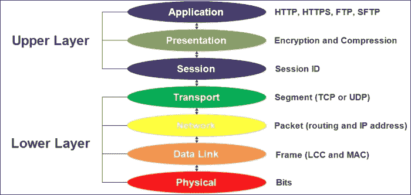
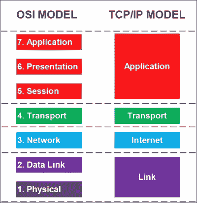
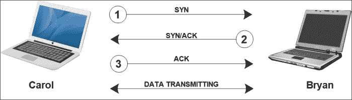
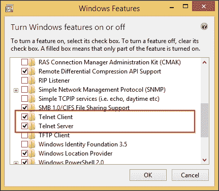

# 第二章：理解网络概念

在我们开始编写网络应用程序之前，最好先了解一下网络是如何工作的。在本章中，我们将探讨网络概念及其内容。本章将涵盖的主题如下：

+   区分 OSI 模型和 TCP/IP 模型

+   探索 IPv4 和 IPv6 中的 IP 地址

+   使用各种工具排除 TCP/IP 问题

# 网络系统简介

网络架构是由层和协议构成的。架构中的每个**层**都有自己的作用，其主要目的是向更高层提供某种服务，并与相邻的层进行通信。然而，**协议**是一组规则和约定，被所有通信方使用以标准化通信过程。例如，当设备中的*n*层与另一个设备中的*n*层进行通信时，为了进行通信，它们必须使用相同的协议。

如今有两种流行的网络架构：**开放系统互连**（**OSI**）和**TCP/IP**参考模型。我们将深入了解每个参考模型及其优缺点，以便决定在我们的网络应用程序中应该使用哪种模型。

## OSI 参考模型

OSI 模型用于连接到开放系统-这些系统是开放的，并与其他系统通信。通过使用这个模型，我们不再依赖于操作系统，因此可以与任何计算机上的任何操作系统进行通信。这个模型包含七个层，每个层都有特定的功能，并定义了数据在不同层上的处理方式。包含在这个模型中的七个层分别是**物理层**、**数据链路层**、**网络层**、**传输层**、**会话层**、**表示层**和**应用层**。

### 物理层

这是 OSI 模型中的第一层，包含了网络的物理规范的定义，包括物理介质（电缆和连接器）和基本设备（中继器和集线器）。该层负责将输入的原始比特传输数据流转换为零，并将位于通信通道上的数据。然后将数据放置到物理介质上。它关注数据传输的完整性，并确保从一个设备发送的比特与另一个设备接收到的数据完全相同。

### 数据链路层

数据链路层的主要作用是提供原始数据传输的链路。在数据传输之前，它将数据分成数据帧，并连续传输数据帧。如果服务是可靠的，接收方将为每个已发送的帧发送一个*确认帧*。

这一层包括两个子层：**逻辑链路控制**（**LLC**）和**媒体访问控制**（**MAC**）。LLC 子层负责传输错误检查和帧传输，而 MAC 子层定义了如何从物理介质中检索数据或将数据存储在物理介质中。

我们还可以在这一层找到 MAC 地址，也称为**物理地址**。MAC 地址用于识别连接到网络的每个设备，因为每个设备的 MAC 地址都是唯一的。通过命令提示符，我们可以通过在控制台窗口中输入以下命令来获取地址：

```cpp
ipconfig /all

```

我们将得到控制台输出，如下所示，忽略除**Windows IP Configuration**和**无线局域网适配器 Wi-Fi**之外的所有其他信息。我们可以在**物理地址**部分找到 MAC 地址，对于我的环境来说是**80-19-34-CB-BF-FB**。由于 MAC 地址对每个设备都是唯一的，您将得到不同的结果：

```cpp
Windows IP Configuration

 Host Name . . . . . . . . . . . . : HOST1
 Primary Dns Suffix  . . . . . . . :
 Node Type . . . . . . . . . . . . : Hybrid
 IP Routing Enabled. . . . . . . . : No
 WINS Proxy Enabled. . . . . . . . : No

Wireless LAN adapter Wi-Fi:
 Connection-specific DNS Suffix  . :
 Description . . . . . . . . . . . : Intel(R) Wireless-N 7260
 Physical Address. . . . . . . . . : 80-19-34-CB-BF-FB
 DHCP Enabled. . . . . . . . . . . : Yes
 Autoconfiguration Enabled . . . . : Yes
 Link-local IPv6 Address . . . . . : fe80::f14e:d5e6:aa0a:5855%3 (Preferred)
 IPv4 Address. . . . . . . . . . . : 192.168.1.4(Preferred)
 Subnet Mask . . . . . . . . . . . : 255.255.255.0
 Default Gateway . . . . . . . . . : 192.168.1.254
 DHCP Server . . . . . . . . . . . : 192.168.1.254
 DHCPv6 IAID . . . . . . . . . . . : 58726708
 DHCPv6 Client DUID. . . . . . . . : 00-01-00-01-1C-89-E6-3E-68-F7- 28-1E-61-66
 DNS Servers . . . . . . . . . . . : 192.168.1.254
 NetBIOS over Tcpip. . . . . . . . : Enabled

```

MAC 地址包含十二个十六进制字符，其中两个数字成对出现。前六位数字代表组织唯一标识符，剩下的数字代表制造商序列号。如果你真的很好奇想知道这个数字的含义，你可以去[www.macvendorlookup.com](http://www.macvendorlookup.com)并在文本框中填写我们的 MAC 地址以了解更多信息。在我的系统中，我得到了英特尔公司作为供应商公司名称，这与我安装的网络卡品牌相同。

### 网络层

网络层负责定义从源到目的地设备的数据包的最佳路由方式。它将使用**Internet 协议**（**IP**）作为路由协议生成路由表，并使用 IP 地址确保数据到达所需目的地的路由。如今有两个版本的 IP：**IPv4**和**IPv6**。在 IPv4 中，我们使用 32 位地址来寻址协议，在 IPv6 中使用 128 位地址。您将在下一个主题中了解更多关于 Internet 协议、IPv4 和 IPv6 的信息。

### 传输层

传输层负责将数据从源传输到目的地。它将数据分割成较小的部分，或在这种情况下称为**段**，然后将所有段连接起来，将数据恢复到目的地的初始形式。

在这一层中有两种主要的协议：**传输控制协议**（**TCP**）和**用户数据报协议**（**UDP**）。TCP 通过建立会话来提供数据传输。在建立会话之前，数据不会被传输。TCP 也被称为**面向连接的协议**，这意味着在传输数据之前必须建立会话。UDP 是一种尽最大努力传输数据的方法，但不提供保证的传输，因为它不建立会话。因此，UDP 也被称为**无连接的协议**。关于 TCP 和 UDP 的深入解释可以在下一个主题中找到。

### 传输层

会话层负责建立、维护和终止会话。我们可以将会话类比为网络上两个设备之间的连接。例如，如果我们想要从一台计算机向另一台计算机发送文件，这一层将在发送文件之前首先建立连接。然后，这一层将确保连接仍然保持到文件完全发送。最后，如果不再需要，这一层将终止连接。我们谈论的连接就是会话。

这一层还确保来自不同应用程序的数据不会互相交换。例如，如果我们同时运行互联网浏览器、聊天应用程序和下载管理器，这一层将负责为每个应用程序建立会话，并确保它们与其他应用程序保持分离。

这一层使用了三种通信方法：**单工**，**半双工**或**全双工**方法。在单工方法中，数据只能由一方传输，因此另一方无法传输任何数据。由于我们需要可以相互交互的应用程序，这种方法已经不再常用。在半双工方法中，任何数据都可以传输到所有涉及的设备，但只有一个设备可以在某个时间传输数据，完成发送过程后，其他设备也可以发送和传输数据。全双工方法可以同时向所有设备传输数据。为了发送和接收数据，这种方法使用不同的路径。

### 表示层

表示层的作用是确定已发送的数据，将数据转换为适当的格式，然后呈现出来。例如，我们通过网络发送一个 MP3 文件，文件被分成几个段。然后，使用段上的头信息，这一层将通过翻译段来构建文件。

此外，这一层负责数据压缩和解压缩，因为所有在互联网上传输的数据都经过压缩以节省带宽。这一层还负责数据加密和解密，以确保两个设备之间的通信安全。

### 应用层

应用层处理用户使用的计算机应用程序。只有连接到网络的应用程序才会连接到这一层。这一层包含用户需要的几个协议，如下所示：

+   **域名系统**（**DNS**）：这个协议是用来找到 IP 地址的主机名的。有了这个系统，我们不再需要记住每个 IP 地址，只需要记住主机名。我们可以更容易地记住主机名中的单词，而不是 IP 地址中的一堆数字。

+   **超文本传输协议**（**HTTP**）：这个协议用于在网页上在互联网上传输数据。我们还有 HTTPS 格式，用于发送加密数据以解决安全问题。

+   **文件传输协议**（**FTP**）：这个协议用于从 FTP 服务器传输文件或到 FTP 服务器传输文件。

+   **简单文件传输协议**（**TFTP**）：这个协议类似于 FTP，用于发送较小的文件。

+   **动态主机配置协议**（**DHCP**）：这个协议是用于动态分配 TCP/IP 配置的方法。

+   **邮局协议**（**POP3**）：这个协议是用于从 POP3 服务器获取电子邮件的电子邮件协议。服务器通常由**互联网服务提供商**（**ISP**）托管。

+   **简单邮件传输协议**（**SMTP**）：这个协议与 POP3 相反，用于发送电子邮件。

+   **互联网消息访问协议**（**IMAP**）：这个协议用于接收电子邮件。使用这个协议，用户可以将他们的电子邮件消息保存在本地计算机上的文件夹中。

+   **简单网络管理协议**（**SNMP**）：这个协议用于管理网络设备（路由器和交换机）并在问题变得重大之前检测并报告问题。

+   **服务器消息块**（**SMB**）：这个协议是主要用于文件和打印机共享的 Microsoft 网络上的 FTP。

这一层还决定了是否有足够的网络资源可供网络访问。例如，如果您想使用互联网浏览器上网，应用层会决定是否可以使用 HTTP 访问互联网。

让我们看下面的图，看看 OSI 层中包含了哪些协议：



我们可以将所有七层分为两个部分层：**上层**和**下层**。上层负责与用户交互，对低级细节不太关心，而下层负责在网络上传输数据，如格式化和编码。

每一层传输的数据格式都不同。物理层有比特，数据链路层有帧，依此类推。

## TCP/IP 参考模型

TCP/IP 模型是在 OSI 模型之前创建的。这个模型的工作方式与 OSI 模型类似，只是它只包含四层。TCP/IP 模型的每一层对应于 OSI 模型的层。TCP/IP 应用层映射 OSI 模型的第 5、6 和 7 层。TCP/IP 传输层映射 OSI 模型的第 4 层。TCP/IP 互联网层映射 OSI 模型的第 3 层。TCP/IP 链路层映射 OSI 模型的第 1 和 2 层。让我们看下图以了解更多细节：



这些是 TCP/IP 模型中每个层的主要作用：

+   链路层负责确定在数据传输过程中使用的协议和物理设备。

+   互联网层负责通过寻址数据包确定最佳的数据传输路由。

+   传输层负责建立两个设备之间的通信并发送数据包。

+   应用层负责为计算机上运行的应用程序提供服务。由于缺少会话和表示层，应用程序必须包含任何所需的会话和表示功能。

以下是涉及 TCP/IP 模型的协议和设备：

| 层 | 协议 | 设备 |
| --- | --- | --- |
| 应用 | HTTP、HTTPS、SMTP、POP3 和 DNS | 代理服务器和防火墙 |
| 传输 | TCP 和 UDP | - |
| 互联网 | IP 和 ICMP | 路由器 |
| 链路 | 以太网、令牌环和帧中继 | 集线器、调制解调器和中继器 |

# 理解 TCP 和 UDP

正如我们在本章的*传输层*部分中讨论的那样，TCP 和 UDP 是用于在网络中传输数据的主要协议。它们的传输机制彼此不同。TCP 在传输数据过程中提供了确认、序列号和流量控制以提供可靠的传输，而 UDP 不提供可靠的传输，但尽最大努力提供传输。

## 传输控制协议

在协议建立会话之前，TCP 执行三次握手过程。这是为了提供可靠的传输。请参考下图了解三次握手过程：



从上图中可以想象，Carol 的设备想要向 Bryan 的设备传输数据，并且它们需要执行三次握手过程。首先，Carol 的设备发送一个带有**同步**（SYN）标志的数据包到 Bryan 的设备。一旦 Bryan 的设备接收到数据包，它会回复发送另一个带有 SYN 和**确认**（ACK）标志的数据包。最后，Carol 的设备通过发送一个带有 ACK 标志的第三个数据包完成握手过程。现在，两个设备都建立了会话，并确保对方正在工作。会话建立后，数据传输就准备好进行了。

### 提示

在安全领域，我们知道“SYN-Flood”这个术语，它是一种拒绝服务攻击，攻击者向目标系统发送一系列 SYN 请求，试图消耗足够的服务器资源使系统对合法流量无响应。攻击者只发送 SYN 而不发送预期的 ACK，导致服务器向伪造的 IP 地址发送 SYN-ACK，而伪造的 IP 地址不会发送 ACK，因为它“知道”它从未发送过 SYN。

TCP 还将数据分割成较小的段，并使用序列号来跟踪这些段。每个分离的段被分配不同的序列号，比如 1 到 20。目标设备接收每个段，并使用序列号根据序列的顺序重新组装文件。

例如，假设 Carol 想要从 Bryan 的设备下载一个 JPEG 图像文件。在进行三次握手的过程中建立会话后，两个设备确定单个段的大小以及在确认之间需要发送多少个段。可以同时发送的段的总数称为 TCP 滑动窗口。如果在传输过程中有一个位损坏或丢失，段中的数据将不再有效。TCP 使用循环冗余检查（CRC）来识别损坏或丢失的数据，通过验证每个段中的数据是否完整。如果传输中有任何损坏或丢失的段，Carol 的设备将发送一个负确认（NACK）数据包，然后请求损坏或丢失的段；否则，Carol 的设备将发送一个 ACK 数据包并请求下一个段。

## 用户数据报协议

UDP 在发送数据之前不执行任何握手过程。它只是直接将数据发送到目标设备；但是，它会尽最大努力转发消息。想象一下，我们正在等待朋友的消息。我们打电话给他/她来接收我们的消息。如果我们的电话没有接听，我们可以发送电子邮件或短信通知我们的朋友。如果我们的朋友没有回复我们的电子邮件或短信，我们可以发送常规电子邮件。然而，我们讨论的所有技术都不能保证我们的消息已被接收。但是，我们仍然尽最大努力转发消息，直到成功为止。我们在发送电子邮件的类比中的最大努力类似于 UDP 的最大努力术语。它将尽最大努力确保接收方接收到数据，即使不能保证数据已被接收。

那么，为什么即使 UDP 不可靠也会使用它呢？有时我们需要进行快速数据传输的通信，即使有一点数据损坏也可以。例如，流媒体音频、流媒体视频和 VoIP 使用 UDP 来确保它们具有快速的数据传输速度。尽管 UDP 可能会丢失数据包，我们仍然能够清晰地接收所有消息。

然而，尽管 UDP 在传输数据之前不检查连接，但它实际上使用校验和来验证数据。校验和可以通过比较校验和值来检查接收到的数据是否被更改。

## 理解端口

在计算机网络中，端口是发送或接收数据的端点。端口通过其端口号来识别，其中包含一个 16 位数字。逻辑端口号被 TCP 和 UDP 用来跟踪数据包的内容，并在设备接收到数据时帮助 TCP/IP 获取将处理数据的应用程序或服务的数据包。

TCP 端口总共有 65536 个，UDP 端口也有 65536 个。我们可以将 TCP 端口分为三个端口范围，分别是：

+   从 0 到 1023 的众所周知的端口是由 IANA 注册的，用于与特定协议或应用程序相关联。

+   从 1024 到 49151 的注册端口是由 IANA 注册的，用于特定协议，但在此范围内未使用的端口可以由计算机应用程序分配。

+   从 49152 到 65535 的动态端口是未注册的端口，可以用于任何目的。

### 注意

要获取有关 TCP 和 UDP 中所有端口的更多详细信息，可以访问[en.wikipedia.org/wiki/List_of_TCP_and_UDP_port_numbers](http://en.wikipedia.org/wiki/List_of_TCP_and_UDP_port_numbers)。此外，要了解所有已由 IANA 注册的已分配端口，请访问[www.iana.org/assignments/port-numbers](http://www.iana.org/assignments/port-numbers)。

要理解端口的概念，可以考虑我们的计算机上安装了电子邮件客户端，如 Thunderbird 或 Microsoft Outlook。现在，我们想要将电子邮件发送到 Gmail 服务器，然后从服务器上获取所有传入的电子邮件并将其保存在我们的本地计算机上。发送电子邮件的步骤如下：

1.  我们的计算机会分配一个随机未使用的端口号，比如`48127`，用来将电子邮件发送到 Gmail SMTP 服务器的端口`25`。

1.  当电子邮件到达 SMTP 服务器时，它会识别数据来自端口`25`，然后将数据转发到处理该服务的 SMTP。

1.  一旦电子邮件被接收，服务器会将确认发送到我们计算机上的端口`48127`，以通知计算机已经接收到电子邮件。

1.  在我们的计算机完全接收到来自端口`48127`的确认后，它会将电子邮件发送到电子邮件客户端，然后电子邮件客户端将电子邮件从发件箱移动到已发送文件夹。

与发送电子邮件的步骤类似，要接收电子邮件，我们必须处理一个端口。接收电子邮件的步骤如下：

1.  我们的计算机会分配一个随机未使用的端口号，比如`48128`，用来向 Gmail POP3 服务器发送请求到端口`110`。

1.  当电子邮件到达 POP3 服务器时，它会识别数据来自端口`110`，然后将数据转发到处理该服务的 POP3。

1.  然后，POP3 服务器会在端口`48128`向我们的计算机发送电子邮件。

1.  在我们的计算机从端口`48128`接收到电子邮件后，它会将电子邮件发送到我们的电子邮件客户端，然后将其移动到收件箱文件夹。它还会自动将邮件保存到本地计算机。

# 探索 Internet 协议

IP 是一种主要的通信协议，用于在网络上传递数据报。数据报本身是与分组交换网络相关联的传输单元。IP 的作用是根据数据包头部中指定的 IP 地址，从主机传递数据包到主机。目前常用的 IP 版本有两个，即 IPv4 和 IPv6。

## Internet 协议版本 4 - IPv4

自 1980 年代以来，IPv4 已成为标准 IP 地址，并用于在网络上从一台计算机到另一台获取 TCP/IP 流量。每个连接到互联网的设备都有唯一的 IP 地址，只要它们有有效的 IP 地址，所有设备都可以在互联网上相互通信。

有效的 IP 地址由四个十进制数构成，用三个点分隔。地址只包含从`0`到`255`的十进制数。我们可以说`10.161.4.25`是一个有效的 IP 地址，因为它包含了从`0`到`255`的四个十进制数，并用三个点分隔，而`192.2.256.4`是一个无效的 IP 地址，因为它包含了大于`255`的十进制数。

十进制数实际上将结果从 8 位二进制数字转换而来。因此，对于最大的 8 位数，我们将得到 1111 1111 或者十进制的 255。这就是为什么 IP 地址中十进制数的范围是从 0（0000 0000）到 255（1111 1111）。

要了解我们的 IP 地址配置，我们可以在命令提示符窗口中再次使用`ipconfig /all`命令。然后，它将显示以下输出：

```cpp
Wireless LAN adapter Wi-Fi:
 Connection-specific DNS Suffix  . :
 Link-local IPv6 Address . . . . . : fe80::f14e:d5e6:aa0a:5855%3
 IPv4 Address. . . . . . . . . . . : 10.1.6.165
 Subnet Mask . . . . . . . . . . . : 255.255.255.0
 Default Gateway . . . . . . . . . : 10.1.6.1

```

输出将显示 IPv4 地址和 IPv6 地址中的 IP 地址。我们还可以看到在我的设备中，`10.1.6.1`被用作系统的默认网关。`默认网关`参数是计算机网络上的一个点，用于为不匹配的 IP 地址或子网提供路径。

IP 地址必须包含这两个组件：**网络 ID**用于识别计算机所在的子网络或子网，**主机 ID**用于识别该子网中的计算机。每个网络 ID 表示网络子网上的一组主机。具有相同网络 ID 的设备必须具有唯一的主机 ID。如果两个或更多设备具有相同的主机 ID 和相同的网络 ID（所有四个十进制数的 IP 地址相同），则会发生 IP 地址冲突。

对于本地网络，**子网掩码**用于识别 IP 地址中的网络 ID 和主机 ID 部分。以下是一些常见的子网掩码：

+   `255.0.0.0`

+   `255.255.0.0`

+   255.255.255.0

假设我们有 IP 地址`190.23.4.51`和子网掩码`255.255.0.0`。现在，我们可以使用每个与子网掩码对应的 IP 地址位的布尔`AND`逻辑来找到网络 ID。以下表将 IP 地址和子网掩码转换为二进制数字，然后使用布尔`AND`逻辑来找出网络 ID：

|   | 第一组 | 第二组 | 第三组 | 第四组 |
| --- | --- | --- | --- | --- |
| 190.23.4.51 | 1011 1110 | 0001 0111 | 0000 0100 | 0011 0011 |
| 255.255.0.0 | 1111 1111 | 1111 1111 | 0000 0000 | 0000 0000 |
| **网络 ID：** | 1011 1110 | 0001 0111 | 0000 0000 | 0000 0000 |

从上表中，我们可以得到网络 ID，即`190.23.0.0`。

相邻的最大数字必须应用于子网掩码。这意味着如果决定使用第一个零，剩下的数字必须为零。因此，子网掩码`255.0.255.0`是无效的。子网掩码也不允许以零开头。这意味着子网掩码`0.255.0.0`也是无效的。

IPv4 可以分为三个主要地址类：A 类、B 类和 C 类。地址的类由 IP 地址中的第一个数字和每个类的预定义子网掩码来定义。以下是每个类的三个范围：

| 类 | 第一个数字 | IP 地址范围 | 子网掩码 |
| --- | --- | --- | --- |
| A 类 | 1 至 126 | 1.0.0.0 至 126.255.255.254 | 255.0.0.0 |
| B 类 | 128 至 191 | 128.0.0.0 至 191.255.255.254 | 255.255.0.0 |
| C 类 | 192 至 223 | 192.0.0.0 至 223.255.255.254 | 255.255.255.0 |

我们的计算机可以通过转换 IP 地址中第一个十进制数后的前两位比特来确定 IP 地址的类。例如，在 A 类中，范围为 1 至 126，二进制数字在 0000 0001 至 0111 1110 之间。前两位可能是 0 和 0 或 0 和 1。B 类的范围从 128 到 191，二进制数字范围为 1000 0000 至 1011 1111。这意味着最高的第一位始终为 1，第二位始终为 0。C 类的范围从 192 到 223，二进制数字范围为 1100 0000 至 1101 1111。前两位将是所有 1。请参考以下表格，以了解计算机如何通过检查 IP 地址的前两位来确定 IP 地址的类（这里，X 被忽略，可以是任何十六进制字符）：

| 类 | 二进制数字中的第一个数字 |
| --- | --- |
| A 类 | 00XXXXXX01XXXXXX |
| B 类 | 10XXXXXX |
| C 类 | 11XXXXXX |

通过对 IP 地址进行分类，我们还可以通过查看 IP 地址来确定子网掩码，因为每个类都有不同的子网掩码，如下所示：

| 类 | 范围 | 子网掩码 |
| --- | --- | --- |
| A 类地址 | 0-126 | 255.0.0.0 |
| B 类地址 | 128 至 191 | 255.255.0.0 |
| C 类地址 | 192 至 223 | 255.255.255.0 |

通过了解子网掩码，我们可以轻松知道网络 ID。假设我们有以下三个 IP 地址：

+   `174.12.1.8`

+   `192.168.1.15`

+   `10.70.4.13`

现在，我们可以按以下方式确定网络 ID：

| IP 地址 | 类 | 子网掩码 | 网络 ID |
| --- | --- | --- | --- |
| 174.12.1.8 | B 类 | 255.255.0.0 | 174.12.0.0 |
| 192.168.1.15 | C 类 | 255.255.255.0 | 192.168.1.0 |
| 10.70.4.13 | A 类 | 255.0.0.0 | 10.0.0.0 |

子网掩码还可以使用一个称为无类别域间路由（CIDR）的指示器来引用，它是根据位数定义的。例如，子网掩码`255.0.0.0`使用 8 位（值为`0`的位被视为未使用的位），因此被引用为/8。同样，子网掩码 255.255.0.0 使用 16 位，可以被引用为/16，子网掩码 255.255.255.0 使用 24 位，可以被引用为/24。这些是我们之前 IP 地址示例的 CIDR 表示法：

| IP 地址 | 子网掩码 | CIDR 表示法 |
| --- | --- | --- |
| 174.12.1.8 | 255.255.0.0 | 174.12.1.8 /16 |
| 192.168.1.15 | 255.255.255.0 | 192.168.1.15 /24 |
| 10.70.4.13 | 255.0.0.0 | 10.70.4.13 /8 |

## 互联网协议第 6 版 - IPv6

IPv6 包含 128 位，是为了改进 IPv4 而推出的，IPv4 只有 32 位。在 IPv4 中，32 位可以寻址 4,294,967,296 个地址。一开始这个数字很高，但现在已经不够用了，因为有很多设备需要 IP 地址。IPv6 被创建来解决这个问题，因为它可以寻址超过 340,000,000,000,000,000,000,000,000,000,000,000,000 个地址，或约*3.4028e+38*，这已经足够多了——至少目前是这样。

### 注意

IPv5 曾经被开发为 64 位，但从未被采用，因为人们认为如果使用 IPv5，互联网很快就会用完 IP 地址。

IPv4 地址和 IPv6 地址之间的显着区别在于，IPv6 不是用十进制数字表示 IP 地址，而是用十六进制字符表示。我们可以通过一眼就看到的这种格式数字来确定它是 IPv4 还是 IPv6。我们可以调用`ipconfig /all`命令来了解我们的 IPv6 地址，并在以太网适配器网络中查看它。我的是`fe80::f14e:d5e6:aa0a:5855%3`，但你的肯定不一样。地址本身是`fe80::f14e:d5e6:aa0a:5855`，最后的`%3`变量是一个区域索引，用于标识网络接口卡。第一个 IPv6 地址中的数字`fe80`被称为链路本地地址，这是一个在网络上自动分配的 IP 地址，因为它没有通过 DHCP 自动配置，也没有手动配置。

我们知道，IPv6 实际上是一组 128 位，并将其位转换为十六进制字符，以简化其表示。考虑到我们有一组二进制数字形成 IPv6，如下所示：

```cpp
0010 0000 0000 0001 0000 0000 0000 0000
0000 0000 0000 0000 0000 0000 0000 0000
0000 0000 0100 1111 0000 1001 0111 0011
1111 0101 1111 1110 1111 1000 1011 0110
```

与其记住所有这些数字，不如将其转换为 IPv6 地址格式。首先，我们将每个四位数字组转换为十六进制字符，我们将得到这些十六进制字符：

```cpp
2001000000000000004f0973f5fef8b6
```

其次，我们用冒号分隔每组四个字符，如下所示：

```cpp
2001:0000:0000:0000:004f:0973:f5fe:f8b6
```

第三，我们可以去掉每个四位数字集合中的前导零，如下所示：

```cpp
2001:0:0:0:4f:973:f5fe:f8b6
```

第四，我们将连续的零组合并成一个空组，如下所示：

```cpp
2001::4f:973:f5fe:f8b6
```

现在我们更容易记住这个 IPv6 地址。

### 注意

一个空组，由两个冒号（::）表示，意味着插入尽可能多的零以形成 128 位的地址。IPv6 地址不允许有多个空组，因为这样会让我们难以确定每个空组中有多少个零。

同样，对于 IPv4，它通过查看第一个数字（实际上是前两位）来对 IP 地址进行分类，IPv6 的类型也可以通过查看其前缀来确定。这就是我们如何写入所有具有以 32 位前缀开头的网络 ID`2001:04fe`的地址：

```cpp
2001:04fe:: /32
```

这意味着所有地址的前 32 位是 0010 0000 0000 0001 000 0100 1111 1110。然而，为了方便阅读这个地址，我们使用十六进制字符。

# 使用 TCP/IP 工具进行故障排除

以下命令可以用来跟踪任何 TCP/IP 错误。这些命令可以用来检查是否有任何路由器宕机或是否建立了任何连接。然后，它将帮助我们决定适当的解决方案。

## ipconfig 命令

我们之前使用`ipconfig`命令来识别 MAC 地址和 IP 地址。除此之外，我们还可以使用此命令来检查 TCP/IP 配置。我们还可以根据即将介绍的部分来使用此命令。

### 显示完整的配置信息

要完全显示配置信息，我们可以在控制台上调用以下命令：

```cpp
ipconfig /all

```

关于网络适配器的所有配置信息都将显示给我们，例如网络接口卡、无线网卡和以太网适配器，就像我们在本章的*数据链路层*部分中已经尝试过的那样，当我们寻找 MAC 地址时。

### 显示 DNS

以下命令将使用以下选项显示 DNS 解析器缓存的内容：

```cpp
ipconfig /displaydns

```

通过调用上述命令，我们将得到本地系统中 DNS 的信息，如下所示：

```cpp
Windows IP Configuration

 ipv4only.arpa
 ----------------------------------------
 Record Name . . . . . : ipv4only.arpa
 Record Type . . . . . : 1
 Time To Live  . . . . : 77871
 Data Length . . . . . : 4
 Section . . . . . . . : Answer
 A (Host) Record . . . : 192.0.0.170

 Record Name . . . . . : ipv4only.arpa
 Record Type . . . . . : 1
 Time To Live  . . . . : 77871
 Data Length . . . . . : 4
 Section . . . . . . . : Answer
 A (Host) Record . . . : 192.0.0.171

 ieonlinews.microsoft.com
 ----------------------------------------
 Record Name . . . . . : ieonlinews.microsoft.com
 Record Type . . . . . : 1
 Time To Live  . . . . : 307
 Data Length . . . . . : 4
 Section . . . . . . . : Answer
 A (Host) Record . . . : 131.253.34.240

```

显示 DNS 输出中每个字段的含义如下：

+   **记录名称**：这是要与 IP 地址关联的 DNS 名称。

+   **记录类型**：这是记录的类型，表示为一个数字。

+   **生存时间**：这是缓存过期时间，以秒为单位。

+   **数据长度**：这是以字节为单位存储记录值文本的内存大小。

+   **部分**：如果值为`Answer`，这意味着它回复了实际查询，但如果值为`Additional`，这意味着它包含了查找实际答案所需的信息。

+   **A（主机）记录**：这是实际值存储的位置。

### 刷新 DNS

以下命令用于移除已解析的 DNS 服务器项目，但不会移除缓存中的项目。在命令提示符中输入以下命令：

```cpp
ipconfig /flushdns

```

一旦成功刷新 DNS 解析器缓存，我们将在控制台中看到此消息：

```cpp
Successfully flushed the DNS Resolver Cache.

```

如果我们再次调用`ipconfig /displaydns`命令，已解析的 DNS 服务器已被移除，剩下的是缓存中的项目。

### 更新 IP 地址

有两个命令可以用来更新 IP 地址，它们是：

```cpp
ipconfig /renew

```

上述命令将从 DHCP 服务器更新 IPv4 的租约过程，而以下命令将更新 IPv6 的租约过程：

```cpp
ipconfig /renew6

```

### 释放 IP 地址

使用以下两个命令分别释放从 DHCP 服务器获取的 IPv4 和 IPv6 的租约过程：

```cpp
ipconfig /release
ipconfig /release6

```

这些命令只影响由 DHCP 分配（自动分配）的 IP 地址。

## ping 命令

`ping`命令用于检查与其他计算机的连接。它使用**Internet 控制消息协议**（**ICMP**）向目标计算机发送消息。我们可以使用 IP 地址和主机名来 ping 目标。假设我们有一个名为`HOST1`的设备，要 ping 自己，我们可以使用以下命令：

```cpp
ping HOST1

```

然后，我们将在控制台窗口中得到以下输出：

```cpp
Pinging HOST1 [fe80::f14e:d5e6:aa0a:5855%3] with 32 bytes of data:
Reply from fe80::f14e:d5e6:aa0a:5855%3: time<1ms
Reply from fe80::f14e:d5e6:aa0a:5855%3: time<1ms
Reply from fe80::f14e:d5e6:aa0a:5855%3: time<1ms
Reply from fe80::f14e:d5e6:aa0a:5855%3: time<1ms

Ping statistics for fe80::f14e:d5e6:aa0a:5855%3:
 Packets: Sent = 4, Received = 4, Lost = 0 (0% loss),
Approximate round trip times in milli-seconds:
 Minimum = 0ms, Maximum = 0ms, Average = 0ms

```

如果我们得到了 IPv6 地址，而我们想要显示 IPv4 地址，我们可以使用`-4`选项来强制使用 IPv4 地址，如下所示：

```cpp
ping HOST1 -4

```

然后，我们将得到以下输出：

```cpp
Pinging HOST1 [10.1.6.165] with 32 bytes of data:
Reply from 10.1.6.165: bytes=32 time<1ms TTL=128
Reply from 10.1.6.165: bytes=32 time<1ms TTL=128
Reply from 10.1.6.165: bytes=32 time<1ms TTL=128
Reply from 10.1.6.165: bytes=32 time<1ms TTL=128

Ping statistics for 10.1.6.165:
 Packets: Sent = 4, Received = 4, Lost = 0 (0% loss),
Approximate round trip times in milli-seconds:
 Minimum = 0ms, Maximum = 0ms, Average = 0ms

```

但是，如果我们显示了 IPv4 地址，而我们需要获取 IPv6 地址，我们可以使用`-6`选项来强制使用 IPv6 地址，如下所示：

```cpp
ping HOST1 -6

```

从`ping`命令中，有两个发生的点。首先，名为`HOST1`的计算机解析为 IP 地址`10.1.6.165`。如果主机名解析不起作用，我们将得到如下错误：

```cpp
Ping request could not find host HOST1\. Please check the name and try again.

```

其次，该命令向`HOST1`发送四个数据包并接收四个数据包。这个回复表示名为`HOST1`的计算机正常工作，并能够响应命令请求。如果`HOST1`不工作或无法响应请求，我们将看到以下输出：

```cpp
Pinging HOST1 [10.1.6.165] with 32 bytes of data:
Request timed out.
Request timed out.
Request timed out.
Request timed out.
Ping statistics for 192.168.1.112:
 Packets: Sent = 4, Received = 0, Lost = 4 (100% loss),

```

当我们发送 ping 命令时，可能会遇到一些错误信息，其中一些如下：

+   **目标主机不可达**：这表示路由存在问题。这可能是因为本地计算机或远程计算机默认网关的错误配置。

+   **传输中的 TTL 已过期**：这表示 ping 过程已经通过的路由器数量大于 TTL（生存时间）值。每次 ping 通过一个路由器，TTL 值都会减少。如果 ping 必须通过的路由器总数大于 TTL 值，将显示此错误消息。

在 ping 命令中，我们可以使用另一个选项`-t`。使用此选项，ping 命令将持续发送数据包，直到用户按下*Ctrl* + *C*停止。通常在等待断开状态转为连接状态时使用。我们可以通过以下方式将命令发送到控制台：

```cpp
ping HOST1 -t

```

## tracert 命令

当我们有多个路由器时，可以使用`tracert`命令跟踪数据包的路径。`tracert`命令类似于 ping 命令，不同之处在于`tracert`包含了源设备和目标设备之间的路由器信息。以下是我用于跟踪从我的设备到[google.com](http://google.com)的通信轨迹的命令：

```cpp
tracert google.com

```

我在控制台窗口中得到了这个输出：

```cpp
Tracing route to google.com [173.194.126.32]
over a maximum of 30 hops:

 1     1 ms     1 ms     1 ms  254.1.168.192.in-addr.arpa [192.168.1.254]
 2    23 ms    26 ms     *     125.166.200.1
 3     *        *      331 ms  189.subnet125-160-11.speedy.telkom.net.id [125.1
 60.11.189]
 4   293 ms    76 ms    84 ms  73.171.94.61.in-addr.arpa [61.94.171.73]
 5   504 ms   612 ms   612 ms  61.94.117.229
 6   698 ms   714 ms   209 ms  42.193.240.180.in-addr.arpa [180.240.193.42]
 7     *        *        *     Request timed out.
 8     *        *        *     Request timed out.
 9     *      668 ms   512 ms  190.221.14.72.in-addr.arpa [72.14.221.190]
 10     *        *        *     Request timed out.
 11     *        *      582 ms  136.142.85.209.in-addr.arpa [209.85.142.136]
 12   184 ms   202 ms   202 ms  233.242.85.209.in-addr.arpa [209.85.242.233]
 13     *        *      563 ms  241.251.85.209.in-addr.arpa [209.85.251.241]
 14   273 ms    96 ms    83 ms  kul01s08-in-f0.1e100.net [173.194.126.32]

Trace complete.

```

如您所见，有 14 行，每行代表一个**跳数**（`ping`命令通过路由器的情况）。如果我们将一行除以一列，例如第四行，我们将得到以下表格：

| 跳数 | RTT1 | RTT2 | RTT3 | 名称/IP 地址 |
| --- | --- | --- | --- | --- |
| 4 | 293 毫秒 | 76 毫秒 | 84 毫秒 | 73.171.94.61.in-addr.arpa [61.94.171.73] |

每行的解释如下：

+   **跳数**：这是第一列，只是路由路径上的跳数。

+   **RTT 列**：这是数据包到达目的地并返回到我们的计算机的**往返时间**（RTT）。RTT 分为三列，因为`tracecert`命令发送三个单独的信号数据包。这是为了显示路由的一致性或不一致性。

+   **域名/IP 列**：这是路由器的 IP 地址。如果可用，还将提供域名。

## pathping 命令

`pathping`命令用于验证路由路径。它类似于`tracert`命令，检查两个设备的路由路径，然后像`ping`命令一样检查每个路由器的连接性。`pathping`命令向每个路由器发送 100 个请求命令，并期望得到 100 个回复。对于每个未回复的请求，`pathping`命令将计为 1％的数据丢失。因此，例如，如果有十个请求没有回复，就会有 10％的数据丢失。数据丢失的百分比越小，连接越好。

我们将尝试使用以下命令向[google.com](http://google.com)发送`pathping`命令：

```cpp
pathping google.com

```

通过这样做，我们将得到以下输出：

```cpp
Tracing route to google.com [173.194.126.67]
over a maximum of 30 hops:
 0  HOST1 [10.1.7.101]
 1  10.1.7.1
 2  ns.csl-group.net [192.168.2.4]
 3  101.255.54.25
 4  115.124.80.209
 5  peer-Exch-D2-out.tachyon.net.id [115.124.80.73]
 6  ip-sdi.net.id [103.11.31.1]
 7  ip-31-253.sdi.net.id [103.11.31.253]
 8  209.85.243.158
 9  216.239.40.129
 10  209.85.242.243
 11  209.85.251.175
 12  kul06s05-in-f3.1e100.net [173.194.126.67]

Computing statistics for 300 seconds...
 Source to Here   This Node/Link
Hop  RTT    Lost/Sent = Pct  Lost/Sent = Pct  Address
 0                                           HOST1 [10.1.7.101]
 0/ 100 =  0%   |
 1   33ms     1/ 100 =  1%     1/ 100 =  1%  10.1.7.1
 0/ 100 =  0%   |
 2   24ms     1/ 100 =  1%     1/ 100 =  1%  ns.csl-group.net [192.168.2.4]
 0/ 100 =  0%   |
 3   19ms     1/ 100 =  1%     1/ 100 =  1%  101.255.54.25
 0/ 100 =  0%   |
 4   18ms     1/ 100 =  1%     1/ 100 =  1%  115.124.80.209
 0/ 100 =  0%   |
 5   33ms     1/ 100 =  1%     1/ 100 =  1%  peer-Exch-D2-out.tachyon.net.id [115.124.80.73]
 0/ 100 =  0%   |
 6   53ms     0/ 100 =  0%     0/ 100 =  0%  ip-sdi.net.id [103.11.31.1]
 0/ 100 =  0%   |
 7   38ms     2/ 100 =  2%     2/ 100 =  2%  ip-31-253.sdi.net.id [103.11.31.253]
 0/ 100 =  0%   |
 8   44ms     1/ 100 =  1%     1/ 100 =  1%  209.85.243.158
 0/ 100 =  0%   |
 9   59ms     0/ 100 =  0%     0/ 100 =  0%  216.239.40.129
 4/ 100 =  4%   |
 10  ---     100/ 100 =100%    96/ 100 = 96%  209.85.242.243
 0/ 100 =  0%   |
 11  ---     100/ 100 =100%    96/ 100 = 96%  209.85.251.175
 0/ 100 =  0%   |
 12   62ms     4/ 100 =  4%     0/ 100 =  0%  kul06s05-in-f3.1e100.net [173.194.126.67]

Trace complete.

```

在第 10 和第 11 行，我们得到了 100％的数据包丢失，因为发送到网络的 100 个数据包丢失了。然而，这不太可能是因为数据未到达目标路由器，而是因为路由器阻止了 ICMP。通过这个命令，我们可以确定在哪个具体的路由器上会遇到大量数据丢失，特别是在连接了许多路由器的大型网络中。

我们还可以使用`-q`选项来更改发送到路由器的请求数量。我们只需要在选项后面说明新的请求数量，如下所示：

```cpp
pathping -q 10 google.com

```

这将发送十个请求到路由器，而不是 100 个请求，速度会更快。

## netstat 命令

`netstat`（代表**网络统计**）命令用于查看 TCP/IP 统计信息，显示当前设备上关于 TCP/IP 连接的所有信息。它将显示有关网络中涉及的连接、端口和应用程序的信息。我们可以通过在控制台窗口中输入该命令来使用它：

```cpp
netstat

```

之后，我们将得到以下输出：

```cpp
Active Connections

 Proto  Local Address          Foreign Address        State
 TCP    127.0.0.1:50239        HOST1:50240            ESTABLISHED
 TCP    127.0.0.1:50240        HOST1:50239            ESTABLISHED
 TCP    127.0.0.1:50242        HOST1:50243            ESTABLISHED
 TCP    127.0.0.1:50243        HOST1:50242            ESTABLISHED
 TCP    127.0.0.1:60855        HOST1:60856            ESTABLISHED
 TCP    127.0.0.1:60856        HOST1:60855            ESTABLISHED
 TCP    127.0.0.1:60845        HOST1:60846            ESTABLISHED
 TCP    127.0.0.1:60846        HOST1:60845            ESTABLISHED
 TCP    192.168.1.4:50257      a72-246-188-35:http    ESTABLISHED
 TCP    192.168.1.4:50258      a72-246-188-35:http    ESTABLISHED
 TCP    192.168.1.4:50259      a72-246-188-35:http    ESTABLISHED
 TCP    192.168.1.4:50260      a104-78-107-69:http    ESTABLISHED
 TCP    192.168.1.4:50261      a72-246-188-35:http    TIME_WAIT
 TCP    192.168.1.4:50262      a72-246-188-35:http    ESTABLISHED
 TCP    192.168.1.4:50263      151:http               SYN_SENT
 TCP    [::1]:12372            HOST1:49567            ESTABLISHED
 TCP    [::1]:49567            HOST1:12372            ESTABLISHED

```

我们可以看到`netstat`命令的输出中有四列。每列的解释如下：

+   **Proto**：显示协议的名称，即 TCP 或 UDP。

+   **Local Address**：显示本地计算机的 IP 地址以及正在使用的端口号。如果服务器正在监听所有接口，主机名将显示为星号（`*`）。如果端口尚未建立，端口号也将显示为星号。

+   **Foreign Address**：显示套接字连接到的远程计算机的 IP 地址和端口号。如果端口尚未建立，端口号将显示为星号（`*`）。

+   **State**：表示 TCP 连接的状态。我们将得到的可能状态如下：

+   **SYN_SEND**：表示主动打开系统。

+   **SYN_RECEIVED**：表示服务器刚刚收到来自客户端的 SYN。

+   **ESTABLISHED**：表示客户端收到了服务器的 SYN，会话已建立。

+   **LISTEN**：表示服务器准备接受连接。

+   **FIN_WAIT_1**：表示主动关闭系统。

+   **TIMED_WAIT**：表示客户端在主动关闭后进入此状态。

+   **CLOSE_WAIT**：表示被动关闭，即服务器刚刚收到来自客户端的第一个 FIN。

+   **FIN_WAIT_2**：表示客户端刚刚收到来自服务器的第一个 FIN 的确认。

+   **LAST_ACK**：表示服务器在发送自己的 FIN 时处于此状态。

+   **CLOSED**：表示服务器已收到来自客户端的 ACK，连接现在已关闭。

有关这些状态的更多详细信息，您可以访问[tools.ietf.org/html/rfc793](http://tools.ietf.org/html/rfc793)并参考第三章*功能规范*。

## telnet 命令

`telnet`（代表**终端网络**）命令用于通过 TCP/IP 网络访问远程计算机。在 Windows 中，有两个 Telnet 功能，即 Telnet 服务器和 Telnet 客户端。前者用于配置 Windows 以侦听传入连接并允许其他人使用它。而后者用于通过 Telnet 与任何服务器连接。

默认情况下，Telnet 在 Windows 系统上未安装，因为存在安全风险。保持 Telnet 禁用更安全，因为攻击者可以使用 Telnet 检查系统上的开放端口。然而，没有人能阻止我们在系统中安装它。我们可以通过执行以下步骤来安装 Telnet。

1.  通过按下*Windows* + *R*打开**运行**窗口，输入`%SYSTEMROOT%\System32\OptionalFeatures.exe`，然后按下**确定**按钮。**Windows 功能**窗口将随即打开。

1.  勾选**Telnet 客户端**和**Telnet 服务器**选项，然后按下**确定**按钮以确认更改。勾选的选项将看起来像下面的截图：

Telnet 现在应该已经安装在我们的计算机上了。打开命令提示窗口，并运行以下命令来启动 Telnet：

```cpp
telnet

```

按下*Enter*键后，您将看到以下输出，并在末尾闪烁的光标：

```cpp
Welcome to Microsoft Telnet Client
Escape Character is 'CTRL+]'
Microsoft Telnet>_

```

现在，Telnet 已准备好接收我们的命令。为了测试它，我们可以在其中运行各种命令。Telnet 中可用的命令的完整列表可以在[windows.microsoft.com/en-us/windows/telnet-commands](http://windows.microsoft.com/en-us/windows/telnet-commands)找到。

# 总结

在本章中，当我们谈论网络架构时，我们了解了 OSI 和 TCP/IP 模型中每个层的主要作用。我们探讨了 Internet Protocol，并能够区分 IPv4 和 IPv6 之间的区别。我们还能够确定子网掩码并对 IP 地址进行分类。此外，我们能够使用各种 TCP/IP 工具检测错误是否发生。

在下一章中，我们将讨论 Boost C++库，这个库将使我们在 C++编程中更加高效。现在，让我们准备好我们的编程工具，进入下一章。
