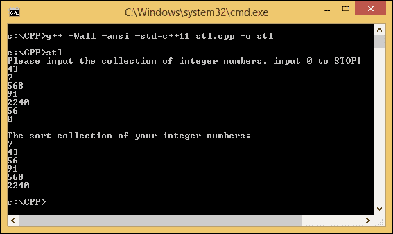
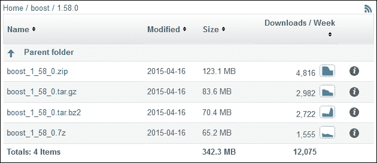
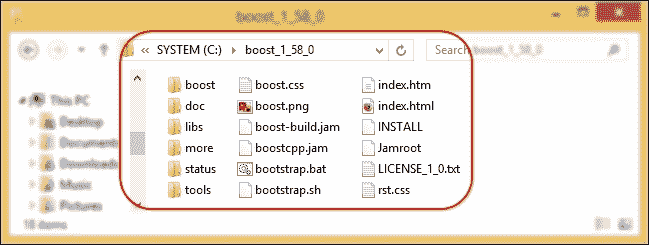
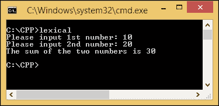
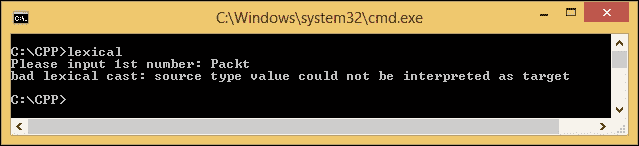
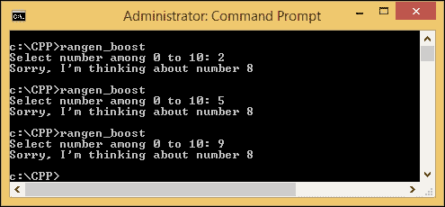

# 第三章：介绍 Boost C++库

许多程序员使用库，因为这简化了编程过程。使用库可以节省大量的代码开发时间，因为他们不再需要从头开始编写函数。在本章中，我们将熟悉 Boost C++库。让我们准备自己的编译器和文本编辑器，以证明 Boost 库的强大功能。在这样做的过程中，我们将讨论以下主题：

+   介绍 C++标准模板库

+   介绍 Boost 库

+   在 MinGW 编译器中准备 Boost C++库

+   构建 Boost 库

+   编译包含 Boost C++库的代码

# 介绍 C++标准模板库

C++ **标准模板库**（**STL**）是一个基于模板的通用库，提供了通用容器等功能。程序员可以轻松使用 STL 提供的算法，而不是处理动态数组、链表、二叉树或哈希表。

STL 由容器、迭代器和算法构成，它们的作用如下：

+   **容器**：它们的主要作用是管理某种类型的对象的集合，例如整数数组或字符串链表。

+   **迭代器**：它们的主要作用是遍历集合的元素。迭代器的工作方式类似于指针。我们可以使用`++`运算符递增迭代器，并使用`*`运算符访问值。

+   **算法**：它们的主要作用是处理集合的元素。算法使用迭代器遍历所有元素。在迭代元素后，它处理每个元素，例如修改元素。它还可以在迭代所有元素后搜索和排序元素。

通过创建以下代码来检查 STL 结构的三个元素：

```cpp
/* stl.cpp */
#include <vector>
#include <iostream>
#include <algorithm>

int main(void) {
  int temp;
  std::vector<int> collection;
  std::cout << "Please input the collection of integer numbers, input 0 to STOP!\n";
  while(std::cin >> temp != 0) {
    if(temp == 0) break;
    collection.push_back(temp);
  }
  std::sort(collection.begin(), collection.end());
  std::cout << "\nThe sort collection of your integer numbers:\n";
  for(int i: collection) {
    std::cout << i << std::endl;
  }
}
```

将前面的代码命名为`stl.cpp`，并运行以下命令进行编译：

```cpp
g++ -Wall -ansi -std=c++11 stl.cpp -o stl

```

在我们解剖这段代码之前，让我们运行它看看会发生什么。这个程序将要求用户输入尽可能多的整数，然后对数字进行排序。要停止输入并要求程序开始排序，用户必须输入`0`。这意味着`0`不会包括在排序过程中。由于我们没有阻止用户输入非整数数字，比如 3.14，程序很快就会停止等待用户输入下一个数字。代码产生以下输出：



我们输入了六个整数：`43`，`7`，`568`，`91`，`2240`和`56`。最后一个输入是`0`，以停止输入过程。然后程序开始对数字进行排序，我们得到了按顺序排序的数字：`7`，`43`，`56`，`91`，`568`和`2240`。

现在，让我们检查我们的代码，以确定 STL 中包含的容器、迭代器和算法：

```cpp
std::vector<int> collection;

```

```cpp
 vector in the code. A vector manages its elements in a dynamic array, and they can be accessed randomly and directly with the corresponding index. In our code, the container is prepared to hold integer numbers so we have to define the type of the value inside the angle brackets <int>. These angle brackets are also called generics in STL:
```

```cpp
collection.push_back(temp);
std::sort(collection.begin(), collection.end());

```

前面代码中的`begin()`和`end()`函数是 STL 中的算法。它们的作用是处理容器中的数据，用于获取容器中的第一个和最后一个元素。在此之前，我们可以看到`push_back()`函数，用于将元素追加到容器中：

```cpp
for(int i: collection) {
 std::cout << i << std::endl;
}

```

前面的`for`块将迭代称为`collection`的整数的每个元素。每次迭代元素时，我们可以单独处理元素。在前面的示例中，我们向用户显示了数字。这就是 STL 中迭代器发挥作用的方式。

```cpp
#include <vector>
#include <algorithm>

```

我们包括向量定义以定义所有`vector`函数和`algorithm`定义以调用`sort()`函数。

# 介绍 Boost C++库

Boost C++库是一组库，用于补充 C++标准库。该集合包含 100 多个库，我们可以使用它们来提高 C++编程的生产力。当我们的需求超出 STL 提供的范围时，也可以使用它。它以 Boost 许可证提供源代码，这意味着它允许我们免费使用、修改和分发这些库，甚至用于商业用途。

Boost 的开发由来自世界各地的 C++开发人员组成的 Boost 社区处理。社区的使命是开发高质量的库，作为 STL 的补充。只有经过验证的库才会被添加到 Boost 库中。

### 注意

有关 Boost 库的详细信息，请访问[www.boost.org](http://www.boost.org)。如果您想为 Boost 开发库做出贡献，可以加入开发者邮件列表[lists.boost.org/mailman/listinfo.cgi/boost](http://lists.boost.org/mailman/listinfo.cgi/boost)。

所有库的完整源代码都可以在官方 GitHub 页面[github.com/boostorg](http://github.com/boostorg)上找到。

## Boost 库的优势

正如我们所知，使用 Boost 库将提高程序员的生产力。此外，通过使用 Boost 库，我们将获得诸如以下优势：

+   它是开源的，所以我们可以检查源代码并在需要时进行修改。

+   它的许可证允许我们开发开源和闭源项目。它还允许我们自由商业化我们的软件。

+   它有很好的文档，并且我们可以在官方网站上找到所有库的解释，以及示例代码。

+   它支持几乎所有现代操作系统，如 Windows 和 Linux。它还支持许多流行的编译器。

+   它是 STL 的补充而不是替代。这意味着使用 Boost 库将简化那些 STL 尚未处理的编程过程。实际上，Boost 的许多部分都包含在标准 C++库中。

# 为 MinGW 编译器准备 Boost 库

在使用 Boost 库编写 C++应用程序之前，需要配置库以便 MinGW 编译器能够识别。在这里，我们将准备我们的编程环境，以便我们的编译器能够使用 Boost 库。

## 下载 Boost 库

下载 Boost 的最佳来源是官方下载页面。我们可以通过将互联网浏览器指向[www.boost.org/users/download](http://www.boost.org/users/download)来访问该页面。在**当前版本**部分找到**下载**链接。在撰写本书时，Boost 库的当前版本是 1.58.0，但当您阅读本书时，版本可能已经更改。如果是这样，您仍然可以选择当前版本，因为更高的版本必须与更低的版本兼容。但是，您必须根据我们稍后将要讨论的设置进行调整。否则，选择相同的版本将使您能够遵循本书中的所有说明。

有四种文件格式可供选择进行下载；它们是`.zip`、`.tar.gz`、`.tar.bz2`和`.7z`。这四个文件之间没有区别，只是文件大小不同。ZIP 格式的文件大小最大，而 7Z 格式的文件大小最小。由于文件大小，Boost 建议我们下载 7Z 格式。请参考以下图片进行比较：



从上图可以看出，ZIP 版本的大小为 123.1 MB，而 7Z 版本的大小为 65.2 MB。这意味着 ZIP 版本的大小几乎是 7Z 版本的两倍。因此，他们建议您选择 7Z 格式以减少下载和解压时间。让我们选择`boost_1_58_0.7z`进行下载，并将其保存到本地存储中。

## 部署 Boost 库

在本地存储中获得`boost_1_58_0.7z`后，使用 7ZIP 应用程序对其进行解压，并将解压文件保存到`C:\boost_1_58_0`。

### 注意

7ZIP 应用程序可以从[www.7-zip.org/download.html](http://www.7-zip.org/download.html)获取。

然后，该目录应包含以下文件结构：



### 注意

与其直接浏览到 Boost 下载页面并手动搜索 Boost 版本，不如直接转到[sourceforge.net/projects/boost/files/boost/1.58.0](http://sourceforge.net/projects/boost/files/boost/1.58.0)。当 1.58.0 版本不再是当前版本时，这将非常有用。

## 使用 Boost 库

Boost 中的大多数库都是**仅头文件**；这意味着所有函数的声明和定义，包括命名空间和宏，都对编译器可见，无需单独编译它们。现在我们可以尝试使用 Boost 与程序一起将字符串转换为`int`值，如下所示：

```cpp
/* lexical.cpp */
#include <boost/lexical_cast.hpp>
#include <string>
#include <iostream>

int main(void) {
  try 	{
    std::string str;
    std::cout << "Please input first number: ";
    std::cin >> str;
    int n1 = boost::lexical_cast<int>(str);
    std::cout << "Please input second number: ";
    std::cin >> str;
    int n2 = boost::lexical_cast<int>(str);
    std::cout << "The sum of the two numbers is ";
    std::cout << n1 + n2 << "\n";
    return 0;
  }
  catch (const boost::bad_lexical_cast &e) {
    std::cerr << e.what() << "\n";
    return 1;
  }
}
```

打开 Notepad++应用程序，输入上述代码，并将其保存为`lexical.cpp`，保存在`C:\CPP`目录中——这是我们在第一章中创建的目录，*简化 C++中的网络编程*。现在打开命令提示符，将活动目录指向`C:\CPP`，然后输入以下命令：

```cpp
g++ -Wall -ansi lexical.cpp –Ic:\boost_1_58_0 -o lexical

```

我们在这里有一个新选项，即`-I`（“包含”选项）。此选项与目录的完整路径一起使用，以通知编译器我们有另一个要包含到我们的代码中的头文件目录。由于我们将 Boost 库存储在`c:\ boost_1_58_0`中，我们可以使用`-Ic:\boost_1_58_0`作为附加参数。

在`lexical.cpp`中，我们应用`boost::lexical_cast`将`string`类型数据转换为`int`类型数据。程序将要求用户输入两个数字，然后自动找到这两个数字的和。如果用户输入不合适的数字，程序将通知他们发生了错误。

`Boost.LexicalCast`库由 Boost 提供，用于将一种数据类型转换为另一种数据类型（将数值类型（如`int`、`double`或`float`）转换为字符串类型，反之亦然）。现在，让我们解剖`lexical.cpp`，以便更详细地了解它的功能：

```cpp
#include <boost/lexical_cast.hpp>
#include <string>
#include <iostream>

```

我们包括`boost/lexical_cast.hpp`，以便能够调用`boost::lexical_cast`函数，因为该函数在`lexical_cast.hpp`中声明。此外，我们使用`string`头文件来应用`std::string`函数，以及使用`iostream`头文件来应用`std::cin`、`std::cout`和`std::cerr`函数。

其他函数，如`std::cin`和`std::cout`，在第一章中已经讨论过，我们知道它们的功能，因此可以跳过这些行：

```cpp
int n1 = boost::lexical_cast<int>(str);
int n2 = boost::lexical_cast<int>(str);

```

我们使用上述两个单独的行将用户提供的输入`string`转换为`int`数据类型。然后，在转换数据类型后，我们对这两个`int`值进行求和。

我们还可以在上述代码中看到`try-catch`块。它用于捕获错误，如果用户输入不合适的数字，除了 0 到 9。

```cpp
catch (const boost::bad_lexical_cast &e)
{
 std::cerr << e.what() << "\n";
 return 1;
}

```

```cpp
boost::bad_lexical_cast. We call the e.what() function to obtain the string of the error message.
```

现在让我们通过在命令提示符中输入`lexical`来运行应用程序。我们将得到以下输出：



我为第一个输入放入了`10`，为第二个输入放入了`20`。结果是`30`，因为它只是对两个输入求和。但是如果我输入一个非数字值，例如`Packt`，会发生什么呢？以下是尝试该条件的输出：



一旦应用程序发现错误，它将忽略下一个语句并直接转到`catch`块。通过使用`e.what()`函数，应用程序可以获取错误消息并显示给用户。在我们的示例中，我们获得了`bad lexical cast: source type value could not be interpreted`作为错误消息，因为我们尝试将`string`数据分配给`int`类型变量。

## 构建 Boost 库

正如我们之前讨论的，Boost 中的大多数库都是仅头文件的，但并非所有库都是如此。有一些库必须单独构建。它们是：

+   `Boost.Chrono`：用于显示各种时钟，如当前时间、两个时间之间的范围，或者计算过程中经过的时间。

+   `Boost.Context`：用于创建更高级的抽象，如协程和协作线程。

+   `Boost.Filesystem`：用于处理文件和目录，例如获取文件路径或检查文件或目录是否存在。

+   `Boost.GraphParallel`：这是**Boost 图形库**（**BGL**）的并行和分布式计算扩展。

+   `Boost.IOStreams`：用于使用流写入和读取数据。例如，它将文件的内容加载到内存中，或者以 GZIP 格式写入压缩数据。

+   `Boost.Locale`：用于本地化应用程序，换句话说，将应用程序界面翻译成用户的语言。

+   `Boost.MPI`：用于开发可以并行执行任务的程序。**MPI 本身代表消息传递接口**。

+   `Boost.ProgramOptions`：用于解析命令行选项。它使用双减号（`--`）来分隔每个命令行选项，而不是使用`main`参数中的`argv`变量。

+   `Boost.Python`：用于在 C++代码中解析 Python 语言。

+   `Boost.Regex`：用于在我们的代码中应用正则表达式。但如果我们的开发支持 C++11，我们不再依赖于`Boost.Regex`库，因为它已经在`regex`头文件中可用。

+   `Boost.Serialization`：用于将对象转换为一系列字节，可以保存，然后再次恢复为相同的对象。

+   `Boost.Signals`：用于创建信号。信号将触发事件来运行一个函数。

+   `Boost.System`：用于定义错误。它包含四个类：`system::error_code`、`system::error_category`、`system::error_condition`和`system::system_error`。所有这些类都在`boost`命名空间中。它也支持 C++11 环境，但由于许多 Boost 库使用`Boost.System`，因此有必要继续包含`Boost.System`。

+   `Boost.Thread`：用于应用线程编程。它提供了用于同步多线程数据访问的类。在 C++11 环境中，`Boost.Thread`库提供了扩展，因此我们可以在`Boost.Thread`中中断线程。

+   `Boost.Timer`：用于使用时钟来测量代码性能。它基于通常的时钟和 CPU 时间来测量经过的时间，这表明执行代码所花费的时间。

+   `Boost.Wave`：提供了一个可重用的 C 预处理器，我们可以在我们的 C++代码中使用。

还有一些具有可选的、单独编译的二进制文件的库。它们如下：

+   `Boost.DateTime`：用于处理时间数据；例如，日历日期和时间。它有一个二进制组件，只有在使用`to_string`、`from_string`或序列化功能时才需要。如果我们将应用程序定位到 Visual C++ 6.x 或 Borland，也是必需的。

+   `Boost.Graph`：用于创建二维图形。它有一个二进制组件，只有在我们打算解析`GraphViz`文件时才需要。

+   `Boost.Math`：用于处理数学公式。它有用于`cmath`函数的二进制组件。

+   `Boost.Random`：用于生成随机数。它有一个二进制组件，只有在我们想要使用`random_device`时才需要。

+   `Boost.Test`：用于编写和组织测试程序及其运行时执行。它可以以仅头文件或单独编译模式使用，但对于严肃的使用，建议使用单独编译。

+   `Boost.Exception`：它用于在抛出异常后向异常添加数据。它为 32 位`_MSC_VER==1310`和`_MSC_VER==1400`提供了`exception_ptr`的非侵入式实现，这需要单独编译的二进制文件。这是通过`#define BOOST_ENABLE_NON_INTRUSIVE_EXCEPTION_PTR`启用的。

让我们尝试重新创建我们在第一章中创建的随机数生成器程序。但现在我们将使用`Boost.Random`库，而不是 C++标准函数中的`std::rand()`。让我们看一下以下代码：

```cpp
/* rangen_boost.cpp */
#include <boost/random/mersenne_twister.hpp>
#include <boost/random/uniform_int_distribution.hpp>
#include <iostream>

int main(void) {
  int guessNumber;
  std::cout << "Select number among 0 to 10: ";
  std::cin >> guessNumber;
  if(guessNumber < 0 || guessNumber > 10) {
    return 1;
  }
  boost::random::mt19937 rng;
  boost::random::uniform_int_distribution<> ten(0,10);
  int randomNumber = ten(rng);
  if(guessNumber == randomNumber) {
    std::cout << "Congratulation, " << guessNumber << " is your lucky number.\n";
  }
  else {
    std::cout << "Sorry, I'm thinking about number " << randomNumber << "\n"; 
  }
  return 0;
}
```

我们可以使用以下命令编译前面的源代码：

```cpp
g++ -Wall -ansi -Ic:/boost_1_58_0 rangen_boost.cpp -o rangen_boost

```

现在，让我们运行程序。不幸的是，在我运行程序的三次中，我总是得到相同的随机数，如下所示：



正如我们从这个例子中看到的，我们总是得到数字 8。这是因为我们应用了 Mersenne Twister，一个**伪随机数生成器**（**PRNG**），它使用默认种子作为随机性的来源，因此每次运行程序时都会生成相同的数字。当然，这不是我们期望的程序。

现在，我们将再次修改程序，只需两行。首先，找到以下行：

```cpp
#include <boost/random/mersenne_twister.hpp>

```

将其更改如下：

```cpp
#include <boost/random/random_device.hpp>

```

接下来，找到以下行：

```cpp
boost::random::mt19937 rng;

```

将其更改如下：

```cpp
boost::random::random_device rng;

```

然后，将文件保存为`rangen2_boost.cpp`，并使用与我们编译`rangen_boost.cpp`相同的命令来编译`rangen2_boost.cpp`文件。命令将如下所示：

```cpp
g++ -Wall -ansi -Ic:/boost_1_58_0 rangen2_boost.cpp -o rangen2_boost

```

遗憾的是，会出现一些问题，编译器将显示以下错误消息：

```cpp
cc8KWVvX.o:rangen2_boost.cpp:(.text$_ZN5boost6random6detail20generate_uniform_intINS0_13random_deviceEjEET0_RT_S4_S4_N4mpl_5bool_ILb1EEE[_ZN5boost6random6detail20generate_uniform_intINS0_13random_deviceEjEET0_RT_S4_S4_N4mpl_5bool_ILb1EEE]+0x24f): more undefined references to boost::random::random_device::operator()()' follow
collect2.exe: error: ld returned 1 exit status

```

这是因为，正如我们之前看到的，如果我们想要使用`random_device`属性，`Boost.Random`库需要单独编译。

Boost 库有一个系统来编译或构建 Boost 本身，称为`Boost.Build`库。我们必须完成两个步骤来安装`Boost.Build`库。首先，通过将命令提示符中的活动目录指向`C:\boost_1_58_0`，并键入以下命令来运行**Bootstrap**：

```cpp
bootstrap.bat mingw

```

我们使用我们在第一章中安装的 MinGW 编译器作为我们在编译 Boost 库时的工具集。等一下，如果过程成功，我们将得到以下输出：

```cpp
Building Boost.Build engine

Bootstrapping is done. To build, run:

    .\b2

To adjust configuration, edit 'project-config.jam'.
Further information:

    - Command line help:
    .\b2 --help

    - Getting started guide:
    http://boost.org/more/getting_started/windows.html

    - Boost.Build documentation:
    http://www.boost.org/build/doc/html/index.html
```

在这一步中，我们将在 Boost 库的根目录中找到四个新文件。它们是：

+   `b2.exe`：这是一个可执行文件，用于构建 Boost 库

+   `bjam.exe`：这与`b2.exe`完全相同，但它是一个旧版本

+   `bootstrap.log`：这包含了`bootstrap`过程的日志

+   `project-config.jam`：这包含了在运行`b2.exe`时将用于构建过程的设置

我们还发现，这一步在`C:\boost_1_58_0\tools\build\src\engine\bin.ntx86`中创建了一个新目录，其中包含与需要编译的 Boost 库相关的一堆`.obj`文件。

之后，在命令提示符下键入以下命令来运行第二步：

```cpp
b2 install toolset=gcc

```

在运行该命令后，喝杯咖啡，因为这个过程将花费大约二十到五十分钟的时间，这取决于您的系统规格。我们将得到的最后输出将如下所示：

```cpp
...updated 12562 targets...

```

这意味着过程已经完成，我们现在已经构建了 Boost 库。如果我们在资源管理器中检查，`Boost.Build`库将添加`C:\boost_1_58_0\stage\lib`，其中包含一系列静态和动态库，我们可以直接在我们的程序中使用。

### 注意

`bootstrap.bat`和`b2.exe`使用`msvc`（Microsoft Visual C++编译器）作为默认工具集，许多 Windows 开发人员已经在他们的机器上安装了`msvc`。由于我们安装了 GCC 编译器，我们在 Boost 的构建中设置了`mingw`和`gcc`工具集选项。如果您也安装了`mvsc`并希望在 Boost 的构建中使用它，可以省略工具集选项。

现在，让我们再次尝试使用以下命令编译`rangen2_boost.cpp`文件：

```cpp
c:\CPP>g++ -Wall -ansi -Ic:/boost_1_58_0 rangen2_boost.cpp -Lc:\boost_1_58_0\stage\lib -lboost_random-mgw49-mt-1_58 -lboost_system-mgw49-mt-1_58 -o rangen2_boost

```

这里有两个新选项，它们是`-L`和`-l`。`-L`选项用于定义包含库文件的路径，如果库文件不在活动目录中。`-l`选项用于定义库文件的名称，但省略文件名前面的`lib`单词。在这种情况下，原始库文件名为`libboost_random-mgw49-mt-1_58.a`，我们省略了`lib`短语和选项`-l`的文件扩展名。

新文件`rangen2_boost.exe`将在`C:\CPP`中创建。但在运行程序之前，我们必须确保程序安装的目录包含程序所依赖的两个库文件。这些是`libboost_random-mgw49-mt-1_58.dll`和`libboost_system-mgw49-mt-1_58.dll`，我们可以从库目录`c:\boost_1_58_0_1\stage\lib`中获取它们。

为了方便我们运行该程序，运行以下`copy`命令将两个库文件复制到`C:\CPP`：

```cpp
copy c:\boost_1_58_0_1\stage\lib\libboost_random-mgw49-mt-1_58.dll c:\cpp
copy c:\boost_1_58_0_1\stage\lib\libboost_system-mgw49-mt-1_58.dll c:\cpp

```

现在程序应该可以顺利运行了。

为了创建一个网络应用程序，我们将使用`Boost.Asio`库。我们在非仅头文件库中找不到`Boost.Asio`——我们将用它来创建网络应用程序的库。看来我们不需要构建 Boost 库，因为`Boost.Asio`是仅头文件库。这是正确的，但由于`Boost.Asio`依赖于`Boost.System`，而`Boost.System`需要在使用之前构建，因此在创建网络应用程序之前，首先构建 Boost 是很重要的。

### 提示

对于选项`-I`和`-L`，编译器不在乎我们在路径中使用反斜杠（\）还是斜杠（/）来分隔每个目录名称，因为编译器可以处理 Windows 和 Unix 路径样式。

# 总结

我们看到 Boost C++库是为了补充标准 C++库而开发的。我们还能够设置我们的 MinGW 编译器，以便编译包含 Boost 库的代码，并构建必须单独编译的库的二进制文件。在下一章中，我们将深入研究 Boost 库，特别是关于`Boost.Asio`库（我们将用它来开发网络应用程序）。请记住，尽管我们可以将`Boost.Asio`库作为仅头文件库使用，但最好使用`Boost.Build`库构建所有 Boost 库。这样我们就可以轻松使用所有库，而不必担心编译失败。
