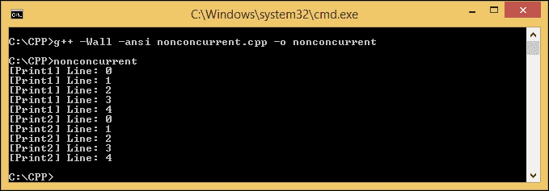
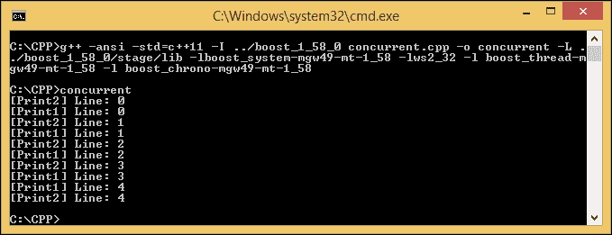
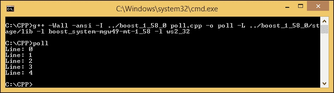
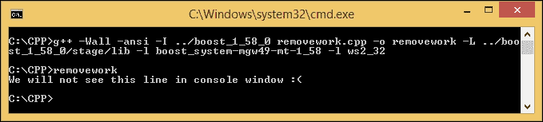
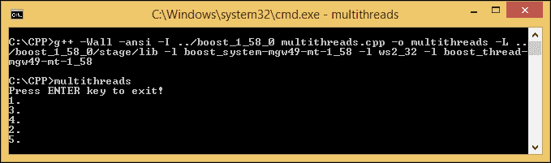
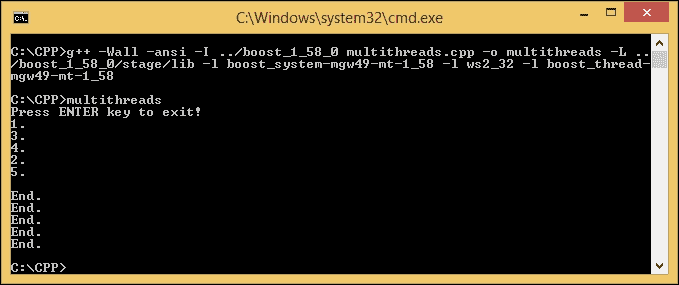
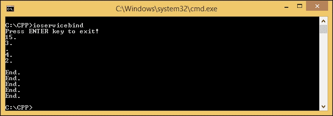
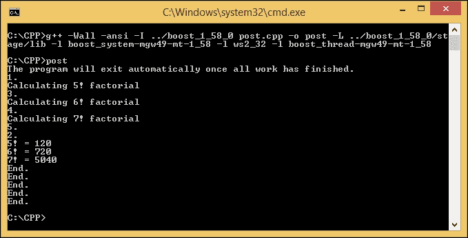
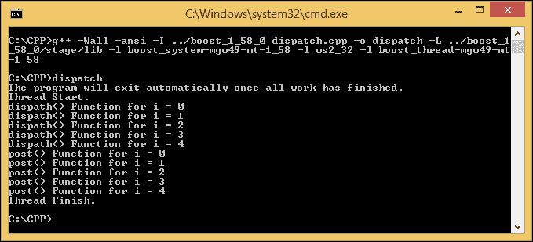

# 第四章 使用 Boost.Asio 入门

我们已经对 Boost C++库有了一般了解。现在是时候更多地了解 Boost.Asio 了，这是我们用来开发网络应用程序的库。Boost.Asio 是一组库，用于异步处理数据，因为 Asio 本身代表**异步 I/O**（**输入和输出**）。异步意味着程序中的特定任务将在不阻塞其他任务的情况下运行，并且 Boost.Asio 将在完成该任务时通知程序。换句话说，任务是同时执行的。

在本章中，我们将讨论以下主题：

+   区分并发和非并发编程

+   理解 I/O 服务，Boost.Asio 的大脑和心脏

+   将函数动态绑定到函数指针

+   同步访问任何全局数据或共享数据

# 接近 Boost.Asio 库

假设我们正在开发一个音频下载应用程序，并且希望用户能够在下载过程中导航到应用程序的所有菜单。如果我们不使用异步编程，应用程序将被下载过程阻塞，用户必须等到文件下载完成才能继续使用。但由于异步编程，用户不需要等到下载过程完成才能继续使用应用程序。

换句话说，同步过程就像在剧院售票处排队。只有当我们到达售票处之后，我们才会被服务，而在此之前，我们必须等待前面排队的其他顾客的所有流程完成。相比之下，我们可以想象异步过程就像在餐厅用餐，其中服务员不必等待顾客的订单被厨师准备。服务员可以在不阻塞时间并等待厨师的情况下去接受其他顾客的订单。

`Boost`库还有`Boost.Thread`库，用于同时执行任务，但`Boost.Thread`库用于访问内部资源，如 CPU 核心资源，而`Boost.Asio`库用于访问外部资源，如网络连接，因为数据是通过网络卡发送和接收的。

让我们区分并发和非并发编程。看一下以下代码：

```cpp
/* nonconcurrent.cpp */
#include <iostream>

void Print1(void) {
  for(int i=0; i<5; i++) {
    std::cout << "[Print1] Line: " << i << "\n";
  }
}

void Print2(void) {
  for(int i=0; i<5; i++) {
    std::cout << "[Print2] Line: " << i << "\n";
  }
}

int main(void) {
  Print1();
  Print2();
  return 0;
}
```

上面的代码是一个非并发程序。将代码保存为`nonconcurrent.cpp`，然后使用以下命令进行编译：

```cpp
g++ -Wall -ansi nonconcurrent.cpp -o nonconcurrent

```

运行`nonconcurrent.cpp`后，将显示如下输出：



我们想要运行两个函数：`Print1()`和`Print2()`。在非并发编程中，应用程序首先运行`Print1()`函数，然后完成函数中的所有指令。程序继续调用`Print2()`函数，直到指令完全运行。

现在，让我们将非并发编程与并发编程进行比较。为此，请看以下代码：

```cpp
/* concurrent.cpp */
#include <boost/thread.hpp>
#include <boost/chrono.hpp>
#include <iostream>

void Print1() {
  for (int i=0; i<5; i++) {
    boost::this_thread::sleep_for(boost::chrono::milliseconds{500});
    std::cout << "[Print1] Line: " << i << '\n';
  }
}

void Print2() {
  for (int i=0; i<5; i++) {
    boost::this_thread::sleep_for(boost::chrono::milliseconds{500});
    std::cout << "[Print2] Line: " << i << '\n';
  }
}

int main(void) {
  boost::thread_group threads;
  threads.create_thread(Print1);
  threads.create_thread(Print2);
  threads.join_all();
}
```

将上述代码保存为`concurrent.cpp`，并使用以下命令进行编译：

```cpp
g++ -ansi -std=c++11 -I ../boost_1_58_0 concurrent.cpp -o concurrent -L ../boost_1_58_0/stage/lib -lboost_system-mgw49-mt-1_58 -lws2_32 -l boost_thread-mgw49-mt-1_58 -l boost_chrono-mgw49-mt-1_58

```

运行程序以获得以下输出：



我们可以从上面的输出中看到，`Print1()`和`Print2()`函数是同时运行的。`Print2()`函数不需要等待`Print1()`函数执行完所有要调用的指令。这就是为什么我们称之为并发编程。

### 提示

如果在代码中包含库，请不要忘记复制相关的动态库文件。例如，如果使用`-l`选项包含`boost_system-mgw49-mt-1_58`，则必须复制`libboost_system-mgw49-mt-1_58.dll`文件并将其粘贴到与输出可执行文件相同的目录中。

# 检查 Boost.Asio 库中的 I/O 服务

`Boost::Asio`命名空间的核心对象是`io_service`。**I/O service**是一个通道，用于访问操作系统资源，并在我们的程序和执行 I/O 请求的操作系统之间建立通信。还有一个**I/O 对象**，其作用是提交 I/O 请求。例如，`tcp::socket`对象将从我们的程序向操作系统提供套接字编程请求。

## 使用和阻塞 run()函数

在 I/O 服务对象中最常用的函数之一是`run()`函数。它用于运行`io_service`对象的事件处理循环。它将阻塞程序的下一个语句，直到`io_service`对象中的所有工作都完成，并且没有更多的处理程序需要分派。如果我们停止`io_service`对象，它将不再阻塞程序。

### 注意

在编程中，`event`是程序检测到的一个动作或事件，将由程序使用`event handler`对象处理。`io_service`对象有一个或多个实例，用于处理事件的`event processing loop`。

现在，让我们看一下以下代码片段：

```cpp
/* unblocked.cpp */
#include <boost/asio.hpp>
#include <iostream>

int main(void) {
  boost::asio::io_service io_svc;

  io_svc.run();

  std::cout << "We will see this line in console window." << std::endl;

  return 0;
}
```

我们将上述代码保存为`unblocked.cpp`，然后运行以下命令进行编译：

```cpp
g++ -Wall -ansi -I ../boost_1_58_0 unblocked.cpp -o unblocked -L ../boost_1_58_0/stage/lib -l boost_system-mgw49-mt-1_58 -l ws2_32

```

当我们运行程序时，将显示以下输出：

```cpp
We will see this line in console window.

```

然而，为什么即使我们之前知道`run()`函数在被调用后会阻塞下一个函数，我们仍然在控制台中获取到文本行呢？这是因为我们没有给`io_service`对象任何工作。由于`io_service`没有工作要做，`io_service`对象不应该阻塞程序。

现在，让我们给`io_service`对象一些工作要做。这个程序将如下所示：

```cpp
/* blocked.cpp */
#include <boost/asio.hpp>
#include <iostream>

int main(void) {
  boost::asio::io_service io_svc;
  boost::asio::io_service::work worker(io_svc);

  io_svc.run();

  std::cout << "We will not see this line in console window :(" << std::endl;

  return 0;
}
```

给上述代码命名为`blocked.cpp`，然后在控制台窗口中输入以下命令进行编译：

```cpp
g++ -Wall -ansi -I ../boost_1_58_0 blocked.cpp -o blocked -L ../boost_1_58_0/stage/lib -l boost_system-mgw49-mt-1_58 -l ws2_32

```

如果我们在控制台中输入`blocked`来运行程序，由于我们添加了以下代码行，我们将不再看到文本行：

```cpp
boost::asio::io_service::work work(io_svc);

```

`work`类负责告诉`io_service`对象工作何时开始和何时结束。它将确保`io_service`对象中的`run()`函数在工作进行时不会退出。此外，它还将确保`run()`函数在没有未完成的工作时退出。在我们的上述代码中，`work`类通知`io_service`对象它有工作要做，但我们没有定义工作是什么。因此，程序将被无限阻塞，不会显示输出。它被阻塞的原因是因为即使我们仍然可以通过按*Ctrl* + *C*来终止程序，`run()`函数仍然被调用。

## 使用非阻塞的 poll()函数

现在，我们将暂时离开`run()`函数，尝试使用`poll()`函数。`poll()`函数用于运行就绪处理程序，直到没有更多的就绪处理程序，或者直到`io_service`对象已停止。然而，与`run()`函数相反，`poll()`函数不会阻塞程序。

让我们输入以下使用`poll()`函数的代码，并将其保存为`poll.cpp`：

```cpp
/* poll.cpp */
#include <boost/asio.hpp>
#include <iostream>

int main(void) {
  boost::asio::io_service io_svc;

  for(int i=0; i<5; i++) {
    io_svc.poll();
    std::cout << "Line: " << i << std::endl;
  }

  return 0;
}
```

然后，使用以下命令编译`poll.cpp`：

```cpp
g++ -Wall -ansi -I ../boost_1_58_0 poll.cpp -o poll -L ../boost_1_58_0/stage/lib -l boost_system-mgw49-mt-1_58 -l ws2_32

```

因为`io_service`对象没有工作要做，所以程序应该显示以下五行文本：



然而，如果我们在使用`poll()`函数时给`io_service`对象分配工作会怎样呢？为了找出答案，让我们输入以下代码并将其保存为`pollwork.cpp`：

```cpp
/* pollwork.cpp */
#include <boost/asio.hpp>
#include <iostream>

int main(void) {
  boost::asio::io_service io_svc;
  boost::asio::io_service::work work(io_svc);

  for(int i=0; i<5; i++) {
    io_svc.poll();
    std::cout << "Line: " << i << std::endl;
  }

  return 0;
}
```

要编译`pollwork.cpp`，使用以下命令：

```cpp
g++ -Wall -ansi -I ../boost_1_58_0 pollwork.cpp -o pollwork -L ../boost_1_58_0/stage/lib -l boost_system-mgw49-mt-1_58 -l ws2_32

```

`poll.cpp`文件和`pollwork.cpp`文件之间的区别只有以下一行：

```cpp
boost::asio::io_service::work work(io_svc);

```

然而，如果我们运行`pollwork.exe`，我们将获得与`poll.exe`相同的输出。这是因为，正如我们之前所知道的，`poll()`函数在有更多工作要做时不会阻塞程序。它将执行当前工作，然后返回值。

## 移除 work 对象

我们也可以通过从`io_service`对象中移除`work`对象来解除程序的阻塞，但是我们必须使用指向`work`对象的指针来移除`work`对象本身。我们将使用`Boost`库提供的智能指针`shared_ptr`指针。

让我们使用修改后的`blocked.cpp`代码。代码如下：

```cpp
/* removework.cpp */
#include <boost/asio.hpp>
#include <boost/shared_ptr.hpp>
#include <iostream>

int main(void) {
  boost::asio::io_service io_svc;
  boost::shared_ptr<boost::asio::io_service::work> worker(
    new boost::asio::io_service::work(io_svc)
  );

  worker.reset();

  io_svc.run();

  std::cout << "We will not see this line in console window :(" << std::endl;

  return 0;
}
```

将上述代码保存为`removework.cpp`，并使用以下命令进行编译：

```cpp
g++ -Wall -ansi -I ../boost_1_58_0 removework.cpp -o removework -L ../boost_1_58_0/stage/lib -l boost_system-mgw49-mt-1_58 -l ws2_32

```

当我们运行`removework.cpp`时，与`blocked.cpp`相比，它将无限期地阻塞程序，将显示以下文本：



现在，让我们解析代码。如前所述，我们在上面的代码中使用了`shared_ptr`指针来实例化`work`对象。有了 Boost 提供的这个智能指针，我们不再需要手动删除内存分配以存储指针，因为它保证了指向的对象在最后一个指针被销毁或重置时将被删除。不要忘记在`boost`目录中包含`shared_ptr.hpp`，因为`shared_ptr`指针是在头文件中定义的。

我们还添加了`reset()`函数来重置`io_service`对象，以便准备进行后续的`run()`函数调用。在任何`run()`或`poll()`函数调用之前必须调用`reset()`函数。它还会告诉`shared_ptr`指针自动销毁我们创建的指针。有关`shared_ptr`指针的更多信息，请访问[www.boost.org/doc/libs/1_58_0/libs/smart_ptr/shared_ptr.htm](http://www.boost.org/doc/libs/1_58_0/libs/smart_ptr/shared_ptr.htm)。

上面的程序解释了我们已成功从`io_service`对象中移除了`work`对象。即使尚未完成所有挂起的工作，我们也可以使用这个功能。

## 处理多个线程

到目前为止，我们只处理了一个`io_service`对象的一个线程。如果我们想在单个`io_service`对象中处理更多的线程，以下代码将解释如何做到这一点：

```cpp
/* multithreads.cpp */
#include <boost/asio.hpp>
#include <boost/shared_ptr.hpp>
#include <boost/thread.hpp>
#include <iostream>

boost::asio::io_service io_svc;
int a = 0;

void WorkerThread() {
  std::cout << ++a << ".\n";
  io_svc.run();
  std::cout << "End.\n";
}

int main(void) {
  boost::shared_ptr<boost::asio::io_service::work> worker(
    new boost::asio::io_service::work(io_svc)
  );

  std::cout << "Press ENTER key to exit!" << std::endl;

  boost::thread_group threads;
  for(int i=0; i<5; i++)
    threads.create_thread(WorkerThread);

  std::cin.get();

  io_svc.stop();

  threads.join_all();

  return 0;
}
```

给上述代码命名为`mutithreads.cpp`，然后使用以下命令进行编译：

```cpp
g++ -Wall -ansi -I ../boost_1_58_0 multithreads.cpp -o multithreads -L ../boost_1_58_0/stage/lib -l boost_system-mgw49-mt-1_58 -l ws2_32 -l boost_thread-mgw49-mt-1_58

```

我们包含`thread.hpp`头文件，以便我们可以使用头文件中定义的`thread`对象。线程本身是一系列可以独立运行的指令，因此我们可以同时运行多个线程。

现在，在我们的控制台中运行`mutithreads.exe`。我通过运行它获得了以下输出：



您可能会得到不同的输出，因为作为线程池设置的所有线程彼此等效。`io_service`对象可能会随机选择其中任何一个并调用其处理程序，因此我们无法保证`io_service`对象是否会按顺序选择线程：

```cpp
for(int i=0; i<5; i++)
 threads.create_thread(WorkerThread);

```

使用上面的代码片段，我们可以创建五个线程来显示文本行，就像在之前的屏幕截图中所看到的那样。这五行文本足以用于此示例以查看非并发流的顺序：

```cpp
std::cout << ++a << ".\n";
io_svc.run();

```

在创建的每个线程中，程序将调用`run()`函数来运行`io_service`对象的工作。只调用一次`run()`函数是不够的，因为所有非工作线程将在`run()`对象完成所有工作后被调用。

创建了五个线程后，程序运行了`io_service`对象的工作：

```cpp
std::cin.get();

```

在所有工作运行之后，程序会等待您使用上面的代码片段从键盘上按*Enter*键。

```cpp
io_svc.stop();

```

```cpp
stop() function will notify the io_service object that all the work should be stopped. This means that the program will stop the five threads that we have:
```

```cpp
threads.join_all();

```

```cpp
WorkerThread() block:
```

```cpp
std::cout << "End.\n";

```

因此，在我们按下*Enter*键后，程序将完成其余的代码，我们将得到以下其余的输出：



# 理解 Boost.Bind 库

我们已经能够使用`io_service`对象并初始化`work`对象。在继续向`io_service`服务提供工作之前，我们需要了解`boost::bind`库。

`Boost.Bind`库用于简化函数指针的调用。它将语法从晦涩和令人困惑的东西转换为易于理解的东西。

## 包装函数调用

让我们看一下以下代码，以了解如何包装函数调用：

```cpp
/* uncalledbind.cpp */
#include <boost/bind.hpp>
#include <iostream>

void func() {
  std::cout << "Binding Function" << std::endl;
}

int main(void) {
  boost::bind(&func);
  return 0;
}
```

将上述代码保存为`uncalledbind.cpp`，然后使用以下命令进行编译：

```cpp
g++ -Wall -ansi -I ../boost_1_58_0 uncalledbind.cpp -o uncalledbind

```

我们将不会得到任何文本行作为输出，因为我们只是创建了一个函数调用，但实际上并没有调用它。我们必须将其添加到`()`运算符中来调用函数，如下所示：

```cpp
/* calledbind.cpp */
#include <boost/bind.hpp>
#include <iostream>

void func() {
  std::cout << "Binding Function" << std::endl;
}

int main(void) {
  boost::bind(&func)();
  return 0;
}
```

将上述代码命名为`calledbind.cpp`并运行以下命令进行编译：

```cpp
g++ -Wall -ansi -I ../boost_1_58_0 calledbind.cpp -o calledbind

```

如果我们运行程序，现在将会得到一行文本作为输出，当然，我们将看到`bind()`函数作为输出：

```cpp
boost::bind(&func)();

```

```cpp
Now, let's use the function that has arguments to pass. We will use boost::bind for this purpose in the following code:
```

```cpp
/* argumentbind.cpp */
#include <boost/bind.hpp>
#include <iostream>

void cubevolume(float f) {
  std::cout << "Volume of the cube is " << f * f * f << std::endl;
}

int main(void) {
  boost::bind(&cubevolume, 4.23f)();
  return 0;
}
```

运行以下命令以编译上述`argumentbind.cpp`文件：

```cpp
g++ -Wall -ansi -I ../boost_1_58_0 argumentbind.cpp -o argumentbind

```

我们成功地使用`boost::bind`调用了带有参数的函数，因此我们得到了以下输出：

```cpp
Volume of the cube is 75.687

```

需要记住的是，如果函数有多个参数，我们必须完全匹配函数签名。以下代码将更详细地解释这一点：

```cpp
/* signaturebind.cpp */
#include <boost/bind.hpp>
#include <iostream>
#include <string>

void identity(std::string name, int age, float height) {
  std::cout << "Name   : " << name << std::endl;
  std::cout << "Age    : " << age << " years old" << std::endl;
  std::cout << "Height : " << height << " inch" << std::endl;
}

int main(int argc, char * argv[]) {
  boost::bind(&identity, "John", 25, 68.89f)();
  return 0;
}
```

使用以下命令编译`signaturebind.cpp`代码：

```cpp
g++ -Wall -ansi -I ../boost_1_58_0 signaturebind.cpp -o signaturebind

```

身份函数的签名是`std::string`、`int`和`float`。因此，我们必须分别用`std::string`、`int`和`float`填充`bind`参数。

因为我们完全匹配了函数签名，我们将得到以下输出：


我们已经能够在`boost::bind`中调用`global()`函数。现在，让我们继续在`boost::bind`中调用类中的函数。这方面的代码如下所示：

```cpp
/* classbind.cpp */
#include <boost/bind.hpp>
#include <iostream>
#include <string>

class TheClass {
public:
  void identity(std::string name, int age, float height) {
    std::cout << "Name   : " << name << std::endl;
    std::cout << "Age    : " << age << " years old" << std::endl;
    std::cout << "Height : " << height << " inch" << std::endl;
  }
};

int main(void) {
  TheClass cls;
  boost::bind(&TheClass::identity, &cls, "John", 25, 68.89f)();
  return 0;
}
```

使用以下命令编译上述`classbind.cpp`代码：

```cpp
g++ -Wall -ansi -I ../boost_1_58_0 classbind.cpp -o classbind

```

这将与`signaturebind.cpp`代码的输出完全相同，因为函数的内容也完全相同：

```cpp
boost::bind(&TheClass::identity, &cls, "John", 25, 68.89f)();

```

```cpp
boost:bind arguments with the class and function name, object of the class, and parameter based on the function signature.
```

## 使用 Boost.Bind 库

到目前为止，我们已经能够使用`boost::bind`来调用全局和类函数。然而，当我们使用`io_service`对象与`boost::bind`时，我们会得到一个**不可复制**的错误，因为`io_service`对象无法被复制。

现在，让我们再次看一下`multithreads.cpp`。我们将修改代码以解释`boost::bind`用于`io_service`对象，并且我们仍然需要`shared_ptr`指针的帮助。让我们看一下以下代码片段：

```cpp
/* ioservicebind.cpp */
#include <boost/asio.hpp>
#include <boost/shared_ptr.hpp>
#include <boost/thread.hpp>
#include <boost/bind.hpp>
#include <iostream>

void WorkerThread(boost::shared_ptr<boost::asio::io_service> iosvc, int counter) {
  std::cout << counter << ".\n";
  iosvc->run();
  std::cout << "End.\n";
}

int main(void) {
  boost::shared_ptr<boost::asio::io_service> io_svc(
    new boost::asio::io_service
  );

  boost::shared_ptr<boost::asio::io_service::work> worker(
    new boost::asio::io_service::work(*io_svc)
  );

  std::cout << "Press ENTER key to exit!" << std::endl;

  boost::thread_group threads;
  for(int i=1; i<=5; i++)
    threads.create_thread(boost::bind(&WorkerThread, io_svc, i));

  std::cin.get();

  io_svc->stop();

  threads.join_all();

  return 0;
}
```

我们将上述代码命名为`ioservicebind.cpp`并使用以下命令进行编译：

```cpp
g++ -Wall -ansi -I ../boost_1_58_0 ioservicebind.cpp -o ioservicebind –L ../boost_1_58_0/stage/lib -l boost_system-mgw49-mt-1_58 -l ws2_32 -l boost_thread-mgw49-mt-1_58

```

当我们运行`ioservicebind.exe`时，我们会得到与`multithreads.exe`相同的输出，但当然，程序会随机排列所有线程的顺序：

```cpp
boost::shared_ptr<boost::asio::io_service> io_svc(
 new boost::asio::io_service
);

```

我们在`shared_ptr`指针中实例化`io_service`对象，以使其**可复制**，以便我们可以将其绑定到作为线程处理程序使用的`worker thread()`函数：

```cpp
void WorkerThread(boost::shared_ptr<boost::asio::io_service> iosvc, int counter)

```

```cpp
io_service object can be passed to the function. We do not need to define an int global variable as we did in the multithreads.cpp code snippet, since we can also pass the int argument to the WorkerThread() function:
```

```cpp
std::cout << counter << ".\n";

```

```cpp
for loop in the main block.
```

如果我们看一下`create_thread()`函数，在`ioservicebind.cpp`和`multithreads.cpp`文件中看到它得到的不同参数。我们可以将指向不带参数的`void()`函数的指针作为`create_thread()`函数的参数传递，就像我们在`multithreads.cpp`文件中看到的那样。我们还可以将绑定函数作为`create_thread()`函数的参数传递，就像我们在`ioservicebind.cpp`文件中看到的那样。

## 使用 Boost.Mutex 库同步数据访问

当您运行`multithreads.exe`或`ioservicebind.exe`可执行文件时，您是否曾经得到以下输出？



我们可以在上面的截图中看到这里存在格式问题。因为`std::cout`对象是一个全局对象，同时从不同的线程写入它可能会导致输出格式问题。为了解决这个问题，我们可以使用`mutex`对象，它可以在`thread`库提供的`boost::mutex`对象中找到。Mutex 用于同步对任何全局数据或共享数据的访问。要了解更多关于 Mutex 的信息，请看以下代码：

```cpp
/* mutexbind.cpp */
#include <boost/asio.hpp>
#include <boost/shared_ptr.hpp>
#include <boost/thread.hpp>
#include <boost/bind.hpp>
#include <iostream>

boost::mutex global_stream_lock;

void WorkerThread(boost::shared_ptr<boost::asio::io_service> iosvc, int counter) {
  global_stream_lock.lock();
  std::cout << counter << ".\n";
  global_stream_lock.unlock();

  iosvc->run();

  global_stream_lock.lock();
  std::cout << "End.\n";
  global_stream_lock.unlock();
}

int main(void) {
  boost::shared_ptr<boost::asio::io_service> io_svc(
    new boost::asio::io_service
  );

  boost::shared_ptr<boost::asio::io_service::work> worker(
    new boost::asio::io_service::work(*io_svc)
  );

  std::cout << "Press ENTER key to exit!" << std::endl;

  boost::thread_group threads;
  for(int i=1; i<=5; i++)
    threads.create_thread(boost::bind(&WorkerThread, io_svc, i));

  std::cin.get();

  io_svc->stop();

  threads.join_all();

  return 0;
}
```

将上述代码保存为`mutexbind.cpp`，然后使用以下命令编译它：

```cpp
g++ -Wall -ansi -I ../boost_1_58_0 mutexbind.cpp -o mutexbind -L ../boost_1_58_0/stage/lib -l boost_system-mgw49-mt-1_58 -l ws2_32 -l boost_thread-mgw49-mt-1_58

```

现在，运行`mutexbind.cpp`文件，我们将不再面临格式问题：

```cpp
boost::mutex global_stream_lock;

```

我们实例化了新的`mutex`对象`global_stream_lock`。有了这个对象，我们可以调用`lock()`和`unlock()`函数。`lock()`函数将阻塞其他访问相同函数的线程，等待当前线程完成。只有当前线程调用了`unlock()`函数，其他线程才能访问相同的函数。需要记住的一件事是，我们不应该递归调用`lock()`函数，因为如果`lock()`函数没有被`unlock()`函数解锁，那么线程死锁将发生，并且会冻结应用程序。因此，在使用`lock()`和`unlock()`函数时，我们必须小心。

# 给 I/O 服务一些工作

现在，是时候给`io_service`对象一些工作了。了解更多关于`boost::bind`和`boost::mutex`将帮助我们给`io_service`对象一些工作。`io_service`对象中有两个成员函数：`post()`和`dispatch()`函数，我们经常会使用它们来做这件事。`post()`函数用于请求`io_service`对象在我们排队所有工作后运行`io_service`对象的工作，因此不允许我们立即运行工作。而`dispatch()`函数也用于请求`io_service`对象运行`io_service`对象的工作，但它会立即执行工作而不是排队。

## 使用 post()函数

通过创建以下代码来检查`post()`函数。我们将使用`mutexbind.cpp`文件作为我们的基础代码，因为我们只会修改源代码：

```cpp
/* post.cpp */
#include <boost/asio.hpp>
#include <boost/shared_ptr.hpp>
#include <boost/thread.hpp>
#include <boost/bind.hpp>
#include <iostream>

boost::mutex global_stream_lock;

void WorkerThread(boost::shared_ptr<boost::asio::io_service> iosvc, int counter) {
  global_stream_lock.lock();
  std::cout << counter << ".\n";
  global_stream_lock.unlock();

  iosvc->run();

  global_stream_lock.lock();
  std::cout << "End.\n";
  global_stream_lock.unlock();
}

size_t fac(size_t n) {
  if ( n <= 1 ) {
    return n;
  }
  boost::this_thread::sleep(
    boost::posix_time::milliseconds(1000)
  );
  return n * fac(n - 1);
}

void CalculateFactorial(size_t n) {
  global_stream_lock.lock();
  std::cout << "Calculating " << n << "! factorial" << std::endl;
  global_stream_lock.unlock();

  size_t f = fac(n);

  global_stream_lock.lock();
  std::cout << n << "! = " << f << std::endl;
  global_stream_lock.unlock();
}

int main(void) {
  boost::shared_ptr<boost::asio::io_service> io_svc(
    new boost::asio::io_service
  );

  boost::shared_ptr<boost::asio::io_service::work> worker(
    new boost::asio::io_service::work(*io_svc)
  );

  global_stream_lock.lock();
  std::cout << "The program will exit once all work has finished." << std::endl;
  global_stream_lock.unlock();

  boost::thread_group threads;
  for(int i=1; i<=5; i++)
    threads.create_thread(boost::bind(&WorkerThread, io_svc, i));

  io_svc->post(boost::bind(CalculateFactorial, 5));
  io_svc->post(boost::bind(CalculateFactorial, 6));
  io_svc->post(boost::bind(CalculateFactorial, 7));

  worker.reset();

  threads.join_all();

  return 0;
}
```

将上述代码命名为`post.cpp`，并使用以下命令编译它：

```cpp
g++ -Wall -ansi -I ../boost_1_58_0 post.cpp -o post -L ../boost_1_58_0/stage/lib -l boost_system-mgw49-mt-1_58 -l ws2_32 -l boost_thread-mgw49-mt-1_58

```

在运行程序之前，让我们检查代码以了解其行为：

```cpp
size_t fac(size_t n) {
 if (n <= 1) {
 return n;
 }
 boost::this_thread::sleep(
 boost::posix_time::milliseconds(1000)
 );
 return n * fac(n - 1);
}

```

我们添加了`fac()`函数来递归计算*n*的阶乘。为了看到我们的工作线程的工作，有一个时间延迟来减慢进程：

```cpp
io_svc->post(boost::bind(CalculateFactorial, 5));
io_svc->post(boost::bind(CalculateFactorial, 6));
io_svc->post(boost::bind(CalculateFactorial, 7));

```

在`main`块中，我们使用`post()`函数在`io_service`对象上发布了三个函数对象。我们在初始化五个工作线程后立即这样做。然而，因为我们在每个线程内调用了`io_service`对象的`run()`函数，所以`io_service`对象的工作将运行。这意味着`post()`函数将起作用。

现在，让我们运行`post.cpp`并看看这里发生了什么：



正如我们在前面的截图输出中所看到的，程序从线程池中运行线程，并在完成一个线程后，调用`io_service`对象的`post()`函数，直到所有三个`post()`函数和所有五个线程都被调用。然后，它计算每个三个*n*数字的阶乘。在得到`worker.reset()`函数后，它被通知工作已经完成，然后通过`threads.join_all()`函数加入所有线程。

## 使用`dispatch()`函数

现在，让我们检查`dispatch()`函数，给`io_service`函数一些工作。我们仍然会使用`mutexbind.cpp`文件作为我们的基础代码，并稍微修改它，使其变成这样：

```cpp
/* dispatch.cpp */
#include <boost/asio.hpp>
#include <boost/shared_ptr.hpp>
#include <boost/thread.hpp>
#include <boost/bind.hpp>
#include <iostream>

boost::mutex global_stream_lock;

void WorkerThread(boost::shared_ptr<boost::asio::io_service> iosvc) {
  global_stream_lock.lock();
  std::cout << "Thread Start.\n";
  global_stream_lock.unlock();

  iosvc->run();

  global_stream_lock.lock();
  std::cout << "Thread Finish.\n";
  global_stream_lock.unlock();
}

void Dispatch(int i) {
  global_stream_lock.lock();
  std::cout << "dispath() Function for i = " << i <<  std::endl;
  global_stream_lock.unlock();
}

void Post(int i) {
  global_stream_lock.lock();
  std::cout << "post() Function for i = " << i <<  std::endl;
  global_stream_lock.unlock();
}

void Running(boost::shared_ptr<boost::asio::io_service> iosvc) {
  for( int x = 0; x < 5; ++x ) {
    iosvc->dispatch(boost::bind(&Dispatch, x));
    iosvc->post(boost::bind(&Post, x));
    boost::this_thread::sleep(boost::posix_time::milliseconds(1000));
  }
}

int main(void) {
  boost::shared_ptr<boost::asio::io_service> io_svc(
    new boost::asio::io_service
  );

  boost::shared_ptr<boost::asio::io_service::work> worker(
    new boost::asio::io_service::work(*io_svc)
  );

  global_stream_lock.lock();
  std::cout << "The program will exit automatically once all work has finished." << std::endl;
  global_stream_lock.unlock();

  boost::thread_group threads;

  threads.create_thread(boost::bind(&WorkerThread, io_svc));

  io_svc->post(boost::bind(&Running, io_svc));

  worker.reset();

  threads.join_all();

  return 0;
}
```

给上述代码命名为`dispatch.cpp`，并使用以下命令进行编译：

```cpp
g++ -Wall -ansi -I ../boost_1_58_0 dispatch.cpp -o dispatch -L ../boost_1_58_0/stage/lib -l boost_system-mgw49-mt-1_58 -l ws2_32 -l boost_thread-mgw49-mt-1_58

```

现在，让我们运行程序以获得以下输出：



与`post.cpp`文件不同，在`dispatch.cpp`文件中，我们只创建一个工作线程。此外，我们添加了两个函数`dispatch()`和`post()`来理解两个函数之间的区别：

```cpp
iosvc->dispatch(boost::bind(&Dispatch, x));
iosvc->post(boost::bind(&Post, x));

```

```cpp
Running() function, we expect to get the ordered output between the dispatch() and post() functions. However, when we see the output, we find that the result is different because the dispatch() function is called first and the post() function is called after it. This happens because the dispatch() function can be invoked from the current worker thread, while the post() function has to wait until the handler of the worker is complete before it can be invoked. In other words, the dispatch() function's events can be executed from the current worker thread even if there are other pending events queued up, while the post() function's events have to wait until the handler completes the execution before being allowed to be executed.
```

# 摘要

有两个函数可以让我们使用`io_service`对象工作：`run()`和`poll()`成员函数。`run()`函数会阻塞程序，因为它必须等待我们分配给它的工作，而`poll()`函数不会阻塞程序。当我们需要给`io_service`对象一些工作时，我们只需使用`poll()`或`run()`函数，取决于我们的需求，然后根据需要调用`post()`或`dispatch()`函数。`post()`函数用于命令`io_service`对象运行给定的处理程序，但不允许处理程序在此函数内部被`io_service`对象调用。而`dispatch()`函数用于在调用`run()`或`poll()`函数的线程中调用处理程序。`dispatch()`和`post()`函数之间的根本区别在于，`dispatch()`函数会立即完成工作，而`post()`函数总是将工作排队。

我们了解了`io_service`对象，如何运行它，以及如何给它一些工作。现在，让我们转到下一章，了解更多关于`Boost.Asio`库的内容，我们将离创建网络编程更近一步。
