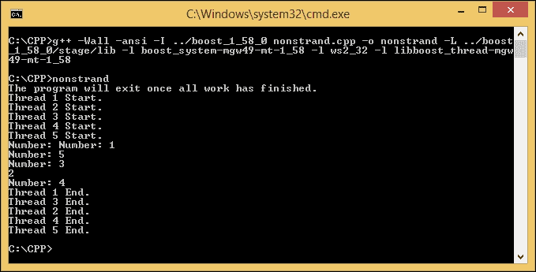
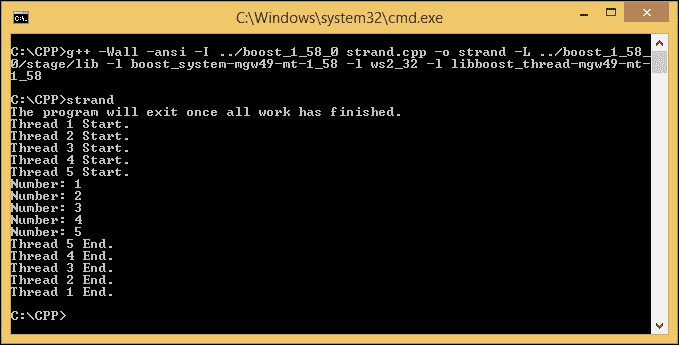
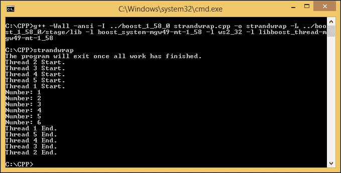
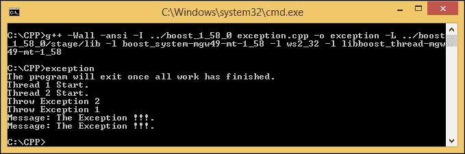
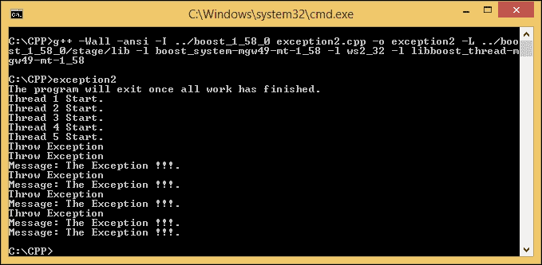
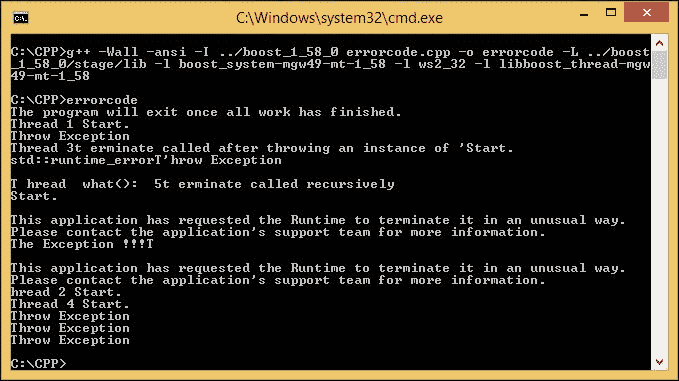
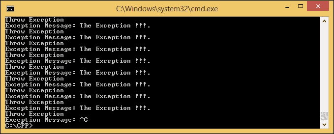
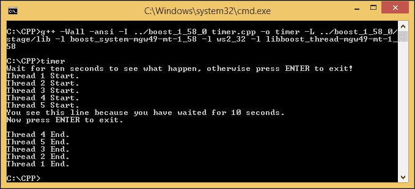
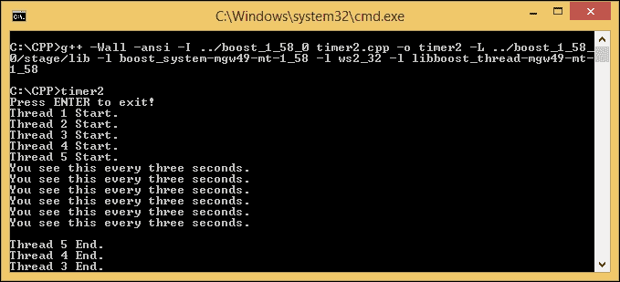
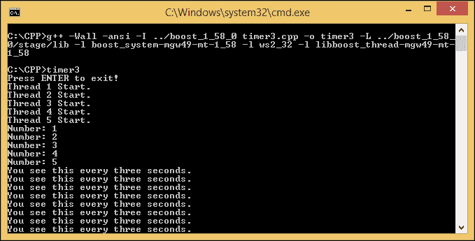

# 第五章。深入了解 Boost.Asio 库

现在我们能够运行`io_service`对象并给它一些工作要做，是时候了解更多关于`Boost.Asio`库中的其他对象，以开发网络应用程序。我们之前使用的`io_service`对象的所有工作都是异步运行的，但不是按顺序进行的，这意味着我们无法确定将运行`io_service`对象的工作的顺序。此外，我们还必须考虑如果我们的应用程序在运行时遇到任何错误会怎么做，并考虑运行任何`io_service`对象工作的时间间隔。因此，在本章中，我们将讨论以下主题：

+   串行执行`io_service`对象的工作

+   捕获异常并正确处理它们

+   在所需的时间内执行工作

# 串行化 I/O 服务工作

假设我们想要排队要做的工作，但顺序很重要。如果我们只应用异步方法，我们就不知道我们将得到的工作顺序。我们需要确保工作的顺序是我们想要的，并且已经设计好了。例如，如果我们按顺序发布 Work A，Work B 和 Work C，我们希望在运行时保持该顺序。

## 使用 strand 函数

**Strand**是`io_service`对象中的一个类，它提供了处理程序执行的串行化。它可以用来确保我们的工作将被串行执行。让我们来看一下下面的代码，以了解如何使用`strand`函数进行串行化。但首先，我们将在不使用`strand()`和`lock()`函数的情况下开始：

```cpp
/* nonstrand.cpp */
#include <boost/asio.hpp>
#include <boost/shared_ptr.hpp>
#include <boost/thread.hpp>
#include <boost/thread/mutex.hpp>
#include <boost/bind.hpp>
#include <iostream>

boost::mutex global_stream_lock;

void WorkerThread(boost::shared_ptr<boost::asio::io_service> iosvc, int counter) {
  global_stream_lock.lock();
  std::cout << "Thread " << counter << " Start.\n";
  global_stream_lock.unlock();

  iosvc->run();

  global_stream_lock.lock();
  std::cout << "Thread " << counter << " End.\n";
global_stream_lock.unlock();
}

void Print(int number) {
  std::cout << "Number: " << number << std::endl;
}

int main(void) {
  boost::shared_ptr<boost::asio::io_service> io_svc(
    new boost::asio::io_service
  );

  boost::shared_ptr<boost::asio::io_service::work> worker(
    new boost::asio::io_service::work(*io_svc)
  );

  global_stream_lock.lock();
  std::cout << "The program will exit once all work has finished.\n";
  global_stream_lock.unlock();

  boost::thread_group threads;
  for(int i=1; i<=5; i++)
    threads.create_thread(boost::bind(&WorkerThread, io_svc, i));

  boost::this_thread::sleep(boost::posix_time::milliseconds(500));

  io_svc->post(boost::bind(&Print, 1));
  io_svc->post(boost::bind(&Print, 2));
  io_svc->post(boost::bind(&Print, 3));
  io_svc->post(boost::bind(&Print, 4));
  io_svc->post(boost::bind(&Print, 5));

  worker.reset();

  threads.join_all();

  return 0;
}
```

将上述代码保存为`nonstrand.cpp`，并使用以下命令编译它：

```cpp
g++ -Wall -ansi -I ../boost_1_58_0 nonstrand.cpp -o nonstrand -L ../boost_1_58_0/stage/lib -l boost_system-mgw49-mt-1_58 -l ws2_32 -l libboost_thread-mgw49-mt-1_58

```

然后，在控制台窗口中输入`nonstrand`来运行它。我们将得到类似以下的输出：



你可能会得到不同的输出，事实上，多次运行程序会产生不同顺序的结果。这是因为，正如我们在上一章中讨论的，没有`lock`对象，输出将是不同步的，如下所示。我们可以注意到结果看起来是无序的：

```cpp
Number: Number: 1
Number: 5
Number: 3
2
Number: 4

```

```cpp
lock object to synchronize the output. This is why we get the output as shown in the preceding screenshot.
```

```cpp
void Print(int number) {
 std::cout << "Number: " << number << std::endl;
}

```

现在，让我们应用`strand`函数来同步程序的流程。输入以下代码并将其保存为`strand.cpp`：

```cpp
/* strand.cpp */
#include <boost/asio.hpp>
#include <boost/shared_ptr.hpp>
#include <boost/thread.hpp>
#include <boost/thread/mutex.hpp>
#include <boost/bind.hpp>
#include <iostream>

boost::mutex global_stream_lock;

void WorkerThread(boost::shared_ptr<boost::asio::io_service> iosvc, int counter) {
  global_stream_lock.lock();
  std::cout << "Thread " << counter << " Start.\n";
  global_stream_lock.unlock();

  iosvc->run();

  global_stream_lock.lock();
  std::cout << "Thread " << counter << " End.\n";
  global_stream_lock.unlock();
}

void Print(int number) {
  std::cout << "Number: " << number << std::endl;
}

int main(void) {
  boost::shared_ptr<boost::asio::io_service> io_svc(
    new boost::asio::io_service
  );

  boost::shared_ptr<boost::asio::io_service::work> worker(
    new boost::asio::io_service::work(*io_svc)
  );

  boost::asio::io_service::strand strand(*io_svc);

  global_stream_lock.lock();
  std::cout << "The program will exit once all work has finished.\n";
  global_stream_lock.unlock();

  boost::thread_group threads;
  for(int i=1; i<=5; i++)
    threads.create_thread(boost::bind(&WorkerThread, io_svc, i));

  boost::this_thread::sleep(boost::posix_time::milliseconds(500));

  strand.post(boost::bind(&Print, 1));
  strand.post(boost::bind(&Print, 2));
  strand.post(boost::bind(&Print, 3));
  strand.post(boost::bind(&Print, 4));
  strand.post(boost::bind(&Print, 5));

  worker.reset();

  threads.join_all();

  return 0;
}
```

使用以下命令编译上述代码：

```cpp
g++ -Wall -ansi -I ../boost_1_58_0 strand.cpp -o strand -L ../boost_1_58_0/stage/lib -l boost_system-mgw49-mt-1_58 -l ws2_32 -l libboost_thread-mgw49-mt-1_58

```

我们只对`nonstrand.cpp`进行了一点修改，改为`strand.cpp`，但影响很大。在运行程序之前，让我们区分一下`nonstrand.cpp`和`strand.cpp`之间的代码：

```cpp
io_svc->post(boost::bind(&Print, 1));
io_svc->post(boost::bind(&Print, 2));
io_svc->post(boost::bind(&Print, 3));
io_svc->post(boost::bind(&Print, 4));
io_svc->post(boost::bind(&Print, 5));

```

我们使用`post()`函数在`io_service`对象中给它工作。但是通过使用这种方法，程序的流程是不可预测的，因为它不是同步的：

```cpp
strand.post(boost::bind(&Print, 1));
strand.post(boost::bind(&Print, 2));
strand.post(boost::bind(&Print, 3));
strand.post(boost::bind(&Print, 4));
strand.post(boost::bind(&Print, 5));

```

然后，我们使用`strand`对象将工作交给`io_service`对象。通过使用这种方法，我们将确保工作的顺序与我们在代码中声明的顺序完全相同。为了证明这一点，让我们来看一下以下输出：



工作的顺序与我们代码中的工作顺序相同。我们以数字顺序显示工作的输出，即：

```cpp
Number: 1
Number: 2
Number: 3
Number: 4
Number: 5

```

而且，如果你记得，我们继续从`Print()`函数中省略`lock()`函数，但由于`strand`对象的使用，它仍然可以正常运行。现在，无论我们重新运行程序多少次，结果总是按升序排列。

## 通过 strand 对象包装处理程序

`boost::asio::strand`中有一个名为`wrap()`的函数。根据官方 Boost 文档，它创建一个新的处理程序函数对象，当调用时，它将自动将包装的处理程序传递给`strand`对象的调度函数。让我们看一下以下代码来解释它：

```cpp
/* strandwrap.cpp */
#include <boost/asio.hpp>
#include <boost/shared_ptr.hpp>
#include <boost/thread.hpp>
#include <boost/thread/mutex.hpp>
#include <boost/bind.hpp>
#include <iostream>

boost::mutex global_stream_lock;

void WorkerThread(boost::shared_ptr<boost::asio::io_service> iosvc, int counter) {
  global_stream_lock.lock();
  std::cout << "Thread " << counter << " Start.\n";
  global_stream_lock.unlock();

  iosvc->run();

  global_stream_lock.lock();
  std::cout << "Thread " << counter << " End.\n";
  global_stream_lock.unlock();
}

void Print(int number) {
  std::cout << "Number: " << number << std::endl;
}

int main(void) {
  boost::shared_ptr<boost::asio::io_service> io_svc(
    new boost::asio::io_service
  );

  boost::shared_ptr<boost::asio::io_service::work> worker(
    new boost::asio::io_service::work(*io_svc)
  );

  boost::asio::io_service::strand strand(*io_svc);

  global_stream_lock.lock();
  std::cout << "The program will exit once all work has finished." <<  std::endl;
  global_stream_lock.unlock();

  boost::thread_group threads;
  for(int i=1; i<=5; i++)
    threads.create_thread(boost::bind(&WorkerThread, io_svc, i));

  boost::this_thread::sleep(boost::posix_time::milliseconds(100));
  io_svc->post(strand.wrap(boost::bind(&Print, 1)));
  io_svc->post(strand.wrap(boost::bind(&Print, 2)));

  boost::this_thread::sleep(boost::posix_time::milliseconds(100));
  io_svc->post(strand.wrap(boost::bind(&Print, 3)));
  io_svc->post(strand.wrap(boost::bind(&Print, 4)));

  boost::this_thread::sleep(boost::posix_time::milliseconds(100));
  io_svc->post(strand.wrap(boost::bind(&Print, 5)));
  io_svc->post(strand.wrap(boost::bind(&Print, 6)));

  worker.reset();

  threads.join_all();

  return 0;
}
```

给上述代码命名为`strandwrap.cpp`，然后使用以下命令编译它：

```cpp
g++ -Wall -ansi -I ../boost_1_58_0 strandwrap.cpp -o strandwrap -L ../boost_1_58_0/stage/lib -l boost_system-mgw49-mt-1_58 -l ws2_32 -l libboost_thread-mgw49-mt-1_58

```

现在运行程序，我们将得到以下输出：



然而，如果我们多次运行程序，可能会产生如下随机输出：

```cpp
Number: 2
Number: 1
Number: 3
Number: 4
Number: 6
Number: 5

```

虽然工作保证按顺序执行，但实际发生的工作顺序并不是保证的，这是由于内置的处理程序包装器。如果顺序真的很重要，我们必须在使用`strand`对象时查看内置的处理程序包装器本身。

# 处理异常和错误

有时，我们的代码会在运行时抛出异常或错误。正如你可能记得在我们讨论第三章中的`lexical.cpp`时，*介绍 Boost C++库*，我们有时必须在代码中使用异常处理，现在我们将挖掘它来深入了解异常和错误处理。

## 处理异常

异常是一种在代码出现异常情况时通过将控制权转移给处理程序来对情况做出反应的方式。为了处理异常，我们需要在代码中使用`try-catch`块；然后，如果出现异常情况，异常将被抛出到异常处理程序。

现在，看一下以下代码，看看异常处理是如何使用的：

```cpp
/* exception.cpp */
#include <boost/asio.hpp>
#include <boost/shared_ptr.hpp>
#include <boost/thread.hpp>
#include <boost/thread/mutex.hpp>
#include <boost/bind.hpp>
#include <iostream>

boost::mutex global_stream_lock;

void WorkerThread(boost::shared_ptr<boost::asio::io_service> iosvc, int counter) {
  global_stream_lock.lock();
  std::cout << "Thread " << counter << " Start.\n";
  global_stream_lock.unlock();

  try {
    iosvc->run();

    global_stream_lock.lock();
    std::cout << "Thread " << counter << " End.\n";
    global_stream_lock.unlock();
  }
  catch(std::exception & ex) {
    global_stream_lock.lock();
    std::cout << "Message: " << ex.what() << ".\n";
    global_stream_lock.unlock();
  }
}

void ThrowAnException(boost::shared_ptr<boost::asio::io_service> iosvc, int counter) {
  global_stream_lock.lock();
  std::cout << "Throw Exception " << counter << "\n" ;
  global_stream_lock.unlock();

  throw(std::runtime_error("The Exception !!!"));
}

int main(void) {
  boost::shared_ptr<boost::asio::io_service> io_svc(
    new boost::asio::io_service
  );

  boost::shared_ptr<boost::asio::io_service::work> worker(
    new boost::asio::io_service::work(*io_svc)
  );

  global_stream_lock.lock();
  std::cout << "The program will exit once all work has finished.\n";
  global_stream_lock.unlock();

  boost::thread_group threads;
  for(int i=1; i<=2; i++)
    threads.create_thread(boost::bind(&WorkerThread, io_svc, i));

  io_svc->post(boost::bind(&ThrowAnException, io_svc, 1));
  io_svc->post(boost::bind(&ThrowAnException, io_svc, 2));
  io_svc->post(boost::bind(&ThrowAnException, io_svc, 3));
  io_svc->post(boost::bind(&ThrowAnException, io_svc, 4));
  io_svc->post(boost::bind(&ThrowAnException, io_svc, 5));

  threads.join_all();

  return 0;
}
```

将前面的代码保存为`exception.cpp`，并运行以下命令编译它：

```cpp
g++ -Wall -ansi -I ../boost_1_58_0 exception.cpp -o exception -L ../boost_1_58_0/stage/lib -l boost_system-mgw49-mt-1_58 -l ws2_32 -l libboost_thread-mgw49-mt-1_58

```

然后，运行程序，你应该会得到以下输出：



正如我们所看到的，由于异常，我们没有看到`std::cout << "Thread " << counter << " End.\n";`这一行。当`io_service`对象的工作运行时，它总是使用`throw`关键字抛出异常，以便异常将被`WorkerThread`函数内的`catch`块捕获，因为`iosvc->run()`函数在`try`块内。

我们还可以看到，尽管我们为`io_service`对象发布了五次工作，但异常处理只处理了两次异常，因为一旦线程完成，线程中的`join_all()`函数将完成线程并退出程序。换句话说，我们可以说一旦异常被处理，线程就退出以加入调用。可能会抛出异常的其他代码将永远不会被调用。

如果我们将`io_service`对象的工作调用递归放入呢？这会导致一个无限运行的程序吗？让我们尝试无限抛出异常。代码将如下所示：

```cpp
/* exception2.cpp */
#include <boost/asio.hpp>
#include <boost/shared_ptr.hpp>
#include <boost/thread.hpp>
#include <boost/thread/mutex.hpp>
#include <boost/bind.hpp>
#include <iostream>

boost::mutex global_stream_lock;

void WorkerThread(boost::shared_ptr<boost::asio::io_service> iosvc, int counter) {
  global_stream_lock.lock();
  std::cout << "Thread " << counter << " Start.\n";
  global_stream_lock.unlock();

  try {
    iosvc->run();

    global_stream_lock.lock();
    std::cout << "Thread " << counter << " End.\n";
    global_stream_lock.unlock();
  }
  catch(std::exception &ex) {
    global_stream_lock.lock();
    std::cout << "Message: " << ex.what() << ".\n";
    global_stream_lock.unlock();
  }
}

void ThrowAnException(boost::shared_ptr<boost::asio::io_service> iosvc) {
  global_stream_lock.lock();
  std::cout << "Throw Exception\n" ;
  global_stream_lock.unlock();

  iosvc->post(boost::bind(&ThrowAnException, iosvc));

  throw(std::runtime_error("The Exception !!!"));
}

int main(void) {
  boost::shared_ptr<boost::asio::io_service> io_svc(
    new boost::asio::io_service
  );

  boost::shared_ptr<boost::asio::io_service::work> worker(
    new boost::asio::io_service::work(*io_svc)
  );

  global_stream_lock.lock();
  std::cout << "The program will exit once all work has finished.\n";
  global_stream_lock.unlock();

  boost::thread_group threads;
  for(int i=1; i<=5; i++)
    threads.create_thread(boost::bind(&WorkerThread, io_svc, i));

  io_svc->post(boost::bind(&ThrowAnException, io_svc));

  threads.join_all();

  return 0;
}
```

将前面的代码保存为`exception2.cpp`，并使用以下命令编译它：

```cpp
g++ -Wall -ansi -I ../boost_1_58_0 exception2.cpp -o exception2 -L ../boost_1_58_0/stage/lib -l boost_system-mgw49-mt-1_58 -l ws2_32 -l libboost_thread-mgw49-mt-1_58

```

现在，让我们检查代码：

```cpp
iosvc->post(boost::bind(&ThrowAnException, iosvc));

```

```cpp
ThrowAnException function. Every time the ThrowAnException function is called, it will call itself. Then, it should be an infinite program since there is a recursive function. Let us run the program to prove this by typing the exception2 command in the console window. The output will be like the following:
```



幸运的是，程序能够成功完成。这是因为异常通过`run()`函数传播，工作线程退出。之后，所有线程都完成了，并且调用了`join_all()`函数。这就是为什么程序退出，即使`io_service`对象中还有工作未完成。

## 处理错误

在我们之前的例子中，我们使用了`run()`函数而没有任何参数，但实际上，该函数有两个重载方法，`std::size_t run()`和`std::size_t run(boost::system::error_code & ec)`。后一个方法有一个错误代码参数，如果发生错误，它将被设置。

现在，让我们尝试在`run()`函数中使用错误代码作为输入参数。看一下以下代码：

```cpp
/* errorcode.cpp */
#include <boost/asio.hpp>
#include <boost/shared_ptr.hpp>
#include <boost/thread.hpp>
#include <boost/thread/mutex.hpp>
#include <boost/bind.hpp>
#include <iostream>

boost::mutex global_stream_lock;

void WorkerThread(boost::shared_ptr<boost::asio::io_service> iosvc, int counter) {
  global_stream_lock.lock();
  std::cout << "Thread " << counter << " Start.\n";
  global_stream_lock.unlock();

  boost::system::error_code ec;
  iosvc->run(ec);

  if(ec) {
    global_stream_lock.lock();
    std::cout << "Message: " << ec << ".\n";
    global_stream_lock.unlock();
  }

  global_stream_lock.lock();
  std::cout << "Thread " << counter << " End.\n";
  global_stream_lock.unlock();
}

void ThrowAnException(boost::shared_ptr<boost::asio::io_service> iosvc) {
  global_stream_lock.lock();
  std::cout << "Throw Exception\n" ;
  global_stream_lock.unlock();

  iosvc->post(boost::bind(&ThrowAnException, iosvc));

  throw(std::runtime_error("The Exception !!!"));
}

int main(void) {
  boost::shared_ptr<boost::asio::io_service> io_svc(
    new boost::asio::io_service
  );

  boost::shared_ptr<boost::asio::io_service::work> worker(
    new boost::asio::io_service::work(*io_svc)
  );

  global_stream_lock.lock();
  std::cout << "The program will exit once all work has finished.\n";
  global_stream_lock.unlock();

  boost::thread_group threads;
  for(int i=1; i<=5; i++)
    threads.create_thread(boost::bind(&WorkerThread, io_svc, i));

  io_svc->post(boost::bind(&ThrowAnException, io_svc));

  threads.join_all();

  return 0;
}
```

将前面的代码保存为`errorcode.cpp`，并使用以下命令编译代码：

```cpp
g++ -Wall -ansi -I ../boost_1_58_0 errorcode.cpp -o errorcode -L ../boost_1_58_0/stage/lib -l boost_system-mgw49-mt-1_58 -l ws2_32 -l libboost_thread-mgw49-mt-1_58

```

现在，在控制台中输入`errorcode`命令运行程序。由于这样做，程序将崩溃。以下截图显示了输出：



我们打算通过以下代码检索错误代码：

```cpp
iosvc->run(ec);

```

我们可以使用`if`块来捕获错误，如下所示：

```cpp
if(ec)

```

然而，在错误变量方法中，用户异常会转换为`boost::asio`异常；因此，错误变量`ec`不会将用户异常解释为错误，因此处理程序不会捕获异常。如果`Boost.Asio`库需要抛出错误，如果没有错误变量，它将变为异常，或者将转换为错误变量。最好继续使用`try-catch`块来捕获任何异常或错误。

此外，我们还需要检查异常的类型，即系统故障或上下文故障。如果是系统故障，我们必须调用`io_service`类中的`stop()`函数，以确保工作对象已被销毁，以便程序能够退出。相反，如果异常是上下文故障，我们需要工作线程再次调用`run()`函数，以防止线程死亡。现在，让我们看以下代码以理解这个概念：

```cpp
/* errorcode2.cpp */
#include <boost/asio.hpp>
#include <boost/shared_ptr.hpp>
#include <boost/thread.hpp>
#include <boost/thread/mutex.hpp>
#include <boost/bind.hpp>
#include <iostream>

boost::mutex global_stream_lock;

void WorkerThread(boost::shared_ptr<boost::asio::io_service> iosvc, int counter) {
  global_stream_lock.lock();
  std::cout << "Thread " << counter << " Start.\n";
  global_stream_lock.unlock();

  while(true) {
    try {
      boost::system::error_code ec;
      iosvc->run(ec);
      if(ec) {
        global_stream_lock.lock();
        std::cout << "Error Message: " << ec << ".\n";
        global_stream_lock.unlock();
      }
      break;
    }
    catch(std::exception &ex) {
      global_stream_lock.lock();
      std::cout << "Exception Message: " << ex.what() << ".\n";
      global_stream_lock.unlock();
    }
  }

  global_stream_lock.lock();
  std::cout << "Thread " << counter << " End.\n";
  global_stream_lock.unlock();
}

void ThrowAnException(boost::shared_ptr<boost::asio::io_service> iosvc) {
  global_stream_lock.lock();
  std::cout << "Throw Exception\n" ;
  global_stream_lock.unlock();

  iosvc->post(boost::bind(&ThrowAnException, iosvc));

  throw(std::runtime_error("The Exception !!!"));
}

int main(void) {
  boost::shared_ptr<boost::asio::io_service> io_svc(
    new boost::asio::io_service
  );

  boost::shared_ptr<boost::asio::io_service::work> worker(
    new boost::asio::io_service::work(*io_svc)
  );

  global_stream_lock.lock();
  std::cout << "The program will exit once all work has finished.\n";
  global_stream_lock.unlock();

  boost::thread_group threads;
  for(int i=1; i<=5; i++)
    threads.create_thread(boost::bind(&WorkerThread, io_svc, i));

  io_svc->post(boost::bind(&ThrowAnException, io_svc));

  threads.join_all();

  return 0;
}
```

将上述代码保存为`errorcode2.cpp`，然后通过执行以下命令进行编译：

```cpp
g++ -Wall -ansi -I ../boost_1_58_0 errorcode2.cpp -o errorcode2 -L ../boost_1_58_0/stage/lib -l boost_system-mgw49-mt-1_58 -l ws2_32 -l libboost_thread-mgw49-mt-1_58

```

如果我们运行程序，会发现它不会退出，我们必须按*Ctrl* + *C*来停止程序：



如果我们看到以下代码片段：

```cpp
while(true) {
 try {
 . . .
 iosvc->run(ec);
 if(ec)
 . . .
 }
 catch(std::exception &ex) {
 . . .
 }
}

```

工作线程正在循环。当输出结果中发生异常时（由`Throw Exception`和`Exception Message: The Exception!!!`输出表示），再次调用`run()`函数，这样它将向队列中发布一个新事件。当然，我们不希望这种情况发生在我们的应用程序中。

# 使用定时器类来计时工作执行

Boost C++库中有一个类，它提供了对定时器进行阻塞或异步等待的能力，称为**截止定时器**。截止定时器表示两种状态之一：到期或未到期。

## 一个即将到期的定时器

在这里，我们将创建一个在 10 秒后到期的定时器。让我们看一下以下代码：

```cpp
/* timer.cpp */
#include <boost/asio.hpp>
#include <boost/shared_ptr.hpp>
#include <boost/thread.hpp>
#include <boost/thread/mutex.hpp>
#include <boost/bind.hpp>
#include <iostream>

boost::mutex global_stream_lock;

void WorkerThread(boost::shared_ptr<boost::asio::io_service> iosvc, int counter) {
  global_stream_lock.lock();
  std::cout << "Thread " << counter << " Start.\n";
  global_stream_lock.unlock();

  while(true) {
    try {
      boost::system::error_code ec;
      iosvc->run(ec);
      if(ec) {
        global_stream_lock.lock();
        std::cout << "Message: " << ec << ".\n";
        global_stream_lock.unlock();
      }
      break;
    }
    catch(std::exception &ex) {
      global_stream_lock.lock();
      std::cout << "Message: " << ex.what() << ".\n";
      global_stream_lock.unlock();
    }
  }

  global_stream_lock.lock();
  std::cout << "Thread " << counter << " End.\n";
  global_stream_lock.unlock();
}

void TimerHandler(const boost::system::error_code & ec) {
  if(ec) {
    global_stream_lock.lock();
    std::cout << "Error Message: " << ec << ".\n";
    global_stream_lock.unlock();
  }
  else {
    global_stream_lock.lock();
    std::cout << "You see this line because you have waited for 10 seconds.\n";
    std::cout << "Now press ENTER to exit.\n";
    global_stream_lock.unlock();
  }
}

int main(void) {
  boost::shared_ptr<boost::asio::io_service> io_svc(
    new boost::asio::io_service
  );

  boost::shared_ptr<boost::asio::io_service::work> worker(
    new boost::asio::io_service::work(*io_svc)
  );

  global_stream_lock.lock();
  std::cout << "Wait for ten seconds to see what happen, ";
  std::cout << "otherwise press ENTER to exit!\n";
  global_stream_lock.unlock();

  boost::thread_group threads;
  for(int i=1; i<=5; i++)
    threads.create_thread(boost::bind(&WorkerThread, io_svc, i));

  boost::asio::deadline_timer timer(*io_svc);
  timer.expires_from_now(boost::posix_time::seconds(10));
  timer.async_wait(TimerHandler);

  std::cin.get();

  io_svc->stop();

  threads.join_all();

  return 0;
}
```

将上述代码保存为`timer.cpp`，并运行以下命令进行编译：

```cpp
g++ -Wall -ansi -I ../boost_1_58_0 timer.cpp -o timer -L ../boost_1_58_0/stage/lib -l boost_system-mgw49-mt-1_58 -l ws2_32 -l libboost_thread-mgw49-mt-1_58

```

现在，让我们在运行之前区分一下代码：

```cpp
boost::asio::deadline_timer timer(*io_svc);
timer.expires_from_now(boost::posix_time::seconds(10));
timer.async_wait(TimerHandler);

```

在程序调用`TimerHandler`函数之前，它必须等待 10 秒，因为我们使用了`timer`对象的`expires_from_now`函数。`async_wait()`函数将等待直到定时器到期：

```cpp
void TimerHandler(const boost::system::error_code & ec) {
 if(ec)
 . . .
}
else {
 global_stream_lock.lock();
 std::cout << "You see this line because you have waited for 10 seconds.\n";
 std::cout << "Now press ENTER to exit.\n";
 global_stream_lock.unlock();
}

```

定时器到期后，将调用`TimerHandler`函数，由于没有错误，程序将执行`else`块内的代码。让我们运行程序，看完整的输出： 



并且，由于我们使用了`async_wait()`函数，我们可以在看到这行之前按下*Enter*键退出程序，**现在按 Enter 键退出**。

## 使用定时器和 boost::bind 函数

让我们尝试创建一个循环定时器。我们必须初始化全局定时器对象，以便该对象成为共享对象。为了实现这一点，我们需要`shared_ptr`指针和`boost::bind`方法的帮助，以使线程安全，因为我们将使用共享对象：

```cpp
/* timer2.cpp */
#include <boost/asio.hpp>
#include <boost/shared_ptr.hpp>
#include <boost/thread.hpp>
#include <boost/thread/mutex.hpp>
#include <boost/bind.hpp>
#include <iostream>

boost::mutex global_stream_lock;

void WorkerThread(boost::shared_ptr<boost::asio::io_service> iosvc, int counter) {
  global_stream_lock.lock();
  std::cout << "Thread " << counter << " Start.\n";
  global_stream_lock.unlock();

  while( true ) {
    try {
      boost::system::error_code ec;
      iosvc->run(ec);
      if(ec) {
        global_stream_lock.lock();
        std::cout << "Message: " << ec << ".\n";
        global_stream_lock.unlock();
      }
      break;
    }
    catch(std::exception &ex) {
      global_stream_lock.lock();
      std::cout << "Message: " << ex.what() << ".\n";
      global_stream_lock.unlock();
    }
  }

  global_stream_lock.lock();
  std::cout << "Thread " << counter << " End.\n";
  global_stream_lock.unlock();
}

void TimerHandler(
  const boost::system::error_code &ec,
  boost::shared_ptr<boost::asio::deadline_timer> tmr
)
{
  if(ec) {
    global_stream_lock.lock();
    std::cout << "Error Message: " << ec << ".\n";
    global_stream_lock.unlock();
  }
  else {
    global_stream_lock.lock();
    std::cout << "You see this every three seconds.\n";
    global_stream_lock.unlock();

    tmr->expires_from_now( boost::posix_time::seconds(3));
    tmr->async_wait(boost::bind(&TimerHandler, _1, tmr));
  }
}

int main(void) {
  boost::shared_ptr<boost::asio::io_service> io_svc(
    new boost::asio::io_service
  );

  boost::shared_ptr<boost::asio::io_service::work> worker(
    new boost::asio::io_service::work(*io_svc)
  );

  global_stream_lock.lock();
  std::cout << "Press ENTER to exit!\n";
  global_stream_lock.unlock();

  boost::thread_group threads;
  for(int i=1; i<=5; i++)
    threads.create_thread(boost::bind(&WorkerThread, io_svc, i));

  boost::shared_ptr<boost::asio::deadline_timer> timer(
    new boost::asio::deadline_timer(*io_svc)
  );
  timer->expires_from_now( boost::posix_time::seconds(3));
  timer->async_wait(boost::bind(&TimerHandler, _1, timer));

  std::cin.get();

  io_svc->stop();

  threads.join_all();

  return 0;
}
```

将上述代码保存为`timer2.cpp`，并运行以下命令进行编译：

```cpp
g++ -Wall -ansi -I ../boost_1_58_0 timer2.cpp -o timer2 -L ../boost_1_58_0/stage/lib -l boost_system-mgw49-mt-1_58 -l ws2_32 -l libboost_thread-mgw49-mt-1_58

```

现在运行程序。我们会得到一个重复的输出，可以通过按*Enter*键来停止：



从输出中我们可以看到，定时器每三秒触发一次，当用户按下*Enter*键后工作将停止。现在，让我们看以下代码片段：

```cpp
timer->async_wait(boost::bind(&TimerHandler, _1, timer));

```

`boost::bind`函数帮助我们使用全局定时器对象。如果我们深入研究，我们可以使用`_1`参数来进行`boost::bind`函数。如果我们阅读`boost::bind`函数的文档，我们会发现`_1`参数是一个占位符参数，将被第一个输入参数替换。

### 注意

有关使用占位符绑定的更多信息，请查看官方 Boost 文档[www.boost.org/doc/libs/1_58_0/libs/bind/doc/html/bind.html](http://www.boost.org/doc/libs/1_58_0/libs/bind/doc/html/bind.html)。

关于占位参数的更多信息，请参见[en.cppreference.com/w/cpp/utility/functional/placeholders](http://en.cppreference.com/w/cpp/utility/functional/placeholders)。

## 使用定时器和 boost::strand 函数

由于定时器是异步执行的，可能定时器的执行不是一个序列化的过程。定时器可能在一个线程中执行，同时另一个事件也在执行。正如我们之前讨论过的，我们可以利用 strand 函数来序列化执行顺序。让我们来看下面的代码片段：

```cpp
/* timer3.cpp */
#include <boost/asio.hpp>
#include <boost/shared_ptr.hpp>
#include <boost/thread.hpp>
#include <boost/thread/mutex.hpp>
#include <boost/bind.hpp>
#include <iostream>

boost::mutex global_stream_lock;

void WorkerThread(boost::shared_ptr<boost::asio::io_service> iosvc, int counter) {
  global_stream_lock.lock();
  std::cout << "Thread " << counter << " Start.\n";
  global_stream_lock.unlock();

  while( true ) {
    try {
      boost::system::error_code ec;
      iosvc->run(ec);
      if(ec) {
        global_stream_lock.lock();
        std::cout << "Message: " << ec << ".\n";
        global_stream_lock.unlock();
      }
      break;
    }
    catch(std::exception &ex) {
      global_stream_lock.lock();
      std::cout << "Message: " << ex.what() << ".\n";
      global_stream_lock.unlock();
    }
  }

  global_stream_lock.lock();
  std::cout << "Thread " << counter << " End.\n";
  global_stream_lock.unlock();
}

void TimerHandler(
  const boost::system::error_code &ec,
  boost::shared_ptr<boost::asio::deadline_timer> tmr,
  boost::shared_ptr<boost::asio::io_service::strand> strand
)
{
  if(ec) {
    global_stream_lock.lock();
    std::cout << "Error Message: " << ec << ".\n";
    global_stream_lock.unlock();
  }
  else {
    global_stream_lock.lock();
    std::cout << "You see this every three seconds.\n";
    global_stream_lock.unlock();

    tmr->expires_from_now( boost::posix_time::seconds(1));
    tmr->async_wait(
      strand->wrap(boost::bind(&TimerHandler, _1, tmr, strand))
    );
  }
}

void Print(int number) {
  std::cout << "Number: " << number << std::endl;
  boost::this_thread::sleep( boost::posix_time::milliseconds(500));
}

int main(void) {
  boost::shared_ptr<boost::asio::io_service> io_svc(
    new boost::asio::io_service
  );

  boost::shared_ptr<boost::asio::io_service::work> worker(
    new boost::asio::io_service::work(*io_svc)
  );
  boost::shared_ptr<boost::asio::io_service::strand> strand(
    new boost::asio::io_service::strand(*io_svc)
  );

  global_stream_lock.lock();
  std::cout << "Press ENTER to exit!\n";
  global_stream_lock.unlock();

  boost::thread_group threads;
  for(int i=1; i<=5; i++)
    threads.create_thread(boost::bind(&WorkerThread, io_svc, i));

  boost::this_thread::sleep(boost::posix_time::seconds(1));

  strand->post(boost::bind(&Print, 1));
  strand->post(boost::bind(&Print, 2));
  strand->post(boost::bind(&Print, 3));
  strand->post(boost::bind(&Print, 4));
  strand->post(boost::bind(&Print, 5));

  boost::shared_ptr<boost::asio::deadline_timer> timer(
    new boost::asio::deadline_timer(*io_svc)
  );

  timer->expires_from_now( boost::posix_time::seconds(1));
  timer->async_wait( 
    strand->wrap(boost::bind(&TimerHandler, _1, timer, strand))
  );

  std::cin.get();

  io_svc->stop();

  threads.join_all();

  return 0;
}
```

将上述代码保存为`timer3.cpp`，并通过运行以下命令进行编译：

```cpp
g++ -Wall -ansi -I ../boost_1_58_0 timer3.cpp -o timer3 -L ../boost_1_58_0/stage/lib -l boost_system-mgw49-mt-1_58 -l ws2_32 -l libboost_thread-mgw49-mt-1_58

```

现在，在控制台中输入`timer3`命令运行程序，我们将得到以下输出：



从输出中，我们可以看到前五个 work 对象首先被执行，因为它们必须被串行执行，然后执行 TimerHandler()函数。在定时器线程执行之前，必须先完成 work 对象。如果我们移除 strand 包装，程序的流程将变得混乱，因为我们没有在 Print()函数内部锁定 std::cout 函数。

# 总结

我们已成功通过使用 strand 对象对 io_service 对象的工作进行了序列化，因此我们可以确保我们设计的工作顺序。我们还可以通过使用错误和异常处理来确保我们的程序能够顺利运行而不会崩溃。最后，在本章中，我们讨论了等待时间，因为在创建网络应用程序时这一点非常重要。

现在，让我们继续下一章，讨论创建一个服务器-客户端应用程序，使得服务器和客户端之间的通信成为可能。
