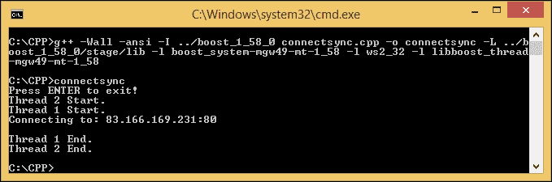
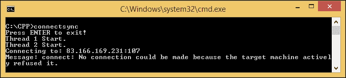
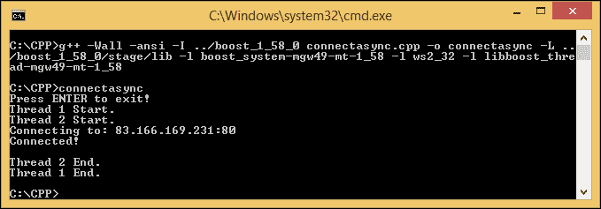
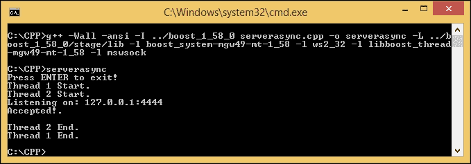
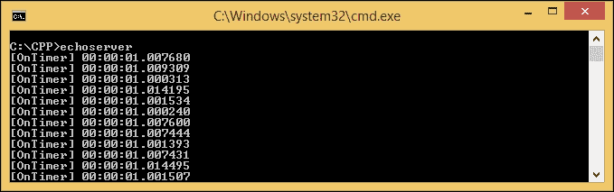
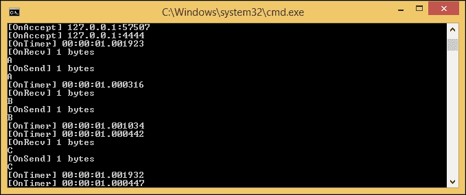
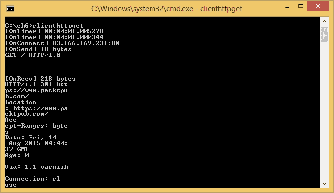

# 第六章：创建一个客户端-服务器应用程序

在上一章中，我们深入研究了`Boost.Asio`库，这对于开发网络应用程序非常重要。现在，我们将深入讨论一个**客户端-服务器**应用程序，它可以在两台或多台计算机之间的计算机网络上相互通信。其中一个称为**客户端**，另一个称为**服务器**。

我们将讨论服务器的开发，它能够从客户端发送和接收数据流量，并创建一个客户端程序来接收数据流量。在本章中，我们将讨论以下主题：

+   在客户端和服务器之间建立连接

+   在客户端和服务器之间发送和接收数据

+   通过包装最常用的代码来简化编程过程，避免代码重用

# 建立连接

我们在第二章中讨论了两种类型的 Internet 协议（IP），即传输控制协议（TCP）和用户数据报协议（UDP）。TCP 是面向连接的，这意味着在建立连接后可以发送数据。相反，UDP 是无连接的 Internet 协议，这意味着协议直接将数据发送到目标设备。在本章中，我们只讨论 TCP；因此，我们必须首先建立连接。只有在两方，即客户端和服务器，在本例中接受连接时，连接才能建立。在这里，我们将尝试同步和异步地建立连接。

## 一个同步客户端

我们首先要建立与远程主机的同步连接。它充当客户端，将打开到 Packt Publishing 网站（[www.packtpub.com](http://www.packtpub.com)）的连接。我们将使用 TCP 协议，正如我们在第二章中讨论的那样，*理解网络概念*。以下是代码：

```cpp
/* connectsync.cpp */
#include <boost/asio.hpp>
#include <boost/shared_ptr.hpp>
#include <boost/thread.hpp>
#include <boost/thread/mutex.hpp>
#include <boost/bind.hpp>
#include <boost/lexical_cast.hpp>

boost::mutex global_stream_lock;

void WorkerThread(boost::shared_ptr<boost::asio::io_service> iosvc, int counter) {
  global_stream_lock.lock();
  std::cout << "Thread " << counter << " Start.\n";
  global_stream_lock.unlock();

  while(true) {
    try {
      boost::system::error_code ec;
      iosvc->run(ec);
      if(ec) {
        global_stream_lock.lock();
        std::cout << "Message: " << ec << ".\n";
        global_stream_lock.unlock();
      }
      break;
    }
    catch(std::exception &ex) {
      global_stream_lock.lock();
      std::cout << "Message: " << ex.what() << ".\n";
      global_stream_lock.unlock();
    }
  }

  global_stream_lock.lock();
  std::cout << "Thread " << counter << " End.\n";
  global_stream_lock.unlock();
}

int main(void) {
  boost::shared_ptr<boost::asio::io_service> io_svc(
    new boost::asio::io_service
  );

  boost::shared_ptr<boost::asio::io_service::work> worker(
    new boost::asio::io_service::work(*io_svc)
  );
  boost::shared_ptr<boost::asio::io_service::strand> strand(
    new boost::asio::io_service::strand(*io_svc)
  );

  global_stream_lock.lock();
  std::cout << "Press ENTER to exit!\n";
  global_stream_lock.unlock();

  boost::thread_group threads;
  for(int i=1; i<=2; i++)
    threads.create_thread(boost::bind(&WorkerThread, io_svc, i));

  boost::asio::ip::tcp::socket sckt(*io_svc);

  try {
    boost::asio::ip::tcp::resolver resolver(*io_svc);
    boost::asio::ip::tcp::resolver::query query("www.packtpub.com", 
      boost::lexical_cast<std::string>(80)
    );
    boost::asio::ip::tcp::resolver::iterator iterator = resolver.resolve(query);
    boost::asio::ip::tcp::endpoint endpoint = *iterator;

    global_stream_lock.lock();
    std::cout << "Connecting to: " << endpoint << std::endl;
    global_stream_lock.unlock();

    sckt.connect(endpoint); 
    std::cout << "Connected!\n";
  }
  catch(std::exception &ex) {
    global_stream_lock.lock();
    std::cout << "Message: " << ex.what() << ".\n";
    global_stream_lock.unlock();
  }

  std::cin.get();

  boost::system::error_code ec;
  sckt.shutdown(boost::asio::ip::tcp::socket::shutdown_both, ec);
  sckt.close(ec);

  io_svc->stop();

  threads.join_all();

  return 0;
}
```

将上述代码保存为`connectsync.cpp`，并运行以下命令来编译代码：

```cpp
g++ -Wall -ansi -I ../boost_1_58_0 connectsync.cpp -o connectsync -L ../boost_1_58_0/stage/lib -l boost_system-mgw49-mt-1_58 -l ws2_32 -l libboost_thread-mgw49-mt-1_58

```

在控制台中输入`connectsync`来运行程序，我们应该会得到以下输出：



一旦我们按下*Enter*键，程序将退出。

现在让我们分析代码。正如我们在前面的代码中所看到的，我们使用了之前的示例代码并插入了一行代码，以便能够建立连接。让我们注意我们插入的那一行：

```cpp
boost::asio::ip::tcp::socket sckt(*io_svc);

```

现在我们有了一个全局变量，即`socket`。这个变量将用于提供套接字功能。它来自命名空间`boost::asio::ip::tcp`，因为我们使用 TCP 作为我们的协议：

```cpp
boost::asio::ip::tcp::resolver resolver(*io_svc);
boost::asio::ip::tcp::resolver::query query("www.packtpub.com",
 boost::lexical_cast<std::string>(80)
);
boost::asio::ip::tcp::resolver::iterator iterator =
resolver.resolve(query);

```

我们还使用了命名空间`boost::asio::ip::tcp::resolver`。它用于获取我们想要连接的远程主机的地址。使用`query()`类，我们将 Internet 地址和端口作为参数传递。但是因为我们使用整数类型作为端口号，所以我们必须使用`lexical_cast`将其转换为字符串。查询类用于描述可以传递给解析器的查询。然后，通过使用`iterator`类，我们将从解析器返回的结果中定义迭代器：

```cpp
boost::asio::ip::tcp::endpoint endpoint = *iterator;

```

成功创建迭代器后，我们将其提供给`endpoint`类型变量。端点将存储由`resolver`生成的`ip`地址列表：

```cpp
sckt.connect(endpoint);

```

然后，`connect()`成员函数将套接字连接到我们之前指定的端点。如果一切正常，没有错误或异常抛出，连接现在已经建立：

```cpp
boost::system::error_code ec;
sckt.shutdown(boost::asio::ip::tcp::socket::shutdown_both, ec);
sckt.close(ec);

```

为了释放连接，我们必须首先使用`shutdown()`成员函数在套接字上禁用发送和接收数据过程；然后，我们调用`close()`成员函数关闭套接字。

当我们运行程序并得到类似上图的输出时，它会通知我们连接已建立。我们可以更改端口号，例如在`query()`类中将端口号更改为`110`，即远程 TELNET 服务协议。

```cpp
boost::asio::ip::tcp::resolver::query query("www.packtpub.com",
 boost::lexical_cast<std::string>(110)
);

```

然后，程序将抛出异常，输出如下：



从输出中，我们可以得出结论，连接被目标机器拒绝，因为我们计划连接的端口是关闭的。这意味着通过使用端口`80`，即**超文本传输协议**（**HTTP**），我们可以与 Packt Publishing 网站建立连接。

## 一个异步客户端

我们已经能够同步建立连接。但是，如果我们需要异步连接到目标，以便程序在尝试建立连接时不会冻结，该怎么办呢？让我们看一下以下代码，找到答案：

```cpp
/* connectasync.cpp */
#include <boost/asio.hpp>
#include <boost/shared_ptr.hpp>
#include <boost/thread.hpp>
#include <boost/thread/mutex.hpp>
#include <boost/bind.hpp>
#include <boost/lexical_cast.hpp>
#include <iostream>
#include <string>

boost::mutex global_stream_lock;

void WorkerThread(boost::shared_ptr<boost::asio::io_service> iosvc, int counter) {
  global_stream_lock.lock();
  std::cout << "Thread " << counter << " Start.\n";
  global_stream_lock.unlock();

  while(true) {
    try {
      boost::system::error_code ec;
      iosvc->run(ec);
      if(ec) {
        global_stream_lock.lock();
        std::cout << "Message: " << ec << ".\n";
        global_stream_lock.unlock();
      }
      break;
    }
    catch(std::exception &ex) {
      global_stream_lock.lock();
      std::cout << "Message: " << ex.what() << ".\n";
      global_stream_lock.unlock();
    }
  }

  global_stream_lock.lock();
  std::cout << "Thread " << counter << " End.\n";
  global_stream_lock.unlock();
}

void OnConnect(const boost::system::error_code &ec) {
  if(ec) {
    global_stream_lock.lock();
    std::cout << "OnConnect Error: " << ec << ".\n";
    global_stream_lock.unlock();
  }
  else {
    global_stream_lock.lock();
    std::cout << "Connected!.\n";
    global_stream_lock.unlock();
  }
}

int main(void) {
  boost::shared_ptr<boost::asio::io_service> io_svc(
    new boost::asio::io_service
  );

  boost::shared_ptr<boost::asio::io_service::work> worker(
    new boost::asio::io_service::work(*io_svc)
  );

  boost::shared_ptr<boost::asio::io_service::strand> strand(
    new boost::asio::io_service::strand(*io_svc)
  );

  global_stream_lock.lock();
  std::cout << "Press ENTER to exit!\n";
  global_stream_lock.unlock();

  boost::thread_group threads;
  for(int i=1; i<=2; i++)
    threads.create_thread(boost::bind(&WorkerThread, io_svc, i));

  boost::shared_ptr<boost::asio::ip::tcp::socket> sckt(
    new boost::asio::ip::tcp::socket(*io_svc)
  );

  try {
    boost::asio::ip::tcp::resolver resolver(*io_svc);
    boost::asio::ip::tcp::resolver::query query("www.packtpub.com",
      boost::lexical_cast<std::string>(80)
    );
    boost::asio::ip::tcp::resolver::iterator iterator = resolver.resolve( query );
    boost::asio::ip::tcp::endpoint endpoint = *iterator;

    global_stream_lock.lock();
    std::cout << "Connecting to: " << endpoint << std::endl;
    global_stream_lock.unlock();

    sckt->async_connect(endpoint, boost::bind(OnConnect, _1));
  }
  catch(std::exception &ex) {
    global_stream_lock.lock();
    std::cout << "Message: " << ex.what() << ".\n";
    global_stream_lock.unlock();
  }

  std::cin.get();

  boost::system::error_code ec;
  sckt->shutdown(boost::asio::ip::tcp::socket::shutdown_both, ec);
  sckt->close(ec);

  io_svc->stop();

  threads.join_all();

  return 0;
}
```

然后，将上述代码保存为`connectasync.cpp`，并运行以下命令来编译代码：

```cpp
g++ -Wall -ansi -I ../boost_1_58_0 connectasync.cpp -o connectasync -L ../boost_1_58_0/stage/lib -l boost_system-mgw49-mt-1_58 -l ws2_32 -l libboost_thread-mgw49-mt-1_58

```

尝试运行程序，你应该会得到以下输出：



正如我们在上述代码中所看到的，我们添加了`OnConnect()`函数。因为`socket`对象是不可复制的，我们需要确保在处理程序等待调用时它仍然有效，所以我们必须使用`boost::shared_ptr`命名空间。我们还使用`boost::bind`命名空间来调用处理程序，也就是`OnConnect()`函数。

## 一个异步服务器

我们已经知道如何同步和异步连接到远程主机。现在，我们将创建服务器程序，与之前创建的客户端程序进行通信。因为我们将处理`boost::asio`命名空间中的异步程序，我们只会讨论异步服务器中的客户端程序。让我们看一下以下代码：

```cpp
/* serverasync.cpp */
#include <boost/asio.hpp>
#include <boost/shared_ptr.hpp>
#include <boost/thread.hpp>
#include <boost/thread/mutex.hpp>
#include <boost/bind.hpp>
#include <boost/lexical_cast.hpp>
#include <iostream>
#include <string>

boost::mutex global_stream_lock;

void WorkerThread(boost::shared_ptr<boost::asio::io_service> iosvc, int counter) {
  global_stream_lock.lock();
  std::cout << "Thread " << counter << " Start.\n";
  global_stream_lock.unlock();

  while(true) {
    try {
      boost::system::error_code ec;
      iosvc->run(ec);
      if(ec) {
        global_stream_lock.lock();
        std::cout << "Message: " << ec << ".\n";
        global_stream_lock.unlock();
      }
      break;
    }
    catch(std::exception &ex) {
      global_stream_lock.lock();
      std::cout << "Message: " << ex.what() << ".\n";
      global_stream_lock.unlock();
    }
  }

  global_stream_lock.lock();
  std::cout << "Thread " << counter << " End.\n";
  global_stream_lock.unlock();
}

void OnAccept(const boost::system::error_code &ec) {
  if(ec) {
    global_stream_lock.lock();
    std::cout << "OnAccept Error: " << ec << ".\n";
    global_stream_lock.unlock();
  }
  else {
    global_stream_lock.lock();
    std::cout << "Accepted!" << ".\n";
    global_stream_lock.unlock();
  }
}

int main(void) {
  boost::shared_ptr<boost::asio::io_service> io_svc(
    new boost::asio::io_service
  );

  boost::shared_ptr<boost::asio::io_service::work> worker(
    new boost::asio::io_service::work(*io_svc)
  );

  boost::shared_ptr<boost::asio::io_service::strand> strand(
    new boost::asio::io_service::strand(*io_svc)
  );

  global_stream_lock.lock();
  std::cout << "Press ENTER to exit!\n";
  global_stream_lock.unlock();

  boost::thread_group threads;
  for(int i=1; i<=2; i++)
    threads.create_thread(boost::bind(&WorkerThread, io_svc, i));

  boost::shared_ptr< boost::asio::ip::tcp::acceptor > acceptor(
    new boost::asio::ip::tcp::acceptor(*io_svc)
  );

  boost::shared_ptr<boost::asio::ip::tcp::socket> sckt(
    new boost::asio::ip::tcp::socket(*io_svc)
  );

  try {
    boost::asio::ip::tcp::resolver resolver(*io_svc);
    boost::asio::ip::tcp::resolver::query query(
      "127.0.0.1", 
      boost::lexical_cast<std::string>(4444)
    );
    boost::asio::ip::tcp::endpoint endpoint = *resolver.resolve(query);
    acceptor->open(endpoint.protocol());
    acceptor->set_option(
      boost::asio::ip::tcp::acceptor::reuse_address(false));
    acceptor->bind(endpoint);
    acceptor->listen(boost::asio::socket_base::max_connections);
    acceptor->async_accept(*sckt, boost::bind(OnAccept, _1));

    global_stream_lock.lock();
    std::cout << "Listening on: " << endpoint << std::endl;
    global_stream_lock.unlock();
  }
  catch(std::exception &ex) {
    global_stream_lock.lock();
    std::cout << "Message: " << ex.what() << ".\n";
    global_stream_lock.unlock();
  }

  std::cin.get();

  boost::system::error_code ec;
  acceptor->close(ec);

  sckt->shutdown(boost::asio::ip::tcp::socket::shutdown_both, ec);
  sckt->close(ec);

  io_svc->stop();

  threads.join_all();

  return 0;
}
```

将上述代码保存为`serverasync.cpp`，并运行以下命令来编译代码：

```cpp
g++ -Wall -ansi -I ../boost_1_58_0 serverasync.cpp -o serverasync -L ../boost_1_58_0/stage/lib -l boost_system-mgw49-mt-1_58 -l ws2_32 -l libboost_thread-mgw49-mt-1_58 –l mswsock

```

在运行程序之前，让我们区分一下代码。我们现在有一个新对象，即`tcp::acceptor`。这个对象用于接受新的套接字连接。由于使用了`accept()`函数，我们需要在编译过程中添加`mswsock`库：

```cpp
acptor->open(endpoint.protocol());
acptor->set_option
(boost::asio::ip::tcp::acceptor::reuse_address(false));
acptor->bind(endpoint);
acptor->listen(boost::asio::socket_base::max_connections);
acptor->async_accept(*sckt, boost::bind(OnAccept, _1));

```

```cpp
open() function to open the acceptor by using the protocol that is retrieved from the endpoint variable. Then, by using the set_option function, we set an option on the acceptor to not reuse the address. The acceptor is also bound to the endpoint using the bind() function. After that, we invoke the listen() function to put the acceptor into the state where it will listen for new connections. Finally, the acceptor will accept new connections by using the async_accept() function, which will start an asynchronous accept.
```

现在，是时候运行程序了。我们需要在这里打开两个命令控制台。第一个控制台是用于程序本身的，第二个是用于调用`telnet`命令连接到服务器的。我们只需要在运行`serverasync`程序后立即运行命令`telnet 127.0.0.1 4444`（我们可以参考第二章中的*理解网络概念*，在命令提示符中调用`telnet`命令）。输出应该如下所示：



从上图中，我们可以看到程序在启动时监听端口`4444`，并且在我们调用`telnet`命令连接到端口`4444`时，程序接受了连接。然而，因为我们只有一个套接字对象，并且只调用了一次`async_accept()`函数，程序只会接受一个连接。

# 读取和写入套接字

我们现在正式能够建立客户端-服务器连接。现在，我们将写入和读取套接字，使连接更有用。我们将修改之前的代码`serverasync.cpp`，并添加`basic_stream_socket`对象，提供面向流的套接字功能。

### 注意

要获取有关`basic_stream_socket`对象的更详细信息，可以访问[www.boost.org/doc/libs/1_58_0/doc/html/boost_asio/reference/basic_stream_socket.html](http://www.boost.org/doc/libs/1_58_0/doc/html/boost_asio/reference/basic_stream_socket.html)。

现在，让我们看一下包含读取和写入套接字过程的以下代码：

```cpp
/* readwritesocket.cpp */
#include <boost/asio.hpp>
#include <boost/shared_ptr.hpp>
#include <boost/thread.hpp>
#include <boost/thread/mutex.hpp>
#include <boost/bind.hpp>
#include <boost/lexical_cast.hpp>
#include <boost/cstdint.hpp>
#include <boost/enable_shared_from_this.hpp>
#include <iostream>
#include <string>

boost::mutex global_stream_lock;

void WorkerThread(boost::shared_ptr<boost::asio::io_service> iosvc, int counter) {
  global_stream_lock.lock();
  std::cout << "Thread " << counter << " Start.\n";
  global_stream_lock.unlock();

  while(true) {
    try {
      boost::system::error_code ec;
      iosvc->run(ec);
      if(ec) {
        global_stream_lock.lock();
        std::cout << "Message: " << ec << ".\n";
        global_stream_lock.unlock();
      }
      break;
    }
    catch(std::exception &ex) {
      global_stream_lock.lock();
      std::cout << "Message: " << ex.what() << ".\n";
      global_stream_lock.unlock();
    }
  }

  global_stream_lock.lock();
  std::cout << "Thread " << counter << " End.\n";
  global_stream_lock.unlock();
}

struct ClientContext : public boost::enable_shared_from_this<ClientContext> {
  boost::asio::ip::tcp::socket m_socket;

  std::vector<boost::uint8_t> m_recv_buffer;
  size_t m_recv_buffer_index;

  std::list<std::vector<boost::uint8_t> > m_send_buffer;

  ClientContext(boost::asio::io_service & io_service)
  : m_socket(io_service), m_recv_buffer_index(0) {
    m_recv_buffer.resize(4096);
  }

  ~ClientContext() {
  }

  void Close() {
    boost::system::error_code ec;
    m_socket.shutdown(boost::asio::ip::tcp::socket::shutdown_both, ec);
    m_socket.close(ec);
  }

  void OnSend(const boost::system::error_code &ec, std::list<std::vector<boost::uint8_t> >::iterator itr) {
    if(ec) {
      global_stream_lock.lock();
      std::cout << "OnSend Error: " << ec << ".\n";
      global_stream_lock.unlock();

      Close();
    }
    else {
      global_stream_lock.lock();
      std::cout << "Sent " << (*itr).size() << " bytes." << std::endl;
      global_stream_lock.unlock();
    }
    m_send_buffer.erase(itr);

    // Start the next pending send
    if(!m_send_buffer.empty()) {
      boost::asio::async_write(
        m_socket,
        boost::asio::buffer(m_send_buffer.front()),
        boost::bind(
          &ClientContext::OnSend,
          shared_from_this(),
          boost::asio::placeholders::error,
          m_send_buffer.begin()
        )
      );
    }
  }

  void Send(const void * buffer, size_t length) {
    bool can_send_now = false;

    std::vector<boost::uint8_t> output;
    std::copy((const boost::uint8_t *)buffer, (const boost::uint8_t *)buffer + length, std::back_inserter(output));

    // Store if this is the only current send or not
    can_send_now = m_send_buffer.empty();

    // Save the buffer to be sent
    m_send_buffer.push_back(output);

    // Only send if there are no more pending buffers waiting!
    if(can_send_now) {
      // Start the next pending send
      boost::asio::async_write(
        m_socket,
        boost::asio::buffer(m_send_buffer.front()),
        boost::bind(
          &ClientContext::OnSend,
          shared_from_this(),
          boost::asio::placeholders::error,
          m_send_buffer.begin()
        )
      );
    }
  }

  void OnRecv(const boost::system::error_code &ec, size_t bytes_transferred) {
    if(ec) {
      global_stream_lock.lock();
      std::cout << "OnRecv Error: " << ec << ".\n";
      global_stream_lock.unlock();

      Close();
    }
    else 	{
      // Increase how many bytes we have saved up
      m_recv_buffer_index += bytes_transferred;

      // Debug information
      global_stream_lock.lock();
      std::cout << "Recv " << bytes_transferred << " bytes." << std::endl;
      global_stream_lock.unlock();

      // Dump all the data
      global_stream_lock.lock();
      for(size_t x = 0; x < m_recv_buffer_index; ++x) {

        std::cout << (char)m_recv_buffer[x] << " ";
        if((x + 1) % 16 == 0) {
          std::cout << std::endl;
        }
      }
      std::cout << std::endl << std::dec;
      global_stream_lock.unlock();

      // Clear all the data
      m_recv_buffer_index = 0;

      // Start the next receive cycle
      Recv();
    }
  }

  void Recv() {
    m_socket.async_read_some(
      boost::asio::buffer(
        &m_recv_buffer[m_recv_buffer_index],
        m_recv_buffer.size() - m_recv_buffer_index),
      boost::bind(&ClientContext::OnRecv, shared_from_this(), _1, _2)
    );
  }
};

void OnAccept(const boost::system::error_code &ec, boost::shared_ptr<ClientContext> clnt) {
  if(ec) {
    global_stream_lock.lock();
    std::cout << "OnAccept Error: " << ec << ".\n";
    global_stream_lock.unlock();
  }
  else {
    global_stream_lock.lock();
    std::cout << "Accepted!" << ".\n";
    global_stream_lock.unlock();

    // 2 bytes message size, followed by the message
    clnt->Send("Hi there!", 9);
    clnt->Recv();
  }
}

int main(void) {
  boost::shared_ptr<boost::asio::io_service> io_svc(
    new boost::asio::io_service
  );

  boost::shared_ptr<boost::asio::io_service::work> worker(
    new boost::asio::io_service::work(*io_svc)
  );

  boost::shared_ptr<boost::asio::io_service::strand> strand(
    new boost::asio::io_service::strand(*io_svc)
  );

  global_stream_lock.lock();
  std::cout << "Press ENTER to exit!\n";
  global_stream_lock.unlock();

  // We just use one worker thread 
  // in order that no thread safety issues
  boost::thread_group threads;
  threads.create_thread(boost::bind(&WorkerThread, io_svc, 1));

  boost::shared_ptr< boost::asio::ip::tcp::acceptor > acceptor(
    new boost::asio::ip::tcp::acceptor(*io_svc)
  );

  boost::shared_ptr<ClientContext> client(
    new ClientContext(*io_svc)
  );

  try {
    boost::asio::ip::tcp::resolver resolver(*io_svc);
    boost::asio::ip::tcp::resolver::query query(
      "127.0.0.1",
      boost::lexical_cast<std::string>(4444)
    );
    boost::asio::ip::tcp::endpoint endpoint = *resolver.resolve(query);
    acceptor->open(endpoint.protocol());
    acceptor->set_option(boost::asio::ip::tcp::acceptor::reuse_address(false));
    acceptor->bind(endpoint);
    acceptor->listen(boost::asio::socket_base::max_connections);
    acceptor->async_accept(client->m_socket, boost::bind(OnAccept, _1, client));

    global_stream_lock.lock();
    std::cout << "Listening on: " << endpoint << std::endl;
    global_stream_lock.unlock();
  }
  catch(std::exception &ex) {
    global_stream_lock.lock();
    std::cout << "Message: " << ex.what() << ".\n";
    global_stream_lock.unlock();
  }

  std::cin.get();

  boost::system::error_code ec;
  acceptor->close(ec);

  io_svc->stop();

  threads.join_all();

  return 0;
}
```

将上述代码保存为`readwritesocket.cpp`，并使用以下命令编译代码：

```cpp
g++ -Wall -ansi -I ../boost_1_58_0 readwritesocket.cpp -o readwritesocket -L ../boost_1_58_0/stage/lib -l boost_system-mgw49-mt-1_58 -l ws2_32 -l libboost_thread-mgw49-mt-1_58 -l mswsock

```

如果我们将`readwritesocket.cpp`文件的代码与`serverasync.cpp`文件进行比较，我们会发现我们添加了一个名为`ClientContext`的新类。它包含五个成员函数：`Send()`、`OnSend()`、`Recv()`、`OnRecv()`和`Close()`。

## Send()和 OnSend()函数

在`Send()`函数中，我们输入一个字符数组和它们的长度。在函数发送字符数组之前，它必须检查`m_send_buffer`参数是否为空。只有在缓冲区不为空时，发送过程才能发生。

`boost::asio::async_write`命名空间写入套接字并调用`OnSend()`函数处理程序。然后，它擦除缓冲区并发送下一个待处理的数据（如果有的话）。现在，每当我们在`telnet`窗口中按下任何键时，它都会显示我们输入的内容，因为`readwritesocket`项目会将我们输入的内容发送回`telnet`窗口。

## Recv()和 OnRecv()函数

与`Send()`函数相比，`Recv()`函数将调用`async_read_some()`函数来接收数据集，并且`OnRecv()`函数处理程序将对接收到的数据进行十六进制格式化。

# 包装网络代码

为了方便起见，让我们为网络应用程序创建一个包装器。使用这个包装器，我们不需要一遍又一遍地重用我们的代码；因此，使我们的编程过程更简单、更高效。现在，只需创建两个文件，名为`wrapper.h`和`wrapper.cpp`，我们将在下一个代码中包含它们在编译过程中。因为源代码长度较长，不方便在本书中打印，我已将它们制作成可下载的文件，您可以在本书的存储库中访问，网址为[www.packtpub.com/networking-and-servers/boostasio-c-network-programming-second-edition](http://www.packtpub.com/networking-and-servers/boostasio-c-network-programming-second-edition)。转到**代码文件**部分。

# 开发客户端和服务器程序

我们已经使用`Boost.Asio`库的网络包装器代码简化了开发网络应用程序的编程过程。现在，让我们使用我们的包装器代码创建一个客户端和服务器程序。

## 创建一个简单的回显服务器

我们将创建一个服务器程序，它将回显从客户端接收到的所有流量。在这种情况下，我们将使用`telnet`作为客户端，就像以前做过的那样。文件必须保存为`echoserver.cpp`，内容如下：

```cpp
/* echoserver.cpp */
#include "wrapper.h"
#include <conio.h>
#include <boost/thread/mutex.hpp>

boost::mutex global_stream_lock;

class MyConnection : public Connection {
private:
  void OnAccept(const std::string &host, uint16_t port) {
    global_stream_lock.lock();
    std::cout << "[OnAccept] " << host << ":" << port << "\n";
    global_stream_lock.unlock();

    Recv();
  }

  void OnConnect(const std::string & host, uint16_t port) {
    global_stream_lock.lock();
    std::cout << "[OnConnect] " << host << ":" << port << "\n";
    global_stream_lock.unlock();

    Recv();
  }

  void OnSend(const std::vector<uint8_t> & buffer) {
    global_stream_lock.lock();
    std::cout << "[OnSend] " << buffer.size() << " bytes\n";
    for(size_t x=0; x<buffer.size(); x++) {

      std::cout << (char)buffer[x];
      if((x + 1) % 16 == 0)
        std::cout << std::endl;
    }
    std::cout << std::endl;
    global_stream_lock.unlock();
  }

  void OnRecv(std::vector<uint8_t> &buffer) {
    global_stream_lock.lock();
    std::cout << "[OnRecv] " << buffer.size() << " bytes\n";
    for(size_t x=0; x<buffer.size(); x++) {

      std::cout << (char)buffer[x];
      if((x + 1) % 16 == 0)
        std::cout << std::endl;
    }
    std::cout << std::endl;
    global_stream_lock.unlock();

    // Start the next receive
    Recv();

    // Echo the data back
    Send(buffer);
  }

  void OnTimer(const boost::posix_time::time_duration &delta) {
    global_stream_lock.lock();
    std::cout << "[OnTimer] " << delta << "\n";
    global_stream_lock.unlock();
  }

  void OnError(const boost::system::error_code &error) {
    global_stream_lock.lock();
    std::cout << "[OnError] " << error << "\n";
    global_stream_lock.unlock();
  }

public:
  MyConnection(boost::shared_ptr<Hive> hive)
    : Connection(hive) {
  }

  ~MyConnection() {
  }
};

class MyAcceptor : public Acceptor {
private:
  bool OnAccept(boost::shared_ptr<Connection> connection, const std::string &host, uint16_t port) {
    global_stream_lock.lock();
    std::cout << "[OnAccept] " << host << ":" << port << "\n";
    global_stream_lock.unlock();

    return true;
  }

  void OnTimer(const boost::posix_time::time_duration &delta) {
    global_stream_lock.lock();
    std::cout << "[OnTimer] " << delta << "\n";
    global_stream_lock.unlock();
  }

  void OnError(const boost::system::error_code &error) {
    global_stream_lock.lock();
    std::cout << "[OnError] " << error << "\n";
    global_stream_lock.unlock();
  }

public:
  MyAcceptor(boost::shared_ptr<Hive> hive)
    : Acceptor(hive) {
  }

  ~MyAcceptor() {
  }
};

int main(void) {
  boost::shared_ptr<Hive> hive(new Hive());

  boost::shared_ptr<MyAcceptor> acceptor(new MyAcceptor(hive));
  acceptor->Listen("127.0.0.1", 4444);

  boost::shared_ptr<MyConnection> connection(new MyConnection(hive));
  acceptor->Accept(connection);

  while(!_kbhit()) {
    hive->Poll();
    Sleep(1);
  }

  hive->Stop();

  return 0;
}
```

然后，使用以下命令编译上述代码。在这里，我们可以看到在编译过程中包含了`wrapper.cpp`，以利用我们的包装器代码：

```cpp
g++ -Wall -ansi -I ../boost_1_58_0 wrapper.cpp echoserver.cpp -o echoserver -L ../boost_1_58_0/stage/lib -l boost_system-mgw49-mt-1_58 -l ws2_32 -l libboost_thread-mgw49-mt-1_58 -l mswsock

```

我们可以通过在控制台窗口中输入`echoserver`来尝试上述程序；之后，我们应该会得到以下输出：



第一次运行程序时，它将在`localhost`的端口`4444`上监听。我们可以在`main`块中看到，如果没有键盘输入，程序会调用`Hive`类中的`poll()`函数。这意味着如果按下任何键，程序将关闭，因为它将调用`Hive`类中的`Stop()`函数，这将停止`io_service`对象。每 1000 毫秒，定时器将会触发，因为`Acceptor`类的构造函数初始化了 1000 毫秒的定时器间隔。

现在，打开另一个控制台窗口，并输入命令`telnet 127.0.0.1 4444`，将`telnet`作为我们的客户端。在`echoserver`接受连接之后，每当我们在键盘上按下字母数字选项时，`echoserver`都会将字符发送回`telnet`。以下图片描述了`echoserver`和`telnet`服务器之间的连接接受情况：



当服务器接受来自客户端的连接时，将立即调用`OnAccept()`函数处理程序。我在`telnet`窗口中分别按下了*A*、*B*和*C*键，然后`echoserver`接收到字符并将它们发送回客户端。`telnet`窗口还显示了`A`、`B`和`C`。

## 创建一个简单的客户端程序

我们已经成功创建了一个服务器端程序。现在，我们将继续开发客户端程序。它将通过`HTTP GET`命令接收 Packt Publishing 网站的内容，代码将如下所示：

```cpp
/* clienthttpget.cpp */
#include "wrapper.h"
#include <conio.h>
#include <boost/thread/mutex.hpp>

boost::mutex global_stream_lock;

class MyConnection : public Connection {
private:
  void OnAccept(const std::string &host, uint16_t port) {
    global_stream_lock.lock();
    std::cout << "[OnAccept] " << host << ":" << port << "\n";
    global_stream_lock.unlock();

    // Start the next receive
    Recv();
  }

  void OnConnect(const std::string &host, uint16_t port) {
    global_stream_lock.lock();
    std::cout << "[OnConnect] " << host << ":" << port << "\n";
    global_stream_lock.unlock();

    // Start the next receive
    Recv();

    std::string str = "GET / HTTP/1.0\r\n\r\n";

    std::vector<uint8_t> request;
    std::copy(str.begin(), str.end(), std::back_inserter(request));
    Send(request);
  }

  void OnSend(const std::vector<uint8_t> &buffer) {
    global_stream_lock.lock();
    std::cout << "[OnSend] " << buffer.size() << " bytes\n";
    for(size_t x=0; x<buffer.size(); x++) {

      std::cout << (char)buffer[x];
      if((x + 1) % 16 == 0)
        std::cout << "\n";
    }
    std::cout << "\n";
    global_stream_lock.unlock();
  }

  void OnRecv(std::vector<uint8_t> &buffer) {
    global_stream_lock.lock();
    std::cout << "[OnRecv] " << buffer.size() << " bytes\n";
    for(size_t x=0; x<buffer.size(); x++) {

      std::cout << (char)buffer[x];
      if((x + 1) % 16 == 0)
        std::cout << "\n";
    }
    std::cout << "\n";
    global_stream_lock.unlock();

    // Start the next receive
    Recv();
  }

  void OnTimer(const boost::posix_time::time_duration &delta) {
    global_stream_lock.lock();
    std::cout << "[OnTimer] " << delta << std::endl;
    global_stream_lock.unlock();
  }

  void OnError(const boost::system::error_code &error) {
    global_stream_lock.lock();
    std::cout << "[OnError] " << error << "\n";
    global_stream_lock.unlock();
  }

public:
  MyConnection(boost::shared_ptr<Hive> hive)
    : Connection(hive) {
  }

  ~MyConnection() {
  }
};

int main(void) {
  boost::shared_ptr<Hive> hive(new Hive());

  boost::shared_ptr<MyConnection> connection(new MyConnection(hive));
  connection->Connect("www.packtpub.com", 80);

  while(!_kbhit()) {
    hive->Poll();
    Sleep(1);
  }

  hive->Stop();

  return 0;
}
```

将上述代码保存为`clienthttpget.cpp`，并使用以下命令编译代码：

```cpp
g++ -Wall -ansi -I ../boost_1_58_0 wrapper.cpp clienthttpget.cpp -o clienthttpget -L ../boost_1_58_0/stage/lib -l boost_system-mgw49-mt-1_58 -l ws2_32 –l libboost_thread-mgw49-mt-1_58 -l mswsock

```

当我们运行程序时，将显示以下输出：



连接建立后，程序将使用以下代码片段向[www.packtpub.com](http://www.packtpub.com)的端口`80`发送`HTTP GET`命令。

```cpp
std::string str = "GET / HTTP/1.0\r\n\r\n";
std::vector<uint8_t> request;
std::copy(str.begin(), str.end(), std::back_inserter(request));
Send(request)

```

```cpp
Send() function is as follows:
```

```cpp
m_io_strand.post(boost::bind(&Connection::DispatchSend, shared_from_this(), buffer));

```

正如我们所看到的，我们使用`strand`对象来允许所有事件按顺序运行。此外，由于`strand`对象的存在，每次事件发生时我们都不必使用`lock`对象。

请求发送后，程序将使用以下代码片段轮询传入的数据：

```cpp
m_io_service.poll();

```

然后，一旦数据到来，它将通过`OnRecv()`函数处理程序在控制台中显示，就像我们在上面的图像中看到的那样。

# 总结

在开发网络应用程序时，有三个基本步骤。第一步包括建立源和目标之间的连接，也就是客户端和服务器。我们可以配置`socket`对象以及`acceptor`对象来建立连接。

其次，我们通过读写套接字来交换数据。为此，我们可以使用`basic_stream_socket`函数集合。在我们之前的示例中，我们使用了`boost::asio::async_write()`方法来发送数据，使用了`boost::asio::async_read()`方法来接收数据。最后，最后一步是释放连接。通过在`ip::tcp::socket`对象中使用`shutdown()`方法，我们可以禁用套接字上的数据发送和接收。然后，在`shutdown()`函数之后调用`close()`方法将关闭套接字并释放处理程序。我们还已经为所有函数创建了一个包装器，通过访问`Boost.Asio`库在网络应用程序编程中最常用。这意味着我们可以简单高效地开发网络应用程序，因为我们不需要一遍又一遍地重用代码。
