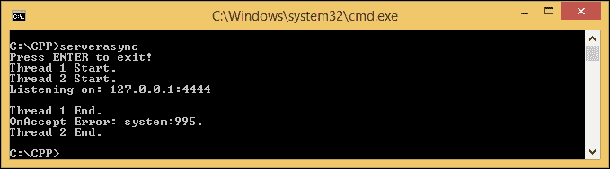

# 第七章：调试代码和解决错误

在上一章中，我们成功开发了一个服务器-客户端程序。我们也顺利地运行了我们创建的程序。然而，有时当我们运行应用程序时，会遇到一些问题，比如收到意外的结果或应用程序在运行时崩溃。在这种情况下，调试工具有能力帮助我们解决这些问题。在本章中讨论调试工具时，我们将涵盖以下主题：

+   选择适合我们使用的调试工具，并保持简单和轻量级

+   设置调试工具并准备要调试的可执行文件

+   熟悉调试工具中使用的命令

# 选择调试工具

许多调试工具都与程序设计语言的**集成开发环境**（**IDE**）一起提供。例如，**Visual Studio**有用于 C、C++、C#和 Visual Basic 的调试工具。或者，您可能听说过 CodeBlock 和 Bloodshed Dev-C++，它们也有自己的调试工具。然而，如果您还记得我们在第一章 *简化 C++中的网络编程*中讨论过的内容，我们决定不使用 IDE，因为它的重负载不会给我们的计算机带来太多资源。我们需要一个轻量级的工具来开发我们的网络应用程序。

我们选择的工具是**GNU 调试器**（**GDB**）。GDB 是一个基于命令行工具的强大调试工具；这意味着我们不需要复杂的**图形用户界面**（**GUI**）。换句话说，我们只需要键盘，甚至不需要鼠标，因此系统也变得轻量级。

GDB 可以做四件事来帮助我们解决代码问题，具体如下：

+   **逐行运行我们的代码**：当 GDB 运行我们的程序时，我们可以看到当前正在执行哪一行

+   **在特定行停止我们的代码**：当我们怀疑某一行导致了错误时，这是很有用的

+   **检查怀疑的行**：当我们成功停在怀疑的行时，我们可以继续检查它，例如，通过检查涉及的变量的值

+   **更改变量的值**：如果我们发现了导致错误的意外变量值，我们可以在 GDB 运行时用我们期望的值替换该值，以确保值的更改将解决问题

## 安装调试工具

幸运的是，如果您按照第一章 *简化 C++中的网络编程*中与 MinGW-w64 安装相关的所有步骤，您将不需要安装其他任何东西，因为安装程序包中也包含了 GDB 工具。现在我们需要做的是在命令控制台中运行 GDB 工具，以检查它是否正常运行。

在命令提示符的任何活动目录中，键入以下命令：

```cpp
gdb

```

我们应该在控制台窗口中得到以下输出：

```cpp
C:\CPP>gdb
GNU gdb (GDB) 7.8.1
Copyright (C) 2014 Free Software Foundation, Inc.
License GPLv3+: GNU GPL version 3 or later <http://gnu.org/licenses/gpl.html>
This is free software: you are free to change and redistribute it.
There is NO WARRANTY, to the extent permitted by law.  Type "show copying"
and "show warranty" for details.
This GDB was configured as "x86_64-w64-mingw32".
Type "show configuration" for configuration details.
For bug reporting instructions, please see:
<http://www.gnu.org/software/gdb/bugs/>.
Find the GDB manual and other documentation resources online at:
<http://www.gnu.org/software/gdb/documentation/>.
For help, type "help".
Type "apropos word" to search for commands related to "word".
(gdb)_

```

正如我们在控制台上得到的输出中所看到的，我们有版本 7.8.1（这不是最新版本，因为我们刚刚从 MinGW-w64 安装程序包中获得它）。在最后一行中，我们还有`(gdb)`，旁边有一个闪烁的光标；这意味着 GDB 已准备好接收命令。然而，目前，我们需要知道的命令是`quit`（或者，我们可以使用`q`作为快捷方式）来退出 GDB。只需输入`q`并按*Enter*，您将回到命令提示符。

## 为调试准备一个文件

GDB 需要至少一个可执行文件进行调试。为此，我们将回到上一章，从那里借用源代码。你还记得我们在第一章中创建了一个游戏，*Simplifying Your Network Programming in C++*，在那里我们必须猜测计算机所想的随机数吗？如果你记得，我们有源代码，我们在第一章中保存为`rangen.cpp`，并且我们通过添加`Boost`库对其进行了修改，将其保存为第三章中的`rangen_boost.cpp`，*Introducing the Boost C++ Libraries*。在下一节中，我们将使用`rangen_boost.cpp`源代码来演示 GDB 的使用。另外，对于那些忘记源代码的人，我已经为你们重新写了它：

```cpp
/* rangen_boost.cpp */
#include <boost/random/mersenne_twister.hpp>
#include <boost/random/uniform_int_distribution.hpp>
#include <iostream>

int main(void) {
  int guessNumber;
  std::cout << "Select number among 0 to 10: ";
  std::cin >> guessNumber;
  if(guessNumber < 0 || guessNumber > 10) {
    return 1;
  }
  boost::random::mt19937 rng;
  boost::random::uniform_int_distribution<> ten(0,10);
  int randomNumber = ten(rng);

  if(guessNumber == randomNumber) {
    std::cout << "Congratulation, " << guessNumber << " is your lucky number.\n";
  }
  else {
    std::cout << "Sorry, I'm thinking about number " << randomNumber << "\n"; 
  }
  return 0;
}
```

我们将修改编译命令，以便在 GDB 中使用。我们将使用`-g`选项，以便创建的可执行文件包含 GDB 将读取的调试信息和符号。我们将使用以下命令从`rangen_boost.cpp`文件中生成包含调试信息和符号的`rangen_boost_gdb.exe`可执行文件：

```cpp
g++ -Wall -ansi -I ../boost_1_58_0 rangen_boost.cpp -o rangen_boost_gdb -g

```

正如我们在前面的命令中所看到的，我们在编译命令中添加了`-g`选项，以便在可执行文件中记录调试信息和符号。现在，我们应该在我们的活动目录中有一个名为`rangen_boost_gdb.exe`的文件。在下一节中，我们将使用 GDB 对其进行调试。

### 提示

我们只能调试使用`-g`选项编译的可执行文件。换句话说，如果没有调试信息和符号，我们将无法调试可执行文件。此外，我们无法调试源代码文件(`*.cpp`文件)或头文件(`*.h`文件)。

# 在 GDB 下运行程序

准备包含调试信息和符号的可执行文件后，让我们运行 GDB 从文件中读取所有符号并进行调试。运行以下命令开始调试过程：

```cpp
gdb rangen_boost_gdb

```

我们的输出将如下：

```cpp
C:\CPP>gdb rangen_boost_gdb
GNU gdb (GDB) 7.8.1
Copyright (C) 2014 Free Software Foundation, Inc.
License GPLv3+: GNU GPL version 3 or later <http://gnu.org/licenses/gpl.html>
This is free software: you are free to change and redistribute it.
There is NO WARRANTY, to the extent permitted by law.  Type "show copying"
and "show warranty" for details.
This GDB was configured as "x86_64-w64-mingw32".
Type "show configuration" for configuration details.
For bug reporting instructions, please see:
<http://www.gnu.org/software/gdb/bugs/>.
Find the GDB manual and other documentation resources online at:
<http://www.gnu.org/software/gdb/documentation/>.
For help, type "help".
Type "apropos word" to search for commands related to "word"...
Reading symbols from rangen_boost_gdb...done.
(gdb)_

```

我们得到了与之前 GDB 输出相同的输出，除了`(gdb)`之前的最后一行。这一行告诉我们，GDB 已成功读取所有调试符号，并准备启动调试过程。在这一步中，我们还可以指定参数，如果我们的程序需要。由于我们的程序不需要指定任何参数，我们现在可以忽略它。

## 开始调试过程

要开始调试过程，我们可以调用`run`或`start`命令。前者将在 GDB 下启动我们的程序，而后者将类似地行为，但将逐行执行代码。不同之处在于，如果我们尚未设置断点，如果调用`run`命令，程序将像往常一样运行，而如果我们使用`start`命令开始，调试器将自动在主代码块中设置断点，如果程序达到该点，程序将停止。

现在，让我们使用`start`命令进行调试过程。只需在 GDB 提示符中输入`start`，控制台将附加以下输出：

```cpp
(gdb) start
Temporary breakpoint 1 at 0x401506: file rangen_boost.cpp, line 10.
Starting program: C:\CPP\rangen_boost_gdb.exe
[New Thread 10856.0x213c]

Temporary breakpoint 1, main () at rangen_boost.cpp:10
10              std::cout << "Select number among 0 to 10: ";

```

调试过程已经开始。从输出中，我们可以发现一个断点自动创建在`main`块内，位于第 10 行。当没有断点时，调试器将选择主块内的第一个语句。这就是为什么我们得到`line 10`作为我们的自动断点。

## 继续和步进调试过程

成功在 GDB 下启动程序后，下一步是继续和步进。我们可以使用以下命令之一来继续和步进调试过程：

+   `继续`: 这个命令将恢复程序的执行，直到程序正常完成。如果它找到一个断点，执行将停在设置断点的那一行。

+   `step`：此命令将执行程序的下一步。*step*可能意味着源代码的一行或一条机器指令。如果它找到函数的调用，它将进入函数并在函数内运行一步。

+   `next`：此命令类似于`step`命令，但它只会继续执行当前堆栈帧中的下一行。换句话说，如果`next`命令找到函数的调用，它将不会进入函数。

现在，让我们使用`next`命令。在调用`start`命令后，立即在 GDB 提示符中键入`next`命令。我们应该得到以下输出：

```cpp
(gdb) next
Select number among 0 to 10: 11         std::cin >> guessNumber;

```

GDB 执行第 10 行，然后继续执行第 11 行。我们将再次调用`next`命令以继续调试过程。但是，如果我们只是按下*Enter*键，GDB 将执行我们之前的命令。这就是为什么现在我们只需要按下*Enter*键，这将给我们一个闪烁的光标。现在，我们必须输入我们猜测的数字以存储在`guessNumber`变量中。我将输入数字`4`，但您可以输入您喜欢的数字。再次按下*Enter*键，以继续调试，直到正常退出程序为止。以下输出将被附加：

```cpp
(gdb)
4
12              if(guessNumber < 0 || guessNumber > 10)
(gdb)
17              boost::random::mt19937 rng;
(gdb)
19              boost::random::uniform_int_distribution<> ten(0,10);
(gdb)
20              int randomNumber = ten(rng);
(gdb)
22              if(guessNumber == randomNumber)
(gdb)
28                      std::cout << "Sorry, I'm thinking about number " << randomNumber << "\n";
(gdb)
Sorry, I'm thinking about number 8
30              return 0;
(gdb)
31      }(gdb)
0x00000000004013b5 in __tmainCRTStartup ()
(gdb)
Single stepping until exit from function __tmainCRTStartup, which has no line number information.
[Inferior 1 (process 11804) exited normally]

```

正如我们在前面的输出中所看到的，当我们输入猜测的数字后，程序执行`if`语句以确保我们输入的数字不超出范围。如果我们猜测的数字有效，程序将继续生成一个随机数。然后我们猜测的数字将与程序生成的随机数进行比较。无论这两个数字是否相同，程序都会给出不同的输出。不幸的是，我的猜测数字与随机数不同。如果您能正确猜出数字，您可能会得到不同的输出。

## 打印源代码

有时，我们可能希望在运行调试过程时检查我们的源文件。由于调试信息和符号记录在我们的程序中，即使它是一个可执行文件，GDB 也可以打印源代码。要打印源代码，我们可以在 GDB 提示符中键入`list`（或使用`l`命令进行快捷方式）。默认情况下，GDB 在每次调用命令时会打印十行。但是，我们可以使用`set listsize`命令更改此设置。此外，要知道`list`命令将显示的行数，我们可以调用`show listsize`命令。让我们看看以下命令行输出：

```cpp
(gdb) show listsize
Number of source lines gdb will list by default is 10.
(gdb) set listsize 20
(gdb) show listsize
Number of source lines gdb will list by default is 20.
(gdb)_

```

我们使用`list`命令增加要显示的行数。现在，每次调用`list`命令时，输出将显示二十行源代码。

以下是几种`list`命令的形式，这是最常见的：

+   `list`：此命令将显示与列表大小定义的行数相同的源代码。如果再次调用它，它将显示剩余的行数，与列表大小定义的行数相同。

+   `list [linenumber]`：此命令将显示以`linenumber`为中心的行。命令`list 10`将显示第 5 行到第 14 行，因为第 10 行位于中心。

+   `list [functionname]`：此命令将显示以`functionname`变量开头的行。命令`list main`将在列表的中心显示`int main(void)`函数。

+   `list [first,last]`：此命令将显示从第一行到最后一行的内容。命令`list 15,16`将仅显示第 15 行和第 16 行。

+   `list [,last]`：此命令将显示以`last`结尾的行。命令`list ,5`将显示第 1 行到第 5 行。

+   `list [first,]`：此命令将显示从指定行开始的所有行。命令`list 5,`将显示第 5 行到最后一行，如果行数超过指定行数。否则，它将显示与列表大小设置相同的行数。

+   `list +`：此命令将显示上次显示的行后面的所有行。

+   `list -`：此命令将显示在上次显示的行之前的所有行。

## 设置和删除断点

如果我们怀疑某一行出错，我们可以在那一行设置一个断点，这样调试器就会在那一行停止调试过程。要设置断点，我们可以调用`break [linenumber]`命令。假设我们想在第 20 行停下来，其中包含以下代码：

```cpp
int randomNumber = ten(rng);

```

在这里，我们需要在加载程序到 GDB 后立即调用`break 20`命令，在第 20 行设置一个断点。下面的输出控制台说明了这一点：

```cpp
(gdb) break 20
Breakpoint 1 at 0x401574: file rangen_boost.cpp, line 20.
(gdb) run
Starting program: C:\CPP\rangen_boost_gdb.exe
[New Thread 1428.0x13f4]
Select number among 0 to 10: 2

Breakpoint 1, main () at rangen_boost.cpp:20
20              int randomNumber = ten(rng);
(gdb) next
22              if(guessNumber == randomNumber)
(gdb)
28                      std::cout << "Sorry, I'm thinking about number " << randomNumber << "\n";
(gdb)
Sorry, I'm thinking about number 8
30              return 0;
(gdb)
31      }(gdb)
0x00000000004013b5 in __tmainCRTStartup ()
(gdb)
Single stepping until exit from function __tmainCRTStartup,
which has no line number information.
[Inferior 1 (process 1428) exited normally]
(gdb)_

```

在前面的输出控制台中，我们在 GDB 下加载程序后，调用了`break 20`命令。然后调试器在第 20 行设置了一个新的断点。与之前一样，我们不再调用`start`命令，而是调用`run`命令来执行程序，并让它在找到断点时停止。在我们输入猜测的数字，例如`2`后，调试器停在第 20 行，这正是我们期望它停下来的地方。然后，我们调用`next`命令继续调试器，并按下*Enter*键多次直到程序退出。

如果我们想要删除一个断点，只需使用`delete N`命令，其中`N`是设置的所有断点的顺序。如果我们不记得我们设置的所有断点的位置，我们可以调用`info break`命令来获取所有断点的列表。我们还可以使用`delete`命令（不带`N`），它将删除所有断点。

## 打印变量值

我们已经能够停在我们想要的行上。我们还可以发现我们程序中使用的变量的值。我们可以调用`print [variablename]`命令来打印任何变量的值。使用前面的断点，我们将打印变量`randomNumber`的值。在调试器命中第 20 行的断点后，我们将调用打印`randomNumber`命令。然后，我们调用`next`命令并再次打印`randomNumber`变量。看一下命令调用的下面说明：

```cpp
(gdb) break 20
Breakpoint 1 at 0x401574: file rangen_boost.cpp, line 20.
(gdb) run
Starting program: C:\CPP\rangen_boost_gdb.exe
[New Thread 5436.0x1b04]
Select number among 0 to 10: 3

Breakpoint 1, main () at rangen_boost.cpp:20
20              int randomNumber = ten(rng);
(gdb) print randomNumber
$1 = 0
(gdb) next
22              if(guessNumber == randomNumber)
(gdb) print randomNumber
$2 = 8
(gdb)_

```

正如我们在前面的输出中所看到的，以下一行是设置断点的地方：

```cpp
int randomNumber = ten(rng);

```

在执行该行之前，我们窥视`randomNumber`变量的值。变量的值为`0`。然后，我们调用`next`命令指示调试器执行该行。之后，我们再次窥视变量的值，这次是`8`。当然，在这个实验中，你可能得到的值与 8 不同。

## 修改变量值

我们将通过修改一个变量的值来欺骗我们的程序。可以使用`set var [variablename]=[newvalue]`命令重新分配变量的值。为了确保我们要修改的变量的类型，我们可以调用`whatis [variablename]`命令来获取所需的变量类型。

现在，让我们在程序为变量分配一个随机数后更改`randomNumber`变量的值。我们将重新启动调试过程，删除我们已经设置的所有断点，设置一个新的断点在第 22 行，并通过输入`continue`命令继续调试过程，直到调试器在第 22 行命中断点。在这种情况下，我们可以重新分配`randomNumber`变量的值，使其与`guessNumber`变量的值完全相同。现在，再次调用`continue`命令。之后，我们将因猜对数字而受到祝贺。

要了解更多细节，请看下面的输出控制台，它将说明前面的步骤：

```cpp
(gdb) start
The program being debugged has been started already.
Start it from the beginning? (y or n) y

Temporary breakpoint 2 at 0x401506: file rangen_boost.cpp, line 10.
Starting program: C:\CPP\rangen_boost_gdb.exe
[New Thread 6392.0x1030]

Temporary breakpoint 2, main () at rangen_boost.cpp:10
10              std::cout << "Select number among 0 to 10: ";
(gdb) info break
Num     Type           Disp Enb Address            What
1       breakpoint     keep y   0x0000000000401574 in main()
 at rangen_boost.cpp:20
(gdb) delete 1
(gdb) info break
No breakpoints or watchpoints.
(gdb) break 22
Breakpoint 3 at 0x40158d: file rangen_boost.cpp, line 22.
(gdb) continue
Continuing.
Select number among 0 to 10: 5

Breakpoint 3, main () at rangen_boost.cpp:22
22              if(guessNumber == randomNumber)
(gdb) whatis randomNumber
type = int
(gdb) print randomNumber
$3 = 8
(gdb) set var randomNumber=5
(gdb) print randomNumber
$4 = 5
(gdb) continue
Continuing.
Congratulation, 5 is your lucky number.
[Inferior 1 (process 6392) exited normally]
(gdb)_

```

正如我们在前面的输出中所看到的，当我们调用`start`命令时，调试器要求我们停止先前的调试过程，因为它仍在运行。只需键入*Y*键并按*Enter*键回答查询。我们可以使用`info break`命令列出所有可用的断点，然后根据从`info break`命令获取的顺序删除所需的断点。我们调用`continue`命令恢复调试过程，当调试器触发断点时，我们将`randomNumber`变量重新分配为`guessNumber`变量的值。我们继续调试过程，并成功在运行时修改了`randomNumber`变量的值，因为程序向我们表示祝贺。

如果程序中有很多变量，我们可以使用`info locals`命令打印所有变量的值，而不是逐个打印所有变量。

## 调用命令提示符

我偶尔在 GDB 提示符内调用 Windows shell 命令，比如`cls`命令清除屏幕，`dir`命令列出活动目录的内容，甚至编译命令。如果你也想执行 Windows shell 命令，可以使用的 GDB 命令是`shell [Windows shell command]`。实际上，只需在需要时在 Windows shell 命令和参数前添加`shell`命令。让我们看看以下控制台输出，以了解在 GDB 提示符内执行 Windows shell 命令。让我们看看以下输出：

```cpp
C:\CPP>gdb
GNU gdb (GDB) 7.8.1
Copyright (C) 2014 Free Software Foundation, Inc.
License GPLv3+: GNU GPL version 3 or later <http://gnu.org/licenses/gpl.html>
This is free software: you are free to change and redistribute it.
There is NO WARRANTY, to the extent permitted by law.  Type "show copying"
and "show warranty" for details.
This GDB was configured as "x86_64-w64-mingw32".
Type "show configuration" for configuration details.
For bug reporting instructions, please see:
<http://www.gnu.org/software/gdb/bugs/>.
Find the GDB manual and other documentation resources online at:
<http://www.gnu.org/software/gdb/documentation/>.
For help, type "help".
Type "apropos word" to search for commands related to "word".
(gdb) shell dir rangen_boost* /w
 Volume in drive C is SYSTEM
 Volume Serial Number is 8EA6-1DBE

 Directory of C:\CPP

rangen_boost.cpp       rangen_boost.exe       rangen_boost_gdb.exe
 3 File(s)        190,379 bytes
 0 Dir(s)  141,683,314,688 bytes free
(gdb) shell g++ -Wall -ansi -I ../boost_1_58_0 rangen_boost.cpp -o rangen_boost_gdb_2 -g
(gdb) shell dir rangen_boost* /w
 Volume in drive C is SYSTEM
 Volume Serial Number is 8EA6-1DBE

 Directory of C:\CPP

rangen_boost.cpp         rangen_boost.exe         rangen_boost_gdb.exe
rangen_boost_gdb_2.exe
 4 File(s)        259,866 bytes
 0 Dir(s)  141,683,249,152 bytes free

```

在前面的控制台输出中，我们调用`dir`命令列出活动目录中以`rangen_boost`开头的所有文件。然后，我们调用编译命令在活动目录中生成`rangen_boost_gdb_2.exe`可执行文件。然后，我们再次调用`dir`命令，以确保`rangen_boost_gdb_2.exe`可执行文件已成功创建。

### 提示

您可以使用`apropos shell`命令获取有关 GDB 中 shell 命令的更多信息。

# 解决错误

在第五章*深入了解 Boost.Asio 库*中，我们讨论了处理异常和错误。如果我们遵循本书中的所有源代码，可能永远不会得到任何错误代码来困扰我们。然而，如果我们尝试修改源代码，即使只是一点点，可能会抛出一个错误代码，而程序不会给我们任何描述。由于`Boost`库抛出的错误代码基于 Windows 系统错误代码，并且超出了本书的范围，我们可以在**Microsoft Developer Network**（**MSDN**）网站上找到描述，网址为[msdn.microsoft.com/en-us/library/windows/desktop/ms681381%28v=vs.85%29.aspx](http://msdn.microsoft.com/en-us/library/windows/desktop/ms681381%28v=vs.85%29.aspx)。在这里，我们可以找到从错误 0 到 15999 的所有错误代码的翻译。使用 GDB 和 MSDN 的错误代码翻译将成为解决程序中出现的错误的强大工具。

让我们回到第六章*创建客户端-服务器应用程序*并运行`serverasync`程序。当程序运行时，它会在`127.0.0.1`上的端口`4444`监听客户端，这将在我们的示例中由 telnet 模拟。但是，如果客户端不响应会发生什么？要进一步了解，让我们在不运行 telnet 的情况下运行`serverasync`程序。由于客户端未响应，将显示以下错误：



我们得到了系统错误代码`995`。现在，有了这个错误代码，我们可以访问 MSDN 系统错误代码并找到错误描述，即**I/O 操作已因线程退出或应用程序请求而中止。 (ERROR_OPERATION_ABORTED)**。

# 接下来呢？

我们熟悉了基本的 GDB 命令。GDB 中还有许多命令我们无法在这本书中讨论。GDB 有一个官方网站，我们可以访问[www.gnu.org/software/gdb/documentation/](http://www.gnu.org/software/gdb/documentation/)。在这里，我们可以找到所有我们尚未讨论的完整命令。

### 注意

我们还可以在官方网站[www.boost.org](http://www.boost.org)上获取更详细的 Boost C++库信息，特别是`Boost.Asio`库的文档，可以在[www.boost.org/doc/libs/1_58_0/doc/html/boost_asio.html](http://www.boost.org/doc/libs/1_58_0/doc/html/boost_asio.html)上找到。

# 总结

调试过程是我们通过逐步运行程序来分析程序的重要工作。当我们的程序产生意外结果或在执行过程中崩溃时，除了运行调试过程别无选择。GDB 是我们的选择，因为它与 C++语言兼容，随 MinGW-w64 安装程序包提供，并且加载时很轻量级。

GDB 只能运行使用`-g`选项编译的可执行文件。这个选项会添加调试信息和符号，这在调试过程中很重要。如果没有使用`-g`选项编译可执行文件，你将无法对其进行调试。

在成功加载程序到 GDB 后，我们可以选择使用`run`或`start`命令来执行调试过程。`run`命令会像平常一样执行程序，但如果调试器找到断点，程序会停下来；而`start`命令会在程序的第一次执行时停在`main`块处。

当调试器停在某一行时，我们必须决定是否继续调试过程。我们可以选择使用`continue`命令运行程序直到退出，或者在找到断点时运行调试器的逐步调试使用`next`命令。

要使调试器在调试过程的执行中停下来，可以使用`break [linenumber]`命令设置断点。如果我们想确保设置了正确的行号，可以使用`list`命令打印源代码。然后使用`delete N`命令删除断点，其中`N`可以在`info break`命令中找到。

当查找错误时，获取变量的值也很重要。如果程序产生意外输出，我们可以通过打印变量的值来追踪变量的值。我们可以使用`print [variablename]`命令来做到这一点。对于我们怀疑引起错误的变量，我们可以使用`set var [variablename]=[newvalue]`命令重新分配该变量的值。然后我们可以再次运行调试器，直到获得预期的输出。当我们修复了所有错误，并确信一切完美无缺时，我们可以通过在 GDB 提示符中调用编译命令来重新编译我们的程序，使用`shell [Windows shell command]`命令。
