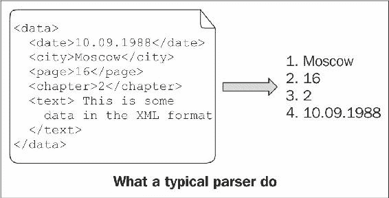

# 转换和转型

在本章中，我们将涵盖：

+   将字符串转换为数字

+   将数字转换为字符串

+   将数字转换为数字

+   将用户定义的类型转换为/从字符串

+   转换智能指针

+   转换多态对象

+   解析简单输入

+   解析复杂输入

# 介绍

现在，我们知道了一些基本的 Boost 类型，是时候了解数据转换函数了。在本章中，我们将看到如何将字符串、数字、指针和用户定义的类型相互转换，如何安全地转换多态类型，以及如何在 C++源文件中编写小型和大型解析器。

# 将字符串转换为数字

在 C++中将字符串转换为数字会让很多人感到沮丧，因为它们效率低下且不友好。看看如何将字符串`100`转换为`int`：

```cpp
#include <sstream> 

void sample1() {
    std::istringstream iss("100");
    int i;
    iss >> i;

    // ...
}
```

最好不要去想，之前的转换中发生了多少不必要的操作、虚函数调用、原子操作和内存分配。顺便说一句，我们不再需要`iss`变量，但它会一直存在直到作用域结束。

C 方法也不好：

```cpp
#include <cstdlib> 

void sample2() {
    char * end;
    const int i = std::strtol ("100", &end, 10);

    // ...
}
```

它是否将整个值转换为`int`，还是在中途停止了？要理解这一点，我们必须检查`end`变量的内容。之后，我们将有一个无用的`end`变量一直存在直到作用域结束。而我们想要一个`int`，但`strtol`返回`long int`。转换后的值是否适合`int`？

# 做好准备

此配方只需要基本的 C++和标准库知识。

# 如何做...

Boost 中有一个库，可以帮助您应对令人沮丧的字符串到数字转换困难。它被称为`Boost.LexicalCast`，包括一个`boost::bad_lexical_cast`异常类和一些`boost::lexical_cast`和`boost::conversion::try_lexical_convert`函数：

```cpp
#include <boost/lexical_cast.hpp> 

void sample3() {
    const int i = boost::lexical_cast<int>("100");
    // ...
}
```

它甚至可以用于非零终止的字符串：

```cpp
#include <boost/lexical_cast.hpp>

void sample4() {
    char chars[] = {'x', '1', '0', '0', 'y' }; 
    const int i = boost::lexical_cast<int>(chars + 1, 3); 
    assert(i == 100); 
}
```

# 它是如何工作的...

`boost::lexical_cast`函数接受字符串作为输入，并将其转换为三角括号中指定的类型。`boost::lexical_cast`函数甚至会为您检查边界：

```cpp
#include <boost/lexical_cast.hpp>
#include <iostream>

void sample5() {
    try {
        // short usually may not store values greater than 32767
        const short s = boost::lexical_cast<short>("1000000");
        assert(false); // Must not reach this line.
    } catch (const boost::bad_lexical_cast& e) {
        std::cout << e.what() << '\n';
    }
}
```

前面的代码输出：

```cpp
bad lexical cast: source type value could not be interpreted as target.
```

它还检查输入的正确语法，并在输入错误时抛出异常：

```cpp
#include <boost/lexical_cast.hpp>
#include <iostream>

void sample6() {
    try {
        const int i = boost::lexical_cast<int>("This is not a number!");
        assert(false); // Must not reach this line.
    } catch (const boost::bad_lexical_cast& /*e*/) {}
}
```

自 Boost 1.56 以来，有一个`boost::conversion::try_lexical_convert`函数，通过返回代码报告错误。它可能在性能关键的地方很有用，那里经常会出现错误的输入：

```cpp
#include <boost/lexical_cast.hpp>
#include <cassert>

void sample7() {
    int i = 0;
    const bool ok = boost::conversion::try_lexical_convert("Bad stuff", i);
    assert(!ok);
}
```

# 还有更多...

`lexical_cast`，就像所有`std::stringstream`类一样，使用`std::locale`并且可以转换本地化数字，但也具有对**C 语言环境**和没有数字分组的环境的令人印象深刻的优化集：

```cpp
#include <boost/lexical_cast.hpp>
#include <locale> 

void sample8() {
    try {
        std::locale::global(std::locale("ru_RU.UTF8"));
        // In Russia coma sign is used as a decimal separator.
        float f = boost::lexical_cast<float>("1,0");
        assert(f < 1.01 && f > 0.99);
        std::locale::global(std::locale::classic()); // Restoring C locale
    } catch (const std::runtime_error&) { /* locale is not supported */ }
} 
```

C++标准库没有`lexical_cast`，但自 C++17 以来有`std::from_chars`函数，可以用于创建惊人快速的通用转换器。请注意，这些转换器根本不使用区域设置，因此它们具有略有不同的功能。`std::from_chars`函数旨在不分配内存，不抛出异常，并且没有原子或其他繁重的操作。

# 另请参阅

+   有关`boost::lexical_cast`性能的信息，请参阅*将数字转换为字符串*配方。

+   `Boost.LexicalCast`的官方文档包含一些示例、性能测量和常见问题的答案。它可以在[`boost.org/libs/lexical_cast`](http://boost.org/libs/lexical_cast)上找到。

# 将数字转换为字符串

在这个配方中，我们将继续讨论词法转换，但现在我们将使用`Boost.LexicalCast`将数字转换为字符串。与往常一样，`boost::lexical_cast`将提供一种非常简单的方法来转换数据。

# 做好准备

此配方只需要基本的 C++和标准库知识。

# 如何做...

让我们使用`boost::lexical_cast`将整数`100`转换为`std::string`：

```cpp
#include <cassert>
#include <boost/lexical_cast.hpp> 

void lexical_cast_example() {
    const std::string s = boost::lexical_cast<std::string>(100);
    assert(s == "100");
}
```

与传统的 C++转换方法进行比较：

```cpp
#include <cassert>
#include <sstream> 

void cpp_convert_example() {
    std::stringstream ss;  // Slow/heavy default constructor.
    ss << 100;
    std::string s;
    ss >> s;

    // Variable 'ss' will dangle all the way, till the end
    // of scope. Multiple virtual methods and heavy 
    // operations were called during the conversion.
    assert(s == "100");
}
```

以及与 C 转换方法相比：

```cpp
#include <cassert>
#include <cstdlib> 

void c_convert_example() {
     char buffer[100];
     std::sprintf(buffer, "%i", 100);

     // You will need an unsigned long long int type to 
     // count how many times errors were made in 'printf' 
     // like functions all around the world. 'printf' 
     // functions are a constant security threat! 

     // But wait, we still need to construct a std::string.
     const std::string s = buffer;
     // Now we have a 'buffer' variable that is not used.

     assert(s == "100");
}
```

# 它是如何工作的...

`boost::lexical_cast`函数也可以接受数字作为输入，并将它们转换为模板参数（三角括号中）指定的字符串类型。这与我们在上一个食谱中所做的非常接近。

# 还有更多...

细心的读者会注意到，在`lexical_cast`的情况下，我们有一个额外的调用来复制字符串构造函数，这样的调用会降低性能。这是真的，但只对旧的或不好的编译器有效。现代编译器实现了**命名返回值优化**（**NRVO**），它消除了不必要的复制构造函数和析构函数的调用。即使 C++11 兼容的编译器没有检测到 NRVO，它们也会使用`std::string`的移动构造函数，这是快速和高效的。`Boost.LexicalCast`文档的*性能*部分显示了不同编译器对不同类型的转换速度。在大多数情况下，`lexical_cast`比`std::stringstream`和`printf`函数更快。

如果将`boost::array`或`std::array`作为输出参数类型传递给`boost::lexical_cast`，将会发生较少的动态内存分配（或者根本不会有内存分配，这取决于`std::locale`的实现）。

C++11 有`std::to_string`和`std::to_wstring`函数，它们声明在`<string>`头文件中。这些函数使用区域设置，并且行为非常接近`boost::lexical_cast<std::string>`和`boost::lexical_cast<std::wstring>`。C++17 有`std::to_chars`函数，可以将数字转换为字符数组，速度非常快。`std::to_chars`不分配内存，不抛出异常，并且可以使用错误代码报告错误。如果需要真正快速的转换函数而不使用区域设置，那么使用`std::to_chars`。

# 另请参阅

+   Boost 官方文档包含了比较`lexical_cast`性能与其他转换方法的表格。在大多数情况下，`lexical_cast`比其他方法更快[`boost.org/libs/lexical_cast`](http://boost.org/libs/lexical_cast)。

+   *将字符串转换为数字*食谱。

+   *将用户定义的类型转换为/从字符串*食谱。

# 将数字转换为数字

您可能还记得写以下代码的情况：

```cpp
void some_function(unsigned short param); 
int foo(); 

void do_something() {
    // Some compilers may warn, that int is being converted to  
    // unsigned short and that there is a possibility of loosing  
    // data.
    some_function(foo());
} 
```

通常，程序员会通过将`unsigned short`数据类型隐式转换来忽略这些警告，就像以下代码片段中所示：

```cpp
// Warning suppressed.
some_function( 
    static_cast<unsigned short>(foo()) 
); 
```

但是，如果`foo()`返回的数字不适合`unsigned short`怎么办？这会导致难以检测的错误。这样的错误可能存在多年，直到被捕获和修复。看一下`foo()`的定义：

```cpp
// Returns -1 if error occurred.
int foo() { 
    if (some_extremely_rare_condition()) { 
        return -1; 
    } else if (another_extremely_rare_condition()) { 
        return 1000000; 
    } 
    return 42; 
}
```

# 准备工作

此食谱需要对 C++的基本知识。

# 如何做...

库`Boost.NumericConversion`为这种情况提供了解决方案。只需用`boost::numeric_cast`替换`static_cast`。当源值无法存储在目标中时，后者将抛出异常：

```cpp
#include <boost/numeric/conversion/cast.hpp> 

void correct_implementation() { 
    // 100% correct.
    some_function( 
        boost::numeric_cast<unsigned short>(foo()) 
    ); 
} 

void test_function() {
    for (unsigned int i = 0; i < 100; ++i) {
        try {
            correct_implementation();
        } catch (const boost::numeric::bad_numeric_cast& e) {
            std::cout << '#' << i << ' ' << e.what() << std::endl;
        }
    }
}
```

现在，如果我们运行`test_function()`，它将输出如下：

```cpp
#47 bad numeric conversion: negative overflow 
#58 bad numeric conversion: positive overflow 
```

我们甚至可以检测特定的溢出类型：

```cpp
void test_function1() { 
   for (unsigned int i = 0; i < 100; ++i) { 
       try { 
           correct_implementation(); 
       } catch (const boost::numeric::positive_overflow& e) { 
           // Do something specific for positive overflow. 
           std::cout << "POS OVERFLOW in #" << i << ' '
                     << e.what() << std::endl; 
       } catch (const boost::numeric::negative_overflow& e) { 
           // Do something specific for negative overflow. 
           std::cout <<"NEG OVERFLOW in #" << i << ' '
                     << e.what() << std::endl; 
       } 
   } 
} 
```

`test_function1()`函数将输出如下：

```cpp
NEG OVERFLOW in #47 bad numeric conversion: negative overflow 
POS OVERFLOW in #59 bad numeric conversion: positive overflow 
```

# 工作原理...

`boost::numeric_cast`检查输入参数的值是否适合新类型，而不会丢失数据，并且如果在转换过程中丢失了数据，则会抛出异常。

`Boost.NumericConversion`库有一个非常快的实现。它可以在编译时完成大量工作，例如，当转换为更宽范围的类型时，源将通过`static_cast`转换为目标类型。

# 还有更多...

`boost::numeric_cast`函数是通过`boost::numeric::converter`实现的，可以调整使用不同的溢出、范围检查和舍入策略。但通常，`numeric_cast`就是您需要的。

以下是一个小例子，演示了如何为`boost::numeric::cast`制作我们自己的溢出处理程序：

```cpp
template <class SourceT, class TargetT> 
struct mythrow_overflow_handler {
    void operator() (boost::numeric::range_check_result r) { 
        if (r != boost::numeric::cInRange) { 
            throw std::logic_error("Not in range!"); 
        } 
    } 
}; 

template <class TargetT, class SourceT> 
TargetT my_numeric_cast(const SourceT& in) { 
    typedef boost::numeric::conversion_traits<
        TargetT, SourceT
    > conv_traits; 
    typedef boost::numeric::converter < 
        TargetT, 
        SourceT, 
        conv_traits, // default conversion traits
        mythrow_overflow_handler<SourceT, TargetT> // !!! 
    > converter; 

    return converter::convert(in); 
} 
```

以下是如何使用我们的自定义转换器：

```cpp
void example_with_my_numeric_cast() {
    short v = 0;
    try {
        v = my_numeric_cast<short>(100000);
    } catch (const std::logic_error& e) {
        std::cout << "It works! " << e.what() << std::endl;
    }
}
```

前面的代码输出如下：

```cpp
It works! Not in range!
```

即使 C++17 也没有提供安全的数字转换功能。然而，这方面的工作正在进行中。我们有望在 2020 年后看到这样的功能。

# 参见

Boost 的官方文档包含了对数字转换器模板参数的详细描述；可以在以下链接找到：[`boost.org/libs/numeric/conversion`](http://boost.org/libs/numeric/conversion)

# 将用户定义的类型转换为字符串和从字符串转换为数字

`Boost.LexicalCast`中有一个功能，允许用户使用自己的类型进行`lexical_cast`。这需要用户为该类型编写正确的`std::ostream`和`std::istream`操作符。

# 如何做...

1.  你只需要提供`operator<<`和`operator>>`流操作符。如果你的类已经可以进行流操作，就不需要做任何事情：

```cpp
#include <iostream>
#include <stdexcept>

// Negative number that does not store minus sign.
class negative_number {
    unsigned short number_; 

public:
    explicit negative_number(unsigned short number = 0)
        : number_(number)
    {} 

    // ...
    unsigned short value_without_sign() const {
        return number_;
    }
}; 

inline std::ostream&
    operator<<(std::ostream& os, const negative_number& num)
{
    os << '-' << num.value_without_sign();
    return os;
}

inline std::istream& operator>>(std::istream& is, negative_number& num)
{
    char ch;
    is >> ch;
    if (ch != '-') {
        throw std::logic_error(
            "negative_number class stores ONLY negative values"
        );
    }

    unsigned short s;
    is >> s;
    num = negative_number(s);
    return is;
}
```

1.  现在，我们可以使用`boost::lexical_cast`将`negative_number`类转换为字符串和从字符串转换为`negative_number`类。这里有一个例子：

```cpp
#include <boost/lexical_cast.hpp>
#include <boost/array.hpp>
#include <cassert>

void example1() {
    const negative_number n
        = boost::lexical_cast<negative_number>("-100");
    assert(n.value_without_sign() == 100);

    const int i = boost::lexical_cast<int>(n);
    assert(i == -100);

    typedef boost::array<char, 10> arr_t;
    const arr_t arr = boost::lexical_cast<arr_t>(n);
    assert(arr[0] == '-');
    assert(arr[1] == '1');
    assert(arr[2] == '0');
    assert(arr[3] == '0');
    assert(arr[4] == 0);
} 
```

# 它是如何工作的...

`boost::lexical_cast`函数可以检测并使用流操作符来转换用户定义的类型。

`Boost.LexicalCast`库对基本类型有许多优化，当用户定义的类型被转换为基本类型，或者基本类型被转换为用户定义的类型时，这些优化将被触发。

# 还有更多...

`boost::lexical_cast`函数也可以将转换为宽字符字符串，但需要正确的`basic_istream`和`basic_ostream`操作符重载：

```cpp
template <class CharT> 
std::basic_ostream<CharT>& 
    operator<<(std::basic_ostream<CharT>& os, const negative_number& num)
{ 
    os << static_cast<CharT>('-') << num.value_without_sign(); 
    return os; 
} 

template <class CharT> 
std::basic_istream<CharT>& 
    operator>>(std::basic_istream<CharT>& is, negative_number& num)
{ 
    CharT ch; 
    is >> ch; 
    if (ch != static_cast<CharT>('-')) { 
        throw std::logic_error(
            "negative_number class stores ONLY negative values"
        ); 
    } 
    unsigned short s; 
    is >> s; 
    num = negative_number(s); 
    return is; 
} 

void example2() { 
    const negative_number n = boost::lexical_cast<negative_number>(L"-1"); 
    assert(n.value_without_sign() == 1); 

    typedef boost::array<wchar_t, 10> warr_t; 
    const warr_t arr = boost::lexical_cast<warr_t>(n); 
    assert(arr[0] == L'-'); 
    assert(arr[1] == L'1'); 
    assert(arr[2] == 0); 
} 
```

`Boost.LexicalCast`库不是 C++的一部分。许多 Boost 库都使用它，我希望它也能让你的生活变得更轻松。

# 参见

+   `Boost.LexicalCast`文档包含了一些示例、性能测量和常见问题的解答；链接为[`boost.org/libs/lexical_cast`](http://boost.org/libs/lexical_cast)

+   *将字符串转换为数字*的方法

+   *将数字转换为字符串*的方法

# 转换智能指针

这里有一个问题：

1.  你有一个名为`some_class`的类：

```cpp
struct base {
    virtual void some_methods() = 0;
    virtual ~base();
};

struct derived: public base {
    void some_methods() /*override*/;
    virtual void derived_method() const;

    ~derived() /*override*/;
};
```

1.  你有一个第三方 API，返回通过共享指针构造的`derived`，并在其他函数中接受共享指针到`const derived`：

```cpp
#include <boost/shared_ptr.hpp>
boost::shared_ptr<const base> construct_derived();
void im_accepting_derived(boost::shared_ptr<const derived> p);
```

1.  你必须让以下代码工作：

```cpp
void trying_hard_to_pass_derived() {
    boost::shared_ptr<const base> d = construct_derived();

    // Oops! Compile time error:
    // ‘const struct base; has no member named ‘derived_method;.
    d->derived_method();

    // Oops! Compile time error:
    // could not convert ‘d; to ‘boost::shared_ptr<const derived>;.
    im_accepting_derived(d);
}
```

如何以一种好的方式解决这个问题？

# 入门

这个配方需要对 C++和智能指针有基本的了解。

# 如何做...

解决方案是使用智能指针的特殊转换。在这种特殊情况下，我们需要使用`dynamic_cast`功能，因此我们使用`boost::dynamic_pointer_cast`：

```cpp
void trying_hard_to_pass_derived2() {
    boost::shared_ptr<const derived> d
        = boost::dynamic_pointer_cast<const derived>(
            construct_derived()
        );

    if (!d) {
        throw std::runtime_error(
            "Failed to dynamic cast"
        );
    }

    d->derived_method();
    im_accepting_derived(d);
} 
```

# 它是如何工作的...

Boost 库有很多用于智能指针转换的函数。所有这些函数都接受一个智能指针和一个模板参数`T`，其中`T`是智能指针的所需模板类型。这些转换操作符模仿了内置转换的行为，同时正确管理引用计数和其他智能指针内部：

+   `boost::static_pointer_cast<T>(p)` - 执行`static_cast<T*>(p.get())`

+   `boost::dynamic_pointer_cast<T>(p)` - 执行`dynamic_cast<T*>(p.get())`

+   `boost::const_pointer_cast<T>(p)` - 执行`const_cast<T*>(p.get())`

+   `boost::reinterpret_pointer_cast<T>(p)` - 执行`reinterpret_cast<T*>(p.get())`

# 还有更多...

所有的`boost::*_pointer_cast`函数都可以使用标准库和 C 指针的智能指针，只要包含`<boost/pointer_cast.hpp>`。

在 C++11 中，标准库在`<memory>`头文件中定义了`std::static_pointer_cast`、`std::dynamic_pointer_cast`和`std::const_pointer_cast`，但只适用于`std::shared_ptr`。C++17 标准库有`std::reinterpret_pointer_cast`，但只适用于`std::shared_ptr`。

# 参见

+   `Boost.SmartPointer`库文档包含了有关标准库指针转换的更多示例，链接为[`boost.org/libs/smart_ptr/pointer_cast.html`](http://boost.org/libs/smart_ptr/pointer_cast.html)

+   `boost::shared_ptr`的转换参考可在[`boost.org/libs/smart_ptr/shared_ptr.htm`](http://boost.org/libs/smart_ptr/shared_ptr.htm)上找到

+   本章中的*Casting polymorphic objects*食谱将向您展示进行动态转换的更好方法

# 转换多态对象

想象一下，某个程序员设计了一个如下糟糕的接口（这是接口不应该编写的一个很好的例子）：

```cpp
struct object { 
    virtual ~object() {} 
}; 

struct banana: public object { 
    void eat() const {} 
    virtual ~banana(){} 
}; 

struct penguin: public object { 
    bool try_to_fly() const {
        return false; // penguins do not fly
    }
    virtual ~penguin(){} 
}; 

object* try_produce_banana(); 
```

我们的任务是编写一个吃香蕉的函数，并在有其他东西代替香蕉时抛出异常（`try_produce_banana()`可能返回`nullptr`），因此如果我们在不检查的情况下解引用它返回的值，我们有可能解引用空指针。

# 入门

本食谱需要基本的 C++知识。

# 如何做...

因此，我们需要编写以下代码：

```cpp
void try_eat_banana_impl1() { 
    const object* obj = try_produce_banana(); 
    if (!obj) { 
        throw std::bad_cast(); 
    } 
    dynamic_cast<const banana&>(*obj).eat(); 
} 
```

丑陋，不是吗？`Boost.Conversion`提供了一个稍微更好的解决方案：

```cpp
#include <boost/cast.hpp> 

void try_eat_banana_impl2() { 
    const object* obj = try_produce_banana(); 
    boost::polymorphic_cast<const banana*>(obj)->eat(); 
} 
```

# 它是如何工作的...

`boost::polymorphic_cast`函数只是包装了第一个示例中的代码，就是这样。它检查输入是否为空，然后尝试进行动态转换。在这些操作期间的任何错误都将抛出`std::bad_cast`异常。

# 还有更多...

`Boost.Conversion`库还有一个`polymorphic_downcast`函数，仅应用于肯定会成功的向下转换。在调试模式下（未定义`NDEBUG`时），它将使用`dynamic_cast`检查正确的向下转换。当定义了`NDEBUG`时，`polymorphic_downcast`函数将执行`static_cast`操作。这是一个在性能关键部分使用的好函数，仍然具有在调试编译中检测错误的能力。

自 Boost 1.58 以来，在 Boost.Conversion 库中有一个`boost::polymorphic_pointer_downcast`和`boost::polymorphic_pointer_cast`函数。这些函数允许您安全地转换智能指针，并具有与`boost::polymorphic_cast`和`boost::polymorphic_downcast`相同的特性。

C++标准库缺乏`polymorphic_cast`和`polymorphic_downcast`。

# 另请参阅

+   最初，`polymorphic_cast`的想法是在书籍*The C++ Programming Language*，*Bjarne Stroustrup*中提出的。有关更多信息和一些关于不同主题的好主意，请参考此书。

+   官方文档也可能有所帮助；可在[`boost.org/libs/conversion`](http://boost.org/libs/conversion)上找到。

+   有关转换智能指针的更多信息，请参考前一篇食谱。

# 解析简单输入

解析小文本是一项常见任务。这种情况总是一个两难选择：我们应该使用一些第三方专业和良好的解析工具，如 Bison 或 ANTLR，还是应该尝试仅使用 C++和标准库手动编写？第三方工具适用于处理复杂文本的解析，并且很容易使用它们编写解析器，但它们需要额外的工具来从它们的语法创建 C++或 C 代码，并为您的项目添加更多依赖项。

手写解析器通常难以维护，但除了 C++编译器外，不需要任何东西。



让我们从一个非常简单的任务开始，解析 ISO 格式的日期如下：

```cpp
YYYY-MM-DD 
```

以下是可能输入的示例：

```cpp
2013-03-01 
2012-12-31  // (woo-hoo, it almost a new year!) 
```

我们需要从以下链接获取解析器的语法[`www.ietf.org/rfc/rfc333:`](http://www.ietf.org/rfc/rfc3339.txt:)

```cpp
   date-fullyear   = 4DIGIT 
   date-month      = 2DIGIT  ; 01-12 
   date-mday       = 2DIGIT  ; 01-28, 01-29, 01-30, 01-31 based on 
                             ; month/year 
   full-date       = date-fullyear "-" date-month "-" date-mday 
```

# 准备工作

确保您熟悉占位符的概念，或者阅读第一章中的*重新排列函数的参数*和*将值绑定为函数参数*的示例，*开始编写您的应用程序*。了解解析工具的基本知识会很有帮助。

# 如何做...

让我向你介绍一下`Boost.Spirit`库。它允许直接在 C++代码中编写解析器（以及词法分析器和生成器），这些解析器可以立即执行（不需要额外的工具来生成 C++代码）。`Boost.Spirit`的语法非常接近**扩展巴科斯-瑙尔范式**（**EBNF**），这是许多标准用于表达语法并被其他流行的解析器理解的语法。本章开头的语法就是 EBNF：

1.  我们需要包括以下头文件：

```cpp
#include <boost/spirit/include/qi.hpp>
#include <boost/spirit/include/phoenix_core.hpp>
#include <boost/spirit/include/phoenix_operator.hpp>
#include <cassert>
```

1.  现在，是时候创建一个`date`结构来保存解析的数据了：

```cpp
struct date {
    unsigned short year;
    unsigned short month;
    unsigned short day;
};
```

1.  让我们来看看解析器（如何工作的逐步说明可以在下一节中找到）：

```cpp
// See recipe "Type 'reference to string'" for a better type
// than std::string for parameter 's'
date parse_date_time1(const std::string& s) {
    using boost::spirit::qi::_1;
    using boost::spirit::qi::ushort_;
    using boost::spirit::qi::char_;
    using boost::phoenix::ref;

    date res;
    const char* first = s.data();
    const char* const end = first + s.size();
    const bool success = boost::spirit::qi::parse(first, end,

        // Implementation of 'full-date' rule from EBNF grammar.
        ushort_[ ref(res.year) = _1 ] >> char_('-')
           >> ushort_[ ref(res.month) = _1 ] >> char_('-')
           >> ushort_[ ref(res.day) = _1 ]

    ); 

    if (!success || first != end) {
        throw std::logic_error("Parsing failed");
    }
    return res;
}
```

1.  现在，我们可以在任何地方使用这个解析器：

```cpp
int main() {
    const date d = parse_date_time1("2017-12-31");
    assert(d.year == 2017);
    assert(d.month == 12);
    assert(d.day == 31);
}
```

# 它是如何工作的...

这是一个非常简单的实现；它不检查数字的位数。解析发生在`boost::spirit::qi::parse`函数中。让我们简化一下，去掉成功解析时的动作：

```cpp
const bool success = boost::spirit::qi::parse(first, end, 
     ushort_ >> char_('-') >> ushort_ >> char_('-') >> ushort_ 
); 
```

`first`参数指向要解析的数据的开头。它必须是一个非常量变量，因为`parse`函数将修改它，使其指向解析序列的末尾。

`end`参数指向解析的最后一个元素之后的位置。`first`和`end`必须是迭代器或指针。

函数的第三个参数是解析规则。它看起来就像 EBNF 规则一样：

```cpp
date-fullyear "-" date-month "-" date-md 
```

我们只是用`>>`运算符替换了空格。

`parse`函数在成功时返回`true`。如果我们想确保整个字符串被成功解析，我们需要检查解析器的返回值以及`end`和修改后的`first`迭代器的相等性。

现在，我们需要处理成功解析时的动作，然后这个示例就结束了。`Boost.Spirit`中的语义动作写在`[]`中，可以使用函数指针、函数对象、`boost::bind`、`std::bind`（或其他`bind()`实现）或 C++11 lambda 函数来编写。

因此，你也可以使用 C++11 lambda 为`YYYY`编写规则：

```cpp
const auto y = &res { res.year = s; };
// ...

ushort_[y] >> char_('-') >> // ...
```

你不能直接将 lambda 定义放在`[]`中，因为 C++编译器会认为它是一个属性。作为一种解决方法，你可以在其中创建一个带有 lambda 函数的`auto`变量，并在解析器规则描述中使用该变量（就像在前面的代码片段中所做的那样）。

现在，让我们更仔细地看一下月份的语义动作：

```cpp
ushort_[ ref(res.month) = _1 ] 
```

对于从头开始阅读本书的人来说，前面的代码提醒了`boost::bind`、`boost::ref`和占位符。`ref(res.month)`表示将`res.month`作为可修改的引用传递，`_1`表示第一个输入参数，即一个数字（`ushort_`解析的结果）。

# 还有更多...

现在让我们修改我们的解析器，使其能够处理数字的位数。为此，我们将使用`unit_parser`类模板，并设置正确的参数：

```cpp
date parse_date_time2(const std::string& s) { 
    using boost::spirit::qi::_1; 
    using boost::spirit::qi::uint_parser; 
    using boost::spirit::qi::char_; 
    using boost::phoenix::ref; 

    date res; 

    // Use unsigned short as output type; require Radix 10 and
    // from 2 to 2 digits.
    uint_parser<unsigned short, 10, 2, 2> u2_; 

    // Use unsigned short as output type; require Radix 10 and
    // from 4 to 4 digits.
    uint_parser<unsigned short, 10, 4, 4> u4_; 

    const char* first = s.data(); 
    const char* const end = first + s.size(); 
    const bool success = boost::spirit::qi::parse(first, end, 

        u4_ [ ref(res.year) = _1 ] >> char_('-') 
            >> u2_ [ ref(res.month) = _1 ] >> char_('-')
            >> u2_ [ ref(res.day) = _1 ] 

    ); 
    if (!success || first != end) { 
        throw std::logic_error("Parsing failed"); 
    } 
    return res; 
} 
```

如果这些例子看起来复杂，不要担心。第一次我也被`Boost.Spirit`吓到了，但现在它真的简化了我的生活。如果这段代码不吓到你，那么你真的很勇敢。

不要在头文件中编写解析器，因为这会增加项目的编译时间。在源文件中编写解析器，并将所有`Boost.Spirit`的内部内容隐藏在该文件中。如果我们调整前面的例子来遵循这个规则，那么头文件将如下所示：

```cpp
// Header file.
#ifndef MY_PROJECT_PARSE_DATE_TIME
#define MY_PROJECT_PARSE_DATE_TIME

#include <string>

struct date { 
    unsigned short year; 
    unsigned short month; 
    unsigned short day; 
}; 

date parse_date_time2(const std::string& s);

#endif // MY_PROJECT_PARSE_DATE_TIME
```

还要注意传递给`boost::spirit::parse`函数的迭代器类型。你使用的迭代器类型越少，二进制文件的大小就越小。

如果你现在认为手动使用标准库解析日期更简单，那么你是对的！但仅限于现在。看看下一个示例，它将为你提供更多关于`Boost.Spirit`的用法，并扩展这个例子，以处理手动编写解析器比使用`Boost.Spirit`更困难的情况。

`Boost.Spirit`库不是 C++的一部分，并且在不久的将来也不会被提议包含在其中。但是，它与现代 C++特性非常兼容，因此如果您的编译器支持 C++11，请使用它们：

```cpp
date parse_date_time2_cxx(const std::string& s) {
    using boost::spirit::qi::uint_parser; 
    using boost::spirit::qi::char_; 

    date res; 

    uint_parser<unsigned short, 10, 2, 2> u2_; 
    uint_parser<unsigned short, 10, 4, 4> u4_; 

    const auto y = &res { res.year = s; };
    const auto m = &res { res.month = s; };
    const auto d = &res { res.day = s; };

    const char* first = s.data(); 
    const char* const end = first + s.size();
    const bool success = boost::spirit::qi::parse(first, end, 
        u4_[y] >> char_('-') >> u2_[m] >> char_('-') >> u2_[d] 
    );

    if (!success || first != end) { 
        throw std::logic_error("Parsing failed"); 
    } 
    return res;
}
```

# 另请参阅

+   在第一章的*开始编写您的应用程序*中的*重新排列函数参数*教程。

+   *将值绑定为函数参数*教程。

+   `Boost.Spirit`是一个庞大的仅头文件库。可以单独编写一本书来介绍它。请随时使用其文档[`boost.org/libs/spirit`](http://boost.org/libs/spirit)。

# 解析复杂输入

在上一个教程中，我们编写了一个简单的日期解析器。想象一下，一些时间已经过去，任务已经改变。现在，我们需要编写一个支持多种输入格式和区域偏移的日期时间解析器。我们的解析器必须理解以下输入：

```cpp
2012-10-20T10:00:00Z      // date time with zero zone offset 
2012-10-20T10:00:00       // date time without zone offset 
2012-10-20T10:00:00+09:15 // date time with zone offset 
2012-10-20-09:15          // date time with zone offset 
10:00:09+09:15            // time with zone offset 
```

# 准备工作

我们将使用在*解析简单输入*教程中描述的`Boost.Spirit`库。在开始本教程之前，请先阅读该教程。

# 如何做...

1.  让我们首先编写一个日期时间结构，用于保存解析的结果：

```cpp
#include <stdexcept>
#include <cassert>

struct datetime {
    enum zone_offsets_t {
        OFFSET_NOT_SET,
        OFFSET_Z,
        OFFSET_UTC_PLUS,
        OFFSET_UTC_MINUS
    };

private:
    unsigned short year_;
    unsigned short month_;
    unsigned short day_;

    unsigned short hours_;
    unsigned short minutes_;
    unsigned short seconds_;

    zone_offsets_t zone_offset_type_;
    unsigned int zone_offset_in_min_;

    static void dt_assert(bool v, const char* msg) {
        if (!v) {
            throw std::logic_error(
                "Assertion failed in datetime: " + std::string(msg)
            );
        }
    }

public:
    datetime()
        : year_(0), month_(0), day_(0)
        , hours_(0), minutes_(0), seconds_(0)
        , zone_offset_type_(OFFSET_NOT_SET), zone_offset_in_min_(0)
    {}

    // Getters: year(), month(), day(), hours(), minutes(),
    // seconds(), zone_offset_type(), zone_offset_in_min()
    // ...

    // Setters: set_year(unsigned short), set_day(unsigned short), ...
    //
    // void set_*(unsigned short val) {
    //     Some dt_assert.
    //     Setting the '*_' to 'val'.
    // }
    // ...

}; 
```

1.  现在，让我们编写一个设置区域偏移的函数：

```cpp
void set_zone_offset(datetime& dt, char sign, unsigned short hours
    , unsigned short minutes)
{
    dt.set_zone_offset(
        sign == '+'
        ? datetime::OFFSET_UTC_PLUS
        : datetime::OFFSET_UTC_MINUS
    );
    dt.set_zone_offset_in_min(hours * 60 + minutes);
}
```

1.  编写解析器可以分为编写几个简单的解析器。我们首先编写一个区域偏移解析器：

```cpp
// Default includes for Boost.Spirit.
#include <boost/spirit/include/qi.hpp>
#include <boost/spirit/include/phoenix_core.hpp>
#include <boost/spirit/include/phoenix_operator.hpp>

// We'll use bind() function from Boost.Spirit,
// because it interates better with parsers.
#include <boost/spirit/include/phoenix_bind.hpp>

datetime parse_datetime(const std::string& s) {
    using boost::spirit::qi::_1;
    using boost::spirit::qi::_2;
    using boost::spirit::qi::_3;
    using boost::spirit::qi::uint_parser;
    using boost::spirit::qi::char_;
    using boost::phoenix::bind;
    using boost::phoenix::ref;

    datetime ret;

    // Use unsigned short as output type; require Radix 10 and
    // from 2 to 2 digits.
    uint_parser<unsigned short, 10, 2, 2> u2_;

    // Use unsigned short as output type; require Radix 10 and
    // from 4 to 4 digits.
    uint_parser<unsigned short, 10, 4, 4> u4_;

    boost::spirit::qi::rule<const char*, void()> timezone_parser
        = -( // unary minus means optional rule

            // Zero offset
            char_('Z')[ bind(
                &datetime::set_zone_offset, &ret, datetime::OFFSET_Z
            ) ]

            | // OR

            // Specific zone offset
            ((char_('+')|char_('-')) >> u2_ >> ':' >> u2_) [
                bind(&set_zone_offset, ref(ret), _1, _2, _3)
            ]
        );
```

1.  让我们通过编写剩余的解析器来完成我们的示例：

```cpp
    boost::spirit::qi::rule<const char*, void()> date_parser =
           u4_ [ bind(&datetime::set_year, &ret, _1) ] >> '-'
        >> u2_ [ bind(&datetime::set_month, &ret, _1) ] >> '-'
        >> u2_ [ bind(&datetime::set_day, &ret, _1) ]; 

    boost::spirit::qi::rule<const char*, void()> time_parser =
            u2_ [ bind(&datetime::set_hours, &ret, _1) ] >> ':'
         >> u2_ [ bind(&datetime::set_minutes, &ret, _1) ] >> ':'
         >> u2_ [ bind(&datetime::set_seconds, &ret, _1) ]; 

    const char* first = s.data();
    const char* const end = first + s.size();
    const bool success = boost::spirit::qi::parse(first, end,
        (
            (date_parser >> 'T' >> time_parser)
            | date_parser
            | time_parser
        )
        >> timezone_parser
    );

    if (!success || first != end) {
        throw std::logic_error("Parsing of '" + s + "' failed");
    }
    return ret;
} // end of parse_datetime() function
```

# 它是如何工作的...

这里非常有趣的一个变量是`boost::spirit::qi::rule<const char*, void()>`。它擦除了结果解析器的确切类型，并允许您为递归语法编写解析器。它还允许您在源文件中编写解析器并将其导出到头文件，而不会显著影响项目的编译时间。例如：

```cpp
// Somewhere in header file 
class example_1 { 
    boost::spirit::qi::rule<const char*, void()> some_rule_; 
public: 
    example_1(); 
}; 

// In source file 
example_1::example_1() { 
    some_rule_ = /* ... a lot of parser code ... */; 
} 
```

请注意，这个类意味着编译器的优化障碍，因此在不需要时不要使用它。

有时我们使用`>> ':'`而不是`>> char_(':')`。第一种方法更有限：您无法将操作绑定到它，也无法通过组合字符来创建新规则（例如，您无法只使用`char_`就写出`char_('+')|char_('-')`）。但是为了更好的性能，请使用第一种方法，因为一些编译器可能会对其进行轻微优化。

# 还有更多...

通过删除进行类型擦除的`rule<>`对象，可以使我们的示例稍微更快。只需用 C++11 的`auto`关键字替换它们。

`Boost.Spirit`库生成非常快速的解析器；官方网站上有一些性能指标。官方文档包含了编写更快解析器的高级建议。

使用`boost::phoenix::bind`并不是强制的，但是如果不使用它，`timezone_parser`中解析特定区域偏移的规则将会处理

`boost::fusion::vector<char, unsigned short, unsigned short>`类型。使用`bind(&set_zone_offset, ref(ret), _1, _2, _3)`似乎是一个更易读的解决方案。

在解析大文件时，请考虑阅读第十一章的*读取文件的最快方法*教程，因为与文件的不正确处理相比，解析可能会使您的程序变慢得多。

使用`Boost.Spirit`（或`Boost.Fusion`）库的代码编译可能需要很长时间，因为模板实例化的数量非常庞大。在尝试`Boost.Spirit`库时，请使用现代编译器，它们提供更好的编译时间。

# 另请参阅

`Boost.Spirit`库值得单独编写一本书，无法在几个教程中描述其所有特性，因此参考文档将帮助您获取更多信息。它可以在[`boost.org/libs/spirit`](http://boost.org/libs/spirit)找到。在那里，您将找到更多示例、准备好的解析器，以及如何使用 Boost 直接在 C++11 代码中编写词法分析器和生成器的信息。
