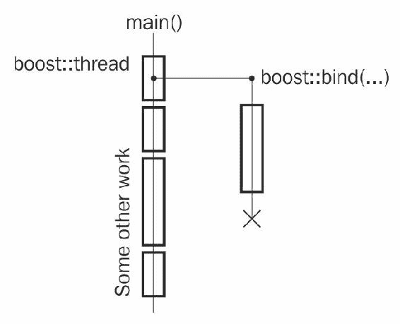
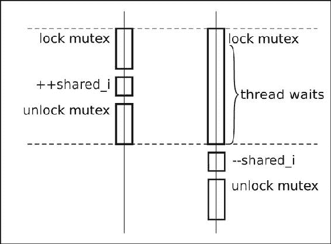
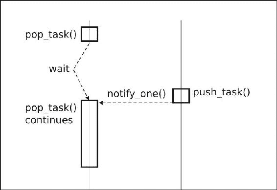

# 多线程

在本章中，我们将涵盖：

+   创建执行线程

+   同步访问共享资源

+   使用原子快速访问共享资源

+   创建一个 work_queue 类

+   多读单写锁

+   创建每个线程唯一的变量

+   中断线程

+   操作一组线程

+   安全初始化共享变量

+   多个互斥锁

# 介绍

在本章中，我们将处理线程和与之相关的所有内容。鼓励具有多线程基础知识。

**多线程**意味着单个进程中存在多个执行线程。线程可以共享进程资源并拥有自己的资源。这些执行线程可以在不同的 CPU 上独立运行，从而实现更快速和更负责任的程序。`Boost.Thread`库提供了跨操作系统接口的统一工作线程。它不是一个仅头文件的库，因此本章中的所有示例都需要链接到`libboost_thread`和`libboost_system`库。

# 创建执行线程

在现代多核编译器上，为了实现最大性能（或者只是提供良好的用户体验），程序通常使用多个执行线程。以下是一个激励性的例子，我们需要在一个线程中创建和填充一个大文件，该线程绘制用户界面：

```cpp
#include <cstddef> // for std::size_t

bool is_first_run(); 

// Function that executes for a long time.
void fill_file(char fill_char, std::size_t size, const char* filename);

// Called in thread that draws a user interface:
void example_without_threads() {
    if (is_first_run()) {
        // This will be executing for a long time during which
        // users interface freezes...
        fill_file(0, 8 * 1024 * 1024, "save_file.txt");
    }
}
```

# 准备工作

此配方需要了解`boost::bind`或`std::bind`。

# 如何做...

启动执行线程从未如此简单：

```cpp
#include <boost/thread.hpp> 

// Called in thread that draws a user interface:
void example_with_threads() {
    if (is_first_run()) {
        boost::thread(boost::bind(
            &fill_file,
            0,
            8 * 1024 * 1024,
            "save_file.txt"
        )).detach();
    }
}
```

# 它是如何工作的...

`boost::thread`变量接受一个可以无参数调用的函数对象（我们使用`boost::bind`提供了一个），并创建一个独立的执行线程。该函数对象被复制到构造的执行线程中并在那里运行。函数对象的返回值被忽略。



我们在所有配方中使用`Boost.Thread`的第 4 版（将`BOOST_THREAD_VERSION`定义为`4`）。`Boost.Thread`版本之间的重要区别已经突出显示。

之后，我们调用`detach()`函数，它会执行以下操作：

+   执行线程从`boost::thread`变量中分离，但继续执行

+   `boost::thread`变量开始保持`Not-A-Thread`状态

如果没有调用`detach()`，`boost::thread`的析构函数将注意到它仍然持有一个 OS 线程，并将调用`std::terminate`。它会在不调用析构函数、释放资源和进行其他清理的情况下终止我们的程序。

默认构造的线程也有一个`Not-A-Thread`状态，并且它们不会创建一个独立的执行线程。

# 还有更多...

如果我们想确保在执行其他工作之前文件已创建并写入，那么我们需要以以下方式加入线程：

```cpp
void example_with_joining_threads() {
    if (is_first_run()) {
        boost::thread t(boost::bind(
            &fill_file,
            0,
            8 * 1024 * 1024,
            "save_file.txt"
        ));

        // Do some work.
        // ...

        // Waiting for thread to finish.
        t.join();
    }
} 
```

线程加入后，`boost::thread`变量保持`Not-A-Thread`状态，其析构函数不会调用`std::terminate`。

请记住，在调用其析构函数之前，线程必须被加入或分离。否则，您的程序将终止！

使用定义了`BOOST_THREAD_VERSION=2`，`boost::thread`的析构函数调用`detach()`，这不会导致`std::terminate`。但这样做会破坏与`std::thread`的兼容性，并且有一天，当您的项目转移到 C++标准库线程时，或者当`BOOST_THREAD_VERSION=2`不受支持时，这将给您带来很多惊喜。`Boost.Thread`的第 4 版更加明确和强大，这在 C++语言中通常更可取。

请注意，当任何不是`boost::thread_interrupted`类型的异常离开传递给`boost::thread`构造函数的功能对象时，将调用`std::terminate()`。

有一个非常有用的包装器，它作为一个 RAII 包装器围绕线程工作，并允许您模拟`BOOST_THREAD_VERSION=2`的行为；它被称为`boost::scoped_thread<T>`，其中`T`可以是以下类之一：

+   `boost::interrupt_and_join_if_joinable`：在销毁时中断和加入线程

+   `boost::join_if_joinable`：在销毁时加入线程

+   `boost::detach`：在销毁时分离线程

这是一个简短的例子：

```cpp
#include <boost/thread/scoped_thread.hpp> 

void some_func(); 

void example_with_raii() { 
    boost::scoped_thread<boost::join_if_joinable> t( 
        boost::thread(&some_func) 
    ); 

    // 't' will be joined at scope exit.
} 
```

`boost::thread`类被接受为 C++11 标准的一部分，并且您可以在`std::`命名空间的`<thread>`头文件中找到它。Boost 的版本 4 和 C++11 标准库版本的`thread`类之间没有太大的区别。但是，`boost::thread`在 C++03 编译器上可用，因此其使用更加灵活。

默认情况下调用`std::terminate`而不是加入有很好的理由！C 和 C++语言经常用于生命关键软件。这些软件由其他软件控制，称为**看门狗**。这些看门狗可以轻松检测到应用程序已终止，但并不总是能够检测到死锁，或者以更长的延迟检测到死锁。例如，对于除颤器软件，终止比等待几秒钟以等待看门狗反应更安全。在设计这类应用程序时请记住这一点。

# 另请参阅

+   本章中的所有示例都使用了`Boost.Thread`。您可以继续阅读以获取有关该库的更多信息。

+   官方文档中列出了`boost::thread`方法的完整列表，并对它们在 C++11 标准库中的可用性进行了说明。请访问[`boost.org/libs/thread`](http://boost.org/libs/thread)获取官方文档。

+   *中断线程*的示例将让您了解`boost::interrupt_and_join_if_joinable`类的作用。

# 同步访问共享资源

现在我们知道如何启动执行线程，我们希望从不同的线程访问一些共享资源：

```cpp
#include <cassert> 
#include <cstddef> 
#include <iostream>

// In previous recipe we included 
// <boost/thread.hpp>, which includes all 
// the classes of Boost.Thread.
// Following header includes only boost::thread. 
#include <boost/thread/thread.hpp> 

int shared_i = 0;

void do_inc() {
    for (std::size_t i = 0; i < 30000; ++i) {
        const int i_snapshot = ++shared_i;
        // Do some work with i_snapshot.
        // ...
    }
}

void do_dec() {
    for (std::size_t i = 0; i < 30000; ++i) {
        const int i_snapshot = --shared_i;
        // Do some work with i_snapshot.
        // ...
    }
}

void run() {
    boost::thread t1(&do_inc);
    boost::thread t2(&do_dec);

    t1.join();
    t2.join();

    assert(global_i == 0); // Oops!
    std::cout << "shared_i == " << shared_i;
}
```

这里的`Oops!`不是无意写在那里的。对于一些人来说，这可能是一个惊喜，但`shared_i`不等于`0`的可能性很大：

```cpp
    shared_i == 19567
```

现代编译器和处理器有大量不同的棘手优化，可能会破坏前面的代码。我们不会在这里讨论它们，但在文档的*另请参阅*部分有一个有用的链接，简要描述了它们。

当共享资源是一个非平凡的类时，情况变得更糟；分段错误和内存泄漏可能（并且将）发生。

我们需要更改代码，以便只有一个线程在单个时间点修改`shared_i`变量，并且所有影响多线程代码的处理器和编译器优化都被绕过。

# 准备工作

建议具备基本的线程知识。

# 如何做...

让我们看看如何修复之前的例子，并在运行结束时使`shared_i`相等：

1.  首先，我们需要创建一个**互斥锁**：

```cpp
#include <boost/thread/mutex.hpp> 
#include <boost/thread/locks.hpp> 

int shared_i = 0; 
boost::mutex i_mutex; 
```

1.  将修改或获取`shared_i`变量数据的所有操作放在以下位置：

```cpp
      {   // Critical section begin 
          boost::lock_guard<boost::mutex> lock(i_mutex); 
```

以及以下内容：

```cpp
      }   // Critical section end 
```

它应该是这样的：

```cpp
void do_inc() {
    for (std::size_t i = 0; i < 30000; ++i) {
        int i_snapshot;
        { // Critical section begin.
            boost::lock_guard<boost::mutex> lock(i_mutex);
            i_snapshot = ++shared_i;
        } // Critical section end.

        // Do some work with i_snapshot.
        // ...
    }
}

void do_dec() {
    for (std::size_t i = 0; i < 30000; ++i) {
        int i_snapshot;
        { // Critical section begin.
            boost::lock_guard<boost::mutex> lock(i_mutex);
            i_snapshot = -- shared_i;
        } // Critical section end.

        // Do some work with i_snapshot.
        // ...
    }
} 
```

# 它是如何工作的...

`boost::mutex`类负责所有同步工作。当一个线程尝试通过`boost::lock_guard<boost::mutex>`变量锁定它，并且没有其他线程持有锁时，它成功地获得对代码部分的唯一访问，直到锁被解锁或销毁。如果其他线程已经持有锁，尝试获取锁的线程将等待直到另一个线程解锁锁。所有的锁定/解锁操作都包含特定的指令，以便在关键部分所做的更改对所有线程可见。此外，您不再需要：

+   确保资源的修改值对所有核心可见

+   确保值不仅仅在处理器的寄存器中被修改

+   强制处理器不要重新排序指令

+   强制编译器不要重新排序指令

+   强制编译器不要删除对未读取的存储的写入

+   一堆其他讨厌的编译器/架构特定的东西

如果您有一个变量被不同的线程使用，并且至少有一个线程修改该变量，通常情况下，使用它的所有代码必须被视为关键部分，并由互斥锁保护。

`boost::lock_guard`类是一个非常简单的 RAII 类，它存储互斥锁的引用，在单参数构造函数中锁定它，并在析构函数中解锁它。

在前面的示例中，大括号的使用中`lock`变量是在其中构造的，以便在到达`//关键部分结束。`的闭括号时，将调用`lock`变量的析构函数并解锁互斥锁。即使在关键部分发生异常，互斥锁也会被正确解锁。



如果初始化一个共享变量，然后构造只读取它的线程，那么不需要互斥锁或其他同步。

# 还有更多...

锁定互斥锁可能是一个非常慢的操作，可能会使您的代码停止很长时间，直到其他线程释放锁。尝试使关键部分尽可能小；尽量减少代码中的关键部分。

让我们看看一些操作系统如何处理多核 CPU 上的锁定。当运行在 CPU 1 上的`线程#1`尝试锁定已被另一个线程锁定的互斥锁时，`线程#1`被操作系统停止，直到锁被释放。停止的线程不会占用处理器资源，因此操作系统在 CPU 1 上执行其他线程。现在，我们有一些线程在 CPU 1 上运行；一些其他线程释放了锁，现在操作系统必须恢复`线程#1`的执行。因此，它在当前空闲的 CPU 上恢复其执行，例如 CPU2。

这导致 CPU 缓存未命中，因此在释放互斥锁后，代码运行速度略慢。通常情况下，情况并不那么糟糕，因为一个好的操作系统会尽力在相同的 CPU 上恢复线程。不幸的是，这样的操作系统特定优化并不总是可能的。减少关键部分的数量和大小以减少线程暂停和缓存未命中的机会。

不要尝试在同一线程中两次锁定`boost::mutex`变量；这将导致**死锁**。如果需要从单个线程多次锁定互斥锁，请改用`<boost/thread/recursive_mutex.hpp>`头文件中的`boost::recursive_mutex`。多次锁定它不会导致死锁。`boost::recursive_mutex`只有在每次`lock()`调用后调用一次`unlock()`后才释放锁。当不需要时避免使用`boost::recursive_mutex`，因为它比`boost::mutex`慢，通常表示糟糕的代码流设计。

`boost::mutex`、`boost::recursive_mutex`和`boost::lock_guard`类已被接受为 C++11 标准库，并且您可以在`std::`命名空间的`<mutex>`头文件中找到它们。Boost 版本和标准库版本之间没有太大的区别。Boost 版本可能具有一些扩展（在官方文档中标记为*EXTENSION*），并且提供更好的可移植性，因为它们甚至可以在 C++11 之前的编译器上使用。

# 另请参阅

+   下一个示例将为您提供有关如何使此示例更快（更短）的想法。

+   阅读本章的第一个示例以获取有关`boost::thread`类的更多信息。官方文档[`boost.org/libs/thread`](http://boost.org/libs/thread)也可能对您有所帮助。

+   要获取有关为什么第一个示例失败以及多处理器如何使用共享资源的更多信息，请参阅[`www.rdrop.com/users/paulmck/scalability/paper/whymb.2010.07.23a.pdf`](http://www.rdrop.com/users/paulmck/scalability/paper/whymb.2010.07.23a.pdf)上的*Memory Barriers: a Hardware View for Software Hackers*。请注意，这是一个难题。

# 使用原子操作快速访问共享资源

在前一个配方中，我们看到了如何安全地从不同线程访问一个共同的资源。但在那个配方中，我们只是做了两个系统调用（在锁定和解锁`mutex`中）来获取整数的值：

```cpp
{   // Critical section begin.
    boost::lock_guard<boost::mutex> lock(i_mutex); 
    i_snapshot = ++ shared_i; 
}   // Critical section end.
```

这看起来很糟糕和慢！我们能让前一个配方中的代码更好吗？

# 准备工作

阅读第一个配方就足够开始这个配方了。一些关于多线程的基本知识将会很有帮助。

# 如何做...

让我们看看如何改进我们之前的例子：

1.  现在，我们需要不同的头文件：

```cpp
#include <cassert> 
#include <cstddef> 
#include <iostream>

#include <boost/thread/thread.hpp> 
#include <boost/atomic.hpp> 
```

1.  需要改变`shared_i`的类型：

```cpp
boost::atomic<int> shared_i(0); 
```

1.  移除所有的`boost::lock_guard`变量：

```cpp
void do_inc() {
    for (std::size_t i = 0; i < 30000; ++i) {
        const int i_snapshot = ++ shared_i;

        // Do some work with i_snapshot.
        // ...
    }
}

void do_dec() {
    for (std::size_t i = 0; i < 30000; ++i) {
        const int i_snapshot = -- shared_i;

        // Do some work with i_snapshot.
        // ...
    }
}
```

1.  就是这样！现在它可以工作了：

```cpp
int main() {
    boost::thread t1(&do_inc);
    boost::thread t2(&do_dec);

    t1.join();
    t2.join();

    assert(shared_i == 0);
    std::cout << "shared_i == " << shared_i << std::endl;

    assert(shared_i.is_lock_free());
}
```

# 它是如何工作的...

处理器提供特定的**原子操作**，不会受到其他处理器或处理器核心的干扰。这些操作对系统来说似乎是瞬间发生的。`Boost.Atomic`提供了包装系统特定原子操作的类，与编译器合作以禁用可能破坏变量的多线程工作的优化，并提供一个统一的可移植接口来处理原子操作。如果两个不同线程同时开始对同一内存位置的原子操作，其中一个操作会等待直到另一个操作完成，然后重用前一个操作的结果。


换句话说，可以安全地同时从不同线程使用`boost::atomic<>`变量。系统中对原子变量的每个操作都被视为单个事务。系统中对原子变量的一系列操作被视为一系列独立的事务：

```cpp
--shared_i;    // Transaction #1 
// Some other may change value of `shared_i`!!
++shared_i;    // Transaction #2 
```

永远不要避免对多个线程修改的变量进行同步。即使变量是`bool`，你所做的只是读取或写入`true`/`false`！编译器有权利优化掉所有的存储和读取，以一百万种无法想象的方式破坏你的代码。猜猜一个好的雇主会惩罚谁？（编译器不是这个问题的正确答案！）

# 还有更多...

`Boost.Atomic`库只能处理 POD 类型；否则，行为是未定义的。一些平台/处理器不提供某些类型的原子操作，因此`Boost.Atomic`使用`boost::mutex`来模拟原子行为。如果类型特定的宏设置为`2`，原子类型就不使用`boost::mutex`：

```cpp
#include <boost/static_assert.hpp> 
BOOST_STATIC_ASSERT(BOOST_ATOMIC_INT_LOCK_FREE == 2); 
```

`boost::atomic<T>::is_lock_free`成员函数取决于运行时，因此不适合用于编译时检查，但在运行时检查足够时可能提供更可读的语法：

```cpp
assert(shared_i.is_lock_free()); 
```

原子操作比互斥锁快得多，但仍然比非原子操作慢得多。如果我们比较使用互斥锁的配方的执行时间（0:00.08 秒）和本配方中前面示例的执行时间（0:00.02 秒），我们会看到差异（在 30,0000 次迭代中进行测试）。

所有已知的标准库实现都存在原子操作的问题。所有的都有！不要编写自己的原子操作。如果你认为你自己的原子操作实现会更好，而且你希望浪费一些时间--写下来，使用特殊工具进行检查，然后再考虑。直到你明白你错了。

符合 C++11 标准的编译器应该在`std::`命名空间的`<atomic>`头文件中具有所有原子类、`typedefs`和宏。如果编译器正确支持 C++11 内存模型并且专门训练以优化`std::atomic`变量，那么特定于编译器的`std::atomic`实现可能比 Boost 的版本更快。

# 另请参阅

[`boost.org/libs/atomic`](http://boost.org/libs/atomic)的官方文档可能会给你更多例子和一些关于这个主题的理论信息。

# 创建 work_queue 类

让我们称没有参数的函数对象为任务。

```cpp
typedef boost::function<void()> task_t; 
```

现在，想象一种情况，我们有一些负责发布任务的线程和一些负责执行发布的任务的线程。我们需要设计一个可以安全地被这两种类型的线程使用的类。这个类必须具有以下函数：

+   获取一个任务或等待任务直到被另一个线程发布

+   检查并获取任务（如果有任务则返回一个空任务）

+   发布任务

# 准备就绪

确保你对`boost::thread`或`std::thread`感到舒适，了解互斥锁的基础知识，并且了解`boost::function`或`std::function`。

# 如何做...

我们要实现的类与`std::queue<task_t>`的功能相似，但也具有线程同步。让我们开始：

1.  我们需要以下的头文件和成员：

```cpp
#include <deque>
#include <boost/function.hpp>
#include <boost/thread/mutex.hpp>
#include <boost/thread/locks.hpp>
#include <boost/thread/condition_variable.hpp>

class work_queue {
public:
    typedef boost::function<void()> task_type;type;

private:
    std::deque<task_type> tasks_;
    boost::mutex tasks_mutex_;
    boost::condition_variable cond_;
```

1.  将任务放入队列的函数必须像这样：

```cpp
public:
    void push_task(const task_type& task) {
        boost::unique_lock<boost::mutex> lock(tasks_mutex_);
        tasks_.push_back(task);
        lock.unlock();

        cond_.notify_one();
    }
```

1.  一个非阻塞的函数，用于获取推送的任务或空任务（如果没有任务）

```cpp
    task_type try_pop_task() {
        task_type ret;
        boost::lock_guard<boost::mutex> lock(tasks_mutex_);
        if (!tasks_.empty()) {
            ret = tasks_.front();
            tasks_.pop_front();
        }

        return ret;
    }
```

1.  用于获取推送的任务或在任务被另一个线程推送时阻塞的阻塞函数：

```cpp
    task_type pop_task() {
        boost::unique_lock<boost::mutex> lock(tasks_mutex_);
        while (tasks_.empty()) {
            cond_.wait(lock);
        }

        task_type ret = tasks_.front();
        tasks_.pop_front();

        return ret;
    }
}; 
```

下面是`work_queue`类的使用方法：

```cpp
#include <boost/thread/thread.hpp>

work_queue g_queue;

void some_task();
const std::size_t tests_tasks_count = 3000 /*000*/;

void pusher() {
    for (std::size_t i = 0; i < tests_tasks_count; ++i) {
        g_queue.push_task(&some_task);
    }
}

void popper_sync() {
    for (std::size_t i = 0; i < tests_tasks_count; ++i) {
        work_queue::task_type t = g_queue.pop_task();
        t();         // Executing task.
    }
}

int main() {
    boost::thread pop_sync1(&popper_sync);
    boost::thread pop_sync2(&popper_sync);
    boost::thread pop_sync3(&popper_sync);

    boost::thread push1(&pusher);
    boost::thread push2(&pusher);
    boost::thread push3(&pusher);

    // Waiting for all the tasks to push.
    push1.join();
    push2.join();
    push3.join();
    g_queue.flush(); 

    // Waiting for all the tasks to pop.
    pop_sync1.join();
    pop_sync2.join();
    pop_sync3.join();

    // Asserting that no tasks remained,
    // and falling though without blocking.
    assert(!g_queue.try_pop_task());

    g_queue.push_task(&some_task);

    // Asserting that there is a task,
    // and falling though without blocking.
    assert(g_queue.try_pop_task());
}
```

# 它是如何工作的...

在这个例子中，我们看到了一个新的 RAII 类`boost::unique_lock`。它只是一个`boost::lock_guard`类，具有额外的功能来显式解锁和锁定互斥锁。

回到我们的`work_queue`类。让我们从`pop_task()`函数开始。一开始，我们会获取一个锁并检查是否有可用的任务。如果有任务，我们就返回它；否则，会调用`cond_.wait(lock)`。这个方法会原子性地解锁锁，并暂停执行线程，直到其他线程通知当前线程。

现在，让我们来看一下`push_task`方法。在这个方法中，我们也会获取一个锁，将任务推入`tasks_.queue`，解锁锁，并调用`cond_.notify_one()`，这会唤醒等待在`cond_.wait(lock)`中的线程（如果有的话）。因此，在这之后，如果有线程在`pop_task()`方法中等待条件变量，那么线程将继续执行，深入到`cond_.wait(lock)`中的`lock.lock()`，并在`while`中检查`tasks_empty()`。因为我们刚刚在`tasks_`中添加了一个任务，所以我们会从`while`循环中退出，解锁`<mutex>`（`lock`变量超出了作用域），并返回一个任务。



你必须在循环中检查条件，而不仅仅是在`if`语句中！`if`语句会导致错误，因为操作系统有时可能会在没有用户的通知调用的情况下唤醒线程。

# 还有更多...

请注意，在调用`notify_one()`之前，我们明确解锁了互斥锁。然而，即使不解锁，我们的例子仍然可以工作。

但是，在这种情况下，唤醒的线程可能在尝试在`cond_wait(lock)`中的`lock.lock()`时再次被阻塞，这会导致更多的上下文切换和更差的性能。

将`tests_tasks_count`设置为`3000000`，并且不进行显式解锁，这个例子运行了 7 秒：

```cpp
 $time -f E ./work_queue
 0:07.38
```

进行显式解锁后，这个例子运行了 5 秒：

```cpp
 $ time -f E ./work_queue 
 0:05.39
```

你还可以使用`cond_.notify_all()`来通知所有等待特定条件变量的线程。

一些极端的操作系统在 Boost 1.64 版本之前（https://github.com/boostorg/thread/pull/105）在临界区外（没有持有锁）调用`notify_one()`时可能会出现极为罕见的问题。你很少会遇到这种情况。但是，为了避免在这些平台上出现问题，你可以在`work_queue`类中添加一个`flush()`函数，它持有一个锁并调用`notify_all()`：

`void flush() {` `boost::lock_guard<boost::mutex> lock(tasks_mutex_);` `cond_.notify_all();` `}`

当你完成了将任务推入队列的操作时，请调用`flush()`来强制唤醒所有线程。

C++11 标准在`<condition_variable>`头文件中声明了`std::condition_variable`，在`<mutex>`头文件中声明了`std::unique_lock`。如果你使用 C++03 编译器，可以使用 Boost 版本，或者使用 Boost 的一些扩展。

通过添加对**右值引用**的支持并调用`std::move(tasks_.front())`，`work_queue`类可以得到显着改进。这将使关键部分的代码更快，减少线程、挂起和唤醒，减少缓存未命中，从而提高性能。

# 另请参阅

+   本章的前三个配方提供了关于`Boost.Thread`的许多有用信息

+   官方文档可能会给您更多的例子和一些关于这个主题的理论信息；它可以在[`boost.org/libs/thread`](http://boost.org/libs/thread)找到

# 多读者单写者锁

想象一下，我们正在开发一些在线服务。我们有一个无序映射的注册用户，每个用户都有一些属性。这个集合被许多线程访问，但很少被修改。对以下集合的所有操作都是线程安全的：

```cpp
#include <unordered_map> 
#include <boost/thread/mutex.hpp> 
#include <boost/thread/locks.hpp> 

struct user_info {
    std::string address;
    unsigned short age;

    // Other parameters
    // ...
};

class users_online {
    typedef boost::mutex mutex_t;

    mutable mutex_t                             users_mutex_;
    std::unordered_map<std::string, user_info>  users_;

public:
    bool is_online(const std::string& username) const {
        boost::lock_guard<mutex_t> lock(users_mutex_);
        return users_.find(username) != users_.end();
    }

    std::string get_address(const std::string& username) const {
        boost::lock_guard<mutex_t> lock(users_mutex_);
        return users_.at(username).address;
    }

    void set_online(const std::string& username, user_info&& data) {
        boost::lock_guard<mutex_t> lock(users_mutex_);
        users_.emplace(username, std::move(data));
    }

    // Other methods:
    // ...
};
```

不幸的是，我们的在线服务在某种程度上很慢，分析器显示问题出在`users_online`类中。任何操作都会在`mutex_`变量上获得独占锁，因此即使获取资源也会导致在锁定的互斥锁上等待。由于一些资源很难复制，关键部分消耗了大量时间，从而减慢了对`users_online`类的任何操作。

不幸的是，项目要求不允许我们重新设计类。我们能否在不更改接口的情况下加快速度？

# 准备就绪

确保您对`boost::thread`或`std::thread`感到满意，并了解互斥锁的基础知识。

# 如何做...

这可能会有所帮助：

用`boost::shared_mutex`替换`boost::mutex`。对于不修改数据的方法，用`boost::shared_lock`替换`boost::unique_locks`：

```cpp
#include <boost/thread/shared_mutex.hpp> 

class users_online {
    typedef boost::shared_mutex mutex_t;

    mutable mutex_t                             users_mutex_;
    std::unordered_map<std::string, user_info>  users_;

public:
    bool is_online(const std::string& username) const {
        boost::shared_lock<mutex_t> lock(users_mutex_);
        return users_.find(username) != users_.end();
    }

    std::string get_address(const std::string& username) const {
        boost::shared_guard<mutex_t> lock(users_mutex_);
        return users_.at(username).address;
    }

    void set_online(const std::string& username, user_info&& data) {
        boost::lock_guard<mutex_t> lock(users_mutex_);
        users_.emplace(username, std::move(data));
    }

    // Other methods:
    // ...
};
```

# 工作原理...

如果这些线程不修改数据，我们可以允许多个线程同时从中获取数据。我们只需要独占拥有互斥锁，如果我们要修改由它保护的数据。在所有其他情况下，允许对数据进行同时访问。这就是`boost::shared_mutex`的设计目的。它允许共享锁定（读锁定），允许对资源进行多个同时访问。

当我们尝试对共享锁定的资源进行独占锁定时，操作将被阻塞，直到没有剩余的读锁，然后才能对该资源进行独占锁定，迫使新的共享锁等待直到独占锁被释放。`boost::shared_lock`用于读取和写入的锁定比通常的`boost::mutex`锁定要慢得多。除非您确定没有好的方法重新设计您的代码，并且确定`boost::shared_lock`会加快速度，否则不要使用`boost::shared_lock`。

一些读者可能是第一次看到`mutable`关键字。这个关键字可以应用于非静态和非常量的类成员。`mutable`数据成员可以在常量成员函数中修改，通常用于互斥锁和其他与类逻辑无直接关系的辅助变量。

# 还有更多...

当您只需要独占锁时，不要使用`boost::shared_mutex`，因为它比通常的`boost::mutex`类更慢。

直到 C++14 之前，C++中还没有共享互斥锁。`shared_timed_mutex`和`shared_lock`在`std::`命名空间的`<shared_mutex>`头文件中定义。它们的性能特征接近 Boost 版本，因此应用所有前面的性能注意事项。

C++17 有一个`shared_mutex`，可能比`shared_timed_mutex`稍快，因为它不提供定时锁定的手段。这可能会节省一些宝贵的纳秒。

# 另请参阅

+   还有一个`boost::upgrade_mutex`类，对于需要将共享锁提升为独占锁的情况可能会有用。有关更多信息，请参阅[`boost.org/libs/thread`](http://boost.org/libs/thread)上的`Boost.Thread`文档。

+   有关可变关键字的更多信息，请参阅[`herbsutter.com/2013/01/01/video-you-dont-know-const-and-mutable/`](http://herbsutter.com/2013/01/01/video-you-dont-know-const-and-mutable/)。

# 创建每个线程唯一的变量

让我们来看看*创建* *work_queue 类*的配方。那里的每个任务都可以在许多线程中的一个中执行，我们不知道在哪一个中执行。想象一下，我们想使用某个连接发送执行任务的结果：

```cpp
#include <boost/noncopyable.hpp>

class connection: boost::noncopyable {
public:
    // Opening a connection is a slow operation
    void open();

    void send_result(int result);

    // Other methods
    // ...
};
```

我们有以下解决方案：

+   在需要发送数据时打开新连接（这非常慢）

+   每个线程只有一个连接，并在互斥体中包装它们（这也很慢）

+   拥有一个连接池，在线程安全的方式下从中获取连接并使用它（需要大量编码，但这种解决方案很快）

+   每个线程只有一个连接（快速且简单实现）

那么，我们如何实现最后的解决方案？

# 准备工作

需要基本的线程知识。

# 如何做...

是时候创建一个线程本地变量了。在`connection`类定义之后的头文件中声明一个函数：

```cpp
connection& get_connection();
```

使您的源文件看起来像这样：

```cpp
#include <boost/thread/tss.hpp>
boost::thread_specific_ptr<connection> connection_ptr;

connection& get_connection() {
    connection* p = connection_ptr.get();
    if (!p) {
        connection_ptr.reset(new connection);
        p = connection_ptr.get();
        p->open();
    }

    return *p;
}
```

完成。使用特定于线程的资源从未如此简单：

```cpp
void task() {
    int result;
    // Some computations go there.
    // ...

    // Sending the result:
    get_connection().send_result(result);
}
```

# 工作原理...

`boost::thread_specific_ptr`变量为每个线程保存一个单独的指针。最初，此指针等于`nullptr`；这就是为什么我们检查`!p`并在其为`nullptr`时打开连接。

因此，当我们从已经初始化指针的线程进入`get_connection()`时，`!p`返回值为`false`，我们返回已经打开的连接。

在线程退出时调用存储在`connection_ptr`变量中的指针的`delete`，因此我们不需要担心内存泄漏。

# 还有更多...

您可以提供自己的清理函数，该函数将在线程退出时调用，而不是调用`delete`。清理函数必须具有`void (*cleanup_function)(T*)`签名，并且必须在`boost::thread_specific_ptr`构造期间传递。

C++11 有一个特殊的关键字`thread_local`，用于声明具有线程本地存储期的变量。C++11 没有`thread_specific_ptr`类，但您可以在支持`thread_local`的编译器上使用`thread_local T`或`thread_local std::unique_ptr<T>`来实现相同的行为。`boost::thread_specific_ptr`适用于 C++11 之前的编译器，而`thread_local`则不适用。

C++17 有`inline`变量，您可以在头文件中使用`inline`和`thread_local`声明线程本地变量。

# 另请参阅

+   `Boost.Thread`文档提供了许多不同情况下的良好示例；可以在[`boost.org/libs/thread`](http://boost.org/libs/thread)找到。

+   阅读此主题[`stackoverflow.com/questions/13106049/c11-gcc-4-8-thread-local-performance-penalty.html`](http://stackoverflow.com/questions/13106049/c11-gcc-4-8-thread-local-performance-penalty.html)以及关于 GCC 的`__thread`关键字[`gcc.gnu.org/onlinedocs/gcc-3.3.1/gcc/Thread-Local.html`](http://gcc.gnu.org/onlinedocs/gcc-3.3.1/gcc/Thread-Local.html)可能会给您一些关于`thread_local`在编译器中是如何实现以及有多快的想法

# 中断线程

有时，我们需要终止消耗了太多资源或执行时间过长的线程。例如，某些解析器在一个线程中工作（并且积极使用`Boost.Thread`），但我们已经从中获取了所需数量的数据，因此可以停止解析。这是存根：

```cpp
int main() {
    boost::thread parser_thread(&do_parse);

    // ...

    if (stop_parsing) {
        // No more parsing required.
        // TODO: Stop the parser!
    }

    // ...

    parser_thread.join();
}
```

我们如何做？

# 准备工作

这个配方几乎不需要任何东西。您只需要至少有基本的线程知识。

# 如何做...

我们可以通过中断来停止线程：

```cpp
if (stop_parsing) { 
    // No more parsing required. 
    parser_thread.interrupt(); 
}
```

# 工作原理...

`Boost.Thread`在其中提供了一些预定义的**中断点**，线程通过`interrupt()`调用来检查是否被中断。如果线程被中断，将抛出异常`boost::thread_interrupted`。当异常通过`do_parse()`内部传播时，它会调用所有资源的析构函数，就像典型的异常一样。`boost::thread_interrupted`异常在`Boost.Thread`库中被特殊对待，对于该异常，允许离开线程函数（例如我们的示例中的`do_parse()`）。当异常离开线程函数时，它被`boost::thread`内部捕获，并被视为取消线程的请求。

`boost::thread_interrupted`不是从`std::exception`派生的！如果通过类型或引用`std::exception`捕获异常，中断将有效。但是，如果通过`catch (...)`捕获异常并且不重新抛出它，中断将无效。

正如我们从本章的第一个示例中所知道的，如果传递给线程的函数没有捕获异常并且异常离开函数范围，应用程序将终止。`boost::thread_interrupted`是唯一的例外；它可以离开函数范围，并且不会`std::terminate()`应用程序。

# 还有更多...

`Boost.Thread`库的中断点在官方文档中列出。一般来说，一切阻塞都会检查中断。

我们也可以在任何地方手动添加中断点。我们只需要调用`boost::this_thread::interruption_point()`：

```cpp
void do_parse() {
    while (not_end_of_parsing) {
        // If current thread was interrupted, the following
        // line will throw an boost::thread_interrupted.
        boost::this_thread::interruption_point();

        // Some parsing goes here.
        // ...
    }
}
```

如果项目不需要中断，定义`BOOST_THREAD_DONT_PROVIDE_INTERRUPTIONS`会提供一点性能提升，并完全禁用线程中断。

C++11 没有线程中断，但可以使用原子操作部分模拟它们：

+   创建一个原子`bool`变量

+   在线程中检查原子变量，如果发生变化，则抛出异常

+   不要忘记在传递给线程的函数中捕获异常（否则你的应用程序将终止）

但是，如果代码在条件变量或睡眠方法中等待，这将无济于事。

# 另请参阅

+   `Boost.Thread`的官方文档提供了预定义的中断点列表，网址为[`www.boost.org/doc/libs/1_64_0/doc/html/thread/thread_management.html#thread.thread_management.tutorial.interruption.predefined_interruption_points`](http://www.boost.org/doc/libs/1_64_0/doc/html/thread/thread_management.html#thread.thread_management.tutorial.interruption.predefined_interruption_points)

+   作为练习，查看本章的其他示例，并考虑在哪些地方添加额外的中断点会改善代码

+   阅读`Boost.Thread`文档的其他部分可能会有用；请访问[`boost.org/libs/thread`](http://boost.org/libs/thread)

# 操作一组线程

那些试图自己重复所有示例或者试验线程的读者，可能已经厌倦了编写以下代码来启动和加入线程：

```cpp
#include <boost/thread.hpp>

void some_function();

void sample() {
    boost::thread t1(&some_function);
    boost::thread t2(&some_function);
    boost::thread t3(&some_function);

    // ... 

    t1.join();
    t2.join();
    t3.join();
} 
```

也许有更好的方法来做这个？

# 准备工作

对线程的基本知识将足够应对这个问题。

# 如何做...

我们可以使用`boost::thread_group`类来操作一组线程。

1.  构造一个`boost::thread_group`变量：

```cpp
#include <boost/thread.hpp>

int main() {
    boost::thread_group threads;
```

1.  在前面的变量中创建线程：

```cpp
    // Launching 10 threads.
    for (unsigned i = 0; i < 10; ++i) {
        threads.create_thread(&some_function);
    }
```

1.  现在，你可以在`boost::thread_group`中为所有线程调用函数：

```cpp
    // Joining all threads.
    threads.join_all();

    // We can also interrupt all of them
    // by calling threads.interrupt_all();
}
```

# 它是如何工作的...

`boost::thread_group`变量只是保存了所有构造或移动到其中的线程，并可以向所有线程发送一些调用。

# 还有更多...

C++11 没有`thread_group`类；这是 Boost 特有的。

# 另请参阅

`Boost.Thread`的官方文档可能会给你带来很多其他有用的类，这些类在本章节中没有描述；请访问[`boost.org/libs/thread`](http://boost.org/libs/thread)。

# 安全地初始化共享变量

想象一下，我们正在设计一个安全关键的类，该类从多个线程中使用，从服务器接收答案，对其进行后处理，并输出响应：

```cpp
struct postprocessor {
    typedef std::vector<std::string> answer_t;

    // Concurrent calls on the same variable are safe.
    answer_t act(const std::string& in) const {
        if (in.empty()) {
            // Extremely rare condition.
            return read_defaults();
        }

        // ...
    }
};
```

注意`return read_defaults();`这一行。可能会出现服务器由于网络问题或其他问题而无法响应的情况。在这种情况下，我们尝试从文件中读取默认值：

```cpp
// Executes for a long time.
std::vector<std::string> read_defaults();
```

从前面的代码中，我们遇到了问题：服务器可能在一段显著的时间内无法访问，并且在所有这段时间内，我们将在每次`act`调用时重新读取文件。这显著影响了性能。

我们可以尝试通过在类内部存储`default_`来修复它：

```cpp
struct postprocessor {
    typedef std::vector<std::string> answer_t;

private:
    answer_t default_;

public:
    postprocessor()
        : default_(read_defaults())
    {}

    // Concurrent calls on the same variable are safe.
    answer_t act(const std::string& in) const {
        if (in.empty()) {
            // Extremely rare condition.
            return default_;
        }

        // ...
    }
};
```

这也不是一个完美的解决方案：我们不知道用户构造了多少个`postprocessor`类的实例，并且我们在可能在运行过程中不需要的默认值上浪费了内存。

因此，我们必须在第一次远程服务器失败时并发安全地读取和存储数据，并且在下一次失败时不再读取。有许多方法可以做到这一点，但让我们看看最正确的方法。

# 做好准备

对于这个配方，基本的线程知识已经足够了。

# 如何做...

1.  我们必须添加变量来存储默认值已经初始化的信息，以及一个变量来存储默认值：

```cpp
#include <boost/thread/once.hpp>

struct postprocessor {
    typedef std::vector<std::string> answer_t;

private:
    mutable boost::once_flag default_flag_;
    mutable answer_t default_;
```

变量是`mutable`，因为我们将在`const`成员函数内部修改它们。

1.  让我们初始化我们的变量：

```cpp
public:
    postprocessor()
        : default_flag_(BOOST_ONCE_INIT)
        , default_()
    {}
```

1.  最后，让我们改变`act`函数：

```cpp
    // Concurrent calls on the same variable are safe.
    answer_t act(const std::string& in) const {
        answer_t ret;
        if (in.empty()) {
            // Extremely rare condition.
            boost::call_once(default_flag_, [this]() {
                this->default_ = read_defaults();
            });
            return default_;
        }

        // ...
        return ret;
    }
};
```

# 工作原理...

简而言之，`boost::call_once`和`boost::once_flag`确保第二个参数作为函数只执行一次。

`boost::call_once`函数同步调用作为第二个参数传递的函数*F*。`boost::call_once`和`boost::once_flag`确保在同一个`once_flag`上有两个或更多并发调用时，只有一个对函数*F*的调用会进行，确保只有一次对*F*的成功调用。

如果对函数*F*的调用没有抛出异常离开*F*的主体，那么`boost::call_once`假定调用成功，并将该信息存储在`boost::once_flag`内。对具有相同`boost::once_flag`的`boost::call_once`的任何后续调用都不起作用。

不要忘记使用`BOOST_ONCE_INIT`宏初始化`boost::once_flag`。

# 还有更多...

`boost::call_once`可以将参数传递给要调用的函数：

```cpp
#include <iostream>

void once_printer(int i) {
    static boost::once_flag flag = BOOST_ONCE_INIT;
    boost::call_once(
        flag,
        [](int v) { std::cout << "Print once " << v << '\n'; },
        i // <=== Passed to lambda from above.
    );

    // ...
}
```

现在，如果我们在循环中调用`once_printer`函数：

```cpp
int main() {
    for (unsigned i = 0; i < 10; ++i) {
        once_printer(i);
    }
}
```

只有一行将被输出：

```cpp
Print once 0
```

C++11 在`<mutex>`头文件中有`std::call_once`和`std::once_flag`。与 Boost 版本不同，标准库版本的`once_flag`不需要通过宏进行初始化，它有一个 constexpr 构造函数。通常情况下，如果必须支持旧编译器，则可以使用 Boost 版本。

2015 年之前的 Visual Studio 发行的`std::call_once`实现效率不佳，比 Boost 版本慢十多倍。如果不使用现代编译器，请使用`boost::call_once`。

# 另请参阅

`Boost.Thread`文档提供了许多不同情况下的很好的例子。可以在[`boost.org/libs/thread`](http://boost.org/libs/thread)找到。

# 锁定多个互斥体

在接下来的几段中，你将成为编写游戏的人之一。恭喜，你可以在工作中玩游戏！

您正在开发一个服务器，必须编写代码来在两个用户之间交换战利品：

```cpp
class user {
    boost::mutex        loot_mutex_;
    std::vector<item_t> loot_;
public:
    // ...

    void exchange_loot(user& u);
};
```

每个用户操作都可能由服务器上的不同线程并发处理，因此您必须通过互斥体保护资源。初级开发人员试图解决问题，但他的解决方案不起作用：

```cpp
void user::exchange_loot(user& u) {
    // Terribly wrong!!! ABBA deadlocks.
    boost::lock_guard<boost::mutex> l0(loot_mutex_);
    boost::lock_guard<boost::mutex> l1(u.loot_mutex_);
    loot_.swap(u.loot_);
}
```

上面代码中的问题是一个众所周知的**ABBA 死锁**问题。想象一下*线程 1*锁定*互斥锁 A*，*线程 2*锁定*互斥锁 B*。现在*线程 1*尝试锁定已经被锁定的*互斥锁 B*，而*线程 2*尝试锁定已经被锁定的*互斥锁 A*。这导致两个线程相互无限期地锁定，因为它们需要另一个线程拥有的资源才能继续，而另一个线程则在等待当前线程拥有的资源。

现在，如果`user1`和`user2`同时为对方调用`exchange_loot`，那么我们可能会出现这样的情况，即`user1.exchange_loot(user2)`调用锁定了`user1.loot_mutex_`，而`user2.exchange_loot(user1)`调用锁定了`user2.loot_mutex_`。`user1.exchange_loot(user2)`会无限等待尝试锁定`user2.loot_mutex_`，而`user2.exchange_loot(user1)`会无限等待尝试锁定`user1.loot_mutex_`。

# 准备工作

对线程和互斥锁的基本知识就足够了。

# 如何做...

对此问题有两个主要的开箱即用的解决方案：

1.  需要编译器支持可变模板的短模板：

```cpp
#include <boost/thread/lock_factories.hpp>

void user::exchange_loot(user& u) {
    typedef boost::unique_lock<boost::mutex> lock_t;

    std::tuple<lock_t, lock_t> l = boost::make_unique_locks(
        loot_mutex_, u.loot_mutex_
    );

    loot_.swap(u.loot_);
}
```

使用`auto`的相同代码：

```cpp
#include <boost/thread/lock_factories.hpp>

void user::exchange_loot(user& u) {
    auto l = boost::make_unique_locks(
        loot_mutex_, u.loot_mutex_
    );

    loot_.swap(u.loot_);
}
```

1.  可移植解决方案：

```cpp
#include <boost/thread/locks.hpp>

void user::exchange_loot(user& u) {
    typedef boost::unique_lock<boost::mutex> lock_t;

    lock_t l0(loot_mutex_, boost::defer_lock);
    lock_t l1(u.loot_mutex_, boost::defer_lock);
    boost::lock(l0, l1);

    loot_.swap(u.loot_);
}
```

# 它是如何工作的...

核心思想是以某种方式对互斥锁进行排序，并始终按照特定顺序锁定它们。在这种情况下，不可能出现 ABBA 问题，因为所有线程在锁定互斥锁*A*之前始终会锁定互斥锁*B*。通常会使用其他死锁避免算法，但为了简单起见，我们假设了互斥锁的排序。

在第一个例子中，我们使用了`boost::make_unique_locks`，它总是以特定顺序锁定线程并返回一个持有锁的元组。

在第二个例子中，我们手动创建了锁，但由于传递了`boost::defer_lock`参数，没有锁定它们。实际的锁定发生在`boost::lock(l0, l1)`调用中，它以预定义的顺序锁定了互斥锁。

现在，如果`user1`和`user2`同时为对方调用`exchange_loot`，那么`user1.exchange_loot(user2)`和`user2.exchange_loot(user1)`的调用都会尝试首先锁定`user1.loot_mutex_`，或者两者都会尝试首先锁定`user2.loot_mutex_`。这取决于运行时。

# 还有更多...

`boost::make_unique_locks`和`boost::lock`函数可能接受超过 2 个锁或互斥锁，因此您可以在需要同时锁定两个以上互斥锁的更高级情况下使用它们。

C++11 在头文件`<mutex>`中定义了一个`std::lock`函数，其行为与`boost::lock`函数完全相同。

C++17 有一个更美观的解决方案：

```cpp
#include <mutex>

void user::exchange_loot(user& u) {
    std::scoped_lock l(loot_mutex_, u.loot_mutex_);
    loot_.swap(u.loot_);
}
```

在上面的代码中，`std::scoped_lock`是一个接受可变数量锁的类。它具有可变模板参数，这些参数可以从 C++17 的推导指南中自动推导出来。上面例子中`std::scoped_lock`的实际类型是：

```cpp
std::scoped_lock<std::mutex, std::mutex>
```

`std::scoped_lock`在构造期间持有所有传递的互斥锁的锁，并避免了死锁。换句话说，它的工作原理类似于第一个例子，但看起来更好一些。

# 另请参阅

`Boost.Thread`的官方文档可能会给您带来很多其他有用的类，这些类在本章中没有描述；请访问[`boost.org/libs/thread.`](http://boost.org/libs/thread)
