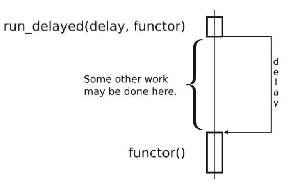
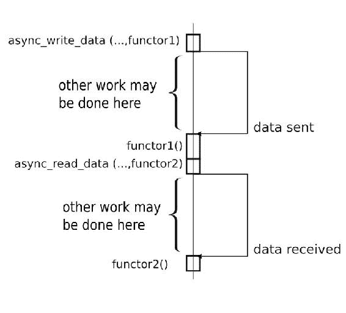
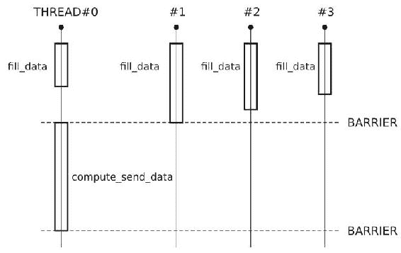
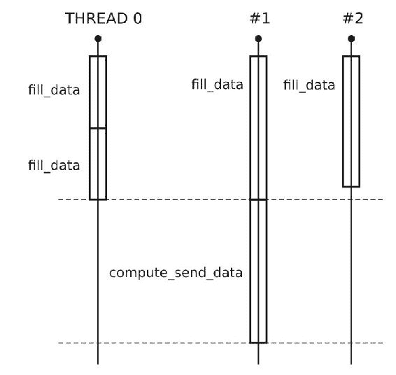

# 第六章：操作任务

在这一章中，我们将涵盖：

+   为任意数据类型处理注册任务

+   创建定时器并将定时器事件作为任务处理

+   将网络通信作为任务

+   接受传入连接

+   并行执行不同的任务

+   管道任务处理

+   创建非阻塞屏障

+   存储异常并从中创建任务

+   获取和处理系统信号作为任务

# 介绍

这一章都是关于任务的。我们将称函数对象为*任务*，因为这样更简洁，更能反映它将要做的事情。这一章的主要思想是，我们可以将所有的处理、计算和交互分解为函数对象（任务），并几乎独立地处理每一个任务。此外，我们可能不会在一些慢操作上阻塞，比如从套接字接收数据或等待超时，而是提供一个回调任务并继续处理其他任务。一旦操作系统完成慢操作，我们的回调就会被执行。

理解示例的最佳方法是通过修改、运行和扩展来玩耍。网站[`apolukhin.github.io/Boost-Cookbook/`](http://apolukhin.github.io/Boost-Cookbook/)中有本章的所有示例，甚至可以在线玩耍一些示例。

# 开始之前

这一章至少需要对第一、第二和第五章有基本了解。还需要对 C++11 的右值引用和 lambda 有基本了解。

# 为任意数据类型处理注册任务

首先，让我们来处理保存所有任务并提供它们执行方法的类。在第五章的多线程，创建 work_queue 类的食谱中，我们已经在做类似的事情，但以下一些问题尚未解决：

+   `work_queue`类只存储和返回任务，但我们还需要执行现有任务。

+   任务可能会抛出异常。如果它们离开任务边界，我们需要捕获和处理异常。

+   任务可能不会注意到线程中断。下一个任务可能会收到中断。

+   我们需要一种方法来停止任务的处理。

# 准备工作

此食谱需要链接`boost_system`和`boost_thread`库。还需要对`Boost.Thread`有基本了解。

# 如何做...

在这个食谱中，我们使用`boost::asio::io_service`代替了上一章的`work_queue`。这样做是有原因的，我们将在接下来的食谱中看到。

1.  让我们从包装用户任务的结构开始：

```cpp
#include <boost/thread/thread.hpp>
#include <iostream>

namespace detail {

template <class T>
struct task_wrapped {
private:
    T task_unwrapped_;

public:
    explicit task_wrapped(const T& f)
        : task_unwrapped_(f)
    {}

    void operator()() const {
        // Resetting interruption.
        try {
            boost::this_thread::interruption_point();
        } catch(const boost::thread_interrupted&){}

        try {
            // Executing task.
            task_unwrapped_();
        } catch (const std::exception& e) {
            std::cerr<< "Exception: " << e.what() << '\n';
        } catch (const boost::thread_interrupted&) {
            std::cerr<< "Thread interrupted\n";
        } catch (...) {
            std::cerr<< "Unknown exception\n";
        }
    }
};

} // namespace detail
```

1.  为了方便使用，我们将创建一个函数，从用户的函数对象产生`task_wrapped`：

```cpp
namespace detail {

template <class T>
task_wrapped<T> make_task_wrapped(const T& task_unwrapped) {
    return task_wrapped<T>(task_unwrapped);
}

} // namespace detail
```

1.  现在，我们准备编写`tasks_processor`类：

```cpp
#include <boost/asio/io_service.hpp> 

class tasks_processor: private boost::noncopyable {
protected:
    static boost::asio::io_service& get_ios() {
        static boost::asio::io_service ios;
        static boost::asio::io_service::work work(ios);

        return ios;
    }
```

1.  让我们添加`push_task`方法：

```cpp
public:
    template <class T>
    static void push_task(const T& task_unwrapped) {
        get_ios().post(detail::make_task_wrapped(task_unwrapped));
    }
```

1.  让我们通过添加启动和停止任务执行循环的成员函数来完成这个类：

```cpp
    static void start() {
        get_ios().run();
    }

    static void stop() {
        get_ios().stop();
    }
}; // tasks_processor
```

完成！现在是时候测试我们的类了：

```cpp
int func_test() {
    static int counter = 0;
    ++ counter;
    boost::this_thread::interruption_point();

    switch (counter) {
    case 3:
        throw std::logic_error("Just checking");

    case 10:
        // Emulation of thread interruption.
        // Caught inside task_wrapped and does not stop execution.
        throw boost::thread_interrupted();

    case 90:
        // Stopping the tasks_processor.
        tasks_processor::stop();
    }

    return counter;
}
```

`main`函数可能是这样的：

```cpp
int main () {
    for (std::size_t i = 0; i < 100; ++i) {
        tasks_processor::push_task(&func_test);
    }

    // Processing was not started.
    assert(func_test() == 1);

    // We can also use lambda as a task.
    // Counting 2 + 2 asynchronously.
    int sum = 0;
    tasks_processor::push_task(
        [&sum]() { sum = 2 + 2; }
    );

    // Processing was not started.
    assert(sum == 0);

    // Does not throw, but blocks till
    // one of the tasks it is owning
    // calls tasks_processor::stop().
    tasks_processor::start();
    assert(func_test() == 91);
}
```

# 工作原理...

`boost::asio::io_service`变量可以存储和执行发布到它的任务。但我们可能不能直接将用户的任务发布到它，因为它们可能接收到针对其他任务的中断或抛出异常。这就是为什么我们将用户的任务包装在`detail::task_wrapped`结构中。它通过调用重置所有先前的中断：

```cpp
try { 
    boost::this_thread::interruption_point(); 
} catch(const boost::thread_interrupted&){}
```

`detail::task_wrapped`在`try{ } catch()`块中执行任务，确保没有异常离开`operator()`边界。

看一下`start()`函数。`boost::asio::io_service::run()`开始处理发布到`io_service`变量的任务。如果没有调用`boost::asio::io_service::run()`，则不会执行发布的任务（可以在`main()`函数中看到）。可以通过调用`boost::asio::io_service::stop()`来停止任务处理。

如果`boost::asio::io_service`类从`run()`函数返回，表示没有剩余的任务，因此我们使用`boost::asio::io_service::work`的实例来强制它继续执行：

```cpp
static boost::asio::io_service& get_ios() {
    static boost::asio::io_service ios;
    static boost::asio::io_service::work work(ios);

    return ios;
}
```

在预 C++11 编译器上，`iostream`类和变量（如`std::cerr`和`std::cout`）不是线程安全的，并且可能在 C++11 兼容的编译器上产生交错的字符。在实际项目中，必须使用额外的同步来获得可读的输出。为了简单起见，我们没有这样做。

# 还有更多...

C++17 标准库没有`io_service`。但是，`Boost.Asio`库的大部分内容被提议作为 Networking **Technical Specification** (**TS**)作为 C++的补充。

# 另请参阅

+   本章中的以下示例将向您展示为什么我们选择`boost::asio::io_service`而不是使用我们在第五章**，多线程**中手写的代码

+   您可以考虑阅读`Boost.Asio`的文档，获取一些示例、教程和类引用，网址为[`boost.org/libs/asio`](http://boost.org/libs/asio)

+   您还可以阅读*Boost.Asio C++ Network Programming*一书，该书对`Boost.Asio`进行了更顺畅的介绍，并涵盖了本书中未涵盖的一些细节

# 创建定时器并将定时器事件处理为任务

以指定的间隔检查某些内容是一个常见的任务。例如，我们需要每 5 秒检查一次某些会话的活动情况。对于这样的问题，有一些常见的解决方案：

+   糟糕的解决方案创建一个线程进行检查，然后休眠 5 秒。这是一个糟糕的解决方案，会消耗大量系统资源，并且扩展性差。

+   正确的解决方案使用特定于系统的 API 来异步操作定时器。这是一个更好的解决方案，需要一些工作，并且不具有可移植性，除非您使用`Boost.Asio`。

# 准备工作

您必须知道如何使用 C++11 的右值引用和`unique_ptr`。

这个示例是基于上一个示例的代码。请参阅本章的第一个示例，了解`boost::asio::io_service`和`task_queue`类的信息。

将此示例与`boost_system`和`boost_thread`库链接。定义`BOOST_ASIO_DISABLE_HANDLER_TYPE_REQUIREMENTS`以绕过限制性库检查。

# 如何做...

我们只需通过添加新的方法来修改`tasks_processor`类，以在指定的时间运行任务。

1.  让我们为我们的`tasks_processor`类添加一个延迟运行任务的方法：

```cpp
class tasks_processor {
    // ...
public:
    template <class Time, class Func>
    static void run_delayed(Time duration_or_time, const Func& f) {
        std::unique_ptr<boost::asio::deadline_timer> timer(
            new boost::asio::deadline_timer(
                get_ios(), duration_or_time
            )
        );

        timer_ref.async_wait(
            detail::timer_task<Func>(
                std::move(timer),
                f
            )
        );
    }
};
```

1.  最后一步，我们创建一个`timer_task`结构：

```cpp
#include <boost/asio/io_service.hpp>
#include <boost/asio/deadline_timer.hpp>
#include <boost/system/error_code.hpp>
#include <memory>  // std::unique_ptr
#include <iostream>

namespace detail {

    template <class Functor>
    struct timer_task {
    private:
        std::unique_ptr<boost::asio::deadline_timer> timer_;
        task_wrapped<Functor> task_;

    public:
        explicit timer_task(
                std::unique_ptr<boost::asio::deadline_timer> timer,
                const Functor& task_unwrapped)
            : timer_(std::move(timer))
            , task_(task_unwrapped)
        {}

        void operator()(const boost::system::error_code& error) const {
            if (!error) {
                task_();
            } else {
                std::cerr << error << '\n';
            }
        }
    };

} // namespace detail
```

这就是我们如何使用新功能的方式：

```cpp
int main () {
    const int seconds_to_wait = 3;
    int i = 0;

    tasks_processor::run_delayed(
        boost::posix_time::seconds(seconds_to_wait),
        test_functor(i)
    );

    tasks_processor::run_delayed(
        boost::posix_time::from_time_t(time(NULL) + 1),
        &test_func1
    );

    assert(i == 0);

    // Blocks till one of the tasks
    // calls tasks_processor::stop().
    tasks_processor::start();
}
```

其中`test_functor`是具有定义的`operator()`的结构，`test_func1`是一个函数：

```cpp
struct test_functor {
    int& i_;

    explicit test_functor(int& i);

    void operator()() const {
        i_ = 1;
        tasks_processor::stop();
    }
};

void test_func1();
```

# 它是如何工作的...

简而言之，当经过指定的时间后，`boost::asio::deadline_timer`将任务推送到`boost::asio::io_service`类的实例中进行执行。

所有糟糕的东西都在`run_delayed`函数中：

```cpp
    template <class Time, class Functor>
    static void run_delayed(Time duration_or_time, const Functor& f) {
        std::unique_ptr<boost::asio::deadline_timer> 
        timer( /* ... */ );

        boost::asio::deadline_timer& timer_ref = *timer;

        timer_ref.async_wait(
            detail::timer_task<Functor>(
                std::move(timer),
                f
            )
        );
    }
```

`tasks_processor::run_delayed`函数接受一个超时和一个在超时后调用的函数对象。在其中，创建了一个`boost::asio::deadline_timer`的唯一指针。`boost::asio::deadline_timer`保存了用于异步执行任务的特定于平台的内容。

`Boost.Asio`不会自动管理内存。库用户必须负责管理资源，通常是通过将资源保存在任务中。因此，如果我们需要一个定时器，并且希望在指定的超时后执行某个函数，我们必须将定时器的唯一指针移动到任务中，获取定时器的引用，并将任务传递给定时器。

我们在这一行中获取了`deadline_timer`的引用：

```cpp
boost::asio::deadline_timer& timer_ref = *timer;
```

现在，我们创建一个`detail::timer_task`对象，该对象存储一个函数对象，并获取`unique_ptr<boost::asio::deadline_timer>`的所有权：

```cpp
            detail::timer_task<Functor>(
                std::move(timer),
                f
            )
```

`boost::asio::deadline_timer`在触发之前不能被销毁，并且将其移动到`timer_task`函数对象中可以保证这一点。

最后，我们指示 `boost::asio::deadline_timer` 在请求的时间到达时将 `timer_task` 函数对象发布到 `io_service` 中。

```cpp
timer_ref.async_wait( /* timer_task */ )
```

`io_service` 变量的引用被保留在 `boost::asio::deadline_timer` 变量中。这就是为什么它的构造函数需要一个 `io_service` 的引用来存储它，并在超时结束后将任务发布到它。

`detail::timer_task::operator()` 方法接受 `boost::system::error_code`，其中包含了等待时发生的错误描述。如果没有发生错误，我们调用用户的函数对象，该函数对象被包装以捕获异常（我们重用了第一个示例中的 `detail::task_wrapped` 结构）。

`boost::asio::deadline_timer::async_wait` 在等待超时时不会消耗 CPU 资源或执行线程。您可以简单地将一些任务推送到 `io_service` 中，它们将在超时被操作系统维护的同时开始执行：



作为一个经验法则：在 `async_*` 调用期间使用的所有资源必须存储在任务中。

# 还有更多...

一些古怪/古老的平台没有好的方式来实现定时器的 API，因此 `Boost.Asio` 库使用每个 `io_service` 的额外执行线程来模拟异步定时器的行为。没有其他方法可以做到这一点。

C++17 中没有类似于 `Boost.Asio` 的类；然而，Networking TS 中有 `async_wait` 和 `timer` 类。

# 另请参阅

+   阅读本章第一个示例将教会您如何使用 `boost::asio::io_service` 的基础知识。接下来的示例将为您提供更多关于 `io_service` 使用的示例，并向您展示如何使用 `Boost.Asio` 处理网络通信、信号和其他功能。

+   您可以考虑查看 `Boost.Asio` 的文档，获取一些示例、教程和类引用，网址为 [`boost.org/libs/asio`](http://boost.org/libs/asio)。

# 网络通信作为一个任务

通过网络接收或发送数据是一个缓慢的操作。当机器接收数据包时，操作系统验证它们并将数据复制到用户指定的缓冲区中，可能会花费多秒钟。

我们可能会做很多工作，而不是等待！让我们修改我们的 `tasks_processor` 类，使其能够以异步方式发送和接收数据。非技术术语中，我们要求它至少从远程主机接收 *N* 字节，完成后调用我们的函数对象。顺便说一下，不要在此调用上阻塞。了解 **libev**、**libevent** 或 Node.js 的读者可能会在这个示例中找到很多熟悉的东西。

# 准备工作

这个示例基于前两个示例。请参阅本章的第一个示例，了解有关 `boost::asio::io_service` 和 `task_queue` 类的信息。请参阅第二个示例，复习异步处理的基础知识。

将此示例与 `boost_system` 和 `boost_thread` 库链接起来。定义 `BOOST_ASIO_DISABLE_HANDLER_TYPE_REQUIREMENTS` 以绕过过于严格的库检查。

# 如何做...

让我们通过添加方法来创建连接来扩展前一个示例中的代码。

1.  连接将由 `connection_with_data` 类表示。这个类保持了与远程主机的套接字和一个用于接收和发送数据的 `std::string`：

```cpp
#include <boost/asio/ip/tcp.hpp>
#include <boost/core/noncopyable.hpp>

struct connection_with_data: boost::noncopyable {
    boost::asio::ip::tcp::socket socket;
    std::string data;

    explicit connection_with_data(boost::asio::io_service& ios)
        : socket(ios) 
    {}

    void shutdown() {
        if (!socket.is_open()) {
            return;
        }

        boost::system::error_code ignore;
        socket.shutdown(
            boost::asio::ip::tcp::socket::shutdown_both,
            ignore
        );
        socket.close(ignore);
    }

    ~connection_with_data() {
        shutdown();
    }
};
```

1.  与上一个示例一样，类将主要由唯一指针使用。让我们为简单起见添加一个 `typedef`：

```cpp
#include <memory> // std::unique_ptr

typedef std::unique_ptr<connection_with_data> connection_ptr;
```

1.  前一个示例中的 `tasks_processor` 类拥有 `boost::asio::io_service` 对象。将其作为构建连接的工厂似乎是合理的：

```cpp
class tasks_processor {
    // ...
public:
    static connection_ptr create_connection(
        const char* addr,
        unsigned short port_num)
    {
        connection_ptr c( new connection_with_data(get_ios()) );

        c->socket.connect(boost::asio::ip::tcp::endpoint(
            boost::asio::ip::address_v4::from_string(addr),
            port_num
        ));

        return c;
    }
};
```

1.  以下是将数据异步写入远程主机的方法：

```cpp
#include <boost/asio/write.hpp>

template <class T>
struct task_wrapped_with_connection;

template <class Functor>
void async_write_data(connection_ptr&& c, const Functor& f) {
    boost::asio::ip::tcp::socket& s = c->socket;
    std::string& d = c->data;

    boost::asio::async_write(
        s,
        boost::asio::buffer(d),
        task_wrapped_with_connection<Functor>(std::move(c), f)
    );
}
```

1.  以下是从远程主机异步读取数据的方法：

```cpp
#include <boost/asio/read.hpp>

template <class Functor>
void async_read_data(
    connection_ptr&& c,
    const Functor& f,
    std::size_t at_least_bytes)
{
    c->data.resize(at_least_bytes);
    c->data.resize(at_least_bytes);

    boost::asio::ip::tcp::socket& s = c->socket;
    std::string& d = c->data;
    char* p = (d.empty() ? 0 : &d[0]);

    boost::asio::async_read(
        s,
        boost::asio::buffer(p, d.size()),
        task_wrapped_with_connection<Functor>(std::move(c), f)
    );
}

template <class Functor>
void async_read_data_at_least(
    connection_ptr&& c,
    const Functor& f,
    std::size_t at_least_bytes,
    std::size_t at_most)
{
    std::string& d = c->data;
    d.resize(at_most);
    char* p = (at_most == 0 ? 0 : &d[0]);

    boost::asio::ip::tcp::socket& s = c->socket;

    boost::asio::async_read(
        s,
        boost::asio::buffer(p, at_most),
        boost::asio::transfer_at_least(at_least_bytes),
        task_wrapped_with_connection<Functor>(std::move(c), f)
    );
}
```

1.  最后一部分是 `task_wrapped_with_connection` 类的定义：

```cpp
template <class T>
struct task_wrapped_with_connection {
private:
    connection_ptr c_;
    T task_unwrapped_;

public:
    explicit task_wrapped_with_connection
    (connection_ptr&& c, const T& f)
        : c_(std::move(c))
        , task_unwrapped_(f)
    {}

    void operator()(
        const boost::system::error_code& error,
        std::size_t bytes_count)
    {
        c_->data.resize(bytes_count);
        task_unwrapped_(std::move(c_), error);
    }
};
```

完成！现在，库用户可以像这样使用前面的类来发送数据：

```cpp
void send_auth() {
    connection_ptr soc = tasks_processor::create_connection(
        "127.0.0.1", g_port_num
    );
    soc->data = "auth_name";

    async_write_data(
        std::move(soc),
        &on_send
    );
}
```

用户也可以像这样使用它来接收数据：

```cpp
void receive_auth_response(
    connection_ptr&& soc,
    const boost::system::error_code& err)
{
    if (err) {
        std::cerr << "Error on sending data: " 
        << err.message() << '\n';
        assert(false);
    }

    async_read_data(
        std::move(soc),
        &process_server_response,
        2
    );
}
```

这是库用户处理接收到的数据的方法：

```cpp
void process_server_response(
        connection_ptr&& soc,
        const boost::system::error_code& err)
{
    if (err && err != boost::asio::error::eof) {
        std::cerr << "Client error on receive: "
        << err.message() << '\n';
        assert(false);
    }

    if (soc->data.size() != 2) {
        std::cerr << "Wrong bytes count\n";
        assert(false);
    }

    if (soc->data != "OK") {
        std::cerr << "Wrong response: " << soc->data << '\n';
        assert(false);
    }

    soc->shutdown();
    tasks_processor::stop();
}
```

# 工作原理...

`Boost.Asio`库不会直接管理资源和缓冲区。因此，如果我们想要一些简单的接口来读取和写入数据，最简单的解决方案就是将套接字和缓冲区绑定在一起以发送/接收数据。这就是`connection_with_data`类所做的事情。它包含一个`boost::asio::ip::tcp::socket`，这是`Boost.Asio`对本机套接字的包装，以及一个我们用作缓冲区的`std::string`变量。

`boost::asio::ip::tcp::socket`类的构造函数接受`boost::asio::io_service`，几乎所有`Boost.Asio`类都是如此。创建套接字后，它必须连接到某个远程端点：

```cpp
        c->socket.connect(boost::asio::ip::tcp::endpoint(
            boost::asio::ip::address_v4::from_string(addr),
            port_num
        ));
```

看一下写函数。它接受一个指向`connection_with_data`类的唯一指针和函数对象`f`：

```cpp
#include <boost/asio/write.hpp>

template <class Functor>
void async_write_data(connection_ptr&& c, const Functor& f) {
```

在其中，我们获取了套接字和缓冲区的引用：

```cpp
boost::asio::ip::tcp::socket& s = c->socket;
std::string& d = c->data;
```

然后，我们请求进行异步写入：

```cpp
    boost::asio::async_write(
        s,
        boost::asio::buffer(d),
        task_wrapped_with_connection<Functor>(std::move(c), f)
    );
}
```

所有有趣的事情都发生在`boost::asio::async_write`函数中。就像定时器一样，异步调用立即返回而不执行函数。它只是告诉在某些操作完成后将回调任务发布到`boost::asio::io_service`中。`boost::asio::io_service`在调用`io_service::run()`方法的线程中执行我们的函数。以下图表说明了这一点：



现在，看一下`task_wrapped_with_connection::operator()`。它接受`const boost::system::error_code& error`和`std::size_t bytes_count`，因为`boost::asio::async_write`和`boost::asio::async_read`函数在异步操作完成时传递这些参数。调用`c_->data.resize(bytes_count);`将缓冲区的大小调整为仅包含接收/写入的数据。最后，我们调用最初传递给`async`函数并存储为`task_unwrapped_`的回调。

这一切是关于什么？这一切都是为了简单地发送数据！现在，我们有一个`async_write_data`函数，它会将缓冲区中的数据异步写入套接字，并在操作完成时执行回调：

```cpp
void on_send(connection_ptr&& soc, const boost::system::
error_code& err);

void connect_and_send() {
    connection_ptr s = tasks_processor::create_connection
    ("127.0.0.1", 80);

    s->data = "data_to_send";
    async_write_data(
        std::move(s),
        &on_send
    );
}
```

`async_read_data`与`async_write_data`非常接近。它调整缓冲区的大小，创建一个`task_wrapped_with_connection`函数，并在异步操作完成时将其推送到`is_service`中。

注意`async_read_data_at_least`函数。在其中，对`boost::asio::async_read`有一个略有不同的调用：

```cpp
boost::asio::async_read(
    s,
    boost::asio::buffer(p, at_most),
    boost::asio::transfer_at_least(at_least_bytes),
    task_wrapped_with_connection<Functor>(std::move(c), f)
);
```

它包含`boost::asio::transfer_at_least(al_least_bytes)`。`Boost.Asio`有很多用于自定义读取和写入的函数对象。这个函数对象表示，在调用回调之前*至少传输*`at_least_bytes`*字节。更多的字节是可以的，直到它们适合缓冲区*。

最后，让我们看一下其中一个回调函数：

```cpp
void process_server_response(
        connection_ptr&& soc,
        const boost::system::error_code& err);
```

在这个例子中，回调函数必须接受`connection_ptr`和`boost::system::error_code`变量。`boost::system::error_code`变量包含有关错误的信息。它有一个显式转换为`bool`运算符，所以检查错误的简单方法就是写`if (err) { ... }`。如果远程端结束传输并关闭套接字，`err`可能包含`boost::asio::error::eof`错误代码。这并不总是坏事。在我们的例子中，我们将其视为非错误行为：

```cpp
    if (err && err != boost::asio::error::eof) {
        std::cerr << "Client error on receive: " 
        << err.message() << '\n';
        assert(false);
    }
```

因为我们已经将套接字和缓冲区绑定在一起，所以可以从`soc->data`中获取接收到的数据：

```cpp
if (soc->data.size() != 2) {
    std::cerr << "Wrong bytes count\n";
    assert(false);
}

if (soc->data != "OK") {
    std::cerr << "Wrong response: " << soc->data << '\n';
    assert(false);
}
```

`soc->shutdown()`的调用是可选的，因为当`soc`超出范围时，会调用其析构函数。`unique_ptr<connection_with_data>`的析构函数调用`~connection_with_data`，其主体中包含`shutdown()`。

# 还有更多...

我们的`task_wrapped_with_connection::operator()`还不够好！用户提供的`task_unwrapped_`回调可能会抛出异常，并且可能会被不属于特定任务的`Boost.Thread`中断。修复方法是将回调包装到第一个示例中的类中：

```cpp
void operator()(
    const boost::system::error_code& error,
    std::size_t bytes_count)
{
    const auto lambda = [this, &error, bytes_count]() {
        this->c_->data.resize(bytes_count);
        this->task_unwrapped_(std::move(this->c_), error);
    };

    const auto task = detail::make_task_wrapped(lambda);
    task();
}
```

在`task_wrapped_with_connection::operator()`中，我们创建了一个名为`lambda`的 lambda 函数。在执行时，`lambda`将`connection_with_data`类内的数据调整为`bytes_count`，并调用最初传递的回调。最后，我们将`lambda`包装到我们的安全执行任务中，并执行它。

您可能会在互联网上看到很多`Boost.Asio`的示例。其中许多使用`shared_ptr`而不是`unique_ptr`来保留数据。使用`shared_ptr`的方法更容易实现；但是，它有两个很大的缺点：

+   效率：`shared_ptr`内部有一个原子计数器，从不同线程修改它可能会显著降低性能。在接下来的一个示例中，您将看到如何在多个线程中处理任务，这是在高负载情况下可能会有所不同的地方。

+   明确性：使用`unique_ptr`，您总是可以看到连接的所有权已转移到某个地方（在代码中看到`std::move`）。使用`shared_ptr`，您无法从接口中了解函数是否获取了所有权，还是仅使用了对象的引用。

然而，如果根据应用程序的逻辑，所有权必须在多个任务之间共享，您可能会被迫使用`shared_ptr`。

`Boost.Asio`不是 C++17 的一部分，但它将很快作为 Networking TS 发布，并包含在即将到来的 C++标准中。

# 另请参阅

+   请参阅`Boost.Asio`的官方文档，了解更多示例、教程、完整参考资料，以及如何使用 UDP 或 ICMP 协议的示例，网址为[`boost.org/libs/asio`](http://boost.org/libs/asio)。

+   您还可以阅读《Boost.Asio C++网络编程》一书，该书更详细地描述了`Boost.Asio`

# 接受传入连接

与网络一起工作的服务器端通常看起来像一个序列，我们首先获取新连接，然后读取数据，然后处理数据，最后发送结果。想象一下，我们正在创建某种必须每秒处理大量请求的授权服务器。在这种情况下，我们需要异步接受、接收、发送，并在多个线程中处理任务。

在这个示例中，我们将看到如何扩展我们的`tasks_processor`类以接受和处理传入连接，在下一个示例中，我们将看到如何使其多线程化。

# 准备就绪

这个示例需要对`boost::asio::io_service`的基础知识有很好的了解，就像本章的第一个示例中描述的那样。对网络通信的一些了解将对您有所帮助。还需要对`boost::function`的了解，以及至少两个先前示例中的信息。将此示例与`boost_system`和`boost_thread`库链接。定义`BOOST_ASIO_DISABLE_HANDLER_TYPE_REQUIREMENTS`以绕过过于严格的库检查。

# 如何做...

就像在以前的示例中一样，我们向我们的`tasks_processor`类添加新的方法。

1.  我们首先添加一些`typedefs`到`tasks_processor`：

```cpp
class tasks_processor {
    typedef boost::asio::ip::tcp::acceptor acceptor_t;

    typedef boost::function<
        void(connection_ptr, const boost::system::error_code&)
    > on_accpet_func_t;
```

1.  让我们添加一个类，将新传入连接的套接字、用于监听的套接字以及用户提供的用于处理新连接的回调绑定在一起：

```cpp
private:
    struct tcp_listener {
        acceptor_t              acceptor_;
        const on_accpet_func_t  func_;
        connection_ptr          new_c_;

        template <class Functor>
        tcp_listener(
                boost::asio::io_service& io_service,
                unsigned short port,
                const Functor& task_unwrapped)
            : acceptor_(io_service, boost::asio::ip::tcp::endpoint(
                boost::asio::ip::tcp::v4(), port
            ))
            , func_(task_unwrapped)
        {}
    };

    typedef std::unique_ptr<tcp_listener> listener_ptr;
```

1.  我们需要添加一个函数，以在指定端口上开始监听：

```cpp
public:  
   template <class Functor>
    static void add_listener(unsigned short port_num, const Functor& f) {
        std::unique_ptr<tcp_listener> listener(
            new tcp_listener(get_ios(), port_num, f)
        );

        start_accepting_connection(std::move(listener));
    }
```

1.  开始接受传入连接的函数：

```cpp
private:
   static void start_accepting_connection(listener_ptr&& listener) {
        if (!listener->acceptor_.is_open()) {
            return;
        }

        listener->new_c_.reset(new connection_with_data(
            listener->acceptor_.get_io_service()
        ));

        boost::asio::ip::tcp::socket& s = listener->new_c_->socket;
        acceptor_t& a = listener->acceptor_;
        a.async_accept(
            s,
            tasks_processor::handle_accept(std::move(listener))
        );
    }
```

1.  我们还需要一个处理新连接的函数对象：

```cpp
private:
    struct handle_accept {
        listener_ptr listener;

        explicit handle_accept(listener_ptr&& l)
            : listener(std::move(l))
        {}

        void operator()(const boost::system::error_code& error) {
            task_wrapped_with_connection<on_accpet_func_t> task(
                std::move(listener->new_c_), listener->func_
            );

            start_accepting_connection(std::move(listener));
            task(error, 0);
        }
    };
```

完成！现在，我们可以以以下方式接受连接：

```cpp
class authorizer {
public:
    static void on_connection_accpet(
        connection_ptr&& connection,
        const boost::system::error_code& error)
    {
        assert(!error);
        // ...
    }
};

int main() {
    tasks_processor::add_listener(80, &authorizer::on_connection_accpet);
    tasks_processor::start();
}
```

# 它是如何工作的...

函数`add_listener`构造了新的`tcp_listener`，它保留了接受连接所需的所有内容。就像任何异步操作一样，我们需要在操作执行时保持资源活动。`tcp_listener`的唯一指针可以完成这项工作。

当我们构造`boost::asio::ip::tcp::acceptor`并指定端点（参见*步骤 3*）时，它会在指定地址打开一个套接字，并准备好接受连接。

在*步骤 4*中，我们创建了一个新套接字，并为该新套接字调用`async_accept`。当新连接到来时，`listener->acceptor_`将此连接绑定到套接字，并将`tasks_processor::handle_accept`回调推送到`boost::asio::io_service`中。正如我们从上一个示例中了解到的，所有的`async_*`调用都会立即返回，`async_accept`也不是特例。

让我们更仔细地看看我们的`handle_accept::operator()`。在其中，我们从上一个示例中创建了一个`task_wrapped_with_connection`函数对象，并将一个新连接移动到其中。现在，我们的`listener_ptr`在`new_c_`中没有套接字，因为它是由函数对象拥有的。我们调用函数`start_accepting_connection(std::move(listener))`，它在`listener->new_c_`中创建一个新套接字并开始异步接受。异步接受操作不会阻塞，因此程序继续执行，从`start_accepting_connection(std::move(listener))`函数返回，并执行带有连接`task(error, 0)`的函数对象。

您已经按照示例中所示的一切做了，但服务器的性能还不够好。这是因为示例是简化的，许多优化被留在了现场。最重要的一个是在`connection_with_data`中保留一个单独的小缓冲区，并将其用于所有内部`Boost.Asio`回调相关的分配。有关此优化主题的更多信息，请参阅`Boost.Asio`库的官方文档中的*Custom memory allocation example*。

当调用`boost::asio::io_service`的析构函数时，所有回调的析构函数都会被调用。这使得`tcp_connection_ptr`的析构函数被调用并释放资源。

# 还有更多...

我们没有使用`boost::asio::ip::tcp::acceptor`类的所有功能。如果我们提供一个特定的`boost::asio::ip::tcp::endpoint`，它可以绑定到特定的 IPv6 或 IPv4 地址。您还可以通过`native_handle()`方法获取本机套接字，并使用一些特定于操作系统的调用来调整行为。您可以通过调用`set_option`为`acceptor_`设置一些选项。例如，这是您可以强制`acceptor_`重用地址的方法：

```cpp
boost::asio::socket_base::reuse_address option(true); 
acceptor_.set_option(option); 
```

重用地址可以在服务器在没有正确关闭的情况下快速重新启动。服务器终止后，套接字可能会打开一段时间，如果没有`reuse_address`选项，您将无法在相同的地址上启动服务器。

C++17 没有来自`Boost.Asio`的类，但具有大部分功能的 Networking TS 即将推出。

# 另请参阅

+   从头开始阅读本章是获取关于`Boost.Asio`更多信息的好方法

+   请参阅`Boost.Asio`的官方文档，了解更多示例、教程和完整参考资料，网址为[`boost.org/libs/asio`](http://boost.org/libs/asio)

# 并行执行不同的任务

现在，是时候让我们的`tasks_processor`在多个线程中处理任务了。这有多难呢？

# 入门

您需要阅读本章的第一个示例。还需要一些关于多线程的知识，特别是阅读*Manipulating a group of threads*示例。

将此示例与`boost_system`和`boost_thread`库链接。定义`BOOST_ASIO_DISABLE_HANDLER_TYPE_REQUIREMENTS`以绕过限制性库检查。

# 如何做...

我们只需要将`start_multiple`方法添加到我们的`tasks_processor`类中：

```cpp
#include <boost/thread/thread.hpp> 

class tasks_processor {
public:
    // Default value will attempt to guess optimal count of threads.
    static void start_multiple(std::size_t threads_count = 0) {
        if (!threads_count) {
            threads_count = (std::max)(static_cast<int>(
                boost::thread::hardware_concurrency()), 1
            );
        }

        // First thread is the current thread.
        -- threads_count;

        boost::asio::io_service& ios = get_ios();
        boost::thread_group tg;
        for (std::size_t i = 0; i < threads_count; ++i) {
            tg.create_thread([&ios]() { ios.run(); });
        }

        ios.run();
        tg.join_all();
    }
};
```

现在，我们可以做更多的工作，如下图所示：

！[](img/00012.jpeg)

# 它是如何工作的...

`boost::asio::io_service::run`方法是线程安全的。我们只需要从不同的线程运行`boost::asio::io_service::run`方法。

如果您正在执行修改共享资源的任务，则需要在该资源周围添加互斥锁，或者以一种方式组织您的应用程序，使得共享资源不会同时被不同的任务使用。可以安全地从不同的任务中使用资源而不会并发访问资源，因为`boost::asio::io_service`负责在任务之间进行额外的同步，并强制使一个任务的修改结果被另一个任务看到。

请参阅对`boost::thread::hardware_concurrency()`的调用。它返回可以在当前硬件上并发运行的线程数。但是，这只是一个提示，有时可能会返回`0`值，这就是为什么我们对其调用`std::max`函数。`std::max`确保`threads_count`至少存储值`1`。

我们将`std::max`包装在括号中，因为一些流行的编译器定义了`min()`和`max()`宏，所以我们需要额外的技巧来解决这个问题。

# 还有更多...

`boost::thread::hardware_concurrency()`函数是 C++11 的一部分；您可以在`std::`命名空间的`<thread>`头文件中找到它。

所有`boost::asio`类都不是 C++17 的一部分，但它们将很快作为网络 TS 提供。

# 另请参阅

+   请参阅`Boost.Asio`文档，了解更多示例和有关不同类的信息，网址为[`boost.org/libs/asio`](http://boost.org/libs/asio)

+   来自第五章 *多线程*的配方（特别是最后一个名为*操作一组线程*的配方）将为您提供有关`Boost.Thread`用法的信息

+   请参阅`Boost.Thread`文档，了解`boost::thread_group`和`boost::threads`的信息，网址为[`boost.org/libs/thread`](http://boost.org/libs/thread)

# 管道任务处理

有时，有一个要求在指定的时间间隔内处理任务。与以前的配方相比，在那里我们试图按照它们在队列中出现的顺序处理任务，这是一个很大的不同。

考虑一个例子，我们正在编写一个连接两个子系统的程序，其中一个子系统产生数据包，另一个子系统将修改后的数据写入磁盘（类似于视频摄像机、声音记录仪和其他设备中可以看到的情况）。我们需要按指定顺序逐个处理数据包，平稳地处理，有小的抖动，并且在多个线程中进行。

天真的方法在这里不起作用：

```cpp
#include <boost/thread/thread.hpp>

subsystem1 subs1;
subsystem2 subs2;

void process_data() {
    while (!subs1.is_stopped()) {
        data_packet data = subs1.get_data();
        decoded_data d_decoded = decode_data(data);
        compressed_data c_data = compress_data(d_decoded);
        subs2.send_data(c_data);
    }
}

void run_in_multiple_threads() {
    boost::thread t(&process_data);
    process_data();

    t.join();
}
```

在多线程环境中，我们可以在第一个线程中获取*数据包#1*，然后在第二个执行线程中获取*数据包#2*。由于不同的处理时间、操作系统上下文切换和调度，*数据包#2*可能会在*数据包#1*之前被处理。对于数据包，没有处理顺序的保证。让我们来解决这个问题！

# 准备工作

从第五章 *多线程*的*制作工作队列*配方中，需要理解这个例子。代码必须链接到`boost_thread`和`boost_system`库。

需要基本的 C++11 知识，特别是关于 lambda 函数。

# 如何做...

这个配方是基于第五章 *多线程*的*制作工作队列*配方中的`work_queue`类的代码。我们将进行一些修改，并将使用该类的几个实例。

1.  让我们首先为数据解码、数据压缩和数据发送创建单独的队列：

```cpp
work_queue decoding_queue, compressing_queue, sending_queue;
```

1.  现在，是时候重构`process_data`并将其拆分为多个函数了：

```cpp
void start_data_accepting();
void do_decode(const data_packet& packet);
void do_compress(const decoded_data& packet);

void start_data_accepting() {
    while (!subs1.is_stopped()) {
        data_packet packet = subs1.get_data();

        decoding_queue.push_task(
            [packet]() {
                do_decode(packet);
            }
        );
    }
}

void do_decode(const data_packet& packet) {
    decoded_data d_decoded = decode_data(packet);

    compressing_queue.push_task(
        [d_decoded]() {
            do_compress(d_decoded);
        }
    );
}

void do_compress(const decoded_data& packet) {
    compressed_data c_data = compress_data(packet);

    sending_queue.push_task(
        [c_data]() {
            subs2.send_data(c_data);
        }
    );
}
```

1.  我们的`work_queue`类从第五章 *多线程*中得到了一些接口更改，用于停止和运行任务：

```cpp
#include <deque>
#include <boost/function.hpp>
#include <boost/thread/mutex.hpp>
#include <boost/thread/locks.hpp>
#include <boost/thread/condition_variable.hpp>

class work_queue {
public:
    typedef boost::function<void()> task_type;

private:
    std::deque<task_type>       tasks_;
    boost::mutex                mutex_;
    boost::condition_variable   cond_;
    bool                        is_stopped_;

public:
    work_queue()
        : is_stopped_(false)
    {}

    void run();
    void stop();

    // Same as in Chapter 5, but with
    // rvalue references support.
    void push_task(task_type&& task);
};
```

1.  `work_queue`的`stop()`和`run()`函数的实现必须如下所示：

```cpp
void work_queue::stop() {
    boost::lock_guard<boost::mutex> lock(mutex_);
    is_stopped_ = true;
    cond_.notify_all();
}

void work_queue::run() {
    while (1) {
        boost::unique_lock<boost::mutex> lock(mutex_);
        while (tasks_.empty()) {
            if (is_stopped_) {
                return;
            }
            cond_.wait(lock);
        }

        task_type t = std::move(tasks_.front());
        tasks_.pop_front();
        lock.unlock();

        t();
    }
}
```

1.  就是这样！现在，我们只需要启动管道：

```cpp
#include <boost/thread/thread.hpp> 
int main() {
    boost::thread t_data_decoding(
        []() { decoding_queue.run(); }
    );
    boost::thread t_data_compressing(
        []() { compressing_queue.run(); }
    );
    boost::thread t_data_sending(
        []() { sending_queue.run(); }
    );

    start_data_accepting();
```

1.  可以这样停止管道：

```cpp
    decoding_queue.stop();
    t_data_decoding.join();

    compressing_queue.stop();
    t_data_compressing.join();

    sending_queue.stop();
    t_data_sending.join();
```

# 工作原理...

诀窍在于将单个数据包的处理分成一些同样小的子任务，并在不同的`work_queues`中逐个处理它们。在这个例子中，我们可以将数据处理分成数据解码、数据压缩和数据发送。

理想情况下，六个数据包的处理将如下所示：

| **时间** | **接收** | **解码** | **压缩** | **发送** |
| --- | --- | --- | --- | --- |
| Tick 1: | 数据包 #1 |  |  |  |
| Tick 2: | 数据包 #2 | 数据包 #1 |  |  |
| Tick 3: | 数据包 #3 | 数据包 #2 | 数据包 #1 |  |
| Tick 4: | 数据包 #4 | 数据包 #3 | 数据包 #2 | 数据包 #1 |
| Tick 5: | 数据包 #5 | 数据包 #4 | 数据包 #3 | 数据包 #2 |
| Tick 6: | 数据包 #6 | 数据包 #5 | 数据包 #4 | 数据包 #3 |
| Tick 7: | - | 数据包 #6 | 数据包 #5 | 数据包 #4 |
| Tick 8: | - | - | 数据包 #6 | 数据包 #5 |
| Tick 9: | - | - | - | 数据包 #6 |

然而，我们的世界并不理想，因此有些任务可能比其他任务更快完成。例如，接收可能比解码更快，在这种情况下，解码队列将保存一组要完成的任务。为了避免队列溢出，请努力使每个后续任务略微快于前一个任务。

在我们的例子中，我们没有使用`boost::asio::io_service`，因为它不能保证发布的任务按照它们的发布顺序执行。

# 还有更多...

在这个例子中用来创建管线的所有工具都可以在 C++11 中使用，因此没有什么能阻止您在兼容 C++11 的编译器上创建相同的东西而不使用 Boost。然而，Boost 使您的代码更具可移植性，并且可以在 C++11 之前的编译器上使用。

# 另请参阅

+   这种技术是处理器开发人员熟知并使用的。请参阅[`en.wikipedia.org/wiki/Instruction_pipeline`](http://en.wikipedia.org/wiki/Instruction_pipeline)。在这里，您可以找到管线的所有特征的简要描述。

+   *来自第五章的制作工作队列*，*多线程*配方将为您提供有关本配方中使用的方法的更多信息。

# 制作非阻塞屏障

在多线程编程中，有一种称为**屏障**的抽象。它会阻止执行线程到达它，直到请求的线程数没有被阻塞在它上面。之后，所有线程都被释放，它们继续执行。考虑下面的例子，它可以使用在哪里。

我们希望在不同的线程中处理数据的不同部分，然后发送数据：

```cpp
#include <boost/array.hpp>
#include <boost/thread/barrier.hpp>
#include <boost/thread/thread.hpp>

typedef boost::array<std::size_t, 10000> vector_type;
typedef boost::array<vector_type, 4> data_t;

void fill_data(vector_type& data);
void compute_send_data(data_t& data);

void runner(std::size_t thread_index, boost::barrier& barrier, data_t& data) {
    for (std::size_t i = 0; i < 1000; ++ i) {
        fill_data(data.at(thread_index));
        barrier.wait();

        if (!thread_index) {
            compute_send_data(data);
        }
        barrier.wait();
    }
}

int main() {
    // Initing barrier.
    boost::barrier barrier(data_t::static_size);

    // Initing data.
    data_t data;

    // Run on 4 threads.
    boost::thread_group tg;
    for (std::size_t i = 0; i < data_t::static_size; ++i) {
        tg.create_thread([i, &barrier, &data] () {
            runner(i, barrier, data);
        });
    }

    tg.join_all();
}
```

`data_barrier.wait()`方法会阻塞，直到所有线程填充数据。之后，所有线程都被释放。索引为`0`的线程使用`compute_send_data(data)`计算要发送的数据，而其他线程再次在屏障处等待，如下图所示：



看起来很糟糕，不是吗？

# 做好准备

这个配方需要对本章的第一个配方有所了解。还需要了解`Boost.Thread`。这个配方的代码需要链接`boost_thread`和`boost_system`库。

# 如何做...

我们根本不需要阻塞！让我们仔细看看这个例子。我们所需要做的就是发布四个`fill_data`任务，并让最后完成的任务调用`compute_send_data(data)`。

1.  我们将需要第一篇配方中的`tasks_processor`类；不需要对其进行任何更改。

1.  我们将使用原子变量而不是屏障：

```cpp
#include <boost/atomic.hpp> 
typedef boost::atomic<unsigned int> atomic_count_t; 
```

1.  我们的新运行函数将如下所示：

```cpp
void clever_runner(
        std::size_t thread_index,
        std::size_t iteration,
        atomic_count_t& counter,
        data_t& data)
{
    fill_data(data.at(thread_index));

    if (++counter != data_t::static_size) {
        return;
    }

    compute_send_data(data);

    if (++iteration == 1000) {
        // Exiting, because 1000 iterations are done.
        tasks_processor::stop();
        return;
    }

    counter = 0;
    for (std::size_t i = 0; i < data_t::static_size; ++ i) {
        tasks_processor::push_task([i, iteration, &counter, &data]() {
            clever_runner( 
                i, 
                iteration,
                counter,
                data
            );
        });
    }
}
```

1.  `main`函数需要进行微小的更改：

```cpp
    // Initing counter.
    atomic_count_t counter(0);

    // Initing data.
    data_t data;

    // Run 4 tasks.
    for (std::size_t i = 0; i < data_t::static_size; ++i) {
        tasks_processor::push_task([i, &counter, &data]() {
            clever_runner( 
                i, 
                0, // first iteration
                counter,
                data
            );
        });
    }

    tasks_processor::start();
```

# 它是如何工作的...

我们根本不会阻塞。我们不是阻塞，而是计算完成填充数据的任务。这是通过`counter`原子变量完成的。最后剩下的任务将具有等于`data_t::static_size`的`counter`变量。只有该任务必须计算并发送数据。

之后，我们检查退出条件（完成 1000 次迭代），并通过将任务推送到队列来发布新数据。

# 还有更多...

这是更好的解决方案吗？首先，它的扩展性更好：



这种方法也可以更有效地处理程序执行大量不同工作的情况。因为没有线程在等待屏障，自由线程可以在一个线程计算和发送数据时执行其他任务。

这个配方可以在没有 Boost 库的情况下在 C++11 中实现。您只需要在`tasks_processor`中用第五章的`work_queue`替换`io_service`。但是像往常一样，Boost 提供了更好的可移植性，并且可以使这个示例在 C++11 之前的编译器上运行，使用 Boost 库只需要用`boost::bind`和`boost::ref`替换 lambda 函数。

# 另请参阅

+   `Boost.Asio`的官方文档可能会给您更多关于`io_service`使用的信息，网址为[`boost.org/libs/asio`](http://boost.org/libs/asio)。

+   查看第二章中与`Boost.Function`相关的所有配方，*资源管理*，以及官方文档[`boost.org/libs/function`](http://boost.org/libs/function)以了解任务的概述。

+   查看第一章的相关内容，了解有关`boost::bind`的更多信息，或者查看官方文档[`boost.org/libs/bind`](http://boost.org/libs/bind)。

# 存储异常并从中创建任务

处理异常并不总是简单的，可能会消耗大量时间。考虑异常必须被序列化并通过网络发送的情况。这可能需要几毫秒和几千行代码。在捕获异常后，处理它的时间和地点并不总是最佳的。

我们能存储异常并延迟它们的处理吗？

# 准备工作

这个配方需要熟悉`boost::asio::io_service`，这在本章的第一个配方中有描述。

此配方需要链接`boost_system`和`boost_thread`库。

# 如何做...

我们所需要的就是能够存储异常并在线程之间传递它们，就像普通变量一样。

1.  让我们从存储和处理异常的函数开始：

```cpp
#include <boost/exception_ptr.hpp>

struct process_exception {
    boost::exception_ptr exc_;

    explicit process_exception(const boost::exception_ptr& exc)
        : exc_(exc)
    {}

    void operator()() const;
};
```

1.  该函数对象的`operator()`只是将异常输出到控制台：

```cpp
#include <boost/lexical_cast.hpp>
void func_test2(); // Forward declaration.

void process_exception::operator()() const  {
    try {
        boost::rethrow_exception(exc_);
    } catch (const boost::bad_lexical_cast& /*e*/) {
        std::cout << "Lexical cast exception detected\n" << std::endl;

        // Pushing another task to execute.
        tasks_processor::push_task(&func_test2);
    } catch (...) {
        std::cout << "Can not handle such exceptions:\n" 
            << boost::current_exception_diagnostic_information() 
            << std::endl;

        // Stopping.
        tasks_processor::stop();
    }
}
```

1.  让我们编写一些函数来演示异常的工作方式：

```cpp
#include <stdexcept>
void func_test1() {
    try {
        boost::lexical_cast<int>("oops!");
    } catch (...) {
        tasks_processor::push_task(
            process_exception(boost::current_exception())
        );
    }
}

void func_test2() {
    try {
        // ...
        BOOST_THROW_EXCEPTION(std::logic_error("Some fatal logic error"));
        // ...
    } catch (...) {
        tasks_processor::push_task(
            process_exception(boost::current_exception())
        );
    }
}
```

现在，如果我们像这样运行示例：

```cpp
  tasks_processor::get().push_task(&func_test1); 
  tasks_processor::get().start(); 
```

我们将得到以下输出：

```cpp
Lexical cast exception detected

Can not handle such exceptions:
main.cpp(48): Throw in function void func_test2()
Dynamic exception type: boost::exception_detail::clone_impl<boost::exception_detail::error_info_injector<std::logic_error> >
std::exception::what: Some fatal logic error  
```

# 它是如何工作的...

`Boost.Exception`库提供了存储和重新抛出异常的功能。`boost::current_exception()`方法只能在`catch()`块内部调用，并返回一个`boost::exception_ptr`类型的对象。

在`func_test1()`的前面的示例中，抛出了`boost::bad_lexical_cast`异常。它由`boost::current_exception()`返回；从该异常创建了一个`process_exception`任务。

从`boost::exception_ptr`中恢复异常类型的唯一方法是使用`boost::rethrow_exception(exc)`函数重新抛出它。这就是`process_exception`函数的作用。

抛出和捕获异常是一个繁重的操作。抛出可能会动态分配内存，触及冷内存，锁定互斥锁，计算一堆地址，以及做其他事情。在性能关键路径中不要没有非常好的理由就抛出异常！

在`func_test2`中，我们使用`BOOST_THROW_EXCEPTION`宏抛出了一个`std::logic_error`异常。这个宏做了很多有用的工作；它检查我们的异常是否派生自`std::exception`，为我们的异常添加关于源文件名、函数名和抛出异常的代码行号的信息。当我们的`std::logic_error`异常在`process_exception::operator()`内部重新抛出时，它被`catch(...)`捕获。`boost::current_exception_diagnostic_information()`尽可能多地输出关于抛出异常的信息。

# 还有更多...

通常，`exception_ptr`用于在线程之间传递异常。例如：

```cpp
void run_throw(boost::exception_ptr& ptr) {
    try {
        // A lot of code goes here.
    } catch (...) {
        ptr = boost::current_exception();
    }
}

int main () {
    boost::exception_ptr ptr;

    // Do some work in parallel.
    boost::thread t(
        &run_throw,
        boost::ref(ptr)
    );

    // Some code goes here.
    // ...

    t.join();

    // Checking for exception.
    if (ptr) {
        // Exception occurred in thread.
        boost::rethrow_exception(ptr);
    }
}
```

`boost::exception_ptr`类可能会通过堆多次分配内存，使用原子操作，并通过重新抛出和捕获异常来实现一些操作。除非真正需要，尽量不要使用它。

C++11 已经采用了`boost::current_exception`、`boost::rethrow_exception`和`boost::exception_ptr`。您可以在`std::`命名空间的`<exception>`中找到它们。`BOOST_THROW_EXCEPTION`和`boost::current_exception_diagnostic_information()`函数不在 C++17 中。

# 另请参阅

+   `Boost.Exception`的官方文档在[`boost.org/libs/exception`](http://boost.org/libs/exception)中包含了关于实现和限制的大量有用信息。您还可以找到一些本配方中未涵盖的信息（例如，如何向已抛出的异常添加附加信息）。

+   本章的第一个配方为您提供了关于`tasks_processor`类的信息。第三章的*将字符串转换为数字*配方描述了`Boost.LexicalCast`库，该库在本配方中使用。

# 获取和处理系统信号作为任务

在编写一些服务器应用程序（特别是针对 Linux 操作系统）时，捕获和处理信号是必需的。通常，在服务器启动时设置所有信号处理程序，并且在应用程序执行期间不会更改。

这个配方的目标是使我们的`tasks_processor`类能够处理信号。

# 准备工作

我们将需要本章的第一个配方中的代码。还需要对`Boost.Function`有扎实的了解。

这个配方需要链接`boost_system`和`boost_thread`库。

# 如何做...

这个配方类似于本章的第*2*到*4*个配方：我们有`async`信号等待函数，一些`async`信号处理程序和一些支持代码。

1.  让我们从以下头文件开始包括：

```cpp
#include <boost/asio/signal_set.hpp> 
#include <boost/function.hpp> 
```

1.  现在，我们为`tasks_processor`类添加一个信号处理成员：

```cpp
protected:
    static boost::asio::signal_set& signals() {
        static boost::asio::signal_set signals_(get_ios());
        return signals_;
    }

    static boost::function<void(int)>& signal_handler() {
        static boost::function<void(int)> users_signal_handler_;
        return users_signal_handler_;
    }
```

1.  在信号捕获时将被调用的函数如下：

```cpp
    static void handle_signals(
            const boost::system::error_code& error,
            int signal_number)
    {
        signals().async_wait(&tasks_processor::handle_signals);

        if (error) {
            std::cerr << "Error in signal handling: " << error << '\n';
        } else {
            boost::function<void(int)> h = signal_handler();
            h(signal_number);
        }

    }
```

1.  现在我们需要一个函数来注册信号处理程序：

```cpp
public:

    // This function is not thread safe!
    // Must be called before all the `start()` calls.
    // Function can be called only once.
    template <class Func>
    static void register_signals_handler(
            const Func& f,
            std::initializer_list<int> signals_to_wait)
    {
        // Making sure that this is the first call.
        assert(!signal_handler()); 

        signal_handler() = f;
        boost::asio::signal_set& sigs = signals();

        std::for_each(
            signals_to_wait.begin(),
            signals_to_wait.end(),
            &sigs { sigs.add(signal); }
        );

        sigs.async_wait(&tasks_processor::handle_signals);
    }
```

就这些了。现在，我们准备处理信号。以下是一个测试程序：

```cpp
void accept_3_signals_and_stop(int signal) {
    static int signals_count = 0;
    assert(signal == SIGINT);

    ++ signals_count;
    std::cout << "Captured " << signals_count << " SIGINT\n"; 
    if (signals_count == 3) {
        tasks_processor::stop();
    }
}

int main () {
    tasks_processor::register_signals_handler(
        &accept_3_signals_and_stop,
        { SIGINT, SIGSEGV }
    );

    tasks_processor::start();
}
```

这将产生以下输出：

```cpp
Captured 1 SIGINT
Captured 2 SIGINT
Captured 3 SIGINT
Press any key to continue . . .
```

# 它是如何工作的...

这里没有什么困难（与本章之前的一些配方相比）。`register_signals_handler`函数添加将被处理的信号编号。通过对`signals_to_wait`的每个元素调用`boost::asio::signal_set::add`函数来完成。

接下来，`sigs.async_wait`开始`async`等待信号，并在信号捕获时调用`tasks_processor::handle_signals`函数。`tasks_processor::handle_signals`函数立即开始异步等待下一个信号，检查错误，如果没有错误，则调用回调函数提供信号编号。

# 还有更多...

我们可以做得更好！我们可以将用户提供的回调包装到第一个配方中的类中，以正确处理异常并执行第一个配方中的其他好东西：

```cpp
boost::function<void(int)> h = signal_handler();

detail::make_task_wrapped([h, signal_number]() {
    h(signal_number);
})(); // make and run task_wrapped
```

当需要线程安全的动态添加和删除信号时，我们可以修改此示例，使其类似于本章的*制作定时器和处理定时器事件作为任务*食谱中的`detail::timer_task`。当多个`boost::asio::signal_set`对象注册等待相同的信号时，每个`signal_set`的处理程序都会在单个信号上被调用。

C++长期以来一直能够使用`<csignal>`头文件中的`signal`函数处理信号。网络 TS 可能不会具有`signal_set`功能。

# 另请参阅

+   来自第二章*管理资源*的*将任何功能对象存储在变量中*食谱提供了有关`boost::function`的信息

+   有关`boost::asio::signal_set`和此优秀库的其他功能的更多信息和示例，请参阅`Boost.Asio`的官方文档[`boost.org/libs/asio`](http://boost.org/libs/asio)
