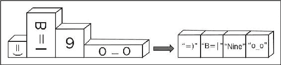
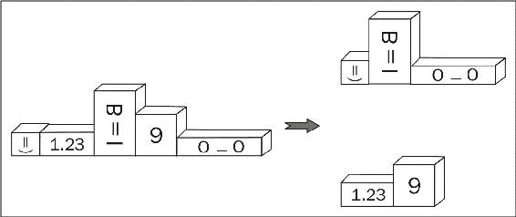

# 第八章：元编程

在本章中，我们将涵盖：

+   使用类型向量

+   操作类型向量

+   在编译时获取函数的结果类型

+   制作一个高阶元函数

+   延迟评估元函数

+   将所有元组元素转换为字符串

+   拆分元组

+   在 C++14 中操作异构容器

# 介绍

本章专门介绍一些酷而难以理解的元编程方法。这些方法不是为日常使用而设计的，但它们可能对开发通用库有所帮助。

第四章，*编译时技巧*，已经涵盖了元编程的基础知识。建议阅读以便更好地理解。在本章中，我们将深入探讨如何将多个类型打包在单个类似元组的类型中。我们将创建用于操作类型集合的函数，看看如何改变编译时集合的类型，以及如何将编译时技巧与运行时混合。所有这些都是元编程。

系好安全带，准备好，让我们开始...！

# 使用类型向量

有时候，希望能够像在容器中一样处理所有模板参数。想象一下，我们正在编写一些东西，比如`Boost.Variant`：

```cpp
#include <boost/mpl/aux_/na.hpp>

// boost::mpl::na == n.a. == not available
template <
    class T0 = boost::mpl::na,
    class T1 = boost::mpl::na,
    class T2 = boost::mpl::na,
    class T3 = boost::mpl::na,
    class T4 = boost::mpl::na,
    class T5 = boost::mpl::na,
    class T6 = boost::mpl::na,
    class T7 = boost::mpl::na,
    class T8 = boost::mpl::na,
    class T9 = boost::mpl::na
    >
struct variant;
```

上述代码是所有以下有趣任务开始发生的地方：

+   我们如何去除所有类型的常量和易失性限定符？

+   我们如何去除重复类型？

+   我们如何获得所有类型的大小？

+   我们如何获得输入参数的最大大小？

所有这些任务都可以很容易地使用`Boost.MPL`解决。

# 准备好

需要对第四章的*编译时技巧*有基本了解才能使用这个示例。在阅读之前要鼓起一些勇气--这个示例中会有很多元编程。

# 如何做...

我们已经看到了如何在编译时操作类型。为什么我们不能进一步组合多个类型在一个数组中，并对该数组的每个元素执行操作呢？

1.  首先，让我们将所有类型打包在`Boost.MPL`类型的容器中：

```cpp
#include <boost/mpl/vector.hpp>

template <
    class T0, class T1, class T2, class T3, class T4,
    class T5, class T6, class T7, class T8, class T9
>
struct variant {
    typedef boost::mpl::vector<
        T0, T1, T2, T3, T4, T5, T6, T7, T8, T9
    > types;
};
```

1.  让我们将我们的示例变得不那么抽象，看看如果我们指定类型会发生什么：

```cpp
#include <string>
struct declared{ unsigned char data[4096]; };
struct non_declared;

typedef variant<
    volatile int, 
    const int, 
    const long, 
    declared, 
    non_declared, 
    std::string
>::types types;
```

1.  我们可以在编译时检查所有内容。让我们断言类型不为空：

```cpp
#include <boost/static_assert.hpp> 
#include <boost/mpl/empty.hpp> 

BOOST_STATIC_ASSERT((!boost::mpl::empty<types>::value)); 
```

1.  我们还可以检查，例如，`non_declared`类型仍然在索引`4`位置：

```cpp
#include <boost/mpl/at.hpp>
#include <boost/type_traits/is_same.hpp>

BOOST_STATIC_ASSERT((boost::is_same<
    non_declared, 
    boost::mpl::at_c<types, 4>::type
>::value));
```

1.  并且最后一个类型仍然是`std::string`：

```cpp
#include <boost/mpl/back.hpp>

BOOST_STATIC_ASSERT((boost::is_same<
    boost::mpl::back<types>::type,
    std::string
>::value));
```

1.  我们可以进行一些转换。让我们从去除常量和易失性限定符开始：

```cpp
#include <boost/mpl/transform.hpp>
#include <boost/type_traits/remove_cv.hpp>

typedef boost::mpl::transform<
    types,
    boost::remove_cv<boost::mpl::_1>
>::type noncv_types;
```

1.  这是我们如何去除重复类型的方法：

```cpp
#include <boost/mpl/unique.hpp>

typedef boost::mpl::unique<
    noncv_types, 
    boost::is_same<boost::mpl::_1, boost::mpl::_2>
>::type unique_types;
```

1.  我们可以检查向量只包含`5`种类型：

```cpp
#include <boost/mpl/size.hpp>

BOOST_STATIC_ASSERT((boost::mpl::size<unique_types>::value == 5));
```

1.  这是我们如何计算每个元素的大小：

```cpp
// Without this we'll get an error:
// "use of undefined type 'non_declared'"
struct non_declared{};

#include <boost/mpl/sizeof.hpp>
typedef boost::mpl::transform<
    unique_types, 
    boost::mpl::sizeof_<boost::mpl::_1>
>::type sizes_types;
```

1.  这是如何从`sizes_type`类型中获取最大大小的：

```cpp
#include <boost/mpl/max_element.hpp>

typedef boost::mpl::max_element<sizes_types>::type max_size_type;
```

我们可以断言类型的最大大小等于结构声明的大小，这必须是我们示例中最大的大小：

```cpp
  BOOST_STATIC_ASSERT(max_size_type::type::value == sizeof(declared)); 
```

# 它是如何工作的...

`boost::mpl::vector`类是一个在编译时保存类型的容器。更准确地说，它是一个保存类型的类型。我们不创建它的实例；相反，我们只是在`typedef`中使用它。

与标准库容器不同，`Boost.MPL`容器没有成员方法。相反，方法在单独的头文件中声明。因此，要使用一些方法，我们需要：

1.  包含正确的头文件。

1.  通常通过指定容器作为第一个参数来调用该方法。

我们已经在第四章中看到了元函数，*编译时技巧*。我们使用了一些元函数（如`boost::is_same`）来自熟悉的`Boost.TypeTraits`库。

因此，在*步骤* *3*、*步骤* *4*和*步骤* *5*中，我们只是为我们的容器类型调用元函数。

最困难的部分即将到来！

占位符被`Boost.MPL`库广泛用于组合元函数：

```cpp
typedef boost::mpl::transform<
    types,
    boost::remove_cv<boost::mpl::_1>
>::type noncv_types;
```

在这里，`boost::mpl::_1` 是一个占位符，整个表达式的意思是，对于 `types` 中的每种类型，执行 `boost::remove_cv<>::type` 并将该类型推回到结果向量中。通过 `::type` 返回结果向量。

让我们继续到 *步骤 7*。在这里，我们使用 `boost::is_same<boost::mpl::_1, boost::mpl::_2>` 模板参数为 `boost::mpl::unique` 指定了一个比较元函数，其中 `boost::mpl::_1` 和 `boost::mpl::_2` 是占位符。你可能会发现它类似于 `boost::bind(std::equal_to(), _1, _2)`，*步骤 7* 中的整个表达式类似于以下伪代码：

```cpp
std::vector<type> t; // 't' stands for 'types'. 
std::unique(t.begin(), t.end(), boost::bind(std::equal_to<type>(), _1, _2)); 
```

在 *步骤 9* 中有一些有趣的东西，这对于更好地理解是必要的。在前面的代码中，`sizes_types` 不是一个值的向量，而是一个表示数字的整数常量类型的向量。`sizes_types typedef` 实际上是以下类型：

```cpp
struct boost::mpl::vector<
    struct boost::mpl::size_t<4>,
    struct boost::mpl::size_t<4>,
    struct boost::mpl::size_t<4096>,
    struct boost::mpl::size_t<1>,
    struct boost::mpl::size_t<32> 
>
```

最后一步现在一定很清楚了。它只是从 `sizes_types` `typedef` 中获取最大的元素。

我们可以在任何允许 typedef 的地方使用 `Boost.MPL` 元函数。

# 还有更多...

`Boost.MPL` 库的使用会导致更长的编译时间，但可以让您对类型进行任何想要的操作。它不会增加运行时开销，甚至不会向结果二进制文件添加一条指令。C++17 没有 `Boost.MPL` 类，而 `Boost.MPL` 也不使用现代 C++ 的特性，比如可变模板。这使得在 C++11 编译器上，`Boost.MPL` 的编译时间不会尽可能短，但使得该库可以在 C++03 编译器上使用。

# 另请参阅

+   参见 第四章，*编译时技巧*，了解元编程的基础知识

+   *操作类型向量* 配方将为您提供有关元编程和 `Boost.MPL` 库的更多信息

+   查看 [`boost.org/libs/mpl`](http://boost.org/libs/mpl) 上的 `Boost.MPL` 官方文档，了解更多示例和完整参考资料

# 操作类型向量

这个配方的任务是根据第二个 `boost::mpl::vector` 函数的内容修改一个 `boost::mpl::vector` 函数的内容。我们将调用第二个向量为修改器向量，每个修改器可能具有以下类型：

```cpp
// Make unsigned.
struct unsigne; // Not a typo: `unsigned` is a keyword, we can not use it.

// Make constant.
struct constant;

// Otherwise we do not change type.
struct no_change;
```

那么，我们从哪里开始呢？

# 准备工作

需要基本了解 `Boost.MPL`。阅读 *使用类型向量* 配方和 第四章，*编译时技巧*，可能会有所帮助。

# 如何做...

这个配方与之前的配方类似，但它还使用了条件编译时语句。准备好了，这不会容易！

1.  我们将从头文件开始：

```cpp
// We'll need this at step 3.
#include <boost/mpl/size.hpp>
#include <boost/type_traits/is_same.hpp>
#include <boost/static_assert.hpp>

// We'll need this at step 4.
#include <boost/mpl/if.hpp>
#include <boost/type_traits/make_unsigned.hpp>
#include <boost/type_traits/add_const.hpp>

// We'll need this at step 5.
#include <boost/mpl/transform.hpp>
```

1.  现在，让我们将所有的元编程魔法放入结构中，以便更简单地重用：

```cpp
template <class Types, class Modifiers>
struct do_modifications {
```

1.  检查传递的向量是否具有相同的大小是一个好主意：

```cpp
    BOOST_STATIC_ASSERT((boost::is_same<
        typename boost::mpl::size<Types>::type, 
        typename boost::mpl::size<Modifiers>::type 
    >::value));
```

1.  现在，让我们处理修改元函数：

```cpp
    typedef boost::mpl::if_<
        boost::is_same<boost::mpl::_2, unsigne>,
        boost::make_unsigned<boost::mpl::_1>,
        boost::mpl::if_<
            boost::is_same<boost::mpl::_2, constant>,
            boost::add_const<boost::mpl::_1>,
            boost::mpl::_1
        >
    > binary_operator_t;
```

1.  最后一步：

```cpp
    typedef typename boost::mpl::transform<
        Types,
        Modifiers,
        binary_operator_t
    >::type type;
};
```

现在，让我们运行一些测试，确保我们的元函数运行良好：

```cpp
#include <boost/mpl/vector.hpp>
#include <boost/mpl/at.hpp>

typedef boost::mpl::vector<
    unsigne, no_change, constant, unsigne
> modifiers;

typedef boost::mpl::vector<
    int, char, short, long
> types;

typedef do_modifications<types, modifiers>::type result_type;

BOOST_STATIC_ASSERT((boost::is_same<
    boost::mpl::at_c<result_type, 0>::type,
    unsigned int
>::value));

BOOST_STATIC_ASSERT((boost::is_same<
    boost::mpl::at_c<result_type, 1>::type,
    char
>::value));

BOOST_STATIC_ASSERT((boost::is_same<
    boost::mpl::at_c<result_type, 2>::type,
    const short
>::value));

BOOST_STATIC_ASSERT((boost::is_same<
    boost::mpl::at_c<result_type, 3>::type,
    unsigned long
>::value));
```

# 它是如何工作的...

在 *步骤 3* 中，我们断言大小相等，但我们以一种不寻常的方式来做。`boost::mpl::size<Types>::type` 元函数实际上返回一个整数常量 `struct boost::mpl::long_<4>`，因此在静态断言中，我们实际上比较的是两种类型，而不是两个数字。这可以以更熟悉的方式重写：

```cpp
    BOOST_STATIC_ASSERT((
        boost::mpl::size<Types>::type::value
        ==
        boost::mpl::size<Modifiers>::type::value
    ));
```

请注意我们使用的 `typename` 关键字。没有它，编译器无法确定 `::type` 到底是一个类型还是某个变量。之前的配方不需要它，因为在使用它们的地方，元函数的参数是完全已知的。但在这个配方中，元函数的参数是一个模板。

在处理*步骤 4*之前，我们将先看一下*步骤 5*。在*步骤 5*中，我们将`Types`、`Modifiers`和`binary_operator_t`参数从*步骤 4*传递给`boost::mpl::transform`元函数。这个元函数非常简单--对于每个传递的向量，它获取一个元素并将其传递给第三个参数--一个二进制元函数。如果我们用伪代码重写它，它将看起来像下面这样：

```cpp
void boost_mpl_transform_pseoudo_code() {
    vector result;
    for (std::size_t i = 0; i < Types.size(); ++i) {
        result.push_back(
            binary_operator_t(Types[i], Modifiers[i])
        );
    }
    return result;
}
```

*步骤 4*可能会让某些人头疼。在这一步中，我们为`Types`和`Modifiers`向量中的每对类型编写一个元函数（请参阅前面的伪代码）：

```cpp
    typedef boost::mpl::if_<
        boost::is_same<boost::mpl::_2, unsigne>,
        boost::make_unsigned<boost::mpl::_1>,
        boost::mpl::if_<
            boost::is_same<boost::mpl::_2, constant>,
            boost::add_const<boost::mpl::_1>,
            boost::mpl::_1
        >
    > binary_operator_t;
```

正如我们已经知道的，`boost::mpl::_2`和`boost::mpl::_1`是占位符。在这个配方中，`_1`是`Types`向量中类型的占位符，`_2`是`Modifiers`向量中类型的占位符。

因此，整个元函数的工作方式如下：

1.  将传递给它的第二个参数（通过`_2`）与一个`unsigned`类型进行比较。

1.  如果类型相等，使传递给它的第一个参数（通过`_1`）变为无符号，并返回该类型。

1.  否则，它将传递给它的第二个参数（通过`_2`）与一个常量类型进行比较。

1.  如果类型相等，它会使传递给它的第一个参数（通过`_1`）变为常量，并返回该类型。

1.  否则，它返回传递给它的第一个参数（通过`_1`）。

在构建这个元函数时，我们需要非常小心。还需要特别注意不要在最后调用`::type`：

```cpp
>::type binary_operator_t; // INCORRECT! 
```

如果我们调用`::type`，编译器将尝试在此处评估二进制运算符，这将导致编译错误。在伪代码中，这样的尝试看起来像这样：

```cpp
binary_operator_t foo; 
// Attempt to call binary_operator_t::operator() without parameters, 
// when it has only two parameters overloads. 
foo(); 
```

# 还有更多...

使用元函数需要一些实践。即使是您谦卑的仆人也不能在第一次尝试时正确地编写一些函数（尽管第二次和第三次尝试也不好）。不要害怕或困惑去尝试！

`Boost.MPL`库不是 C++17 的一部分，也不使用现代 C++特性，但可以与 C++11 可变模板一起使用：

```cpp
template <class... T> 
struct vt_example { 
    typedef typename boost::mpl::vector<T...> type; 
}; 

BOOST_STATIC_ASSERT((boost::is_same< 
    boost::mpl::at_c<vt_example<int, char, short>::type, 0>::type, 
    int 
>::value)); 
```

就像以往一样，元函数不会向生成的二进制文件添加一条指令，也不会使性能变差。但是，使用它们可以使您的代码更加适应特定情况。

# 另请参阅

+   从头开始阅读本章，以获取`Boost.MPL`用法的更多简单示例

+   参见第四章，*编译时技巧*，特别是*为模板参数选择最佳运算符*配方，其中包含类似于`binary_operator_t`元函数的代码

+   `Boost.MPL`的官方文档在[`boost.org/libs/mpl`](http://boost.org/libs/mpl)上有更多示例和完整的目录

# 在编译时获取函数的结果类型

C++11 添加了许多良好的功能，以简化元编程。其中一个功能是替代函数语法。它允许推断模板函数的结果类型。这里是一个例子：

```cpp
template <class T1, class T2>
auto my_function_cpp11(const T1& v1, const T2& v2)
    -> decltype(v1 + v2)
{
    return v1 + v2;
}
```

它使我们更容易编写通用函数：

```cpp
#include <cassert>

struct s1 {};
struct s2 {};
struct s3 {};

inline s3 operator + (const s1& /*v1*/, const s2& /*v2*/) {
    return s3();
}

inline s3 operator + (const s2& /*v1*/, const s1& /*v2*/) {
    return s3();
}

int main() {
    s1 v1;
    s2 v2;

    s3 res0 = my_function_cpp11(v1, v2);
    assert(my_function_cpp11('\0', 1) == 1);
}
```

但是，Boost 有很多类似的函数，它不需要 C++11 就可以工作。这是怎么可能的，我们如何制作`my_function_cpp11`函数的 C++03 版本？

# 准备工作

这个配方需要基本的 C++和模板知识。

# 如何做...

C++11 极大地简化了元编程。必须使用 C++03 编写大量代码，以实现接近替代函数语法的功能：

1.  我们必须包含以下头文件：

```cpp
#include <boost/type_traits/common_type.hpp>
```

1.  现在，让我们为任何类型在`result_of`命名空间中制作一个元函数：

```cpp
namespace result_of {

    template <class T1, class T2>
    struct my_function_cpp03 {
        typedef typename boost::common_type<T1, T2>::type type;
    };
```

1.  并为类型`s1`和`s2`专门化它：

```cpp
    template <> 
    struct my_function_cpp03<s1, s2> {
        typedef s3 type;
    };

    template <>
    struct my_function_cpp03<s2, s1> {
        typedef s3 type;
    };
} // namespace result_of
```

1.  现在我们准备写`my_function_cpp03`函数：

```cpp
template <class T1, class T2>
typename result_of::my_function_cpp03<T1, T2>::type
    my_function_cpp03(const T1& v1, const T2& v2)
{
    return v1 + v2;
}
```

就是这样！现在，我们可以像使用 C++11 一样使用这个函数：

```cpp
int main() {
    s1 v1;
    s2 v2;

    s3 res1 = my_function_cpp03(v1, v2);
    assert(my_function_cpp03('\0', 1) == 1);
}
```

# 工作原理...

这个食谱的主要思想是，我们可以制作一个特殊的元函数来推断结果类型。这样的技术可以在 Boost 库的各个地方看到，例如，在`Boost.Variant`的`boost::get<>`实现中，或者在`Boost.Fusion`的几乎任何函数中。

现在，让我们一步一步地进行。`result_of`命名空间只是一种传统，但您可以使用自己的，这并不重要。`boost::common_type<>`元函数推断出几种类型的公共类型，因此我们将其用于一般情况。我们还为`s1`和`s2`类型添加了`result_of::my_function_cpp03`结构的两个模板特化。

在 C++03 中编写元函数的缺点是，有时我们需要写很多代码。比较`my_function_cpp11`和`my_function_cpp03`的代码量，包括`result_of`命名空间，以感受其中的差异。

当元函数准备好后，我们可以在没有 C++11 的情况下推断出结果类型：

```cpp
template <class T1, class T2>
typename result_of::my_function_cpp03<T1, T2>::type
    my_function_cpp03(const T1& v1, const T2& v2);
```

# 还有更多...

这种技术不会增加运行时开销，但可能会稍微减慢编译速度。您也可以在现代 C++编译器上使用它。

# 另请参阅

+   第四章的食谱*启用整数类型的模板函数使用*、*禁用实数类型的模板函数使用*和*为模板参数选择最佳运算符*将为您提供有关`Boost.TypeTraits`和元编程的更多信息

+   考虑官方文档`Boost.TypeTraits`，了解有关准备好的元函数的更多信息[`boost.org/libs/type_traits`](http://boost.org/libs/type_traits)

# 制作高阶元函数

接受其他函数作为输入参数或返回其他函数的函数称为**高阶**函数。例如，以下函数是高阶函数：

```cpp
typedef void(*function_t)(int);

function_t higher_order_function1();
void higher_order_function2(function_t f);
function_t higher_order_function3(function_t f); f); 
```

我们已经在本章的*使用类型类型向量*和*操作类型向量*食谱中看到了高阶元函数，我们在那里使用了`boost::mpl::transform`。

在这个食谱中，我们将尝试制作自己的高阶元函数，名为`coalesce`，它接受两种类型和两个元函数。`coalesce`元函数将第一个类型参数应用于第一个元函数，并将结果类型与`boost::mpl::false_`类型进行比较。如果结果类型是`boost::mpl::false_`类型，则返回将第二个类型参数应用于第二个元函数的结果，否则返回第一个结果类型：

```cpp
template <class Param1, class Param2, class Func1, class Func2>
struct coalesce;
```

# 准备好了

这个食谱（和章节）有点棘手。强烈建议从头开始阅读本章。

# 如何做...

`Boost.MPL`元函数实际上是可以轻松作为模板参数传递的结构。困难的部分是正确使用它：

1.  我们需要以下头文件来编写高阶元函数：

```cpp
#include <boost/mpl/apply.hpp>
#include <boost/mpl/if.hpp>
#include <boost/type_traits/is_same.hpp>
```

1.  下一步是评估我们的函数：

```cpp
template <class Param1, class Param2, class Func1, class Func2>
struct coalesce {
    typedef typename boost::mpl::apply<Func1, Param1>::type type1;
    typedef typename boost::mpl::apply<Func2, Param2>::type type2;
```

1.  现在，我们需要选择正确的结果类型：

```cpp
    typedef typename boost::mpl::if_<
        boost::is_same< boost::mpl::false_, type1>,
        type2,
        type1
    >::type type;
};
```

就是这样！我们已经完成了一个高阶元函数！现在，我们可以像这样使用它：

```cpp
#include <boost/static_assert.hpp>
#include <boost/mpl/not.hpp>
#include <boost/mpl/next.hpp>

using boost::mpl::_1;
using boost::mpl::_2;

typedef coalesce<
    boost::mpl::true_,
    boost::mpl::int_<5>,
    boost::mpl::not_<_1>,
    boost::mpl::next<_1>
>::type res1_t;
BOOST_STATIC_ASSERT((res1_t::value == 6));

typedef coalesce<
    boost::mpl::false_,
    boost::mpl::int_<5>,
    boost::mpl::not_<_1>,
    boost::mpl::next<_1>
>::type res2_t;
BOOST_STATIC_ASSERT((res2_t::value));
```

# 工作原理...

编写高阶元函数的主要问题是要注意占位符。这就是为什么我们不应该直接调用`Func1<Param1>::type`。而是必须使用`boost::mpl::apply`元函数，它接受一个函数和最多五个参数，这些参数将传递给这个函数。

您可以配置`boost::mpl::apply`以接受更多参数，将`BOOST_MPL_LIMIT_METAFUNCTION_ARITY`宏定义为所需的参数数量，例如为 6。

# 还有更多...

C++11 没有任何接近`Boost.MPL`库应用元函数的东西。

现代 C++有很多功能，可以帮助你实现`Boost.MPL`的功能。例如，C++11 有一个`<type_traits>`头文件和**基本** **constexpr**支持。C++14 有**扩展 constexpr**支持，C++17 有一个可以与元组一起使用并且可以在常量表达式中使用的`std::apply`函数。此外，在 C++17 中，lambda 默认是 constexpr，并且有一个**if constexpr**（expr）。

编写自己的解决方案会浪费很多时间，而且可能在旧编译器上无法工作。因此，`Boost.MPL`仍然是最适合元编程的解决方案之一。

# 另请参阅

查看官方文档，特别是*Tutorial*部分，了解有关`Boost.MPL`的更多信息，请访问[`boost.org/libs/mpl`](http://boost.org/libs/mpl)。

# 惰性评估元函数

惰性评估意味着在真正需要其结果之前不会调用函数。了解这个方法对于编写良好的元函数非常重要。惰性评估的重要性将在以下示例中展示。

想象一下，我们正在编写一些元函数，它接受一个函数`Func`，一个参数`Param`和一个条件`Cond`。如果将`Cond`应用于`Param`返回`false`，那么该函数的结果类型必须是一个`fallback`类型，否则结果必须是将`Func`应用于`Param`的结果：

```cpp
struct fallback;

template <
        class Func,
        class Param,
        class Cond,
        class Fallback = fallback>
struct apply_if; 
```

这个元函数是我们无法离开惰性评估的地方，因为如果`Cond`不满足，可能无法将`Func`应用于`Param`。这样的尝试总是会导致编译失败，并且永远不会返回`Fallback`。

# 准备工作

阅读第四章，*Compile-time Tricks*，是非常推荐的。然而，对元编程的良好了解应该足够了。

# 如何做...

注意一些小细节，比如在示例中不调用`::type`：

1.  我们需要以下头文件：

```cpp
#include <boost/mpl/apply.hpp>
#include <boost/mpl/eval_if.hpp>
#include <boost/mpl/identity.hpp>
```

1.  函数的开始很简单：

```cpp
template <class Func, class Param, class Cond, class Fallback>
struct apply_if {
    typedef typename boost::mpl::apply<
        Cond, Param
    >::type condition_t;
```

1.  我们在这里要小心：

```cpp
    typedef boost::mpl::apply<Func, Param> applied_type; 
```

1.  在评估表达式时需要额外小心：

```cpp
    typedef typename boost::mpl::eval_if_c<
        condition_t::value,
        applied_type,
        boost::mpl::identity<Fallback>
    >::type type;
};
```

就是这样！现在我们可以自由地这样使用它：

```cpp
#include <boost/static_assert.hpp>
#include <boost/type_traits/is_integral.hpp>
#include <boost/type_traits/make_unsigned.hpp>
#include <boost/type_traits/is_same.hpp>

using boost::mpl::_1;
using boost::mpl::_2;

typedef apply_if<
    boost::make_unsigned<_1>,
    int,
    boost::is_integral<_1>
>::type res1_t;

BOOST_STATIC_ASSERT((
    boost::is_same<res1_t, unsigned int>::value
));

typedef apply_if<
    boost::make_unsigned<_1>,
    float,
    boost::is_integral<_1>
>::type res2_t;

BOOST_STATIC_ASSERT((
    boost::is_same<res2_t, fallback>::value
));
```

# 它是如何工作的...

这个方法的主要思想是，如果条件为`false`，我们就不应该执行元函数，因为当条件为`false`时，该类型的元函数可能无法应用：

```cpp
// Will fail with static assertion somewhere deeply in the implementation
// of boost::make_unsigned<_1> if we do not evaluate the function lazily.
typedef apply_if<
    boost::make_unsigned<_1>,
    float,
    boost::is_integral<_1>
>::type res2_t;

BOOST_STATIC_ASSERT((
    boost::is_same<res2_t, fallback>::value
));
```

那么，我们如何才能惰性评估元函数呢？

如果没有访问元函数的内部类型或值，编译器将不会查看元函数的内部。换句话说，当我们通过`::`尝试获取其成员之一时，编译器会尝试编译元函数。这可以是对`::type`或`::value`的调用。这就是`apply_if`的不正确版本的样子：

```cpp
template <class Func, class Param, class Cond, class Fallback>
struct apply_if {
    typedef typename boost::mpl::apply<
        Cond, Param
    >::type condition_t;

    // Incorrect: metafunction is evaluated when `::type` called.
    typedef typename boost::mpl::apply<Func, Param>::type applied_type;

    typedef typename boost::mpl::if_c<
        condition_t::value,
        applied_type,
        boost::mpl::identity<Fallback>
    >::type type;
};
```

这与我们的示例不同，在*步骤 3*中我们没有调用`::type`，并且使用`eval_if_c`实现了*步骤 4*，它只对其一个参数调用`::type`。`boost::mpl::eval_if_c`元函数的实现如下：

```cpp
template<bool C, typename F1, typename F2>
struct eval_if_c {
    typedef typename if_c<C,F1,F2>::type f_;
    typedef typename f_::type type; // call `::type` only for one parameter
};
```

因为`boost::mpl::eval_if_c`对于成功的条件调用了`::type`，而`fallback`没有`::type`，所以我们需要将`fallback`包装到`boost::mpl::identity`类中。这个类非常简单，但是通过`::type`调用返回其模板参数，并且不执行其他操作：

```cpp
template <class T> 
struct identity { 
    typedef T type; 
}; 
```

# 还有更多...

正如我们已经提到的，C++11 没有`Boost.MPL`的类，但我们可以像使用`boost::mpl::identity<T>`一样，使用带有单个参数的`std::common_type<T>`。

和往常一样，元函数不会在输出的二进制文件中增加一行代码，你可以随意使用元函数。在编译时做得越多，运行时剩下的就越少。

# 另请参阅...

+   `boost::mpl::identity`类型可用于禁用模板函数的**Argument Dependent Lookup**（**ADL**）。请参阅`<boost/implicit_cast.hpp>`头文件中`boost::implicit_cast`的源代码。

+   从头开始阅读本章和`Boost.MPL`的官方文档，网址为[`boost.org/libs/mpl`](http://boost.org/libs/mpl)，可能会有所帮助。

# 将所有元组元素转换为字符串

这个配方和下一个配方都致力于混合编译时和运行时特性。我们将使用`Boost.Fusion`库并看看它能做什么。

还记得我们在第一章谈论过元组和数组吗？现在，我们想要编写一个单一的函数，可以将元组和数组的元素流式传输到字符串。



# 准备工作

您应该了解`boost::tuple`和`boost::array`类以及`boost::lexical_cast`函数。

# 如何做...

我们已经几乎了解了本配方中将要使用的所有函数和类。我们只需要把它们全部聚集在一起：

1.  我们需要编写一个将任何类型转换为字符串的函数：

```cpp
#include <boost/lexical_cast.hpp>
#include <boost/noncopyable.hpp>

struct stringize_functor: boost::noncopyable {
private:
    std::string& result;

public:
    explicit stringize_functor(std::string& res)
        : result(res)
    {}

    template <class T>
    void operator()(const T& v) const {
        result += boost::lexical_cast<std::string>(v);
    }
};
```

1.  现在是代码的棘手部分：

```cpp
#include <boost/fusion/include/for_each.hpp>

template <class Sequence>
std::string stringize(const Sequence& seq) {
    std::string result;
    boost::fusion::for_each(seq, stringize_functor(result));
    return result;
}
```

到此为止！现在，我们可以将任何想要的东西转换为字符串：

```cpp
#include <iostream>
#include <boost/fusion/include/vector.hpp>
#include <boost/fusion/adapted/boost_tuple.hpp>
#include <boost/fusion/adapted/std_pair.hpp>
#include <boost/fusion/adapted/boost_array.hpp>

struct cat{};

std::ostream& operator << (std::ostream& os, const cat& ) {
    return os << "Meow! ";
}

int main() {
    boost::fusion::vector<cat, int, std::string> tup1(cat(), 0, "_0");
    boost::tuple<cat, int, std::string> tup2(cat(), 0, "_0");
    std::pair<cat, cat> cats;
    boost::array<cat, 10> many_cats;

    std::cout << stringize(tup1) << '\n' 
        << stringize(tup2) << '\n'
        << stringize(cats) << '\n'
        << stringize(many_cats) << '\n';
}
```

前面的例子输出如下：

```cpp
 Meow! 0_0
 Meow! 0_0
 Meow! Meow! 
 Meow! Meow! Meow! Meow! Meow! Meow! Meow! Meow! Meow! Meow!
```

# 它是如何工作的...

`stringize`函数的主要问题是，`boost::tuple`和`std::pair`都没有`begin()`或`end()`方法，所以我们无法调用`std::for_each`。这就是`Boost.Fusion`发挥作用的地方。

`Boost.Fusion`库包含许多可以在编译时操作结构的出色算法。

`boost::fusion::for_each`函数遍历序列的元素，并对每个元素应用一个函数。

请注意我们已经包括了：

```cpp
#include <boost/fusion/adapted/boost_tuple.hpp> 
#include <boost/fusion/adapted/std_pair.hpp> 
#include <boost/fusion/adapted/boost_array.hpp> 
```

这是必需的，因为默认情况下`Boost.Fusion`只能使用自己的类。`Boost.Fusion`有自己的元组类，`boost::fusion::vector`，它与`boost::tuple`非常接近：

```cpp
#include <string>
#include <cassert>

#include <boost/tuple/tuple.hpp>

#include <boost/fusion/include/vector.hpp>
#include <boost/fusion/include/at_c.hpp>

void tuple_example() {
    boost::tuple<int, int, std::string> tup(1, 2, "Meow");
    assert(boost::get<0>(tup) == 1);
    assert(boost::get<2>(tup) == "Meow");
}

void fusion_tuple_example() {
    boost::fusion::vector<int, int, std::string> tup(1, 2, "Meow");
    assert(boost::fusion::at_c<0>(tup) == 1);
    assert(boost::fusion::at_c<2>(tup) == "Meow");
}
```

但`boost::fusion::vector`不像`boost::tuple`那么简单。我们将在*拆分元组*配方中看到两者之间的区别。

# 还有更多...

`boost::fusion::for_each`和`std::for_each`之间有一个根本的区别。`std::for_each`函数内部包含一个循环，并在运行时确定必须执行多少次迭代。然而，`boost::fusion::for_each()`在编译时知道迭代次数，并完全展开循环。对于`boost::tuple<cat, int, std::string> tup2`，`boost::fusion::for_each(tup2, functor)`调用等同于以下代码：

```cpp
    functor(boost::fusion::at_c<0>(tup2));
    functor(boost::fusion::at_c<1>(tup2));
    functor(boost::fusion::at_c<2>(tup2));
```

C++11 不包含`Boost.Fusion`类。`Boost.Fusion`的所有方法都非常有效。它们尽可能多地在编译时执行，并具有一些非常高级的优化。

C++14 添加了`std::integer_sequence`和`std::make_integer_sequence`来简化使用可变模板的`for`。使用这些实体，可以手动编写`boost::fusion::for_each`功能，并在没有`Boost.Fusion`的情况下实现`stringize`函数：

```cpp
#include <utility>
#include <tuple>

template <class Tuple, class Func, std::size_t... I>
void stringize_cpp11_impl(const Tuple& t, const Func& f, std::index_sequence<I...>) {
    // Oops. Requires C++17 fold expressions feature.
    // (f(std::get<I>(t)), ...);

    int tmp[] = { 0, (f(std::get<I>(t)), 0)... };
    (void)tmp; // Suppressing unused variable warnings.
}

template <class Tuple>
std::string stringize_cpp11(const Tuple& t) {
    std::string result;
    stringize_cpp11_impl(
        t,
        stringize_functor(result),
        std::make_index_sequence< std::tuple_size<Tuple>::value >()
    );
    return result;
}
```

正如你所看到的，有很多代码被编写来做到这一点，这样的代码并不容易阅读和理解。

关于在 C++20 标准中添加类似于`constexpr for`的功能的想法在 C++标准化工作组中进行了讨论。有了这个功能，有一天我们可以编写以下代码（语法可能会改变！）：

```cpp
template <class Tuple>
std::string stringize_cpp20(const Tuple& t) {
    std::string result;
    for constexpr(const auto& v: t) {
        result += boost::lexical_cast<std::string>(v);
    }
    return result;
}
```

在那之前，`Boost.Fusion`似乎是最通用和简单的解决方案。

# 另请参阅

+   *拆分元组*配方将提供有关`Boost.Fusion`真正能力的更多信息。

+   `Boost.Fusion`的官方文档包含一些有趣的例子和完整的参考资料，可以在[`boost.org/libs/fusion`](http://boost.org/libs/fusion)找到

# 拆分元组

这个配方将展示`Boost.Fusion`库能力的一小部分。我们将把一个单一的元组分成两个元组，一个包含算术类型，另一个包含所有其他类型。



# 准备工作

这个配方需要了解`Boost.MPL`，占位符和`Boost.Tuple`。建议从头开始阅读本章。

# 如何做...

这可能是本章中最难的配方之一。生成的类型在编译时确定，并且这些类型的值在运行时填充：

1.  为了实现这种混合，我们需要以下头文件：

```cpp
#include <boost/fusion/include/remove_if.hpp>
#include <boost/type_traits/is_arithmetic.hpp>
```

1.  现在，我们准备编写一个返回非算术类型的函数：

```cpp
template <class Sequence>
typename boost::fusion::result_of::remove_if<
    const Sequence, 
    boost::is_arithmetic<boost::mpl::_1> 
>::type get_nonarithmetics(const Sequence& seq) 
{
    return boost::fusion::remove_if< 
        boost::is_arithmetic<boost::mpl::_1> 
    >(seq);
}
```

1.  以及一个返回算术类型的函数：

```cpp
template <class Sequence>
typename boost::fusion::result_of::remove_if<
    const Sequence, 
    boost::mpl::not_< boost::is_arithmetic<boost::mpl::_1> >
>::type get_arithmetics(const Sequence& seq) 
{
    return boost::fusion::remove_if< 
        boost::mpl::not_< boost::is_arithmetic<boost::mpl::_1> >
    >(seq);
}
```

就是这样！现在，我们能够执行以下任务：

```cpp
#include <boost/fusion/include/vector.hpp>
#include <cassert>
#include <boost/fusion/include/at_c.hpp>
#include <boost/blank.hpp>

int main() {
    typedef boost::fusion::vector<
        int, boost::blank, boost::blank, float
    > tup1_t;
    tup1_t tup1(8, boost::blank(), boost::blank(), 0.0);

    boost::fusion::vector<boost::blank, boost::blank> res_na
        = get_nonarithmetics(tup1);
    boost::fusion::vector<int, float> res_a = get_arithmetics(tup1);
    assert(boost::fusion::at_c<0>(res_a) == 8);
}
```

# 工作原理...

`Boost.Fusion`的理念是编译器在编译时知道结构布局，无论编译器在编译时知道什么，我们都可以同时改变。`Boost.Fusion`允许我们修改不同的序列，添加和删除字段，并更改字段类型。这就是我们在*步骤 2*和*步骤 3*中所做的；我们从元组中删除了非必需的字段。

现在，让我们仔细看看`get_nonarithmetics`。首先，它的结果类型是使用以下结构推导出来的：

```cpp
typename boost::fusion::result_of::remove_if<
    const Sequence, 
    boost::is_arithmetic<boost::mpl::_1> 
>::type
```

这对我们来说应该很熟悉。我们在本章的*在编译时获取函数结果类型*配方中看到了类似的东西。`Boost.MPL`的占位符`boost::mpl::_1`与`boost::fusion::result_of::remove_if`元函数很搭配，它返回一个新的序列类型。

现在，让我们进入函数内部，看看以下代码：

```cpp
    return boost::fusion::remove_if< 
        boost::is_arithmetic<boost::mpl::_1> 
    >(seq);
```

记住编译器在编译时知道`seq`的所有类型。这意味着`Boost.Fusion`可以为`seq`的不同元素应用元函数，并为它们获取元函数结果。这也意味着`Boost.Fusion`知道如何从旧结构复制必需的字段到新结构中。

然而，`Boost.Fusion`尽可能地避免复制字段。

*步骤 3*中的代码与*步骤 2*中的代码非常相似，但它具有一个用于删除非必需类型的否定谓词。

我们的函数可以与`Boost.Fusion`支持的任何类型一起使用，而不仅仅是`boost::fusion::vector`。

# 还有更多...

您可以为`Boost.Fusion`容器使用`Boost.MPL`函数。您只需要包含`#include <boost/fusion/include/mpl.hpp>`：

```cpp
#include <boost/fusion/include/mpl.hpp>
#include <boost/mpl/transform.hpp>
#include <boost/type_traits/remove_const.hpp>

template <class Sequence>
struct make_nonconst: boost::mpl::transform<
    Sequence,
    boost::remove_const<boost::mpl::_1>
> {};

typedef boost::fusion::vector<
    const int, const boost::blank, boost::blank
> type1;
typedef make_nonconst<type1>::type nc_type;

BOOST_STATIC_ASSERT((boost::is_same<
    boost::fusion::result_of::value_at_c<nc_type, 0>::type,
    int
>::value));

BOOST_STATIC_ASSERT((boost::is_same<
    boost::fusion::result_of::value_at_c<nc_type, 1>::type,
    boost::blank
>::value));

BOOST_STATIC_ASSERT((boost::is_same<
    boost::fusion::result_of::value_at_c<nc_type, 2>::type,
    boost::blank
>::value));
```

我们使用了`boost::fusion::result_of::value_at_c`而不是`boost::fusion::result_of::at_c`，因为`boost::fusion::result_of::at_c`返回`boost::fusion::at_c`调用的确切返回类型，即引用。`boost::fusion::result_of::value_at_c`返回没有引用的类型。

`Boost.Fusion`和`Boost.MPL`库不是 C++17 的一部分。`Boost.Fusion`非常快。它有许多优化。

值得一提的是，我们只看到了`Boost.Fusion`能力的一小部分。可以写一本单独的书来介绍它。

# 另请参阅

+   `Boost.Fusion`的良好教程和完整文档可在[`boost.org/libs/fusion`](http://boost.org/libs/fusion)上找到。

+   您可能还希望查看[`boost.org/libs/mpl`](http://boost.org/libs/mpl)上的`Boost.MPL`的官方文档

# 在 C++14 中操作异构容器

本章中我们看到的大多数元编程技巧都是在 C++11 之前发明的。可能你已经听说过其中的一些东西。

怎么样来点全新的？怎么样用 C++14 实现上一个配方，使用一个将元编程颠倒过来并让你眉毛竖起来的库？系好安全带，我们要进入`Boost.Hana`的世界了。

# 准备工作

这个配方需要了解 C++11 和 C++14，特别是 lambda 表达式。您需要一个真正兼容 C++14 的编译器来编译示例。

# 如何做...

现在，让我们用`Boost.Hana`的方式来做一切：

1.  从包含头文件开始：

```cpp
#include <boost/hana/traits.hpp>
```

1.  我们创建了一个`is_arithmetic_`函数对象：

```cpp
constexpr auto is_arithmetic_ = [](const auto& v) {
    auto type = boost::hana::typeid_(v);
    return boost::hana::traits::is_arithmetic(type);
};
```

1.  现在，我们实现`get_nonarithmetics`函数：

```cpp
#include <boost/hana/remove_if.hpp>

template <class Sequence>
auto get_nonarithmetics(const Sequence& seq)  {
    return boost::hana::remove_if(seq, [](const auto& v) {
        return is_arithmetic_(v);
    });
}
```

1.  让我们用另一种方式定义`get_arithmetics`。就是为了好玩！

```cpp
#include <boost/hana/filter.hpp>

constexpr auto get_arithmetics = [](const auto& seq) {
    return boost::hana::filter(seq, is_arithmetic_);
};
```

就是这样。现在，我们可以使用这些函数：

```cpp
#include <boost/hana/tuple.hpp>
#include <boost/hana/integral_constant.hpp>
#include <boost/hana/equal.hpp>
#include <cassert>

struct foo {
    bool operator==(const foo&) const { return true; }
    bool operator!=(const foo&) const { return false; }
};

int main() {
    const auto tup1
        = boost::hana::make_tuple(8, foo{}, foo{}, 0.0);

    const auto res_na = get_nonarithmetics(tup1);
    const auto res_a = get_arithmetics(tup1);

    using boost::hana::literals::operator ""_c;
    assert(res_a[0_c] == 8);

    const auto res_na_expected = boost::hana::make_tuple(foo(), foo());
    assert(res_na == res_na_expected);
}
```

# 工作原理...

乍一看，代码可能看起来很简单，但事实并非如此。`Boost.Hana`将元编程颠倒过来了！在以前的配方中，我们直接使用类型，但`Boost.Hana`创建了一个保存类型并大部分时间使用变量的变量。

看一下*步骤 2*中的`typeid_`调用：

```cpp
auto type = boost::hana::typeid_(v);
```

它实际上返回一个变量。有关类型的信息现在隐藏在`type`变量内部，并且可以通过调用`decltype(type)::type`来提取。

但让我们一行一行地来。在*步骤 2*中，我们将通用 lambda 存储在`is_arithmetic_`变量中。从这一点开始，我们可以将该变量用作函数对象。在 lambda 内部，我们创建了一个`type`变量，它现在保存了有关`v`类型的信息。下一行是对`std::is_arithmetic`的特殊包装，它从`type`变量中提取有关`v`类型的信息，并将其传递给`std::is_arithmetic`特性。该调用的结果是一个布尔整数常量。

现在，神奇的部分来了！存储在`is_arithmetic_`变量内的 lambda 实际上从未被`boost::hana::remove_if`和`boost::hana::filter`函数调用。所有使用它的`Boost.Hana`函数只需要 lambda 函数的结果类型，而不需要它的主体。我们可以安全地更改定义，整个示例将继续正常工作：

```cpp
constexpr auto is_arithmetic_ = [] (const auto& v) {
    assert(false);
    auto type = boost::hana::typeid_(v);
    return boost::hana::traits::is_arithmetic(type);
};
```

在*步骤 3*和*4*中，我们分别调用`boost::hana::remove_if`和`boost::hana::filter`函数。在*步骤 3*中，我们在 lambda 内部使用了`is_arithmetic_`。在*步骤 4*中，我们直接使用了它。你可以使用任何你喜欢的语法，这只是一个习惯问题。

最后在`main()`中，我们检查一切是否按预期工作，并且元组中索引为 0 的元素是否等于`8`：

```cpp
    using boost::hana::literals::operator ""_c;
    assert(res_a[0_c] == 8);
```

理解`Boost.Hana`库的最佳方法是进行实验。你可以在[`apolukhin.github.io/Boost-Cookbook/`](http://apolukhin.github.io/Boost-Cookbook/)上在线进行。

# 还有更多...

还有一个小细节没有描述。`operator[]`如何访问元组？不可能有一个单一的函数返回不同的类型！

如果你第一次遇到这个技巧，这是非常有趣的。`Boost.Hana`的`operator ""_c`可以与文字一起工作，并根据文字构造不同的类型：

+   如果你写`0_c`，那么将返回`integral_constant<long long, 0>`

+   如果你写`1_c`，那么将返回`integral_constant<long long, 1>`

+   如果你写`2_c`，那么将返回`integral_constant<long long, 2>`

`boost::hana::tuple`类实际上有许多`operator[]`重载，接受不同类型的`integral_constant`。根据整数常量的值，返回正确的元组元素。例如，如果你写`some_tuple[1_c]`，那么将调用`tuple::operator[](integral_constant<long long, 1>)`，并返回索引为`1`的元素。

`Boost.Hana`不是 C++17 的一部分。然而，该库的作者参与了 C++标准化会议，并提出了不同的有趣事物，以纳入 C++标准。

如果你期望从`Boost.Hana`获得比从`Boost.MPL`更好的编译时间，那就不要指望了。目前编译器对`Boost.Hana`的方法处理得并不是非常好。也许有一天会改变。

值得一看`Boost.Hana`库的源代码，以发现使用 C++14 特性的新有趣方法。所有 Boost 库都可以在 GitHub 上找到[`github.com/boostorg`](https://github.com/boostorg)。

# 另请参阅

官方文档中有更多示例，完整的参考部分，一些更多的教程，以及一个编译时性能部分。在[`boost.org/libs/hana`](http://boost.org/libs/hana)上享受`Boost.Hana`库。
