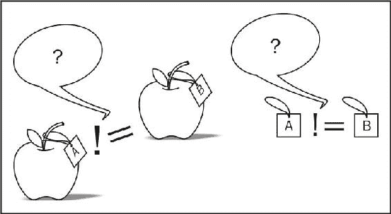

# 第九章：容器

在本章中，我们将涵盖：

+   在序列容器中存储少量元素

+   在序列容器中存储大多数 N 个元素

+   以超快速度比较字符串

+   使用无序集和映射

+   制作一个地图，其中值也是一个键

+   使用多索引容器

+   获得单链表和内存池的好处

+   使用扁平的关联容器

# 介绍

本章专门介绍了 Boost 容器及与其直接相关的内容。它提供了关于 Boost 类的信息，这些类可以在日常编程中使用，并且可以使您的代码更快，新应用程序的开发更容易。

容器不仅在功能上有所不同，而且在某些成员的效率（复杂性）上也有所不同。了解复杂性对于编写快速应用程序至关重要。本章不仅向您介绍了一些新的容器，还为您提供了关于何时以及何时不使用特定类型的容器或其方法的建议。

所以，让我们开始吧！

# 在序列容器中存储少量元素

在过去的 20 年里，C++程序员一直将`std::vector`作为默认的序列容器。它是一个快速的容器，不会进行大量的分配，以 CPU 缓存友好的方式存储元素，并且因为容器连续存储元素，`std::vector::data()`等函数允许与纯 C 函数进行交互。

但是，我们想要更多！有些情况下，我们知道要在向量中存储的典型元素数量，并且我们需要通过完全消除该情况下的内存分配来提高向量的性能。

想象一下，我们正在编写一个高性能的用于处理银行交易的系统。**交易**是一系列操作，如果其中至少有一个操作失败，那么所有操作都必须成功或失败。我们知道 99%的交易由 8 个或更少的操作组成，并希望加快处理速度：

```cpp
#include <vector>

class operation;

template <class T>
void execute_operations(const T&);

bool has_operation();
operation get_operation();

void process_transaction_1() {
    std::vector<operation> ops;
    ops.reserve(8); // TODO: Memory allocation. Not good!

    while (has_operation()) {
        ops.push_back(get_operation());
    }

    execute_operations(ops);
    // ...
}
```

# 准备就绪

这个示例只需要基本的标准库和 C++知识。

# 如何做...

这将是本书中最简单的任务，这要归功于`Boost.Container`库：

1.  包括适当的头文件：

```cpp
#include <boost/container/small_vector.hpp>
```

1.  用`boost::container::small_vector`替换`std::vector`并删除`reserve()`调用：

```cpp
void process_transaction_2() {
    boost::container::small_vector<operation, 8> ops;

    while (has_operation()) {
        ops.push_back(get_operation());
    }

    execute_operations(ops);
    // ...
}
```

# 它是如何工作的...

`boost::container::small_vector`的第二个模板参数是要在堆栈上预分配的元素数量。因此，如果大多数情况下我们需要在向量中存储 8 个或更少的元素，我们只需将`8`作为第二个模板参数。

如果我们需要在容器中存储超过 8 个元素，那么`small_vector`的行为就与`std::vector`完全相同，并动态分配一块内存来存储超过 8 个元素。就像`std::vector`一样，`small_vector`是一个具有**随机访问迭代器**的序列容器，它一致地存储元素。

总之，`boost::container::small_vector`是一个行为与`std::vector`完全相同的容器，但允许在编译时指定的元素数量避免内存分配。

# 还有更多...

使用`small_vector`的一个缺点是，我们的元素数量假设泄漏到接受`small_vector`作为参数的函数签名中。因此，如果我们有三个专门用于分别处理`4`、`8`和`16`个元素的函数，并且所有这些函数都使用前面示例中的`execute_operations`进行事务处理，我们将得到`execute_operations`函数的多个实例化：

```cpp
void execute_operations(
    const boost::container::small_vector<operation, 4>&);

void execute_operations(
    const boost::container::small_vector<operation, 8>&);

void execute_operations(
    const boost::container::small_vector<operation, 16>&);
```

这不好！现在，我们的可执行文件中有多个函数执行完全相同的操作，并且几乎完全由相同的机器代码组成。这会导致更大的二进制文件，可执行文件启动时间更长，编译和链接时间更长。一些编译器可能会消除冗余，但机会很低。

然而，解决方案非常简单。`boost::container::small_vector`是从`boost::container::small_vector_base`类型派生的，该类型独立于预分配的元素数量：

```cpp
void execute_operations(
    const boost::container::small_vector_base<operation>& ops
);
```

就是这样！现在，我们可以在任何`boost::container::small_vector`中使用新的`execute_operations`函数，而不会使二进制大小膨胀。

C++17 没有像`small_vector`这样的类。有提案将`small_vector`包含在下一个 C++标准中，该标准将在 2020 年左右发布。

# 另请参阅

+   `Boost.Container`库在[`boost.org/libs/container`](http://boost.org/libs/container)上为许多有趣的类提供了完整的参考文档

+   `small_vector`来自**LLVM**项目的 Boost；您可以在原始网站[`llvm.org/docs/ProgrammersManual.html#llvm-adt-smallvector-h`](http://llvm.org/docs/ProgrammersManual.html#llvm-adt-smallvector-h)上阅读有关该容器的信息

# 在序列容器中存储最多 N 个元素

这里有一个问题：如果我们知道序列永远不会超过*N*个元素，而*N*不大，那么我们应该使用什么容器来从函数中返回序列。例如，我们必须如何编写`get_events()`函数，以返回最多五个事件：

```cpp
#include <vector>
std::vector<event> get_events();
```

`std::vector<event>`分配内存，因此先前的代码不是一个好的解决方案。

```cpp
#include <boost/array.hpp>
boost::array<event, 5> get_events();
```

`boost::array<event, 5>`不分配内存，但它构造了所有五个元素。没有办法返回少于五个元素。

```cpp
#include <boost/container/small_vector.hpp>
boost::container::small_vector<event, 5> get_events();
```

`boost::container::small_vector<event, 5>`不会为五个或更少的元素分配内存，并允许我们返回少于五个元素。但是，这个解决方案并不完美，因为从函数接口中并不明显它永远不会返回超过五个元素。

# 准备就绪

这个教程只需要对标准库和 C++有基本的了解。

# 如何做到...

`Boost.Container`有一个完全满足我们需求的容器：

```cpp
#include <boost/container/static_vector.hpp>
boost::container::static_vector<event, 5> get_events();
```

# 它是如何工作的...

`boost::container::static_vector<T, N>`是一个不分配内存并且最多可以容纳编译时指定数量的元素的容器。可以将其视为`boost::container::small_vector<T, N>`，只是它不能动态分配内存，任何尝试存储超过*N*个元素的操作都会导致`std::bad_alloc`异常：

```cpp
#include <cassert>

int main () {
    boost::container::static_vector<event, 5> ev = get_events();
    assert(ev.size() == 5);

    boost::container::static_vector<int, 2> ints;
    ints.push_back(1);
    ints.push_back(2);
    try {
        // The following line always throws:
        ints.push_back(3);
    } catch (const std::bad_alloc& ) {
        // ...
    }
}
```

就像`Boost.Container`库的所有容器一样，`static_vector`支持**移动语义**，并且在编译器不支持 rvalues 的情况下使用 Boost.Move 库模拟 rvalue 引用。

# 还有更多...

`std::vector`如果用户插入一个元素并且无法将新值放入已分配的内存中，则会分配更大的内存块。在这种情况下，如果元素是无异常移动可构造的，则`std::vector`会将元素从旧位置移动到新位置。否则，`std::vector`会将元素复制到新位置，然后调用旧位置中每个元素的析构函数。

因此，`std::vector`的行为对于许多成员函数具有摊销常数复杂度。`static_vector`从不分配内存，因此不必将元素从旧位置移动或复制到新位置。因此，对于`std::vector`具有摊销 O(1)复杂度的操作，对于`boost::container::static_vector`具有真正的 O(1)复杂度。这对于一些实时应用可能很方便；但是要注意异常！

有些人仍然更喜欢通过引用传递输出参数，而不是返回它们：`void get_events(static_vector<event, 5>& result_out)`。他们认为这样可以保证不会发生结果的复制。不要这样做，这会使情况变得更糟！C++编译器有一整套优化，例如**返回值优化**（**RVO**）和**命名返回值优化**（**NRVO**）；不同的平台在 ABI 中已经约定，带有`retun something;`的代码不会导致不必要的复制等等。已经不会发生复制。但是，当您传递一个值时，引用编译器只是看不到值来自何处，并且可能会假定它与作用域中的其他值有别名。这可能会严重降低性能。

C++17 没有`static_vector`类，目前也没有计划将其添加到 C++20 中。

# 另请参阅

`Boost.Container`的官方文档有一个详细的参考部分，描述了`boost::container::static_vector`类的所有成员函数。参考[`boost.org/libs/container.`](http://boost.org/libs/container)

[](http://boost.org/libs/container)

# 以超快速的方式比较字符串

操作字符串是一个常见的任务。在这里，我们将看到如何使用一些简单的技巧快速进行字符串比较操作。这个教程是下一个教程的跳板，这里描述的技术将用于实现常数时间复杂度搜索。

因此，我们需要创建一个能够快速比较字符串是否相等的类。我们将创建一个模板函数来测量比较的速度：

```cpp
#include <string>

template <class T>
std::size_t test_default() {
    // Constants
    const std::size_t ii_max = 200000;
    const std::string s(
        "Long long long string that "
        "will be used in tests to compare "
        "speed of equality comparisons."
    );

    // Making some data, that will be 
    // used in comparisons.
    const T data1[] = {
        T(s),
        T(s + s),
        T(s + ". Whooohooo"),
        T(std::string(""))
    };

    const T data2[] = {
        T(s),
        T(s + s),
        T(s + ". Whooohooo"),
        T(std::string(""))
    };

    const std::size_t data_dimensions = sizeof(data1) / sizeof(data1[0]);

    std::size_t matches = 0u;
    for (std::size_t ii = 0; ii < ii_max; ++ii) {
        for (std::size_t i = 0; i < data_dimensions; ++i) {
            for (std::size_t j = 0; j < data_dimensions; ++j) {
                if (data1[i] == data2[j]) {
                    ++ matches;
                }
            }
        }
    }

    return matches;
}
```

# 准备工作

这个教程只需要基本的标准库和 C++知识。

# 如何做...

我们将在我们自己的类中将`std::string`作为公共字段，并将所有比较代码添加到我们的类中，而不是编写用于处理存储的`std::string`的辅助方法，如下面的步骤所示：

1.  为了这样做，我们需要以下标题：

```cpp
#include <boost/functional/hash.hpp>
```

1.  现在，我们可以创建我们的`fast comparison_`类：

```cpp
struct string_hash_fast {
    typedef std::size_t comp_type;

    const comp_type     comparison_;
    const std::string   str_;

    explicit string_hash_fast(const std::string& s)
        : comparison_(
            boost::hash<std::string>()(s)
        )
        , str_(s)
    {}
};
```

1.  不要忘记定义`equality comparisons`运算符：

```cpp
inline bool operator == (
    const string_hash_fast& s1, const string_hash_fast& s2)
{
    return s1.comparison_ == s2.comparison_ && s1.str_ == s2.str_;
}

inline bool operator != (
    const string_hash_fast& s1, const string_hash_fast& s2)
{
    return !(s1 == s2);
}
```

1.  就是这样！现在，我们可以运行我们的测试，并使用以下代码查看结果：

```cpp
#include <iostream> 
#include <iostream>
#include <cassert>

int main(int argc, char* argv[]) {
    if (argc < 2) {
        assert(
            test_default<string_hash_fast>()
            ==
            test_default<std::string>()
        );
        return 0;
    }

    switch (argv[1][0]) {
    case 'h':
        std::cout << "HASH matched: "
                  << test_default<string_hash_fast>();
        break;

    case 's':
        std::cout << "STD matched: "
                  << test_default<std::string>();
        break;

    default:
        return 2;
    }
}
```

# 它是如何工作的...

字符串的比较很慢，因为我们需要逐个比较字符串的所有字符，如果字符串长度相等的话。我们不是这样做，而是用整数的比较代替字符串的比较。这是通过`hash`函数完成的-这个函数生成字符串的一些短固定长度的表示。

让我们谈谈苹果上的`hash`值。想象一下，你有两个带标签的苹果，如下图所示，你希望检查这些苹果是否属于同一品种。比较这些苹果最简单的方法是通过比较它们的标签。否则，基于颜色、大小、形状和其他参数比较苹果会浪费很多时间。Hash 就像是一个反映对象值的标签。



现在，让我们一步一步地进行。

在*步骤 1*中，我们包含包含`hash`函数定义的头文件。在*步骤 2*中，我们声明了我们的新`string`类，其中包含`str_`，这是字符串的原始值，以及`comparison_`，这是计算出的`hash`值。注意构造：

```cpp
    boost::hash<std::string>()(s) 
```

在这里，`boost::hash<std::string>`是一个结构，一个功能对象，就像`std::negate<>`一样。这就是为什么我们需要第一个括号--我们构造了那个功能对象。带有`s`的第二个括号是对`std::size_t operator()(const std::string& s)`的调用，它计算了`hash`值。

现在，看一下*步骤 3*，我们定义`operator==`：

```cpp
    return s1.comparison_ == s2.comparison_ && s1.str_ == s2.str_; 
```

对表达式的第二部分要特别小心。哈希操作会丢失信息，这意味着可能有多个字符串产生完全相同的`hash`值。这意味着如果哈希不匹配，那么可以百分之百保证字符串不匹配；否则，我们需要使用传统方法比较字符串。

好了，现在是比较数字的时候了。如果我们使用默认的比较方法来测量执行时间，它将给出 819 毫秒；然而，我们的哈希比较工作几乎快两倍，并在 475 毫秒内完成。

# 还有更多...

C++11 有`hash`函数对象；你可以在`std::`命名空间的`<functional>`头文件中找到它。Boost 和标准库中的哈希是快速可靠的。它不会分配额外的内存，也不会有虚拟函数。

你可以为自己的类型专门设计哈希。在 Boost 中，通过在自定义类型的命名空间中专门设计`hash_value`函数来实现：

```cpp
// Must be in the namespace of string_hash_fast class.
inline std::size_t hash_value(const string_hash_fast& v) {
    return v.comparison_;
}
```

这与`std::hash`的标准库专门化不同，其中你需要在`std::`命名空间中对`hash<>`结构进行模板专门化。

在 Boost 中，对于所有基本类型（如`int`、`float`、`double`和`char`）、数组以及所有标准库容器，包括`std::array`、`std::tuple`和`std::type_index`，都定义了哈希。一些库还提供了哈希专门化，例如`Boost.Variant`库可以哈希任何`boost::variant`类。

# 另请参阅

+   在本章中阅读*使用无序集和映射*配方，了解有关哈希函数使用的更多信息。

+   `Boost.Functional/Hash`的官方文档将告诉你如何组合多个哈希并提供更多示例；在[`boost.org/libs/functional/hash`](http://boost.org/libs/functional/hash)上阅读有关它的信息。

# 使用无序集和映射

在前面的配方中，我们看到了如何使用哈希来优化字符串比较。阅读之后，可能会产生以下问题：我们是否可以创建一个容器，以便缓存哈希值以便更快地进行比较？

答案是肯定的，我们还可以做更多。我们可以几乎实现常量搜索、插入和删除元素的时间。

# 准备工作

需要基本的 C++和 STL 容器的知识。阅读前面的配方也会有所帮助。

# 如何做...

这将是所有配方中最简单的一个：

1.  你只需要包含`<boost/unordered_map.hpp>`头文件，如果你想使用映射。如果我们想使用集合，包含`<boost/unordered_set.hpp>`头文件。

1.  现在，你可以自由地使用`boost::unordered_map`代替`std::map`，使用`boost::unordered_set`代替`std::set`：

```cpp
#include <boost/unordered_set.hpp>
#include <string>
#include <cassert>

void example() {
    boost::unordered_set<std::string> strings;

    strings.insert("This");
    strings.insert("is");
    strings.insert("an");
    strings.insert("example");

    assert(strings.find("is") != strings.cend());
}
```

# 它是如何工作的...

无序容器存储值并记住每个值的哈希。现在，如果你希望在其中找到一个值，它们将计算该值的哈希并在容器中搜索该哈希。找到哈希后，容器会检查找到的值和搜索的值是否相等。然后，返回值的迭代器或容器的末尾。

因为容器可能搜索常量宽度整数哈希值，它可能使用一些仅适用于整数的优化和算法。这些算法保证了常量搜索复杂度 O(1)，而传统的`std::set`和`std::map`提供了更差的复杂度 O(log(N))，其中*N*是容器中的元素数量。这导致了这样一种情况：传统的`std::set`或`std::map`中的元素越多，它的工作速度就越慢。然而，无序容器的性能并不取决于元素数量。

这样的良好性能从来都不是免费的。在无序容器中，值是无序的（你不会感到惊讶，对吧？）。这意味着我们将从`begin()`到`end()`的容器元素输出如下：

```cpp
template <class T>
void output_example() {
    T strings;

    strings.insert("CZ");
    strings.insert("CD");
    strings.insert("A");
    strings.insert("B");

    std::copy(
        strings.begin(),
        strings.end(),
        std::ostream_iterator<std::string>(std::cout, "  ")
    );
}
```

我们将得到`std::set`和`boost::unordered_set`的以下输出：

```cpp
 boost::unordered_set<std::string> : B A CD CZ
 std::set<std::string> : A B CD CZ
```

那么，性能差异有多大呢？通常取决于实现的质量。我得到了以下数字：

```cpp
For 100 elements:
Boost: map is 1.69954 slower than unordered map
Std: map is 1.54316 slower than unordered map

For 1000 elements:
Boost: map is 4.13714 slower than unordered map
Std: map is 2.12495 slower than unordered map

For 10000 elements:
Boost: map is 2.04475 slower than unordered map
Std: map is 2.23285 slower than unordered map

For 100000 elements:
Boost: map is 1.67128 slower than unordered map
Std: map is 1.68169 slower than unordered map
```

性能是使用以下代码块进行测量的：

```cpp
    T map;

    for (std::size_t ii = 0; ii < ii_max; ++ii) {
        map[s + boost::lexical_cast<std::string>(ii)] = ii;
    }

    // Asserting.
    for (std::size_t ii = 0; ii < ii_max; ++ii) {
        assert(map[s + boost::lexical_cast<std::string>(ii)] == ii);
    }
```

代码包含了很多字符串构造，因此使用这个测试来衡量加速并不是 100%正确。这里只是为了表明无序容器通常比有序容器更快。

有时，可能会出现需要在无序容器中使用用户定义类型的任务：

```cpp
struct my_type { 
    int         val1_; 
    std::string val2_; 
}; 
```

为此，我们需要为该类型编写一个比较运算符：

```cpp
inline bool operator == (const my_type& v1, const my_type& v2) {
    return v1.val1_ == v2.val1_ && v1.val2_ == v2.val2_;
} 
```

我们还需要为该类型专门化哈希函数。如果该类型由多个字段组成，通常只需要组合所有参与`相等比较`的字段的哈希：

```cpp
std::size_t hash_value(const my_type& v) { 
    std::size_t ret = 0u; 

    boost::hash_combine(ret, v.val1_); 
    boost::hash_combine(ret, v.val2_); 
    return ret; 
} 
```

强烈建议使用`boost::hash_combine`函数来组合哈希。

# 还有更多...

多版本的容器也可用，`boost::unordered_multiset`定义在`<boost/unordered_set.hpp>`头文件中，`boost::unordered_multimap`定义在`<boost/unordered_map.hpp>`头文件中。就像标准库的情况一样，容器的多个版本能够存储多个相等的键值。

所有无序容器都允许您指定自己的哈希函数，而不是默认的`boost::hash`。它们还允许您专门化自己的相等比较函数，而不是默认的`std::equal_to`。

C++11 具有 Boost 库的所有无序容器。您可以在头文件`<unordered_set>`和`<unordered_map>`中找到它们，它们位于`std::`命名空间中，而不是`boost::`。Boost 和标准库版本在性能上可能有所不同，但必须以相同的方式工作。但是，Boost 的无序容器甚至可以在 C++03/C++98 编译器上使用，并利用了`Boost.Move`的右值引用模拟，因此即使在 C++11 之前的编译器上，您也可以使用这些容器来处理仅移动的类。

C++11 没有`hash_combine`函数，因此您必须自己编写：

```cpp
template <class T> 
inline void hash_combine(std::size_t& seed, const T& v) 
{ 
    std::hash<T> hasher; 
    seed ^= hasher(v) + 0x9e3779b9 + (seed<<6) + (seed>>2); 
} 
```

或者只需使用`boost::hash_combine`。

自 Boost 1.64 以来，Boost 中的无序容器具有 C++17 的功能，用于提取和插入节点。

# 另请参阅

+   有关`Boost.Move`的右值引用模拟的更多详细信息，请参阅第一章中的教程*使用 C++11 移动模拟*。

+   有关无序容器的更多信息，请访问官方网站[`boost.org/libs/unordered`](http://boost.org/libs/unordered)

+   有关组合哈希和计算范围哈希的更多信息，请访问[`boost.org/libs/functional/hash`](http://boost.org/libs/functional/hash)

# 制作一个映射，其中值也是一个键

一年中有几次，我们需要一些可以存储和索引一对值的东西。此外，我们需要使用第二个部分来获取第一部分，并使用第一部分来获取第二部分。感到困惑了吗？让我给你举个例子。我们创建一个词汇表类。当用户将值放入其中时，该类必须返回标识符，当用户将标识符放入其中时，该类必须返回值。

为了更实际，用户们将登录名放入我们的词汇表中，并希望从中获取唯一标识符。他们还希望获取标识符的所有登录名。

让我们看看如何使用 Boost 来实现它。

# 准备工作

此教程需要对标准库和模板有基本的了解。

# 如何做...

这个教程是关于`Boost.Bimap`库的能力。让我们看看它如何用于实现这个任务：

1.  我们需要以下包含：

```cpp
#include <iostream>
#include <boost/bimap.hpp>
#include <boost/bimap/multiset_of.hpp>
```

1.  现在，我们准备制作我们的词汇结构：

```cpp
int main() {
    typedef boost::bimap<
        std::string,
        boost::bimaps::multiset_of<std::size_t>
    > name_id_type;

    name_id_type name_id;
```

1.  可以使用以下语法填充：

```cpp
    // Inserting keys <-> values
    name_id.insert(name_id_type::value_type(
        "John Snow", 1
    ));

    name_id.insert(name_id_type::value_type(
        "Vasya Pupkin", 2
    ));

    name_id.insert(name_id_type::value_type(
        "Antony Polukhin", 3
    ));

    // Same person as "Antony Polukhin"
    name_id.insert(name_id_type::value_type(
        "Anton Polukhin", 3
    ));
```

1.  我们可以像处理映射一样处理它的左部分：

```cpp
    std::cout << "Left:\n";

    typedef name_id_type::left_const_iterator left_const_iterator;
    const left_const_iterator lend = name_id.left.end();

    for (left_const_iterator it = name_id.left.begin();
         it!= lend;
         ++it)
    {
        std::cout << it->first << " <=> " << it->second << '\n';
    }
```

1.  右边部分几乎与左边相同：

```cpp
    std::cout << "\nRight:\n";

    typedef name_id_type::right_const_iterator right_const_iterator;
    const right_const_iterator rend = name_id.right.end();

    for (right_const_iterator it = name_id.right.begin();
         it!= rend;
         ++it)
    {
        std::cout << it->first << " <=> " << it->second << '\n';
    }
```

1.  我们还需要确保词汇表中有这样的人：

```cpp
    assert(
        name_id.find(name_id_type::value_type(
            "Anton Polukhin", 3
        )) != name_id.end()
    );
} /* end of main() */
```

就是这样，现在如果我们将所有代码（除了包含）放在`int main()`中，我们将得到以下输出：

```cpp
 Left:
 Anton Polukhin <=> 3
 Antony Polukhin <=> 3
 John Snow <=> 1
 Vasya Pupkin <=> 2

 Right:
 1 <=> John Snow
 2 <=> Vasya Pupkin
 3 <=> Antony Polukhin
 3 <=> Anton Polukhin
```

# 它是如何工作的...

在*步骤 2*中，我们定义了`bimap`类型：

```cpp
    typedef boost::bimap< 
        std::string, 
        boost::bimaps::multiset_of<std::size_t> 
    > name_id_type; 
```

第一个模板参数表示第一个键必须具有类型`std::string`，并且应该作为`std::set`。第二个模板参数表示第二个键必须具有类型`std::size_t`。多个第一个键可以具有单个第二个键值，就像`std::multimap`中一样。

我们可以使用`boost::bimaps::`命名空间中的类来指定`bimap`的基本行为。我们可以使用哈希映射作为第一个键的基本类型：

```cpp
#include <boost/bimap/unordered_set_of.hpp> 
#include <boost/bimap/unordered_multiset_of.hpp> 

typedef boost::bimap< 
    boost::bimaps::unordered_set_of<std::string>,  
    boost::bimaps::unordered_multiset_of<std::size_t>  
> hash_name_id_type; 
```

当我们不指定键的行为，只指定其类型时，`Boost.Bimap`使用`boost::bimaps::set_of`作为默认行为。就像在我们的示例中一样，我们可以尝试使用标准库来表达以下代码：

```cpp
#include <boost/bimap/set_of.hpp> 

typedef boost::bimap< 
    boost::bimaps::set_of<std::string>,  
    boost::bimaps::multiset_of<std::size_t>  
> name_id_type; 
```

使用标准库，它看起来像以下两个变量的组合：

```cpp
    std::map<std::string, std::size_t> key1;      // == name_id.left
    std::multimap<std::size_t, std::string> key2; // == name_id.right
```

从前面的评论中可以看出，调用`name_id.left`（在*步骤 4*中）返回一个接口接近于`std::map<std::string, std::size_t>`的引用。从*步骤 5*中调用`name_id.right`返回一个接口接近于`std::multimap<std::size_t, std::string>`的东西。

在*步骤 6*中，我们使用整个`bimap`，搜索一对键，并确保它们在容器中。

# 还有更多...

不幸的是，C++17 没有类似于`Boost.Bimap`的东西。以下是一些其他坏消息：

`Boost.Bimap`不支持右值引用，在一些编译器上会显示大量警告。请参考您的编译器文档，了解如何抑制特定警告。

好消息是，`Boost.Bimap`通常比两个标准库容器使用更少的内存，并且使搜索速度与标准库容器一样快。它内部没有虚函数调用，而是使用动态分配。

# 另请参阅

+   下一个配方，*使用多索引容器*，将为您提供有关多索引和可以用来替代`Boost.Bimap`的 Boost 库的更多信息

+   阅读官方文档，了解有关`bimap`的更多示例和信息，网址为[`boost.org/libs/bimap`](http://boost.org/libs/bimap)

# 使用多索引容器

在前面的示例中，我们制作了一种词汇，当我们需要处理成对时，这是很好的。但是，如果我们需要更高级的索引呢？让我们制作一个索引人员的程序：

```cpp
struct person {
    std::size_t     id_;
    std::string     name_;
    unsigned int    height_;
    unsigned int    weight_;

    person(std::size_t id, const std::string& name,
                unsigned int height, unsigned int weight)
        : id_(id)
        , name_(name)
        , height_(height)
        , weight_(weight)
    {}
};

inline bool operator < (const person& p1, const person& p2) {
    return p1.name_ < p2.name_;
}
```

我们将需要很多索引，例如按名称、ID、身高和体重。

# 准备工作

需要基本了解标准库容器和无序映射。

# 如何做...

所有的索引都可以由单个`Boost.Multiindex`容器构造和管理。

1.  为此，我们需要很多包含：

```cpp
#include <iostream>
#include <boost/multi_index_container.hpp>
#include <boost/multi_index/ordered_index.hpp>
#include <boost/multi_index/hashed_index.hpp>
#include <boost/multi_index/identity.hpp>
#include <boost/multi_index/member.hpp>
```

1.  最困难的部分是构造`multi-index`类型：

```cpp
void example_main() {
    typedef boost::multi_index::multi_index_container<
        person,
        boost::multi_index::indexed_by<
            // names are unique
            boost::multi_index::ordered_unique<
                boost::multi_index::identity<person>
            >,

            // IDs are not unique, but we do not need them ordered
            boost::multi_index::hashed_non_unique<
                boost::multi_index::member<
                    person, std::size_t, &person::id_
                >
            >,

            // Height may not be unique, but must be sorted
            boost::multi_index::ordered_non_unique<
                boost::multi_index::member<
                    person, unsigned int, &person::height_
                >
            >,

            // Weight may not be unique, but must be sorted
            boost::multi_index::ordered_non_unique<
                boost::multi_index::member<
                    person, unsigned int, &person::weight_
                >
            >
        > // closing for `boost::multi_index::indexed_by<`
    > indexes_t;
```

1.  现在，我们可以将值插入到我们的`multi-index`中：

```cpp
    indexes_t persons;

    // Inserting values:
    persons.insert(person(1, "John Snow", 185, 80));
    persons.insert(person(2, "Vasya Pupkin", 165, 60));
    persons.insert(person(3, "Antony Polukhin", 183, 70));
    // Same person as "Antony Polukhin".
    persons.insert(person(3, "Anton Polukhin", 182, 70));
```

1.  让我们构建一个打印索引内容的函数：

```cpp
template <std::size_t IndexNo, class Indexes>
void print(const Indexes& persons) {
    std::cout << IndexNo << ":\n";

    typedef typename Indexes::template nth_index<
            IndexNo
    >::type::const_iterator const_iterator_t;

    for (const_iterator_t it = persons.template get<IndexNo>().begin(),
         iend = persons.template get<IndexNo>().end();
         it != iend;
         ++it)
    {
        const person& v = *it;
        std::cout 
            << v.name_ << ", " 
            << v.id_ << ", " 
            << v.height_ << ", " 
            << v.weight_ << '\n'
        ;
    }

    std::cout << '\n';
} 
```

1.  打印所有的索引如下：

```cpp
    print<0>(persons);
    print<1>(persons);
    print<2>(persons);
    print<3>(persons);
```

1.  前面示例中的一些代码也可以使用：

```cpp
    assert(persons.get<1>().find(2)->name_ == "Vasya Pupkin");
    assert(
        persons.find(person(
            77, "Anton Polukhin", 0, 0
        )) != persons.end()
    );

    // Won't compile:
    //assert(persons.get<0>().find("John Snow")->id_ == 1);
```

现在，如果我们运行我们的示例，它将输出索引的内容：

```cpp
0:
Anton Polukhin, 3, 182, 70
Antony Polukhin, 3, 183, 70
John Snow, 1, 185, 80
Vasya Pupkin, 2, 165, 60

1:
John Snow, 1, 185, 80
Vasya Pupkin, 2, 165, 60
Anton Polukhin, 3, 182, 70
Antony Polukhin, 3, 183, 70

2:
Vasya Pupkin, 2, 165, 60
Anton Polukhin, 3, 182, 70
Antony Polukhin, 3, 183, 70
John Snow, 1, 185, 80

3:
Vasya Pupkin, 2, 165, 60
Antony Polukhin, 3, 183, 70
Anton Polukhin, 3, 182, 70
John Snow, 1, 185, 80
```

# 它是如何工作的...

这里最困难的部分是使用`boost::multi_index::multi_index_container`构造多索引类型。第一个模板参数是我们要索引的类。在我们的例子中，它是`person`。第二个参数是一个类型`boost::multi_index::indexed_by`，所有的索引必须作为该类的模板参数进行描述。

现在，让我们看一下第一个索引描述：

```cpp
            boost::multi_index::ordered_unique< 
                boost::multi_index::identity<person> 
            > 
```

使用`boost::multi_index::ordered_unique`类意味着索引必须像`std::set`一样工作并且具有所有成员。`boost::multi_index::identity<person>`类意味着索引必须使用`person`类的`operator <`进行排序。

下表显示了`Boost.MultiIndex`类型与**STL 容器**之间的关系：

| `Boost.MultiIndex`类型 | STL 容器 |
| --- | --- |
| `boost::multi_index::ordered_unique` | `std::set` |
| `boost::multi_index::ordered_non_unique` | `std::multiset` |
| `boost::multi_index::hashed_unique` | `std::unordered_set` |
| `boost::multi_index::hashed_non_unique` | `std::unordered_mutiset` |
| `boost::multi_index::sequenced` | `std::list` |

看一下第二个索引：

```cpp
            boost::multi_index::hashed_non_unique< 
                boost::multi_index::member< 
                    person, std::size_t, &person::id_ 
                > 
            > 
```

`boost::multi_index::hashed_non_unique`类型意味着索引的工作方式类似于`std::set`，而`boost::multi_index::member<person, std::size_t, &person::id_>`意味着索引必须仅对 person 结构的单个成员字段`person::id_`应用哈希函数。

剩下的索引现在不会有麻烦了；所以让我们看看在`print`函数中使用索引的用法。使用以下代码可以获取特定索引的迭代器类型：

```cpp
    typedef typename Indexes::template nth_index< 
            IndexNo 
    >::type::const_iterator const_iterator_t; 
```

这看起来有点复杂，因为`Indexes`是一个模板参数。如果我们可以在`indexes_t`的范围内编写这段代码，示例将会更简单：

```cpp
typedef indexes_t::nth_index<0>::type::const_iterator const_iterator_t;
```

`nth_index`成员元函数接受一个从零开始的索引号。在我们的例子中，索引 1 是 ID 的索引，索引 2 是高度的索引，依此类推。

现在，让我们看看如何使用`const_iterator_t`：

```cpp
for (const_iterator_t it = persons.template get<IndexNo>().begin(), 
         iend = persons.template get<IndexNo>().end(); 
         it != iend; 
         ++it) 
    { 
        const person& v = *it; 
        // ... 
```

对于在范围内的`indexes_t`，这也可以简化：

```cpp
    for (const_iterator_t it = persons.get<0>().begin(), 
         iend = persons.get<0>().end(); 
         it != iend; 
         ++it) 
    { 
        const person& v = *it; 
        // ... 
```

函数`get<indexNo>()`返回索引。我们可以几乎像 STL 容器一样使用该索引。

# 还有更多...

C++17 没有多索引库。`Boost.MultiIndex`是一个快速库，不使用虚拟函数。`Boost.MultiIndex`的官方文档包含性能和内存使用情况的测量，显示该库在大多数情况下使用的内存比基于标准库的手写代码少。不幸的是，`boost::multi_index::multi_index_container`不支持 C++11 特性，也没有使用`Boost.Move`进行右值引用模拟。

# 另请参阅

`Boost.MultiIndex`的官方文档包含教程、性能测量、示例和其他`Boost.Multiindex`库的有用功能描述。请在[`boost.org/libs/multi_index`](http://boost.org/libs/multi_index)上阅读相关内容。

# 获得单链表和内存池的好处

如今，当我们需要非关联和非有序的容器时，我们通常使用`std::vector`。这是由*Andrei Alexandrescu*和*Herb Sutter*在书籍*C++ Coding Standards*中推荐的。即使没有读过这本书的用户通常也使用`std::vector`。为什么呢？嗯，`std::list`更慢，使用的资源比`std::vector`多得多。`std::deque`容器非常接近`std::vector`，但不连续存储值。

如果我们需要一个容器，其中删除和插入元素不会使迭代器失效，那么我们被迫选择一个慢的`std::list`。

但是，等等，我们可以使用 Boost 组装一个更好的解决方案！

# 准备工作

需要对标准库容器有良好的了解才能理解介绍部分。之后，只需要基本的 C++和标准库容器的知识。

# 如何做...

在这个示例中，我们将同时使用两个 Boost 库：`Boost.Pool`和`Boost.Container`中的单链表。

1.  我们需要以下头文件：

```cpp
#include <boost/pool/pool_alloc.hpp>
#include <boost/container/slist.hpp>
#include <cassert>
```

1.  现在，我们需要描述我们列表的类型。可以按照以下代码进行操作：

```cpp
typedef boost::fast_pool_allocator<int> allocator_t;
typedef boost::container::slist<int, allocator_t> slist_t;
```

1.  我们可以像使用`std::list`一样使用我们的单链表：

```cpp
template <class ListT>
void test_lists() {
    typedef ListT list_t;

    // Inserting 1000000 zeros.
    list_t  list(1000000, 0);

    for (int i = 0; i < 1000; ++i) {
        list.insert(list.begin(), i);
    }

    // Searching for some value.
    typedef typename list_t::iterator iterator;
    iterator it = std::find(list.begin(), list.end(), 777);
    assert(it != list.end());

    // Erasing some values.
    for (int i = 0; i < 100; ++i) {
        list.pop_front();
    }

    // Iterator is still valid and points to the same value.
    assert(it != list.end());
    assert(*it == 777);

    // Inserting more values
    for (int i = -100; i < 10; ++i) {
        list.insert(list.begin(), i);
    }

    // Iterator is still valid and points to the same value
    assert(it != list.end());
    assert(*it == 777);
}

void test_slist() {
    test_lists<slist_t>();
}

void test_list() {
    test_lists<std::list<int> >();
}
```

1.  一些特定于列表的函数：

```cpp
void list_specific(slist_t& list, slist_t::iterator it) {
    typedef slist_t::iterator iterator;

    // Erasing element 776
    assert( *(++iterator(it)) == 776);
    assert(*it == 777);

    list.erase_after(it);

    assert(*it == 777);
    assert( *(++iterator(it)) == 775);
```

1.  必须使用以下代码释放内存：

```cpp
    // Freeing memory: slist rebinds allocator_t and allocates
    // nodes of the slist, not just ints.

    boost::singleton_pool<
        boost::fast_pool_allocator_tag,
        sizeof(slist_t::stored_allocator_type::value_type)
    >::release_memory();
} // end of list_specific function
```

# 工作原理...

当我们使用`std::list`时，可能会注意到减速，因为列表的每个节点都需要单独分配。这意味着通常当我们向`std::list`插入 10 个元素时，容器会调用 10 次`new`。此外，分配的节点通常位于内存中随机位置，这对 CPU 缓存不友好。

这就是为什么我们使用了 Boost.Pool 中的 Boost `::fast_pool_allocator<int>`。这个分配器尝试分配更大的内存块，这样在后期，可以构造多个节点而不需要多次调用`new`。

`Boost.Pool`库有一个缺点——它使用内存来满足内部需求。通常，每个元素会额外使用`sizeof(void*)`的内存。为了解决这个问题，我们使用了`Boost.Containers`中的单链表。

`boost::container::slist`类更加紧凑，但其迭代器只能向前迭代。对于了解标准库容器的读者来说，*步骤 3*很简单，所以我们转到*步骤 4*来看一些`boost::container::slist`的特定功能。由于单链表迭代器只能向前迭代，插入和删除的传统算法需要线性时间 O(N)。这是因为在擦除或插入时，列表的前一个元素必须被修改。为了解决这个问题，单链表有`erase_after`和`insert_after`方法，可以在常数时间 O(1)内工作。这些方法在当前迭代器位置之后插入或擦除元素。

然而，在单链表的开头删除和插入值并没有太大的区别。

仔细看一下以下代码：

```cpp
    boost::singleton_pool<
        boost::fast_pool_allocator_tag,
        sizeof(slist_t::stored_allocator_type::value_type)
    >::release_memory();
```

这是必需的，因为 `boost::fast_pool_allocator` 不会释放内存，所以我们必须手动释放。第二章 中的 *在作用域退出时执行某些操作* 示例，*管理资源*，可能有助于释放 `Boost.Pool`。

让我们来看一下执行时间，感受一下其中的差异：

```cpp
$ TIME="Runtime=%E RAM=%MKB" time ./07_slist_and_pool l
std::list: Runtime=0:00.08 RAM=34224KB

$ TIME="Runtime=%E RAM=%MKB" time ./07_slist_and_pool s
slist_t:   Runtime=0:00.04 RAM=19640KB
```

正如我们所看到的，`slist_t` 使用了一半的内存，并且比 `std::list` 类快两倍。

# 还有更多...

`Boost.Container` 库实际上有一个开箱即用的解决方案，称为 `boost::container::stable_vector`。后者允许对元素进行随机访问，具有随机访问迭代器，但具有 `std::list` 大部分性能和内存使用缺点。

C++11 有 `std::forward_list`，它与 `boost::containers::slist` 非常接近。它也有 `*_after` 方法，但没有 `size()` 方法。C++11 和 Boost 版本的单链表具有相同的性能，它们都没有虚函数。然而，Boost 版本也可以在 C++03 编译器上使用，并且甚至支持通过 `Boost.Move` 对右值引用进行模拟。

`boost::fast_pool_allocator` 不在 C++17 中。然而，C++17 有一个更好的解决方案！头文件 `<memory_resource>` 包含了一些有用的内容，可以用于处理多态分配器，在那里你可以找到 `std::pmr::synchronized_pool_resource`、`std::pmr::unsynchronized_pool_resource` 和 `std::pmr::monotonic_buffer_resource`。尝试使用这些内容来实现更好的性能。

猜想为什么 `boost::fast_pool_allocator` 不会自动释放内存？那是因为 C++03 没有有状态的分配器，所以容器不会复制和存储分配器。这使得不可能实现一个可以自动释放内存的 `boost::fast_pool_allocator` 函数。

# 另请参阅

+   `Boost.Pool` 的官方文档包含了更多的示例和类，用于处理内存池。点击链接 [`boost.org/libs/pool`](http://boost.org/libs/pool) 了解更多信息。

+   *使用平面关联容器* 示例将向您介绍 `Boost.Container` 中的一些其他类。您也可以在 [`boost.org/libs/container`](http://boost.org/libs/container) 阅读 `Boost.Container` 的官方文档，自行学习该库或获取其类的完整参考文档。

+   *Vector vs List*，以及 C++ 编程语言的发明者 *Bjarne Stroustrup* 的其他有趣主题，可以在 [`channel9.msdn.com/Events/GoingNative/GoingNative-2012/Keynote-Bjarne-Stroustrup-Cpp11-Style`](http://channel9.msdn.com/Events/GoingNative/GoingNative-2012/Keynote-Bjarne-Stroustrup-Cpp11-Style) 网站找到。

# 使用平面关联容器

在阅读了前面的示例之后，一些读者可能会开始在各处使用快速池分配器；特别是对于 `std::set` 和 `std::map`。好吧，我不会阻止你这样做，但至少让我们看看另一种选择：平面关联容器。这些容器是在传统的向量容器之上实现的，并按顺序存储值。

# 准备工作

需要基本了解标准库关联容器。

# 如何做...

平面容器是 `Boost.Container` 库的一部分。我们已经看到了如何在之前的示例中使用它的一些容器。在这个示例中，我们将使用 `flat_set` 关联容器：

1.  我们只需要包含一个头文件：

```cpp
#include <boost/container/flat_set.hpp>
```

1.  之后，我们可以自由地构造平面容器并进行实验：

```cpp
#include <algorithm>
#include <cassert>

int main() {
    boost::container::flat_set<int> set;
```

1.  为元素保留空间：

```cpp
    set.reserve(4096);
```

1.  填充容器：

```cpp
    for (int i = 0; i < 4000; ++i) {
        set.insert(i);
    }
```

1.  现在，我们可以像使用 `std::set` 一样使用它：

```cpp
    // 5.1
    assert(set.lower_bound(500) - set.lower_bound(100) == 400);

    // 5.2
    set.erase(0);

    // 5.3
    set.erase(5000);

    // 5.4
    assert(std::lower_bound(set.cbegin(), set.cend(), 900000) == set.cend());

    // 5.5
    assert(
        set.lower_bound(100) + 400 
        == 
        set.find(500)
    );
} // end of main() function
```

# 工作原理...

*步骤 1* 和 *步骤 2* 非常简单，但 *步骤 3* 需要注意。这是在使用平面关联容器和 `std::vector` 时最重要的步骤之一。

`boost::container::flat_set`类将其值按顺序存储在向量中，这意味着对容器中非末尾元素的任何插入或删除都需要线性时间 O(N)，就像`std::vector`一样。这是一个必要的牺牲。但是为此，我们几乎可以减少每个元素的内存使用量三倍，更加友好地存储处理器缓存，并且具有随机访问迭代器。看看*步骤 5*，`5.1`，在那里我们得到了通过调用`lower_bound`成员函数返回的两个迭代器之间的距离。使用 flat set 获取距离只需要常数时间 O(1)，而在`std::set`的迭代器上进行相同操作需要线性时间 O(N)。在*5.1*的情况下，使用`std::set`获取距离的速度比使用 flat set 容器慢 400 倍。

回到*步骤 3*。如果不预留内存，插入元素可能会变得更慢，内存效率也会降低。`std::vector`类会分配所需的内存块，然后在该块上就地构造元素。当我们在没有预留内存的情况下插入一些元素时，有可能预分配的内存块上没有剩余的空间，因此`std::vector`会分配一个更大的内存块。之后，`std::vector`会将元素从第一个块复制或移动到第二个块，删除第一个块的元素，并释放第一个块。只有在此之后才会进行插入。在插入过程中可能会多次发生这种复制和释放，从而大大降低速度。

如果你知道`std::vector`或任何扁平容器必须存储的元素数量，请在插入之前为这些元素预留空间。这在大多数情况下可以加快程序！

*步骤 4*很简单，我们在这里插入元素。请注意，我们在这里插入有序元素。这不是必需的，但建议以加快插入速度。在`std::vector`的末尾插入元素比在中间或开头更便宜得多。

在*步骤 5*中，`5.2`和`5.3`并没有太大区别，除了它们的执行速度。删除元素的规则与插入它们的规则几乎相同。有关解释，请参见前一段。

也许我正在向你讲述关于容器的简单事情，但我看到一些非常流行的产品使用了 C++11 的特性，进行了大量的优化，并且对标准库容器的使用非常糟糕，特别是`std::vector`。

在*步骤 5*中，`5.4`向你展示了`std::lower_bound`函数在`boost::container::flat_set`上的速度比在`std::set`上更快，因为它具有随机访问迭代器。

在*步骤 5*中，`5.5`也向你展示了随机访问迭代器的好处。

我们在这里没有使用`std::find`函数。这是因为该函数需要线性时间 O(N)，而成员`find`函数需要对数时间 O(log(N))。

# 还有更多...

何时应该使用扁平容器，何时应该使用常规容器？嗯，这取决于你，但是这里有一份来自`Boost.Container`官方文档的差异列表，可以帮助你做出决定。

+   比标准关联容器更快的查找

+   比标准关联容器更快的迭代

+   对小对象的内存消耗更少（如果使用`shrink_to_fit`，对大对象也是如此）

+   改进的缓存性能（数据存储在连续内存中）

+   不稳定的迭代器（在插入和删除元素时迭代器会失效）

+   不可复制和不可移动的值类型无法存储

+   比标准关联容器具有更弱的异常安全性（复制/移动构造函数在移动值时可能会抛出异常）

+   插入和删除速度比标准关联容器慢（特别是对于不可移动类型）

不幸的是，C++17 没有平面容器。来自 Boost 的平面容器速度快，有很多优化，并且不使用虚拟函数。`Boost.Containers`中的类支持通过`Boost.Move`模拟右值引用，因此即使在 C++03 编译器上也可以自由使用它们。

# 另请参阅

+   有关`Boost.Container`的*获取单链表和内存池的好处*的更多信息，请参考配方。

+   在第一章 *开始编写您的应用程序* 中的*使用 C++11 移动模拟*配方将为您提供关于在兼容 C++03 的编译器上模拟右值引用的基础知识。

+   `Boost.Container`的官方文档包含大量关于`Boost.Container`和每个类的完整参考的有用信息。请访问[`boost.org/libs/container.`](http://boost.org/libs/container)了解更多信息。
