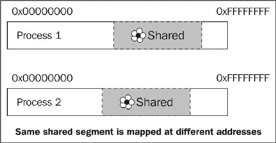
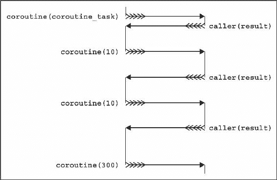

# 与系统一起工作

在本章中，我们将涵盖：

+   在目录中列出文件

+   删除和创建文件和目录

+   编写和使用插件

+   获取回溯-当前调用序列

+   快速从一个进程传递数据到另一个进程

+   同步进程间通信

+   在共享内存中使用指针

+   读取文件的最快方式

+   协程-保存状态和推迟执行

# 介绍

每个操作系统都有许多系统调用。这些调用在一个操作系统和另一个操作系统之间有所不同，但执行的功能非常接近。Boost 提供了对这些调用的可移植和安全的包装器。了解包装器对于编写良好的程序至关重要。

本章专门讨论与操作系统的工作。我们已经看到如何处理网络通信和信号第六章中的*操作任务*。在本章中，我们将更仔细地研究文件系统，创建和删除文件。我们将看到如何在不同系统进程之间传递数据，如何以最大速度读取文件，以及如何执行其他技巧。

# 在目录中列出文件

有标准库函数和类来读取和写入文件数据。但在 C++17 之前，没有函数来列出目录中的文件，获取文件类型或获取文件的访问权限。

让我们看看如何使用 Boost 来修复这些不平等。我们将编写一个程序，列出当前目录中的文件名、写入访问权限和文件类型。

# 准备工作

对 C++的一些基础知识就足够使用这个示例了。

此示例需要链接`boost_system`和`boost_filesystem`库。

# 如何做...

这个和下一个示例是关于使用文件系统的可移植包装器：

1.  我们需要包括以下两个头文件：

```cpp
#include <boost/filesystem/operations.hpp> 
#include <iostream> 
```

1.  现在，我们需要指定一个目录：

```cpp
int main() { 
    boost::filesystem::directory_iterator begin("./"); 
```

1.  在指定目录之后，循环遍历其内容：

```cpp
    boost::filesystem::directory_iterator end; 
    for (; begin != end; ++ begin) { 
```

1.  下一步是获取文件信息：

```cpp
        boost::filesystem::file_status fs = 
            boost::filesystem::status(*begin);
```

1.  现在，输出文件信息：

```cpp
        switch (fs.type()) { 
        case boost::filesystem::regular_file: 
            std::cout << "FILE       ";  
            break; 
        case boost::filesystem::symlink_file: 
            std::cout << "SYMLINK    ";  
            break; 
        case boost::filesystem::directory_file: 
            std::cout << "DIRECTORY  ";  
            break; 
        default: 
            std::cout << "OTHER      ";  
            break; 
        } 
        if (fs.permissions() & boost::filesystem::owner_write) { 
            std::cout << "W "; 
        } else { 
            std::cout << "  "; 
        } 
```

1.  最后一步是输出文件名：

```cpp
        std::cout << *begin << '\n'; 
    } /*for*/ 
} /*main*/ 
```

就是这样；现在如果我们运行程序，它将输出类似这样的内容：

```cpp
FILE W "./main.o" 
FILE W "./listing_files" 
DIRECTORY W "./some_directory" 
FILE W "./Makefile" 
```

# 它是如何工作的...

`Boost.Filesystem`的函数和类只是包装了特定于系统的函数，以便处理文件。

注意*步骤 2*中`/`的使用。 POSIX 系统使用斜杠来指定路径； Windows 默认使用反斜杠。 但是，Windows 也理解正斜杠，因此`./`将在所有流行的操作系统上工作，并且表示当前目录。

看看*步骤 3*，在那里我们正在默认构造`boost::filesystem::directory_iterator`类。它的工作方式就像`std::istream_iterator`类，当默认构造时充当`end`迭代器。

*步骤 4*是一个棘手的步骤，不是因为这个函数很难理解，而是因为发生了许多转换。解引用`begin`迭代器返回`boost::filesystem::directory_entry`，它隐式转换为`boost::filesystem::path`，然后用作`boost::filesystem::status`函数的参数。实际上，我们可以做得更好：

```cpp
boost::filesystem::file_status fs = begin->status(); 
```

仔细阅读参考文档，以避免不必要的隐式转换。

*步骤 5*是显而易见的，所以我们转到*步骤 6*，在那里再次发生对路径的隐式转换。更好的解决方案是：

```cpp
std::cout << begin->path() << '\n'; 
```

在这里，`begin->path()`返回`boost::filesystem::directory_entry`内包含的`boost::filesystem::path`变量的常量引用。

# 还有更多...

;`Boost.Filesystem`是 C++17 的一部分。C++17 中的所有内容都位于单个头文件`<filesystem>`中，位于`std::filesystem`命名空间中。标准库版本的文件系统与 Boost 版本略有不同，主要是通过使用作用域枚举（`enum class`）来区分，而`Boost.Filesystem`使用的是非作用域`enum`。

有一个类；`directory_entry`。该类提供了文件系统信息的缓存，因此如果您经常使用文件系统并查询不同的信息，请尝试使用`directory_entry`以获得更好的性能。

就像其他 Boost 库一样，`Boost.Filesystem`可以在 C++17 编译器之前甚至在 C++11 编译器之前工作。

# 另请参阅

+   *擦除和创建文件和目录*教程将展示`Boost.Filesystem`的另一个用法示例

+   阅读 Boost 关于`Boost.Filesystem`的官方文档，以获取有关其功能的更多信息；可以在以下链接找到：[`boost.org/libs/filesystem`](http://boost.org/libs/filesystem)

+   您可以在[`www.open-std.org/jtc1/sc22/wg21/docs/papers/2017/n4659.pdf`](http://www.open-std.org/jtc1/sc22/wg21/docs/papers/2017/n4659.pdf)找到 C++17 草案

# 擦除和创建文件和目录

让我们考虑以下代码行：

```cpp
    std::ofstream ofs("dir/subdir/file.txt"); 
    ofs << "Boost.Filesystem is fun!"; 
```

在这些行中，我们尝试向`dir/subdir`目录中的`file.txt`写入一些内容。如果没有这样的目录，这个尝试将失败。与文件系统的工作能力对于编写良好的工作代码是必要的。

在本教程中，我们将构建一个目录和一个子目录，向文件写入一些数据，并尝试创建`symlink`。如果符号链接的创建失败，则擦除已创建的实体。我们还应该避免使用异常作为错误报告的机制，而更倾向于某种返回代码。

让我们看看如何使用 Boost 以优雅的方式完成这个任务。

# 准备工作

本教程需要对 C++和`std::ofstream`类有基本了解。

`Boost.Filesystem`不是一个仅头文件的库，因此本教程中的代码需要链接到`boost_system`和`boost_filesystem`库。

# 如何做...

我们继续处理文件系统的可移植包装器，在本教程中，我们将看到如何修改目录内容：

1.  与其他 Boost 库一样，我们需要包含一些头文件：

```cpp
#include <boost/filesystem/operations.hpp> 
#include <cassert> 
#include <fstream> 
```

1.  现在，我们需要一个变量来存储错误（如果有的话）：

```cpp
int main() { 
    boost::system::error_code error; 
```

1.  如果需要，我们还将创建目录，如下所示：

```cpp
    boost::filesystem::create_directories("dir/subdir", error); 
    assert(!error); 
```

1.  然后，我们将数据写入文件：

```cpp
    std::ofstream ofs("dir/subdir/file.txt");
    ofs << "Boost.Filesystem is fun!";
    assert(ofs);
    ofs.close();
```

1.  我们需要尝试创建`symlink`：

```cpp
    boost::filesystem::create_symlink(
        "dir/subdir/file.txt", "symlink", error);
```

1.  然后，我们需要检查通过`symlink`是否可以访问文件：

```cpp
    if (!error) {
        std::cerr << "Symlink created\n";
        assert(boost::filesystem::exists("symlink"));
```

1.  如果`symlink`创建失败，我们将删除创建的文件：

```cpp
    } else {
        std::cerr << "Failed to create a symlink\n";

        boost::filesystem::remove_all("dir", error);
        assert(!error);

        boost::filesystem::remove("symlink", error);
        assert(!error);
    } /*if (!error)*/
} /*main*/
```

# 它是如何工作的...

我们在第六章的几乎所有教程中都看到了`boost::system::error_code`的实际应用，*操作任务*。它可以存储有关错误的信息，并且在整个 Boost 库中广泛使用。

如果您没有为`Boost.Filesystem`函数提供`boost::system::error_code`的实例，代码将编译成功。在这种情况下，当发生错误时，会抛出`boost::filesystem::filesystem_error`异常。

仔细看看*步骤 3*。我们使用了`boost::filesystem::create_directories`函数，而不是`boost::filesystem::create_directory`，因为后者无法创建子目录。`boost::filesystem::remove_all`和`boost::filesystem::remove`也是同样的情况。前者可以删除包含文件和子目录的非空目录。后者删除单个文件。

其余步骤很容易理解，不应该引起任何麻烦。

# 还有更多...

`boost::system::error_code`类是 C++11 的一部分，可以在`std::`命名空间的`<system_error>`头文件中找到。`Boost.Filesystem`的类是 C++17 的一部分。

最后，这里是一个对于那些打算使用`Boost.Filesystem`的小建议。当文件系统操作中发生错误时，如果是例行操作或应用程序需要高度的责任/性能，使用`boost::system::error_codes`。否则，捕获异常更可取且更可靠。

# 另请参阅

*在目录中列出文件*的配方还包含有关`Boost.Filesystem`的信息。阅读 Boost 的官方文档[`boost.org/libs/filesystem`](http://boost.org/libs/filesystem)以获取更多信息和示例。

# 编写和使用插件

这里有一个棘手的问题：我们希望允许用户编写扩展我们程序功能的功能，但我们不想给他们源代码。换句话说，我们想说，“*编写一个函数 X 并将其打包到共享库中。我们可以使用您的函数以及其他一些用户的函数！*”

您在日常生活中会遇到这种技术：您的浏览器使用它来允许第三方插件，您的文本编辑器可能使用它进行语法高亮显示，游戏使用**动态库加载**进行**可下载内容**（**DLC**）和添加游戏玩家内容，服务器返回的网页使用模块/插件进行加密/身份验证等。

用户功能的要求是什么，我们如何在某个时刻使用该功能，而不将其链接到共享库？

# 准备就绪

这个配方需要基本的 C++知识。阅读第十章中的*导出和导入函数和类的便携式方法*是必需的。

# 如何做...

首先，您必须与用户达成协议：

1.  记录插件接口的要求。例如，您可以说所有插件必须导出一个名为`greet`的函数，并且该函数必须接受`const std::string&`并返回`std::string`。

1.  之后，用户可以按以下方式编写插件/共享库：

```cpp
#include <string>
#include <boost/config.hpp>

#define API extern "C" BOOST_SYMBOL_EXPORT

API std::string greeter(const std::string& name) {
    return "Good to meet you, " + name + ".";
}
```

1.  加载共享库的程序代码必须包括来自`Boost.DLL`的头文件：

```cpp
#include <boost/dll/shared_library.hpp>
```

1.  加载库的代码必须如下所示：

```cpp
int main() {
    boost::filesystem::path plugin_path = /* path-to-pligin */;

    boost::dll::shared_library plugin(
        plugin_path,
        boost::dll::load_mode::append_decorations
    );
```

1.  获取用户功能必须如下所示：

```cpp
    auto greeter = plugin.get<std::string(const std::string&)>("greeter");
```

1.  完成。现在，您可以使用该功能：

```cpp
    std::cout << greeter("Sally Sparrow");
}
```

根据加载的插件，您将获得不同的结果：

`plugin_hello`:

```cpp
Good to meet you, Sally Sparrow.
```

`plugin_do_not`:

```cpp
They are fast. Faster than you can believe. Don't turn 

your back, don't look away, and don't blink. Good luck, Sally Sparrow.
```

# 它是如何工作的...

*步骤 2*中有一个小技巧。当您将函数声明为`extern "C"`时，这意味着编译器不得**操纵**（更改）函数名称。换句话说，在*步骤 2*中，我们只是创建一个名为`greet`的函数，并且以该确切名称从共享库中导出。

在*步骤 4*中，我们创建一个名为`plugin`的`boost::dll::shared_library`变量。该变量的构造函数将共享库加载到当前可执行文件的地址空间中。在*步骤 5*中，我们在`plugin`中搜索名为`greet`的函数。我们还指定该函数具有`std::string(const std::string&)`的签名，并将该函数的指针存储在变量`greet`中。

就是这样！从现在开始，我们可以将`greet`变量用作函数，只要`plugin`变量及其所有副本未被销毁。

您可以从共享库中导出多个函数；甚至可以导出变量。

小心！始终将 C 和 C++库动态链接到插件和主可执行文件中，否则您的应用程序将崩溃。始终在插件和应用程序中使用相同或 ABI 兼容的 C 和 C++库版本。否则您的应用程序将崩溃。阅读典型误用的文档！

# 还有更多...

`Boost.DLL`是一个新库；它出现在 Boost 1.61 中。我最喜欢的部分是该库具有向共享库名称添加特定于平台的装饰的能力。例如，根据平台，以下代码将尝试加载`"./some/path/libplugin_name.so"`、`"./some/path/plugin_name.dll"`或`"./some/path/libplugin_name.dll"`：

```cpp
boost::dll::shared_library lib(
    "./some/path/plugin_name",
    boost::dll::load_mode::append_decorations
);
```

C++17 没有类似`boost::dll::shared_library`的类。但是，工作正在进行中，总有一天我们可能会在 C++标准中看到它。

# 另请参阅

官方文档包含多个示例，更重要的是，库的典型问题/误用[`boost.org/libs/dll`](http://boost.org/libs/dll)网站。

# 获取回溯 - 当前调用序列

在报告错误或失败时，更重要的是报告导致错误的步骤，而不是错误本身。考虑一个简单的交易模拟器：

```cpp
int main() {
    int money = 1000;
    start_trading(money);
}
```

它只报告一行：

```cpp
Sorry, you're bankrupt!
```

这是行不通的。我们想知道是怎么发生的，导致破产的步骤是什么！

好的。让我们修复以下函数，并让它报告导致破产的步骤：

```cpp
void report_bankruptcy() {
    std::cout << "Sorry, you're bankrupt!\n";

    std::exit(0);
}
```

# 入门

您需要 Boost 1.65 或更新版本。还需要基本的 C++知识。

# 如何做到...

对于这个示例，我们只需要构造一个单独的类并输出它：

```cpp
#include <iostream>
#include <boost/stacktrace.hpp>

void report_bankruptcy() {
    std::cout << "Sorry, you're bankrupt!\n";
    std::cout << "Here's how it happened:\n" 
        << boost::stacktrace::stacktrace();

    std::exit(0);
}
```

完成。现在`report_bankruptcy()`输出的内容与以下内容接近（从下往上读）：

```cpp
Sorry, you're bankrupt!
Here's how it happened:
 0# report_bankruptcy()
 1# loose(int)
 2# go_to_casino(int)
 3# go_to_bar(int)
 4# win(int)
 5# go_to_casino(int)
 6# go_to_bar(int)
 7# win(int)
 8# make_a_bet(int)
 9# loose(int)
10# make_a_bet(int)
11# loose(int)
12# make_a_bet(int)
13# start_trading(int)
14# main
15# 0x00007F79D4C48F45 in /lib/x86_64-linux-

gnu/libc.so.6
16# 0x0000000000401F39 in ./04_stacktrace
```

# 它是如何工作的...

所有的魔法都在`boost::stacktrace::stacktrace`类中。在构造时，它会快速将当前调用堆栈存储在自身中。`boost::stacktrace::stacktrace`是可复制和可移动的，因此存储的调用序列可以传递给其他函数，复制到异常类中，甚至存储在某个文件中。随心所欲地使用它吧！

在输出的`boost::stacktrace::stacktrace`实例上，解码存储的调用序列并尝试获取人类可读的函数名称。这就是您在之前的示例中看到的：导致`report_bankruptcy()`函数调用的调用序列。

`boost::stacktrace::stacktrace`允许您迭代存储的地址，将单个地址解码为人类可读的名称。如果您不喜欢跟踪的默认输出格式，可以编写自己喜欢的输出方式的函数。

请注意，回溯的有用性取决于多个因素。程序的发布版本可能包含内联函数，导致跟踪不太可读：

```cpp
 0# report_bankruptcy()
 1# go_to_casino(int)
 2# win(int)
 3# make_a_bet(int)
 4# make_a_bet(int)
 5# make_a_bet(int)
 6# main
```

在没有调试符号的情况下构建可执行文件可能会产生没有许多函数名称的跟踪。

阅读官方文档的*配置和构建*部分，了解有关可能影响跟踪可读性的不同编译标志和宏的更多信息。

# 还有更多...

`Boost.Stacktrace`库对于大型项目有一个非常好的功能。您可以在链接程序时禁用所有跟踪。这意味着您不需要重新构建所有源文件。只需为整个项目定义`BOOST_STACKTRACE_LINK`宏。现在，如果您链接`boost_stacktrace_noop`库，将收集空跟踪。链接`boost_stacktrace_windbg`/`boost_stacktrace_windbg_cached`/`boost_stacktrace_backtrace`/`...库`以获得不同可读性的跟踪。

`Boost.Stacktrace`是一个新库；它出现在 Boost 1.65 中。

`boost::stacktrace::stacktrace`相当快地收集当前的调用序列；它只是动态分配一块内存并将一堆地址复制到其中。解码地址要慢得多；它使用多个特定于平台的调用，可能会分叉进程，并且可能会初始化和使用**COM**。

C++17 没有`Boost.Stacktrace`功能。正在进行工作，将其添加到下一个 C++标准中。

# 另请参阅

官方文档[`boost.org/libs/stacktrace/`](http://boost.org/libs/stacktrace)中有一些关于异步信号安全的堆栈跟踪的示例，以及有关所有`Boost.Stacktrace`功能的详细描述。

# 快速将数据从一个进程传递到另一个进程

有时，我们编写大量相互通信的程序。当程序在不同的机器上运行时，使用套接字是最常见的通信技术。但是，如果多个进程在单台机器上运行，我们可以做得更好！

让我们看看如何使用`Boost.Interprocess`库使单个内存片段可在不同进程中使用。

# 准备就绪

这个配方需要对 C++有基本的了解。还需要了解原子变量（查看*另请参阅*部分，了解有关原子的更多信息）。一些平台需要链接到运行时库`rt`。

# 如何做...

在这个例子中，我们将在进程之间共享一个原子变量，使其在新进程启动时递增，在进程终止时递减：

1.  我们需要包含以下头文件进行跨进程通信：

```cpp
#include <boost/interprocess/managed_shared_memory.hpp> 
```

1.  在头文件、`typedef`和检查之后，将帮助我们确保原子对于这个例子是可用的：

```cpp
#include <boost/atomic.hpp> 

typedef boost::atomic<int> atomic_t; 
#if (BOOST_ATOMIC_INT_LOCK_FREE != 2) 
#error "This code requires lock-free boost::atomic<int>" 
#endif 
```

1.  创建或获取共享内存段：

```cpp
int main() {
    boost::interprocess::managed_shared_memory 
        segment(boost::interprocess::open_or_create, "shm1-cache", 1024);
```

1.  获取或构造`atomic`变量：

```cpp
    atomic_t& atomic 
        = *segment.find_or_construct<atomic_t> // 1
            ("shm1-counter")                   // 2
            (0)                                // 3
    ;
```

1.  以通常的方式处理`atomic`变量：

```cpp
    std::cout << "I have index " << ++ atomic 
        << ". Press any key...\n";
    std::cin.get();
```

1.  销毁`atomic`变量：

```cpp
    const int snapshot = --atomic;
    if (!snapshot) {
        segment.destroy<atomic_t>("shm1-counter");
        boost::interprocess::shared_memory_object
                ::remove("shm1-cache");
    }
} /*main*/ 
```

就是这样！现在，如果我们同时运行这个程序的多个实例，我们会看到每个新实例都会递增其索引值：

```cpp
I have index 1\. Press any key...
I have index 2\. 

Press any key...
I have index 3\. Press any key...
I have index 4\. Press any key...
I have index 5\. 

Press any key...
```

# 它是如何工作的...

这个配方的主要思想是获得一个对所有进程可见的内存段，并在其中放置一些数据。让我们看看*步骤 3*，在那里我们检索这样一个内存段。在这里，`shm1-cache`是段的名称（不同的段有不同的名称）。您可以为段指定任何名称。第一个参数是`boost::interprocess::open_or_create`，它告诉`boost::interprocess::managed_shared_memory`必须打开一个具有名称`shm1-cache`的现有段或构造它。最后一个参数是段的大小。

段的大小必顺应足够大，以适应`Boost.Interprocess`库特定的数据。这就是为什么我们使用`1024`而不是`sizeof(atomic_t)`。但实际上，操作系统会将这个值舍入到最接近的更大的支持值，通常等于或大于 4 千字节。

*步骤 4*是一个棘手的步骤，因为我们在这里同时执行多个任务。在这一步的第 2 部分，我们在段中找到或构造一个名为`shm1-counter`的变量。在*步骤 4*的第 3 部分，我们提供一个参数，用于初始化变量，如果在*步骤 2*中没有找到。只有在找不到变量并且必须构造变量时，才会使用此参数，否则将被忽略。仔细看第二行（第 1 部分）。看到解引用运算符`*`的调用。我们这样做是因为`segment.find_or_construct<atomic_t>`返回一个指向`atomic_t`的指针，在 C++中使用裸指针是一种不好的风格。

我们在共享内存中使用原子变量！这是必需的，因为两个或更多进程可能同时使用相同的`shm1-counter`原子变量。

在处理共享内存中的对象时，您必须非常小心；不要忘记销毁它们！在*步骤 6*中，我们使用它们的名称销毁对象和段。

# 还有更多...

仔细看看*步骤 2*，我们在那里检查`BOOST_ATOMIC_INT_LOCK_FREE != 2`。我们正在检查`atomic_t`是否不使用互斥锁。这非常重要，因为通常的互斥锁在共享内存中不起作用。因此，如果`BOOST_ATOMIC_INT_LOCK_FREE`不等于`2`，我们会得到未定义的行为。

不幸的是，C++11 没有跨进程类，据我所知，`Boost.Interprocess`也没有被提议纳入 C++20。

一旦创建了托管段，它就不能自动增加大小！确保您创建的段足够大以满足您的需求，或者查看*另请参阅*部分，了解有关增加托管段的信息。

共享内存是进程进行通信的最快方式，但适用于可能共享内存的进程。这通常意味着进程必须在同一主机上运行，或者在**对称多处理**（**SMP**）集群上运行。

# 另请参阅

+   *同步跨进程通信*配方将告诉您更多关于共享内存、跨进程通信和同步访问共享内存资源的信息。

+   有关原子操作的更多信息，请参阅*使用原子快速访问共享资源*示例

+   Boost 的官方文档`Boost.Interprocess`也可能会有所帮助；可以在[`boost.org/libs/interprocess`](http://boost.org/libs/interprocess)找到。

+   如何增加托管段的方法在[`boost.org/libs/interprocess`](http://boost.org/libs/interprocess)的*增长托管段*中有描述

# 同步进程间通信

在上一个示例中，我们看到了如何创建共享内存以及如何在其中放置一些对象。现在，是时候做一些有用的事情了。让我们从第五章的*多线程*中的*制作工作队列*示例中获取一个例子，并使其适用于多个进程。在这个示例结束时，我们将得到一个可以存储不同任务并在进程之间传递它们的类。

# 准备工作

这个示例使用了前一个示例中的技术。你还需要阅读第五章的*多线程*中的*制作工作队列*示例，并理解它的主要思想。该示例需要在某些平台上链接运行时库`rt`。

# 如何做...

认为将独立的子进程代替线程使程序更可靠，因为子进程的终止不会终止主进程。我们不会在这里对这个假设进行争论，只是看看如何实现进程之间的数据共享。

1.  这个示例需要很多头文件：

```cpp
#include <boost/interprocess/managed_shared_memory.hpp> 
#include <boost/interprocess/containers/deque.hpp> 
#include <boost/interprocess/allocators/allocator.hpp> 
#include <boost/interprocess/sync/interprocess_mutex.hpp> 
#include <boost/interprocess/sync/interprocess_condition.hpp> 
#include <boost/interprocess/sync/scoped_lock.hpp> 

#include <boost/optional.hpp> 
```

1.  现在，我们需要定义我们的结构`task_structure`，它将用于存储任务：

```cpp
struct task_structure { 
    // ... 
}; 
```

1.  让我们开始编写`work_queue`类：

```cpp
class work_queue { 
public: 
    typedef boost::interprocess::managed_shared_memory  
            managed_shared_memory_t; 

    typedef task_structure task_type; 
    typedef boost::interprocess::allocator< 
        task_type,  
        boost::interprocess::managed_shared_memory::segment_manager 
    > allocator_t; 
```

1.  将`work_queue`的成员写成以下形式：

```cpp
private: 
    managed_shared_memory_t segment_; 
    const allocator_t       allocator_; 

    typedef boost::interprocess::deque<task_type, allocator_t> deque_t; 
    deque_t&        tasks_; 

    typedef boost::interprocess::interprocess_mutex mutex_t; 
    mutex_t&        mutex_; 

    typedef boost::interprocess::interprocess_condition condition_t; 
    condition_t&    cond_; 

    typedef boost::interprocess::scoped_lock<mutex_t> scoped_lock_t;
```

1.  成员的初始化必须如下所示：

```cpp
public: 
    explicit work_queue()
        : segment_(
              boost::interprocess::open_or_create,
              "work-queue",
              1024 * 1024 * 32
        )
        , allocator_(segment_.get_segment_manager())
        , tasks_(
            *segment_.find_or_construct<deque_t>
              ("work-queue:deque")(allocator_)
        )
        , mutex_(
            *segment_.find_or_construct<mutex_t>
              ("work-queue:mutex")()
        )
        , cond_(
            *segment_.find_or_construct<condition_t>
              ("work-queue:condition")()
        )
    {}
```

1.  我们需要对`work_queue`的成员函数进行一些微小的更改，比如使用`scoped_lock_t`，而不是原始的 unique locks：

```cpp
    boost::optional<task_type> try_pop_task() { 
        boost::optional<task_type> ret; 
        scoped_lock_t lock(mutex_); 
        if (!tasks_.empty()) { 
            ret = tasks_.front(); 
            tasks_.pop_front(); 
        } 
        return ret; 
    }
```

1.  不要忘记清理资源：

```cpp
    void cleanup() {
        segment_.destroy<condition_t>("work-queue:condition");
        segment_.destroy<mutex_t>("work-queue:mutex");
        segment_.destroy<deque_t>("work-queue:deque");

        boost::interprocess::shared_memory_object
            ::remove("work-queue");
    }
```

# 工作原理...

在这个示例中，我们几乎做了和第五章的*多线程*中的*制作工作队列* *类*示例中完全相同的事情，但我们是在共享内存中分配数据。

在存储具有指针或引用作为成员字段的共享内存对象时需要额外小心。我们将在下一个示例中看到如何处理指针。

看一下*步骤 2*。我们没有使用`boost::function`作为任务类型，因为它里面有指针，所以它在共享内存中无法工作。

*步骤 3*很有趣，因为涉及`allocator_t`。如果内存不是从共享内存段分配的，它就可以被其他进程使用；这就是为什么需要为容器使用特定的分配器。`allocator_t`是一个有状态的分配器，这意味着它会随着容器一起被复制。此外，它不能被默认构造。

*步骤 4*非常简单，只是`tasks_`、`mutex_`和`cond_`只有引用。这是因为对象本身是在共享内存中构造的。所以，`work_queue`只能在其中存储引用。

在*步骤 5*中，我们正在初始化成员。这段代码对你来说一定很熟悉。在上一个示例中，我们做了完全相同的事情。

在构造`tasks_`时，我们提供了一个分配器的实例。这是因为`allocator_t`不能由容器本身构造。共享内存在进程退出事件时不会被销毁，所以我们可以运行程序一次，将任务发布到工作队列，停止程序，启动其他程序，并获取由第一个程序实例存储的任务。共享内存只有在重新启动时才会被销毁，或者如果你显式调用`segment.deallocate("work-queue");`。

# 还有更多...

正如前面的内容中已经提到的，C++17 没有 `Boost.Interprocess` 中的类。此外，不得在共享内存段中使用 C++17 或 C++03 容器。其中一些容器可能有效，但这种行为不具有可移植性。

如果你查看一些 `<boost/interprocess/containers/*.hpp>` 头文件，你会发现它们只是使用了 `Boost.Containers` 库中的容器：

```cpp
namespace boost { namespace interprocess { 
    using boost::container::vector; 
}} 
```

`Boost.Interprocess` 的容器具有 `Boost.Containers` 库的所有优点，包括右值引用及其在旧编译器上的模拟。

`Boost.Interprocess` 是在同一台机器上运行的进程之间进行通信的最快解决方案。

# 另请参阅

+   *在共享内存中使用指针* 的方法

+   阅读 第五章*,* *多线程*，了解更多关于同步原语和多线程的信息

+   有关 `Boost.Interprocess` 库的更多示例和信息，请参考 Boost 官方文档；可在以下链接找到：[`boost.org/libs/interprocess`](http://boost.org/libs/interprocess)

# 在共享内存中使用指针

很难想象在没有指针的情况下编写一些低级别的 C++ 核心类。指针和引用在 C++ 中随处可见，但它们在共享内存中无法使用！因此，如果我们在共享内存中有这样的结构，并将共享内存中某个整数变量的地址分配给 `pointer_`，那么 `pointer_` 在其他进程中将无效：

```cpp
struct with_pointer { 
    int* pointer_; 
    // ... 
    int value_holder_; 
}; 
```

我们如何修复这个问题？

# 准备工作

理解前面的内容是理解这个的前提。在某些平台上，示例需要链接运行时系统库 `rt`。

# 如何做...

修复很简单；我们只需要用 `offset_ptr<>` 替换指针：

```cpp
#include <boost/interprocess/offset_ptr.hpp> 

struct correct_struct { 
    boost::interprocess::offset_ptr<int> pointer_; 
    // ... 
    int value_holder_; 
}; 
```

现在，我们可以像使用普通指针一样自由使用它：

```cpp
int main() {
    boost::interprocess::managed_shared_memory 
        segment(boost::interprocess::open_or_create, "segment", 4096);

    correct_struct* ptr =
        segment.find<correct_struct>("structure").first;

    if (ptr) {
        std::cout << "Structure found\n";
        assert(*ptr->pointer_ == ethalon_value);
        segment.destroy<correct_struct>("structure");
    }
}
```

# 工作原理...

我们无法在共享内存中使用指针，因为当共享内存的一部分映射到进程的地址空间时，其地址仅对该进程有效。当我们获取变量的地址时，它只是该进程的本地地址。其他进程将共享内存映射到不同的基地址，因此变量地址会有所不同。



那么，我们如何处理始终在变化的地址？有一个技巧！由于指针和结构位于同一共享内存段中，它们之间的距离不会改变。`boost::interprocess::offset_ptr` 的想法是记住 `offset_ptr` 和指向值之间的距离。在解引用时，`offset_ptr` 将距离值添加到 `offset_ptr` 变量的进程相关地址上。

偏移指针模拟了指针的行为，因此可以快速应用替换。

不要将可能包含指针或引用的类放入共享内存中！

# 还有更多...

偏移指针的工作速度略慢于通常的指针，因为每次解引用都需要计算地址。但是，这种差异通常不应该让你担心。

C++17 没有偏移指针。

# 另请参阅

+   Boost 官方文档包含许多示例和更高级的 `Boost.Interprocess` 功能；可在 [`boost.org/libs/interprocess`](http://boost.org/libs/interprocess) 找到

+   *最快的文件读取方法* 的方法包含了 `Boost.Interprocess` 库的一些非传统用法的信息

# 读取文件的最快方法

在互联网上，人们一直在问“读取文件的最快方法是什么？”让我们让这个问题更加困难：读取二进制文件的最快和可移植的方法是什么？

# 准备工作

这个方法需要基本的 C++ 知识和 `std::fstream`。

# 如何做...

这个方法广泛用于对输入和输出性能要求严格的应用程序。这是读取文件的最快方法：

1.  我们需要包括 `Boost.Interprocess` 库中的两个头文件：

```cpp
#include <boost/interprocess/file_mapping.hpp> 
#include <boost/interprocess/mapped_region.hpp> 
```

1.  现在，我们需要打开一个文件：

```cpp
const boost::interprocess::mode_t mode = boost::interprocess::read_only; 
boost::interprocess::file_mapping fm(filename, mode); 
```

1.  这个食谱的主要部分是将所有文件映射到内存中：

```cpp
boost::interprocess::mapped_region region(fm, mode, 0, 0);
```

1.  获取文件中数据的指针：

```cpp
const char* begin = static_cast<const char*>(
    region.get_address()
);
```

就是这样！现在，我们可以像处理常规内存一样处理文件：

```cpp
const char* pos = std::find(
    begin, begin + region.get_size(), '\1'
);
```

# 它是如何工作的...

所有流行的操作系统都具有将文件映射到进程地址空间的能力。在这样的映射完成后，进程可以像处理常规内存一样处理这些地址。操作系统会处理所有文件操作，如缓存和预读。

为什么它比传统的读/写更快？这是因为在大多数情况下，读/写是作为内存映射和将数据复制到用户指定的缓冲区来实现的。因此，读取通常比内存映射多做一点。

就像标准库的`std::fstream`一样，在打开文件时必须提供打开模式。请参阅*步骤 2*，我们在那里提供了`boost::interprocess::read_only`模式。

请参阅*步骤 3*，我们在那里一次映射了整个文件。这个操作实际上非常快，因为操作系统不会从磁盘读取数据，而是等待对映射区域的请求。在请求了映射区域的一部分后，操作系统将该文件的那部分加载到内存中。正如我们所看到的，内存映射操作是懒惰的，并且映射区域的大小不会影响性能。

但是，32 位操作系统无法内存映射大文件，因此您必须按部就班地映射它们。POSIX（Linux）操作系统要求在 32 位平台上处理大文件时定义`_FILE_OFFSET_BITS=64`宏。否则，操作系统将无法映射超过 4GB 的文件部分。

现在，是时候测量性能了：

```cpp
    $ TIME="%E" time ./reading_files m
    mapped_region: 0:00.08

    $ TIME="%E" time ./reading_files r
    ifstream: 0:00.09

    $ TIME="%E" time ./reading_files a
    C: 0:00.09
```

正如预期的那样，内存映射文件比传统读取稍快。我们还可以看到纯 C 方法与 C++的`std::ifstream`类具有相同的性能，因此不要在 C++中使用与`FILE*`相关的函数。它们只适用于 C，而不适用于 C++！

为了获得`std::ifstream`的最佳性能，请不要忘记以二进制模式打开文件并按块读取数据：

```cpp
std::ifstream f(filename, std::ifstream::binary); 
// ... 
char c[kilobyte]; 
f.read(c, kilobyte); 
```

# 还有更多...

不幸的是，用于内存映射文件的类不是 C++17 的一部分，看起来它们在 C++20 中也不会是。

写入内存映射区域也是一个非常快的操作。操作系统会缓存写入操作，并不会立即将修改刷新到磁盘。操作系统和`std::ofstream`数据缓存之间存在差异。如果`std::ofstream`数据由应用程序缓存，并且应用程序终止，则缓存的数据可能会丢失。当数据由操作系统缓存时，应用程序的终止不会导致数据丢失。断电和操作系统崩溃都会导致数据丢失。

如果多个进程映射单个文件，并且其中一个进程修改了映射区域，则其他进程立即看到更改（甚至无需实际将数据写入磁盘！现代操作系统非常聪明！）。

# 另请参阅

`Boost.Interprocess`库包含许多有用的功能，用于与系统一起工作；并非所有功能都在本书中涵盖。您可以在官方网站上阅读有关这个伟大库的更多信息：[`boost.org/libs/interprocess`](http://boost.org/libs/interprocess)。

# 协程-保存状态和推迟执行

如今，许多嵌入式设备仍然只有一个核心。开发人员为这些设备编写代码，试图从中挤取最大的性能。

对于这些设备使用`Boost.Threads`或其他线程库并不有效。操作系统将被迫调度线程进行执行，管理资源等，因为硬件无法并行运行它们。

那么，我们如何强制程序在等待主程序的某些资源时切换到子程序的执行？此外，我们如何控制子程序的执行时间？

# 准备工作

这个食谱需要基本的 C++和模板知识。阅读一些关于`Boost.Function`的食谱也可能有所帮助。

# 如何做到...

这个教程是关于**协程**或**子程序**，允许多个入口点。多个入口点使我们能够在特定位置暂停和恢复程序的执行，切换到/从其他子程序。

1.  `Boost.Coroutine2`库几乎负责一切。我们只需要包含它的头文件：

```cpp
#include <boost/coroutine2/coroutine.hpp> 
```

1.  创建具有所需输入参数类型的协程类型：

```cpp
typedef boost::coroutines2::asymmetric_coroutine<std::size_t> corout_t;
```

1.  创建一个表示子程序的类：

```cpp
struct coroutine_task {
    std::string& result;

    coroutine_task(std::string& r)
        : result(r)
    {}

    void operator()(corout_t::pull_type& yield);

private:
    std::size_t ticks_to_work;
    void tick(corout_t::pull_type& yield);
};
```

1.  让我们创建协程本身：

```cpp
int main() {
    std::string result;
    coroutine_task task(result);
    corout_t::push_type coroutine(task);
```

1.  现在，我们可以在主程序中等待某个事件的同时执行子程序：

```cpp
    // Somewhere in main():

    while (!spinlock.try_lock()) {
        // We may do some useful work, before
        // attempting to lock a spinlock once more.
        coroutine(10); // 10 is the ticks count to run.
    }
    // Spinlock is locked.
    // ...

    while (!port.block_ready()) {
        // We may do some useful work, before
        // attempting to get block of data once more.
        coroutine(300); // 300 is the ticks count to run.

        // Do something with `result` variable.
    }
```

1.  协程方法可能如下所示：

```cpp
void coroutine_task::operator()(corout_t::pull_type& yield) {
    ticks_to_work = yield.get();

    // Prepare buffers.
    std::string buffer0;

    while (1) {
        const bool requiers_1_more_copy = copy_to_buffer(buffer0);
        tick(yield);

        if (requiers_1_more_copy) {
            std::string buffer1;
            copy_to_buffer(buffer1);
            tick(yield);

            process(buffer1);
            tick(yield);
        }

        process(buffer0);
        tick(yield);
    }
}
```

1.  `tick()`函数可以这样实现：

```cpp
void coroutine_task::tick(corout_t::pull_type& yield) {
    if (ticks_to_work != 0) {
        --ticks_to_work;
    }

    if (ticks_to_work == 0) {
        // Switching back to main.
        yield();

        ticks_to_work = yield.get();
    }
}
```

# 它是如何工作的...

在*步骤 2*中，我们使用`std::size_t`作为模板参数描述了子程序的输入参数。

*步骤 3*相当简单，除了`corout_t::pull_type& yield`参数。我们马上就会看到它的作用。

当我们在*步骤 5*中调用`coroutine(10)`时，我们正在执行一个协程程序。执行跳转到`coroutine_task::operator()`，在那里调用`yield.get()`返回输入参数`10`。执行继续进行，`coroutine_task::tick`函数测量经过的滴答声。

最有趣的部分来了！

在*步骤 7*中，如果在函数`coroutine_task::tick`中`ticks_to_work`变量变为`0`，协程的执行将在`yield()`处暂停，而`main()`继续执行。在下一次调用`coroutine(some_value)`时，协程的执行将从`tick`函数的中间位置继续，就在`yield()`旁边的行。在那一行，`ticks_to_work = yield.get();`被执行，`ticks_to_work`变量开始保存一个新的输入值`some_value`。

这意味着我们可以在函数的多个位置暂停/继续协程。所有函数状态和变量都会被恢复：



让我描述一下协程和线程之间的主要区别。当执行协程时，主任务什么也不做。当执行主任务时，协程任务什么也不做。使用线程时，您没有这样的保证。使用协程，您明确指定何时启动子任务以及何时暂停它。在单核环境中，线程可能随时切换；您无法控制这种行为。

# 还有更多...

在切换线程时，操作系统会做很多工作，因此这不是一个非常快的操作。然而，使用协程，您可以完全控制切换任务；此外，您不需要执行一些特定于操作系统的内部内核工作。切换协程比切换线程快得多，尽管不像调用`boost::function`那样快。

`Boost.Coroutine2`库负责调用协程任务中变量的析构函数，因此无需担心泄漏。

协程使用`boost::coroutines2::detail::forced_unwind`异常来释放不是从`std::exception`派生的资源。您必须小心不要在协程任务中捕获该异常。

您不能复制`Boost.Coroutine2`协程，但可以`std::move`它们。

有一个`Boost.Coroutine`库（末尾没有`2`！），它不需要 C++11 兼容的编译器。但是该库已经被弃用，并且有一些区别（例如它不会从协程中传播异常）。注意区别！`Boost.Coroutine`在 Boost 1.56 中也显著改变了其接口。

C++17 没有协程。但**协程 TS**几乎准备就绪，所以很有可能下一个 C++标准将直接包含它们。

协程 TS 与 `Boost.Coroutine2` 不同！Boost 提供了 **有栈** 协程，这意味着您不需要特别使用宏/关键字来使用它们。但这也意味着 Boost 协程更难被编译器优化，并且可能分配更多内存。协程 TS 提供了 **无栈** 协程，这意味着编译器可以精确计算协程所需的内存，甚至可以优化整个协程。然而，这种方法需要代码更改，可能稍微难以采用。

# 另请参阅

+   Boost 的官方文档包含了更多关于 `Boost.Coroutines2` 库的示例、性能说明、限制和用例；请访问以下链接 [`boost.org/libs/coroutine2`](http://boost.org/libs/coroutine2)

+   查看第二章的示例，*资源管理*，以及第五章，*多线程*，了解 `Boost.Coroutine`、`Boost.Thread` 和 `Boost.Function` 库之间的区别

+   对 Coroutines TS 感兴趣吗？这里有一场有趣的关于作者 Gor Nishanov 的实现讨论 *CppCon 2016: Gor Nishanov. C++ Coroutines: Under the covers*，链接在 [`www.youtube.com/watch?v=8C8NnE1Dg4A`](https://www.youtube.com/watch?v=8C8NnE1Dg4A)
