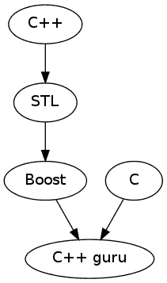

# 只是冰山一角

在本章中，我们将涵盖：

+   处理图

+   可视化图

+   使用真随机数生成器

+   使用可移植数学函数

+   编写测试用例

+   将多个测试用例组合在一个测试模块中

+   操作图像

# 介绍

Boost 是一个庞大的库集合。其中一些库很小，适用于日常使用，而其他一些则需要单独的书来描述它们的所有特性。本章专门介绍了其中一些大型库，并提供了对它的基本理解。

前两篇食谱将解释`Boost.Graph`的用法。这是一个拥有大量算法的大型库。我们将看到一些基础知识，也可能是开发中最重要的部分--图的可视化。

我们还将看到一个非常有用的食谱，用于生成真随机数。这对于编写安全的加密系统非常重要。

一些 C++标准库缺乏数学函数。我们将看到如何使用 Boost 来解决这个问题。但是，本书的格式没有空间来描述所有的函数。

编写测试用例在*编写测试用例*和*将多个测试用例组合在一个测试模块中*的食谱中有所描述。这对于任何生产质量的系统都很重要。

最后一篇食谱是关于一个在我大学时代的很多课程作业中帮助过我的库。可以使用它来创建和修改图像。我个人用它来可视化不同的算法，隐藏图像中的数据，签名图像和生成纹理。

不幸的是，即使这一章也不能告诉你关于所有的 Boost 库。也许有一天，我会再写一本书，然后再写几本。

# 处理图

有些任务需要将数据表示为图。`Boost.Graph`是一个旨在提供一种灵活的方式在内存中构建和表示图的库。它还包含了许多处理图的算法，如拓扑排序、广度优先搜索、深度优先搜索和 Dijkstra 最短路径。

好吧，让我们用`Boost.Graph`执行一些基本任务！

# 准备工作

这个食谱只需要基本的 C++和模板知识。

# 如何做...

在这个食谱中，我们将描述一个图类型，创建该类型的图，向图中添加一些顶点和边，并搜索特定的顶点。这应该足以开始使用`Boost.Graph`了。

1.  我们首先描述图的类型：

```cpp
#include <boost/graph/adjacency_list.hpp> 
#include <string> 

typedef std::string vertex_t; 
typedef boost::adjacency_list< 
    boost::vecS 
    , boost::vecS 
    , boost::bidirectionalS 
    , vertex_t 
> graph_type; 
```

1.  现在，我们构建它：

```cpp
int main() {
    graph_type graph; 
```

1.  让我们进行一些未记录的技巧，加快图的构建速度：

```cpp
    static const std::size_t vertex_count = 5; 
    graph.m_vertices.reserve(vertex_count); 
```

1.  现在，我们准备向图中添加顶点：

```cpp
    typedef boost::graph_traits<
        graph_type
    >::vertex_descriptor descriptor_t;

    descriptor_t cpp
        = boost::add_vertex(vertex_t("C++"), graph);
    descriptor_t stl
        = boost::add_vertex(vertex_t("STL"), graph);
    descriptor_t boost
        = boost::add_vertex(vertex_t("Boost"), graph);
    descriptor_t guru
        = boost::add_vertex(vertex_t("C++ guru"), graph);
    descriptor_t ansic
        = boost::add_vertex(vertex_t("C"), graph);
```

1.  是时候用边连接顶点了：

```cpp
    boost::add_edge(cpp, stl, graph); 
    boost::add_edge(stl, boost, graph); 
    boost::add_edge(boost, guru, graph); 
    boost::add_edge(ansic, guru, graph); 
} // end of main()
```

1.  我们可以创建一个搜索某个顶点的函数：

```cpp
inline void find_and_print(
    const graph_type& graph, boost::string_ref name)
{
```

1.  接下来是一个获取所有顶点迭代器的代码：

```cpp
    typedef typename boost::graph_traits<
        graph_type
    >::vertex_iterator vert_it_t;

    vert_it_t it, end;
    boost::tie(it, end) = boost::vertices(graph);
```

1.  是时候运行搜索所需的顶点了：

```cpp
    typedef typename boost::graph_traits<
        graph_type
    >::vertex_descriptor desc_t;

    for (; it != end; ++ it) {
        const desc_t desc = *it;
        const vertex_t& vertex = boost::get(
            boost::vertex_bundle, graph
        )[desc];

        if (vertex == name.data()) {
            break;
        }
    }

    assert(it != end);
    std::cout << name << '\n';
} /* find_and_print */
```

# 它是如何工作的...

在*步骤 1*中，我们描述了我们的图必须是什么样子，以及它必须基于什么类型。`boost::adjacency_list`是一个表示图为二维结构的类，其中第一维包含顶点，第二维包含该顶点的边。`boost::adjacency_list`必须是表示图的默认选择，因为它适用于大多数情况。

第一个模板参数`boost::adjacency_list`描述了用于表示每个顶点的边列表的结构。第二个描述了存储顶点的结构。我们可以使用特定选择器在这些结构中选择不同的标准库容器，如下表所列：

| 选择器 | 标准库容器 |
| --- | --- |
| `boost::vecS` | `std::vector` |
| `boost::listS` | `std::list` |
| `boost::slistS` | `std::slist` |
| `boost::setS` | `std::set` |
| `boost::multisetS` | `std::multiset` |
| `boost::hash_setS` | `std::hash_set` |

第三个模板参数用于创建一个间接的、有向的或双向的图。分别使用`boost::undirectedS`、`boost::directedS`和`boost::bidirectionalS`选择器。

第五个模板参数描述了用作顶点的数据类型。在我们的示例中，我们选择了`std::string`。我们还可以支持边缘的数据类型，并将其作为模板参数提供。

*步骤 2*和*3*很简单，但在*步骤 4*中，您可能会看到一些未记录的加速图表构建的方法。在我们的示例中，我们使用`std::vector`作为存储顶点的容器，因此我们可以强制它为所需数量的顶点保留内存。这会减少插入顶点时的内存分配/释放和复制操作。这一步并不是非常可移植的，可能会在未来的 Boost 版本中出现问题，因为这一步高度依赖于`boost::adjacency_list`的当前实现和所选的用于存储顶点的容器类型。

在*步骤 4*中，我们看到了如何向图表中添加顶点。请注意`boost::graph_traits<graph_type>`的使用。`boost::graph_traits`类用于获取特定于图表类型的类型。我们将在本章后面看到它的用法和一些特定于图表的类型的描述。*步骤 5*显示了连接顶点和边缘所需的内容。

如果我们为边缘提供了一些数据类型，添加边缘将如下所示：`boost::add_edge(ansic, guru, edge_t(initialization_parameters), graph)`

在*步骤 6*中，图表类型是一个`template`参数。这是为了实现更好的代码重用性，并使此函数适用于其他图表类型。

在*步骤 7*中，我们看到了如何遍历图表的所有顶点。顶点迭代器的类型是从`boost::graph_traits`中获得的。函数`boost::tie`是`Boost.Tuple`的一部分，用于从元组中获取值到变量中。因此，调用`boost::tie(it, end) = boost::vertices(g)`将`begin`迭代器放入`it`变量中，将`end`迭代器放入`end`变量中。

您可能会感到惊讶，但解引用顶点迭代器并不会返回顶点数据。相反，它返回顶点描述符`desc`，可以在`boost::get(boost::vertex_bundle, g)[desc]`中使用，以获取顶点数据，就像我们在*步骤 8*中所做的那样。顶点描述符类型在许多`Boost.Graph`函数中使用。我们已经在*步骤 5*中看到了它的用法。

如前所述，`Boost.Graph`库包含许多算法的实现。您可能会发现许多搜索策略的实现，但我们不会在本书中讨论它们。我们将此教程限制在图表库的基础知识上。

# 还有更多...

`Boost.Graph`库不是 C++17 的一部分，也不会成为下一个 C++标准的一部分。当前的实现不支持 C++11 的特性，如右值引用。如果我们使用的顶点很难复制，可以使用以下技巧来提高速度：

```cpp
 vertex_descriptor desc = boost::add_vertex(graph);
 boost::get(boost::vertex_bundle, g_)[desc] = std::move(vertex_data);
```

它避免了在`boost::add_vertex(vertex_data, graph)`内部进行复制构造，并使用默认构造和移动赋值代替。

`Boost.Graph`的效率取决于多个因素，如底层容器类型、图表表示、边缘和顶点数据类型。

# 另请参阅

阅读*可视化图表*的教程可以帮助您轻松处理图表。您还可以考虑阅读其官方文档，链接如下：[`boost.org/libs/graph`](http://boost.org/libs/graph)

# 可视化图表

制作操作图表的程序从来都不容易，因为可视化存在问题。当我们使用标准库容器，如`std::map`和`std::vector`时，我们可以始终打印容器的内容并查看内部情况。但是，当我们使用复杂的图表时，很难以清晰的方式可视化内容；文本表示对人类不友好，因为它通常包含太多的顶点和边缘。

在本教程中，我们将使用**Graphviz**工具来可视化`Boost.Graph`。

# 准备工作

要可视化图形，您将需要一个 Graphviz 可视化工具。还需要了解前面的食谱。

# 如何做...

可视化分为两个阶段。在第一阶段，我们使我们的程序以适合 Graphviz 的文本格式输出图形描述。在第二阶段，我们将第一步的输出导入到可视化工具中。本食谱中编号的步骤都是关于第一阶段的。

1.  让我们按照前面的食谱为`graph_type`编写`std::ostream`运算符：

```cpp
#include <boost/graph/graphviz.hpp>

std::ostream& operator<<(std::ostream& out, const graph_type& g) {
    detail::vertex_writer<graph_type> vw(g);
    boost::write_graphviz(out, g, vw);

    return out;
}
```

1.  在前面的步骤中使用的`detail::vertex_writer`结构必须定义如下：

```cpp
#include <iosfwd>

namespace detail {
    template <class GraphT>
    class vertex_writer {
        const GraphT& g_;

    public:
        explicit vertex_writer(const GraphT& g)
            : g_(g)
        {}

        template <class VertexDescriptorT>
        void operator()(
            std::ostream& out,
            const VertexDescriptorT& d) const
        {
            out << " [label=\""
                << boost::get(boost::vertex_bundle, g_)[d] 
                << "\"]"; 
        }
    }; // vertex_writer
} // namespace detail
```

就是这样。现在，如果我们使用`std::cout << graph;`命令可视化前一个食谱中的图形，输出可以用于使用`dot`命令行实用程序创建图形图片：

```cpp
    $ dot -Tpng -o dot.png

    digraph G {
    0 [label="C++"];
    1 [label="STL"];
    2 [label="Boost"];
    3 [label="C++ guru"];
    4 [label="C"];
    0->1 ;
    1->2 ;
    2->3 ;
    4->3 ;
    }

```

前一个命令的输出如下图所示：



如果命令行让您害怕，我们还可以使用**Gvedit**或**XDot**程序进行可视化。

# 它是如何工作的...

`Boost.Graph`库包含以 Graphviz（DOT）格式输出图形的函数。如果我们在*步骤 1*中使用两个参数写`boost::write_graphviz(out, g)`，该函数将输出一个以`0`为顶点编号的图形图片。这并不是很有用，因此我们提供了一个手写的`vertex_writer`类的实例，用于输出顶点名称。

正如我们在*步骤 2*中看到的，Graphviz 工具理解 DOT 格式。如果您希望为图形输出更多信息，则可能需要阅读有关 DOT 格式的 Graphviz 文档以获取更多信息。

如果您希望在可视化过程中向边添加一些数据，我们需要在`boost::write_graphviz`的第四个参数中提供边可视化器的实例。

# 还有更多...

C++17 不包含`Boost.Graph`或用于图形可视化的工具。但是您不必担心，因为还有很多其他图形格式和可视化工具，`Boost.Graph`可以与其中许多工作。

# 另请参阅

+   *使用图形*食谱包含有关构建`Boost.Graphs`的信息

+   您可以在[`www.graphviz.org/`](http://www.graphviz.org/)找到有关 DOT 格式和 Graphviz 的大量信息

+   `Boost.Graph`库的官方文档包含多个示例和有用信息，可以在[`boost.org/libs/graph`](http://boost.org/libs/graph)找到

# 使用真正的随机数生成器

我知道许多商业产品使用不正确的方法来获取随机数。一些公司仍然在密码学和银行软件中使用`rand()`，这是令人遗憾的。

让我们看看如何使用`Boost.Random`获取适用于银行软件的完全随机的**均匀分布**。

# 入门

本食谱需要基本的 C++知识。对于不同类型的分布的了解也将有所帮助。本食谱中的代码需要链接到`boost_random`库。

# 如何做...

要创建真正的随机数，我们需要操作系统或处理器的帮助。以下是使用 Boost 的方法：

1.  我们需要包括以下头文件：

```cpp
#include <boost/config.hpp> 
#include <boost/random/random_device.hpp> 
#include <boost/random/uniform_int_distribution.hpp>
```

1.  高级随机位提供程序在不同平台下有不同的名称：

```cpp
int main() {
    static const std::string provider = 
#ifdef BOOST_WINDOWS 
        "Microsoft Strong Cryptographic Provider" 
#else 
        "/dev/urandom" 
#endif 
    ; 
```

1.  现在，我们准备使用`Boost.Random`初始化生成器：

```cpp
    boost::random_device device(provider); 
```

1.  让我们得到一个返回介于`1000`和`65535`之间的均匀分布：

```cpp
    boost::random::uniform_int_distribution<unsigned short> random(1000);
```

就是这样。现在，我们可以使用`random(device)`调用获取真正的随机数。

# 它是如何工作的...

为什么`rand()`函数不适用于银行业？因为它生成伪随机数，这意味着黑客可能会预测下一个生成的数字。这是所有伪随机数算法的问题。有些算法更容易预测，有些更难，但仍然是可能的。

这就是为什么在这个示例中我们使用`boost::random_device`（见*步骤 3*）。该设备收集**熵**--来自操作系统各处的随机事件信息，以产生不可预测的均匀随机位。这些事件的例子包括按键之间的延迟、一些硬件中断之间的延迟以及内部 CPU 的随机位生成器。

操作系统可能有多种此类随机位生成器。在我们的 POSIX 系统示例中，我们使用了`/dev/urandom`，而不是更安全的`/dev/random`，因为后者在操作系统捕获足够的随机事件之前会保持阻塞状态。等待熵可能需要几秒钟，这通常不适用于应用程序。对于长期使用的**GPG**/**SSL**/**SSH**密钥，请使用`/dev/random`。

现在我们已经完成了生成器，是时候转到*步骤 4*并讨论分布类了。如果生成器只生成均匀分布的位，分布类将从这些位生成一个随机数。在*步骤 4*中，我们创建了一个返回`unsigned short`类型的随机数的均匀分布。参数`1000`表示分布必须返回大于或等于`1000`的数字。我们还可以提供最大数字作为第二个参数，该参数默认等于返回类型中可存储的最大值。

# 还有更多...

`Boost.Random`有大量用于不同需求的真/伪随机位生成器和分布。避免复制分布和生成器。这可能是一个昂贵的操作。

C++11 支持不同的分布类和生成器。您可以在`std::`命名空间的`<random>`头文件中找到这个示例中的所有类。`Boost.Random`库不使用 C++11 特性，而且该库也不真正需要。您应该使用 Boost 实现还是标准库？Boost 在各个系统之间提供更好的可移植性。但是，一些标准库可能具有汇编优化的实现，并且可能提供一些有用的扩展。

# 另请参阅

官方文档包含了一份带有描述的生成器和分布的完整列表。它可以在以下链接找到：[`boost.org/libs/random.`](http://boost.org/libs/random)

# 使用可移植数学函数

一些项目需要特定的三角函数、用于数值求解常微分方程和处理分布和常数的库。`Boost.Math`的所有这些部分甚至在一本单独的书中都很难涵盖。单一的示例肯定是不够的。因此，让我们专注于与浮点类型一起使用的非常基本的日常函数。

我们将编写一个可移植的函数，用于检查输入值是否为无穷大和**非数值**（**NaN**）值，并在值为负时更改符号。

# 准备工作

这个示例需要基本的 C++知识。熟悉 C99 标准的人会在这个示例中找到很多共同之处。

# 如何做...

执行以下步骤来检查输入值是否为无穷大和 NaN 值，并在值为负时更改符号：

1.  我们需要以下头文件：

```cpp
#include <boost/math/special_functions.hpp> 
#include <cassert> 
```

1.  对无穷大和 NaN 进行断言可以这样做：

```cpp
template <class T> 
void check_float_inputs(T value) { 
    assert(!boost::math::isinf(value)); 
    assert(!boost::math::isnan(value)); 
```

1.  使用以下代码更改符号：

```cpp
    if (boost::math::signbit(value)) { 
        value = boost::math::changesign(value); 
    } 

    // ... 
} // check_float_inputs 
```

就是这样！现在，我们可以检查`check_float_inputs(std::sqrt(-1.0))`和`check_float_inputs(std::numeric_limits<double>::max() * 2.0)`是否会触发断言。

# 它是如何工作的...

实数类型具有特定的值，不能使用相等运算符进行检查。例如，如果变量`v`包含 NaN，则`assert(v != v)`可能会通过也可能不会，这取决于编译器。

对于这种情况，`Boost.Math`提供了可靠检查无穷大和 NaN 值的函数。

*步骤 3*包含`boost::math::signbit`函数，需要澄清。该函数返回一个带符号的位，当数字为负时为`1`，当数字为正时为`0`。换句话说，如果值为负，则返回`true`。

看看*步骤 3*，一些读者可能会问，为什么我们不能只乘以`-1`而不是调用`boost::math::changesign`？我们可以。但是，乘法可能比`boost::math::changesign`慢，并且不能保证对特殊值起作用。例如，如果你的代码可以处理`nan`，*步骤 3*中的代码可以改变`-nan`的符号，并将`nan`写入变量。

`Boost.Math`库的维护者建议将此示例中的数学函数用圆括号括起来，以避免与 C 宏发生冲突。最好写成`(boost::math::isinf)(value)`，而不是`boost::math::isinf(value)`。

# 还有更多...

C99 包含了这个配方中描述的所有函数。为什么我们需要它们在 Boost 中？嗯，一些编译器供应商认为程序员不需要完全支持 C99，所以你在至少一个非常流行的编译器中找不到这些函数。另一个原因是`Boost.Math`函数可能被用于行为类似数字的类。

`Boost.Math`是一个非常快速、便携和可靠的库。**数学特殊函数**是`Boost.Math`库的一部分，一些数学特殊函数已经被接受到 C++17 中。然而，`Boost.Math`提供了更多的数学特殊函数，并且具有高度可用的递归版本，具有更好的复杂度，更适合一些任务（如数值积分）。

# 另请参阅

Boost 的官方文档包含许多有趣的示例和教程，这些将帮助你熟悉`Boost.Math`。浏览[`boost.org/libs/math`](http://boost.org/libs/math)了解更多信息。

# 编写测试用例

这个配方和下一个配方都致力于使用`Boost.Test`库进行自动测试，这个库被许多 Boost 库使用。让我们动手写一些针对我们自己类的测试：

```cpp
#include <stdexcept> 
struct foo { 
    int val_; 

    operator int() const; 
    bool is_not_null() const; 
    void throws() const; // throws(std::logic_error) 
}; 
```

# 准备工作

这个配方需要基本的 C++知识。要编译这个配方的代码，需要定义`BOOST_TEST_DYN_LINK`宏，并链接`boost_unit_test_framework`和`boost_system`库。

# 如何做...

老实说，在 Boost 中有不止一个测试库。我们将看看最功能强大的一个。

1.  要使用它，我们需要定义宏并包含以下头文件：

```cpp
#define BOOST_TEST_MODULE test_module_name 
#include <boost/test/unit_test.hpp> 
```

1.  每组测试必须写在测试用例中：

```cpp
BOOST_AUTO_TEST_CASE(test_no_1) { 
```

1.  检查某些函数的`true`结果必须按照以下方式进行：

```cpp
    foo f1 = {1}, f2 = {2}; 
    BOOST_CHECK(f1.is_not_null());
```

1.  检查不相等必须以以下方式实现：

```cpp
    BOOST_CHECK_NE(f1, f2); 
```

1.  检查是否抛出异常必须像这样：

```cpp
    BOOST_CHECK_THROW(f1.throws(), std::logic_error); 
} // BOOST_AUTO_TEST_CASE(test_no_1) 
```

就是这样！编译和链接后，我们将得到一个二进制文件，它会自动测试`foo`并以人类可读的格式输出测试结果。

# 它是如何工作的...

编写单元测试很容易。你知道函数的工作原理以及在特定情况下它会产生什么结果。因此，你只需检查预期结果是否与函数的实际输出相同。这就是我们在*步骤 3*中所做的。我们知道`f1.is_not_null()`返回`true`，我们进行了检查。在*步骤 4*中，我们知道`f1`不等于`f2`，所以我们也进行了检查。调用`f1.throws()`会产生`std::logic_error`异常，我们检查是否抛出了预期类型的异常。

在*步骤 2*中，我们正在创建一个测试用例--一组检查，以验证`foo`结构的正确行为。我们可以在单个源文件中有多个测试用例。例如，如果我们添加以下代码：

```cpp
BOOST_AUTO_TEST_CASE(test_no_2) { 
    foo f1 = {1}, f2 = {2}; 
    BOOST_REQUIRE_NE(f1, f2); 
    // ... 
} // BOOST_AUTO_TEST_CASE(test_no_2) 
```

这段代码将与`test_no_1`测试用例一起运行。

传递给`BOOST_AUTO_TEST_CASE`宏的参数只是测试用例的唯一名称，在出现错误时显示。

```cpp
Running 2 test cases... 
main.cpp(15): error in "test_no_1": check f1.is_not_null() failed 
main.cpp(17): error in "test_no_1": check f1 != f2 failed [0 == 0] 
main.cpp(19): error in "test_no_1": exception std::logic_error is expected 
main.cpp(24): fatal error in "test_no_2": critical check f1 != f2 failed [0 == 0] 

*** 4 failures detected in test suite "test_module_name" 
```

`BOOST_REQUIRE_*`和`BOOST_CHECK_*`宏之间有一个小差异。如果`BOOST_REQUIRE_*`宏检查失败，当前测试用例的执行将停止，`Boost.Test`将运行下一个测试用例。然而，失败的`BOOST_CHECK_*`不会停止当前测试用例的执行。

*步骤 1*需要额外的注意。请注意`BOOST_TEST_MODULE`宏的定义。这个宏必须在包含`Boost.Test`头文件之前定义；否则，链接程序将失败。更多信息可以在这个配方的*另请参阅*部分找到。

# 还有更多...

一些读者可能会想，为什么在*步骤 4*中我们写了`BOOST_CHECK_NE(f1, f2)`而不是`BOOST_CHECK(f1 != f2)`？答案很简单：*步骤 4*中的宏在旧版本的`Boost.Test`库上提供了更易读和冗长的输出。

C++17 缺乏对单元测试的支持。然而，`Boost.Test`库可以用来测试 C++17 和 C++11 之前的代码。

请记住，你拥有的测试越多，你得到的可靠代码就越多！

# 另请参阅

+   *将多个测试用例组合在一个测试模块中*配方包含了更多关于测试和`BOOST_TEST_MODULE`宏的信息。

+   请参阅 Boost 官方文档 [`boost.org/libs/test`](http://boost.org/libs/test) 以获取关于`Boost.Test`的所有测试宏和高级功能的信息

# 将多个测试用例组合在一个测试模块中

编写自动测试对你的项目很有好处。然而，当项目很大并且有许多开发人员在上面工作时，管理测试用例是很困难的。在这个配方中，我们将看看如何运行单独的测试以及如何将多个测试用例组合在一个单一模块中。

假设有两个开发人员正在测试`foo.hpp`头文件中声明的`foo`结构，我们希望给他们单独的源文件来编写测试。在这种情况下，两个开发人员不会互相打扰，并且可以并行工作。然而，默认的测试运行必须执行两个开发人员的测试。

# 准备就绪

这个配方需要基本的 C++知识。这个配方部分地重用了上一个配方中的代码，还需要定义`BOOST_TEST_DYN_LINK`宏，并链接`boost_unit_test_framework`和`boost_system`库。

# 如何做...

这个配方使用了上一个配方中的代码。这是一个非常有用的测试大型项目的配方。不要低估它。

1.  从上一个配方的`main.cpp`头文件中，只留下这两行：

```cpp
#define BOOST_TEST_MODULE test_module_name 
#include <boost/test/unit_test.hpp> 
```

1.  让我们将上一个示例中的测试用例移动到两个不同的源文件中：

```cpp
// developer1.cpp 
#include <boost/test/unit_test.hpp> 
#include "foo.hpp" 
BOOST_AUTO_TEST_CASE(test_no_1) { 
    // ... 
} 
// developer2.cpp 
#include <boost/test/unit_test.hpp> 
#include "foo.hpp" 
BOOST_AUTO_TEST_CASE(test_no_2) { 
    // ... 
} 
```

就是这样！因此，在程序执行时，编译和链接所有源代码和两个测试用例都将正常工作。

# 它是如何工作的...

所有的魔法都是由`BOOST_TEST_MODULE`宏完成的。如果在`<boost/test/unit_test.hpp>`之前定义了它，`Boost.Test`会认为这个源文件是主文件，所有的辅助测试基础设施都必须放在其中。否则，只有测试宏会被包含在`<boost/test/unit_test.hpp>`中。

如果将它们与包含`BOOST_TEST_MODULE`宏的源文件链接，所有的`BOOST_AUTO_TEST_CASE`测试都将运行。在处理大型项目时，每个开发人员可以启用仅编译和链接他们自己的源文件。这样可以独立于其他开发人员，并增加开发速度-在调试时不需要编译外部源文件和运行外部测试。

# 还有更多...

`Boost.Test`库很好，因为它能够有选择地运行测试。我们可以选择要运行的测试，并将它们作为命令行参数传递。例如，以下命令只运行`test_no_1`测试用例：

```cpp
    ./testing_advanced -run=test_no_1
```

以下命令运行两个测试用例：

```cpp
    ./testing_advanced -run=test_no_1,test_no_2
```

很遗憾，C++17 标准不支持内置的测试支持，而且看起来 C++20 也不会采用`Boost.Test`的类和方法。

# 另请参阅

+   *编写测试用例*配方包含了更多关于`Boost.Test`库的信息。阅读 Boost 官方文档 [`boost.org/libs/test`](http://boost.org/libs/test) 以获取更多关于`Boost.Test`的信息。

+   勇敢的人可以尝试查看 Boost 库中的一些测试用例。这些测试用例位于`boost`文件夹中的`libs`子文件夹中。例如，`Boost.LexicalCast`的测试用例位于`boost_1_XX_0/libs/lexical_cast/test`。

# 操作图像

我已经为你留下了一些非常美味的甜点 - Boost 的通用图像库或者`Boost.GIL`，它允许你在不太担心图像格式的情况下操作图像。

让我们做一些简单有趣的事情。例如，让我们制作一个对任何图片进行否定的程序。

# 准备工作

这个配方需要基本的 C++、模板和`Boost.Variant`的知识。示例需要链接`png`库。

# 如何做...

为了简化示例，我们将只使用 PNG 图像。

1.  让我们从包含头文件开始：

```cpp
#include <boost/gil/gil_all.hpp> 
#include <boost/gil/extension/io/png_dynamic_io.hpp> 
#include <string> 
```

1.  现在，我们需要定义我们希望使用的图像类型：

```cpp
int main(nt argc, char *argv[]) {
    typedef boost::mpl::vector<
            boost::gil::gray8_image_t,
            boost::gil::gray16_image_t,
            boost::gil::rgb8_image_t
    > img_types;
```

1.  打开现有的 PNG 图像可以这样实现：

```cpp
    std::string file_name(argv[1]); 
    boost::gil::any_image<img_types> source; 
    boost::gil::png_read_image(file_name, source);
```

1.  我们需要按照以下方式对图片进行操作：

```cpp
    boost::gil::apply_operation( 
        view(source), 
        negate() 
    ); 
```

1.  以下代码行将帮助你编写一张图片：

```cpp
    boost::gil::png_write_view("negate_" + file_name, const_view(source)); 
```

1.  让我们来看看修改操作：

```cpp
struct negate { 
    typedef void result_type; // required 

    template <class View> 
    void operator()(const View& source) const { 
        // ... 
    } 
}; // negate 
```

1.  `operator()`的主体包括获取通道类型：

```cpp
typedef typename View::value_type value_type; 
typedef typename boost::gil::channel_type<value_type>::type channel_t; 
```

1.  它还遍历像素：

```cpp
const std::size_t channels = boost::gil::num_channels<View>::value; 
const channel_t max_val = (std::numeric_limits<channel_t>::max)(); 

for (unsigned int y = 0; y < source.height(); ++y) { 
    for (unsigned int x = 0; x < source.width(); ++x) { 
        for (unsigned int c = 0; c < channels; ++c) { 
            source(x, y)[c] = max_val - source(x, y)[c]; 
        } 
    } 
} 
```

现在让我们看看我们程序的结果：


前面的图片是接下来的图片的负片：


# 工作原理...

在*步骤 2*中，我们描述了我们希望使用的图像类型。这些图像是每像素 8 位和 16 位的灰度图像，以及每像素 8 位的 RGB 图片。

`boost::gil::any_image<img_types>`类是一种可以容纳`img_types`变量之一的图像的`Boost.Variant`。正如你可能已经猜到的那样，`boost::gil::png_read_image`将图像读入图像变量中。

*步骤 4*中的`boost::gil::apply_operation`函数几乎等同于`Boost.Variant`库中的`boost::apply_visitor`。注意`view(source)`的用法。`boost::gil::view`函数构造了一个轻量级的包装器，将图像解释为像素的二维数组。

你还记得对于`Boost.Variant`，我们是从`boost::static_visitor`派生访问者的吗？当我们使用 GIL 的变体版本时，我们需要在`visitor`内部进行`result_type`的 typedef。你可以在*步骤 6*中看到它。

一点理论知识：图像由称为**像素**的点组成。一个图像有相同类型的像素。然而，不同图像的像素可能在通道计数和单个通道的颜色位方面有所不同。通道代表主要颜色。在 RGB 图像的情况下，我们有一个由三个通道 - 红色、绿色和蓝色组成的像素。在灰度图像的情况下，我们有一个表示灰度的单个通道。

回到我们的图片。在*步骤 2*中，我们描述了我们希望使用的图像类型。在*步骤 3*中，其中一种图像类型从文件中读取并存储在源变量中。在*步骤 4*中，为所有图像类型实例化了`negate`访问者的`operator()`方法。

在*步骤 7*中，我们可以看到如何从图像视图中获取通道类型。

在*步骤 8*中，我们遍历像素和通道并对其进行否定。否定是通过`max_val - source(x, y)[c]`来完成的，并将结果写回图像视图。

我们在*步骤 5*中将图像写回。

# 还有更多...

C++17 没有内置的方法来处理图像。目前正在进行工作，将 2D 绘图添加到 C++标准库中，尽管这是一种有点正交的功能。

`Boost.GIL`库快速高效。编译器对其代码进行了良好的优化，我们甚至可以使用一些`Boost.GIL`方法来帮助优化器展开循环。但本章仅讨论了库的一些基础知识，所以是时候停下来了。

# 另请参阅

+   有关`Boost.GIL`的更多信息可以在 Boost 的官方文档[`boost.org/libs/gil`](http://boost.org/libs/gil)中找到

+   在第一章的*存储多种选择的类型在一个变量/容器中*配方中查看更多关于`Boost.Variant`库的信息

+   请查看[`isocpp.org/`](https://isocpp.org/)了解更多关于 C++的新闻

+   查看[`stdcpp.ru/`](https://stdcpp.ru/)讨论关于 C++提案的俄语文章
