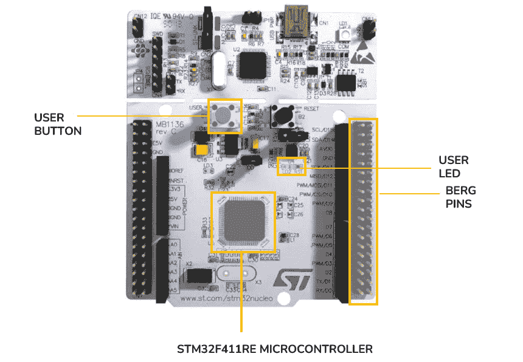
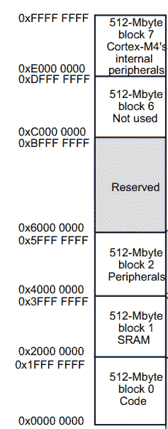

# 第二章：从内存地址构建外设寄存器

**裸机编程**完全是关于直接与微控制器中的寄存器工作，而不通过库，这使我们能够更深入地了解微控制器的功能和限制。这种方法使我们能够优化我们的固件以实现速度和效率，这两个参数在资源通常有限的嵌入式系统中非常重要。

在本章中，我们的旅程从探索各种固件开发方法开始，突出每种方法提供的不同抽象级别。然后我们继续学习如何识别我们开发板上关键组件相关的端口和引脚。这一步对于与微控制器外设建立适当的接口至关重要。

接下来，我们将深入探讨如何使用微控制器的官方文档定义一些外设的地址。这将使我们能够创建那些外设中各种寄存器的地址。

在本章的后半部分，我们的重点转向实际应用。我们将使用我们创建的寄存器地址来配置 PA5，以激活开发板的用户**发光二极管**（LED）。

在本章中，我们将涵盖以下主要主题：

+   不同类型的固件开发

+   定位和理解开发板组件

+   通过文档洞察定义和创建寄存器

+   寄存器操作 – 从配置到运行您的第一个固件

到本章结束时，你将在寄存器级别导航和编程 STM32 微控制器方面打下坚实的基础。你将准备好编写你的初始裸机固件，仅依靠从文档和**集成开发环境**（IDE）收集的信息。

# 技术要求

本章的所有代码示例都可以在 GitHub 上找到，网址为[`github.com/PacktPublishing/Bare-Metal-Embedded-C-Programming`](https://github.com/PacktPublishing/Bare-Metal-Embedded-C-Programming)。

# 不同类型的固件开发

根据微控制器制造商提供的资源，开发特定微控制器的固件有几种方法。当涉及到开发来自**意法半导体**（STMicroelectronics）的 STM32 微控制器的固件时，我们可以使用以下方法：

+   **硬件抽象层 (HAL)**：这是意法半导体提供的一个库。它通过提供配置微控制器每个方面的低级 API 来简化过程。HAL 的伟大之处在于其可移植性。我们可以为某个 STM32 微控制器编写代码，并轻松地将其适应到另一个微控制器，这得益于它们 API 的一致性。

+   **底层 (LL)**：同样来自意法半导体，LL 库是 HAL 的一个更精简的替代品，提供了一种更快、更专业导向的方法，更接近硬件。

+   **裸机 C 编程**：使用这种方法，我们直接进入硬件，使用 C 语言直接访问微控制器的寄存器。这更复杂，但提供了对微控制器工作原理的更深入理解。

+   **汇编语言**：这与裸机 C 类似，但不是使用 C 语言，而是使用汇编语言直接与微控制器的寄存器交互。

让我们比较一下我们讨论过的四种固件开发方法：HAL、LL、裸机 C 和汇编语言。每种方法都有其独特的风格和抽象级别，影响着我们与微控制器硬件的交互方式。我们将通过配置一个**通用输入/输出**（**GPIO**）引脚作为输出来说明这些差异。

## HAL

以下代码片段演示了如何使用 HAL 初始化 GPIOA 引脚 5 作为输出：

```cpp
#include "stm32f4xx_hal.h"
GPIO_InitTypeDef GPIO_InitStruct = {0};
// Enable the GPIOA Clock
__HAL_RCC_GPIOA_CLK_ENABLE();
// Configure the GPIO pin
GPIO_InitStruct.Pin = GPIO_PIN_5;
GPIO_InitStruct.Mode = GPIO_MODE_OUTPUT_PP;
HAL_GPIO_Init(GPIOA, &GPIO_InitStruct);
```

让我们分析这个片段：

+   `#include "stm32f4xx_hal.h":` 这行代码包含 STM32F4 系列的 HAL 库，提供对 HAL 函数和数据结构的访问

+   `GPIO_InitTypeDef GPIO_InitStruct = {0}:` 这里，我们声明并初始化一个`GPIO_InitTypeDef`结构体实例，该结构体用于配置 GPIO 引脚属性

+   `__HAL_RCC_GPIOA_CLK_ENABLE()`: 此宏调用启用 GPIO 端口 A 的时钟，确保 GPIO 外设供电并可以工作

+   `GPIO_InitStruct.Pin = GPIO_PIN_5:` 这行代码设置了要配置的引脚，在这种情况下，端口 A 的 5 号引脚

+   `GPIO_InitStruct.Mode = GPIO_MODE_OUTPUT_PP:` 在这里，我们将引脚配置为输出引脚

+   `HAL_GPIO_Init(GPIOA, &GPIO_InitStruct):` 最后，我们使用在`GPIO_InitStruct`中指定的配置设置初始化 GPIO 引脚（PA5）

此代码片段展示了 HAL 方法在执行常见硬件接口任务时的易用性和可读性。我们可以总结 HAL 方法的优缺点如下：

+   **抽象级别**：高

+   **易用性**：由于其高级抽象，对初学者来说更容易使用

+   **代码冗长性**：更冗长，对于简单任务需要多行代码

+   **可移植性**：在 STM32 设备之间表现优异

+   **性能**：由于额外的抽象层，略慢

## LL

这就是如何使用 LL 库初始化 GPIOA 引脚 5 作为输出引脚：

```cpp
#include "stm32f4xx_ll_bus.h"
#include "stm32f4xx_ll_gpio.h"
// Enable the GPIOA Clock
LL_AHB1_GRP1_EnableClock(LL_AHB1_GRP1_PERIPH_GPIOA);
// Configure the GPIO pin
LL_GPIO_SetPinMode(GPIOA,LL_GPIO_PIN_5,LL_GPIO_MODE_OUTPUT);
```

让我们逐行分析：

+   `#include "stm32f4xx_ll_bus.h"` 和 `#include "stm32f4xx_ll_gpio.h"` 包含处理总线系统和 GPIO 功能的必要 LL 库文件

+   `LL_AHB1_GRP1_EnableClock(LL_AHB1_GRP1_PERIPH_GPIOA):` 此函数调用启用 GPIO 端口 A 的时钟

+   `LL_GPIO_SetPinMode(GPIOA, LL_GPIO_PIN_5, LL_GPIO_MODE_OUTPUT):` 最后，我们将 GPIOA 引脚 5 的模式设置为输出模式

与 HAL 相比，LL 库提供了更直接、更低级的硬件交互方法。在需要更精细的硬件控制和性能的场景中，这通常更受欢迎。

LL 方法的优缺点如下：

+   **抽象级别**：中等

+   **易用性**：中等，在抽象和直接控制之间取得平衡

+   **代码冗余度**：比 HAL 更简洁，提供了更直接与硬件交互的方法

+   **可移植性**：良好，但略低于 HAL

+   **性能**：比 HAL 更快，因为它更接近硬件

## 裸机 C

让我们看看如何使用裸机 C 方法完成相同任务：

```cpp
#define GPIOA_MODER (*(volatile unsigned long *)(GPIOA_BASE + 0x00))
#define RCC_AHB1ENR (*(volatile unsigned long *)(RCC_BASE + 0x30))
// Enable clock for GPIOA
RCC_AHB1ENR |= (1 << 0);
// Set PA5 to output mode
GPIOA_MODER |= (1 << 10); // Set bit 10 (MODER5[1])
```

让我们分解裸机 C 代码片段：

+   `#define GPIOA_MODER (*(volatile unsigned long *) (GPIOA_BASE + 0x00))` 和 `#define RCC_AHB1ENR (*(volatile unsigned long *)(RCC_BASE + 0x30))` 定义了指向微控制器内存中特定寄存器的指针。`GPIOA_MODER`指向 GPIO 端口 A 模式寄存器，而`RCC_AHB1ENR`指向**重置和时钟控制**（**RCC**）AHB1 外设时钟**使能寄存器**（**ER**）。使用`volatile`关键字确保编译器将这些视为内存映射寄存器，防止与优化相关的问题。

+   `RCC_AHB1ENR |= (1 << 0)`: 这行代码启用 GPIOA 的时钟。它通过设置`RCC_AHB1ENR`寄存器的第一个位（位 0）来实现。位或赋值运算符（`|=`）确保只更改指定的位，而不会更改寄存器中的其他位。

+   `GPIOA_MODER |= (1 << 10)`: 这行代码将 PA5 设置为输出模式。在 GPIO 端口号模式寄存器（`GPIOA_MODER`）中，每个引脚由两个位控制。对于 PA5，这些是位 10 和 11（`MODER5[1:0]`）。代码将位 10 设置为`1`（并假设位 11 已经是`0`，将其保留为`0`），将 PA5 配置为通用输出模式。

使用这种方法，我们可以观察到提供的粒度和直接控制。通过直接操作微控制器的寄存器，它提供了非常高的效率和性能：

+   **抽象级别**：低

+   **易用性**：对于初学者来说具有挑战性，因为它需要深入了解硬件知识

+   **代码冗余度**：更简洁，直接

+   **可移植性**：有限，因为代码通常针对特定的硬件配置

+   **性能**：非常高，因为它允许直接和优化的硬件操作

## 汇编语言

最后，让我们分析配置 PA5 为输出引脚的汇编语言实现：

```cpp
EQU GPIOA_MODER, 0x40020000
EQU RCC_AHB1ENR, 0x40023800
; Enable clock for GPIOA
LDR R0, =RCC_AHB1ENR
LDR R1, [R0]
ORR R1, R1, #(1 << 0)
STR R1, [R0]
; Set PA5 as output
LDR R0, =GPIOA_MODER
LDR R1, [R0]
ORR R1, R1, #(1 << 10)
STR R1, [R0]
```

让我们分解一下：

+   `EQU GPIOA_MODER`, `0x40020000` 和 `EQU RCC_AHB1ENR`, `0x40023800` 定义了 GPIOA 模式寄存器（`GPIOA_MODER`）和 RCC AHB1 外设时钟 ER（`RCC_AHB1ENR`）的内存地址常量。`'EQU'`在汇编中用于将标签等同于值或地址。

其余的汇编指令执行两个主要任务：

+   启用 GPIOA 的时钟：

    +   `LDR R0, =RCC_AHB1ENR`: 将`RCC_AHB1ENR`寄存器的地址加载到`R0`寄存器

    +   `LDR R1, [R0]`: 将`RCC_AHB1ENR`寄存器的值加载到`R1`寄存器

    +   `ORR R1, R1, #(1 << 0)`: 执行位或操作以设置`R1`的位 0，打开 GPIOA 的时钟

    +   `STR R1, [R0]`：将更新后的值存储回`RCC_AHB1ENR`寄存器

+   将 PA5 设置为输出：

    +   `LDR R0, =GPIOA_MODER`：将`GPIOA_MODER`寄存器的地址加载到`R0`

    +   `LDR R1, [R0]`：将`GPIOA_MODER`寄存器的当前值加载到`R1`

    +   `ORR R1, R1, #(1 << 10)`：使用位或操作设置`R1`的第 10 位，将 PA5 配置为输出

    +   `STR R1, [R0]`：将更新后的值存储回`GPIOA_MODER`寄存器

汇编语言方法允许对微控制器进行极其详细和直接的控制。我们经常在需要高性能且每个硬件方面都需要精确管理的项目中使用这种方法。

汇编语言方法为我们提供了以下功能：

+   **抽象级别**：最低

+   **易用性**：最具挑战性，需要彻底了解微控制器架构

+   **代码冗长性**：对于复杂任务可能很冗长，因为它是低级的

+   **可移植性**：非常有限，因为它高度特定于微控制器架构

+   **性能**：最高，因为它允许进行最优化和直接的控制

以下图表显示了每种方法和其与微控制器架构的接近程度：


图 2.1：按与微控制器架构的接近程度排列的固件开发方法

现在我们已经探讨了 STM32 微控制器固件开发的多种方法，我们准备深入裸机 C 编程领域。

我们将开始我们的探索，了解开发板的主要组件是如何连接到板载微控制器的特定引脚的。这一初步步骤对于深入了解硬件布局并为详细编程任务做准备至关重要。

# 定位和理解开发板组件

在本节中，我们的重点是确定微控制器上连接到开发板用户 LED、用户按钮、berg 引脚和 Arduino 兼容引脚的具体端口和引脚。了解这些连接对于我们的编程任务至关重要。为了准确识别这些连接，我们将查阅*NUCLEO-F411* *用户手册*。



图 2.2：展示感兴趣组件的开发板

现在，让我们定位开发板上连接到用户 LED 的微控制器引脚。

## 定位 LED 连接

我们的第一步是通过目录导航找到专门介绍 LED 的部分。这可以通过快速定位手册中的**图 2.3**来实现。它显示了 LED 部分的页码，使我们能够直接跳转到该部分。

点击页码跳转到 LED 部分。


图 2.3：这是 NUCLEO-F411 用户手册目录的一部分，显示了 LED 部分的页码

在**LED**部分，我们发现用户 LED，标记为**User LD2**，连接到 ARDUINO®信号**D13**。这对应于 PA5 或 PB13 引脚，具体取决于我们板上的 STM32 目标。

由于板与 Arduino IDE 的兼容性，用户手册中使用了双重命名约定。在 Arduino 命名方案中，引脚被分类为模拟（以“A”开头）或数字（以“D”开头）。例如，数字引脚 3 表示为 D3。相反，标准 STM32 约定以“P”开头，后面跟着表示端口的字母，然后是该端口内的引脚编号，例如 PA5 表示 A 端口第 5 个引脚。

要确定我们的开发板上的引脚 D13 是板载微控制器的 PA5 还是 PB13，我们参考手册中的**表 11 至 23**。这些表格将每个开发板上的 ARDUINO®连接器引脚映射到标准 STM32 引脚。具体来说，我们查看显示**表 16**的**图 2**.5，它涉及我们的开发板型号。

通过点击如图**图 2**.4 所示的方式导航到**表 11**。此操作将带您进入表格序列中的第一个表格。然后，向下滚动直到到达**表 16**。


图 2.4：这是 NUCLEO-F411 用户手册的一部分，显示了用户 LED 的两个可能连接

在查看**表 16**后，我们发现 D13 确实对应于 PA5。这表明我们的 NUCLEO-F411RE 开发板上的用户 LED 连接到板载微控制器的 PA5 引脚。


图 2.5：表 16 显示 D13 对应 PA5

在开发板上发现的另一个有用组件是用户按钮。让我们找到这个组件的引脚连接。

## 定位用户按钮

开发板上的用户按钮是许多嵌入式实验中输入处理的重要组件，理解其与微控制器的连接对于有效的编程和交互至关重要。

要找到我们板上的用户按钮的连接细节，我们将通过目录导航到专门针对**按钮**的部分。

通过在手册中定位**图 2**.6，可以快速完成此操作。该图显示了**按钮**部分的页码，并允许我们通过点击页码直接跳转到该部分。


图 2.6：本部分 NUCLEO-F411 用户手册提供了按钮部分的页码

在导航到手册的*按钮*部分后，我们找到了关于我们的用户按钮**B1 User**的相关信息。手册告诉我们，这个按钮连接到板载微控制器的**PC13**引脚。

## 定位伯格引脚和 Arduino 兼容引脚

在*LEDs*部分，我们了解到我们的 NUCLEO-F411 开发板为其引脚提供了两种主要的命名系统：Arduino 命名系统和标准 STM32 命名系统。虽然裸机编程主要使用标准 STM32 命名，但板上的引脚标签是根据 Arduino 系统标注的。了解这些暴露引脚的实际端口名称和引脚编号非常重要，这样我们才能正确连接和编程外部组件，如传感器和执行器。

*图 2**.7*显示了带有伯格引脚高亮的我们的 NUCLEO-F411 开发板。


图 2.7：这是带有伯格引脚高亮的 NUCLEO-F411 开发板

开发板的 Arduino 引脚位于伯格引脚列的两侧。这在*图 2**.8*中被突出显示。


图 2.8：此 NUCLEO-F411 开发板带有 Arduino 引脚高亮

让我们先找到 Arduino 引脚的微控制器引脚连接。

### Arduino 兼容引脚

为了识别 Arduino 引脚的标准 STM32 名称，我们使用目录导航到标题为*ARDUINO®连接器*的部分。这引导我们到*表 11*，它提供了 Arduino 引脚到 STM32 引脚的映射。对于我们的特定 NUCLEO-F411 开发板，我们关注*表 16*，它为我们型号提供了相关的映射。

接下来，让我们定位伯格引脚的连接。

### 伯格引脚

与我们对其他组件的方法类似，为了找到伯格引脚的详细信息，我们再次查阅手册的目录，并定位到名为*扩展连接器*的部分。本节包括展示各种 NUCLEO 板引脚排布的图。然后我们滚动找到与我们特定 NUCLEO 型号对应的引脚排布。在这里，我们的开发板引脚排布以标准 STM32 命名系统呈现。

在这里，我们还发现手册将伯格引脚的列称为 ST morpho 连接器。这意味着每当使用*morpho 连接器*这个词时，它指的是这些公头伯格引脚。


图 2.9：NUCLEO-F411 开发板的引脚排布

在本节中，我们了解到 NUCLEO 开发板使用两种命名系统。首先，是 Arduino 命名系统，这在板上可以明显看到，其次，是详细说明在文档中的标准 STM32 命名系统。我们发现，标准 STM32 命名系统对我们的目的特别相关，因为它直接关联到板载微控制器的引脚名称。

下一节将指导我们如何访问和操作板载微控制器的相关内存位置。我们的重点将放在配置 PA5 引脚作为输出引脚上。这将使我们能够控制连接到 PA5 的 LED。

# 通过文档洞察定义和创建寄存器

在前一节中，我们确定用户 LED 连接到 PA5 引脚。这意味着它与 GPIO PORTA 的 5 号引脚相连。换句话说，要到达 LED，我们必须通过 PORTA，然后找到该端口的 5 号引脚。

如*图 2.10*所示，微控制器在四个侧面都暴露了引脚。这些引脚被组织成不同的组，称为**端口**。例如，PORTA 中的引脚用*PA*前缀表示，而 PORTB 中的引脚以*PB*开头，等等。这种系统性的安排使我们能够轻松识别和访问特定引脚，以便进行编程和硬件接口任务。


图 2.10：STM32F411 引脚图

在下一节中，我们将介绍定位 GPIO PORTA 精确地址的步骤。

## 定位 GPIO PORTA

为了有效地与微控制器的任何部分进行交互，了解该特定部分的内存地址是至关重要的。我们的下一步是探索微控制器的内存映射。通过这样做，我们可以逐步定位 GPIO PORTA 的地址。

由于我们的重点是板载微控制器而不是开发板，我们需要参考微控制器的数据手册，特别是`stm32f411re.pdf`文档。

让我们从导航到文档的目录开始。在那里，我们将找到一个名为*内存映射*的部分。点击相应的页码以跳转到该部分。

在这里，我们找到了一个全面的图表，展示了微控制器的整个内存映射。该图表的相关摘录在*图 2.11*中展示，显示了整体内存布局。



图 2.11：内存映射

内存映射显示，微控制器内部的所有内容都是从`0x0000 0000`到`0xFFFF FFFF`进行寻址的。我们感兴趣的部分是关于外设的部分，因为在那里我们找到了 GPIOA。

在微控制器语境中，外设指的是不是**中央处理单元**（**CPU**）的一部分，但连接到微控制器以扩展其功能的硬件组件。外设执行特定功能，可以包括以下广泛的组件：

+   **GPIO 端口**：这些用于与外部设备（如 LED、开关和传感器）接口。它们可以被编程为接收输入信号或发送输出信号。

+   **通信接口**：这些包括串行通信接口，如**通用异步收发传输器**（**UART**）、**串行外设接口**（**SPI**）和**集成电路间通信**（**I2C**），这些接口使微控制器能够与其他设备、传感器甚至其他微控制器通信。

+   **定时器和计数器**：定时器用于测量时间间隔或生成基于时间的事件，而计数器可用于计数事件或脉冲。

+   **模数转换器（ADCs）**：ADCs 将模拟信号（如来自温度传感器的信号）转换为微控制器可以处理的数字值。

这里提到的外设代表了在微控制器中常见的类型选择。随着我们进入后续章节，我们将更深入地探讨这些和其他外设。

在*图 12.11*中，内存映射显示所有微控制器外设的地址范围从`0x40000000`到`0x5FFFFFFF`。这意味着 GPIO PORTA 的地址位于这个指定的范围内。

外设基本地址 = 0x40000000

让我们记下外设地址的起始位置，我们将称之为`PERIPH_BASE`，表示外设的基本地址。我们将需要这个地址来计算 GPIO PORTA 的地址。`PERIPH_BASE` = `0x40000000`。

*图 12.12*显示了内存映射中外设部分的放大视图。在这里，我们观察到外设内存被划分为五个不同的块：APB1、APB2、AHB1、AHB2 和位于顶部的 Cortex-M 内部外设块。


图 2.12：外设内存映射

这些块，除了 Cortex-M 内部外设外，都是以它们所接口的总线系统命名的——即**高级外设总线**（**APB**）和**高级高性能总线**（**AHB**）：

+   **APB1 和 APB2**：这些总线为低带宽外设提供服务，为不需要高速数据传输的设备提供更有效的通信方式。

+   **AHB1 和 AHB2**：这些是为高速数据传输设计的，用于连接高带宽外设。它们使数据、控制和地址通信更快、更高效。

在数据表的第 54 页至第 56 页，我们找到了一个表格，列出了每个总线和相关外设的边界地址。该表格的一部分在*图 2.13*中显示，其中我们发现 GPIOA 被分配了一个从`0x40020000`到`0x4002 03FF`的边界地址，并且连接到 AHB1 总线。因此，这表明与 GPIO PORTA 相关的所有寄存器的地址都包含在这个地址范围内。


图 2.13：GPIOA 的边界地址和总线

GPIOA 基址 = PERIPH_BASE + 0x20000 = 0x40020000

从表格中，我们发现 GPIOA 边界地址的起始地址是`0x40020000`。这表明将`0x20000`的偏移量添加到`PERIPH_BASE`地址（即 0x40000000）将得到 GPIOA 的基址，计算为`0x40000000 + 0x20000 = 0x40020000`。术语“偏移值”指的是添加到基址以推导出特定地址的值。在这种情况下，从`PERIPH_BASE`地址到 GPIOA 的偏移值是`0x20000`。

理解偏移值的概念对于在微控制器编程中准确计算所需的地址至关重要。这种理解使得在系统内存映射中进行精确导航和操作成为可能。

## 时钟门控

确定了 GPIOA 的确切地址后，我们的下一步是在配置其寄存器之前启用对它的时钟访问。这一步是必要的，因为默认情况下，所有未使用的外设的时钟都是禁用的，以节省电力。

现代微控制器使用一种称为**时钟门控**的节能技术。简单来说，时钟门控涉及在微控制器不使用时，选择性地关闭其某些部分的时钟信号。时钟信号是微控制器操作的一个基本部分，它通过提供同步脉冲来驱动时序逻辑，从而同步微控制器电路的活动。然而，当微控制器的某个部分（如外设）未被积极使用时，该部分的时钟信号将被禁用。这种禁用可以防止空闲电路的不必要功耗。因此，在使用任何外设之前，首先需要启用对该外设的时钟访问。

如*图 2.14*所示，列出了一个名为 RCC 的外设，其边界地址范围从`0x40023800`到`0x40023BFF`。该外设的功能包括启用和禁用对其他外设的时钟访问。

RCC 基址地址 = PERIPH_BASE + 0x23800 = 0x40023800

从边界地址信息中，我们可以看到`RCC_Base`地址是通过将`PERIPH_BASE`的偏移量`0x23800`添加到`PERIPH_BASE`获得的。


图 2.14：RCC 的边界地址和总线

在成功确定配置 GPIOA 引脚 5（控制连接的 LED）所需的两个基本外设的基地址后，我们的下一步是使用这些基地址推导出设置引脚为输出并最终激活 LED 所需的特定寄存器地址。

要找到这些寄存器的详细信息，我们将参考参考手册（*RM0383*）。这份文档提供了关于所有寄存器和它们配置的全面见解。

## AHB1 ER

我们的参考手册，RM0383，是一本超过 800 页的综合性文档，一些 STM32 参考手册甚至超过 1500 页。目标不是从头到尾阅读整个手册，而是培养在需要时高效定位特定信息的能力。之前，我们确定了 GPIOA 连接到 AHB1 总线。我们还了解到，激活此外设需要通过 RCC 外设启用时钟访问。

我们微控制器中的 RCC 外设包括一个特定的寄存器，用于为每个总线启用时钟。在 STM32 微控制器中，寄存器的命名遵循一个简单的模式：*外设缩写 + 下划线 + 寄存器缩写*。例如，负责控制对 AHB1 总线时钟访问的寄存器命名为`RCC_AHB1ENR`。

让我们进一步解释：

+   **RCC**代表**复位和时钟控制**

+   **AHB1**代表**高级高性能总线 1**

+   **ENR**代表**使能寄存器**

这种系统性的命名约定简化了识别和访问适当寄存器的过程。

要查找关于`RCC_AHB1ENR`寄存器的信息，我们首先打开参考手册。接下来，我们导航到目录表并搜索标题为*“RCC AHB1 外设时钟使能寄存器 (RCC_AHB1ENR)”*的部分。一旦找到，我们点击该部分标题旁边提供的页码，直接跳转到文档的相关部分。

让我们从页面顶部展示的细节开始分析，如图*图 2.15*所示。本节提供了关于寄存器的关键信息，包括以下内容：

+   **寄存器名称**: 提供了寄存器的全名及其缩写，即**RCC AHB1 外设时钟使能寄存器**（**RCC_AHB1ENR**）。

+   `0x30`.

+   `0x00000000`，表示寄存器在复位时持有的值。换句话说，寄存器的默认值。

+   **访问类型**: 寄存器支持各种访问类型——它可以无等待状态地访问，并允许字、半字和字节访问。

+   **寄存器图**: 包含寄存器的详细图示，显示所有 32 位，并为每个位提供标签。


图 2.15: RCC AHB1 ER

RCC_AHB1ENR 地址 = RCC_BASE + 0x30 = 0x40023830

从这些信息中，我们可以准确地计算出 `RCC_AHB1ENR` 寄存器的地址。我们通过将 `RCC_AHB1ENR` 偏移量加到 `RCC_BASE` 地址上来完成此操作。公式如下：`RCC_BASE + RCC_AHB1ENR Offset = 0x40023800 + 0x30 =` `0x40023830`。

参考手册的同一部分还包括对寄存器中每个位的详细描述。我们特别关注名为 `'GPIOAEN'` 的位，它代表 `0`。在文档下一页的开始处，我们找到了对 `bit0` 的精确描述，如图 *图 2**.16* 所示。该描述解释说，将 `bit0` 设置为 `0` 禁用 GPIOA 时钟，而将其设置为 `1` 启用 GPIOA 时钟。


图 2.16：GPIOAEN 位

在理解了启用 GPIOA 时钟访问所需的步骤之后，我们下一节将重点介绍如何在寄存器中设置和清除位。

## 在寄存器中设置和清除位

在裸机编程中，操作寄存器中的单个位是一个基本操作。这种操作对于配置硬件设置、控制外围设备以及优化嵌入式系统的性能非常重要。让我们首先了解位和寄存器。

一个 `0` 或 `1`。另一方面，**寄存器**是微控制器中的小型存储位置，用于存储各种操作中的临时数据。寄存器通常是位集合（例如 8 位、16 位或 32 位寄存器），寄存器中的每个位都可以单独操作。在裸机编程中，最常用的两个位操作是设置位和清除位。

### 设置位

设置一个位意味着将其值更改为 `1`。我们经常使用这个来激活或启用微控制器中的特定功能。

`OR` 操作 (`|`) 用于设置一个位：

```cpp
register |= 1 << bit_position;
```

在这个操作中，`1` 被左移 `(<<)` 到 `bit_position`，然后与寄存器的当前值进行 `OR` 操作。左移操作创建一个二进制值，其中只有目标位是 `1`，其余都是 `0`。然后 `OR` 操作将寄存器中的目标位设置为 `1`，其余保持不变。

假设 `register` 初始持有 `0011`（二进制）值，我们想要设置第三个位（位位置 2，0 索引）。*位移后的值*将是 `0100`（二进制表示 `1 << 2`）。然后 `OR` 操作如下：

```cpp
0011: original register value
(0001 <<2) = 0100: bit-shifted value
0011
OR
0100
------
0111 (resulting value)
```

在这个例子中，原始寄存器值的*第一个*、*第二个*和*第四个*位保持其值，而第三个位的值被更改为 `1`。

让我们看看设置位的相反操作。

### 清除位

相反，清除一个位意味着将其值更改为 `0`，通常用于禁用功能。

使用 `AND` (`&`) 和 `NOT` (`~`) 操作来清除一个位：

```cpp
register &= ~(1 << bit_position);
```

在这里，`1` 被左移到 `bit_position`，然后应用位运算的位非操作以创建一个二进制数，其中所有位都是 `1`，除了目标位。与寄存器进行 `AND` 操作会清除目标位，而其他位保持不变。

假设 `register` 初始持有 `0111`（二进制）值，我们想要清除第三个位（位位置 2，0 索引）。*掩码的位移值* 将是 `0100`（二进制表示为 `1 << 2`）。为了清除位，我们使用位移值的位运算与位运算的位非操作。操作如下：

```cpp
0111: original register value
(0001 << 2) = 0100: bit-shifted value
~0100 = 1011: bitwise NOT of bit-shifted value
0111
AND
1011
----
0011 (resulting value)
```

在此操作中，寄存器的第三个位被清除（变为 `0`），而其他位保持其原始值。

让我们总结最后两节的关键点。首先，我们了解到要启用 GPIOA 的时钟访问，需要在 `RCC_AHB1ENR` 寄存器中设置 `bit0`。其次，我们探讨了如何使用位运算设置和清除寄存器中的位。接下来，在下一节中，我们将专注于将 GPIOA 引脚 5（PA5）配置为输出引脚。这一步对于激活连接到 PA5 的 LED 至关重要。这将使我们更接近激活连接到 PA5 的 LED。

## GPIO 端口模式寄存器（GPIOx_MODER）

STM32 微控制器中的**GPIO 端口模式寄存器**是一个专用寄存器，用于设置每个 GPIO 引脚的模式。为了定位有关此寄存器的信息，我们导航到参考手册的目录并查找标题为 *GPIO 端口模式寄存器 (GPIOx_MODER)* 的部分。通过点击关联的页码，我们直接跳转到该部分。

*图 2**.17* 展示了页面顶部部分。在这里，我们可以观察到以下细节：

+   `GPIOA_MODER` 通过 `GPIOE_MODER`，以及 `GPIOH_MODER`。这意味着这些 GPIO 端口具有相同的寄存器结构和配置。

+   `MODER` 寄存器位于端口内存空间的起始位置。因此，GPIOA `MODE` 寄存器地址与 GPIOA 基址相同。

+   `GPIOA_MODER` 寄存器是 `0xA800 0000`。此值表示 GPIOA 引脚在复位时的初始配置状态。

+   `GPIOB_MODER` 寄存器具有默认的复位值 `0x0000 0280`。

+   所有其他指定 GPIO 端口的 `MODER` 寄存器均为 `0x0000 0000`：

**GPIOA MODE 寄存器地址 = GPIOA_BASE =** **0x40020000**


图 2.17：GPIO 端口模式寄存器

我们还观察到这是一个 32 位寄存器，其位以成对的方式组织。例如，`bit0` 和 `bit1` 一起形成一个称为 `MODER0` 的对，`bit2` 和 `bit3` 形成称为 `MODER1` 的对，`bit4` 和 `bit5` 形成称为 `MODER2` 的对，以此类推。这些对中的每一个都对应于 GPIO 端口的单个引脚。具体来说，`MODER0` 控制相应端口的 `PIN0` 的配置，`MODER1` 控制 `PIN1`，其他引脚的模式也以类似的方式继续。

给定我们的目标是配置 `PIN5` 的模式，我们需要关注 `MODER5`。在寄存器中，`MODER5` 由 `bit10` 和 `bit11` 组成。这两个位是设置 `PIN5` 操作模式所需的位。

参考手册提供了一个真值表，如图 *2**.18* 所示，该表解释了配置引脚所需的两个 `MODER` 位组合。此表是理解如何设置位以实现所需的引脚配置（无论是作为输入、输出还是备用功能模式）的宝贵资源。


图 2.18：`MODER` 位配置

如 *图 2**.18* 所示，GPIO 端口的 `MODER` 寄存器由位对组成，标记为 `2y:2y+1 MODERy[1:0]`，其中 *y* 的范围从 0 到 15，代表端口中的每个 16 个引脚（`PIN0` 到 `PIN15`）。

在此方程中，*y* 代表引脚号。对于引脚 5，*y = 5*。将此值代入方程，我们得到 `MODER` 寄存器中对应引脚 5 的位位置：

`MODER5` 的位位置计算为 *2*y* 和 *(**2*y) +1*。

用 *y = 5* 替换，我们得到以下结果：

*2*5 = 10* 和 *2*5 + 1 = 11*，分别是 `10` 和 `11`。

因此，MODER 寄存器中的 `bits 10` 和 `11`（`MODER5[1:0]`）是控制引脚 5 模式的位。通过将这些位设置为特定的值（`00`、`01`、`10` 或 `11`），我们可以将引脚 5 配置为输入、通用输出、备用功能或模拟模式。

GPIO `MODER` 寄存器支持四种不同的位组合，每个组合定义了对应引脚的不同操作模式：

+   `00`: 当两个位都是 `0` 时，相应的引脚被设置为输入引脚。这是引脚从外部源接收数据的标准模式。

+   `01`: 将位设置为 `01` 将引脚功能设置为通用输出。在此模式下，引脚可以发送数据，例如点亮 LED。

+   `10`: `10` 状态配置引脚为备用功能。每个引脚可以提供特定的附加用途（例如 PWM 输出和 I2C 通信线路），并且此模式启用这些功能。

+   `11`: 当位设置为 `11` 时，引脚在模拟模式下运行。此模式通常用于 ADC，用于从模拟传感器读取值。

从这个例子中，我们了解到要配置 PA5 为输出，我们必须将 `GPIOA_MODER` 寄存器的第 10 位设置为 `0`，第 11 位设置为 `1`。

让我们总结一下激活连接到 PA5 的 LED 的进展：

+   将 `RCC_AHB1ENR` 寄存器的 `bit0` 设置为 `1`。这一步对于为 GPIOA 提供电是必不可少的。

+   **配置 PA5 为输出**：我们刚刚学习了如何将 PA5 设置为通用输出引脚。

这两个步骤有效地将 PA5 配置为输出引脚。最终的任务涉及控制引脚的输出状态——将其设置为`1`或`0`，分别对应开启或关闭。这相当于向 PA5 发送 3.3v 或 0v，从而打开或关闭连接的 LED。要管理引脚的输出状态，我们需要与**输出数据寄存器**（**ODR**）交互。定位和配置此寄存器将是下一节的重点。

到目前为止，我们关于激活连接到 PA5 的 LED 的查询有以下信息：

+   我们知道如何通过`RCC_AHB1ENR`寄存器启用 GPIOA 的时钟访问

+   我们知道如何将 GPIOA 的 PIN5 配置为通用输出引脚。

这两个步骤使 PA5 充当输出引脚。最后一步是能够设置引脚的输出状态。状态可以是`1`或`0`，对应开启或关闭，对应向 PA5 发送 3.3v 或 0v，最终对应于打开或关闭连接到 PA5 的 LED。要设置引脚的输出，我们需要访问 ODR；这将是下一节的重点。

## GPIO 端口输出数据寄存器（GPIOx_ODR）

在 STM32 微控制器中，GPIO 端口的**ODR**用于控制每个 GPIO 引脚的输出状态。要查找有关此寄存器的信息，我们参考微控制器参考手册的目录，并定位标题为*GPIO 端口输出数据寄存器（GPIOx_ODR）*的部分。点击此部分对应的页码将直接带我们到所需的信息。

*图 2.19*显示了页面顶部，我们可以观察到以下细节：

+   `GPIOA_ODR`通过`GPIOE_ODR`，以及`GPIOH_ODR`。这意味着这些 GPIO 端口具有相同的寄存器结构和配置。

+   从其相应 GPIO 端口的基地址的`0x14`。这意味着对于每个 GPIO 端口，ODR 寄存器都可以在这个偏移量处找到端口的基本内存地址。

+   在复位时为`0`。此默认状态确保所有 GPIO 引脚最初处于低输出状态。

GPIOA ODR 地址 = GPIOA_BASE + ODR_OFFSET = 0x40020014

`ODR_OFFSET =` `0x14`。


图 2.19：GPIO 端口 ODR

让我们深入了解位的结构：

+   **位 31:16（保留）**：这些位保留，不应用于任何操作。

+   从`0`到`15`，对应于 GPIO 端口中的每个 16 个引脚。它们可以直接编程，并且可以通过软件读取和写入。更改这些位的值会改变相应 GPIO 引脚的输出状态。

让我们考虑我们的最终任务——激活连接到 PA5 的 LED：

+   在`GPIOA_ODR`寄存器的位`5`上。

+   使用位运算`OR`操作，如下所示：

    ```cpp
    GPIOA_ODR |= 1 << 5;
    ```

在这个操作中，我们将 `1` 左移 5 位（结果是一个二进制值，其中只有第 6 位是 `1`），然后将其与 `GPIOA_ODR` 寄存器的当前值进行 `OR` 操作。这个动作将 PA5 设置为高电平，而不改变端口中其他引脚的状态。

将 PA5 设置为高电平将为连接的 LED 提供电压，从而将其点亮。

现在我们已经了解了如何设置 GPIO 输出引脚的状态，在下一节中，我们将结合我们所学到的所有信息来开发我们的第一个固件。

# 寄存器操作 – 从配置到运行第一个固件

在本节中，我们将应用本章学到的知识来开发我们的第一个裸机固件。

我们首先创建一个新项目，这个过程我们在 *第一章* 中已经介绍过。以下是步骤的总结：

1.  **开始一个新项目**：在你的 IDE 中，转到 **文件** | **新建** | **STM32 项目**。

1.  **选择目标微控制器**：将出现一个 **目标选择** 窗口，提示您为项目选择微控制器或开发板。

1.  **使用板选择器**：单击 **板** **选择器** 选项卡。

1.  在 **商业零件编号** 字段中填写 `NUCLEO-F411`。

1.  **选择我们的板**：从出现的板列表中选择 **NUCLEO-F411RE**，然后单击 **下一步**。

1.  `RegisterManipulation`。

1.  `空` 项目设置。

1.  **最后一步**：单击 **完成** 以创建项目。

一旦项目创建完成，打开项目工作区中的 `main.c` 文件。清除此文件中所有现有的文本，以便从干净的状态开始编写我们的代码。

为了更清晰地理解，我们将把我们的代码分为两个不同的部分。第一部分将命名为 `寄存器定义`，第二部分将命名为 `主函数`。

## Register Definitions

这段代码定义了用于内存地址和位掩码的常量和宏。以下是控制连接到 PA5 的 LED 所需的所有内存地址和位掩码：

```cpp
//  1: Define base address for peripherals
#define PERIPH_BASE        (0x40000000UL)
//  2: Offset for AHB1 peripheral bus
#define AHB1PERIPH_OFFSET  (0x00020000UL)
//  3: Base address for AHB1 peripherals
#define AHB1PERIPH_BASE    (PERIPH_BASE + AHB1PERIPH_OFFSET)
//  4: Offset for GPIOA
#define GPIOA_OFFSET       (0x0000UL)
//  5: Base address for GPIOA
#define GPIOA_BASE         (AHB1PERIPH_BASE + GPIOA_OFFSET)
//  6: Offset for RCC
#define RCC_OFFSET         (0x3800UL)
//  7: Base address for RCC
#define RCC_BASE           (AHB1PERIPH_BASE + RCC_OFFSET)
//  8: Offset for AHB1EN register
#define AHB1EN_R_OFFSET    (0x30UL)
//  9: Address of AHB1EN register
#define RCC_AHB1EN_R  (*(volatile unsigned int *)(RCC_BASE +  AHB1EN_R_OFFSET))
//  10: Offset for mode register
#define MODE_R_OFFSET      (0x00UL)
//  11: Address of GPIOA mode register
#define GPIOA_MODE_R  (*(volatile unsigned int *)(GPIOA_BASE + MODE_R_OFFSET))
//  12: Offset for output data register
#define OD_R_OFFSET   (0x14UL)
//  13: Address of GPIOA output data register
#define GPIOA_OD_R    (*(volatile unsigned int *)(GPIOA_BASE +  OD_R_OFFSET))
//  14: Bit mask for enabling GPIOA (bit 0)
#define GPIOAEN       (1U<<0)
//  15: Bit mask for GPIOA pin 5
#define PIN5          (1U<<5)
//  16: Alias for PIN5 representing LED pin
UL suffix at the end of each hexadecimal value as well as the use of keywords such as volatile. Let’s delve into the significance of these in the context of C and C++ programming.
			The UL suffix
			When we see a number in the code ending with `UL`, it’s more than just a part of the number – it’s a clear instruction to the compiler about the type and size of the number:

				*   `U` in `UL` indicates that the number is unsigned. In other words, it’s a positive number with no sign to indicate it could be negative. This designation allows the number to represent a wider range of positive values compared to a signed integer of the same size.
				*   `L` signifies that the number is a long integer. This is important because the size of a long integer can vary based on the system and the compiler. Typically, a long integer is larger than a regular int – often 32 bits, but sometimes 64 bits on certain systems.

			The `UL` suffix collectively ensures that these values are treated as unsigned long integers. This is important for firmware development and other forms of low-level programming, where the exact size and “signedness” of an integer can significantly impact program behavior and memory management. Using `UL` leads to more predictable, platform-independent code, ensuring that the values behave consistently across different compilers and systems.
			The use of “(*(volatile unsigned int *)”
			In the context of bare-metal programming, particularly in our current code snippet, we notice that the address of each register is prefixed with `"(*(volatile unsigned` `int *)".`
			Let’s break down what each part of this notation means and why it’s used:

				*   `(unsigned int *)` expression is a **type cast**. It tells the compiler to treat the subsequent address as a pointer to an unsigned integer. In C and C++, pointers are variables that store the memory address of another variable. In the context of our firmware, this casting means that we are directing the compiler to treat a certain address as the location of an unsigned integer. However, this unsigned integer is not just any number; it corresponds directly to the state of a 32-bit hardware register. Each bit in this 32-bit integer mirrors a specific bit in the register, thereby allowing direct control and monitoring of the hardware’s state through standard programming constructs.
				*   `*`) in `*(unsigned int *)` is used to dereference the pointer. Dereferencing a pointer means accessing the value stored at the memory address the pointer is pointing to. Essentially, it’s not just about knowing where the data is (the address); it’s about actually accessing and using that data.
				*   `volatile`: The `volatile` keyword tells the compiler that the value at the pointer can change at any time, without any action being taken by the code. This is often the case with hardware registers, where the value can change due to hardware events, external inputs, or other aspects of the system outside the program’s control.

			Without `volatile`, the compiler might optimize out certain reads and writes to these addresses under the assumption that the values don’t change unexpectedly. This is because when a compiler processes code, it looks for ways to make the program run more efficiently. This includes removing redundant operations or simplifying code paths. This process occurs during the compilation of the program before it’s run. If the compiler determines that a variable (including a memory-mapped hardware register) doesn’t change its value, it might optimize the code by eliminating repeated reads from or writes to that variable. For example, if a value is read from a register and then read again later, the compiler might assume the value hasn’t changed and use the previously read value instead of accessing the register a second time. The use of `volatile` is a directive to tell the compiler not to apply certain optimizations to accesses of the marked variable, maintaining the integrity of operations.
			In our code snippet, we encounter two additional terms that are very common in bare-metal programming: **bit mask** and **alias**. Let’s take a closer look at each of these concepts to gain a clearer understanding of the roles they play:

				*   `AND`, `OR`, `XOR`) along with the mask to achieve the desired result. For example, a bit mask might be used to turn on a specific LED connected to a microcontroller pin without altering the state of other pins. A bit mask is created by setting the bits we want to manipulate to `1` while keeping others at `0`. This mask is then combined with the register value using the appropriate bitwise operation.

    For example, a `0b00000100` mask used with `OR` will set the third bit of the target register.

				*   `LED_PIN` makes the code self-explanatory. We define aliases using preprocessor directives such as `#define` in C or C++. For example, `#define LED_PIN (1U<<5)` creates an `LED_PIN` alias for the bit mask that represents the sixth pin (zero indexing) in a GPIO port ODR.

			Now, let’s analyze the second section of the code.
			Main Function
			This section of our code outlines the primary operations for controlling the LED connected to PA5 of the microcontroller:

```

// 行 17：main 函数开始

int main(void)

{

// 18：启用对 GPIOA 的时钟访问

RCC_AHB1EN_R |= GPIOAEN;

GPIOA_MODE_R |= (1U<<10);  // 19：将位 10 设置为 1

GPIOA_MODE_R &= ~(1U<<11); // 20：将位 11 设置为 0

// 21：无限循环开始

while(1)

{

// 22：将 PA5(LED_PIN) 设置为高

GPIOA_OD_R |= LED_PIN;

}  // 23：无限循环结束

}  // 24：main 函数结束

```cpp

			Let’s break down each part of the code for a clearer understanding:

				*   *Line 17*: This marks the beginning of the main function. This is the entry point of our program where the execution starts:

    ```

    // 17：main 函数开始

    int main(void)

    {

    ```cpp

    				*   *Line 18*: This enables the clock for `GPIOA`. As we learned earlier, the `RCC_AHB1EN_R` register controls the clock to the `AHB1` bus peripherals. The `|= GPIOAEN` operation sets the bit associated with GPIOA (GPIOAEN) in the `RCC_AHB1EN_R` register, ensuring that the GPIOA peripheral has the necessary clock enabled for its operations:

    ```

    // 18：启用对 GPIOA 的时钟访问

    RCC_AHB1EN_R |= GPIOAEN;

    ```cpp

    				*   *Line 19–20*: These lines configure `PA5` as an output pin. Setting bit 10 to `1` and bit 11 to `0` in `GPIOA_MODE_R` configures `PA5` in general-purpose output mode:

    ```

    GPIOA_MODE_R |= (1U<<10);  // 行 19：将位 10 设置为 1

    GPIOA_MODE_R &= ~(1U<<11); // 行 20：将位 11 设置为 0

    ```cpp

    				*   *Line 21–23*: These lines initiate an infinite loop, which is a common practice in embedded systems for continuous operation:

    ```

    // 21：无限循环开始

    while(1)

    {

    // 22：将 PA5(LED_PIN) 设置为高

    GPIOA_OD_R |= LED_PIN;

    }  // 行 23：无限循环结束

    ```cpp

    This is what is inside this loop:

    *   *Line 22*: This line sets PA5 high. This is achieved by setting the respective bit in `GPIOA_OD_R`. The `|= LED_PIN` operation ensures that PA5 outputs a high signal (essentially turning the LED on).
    *   *Line 24*: This marks the end of the main function:

        ```

        }  // 24：main 函数结束

        ```cpp

			Now that we have a clear understanding of each line of the code, let’s proceed to enter the entire code into the `main.c` file. Additionally, for your convenience, this complete source code is available in the GitHub repository for the book. You can find it in the folder titled `Chapter2`.
			This is the entire code:

```

// 1：定义外设的基址

#define PERIPH_BASE        (0x40000000UL)

// 2：AHB1 外设总线偏移量

#define AHB1PERIPH_OFFSET  (0x00020000UL)

// 3：AHB1 外设的基址

#define AHB1PERIPH_BASE    (PERIPH_BASE + AHB1PERIPH_OFFSET)

//  4: GPIOA 的偏移量

#define GPIOA_OFFSET       (0x0000UL)

//  5: GPIOA 的基址

#define GPIOA_BASE         (AHB1PERIPH_BASE + GPIOA_OFFSET)

//  6: RCC 的偏移量

#define RCC_OFFSET         (0x3800UL)

//  7: RCC 的基址

#define RCC_BASE           (AHB1PERIPH_BASE + RCC_OFFSET)

//  8: AHB1EN 寄存器的偏移量

#define AHB1EN_R_OFFSET    (0x30UL)

//  9: AHB1EN 寄存器的地址

#define RCC_AHB1EN_R  (*(volatile unsigned int *)(RCC_BASE +  AHB1EN_R_OFFSET))

//  10: 模式寄存器的偏移量

#define MODE_R_OFFSET      (0x00UL)

//  11: GPIOA 模式寄存器的地址

#define GPIOA_MODE_R  (*(volatile unsigned int *)(GPIOA_BASE + MODE_R_OFFSET))

//  12: 输出数据寄存器的偏移量

#define OD_R_OFFSET   (0x14UL)

//  13: GPIOA 输出数据寄存器的地址

#define GPIOA_OD_R    (*(volatile unsigned int *)(GPIOA_BASE +  OD_R_OFFSET))

//  14: 使能 GPIOA 的位掩码（位 0）

#define GPIOAEN       (1U<<0)

//  15: GPIOA 引脚 5 的位掩码

#define PIN5          (1U<<5)

//  16: 代表 LED 引脚的 PIN5 的别名

#define LED_PIN       PIN5

//  17: 主函数开始

int main(void)

{

//  18: 使能 GPIOA 的时钟访问

RCC_AHB1EN_R |= GPIOAEN;

GPIOA_MODE_R |= (1U<<10);  //  19: 将位 10 设置为 1

GPIOA_MODE_R &= ~(1U<<11); //  20: 将位 11 设置为 0

//  21: 无限循环开始

while(1)

{

//  22: 将 PA5(LED_PIN)置高

GPIOA_OD_R |= LED_PIN;

}  //  23: 无限循环结束

}  //  24: 主函数结束

```cpp

			To build the project, first select it by clicking on the project name once, and then initiate the build process by clicking on the *build* icon, represented by a hammer symbol, in the IDE.
			

			Figure 2.20: The build and run icons
			Once the build process is complete, the next step involves uploading the program to the microcontroller. To do this, we make sure the project is selected in the IDE, and then initiate the upload by clicking on the *run* icon, represented by a play symbol.
			The first time you run the program, the IDE may prompt you to edit or confirm the launch configurations. A dialog box titled **Edit Configurations** will appear. It’s sufficient to accept the default settings by clicking **OK**. *Figure 2**.21* shows the **Edit Configuration** dialog box.
			

			Figure 2.21: The Edit Configuration dialog box
			Following this confirmation, the IDE will commence the process of uploading your program to the microcontroller. When the upload is complete, you should see the green LED on the development board light up. This indicates that our bare-metal code is functioning as intended and successfully controlling the hardware.
			We have now mastered configuring PA5 to control the LED, starting from the very basics of consulting the documentation for accurate addresses, effectively typecasting these addresses for register access, and creating aliases for specific bits within the registers.
			Summary
			In this chapter, we delved into the core of bare-metal programming, emphasizing the direct interaction with microcontroller registers. This gave us insight into some of the key registers of our microcontroller and the structure of those registers.
			We began by exploring various firmware development approaches, each offering a distinct level of abstraction. These approaches included the HAL, LL, Bare-Metal C programming, and the assembly language. This exploration helped us understand the trade-offs and applications of each approach in firmware development.
			We spent a significant part of the chapter defining addresses of some peripherals using the official documentation. This step was important in creating addresses for various registers within those peripherals. It involved gathering specific memory addresses, typecasting them for register access, and creating aliases for bits in the registers.
			The chapter culminated in a practical application where we configured PA5 to control the User LED on the development board. This exercise integrated the concepts discussed throughout the chapter, showcasing how theoretical knowledge can be applied in real-world firmware programming.
			In the upcoming chapter, we will delve into the build process. This exploration will allow us to understand the sequential stages that our source code undergoes to become an executable program capable of running on our microcontroller.

```
