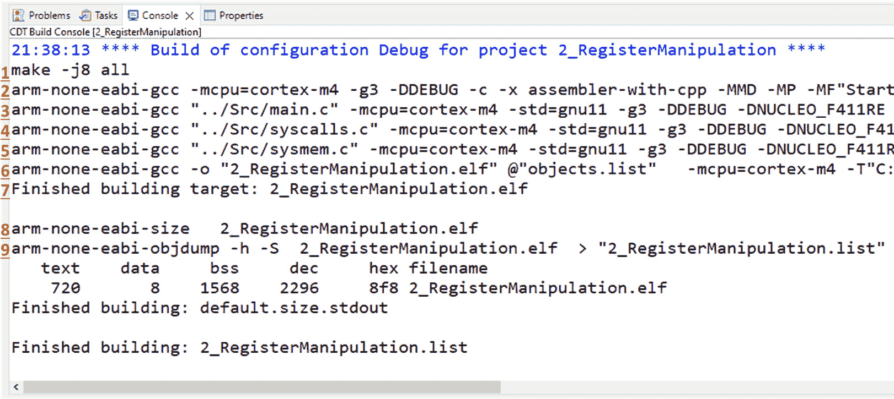
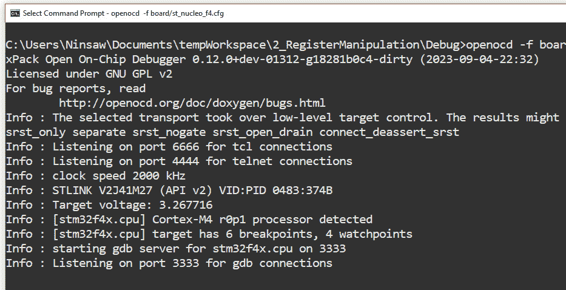
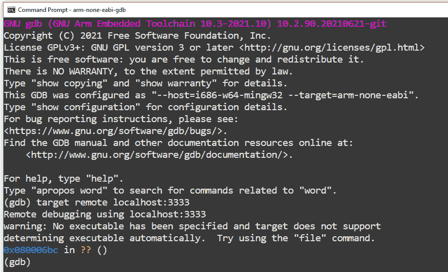

# 第三章：理解构建过程和探索 GNU 工具链

原地编程是一项深入理解和精确的旅程，在本章中，我们将探索嵌入式固件构建过程的复杂领域。我们的重点是 GNU Arm 工具链，它是固件开发中的一个重要元素。通过理论与实践相结合的编程练习，你将深入了解集成开发环境（**IDEs**）如何简化构建过程，以及如何使用 GNU Arm 工具链手动复制这些过程。

随着章节的深入，我们将探讨编译器的细微差别及其针对 Arm Cortex 微控制器的各种选项。本章的编程练习旨在帮助你理解和有效利用 GNU 工具，从编译和链接到分析输出目标文件的深度。

本章将涵盖以下主要内容：

+   基础——理解嵌入式构建过程

+   嵌入式系统的 GNU 二进制工具之旅

+   从 IDE 到命令行——观察构建过程展开

到本章结束时，你将理解嵌入式固件构建过程，并掌握在 IDE 和命令行界面之间流畅切换的技能，这将增强你作为固件开发者的多面性。

# 技术要求

本章的所有代码示例都可以在 GitHub 上找到，链接为 [`github.com/PacktPublishing/Bare-Metal-Embedded-C-Programming`](https://github.com/PacktPublishing/Bare-Metal-Embedded-C-Programming)。

# 基础——理解嵌入式构建过程

从嵌入式固件开发中的高级源代码到可执行二进制映像的旅程复杂且层次繁多。这个过程通常被称为固件构建过程，涉及几个关键阶段——预处理、编译、汇编、链接和定位。这些阶段中的每一个都在将人类可读代码转换为机器可执行指令中扮演着重要角色。*图 3.1* 展示了整个构建过程以及每个阶段涉及的工具。


图 3.1：构建过程，详细说明了每个阶段的输入和输出文件以及使用的特定工具

让我们检查各个阶段。

## 预处理阶段

预处理是固件构建过程的初始阶段。在这个阶段，源代码经过一系列转换，以便为编译做准备。通常，嵌入式系统中的源文件是用 C 语言编写的（`.c` 文件），并伴随头文件（`.h` 文件）。预处理程序是构建过程中的专用工具，其任务是处理这些输入文件。

在预处理阶段，预处理程序执行几个关键操作：

+   **去除注释**：注释对于人类可读性至关重要，但对于机器来说无关紧要，因此从代码中移除。

+   `#` 符号，称为预处理器指令，被处理。这些指令通常包括宏定义（`#define`）、条件编译指令（`#ifdef`、`#ifndef`、`#endif`）和文件包含命令（`#include`）。预处理器将这些指令替换为其定义的值或相应的代码段。

+   `.i` 扩展名。这些文件代表经过转换的源代码，去除了注释，并且所有指令都已评估。

下一个阶段是编译阶段。

## 编译阶段

编译过程在预处理之后立即开始。编译器的角色是将 `.i` 文件转换为特定架构的汇编代码。在这个阶段，`C` 语言的高级结构被翻译成目标处理器架构所能理解的更低级、更细粒度的汇编指令。

这个阶段包括以下内容：

+   `.i` 文件

+   **过程**：编译器分析代码结构，优化性能和空间，并将其翻译成汇编语言。

+   `.s` 扩展名

下一个阶段使用 `.s` 文件。

## 汇编阶段

汇编是将包含汇编代码的 `.s` 文件转换为机器代码的阶段，以**目标文件**的形式。这个阶段将可读的汇编指令转换为二进制格式。

这个阶段包括以下内容：

+   （`.s` 文件）。

+   **过程**：汇编器解释每条汇编指令并将其转换为相应的机器代码。

+   `.o` 扩展名。这些文件包含二进制代码，并准备好进入链接的下一阶段。

## 链接阶段

链接是将所有单个目标文件组合成一个完整程序的阶段。这个阶段还整合了任何必要的标准库文件，并解决不同代码模块之间的引用。

这个阶段包括以下内容：

+   （`.o` 文件）和 C 标准库文件。

+   **过程**：链接器将所有目标文件缝合在一起，解决符号引用和地址。它处理诸如变量和函数的内存分配等任务。

+   **输出**：链接器生成一个**可重定位文件**，内容全面但还不是最终的可执行代码。

可重定位文件是固件构建过程中的中间输出，在链接阶段创建。它是一个综合文件，结合了所有单个目标文件（`.o`）和必要的库。然而，它还不是最终的执行文件。**重定位**的概念在这里起着重要作用。重定位涉及调整可重定位文件中的符号地址到实际的、特定的内存位置。这个过程确保当固件在目标设备上运行时，代码和数据部分的每个部分都正确地放置在内存中。可重定位文件包含固件的所有必要组件，但地址仍然是“相对的”——它们需要在定位阶段进一步调整以适应目标微控制器的独特内存映射，从而创建最终的执行文件。

下一个阶段是我们最终获得可执行代码的阶段。

## 定位阶段

这是最后一个阶段；它涉及将可重定位文件转换为最终的执行二进制文件。这个阶段由链接脚本指导，它提供了有关目标设备内存布局的必要信息。

这个阶段包括以下内容：

+   **输入**：一个可重定位文件和一个链接脚本。

+   **过程**：定位器使用链接脚本将代码和数据部分放置到指定的内存位置。它调整地址和偏移量以适应目标内存映射。

+   **输出**：一个可执行的二进制文件，通常以**可执行和链接格式**（**ELF**）或纯二进制格式。

拥有这些知识，我们已准备好深入探讨 GNU Toolchain for Arm。我们的目标是有效地利用工具链中的特定工具来执行构建过程的各个阶段。这将是下一节的重点。

# GNU 嵌入式系统二进制工具之旅

在本节中，我们将深入了解 GNU Bin 工具，这是一套随 GNU Toolchain for Arm 安装而来的工具。这些工具（命令）对于固件构建过程的各个阶段以及如调试等额外任务都是必不可少的。

我们将要探索的第一个命令是`arm-none-eabi-gcc`。

## arm-none-eabi-gcc

让我们分解命令的各个部分：

+   `arm`：这指定了目标架构。

+   `none`：这个组件表示代码正在编译的操作系统。在这里，`none`表示代码是为裸机环境设计的，这意味着它将直接在硬件上运行，而不需要底层操作系统。

+   `eabi`：这代表**嵌入式应用程序二进制接口**。EABI 定义了系统和用户程序、库等的二进制布局标准。它确保编译的代码将在遵循 EABI 标准的任何 Arm 处理器上正确运行。

+   `gcc`：这是**GNU** **编译器集合**的缩写。

此单个命令一次编译、汇编和链接我们的输入代码。要使用它，请在命令提示符或终端中输入 `arm-none-eabi-gcc`，然后是源文件，然后是 `-o`，以及所需的输出文件名。

见 *图 3**.2* 的示例：


图 3.2：arm-none-eabi-gcc 命令的用法

在此示例中，我们指定源文件为 `main.c`，输出文件为 `main.o`。

## 一些常见的编译器标志

由于我们刚刚介绍了 `-o` 编译器标志，让我们借此机会介绍一些其他常用的编译器标志。这些编译器标志用于修改命令行为以及向命令添加选项：

+   `-c`: 此标志用于编译和汇编但不进行链接。当添加到命令中时，它将代码处理到汇编阶段，但在链接之前停止。

+   `-o file`: 如前所述，此选项指定输出文件的名称。

+   `-g`: 在可执行文件中生成调试信息。

+   `-Wall`: 启用所有警告消息，帮助我们识别代码中的潜在问题。

+   `-Werror`: 将所有警告视为错误，确保代码质量和稳定性。

+   `-I [DIR]`: 包含一个指定的目录以搜索头文件；这对于组织大型项目很有用。

+   `-ansi` 和 `-std=STANDARD`: 这些标志指定应使用 C 语言的哪个标准版本。

+   `-v`: 从 GCC 提供详细输出，给我们关于编译过程的详细信息。

*表 3.1* 提供了标志的总结以及每个标志的示例用法。

| **标志** | **用途** | **示例用法** |
| --- | --- | --- |
| `-c` | 编译和汇编但不链接 | `arm-none-eabi-gcc -``c source_file` |
| `-``o file` | 链接到输出文件，文件名为 file | `arm-none-eabi-gcc source_file -``o output_file` |
| `-g` | 在可执行文件中生成调试信息 | `arm-none-eabi-gcc -``g source_file` |
| `-``Wall` | 启用所有警告消息 | `arm-none-eabi-gcc -``Wall source_file` |
| `-``Werror` | 将警告视为错误 | `arm-none-eabi-gcc -``Werror source_file` |
| `-``I [DIR]` | 包含用于头文件的目录 | `arm-none-eabi-gcc -I` `directory_path source_file` |
| `-``ansi` | 使用美国国家标准协会（**ANSI**）标准 | `arm-none-eabi-gcc -``ansi source_file` |
| `-``std` | 指定标准版本（例如，C11） | `arm-none-eabi-gcc -``std=c11 source_file` |
| `-v` | GCC 的详细输出 | `arm-none-eabi-gcc -``v source_file` |

表 3.1：一些编译器标志及其示例用法

## 一些特定架构的标志

除了通用编译器标志之外，还有一些针对特定架构的标志，这些标志可以精确配置各种处理器架构。这些标志对于针对特定 ARM 处理器和它们各自的架构定制构建过程至关重要。让我们深入了解一些最常用的特定架构标志：

+   `-mcpu=[NAME]`: 指定目标 ARM 处理器。使用此选项将配置编译器以针对特定处理器优化代码。

+   `march=[NAME]`: 指定目标 ARM 架构。它配置编译器以针对特定的 ARM 架构版本。

+   `-mtune=[NAME]`: 与 `-mcpu` 类似，此选项指定了优化目的的目标 ARM 处理器。

+   `-thumb`: 配置编译器以生成适用于 Thumb 指令集的代码，这是标准 ARM 指令集的压缩版本，提供了更高的代码密度和效率。

+   `-marm`: 指示编译器生成适用于 ARM 指令集的代码。

+   `-mlittle-endian`/`-mbig-endian`: 这些选项指定了生成的代码的端序。小端序是 ARM 处理器中最常见的格式。

让我们看看涉及一些这些标志的示例：


图 3.3：使用一些架构特定标志的 arm-none-eabi-gcc 命令

在此示例中，我们说以下内容：

+   `-c`: 编译和汇编但不链接

+   `-mcpu=cortex-m4`: 为 Cortex-M4 处理器构建

+   `-mthumb`: 使用 Thumb 指令集

+   `-o main.o`: 将编译文件输出为 `main.o`

*表 3.2* 提供了架构特定标志及其每个标志的示例用法总结。

| **标志** | **用途** | **示例用法** |
| --- | --- | --- |
| `-mcpu=[NAME]` | 指定目标 ARM 处理器 | `-mcpu=cortex-m4` |
| `-march=[NAME]` | 指定目标 ARM 架构 | `-march=armv7-m` |
| `-mtune=[NAME]` | 为特定 ARM 处理器优化 | `-mtune=cortex-m4` |
| `-mthumb` | 生成适用于 Thumb 指令集的代码 | `-mthumb` |
| `-marm` | 生成适用于 ARM 指令集的代码 | `-marm` |
| `-mlittle-endian` | 生成适用于小端序模式的代码 | `-mlittle-endian` |
| `-mbig-endian` | 生成适用于大端序模式的代码 | `-mbig-endian` |

表 3.2：一些架构特定编译器标志及其示例用法

## Arm GNU 工具链中的其他命令

除了 `arm-none-eabi-gcc` 命令之外，还有一些我们在使用 GNU 工具链构建 Arm 时会经常使用的其他重要命令。让我们来检查一些这些命令：

+   `arm-none-eabi-nm`: `arm-none-eabi-nm` 命令是一个方便的工具，用于列出对象文件中的符号。在此上下文中，符号指的是程序中的各种标识符，例如函数名、变量名和常量。这个工具对于检查编译文件的内容非常有价值，它为我们提供了关于程序结构和组件的见解。这对于调试目的尤其有用。

+   `arm-none-eabi-size`：在嵌入式固件开发中，由于内存资源通常有限，了解代码不同部分占用的内存大小至关重要。此工具提供了关于代码各个部分消耗多少内存的宝贵见解，使我们能够就优化和内存管理做出明智的决定。

+   `arm-none-eabi-objdump`：此工具用于从对象文件中提取和显示详细信息。它提供了对机器指令的深入了解，使其成为彻底分析对象文件的无价资源。这包括代码反汇编、展示部分标题和揭示符号表等功能。当我们需要深入了解编译代码的复杂细节时，其效用变得至关重要，它提供了关于文件结构、内容和操作机制的解释。这有助于我们调试和优化代码。

    反汇编代码是指将机器代码（一组计算机处理器可以直接执行的二进制指令）转换回汇编语言的过程。汇编语言是一种更易于人类阅读的指令形式，尽管与 C 语言相比，它仍然相当低级。*图 3**.4*展示了 C 语言代码、其对应的汇编语言翻译以及生成的机器代码的比较。


图 3.4：C 语言代码、其对应的汇编语言代码以及生成的机器代码

+   `arm-none-eabi-readelf`：此工具提供了关于输出 ELF 文件的详细信息，包括部分标题、程序标题和符号表。当我们处理 ELF 文件时，它非常有用，因为它提供了关于可执行文件结构以及如何在系统上运行的见解。

+   `: arm-none-eabi-objcopy`：我们使用此工具将对象文件从一种格式转换为另一种格式，或者制作对象文件的副本。

*表 3.3*提供了这些附加工具的总结以及每个工具的示例用法。

| **工具** | **功能** | **示例用法** |
| --- | --- | --- |
| `arm-none-eabi-nm` | 列出对象文件中的符号 | `arm-none-eabi-nm [对象文件]` |
| `arm-none-eabi-size` | 列出对象/可执行文件的部分大小 | `arm-none-eabi-size [文件]` |
| `arm-none-eabi-objdump` | 输出对象文件的信息 | `arm-none-eabi-objdump [选项] [对象文件]` |
| `arm-none-eabi-readelf` | 显示 ELF 文件的信息 | `arm-none-eabi-readelf [选项] [ELF 文件]` |
| `arm-none-eabi-objcopy` | 在格式之间转换/复制对象文件 | `arm-none-eabi-objcopy [选项] [输入文件] [输出文件]` |

表 3.3：GNU 工具链中一些常见的 Arm 命令及其示例用法

在本节中，我们探讨了嵌入式固件开发中必不可少的 GNU 二进制工具。这些工具，包括 `arm-none-eabi-gcc` 等命令，在固件构建过程的各个阶段发挥着重要作用，对于编译、链接和调试等任务来说是无价的。下一节将进一步扩展我们对这些工具的理解；我们将深入研究它们的应用，展示它们在嵌入式固件构建过程中的实用性。

# 从 IDE 到命令行 - 观察构建过程展开

在本节中，我们的目标是了解 IDE 内部的编译器在启动构建时如何处理我们的代码。此外，我们还将深入研究上一节中讨论的一些 GNU 二进制工具的实际应用。

## 从 IDE 视角观察构建过程

让我们从回顾上一章中开发的裸机 GPIO 驱动程序开始。

首先，启动您的 STM32CubeIDE。为了正确分析 IDE 执行的构建命令，有必要首先清理项目然后再次构建。原因很简单 - 我们已经在上一章中构建了项目。从那时起，源代码没有进行任何修改，新的构建尝试将跳过我们旨在仔细审查的详细命令执行，因为源代码没有变化。

让我们清理项目：

1.  在**项目**面板中定位项目。

1.  右键单击项目名称。

1.  将会弹出一个菜单。从该菜单中选择**清理项目**选项。

1.  IDE 现在将清除项目中的任何已编译数据。此操作将项目的构建状态重置为其初始状态，删除任何以前的构建结果。

现在，让我们再次构建它：

1.  再次在**项目**面板中同一项目的名称上单击鼠标右键。

1.  再次弹出一个菜单。这次，选择**构建项目**选项。

1.  选择此选项后，IDE 将开始从头开始构建项目的进程。

要在 STM32CubeIDE 中观察构建命令，我们必须找到**控制台**面板，它通常位于 IDE 界面的底部区域。**控制台**面板是一个重要的组件，它显示各种操作的实时输出和日志，包括构建过程。这使得它成为监控编译过程中进行的命令和动作的宝贵工具。

如果在当前 IDE 布局中**控制台**面板不可见，您可以通过位于 IDE 顶部的菜单栏访问它。只需点击**窗口**菜单，即可显示一个选项的下拉列表。从那里，导航到**显示视图**，这将展开以显示更多选项。在这些选项中，选择**控制台**，以便在您的工区内查看该面板。

一旦你有了 `2_RegisterManipulation` 硬件裸机 GPIO 驱动项目。*图 3*.5 显示了 `2_RegisterManipulation` 硬件裸机 GPIO 驱动项目的一些内容：



图 3.5：构建 2_RegisterManipulation 硬件裸机 GPIO 驱动项目后的控制台面板。

*图 3*.5 提供了构建过程步骤的快照，尽管它只显示了每个步骤的一个片段。要全面了解所有步骤，包括完整的命令行和响应，你应该参考你的 STM32CubeIDE 中的 **控制台** 面板。

让我们根据行号分析 *图 3*.5 中的控制台面板。

## 汇编和 C 文件的编译

**行 (1)**

`make -j8 all`：这是一个对 `make` 构建自动化工具的命令，请求它执行构建。我们将在接下来的章节中学习 `make`。

**行 (2)(3)(4)(5)**

以下行是针对 `arm-none-eabi-gcc` 的特定命令，用于编译单个源文件，如 `main.c`、`syscalls.c` 和 `sysmem.c`。这些命令指定了目标 CPU (`-mcpu=cortex-m4`) 和其他编译器标志。每个源文件都被编译成一个目标文件 (`.o`)。

### 链接过程

**行 (6)**

带有对象文件列表 (`@"objects.list")` 和链接脚本 (`STM32F411RETX_FLASH.ld`) 的 `arm-none-eabi-gcc` 命令将这些对象文件链接成一个可执行文件 (`2_RegisterManipulation.elf`)。链接脚本指导代码和数据的不同部分如何在最终的可执行文件中放置。我们将在下一章讨论链接脚本。

### 尺寸计算：

**行 (8)**

`arm-none-eabi-size 2_RegisterManipulation.elf:` 这个命令计算编译程序的尺寸，将其分解为文本（代码）、数据（初始化数据）和 bss（未初始化数据）部分。输出显示了这些部分的字节数以及它们的十进制（**dec**）和十六进制（**hex**）格式的总大小。

### 列表文件的创建：

**行 (9)**

`arm-none-eabi-objdump -h -S 2_RegisterManipulation.elf > "2_RegisterManipulation.list"`：这个命令将可执行文件反汇编并输出一个详细的列表文件。`-h` 标志显示头部信息，`-S` 将源代码与反汇编代码交织在一起。列表文件是编译代码的详细文本表示，包含汇编语言指令及其对应的机器代码，通常还包含原始高级源代码的注释。

从这些日志中我们可以观察到，很明显，我们的 STM32CubeIDE 采用了之前讨论过的相同的 GNU 二进制工具。在我们接下来的章节中，我们将通过命令行手动执行这些命令。这种方法将教会我们如何不使用 IDE，仅使用源代码文件、命令行界面和我们的 GNU Bin 工具套件来构建我们的固件。

## 使用 GNU 二进制工具

在本节中，我们的重点是直接执行一些 GNU Bin Tools，使用我们的命令行。首先，我想向您展示为什么我会交替使用 *命令* 和 *工具* 来描述 GNU Bin Tools。

在您的计算机上找到 GNU Arm Embedded Toolchain 的安装文件夹。在我的计算机上，这是 `C:/Program Files(x86)/GNU Arm` `Embedded Toolchain`。

一旦您找到了 GNU Arm Embedded Toolchain 文件夹，下一步是访问其中的 `bin` 文件夹。

打开 `bin` 文件夹后，您将看到许多工具，每个工具都由一个可执行文件（`.exe`）表示。仔细观察，您将找到我们的编译器 `arm-none-eabi-gcc.exe` 以及我们之前讨论过的其他工具。当我们在命令行中输入对应这些工具的命令时，相关的 `.exe` 文件将被执行。例如，在命令行中输入 `arm-none-eabi-gcc` 将运行 `arm-none-eabi-gcc.exe` 可执行文件。

现在，我们已经澄清了这一点，是时候将我们的注意力转向实际测试了。然而，在进入测试阶段之前，需要一些基本的准备工作。让我们创建当前项目 `2_RegisterManipulation` 的备份：

1.  `2_RegisterManipulation` 项目已存储。

1.  在 `2_RegisterManipulation` 项目文件夹中，选择 **复制**，然后在同一目录下 **粘贴**。

1.  `2_RegisterManipulation-old`。

备份完成后，我们的下一步是修改 `2_Register` **Manipulation** 项目中的 `main.c` 文件，将 LED 的行为从恒定 *开启* 状态改为闪烁状态：

1.  `2_RegisterManipulation/Src` 目录。

1.  打开 `main.c` 文件，并选择在简单的文本编辑器中打开它，例如记事本。

1.  `PA5 (LED_PIN)` 高电平。它应该看起来像这样：

    ```cpp
    //  22: Set PA5(LED_PIN) high
    GPIOA_OD_R |= LED_PIN;
    ```

    将此代码替换为以下代码以切换 `PA5` 的状态并创建闪烁效果：

    ```cpp
    //  22: Toggle PA5(LED_PIN)
    GPIOA_OD_R ^= LED_PIN;
    for(int i = 0; i < 100000; i++){} // Delay loop for visible blinking
    ```

1.  `main.c` 文件。

让我们回到我们的项目文件夹，并通过命令提示符访问 `2_RegisterManipulation/Debug` 目录。这个特定的文件夹很重要，因为 STM32CubeIDE 会自动将项目的 `makefile` 放置在这里。理解 **makefile** 的角色和结构对于嵌入式固件开发至关重要，我们将在接下来的章节中更详细地探讨这个主题。

我们可以通过多种方式通过命令提示符访问文件夹：

Windows 用户可以选择这些方法之一：

+   在 Windows 资源管理器中找到 `2_RegisterManipulation/Debug` 文件夹。一旦到达那里，按住 *Shift* 键，在文件夹内的空白区域右键单击，然后选择 `Debug` 文件夹。

+   在 `2_RegisterManipulation/Debug` 文件夹中找到文件夹路径，然后复制该路径。然后，从 `cd` 的 `cmd` 中打开命令提示符（注意 'cd' 后面的空格），粘贴复制的路径，并按 *Enter*。这将更改目录到 `Debug` 文件夹。

其他操作系统的用户可以选择这些方法之一：

+   导航到该文件夹，并打开您操作系统的特定终端。

+   使用 `cd`（更改目录）命令，后跟 `2_RegisterManipulation/Debug` 文件的绝对路径来导航到它。确切路径可能因项目在系统中的位置而异。


图 3.6：通过 Windows 命令提示符访问调试文件夹

在这个实际练习中，我们将复制 STM32CubeIDE 中使用的命令，直接从其控制台面板中提取它们。我们将逐行执行，如图 3**.5** 所示，从第 2 行开始（因为我们的当前重点不在于 makefile）。

要做到这一点，请按照以下步骤操作：

1.  从 STM32CubeIDE 控制台面板复制第 2 行，并将其粘贴到命令提示符中。这一行使用 `arm-none-eabi-gcc` 编译启动文件，并引用了我系统设置特定的路径：

    ```cpp
    main.c file. However, before pasting this command into the command prompt, remove the -fcyclomatic-complexity flag, as it is not supported by some versions of the GNU Toolchain for Arm. Paste the command into a text editor, delete the flag, and then copy the modified command into the command prompt. The command for line number 3 should look like this:

    ```

    `syscalls.c` 和 `system.c` 文件，分别。

    ```cpp

    ```

1.  我们将继续链接这些文件。为此，复制 STM32CubeIDE 控制台面板中的链接命令，该命令位于第 6 行，并将其粘贴到命令提示符中，如下所示：

    ```cpp
    arm-none-eabi-size command to display the size of our output .elf file. This will give us insights into the sizes of various sections, such as text, data, and bss. We will discuss these sections in detail later in the book, particularly when we delve into writing linker scripts.
    ```

要执行此操作，请从 STM32CubeIDE 控制台面板复制第 8 行，并将其粘贴到命令提示符中。运行以下命令：

```cpp
C:\Users\Ninsaw\Documents\tempWorkspace\2_RegisterManipulation\Debug>arm-none-eabi-size   2_RegisterManipulation.elf
```

它将显示 `.elf` 文件的大小细节：


图 3.7：执行 arm-none-eabi-size 命令产生的输出

观察结果，我们可以确认输出与 STM32CubeIDE 控制台面板中显示的完全匹配。

在这个阶段，我们可以选择使用 `arm-none-eabi-objcopy` 工具将我们的 `.elf` 文件转换为 `.bin` 格式，并使用适当的标志。

在命令提示符中键入以下内容并按 *Enter*：

```cpp
arm-none-eabi-objcopy -O binary 2_RegisterManipulation.elf 2_RegisterManipulation.bin
```

让我们分解这个片段：

+   `-O binary` 指定输出格式，在这种情况下是一个二进制文件

+   `2_RegisterManipulation.elf` 是你正在转换的源 ELF 文件

+   `2_RegisterManipulation.bin` 是将要创建的输出二进制文件的名称

这最后一步标志着我们第一次构建过程的完成。我们已经成功编译和链接了所有必要的文件，从而创建了我们的最终可执行文件，有两种格式。下一个过程涉及使用 *OpenOCD* 将固件上传到我们的微控制器。这将在下一节中介绍。

## 使用 OpenOCD 将固件上传到微控制器

将 `2_RegisterManipulation` 可执行文件放入我们的微控制器中。

我们将首先定位我们开发板的正确 OpenOCD 脚本。OpenOCD 附带各种脚本，每个脚本都针对不同的微控制器和开发板量身定制。在我们的情况下，重点是 **st_nucleo_f4 系列**。要找到正确的脚本，请按照以下步骤操作：

1.  导航到 OpenOCD 安装目录，通常位于 Windows 用户 `Program Files` 文件夹中。OpenOCD 文件夹通常命名为 `xpack-openocd`。一旦到达那里，进入 `openocd` 子文件夹，然后是 `scripts` 子文件夹，最后是 `board` 子文件夹。您将找到一个名为 `st_nucleo_f4.cfg` 的文件；这是我们为 NUCLEO-F4 开发板必须执行的 OpenOCD 文件。

1.  要启动 OpenOCD，连接您的开发板，打开命令提示符窗口，并输入以下命令：

    ```cpp
    st_nucleo_f4.cfg, contains all the necessary settings for OpenOCD to communicate with the development board.
    ```

这是执行命令后命令提示符窗口的输出片段：



图 3.8：OpenOCD 的首次输出

这里显示的信息包括以下内容：

+   `6666` 用于 Tcl 连接，端口 `4444` 用于 Telnet 连接。这些端口用于在调试会话期间向 OpenOCD 发送命令并与之交互。

+   **处理器和调试能力**：调试器已识别出 STM32F4 系列微控制器中的 Cortex-M4 r0p1 处理器。此外，它还指出目标设备有六个断点和四个观察点，这在调试过程中设置断点和观察点时至关重要。

+   `3333`。此服务器允许 **GDB** （**GNU 调试器**）客户端连接以进行调试。

当 OpenOCD 运行时，下一步涉及使用 GDB 将固件上传到微控制器。让我们打开另一个命令提示符窗口，仍然在调试文件夹中（因为 OpenOCD 应该在第一个窗口中继续运行），并输入以下命令以启动 GDB：

```cpp
arm-none-eabi-gdb
```

一旦 GDB 打开，我们通过运行以下命令与微控制器建立连接：

```cpp
target remote localhost:3333
```

此命令将 GDB 连接到本地机器（`localhost`）上运行的 OpenOCD 服务器，端口号为 `3333`，这是 OpenOCD 的默认端口。

执行此命令后，两个命令提示符窗口都会返回输出，告诉我们调试已经开始：



图 3.9：运行 GDB 的命令提示符窗口的输出

这是运行 `st_nucleo_f4.cfg` 的命令提示符窗口的输出：


图 3.10：运行 st_nucleo_f4.cfg 的命令提示符窗口的输出

在加载固件之前，我们必须使用以下命令来重置和初始化板：

```cpp
monitor reset init
```

让我们将命令分解为其组成部分：

+   `monitor`：此前缀在 GDB 中用于指示以下命令不是 GDB 命令，而是针对调试服务器（在这种情况下，OpenOCD）的

+   `reset`：此命令部分指示 OpenOCD 重置目标设备

+   `init`：这告诉 OpenOCD 为目标设备执行其初始化序列

然后，我们使用以下命令将固件加载到微控制器上：

```cpp
monitor flash write_image erase 2_RegisterManipulation.elf
```

此命令将擦除微控制器上的现有固件，并将新的固件（在本例中为`2_RegisterManipulation.elf`）写入其中。此命令将擦除微控制器上的现有固件，并将新的固件（在本例中为`2_RegisterManipulation.elf`）写入其中：

+   `flash write_image`：这是一个 OpenOCD 命令，告诉它将映像写入目标微控制器的闪存中——实际上，用新的固件映像编程微控制器。

+   `erase`：此选项告诉 OpenOCD 在写入新映像之前擦除闪存。在微控制器编程中，擦除闪存是一个常见的要求，因为它清除任何以前的程序，并确保新的固件被写入干净的内存空间。

在成功加载固件后，我们再次使用相同的`reset`命令重置了板子。

```cpp
monitor reset init
```

然后，我们使用以下命令在微控制器上继续执行代码：

```cpp
monitor resume
```

哇！固件现在应该在微控制器上运行了。你应该看到板上的 LED 闪烁，表明新固件的上传和执行成功。

# 摘要

在本章中，我们探讨了嵌入式固件构建过程的复杂性，特别关注 GNU 工具链。

我们首先了解了嵌入式构建过程，探索了它的多个阶段——预处理、编译、汇编、链接和定位。每个阶段都被分析，阐明了它在将人类可读的源代码转换为可执行机器指令中的重要性。我们深入研究了预处理在准备代码中的作用，编译和汇编在转换和转换代码中的细微差别，以及链接和定位在形成连贯、可执行二进制中的复杂任务。

转向实际应用，本章介绍了嵌入式系统的 GNU 二进制工具。通过回顾我们之前开发的裸机 GPIO 驱动程序，我们观察了 STM32CubeIDE 执行的构建命令，通过我们的命令行界面手动复制这些步骤。这种方法让我们更深入地理解了 IDE 自动化的底层过程和命令。在章节的后半部分，我们逐步介绍了使用 OpenOCD 将我们的固件上传到微控制器的过程，从找到适合开发板的正确 OpenOCD 脚本到执行重置、初始化和运行微控制器上固件的命令。这个实际练习展示了我们之前获得的理论知识的成功应用，标志着我们旅程中的一个重要里程碑。

在下一章中，我们将学习如何编写我们自己的链接脚本和启动文件。这一重要步骤将代表我们掌握从头开始开发完全裸机固件的旅程中的另一个重要里程碑。
