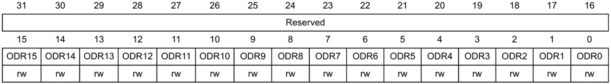
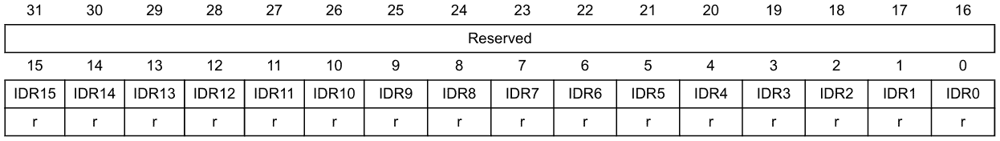
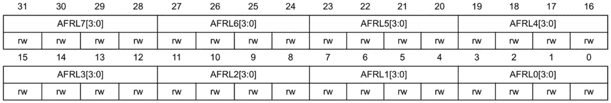
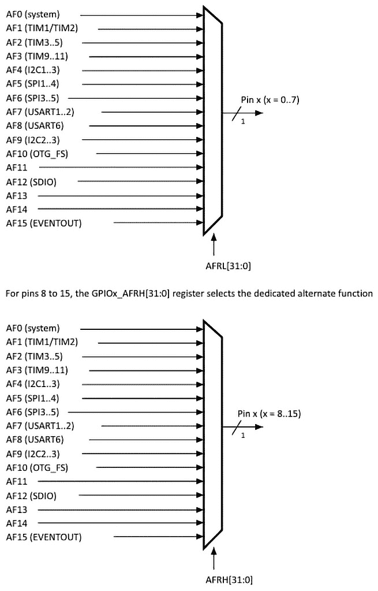

# 第七章：通用输入/输出（GPIO）外设

在本章中，我们将探讨**通用输入/输出**（**GPIO**）外设，这是微控制器中一个基本组件。这个外设对于与微控制器接口至关重要，对于嵌入式系统开发来说是基本的。

我们将首先探索 GPIO 端口和引脚的组织结构，涵盖这些引脚的通用和替代功能。接下来，我们将检查与 STM32 微控制器中的 GPIO 外设相关的关键寄存器。最后，我们将应用这些知识，利用本章学到的详细寄存器信息开发输入和输出驱动程序。

在本章中，我们将涵盖以下主要主题：

+   理解 GPIO 外设

+   STM32 GPIO 寄存器

+   开发输入和输出驱动程序

到本章结束时，你将能够使用 GPIO 外设有效地与微控制器接口，这将使你能够自信地处理各种输入和输出任务。

# 技术要求

本章的所有代码示例都可以在 GitHub 上找到：[`github.com/PacktPublishing/Bare-Metal-Embedded-C-Programming`](https://github.com/PacktPublishing/Bare-Metal-Embedded-C-Programming)。

# 理解 GPIO 外设

由于我们在*第二章*中介绍了 GPIO 外设，本节将重申关于 GPIO 的关键要点。

微控制器的引脚被分组到端口中。例如，一个微控制器可能有名为**GPIOA**、**GPIOB**和**GPIOC**的端口。参见*第二章*中的*图 2**.10*。每个端口由单个引脚组成，这些引脚通过其端口名称，后跟其引脚编号来引用。以下是一些命名约定的示例：

+   PA1 指的是端口 A，引脚 1

+   PD7 指的是端口 D，引脚 7

这种命名约定有助于识别和配置特定引脚以执行各种功能。

STM32F411xC/E 微控制器系列具有六个端口：**PORTA**、**PORTB**、**PORTC**、**PORTD**、**PORTE**和**PORTH**。每个端口都配备了一套全面的寄存器，用于管理配置、数据处理和功能。

这些端口提供了一系列旨在提高通用性和性能的功能。提供的功能包括以下内容：

+   **I/O 控制**：它们允许我们管理每个端口的最多 16 个输入/输出引脚。

+   **输出状态**：引脚可以配置为推挽或开漏模式，并可选择上拉或下拉电阻。

+   当引脚配置为通用输出时，`GPIOx_ODR`寄存器。对于替代功能配置，相关外设驱动输出数据。

+   **速度选择**：可以设置每个 I/O 引脚的运行速度。

+   **输入状态**：引脚可以配置为浮空、上拉、下拉或模拟输入。

+   当配置为复用功能输入时，`GPIOx_IDR`寄存器或相关的外设。

+   `GPIOx_LCKR`寄存器可用于锁定 I/O 配置，防止意外更改。

+   **复用功能选择**：每个 I/O 引脚可以配置多达 16 个复用功能，提供引脚使用的灵活性。

在下一节中，我们将探讨 STM32F411 微控制器的一些 GPIO 寄存器。

# STM32 GPIO 寄存器

在本节中，我们将探讨 GPIO 外设中一些常见寄存器的特性和功能。

每个 GPIO 端口都包含一组 32 位寄存器，这些寄存器对于配置和控制至关重要。配置寄存器包括以下内容：

+   `GPIOx_MODER`（模式寄存器）

+   `GPIOx_OTYPER`（输出类型寄存器）

+   `GPIOx_OSPEEDR`（输出速度寄存器）

+   `GPIOx_PUPDR`（上拉/下拉寄存器）

数据寄存器包括以下内容：

+   `GPIOx_IDR`（输入数据寄存器）

+   `GPIOx_ODR`（输出数据寄存器）

`GPIOx_BSRR`（位设置/重置寄存器）和`GPIOx_LCKR`（锁定寄存器）用于控制引脚状态和访问。此外，复用功能选择寄存器`GPIOx_AFRH`和`GPIOx_AFRL`管理 GPIO 端口内引脚的复用功能分配。

让我们从 GPIO 模式寄存器开始。

## GPIO 模式寄存器（GPIOx_MODER）

GPIO 端口模式寄存器（`GPIOx_MODER`）是配置 GPIO 端口中每个引脚模式的 重要寄存器。此寄存器允许我们设置每个引脚在不同的模式，例如**输入**、**输出**、**复用功能**或**模拟**。

这是一个 32 位寄存器，分为 16 对位。每对位对应 GPIO 端口中的一个特定引脚，允许对每个引脚进行单独配置。参见*第二章*中的*图 2**.17*。

这些位的可能配置如下：

+   **00**：输入模式（复位状态）

    在此模式下，引脚被配置为输入，可用于从外部设备（如按钮）读取信号。

+   **01**：通用输出模式

    此模式将引脚配置为输出，可用于驱动外部信号或组件，如 LED。

+   **10**：复用功能模式

    此模式将引脚设置为复用功能，允许它与各种外设接口，如 UART、SPI 或 I2C。

+   **11**：模拟模式

    此模式将引脚配置为模拟输入，这对于**模数转换器**（**ADC**）操作很有用。

让我们看看一个实际例子。

考虑配置端口 A 上的一个引脚（例如，**PA5**）：

1.  要将**PA5**设置为通用输出（**01**），我们可以按照以下步骤操作：

    +   定位到对应**PA5 (MODER5[1:0])**的位对；这些是**bit11**和**bit10**

    +   将**bit11**设置为**0**，将**bit10**设置为**1**

1.  要将**PA5**设置为复用功能（**10**），我们应该将**bit11**设置为**1**，将**bit10**设置为**0**。

1.  要将**PA5**设置为模拟输入（**11**），我们应该将**bit11**和**bit10**都写入**1**。

这就是关于`GPIOx_MODER`寄存器需要了解的全部内容。

让我们继续考察另外两个重要的寄存器：输出数据寄存器（`GPIOx_ODR`）和输入数据寄存器（`GPIOx_IDR`）。

## GPIO 输出数据寄存器（GPIOx_ODR）和 GPIO 输入数据寄存器（GPIOx_IDR）

GPIO 输出数据寄存器（`GPIOx_ODR`）和 GPIO 输入数据寄存器（`GPIOx_IDR`）对于通过 GPIO 引脚管理数据流至关重要。这些寄存器允许读取引脚的状态并设置引脚的状态，使我们的微控制器能够有效地与外部设备交互。

`GPIOx_ODR`是一个 32 位寄存器，但仅使用低 16 位来控制引脚的输出状态。寄存器中的每个位都对应 GPIO 端口中的一个引脚。

通过写入此寄存器，我们可以设置配置为输出的每个引脚的逻辑电平（高或低）。*图 7.1*显示了从参考手册中提取的 GPIO **输出数据寄存器**（**ODR**）的结构。



图 7.1：GPIO ODR

以下是一些示例：

+   写入`bit5(ODR5)`将**PA5**设置为高电平状态

+   写入`bit5(ODR5)`将**PA5**设置为低电平状态

*那么 GPIO 输入数据寄存器呢？*

GPIO 输入数据寄存器（`GPIOx_IDR`）用于读取配置为输入的 GPIO 引脚的当前状态。通过从这个寄存器读取，我们可以确定每个输入是处于高逻辑电平还是低逻辑电平。

这是一个 32 位寄存器，但与 ODR 类似，仅使用低 16 位来读取引脚的状态。寄存器中的每个位都对应 GPIO 端口中的一个引脚。

**1**的位值表示相应的引脚处于高逻辑电平，而**0**的位值表示它处于低逻辑电平。

*图 7.2*显示了 GPIO 输入数据寄存器的结构：



图 7.2：GPIO 输入数据寄存器

以下是一些示例：

+   如果`bit5(IDR5)`读取为**1**，则**PA5**处于高电平状态

+   如果`bit5(IDR5)`读取为**0**，则**PA5**处于低电平状态

另一个常用的寄存器是 GPIO 位设置/重置寄存器（`GPIOx_BSRR`）。让我们在下一节中考察这个寄存器。

## GPIO 位设置/重置寄存器（GPIOx_BSRR）

GPIO 位设置/重置寄存器（`GPIOx_BSRR`）是控制 GPIO 引脚状态的关键寄存器。它提供原子位操作来设置或重置单个位，这确保了没有中断可以干扰操作，在修改过程中保持数据完整性。

`GPIOx_BSRR`是一个 32 位寄存器，分为两个 16 位部分：

+   **位 15:0 (BSy)**：这些位用于设置相应的 GPIO 引脚

+   **位 31:16 (BRy)**：这些位用于重置相应的 GPIO 引脚

*图 7.3*显示了 GPIO **位设置/重置** **寄存器**（**BSRR**）的结构。


图 7.3：BSRR

让我们分析寄存器中的位：

+   **位 31:16（BRy）**：将任何高 16 位写入**1**将相应的引脚重置为低电平

+   **位 15:0（BSy）**：将任何低 16 位写入**1**将相应的引脚设置为高电平

例如，让我们看看如何使用 BSRR 将 PA5 设置为高电平和低电平：

+   将 PA5 设置为`GPIOA_BSRR`寄存器

+   将 PA5 设置为`GPIOA_BSRR`寄存器

GPIO BSRR（`GPIOx_BSRR`）提供了一个强大的机制来控制 GPIO 引脚的状态。通过理解其结构和功能，我们可以执行高效且原子的操作来设置或重置单个引脚。

另一对常用的 GPIO 寄存器是 GPIO 复用功能高和复用功能低寄存器。让我们在下一节中探讨它们。

## GPIO 复用功能寄存器（GPIOx_AFRL 和 GPIOx_AFRH）

GPIO **复用功能寄存器**（**AFRs**）对于配置 STM32 微控制器中 GPIO 引脚的复用功能非常重要。这些寄存器允许每个引脚被分配一个特定的外围功能，增强了微控制器的多功能性和功能性。

每个 GPIO 端口有两个 AFR：

+   **GPIOx_AFRL**：**复用功能低寄存器**（**AFRL**），用于 0 到 7 引脚

+   **GPIOx_AFRH**：**复用功能高寄存器**（**AFRH**），用于 8 到 15 引脚

这些寄存器允许为每个引脚选择复用功能，便于使用引脚进行各种外围接口，如 UART、I2C 和 SPI。

`GPIOx_AFRL`是一个 32 位寄存器，分为八个 4 位字段。每个 4 位字段对应 GPIO 端口中 0 到 7 范围内的一个引脚。

`GPIOx_AFRH`也是一个 32 位寄存器，分为八个 4 位字段。在这里，每个 4 位字段对应 GPIO 端口中 8 到 15 范围内的一个引脚。



图 7.4：复用功能低寄存器

*图 7.4*说明了 AFRL。为了了解每个引脚可以基于相应的 4 位字段值假设的各种复用功能，我们将参考*图 7.5*作为我们的指南：



图 7.5：复用功能选择

*图 7.5*显示了包含两个多路复用器的图。第一个多路复用器代表 AFRL 的选择器，而第二个代表 AFRH 的选择器。此图来源于参考手册的第 150 页。它有效地展示了如何使用这些寄存器在 STM32F411 微控制器上配置 GPIO 引脚的复用功能。

让我们分解我们看到的内容。

对于`GPIOx_AFRL`和`GPIOx_AFRH`，图提供了每个引脚可以选定的可能复用功能的列表。复用功能由**AF0**到**AF15**指定，每个都与特定的外围功能相关，如下所示：

| **备用功能描述** | **二进制值** |
| --- | --- |
| AF0: 系统功能 | 0000 |
| AF1: TIM1/TIM2 | 0001 |
| AF2: TIM3/TIM4/TIM5 | 0010 |
| AF3: TIM9/TIM10/TIM11 | 0011 |
| AF4: I2C1/I2C2/I2C3 | 0100 |
| AF5: SPI1/SPI2/SPI3/SPI4 | 0101 |
| AF6: SPI3/SPI4/SPI5 | 0110 |
| AF7: USART1/USART2 | 0111 |
| AF8: USART6 | 1000 |
| AF9: I2C2/I2C3 | 1001 |
| AF10: OTG_FS | 1010 |
| AF11: 保留 | 1011 |
| AF12: SDIO | 1100 |
| AF13: 保留 | 1101 |
| AF14: 保留 | 1110 |
| AF15: EVENTOUT | 1111 |

表 7.1：备用功能选择

例如，要配置引脚 5（`GPIOA_AFRL`寄存器。我们使用`GPIOA_AFRL`，因为 PA5 位于 0 到 7 引脚的范围内，这些引脚由该寄存器管理。要配置引脚 10（`GPIOA_AFRH`寄存器。这是因为`GPIOA_AFRH`寄存器。

在本节中，我们探讨了 STM32 GPIO 外设中几个基本寄存器的特性和功能。我们从配置每个 GPIO 引脚模式的 GPIO 模式寄存器（`GPIOx_MODER`）开始，允许设置输入、输出、备用功能或模拟模式。然后我们检查了 GPIO 输出数据寄存器（`GPIOx_ODR`）和输入数据寄存器（`GPIOx_IDR`），它们通过设置和读取引脚状态来管理通过 GPIO 引脚的数据流。接下来，我们看了 GPIO BSRR（`GPIOx_BSRR`），它提供了设置和重置单个引脚状态的原子操作。最后，我们涵盖了 GPIO 备用功能寄存器（`GPIOx_AFRL`和`GPIOx_AFRH`），它们将特定的外设功能分配给每个引脚，增强了微控制器的多功能性。

在下一节中，我们将利用本节获得的知识开发 GPIO 驱动程序。具体来说，我们将专注于创建输入和输出驱动程序。我们将探讨在通信外设章节中关于备用功能寄存器的实际用法。

# 开发输入和输出驱动

在本节中，我们将应用关于 GPIO 外设的知识来开发 STM32 微控制器的实际输入和输出驱动程序。由于我们已经熟悉使用 ODR 来切换 LED 的输出驱动程序开发，本节将重点开发使用 BSRR 的输出驱动程序。

## 使用 BSRR 的 GPIO 输出驱动程序

让我们从在我们的 IDE 中复制我们上一个项目开始：

1.  在最后一个项目上右键单击并选择**复制**。

1.  在**项目资源管理器**窗格中右键单击并选择**粘贴**。

1.  将复制的项目重命名为 `GpioInput-Output`。

接下来，我们将通过创建专门的文件来模块化我们的代码，用于 GPIO 驱动代码：

1.  在项目的`Src`文件夹上右键单击并选择**新建** | **文件**。

1.  在`gpio.c`。

然后，我们将创建相应的头文件：

1.  在项目的`Inc`文件夹上右键单击并选择**新建** | **文件**。

1.  在`gpio.h`。

我们接下来的任务是实现`gpio.c`文件中的驱动程序代码并在`gpio.h`文件中声明公共函数。

在你的 `gpio.c` 文件中填充以下代码：

```cpp
#include "gpio.h"
#define GPIOAEN            (1U<<0)
#define LED_BS5            (1U<<5)  /*Bit Set Pin 5*/
#define LED_BR5            (1U<<21) /*Bit Reset Pin 5*/
void led_init(void)
{
    /*Enable clock access to GPIOA*/
    RCC->AHB1ENR |= GPIOAEN;
    /*Set PA5 mode to output mode*/
    GPIOA->MODER |=(1U<<10);
    GPIOA->MODER &=~(1U<<11);
}
void led_on(void)
{
    /*Set PA5 high*/
    GPIOA->BSRR |=LED_BS5;
}
void led_off(void)
{
    /*Set PA5 high*/
    GPIOA->BSRR |=LED_BR5;
}
```

让我们分解 `gpio.c` 文件中的独特元素，重点关注 BSRR 的使用。我们从头文件包含开始：

```cpp
#include "gpio.h"
```

这一行包含 `gpio.h` 头文件，该文件反过来包含 `stm32fxx.h` 以提供对寄存器定义的访问。

接下来，我们定义我们需要的所有宏：

```cpp
#define GPIOAEN         (1U<<0)
#define LED_BS5         (1U<<5)  /* Bit Set Pin 5 */
#define LED_BR5         (1U<<21) /* Bit Reset Pin 5 */
```

让我们分解这些宏：

+   `GPIOAEN`：此宏用于通过写入 `AHB1ENR` 寄存器来启用 GPIOA 的时钟。

+   `LED_BS5`：此宏代表对引脚 PA5 的位设置操作。将此值写入 BSRR 将 PA5 设置为高电平，打开 LED。

+   `LED_BR5`：此宏代表对引脚 PA5 的位重置操作。将此值写入 BSRR 将 PA5 重置为低电平，关闭 LED。

接下来，我们实现打开 LED 的函数：

```cpp
void led_on(void)
{
    /* Set PA5 high */
    GPIOA->BSRR |= LED_BS5;
}
```

`GPIOA->BSRR |= LED_BS5` 这一行使用 BSRR 将 PA5 设置为高电平。将 **1** 写入 BSRR 的第 5 位将相应的引脚（PA5）设置为高电平，打开 LED。

然后我们实现关闭 LED 的函数：

```cpp
void led_off(void)
{
    /* Set PA5 low */
    GPIOA->BSRR |= LED_BR5;
}
```

类似地，`GPIOA->BSRR |= LED_BR5` 使用 BSRR 将 PA5 重置为低电平。将 **1** 写入 BSRR 的第 21 位将相应的引脚（PA5）重置为低电平，关闭 LED。

这是 `gpio.h` 文件的内容：

```cpp
#ifndef GPIO_H_
#define GPIO_H_
#include "stm32f4xx.h"
void led_init(void);
void led_on(void);
void led_off(void);
#endif /* GPIO_H_ */
```

让我们从头文件守卫开始分解：

```cpp
#ifndef GPIO_H_
#define GPIO_H_
...
#endif /* GPIO_H_ */
```

头文件守卫防止重复包含相同的头文件，这可能导致错误和冗余声明。`#ifndef GPIO_H_` 指令检查 `GPIO_H_` 是否已被定义。如果没有，它将定义 `GPIO_H_` 并包含文件的其余部分。`#endif` 指令在末尾关闭了从 `#ifndef` 开始的条件指令。

接下来，我们有 `include` 指令：

```cpp
#include "stm32f4xx.h"
```

此指令包含 `stm32f4xx.h` 头文件，该文件反过来包含 `stm32f411xe.h` 头文件，它为我们微控制器中的所有寄存器提供定义和声明。

然后我们有函数声明：

```cpp
void led_init(void);
void led_on(void);
void led_off(void);
```

这些声明允许我们从其他文件（如 `main.c`）访问在 `gpio.c` 文件中定义的函数。

现在我们已经完成了 PA5 的 GPIO 输出驱动程序，让我们通过更新 `main.c` 文件来调用 `gpio.c` 文件中定义的函数来测试它。以下是更新的 `main.c` 代码：

```cpp
#include "gpio.h"
int main(void)
{
    /*Initialize LED*/
    led_init();
    while(1)
    {
            led_on();
            for(int i = 0; i < 100000; i++){}
            led_off();
            for(int i = 0; i < 100000; i++){}
    }
}
```

代码首先通过包含 `gpio.h` 头文件来访问在 `gpio.c` 中定义的 GPIO 函数。在 `main` 函数中，它首先调用 `led_init()` 来初始化 PA5 为输出引脚。然后，它进入一个无限循环，通过分别调用 `led_on()` 和 `led_off()` 来交替打开和关闭 LED。我们在这些调用之间使用简单的延时循环，以使 LED 在可见的时间内打开和关闭，从而有效地使 LED 连续闪烁。

继续构建项目并在开发板上运行它。你应该看到绿色 LED 在闪烁。

在下一节中，我们将开发使用**PC13**的 GPIO 输入驱动程序。我们使用**PC13**是因为开发板的蓝色按钮连接到这个引脚。

## GPIO 输入驱动程序

让我们从分析初始化函数开始。将此函数添加到`gpio.c`文件中：

```cpp
#define GPIOAEN            (1U<<0)
#define GPIOCEN             (1U<<2)
#define BTN_PIN             (1U<<13)
void button_init(void)
{
    /*Enable clock access to PORTC*/
    RCC->AHB1ENR |=GPIOCEN;
    /*Set PC13 as an input pin*/
    GPIOC->MODER &=~(1U<<26);
    GPIOC->MODER &=~(1U<<27);
}
```

此函数启用对 GPIO 端口 C 的时钟访问，并将引脚 PC13 配置为输入引脚：

+   **GPIOC->MODER**: 这是端口 C 的 GPIO 端口模式寄存器。此寄存器中的每一对位对应于特定引脚的模式配置。

+   **清除位 26 和 27**：对应于**GPIOC->MODER**寄存器中引脚 13 的位是位**26**和**27**。

    按位与操作符与按位非操作符（**&=~**）结合使用，清除这些位，将它们设置为**00**。正如我们之前所学的，将这些位设置为**00**将 PC13 配置为输入引脚。

接下来，添加读取引脚状态的函数：

```cpp
bool get_btn_state(void)
{
    /*Note : BTN is active low*/
    /*Check if button is pressed*/
    if(GPIOC->IDR & BTN_PIN)
    {
        return false;
    }
    else
    {
        return true;
    }
}
```

此函数读取按钮的状态。按钮内部连接为低电平有效输入。这意味着当按钮按下时，引脚读取低逻辑电平（0），而当按钮未按下时，引脚读取高逻辑电平（1）。

+   **GPIOC->IDR**: 这是 GPIO 端口 C 的输入数据寄存器。它保存端口中所有引脚的当前状态。

+   **按位与操作符（&）**: 这检查 IDR 寄存器中对应于**BTN_PIN**的位是否设置为高。

+   `false`: 如果位被设置，则按钮未按下

+   `true`: 如果位未设置，则按钮被按下

为了能够从其他文件，如`main.c`，访问这些新函数，我们需要将它们的原型添加到`gpio.h`文件中。

将以下行添加到`gpio.h`中：

```cpp
#include <stdbool.h>
void button_init(void);
bool get_btn_state(void);
```

现在，让我们通过更新`main.c`文件以调用它们来测试新函数。

以下是更新后的`main.c`代码：

```cpp
#include "gpio.h"
bool btn_state;
int main(void)
{
    /*Initialize LED*/
    led_init();
    /*Initialize Pushbutton*/
    button_init();
    while(1)
    {
        /*Get Pushbutton State*/
        btn_state = get_btn_state();
        if(btn_state)
        {
            led_on();
        }
        else
        {
            led_off();
        }
    }
}
```

让我们分解一下：

+   `bool btn_state`: 此变量保存按钮的状态

+   `led_init()`: 将 PA5 配置为输出引脚

+   `button_init()`: 将 PC13 配置为输入引脚

+   `while(1){…}`:

    +   使用`get_btn_state()`持续读取按钮的状态

    +   如果按钮被按下（`btn_state`为 true），则打开 LED

    +   如果按钮未按下（`btn_state`为 false），则关闭 LED

构建项目并在开发板上运行它。你应该只在你按下按钮时看到绿色 LED 亮起。

# 概述

在本章中，我们探讨了 GPIO 外设，这是微控制器中一个关键的外设，对于与各种外部组件进行接口至关重要。我们首先了解了 GPIO 端口和引脚的组织结构，涵盖了通用功能和备用功能。

STM32F411 微控制器系列具有多个端口，每个端口都配备了用于管理配置、数据处理和功能的寄存器。

我们介绍了与 GPIO 外设相关的寄存器，包括配置寄存器，如`GPIOx_MODER`、`GPIOx_OTYPER`、`GPIOx_OSPEEDR`和`GPIOx_PUPDR`，以及数据寄存器，如`GPIOx_IDR`和`GPIOx_ODR`。我们还涵盖了`GPIOx_BSRR`（位设置/重置寄存器）用于原子引脚状态控制和`GPIOx_LCKR`（锁定寄存器）用于防止意外配置更改。此外，我们还探讨了 GPIO 复用功能寄存器（`GPIOx_AFRL`和`GPIOx_AFRH`），通过分配特定的外设功能，这些寄存器能够实现引脚的灵活使用。

在实际应用中，我们开发了输出和输入驱动程序。我们首先使用`GPIOx_BSRR`寄存器创建了一个输出驱动程序来控制连接到 PA5 引脚的 LED。这包括设置必要的宏、实现初始化和控制函数，并通过使 LED 闪烁来测试驱动程序。然后，我们为连接到 PC13 引脚的按钮开发了一个输入驱动程序来读取其状态。这包括将 PC13 配置为输入引脚、实现读取按钮状态的函数，并通过使 LED 对按钮按下做出响应来测试驱动程序。

在下一章中，我们将探讨另一个重要的外设：**系统滴答**（**SysTick**）定时器。
