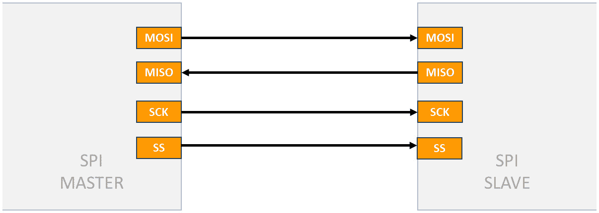
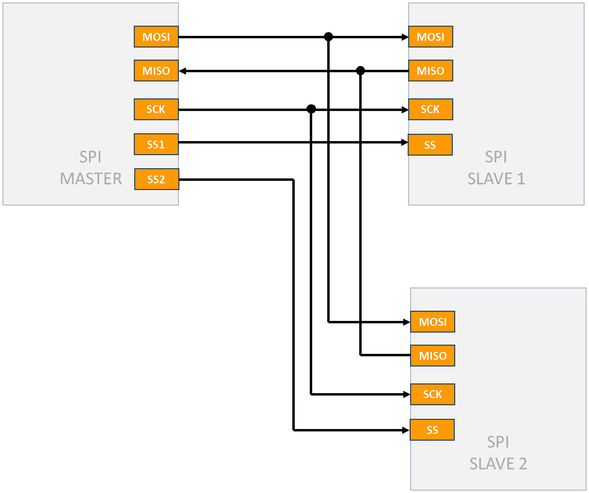
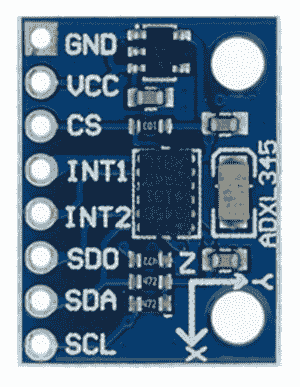
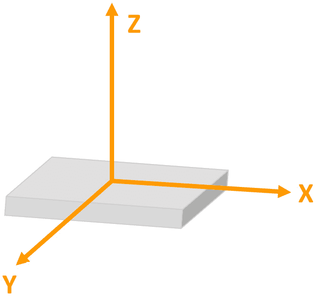

# 第十二章：串行外设接口（SPI）

在本章中，我们将学习**串行外设接口**（**SPI**）协议，这是在嵌入式系统中广泛使用的重要通信协议之一。

我们将首先深入了解 SPI 协议的基础，了解其主从架构、数据传输模式和典型用例。接下来，我们将检查 STM32 微控制器中 SPI 外设的关键寄存器，提供其配置和使用的详细见解。最后，我们将应用这些知识来开发裸机 SPI 驱动程序，展示其实际实现和测试。

在本章中，我们将涵盖以下主要主题：

+   SPI 协议概述

+   STM32F4 SPI 外设

+   开发 SPI 驱动程序

到本章结束时，您将很好地理解 SPI 协议，并准备好开发 SPI 的裸机驱动程序。

# 技术要求

本章的所有代码示例都可以在以下 GitHub 链接中找到：

[`github.com/PacktPublishing/Bare-Metal-Embedded-C-Programming`](https://github.com/PacktPublishing/Bare-Metal-Embedded-C-Programming)

# SPI 协议概述

让我们深入了解 SPI 是什么，它的关键特性，它是如何工作的，以及一些使其如此强大的细微差别。

## 什么是 SPI？

SPI 是由摩托罗拉开发的**同步**串行通信协议。与**通用异步收发传输器**（**UART**）不同，UART 是异步的，SPI**依赖于时钟信号**来同步设备间的数据传输。它旨在进行短距离通信（通常不超过 30 厘米），主要在微控制器和外围设备（如传感器、SD 卡和显示模块）之间使用。让我们看看其关键特性。

## SPI 的关键特性

由于其效率高，SPI 脱颖而出。以下是一些其关键特性：

+   **全双工通信**：SPI 支持同时进行数据传输和接收

+   **高速**：与**集成电路间**（**I2C**）和 UART 等协议相比，SPI 可以以更高的速度运行

+   **主从架构**：一个主设备控制通信，而一个或多个从设备响应

+   **灵活的数据长度**：可以处理各种数据长度，通常是 8 位，但不仅限于这一点

要能够连接两个 SPI 设备，我们必须了解 SPI 接口。

## SPI 接口

SPI 使用四条主要通信线路，每条线路都有几个可能遇到的备选名称：

+   **主设备输入从设备输出（MISO）**：也称为**串行数据输出**（**SDO**）或**数据输出**（**DOUT**），这条线路从从设备传输数据到主设备

+   **主设备输出从设备输入（MOSI）**：也称为**串行数据输入**（**SDI**）或**数据输入**（**DIN**），这条线路从主设备传输数据到从设备

+   **串行时钟（SCK）**：也称为**SCLK**（或简单地称为**CLK**），这是由主设备生成的时钟信号，用于同步数据传输

+   **从设备选择（SS）**：也称为**芯片选择（CS**）或**非从设备选择（NSS**），这条线由主设备用于选择与哪个从设备进行通信

当使用多个从设备时，每个从设备通常都有自己的 SS 线，允许主设备单独控制与每个从设备的通信。*图 12.1*展示了单个主设备和单个从设备之间的 SPI 连接：



图 12.1：SPI 接口

*图 12.2*展示了单个主设备控制多个从设备的 SPI 设置：



图 12.2：SPI 接口 – 多个从设备

当多个从设备连接到单个 SPI 总线时，管理 MISO 线对于避免通信错误至关重要。由于所有从设备都共享这条线，如果未正确控制，非选择的从设备可能会干扰所选从设备的信号。为了防止此类问题，使用了几种技术。一种常见的方法是**三态缓冲**，当从设备的 CS 线处于非活动状态时，每个从设备的 MISO 线进入高阻抗（高-Z）状态，从而有效地将其从总线上断开。这确保只有所选从设备驱动 MISO 线，防止总线冲突。另一种方法是**开漏配置**，带有上拉电阻，当传输 1 时，MISO 线保持浮空（高-Z），而当传输 0 时，由所选从设备将其拉低。这减少了冲突风险，但可能会由于上拉电阻引入的时间延迟而导致通信速度变慢。

让我们看看 SPI 协议是如何工作的。

## SPI 是如何工作的

SPI 的工作原理很简单：主设备生成一个时钟信号，并通过将相应的 SS 线拉低来选择一个从设备进行通信。然后，数据在主设备和从设备之间通过 MOSI 和 MISO 线同时交换。

下面是逐步分解：

1.  **初始化**：主设备设置时钟频率和数据格式（例如，8 位数据）。

1.  **从设备选择**：主设备将目标从设备的 SS 线拉低。在多从设备配置中，每个从设备都有自己的 CS 线，主设备在发送任何初始化消息之前首先将所有 CS 线设置为高（非活动状态）。这确保未初始化的从设备不会错误地响应不是针对它们的命令。一旦所有 CS 线都确认处于高状态，主设备然后通过将 CS 线拉低来激活所需从设备的 CS 线，以开始受控通信。

1.  **数据传输**：主设备通过 MOSI 线向从设备发送数据，而从设备通过 MISO 线向主设备发送数据。

1.  **时钟同步**：主设备控制时钟，确保数据在正确的时间被采样和移位。

1.  **完成**：一旦数据传输完成，主设备将 SS 线拉高，取消选择从设备。

要成功实现 SPI 驱动程序，理解关键的 SPI 配置参数至关重要。让我们逐一探讨，从**时钟相位**（**CPHA**）和**时钟极性**（**CPOL**）开始。

## CPHA 和 CPOL

在 SPI 通信中，CPHA 和 CPOL 的设置决定了用于在主从设备之间同步数据传输的时钟信号的时序和特性。这些设置对于确保数据被主从设备正确采样和解释至关重要。以下是关于 CPHA 和 CPOL 如何影响 SPI 通信的详细分析。

### CPOL

CPOL 决定了时钟信号（SCK）的空闲状态。它控制在没有数据传输时，时钟信号是高电平还是低电平：

+   **CPOL = 0**: 当空闲时，时钟信号为低（0）。这意味着在数据传输之间，时钟线保持低电平。

+   **CPOL = 1**: 当空闲时，时钟信号为高（1）。这意味着在数据传输之间，时钟线保持高电平。

### CPHA

CPHA 决定了数据何时采样以及何时移出。它控制数据读写的时钟信号的边缘：

+   **CPHA = 0**: 数据在时钟脉冲的前沿（第一个边缘）采样，并在后沿（第二个边缘）移出。

+   **CPHA = 1**: 数据在时钟脉冲的前沿（第一个边缘）移出，并在后沿（第二个边缘）采样

CPOL 和 CPHA 的组合产生了四种不同的 SPI 模式，每种模式都影响数据采样和移位的时序。

选择合适的 SPI 模式对于确保主从设备之间正确通信至关重要。两个设备都必须配置为使用相同的 CPOL 和 CPHA 设置，以正确解释交换的数据。模式的选择取决于设备的具体要求和应用的时序约束。让我们继续探讨 SPI 数据模式。

## 数据模式

SPI 在处理数据长度方面具有灵活性。虽然**8 位**数据传输很常见，但 SPI 可以根据应用配置为处理不同的数据长度，例如**16 位**或**32 位**传输。主从设备需要就数据长度达成一致，以确保准确通信。最后一个配置参数是 SPI 速度。

## SPI 速度

SPI 的一个显著优点是其速度。SPI 可以在非常高的频率下运行，通常高达几十**MHz**，具体取决于主从设备的硬件能力。实际应用中的速度取决于几个因素：

+   **设备能力**: 主从设备支持的最大速度

+   **信号完整性**: 较高的速度可能导致信号完整性问题，如串扰和反射，尤其是在较长的距离上

+   **功耗**: 较高的速度消耗更多的功率，这可能在电池供电的应用中需要考虑。

这就完成了我们对 SPI 协议的概述。在下一节中，我们将分析 STM32F4 微控制器中的 SPI 外设。

# STM32F4 SPI 外设

与其他外设一样，STM32 微控制器通常包含多个 SPI 外设；具体数量取决于具体型号。STM32F411 微控制器有五个 SPI 外设，具体如下：

+   SPI1

+   SPI2

+   SPI3

+   SPI4

+   SPI5

## 关键特性

这里有一些关键特性：

+   **全双工和半双工通信**：支持同时双向通信（全双工）或单向通信（半双工）

+   **主/从配置**：每个 SPI 外设都可以配置为主设备或从设备

+   **灵活的数据大小**：支持从 4 位到 16 位的数据大小

+   **高速通信**：在主模式下，能够以高达 42 MHz 的速度运行，在从模式下，能够以高达 21 MHz 的速度运行

+   **直接内存访问（DMA）支持**：支持 DMA，无需 CPU 干预即可高效传输数据

+   **负 SS（NSS）引脚管理**：用于多从配置的 NSS 引脚的硬件管理

+   **循环冗余校验（CRC）计算**：内置硬件 CRC 计算以验证数据完整性

+   **双向模式**：支持双向数据模式，允许单条数据线用于发送和接收数据

让我们检查这个外设的关键寄存器。

## 关键 SPI 寄存器

要在 STM32F411 微控制器上启动 SPI，我们需要配置几个控制 SPI 外设各个方面的寄存器。让我们分解我们将要处理的主要寄存器，从**控制寄存器** **1** 寄存器开始。

### SPI 控制寄存器 1（SPI_CR1）

`SPI_CR1` 寄存器对于配置 SPI 外设至关重要。它包括定义**SPI 模式**、**数据格式**、**时钟设置**等设置的设置。此寄存器中的关键位包括以下内容：

+   `CPHA` 设置为 `0` 表示数据在第一个边缘（前沿）采样，而将其设置为 `1` 表示数据在第二个边缘（后沿）采样。

+   `CPOL` 设置为 `0` 表示空闲时时钟为低电平，将其设置为 `1` 表示空闲时时钟为高电平。

+   `MSTR` 设置为 `1` 使 SPI 外设成为主设备，而 `0` 将其设置为从设备。

+   **波特率控制（BR[2:0]）**：这些位配置 SPI 通信的波特率。

+   将 `SPE` 设置为 `1` 以激活 SPI 通信。

+   `LSBFIRST` 设置为 `0` 表示首先传输最低有效位（LSB）。

+   **内部 SS（SSI）**：此位在主模式下用于内部控制 SS 线。

+   `1` 启用对 SS 线的软件管理，允许主设备手动控制。

接下来，我们有 SPI 状态寄存器。

### SPI 状态寄存器（SPI_SR）

`SPI_SR` 寄存器提供 SPI 外设的实时状态更新，告知我们各种操作状态和标志。此寄存器中的关键位包括以下内容：

+   **接收缓冲区非空（RXNE）**：此标志指示接收缓冲区包含未读数据

+   **发送缓冲区为空（TXE）**：此标志表示发送缓冲区为空，准备好接收新数据

+   **CRC 错误标志（CRCERR）**：当检测到 CRC 错误时，此标志被设置，表示可能的数据损坏

+   **模式故障（MODF）**：此标志表示模式故障，通常是由于主/从配置不正确引起的

+   **溢出标志（OVR）**：此标志指示溢出条件，即接收缓冲区没有及时读取

+   **忙标志（BSY）**：此标志指示 SPI 外设当前正在传输或接收中

最后一个关键寄存器是数据寄存器。

### SPI 数据寄存器（SPI_DR）

`SPI_DR`寄存器是数据传输和接收的通道。它是我们写入要发送的数据和读取已接收数据的所在地：

+   `SPI_DR`寄存器，数据通过`MOSI`线发送出去

+   `SPI_DR`，你从`MISO`线上获取接收到的数据

考虑到这些寄存器，我们现在可以开发 SPI 驱动程序。让我们在下一节中跳入那里。

# 开发 SPI 驱动程序

在你的 IDE 中创建你之前项目的副本，并将此复制的项目重命名为`SPI`。接下来，在`Src`文件夹中创建一个名为`spi.c`的新文件，在`Inc`文件夹中创建一个名为`spi.h`的新文件。在你的`spi.c`文件中填充以下代码：

```cpp
#include "spi.h" 
#define SPI1EN            (1U<<12)
#define GPIOAEN            (1U<<0)
#define SR_TXE            (1U<<1)
#define SR_RXNE            (1U<<0)
#define SR_BSY            (1U<<7)
void spi_gpio_init(void)
{
    /*Enable clock access to GPIOA*/
    RCC->AHB1ENR |= GPIOAEN;
    /*Set PA5,PA6,PA7 mode to alternate function*/
    /*PA5*/
    GPIOA->MODER &=~(1U<<10);
    GPIOA->MODER |=(1U<<11);
    /*PA6*/
    GPIOA->MODER &=~(1U<<12);
    GPIOA->MODER |=(1U<<13);
    /*PA7*/
    GPIOA->MODER &=~(1U<<14);
    GPIOA->MODER |=(1U<<15);
    /*Set PA9 as output pin*/
    GPIOA->MODER |=(1U<<18);
    GPIOA->MODER &=~(1U<<19);
    /*Set PA5,PA6,PA7 alternate function type to SPI1*/
    /*PA5*/
    GPIOA->AFR[0] |=(1U<<20);
    GPIOA->AFR[0] &= ~(1U<<21);
    GPIOA->AFR[0] |=(1U<<22);
    GPIOA->AFR[0] &= ~(1U<<23);
    /*PA6*/
    GPIOA->AFR[0] |=(1U<<24);
    GPIOA->AFR[0] &= ~(1U<<25);
    GPIOA->AFR[0] |=(1U<<26);
    GPIOA->AFR[0] &= ~(1U<<27);
    /*PA7*/
    GPIOA->AFR[0] |=(1U<<28);
    GPIOA->AFR[0] &= ~(1U<<29);
    GPIOA->AFR[0] |=(1U<<30);
    GPIOA->AFR[0] &= ~(1U<<31);
}
```

接下来，我们有配置 SPI 参数的函数：

```cpp
void spi1_config(void)
{
    /*Enable clock access to SPI1 module*/
    RCC->APB2ENR |= SPI1EN;
    /*Set clock to fPCLK/4*/
    SPI1->CR1 |=(1U<<3);
    SPI1->CR1 &=~(1U<<4);
    SPI1->CR1 &=~(1U<<5);
    /*Set CPOL to 1 and CPHA to 1*/
    SPI1->CR1 |=(1U<<0);
    SPI1->CR1 |=(1U<<1);
    /*Enable full duplex*/
    SPI1->CR1 &=~(1U<<10);
    /*Set MSB first*/
    SPI1->CR1 &= ~(1U<<7);
    /*Set mode to MASTER*/
    SPI1->CR1 |= (1U<<2);
    /*Set 8 bit data mode*/
    SPI1->CR1 &= ~(1U<<11);
    /*Select software slave management by
     * setting SSM=1 and SSI=1*/
    SPI1->CR1 |= (1<<8);
    SPI1->CR1 |= (1<<9);
    /*Enable SPI module*/
    SPI1->CR1 |= (1<<6);
}
void spi1_transmit(uint8_t *data,uint32_t size)
{
    uint32_t i=0;
    uint8_t temp;
    while(i<size)
    {
        /*Wait until TXE is set*/
        while(!(SPI1->SR & (SR_TXE))){}
        /*Write the data to the data register*/
        SPI1->DR = data[i];
        i++;
    }
    /*Wait until TXE is set*/
    while(!(SPI1->SR & (SR_TXE))){}
    /*Wait for BUSY flag to reset*/
    while((SPI1->SR & (SR_BSY))){}
    /*Clear OVR flag*/
    temp = SPI1->DR;
    temp = SPI1->SR;
}
```

这是接收数据的函数：

```cpp
void spi1_receive(uint8_t *data,uint32_t size)
{
    while(size)
    {
        /*Send dummy data*/
        SPI1->DR =0;
        /*Wait for RXNE flag to be set*/
        while(!(SPI1->SR & (SR_RXNE))){}
        /*Read data from data register*/
        *data++ = (SPI1->DR);
        size--;
    }
}
```

最后，我们有控制 CS 引脚的函数：

```cpp
void cs_enable(void)
{
    GPIOA->ODR &=~(1U<<9);
}
```

然后，是取消选择从机的函数：

```cpp
/*Pull high to disable*/
void cs_disable(void)
{
    GPIOA->ODR |=(1U<<9);
}
```

让我们逐一查看 SPI 初始化和通信代码的每个部分。我们首先查看定义的宏，然后深入到每个函数。

## 定义宏

让我们分解宏的含义及其功能：

```cpp
#define SPI1EN      (1U<<12)
#define GPIOAEN     (1U<<0)
#define SR_TXE      (1U<<1)
#define SR_RXNE     (1U<<0)
#define SR_BSY      (1U<<7)
```

在这里，我们看到以下内容：

+   `SPI1EN`：定义为`(1U<<12)`，这设置了位 12。它用于启用 SPI1 外设的时钟。

+   `GPIOAEN`：定义为`(1U<<0)`，这设置了位 0。这启用了`GPIOA`的时钟。

+   `SR_TXE`：定义为`(1U<<1)`。这表示发送缓冲区为空。

+   `SR_RXNE`：定义为`(1U<<0)`。这表示接收缓冲区不为空。

+   `SR_BSY`：定义为`(1U<<7)`。这表示 SPI 接口正在忙于传输。

让我们分解初始化函数。

## SPI 的 GPIO 初始化

让我们分析 SPI1 GPIO 引脚的配置：

```cpp
RCC->AHB1ENR |= GPIOAEN;
```

这行代码通过在`AHB1`外设时钟使能寄存器中设置适当的位来启用`GPIOA`的时钟：

```cpp
/*PA5*/
GPIOA->MODER &=~(1U<<10);
GPIOA->MODER |=(1U<<11);
/*PA6*/
GPIOA->MODER &=~(1U<<12);
GPIOA->MODER |=(1U<<13);
/*PA7*/
GPIOA->MODER &=~(1U<<14);
GPIOA->MODER |=(1U<<15);
```

这些行将`PA5`、`PA6`和`PA7`引脚配置为复用功能模式，这对于 SPI 是必要的：

```cpp
GPIOA->MODER |= (1U<<18);
GPIOA->MODER &= ~(1U<<19);
```

这将`PA9`配置为通用输出引脚，它将被用作 SS：

```cpp
/*PA5*/
GPIOA->AFR[0] |=(1U<<20);
GPIOA->AFR[0] &= ~(1U<<21);
GPIOA->AFR[0] |=(1U<<22);
GPIOA->AFR[0] &= ~(1U<<23);
/*PA6*/
GPIOA->AFR[0] |=(1U<<24);
GPIOA->AFR[0] &= ~(1U<<25);
GPIOA->AFR[0] |=(1U<<26);
GPIOA->AFR[0] &= ~(1U<<27);
/*PA7*/
GPIOA->AFR[0] |=(1U<<28);
GPIOA->AFR[0] &= ~(1U<<29);
GPIOA->AFR[0] |=(1U<<30);
GPIOA->AFR[0] &= ~(1U<<31);
```

这些行设置复用功能寄存器以配置`PA5`、`PA6`和`PA7`为`SPI1`。

## SPI1 配置

接下来，我们有配置 SPI 参数的代码：

```cpp
RCC->APB2ENR |= SPI1EN;
```

这行代码通过在 `APB2` 外设时钟使能寄存器中设置适当的位来启用 `SPI1` 的时钟：

```cpp
SPI1->CR1 |=(1U<<3);
SPI1->CR1 &=~(1U<<4);
SPI1->CR1 &=~(1U<<5);
```

这些行配置 SPI 时钟预分频器，通过将 `APB2` 外设时钟除以 4 来设置波特率，因为 SPI1 连接到 `APB2` 总线。波特率由 `001` 结果决定，外设时钟被除以 4，这决定了数据在 SPI 总线上传输的速度：

```cpp
SPI1->CR1 |=(1U<<0);
SPI1->CR1 |=(1U<<1);
```

这些行设置时钟极性和相位以确保正确的数据采样：

```cpp
SPI1->CR1 &=~(1U<<10);
```

这行代码确保全双工模式被启用，以实现同时发送和接收：

```cpp
SPI1->CR1 &= ~(1U<<7);
```

这行代码配置 SPI 以先发送 MSB：

```cpp
SPI1->CR1 |= (1U<<2);
```

这行代码将 `SPI1` 设置为主模式，使其成为 SPI 总线的控制器：

```cpp
SPI1->CR1 &= ~(1U<<11);
```

这行代码配置 SPI 数据帧大小为 `8` 位：

```cpp
SPI1->CR1 |= (1<<8);
SPI1->CR1 |= (1<<9);
```

这些行启用 `SS` 线。

```cpp
SPI1->CR1 |= (1<<6);
```

这行代码启用 SPI 外设以进行操作：

让我们继续到 `spi1_transmit()` 函数。

## 使用 SPI 传输数据

这段代码处理数据的发送：

```cpp
while (!(SPI1->SR & (SR_TXE))) {}
```

这个循环等待发送缓冲区为空，然后发送下一个字节：

```cpp
SPI1->DR = data[i];
```

这行代码发送当前字节的数据：

```cpp
while ((SPI1->SR & (SR_BSY))) {}
```

这确保在继续之前 SPI 总线不忙：

```cpp
temp = SPI1->DR;
temp = SPI1->SR;
```

这两行在管理 SPI 通信过程中起着至关重要的作用。在主设备通过 SPI 数据寄存器发送数据后，相同的寄存器捕获从设备发送的数据。为了确保传入的数据得到适当处理，我们读取数据寄存器，即使我们不需要该值。这个读取操作自动清除 OVR 标志。在此过程中读取状态寄存器也是建议的。

接下来，我们有 `spi1_receive()` 函数。

## SPI 数据接收

这处理接收数据：

```cpp
SPI1->DR = 0;
```

这行代码发送模拟数据以生成时钟脉冲：

```cpp
while (!(SPI1->SR & (SR_RXNE))) {}
```

这行代码等待接收到数据：

```cpp
*data++ = (SPI1->DR);
```

这行代码读取接收到的数据：

最后的函数是 `cs_enable()` 和 `cs_disable()` 函数。

## CS 管理

这行代码将 SS 线拉低以启用从设备：

```cpp
GPIOA->ODR &= ~(1U << 9);
```

这行代码将 SS 线拉高以禁用从设备：

```cpp
GPIOA->ODR |= (1U << 9);
```

我们下一个任务是填充 `spi.h` 文件。

## 头文件

这里是代码：

```cpp
#ifndef SPI_H_
#define SPI_H_
#include "stm32f4xx.h"
#include <stdint.h>
void spi_gpio_init(void);
void spi1_config(void);
void spi1_transmit(uint8_t *data,uint32_t size);
void spi1_receive(uint8_t *data,uint32_t size);
void cs_enable(void);
void cs_disable(void);
#endif
```

在这里，我们只是公开这些函数，以便在其他文件中访问它们。

为了有效地测试 SPI 驱动器，我们需要一个合适的从设备。在下一节中，我们将深入探讨**ADXL345 加速器**，我们将使用它作为我们的从设备来测试 SPI 驱动器。

## 了解 ADXL345 加速器

`ADXL345` 是数字加速度计世界中的一颗明珠，非常适合测试我们的 SPI 模块。让我们深入了解是什么让这个设备如此特别，以及它是如何融入我们的嵌入式系统项目的。

### 什么是 ADXL345？

ADXL345 是一个小巧、轻薄、超低功耗的 `13` 位测量设备，具有可选的测量范围 **±2 g**、**±4 g**、**±8 g** 或 **±16 g**：



图 12.3：ADXL345

让我们分析其关键特性。

### ADXL345 的关键特性

以下是 ADXL345 的功能列表：

+   **超低功耗**：在测量模式下，该设备消耗的电流仅为 23 µA，而在待机模式下仅为 0.1 µA，使其非常适合电池供电的应用。

+   **用户可选分辨率**：我们可以从 10 位到 13 位中选择分辨率，提供所有 g 范围内的 4 mg/LSB 的比例因子。

+   **灵活的接口**：ADXL345 支持 SPI（3 线和 4 线）和 I2C 数字接口，使我们能够灵活地将它集成到系统中。

+   **特殊传感功能**：它包括单次轻击、双击和自由落体检测，以及活动/静止监测。这些功能可以单独映射到两个中断输出引脚，使其对物理事件反应极为灵敏。

+   **宽电源电压范围**：它从 2.0 V 到 3.6 V 运行，适应各种电源配置。

+   **强大的性能**：ADXL345 可以承受高达 10,000 g 的冲击，确保在恶劣应用中的耐用性。

让我们看看它的常见应用。

### 应用

由于其强大的功能集，ADXL345 非常适合各种应用：

+   **工业设备**：用于机器监控和故障检测

+   **航空航天设备**：在可靠性和精度至关重要的系统中

+   **消费电子产品**：例如智能手机、游戏设备和可穿戴技术

+   **健康和运动**：用于在健康监测设备中跟踪运动和活动

让我们更详细地看看其传感功能。

### 传感功能

在其核心，ADXL345 测量沿三个轴的加速度：*x*、*y*和*z*。数据以 16 位二进制补码格式提供，可以通过 SPI 或 I2C 接口访问。

以下是其传感功能：

+   **活动和静止监测**：加速度计可以检测运动或其缺失，这使得它在睡眠监测和健身应用中非常出色

+   **轻击检测**：它可以识别任何方向的单次和双次轻击，这对于基于手势的控制非常有用

+   **自由落体检测**：该设备可以检测是否处于自由落体状态，这可以在安全系统中触发警报或响应

*图 12.4*显示了*x*、*y*和*z*轴：



图 12.4：x、y 和 z 轴

ADXL345 还提供各种低功耗模式，以帮助智能管理功耗。这些模式允许设备根据我们定义的阈值和活动水平进入睡眠或待机状态。

它还包括一个 32 级**FIFO 缓冲区**，这有助于暂时存储数据以减轻主处理器的负载。此缓冲区在需要高数据吞吐量或处理器忙于其他任务的应用中特别有用。最后，其引脚排列简单明了：

+   **VDD I/O**：数字接口供电电压

+   **GND**：地

+   **CS**：SPI 通信的 CS

+   **INT1 和 INT2**：中断输出引脚

+   **SDA/SDI/SDIO**：I2C 或 SPI 输入的串行数据线

+   **SCL/SCLK**：I2C 或 SPI 的串行时钟线

在我们深入开发该从设备驱动程序之前，让我们首先探索一些加速度测量的关键概念。

## 理解关键概念——重力静态加速度、倾斜感应和动态加速度

当与 ADXL345 等加速度计一起工作时，掌握一些支撑其操作和应用的基本概念非常重要。让我们来分解一下静态重力加速度、倾斜感应和动态加速度的含义。

### 重力静态加速度

**重力静态加速度**指的是作用于静止物体的重力引起的恒定加速度。这种加速度始终存在，在地球表面上的大小约为**9.8 米每秒平方（m/s²）**。

在 ADXL345 等加速度计的背景下，静态加速度用于确定设备的方向。当加速度计处于静止且水平放置时，它测量沿*z*轴的重力静态加速度，这有助于确定哪个方向是“向下”。这一能力对于以下应用至关重要：

+   **方向检测**：确定设备相对于地球表面的方向

+   **倾斜感应**：通过观察重力力在不同轴上的变化来测量设备的倾斜角度

下一个重要的概念是倾斜感应。

### 倾斜感应

**倾斜感应**是测量物体相对于重力力的倾斜角度的过程。这是通过分析加速度计的静态加速度读数来实现的。

想象一下手持平板电脑。当你向前、向后或向侧面倾斜它时，内部的加速度计会检测到其*x*、*y*和*z*轴上的静态加速度变化。通过比较这些变化，设备可以计算出倾斜角度。以下是它是如何工作的：

+   **X 轴倾斜**：如果设备沿*x*轴倾斜，检测到的*x*轴静态加速度将根据倾斜方向增加或减少。

+   **Y 轴倾斜**：同样，沿*y*轴倾斜将导致*y*轴静态加速度读数的变动。

+   **Z 轴稳定性**：当设备水平放置时，*z*轴通常检测到重力的全部力量。倾斜的变化会导致这种力量在*x*轴和*y*轴之间重新分配。

倾斜感应在以下应用中得到了广泛使用：

+   **屏幕方向**：自动调整显示从纵向到横向模式

+   **游戏控制器**：检测移动和倾斜以增强游戏体验

+   **工业设备**：监测机械或车辆的倾斜以保障稳定性和安全性

最终的关键概念是动态加速度。

### 动态加速度

**动态加速度**是指由设备运动或外部力作用产生的加速度。与恒定的静态加速度不同，动态加速度根据设备如何移动而变化。

例如，如果你摇晃或移动加速度计，它会将这些变化测量为动态加速度。这种加速度对于以下方面至关重要：

+   **运动检测**：识别设备何时被移动，这可以用于健身追踪器来计数步数

+   **冲击或振动感应**：检测突然的冲击或振动，在碰撞检测系统或跌落测试中很有用

+   **振动监测**：测量工业机械中的振动，以预测故障或维护需求

在结束本节之前，让我们再澄清一个我们之前介绍的概念：“g。”

当处理如 ADXL345 这样的加速度计时，你经常会遇到±2 g、±4 g、±8 g 或±16 g 这样的术语。这些术语对于理解设备的测量能力和限制至关重要。让我们分解一下 g 的含义以及这些范围如何影响加速度计的性能和应用。

### 什么是 g？

术语*g*指的是地球表面的重力加速度，大约为 9.8 **米每秒平方**（**m/s²**）。它被用作加速度的单位。当我们说加速度计可以测量±2 g 时，这意味着它可以检测到沿轴方向重力两倍的加速度。

通过这一澄清，我们现在可以开始为 ADXL345 设备开发驱动程序。

## 开发 ADXL345 驱动程序

在`Src`文件夹中创建一个名为`adxl345.c`的新文件，在`Inc`文件夹中创建一个名为`adxl345.h`的新文件。

### 头文件

将以下内容填充到`adxl345.h`文件中：

```cpp
#ifndef ADXL345_H_
#define ADXL345_H_
#include "spi.h"
#include <stdint.h>
#define ADXL345_REG_DEVID                (0x00)
#define ADXL345_REG_DATA_FORMAT          (0x31)
#define ADXL345_REG_POWER_CTL            (0x2D)
#define ADXL345_REG_DATA_START           (0x32)
#define ADXL345_RANGE_4G                 (0x01)
#define ADXL345_RESET                    (0x00)
#define ADXL345_MEASURE_BIT              (0x08)
#define ADXL345_MULTI_BYTE_ENABLE        (0x40)
#define ADXL345_READ_OPERATION           (0x80)
void adxl_init (void);
void adxl_read(uint8_t address, uint8_t * rxdata);
adxl345.h file begins by including our SPI driver with #include "spi.h" and proceeds to define the necessary macros. Let’s break down the macros:

				*   `ADXL345_REG_DEVID (0x00)`: This macro defines the register address for the device ID of the ADXL345
				*   `ADXL345_REG_DATA_FORMAT (0x31)`: This macro defines the register address for setting the data format of the ADXL345
				*   `ADXL345_REG_POWER_CTL (0x2D)`: This macro defines the register address for the power control settings of the ADXL345
				*   `ADXL345_REG_DATA_START (0x32)`: This macro defines the starting register address for reading acceleration data from the ADXL345
				*   `ADXL345_RANGE_4G (0x01)`: This macro defines the value to set the measurement range of the ADXL345 to ±4g
				*   `ADXL345_RESET (0x00)`: This macro defines the reset value for certain registers
				*   `ADXL345_MEASURE_BIT (0x08)`: This macro defines the bit value to enable measurement mode in the power control register
				*   `ADXL345_MULTI_BYTE_ENABLE (0x40)`: This macro defines the bit to enable multi-byte operations
				*   `ADXL345_READ_OPERATION (0x80)`: This macro defines the bit to specify a read operation

			Next, we populate the `adxl345.c` file:

```

#include "adxl345.h"

void adxl_read(uint8_t address, uint8_t * rxdata)

{

/*设置读操作*/

address |= ADXL345_READ_OPERATION;

/*启用多字节模式*/

address |= ADXL345_MULTI_BYTE_ENABLE;

/*将 cs 线拉低以启用从设备*/

cs_enable();

/*发送地址*/

spi1_transmit(&address,1);

/*读取 6 个字节 */

spi1_receive(rxdata,6);

/*将 cs 线拉高以禁用从设备*/

cs_disable();

}

void adxl_write (uint8_t address, uint8_t value)

{

uint8_t data[2];

/*启用多字节，将地址放入缓冲区*/

data[0] = address|ADXL345_MULTI_BYTE_ENABLE;

/*将数据放入缓冲区*/

data[1] = value;

/*将 cs 线拉低以启用从设备*/

cs_enable();

/*传输数据和地址*/

spi1_transmit(data, 2);

/*将 cs 线拉高以禁用从设备*/

cs_disable();

}

void adxl_init (void)

{

/*启用 SPI gpio*/

spi_gpio_init();

/*配置 SPI*/

spi1_config();

/*设置数据格式范围为+-4g*/

adxl_write (ADXL345_REG_DATA_FORMAT, ADXL345_RANGE_4G);

/*重置所有位*/

adxl_write (ADXL345_REG_POWER_CTL, ADXL345_RESET);

/*配置电源控制测量位*/

adxl_write (ADXL345_REG_POWER_CTL, ADXL345_MEASURE_BIT);

}

```cpp

			Let’s analyze the functions line by line, starting with the `adxl_read()` function.
			Function – adxl_read()
			Let’s break down the read function:

				*   `address |= ADXL345_READ_OPERATION;`: This line sets the MSB of the address to indicate a read operation
				*   `address |= ADXL345_MULTI_BYTE_ENABLE;`: This sets the multi-byte bit to enable multi-byte operations
				*   `cs_enable();`: This function pulls the CS line low, enabling communication with the ADXL345
				*   `spi1_transmit(&address, 1);`: This transmits the address (with read and multi-byte bits set) to the ADXL345
				*   `spi1_receive(rxdata, 6);`: This line reads 6 bytes of data from the ADXL345 and stores it in the buffer pointed to by `rxdata`
				*   `cs_disable();`: This function pulls the CS line high, ending communication with the ADXL345

			Next, we have the `adxl_write()` function.
			Function – adxl_write
			Let’s go through each line of this function:

				*   `data[0] = address | ADXL345_MULTI_BYTE_ENABLE;`: This sets the multi-byte bit and stores the modified address in the buffer
				*   `data[1] = value;`: This stores the data to be written in the buffer
				*   `cs_enable();`: This function pulls the CS line low, enabling communication with the ADXL345
				*   `spi1_transmit(data, 2);`: This transmits the address and data to the ADXL345 in one transaction
				*   `cs_disable();`: This function pulls the CS line high, ending communication with the ADXL345

			Finally, we have the `adxl_init()` function.
			Function – adxl_init
			Let’s analyze the initialization function:

				*   `spi_gpio_init();`: This function initializes the GPIO pins needed for SPI communication
				*   `spi1_config();`: This function configures the SPI settings (clock speed, mode, etc.)
				*   `adxl_write(ADXL345_REG_DATA_FORMAT, ADXL345_RANGE_4G);`: This line writes to the data format register to set the measurement range of the ADXL345 to ±4g
				*   `adxl_write(ADXL345_REG_POWER_CTL, ADXL345_RESET);`: This line writes to the power control register to reset all bits
				*   `adxl_write(ADXL345_REG_POWER_CTL, ADXL345_MEASURE_BIT);`: This line writes to the power control register to set the measure bit, enabling measurement mode

			We are now ready to test the driver inside the `main.c` file. Update your `main.c` file as shown next:

```

#include <stdio.h>

#include <stdint.h>

#include "stm32f4xx.h"

#include "uart.h"

#include "adxl345.h"

// 用于存储加速度计数据的变量

int16_t accel_x, accel_y, accel_z;

double accel_x_g, accel_y_g, accel_z_g;

uint8_t data_buffer[6];

int main(void)

{

uart_init();

// 初始化 ADXL345 加速度计

adxl_init();

while (1)

{

// 从数据起始位置读取加速度计数据

// 注册

adxl_read(ADXL345_REG_DATA_START, data_buffer);

// 将高字节和低字节合并形成加速度计数据

accel_x = (int16_t)((data_buffer[1] << 8) | data_buffer[0]);

accel_y = (int16_t)((data_buffer[3] << 8) | data_buffer[2]);

accel_z = (int16_t)((data_buffer[5] << 8) | data_buffer[4]);

// 将原始数据转换为 g 值

accel_x_g = accel_x * 0.0078;

accel_y_g = accel_y * 0.0078;

accel_z_g = accel_z * 0.0078;

// 打印值以进行调试目的

printf("accel_x : %d accel_y : %d  accel_z : %d\n\

r",accel_x,accel_y,accel_z);

}

return 0;

}

```cpp

			Let’s break down the `main()` function:

				*   `accel_x, accel_y, accel_z`: These are variables to store the raw accelerometer data for each axis.
				*   `accel_x_g, accel_y_g, accel_z_g`: These are variables to store the converted accelerometer data in g units.
				*   `data_buffer[6]`: This is a buffer to hold the raw data bytes read from the ADXL345.
				*   `adxl_init()`: This initializes the ADXL345 accelerometer.
				*   `adxl_read(ADXL345_REG_DATA_START, data_buffer);`: This line reads data from the ADXL345 starting at the specified register (`ADXL345_REG_DATA_START`). The data is stored in `data_buffer`.

			Finally, we have the lines for constructing the final 16-bit values:

```

accel_x = (int16_t)((data_buffer[1] << 8) | data_buffer[0]);

accel_y = (int16_t)((data_buffer[3] << 8) | data_buffer[2]);

accel_z = (int16_t)((data_buffer[5] << 8) | data_buffer[4]);

```cpp

			The data read from the ADXL345 is in 2 bytes (high and low) for each axis. These lines combine the bytes to form 16-bit values for each axis:

```

accel_x_g = accel_x * 0.0078;

accel_y_g = accel_y * 0.0078;

accel_z_g = accel_z * 0.0078;

```cpp

			These lines convert the raw accelerometer values to g values:

```

printf("accel_x : %d accel_y : %d  accel_z : %d\n\r",accel_x,accel_y,accel_z);

```cpp

			This line outputs the raw accelerometer data for debugging purposes:
			Now, let’s test the project. To test the project, compile the code and run it on your microcontroller. Open RealTerm or another serial terminal application and configure it with the appropriate port and baud rate to view the debug messages. Press the black pushbutton on the development board to reset the microcontroller. You should see the *x*, *y*, and *z* accelerometer values continuously being printed. Try moving the accelerometer to observe the values change significantly.
			Summary
			In this chapter, we explored the SPI protocol, a widely used communication protocol in embedded systems for efficient data transfer between microcontrollers and peripherals. We began by understanding the basic principles of SPI, including its master-slave architecture, data transfer modes, and typical use cases, emphasizing its advantages such as full-duplex communication and high-speed operation.
			Next, we examined the SPI peripheral in STM32F4 microcontrollers, focusing on critical registers such as SPI Control Register 1 (`SPI_CR1`), SPI Status Register (`SPI_SR`), and SPI Data Register (`SPI_DR`). We detailed how to configure these registers to set up the SPI peripheral for communication, covering important aspects such as **clock polarity** (**CPOL**) and **clock phase** (**CPHA**), data frame size, and master/slave configuration.
			We then applied this theoretical knowledge by developing a bare-metal SPI driver. The development process included initializing the SPI peripheral, implementing data transmission and reception functions, and handling CS management. We also integrated the SPI driver with an ADXL345 accelerometer, using SPI to communicate with the sensor and retrieve acceleration data. Finally, we tested the driver by reading and displaying the accelerometer data in real time.
			In the next chapter, we will explore the final of the three most common communication protocols in embedded systems: I2C.

```
