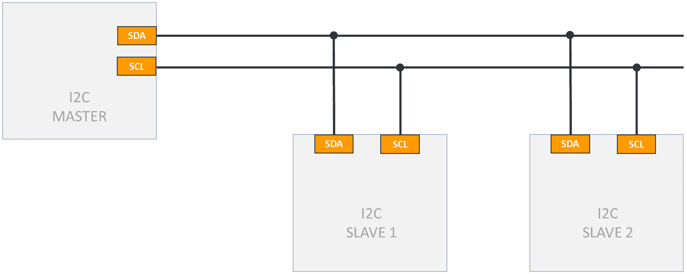
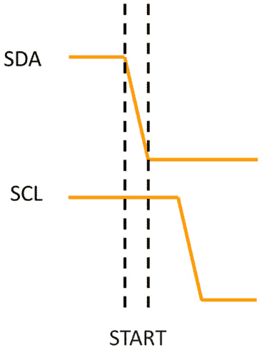
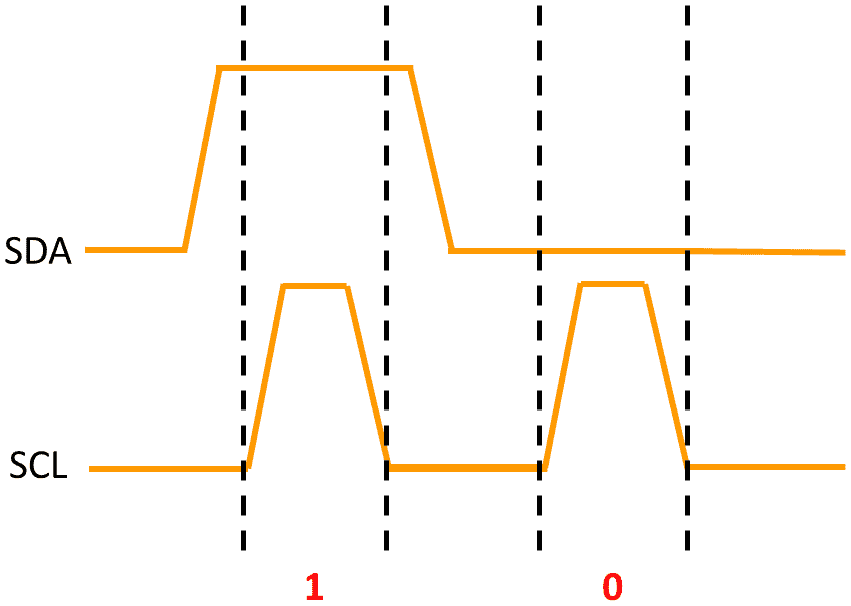
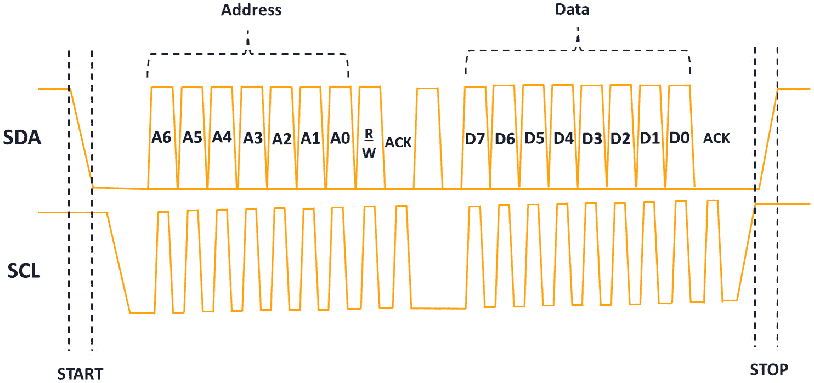

# 第十三章：互集成电路 (I2C)

在本章中，我们将学习 **互集成电路**（**I2C**）通信协议。我们将从探索 I2C 协议的基本原理开始，包括其操作模式、寻址方法和通信过程。然后，我们将检查 STM32 微控制器中 I2C 外设的关键寄存器，并将这些知识应用于开发裸机 I2C 驱动程序。

在本章中，我们将涵盖以下主要内容：

+   I2C 协议概述

+   STM32 I2C 外设

+   开发 I2C 驱动程序

到本章结束时，你将牢固掌握 I2C 协议，并具备开发 I2C 硬件驱动程序所需的技能。

# 技术要求

本章的所有代码示例都可以在 GitHub 上找到：[`github.com/PacktPublishing/Bare-Metal-Embedded-C-Programming`](https://github.com/PacktPublishing/Bare-Metal-Embedded-C-Programming)。

# I2C 协议概述

I2C 是另一种常用协议。让我们探索它是什么，它的关键特性，它是如何工作的，以及它的数据格式。

## 什么是 I2C？

I2C 是由飞利浦半导体（现为恩智浦半导体）发明的 *多主多从*、分组交换、单端、串行通信总线。它旨在实现单个设备内部或同一板上的多个设备之间的短距离通信。I2C 以其简单易用而闻名，使其成为微控制器和其他集成电路之间通信的流行选择。让我们看看它的关键特性。

### I2C 的关键特性

I2C 具有许多独特特性，使其成为嵌入式系统各种应用的理想选择：

+   **双线接口**：I2C 只使用两条线，**串行数据**（**SDA**）和**串行时钟**（**SCL**），这简化了布线并减少了微控制器上所需的引脚数量。

+   **多主多从**：多个主设备可以在总线上发起通信，多个从设备可以响应。这种灵活性允许复杂的通信设置。I2C 协议支持最多 128 个设备，使用 7 位寻址，但由于保留地址，实际限制为 119。使用 10 位寻址，该协议理论上允许 1,024 个设备，但同样，保留地址略微减少了实际最大值。10 位模式虽然不太常见，但允许同一总线上有更多的设备。

+   **可寻址设备**：I2C 总线上的每个设备都有一个唯一的地址，使主设备能够与特定的从设备通信。

+   **同步通信**：SCL 线提供时钟信号，确保设备间数据同步传输。

+   **速度变体**：I2C 支持各种速度模式，包括标准模式（100 kHz）、快速模式（400 kHz）、快速模式+（1 MHz）和高速模式（3.4 MHz），以满足不同的速度要求。

+   **简单且低成本**：该协议的简单性和最小硬件要求使其具有成本效益且易于实现。

让我们看看 I2C 接口。

### I2C 接口

I2C 接口由两条主要线路组成：

+   **串行数据（SDA）**：这条线携带设备之间传输的数据。它是一个双向线，意味着主设备和从设备都可以发送和接收数据。

+   **串行时钟（SCL）**：这条线携带由主设备生成的时钟信号。它同步主设备和从设备之间的数据传输。



图 13.1：I2C 接口 – 多个从设备

这两条线连接到总线上所有的设备，通过上拉电阻确保在空闲状态下这些线被拉到高电平。让我们看看它是如何工作的。

### I2C 的工作原理

理解 I2C 的工作原理涉及查看主设备和从设备的**角色**、**寻址方案**和**通信过程**。

以下是其角色和寻址方案：

+   **主设备**：主设备启动通信并生成时钟信号。它控制数据流，并能寻址多个从设备。

+   **从设备**：从设备响应主设备的命令并执行请求的操作。每个从设备都有一个唯一的**7 位**或**10 位**地址，主设备使用该地址来识别它。

通信过程如下：

1.  **起始条件**：通信从主设备生成起始条件开始。这涉及到在 SCL 线为高电平时将 SDA 线拉低。

1.  **地址帧**：主设备发送目标从设备的地址，后面跟着一个读写位，表示操作类型（0 为写，1 为读）。

1.  **确认（ACK）位**：被寻址的从设备在下一个时钟脉冲期间通过将 SDA 线拉低来响应 ACK 位。

1.  **数据帧**：数据以 8 位帧的形式传输。每个字节后面跟随接收方的 ACK 位。

1.  **停止条件**：主设备通过生成停止条件来结束通信，这涉及到在 SCL 线为高电平时将 SDA 线拉高。


图 13.2：I2C 数据包

在我们进入下一节之前，让我们花一点时间来谈谈 I2C 数据传输，用一个例子来说明。

让我们先回顾一下数据帧和起始条件的作用：

+   **数据帧**：数据以**8 位字节**的形式传输。在每个字节之后，接收方发送一个 ACK 位以确认成功接收。

+   **重复起始条件**：如果主设备需要与另一个从设备通信或在不释放总线的情况下继续通信，它可以生成**重复起始条件**而不是停止条件。

让我们看看数据传输：

+   **写操作**：主设备发送一个**起始条件**，带有**写位**的**地址帧**和**数据帧**。每个数据字节后面跟随从设备的 ACK 位。

+   **读操作**：主设备发送一个起始条件，带有**读位**的地址帧，然后从从设备读取数据帧。每个数据字节由主设备通过 ACK 位确认，除了最后一个字节，它后面跟着一个**NACK**，表示读操作结束。

为了更好地理解，让我们分析*图 13.3*到*13.6*，从起始和停止条件开始。



图 13.3：起始条件

以下为停止条件：


图 13.4：停止条件

起始条件发生在主设备将 SDA 线拉低，而 SCL 线保持高电平时。这个序列向 I2C 总线上的所有设备发出信号，表明即将开始一个通信会话，允许主设备为其预期操作占用总线。如果没有有效的起始条件，I²C 通信无法开始。

相反，停止条件标志着通信的结束。主设备将 SDA 线释放到高电平状态，同时 SCL 线保持高电平，这表明通信会话已完成，总线现在可供其他设备使用。正确使用停止条件对于确保没有设备在总线上保持活跃至关重要，这可能导致冲突或通信错误。

接下来，让我们看看 I2C 协议如何区分 0 和 1。



图 13.5：数据传输过程

*图 13*.*5*说明了数据传输过程。数据是逐位发送的，与 SCL 线上的时钟脉冲同步。如图所示，每个数据位在 SCL 线低电平时放置在 SDA 线上。当 SCL 线切换到高电平时，接收设备读取 SDA 线的状态。这个特定的图显示了**1**的传输，随后是**0**。

最后，让我们检查完整的包以及它与 SDA 和 SCL 线的交互。



图 13.6：完整的包

*图 13*.*6*提供了一个完整的 I²C 通信包的全面视图，展示了在整个事务过程中 SDA 和 SCL 线之间的关系。通信从起始条件开始，此时 SDA 线被拉低，而 SCL 线保持高电平，标志着新通信序列的启动。

在启动条件之后，传输地址帧。该帧包含目标设备的 7 位地址，后面跟着**读/写**（**R/W**）位，表示主设备是否打算从从设备读取或写入。然后从设备通过 ACK 位确认地址帧，确认它已准备好进行通信。

在地址帧之后，传输数据帧。数据以 8 位字节的形式发送，每个位被放置在 SDA 线上，而 SCL 线同步地时钟每个位。在每个数据字节之后，接收设备会响应另一个 ACK 位，确保数据被正确接收。

通信以停止条件结束，此时 SDA 线被释放以变高，而 SCL 线也处于高电平。这表示通信会话结束，为其他潜在的通信释放总线。从开始到停止的整个周期构成了 I²C 协议中数据交换的骨架，确保设备之间结构化和可靠的通信。

这就结束了我们对 I2C 协议的概述。在下一节中，我们将分析 STM32F4 微控制器中的 I2C 外设。

# STM32F4 I2C 外设

根据您正在使用的 STM32F4 的具体型号，通常可以找到最多三个标记为 I2C1、I2C2 和 I2C3 的 I2C 外设。这些外设使微控制器能够通过标准双线接口与 I2C 兼容的设备进行通信。

STM32F4 微控制器中的 I2C 外设集成了许多功能，增强了它们的通用性和性能：

+   **多主和多从功能**：每个 I2C 外设都可以作为主设备和从设备运行，支持多个主配置，其中多个主设备可以控制总线

+   **标准、快速和快速模式+**：外设支持多种速度模式，包括**标准模式**（100 kHz）、**快速模式**（400 kHz）和**快速模式+**（1 MHz），这为通信速度提供了灵活性

+   **10 位寻址**：除了标准的**7 位寻址**外，I2C 外设还支持**10 位寻址**，这使得与更广泛的设备进行通信成为可能

+   **双寻址模式**：每个 I2C 外设都可以配置为响应两个不同的地址，这对于复杂的多个设备设置非常有用

+   **DMA 支持**：**直接内存访问**（**DMA**）支持可用，允许在没有 CPU 干预的情况下进行高效的数据传输

让我们来看看这个外设的关键寄存器。

## 关键的 I2C 寄存器

在 STM32 微控制器上配置 I2C 外设涉及几个关键寄存器，这些寄存器控制其操作的各个方面。

每个寄存器都有需要正确设置的特定位，以确保正常功能。让我们分解我们将要使用的主要寄存器，从**控制寄存器 1**开始。

### I2C 控制寄存器 1 (I2C_CR1)

`I2C_CR1` 是用于配置 I2C 外设基本操作设置的几个主要控制寄存器之一。它提供了启用外设、管理起始和停止条件以及控制应答功能的选择。

此寄存器中的关键位包括以下内容：

+   **外设使能（PE）**：此位启用或禁用 I2C 外设。将此位设置为 1 打开 I2C 外设，而清除它则关闭。

+   `START` 条件，启动通信。

+   `STOP` 条件，终止通信。

+   **应答使能（ACK）**：当设置时，此位在每个字节接收后启用 ACK。

+   **应答/PEC 位置（POS）**：此位控制 ACK 位的位位置。

+   **软件复位（SWRST）**：设置此位将重置 I2C 外设。

您可以在 STM32F4 参考手册（RM0383）的第 *492* 页找到有关此寄存器的详细信息。接下来，让我们看看 I2C **控制** **寄存器 2**。

### I2C 控制寄存器 2（I2C_CR2）

`I2C_CR2` 是另一个关键控制寄存器，用于处理 I2C 操作的不同方面，包括**时钟频率**、**中断**使能和**DMA**控制。此寄存器中的关键位包括以下内容：

+   **FREQ[5:0]（外设时钟频率）**：这些位设置 I2C 外设时钟频率，以 MHz 为单位

+   **DMAEN（DMA 请求使能）**：当设置时，此位启用 I2C 外设的 DMA 请求

您可以在 STM32F4 参考手册（RM0383）的第 *494* 页找到有关此寄存器的详细信息。接下来，让我们看看 I2C **时钟** **控制寄存器**。

### I2C 时钟控制寄存器（I2C_CCR）

`I2C_CCR` 配置标准、快速和快速模式加操作的时钟控制设置。此寄存器中的关键位包括以下内容：

+   **CCR[11:0]（时钟控制）**：这些位设置时钟控制值，确定 I2C 时钟速度

+   **DUTY（快速模式占空比）**：此位选择快速模式的占空比

+   **F/S（I2C 主模式选择）**：此位在标准模式（0）和快速模式（1）之间进行选择

您可以在 STM32F4 参考手册（RM0383）的第 *502* 页找到有关此寄存器的详细信息。下一个寄存器是 I2C 上升时间寄存器。

### I2C **TRISE** 寄存器（I2C_TRISE）

`I2C_TRISE` 配置 I2C 信号的上升时间最大值，确保符合 I2C 规范。此寄存器只有一个字段 – **TRISE[5:0]（最大上升时间）**。这些位设置 SDA 和 SCL 信号的上升时间最大值，以纳秒为单位。

最终寄存器是 I2C **数据寄存器**。

### I2C 数据寄存器（I2C_DR）

`I2C_DR` 是用于**发送**和**接收**数据的寄存器。写入此寄存器的数据将被发送，而从总线接收到的数据将存储在此寄存器中。此寄存器只有一个字段 – **DR[7:0]（8 位数据寄存器）**：此寄存器保存要发送的 8 位数据或从总线接收到的数据。

考虑到这些寄存器，我们现在可以开始开发 I2C 驱动程序。让我们在下一节中这样做。

# 开发 I2C 驱动程序

让我们开发 I2C 驱动程序。在您的 IDE 中复制您之前的项目，并将复制的项目重命名为 `I2C`。接下来，在 `Src` 文件夹中创建一个名为 `i2c.c` 的新文件，并在 `Inc` 文件夹中创建一个名为 `i2c.h` 的新文件。

### 初始化函数

让我们填充 `i2c.c` 文件，从宏和初始化函数开始：

```cpp
#include "stm32f4xx.h"
#define     GPIOBEN            (1U<<1)
#define     I2C1EN            (1U<<21)
#define     I2C_100KHZ            80
#define     SD_MODE_MAX_RISE_TIME    17
#define    CR1_PE            (1U<<0)
#define    SR2_BUSY            (1U<<1)
#define    CR1_START            (1U<<8)
#define    SR1_SB            (1U<<0)
#define    SR1_ADDR            (1U<<1)
#define    SR1_TXE            (1U<<7)
#define    CR1_ACK            (1U<<10)
#define    CR1_STOP            (1U<<9)
#define    SR1_RXNE            (1U<<6)
#define    SR1_BTF            (1U<<2)
/*
 * PB8 ---- SCL
 * PB9 ----- SDA
 * */
void i2c1_init(void)
{
    /*Enable clock access to GPIOB*/
     RCC->AHB1ENR |=GPIOBEN;
    /*Set PB8 and PB9 mode to alternate function*/
    GPIOB->MODER &=~(1U<<16);
    GPIOB->MODER |=(1U<<17);
    GPIOB->MODER &=~(1U<<18);
    GPIOB->MODER |=(1U<<19);
    /*Set PB8 and PB9 output type to  open drain*/
    GPIOB->OTYPER |=(1U<<8);
    GPIOB->OTYPER |=(1U<<9);
    /*Enable Pull-up for PB8 and PB9*/
    GPIOB->PUPDR |=(1U<<16);
    GPIOB->PUPDR &=~(1U<<17);
    GPIOB->PUPDR |=(1U<<18);
    GPIOB->PUPDR &=~(1U<<19);
    /*Set PB8 and PB9 alternate function type to I2C (AF4)*/
    GPIOB->AFR[1] &=~(1U<<0);
    GPIOB->AFR[1] &=~(1U<<1);
    GPIOB->AFR[1] |=(1U<<2);
    GPIOB->AFR[1] &=~(1U<<3);
    GPIOB->AFR[1] &=~(1U<<4);
    GPIOB->AFR[1] &=~(1U<<5);
    GPIOB->AFR[1] |=(1U<<6);
    GPIOB->AFR[1] &=~(1U<<7);
    /*Enable clock access to I2C1*/
     RCC->APB1ENR |= I2C1EN;
    /*Enter reset mode  */
    I2C1->CR1 |= (1U<<15);
    /*Come out of reset mode  */
    I2C1->CR1 &=~(1U<<15);
    /*Set Peripheral clock frequency*/
    I2C1->CR2 = (1U<<4);   //16 Mhz
    /*Set I2C to standard mode, 100kHz clock */
    I2C1->CCR = I2C_100KHZ;
    /*Set rise time */
    I2C1->TRISE = SD_MODE_MAX_RISE_TIME;
    /*Enable I2C1 module */
    I2C1->CR1 |= CR1_PE;
}
```

让我们分解到目前为止的内容：

```cpp
RCC->AHB1ENR |= GPIOBEN;
```

这行代码通过设置相应的位启用了 GPIOB 的时钟。

```cpp
GPIOB->MODER &=~(1U<<16);
GPIOB->MODER |=(1U<<17);
GPIOB->MODER &=~(1U<<18);
GPIOB->MODER |=(1U<<19);
```

这些行将 `PB8` 和 `PB9` 引脚配置为 I2C 的备用功能模式。

```cpp
GPIOB->OTYPER |=(1U<<8);
GPIOB->OTYPER |=(1U<<9);
```

这些行将引脚配置为**开漏**，这是 I2C 通信所必需的。

```cpp
GPIOB->PUPDR |=(1U<<16);
GPIOB->PUPDR &=~(1U<<17);
GPIOB->PUPDR |=(1U<<18);
GPIOB->PUPDR &=~(1U<<19);
```

这些行启用了 I2C 引脚的**上拉电阻**。

```cpp
GPIOB->AFR[1] &=~(1U<<0);
GPIOB->AFR[1] &=~(1U<<1);
GPIOB->AFR[1] |=(1U<<2);
GPIOB->AFR[1] &=~(1U<<3);
GPIOB->AFR[1] &=~(1U<<4);
GPIOB->AFR[1] &=~(1U<<5);
GPIOB->AFR[1] |=(1U<<6);
GPIOB->AFR[1] &=~(1U<<7);
```

这些行配置了 `I2C1`。

```cpp
 RCC->APB1ENR |= I2C1EN;
```

这行代码启用了 I2C1 外设的时钟。

```cpp
I2C1->CR1 |= (1U<<15);
I2C1->CR1 &=~(1U<<15);
```

这些行**重置**了 I2C1 外设。

```cpp
I2C1->CR2 = (1U<<4);
```

这配置了 I2C1 时钟。

```cpp
 I2C1->CCR = I2C_100KHZ;
```

这行代码使用我们定义的宏设置时钟控制寄存器，以 100 kHz 标准模式设置时钟。

```cpp
I2C1->TRISE = SD_MODE_MAX_RISE_TIME;
```

这行代码使用我们定义的宏设置 I2C 信号的上升时间。TRISE 寄存器指定信号在 I2C 总线上从低电平到高电平状态的最大转换时间。正确设置此值对于确保 I2C 通信符合 I2C 标准的时序要求非常重要，这有助于保持可靠和稳定的通信。

```cpp
I2C1->CR1 |= CR1_PE;
```

这行代码通过设置 PE 位启用了 I2C1 外设。接下来，我们将添加并分析从 I2C 从设备读取字节的函数。

### 读取函数

让我们分析 `read` 函数：

```cpp
void i2c1_byte_read(char saddr, char maddr, char* data) {
      volatile int tmp;
      /* Wait until bus not busy */
      while (I2C1->SR2 & (SR2_BUSY)){}
      /* Generate start */
      I2C1->CR1 |= CR1_START;
      /* Wait until start flag is set */
      while (!(I2C1->SR1 & (SR1_SB))){}
      /* Transmit slave address + Write */
      I2C1->DR = saddr << 1;
      /* Wait until addr flag is set */
      while (!(I2C1->SR1 & (SR1_ADDR))){}
      /* Clear addr flag */
      tmp = I2C1->SR2;
      /* Send memory address */
      I2C1->DR = maddr;
      /*Wait until transmitter empty */
      while (!(I2C1->SR1 & SR1_TXE)){}
     /*Generate restart */
     I2C1->CR1 |= CR1_START;
      /* Wait until start flag is set */
      while (!(I2C1->SR1 & SR1_SB)){}
     /* Transmit slave address + Read */
     I2C1->DR = saddr << 1 | 1;
     /* Wait until addr flag is set */
     while (!(I2C1->SR1 & (SR1_ADDR))){}
    /* Disable Acknowledge */
    I2C1->CR1 &= ~CR1_ACK;
    /* Clear addr flag */
    tmp = I2C1->SR2;
    /* Generate stop after data received */
    I2C1->CR1 |= CR1_STOP;
    /* Wait until RXNE flag is set */
    while (!(I2C1->SR1 & SR1_RXNE)){}
    /* Read data from DR */
      *data++ = I2C1->DR;
}
```

让我们分解到目前为止的内容：

+   `while (I2C1->SR2 & (SR2_BUSY)){}`: 这行代码通过检查 I2C 状态寄存器 2 中的 `BUSY` 位状态，等待 I2C 总线空闲。

+   `I2C1->CR1 |= CR1_START;`: 这行代码在 I2C 总线上启动一个起始条件。

+   `while (!(I2C1->SR1 & (SR1_SB))){}`: 这行代码通过检查 I2C 状态寄存器 1 中的 `SB` 位，等待起始条件被确认。

+   `I2C1->DR = saddr << 1;`: 这行代码发送带有写位的从设备地址。设备的 7 位地址向左移动 1 位，为 `saddr` 中保留的 R/W 位腾出空间，我们为从设备后续的写操作准备地址。

+   `while (!(I2C1->SR1 & (SR1_ADDR))){}`: 这行代码通过检查 I2C 状态寄存器 1 中的 `ADDR` 位，等待地址被确认。

+   `tmp = I2C1->SR2;`: 这行代码通过简单地读取 I2C 状态寄存器 2 来清除地址标志。

+   `I2C1->DR = maddr;`: 这里，我们向从设备发送要读取的内存地址。

+   `while (!(I2C1->SR1 & SR1_TXE)){}`: 这行代码通过读取 I2C 状态寄存器 1 中的传输缓冲区空 (`TXE`) 位，等待数据寄存器为空。

+   `I2C1->CR1 |= CR1_START;`: 这行代码在 I2C 总线上启动一个**重启动条件**。

+   `while (!(I2C1->SR1 & SR1_SB)){}`：在这里，我们等待直到重启动条件被 I2C 状态寄存器 1 中的`SB`位确认。

+   `I2C1->DR = saddr << 1 | 1;`：这一行通过设置从设备的 7 位 I2C 地址和附加 R/W 位来准备 I2C 数据寄存器以进行读取操作。具体来说，`saddr << 1`将 7 位地址左移一位以留出 LSB 的空间，然后使用位或运算符（| 1）将其设置为 1。这个最终值，LSB 设置为 1，当加载到 I2C1 **数据寄存器**（**DR**）时，表示读取操作。因此，这一行配置 I2C 外设与从设备通信，请求从它读取数据。

+   `while (!(I2C1->SR1 & (SR1_ADDR))){}`：这一行等待直到地址被确认。

+   `I2C1->CR1 &= ~CR1_ACK;`：这一行禁用应答位以准备停止条件。

+   `tmp = I2C1->SR2;`：这一行通过读取 I2C 状态寄存器 2 来清除地址标志。

+   `I2C1->CR1 |= CR1_STOP;`：这一行在 I2C 总线上启动停止条件。

+   `while (!(I2C1->SR1 & SR1_RXNE)){}`：这一行等待直到接收缓冲区不为空，通过读取 I2C 状态寄存器 1 中的`RXNE`标志。此标志表示已接收到新数据，并且数据已准备好在数据寄存器中。

+   `*data++ = I2C1->DR;`：这一行负责将接收到的数据字节从 I2C 数据寄存器（DR）存储到由`data`指针指向的内存位置。

接下来，我们有一个从从设备读取多个字节的函数：

```cpp
void i2c1_burst_read(char saddr, char maddr, int n, char* data) {
    volatile int tmp;
     /* Wait until bus not busy */
     while (I2C1->SR2 & (SR2_BUSY)){}
     /* Generate start */
     I2C1->CR1 |= CR1_START;
     /* Wait until start flag is set */
     while (!(I2C1->SR1 & SR1_SB)){}
     /* Transmit slave address + Write */
     I2C1->DR = saddr << 1;
     /* Wait until addr flag is set */
     while (!(I2C1->SR1 & SR1_ADDR)){}
    /* Clear addr flag */
     tmp = I2C1->SR2;
    /* Wait until transmitter empty */
    while (!(I2C1->SR1 & SR1_TXE)){}
    /*Send memory address */
    I2C1->DR = maddr;
    /*Wait until transmitter empty */
    while (!(I2C1->SR1 & SR1_TXE)){}
    /*Generate restart */
    I2C1->CR1 |= CR1_START;
    /* Wait until start flag is set */
    while (!(I2C1->SR1 & SR1_SB)){}
    /* Transmit slave address + Read */
    I2C1->DR = saddr << 1 | 1;
    /* Wait until addr flag is set */
    while (!(I2C1->SR1 & (SR1_ADDR))){}
    /* Clear addr flag */
    tmp = I2C1->SR2;
    /* Enable Acknowledge */
      I2C1->CR1 |=  CR1_ACK;
    while(n > 0U)
    {
        /*if one byte*/
        if(n == 1U)
        {
            /* Disable Acknowledge */
            I2C1->CR1 &= ~CR1_ACK;
            /* Generate Stop */
            I2C1->CR1 |= CR1_STOP;
            /* Wait for RXNE flag set */
            while (!(I2C1->SR1 & SR1_RXNE)){}
            /* Read data from DR */
            *data++ = I2C1->DR;
            break;
        }
        else
        {
           /* Wait until RXNE flag is set */
           while (!(I2C1->SR1 & SR1_RXNE)){}
           /* Read data from DR */
           (*data++) = I2C1->DR;
           n--;
        }
    }
}
```

此函数从 I2C 从设备指定的内存地址读取多个字节数据。以下是它的操作分解：

1.  **等待总线可用**：该函数首先确保 I2C 总线不忙，等待直到它空闲以启动通信。

1.  **生成启动条件**：它生成启动条件以开始与从设备的通信。

1.  **发送从设备地址用于写入**：该函数发送带有写入位的从设备地址，表示它将首先写入数据以指定内存地址。

1.  **等待地址标志并清除它**：它等待地址标志被设置，然后通过读取 SR2 寄存器来清除它。

1.  **发送内存地址**：将要从其中开始读取的内存地址发送到从设备。

1.  **生成重启动条件**：生成重复启动条件以将通信模式从写入切换到读取。

1.  **发送从设备地址用于读取**：该函数发送带有读取位的从设备地址，表示它将从从设备读取数据。

1.  **等待地址标志并清除它**：再次，它等待地址标志被设置，并通过读取 SR2 寄存器来清除它。

1.  **启用应答**：设置应答位。

1.  `RXNE`标志表示数据已准备好，将数据读入缓冲区，并递减字节数计数器

最后，我们将函数添加到向从设备写入数据。

### 写入函数

让我们分解写入从设备多个字节的函数：

```cpp
void i2c1_burst_write(char saddr, char maddr, int n, char* data) {
    volatile int tmp;
    /* Wait until bus not busy */
    while (I2C1->SR2 & (SR2_BUSY)){}
    /* Generate start */
    I2C1->CR1 |= CR1_START;
    /* Wait until start flag is set */
    while (!(I2C1->SR1 & (SR1_SB))){}
    /* Transmit slave address */
    I2C1->DR = saddr << 1;
    /* Wait until addr flag is set */
    while (!(I2C1->SR1 & (SR1_ADDR))){}
    /* Clear addr flag */
    tmp = I2C1->SR2;
    /* Wait until data register empty */
    while (!(I2C1->SR1 & (SR1_TXE))){}
    /* Send memory address */
    I2C1->DR = maddr;
    for (int i = 0; i < n; i++) {
     /* Wait until data register empty */
        while (!(I2C1->SR1 & (SR1_TXE))){}
      /* Transmit memory address */
      I2C1->DR = *data++;
    }
    /* Wait until transfer finished */
    while (!(I2C1->SR1 & (SR1_BTF))){}
    /* Generate stop */
    I2C1->CR1 |= CR1_STOP;
}
```

此函数将 **多个字节** 的数据写入 I2C 从设备中的特定内存地址。函数首先等待 I2C 总线空闲，确保没有正在进行的通信。然后生成一个起始条件以与从设备开始通信。通过写入位传输从设备地址，然后函数等待通过读取 SR2 寄存器设置和清除地址标志。在确保数据寄存器为空后，它发送数据写入应开始的数据地址。函数进入一个循环以传输每个字节数据，在每个字节发送之前等待数据寄存器为空。一旦所有字节都已传输，它等待字节传输完成，然后生成一个停止条件以结束通信。

我们下一个任务是填充 `i2c.h` 文件。

### 头文件

下面是头文件中的代码：

```cpp
#ifndef I2C_H_
#define I2C_H_
void i2c1_init(void);
void i2c1_byte_read(char saddr, char maddr, char* data);
void i2c1_burst_read(char saddr, char maddr, int n, char* data);
void i2c1_burst_write(char saddr, char maddr, int n, char* data);
#endif
```

让我们更新 adxl345 设备的驱动程序，以使用我们开发的 I2C 驱动程序。

### ADXL345 I2C 驱动程序

更新 `Src` 文件夹中的当前 `adxl345.c`：

```cpp
#include "adxl345.h"
// Variable to store single byte of data
char data;
// Buffer to store multiple bytes of data from the ADXL345
uint8_t data_buffer[6];
void adxl_read_address (uint8_t reg)
{
     i2c1_byte_read( ADXL345_DEVICE_ADDR, reg, &data);
}
void adxl_write (uint8_t reg, char value)
{
    char data[1];
    data[0] = value;
    i2c1_burst_write( ADXL345_DEVICE_ADDR, reg,1, data) ;
}
void adxl_read_values (uint8_t reg)
{
    // Read 6 bytes into wthe data buffer
    i2c1_burst_read(ADXL345_DEVICE_ADDR, reg, 6,(char *)data_buffer);
}
void adxl_init (void)
{
    /*Enable I2C*/
    i2c1_init();
    /*Read the DEVID, this should return 0xE5*/
    adxl_read_address(ADXL345_REG_DEVID);
    /*Set data format range to +-4g*/
    adxl_write (ADXL345_REG_DATA_FORMAT, ADXL345_RANGE_4G);
    /*Reset all bits*/
    adxl_write (ADXL345_REG_POWER_CTL, ADXL345_RESET);
    /*Configure power control measure bit*/
    adxl_write (ADXL345_REG_POWER_CTL, ADXL345_MEASURE_BIT);
}
```

下面是代码的分解：

+   `adxl_read_address` 函数从 ADXL345 加速度计的指定寄存器读取单个字节数据。它使用 `i2c1_byte_read` 函数通过 I2C 总线通信，从由 `reg` 参数指定的寄存器获取数据并将其存储在 `data` 变量中。

+   `adxl_write` 函数将单个字节数据写入 ADXL345 的特定寄存器。它准备一个包含要写入值的单元素数组，然后使用 `i2c1_burst_write` 将这些数据发送到由 `reg` 参数指定的寄存器，通过 I2C 接口。

+   `adxl_read_values` 函数从 ADXL345 读取数据块 - 特别是使用 `i2c1_burst_read` 读取这些数据，从由 `reg` 参数指定的寄存器开始，并将其存储在 `data_buffer` 中以供进一步处理。

+   `adxl_init` 函数初始化 ADXL345 加速度计。它首先通过调用 `i2c1_init` 启用 I2C 通信，然后通过读取 `DEVID` 寄存器检查设备的身份。在此之后，它将数据格式配置为 ±4g 范围，重置电源控制寄存器，并最终将电源控制寄存器设置为开始测量加速度。

接下来，我们更新 `Inc` 文件夹中的当前 `adxl345.h`：

```cpp
#ifndef ADXL345_H_
#define ADXL345_H_
#include "i2c.h"
#include <stdint.h>
#define   ADXL345_REG_DEVID                (0x00)
#define   ADXL345_DEVICE_ADDR            (0x53)
#define   ADXL345_REG_DATA_FORMAT           (0x31)
#define   ADXL345_REG_POWER_CTL             (0x2D)
#define   ADXL345_REG_DATA_START            (0x32)
#define   ADXL345_REG_DATA_FORMAT           (0x31)
#define       ADXL345_RANGE_4G                (0x01)
#define       ADXL345_RESET                    (0x00)
#define    ADXL345_MEASURE_BIT                    (0x08)
void adxl_init(void);
void adxl_read_values(uint8_t reg);
main.c file.
			The main function
			Update your `main.c` file, as shown here:

```

#include <stdio.h>

#include <stdint.h>

#include "stm32f4xx.h"

#include "uart.h"

#include "adxl345.h"

// 用于存储加速度计数据的变量

int16_t accel_x, accel_y, accel_z;

double accel_x_g, accel_y_g, accel_z_g;

extern uint8_t data_buffer[6];

int main(void)

{

uart_init();

// 初始化 ADXL345 加速度计

adxl_init();

while (1)

{

// 从数据起始地址读取加速度计数据

// 寄存器

adxl_read_values(ADXL345_REG_DATA_START);

// 将高字节和低字节合并形成加速度计数据

accel_x = (int16_t)((data_buffer[1] << 8) | data_buffer[0]);

accel_y = (int16_t)((data_buffer[3] << 8) | data_buffer[2]);

accel_z = (int16_t)((data_buffer[5] << 8) | data_buffer[4]);

// 将原始数据转换为 g 值

accel_x_g = accel_x * 0.0078;

accel_y_g = accel_y * 0.0078;

accel_z_g = accel_z * 0.0078;

printf("accel_x : %d accel_y : %d  accel_z : %d\n\

r",accel_x,accel_y,accel_z);

}

return 0;

}

```cpp

			It’s time to test the project. To do so, compile the code and run it on your microcontroller. Open RealTerm or another serial terminal application, and then configure it with the appropriate port and baud rate to view the debug messages. Press the black push button on the development board to reset the microcontroller. You should see the *X*, *Y*, and *Z* accelerometer values continuously being printed. Try moving the accelerometer to see how the values change significantly.
			Summary
			In this chapter, we learned about the I2C communication protocol. We began by discussing the fundamental principles of the I2C protocol, including its modes of operation, addressing schemes, and the step-by-step communication process.
			We then delved into the specifics of the STM32 I2C peripheral, highlighting key registers such as Control Register 1 (**I2C_CR1**), Control Register 2 (**I2C_CR2**), the Clock Control Register (**I2C_CCR**), and the Data Register (**I2C_DR**).
			Finally, we applied this theoretical knowledge to develop a bare-metal I2C driver. This driver allows us to initialize the I2C peripheral, perform both single-byte and burst data transfers, and handle communication with an external device such as the ADXL345 accelerometer.
			In the next chapter, we will learn about interrupts, a critical feature in modern microcontrollers that enables responsive and efficient handling of real-time events.

```
