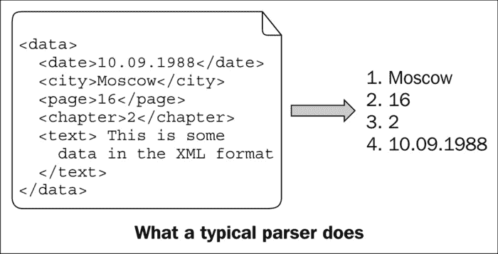

# 第二章. 转换数据

在本章中，我们将介绍：

+   将字符串转换为数字

+   将数字转换为字符串

+   将数字转换为数字

+   将用户定义的类型转换为/从字符串转换

+   转换多态对象

+   解析简单输入

+   解析输入

# 简介

现在我们已经了解了一些基本的 Boost 类型，是时候了解一些数据转换函数了。在本章中，我们将看到如何将字符串、数字和用户定义的类型相互转换，如何安全地转换多态类型，以及如何在 C++源文件中编写小型和大型解析器。

# 将字符串转换为数字

在 C++中将字符串转换为数字让很多人感到沮丧，因为其低效和用户不友好。让我们看看如何将字符串`100`转换为`int`：

```cpp
#include <sstream>

    std::istringstream iss("100");
    int i;
    iss >> i;
    // And now, 'iss' variable will get in the way all the time, 
    // till end of the scope
    // It is better not to think, how many unnecessary operations, 
    // virtual function calls and memory allocations occurred 
    // during those operations
```

C 方法并不好多少：

```cpp
#include <cstdlib>
    char * end;
    int i = std::strtol ("100", &end, 10);
    // Did it converted all the value to int, or stopped somewhere 
    // in the middle?
    // And now we have 'end' variable will getting in the way
    // By the way, we want an integer, but strtol returns long 
    // int... Did the converted value fit in int?
```

## 准备工作

只需要具备基本的 C++和 STL 知识即可使用此菜谱。

## 如何做...

Boost 库中有一个库可以帮助你应对字符串到数字转换的令人沮丧的难度。它被称为`Boost.LexicalCast`，包括一个`boost::bad_lexical_cast`异常类和一些`boost::lexical_cast`函数：

```cpp
#include <boost/lexical_cast.hpp>

int i = boost::lexical_cast<int>("100");
```

它甚至可以用于非空终止的字符串：

```cpp
    char chars[] = {'1', '0', '0' };
    int i = boost::lexical_cast<int>(chars, 3);
    assert(i == 100);
```

## 它是如何工作的...

`boost::lexical_cast`函数接受字符串作为输入，并将其转换为尖括号中指定的类型。`boost::lexical_cast`函数甚至会为您检查边界：

```cpp
    try {
   // on x86 short usually may not store values greater than 32767
        short s = boost::lexical_cast<short>("1000000");
        assert(false); // Must not reach this
    } catch (const boost::bad_lexical_cast& /*e*/) {}
```

还要检查输入的正确语法：

```cpp
    try {
        int i = boost::lexical_cast<int>("This is not a number!");
        assert(false); // Must not reach this
        (void)i; // Suppressing warning about unused variable
    } catch (const boost::bad_lexical_cast& /*e*/) {}
```

## 还有更多...

词法转换就像所有`std::stringstreams`类一样使用`std::locale`，可以转换本地化数字，但同时也有一套针对 C locale 和没有数字分组的 locale 的优化：

```cpp
#include <locale>

    std::locale::global(std::locale("ru_RU.UTF8"));
    // In Russia coma sign is used as a decimal separator
    float f = boost::lexical_cast<float>("1,0");
    assert(f < 1.01 && f > 0.99);
```

这还不算完！你甚至可以简单地创建用于转换数字的模板函数。让我们创建一个将某些`string`值容器转换为`long int`值向量的函数：

```cpp
#include <algorithm>
#include <vector>
#include <iterator>
#include <boost/lexical_cast.hpp>

template <class ContainerT>
std::vector<long int> container_to_longs(const ContainerT& container) {
    typedef typename ContainerT::value_type value_type;
    std::vector<long int> ret;
    typedef long int (*func_t)(const value_type&);
    func_t f = &boost::lexical_cast<long int, value_type>;
    std::transform(container.begin(), container.end(), std::back_inserter(ret), f);
    return ret;
}

    // Somewhere in source file...
    std::set<std::string> str_set;
    str_set.insert("1");
    assert(container_to_longs(str_set).front() == 1);
    std::deque<const char*> char_deque;
    char_deque.push_front("1");
    char_deque.push_back("2");
    assert(container_to_longs(char_deque).front() == 1);
    assert(container_to_longs(char_deque).back() == 2);

    // Obfuscating people with curly braces is fun!
    typedef boost::array<unsigned char, 2> element_t;
    boost::array<element_t, 2> arrays = {{ {{'1', '0'}}, {{'2', '0'}} }};
    assert(container_to_longs(arrays).front() == 10);
    assert(container_to_longs(arrays).back() == 20);
```

## 参见

+   请参阅“将数字转换为字符串”菜谱以获取有关`boost::lexical_cast`性能的信息。

+   `Boost.LexicalCast`的官方文档包含一些示例、性能指标和常见问题的答案。它可在以下位置找到：

    [`www.boost.org/doc/libs/1_53_0/doc/html/boost_lexical_cast.html`](http://www.boost.org/doc/libs/1_53_0/doc/html/boost_lexical_cast.html)

# 将数字转换为字符串

在这个菜谱中，我们将继续讨论词法转换，但现在我们将使用`Boost.LexicalCast`将数字转换为字符串。像往常一样，`boost::lexical_cast`将提供一种非常简单的方法来转换数据。

## 准备工作

只需要具备基本的 C++和 STL 知识即可使用此菜谱。

## 如何做...

1.  让我们使用`boost::lexical_cast`将整数`100`转换为`std::string`：

    ```cpp
    #include <boost/lexical_cast.hpp>

        std::string s = boost::lexical_cast<std::string>(100);
        assert(s == "100");
    ```

1.  将它与传统的 C++转换方法进行比较：

    ```cpp
    #include <sstream>

        // C++ way of converting to strings
        std::stringstream ss;
        ss << 100;
        std::string s;
        ss >> s;
        // Variable 'ss' will dangle all the way, till the end 
        // of scope
        // Multiple virtual methods were called during 
        // conversion
        assert(s == "100");
    ```

    与 C 转换方法相反：

    ```cpp
    #include <cstdlib>

        // C way of converting to strings
        char buffer[100];
        std::sprintf(buffer, "%i", 100);
        // You will need an unsigned long long int type to 
        // count how many times errors were made in 'printf' 
        // like functions all around the world. 'printf' 
        // functions are a constant security threat!
        // But wait, we still need to construct a std::string
        std::string s(buffer);
        // And now we have an buffer variable that won't be 
        // used
        assert(s == "100");
    ```

## 它是如何工作的...

`boost::lexical_cast` 函数也可以接受数字作为输入，并将它们转换为尖括号中指定的字符串类型。这与我们在上一个菜谱中所做的是非常相似的。

## 还有更多...

仔细的读者会注意到，在 `lexical_cast` 的情况下，我们有一个额外的调用到字符串拷贝构造函数，并且这样的调用将对性能产生影响。这是真的，但仅限于旧或差的编译器。现代编译器实现了**命名返回值优化**（**NRVO**），这将消除对拷贝构造函数和析构函数的不必要调用。即使与 C++11 兼容的编译器没有检测到 NRVO，它们也会使用 `std::string` 的移动拷贝构造函数，这是快速且高效的。`Boost.LexicalCast` 文档的 *性能* 部分显示了不同编译器对不同类型的转换速度，在大多数情况下 `lexical_cast` 比标准库的 `std::stringstream` 和 `printf` 函数更快。

如果将 `boost::array` 或 `std::array` 作为输出参数类型传递给 `boost::lexical_cast`，将减少动态内存分配（或者根本不会进行内存分配；这取决于 `std::locale` 的实现）。

## 参见

+   Boost 的官方文档包含表格，比较 `lexical_cast` 的性能与其他转换方法。在大多数情况下，它都胜出。[`www.boost.org/doc/libs/1_53_0/doc/html/boost_lexical_cast.html`](http://www.boost.org/doc/libs/1_53_0/doc/html/boost_lexical_cast.html)。它还有一些更多示例和一个常见问题解答部分。

+   *将字符串转换为数字* 的菜谱。

+   *将用户定义类型转换为字符串或从字符串转换* 的菜谱。

# 将数字转换为数字

你可能还记得你编写过如下代码的情况：

```cpp
void some_function(unsigned short param);

int foo();
    // Somewhere in code
    // Some compilers may warn that int is being converted to 
    // unsigned short and that there is a possibility of losing 
    // data
    some_function(foo());
```

通常，程序员只是通过隐式转换为无符号短整型数据类型来忽略这样的警告，如下面的代码片段所示：

```cpp
    // Warning suppressed. Looks like a correct code
    some_function(
        static_cast<unsigned short>(foo())
    );
```

但这可能会使检测错误变得极其困难。这样的错误可能在代码中存在数年才被发现：

```cpp
// Returns -1 if error occurred
int foo() {
    if (some_extremely_rare_condition()) {
        return -1;
    } else if (another_extremely_rare_condition()) {
        return 1000000;
    }
    return 65535;
}
```

## 准备工作

对于这个菜谱，只需要基本的 C++ 知识。

## 如何做到这一点...

1.  库 `Boost.NumericConversion` 为此类情况提供了一个解决方案。并且很容易修改现有的代码以使用安全的转换，只需将 `static_cast` 替换为 `boost::numeric_cast`。如果源值无法存储在目标中，它将抛出一个异常。让我们看看以下示例：

    ```cpp
    #include <boost/numeric/conversion/cast.hpp>

    void correct_implementation() {
        // 100% correct
        some_function(
            boost::numeric_cast<unsigned short>(foo())
        );
    }

    void test_function() {
        for (unsigned int i = 0; i < 100; ++i) {
            try {
                correct_implementation();
            } catch (const boost::numeric::bad_numeric_cast& e) {
                std::cout << '#' << i << ' ' << e.what() << std::endl;
            }
        }
    }
    ```

1.  现在，如果我们运行 `test_function()`，它将输出以下内容：

    ```cpp
    #47 bad numeric conversion: negative overflow 
    #58 bad numeric conversion: positive overflow 
    ```

1.  我们甚至可以检测特定的溢出类型：

    ```cpp
    void test_function1() {
       for (unsigned int i = 0; i < 100; ++i) {
           try {
               correct_implementation();
           } catch (const boost::numeric::positive_overflow& e) {
               // Do something specific for positive overflow
               std::cout << "POS OVERFLOW in #" << i << ' ' << e.what() << std::endl;
           } catch (const boost::numeric::negative_overflow& e) {
               // Do something specific for negative overwlow
               std::cout <<"NEG OVERFLOW in #" << i << ' ' << e.what() << std::endl;
           }
       }
    }
    ```

    `test_function1()` 函数将输出以下内容：

    ```cpp
    NEG OVERFLOW in #47 bad numeric conversion: negative overflow 
    POS OVERFLOW in #59 bad numeric conversion: positive overflow
    ```

## 它是如何工作的...

它检查输入参数的值是否可以适合新类型而不丢失数据，如果在转换过程中丢失了数据，它将抛出一个异常。

`Boost.NumericConversion` 库有一个非常快速的实现；它可以在编译时完成大量工作。例如，当转换为范围更广的类型时，源代码将直接调用 `static_cast` 方法。

## 还有更多...

`boost::numeric_cast` 函数是通过 `boost::numeric::converter` 实现的，它可以调整以使用不同的溢出、范围检查和舍入策略。但通常，`numeric_cast` 就是您所需要的。

这里有一个小例子，演示了如何为 `boost::numeric::cast` 创建我们自己的 `mythrow_overflow_handler` 过滤器：

```cpp
template <class SourceT, class TargetT>
struct mythrow_overflow_handler {
    void operator() (boost::numeric::range_check_result r) {
        if (r != boost::numeric::cInRange) {
            throw std::logic_error("Not in range!");
        }
    }
};

template <class TargetT, class SourceT>
TargetT my_numeric_cast(const SourceT& in) {
    using namespace boost;
    typedef numeric::conversion_traits<TargetT, SourceT>   conv_traits;
    typedef numeric::numeric_cast_traits<TargetT, SourceT> cast_traits;
    typedef boost::numeric::converter
        <
            TargetT,
            SourceT,
            conv_traits,
            mythrow_overflow_handler<SourceT, TargetT> // !!!
        > converter;
    return converter::convert(in);
}

    // Somewhere in code
    try {
        my_numeric_cast<short>(100000);
    } catch (const std::logic_error& e) {
        std::cout << "It works! " << e.what() << std::endl;
    }
```

这将输出以下内容：

```cpp
It works! Not in range!
```

## 参见

+   Boost 的官方文档包含了所有数值转换模板参数的详细描述；它可以在以下链接找到：

    [`www.boost.org/doc/libs/1_53_0/libs/numeric/conversion/doc/html/index.html`](http://www.boost.org/doc/libs/1_53_0/libs/numeric/conversion/doc/html/index.html)

# 将用户定义类型转换为/从字符串

`Boost.LexicalCast` 有一个特性允许用户在 `lexical_cast` 中使用他们自己的类型。这个特性只需要用户为他们自己的类型编写正确的 `std::ostream` 和 `std::istream` 操作符。

## 如何做到这一点...

1.  您只需要提供一个 `operator<<` 和 `operator>>` 流操作符。如果您的类已经是可流的，则不需要做任何事情：

    ```cpp
    #include <iosfwd>
    #include <stdexcept>

    // Somewhere in header file
    // Negative number, that does not store minus sign
    class negative_number {
        unsigned short number_;
    public:
        explicit negative_number(unsigned short number)
            : number_(number)
        {}
        // operators and functions defined lower
        // ...
        unsigned short value_without_sign() const {
            return number_;
        }
    };

    std::ostream& operator<<(std::ostream& os,
       const negative_number& num)
    {
       os << '-' << num.value_without_sign();
       return os;
    }

    std::istream& operator>>(std::istream& is, negative_number& num) {
        char ch;
        is >> ch;
        if (ch != '-') {
            throw std::logic_error("negative_number class designed "
                          "to store ONLY negative values");
        }
        unsigned short s;
        is >> s;
        num = negative_number(s);
        return os;
    }
    ```

1.  现在我们可以使用 `boost::lexical_cast` 来将 `negative_number` 类转换为其他类型，以及从其他类型转换为 `negative_number` 类。以下是一个例子：

    ```cpp
    #include <boost/lexical_cast.hpp>
    #include <assert.h>
    int main() {
        negative_number n
          = boost::lexical_cast<negative_number>("-100");
        assert(n.value_without_sign() == 100);
        int i = boost::lexical_cast<int>(n);
        assert(i == -100);

        typedef boost::array<char, 10> arr_t;
        arr_t arr = boost::lexical_cast<arr_t>(n);
        assert(arr[0] == '-');
        assert(arr[1] == '1');
        assert(arr[2] == '0');
        assert(arr[3] == '0');
        assert(arr[4] == '\0');
    }
    ```

## 它是如何工作的...

`boost::lexical_cast` 函数可以检测并使用流操作符来转换用户定义的类型。

`Boost.LexicalCast` 库为基本类型提供了许多优化，当用户定义类型被转换为基本类型或基本类型被转换为用户定义类型时，这些优化会被触发。

## 还有更多...

`boost::lexical_cast` 函数也可以转换为宽字符字符串，但需要正确的 `basic_istream` 和 `basic_ostream` 操作符重载：

```cpp
template <class CharT>
std::basic_ostream<CharT>& operator<<(std::basic_ostream<CharT>& os,
   const negative_number& num)
{
   os << static_cast<CharT>('-') << num.value_without_sign();
   return os;
}

template <class CharT>
std::basic_istream<CharT>& operator>>(std::basic_istream<CharT>& is, negative_number& num) {
    CharT ch;
    is >> ch;
    if (ch != static_cast<CharT>('-')) {
        throw std::logic_error("negative_number class designed to "
                      "store ONLY negative values");
    }
    unsigned short s;
    is >> s;
    num = negative_number(s);
    return is;
}

int main() {
    negative_number n = boost::lexical_cast<negative_number>(L"-1");
    assert(n.value_without_sign() == 1);
    typedef boost::array<wchar_t, 10> warr_t;
    warr_t arr = boost::lexical_cast<warr_t>(n);
    assert(arr[0] == L'-');
    assert(arr[1] == L'1');
    assert(arr[4] == L'\0');
}
```

`Boost.LexicalCast` 库不是 C++11 的一部分，但有一个提议将其添加到 C++ 标准中。许多 Boost 库都使用它，并希望它也能使您的生活更轻松。

## 参见

+   `Boost.LexicalCast` 文档包含了一些示例、性能指标和常见问题的答案；它可以在 [`www.boost.org/doc/libs/1_53_0/doc/html/boost_lexical_cast.html`](http://www.boost.org/doc/libs/1_53_0/doc/html/boost_lexical_cast.html) 找到

+   *将字符串转换为数字* 的配方

+   *将数字转换为字符串* 的配方

# 转换多态对象

想象一下，某个程序员设计了一个糟糕的接口，如下所示（这是一个接口不应该如何编写的良好例子）：

```cpp
struct object {
    virtual ~object() {}
};

struct banana: public object {
    void eat() const {}
    virtual ~banana(){}
};

struct pidgin: public object {
    void fly() const {}
    virtual ~pidgin(){}
};

object* try_produce_banana();
```

我们的任务是创建一个吃香蕉的函数，如果遇到的不是香蕉而是其他东西（吃洋泾浜语很恶心！），则抛出异常。如果我们尝试取消引用 `try_produce_banana()` 函数返回的值，我们就会处于取消引用空指针的危险之中。

## 准备工作

对于这个食谱，需要具备基本的 C++ 知识。

## 如何做到...

因此，我们需要编写以下代码：

```cpp
void try_eat_banana_impl1() {
    const object* obj = try_produce_banana();
    if (!obj) {
        throw std::bad_cast();
    }
    dynamic_cast<const banana&>(*obj).eat();
}
```

看起来很糟糕，不是吗？`Boost.Conversion` 提供了一个稍微好一点的解决方案：

```cpp
#include <boost/cast.hpp>
void try_eat_banana_impl2() {
    const object* obj = try_produce_banana();
    boost::polymorphic_cast<const banana*>(obj)->eat();
}
```

## 它是如何工作的...

`boost::polymorphic_cast` 函数只是围绕第一个示例中的代码进行包装，仅此而已。它会检查输入是否为空，然后尝试进行动态转换。在这些操作过程中出现的任何错误都将抛出 `std::bad_cast` 异常。

## 还有更多...

`Boost.Conversion` 库还有一个 `polymorphic_downcast` 函数，它应该仅用于始终成功的向下转换。在调试模式（当 `NDEBUG` 未定义时）中，它将使用 `dynamic_cast` 检查正确的向下转换。当 `NDEBUG` 定义时，`polymorphic_downcast` 函数将仅执行 `static_cast` 操作。这是一个在性能关键部分使用的好函数，同时仍然能够在调试编译中检测到错误。

## 参见

+   `polymorphic_cast` 的想法最初是在书籍 *《C++编程语言》* 中提出的，作者是 *Bjarne Stroustrup*。有关更多信息以及不同主题的一些好主意，请参阅此书。

+   官方文档也可能很有帮助；它可在 [`www.boost.org/doc/libs/1_53_0/libs/conversion/cast.htm`](http://www.boost.org/doc/libs/1_53_0/libs/conversion/cast.htm) 找到。

# 解析简单输入

解析一小段文本是一个常见的任务。在这种情况下，我们常常面临一个困境：我们应该使用一些第三方专业工具进行解析，比如 Bison 或 ANTLR，还是尝试仅使用 C++ 和 STL 手动编写它？第三方工具在处理复杂文本的解析方面表现良好，使用它们编写解析器也很容易，但它们需要额外的工具来从它们的语法中创建 C++ 或 C 代码，并给项目添加更多的依赖。手写的解析器通常难以维护，但它们只需要 C++ 编译器。



让我们从一个非常简单的任务开始，解析 ISO 格式的日期，如下所示：

```cpp
YYYY-MM-DD
```

以下是一些可能的输入示例：

```cpp
2013-03-01
2012-12-31  // (woo-hoo, it almost a new year!)
```

让我们看看以下链接中的解析器语法 [`www.ietf.org/rfc/rfc3339.txt`](http://www.ietf.org/rfc/rfc3339.txt)：

```cpp
   date-fullyear   = 4DIGIT
   date-month      = 2DIGIT  ; 01-12
   date-mday       = 2DIGIT  ; 01-28, 01-29, 01-30, 01-31 based on
                             ; month/year
   full-date       = date-fullyear "-" date-month "-" date-mday
```

## 准备工作

确保你熟悉占位符的概念，或者阅读 第一章 中的 *重新排序函数参数* 和 *将值绑定为函数参数* 食谱，*开始编写您的应用程序*。对解析工具的基本了解也会很有帮助。

## 如何做到...

让我向你介绍 `Boost.Spirit` 库。它允许直接在 C++ 代码格式中编写解析器（以及词法分析和生成器），它们可以立即执行（也就是说，不需要额外的工具来生成 C++ 代码）。`Boost.Spirit` 的语法非常接近 **扩展巴科斯-诺尔范式**（**EBNF**），它被许多标准用于表达语法，并且被其他流行的解析器所理解。本章开头的语法是 EBNF 格式。

1.  我们需要包含以下头文件：

    ```cpp
    #include <boost/spirit/include/qi.hpp>
    #include <boost/spirit/include/phoenix_core.hpp>
    #include <boost/spirit/include/phoenix_operator.hpp>
    #include <assert.h>
    ```

1.  现在是时候创建一个 `date` 结构来保存解析的数据了：

    ```cpp
    struct date {
        unsigned short year;
        unsigned short month;
        unsigned short day;
    };
    ```

1.  现在让我们看看解析器（关于它是如何一步步工作的详细描述可以在下一节找到）：

    ```cpp
    // See recipe "Using a reference to string type" in Chapter 7, 
    // Manipulating Strings for a better type
    // than std::string for parameter 's'
    date parse_date_time1(const std::string& s) {
        using boost::spirit::qi::_1;
        using boost::spirit::qi::ushort_;
        using boost::spirit::qi::char_;
        using boost::phoenix::ref;

        date res;
        const char* first = s.data();
        const char* const end = first + s.size();
        bool success = boost::spirit::qi::parse(first, end,
          ushort_[ ref(res.year) = 1 ] >> char('-')
          >> ushort_[ ref(res.month) = 1 ] >> char('-')
          >> ushort_[ ref(res.day) = _1 ]
        );

        if (!success || first != end) {
            throw std::logic_error("Parsing failed");
        }
        return res;
    }
    ```

1.  现在我们可以在这个解析器想要使用的地方使用它：

    ```cpp
    int main() {
        date d = parse_date_time1("2012-12-31");
        assert(d.year == 2012);
        assert(d.month == 12);
        assert(d.day == 31);
    }
    ```

## 它是如何工作的...

这是一个非常简单的实现；它不会检查数字的位数。解析发生在 `boost::spirit::qi::parse` 函数中。让我们稍微简化一下，移除成功的解析上的动作：

```cpp
   bool success = boost::spirit::qi::parse(first, end,
        ushort_ >> char_('-') >> ushort_ >> char_('-') >> ushort_
    );
```

`first` 参数指向要解析的数据的开始；它必须是一个可修改的（非常量）变量，因为 `parse` 函数将使用它来显示解析序列的结束。`end` 参数指向最后一个元素之后的元素。`first` 和 `end` 应该是迭代器。

函数的第三个参数是一个解析规则。它确实做了 EBNF 规则中写的那样的事情：

```cpp
    date-fullyear "-" date-month "-" date-md
```

我们只是用 `>>` 操作符替换了空白。

`parse` 函数在成功时返回 true。如果我们想确保整个字符串都被成功解析，我们需要检查解析器的返回值和输入迭代器的相等性。

现在我们需要处理成功的解析上的动作，这个配方就完成了。`Boost.Spirit` 中的语义动作写在 `[]` 内，并且可以使用函数指针、函数对象、`boost::bind`、`std::bind`（或其他的 `bind()` 实现）或 C++11 lambda 函数来编写。

因此，你也可以用 C++11 lambda 为 `YYYY` 编写一个规则：

```cpp
    ushort_ [&res {res.year = s;} ]
```

现在，让我们更仔细地看看这个月的语义动作：

```cpp
    ushort_[ ref(res.month) = _1 ]
```

对于那些从开始就阅读这本书的人来说，这会让你想起 `boost::bind` 和占位符。`ref(res.month)` 表示将 `res.month` 作为可修改的引用传递，而 `_1` 表示第一个输入参数，它将是一个数字（`ushort_` 解析的结果）。

## 更多...

现在让我们修改我们的解析器，使其能够处理数字的位数。为此，我们将使用 `unit_parser` 模板类并设置正确的参数：

```cpp
date parse_date_time2(const std::string& s) {
    using boost::spirit::qi::_1;
    using boost::spirit::qi::uint_parser;
    using boost::spirit::qi::char_;
    using boost::phoenix::ref;

    // Use unsigned short as output type, require Radix 10, and from 2
    // to 2 digits
    uint_parser<unsigned short, 10, 2, 2> u2_;

    // Use unsigned short as output type, require Radix 10, and from 4
    // to 4 digits
    uint_parser<unsigned short, 10, 4, 4> u4_;

    date res;
    const char* first = s.data();
    const char* const end = first + s.size();
    bool success = boost::spirit::qi::parse(first, end,
        u4_ [ ref(res.year) = _1 ] >> char_('-')
        >> u2_ [ ref(res.month) = _1 ] >> char_('-')
        >> u2_ [ ref(res.day) = _1 ]
    );

    if (!success || first != end) {
        throw std::logic_error("Parsing failed");
    }
    return res;
}
```

如果这些例子看起来很复杂，请不要担心。我第一次接触 `Boost.Spirit` 时也感到很害怕，但现在它真的简化了我的生活。如果你不害怕这段代码，你非常勇敢。

如果你想避免代码膨胀，尽量在源文件中编写解析器，而不是在头文件中。还要注意传递给 `boost::spirit::parse` 函数的迭代器类型，你使用的迭代器类型越少，二进制文件就越小。在源文件中编写解析器还有一个优点：它不会减慢项目的编译速度（正如你可能注意到的，`Spirit` 解析器编译速度较慢，所以最好在源文件中编译它们，而不是在头文件中定义它们并在整个项目中使用这个文件）。

如果你现在认为通过手动使用 STL 实现日期解析要简单一些...你是正确的！但仅限现在。看看下一个配方；它将给出更多关于 `Boost.Spirit` 使用的示例，并扩展这个示例，说明手动编写解析器比使用 `Boost.Spirit` 更困难的情况。

`Boost.Spirit` 库不是 C++11 的一部分，据我所知，它也没有被提议纳入即将到来的最近的 C++ 标准。

## 参见

+   第一章中的*重新排列函数参数*配方，*开始编写您的应用程序*。

+   *将值绑定为函数参数*配方。

+   `Boost.Spirit` 是一个巨大的仅头文件库。可能有一本单独的书来介绍它，所以请自由使用它的文档 [`www.boost.org/doc/libs/1_53_0/libs/spirit/doc/html/index.html`](http://www.boost.org/doc/libs/1_53_0/libs/spirit/doc/html/index.html)。你还可以找到有关如何在 C++11 代码中直接编写词法分析和生成器的信息。

# 解析输入

在上一个示例中，我们编写了一个简单的日期解析器。想象一下，时间已经过去，任务已经改变。现在我们需要编写一个支持多种输入格式以及时区偏移的日期时间解析器。因此，现在我们的解析器应该能够理解以下输入：

```cpp
2012-10-20T10:00:00Z      // date time with zero zone offset
2012-10-20T10:00:00       // date time with unspecified zone offset
2012-10-20T10:00:00+09:15 // date time with zone offset
2012-10-20-09:15          // date time with zone offset
10:00:09+09:15            // time with zone offset
```

## 准备工作

我们将使用在 *解析简单输入* 配方中描述的 `Spirit` 库。在动手做这个配方之前，请先阅读它。

## 如何做到这一点...

1.  让我们从编写一个将保存解析结果的日期时间结构开始：

    ```cpp
    struct datetime {
        enum zone_offsets_t {
            OFFSET_NOT_SET,
            OFFSET_Z,
            OFFSET_UTC_PLUS,
            OFFSET_UTC_MINUS
        };

    private:
        unsigned short year_;
        unsigned short month_;
        unsigned short day_;
        unsigned short hours_;
        unsigned short minutes_;
        unsigned short seconds_;
        zone_offsets_t zone_offset_type_;
        unsigned int zone_offset_in_min_;

        static void dt_assert(bool v, const char* msg) {
            if (!v) {
                throw std::logic_error("Assertion failed: "
                    + std::string(msg));
            }
        }

    public:
        datetime()
           : year_(0), month_(0), day_(0)
           , hours_(0), minutes_(0), seconds_(0)
           , zone_offset_type_(OFFSET_NOT_SET), zone_offset_in_min_(0)
        {}
        // Getters: year(), month(), day(), hours(), minutes(),
        // seconds(), zone_offset_type(), zone_offset_in_min()
        // ...

        // Setters
        // void set_*(unsigned short val) { /*some assert and setting the *_ to val */ }
        // ...

    };
    ```

1.  现在，让我们编写一个设置时区偏移的函数：

    ```cpp
    void set_zone_offset(datetime& dt, char sign, unsigned short hours, unsigned short minutes) {
        dt.set_zone_offset_type(sign == '+' ?
           datetime::OFFSET_UTC_PLUS : datetime::OFFSET_UTC_MINUS);
        dt.set_zone_offset_in_min(hours * 60 + minutes);
    }
    ```

1.  编写解析器可以分解为编写几个简单的解析器，所以我们首先从编写时区偏移解析器开始。

    ```cpp
    //Default includes for Boost.Spirit
    #include <boost/spirit/include/qi.hpp>
    #include <boost/spirit/include/phoenix_core.hpp>
    #include <boost/spirit/include/phoenix_operator.hpp>

    // We'll use bind() function from Boost.Spirit,
    // because it iterates better with parsers
    #include <boost/spirit/include/phoenix_bind.hpp>

    datetime parse_datetime(const std::string& s) {
        using boost::spirit::qi::_1;
        using boost::spirit::qi::_2;
        using boost::spirit::qi::_3;
        using boost::spirit::qi::uint_parser;
        using boost::spirit::qi::char_;
        using boost::phoenix::bind;
        using boost::phoenix::ref;

        datetime ret;

        // Use unsigned short as output type, require Radix 10, and
        // from 2 to 2 digits
        uint_parser<unsigned short, 10, 2, 2> u2_;

        // Use unsigned short as output type, require Radix 10, and
        // from 4 to 4 digits
        uint_parser<unsigned short, 10, 4, 4> u4_;

        boost::spirit::qi::rule<const char*, void()> timezone_parser
            = -(   // unary minus means optional rule
                   // Zero offset
                   char_('Z')[ bind(&datetime::set_zone_offset_type, &ret, datetime::OFFSET_Z) ]
                   |  // OR
                   // Specific zone offset
                   ((char_('+')|char_('-')) >> u2_ >> ':' >> u2_) [ bind(&set_zone_offset, ref(ret), _1, _2, _3) ]
            );
        // ...
        return ret;
    }
    ```

1.  让我们通过编写剩余的解析器来完成我们的示例：

    ```cpp
      boost::spirit::qi::rule<const char*, void()> date_parser =
        u4_ [ bind(&datetime::set_year, &ret, _1) ]  >> char_('-')
        >> u2_ [ bind(&datetime::set_month, &ret, _1) ] >> char_('-')
        >> u2_ [ bind(&datetime::set_day, &ret, _1) ];

      boost::spirit::qi::rule<const char*, void()> time_parser =
        u2_ [ bind(&datetime::set_hours, &ret, _1) ] >> char_(':')
        >> u2_ [ bind(&datetime::set_minutes, &ret, _1) ] >> char_(':')
        >> u2_ [ bind(&datetime::set_seconds, &ret, _1) ];

        const char* first = s.data();
        const char* const end = first + s.size();
        bool success = boost::spirit::qi::parse(first, end,
            ((date_parser >> char_('T') >> time_parser) | date_parser | time_parser)
             >> timezone_parser
        );

        if (!success || first != end) {
            throw std::logic_error("Parsing of '" + s + "' failed");
        }
        return ret;
    } // end of parse_datetime() function
    ```

## 它是如何工作的...

这里有一个非常有趣的方法是 `boost::spirit::qi::rule<const char*, void()>`。它消除了类型，并允许你在源文件中编写解析器并将它们导出到头文件中。例如：

```cpp
// Somewhere in header file
class example_1 {
    boost::spirit::qi::rule<const char*, void()> some_rule_;
public:
    example_1();
};

// In source file
example_1::example_1() {
    some_rule_ = /* ... */;
}
```

但请记住，这个类对编译器来说是一个优化障碍，所以当不需要时不要使用它。

## 还有更多...

我们可以通过移除执行类型擦除的 `rule<>` 对象来使我们的示例稍微快一点。对于我们的 C++11 示例，我们可以直接用 `auto` 关键字替换它们。

`Boost.Spirit` 库生成的解析器非常快；官方网站上有一些性能指标。还有一些关于如何使用 `Boost.Spirit` 库的建议；其中之一是只生成一次解析器，然后重复使用它（在我们的示例中未展示）。

在 `timezone_parser` 中解析特定时区偏移量的规则使用了 `boost::phoenix::bind` 调用，这不是强制性的。然而，没有它，我们将处理 `boost::fusion::vector<char, unsigned short, unsigned short>`，这不如 `bind(&set_zone_offset, ref(ret), _1, _2, _3)` 用户友好。

在解析大文件时，请考虑阅读 第十一章 中关于 *最快读取文件的方法* 的菜谱，因为不正确地处理文件可能会比解析更大幅度地减慢您的程序。

编译使用库 `Boost.Spirit`（或 `Boost.Fusion`）的代码可能需要很长时间，因为模板实例化数量巨大。当在 `Boost.Spirit` 库上进行实验时，请使用现代编译器，它们提供更好的编译时间。

## 参见

+   `Boost.Spirit` 库值得专门写一本书来介绍。不可能在几个菜谱中描述其所有功能，因此参考文档将帮助您获取更多关于它的信息。它可在 [`www.boost.org/doc/libs/1_53_0/libs/spirit/doc/html/index.html`](http://www.boost.org/doc/libs/1_53_0/libs/spirit/doc/html/index.html) 找到。在那里您会发现更多示例、现成的解析器和有关如何直接在 C++11 代码中使用 Boost 编写词法分析和生成器的信息。
