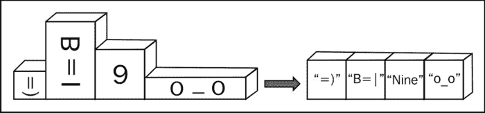
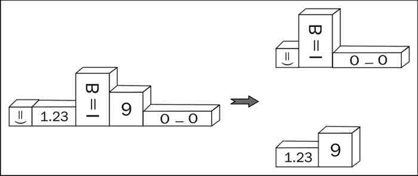

# 第八章。元编程

在本章中，我们将介绍：

+   使用类型“类型向量”

+   操作类型向量

+   在编译时获取函数的结果类型

+   创建高阶元函数

+   惰性评估元函数

+   将所有元组元素转换为字符串

+   分解元组

# 简介

本章致力于一些酷且难以理解的元编程方法。这些方法不是日常使用，但它们将在通用库的开发中提供实际帮助。

第四章，*编译时技巧*已经涵盖了元编程的基础。阅读它以更好地理解。在本章中，我们将更深入地探讨如何将多个类型打包到一个单一的元组类型中。我们将创建用于操作类型集合的函数，我们将看到编译时集合的类型如何改变，以及编译时技巧如何与运行时混合。所有这些都是元编程。

系好安全带，准备就绪，我们出发了！

# 使用类型“类型向量”

有时候，如果我们能像在容器中一样处理所有模板参数，那将非常棒。想象一下，我们正在编写像`Boost.Variant`这样的东西：

```cpp
#include <boost/mpl/aux_/na.hpp>

// boost::mpl::na == n.a. == not available
template <
    class T0 = boost::mpl::na, 
    class T1 = boost::mpl::na,
    class T2 = boost::mpl::na,
    class T3 = boost::mpl::na,
    class T4 = boost::mpl::na,
    class T5 = boost::mpl::na,
    class T6 = boost::mpl::na,
    class T7 = boost::mpl::na,
    class T8 = boost::mpl::na,
    class T9 = boost::mpl::na
>
struct variant;
```

而前面的代码是所有以下有趣任务开始发生的地方：

+   我们如何从所有类型中移除常量和易失性限定符？

+   我们如何移除重复的类型？

+   我们如何获取所有类型的大小？

+   我们如何获取输入参数的最大大小？

所有这些任务都可以轻松地使用`Boost.MPL`解决。

## 准备工作

为了使用这个配方，需要具备第四章*编译时技巧*的基本知识。在阅读之前鼓起勇气——这个配方中会有很多元编程。

## 如何做到这一点…

我们已经看到如何在编译时操作类型。为什么我们不能更进一步，将多个类型组合到一个数组中，并对该数组的每个元素执行操作？

1.  首先，让我们将所有类型打包到`Boost.MPL`类型容器中的一个：

    ```cpp
    #include <boost/mpl/vector.hpp>
    template <
      class T0, class T1, class T2, class T3, class T4,
      class T5, class T6, class T7, class T8, class T9
    >
    struct variant {
      typedef boost::mpl::vector<T0, T1, T2, T3, T4, T5, T6, T7,T8, T9> types;
    };
    ```

1.  让我们使我们的例子不那么抽象，看看如果我们指定类型，它会如何工作：

    ```cpp
    #include <string>

    struct declared{ unsigned char data[4096]; };

    struct non_defined;

    typedef variant<
      volatile int, 
      const int, 
      const long, 
      declared, 
      non_defined, 
      std::string
    >::types types;
    ```

1.  我们可以在编译时检查一切。让我们断言类型不为空：

    ```cpp
    #include <boost/static_assert.hpp>
    #include <boost/mpl/empty.hpp>
    BOOST_STATIC_ASSERT((!boost::mpl::empty<types>::value));
    ```

1.  我们还可以检查，例如，`non_defined`类型仍然位于索引`4`的位置：

    ```cpp
    #include <boost/mpl/at.hpp>
    #include <boost/type_traits/is_same.hpp>
    BOOST_STATIC_ASSERT((boost::is_same<
      non_defined, 
      boost::mpl::at_c<types, 4>::type
    >::value));
    ```

1.  以及最后一个类型仍然是`std::string`：

    ```cpp
    #include <boost/mpl/back.hpp>
    BOOST_STATIC_ASSERT((boost::is_same<
      boost::mpl::back<types>::type,
      std::string
    >::value));
    ```

1.  现在，当我们确信类型确实包含传递给我们的变体结构的所有类型时，我们可以进行一些转换。我们将从移除常量和易失性限定符开始：

    ```cpp
    #include <boost/mpl/transform.hpp>
    #include <boost/type_traits/remove_cv.hpp>
    typedef boost::mpl::transform<
      types, 
      boost::remove_cv<boost::mpl::_1> 
    >::type noncv_types;
    ```

1.  现在我们移除重复的类型：

    ```cpp
    #include <boost/mpl/unique.hpp>

    typedef boost::mpl::unique<
      noncv_types, 
      boost::is_same<boost::mpl::_1, boost::mpl::_2>
    >::type unique_types;
    ```

1.  现在我们可以检查这个向量只包含`5`种类型：

    ```cpp
    #include <boost/mpl/size.hpp>
    BOOST_STATIC_ASSERT((boost::mpl::size<unique_types>::value == 5));
    ```

1.  下一步是计算大小：

    ```cpp
    // Without this we'll get an error:
    // use of undefined type 'non_defined'
    struct non_defined{};

    #include <boost/mpl/sizeof.hpp>
    typedef boost::mpl::transform<
      unique_types, 
      boost::mpl::sizeof_<boost::mpl::_1>
    >::type sizes_types;
    ```

1.  最后一步是获取最大大小：

    ```cpp
    #include <boost/mpl/max_element.hpp>
    typedef boost::mpl::max_element<sizes_types>::type max_size_type;
    ```

    我们可以断言类型的最大大小等于结构的声明大小，这必须是我们例子中的最大值：

    ```cpp
    BOOST_STATIC_ASSERT(max_size_type::type::value == sizeof(declared));
    ```

## 它是如何工作的…

`boost::mpl::vector` 类是一个编译时容器，用于存储类型。更准确地说，它是一个存储类型的类型。我们不会为其创建实例；相反，我们只是在 typedef 中使用它。

与 STL 容器不同，`Boost.MPL` 容器没有成员方法。相反，方法是在单独的头文件中声明的。因此，为了使用某些方法，我们需要：

+   包含正确的头文件

+   调用该方法，通常通过指定容器作为第一个参数

这里是另一个例子：

```cpp
#include <boost/mpl/size.hpp>
#include <cassert>

template <class Vector>
int foo_size() {
  return boost::mpl::size<Vector>::value;
}

int main() {
  typedef boost::mpl::vector<int,int,int> vector1_type;
  assert(foo_size<vector1_type>() == 3); 
}
```

这些方法你应该很熟悉。我们已经在第四章，*编译时技巧*中看到了元函数。顺便说一下，我们还在使用一些来自熟悉的 `Boost.TypeTraits` 库的元函数（例如 `boost::is_same`）。

因此，在第 3 步、第 4 步和第 5 步中，我们只是调用我们容器类型的元函数。

最难的部分即将到来！

记住，占位符在 `boost::bind` 和 `Boost.Asio` 库中被广泛使用。`Boost.MPL` 也有它们，并且它们是组合元函数所必需的：

```cpp
typedef boost::mpl::transform<
  types, 
  boost::remove_cv<boost::mpl::_1> 
>::type noncv_types;
```

在这里，`boost::mpl::_1` 是一个占位符，整个表达式意味着“对于类型中的每个类型，执行 `boost::remove_cv<>::type` 并将那个类型推回到结果向量中。通过 `::type` 返回结果向量”。

让我们转到第 7 步。在这里，我们使用 `boost::is_same<boost::mpl::_1, boost::mpl::_2>` 模板参数指定 `boost::mpl::unique` 的比较元函数，其中 `boost::mpl::_1` 和 `boost::mpl::_2` 是占位符。你可能觉得它与 `boost::bind(std::equal_to(), _1, _2)` 类似，第 7 步中的整个表达式类似于以下伪代码：

```cpp
  std::vector<type> types;
  // ...
  std::unique(types.begin(), types.end(), 
    boost::bind(std::equal_to<type>(), _1, _2));
```

在第 9 步中，有一些有趣的内容，这对于更好地理解是必需的。在先前的代码中，`sizes_types` 不是一个值的向量，而是一个整型常量的向量——代表数字的类型。`sizes_types` typedef 实际上是以下类型：

```cpp
    struct boost::mpl::vector<
      struct boost::mpl::size_t<4>,
      struct boost::mpl::size_t<4>,
      struct boost::mpl::size_t<4096>,
      struct boost::mpl::size_t<1>,
      struct boost::mpl::size_t<32> 
    >
```

最后一步现在应该很清晰了。它只是从 `sizes_types` typedef 中获取最大元素。

### 注意

我们可以在任何允许使用 typedef 的地方使用 `Boost.MPL` 元函数。

## 还有更多...

使用 `Boost.MPL` 库会导致编译时间更长，但它让你能够使用类型做任何你想做的事情。它不会增加运行时开销，甚至不会在二进制文件中增加一条指令。C++11 没有 `Boost.MPL` 类，`Boost.MPL` 也不使用 C++11 的特性，如变长模板。这使得在 C++11 编译器上 `Boost.MPL` 的编译时间更长，但使其在 C++03 编译器上可用。

## 参见

+   参见第四章，*编译时技巧*，了解元编程的基础

+   *操作类型向量* 的配方将为您提供更多关于元编程和 `Boost.MPL` 库的信息

+   请参阅官方 `Boost.MPL` 文档以获取更多示例和完整参考，请访问 [`www.boost.org/doc/libs/1_53_0/libs/mpl/doc/in`](http://www.boost.org/doc/libs/1_53_0/libs/mpl/doc/in)[dex.html](http://dex.html)

# 操作类型向量

本配方的任务将是根据第二个 `boost::mpl::vector` 函数的内容修改一个 `boost::mpl::vector` 函数的内容。我们将调用第二个向量作为修饰符向量，并且每个修饰符都可以有以下的类型：

```cpp
// Make unsigned 
struct unsigne; // No typo: 'unsigned' is a keyword, we cannot use it.

// Make constant
struct constant;

// Otherwise we do not change type
struct no_change;
```

那么我们应该从哪里开始呢？

## 准备工作

需要基本了解 `Boost.MPL`。阅读 *使用类型 "类型向量"* 配方和 第四章，*编译时技巧* 可能有所帮助。

## 如何做到这一点...

本配方与上一个配方类似，但它还使用了条件编译时语句。准备好，这不会容易！

1.  我们应该从头文件开始：

    ```cpp
    // we'll need this at step 3
    #include <boost/mpl/size.hpp>
    #include <boost/type_traits/is_same.hpp>
    #include <boost/static_assert.hpp>

    // we'll need this at step 4
    #include <boost/mpl/if.hpp>
    #include <boost/type_traits/make_unsigned.hpp>
    #include <boost/type_traits/add_const.hpp>

    // we'll need this at step 5
    #include <boost/mpl/transform.hpp>
    ```

1.  现在，让我们将所有元编程魔法放入结构中，以便于更简单的重用：

    ```cpp
    template <class Types, class Modifiers>
    struct do_modifications {
    ```

1.  检查传入的向量是否具有相同的大小是一个好主意：

    ```cpp
      BOOST_STATIC_ASSERT((boost::is_same<
        typename boost::mpl::size<Types>::type, 
        typename boost::mpl::size<Modifiers>::type 
      >::value));
    ```

1.  现在让我们处理修改元函数：

    ```cpp
      typedef boost::mpl::if_<
        boost::is_same<boost::mpl::_2, unsigne>,
        boost::make_unsigned<boost::mpl::_1>,
        boost::mpl::if_<
          boost::is_same<boost::mpl::_2, constant>,
          boost::add_const<boost::mpl::_1>,
          boost::mpl::_1
        >
      > binary_operator_t;
    ```

1.  最后一步：

    ```cpp
      typedef typename boost::mpl::transform<
        Types,
        Modifiers,
        binary_operator_t
      >::type type;
    };
    ```

    我们现在可以运行一些测试，确保我们的元函数工作正确：

    ```cpp
    #include <boost/mpl/vector.hpp>
    typedef boost::mpl::vector<unsigne, no_change, constant, unsigne> modifiers;
    typedef boost::mpl::vector<int, char, short, long> types;
    typedef do_modifications<types, modifiers>::type result_type;

    #include <boost/mpl/at.hpp>
    BOOST_STATIC_ASSERT((boost::is_same<
      boost::mpl::at_c<result_type, 0>::type,
      unsigned int
    >::value));

    BOOST_STATIC_ASSERT((boost::is_same<
      boost::mpl::at_c<result_type, 1>::type,
      char
    >::value));

    BOOST_STATIC_ASSERT((boost::is_same<
      boost::mpl::at_c<result_type, 2>::type,
      const short
    >::value));

    BOOST_STATIC_ASSERT((boost::is_same<
      boost::mpl::at_c<result_type, 3>::type,
      unsigned long
    >::value));
    ```

## 它是如何工作的...

在第 3 步中，我们断言大小相等，但我们以一种不寻常的方式进行。`boost::mpl::size<Types>::type` 元函数实际上返回整数常量 `struct boost::mpl::long_<4>`，因此在静态断言中，我们实际上比较的是两种类型，而不是两个数字。这可以以更熟悉的方式重写：

```cpp
  BOOST_STATIC_ASSERT((
    boost::mpl::size<Types>::type::value
    ==
    boost::mpl::size<Modifiers>::type::value
  ));
```

### 注意

注意我们使用的 `typename` 关键字。没有它，编译器将无法决定 `::type` 实际上是一个类型还是某个变量。之前的配方不需要它，因为我们在使用元函数参数时，参数是完全已知的。但在这个配方中，元函数的参数是一个模板。

在处理第 4 步之前，我们先看看第 5 步。在第 5 步中，我们将第 4 步中的 `Types`、`Modifiers` 和 `binary_operator_t` 参数传递给 `boost::mpl::transform` 元函数。这个元函数相当简单——对于每个传入的向量，它取一个元素并将其传递给第三个参数——一个二元元函数。如果我们用伪代码重写它，它将看起来像以下这样：

```cpp
  vector result;

  for (std::size_t i = 0; i < Types.size(); ++i) {
    result.push_back(
      binary_operator_t(Types[i], Modifiers[i])
    );
  }

  return result;
```

第 4 步可能会让人头疼。在这一步，我们正在编写一个元函数，它将为 `Types` 和 `Modifiers` 向量中的每一对类型调用（参见前面的伪代码）。正如我们已经知道的，`boost::mpl::_2` 和 `boost::mpl::_1` 是占位符。在这个配方中，`_1` 是 `Types` 向量中类型的占位符，而 `_2` 是 `Modifiers` 向量中类型的占位符。

所以整个元函数就是这样工作的：

+   将传递给它的第二个参数（通过 `_2`）与 `unsigned` 类型进行比较

+   如果类型相等，则将传递给它的第一个参数（通过 `_1`）转换为 `unsigned` 并返回该类型

+   否则，将传递给它的第二个参数（通过`_2`）与一个常量类型进行比较

+   如果类型相等，则将其传递给它的第一个参数（通过`_1`）设为常量并返回该类型

+   否则，返回传递给它的第一个参数（通过`_1`）

在构建这个元函数时，我们需要非常小心。还应该特别注意，不要在它的末尾调用`::type`：

```cpp
>::type binary_operator_t; // INCORRECT!
```

如果我们调用`::type`，编译器将尝试在此处评估二元运算符，这将导致编译错误。在伪代码中，这样的尝试将看起来像这样：

```cpp
binary_operator_t foo;
// Attempt to call binary_operator_t::operator() without parameters,
// when it has version only with two parameters
foo();
```

## 还有更多...

使用元函数需要一些练习。即使是你的谦卑仆人也无法在第一次尝试就正确编写一些函数（第二次和第三次尝试也不是很好）。不要害怕实验！

`Boost.MPL`库不是 C++11 的一部分，也不使用 C++11 特性，但它可以与 C++11 变长模板一起使用：

```cpp
template <class... T>
struct vt_example {
  typedef typename boost::mpl::vector<T...> type;
};

BOOST_STATIC_ASSERT((boost::is_same<
  boost::mpl::at_c<vt_example<int, char, short>::type, 0>::type,
  int
>::value));
```

与往常一样，元函数不会向生成的二进制文件添加任何指令，并且不会降低性能。然而，通过使用它们，你可以使你的代码更适应特定的情况。

## 参见

+   从本章的开始阅读，以获取更多`Boost.MPL`使用的简单示例

+   请参阅第四章，*编译时技巧*，特别是*为模板参数选择最佳运算符*配方，其中包含类似于`binary_operator_t`元函数的代码

+   `Boost.MPL`的官方文档有更多示例和完整的目录表，请参阅[`www.boost.org/doc/libs/1_53_0/libs/mpl/doc/index.html`](http://www.boost.org/doc/libs/1_53_0/libs/mpl/doc/index.html)

# 在编译时获取函数的结果类型

C++11 添加了许多功能以简化元编程。为了接近替代函数语法，必须用 C++03 编写大量代码。

```cpp
template <class T1, class T2>
auto my_function_cpp11(const T1& v1, const T2& v2) 
  -> decltype(v1 + v2) 
{
  return v1 + v2;
}
```

它允许我们更容易地编写泛型函数并在困难的情况下工作：

```cpp
#include <cassert>
struct s1 {};
struct s2 {};
struct s3 {};

inline s3 operator + (const s1& /*v1*/, const s2& /*v2*/) {
  return s3();
}

inline s3 operator + (const s2& /*v1*/, const s1& /*v2*/) {
  return s3();
}

int main() {
  s1 v1;
  s2 v2;
  my_function_cpp11(v1, v2);
  my_function_cpp11(v1, v2);
  assert(my_function_cpp11('\0', 1) == 1);
}
```

但 Boost 有很多这样的函数，并且不需要 C++11 即可工作。

这怎么可能，以及我们如何创建`my_function_cpp11`函数的 C++03 版本？

## 准备工作

对于这个配方，需要具备基本的 C++和模板知识。

## 如何做到这一点...

C++11 极大地简化了元编程。为了接近替代函数语法，必须用 C++03 编写大量代码。

1.  我们需要包含以下头文件：

    ```cpp
    #include <boost/type_traits/common_type.hpp>
    ```

1.  现在，我们需要为任何类型在`result_of`命名空间中创建一个元函数：

    ```cpp
    namespace result_of {

      template <class T1, class T2>
      struct my_function_cpp03 {
        typedef typename boost::common_type<T1, T2>::type type;
      };
    ```

1.  并针对类型`s1`和`s2`进行专门化：

    ```cpp
      template <> 
      struct my_function_cpp03<s1, s2> {
        typedef s3 type;
      };

      template <>
      struct my_function_cpp03<s2, s1> {
        typedef s3 type;
      };
    } // namespace result_of
    ```

1.  现在我们已经准备好编写`my_function_cpp03`函数：

    ```cpp
    template <class T1, class T2>
    inline typename result_of::my_function_cpp03<T1, T2>::type
      my_function_cpp03(const T1& v1, const T2& v2)
    {
      return v1 + v2;
    }
    ```

    现在我们可以几乎像使用 C++11 函数一样使用这个函数：

    ```cpp
      s1 v1;
      s2 v2;

      my_function_cpp03(v1, v2);
      my_function_cpp03(v2, v1);
      assert(my_function_cpp03('\0', 1) == 1);
    ```

## 它是如何工作的...

这个食谱的主要思想是我们可以制作一个特殊的元函数，该元函数将推导出结果类型。这种技术可以在整个 Boost 库中看到，例如在 `Boost.Variants` 的 `boost::get<>` 实现中，或者在 `Boost.Fusion` 的几乎所有函数中。

现在，让我们一步一步地来。`result_of` 命名空间只是一种传统，但你可以使用自己的，这不会有什么影响。`boost::common_type<>` 元函数推导出几个类型共有的类型，所以我们将其用作一般情况。我们还为 `s1` 和 `s2` 类型添加了 `my_function_cpp03` 结构的两个模板特化。

### 注意

在 C++03 中编写元函数的缺点是，有时我们可能需要编写大量的代码。比较 `my_function_cpp11` 和 `my_function_cpp03` 包括 `result_of` 命名空间的代码量，以查看差异。

当元函数准备好后，我们可以在不使用 C++11 的情况下推导出结果类型，因此编写 `my_function_cpp03` 将会像做饼一样简单：

```cpp
template <class T1, class T2>
inline typename result_of::my_function_cpp03<T1, T2>::type
  my_function_cpp03(const T1& v1, const T2& v2)
{
  return v1 + v2;
}
```

## 更多...

这种技术不会增加运行时开销，但它可能会稍微减慢编译速度。你也可以使用 C++11 编译器。

## 参见

+   从第四章（Chapter 4

# 制作一个高阶元函数

接受其他函数作为输入参数或返回其他函数的函数称为高阶函数。例如，以下函数是高阶的：

```cpp
function_t higher_order_function1();
void higher_order_function2(function_t f);
function_t higher_order_function3(function_t f);
```

我们已经在本章的“使用类型 '类型向量'”和“操作类型向量”的食谱中看到了高阶元函数，其中我们使用了 `boost::transform`。

在这个食谱中，我们将尝试制作一个名为 `coalesce` 的高阶元函数，它接受两种类型和两个元函数。`coalesce` 元函数将第一个类型参数应用于第一个元函数，并将结果类型与 `boost::mpl::false_ type` 元函数进行比较。如果结果类型是 `boost::mpl::false_ type` 元函数，它将返回将第二个类型参数应用于第二个元函数的结果，否则，它将返回第一个结果类型：

```cpp
template <class Param1, class Param2, class Func1, class Func2>
struct coalesce;
```

## 准备工作

这个食谱（和章节）有点棘手。强烈建议从本章开始阅读。

## 如何做到这一点…

`Boost.MPL`元函数实际上是结构，可以很容易地作为模板参数传递。困难的部分是正确地做到这一点。

1.  我们需要以下头文件来编写高阶元函数：

    ```cpp
    #include <boost/mpl/apply.hpp>
    #include <boost/mpl/if.hpp>
    #include <boost/type_traits/is_same.hpp>
    ```

1.  下一步是评估我们的函数：

    ```cpp
    template <class Param1, class Param2, class Func1, class Func2>
    struct coalesce {
      typedef typename boost::mpl::apply<Func1, Param1>::type type1;
      typedef typename boost::mpl::apply<Func2, Param2>::type type2;
    ```

1.  现在我们需要选择正确的结果类型：

    ```cpp
      typedef typename boost::mpl::if_<
        boost::is_same< boost::mpl::false_, type1>,
        type2,
        type1
      >::type type;
    };
    ```

    就这样！我们已经完成了一个高阶元函数！现在我们可以像这样使用它：

    ```cpp
    #include <boost/static_assert.hpp>
    #include <boost/mpl/not.hpp>
    using boost::mpl::_1;
    using boost::mpl::_2;

    typedef coalesce<
      boost::mpl::true_,
      boost::mpl::true_,
      boost::mpl::not_<_1>,
      boost::mpl::not_<_1>
    >::type res1_t;
    BOOST_STATIC_ASSERT((!res1_t::value));

    typedef coalesce<
      boost::mpl::true_,
      boost::mpl::false_,
      boost::mpl::not_<_1>,
      boost::mpl::not_<_1>
    >::type res2_t;
    BOOST_STATIC_ASSERT((res2_t::value));
    ```

## 它是如何工作的...

编写高阶元函数的主要问题是处理占位符。这就是为什么我们不应该直接调用`Func1<Param1>::type`。相反，我们应该使用`boost::apply`元函数，它接受一个函数和最多五个参数，这些参数将被传递给该函数。

### 注意

您可以配置`boost::mpl::apply`以接受更多的参数，将`BOOST_MPL_LIMIT_METAFUNCTION_ARITY`宏定义为所需的参数数量，例如，为 6。

## 还有更多...

C++11 没有与`Boost.MPL`库类似的库来应用元函数。

## 参见

+   请参阅官方文档，特别是*教程*部分，以获取有关`Boost.MPL`的更多信息，请访问[`www.boost.org/doc/libs/1_53_0/libs/mpl/doc/index.html`](http://www.boost.org/doc/libs/1_53_0/libs/mpl/doc/index.html)

# 惰性评估元函数

惰性求值意味着函数只有在真正需要其结果时才会被调用。了解这个配方对于编写良好的元函数非常重要。惰性求值的重要性将在以下示例中展示。

想象我们正在编写一个接受函数、参数和条件的元函数。如果条件为`false`，该函数的结果类型必须是`fallback`类型，否则结果如下：

```cpp
struct fallback;

template <
  class Func,
  class Param,
  class Cond,
  class Fallback = fallback>
struct apply_if;
```

而前面的代码是我们不能没有惰性求值的地方。

## 准备工作

阅读第四章 Chapter 4，*编译时技巧*，强烈推荐。然而，对元编程的良好了解应该足够了。

## 如何做到这一点...

我们将看到这个配方对于编写良好的元函数是至关重要的：

1.  我们需要以下头文件：

    ```cpp
    #include <boost/mpl/apply.hpp>
    #include <boost/mpl/eval_if.hpp>
    #include <boost/mpl/identity.hpp>
    ```

1.  函数的开始很简单：

    ```cpp
    template <class Func, class Param, class Cond, class Fallback>
    struct apply_if {
      typedef typename boost::mpl::apply<
        Cond, Param
      >::type condition_t;
    ```

1.  但我们在这里要小心：

    ```cpp
      typedef boost::mpl::apply<Func, Param> applied_type;
    ```

1.  在评估表达式时必须格外小心：

    ```cpp
      typedef typename boost::mpl::eval_if_c<
        condition_t::value,
        applied_type,
        boost::mpl::identity<Fallback>
      >::type type;
    };
    ```

    就这样！现在我们可以像这样自由地使用它：

    ```cpp
    #include <boost/static_assert.hpp>
    #include <boost/type_traits/is_integral.hpp>
    #include <boost/type_traits/make_unsigned.hpp>
    #include <boost/type_traits/is_same.hpp>

    using boost::mpl::_1;
    using boost::mpl::_2;

    typedef apply_if<
      boost::make_unsigned<_1>,
      int,
      boost::is_integral<_1>
    >::type res1_t;
    BOOST_STATIC_ASSERT((
      boost::is_same<res1_t, unsigned int>::value
    ));

    typedef apply_if<
      boost::make_unsigned<_1>,
      float,
      boost::is_integral<_1>
    >::type res2_t;
    BOOST_STATIC_ASSERT((
      boost::is_same<res2_t, fallback>::value
    ));
    ```

## 它是如何工作的...

这个配方的核心思想是，如果条件为`false`，我们不应该执行元函数。因为当条件为`false`时，该类型的元函数可能不起作用：

```cpp
// will fail with static assert somewhere deep in implementation
// of boost::make_unsigned<_1> if we won't be evaluating function // lazy. 
typedef apply_if<
    boost::make_unsigned<_1>,
    float,
    boost::is_integral<_1>
>::type res2_t;
BOOST_STATIC_ASSERT((
    boost::is_same<res2_t, fallback>::value
));
```

那么，我们如何惰性评估一个元函数呢？

如果没有访问元函数的内部类型或值，编译器不会查看元函数。换句话说，当我们尝试通过`::`获取其成员时，编译器将尝试编译元函数。这就是`apply_if`的错误版本的样子：

```cpp
template <class Func, class Param, class Cond, class Fallback>
struct apply_if {
  typedef boost::mpl::apply<Cond, Param> condition_t;

  // Incorrect, metafunction is evaluated when `::type` called
  typedef typename boost::mpl::apply<Func, Param>::type applied_type;

  typedef typename boost::mpl::if_c<
    condition_t::value,
    applied_type,
    boost::mpl::identity<Fallback>
  >::type type;
};
```

这与我们的示例不同，在步骤 3 我们没有调用`::type`，而是使用`eval_if_c`实现了步骤 4，它只为其中一个参数调用`::type`。`boost::mpl::eval_if_c`元函数是这样实现的：

```cpp
template<bool C, typename F1, typename F2>
struct eval_if_c {
  typedef typename if_c<C,F1,F2>::type f_;
  typedef typename f_::type type;
};
```

因为`boost::mpl::eval_if_c`在成功条件下调用`::type`，而`fallback`可能没有`::type`，所以我们被要求将`fallback`包装进`boost::mpl::identity`类。`boost::mpl::identity`类是一个非常简单但有用的结构，它通过`::type`调用返回其模板参数：

```cpp
template <class T>
struct identity {
    typedef T type;
};
```

## 还有更多...

正如我们之前提到的，C++11 没有`Boost.MPL`的类，但我们可以像`boost::mpl::identity<T>`一样使用`std::common_type<T>`的单个参数。

就像往常一样，元函数不会向输出二进制文件中添加任何行。因此，你可以多次使用元函数。你编译时做得越多，运行时剩下的就越少。

## 参见

+   `boost::mpl::identity`类型可以用来禁用模板函数的**参数依赖查找**（**ADL**）。参见`<boost/implicit_cast.hpp>`头文件中`boost::implicit_cast`的源代码。

+   从头开始阅读这一章和`Boost.MPL`的官方文档可能会有所帮助：[`www.boost.org/doc/libs/1_53_0/libs/mpl/doc/index.html`](http://www.boost.org/doc/libs/1_53_0/libs/mpl/doc/index.html)

# 将所有元组元素转换为字符串

这个菜谱和下一个菜谱都是关于编译时间和运行时特性的混合。我们将使用`Boost.Fusion`库来看看它能做什么。

记住，我们在第一章中讨论了元组和数组。现在我们想要编写一个单一函数，该函数可以将元组和数组的元素流式传输到字符串中。



## 准备工作

你应该了解`boost::tuple`和`boost::array`类以及`boost::lexical_cast`函数。

## 如何做到这一点...

我们已经几乎知道了在这个菜谱中将要使用的所有函数和类。我们只需要将它们全部聚集在一起。

1.  我们需要编写一个将任何类型转换为字符串的函数：

    ```cpp
    #include <boost/lexical_cast.hpp>
    #include <boost/noncopyable.hpp>

    struct stringize_functor: boost::noncopyable {
    private:
      std::string& result;

    public:
      explicit stringize_functor(std::string& res)
        : result(res)
      {}

      template <class T>
      void operator()(const T& v) const {
        result += boost::lexical_cast<std::string>(v);
      }
    };
    ```

1.  这段代码的棘手之处在于：

    ```cpp
    #include <boost/fusion/include/for_each.hpp>

    template <class Sequence>
    std::string stringize(const Sequence& seq) {
      std::string result;
      boost::fusion::for_each(seq, stringize_functor(result));
      return result;
    }
    ```

1.  就这些！现在我们可以将任何东西转换成字符串：

    ```cpp
    struct cat{};

    std::ostream& operator << (std::ostream& os, const cat& ) {
      return os << "Meow! ";
    }

    #include <iostream>
    #include <boost/fusion/adapted/boost_tuple.hpp>
    #include <boost/fusion/adapted/std_pair.hpp>
    #include <boost/fusion/adapted/boost_array.hpp>

    int main() {
      boost::fusion::vector<cat, int, std::string> tup1(cat(), 0, "_0");
      boost::tuple<cat, int, std::string> tup2(cat(), 0, "_0");
      std::pair<cat, cat> cats;
      boost::array<cat, 10> many_cats;

      std::cout << stringize(tup1) << '\n' 
        << stringize(tup2) << '\n'
        << stringize(cats) << '\n'
        << stringize(many_cats) << '\n';
    }
    ```

    之前的示例将输出以下内容：

    ```cpp
    Meow! 0_0
    Meow! 0_0
    Meow! Meow! 
    Meow! Meow! Meow! Meow! Meow! Meow! Meow! Meow! Meow! Meow! 
    ```

## 它是如何工作的...

`stringize`函数的主要问题在于`boost::tuple`和`std::pair`都没有`begin()`或`end()`方法，因此我们无法调用`std::for_each`。这正是`Boost.Fusion`介入的地方。

`Boost.Fusion`库包含许多出色的算法，可以在编译时操作结构。

`boost::fusion::for_each`函数按顺序遍历元素，并将一个函数应用于每个元素。

注意，我们已经包含了：

```cpp
#include <boost/fusion/adapted/boost_tuple.hpp>
#include <boost/fusion/adapted/std_pair.hpp>
#include <boost/fusion/adapted/boost_array.hpp>
```

这是因为默认情况下，`Boost.Fusion`只与其自己的类一起工作。`Boost.Fusion`有自己的元组类，`boost::fusion::vector`，它与`boost::tuple`非常相似：

```cpp
#include <boost/tuple/tuple.hpp>
#include <string>
#include <cassert>

void tuple_example() {
  boost::tuple<int, int, std::string> tup(1, 2, "Meow");
  assert(boost::get<0>(tup) == 1);
  assert(boost::get<2>(tup) == "Meow");
}

#include <boost/fusion/include/vector.hpp>
#include <boost/fusion/include/at_c.hpp>

void fusion_tuple_example() {
  boost::fusion::vector<int, int, std::string> tup(1, 2, "Meow");
  assert(boost::fusion::at_c<0>(tup) == 1);
  assert(boost::fusion::at_c<2>(tup) == "Meow");
}
```

但 `boost::fusion::vector` 并不像 `boost::tuple` 那样简单。我们将在 *拆分元组* 配方中看到区别。

## 还有更多...

`boost::fusion::for_each` 和 `std::for_each` 之间存在一个基本区别。`std::for_each` 函数内部包含一个循环，并在运行时确定将执行多少次迭代。然而，`boost::fusion::for_each` 在编译时就知道迭代次数，并完全展开循环，为 `stringize(tup2)` 生成以下代码：

```cpp
  std::string result;

  // Instead of
  // boost::fusion::for_each(seq, stringize_functor(result));
  // there'll be the following:
  {
    stringize_functor functor(result);
    functor(boost::fusion::at_c<0>(tup2));
    functor(boost::fusion::at_c<1>(tup2));
    functor(boost::fusion::at_c<2>(tup2));
  }
  return result;
```

C++11 不包含 `Boost.Fusion` 类。`Boost.Fusion` 的所有方法都非常有效。它们尽可能在编译时完成工作，并有一些非常先进的优化。

## 参见

+   *拆分元组* 配方将提供更多关于 `Boost.Fusion` 真正强大功能的信息。

+   `Boost.Fusion` 的官方文档包含一些有趣的示例和完整的参考，可以在 [`www.boost.org/doc/libs/1_53_0/libs/fusion/doc/html/index.html`](http://www.boost.org/doc/libs/1_53_0/libs/fusion/doc/html/index.html) 找到。

# 拆分元组

这个配方将展示 `Boost.Fusion` 库能力的一小部分。我们将把一个元组拆分成两个元组，一个包含算术类型，另一个包含所有其他类型。



## 准备工作

这个配方需要了解 `Boost.MPL`、占位符和 `Boost.Tuple`。阅读以下配方，从 第一章，*开始编写您的应用程序*，*将多个值组合成一个* 获取有关元组的信息，以及 *重新排列函数的参数* 获取有关占位符的信息。建议从本章开始阅读。

## 如何实现...

这可能是本章中最难的配方之一。结果类型将在编译时确定，而那些类型的值将在运行时填充。

1.  为了实现这种混合，我们需要以下头文件：

    ```cpp
    #include <boost/fusion/include/remove_if.hpp>
    #include <boost/type_traits/is_arithmetic.hpp>
    ```

1.  现在我们已经准备好创建一个返回非算术类型的函数：

    ```cpp
    template <class Sequence>
    typename boost::fusion::result_of::remove_if<
      const Sequence, 
      boost::is_arithmetic<boost::mpl::_1> 
    >::type get_nonarithmetics(const Sequence& seq) 
    {
      return boost::fusion::remove_if< 
        boost::is_arithmetic<boost::mpl::_1> 
      >(seq);
    }
    ```

1.  以及一个返回算术类型的函数：

    ```cpp
    template <class Sequence>
    typename boost::fusion::result_of::remove_if<
      const Sequence, 
      boost::mpl::not_< boost::is_arithmetic<boost::mpl::_1> >
    >::type get_arithmetics(const Sequence& seq) 
    {
      return boost::fusion::remove_if< 
        boost::mpl::not_< boost::is_arithmetic<boost::mpl::_1> >
      >(seq);
    }
    ```

就这样！现在我们能够执行以下任务：

```cpp
#include <boost/fusion/include/vector.hpp>
#include <cassert>
#include <boost/fusion/include/at_c.hpp>

int main() {
  typedef boost::fusion::vector<
    int, boost::blank, boost::blank, float
  > tup1_t;

  tup1_t tup1(8, boost::blank(), boost::blank(), 0.0);
  boost::fusion::vector<boost::blank, boost::blank> res_na
    = get_nonarithmetics(tup1);

  boost::fusion::vector<int, float> res_a = get_arithmetics(tup1);
  assert(boost::fusion::at_c<0>(res_a) == 8);
}
```

## 它是如何工作的...

`Boost.Fusion` 的理念是编译器在编译时知道结构布局，并且编译时编译器知道的所有内容，我们都可以同时更改。`Boost.Fusion` 允许我们修改不同的序列，添加和删除字段，以及更改字段类型。这就是我们在第 2 步和第 3 步所做的事情；我们从元组中移除了非必需的字段。

现在，让我们非常仔细地看看 `get_arithmetics`。首先，它的结果类型是通过以下构造推导出来的：

```cpp
typename boost::fusion::result_of::remove_if<
  const Sequence, 
  boost::is_arithmetic<boost::mpl::_1> 
>::type
```

这对我们来说应该是熟悉的。我们在本章的 *在编译时获取函数的结果类型* 配方中看到了类似的东西。`Boost.MPL` 占位符 `boost::mpl::_1` 也应该是熟悉的。

现在让我们进入函数内部，我们将看到以下代码：

```cpp
  return boost::fusion::remove_if< 
    boost::is_arithmetic<boost::mpl::_1> 
  >(seq);
```

请记住，编译器在编译时知道 `seq` 的所有类型。这意味着 `Boost.Fusion` 可以将元函数应用于 `seq` 的不同元素，并为它们获取元函数的结果。这也意味着 `Boost.Fusion` 将能够从旧结构复制所需的字段到新结构中。

### 注意

然而，`Boost.Fusion` 尽可能避免复制字段。

第 3 步中的代码与第 2 步中的代码非常相似，但它有一个取反的谓词来移除非必需的类型。

我们的功能可以与 `Boost.Fusion` 支持的任何类型一起使用，而不仅仅是 `boost::fusion::vector`。

## 还有更多...

您可以使用 `Boost.MPL` 函数处理 `Boost.Fusion` 容器。您只需包含 `#include <boost/fusion/include/mpl.hpp>` 即可：

```cpp
#include <boost/fusion/include/mpl.hpp>
#include <boost/mpl/transform.hpp>
#include <boost/type_traits/remove_const.hpp>

template <class Sequence>
struct make_nonconst: boost::mpl::transform<
  Sequence,
  boost::remove_const<boost::mpl::_1>
> {};

typedef boost::fusion::vector<
  const int, const boost::blank, boost::blank
> type1;

typedef make_nonconst<type1>::type nc_type;

BOOST_STATIC_ASSERT((boost::is_same<
  boost::fusion::result_of::value_at_c<nc_type, 0>::type,
  int
>::value));
```

### 注意

我们使用了 `boost::fusion::result_of::value_at_c` 而不是 `boost::fusion::result_of::at_c`，因为 `boost::fusion::result_of::at_c` 返回在 `boost::fusion::at_c` 调用中将用作返回类型的精确类型，这是一个引用。`boost::fusion::result_of::value_at_c` 返回不带引用的类型。

`Boost.Fusion` 和 `Boost.MPL` 库不是 C++11 的一部分。`Boost.Fusion` 非常快。它有许多优化。您与之一起使用的所有元函数都将被编译时评估。

值得注意的是，我们只看到了 `Boost.Fusion` 能力的一小部分。关于它可能可以写一本书。

## 参见

+   关于 `Boost.Fusion` 的良好教程和完整文档可在 Boost 网站上找到 [`www.boost.org/doc/libs/1_53_0/libs/fusion/doc/html/index.html`](http://www.boost.org/doc/libs/1_53_0/libs/fusion/doc/html/index.html)

+   您还可以查看 `Boost.MPL` 的官方文档 [`www.boost.org/doc/libs/1_53_0/libs/mpl/doc/index.html`](http://www.boost.org/doc/libs/1_53_0/libs/mpl/doc/index.html)
