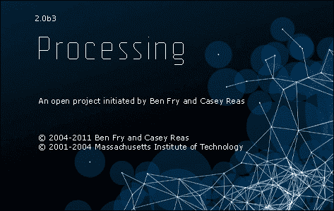

# 第五章. 使用数字输入进行感知

Arduino 板具有输入和输出。实际上，这也是这个平台的一个优势：直接提供连接 ATMega 芯片组引脚的引脚。然后我们可以直接将输入或输出连接到任何其他外部组件或电路，而无需焊接。

如果你需要，我在这里提醒你一些要点：

+   Arduino 具有数字和模拟输入

+   Arduino 具有也可以用于模拟输出的数字输出

我们将在本章中讨论数字输入。

我们将学习关于感知世界的全局概念。我们将遇到一个名为**Processing**的新伙伴，因为它以图形化的方式可视化和说明我们将要做的一切，这是一个很好的方式。它也是一个展示这个非常强大且开源工具的先导。然后，它将引导我们设计板与软件之间的第一个串行通信协议。

我们将特别与开关进行互动，但也会涵盖一些有用的硬件设计模式。

# 感知世界

在我们过度连接的世界中，许多系统甚至没有传感器。我们人类在我们的身体内部和外部拥有大量的生物传感器。我们能够通过皮肤感受温度，通过眼睛感受光线，通过鼻子和嘴巴感受化学成分，以及通过耳朵感受空气流动。从我们世界的特性中，我们能够感知、整合这种感觉，并最终做出反应。

如果我进一步思考，我可以回忆起我在大学早期生理学课程中学到的一个关于感官的定义（你还记得，我前生是一名生物学家）：

> “感官是提供感知数据的生理能力”

这个基本的生理模型是理解我们如何与 Arduino 板合作使其感知世界的一个好方法。

事实上，它引入了我们需要的三个要素：

+   容量

+   一些数据

+   一种感知

## 传感器提供了新的能力

传感器是一种物理转换器，能够测量一个物理量并将其转换为人类或机器可以直接或间接理解的信号。

例如，温度计是一种传感器。它能够测量局部温度并将其转换为信号。基于酒精或汞的温度计提供了刻度，根据温度的化学物质的收缩/膨胀使得它们易于读取。

为了让我们的 Arduino 能够感知世界，例如温度，我们就需要连接一个传感器。

### 一些类型的传感器

我们可以找到各种类型的传感器。当我们使用传感器这个词时，我们经常想到环境传感器。

我将首先引用一些环境量：

+   温度

+   湿度

+   压力

+   气体传感器（特定气体或非特定气体，烟雾）

+   电磁场

+   风速计（风速）

+   光线

+   距离

+   电容

+   运动

这是一个不完整的列表。对于几乎每个数量，我们都可以找到一个传感器。实际上，对于每个可量化的物理或化学现象，都有一种方法可以测量和跟踪它。每个都提供了与测量的数量相关的数据。

## 数量被转换为数据

当我们使用传感器时，原因是我们需要从物理现象（如温度或运动）中获得一个数值。如果我们能够直接用我们皮肤的热传感器测量温度，我们就能够理解化学成分的体积与温度本身之间的关系。因为我们从其他物理测量或计算中知道了这种关系，所以我们能够设计温度计。

事实上，温度计是将与温度相关的数量（在这里是体积）转换为温度计刻度上可读的值的转换。实际上，我们在这里有一个双重转换。体积是温度的函数。温度计内液体的液位是液体积的函数。因此，我们可以理解高度和温度是相关的。这是双重转换。

不管怎样，温度计是一个很好的模块，它集成了所有这些数学和物理的奇妙之处，以提供数据，一个值：温度。如图所示，体积被用来提供温度：


所有传感器都像这样工作。它们是测量物理现象并提供值的模块。我们稍后会看到这些值可以非常不同，最终也可以编码。

## 数据必须被感知

传感器提供的数据，如果被读取，就会更有意义。这可能是显而易见的，但想象一下，读者不是一个人类，而是一台仪器、一台机器，或者在我们的例子中，是一块 Arduino 板。

事实上，让我们以一个电子热传感器为例。首先，这个传感器必须供电才能工作。然后，如果我们能够供电但无法从其引脚物理测量它产生的电势，我们就无法欣赏它试图为我们提供的主要价值：温度。

在我们的例子中，Arduino 将是能够将电势转换为可读或至少对我们人类来说更容易理解的设备的装置。这又是一个转换。从我们想要翻译的物理现象，到显示解释物理现象的值的设备，有转换和感知。

我可以将这个过程简化，如下面的图所示：


# 数字意味着什么？

让我们精确地定义这里的数字术语。

## 数字和模拟概念

在计算机和电子领域，数字意味着离散的，这是与模拟/连续相反的。它也是一个数学定义。我们经常谈论域来定义数字和模拟的使用情况。

通常，模拟域是与物理测量相关的域。我们的温度可以具有所有可能和存在的值，即使我们的测量设备没有无限分辨率。

数字域是计算机的域。由于编码和有限的内存大小，计算机将模拟/连续值转换为数字表示。

在图表上，这可以表示如下：


## Arduino 的输入和输出

Arduino 拥有输入和输出。我们还可以区分模拟和数字引脚。

你必须记住以下要点：

+   Arduino 提供了既可以作为输入也可以作为输出的数字引脚。

+   Arduino 只提供模拟输入，不提供输出。

输入和输出是板子提供的引脚，用于与外部外围设备通信。

### 注意

输入提供了感知世界的能力。

输出提供了改变世界的能力。

我们经常谈论“读取引脚”作为输入和“写入引脚”作为输出。确实，从 Arduino 板的角度来看，我们是从世界读取并写入世界，对吧？

数字输入是一个设置为输入的数字引脚，它提供了读取电势和将其转换为 0 或 1 到 Arduino 板的能力。我们将很快使用开关来展示这一点。

但在直接操作之前，让我介绍一位新朋友，名叫**Processing**。我们将使用它来在本书中轻松地展示我们的 Arduino 测试。

# 介绍一位新朋友——Processing

Processing 是一种开源编程语言和集成开发环境（IDE），它为想要创建图像、动画和交互的人提供支持。

这个主要的开源项目始于 2001 年，由本·弗瑞（Ben Fry）和凯西·瑞斯（Casey Reas）发起，他们是麻省理工学院媒体实验室美学与计算小组约翰·梅达（John Maeda）的前学生和大师。

这是一个大多数非程序员使用的编程框架。确实，它主要是为此目的而设计的。Processing 的第一个目标之一就是通过即时满足视觉反馈的快感，为非程序员提供一种简单的编程方式。确实，正如我们所知，编程可以非常抽象。Processing 原生提供了一块画布，我们可以在上面绘制、书写和做更多的事情。它还提供了一个非常用户友好的 IDE，我们将在官方网站[`processing.org`](http://processing.org)上看到它。

你可能还会发现 Processing 这个术语被写成**Proce55ing**，因为在它的诞生时期，域名`processing.org`已经被占用。

## Processing 是一种语言吗？

处理（Processing）在严格意义上来说不是一种语言。它是 Java 的一个子集，包含一些外部库和自定义的 IDE。

使用 Processing 进行编程通常是通过下载时附带的原生 IDE 来完成的，正如我们将在本节中看到的。

Processing 使用 Java 语言，但提供了简化的语法和图形编程。它还将所有编译步骤简化为一个一键操作，就像 Arduino IDE 一样。

就像 Arduino 核心一样，它提供了一组庞大的现成函数。您可以在[`processing.org/reference`](http://processing.org/reference)找到所有参考。

现在使用 Processing 的方式不止一种。实际上，由于集成在网页浏览器中的 JavaScript 运行时变得越来越强大，我们可以使用一个基于 JavaScript 的项目。您仍然可以使用 Java 继续编码，将此代码包含在您的网页中，正如官方网站所说，“*Processing.js 会完成剩余的工作。这不是魔法，但几乎是的*。”网站是[`processingjs.org`](http://processingjs.org)。

还有非常有趣的一点：您可以使用 Processing 为 Android 移动操作系统打包应用程序。如果您感兴趣，可以阅读[`processing.org/learning/android`](http://processing.org/learning/android)。

我将避免在 JS 和 Android 应用程序上跑题，但我认为这些用法很重要，值得提及。

## 让我们安装并启动它

就像 Arduino 框架一样，Processing 框架不包含安装程序。您只需将其放在某个位置，然后从那里运行即可。

下载链接是：[`processing.org/download`](http://processing.org/download)。

首先，下载与您的操作系统对应的软件包。请参考网站了解您特定操作系统的安装过程。

在 OS X 上，您需要解压 zip 文件，并使用图标运行生成的文件：


Processing 图标

双击图标，您将看到一个相当漂亮的启动画面：



然后，您将看到如下所示的 Processing IDE：


Processing 的 IDE 看起来与其他 IDE 相似

## 一个非常熟悉的 IDE

事实上，Processing IDE 看起来就像 Arduino IDE。Processing IDE 就像是 Arduino IDE 的父亲。

这完全正常，因为 Arduino IDE 是从 Processing IDE 分叉出来的。现在，我们将检查我们是否也会非常熟悉 Processing IDE。

让我们探索它并运行一个小示例：

1.  前往**文件** | **示例** | **基础** | **数组** | **数组对象**。

1.  然后，点击第一个图标（播放符号箭头）。您应该看到以下截图：

    在 Processing 中运行 ArrayObjects 原生示例

1.  现在点击小方块（停止符号）。是的，这个新的游乐场非常熟悉。

    打开包含 ArrayObjects 示例的 Processing IDE

在顶部，我们可以看到一些熟悉的图标。

从左到右，它们如下所示：

+   **运行**（小箭头）：用于编译和运行您的程序

+   **停止**（小方块）：当程序运行时，用于停止程序

+   **新建项目**（小页面）：这是用来打开空白画布的

+   **打开项目**（顶部箭头）：这是用来打开现有项目的

+   **保存项目**（向下箭头）：这是用来保存项目的

+   **导出应用程序**（向右箭头）：这是用来创建应用程序的

当然，这里没有上传按钮。在这里，你不需要上传任何东西；我们在这里使用电脑，我们只想编写应用程序、编译它们并运行它们。

使用 Processing，你可以轻松地编写、编译和运行代码。

如果你在一个项目中使用多个文件（特别是如果你使用一些独立的 Java 类），你可以有一些标签页。

在这个标签区域下，你有文本区域，你可以在这里输入你的代码。代码的颜色与 Arduino IDE 中的颜色相同，这非常有用。

最后，在底部，你有日志控制台区域，所有消息都可以在这里输出，从错误到我们自己的跟踪消息。

### 替代 IDE 和版本控制

如果你感兴趣，想挖掘一些 IDE 替代品，我建议你使用通用的开源软件开发环境 Eclipse。我向所有想进一步在纯开发领域发展的学生推荐这个强大的 IDE。它可以轻松设置以支持版本控制。

版本控制是一个非常好的概念，它提供了一种轻松跟踪代码版本的方法。例如，你可以编写一些代码，测试它，然后在版本控制系统中备份，然后继续你的代码设计。如果你运行它，并在某个时刻出现一个漂亮而可爱的崩溃，你可以轻松地检查你的工作代码和新不工作的代码之间的差异，从而使故障排除变得容易得多！我不会详细描述版本控制系统，但我想向你介绍两个广泛使用的系统。

+   [Apache Subversion](http://subversion.apache.org)

+   **Git**: [`git-scm.com`](http://git-scm.com)

## 检查一个示例

这里有一小段代码展示了几个简单易行的设计模式。你还可以在代码包中的`Chapter05` `/p` `rocessingMultipleEasing/` 文件夹中找到这段代码：

```cpp
// some declarations / definitions
int particlesNumber = 80;    // particles number
float[] positionsX = new float[particlesNumber]; // store particles X-coordinates float[] positionsY = new float[particlesNumber]; // store particles Y-coordinates
float[] radii = new float[particlesNumber];      // store particles radii
float[] easings = new float[particlesNumber];    // store particles easing amount

// setup is run one time at the beginning
void setup() {
  size(600, 600); // define the playground
  noStroke();     // define no stroke for all shapes drawn

  // for loop initializing easings & radii for all particles
  for (int i=0 ; i < particlesNumber ; i++)
  {
    easings[i] = 0.04 * i / particlesNumber;  // filling the easing array
    radii[i] = 30 * i / particlesNumber ;     // filling the radii array
  }
}

// draw is run infinitely
void draw() {
  background(34);  // define the background color of the playground

  // let's store the current mouse position
  float targetX = mouseX;  
  float targetY = mouseY;

  // for loop across all particles
  for (int i=0 ; i < particlesNumber ; i++)
  {

    float dx = targetX - positionsX[i];  // calculate X distance mouse / particle
    if (abs(dx) > 1) {                   // if distance > 1, update position
      positionsX[i] += dx * easings[i];
    }

    float dy = targetY - positionsY[i];    // same for Y
    if (abs(dy) > 1) {
      positionsY[i] += dy * easings[i];
    }
    // change the color of the pencil for the particle i
    fill(255 * i / particlesNumber);

    // draw the particle i
    ellipse(positionsX[i], positionsY[i], radii[i], radii[i]);
  }
}
```

你可以运行这段代码。然后，你可以将鼠标移入画布中，享受正在发生的事情。


processingMultipleEasing 代码正在运行并显示一系列奇怪的粒子，这些粒子跟随鼠标移动

首先，检查代码。基本上，这是 Java。我想你不会太惊讶，对吧？确实，Java 源自 C。

你可以在你的代码中看到三个主要部分：

+   变量声明/定义

+   `setup()`函数只在开始时运行一次

+   `draw()`函数会无限运行，直到你按下停止键

好的。你可以看到 Arduino 核心和 Processing 中的`setup()`函数具有类似的作用，`loop()`和`draw()`也是如此。

这段代码展示了 Processing 中的一些常用设计模式。我首先初始化一个变量来存储全局粒子数，然后为我想创建的每个粒子初始化一些数组。请注意，所有这些数组在这个步骤都是空的！

这种模式很常见，因为它提供了良好的可读性，并且工作得很好。我本可以使用类或甚至是多维数组，但在后一种情况下，除了代码更短（但可读性更差）之外，我甚至不会得到任何好处。在这些数组中，第*N*个索引值代表第*N*个粒子。为了存储/检索粒子*N*的参数，我必须操纵每个数组中的第*N*个值。参数分布在每个数组中，但存储和检索都很方便，不是吗？

在`setup()`中，我定义并实例化了画布及其 600 x 600 的大小。然后，我定义在所有我的绘画中都不会有线条。例如，圆的线条是其边界。

然后，我使用`for`循环结构填充`easing`和`radii`数组。这是一个非常常见的模式，我们可以使用`setup()`在开始时初始化一系列参数。然后我们可以检查`draw()`循环。我定义了一个背景颜色。这个函数也会擦除画布并填充参数中的颜色。查看参考页面上的背景函数，以了解我们如何使用它。这种擦除/填充是一种很好的方式来擦除每一帧并重置画布。

在这次擦除/填充之后，我将鼠标的当前位置存储在每个坐标的局部变量`targetX`和`targetY`中。

程序的核心位于`for`循环中。这个循环遍历每个粒子，并为每个粒子生成一些内容。代码相当直观。我还可以在这里补充说，我正在检查鼠标和每个粒子之间的距离，这是在每一帧（每次`draw()`的运行）中进行的，并且我会根据其缓动效果移动每个粒子来绘制它们。

这是一个非常简单的例子，但也是一个很好的例子，我用来展示 Processing 的强大功能。

## Processing 和 Arduino

Processing 和 Arduino 是非常好的朋友。

首先，它们都是开源的。这是一个非常友好的特性，带来了许多优势，如代码源共享和庞大的社区等。它们适用于所有操作系统：Windows、OS X 和 Linux。我们还可以免费下载它们，并点击几下即可运行。

我最初是用 Processing 编程的，并且我经常用它来做一些自己的数据可视化项目和艺术作品。然后，我们可以在屏幕上通过平滑和原始的形状来展示复杂和抽象的数据流。

我们现在要一起做的是在 Processing 画布上显示 Arduino 的活动。实际上，这是 Processing 作为 Arduino 友好的软件的常见用途。

我们将设计一个非常简单且便宜的硬件和软件之间的通信协议。这将展示我们在本书下一章将进一步深入探讨的路径。确实，如果你想让你的 Arduino 与另一个软件框架（我想到了 Max 6、openFrameworks、Cinder 以及许多其他框架）通信，你必须遵循相同的设计方法。


Arduino 和一些软件朋友

我经常说 Arduino 可以作为一个非常智能的*器官*来工作。如果你想将一些软件连接到真实的物理世界，Arduino 就是你的选择。确实，通过这种方式，软件可以感知世界，为你的电脑提供新的功能。让我们通过在电脑上显示一些物理世界事件来继续前进。

# 按下按钮

我们将会有趣。是的，这就是我们将物理世界与虚拟世界连接的特殊时刻。Arduino 正是关于这一点。

## 按钮和开关是什么？

**开关**是一种能够断开电路的电气元件。有很多不同类型的开关。

### 不同类型的开关

一些开关被称为**切换开关**。切换开关也被称为连续开关。为了对电路进行操作，切换开关可以每次按下并释放，以便进行操作，当你释放它时，操作会继续。

一些被称为**瞬态开关**。瞬态开关也被称为**动作按钮**。为了对电路进行操作，你必须按下并保持开关按下以继续操作。如果你释放它，操作就会停止。

通常，我们家里的所有开关都是切换开关。除了你必须按下以切断并释放以停止的混音器开关，这意味着它是一个瞬态开关。

## 基本电路

这里有一个带有 Arduino、一个瞬态开关和一个电阻的基本电路。

我们想在按下瞬态开关时打开板上的内置 LED，并在释放它时关闭 LED。


小电路

我现在向您展示的是我们即将要工作的电路。这也是一个很好的理由，让你更熟悉电路图。

### 电缆

每条线代表两个组件之间的连接。根据定义，一条线是电缆，从一侧到另一侧没有电势。它也可以定义为以下内容：电缆的电阻为 0 欧姆。然后我们可以这样说，通过电缆连接的两个点具有相同的电势。

### 现实世界的电路

当然，我不想直接展示下一个图表。现在我们必须构建真实的电路，所以请拿一些电线、你的面包板和瞬态开关，并按照下一个图表所示连接整个电路。

你可以取一个大约 10 千欧姆的电阻。我们将在下一页解释电阻的作用。


真实电路中的瞬态开关

让我们更详细地解释一下。

让我们记住面包板布线；我在面包板顶部使用冷线和热线（冷线是蓝色，表示地线，热线是红色，表示+5 V）。在我将地线和+5 V 从 Arduino 连接到总线之后，我使用总线来布线板的其他部分；这更容易，并且需要更短的电缆。

地线和数字引脚 2 之间有一个电阻。+5 V 线和引脚 2 之间有一个瞬态开关。引脚 2 将被设置为输入，这意味着它能够吸收电流。

通常，开关是按下开。按下它们闭合电路并允许电流流动。所以，在这种情况下，如果我不按下开关，就没有从+5 V 到引脚 2 的电流。

在按下期间，电路闭合。然后，电流从+5 V 流向引脚 2。这有点比喻和滥用，我应该说我在这+5 V 和引脚 2 之间创建了一个电势，但我需要更简洁地说明这一点。

那么这个电阻，为什么在这里？

## 上拉和下拉的概念

如果全局电路很简单，那么电阻部分一开始可能会有些棘手。

将数字引脚设置为输入提供了吸收电流的能力。这意味着它表现得像地线。实际上，内部工作方式确实就像相关的引脚连接到地线一样。

使用正确编码的固件，我们就有能力检查引脚 2。这意味着我们可以测试它并读取电势值。因为这是一个数字输入，接近+5 V 的电势会被解释为高值，而接近 0 V 则会被解释为低值。这两个值都是在 Arduino 核心内部定义的常量。但即使在一个完美的数字世界中一切看起来都完美无缺，这也并不真实。

实际上，输入信号噪声可能会被误读为按钮按下。

为了确保安全，我们使用所谓的下拉电阻。这通常是一个高阻抗电阻，为考虑的数字引脚提供电流吸收，如果开关未按下，则使其在 0 V 值时更安全。下拉以更一致地识别为低值，上拉以更一致地识别为高值。

当然，全球能源消耗略有增加。在我们的情况下，这在这里并不重要，但你必须知道这一点。关于这个相同的概念，一个上拉电阻可以用来将+5 V 连接到数字输出。一般来说，你应该知道芯片组的 I/O 不应该悬空。

这里是你必须记住的：

| 数字引脚类型 | 输入 | 输出 |
| --- | --- | --- |
| 上拉电阻 | 下拉电阻 | 上拉电阻 |

我们想要按下开关，特别是这个动作必须使 LED 点亮。我们首先编写伪代码。

### 伪代码

下面是一个可能的伪代码。以下是我们希望固件遵循的步骤：

1.  定义引脚。

1.  定义一个变量来表示当前开关状态。

1.  将 LED 引脚设置为输出。

1.  将开关引脚设置为输入。

1.  设置一个无限循环。在无限循环中执行以下操作：

    1.  读取输入状态并存储它。

    1.  如果输入状态是 HIGH，则点亮 LED。

    1.  否则关闭 LED。

### 代码

这里是将此伪代码翻译成有效 C 代码的示例：

```cpp
const int switchPin = 2;     // pin of the digital input related to the switch
const int ledPin =  13;      // pin of the board built-in LED

int switchState = 0;         // storage variable for current switch state

void setup() {
  pinMode(ledPin, OUTPUT);   // the led pin is setup as an output
  pinMode(switchPin, INPUT); // the switch pin is setup as an input
}

void loop(){
  switchState = digitalRead(switchPin);  // read the state of the digital pin 2

  if (switchState == HIGH) {     // test if the switch is pushed or not

    digitalWrite(ledPin, HIGH);  // turn the LED ON if it is currently pushed
  }
  else {
    digitalWrite(ledPin, LOW);   // turn the LED OFF if it is currently pushed
  }
}
```

如往常一样，你还可以在 Packt Publishing 网站上找到代码，在`Chapter05/MonoSwitch/`文件夹中，以及其他可下载的代码文件。

上传它并看看会发生什么。你应该有一个很好的系统，你可以按下一个开关并点亮一个 LED。太棒了！

现在我们让 Arduino 板和 Processing 相互通信。

## 让 Arduino 和 Processing 进行对话

假设我们想在计算机上可视化我们的开关操作。

我们必须在 Arduino 和 Processing 之间定义一个小型的通信协议。当然，我们会使用串行通信协议，因为它设置起来相当简单，而且很轻量。

我们可以将协议设计为一个通信库。目前，我们只使用本地的 Arduino 核心来设计协议。然后，在本书的后面部分，我们将设计一个库。

### 通信协议

通信协议是一套规则和格式，用于在两个实体之间交换消息。这些实体可以是人类、计算机，也许还有更多。

事实上，我会用一个基本的类比来解释我们的语言。为了相互理解，我们必须遵循一些规则：

+   语法和语法规则（我必须使用你知道的单词）

+   物理规则（我必须说得足够大声）

+   社交规则（我不应该在向你询问时间之前侮辱你）

我可以引用许多其他规则，比如说话的速度、两个实体之间的距离等等。如果每个规则都被同意并验证，我们就可以一起交流。在设计协议之前，我们必须定义我们的要求。

#### 协议要求

我们想要做什么？

我们需要在计算机内部的 Arduino 和 Processing 之间建立一个通信协议。对！这些要求对于你将要设计的许多通信协议通常是相同的。

这里是一个非常重要的简短列表：

+   协议必须能够在不重写一切的情况下扩展，每次我想添加新的消息类型时。

+   协议必须能够快速发送足够的数据

+   协议必须易于理解，并且有良好的注释，特别是对于开源和协作项目。

#### 协议设计

每条消息的大小为 2 字节。这是一个常见的数据包大小，我建议这样组织数据：

+   **字节 1**：开关编号

+   **字节 2**：开关状态

我将字节 1 定义为开关编号的表示，通常是因为扩展性的要求。对于一个开关，数字将是 0。

我可以轻松地在板和计算机之间实例化串行通信。实际上，当我们使用串行监控时，至少在 Arduino 一侧我们已经做到了这一点。

我们如何使用 Processing 来实现这一点？

### The Processing code

Processing 已经内置了一个非常有用的库集。具体来说，我们将使用串行库。

让我们先画一个伪代码，就像往常一样。

#### 绘制伪代码

我们希望程序做什么？

我建议有一个大圆圈。它的颜色将代表开关的状态。*深色*表示未释放，而*绿色*表示按下。

可以如下创建伪代码：

1.  定义并实例化串行端口。

1.  定义一个当前绘图颜色为深色。

1.  在无限循环中，执行以下操作：

    1.  检查串行端口和抓取数据是否已接收。

    1.  如果数据指示状态是关闭的，将当前绘图颜色从颜色更改为深色。

    1.  否则，将当前绘图颜色更改为绿色。

    1.  使用当前绘图颜色绘制圆圈。

#### 让我们写下这段代码

让我们打开一个新的 Processing 画布。

因为 Processing IDE 的工作方式类似于 Arduino IDE，需要在一个文件夹中创建所有保存的项目文件，所以我建议您直接在磁盘上的正确位置保存画布，即使它是空的。命名为`processingOneButtonDisplay`。

您可以在 Packt 网站上找到代码，位于`Chapter05/processingOneButtonDisplay/`文件夹中，可供下载，以及其他代码文件。


在您的代码中包含库

要从 Processing 核心包含串行库，您可以转到**草图 | 导入库… | 串行**。这将在您的代码中添加这一行：`processing.serial.*;`

您也可以自己输入这个语句。

以下是一段带有许多注释的代码：

```cpp
import processing.serial.*;

Serial theSerialPort;            // create the serial port object
int[] serialBytesArray = new int[2];  // array storing current message
int switchState;                 // current switch state
int switchID;                    // index of the switch
int bytesCount = 0;              // current number of bytes relative to messages
boolean init = false;            // init state
int fillColor = 40;              // defining the initial fill color

void setup(){

  // define some canvas and drawing parameters
  size(500,500);
  background(70);
  noStroke();

  // printing the list of all serial devices (debug purpose)
  println(Serial.list());

  // On osx, the Arduino port is the first into the list
  String thePortName = Serial.list()[0];

  // Instantate the Serial Communication
  theSerialPort = new Serial(this, thePortName, 9600);
}

void draw(){

  // set the fill color
  fill(fillColor);

  // draw a circle in the middle of the screen
  ellipse(width/2, height/2, 230, 230);
}

void serialEvent(Serial myPort) {

  // read a byte from the serial port
  int inByte = myPort.read();

  if (init == false) {         // if there wasn't the first hello
    if (inByte == 'Z') {       // if the byte read is Z
      myPort.clear();          // clear the serial port buffer
      init = true;             // store the fact we had the first hello
      myPort.write('Z');       // tell the Arduino to send more !
    } 
  } 
  else {                       // if there already was the first hello

    // Add the latest byte from the serial port to array
    serialBytesArray[bytesCount] = inByte;
    bytesCount++;

    // if the messages is 2 bytes length
    if (bytesCount > 1 ) {
      switchID = serialBytesArray[0]; // store the ID of the switch
      switchState = serialBytesArray[1]; // store the state of the switch

      // print the values (for debugging purposes):
      println(switchID + "\t" + switchState);

      // alter the fill color according to the message received from Arduino
      if (switchState == 0) fillColor = 40;
      else fillColor = 255;

      // Send a capital Z to request new sensor readings
      myPort.write('Z');

      // Reset bytesCount:
      bytesCount = 0;
    }
  }
}
```

#### 变量定义

`theSerialPort`是`Serial`库的对象。我必须首先创建它。

`serialBytesArray`是一个包含两个整数的数组，用于存储来自 Arduino 的消息。您还记得吗？当我们设计协议时，我们谈到了 2 字节消息。

`switchState`和`switchID`是全局但临时变量，用于存储来自板子的开关状态和开关 ID。开关 ID 被放置在那里，以便（接近）未来的实现，以便在我们要使用多个开关的情况下区分不同的开关。

`bytesCount`是一个有用的变量，用于跟踪我们的消息读取中的当前位置。

`init`在开始时定义为`false`，当第一次接收到来自 Arduino 的第一个字节（以及一个特殊的字节，`Z`）时变为`true`。这是一种首次接触的目的。

然后，我们跟踪填充颜色和初始颜色是`40`。`40`只是一个整数，并将稍后用作函数`fill()`的参数。

#### setup()

我们定义画布（大小、背景颜色和没有轮廓）。

我们打印出计算机上可用的所有串行端口的列表。这是下一个语句的调试信息，我们将第一个串行端口的名称存储到一个 String 中。实际上，您可能需要根据打印列表中 Arduino 端口的定位将数组元素从 0 更改为正确的位置。

这个字符串随后被用于一个非常重要的语句，该语句在 9600 波特率下实例化串行通信。

当然，这个 `setup()` 函数只运行一次。

#### draw()

在这里，draw 函数非常简单。

我们将变量 `fillColor` 传递给 `fill()` 函数，设置所有后续形状填充的颜色。

然后，我们使用椭圆函数绘制圆形。这个函数接受四个参数：

+   椭圆中心的 x 坐标（这里 `width/2`）

+   椭圆中心的 y 坐标（这里 `height/2`）

+   椭圆的宽度（这里 `230`）

+   椭圆的高度（这里 `230`）

在 Processing IDE 中用蓝色标注的 `width` 和 `height` 是画布的当前宽度和高度。使用它们非常有用，因为如果你通过选择新的画布大小更改 `setup()` 语句，你的代码中所有的 `width` 和 `height` 都会自动更新，而无需手动更改它们。

请记住，宽度和高度相同的椭圆是一个圆（！）！好的。但是这里的魔法在哪里？它只会绘制一个圆形，每次都是同一个（大小和位置）。`fillColor` 是 `draw()` 函数的唯一变量。让我们看看那个奇怪的回调 `serialEvent()`。

#### serialEvent() 回调

我们在 第四章 中讨论了回调，*通过函数、数学和计时改进编程*。

这里，我们在 Processing 中有一个纯回调方法。这是一个事件驱动的回调。在这种情况下，不必每次轮询我们的串行端口是否需要读取数据是有用且高效的。确实，与用户界面相关的事件数量远少于 Arduino 板的处理器周期数。在这种情况下实现回调更聪明；一旦发生串行事件（即接收到消息），我们就执行一系列语句。

`myPort.read()` 首先读取接收到的字节。然后我们使用 `init` 变量进行测试。实际上，如果是第一条消息，我们想检查通信是否已经启动。

在第一次“你好”（`init == false`）的情况下，如果来自 Arduino 板的消息是 `Z`，Processing 程序会清除自己的串行端口，存储通信刚刚开始的事实，并将 `Z` 重新发送回 Arduino 板。这并不复杂。

这可以如下说明：

假设我们只有通过先互相说“你好”才能开始交谈。我们并没有互相观察（没有事件）。然后我开始说话。你转向我（串行事件发生）并倾听。我是不是在对你说“你好”？（消息是否为 `Z`？）。如果不是，你只需转回你的头（没有 `else` 语句）。如果是，你回答“你好”（发送回 `Z`），通信就开始了。

那么，接下来会发生什么呢？

如果通信已经开始，我们必须将读取的字节存储到`serialBytesArray`中，并增加`bytesCount`。当字节正在接收且`bytesCount`小于或等于 1 时，这意味着我们没有完整的消息（一个完整的消息是两个字节），因此我们在数组中存储更多的字节。

当字节计数等于`2`时，我们就有了完整的消息，我们可以将其“分割”成变量`switchID`和`switchState`。我们是这样做的：

```cpp
switchID = serialBytesArray[0]; 
switchState = serialBytesArray[1];
```

下一个语句是一个调试语句：我们打印每个变量。然后，方法的核心是测试`switchState`变量。如果它是`0`，这意味着开关被释放，我们将`fillColor`修改为`40`（深色，`40`表示每个 RGB 组件的值 40；请查看 Processing 参考中的`color()`方法[`processing.org/reference/color_.html`](http://processing.org/reference/color_.html)）。如果不是`0`，我们将`fillColor`修改为`255`，这意味着白色。我们可以通过不只用`else`，而是用`else if (switchState ==1)`来更安全一些。

为什么？因为我们不确定可以发送的所有消息（缺乏文档或其他使我们不确定的原因），只有当`switchState`等于`1`时，我们才能将颜色修改为白色。这个概念也可以在优化状态下完成，但在这里，它相当简单，所以我们可以保持原样。

好的。这是一件既好又重的东西，对吧？现在，让我们看看我们如何修改 Arduino 代码。你还记得吗？它还没有准备好通信。

### 新的 Arduino 固件已准备好进行通信

因为我们现在有了一种很好的方式来显示开关状态，所以我将移除与板载内置 LED 相关的一切，以下是结果：

```cpp
const int switchPin = 2;     // pin of the digital input related to the switch
int switchState = 0;         // storage variable for current switch state

void setup() {
  pinMode(switchPin, INPUT); // the switch pin is setup as an input
}

void loop(){
    switchState = digitalRead(switchPin); 
}
```

我们需要添加什么？所有的`Serial`相关内容。我还想添加一个专门用于第一个“hello”的小函数。

这是结果，然后我们将看到解释：

```cpp
const int switchPin = 2;     // pin of the digital input related to the switch
int switchState = 0;         // storage variable for current switch state
int inByte = 0;

void setup() {
  Serial.begin(9600);
  pinMode(switchPin, INPUT); // the switch pin is setup as an input
  sayHello();
}

void loop(){

  // if a valid byte is received from processing, read the digital in.
  if (Serial.available() > 0) {
    // get incoming byte:
    inByte = Serial.read();
    switchState = digitalRead(switchPin); 

    // send switch state to Arduino
    Serial.write("0");
    Serial.write(switchState);
  }
}

void sayHello() {
  while (Serial.available() <= 0) {
    Serial.print('Z');   // send a capital Z to Arduino to say "HELLO!"
    delay(200);
  }
}
```

我首先定义了一个新变量：`inByte`。它存储读取的字节。然后，在`setup()`方法中，我实例化了串行通信，就像我们之前学习的那样使用 Arduino。然后，我设置了开关引脚的`pinMode`方法，然后调用`sayHello()`。

这个函数只是等待某事发生。请集中注意这一点。

我在`setup()`中调用这个函数。这是一个简单的调用，不是一个回调或其他任何东西。这个函数包含一个`while`循环，当`Serial.available()`小于或等于零时。这意味着什么？这意味着这个函数在第一个字节到达 Arduino 板的串行端口时暂停`setup()`方法。`loop()`在`setup()`完成之前不会运行，所以这是一个很好的技巧来等待第一个外部事件；在这种情况下，第一次通信。实际上，当 Processing 没有回答时，板正在发送消息`Z`（即，“hello”）。

结果是，当你插入你的板时，它会在你运行 Processing 程序时连续发送`Z`。然后开始通信，你可以按开关并查看发生了什么。实际上，一旦通信开始，`loop()`就开始它的无限循环。首先在每个周期进行测试，我们只测试是否有字节被接收。无论接收到的字节是什么（Processing 只向板发送`Z`），我们都读取开关的数字引脚并发送两个字节。请注意：每个字节都是使用`Serial.write()`写入串行端口的。你必须发送 2 个字节，所以你需要堆叠两个`Serial.write()`。第一个字节是按下的/释放的开关的编号（ID）；在这里，它不是一个变量，因为我们只有一个开关，所以它是一个整数 0。第二个字节是开关状态。我们刚才看到了一个很好的设计模式，涉及板、在计算机上运行的外部程序以及两者之间的通信。

现在，让我们更进一步，玩转一个以上的开关。

# 玩转多个按钮

我们可以用一个以上的开关来扩展我们之前设计的逻辑。

使用多个开关的方法有很多，通常在 Arduino 上也有多个输入。我们现在将看到一种既便宜又简单的方法。这种方法不涉及在仅几个 Arduino 输入上复用大量输入，而是一种基本的点对点连接，其中每个开关都连接到一个输入。我们将在稍后学习复用（在下一章中）。

## 电路

下面是与多个开关一起工作所需的电路图：


将三个瞬态开关连接到 Arduino 板

电路图是对之前只显示一个开关的电路图的扩展。我们可以看到三个开关位于+5V 和三个下拉电阻之间。然后我们还可以看到连接到数字输入 2 到 4 的三根线。

这里是一个小的记忆刷新：为什么我没有使用数字引脚 0 或 1？

因为我在 Arduino 中使用串行通信，所以我们不能使用数字引脚 0 和 1（每个分别对应于串行通信中使用的 RX 和 TX）。即使我们使用 USB 链路作为我们串行消息的物理支持，Arduino 板也是这样设计的，我们必须非常小心。

这是带有面包板的电路视图。我故意没有对齐每一根线。为什么？你不记得我想要你在阅读这本书后完全自主吗？是的，你会在现实世界中找到很多这样的电路图。你也必须熟悉它们。这可能是一个（简单的）家庭作业。


之前的电路显示了三个开关、三个下拉电阻和 Arduino 板。

必须修改两个源代码以提供对新电路的支持。

让我们在那里添加一些内容。

## Arduino 代码

下面是新的代码；当然，你可以在 Packt 网站上找到它，在 `Chapter05/MultipleSwitchesWithProcessing/` 文件夹中，与其他代码文件一起可供下载：

```cpp
#define switchesNumber 3             // define the number of switches as a constant

int switchesStates[switchesNumber] ; // array storing current switches states
int inByte = 0;

void setup() {
  Serial.begin(9600);

  // initiating each pins as input and filling switchesStates with zeroes
  for(int i = 0 ; i < switchesNumber ; i++)
  {
// BE CAREFUL TO THAT INDEX
pinMode(i + 2, INPUT); // the switch pin is setup as an input

    switchesStates[i] = 0 ;
  }

  sayHello(); // waiting for the processing program hello answer
}

void loop(){

  // if a valid byte is received from processing, read all digital inputs.
  if (Serial.available() > 0) {

    // get incoming byte
    inByte = Serial.read();

    for(int i = 0 ; i < switchesNumber ; i++)
    {
      switchesStates[i] = digitalRead(i+2); // BE CAREFUL TO THAT INDEX
   // WE ARE STARTING FROM PIN 2 !
      Serial.write(i);                 // 1st byte = switch number (0 to 2)
      Serial.write(switchesStates[i]); // 2nd byte = the switch i state
    }
  }
}

void sayHello() {
  while (Serial.available() <= 0) {
    Serial.print('Z');   // send a capital Z to Arduino to say "HELLO!"
    delay(200);
  }
}
```

让我们来解释这段代码。

首先，我将一个常量 `switchesNumber` 定义为数字 `3`。这个数字可以从 `1` 到 `12` 中的任何其他数字更改。这个数字代表当前连接到板上的开关数量，从数字引脚 2 到数字引脚 14。所有开关都必须相互连接，中间不能有空引脚。

然后，我定义了一个数组来存储开关的状态。我使用 `switchesNumber` 常量作为长度来声明它。我必须在 `setup()` 方法中用 `for` 循环填充这个数组，我创建了一个 `for` 循环。这提供了一种安全的方式，确保代码中所有开关都有一个释放状态。

我仍然使用 `sayHello()` 函数来设置与 Processing 的通信开始。

的确，我必须填充数组 `switchesStates` 中的每个开关状态，所以我添加了 `for` 循环。请注意每个 `for` 循环中的索引技巧。实际上，因为从 0 开始似乎更方便，而且在现实世界中，在使用串行通信时我们绝对不能使用数字引脚 0 和 1，所以我一处理实际的数字引脚数量，也就是使用 `pinMode()` 和 `digitalRead()` 这两个函数时，就立即添加了 `2`。

现在，让我们也升级一下 Processing 代码。

## Processing 代码

下面是新的代码；你可以在 Packt 网站的 `Chapter05/MultipleSwitchesWithProcessing/` 文件夹中找到它，与其他代码文件一起可供下载：

```cpp
import processing.serial.*;

int switchesNumber = 2;

Serial theSerialPort;                 // create the serial port object
int[] serialBytesArray = new int[2];  // array storing current message
int switchID;                         // index of the switch
int[] switchesStates = new int[switchesNumber]; // current switch state
int bytesCount = 0; // current number of bytes relative to messages
boolean init = false;                 // init state
int fillColor = 40;                   // defining the initial fill color

// circles display stuff
int distanceCircles ;
int radii;

void setup() {

  // define some canvas and drawing parameters
  size(500, 500);
  background(70);
  noStroke();
  distanceCircles = width / switchesNumber;
  radii = distanceCircles/2;

  // printing the list of all serial devices (debug purpose)
  println(Serial.list());

  // On osx, the Arduino port is the first into the list
  String thePortName = Serial.list()[0];

  // Instantate the Serial Communication
  theSerialPort = new Serial(this, thePortName, 9600);

  for (int i = 0 ; i < switchesNumber ; i++)
  {
    switchesStates[i] = 0;
  }
}

void draw() {

  for (int i = 0 ; i < switchesNumber ; i++)
  {
    if (switchesStates[i] == 0) fill(0);
    else fill(255);

    // draw a circle in the middle of the screen
    ellipse(distanceCircles * (i + 1) - radii, height/2, radii, radii);
  }
}

void serialEvent(Serial myPort) {

  // read a byte from the serial port
  int inByte = myPort.read();

  if (init == false) {         // if this is the first hello
    if (inByte == 'Z') {       // if the byte read is Z
      myPort.clear();          // clear the serial port buffer
      init = true;             // store the fact we had the first hello
      myPort.write('Z');       // tell the Arduino to send more !
    }
  }
  else {                       // if there already was the first hello

    // Add the latest byte from the serial port to array
    serialBytesArray[bytesCount] = inByte;
    bytesCount++;

    // if the messages is 2 bytes length
    if (bytesCount > 1 ) {
      switchID = serialBytesArray[0];      // store the ID of the switch
      switchesStates[switchID] = serialBytesArray[1]; // store state of the switch

      // print the values (for debugging purposes):
      println(switchID + "\t" + switchesStates[switchID]);
      // Send a capital Z to request new sensor readings
      myPort.write('Z');

      // Reset bytesCount:
      bytesCount = 0;
    }
  }
}
```

下面是使用五个开关并按下第四个按钮时此代码渲染的截图：


那么，我改变了什么？

与 Arduino 代码中的概念相同，我添加了一个变量（不是一个常量），命名为 `switchesNumber`。一个很好的进化可能是向协议中添加有关开关数量的内容。例如，Arduino 板可以根据 Arduino 固件中定义的一个常量来通知 Processing 开关的编号。这将节省我们在更改此数字时手动更新 processing 代码的时间。

我还将变量 `switchState` 转换成了一个整数数组 `switchesStates`。这个数组存储了所有开关的状态。我添加了两个与显示相关的变量：`distanceCircles` 和 `radii`。这些用于根据开关的数量动态显示圆的位置。实际上，我们希望每个开关对应一个圆。

`setup()` 函数几乎和之前一样。

我在这里通过将画布宽度除以圆的数量来计算两个圆之间的距离。然后，我通过将它们之间的距离除以 2 来计算每个圆的半径。这些数字可以更改。你可以有非常不同的审美选择。

这里的大不同之处也是`for`循环。我在整个`switchesStates`数组中填充零以初始化它。一开始，没有任何开关被按下。现在的`draw()`函数也包括一个`for`循环。请注意这里。我移除了`fillColor`方法，因为我将填充颜色的选择移到了`draw`中。这是一个替代方案，向你展示代码的灵活性。

在同一个`for`循环中，我在绘制圆号*i*。我将让你自己检查我是如何放置这些圆圈的。`serialEvent()`方法也没有太多变化。正如我之前写的，我移除了填充颜色的变化。我还使用了`switchesStates`数组，以及存储在`switchID`中的消息的第一个字节的索引。

现在，你在 Arduino 板上上传了固件后，可以在每一侧运行代码。

魔法？我想你现在知道这根本不是魔法，而是美丽的，也许吧。

让我们进一步讨论关于开关的一些重要内容，同时也与其他开关相关。

# 理解去抖动概念

现在有一个小节，与模拟输入相比，它相当酷且轻巧，我们将在下一章深入探讨。

我们将讨论当有人按下按钮时发生的事情。

## 什么？谁在弹跳？

现在，我们必须用我们的微观生物控制论眼睛来放大开关的结构。

开关是由金属和塑料制成的。当你按下盖子时，一块金属移动并接触到另一块金属，闭合电路。在微观层面和非常短的时间间隔内，事情并不那么干净。实际上，移动的金属片会弹跳到另一部分。通过使用示波器测量 Arduino 数字引脚上的电势，我们可以在按下后大约 1 毫秒的电压曲线上看到一些噪声。

这些振荡可能会在某些程序中生成错误的输入。想象一下，你想要按顺序计数状态转换，例如，当用户按下开关七次时运行某些操作。如果你有一个弹跳系统，通过只按一次，程序可能会计数很多转换，即使用户只按了一次开关。

查看下一个图表。它表示电压与时间的关系。时间轴上的小箭头显示了开关被按下的时刻：


我们如何处理这些振荡？

## 如何去抖动

我们有两个不同的元素，我们可以对其施加作用：

+   电路本身

+   固件

电路本身可以进行修改。我可以引用一些解决方案，例如添加二极管、电容器和一些施密特触发器反相器。我不会详细解释这个解决方案，因为我们将在软件中实现它，但我可以解释全局概念。在这种情况下，电容器将在开关弹跳时充电和放电，从而平滑噪声的峰值。当然，需要进行一些测试，以找到适合您精确需求的完美组件。

固件也可以进行修改。

基本上，我们可以使用基于时间的过滤器，因为弹跳发生在特定的时间段内。

下面是代码，然后是解释：

```cpp
const int switchPin = 2;     // pin of the digital input related to the switch
const int ledPin =  13;      // pin of the board built-in LED

int switchState = 0;         // storage variable for current switch state
int lastSwitchState= LOW;

// variables related to the debouncing system
long lastDebounceTime = 0;
long debounceDelay = 50;

void setup() {
  pinMode(ledPin, OUTPUT);   // the led pin is setup as an output
  pinMode(switchPin, INPUT); // the switch pin is setup as an input
}

void loop(){

  // read the state of the digital pin
  int readInput = digitalRead(switchPin);

  // if freshly read state is different than the last debounced value
  if (readInput != lastSwitchState){
   // reset the debounce counter by storing the current uptime ms
   lastDebounceTime = millis();
  }

  // if the time since the last debounce is greater than the debounce delay
  if ( (millis() - lastDebounceTime) > debounceDelay ){
   // store the value because it is a debounced one and we are safe
   switchState = readInput;
  }

  // store the last read state for the next loop comparison purpose
  lastSwitchState = readInput;

  // modify the LED state according to the switch state
  if (switchState == HIGH)
  {     // test if the switch is pushed or not

    digitalWrite(ledPin, HIGH);  // turn the LED ON if it is currently pushed
  }
  else
  {
    digitalWrite(ledPin, LOW);   // turn the LED OFF if it is currently pushed
  }
}
```

下面是去抖动周期的示例。

在开始时，我定义了一些变量：

+   `lastSwitchState`：此变量存储最后一个读取的状态

+   `lastDebounceTime`：此变量存储上次去抖动发生的时间

+   `debounceDelay`：这是在此期间被视为安全值的值

我们在这里使用`millis()`来测量时间。我们已经在第四章中讨论了此时间函数，*使用函数、数学和定时改进编程*。

然后，在每次`loop()`周期中，我读取输入，但基本上我不将其存储在用于测试 LED 开关的`switchState`变量中。基本上，我过去常说`switchState`是官方变量，我不希望在去抖动过程之前修改它。用其他话说，我只有在确定状态时才将东西存储在`switchState`中，而不是在此之前。

因此，我在每个周期读取输入并将其存储在`readInput`中。我将`readInput`与最后一个读取的值`lastSwitchState`变量进行比较。如果这两个变量都不同，这意味着什么？这意味着发生了变化，但可能是弹跳（不希望的事件）或真实的推动。无论如何，在这种情况下，我们将通过将`millis()`提供的当前时间放入`lastDebounceTime`来重置计数器。

然后，我们检查自上次去抖动以来经过的时间是否大于我们的延迟。如果是，那么我们可以考虑在这个周期中的最后一个`readInput`作为实际的开关状态，并将其存储到相应的变量中。在另一种情况下，我们将最后一个读取的值存储到`lastSwitchState`中，以供下一个周期的比较。

此方法是一个用于平滑输入的一般概念。

我们可以在各个地方找到一些软件去抖动的例子，这些例子不仅用于开关，也用于噪声输入。在所有与用户驱动事件相关的内容中，我都会建议使用这种去抖动器。但对于所有与系统通信相关的内容，去抖动可能非常无用，甚至可能成为问题，因为我们可能会忽略一些重要的消息和数据。为什么？因为通信系统比任何用户都要快得多，如果我们可以将 50 毫秒作为用户认为真实推动或释放的时间，那么我们无法将这个时间应用于非常快速的芯片信号和其他系统之间可能发生的事件。

# 摘要

我们对数字输入的了解又深入了一些。数字输入可以直接使用，就像我们刚才做的那样，也可以间接使用。我使用这个术语是因为确实，我们可以在将数据发送到数字输入之前使用其他外围设备对数据进行编码。我使用了一些类似这样的距离传感器，使用数字输入而不是模拟输入。它们通过 I2C 协议编码距离并将数据输出。提取和使用距离需要一些特定的操作。这样，我们就是在间接使用数字输入。

另一种感知世界的好方法是使用模拟输入。确实，这开启了一个连续值的新世界。让我们继续前进。
