# 第六章：感知世界——用模拟输入感觉

真实的世界并不是数字的。基于数字艺术的我的视野让我看到了事物背后的**矩阵**以及事物之间巨大的数字瀑布。然而，在这一章中，我需要向你传达数字和模拟之间的关系，并且我们需要很好地理解它。

这章很好，但很大。不要害怕。我们还将在设计纯 C++代码的同时讨论很多新概念。

我们将一起描述什么是模拟输入。我还会向你介绍一个值得尊重的新朋友，Max 6 框架。确实，它将帮助我们像 Processing 一样与 Arduino 板通信。你会意识到这对计算机来说有多重要，尤其是当它们需要感知世界时。拥有 Max 6 框架的计算机非常强大，但拥有 Max 6 框架和 Arduino 插件的计算机可以感受到物理世界的许多特性，如压力、温度、光、颜色等等。正如我们之前看到的，Arduino 表现得有点像一个能够…*感觉*的非常强大的器官。

如果你喜欢这种感知事物的概念，尤其是让其他事物对这些感觉做出反应的概念，你将喜欢这一章。

# 感知模拟输入和连续值

没有比将其与数字比较更好的方法来定义模拟了。我们刚刚在上一章中讨论了数字输入，你现在很清楚这类输入可以读取的唯一两个值。写起来有点累人，我为此道歉，因为这确实更多的是处理器限制，而不是纯输入限制。顺便说一句，结果是数字输入只能向我们执行的二进制固件提供 0 或 1。

模拟的工作方式完全不同。确实，模拟输入可以通过测量从 0V 到 5V 的电压来连续提供可变值。这意味着 1.4V 和 4.9V 的值将被解释为完全不同的值。这与数字输入将它们解释为…1 的情况非常不同。确实，正如我们之前看到的，电压值大于 0 通常被数字输入理解为 1。0 被理解为 0，但 1.4 会被理解为 1；我们可以将其理解为 HIGH，即开启值，相对于来自 0V 测量的 OFF。

在这个连续的模拟输入世界中，我们可以感受到不同值之间的流动，而数字输入只能提供步骤。这就是我总是使用“感觉”这个术语的原因之一。是的，当你能测量很多值时，这几乎就是感觉和感知。这是对电子硬件的一点点人性化，我完全相信这一点。

## 我们可以区分多少个值？

“很多”这个术语并不精确。即使我们处于一个新的连续测量领域，我们仍然处于数字世界，即计算机的世界。那么 Arduino 的模拟输入可以区分多少个值呢？1024。

为什么是 1024？如果你理解了 Arduino 如何感知连续值，这个原因很容易理解。

因为 Arduino 的芯片在数字域进行所有计算，我们必须将 0V 到 5V 的模拟值转换为数字。内置芯片组中的**模数转换器**的目的正是如此。这个设备也被称为 ADC 的缩写。

Arduino 的 ADC 具有 10 位分辨率。这意味着每个模拟值都被编码并映射到一个 10 位的编码整数。使用这种编码系统可编码的最大数字是二进制的 1111111111，即十进制的 1023。如果我把第一个数字视为 0，我们就有 1024 个值表示。1024 值的分辨率提供了一个非常舒适的感知范围，正如我们将在下一页看到的那样。

让我们看看我们如何使用这些宝贵的输入与 Arduino 一起使用。

## 读取模拟输入

因为我们现在对电路和代码更熟悉了，我们可以在解释概念的同时进行一个小项目。我将描述一个仅使用**电位器**的简单电路和代码示例。

### 电位器的真正目的

首先，让我们拿一个电位器。如果你记得这本书的第一章，电位器是一个可变电阻。

考虑到欧姆定律，它将电压、电流和电阻值联系起来，我们可以理解，对于恒定电流，我们可以通过改变电位器的电阻值来改变电压。实际上，因为有些人多年没有翻阅我们的基础电子课程教科书，我们不妨复习一下？以下是欧姆定律：

V = R * I

在这里，V 是电压（伏特），R 是电阻（欧姆），I 是电流（安培）。

因此，现在，为了定义电位器的目的：

### 注意

电位器是你在运行代码中从物理世界连续改变变量的方法。

### 提示

**始终记住：**

使用 10 位分辨率，你将成为模拟输入的大师！

### 使用电位器改变 LED 的闪烁延迟

下图是说明 Arduino 板上模拟输入概念的最基本电路：

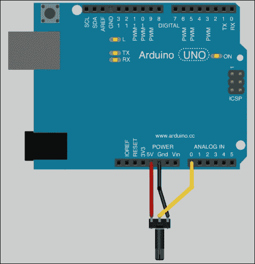

一个连接到 Arduino 板上的电位器

检查相应的电气图以了解连接：

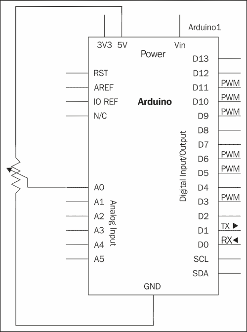

模拟输入 0 正在测量电压

现在让我们看看我们必须使用的代码。

就像`digitalRead()`函数可以读取 Arduino 上的数字输入值一样，还有`analogRead()`用于读取模拟输入。

这里的目的是将值作为程序中的暂停值来读取，以控制 LED 的闪烁速率。在代码中，我们将使用`delay()`函数。

这里有一个例子：

```cpp
int potPin = 0;     // pin number where the potentiometer is connected
int ledPin = 13 ;   // pin number of the on-board LED
int potValue = 0 ;  // variable storing the voltage value measured at potPin pin

void setup() {
  pinMode(ledPin, OUTPUT);  // define ledPin pin as an output
}

void loop(){
  potValue = analogRead(potPin); // read and store the read value at potPin pin 

  digitalWrite(ledPin, HIGH);    // turn on the LED
  delay(potValue);               // pause the program during potValue millisecond
  digitalWrite(ledPin, LOW);     // turn off the LED
  delay(potValue);               // pause the program during potValue millisecond
}
```

上传代码。然后转动电位器一点，观察输出。

变量定义之后，我在`setup()`函数中将`ledPin`引脚定义为输出，以便能够驱动电流到这个引脚。实际上，我正在使用引脚 13 来简化我们的测试。别忘了引脚 13 是 Arduino 板上的表面贴装 LED。

然后，在`loop()`函数中发生神奇的事情。

我首先读取`potPin`引脚的值。正如我们之前讨论的，这个函数返回的值是一个介于 0 和 1023 之间的整数。我将它存储在`potValue`变量中，以保持 LED 开启，但也以保持 LED 关闭。

然后，我通过在状态变化之间设置一些延迟来打开和关闭 LED。这里聪明的地方是使用`potValue`作为延迟。完全打开一边时，电位计提供一个值为 0。完全打开另一边时，它提供一个 1023，这是一个合理且用户友好的毫秒延迟值。

值越高，延迟越长。

为了确保你理解了物理部分，我想再解释一下电压。

Arduino 的+5V 和地引脚为电位计提供电压。它的第三条腿提供了一种通过改变电阻来改变电压的方法。Arduino 的模拟输入能够读取这个电压。请注意，Arduino 上的模拟引脚仅是输入。这也是为什么，与数字引脚相比，我们不需要在代码中担心精度。

因此，让我们修改一下代码，以便读取电压值。

### 如何将 Arduino 变成低电压电压表？

测量电压需要一个电路上的两个不同点。确实，电压是一种电势。在这里，我们只有那个参与我们电路测量电压的模拟引脚。那是什么？!

简单！我们正在使用 Vcc 的+5V 电源作为参考。我们控制电位计提供的电阻，并从 Vcc 引脚供电，以便有所展示。

如果我们想将其用作真正的电位计，我们必须给电路的另一个部分也提供 Vcc，然后将我们的 A0 引脚连接到电路的另一个点。

正如我们所见，`analogRead()`函数只提供从 0 到 1023 的整数。我们如何将实际的电测量显示在某个地方？

这是它的工作原理：

范围 0 到 1023 映射到 0 到 5V。这是 Arduino 内置的。然后我们可以按照以下方式计算电压：

V = 5 * (analogRead()值 / 1023)

让我们实现它，并通过使用 Arduino IDE 的串行监视器将其显示在我们的计算机上：

```cpp
int potPin = 0;     // pin number where the potentiometer is connected
int ledPin = 13 ;   // pin number of the on-board LED
int potValue = 0 ;  // variable storing the voltage value measured at potPin pin
float voltageValue = 0.; // variable storing the voltage calculated

void setup() {
  Serial.begin(9600);
  pinMode(ledPin, OUTPUT);  // define ledPin pin as an output
}

void loop(){
  potValue = analogRead(potPin); // read and store the read value at potPin pin

  digitalWrite(ledPin, HIGH);    // turn on the LED
  delay(potValue);               // pause the program during potValue millisecond
  digitalWrite(ledPin, LOW);     // turn off the LED
  delay(potValue);               // pause the program during potValue millisecond

  voltageValue = 5\. * (potValue / 1023.) ;  // calculate the voltage

  Serial.println(voltageValue); // write the voltage value an a carriage return
}
```

代码几乎与之前的代码相同。

我添加了一个变量来存储计算出的电压。我还添加了串行通信的内容，你总是能看到：`Serial.begin(9600)`实例化串行通信，`Serial.println()`将当前计算出的电压值写入串行通信端口，后面跟着一个换行符。

为了在你的电脑上看到结果，你必须当然打开串行监视器。然后，你可以读取电压值。

#### 计算精度

请注意，我们在这里使用 ADC 是为了将模拟值转换为数字；然后，我们对这个数字值进行小计算，以获得电压值。与基本模拟电压控制器相比，这是一个非常昂贵的方法。

这意味着我们的精度取决于 ADC 本身，它具有 10 位的分辨率。这意味着我们只能在 0 V 和 5 V 之间有 1024 个值。5 除以 1024 等于 0.00488，这是一个近似值。

这基本上意味着我们无法区分像 2.01 V 和 2.01487 V 这样的值。然而，对于我们的学习目的来说，这应该足够精确。

再次强调，这是一个例子，因为我想向你指出精度/分辨率的概念。你必须了解并考虑它。它在某些情况下可能会证明非常重要，并可能产生奇怪的结果。至少，你已经得到了警告。

让我们探索另一种与 Arduino 板交互的巧妙方式。

# 介绍 Max 6，图形编程框架

现在，让我向你介绍一个名为 Max 6 的框架。这本身就是一个宇宙，但我想在本书中写一些关于它的内容，因为你在未来的项目中可能会遇到它；也许有一天你将成为像我一样的 Max 6 开发者，或者你可能需要将你的智能物理对象与基于 Max 6 的系统进行接口。

以下是我 3D 宇宙项目中的一个 Max 6 补丁：

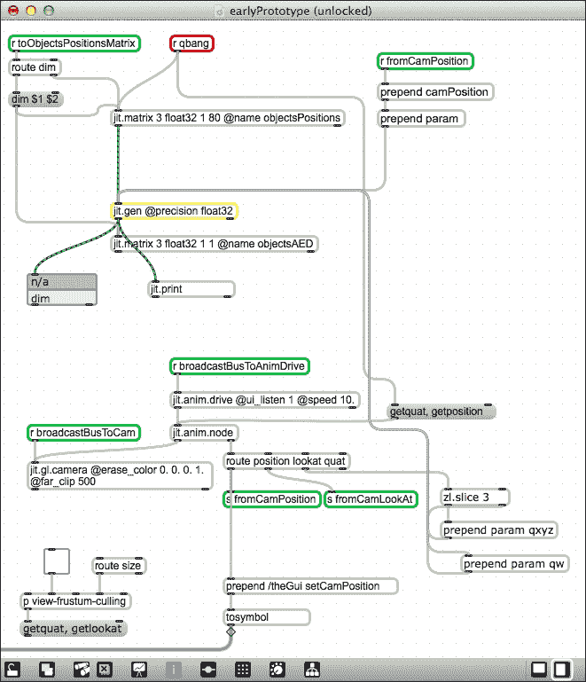

## Max/MSP 简史

Max 是一种用于多媒体目的的视觉编程语言。它实际上由 Cycling '74 开发和维护。为什么叫 Max？它是以 Max Matthews 的名字命名的（[`en.wikipedia.org/wiki/Max_Mathews`](http://en.wikipedia.org/wiki/Max_Mathews)），他是计算机音乐的大先驱之一。

Max 的原始版本是由 Miller Puckette 编写的；最初是一个名为 Patcher 的 Macintosh 编辑器。他在**欧洲声学/音乐研究协调院**（**IRCAM**）编写了它，这是一个位于法国巴黎蓬皮杜中心附近的前卫科学研究所。

1989 年，该软件由 IRCAM 许可给了一家私营公司 Opcode Systems，从那时起，它就由 David Zicarelli 开发和扩展。在 20 世纪 90 年代中期，Opcode Systems 停止了所有对该软件的开发。

Puckette 发布了一个完全免费和开源的 Max 版本，名为 Pure Data（通常简称为 Pd）。这个版本实际上被广泛使用，并由使用它的社区维护。

大约在 1997 年，一个专门用于声音处理和生成的模块被添加进来，命名为**MSP**，代表**Max Signal Processing**，显然也是为了纪念 Miller S. Puckette。

自 1999 年以来，通常被称为 Max/MSP 的框架由 Cycling '74 公司开发和发行，这是 Zicarelli 先生的公司的产品。

由于框架架构非常灵活，一些扩展逐渐被添加，例如 Jitter（一个巨大且高效的视觉合成）、Processing、实时矩阵计算模块，以及 3D 引擎。这发生在 2003 年左右。当时，Jitter 被发布并可以单独获取，但当然需要 Max。

2008 年，发布了名为 Max 5 的重大更新。这个版本也没有原生包含 Jitter，但作为一个附加模块。

在我谦卑的意见中，最大的升级，也就是 2011 年 11 月发布的 Max 6，它原生地包含了 Jitter，并提供了巨大的改进，例如：

+   重新设计的用户界面

+   兼容 64 位操作系统的新的音频引擎

+   高质量声音滤波器设计功能

+   新的数据结构

+   新的 3D 模型运动处理

+   新的 3D 材料处理

+   Gen 扩展

Max 4 已经完全可用且高效，但我在这里必须谈谈我对 Max 6 的看法。无论你需要构建什么，接口、复杂或简单的通信协议，包括基于 HID（**HID**=**人机界面设备**）的 USB 设备，如 Kinect、MIDI、OSC、串行、HTTP，以及其他任何东西，基于 3D 的声音引擎或 Windows 或 OS X 平台的基本独立应用程序，你都可以用 Max 6 来制作，而且这是一种安全的方式来构建。

这里是我自己与 Max 的简短历史：我亲自开始尝试 Max 4。我为我的第一个硬件 MIDI 控制器特别构建了一些宏 MIDI 接口，以便以非常具体的方式控制我的软件工具。它教会了我很多，并开阔了我的思路。我一直在使用它，几乎用于我艺术创作的每一个部分。

现在，让我们更深入地了解一下 Max 是什么。

## 全局概念

当然，我在上一节中犹豫是否开始介绍 Max 6 的部分。但我想这个小故事是描述框架本身的良好起点。

### 什么是图形编程框架？

**图形编程框架**是一种编程语言，它为用户提供了一种通过图形操作元素而不是通过键入文本来创建程序的方法。

通常，图形编程语言也被称为**可视化编程语言**，但我会使用“图形”，因为对许多人来说，“可视化”用于框架渲染的产品；我的意思是，例如 3D 场景。图形更相关于**GUI**，即**图形用户界面**，从开发者的角度来看，是我们的编辑器界面（我的意思是 IDE 部分）。

使用这种强大图形范式的框架包括许多编程方式，我们可以从中找到数据、数据类型、操作符和函数、输入和输出，以及连接硬件的方式。

你不是键入长源代码，而是添加对象并将它们连接起来以构建软件架构。想想 Tinker Toys 或乐高积木。

在 Max 的世界里，一个全球软件架构，即我们在 2D 屏幕上连接和相关的对象系统，被称为**Patch**。顺便提一下，其他图形化编程框架也使用这个术语。

如果一开始将这种范式理解为一种简化的方式，那么它并非首要目的，我的意思是，这不仅更容易，而且也为程序员和非程序员提供了全新的方法。它还提供了一种新的支持任务类型。实际上，如果我们编程的方式与修补不同，那么我们解决问题的方式也会不同。

我可以引用我们领域内的一些其他主要图形化编程软件：

+   **Quartz Composer**：这是一个针对 OS X 的图形渲染框架，可在[`developer.apple.com/technologies/mac/graphics-and-animation.html`](https://developer.apple.com/technologies/mac/graphics-and-animation.html)找到。

+   **Reaktor**：这是由 Native Instruments 开发的一个 DSP 和 MIDI 处理框架，可在[`www.native-instruments.com/#/en/products/producer/reaktor-5`](http://www.native-instruments.com/#/en/products/producer/reaktor-5)找到。

+   **Usine**：这是一个适用于现场和录音棚录音的通用音频软件，可在[`www.sensomusic.com/usine`](http://www.sensomusic.com/usine)找到。

+   **vvvv**：这是一个 Windows 的实时视频合成工具，可在[`vvvv.org`](http://vvvv.org)找到。

+   **SynthMa****ker**：这是一个为 Windows 设计的 VST 设备，可在[`synthmaker.co.uk`](http://synthmaker.co.uk)找到。

我想特别提一下 Usine。这是一个非常有趣且强大的框架，它提供了图形化编程来设计可在 Usine 软件内部使用或作为独立二进制文件使用的补丁。但其中一个特别强大的功能是，你可以将你的补丁导出为功能齐全且经过优化的 VST 插件。**VST**（**虚拟工作室技术**）是由 Steinberg 公司创建的一个强大的标准。它提供了一长串规范，并在几乎所有数字音频工作站中得到实现。Usine 提供了一个只需一键即可导出的功能，将你的图形化编程补丁打包成标准 VST 插件，这对于甚至没有听说过 Usine 或补丁风格的用户来说非常方便。Usine 独特的多点触控功能也使其成为一个非常强大的框架。然后，你甚至可以使用他们的 C++ **SDK**（**软件开发工具包**）来编写自己的模块。

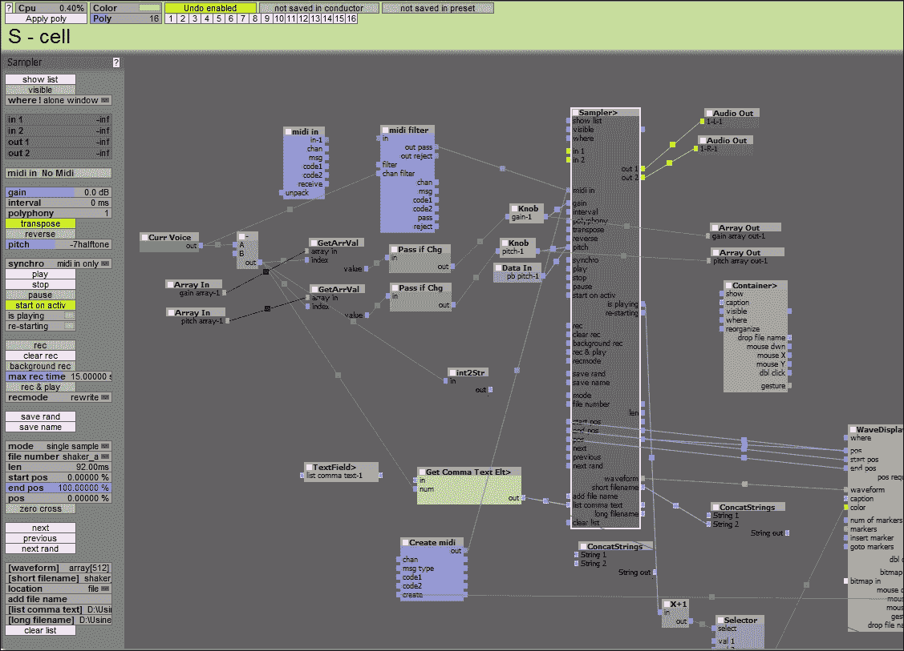

Usine 大补丁连接现实世界与许多虚拟对象

### Max，用于游乐场

Max 是游乐场和核心结构，所有内容都将放置在其中，进行调试和展示。这是放置对象、将它们连接起来、创建用户界面（UI）以及进行一些视觉渲染的地方。

这里有一个截图，展示了一个非常基本的补丁设计，旨在帮助你理解事物所在的位置：


一个使用 Max 6 的小型简单计算系统补丁

正如我描述的那样，使用图形编程框架，我们不需要输入代码来让事情发生。这里，我只是触发了一个计算。

内部带有数字**17**的盒子是一个 numbox。它包含一个整数，它也是一个 UI 对象，提供了一种通过拖放鼠标来改变值的方式。然后你将一个对象的输出连接到另一个对象的输入。现在当你改变值时，它将通过电线发送到连接到 numboxes 的对象。魔法！

你看到了另外两个对象。一个带有：

+   **+**符号后面跟着数字**5**

+   **-**符号后面跟着数字**3**

每个对象都接收发送给它们的数字，并分别进行+ 5 和- 3 的计算。

你可以看到另外两个 numboxes，它们基本上显示了带有**+**和**–**符号的对象发送的结果数字。

你还在吗？我猜是的。Max 6 提供了一个非常完善的帮助系统，其中包含了每个对象的全部引用，并且可以直接在 playground 中直接访问。当你教授这个框架时，告诉学生这一点是很好的，因为它真的有助于学生自学。确实，他们几乎可以自主地寻找答案，无论是关于小问题还是他们已经忘记但不敢问的事情。

Max 部分提供了一个相当高级的任务调度器，一些对象甚至可以修改优先级，例如，将`defer`和`deferlow`用于在您的补丁中实现优先级的精细粒度，例如，对于 UI 方面和计算核心方面，每个方面都需要非常不同的调度。

Max 还提供了一个方便的调试系统，它有一个类似于控制台的窗口，称为**Max 窗口**。

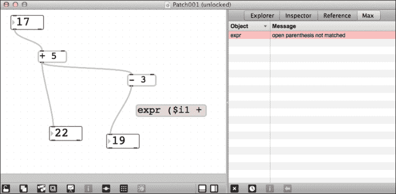

显示 expr 对象错误调试信息的 Max 窗口

Max 驱动很多事情。实际上，是 Max 拥有并领导了对所有模块的访问，无论是激活的还是未激活的，当你创建新对象时提供自动完成，还提供了访问许多可以扩展 Max 功能的东西，例如：

+   JavaScript API 用于 Max 本身以及特定部分，例如 Jitter

+   通过 mxj 对象在 Max 6 中直接实例化 Java 类

+   MSP 核心引擎用于与信号速率相关的一切，包括音频

+   Jitter 核心引擎用于与矩阵处理相关的一切，以及更多，例如视觉和视频

+   Gen 引擎用于从补丁中直接进行高效和即时的代码编译

这不是一个详尽的列表，但它让你了解了 Max 提供了什么。

让我们检查其他模块。

### MSP，用于声音

在 Max 对象通过用户或调度器本身触发的消息进行通信时，MSP 是核心引擎，它在任何特定时刻计算信号，正如文档中所写。

即使我们可以像纯 Max 对象一样连接 MSP 对象，但背后的概念是不同的。在每一个时刻，都会计算一个信号元素，通过我们所说的信号网络形成一个几乎连续的数据流。信号网络在补丁窗口中很容易识别；线缆是不同的。

这里有一张非常简单的补丁图，在你的耳朵里产生基于余弦的音频波：

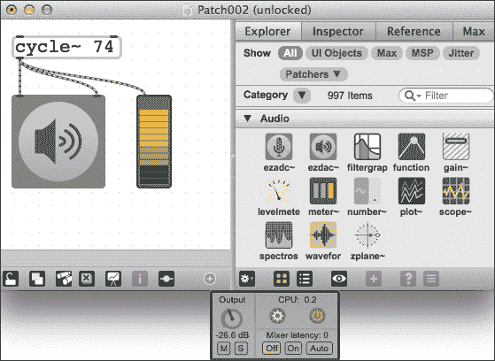

事实上，甚至补丁线也有不同的外观，展现出酷炫的条纹状黄黑色，类似蜜蜂的颜色，MSP 对象的名称后面包含一个波浪线 `~` 作为后缀，象征着……当然是一波！

信号速率由音频采样率和 MSP 核心设置窗口中的某些暗参数驱动。我不会描述这些，但你需要知道，Max 通常默认提供与你的声卡相关的参数，包括采样率（44110 Hz，音频 CD 的标准采样率，意味着每个音频通道每秒以 44100 次的速度进行快速处理）。

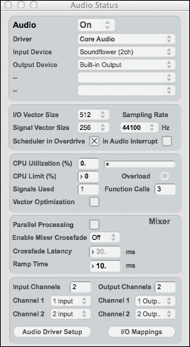

音频状态窗口是设置一些重要 MSP 参数的地方

### Jitter，用于视觉效果

Jitter 是 Max 6 中与视觉处理和合成相关的所有事物的核心引擎。

它提供了一个非常高效的矩阵处理框架，最初是为快速像素值计算而设计的，用于显示图片，无论是有动画的还是没有的。

我们在谈论与 Jitter 处理矩阵相关的一切的矩阵计算。实际上，如果你需要在 Max 6 中触发快速计算大量数组，即使你不需要显示任何视觉效果，你也可以使用 Jitter 来做这件事。

Jitter 提供的不仅仅是矩阵计算。它提供了对 OpenGL ([`en.wikipedia.org/wiki/OpenGL`](http://en.wikipedia.org/wiki/OpenGL)) 实现的完全访问，该实现以光速运行。它还提供了一种设计和处理粒子系统、3D 世界、OpenGL 材质和基于物理的动画的方法。像素处理也是它提供的许多专为像素处理本身设计和优化的对象所具有的强大功能之一。

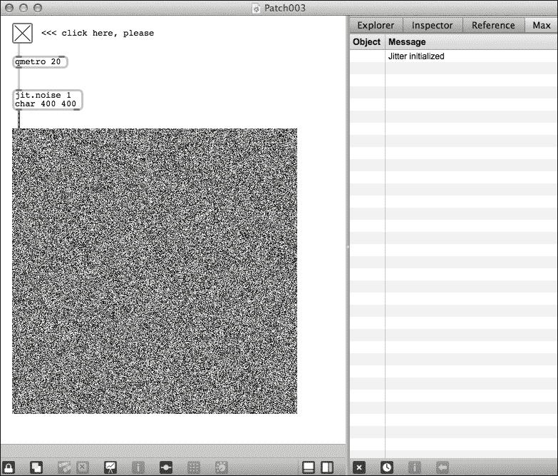

基于 Jitter 核心的基本补丁生成一个分辨率良好的 400x400 噪声像素图

为了总结这大量信息，Max 安排事件或等待用户触发某些操作，一旦激活，MSP（用于音频信号处理）——在它的信号网络中的每一个瞬间计算信号元素，而 Jitter 在 Jitter 对象被**bangs**触发时处理计算。

事实上，Jitter 对象需要被触发才能执行它们的工作，这些工作可能非常不同，例如弹出包含像素颜色值的矩阵，对矩阵的每个单元格进行矩阵处理，然后弹出结果矩阵，例如。

触发信号是特殊消息，用来对对象说“*嘿，让我们开始你的工作！*”。Max 中的对象可以有不同的行为，但几乎每个对象都可以理解触发信号。

在 **Patch003**（如图中所示的前一个屏幕截图），Max 对象 `qmetro` 每隔 20 毫秒从低优先级调度队列向名为 `jit.noise` 的 Jitter 对象发送一个触发信号。这个后者的对象计算出一个矩阵，每个单元格中填充随机值。然后，结果通过一条新的绿色和黑色条纹的补丁线到一个 UI 对象，我们可以看到一个名称，`jit.pwindow`，这是一种可以包含在我们的补丁中的显示方式。

通过强大的 Java 和 JavaScript API，可以控制抖动，这对于需要在代码中编写大循环的任务来说，使用代码设计起来很容易。

还在这里吗？

对于最勇敢的勇士们，关于 Gen 的其他一些信息，这是 Max 6 中最新且最有效的模块。

### Gen，对于代码生成的新方法

如果你理解在我们的补丁背后存在一种编译/执行过程，那么我会让你失望地说，它实际上并不像那样工作。即使一切都可以实时工作，也没有真正的编译。

顺便说一下，有许多方法可以使用代码设计补丁位，例如使用 JavaScript。直接在 Max 补丁器内部，你可以创建一个 `.js` 对象，并将你的 JavaScript 代码放入其中；它确实是即时编译的（它被称为 **JS JIT** 编译器，即 JavaScript 即时编译器）。它真的很快。相信我，我测试了很多，并与许多其他框架进行了比较。所以，正如文档所说，“我们不仅限于用 C 语言编写 Max 外部插件”，即使使用 Max 6 SDK 完全可能（[`cycling74.com/products/sdk`](http://cycling74.com/products/sdk)）。

Gen 是一个全新的概念。

Gen 提供了一种在补丁上即时编译补丁位的方法，这是从你的补丁中进行的真正编译。它提供了一种具有特定对象的新的补丁类型，与 Max 对象非常相似。

它适用于 MSP，使用 `gen~` Max 对象，提供了一种设计与音频补丁架构相关的信号速率的整洁方式。你可以设计这样的 DSP 和声音发生器。`gen~` 补丁就像是对时间的放大；你必须把它们视为样本处理器。每个样本都在 `gen~` 补丁器内部由这些补丁处理。当然，有智能对象可以随时间累积事物，以便拥有信号处理的时间窗口。

它也适用于 Jitter，有三个主要的 Max 对象：

+   `jit.gen` 是快速矩阵处理器，在每个循环中处理矩阵的每个单元格。

+   `jit.pix` 是基于 CPU 的像素处理器，处理像素图中的每个像素。

+   `jit.gl.pix` 是 `jit.pix` 的基于 GPU 的版本。

GPU（图形处理器单元），基本上是你显卡上的一个专用图形处理器。通常，这是一个完全不同的领域，OpenGL 管道提供了从软件定义到屏幕显示之前修改像素的简单方法。这被称为**着色器过程**。

你可能已经知道这个术语与游戏世界有关。这些是那些在我们的游戏中也是改善图形和视觉渲染的最后一步的着色器。

着色器基本上是可以在 GPU 本身处理的参数传递中即时修改的小程序。这些小程序使用特定的语言，并在我们的显卡上的专用处理器上运行得非常快。

Max 6 + Gen 通过仅补丁即可直接访问管道的这一部分；如果我们不想基于 **OpenGL GLSL** ([`www.opengl.org/documentation/glsl`](http://www.opengl.org/documentation/glsl))、**Microsoft DirectX HLSL** ([`msdn.microsoft.com/en-us/library/bb509635(v=VS.).aspx`](http://msdn.microsoft.com/en-us/library/bb509635(v=VS.).aspx)) 或 **Nvidia Cg** ([`http.developer.nvidia.com/CgTutorial/cg_tutorial_chapter01.html`](http://http.developer.nvidia.com/CgTutorial/cg_tutorial_chapter01.html)) 编写着色器，Gen 就是你的朋友。

所有基于 `jit.gl.pix` 的补丁都是专门编译并用于基于 GPU 的执行的。

你可以通过补丁来设计自己的片段着色器（或像素着色器），甚至可以抓取 GLSL 或 WebGL 语言中的源代码，以便在其他框架中使用。

使用 Gen 无法使用几何着色器，但与其他 Jitter 对象一起，它们已经存在。

我猜我可能让一些人感到困惑了。放松，我不会在 Arduino 考试中问你关于 Gen 的问题！

### 将所有内容总结在一个表格中

与 Max 6 相关的一切信息都可以在 Cycling 74 的网站上找到，网址是 [`cycling74.com`](http://cycling74.com)。此外，几乎 99% 的文档也是在线的，可以在 [`cycling74.com/docs/max6/dynamic/c74_docs.html#docintro`](http://cycling74.com/docs/max6/dynamic/c74_docs.html#docintro) 找到。

以下表格总结了到目前为止我们所做的一切：

| 部分 | 是什么？ | 电缆颜色 | 特征标志 |
| --- | --- | --- | --- |
| Max | 操场 | 默认为灰色，没有条纹 | 基本名称 |
| MSP | 与音频和信号速率相关的一切 | 黄色和黑色条纹 | 命名后缀为 `~`，表示信号速率处理 |
| Jitter | 与视觉和矩阵相关的一切 | 矩阵电缆为绿色和黑色条纹 | 命名前缀为 `jit.` |
| Gen | 在线编译的特定补丁（与 DSP 相关以及矩阵和纹理处理） | 类似于 MSP 的 `gen~` 和 Jitter 的 `jit.pix`、`jit.gl.pix` | 非常非常快！ |

## 安装 Max 6

Max 6 作为一个 30 天的试用版可用。安装 Max 6 相当简单，因为它提供了 Windows 和 OS X 平台的安装程序，可在[`cycling74.com/downloads`](http://cycling74.com/downloads)下载。下载并安装它。然后，启动它。就这样。（以下示例只有在安装了 Max 之后才会工作。）

你应该看到一个空白的游乐场

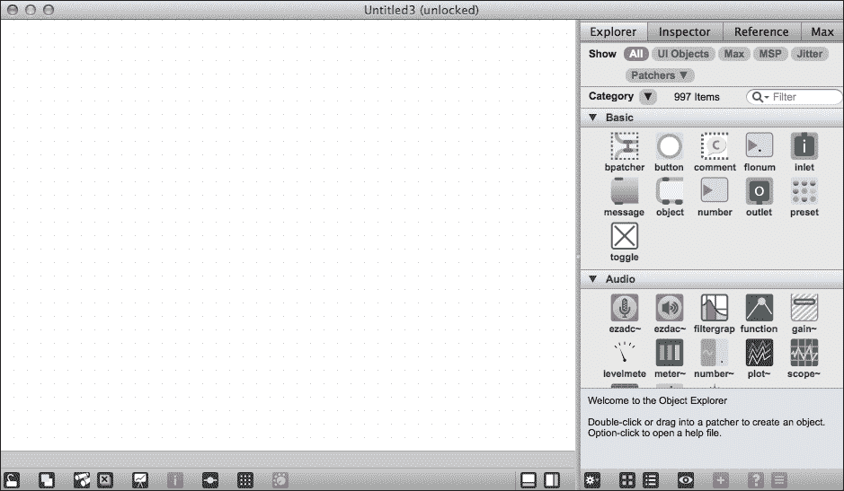

Max 6 的空白页面焦虑可能现在就会发生，不是吗？

## 第一个补丁

这里有一个基本的补丁，你可以在`Chapter06/`文件夹下以`Patcher004_Arduino.maxpat`的名称找到它。通常，如果你双击它，它会被 Max 6 直接打开。

这个补丁是一个非常基本的补丁，但实际上并不那么简单！

这是一个基本的基于噪声的序列发生器，它实时地定期修改振荡器的频率。这会产生一系列奇怪的声音，或多或少有点漂亮，频率的改变是由随机控制的。所以，打开你的扬声器，补丁将会产生声音。

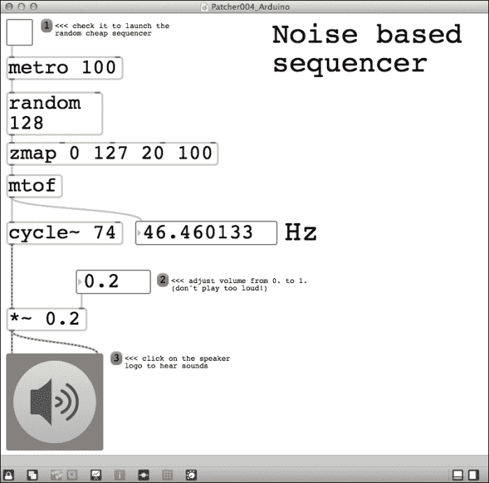

基于噪声的序列发生器

基本上，补丁是存储在文件中的。你可以非常容易地与其他朋友分享补丁。当然，更大的项目可能会涉及一些依赖性问题；如果你向 Max 6 框架中添加了一些库，如果你在补丁中使用它们，或者如果你基本上将补丁文件发送给一个没有安装这些库的朋友，你的朋友在 Max 窗口中将会出现一些错误。我不会在这里描述这类问题，但我想要提醒你。

在 Max 6 的世界中，分享补丁的其他整洁方式是复制/粘贴和复制压缩功能。确实，如果你在补丁器中选择对象（无论层次，包括子补丁器，子补丁器内的子补丁器，等等），然后转到**编辑** | **复制**，基于文本的内容就会被放入你的剪贴板。然后你可以将其粘贴到另一个补丁器或文本文件中。

最聪明的办法是使用复制压缩功能，正如其名字所暗示的，它复制并压缩 JSON 代码，使其变得更加紧凑，更容易复制到论坛上的文本区域，例如。

等一下，让我给你看看它是什么样子。

我只是选择了补丁中的所有对象，然后转到**编辑** | **复制压缩**。


复制压缩功能

以下图是直接粘贴到文本文件中的结果。

熟悉 HTML 的人可能会注意到一些有趣的地方；Cycling '74 的开发者在 HTML 标签（`pre`和`code`）中包含了两项，以便直接提供可以在（任何）网络论坛上的文本字段中粘贴的代码。

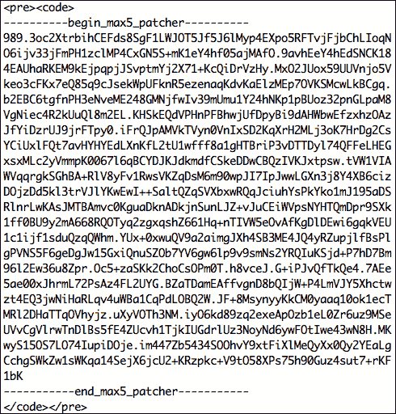

复制压缩代码

因此，你也可以将那段代码复制到你的剪贴板，并将其粘贴到一个新的补丁中。你可以通过访问**文件** | **新建**（或者在 Windows 上按*Ctrl* + *N*，在 OS X 上按*command* + *N*）来创建一个新的空补丁。

### 使用补丁播放声音

如你所见，我在补丁中添加了一些注释。你可以按照它们来产生一些来自你电脑的电子声音。

在开始之前，请确保通过点击左下角的锁形图标锁定补丁。要听到补丁的结果，你还需要点击扬声器图标。要缩小视图，请转到 **视图** 菜单并点击 **缩小**。

首先，注意并检查顶部的 toggle。它将发送值 `1` 到连接的对象 metro。

Metro 是一个纯 Max 对象，每 *n* 毫秒发送一个 bang 信号。这里，我硬编码了一个参数：`100`。一旦 metro 收到来自 toggle 的消息 `1`，它就开始活跃，并遵循 Max 定时调度器，每隔 100 毫秒向下一个连接的对象发送 bang 信号。

当 `random` 对象接收到一个 bang 信号时，它会从指定范围内弹出一个随机整数。这里，我设置了 `128`，这意味着 `random` 将发送 `0` 到 `127` 的值。紧接着 `random`，我放置了一个 `zmap` 对象，它像一个缩放器。我硬编码了四个参数，即输入的最小值和最大值以及输出的最小值和最大值。

基本上，在这里，`zmap` 将 `random` 发送的值 `0` 到 `127` 映射到 `20` 到 `100` 的另一个值。它产生了一种隐式的拉伸和分辨率损失，这是我喜欢的。

然后，这个结果数值被发送到著名的且重要的 `mtof` 对象。它将 MIDI 音高标准转换为根据 MIDI 标准的频率。它通常用于从 MIDI 世界进入真实声音世界。你还可以在显示频率为浮点数（赫兹，频率的度量单位）的 UI 对象 `flonum` 中读取频率。

最后，这个频率被发送到 `cycle~` 对象，产生一个信号（检查黄色和黑色条纹的线）。向这个对象发送数字会使其改变产生的信号的频率。这个信号乘以一个信号乘法运算符 `*~`，产生另一个信号，但幅度更低，以保护我们宝贵的耳朵。

该信号的最后一个目的地是你必须点击一次才能听到或听不到由上面的信号网络产生的声音的大灰色框。

现在，你可以准备检查复选框了。通过点击灰色框激活扬声器图标，然后你可以开始跳舞。实际上，产生的电子声音在频率（即音符）上有些混乱，但可能会很有趣。

当然，使用 Arduino 控制这个便宜的补丁，以便不使用鼠标/光标，将会非常棒。

让我们使用之前设计的相同电路来做这件事。

# 使用硬件控制软件

来自纯数字领域，其中一切都可以封装到软件和虚拟世界中，我们经常需要物理接口。这听起来可能像是一个悖论；我们希望一切都在一个地方，但那个地方对于与纯创造和情感相关的一切来说都太小，不够友好，因此我们需要更多或更少的大的外部（物理）接口。我喜欢这个悖论。

但是，为什么我们需要这样的接口呢？有时，旧鼠标和 QWERTY 键盘就不够用了。我们的电脑很快，但这些控制我们程序的接口却很慢，很笨拙。

我们需要在现实世界和虚拟世界之间建立接口。无论它们是什么，我们都需要它们专注于我们的最终目的，这通常不是接口，甚至不是软件本身。

亲自来说，我写书并教授与艺术相关的技术课程，但作为一个现场表演者，我需要专注于最终的渲染。在表演时，我希望尽可能地黑盒化底下的技术。我想要感受，而不是计算。我需要一个控制器接口来帮助我在速度和灵活性上操作，以便进行我想要的类型的变化。

正如我在这本书中已经说过的，我需要一个巨大的 MIDI 控制器，沉重、坚固且复杂，才能控制我电脑上的一个软件。因此，我建造了 Protodeck ([`julienbayle.net/protodeck`](http://julienbayle.net/protodeck))). 这就是我的接口。

那么，我们如何使用 Arduino 来控制软件呢？我想你已经有了一部分答案，因为我们已经通过旋转电位器将数据发送到我们的电脑。

让我们改进我们的 Max 6 补丁，使其在旋转电位器时接收 Arduino 的数据。

## 改进序列器和连接 Arduino

我们将创建一个非常便宜和基础的项目，该项目将涉及我们的 Arduino 板作为一个小型声音控制器。实际上，我们将直接使用我们刚刚设计的带有电位器的固件，然后我们将修改我们的补丁。这对于你继续构建事物甚至创建更大的控制器机器非常有用。

### 让我们连接 Arduino 到 Max 6

Arduino 可以使用串行协议进行通信。我们已经做到了。我们的最新固件已经做到了，发送电压值。

让我们稍作修改，使其只发送读取的模拟值，范围在 `0` 到 `1023` 之间。以下是代码，可在 `Chapter06/maxController` 中找到：

```cpp
int potPin = 0;     // pin number where the potentiometer is connected
int potValue = 0 ;  // variable storing the voltage value measured at potPin pin

void setup() {
  Serial.begin(9600);
}

void loop(){
  potValue = analogRead(potPin); // read and store the read value at potPin pin
  Serial.println(potValue); // write the voltage value an a carriage return

  delay(2);    // this small break waits for the ADC to stabilize is often used
}
```

我移除了所有不必要的部分，并在循环末尾（在循环重新开始之前）添加了 2 毫秒的延迟。这通常与模拟输入和特别是 ADC 一起使用。它提供了一个中断，让它稳定一会儿。我在之前的涉及模拟读取的代码中没有这样做，因为那里已经有两个 `delay()` 方法涉及 LED 闪烁。

这个基本版本发送连接到电位器的模拟输入引脚上读取的值。不多，也不少。

现在，让我们学习如何在除了我们宝贵的 IDE 的串行监视器之外的某个地方接收这些数据。

### Max 6 中的串行对象

Max 中有一个名为 `serial` 的对象。它提供了一种使用串行端口与其他任何使用串行通信的设备进行通信的方式。

下一个图描述了新的 Max 6 补丁，包括与我们的小型硬件控制器通信所需的部件。

现在，如果还没有这样做，请将 Arduino 插入，并上传 `maxController` 固件。

### 注意

注意关闭 IDE 的串行监控。

否则，你的电脑上会有冲突；一个端口上只能实例化一个串行通信。

然后这里还有一个你可以找到的补丁，也在 `Chapter06/` 文件夹中，名为 `Patcher005_Arduino.maxpat`。

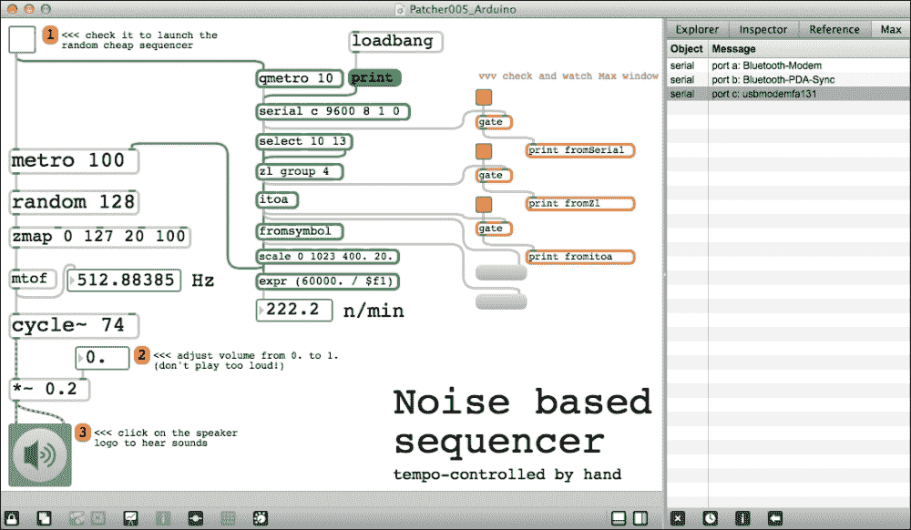

包含 Arduino 通信模块的 Max 补丁

双击文件，你会看到这个补丁。

让我们稍微描述一下。我添加了所有绿色和橙色的内容。

理解 Arduino 消息并将其转换为我们的序列器补丁易于理解的所有必要内容都在绿色部分。一些非常有用的辅助工具，能够在数据流中的每个步骤写入 Max 窗口，从原始数据到转换后的数据，都在橙色部分。

让我们描述这两部分，从辅助部分开始。

### 在 Max 6 中轻松追踪和调试

Max 6 提供了许多调试和追踪的方法。我不会在这本 Arduino 书中描述所有这些，但其中一些需要几句话说明。

检查你的补丁，特别是橙色部分的对象。

`print` 对象是直接向 Max 窗口发送消息的方式。一旦收到，发送给它们的任何内容都会立即写入 Max 窗口。你可以传递给这些对象的参数也非常有用；它有助于在您使用多个 `print` 对象的情况下区分哪个 `print` 对象发送了什么。这里就是这种情况，检查一下：我根据消息来源的对象命名所有的 `print` 对象：

+   `fromSerial`：这是针对来自 `serial` 对象自身的所有消息

+   `fromZl`：这是针对来自 `zl` 对象的所有消息

+   `fromitoa`：这是针对来自 `itoa` 对象的所有消息

+   `fromLastStep`：这是针对来自 `fromsymbol` 对象的所有消息

`gate` 对象只是小门，我们可以通过发送 `1` 或 `0` 到最左侧的输入来启用或禁用它们。`toggle` 对象是很好的 UI 对象，可以通过点击来实现这一点。一旦你勾选了 `toggle`，相关的 `gate` 对象将允许发送到右侧输入的消息通过它们传递到唯一的输出。

我们将在几分钟内使用这个追踪系统。

### 在 Max 6 中理解 Arduino 消息

需要理解的是，之前的切换现在也连接到了一个新的 `qmetro` 对象。这是低优先级的 `metro` 对应物。实际上，这个对象将每 20 毫秒轮询 `serial` 对象，考虑到我们的 Arduino 固件当前通过在循环的每次迭代中发送读取的模拟值来工作，即使轮询有点延迟，也不会有问题；下一次迭代，更新将会发生。

`serial` 对象在这里非常重要。

我硬编码了一些与 Arduino 串行通信相关的参数：

+   `9600` 设置时钟为 9600 波特

+   `8` 设置字长为 8 位

+   `1` 表示有一个停止位

+   `0` 表示没有奇偶校验（奇偶校验有时在错误检查中很有用）

这个对象需要被 bang 以提供串行端口缓冲区的当前内容。这就是为什么我用 `qmetro` 对象给它提供数据的原因。

`serial` 对象会弹出一系列原始值。在读取发送的模拟值之前，这些值需要被稍微解析和组织。这就是 `select`、`zl`、`itoa` 和 `fromsymbol` 对象的作用。

### 注意

通过按键盘上的 *Alt* 键然后点击对象，直接读取 Max 6 中任何对象的帮助信息。

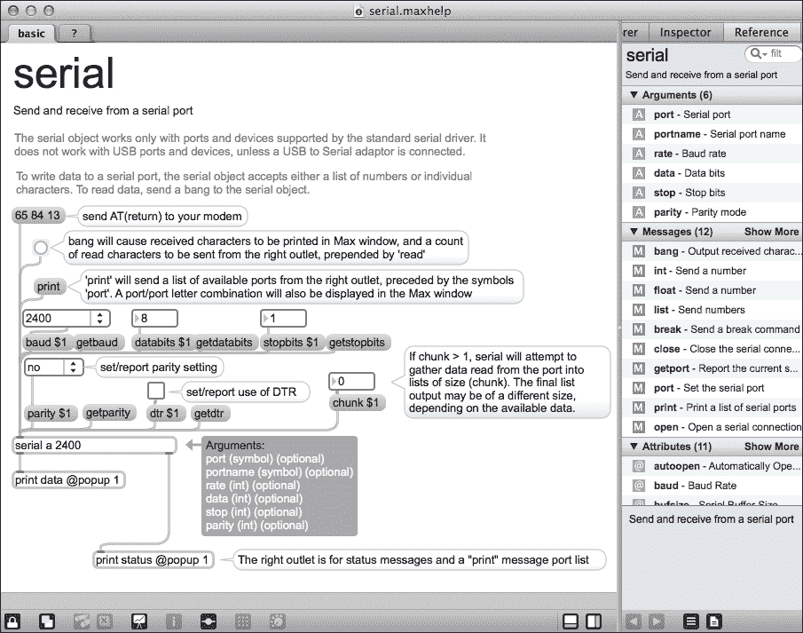

串行对象的帮助补丁

每 20 毫秒，如果串行通信已经实例化，`serial` 对象将提供 Arduino 将要发送的内容，即连接到电位器的引脚上当前和最近读取的模拟值。这个值从 0 到 1023，我使用 `scale` 对象，就像我在补丁的序列/声音部分使用 `zmap` 对象一样。这个 `scale` 对象将输入的 0 到 1023 的值范围重新映射为 300 到 20 的反转范围，使范围反向（请注意，当前和未来的 Max 补丁，`zmap` 不像这样）。我这样做是为了定义每分钟音符的最大范围。`expr` 对象计算这个值。`qmetro` 需要两个 bang 之间的间隔。当我转动电位器时，我让这个间隔在 400 毫秒和 20 毫秒之间变化。然后，我计算每分钟音符速率，并在另一个 `flonum` UI 对象中显示它。

然后，我还添加了这个奇怪的 `loadbang` 对象和 `print` 对象。`loadbang` 是一个特定的对象，当 Max 6 打开补丁时，它会立即发送一个 bang。它通常用于初始化我们补丁内部的一些变量，有点像我们在 Arduino 脚本的第一行中进行的声明。

`print` 是在名为 `message` 的对象内的文本。通常，每个 Max 6 对象都可以理解特定的消息。你可以在补丁的任何地方键入 `m` 来创建一个新的空消息。然后，通过选择它并再次点击它，你可以使用自动完成功能填充文本。

在这里，一旦补丁加载并开始运行，`serial`对象就会接收到由`loadbang`触发的打印消息。`serial`对象能够将所有串行端口消息列表发送到运行补丁的计算机的终端（即 Max 窗口）。这发生在我们向它发送打印消息时。检查显示`Patcher005_Arduino.maxpat`补丁的 Max 窗口。

我们可以看到一系列事物。`serial`弹出一个串行端口字母缩写列表，对应的串行端口通常表示硬件名称。在这里，正如我们在 Arduino IDE 中已经看到的，对应于 Arduino 的是`usbmodemfa131`。

Max 中对应的引用是我电脑上的字母`c`。这仅是一个内部引用。

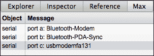

发送到串行对象的打印消息的结果：端口字母/串行端口的名称列表

让我们更改在补丁中作为`serial`对象参数的硬编码字母。

选择`serial`对象。然后，在内部重新单击并交换`a`与您计算机上 Arduino 串行端口的对应字母。一旦您按下*Enter*，对象就会以新的参数重新实例化。

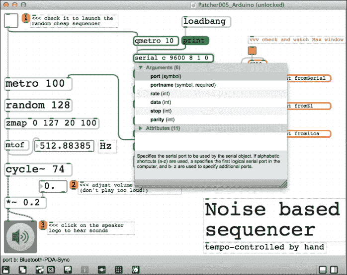

将序列对象中的参考字母更改为与 Arduino 的串行端口对应的字母

现在，一切准备就绪。检查切换，启用带有扬声器的灰色框，并转动您的电位器。您将听到来自序列器的奇怪噪音，现在您可以更改音符速率（我的意思是每个声音之间的间隔），因为我滥用术语音符以更好地适应序列器的通常定义。

### 究竟在电线上发送了什么？

您可能已经注意到，像往常一样，我提到了一系列对象：`select`、`zl`、`itoa`和`fromsymbol`。现在是时候解释它们了。

当您在 Arduino 固件源代码中使用`Serial.println()`函数时，Arduino 不仅发送函数传递的参数值。检查一系列切换/门系统顶部的第一个橙色切换。

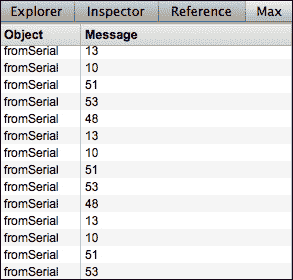

串行对象弹出一系列奇怪的数字

您可以在名为**对象**的第一列中看到打印对象的名称，在**消息**列中，可以看到相关对象发送的消息。我们还可以看到`serial`对象以重复的方式弹出一系列奇怪的数字：**51**、**53**、**48**、**13**、**10**，等等。

### 注意

Arduino 以 ASCII 码的形式发送其值，就像我们在计算机上键入它们一样。

这非常重要。让我们检查*附录 E，ASCII 表*，以找到相应的字符：

+   51 表示字符 3

+   53 表示 5

+   48 表示 0

+   13 表示回车

+   10 表示换行，它本身意味着新的一行

当然，我在排序序列时有点作弊。我知道 `10 13` 这一对数字。这是一个常用的标记，意味着 *一个回车符后跟一个换行符*。

因此，我的 Arduino 发送了一条类似这样的消息：

```cpp
350<CR><LF>
```

这里，`<CR>` 和 `<LF>` 分别代表回车符和换行符。

如果我使用了 `Serial.print()` 函数而不是 `Serial.println()`，我就不会得到相同的结果。实际上，`Serial.print()` 版本不会在消息末尾添加 `<CR>` 和 `<NL>` 字符。如果没有结束标记，我怎么知道 `3`、`5` 或 `0` 将会是第一个字符呢？

需要记住的设计模式如下：

+   构建消息

+   在消息完全构建后发送消息（使用 `Serial.println()` 函数）。

如果你想在构建过程中发送它，这里是你可以使用的方法：

+   使用 `Serial.print()` 发送第一个字节

+   使用 `Serial.print()` 发送第二个字节

+   继续发送直到结束

+   使用不带参数的 `Serial.println()` 在末尾发送 `<CR><LF>`

### 仅提取有效载荷？

在许多与通信相关的领域，我们谈论有效载荷。这是消息，通信本身的目的。其他所有东西都非常重要，但可以理解为载体；没有这些信号和信号量，消息无法传播。然而，我们感兴趣的是消息本身。

我们需要解析来自串行对象的消息。

我们必须将每个 ASCII 码累积到同一个消息中，当我们检测到 `<CR><LF>` 序列时，我们必须弹出消息块，然后重新开始这个过程。

这是通过 `select` 和 `zl` 对象完成的。

`select` 能够检测与其参数相等的消息。当 `select 10 13` 接收到一个 10 时，它将向第一个输出发送一个 bang。如果是 13，它将向第二个输出发送一个 bang。然后，如果收到其他任何消息，它将只从最后一个输出传递到右边。

`zl` 是一个如此强大的列表处理器，具有如此多的使用场景，以至于它可以单独构成一本书！使用参数运算符，我们甚至可以用它来解析数据，将列表切割成片段，等等。在这里，使用组 4 参数，`zl` 接收一个初始消息并将其存储；当它接收到第二个消息时，它存储该消息，依此类推，直到第四个消息。在接收到这个消息的精确时刻，它将发送一个由接收并存储的四个消息组成的大消息。然后，它清除其内存。

在这里，如果我们检查相应的切换并观察 Max 窗口，我们可以看到 **51 53 48** 被重复几次，并由 `zl` 对象发送。

`zl` 对象做得很好；它传递所有 ASCII 字符，除了 `<CR>` 和 `<LF>`，并且一旦它接收到 `<LF>`，`zl` 就发送一个 bang。我们刚刚构建了一个消息处理器，每次它接收到 `<LF>` 时都会 *重置* `zl` 缓冲区，也就是说，当一条新消息即将发送时。

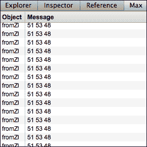

zl 列表处理器会弹出一系列整数

### ASCII 转换和符号

我们现在有一系列三个整数，它们直接等于 Arduino 发送的 ASCII 消息，在我的情况下，是`51 53 48`。

如果你旋转电位器，当然会改变这个系列。

但是看看这个，我们期望的 0 到 1023 之间的值在哪里？我们必须将 ASCII 整数消息转换为实际的字符。这可以通过使用`itoa`对象（表示整数到 ASCII）来完成。

检查相关的切换，并观察 Max 窗口。

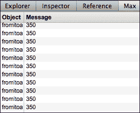

这里是我们的重要值

这个值是重要的；它是 Arduino 通过电线发送的消息，并以符号的形式传输。你无法在 Max 窗口中区分符号和其他类型的消息，如整数或浮点数。

我在补丁中放置了两个空消息。这些对于调试目的也非常有用。我将它们连接到右侧的`itoa`和`fromsymbol`对象。每次你向右侧输入的消息发送消息时，目标消息的值就会通过另一个消息的内容而改变。然后我们可以显示`itoa`和`fromsymbol`实际发送的消息。

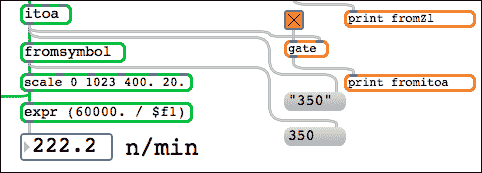

"350"并不完全等于 350

`fromsymbol`将每个符号转换为它的组成部分，在这里它组成一个整数，`350`。

这个最终值是我们可以用任何能够理解和处理数字的对象使用的。这个值通过比例对象进行缩放，最后发送到 metro 对象。旋转电位器会改变发送的值，根据这个值，metro 会更快或更慢地发送 bang。

这个长例子教会了你两件主要的事情：

+   你必须仔细了解发送和接收的内容

+   Arduino 的通信方式

现在，让我们继续探讨一些与模拟输入相关的一些其他示例。

### 与传感器玩耍

我不想在这本书中写一个大的目录。相反，我想给你提供钥匙和所有概念的感觉。当然，我们必须精确，并了解你没有发明过的特定技术，但我特别想让你学习最佳实践，自己思考大型项目，并能够有一个全局的视角。

我在这里给你举一些例子，但不会涵盖之前提到的所有类型的传感器。

### 测量距离

当我为他人或自己设计安装时，我经常有测量移动物体与固定点之间距离的想法。想象一下，你想要创建一个系统，其光线强度根据一些访客的接近程度而变化。

我曾经玩过一个 Sharp GP2Y0A02YK 红外长距离传感器。

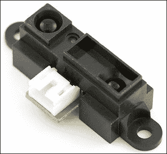

红外 Sharp GP2Y0A 系列传感器

这个酷炫的模拟传感器对于 20 到 150 厘米的距离提供了良好的结果。市场上还有其他类型的传感器，但我喜欢这个，因为它很稳定。

与任何距离传感器一样，目标/主题理论上必须垂直于红外光束的方向，以获得最大精度，但在现实世界中，即使不是这样也能正常工作。

数据表是首先要关注的对象。

### 阅读数据表？

首先，你必须找到数据表。搜索引擎可以帮上大忙。这个传感器的数据表在[`sharp-world.com/products/devvice/lineup/data/pdf/datasheet/gp2y0a02_e.pdf`](http://sharp-world.com/products/devvice/lineup/data/pdf/datasheet/gp2y0a02_e.pdf)。

你不必理解一切。我知道有些人会在这里责怪我没有解释数据表，但我想让我的学生对此放松。你必须过滤信息。

准备好了吗？让我们开始吧！

通常，在第一页上，你可以看到所有功能的总结。

在这里，我们可以看到这个传感器似乎在目标颜色方面相当独立。好的，很好。距离输出类型在这里非常重要。实际上，这意味着它直接输出距离，不需要额外的电路来利用其模拟数据输出。

常常有一些传感器所有尺寸的轮廓图。如果你想在订购之前确保传感器适合你的盒子或安装，这可能会非常有用。

在下一张图中，我们可以看到一个图表。这是一条曲线，说明了输出电压如何根据目标距离变化。

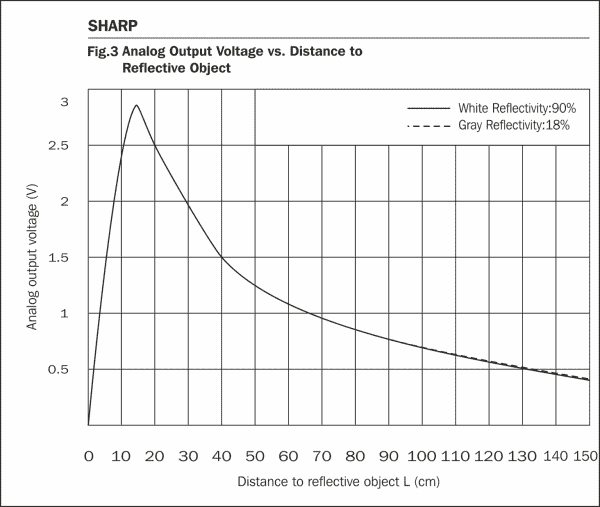

传感器距离与模拟输出电压之间的数学关系

这些信息非常宝贵。确实，正如我们在上一章讨论的那样，传感器将一个物理参数转换成 Arduino（或任何其他类型的设备）可测量的东西。在这里，距离被转换成电压。

因为我们要用 Arduino 板上的模拟输入来测量电压，所以我们需要了解转换是如何工作的。在这里，我将使用一个捷径，因为我已经为你做了计算。

基本上，我使用了另一个与我们看到的类似的图表，但它是通过数学生成的。我们需要一个公式来编写我们的固件。

如果输出电压增加，距离会按照一种指数函数减少。我曾在某个时候与一些夏普工程师联系过，他们证实了我的关于公式的想法，并给了我这个：

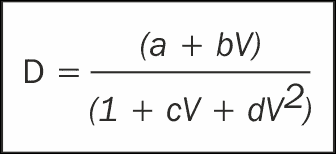

在这里，D 是厘米距离，V 是测量的电压；a = 0.008271，b = 939.65，c = -3.398，d = 17.339

这个公式将被包含在 Arduino 的逻辑中，以便它可以直接向任何想知道它的人提供距离。我们也可以在通信链的另一方进行这个计算，例如在 Max 6 补丁中，或者在 Processing 中。无论如何，你想要确保你的距离参数数据在比较传感器输出和将使用该数据输入时能够很好地缩放。

### 让我们连接东西

下一个电路会让你想起之前的那个。实际上，范围传感器替换了电位器，但它是以完全相同的方式连接的：

+   Arduino 板上的 Vcc 和地分别连接到+5 V 和地

+   连接到模拟输入 0 的信号引脚

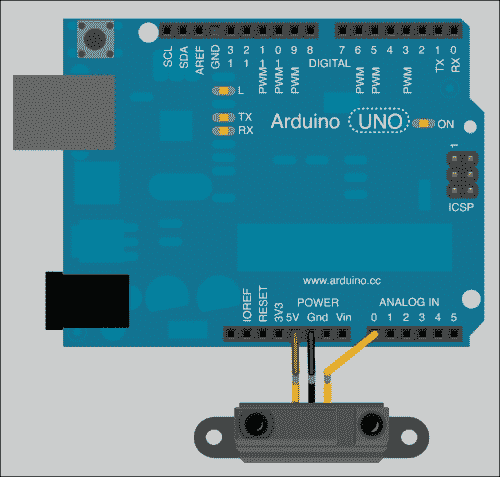

连接到 Arduino 板上的 Sharp 传感器

电路图如下：

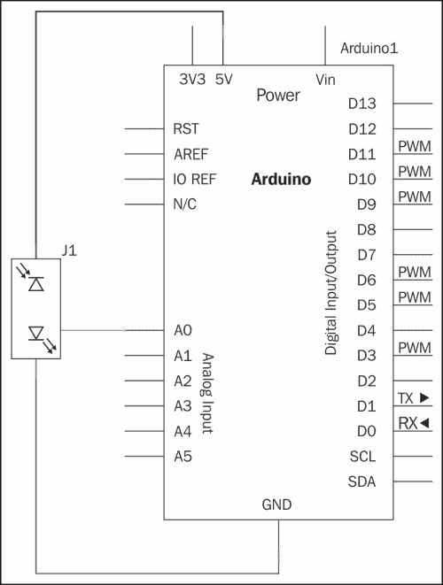

Arduino 本身提供的传感器范围和发送电压到模拟输入 0

### 编写固件

以下是我设计的固件代码：

```cpp
int sensorPin = 0; // pin number where the SHARP GP2Y0A02YK is connected
int sensorValue = 0
int distanceCalculated = 0;   // variable storing the distance calculated
int v = 0;          // variable storing the calculated voltage

// our formula's constants
const int a = 0.008271;
const int b = 939.65;
const int c = -3.398;
const int d = 17.339;

void setup() {
  Serial.begin(9600);
}

void loop(){
  sensorValue = analogRead(sensorPin); 
  v = 5\. * (sensorValue / 1023.) ;  // calculate the voltage 
  distanceCalculated = ((a + b * v) / (1\. + c * v + d * v * v) );

  Serial.println(distanceCalculated); 

  delay(2);
}
```

知道你理解了每一行代码，是不是很令人欣慰？不过，以防万一，我将提供一个简短的说明。

我需要一些变量来存储从 ADC 来的传感器值（即从 `0` 到 `1023` 的值）。然后，我需要存储从传感器值计算出的电压，当然，还有从电压值计算出的距离。

我只在 `setup()` 函数中初始化串行通信。然后，我在 `loop()` 方法中进行所有计算。

我首先读取从传感器引脚测量的当前 ADC 值和编码值。我使用这个值来计算电压，使用我们在之前的固件中已经使用过的公式。然后，我将这个电压值注入到 Sharp 传感器的公式中，我就得到了距离。

最后，我通过串行通信使用 `Serial.println()` 函数发送计算出的距离。

### 在 Max 6 中读取距离

`Patcher006_Arduino.maxpat` 是与这个距离测量项目相关的补丁。这里就是它：

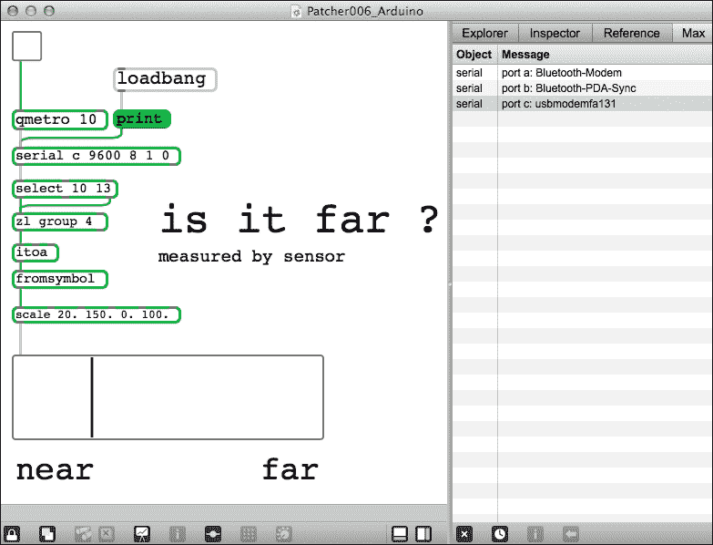

距离读取补丁

正如我们之前学到的，这个补丁包含了读取来自 Arduino 板的消息的整个设计模式。

这里唯一的新奇之处是底部的奇怪 UI 元素。它被称为**滑块**。通常，滑块用于控制事物。确实，当你点击并拖动滑块对象时，它会弹出值。它看起来像调音台或调光器的滑块，可以控制某些参数。

显然，因为我想要在这里传输大量数据，所以我使用这个滑块对象作为显示设备，而不是控制设备。实际上，滑块对象也有一个输入端口。如果你向滑块发送一个数字，滑块会接受它并更新其内部当前值；它也会传输接收到的值。我这里只使用它作为显示。

Max 6 中的每个对象都有其自己的参数。当然，很多参数对所有对象都是通用的，但也有一些不是。为了检查这些参数：

+   选择对象

+   通过选择**检查器**选项卡或在 Windows 上按*Ctrl* + *I*或在 OS X 上按*command* + *I*来检查检查器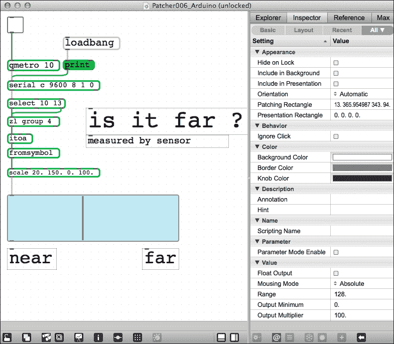

    显示所选滑块对象属性和属性的检查器窗口

我不会描述所有参数，只描述底部的两个。为了产生相关结果，我必须将来自`fromsymbol`对象的值进行缩放。我知道 Arduino 传输的值范围（尽管这可能需要一些个人验证），我已经从 Sharp 数据表中计算了它们。我将这个范围视为 20 到 150 厘米。我的意思是 20 到 150 之间的一个数字。

我将这个范围进行了压缩和转换，使用`scale`对象将其转换为浮点数的`0-to-100`范围。我为我的滑块对象选择了相同的范围。这样做，滑块显示的结果是一致的，并代表真实值。

我没有在滑块上写任何增量标记，只做了两个注释：“近”和“远”。在这个数字的世界里，这有点诗意。

让我们看看其他一些能够弹出连续电压变化的传感器的例子。

## 测量弯曲

柔性传感器也非常有用。在距离传感器能够将测量的距离转换为电压的地方，柔性传感器测量弯曲并提供电压。

基本上，设备的弯曲与一个能够根据弯曲量使电压变化的可变电阻相关。

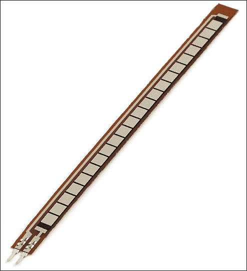

只有两个连接器的标准柔性传感器

柔性传感器可用于许多用途。

我喜欢用它通过 Arduino 通知计算机我设计的数字安装中的门位置。最初人们只想知道门是打开还是关闭，但我提出使用柔性传感器，并获得了关于开启角度的非常准确的信息。

下图说明了传感器的工作原理：

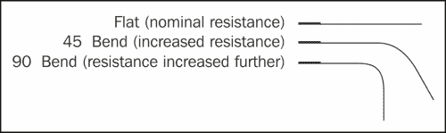

现在，我将直接给你看用 Fritzing 再次制作的接线图：

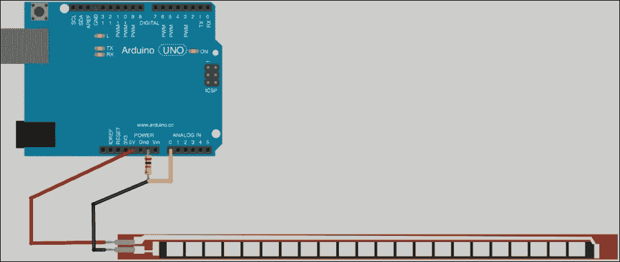

柔性传感器连接到 Arduino 板上的下拉电阻

我添加了一个下拉电阻。如果你还没有阅读关于上拉和下拉电阻的第五章，*使用数字输入进行感应*，我建议你现在去阅读。

通常，我使用大约 10K Ω的电阻，它们工作得很好。

电路图如下所示：

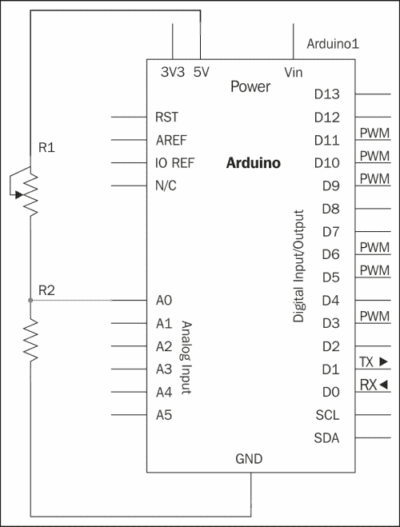

柔性传感器及其下拉电阻连接到 Arduino

### 电阻计算

对于这个项目，我不会给你代码，因为它与上一个项目非常相似，只是计算公式不同。我想在这里讨论的是这些电阻计算公式。

如果我们没有 Sharp 公司慷慨提供的红外传感器图，我们该怎么办？我们必须求助于一些计算。

通常，柔性传感器文档提供了当它未弯曲和当它弯曲到 90 度时的电阻值。让我们假设一些常见的值，如 10K Ω和 20K Ω，分别。

对于这些电阻值，包括下拉电阻，我们可以期望的电压值是什么？

考虑到电气原理图，模拟引脚 0 的电压是：

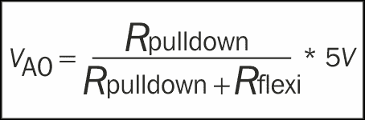

如果我们选择与未弯曲时的柔性电阻相同的下拉电阻，我们可以期望电压按照这个公式变化：

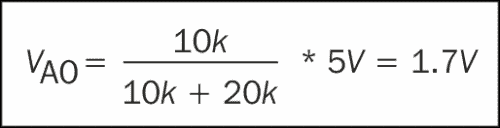

显然，通过在未弯曲时使用相同的公式，我们可以期望：

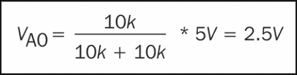

这意味着我们找到了我们的电压值范围。

我们现在可以将这些数据转换为数字 10 位，编码值，我的意思是 Arduino 的 ADC 著名的 0 到 1023 的范围。

一个小的简单计算为我们提供了以下值：

+   当电压为 2.5 时（当柔性未弯曲时），电压为`511`

+   当电压为 1.7 时（当柔性弯曲在约 90 度角时），电压为`347`

因为 Arduino 引脚上的电压取决于电阻的倒数，所以我们没有完美的线性变化。

经验告诉我，我可以几乎将其近似为线性变化，我在 Arduino 固件中使用了缩放函数，将`[347,511]`映射到更简单的范围`[0,90]`。`map(value, fromLow, fromHigh, toLow, toHigh)`是这里要使用的函数。

你还记得 Max 6 中的`scale`对象吗？`map()`基本上以相同的方式工作，但针对 Arduino。这里的语句将是`map(347,511,90,0)`。这将给出一个相当近似的物理弯曲角度值。

`map`函数在两个方向上都可以工作，可以将相反方向的数字段进行映射。我想你开始看到当你需要在 Arduino 上处理模拟输入时应该遵循的步骤。

现在，我们将遇到一些其他传感器。

## 几乎可以感知一切

无论你想测量哪个物理参数，都有相应的传感器。

这里有一个小列表：

+   颜色和亮度

+   声音音量

+   放射性强度

+   湿度

+   压力

+   弯曲

+   液位

+   罗盘和与磁北相关的方向

+   气体特定检测

+   振动强度

+   三轴（x，y，z）加速度

+   温度

+   距离

+   重量（纯弯曲传感器不同）

这不是一个详尽的列表，但相当完整。

价格变化很大，从几美元到 50 或 60 美元。我找到了一个价格较低的盖革计数器，大约 100 美元。你可以在*附录 G，组件分销商列表*中找到大量可以在互联网上购买传感器的公司。

现在，让我们更进一步。我们如何处理多个模拟传感器？第一个答案是，将所有东西都连接到 Arduino 的多个模拟输入。让我们看看我们是否可以比这更聪明。

# 使用 CD4051 复用器/解复用器进行复用

我们将要探索一种称为**复用**的技术。这是一个重要的子章节，因为我们将要学习如何使我们的实际项目更加具体、更加真实。

在现实世界中，我们经常有许多限制。其中一个可能是可用的 Arduino 数量。这种限制也可能来自于只有单个 USB 端口的计算机。是的，这种情况在现实生活中确实会发生，如果我说我可以在你想要的任何时候，在你想要的预算内拥有你想要的每一个连接器，那我就是在撒谎。

假设你不得不将超过八个传感器连接到 Arduino 的模拟输入。你会怎么做？

我们将学习如何复用信号。

## 复用概念

复用在电信世界中相当常见。复用定义了提供有效方式让多个信号共享单一介质的技巧。

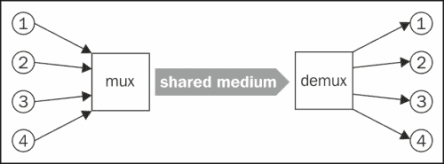

基本复用概念展示了共享介质

这种技术提供了一个非常有帮助的概念，其中你只需要一个共享介质来带来许多信息通道，正如我们在前面的图中可以看到的那样。

当然，这涉及到复用（在图中称为 mux）和解复用（demux）过程。

让我们深入探讨一下这些过程。

## 多种复用/解复用技术

当我们需要复用/解复用信号时，我们基本上需要找到一种方法，通过我们可以控制的物理量来分离它们。

我至少可以列出三种复用技术类型：

+   空分复用

+   频分复用

+   时分复用

### 空分复用

这是最容易理解的。

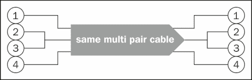

空分复用将所有电线物理地聚集到同一个地方

例如，这个概念是您公寓中的基本电话网络复用。

你的电话线，就像你邻居的电话线一样，所有这些线都被连接到一个屏蔽的大多对电缆中，例如，包含你居住的整个建筑中的所有电话线。这条巨大的多对电缆进入街道，将其作为一个全局电缆捕获比捕获来自你邻居的每根电缆加上你自己的电缆要容易。

这个概念很容易转化为 Wi-Fi 通信。确实，今天一些 Wi-Fi 路由器提供了不止一个 Wi-Fi 天线。例如，每个天线都能够处理一个 Wi-Fi 连接。每一次通信都会使用相同的介质：空气传输电磁波。

### 频分复用

这种复用技术在所有与 DSL 和有线电视连接相关的事物中都非常常见。

服务提供商可以使用这种技术通过同一根电缆提供多个服务。

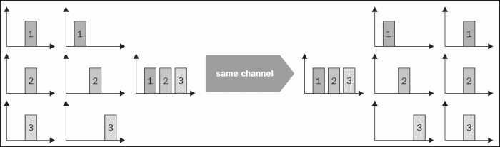

频分复用与传输频率和带宽玩游戏

想象一下图中的**1**、**2**和**3**频率波段是三种不同的服务。1 可能是语音，2 可能是互联网，3 是电视。现实与这并不太远。

当然，我们在一端复用的东西，我们必须在另一端解复用，以便正确地处理我们的信号。我不会尝试将电视调制的信号转换为语音，但我猜这不会是一次很有成效的经历。

### 时分复用

这是我们将要深入挖掘的情况，因为这是我们将在 Arduino 上用于多路复用的信号。

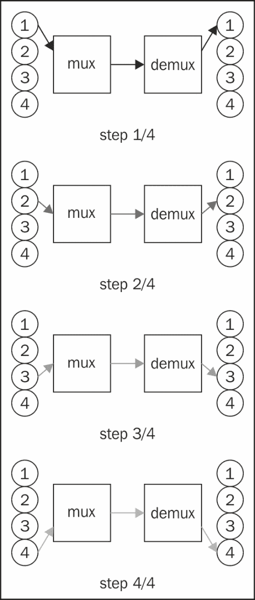

用一个四步周期的例子说明时分复用

依次，多路复用器和多路分解器之间只有一条通道被完全用于第一个信号，然后是第二个，以此类推，直到最后一个。

这种系统通常涉及一个时钟。这有助于为每个参与者设置正确的周期，以便他们知道我们在通信的哪个步骤。保持通信的安全性和完整性至关重要。

串行通信就是这样工作的，并且由于许多原因——即使你在前面的章节中认为你已经了解了很多——我们将在下一章中更深入地探讨它们。

让我们来检查一下如何处理我们的 Arduino 板上的八个传感器和仅有一个模拟输入。

## CD4051B 模拟多路复用器

CD4051B 模拟多路复用器非常便宜且非常有用。它基本上是一个模拟和数字多路复用器和多路分解器。这并不意味着你可以同时将其用作多路复用器和多路分解器。你必须确定你处于哪种情况，并为此情况布线和设计代码。但总是拥有几台 CD4051B 设备是有用的。

用作多路复用器时，你可以将八个电位器连接到 CD4051B，并只有一个 Arduino 模拟输入，然后通过代码读取所有 8 个值。

用作多路分解器时，你可以通过只从 Arduino 的一个引脚写入来写入八个模拟输出。我们将在本书稍后讨论这一点，当我们接近输出引脚，特别是与 LED 的**脉冲宽度调制**（**PWM**）技巧时。

### 集成电路是什么？

**集成电路**（**IC**）是一个微型化并全部包含在一个小塑料盒中的电子电路。这是最简单的定义。

基本上，我们无法谈论集成电路而不想到它们的小尺寸。这是集成电路的一个更有趣的特点。

另一个是我称之为**黑盒抽象**的东西。我也像硬件世界的编程类一样定义它。为什么？因为你不必确切知道它是如何工作的，只需知道如何使用它。这意味着如果外部引脚对你自己的目的有意义，那么内部的电路实际上并不重要。

这里是几种 IC 封装类型中的两种：

+   **双列直插封装**（**DIP**，也称为**DIL**）

+   **小外形**（**SO**）

你可以在[`how-to.wikia.com/wiki/Guide_to_IC_packages`](http://how-to.wikia.com/wiki/Guide_to_IC_packages)找到一份有用的指南。

两种 IC 中更常用的是 DIP 封装。它们也被称为通孔封装。我们可以轻松地操作并将它们插入到面包板或**印刷电路板**（**PCB**）上。

SO 需要更多的灵巧和更精细的工具。

### 如何布线 CD4051B IC？

第一个问题关于它**看起来**像什么？在这种情况下，答案是它看起来像 DIP 封装。

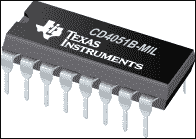

CD4051B DIP 封装版本

这是这个小巧的集成电路的正面。数据表在互联网上很容易找到。这里有一个来自德州仪器的：

[`www.ti.com/lit/ds/symlink/cd4051b.pdf`](http://www.ti.com/lit/ds/symlink/cd4051b.pdf)

我在下一张图中重新绘制了全局封装。

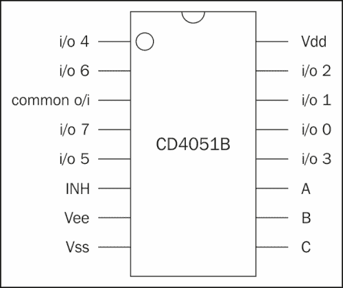

带有所有引脚描述的 CD4051B 原理图

#### 识别引脚编号 1

很容易找出哪个是引脚编号 1。按照标准，其中一个角落引脚前面刻有一个小圆圈。这就是引脚编号 1。

也有一个半圆形的小孔。当你将 IC 放置在这个半圆形在顶部（如图中所示）时，你就知道哪个是引脚编号 1；紧挨着引脚 1 的第一个引脚是引脚 2，以此类推，直到左列的最后一个引脚，在我们的例子中是引脚 8。然后，继续与左列最后一个引脚相对的引脚；这是引脚 9，下一个引脚是引脚 10，以此类推，直到右列的顶部。

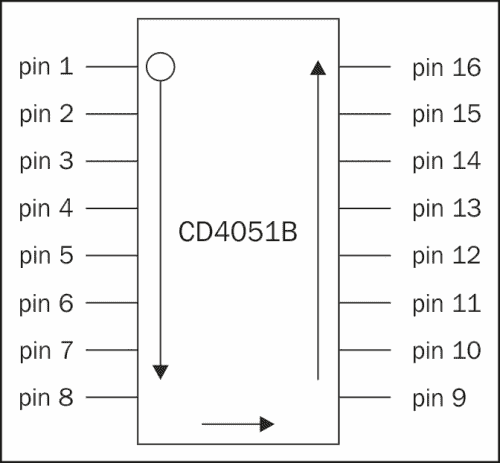

IC 引脚编号

当然，如果第一个输入是引脚 1，那就太简单了。唯一真正能确定的方法是查看规格。

### 为 IC 供电

IC 本身必须供电。这是为了使其激活，在某些情况下，还可以驱动电流。

+   Vdd 是正电源电压引脚。它必须连接到 5V 电源。

+   Vee 是负电源电压引脚。在这里，我们将它连接到地。

+   Vss 是地引脚，也连接到地。

### 模拟 I/O 系列和常见的 O/I

检查这个标题中 I 和 O 的顺序。

如果你选择使用 CD4051B 作为多路复用器，你将有多路模拟输入和一个公共输出。

另一方面，如果你选择将其用作解复用器，你将有一个公共输入和多个模拟输出。

选择/切换是如何工作的？让我们检查选择器的数字引脚，A、B 和 C。

### 选择数字引脚

现在是最重要的部分。

有三个引脚，命名为 A（引脚 11）、B（引脚 10）和 C（引脚 9），必须由 Arduino 的数字引脚驱动。什么？我们不是在模拟输入部分吗？我们完全是在，但我们将使用这三个选定的引脚介绍一种新的控制方法。

内置的多路复用引擎并不难理解。

基本上，我们发送一些信号来使 CD4051B 将输入切换到公共输出。如果我们想将其用作解复用器，三个选定的引脚必须以完全相同的方式控制。

在数据表中，我发现了一个真值表。那是什么？它只是一个表格，我们可以检查哪些 A、B 和 C 组合将输入切换到公共输出。

下表描述了组合：

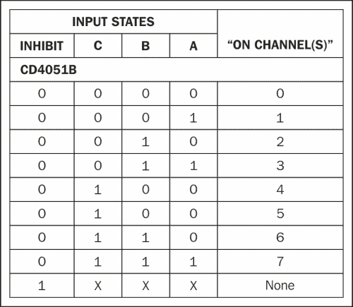

CD4051B 的真值表

换句话说，这意味着如果我们向 Arduino 上对应于 A 的数字输出写入 1，对应于 B 的写入 1，对应于 C 的写入 0，则切换的输入将是第三个通道。

当然，这里有一些好处。如果你*读取*对应于 C、B 和 A（按此顺序）的输入的二进制数，你会有一个惊喜；它将等同于公共输出切换的输入引脚的十进制数。

的确，二进制的 0 0 0 等于十进制的 0。参考表格以获取十进制数的二进制值：

| 0 0 0 | 0 |
| --- | --- |
| 0 0 1 | 1 |
| 0 1 0 | 2 |
| 0 1 1 | 3 |
| 1 0 0 | 4 |
| 1 0 1 | 5 |
| 1 1 0 | 6 |
| 1 1 1 | 7 |

这里是我们如何连接东西的方法：

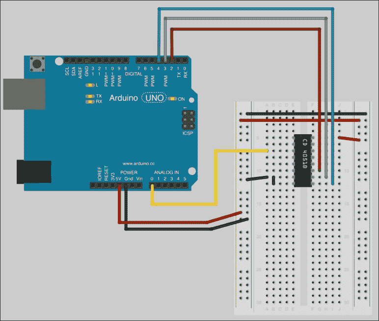

包括 CD4051B 多路复用器和其公共输出连接到模拟引脚 0 的电路

以下图是电气图：

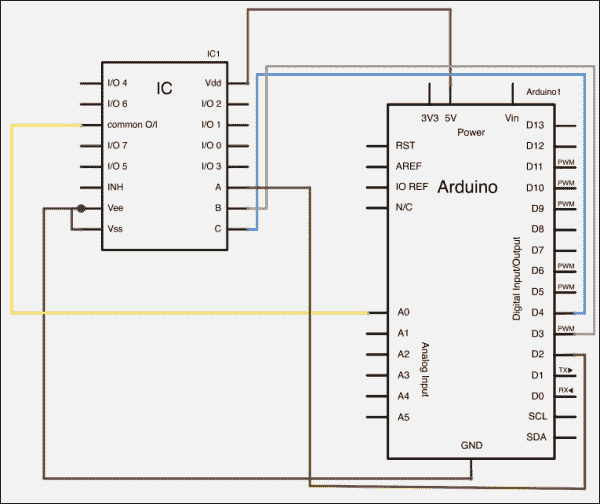

电气图

我们希望用这个系统读取的所有设备都应该连接到 CD4051B 上的 I/O 0、1、2 等端口。

考虑到我们对真值表的了解以及设备的工作方式，如果我们想顺序读取从 0 到 7 的所有引脚，我们必须在循环中包含两种类型的语句：

+   一个用于切换多路复用器

+   一个用于读取 Arduino 模拟输入 0

源代码看起来像这样（你可以在`Chapter6/analogMuxReader`文件夹中找到它）：

```cpp
int muxOutputPin = 0 ;  // pin connected to the common output of the CD4051B
int devicesNumber = 8 ; // number of device // BE CAREFUL, plug them from 0

int controlPinA = 2 ;   // pin connected to the select pin A of the CD4051B 
int controlPinB = 3 ;   // pin connected to the select pin B of the CD4051B 
int controlPinC = 4 ;   // pin connected to the select pin C of the CD4051B 

int currentInput = 0 ;  // hold the current analog input commuted o the common output of the CD4051B

void setup() {
  Serial.begin(9600);

  // setting up all 3 digital pins related to selectors A, B and C as outputs
  pinMode(controlPinA, OUTPUT);
  pinMode(controlPinB, OUTPUT);
  pinMode(controlPinC, OUTPUT);
}

void loop(){
  for (currentInput = 0 ; currentInput < devicesNumber - 1 ; currentInput++)
  {
    // selecting the inputs that is commuted to the common output of the CD4051B
    digitalWrite(controlPinA, bitRead(currentInput,0));
    digitalWrite(controlPinB, bitRead(currentInput,1));
    digitalWrite(controlPinC, bitRead(currentInput,2));

    // reading and storing the value of the currentInput
    Serial.println(analogRead(muxOutputPin)) ;
  }
}
```

在定义了所有变量之后，我们在`setup()`中设置串行端口，并将与 CD4051B 选择引脚相关的三个引脚作为输出。然后，在每个周期中，我首先通过驱动或不对 CD4051B 的 A、B 和 C 引脚供电来选择切换的输入。我在我的语句中使用嵌套函数来节省一些行。

`bitRead(number,n)`是一个新函数，能够返回一个数的*第 n*位。在我们的情况下，这是一个完美的函数。

我们对从 0 到 7 的输入进行循环，更确切地说，到`devicesNumber - 1`。

通过将这些位写入 CD4051B 设备的引脚 A、B 和 C，它每次选择模拟输入，并将串行端口读取的值弹出，以便在 Processing 或 Max 6 或您想使用的任何软件中进行进一步处理。

# 摘要

在本章中，我们至少学会了如何接近一个名为 Max 6 的非常强大的图形框架环境。随着我们继续使用 Processing，我们将在本书的几个后续示例中使用它。

当我们想要处理为 Arduino 模拟输入提供连续电压变化的传感器时，我们学到了一些反射技巧。

然后，我们还发现了一个非常重要的技术，即复用/解复用技术。

我们将在下一章关于串行通信的章节中讨论它。既然我们已经花费了很多时间，现在我们将更深入地探讨这种通信类型。
