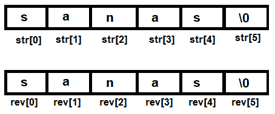
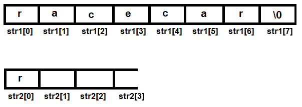
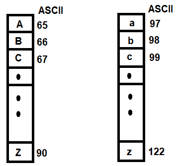
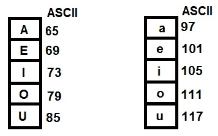

# 第二章：管理字符串

字符串不过是存储字符的数组。由于字符串是字符数组，它们占用的内存较少，导致代码更高效，使程序运行更快。就像数值数组一样，字符串也是零基的，也就是说，第一个字符存储在索引位置 0。在 C 语言中，字符串由一个空字符`\0`终止。

本章中的菜谱将增强您对字符串的理解，并使您熟悉字符串操作。字符串在几乎所有应用程序中都发挥着重要作用。您将学习如何搜索字符串（这是一个非常常见的任务），用另一个字符串替换字符串，搜索包含特定模式的字符串，等等。

在本章中，您将学习如何使用字符串创建以下菜谱：

+   判断字符串是否是回文

+   查找字符串中第一个重复字符的出现

+   显示字符串中每个字符的计数

+   计算字符串中的元音和辅音数量

+   将句子中的元音字母转换为大写

# 判断字符串是否是回文

回文是一种无论正向还是反向阅读都相同的字符串。例如，单词“radar”是回文，因为它正向和反向阅读都相同。

# 如何做到这一点…

1.  定义两个名为`str`和`rev`的 80 字符字符串（假设您的字符串不会超过 79 个字符）。您的字符串可以是任何长度，但请记住，字符串的最后一个位置是用于空字符`\0`的固定位置：

```cpp
char str[80],rev[80];
```

1.  输入将被分配给`str`字符串的字符：

```cpp
printf("Enter a string: ");
scanf("%s",str);
```

1.  使用`strlen`函数计算字符串的长度，并将其赋值给`n`变量：

```cpp
n=strlen(str);
```

1.  使用`for`循环以逆序执行，以逆序访问`str`字符串中的字符，然后将它们赋值给`rev`字符串：

```cpp
for(i=n-1;i >=0;  i--)
{
    rev[x]=str[i];
    x++;
}
rev[x]='\0';
```

1.  使用`strcmp`比较两个字符串，`str`和`rev`：

```cpp
if(strcmp(str,rev)==0)
```

1.  如果`str`和`rev`相同，则该字符串是回文。

在 C 语言中，特定内置函数的功能在相应的库中指定，也称为头文件。因此，在编写 C 程序时，每当使用内置函数时，我们都需要在程序顶部使用它们各自的头文件。头文件通常具有`.h`扩展名。在以下程序中，我使用了一个名为`strlen`的内置函数，该函数用于找出字符串的长度。因此，我需要在程序中使用其库，即`string.h`。

用于找出指定字符串是否为回文的`palindrome.c`程序如下：

```cpp
#include<stdio.h>  
#include<string.h>
void main()
{
    char str[80],rev[80];
    int n,i,x;
    printf("Enter a string: ");
    scanf("%s",str);
    n=strlen(str);
    x=0;
    for(i=n-1;i >=0;  i--)
    {
        rev[x]=str[i];
        x++;
    }
    rev[x]='\0';
    if(strcmp(str,rev)==0)
        printf("The %s is palindrome",str);
    else
        printf("The %s is not palindrome",str);
}
```

现在，让我们深入了解代码，以便更好地理解。

# 它是如何工作的...

为了确保字符串是回文，我们首先需要确保原始字符串及其逆序形式长度相同。

假设原始字符串是`sanjay`，并将其分配给字符串变量`str`。该字符串是一个字符数组，其中每个字符都作为数组元素单独存储，字符串数组中的最后一个元素是空字符。空字符表示为`\0`，在 C 语言中，它总是字符串变量的最后一个元素，如下面的图所示：


图 2.1

如您所见，字符串使用基于零的索引，即第一个字符位于索引位置**str[0]**，其次是**str[1]**，依此类推。至于最后一个元素，空字符位于**str[6]**。

使用`strlen`库函数，我们将计算输入字符串的长度并将其赋值给`n`变量。通过以相反的顺序执行`for`循环，`str`字符串的每个字符都将以相反的顺序访问，即从`n-1`到`0`，并赋值给`rev`字符串。

最后，向`rev`字符串添加一个空字符`\0`以使其成为一个完整的字符串。因此，`rev`将包含`str`字符串中的字符，但顺序相反：


图 2.2

接下来，我们将运行`strcmp`函数。如果函数返回`0`，则表示`str`和`rev`字符串中的内容完全相同，这意味着`str`是一个回文。如果`strcmp`函数返回除`0`以外的值，则表示两个字符串不相同；因此，`str`不是一个回文。

让我们使用 GCC 编译`palindrome.c`程序，如下所示：

```cpp
D:\CBook>gcc palindrome.c -o palindrome
```

现在，让我们运行生成的可执行文件`palindrome.exe`以查看程序的输出：

```cpp
D:\CBook>./palindrome
Enter a string: sanjay
The sanjay is not palindrome
```

现在，假设`str`被分配了另一个字符字符串`sanas`。为了确保`str`中的单词是一个回文，我们将再次在字符串中反转字符顺序。

因此，再次计算`str`的长度，以相反的顺序执行`for`循环，并将`str`中的每个字符访问并赋值给`rev`。空字符`\0`将被赋值给`rev`中的最后一个位置，如下所示：



图 2.3

最后，我们将再次调用`strcmp`函数并传递两个字符串。

编译后，让我们用新的字符串再次运行程序：

```cpp
D:\CBook>palindrome
Enter a string: sanas
The sanas is palindrome
```

哇！我们已经成功识别出我们的字符字符串是否是回文。现在，让我们继续下一个菜谱！

# 在字符串中查找第一个重复字符的出现

在这个菜谱中，你将学习如何创建一个显示字符串中第一个重复字符的程序。例如，如果你输入字符串`racecar`，程序应该输出“The first repetitive character in the string racecar is c.”。如果输入没有重复字符的字符串，程序应显示“No character is repeated in the string”。

# 如何做到这一点…

1.  定义两个名为`str1`和`str2`的字符串。您的字符串可以是任何长度，但字符串的最后一个位置是固定的，用于空字符`\0`：

```cpp
char str1[80],str2[80];
```

1.  输入要分配给`str1`的字符。这些字符将被分配到字符串的相应索引位置，从`str1[0]`开始：

```cpp
printf("Enter a string: ");
scanf("%s",str1);                
```

1.  使用`strlen`库函数计算`str1`的长度。在这里，`str1`的第一个字符被分配给`str2`：

```cpp
n=strlen(str1);
str2[0]=str1[0];
```

1.  使用`for`循环逐个访问`str1`中的所有字符，并将它们传递给`ifexists`函数以检查该字符是否已存在于`str2`中。如果字符在`str2`中找到，这意味着它是字符串的第一个重复字符，因此将在屏幕上显示：

```cpp
for(i=1;i < n; i++)
{
    if(ifexists(str1[i], str2, x))
    {
          printf("The first repetitive character in %s is %c", str1, 
          str1[i]);
          break;
    }
}
```

1.  如果`str1`中的字符不在`str2`中，则直接将其添加到`str2`中：

```cpp
else
{
    str2[x]=str1[i];
    x++;
}
```

寻找字符串中第一个重复字符的`repetitive.c`程序如下所示：

```cpp
#include<stdio.h>  
#include<string.h>
int ifexists(char u, char z[],  int v)
{
    int i;
    for (i=0; i<v;i++)
        if (z[i]==u) return (1);
    return (0);
}

void main()
{
    char str1[80],str2[80];
    int n,i,x;
    printf("Enter a string: ");
    scanf("%s",str1);
    n=strlen(str1);
    str2[0]=str1[0];
    x=1;
    for(i=1;i < n; i++)
    {
        if(ifexists(str1[i], str2, x))
        {
            printf("The first repetitive character in %s is %c", str1, 
            str1[i]);
            break;
        }
        else
        {
            str2[x]=str1[i];
            x++;
        }
    }
    if(i==n)
        printf("There is no repetitive character in the string %s", str1);
}
```

现在，让我们深入了解代码，以更好地理解它。

# 它是如何工作的...

假设我们已经定义了一个长度为某个值的字符串**str1**，并输入了以下字符——`racecar`。

字符串`racecar`中的每个字符都将被分配到**str1**的相应索引位置，即**r**将被分配给**str1[0]**，**a**将被分配给**str1[1]**，依此类推。因为 C 语言中的每个字符串都以空字符**\0**结束，所以**str1**的最后一个索引位置将包含空字符**\0**，如下所示：


图 2.4

使用库函数`strlen`计算**str1**的长度，并使用`for`循环逐个访问**str1**中的所有字符，除了第一个字符。第一个字符已经分配给**str2**，如下所示：



图 2.5

从**str1**访问的每个字符都会通过`ifexists`函数。`ifexists`函数将检查提供的字符是否已存在于**str2**中，并相应地返回布尔值。如果提供的字符在**str2**中找到，函数返回`1`，即`true`。如果提供的字符在**str2**中未找到，函数返回`0`，即`false`。

如果`ifexists`返回`1`，这意味着字符在**str2**中找到，因此，字符串的第一个重复字符将显示在屏幕上。如果`ifexists`函数返回`0`，这意味着字符不在**str2**中，因此简单地将其添加到**str2**中。

由于第一个字符已经被分配，因此**str1**的第二个字符被拾取并检查是否已存在于**str2**中。因为**str1**的第二个字符不在**str2**中，所以它被添加到后面的字符串中，如下所示：


图 2.6

该过程会重复进行，直到访问到**str1**中的所有字符。如果访问到**str1**中的所有字符，并且它们都没有在**str2**中找到，这意味着**str1**中的所有字符都是唯一的，没有重复。

以下图显示了访问**str1**的前四个字符后的字符串**str1**和**str2**。你可以看到这四个字符被添加到**str2**中，因为它们都不存在于**str2**中：


下一个要从**str1**中访问的字符是**c**。在将其添加到**str2**之前，它将与**str2**中所有现有的字符进行比较，以确定它是否已经存在那里。因为**c**字符已经存在于**str2**中，所以它不会被添加到**str2**中，并声明为**str1**中的第一个重复字符，如下所示：


图 2.8

让我们使用 GCC 编译`repetitive.c`程序，如下所示：

```cpp
D:\CBook>gcc repetitive.c -o repetitive
```

让我们运行生成的可执行文件`repetitive.exe`，以查看程序的输出：

```cpp
D:\CBook>./repetitive
Enter a string: education
There is no repetitive character in the string education
```

再次运行程序：

```cpp
D:\CBook>repetitive
Enter a string: racecar
The first repetitive character in racecar is c
```

哇！我们已经成功找到了字符串中的第一个重复字符。

现在，让我们继续下一个菜谱！

# 显示字符串中每个字符的计数

在这个菜谱中，你将学习如何创建一个程序，该程序以表格形式显示字符串中每个字符的计数。

# 如何做到这一点...

1.  创建一个名为`str`的字符串。字符串的最后一个元素将是一个空字符，`\0`。

1.  定义另一个与`str`长度匹配的字符串`chr`，用于存储`str`中的字符：

```cpp
char str[80],chr[80];

```

1.  提示用户输入一个字符串。输入的字符串将被分配给`str`字符串：

```cpp
printf("Enter a string: ");
scanf("%s",str);
```

1.  使用`strlen`计算字符串数组`str`的长度：

```cpp
n=strlen(str);
```

1.  定义一个名为 `count` 的整数数组，用于显示字符在 `str` 中出现的次数：

```cpp
int count[80];
```

1.  执行`chr[0]=str[0]`将`str`的第一个字符分配给`chr`的索引位置`chr[0]`。

1.  分配在`chr[0]`位置的字符的计数通过在`count[0]`索引位置分配`1`来表示：

```cpp
chr[0]=str[0];
count[0]=1;           
```

1.  运行一个`for`循环以访问`str`中的每个字符：

```cpp
for(i=1;i < n;  i++)
```

1.  运行`ifexists`函数以确定`str`中的字符是否存在于`chr`字符串中。如果字符不在`chr`字符串中，它将被添加到`chr`字符串的下一个索引位置，并且相应的索引位置在`count`数组中被设置为`1`：

```cpp
if(!ifexists(str[i], chr, x, count))
{
    x++;
    chr[x]=str[i];
    count[x]=1;
}
```

1.  如果字符存在于`chr`字符串中，`ifexists`函数中将相应索引位置的`count`数组值增加`1`。以下片段中的`p`和`q`数组分别代表`chr`和`count`数组，因为`chr`和`count`数组在`ifexists`函数中传递并分配给`p`和`q`参数：

```cpp
if (p[i]==u)
{
    q[i]++;
    return (1);
}
```

用于计算字符串中每个字符的`countofeach.c`程序如下所示：

```cpp
#include<stdio.h>
#include<string.h>
int ifexists(char u, char p[],  int v, int q[])
{
    int i;
    for (i=0; i<=v;i++)
    {
        if (p[i]==u)
        {
            q[i]++;
            return (1);
        }
    }
    if(i>v) return (0);
}
void main()
{
    char str[80],chr[80];
    int n,i,x,count[80];
    printf("Enter a string: ");
    scanf("%s",str);
    n=strlen(str);
    chr[0]=str[0];
    count[0]=1;
    x=0;
    for(i=1;i < n;  i++)
    {
        if(!ifexists(str[i], chr, x, count))
        {            
            x++;
            chr[x]=str[i];
            count[x]=1;
        }
    }
    printf("The count of each character in the string %s is \n", str);
    for (i=0;i<=x;i++)
        printf("%c\t%d\n",chr[i],count[i]);
}
```

现在，让我们深入了解代码，以更好地理解它。

# 它是如何工作的...

假设您定义的两个字符串变量，`str` 和 `chr`，大小为 `80`（如果您愿意，您可以始终增加字符串的大小）。

我们将字符串 `racecar` 赋值给 **str** 字符串。每个字符都将被分配到 **str** 的相应索引位置，即 **r** 将被分配到索引位置 **str[0]**，**a** 将被分配到 **str[1]**，以此类推。一如既往，字符串的最后一个元素将是一个空字符，如下面的图所示：


图 2.9

使用 `strlen` 函数，我们首先计算字符串的长度。然后，我们将使用字符串数组 **chr** 在每个索引位置单独存储 **str** 数组中的字符。我们将从 `1` 开始执行一个循环，直到字符串的末尾，以访问字符串中的每个字符。

我们之前定义的整数数组，即 **count**，将表示 **str** 中字符出现的次数，这由 **chr** 数组中的索引位置表示。也就是说，如果 **r** 在索引位置 **chr[0]**，那么 **count[0]** 将包含一个整数值（在这种情况下为 1），以表示到目前为止在 **str** 字符串中 **r** 字符出现的次数：


图 2.10

以下操作之一将应用于从字符串中访问的每个字符：

+   如果字符存在于 **chr** 数组中，则 **count** 数组中相应索引位置上的值增加 1。例如，如果字符串中的字符在 **chr[2]** 索引位置找到，那么 **count[2]** 索引位置上的值增加 1。

+   如果字符不在 **chr** 数组中，它将被添加到 **chr** 数组的下一个索引位置，并且当计数数组设置为 **1** 时找到相应的索引位置。例如，如果字符 **a** 在 **chr** 数组中没有找到，它将被添加到下一个可用的索引位置。如果字符 **a** 被添加到 **chr[1]** 位置，那么在 **count[1]** 索引位置将分配一个值 **1**，以指示到目前为止在 **chr[1]** 中显示的字符出现了一次。

当 `for` 循环完成后，即当访问了字符串中的所有字符时。`chr` 数组将包含字符串的各个字符，而 `count` 数组将包含计数，即 `chr` 数组表示的字符在字符串中出现的次数。`chr` 和 `count` 数组中的所有元素都将在屏幕上显示。

让我们使用 GCC 编译 `countofeach.c` 程序，如下所示：

```cpp
D:\CBook>gcc countofeach.c -o countofeach
```

让我们运行生成的可执行文件，`countofeach.exe`，以查看程序的输出：

```cpp
D:\CBook>./countofeach
Enter a string: bintu
The count of each character in the string bintu is
b       1
i       1
n       1
t       1
u       1
```

让我们尝试另一个字符串来测试结果：

```cpp
D:\CBook>./countofeach
Enter a string: racecar
The count of each character in the string racecar is
r       2
a       2
c       2
e       1
```

哇！我们已经成功显示了字符串中每个字符的计数。

现在，让我们继续下一个菜谱！

# 计算句子中的元音和辅音

在这个菜谱中，你将学习如何计算输入句子中的元音和辅音数量。元音是*a*、*e*、*i*、*o*和*u*，其余的字母都是辅音。我们将使用 ASCII 值来识别字母及其大小写：



图 2.11

空格、数字、特殊字符和符号将被简单地忽略。

# 如何做...

1.  创建一个名为`str`的字符串数组来输入你的句子。像往常一样，最后一个字符将是空字符：

```cpp
char str[255];
```

1.  定义两个变量，`ctrV`和`ctrC`：

```cpp
int  ctrV,ctrC;
```

1.  提示用户输入一个你选择的句子：

```cpp
printf("Enter a sentence: ");
```

1.  执行`gets`函数以接受单词之间有空格的句子：

```cpp
gets(str);
```

1.  将`ctrV`和`ctrC`初始化为`0`。`ctrV`变量将计算句子中的元音数量，而`ctrC`变量将计算句子中的辅音数量：

```cpp
ctrV=ctrC=0;
```

1.  执行一个`while`循环来逐个访问句子的每个字母，直到达到句子中的空字符。

1.  执行一个`if`块来检查字母是否为大写或小写，使用 ASCII 值。这也确认了访问的字符不是空白字符、特殊字符或符号，或数字。

1.  完成这个操作后，执行一个嵌套的`if`块来检查字母是否为小写或大写元音，并等待`while`循环结束：

```cpp
while(str[i]!='\0')
{
    if((str[i] >=65 && str[i]<=90) || (str[i] >=97 && str[i]<=122))
    {
        if(str[i]=='A' ||str[i]=='E' ||str[i]=='I' ||str[i]=='O' 
        ||str[i]=='U' ||str[i]=='a' ||str[i]=='e' ||str[i]=='i' 
        ||str[i]=='o'||str[i]=='u')
            ctrV++;
        else
            ctrC++;
    }
    i++;
}
```

用于在字符串中计算元音和辅音的`countvowelsandcons.c`程序如下：

```cpp
#include <stdio.h>
void main()
{
    char str[255];
    int  ctrV,ctrC,i;
    printf("Enter a sentence: ");
    gets(str);
    ctrV=ctrC=i=0;
    while(str[i]!='\0')
    {
        if((str[i] >=65 && str[i]<=90) || (str[i] >=97 && str[i]<=122))
        {
            if(str[i]=='A' ||str[i]=='E' ||str[i]=='I' ||str[i]=='O' 
            ||str[i]=='U' ||str[i]=='a' ||str[i]=='e' ||str[i]=='i' 
            ||str[i]=='o'||str[i]=='u')
                ctrV++;
            else
                ctrC++;
        }
        i++;
    }
    printf("Number of vowels are : %d\nNumber of consonants are : 
    %d\n",ctrV,ctrC);
}
```

现在，让我们深入了解代码以更好地理解它。

# 它是如何工作的...

我们假设你不会输入超过 255 个字符的句子，所以我们相应地定义了我们的字符串变量。当提示时，输入一个将被分配给`str`变量的句子。因为句子中可能有单词之间的空格，所以我们将执行`gets`函数来接受句子。

我们定义的两个变量，即`ctrV`和`ctrC`，被初始化为`0`。因为字符串的最后一个字符总是空字符`\0`，所以执行一个`while`循环，它会逐个访问句子的每个字符，直到达到句子中的空字符。

从句子中访问的每个字母都会被检查以确认它是一个大写或小写字符。也就是说，它们的 ASCII 值会被比较，如果访问的字符的 ASCII 值是大写或小写字符，那么它将执行嵌套的`if`块。否则，将访问句子中的下一个字符。

一旦你确保访问的字符不是空白字符，任何特殊字符或符号，或数值，那么将执行一个`if`块，该块检查访问的字符是否为小写或大写元音。如果访问的字符是元音，则`ctrV`变量的值增加`1`。如果访问的字符不是元音，则确认它是辅音，因此`ctrC`变量的值增加`1`。

一旦访问了句子的所有字符，即当达到句子的空字符时，`while`循环终止，并在屏幕上显示存储在`ctrV`和`ctrC`变量中的元音和辅音的数量。

让我们使用 GCC 编译`countvowelsandcons.c`程序，如下所示：

```cpp
D:\CBook>gcc countvowelsandcons.c -o countvowelsandcons
```

让我们运行生成的可执行文件`countvowelsandcons.exe`以查看程序的输出：

```cpp
D:\CBook>./countvowelsandcons
Enter a sentence: Today it might rain. Its a hot weather. I do like rain
Number of vowels are : 18
Number of consonants are : 23
```

哇！我们已经成功统计了我们句子中的所有元音和辅音。

现在，让我们继续下一个菜谱！

# 将句子中的元音转换为大写

在这个菜谱中，你将学习如何将句子中的所有小写元音转换为大写。句子中的其余字符，包括辅音、数字、特殊符号和特殊字符，将被简单地忽略，并保持原样。

通过简单地改变该字符的 ASCII 值来转换任何字母的大小写，使用以下公式：

+   从小写字符的 ASCII 值中减去`32`以将其转换为大写

+   将`32`加到一个大写字符的 ASCII 值上以将其转换为小写

以下图表显示了大小写元音的 ASCII 值：



图 2.12

大写字母的 ASCII 值低于小写字母的 ASCII 值，两者之间的差值为`32`。

# 如何做到这一点…

1.  创建一个名为`str`的字符串来输入你的句子。像往常一样，最后一个字符将是空字符：

```cpp
char str[255];
```

1.  输入你选择的句子：

```cpp
printf("Enter a sentence: ");
```

1.  执行`gets`函数以接受单词之间有空格的句子，并将`i`变量初始化为`0`，因为句子的每个字符将通过`i`访问：

```cpp
gets(str);
i=0
```

1.  执行一个`while`循环逐个访问句子的每个字母，直到达到句子的空字符：

```cpp
while(str[i]!='\0')
{
    { …
    }
}
i++;
```

1.  检查每个字母以验证它是否为小写元音。如果访问的字符是小写元音，则从该元音的 ASCII 值中减去`32`以将其转换为大写：

```cpp
if(str[i]=='a' ||str[i]=='e' ||str[i]=='i' ||str[i]=='o' ||str[i]=='u')
    str[i]=str[i]-32;
```

1.  当访问了句子的所有字母后，只需显示整个句子。

将句子中的小写元音转换为大写的`convertvowels.c`程序如下：

```cpp
#include <stdio.h>
void main()
{
    char str[255];
    int  i;
    printf("Enter a sentence: ");
    gets(str); 
    i=0;
    while(str[i]!='\0')
    {
        if(str[i]=='a' ||str[i]=='e' ||str[i]=='i' ||str[i]=='o' 
        ||str[i]=='u')
            str [i] = str [i] -32;
        i++;
    }
    printf("The sentence after converting vowels into uppercase 
    is:\n");
    puts(str);
}
```

现在，让我们深入了解代码以更好地理解它。

# 它是如何工作的…

再次，我们将假设你不会输入超过 255 个字符的句子。因此，我们定义我们的字符串数组，`str`，大小为 255。当提示输入时，输入一个要分配给`str`数组的句子。因为一个句子中的单词之间可能有空格，所以我们不会使用`scanf`，而是使用`gets`函数来接受句子。

为了访问句子中的每个字符，我们将执行一个`while`循环，该循环将一直运行，直到在句子中遇到空字符。在句子的每个字符之后，都会检查它是否是小写元音。如果不是小写元音，则忽略该字符，并选择句子中的下一个字符进行比较。

如果访问的字符是小写元音，则从字符的 ASCII 值中减去`32`以将其转换为大写。记住，小写和大写字母的 ASCII 值之差是`32`。也就是说，小写字母`a`的 ASCII 值是`97`，而大写字母`A`的 ASCII 值是`65`。所以，如果你从`97`（小写字母`a`的 ASCII 值）中减去`32`，新的 ASCII 值将变为`65`，这是大写字母`A`的 ASCII 值。

将小写元音转换为大写元音的步骤是首先使用`if`语句在句子中找到元音，然后从其 ASCII 值中减去`32`以将其转换为大写。

一旦访问了字符串的所有字符，并且句子中的所有小写元音都转换为大写，整个句子将使用`puts`函数显示。

让我们使用 GCC 编译`convertvowels.c`程序，如下所示：

```cpp
D:\CBook>gcc convertvowels.c -o convertvowels
```

让我们运行生成的可执行文件`convertvowels.exe`，以查看程序的输出：

```cpp
D:\CBook>./convertvowels
Enter a sentence: It is very hot today. Appears as if it might rain. I like rain
The sentence after converting vowels into uppercase is:
It Is vEry hOt tOdAy. AppEArs As If It mIght rAIn. I lIkE rAIn
```

哇！我们已经成功地将句子中的小写元音转换为大写。
