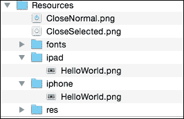
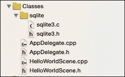

# 第七章. 与资源文件一起工作

游戏有很多资源，如图片和音频文件。Cocos2d-x 有一个资源管理系统。本章将涵盖以下主题：

+   选择资源文件

+   管理资源文件

+   使用 SQLite

+   使用 .xml 文件

+   使用 .plist 文件

+   使用 .json 文件

# 选择资源文件

你的游戏有每个分辨率的图片以支持多分辨率适配。如果你决定为每个分辨率找到一个图片，你的应用程序逻辑将非常复杂。Cocos2d-x 有一个搜索路径机制来解决这个问题。在这个菜谱中，我们将解释这个搜索路径机制。

## 准备工作

如果你想在不同的分辨率之间共享一些资源，那么你可以将所有共享资源放在 `Resources` 文件夹中，并将指定分辨率的资源放在不同的文件夹中，如下面的图片所示。



`CloseNormal.png` 和 `CloseSelected.png` 是不同分辨率之间的共享资源。然而，`HelloWorld.png` 是指定分辨率的资源。

## 如何操作...

你可以按照以下方式设置 Cocos2d-x 搜索资源的优先级：

```cpp
std::vector<std::string> searchPaths; 
searchPaths.push_back("ipad"); 
FileUtils::setSearchPaths(searchPaths); 
Sprite *sprite = Sprite::create("HelloWorld.png");
Sprite *close  = Sprite::create("CloseNormal.png");
```

## 它是如何工作的...

Cocos2d-x 将在 `Resources/ipad` 中找到 `HelloWorld.png`。Cocos2d-x 将使用此路径中的 `HelloWorld.png`；这就是为什么它可以在 `Resources/ipad` 中找到这个资源。然而，Cocos2d-x 不能在 `Resources/ipad` 中找到 `CloseNormal.png`。它将找到下一个顺序路径的 `Resources` 文件夹。系统可以在 `Resources` 文件夹中找到它并使用它。

你应该在创建第一个场景之前，在 `AppDelegate::applicationDidFinishLaunching` 方法中添加此代码。然后，第一个场景就可以使用这个搜索路径设置了。

## 参见

+   下一个菜谱中称为 *管理资源文件* 的搜索路径机制。

# 管理资源文件

Cocos2d-x 有一个管理资源的扩展，它被称为 `AssetsManagerExtension`。这个扩展是为了资源如图片和音频文件的热更新而设计的。你可以通过这个扩展更新游戏中的资源新版本，而无需更新你的应用程序。

## 准备工作

在使用 `AssetsManagerExtension` 之前，你应该了解它。这个扩展有许多有用的功能来帮助你进行热更新。以下是一些这些功能：

+   支持多线程下载

+   两级进度支持——文件级和字节级进度

+   支持压缩的 ZIP 文件

+   恢复下载

+   详细进度信息和错误信息

+   重试失败资源的可能性

你必须准备一个网络服务器，因此，你的应用程序将下载资源。

## 如何操作...

你需要上传资源和清单文件。在这种情况下，我们将更新 `HelloWorld.png` 和一个名为 `test.zip` 的 `.zip` 文件。这个 `.zip` 文件包含一些新的图片。`AssetsManagerExtension` 将根据清单文件下载资源。清单文件是 `version.manifest` 和 `project.manifest`。

`version.manifest` 文件包含以下代码：

```cpp
{
    "packageUrl" : "http://example.com/assets_manager/", 
    "remoteVersionUrl" : 
    "http://example.com/assets_manager/version.manifest", 
    "remoteManifestUrl" : 
    "http://example.com/assets_manager/project.manifest", 
    "version" : "1.0.1",}
```

`project.manifest` 文件包含以下代码：

```cpp
{
    "packageUrl" : "http://example.com/assets_manager/", 
    "remoteVersionUrl" : "http://example.com/assets_manager/version.manifest", 
    "remoteManifestUrl" : "http://example.com/assets_manager/project.manifest", 
    "version" : "1.0.1",
    "assets" : {
        "HelloWorld.png" : {
            "md5" : "b7892dc221c840550847eaffa1c0b0aa" 
        }, 
        "test.zip" : {
            "md5" : "c7615739e7a9bcd1b66e0018aff07517", 
            "compressed" : true
        }
    }
}
```

然后，你必须上传这些清单文件和新资源。

接下来，你必须为热更新准备你的应用程序。你必须在你的项目中创建 `local.manifest` 文件。本地清单文件应包含以下代码：

```cpp
{
    "packageUrl" : "http://example.com/assets_manager/", 
    "remoteVersionUrl" : 
"http://example.com/assets_manager/version.manifest", 
    "remoteManifestUrl" : 
"http://example.com/assets_manager/project.manifest", 
    "version" : "1.0.0", 
}
```

你应该在项目中创建一个管理 `AssetsManagerExtension` 的类。在这里，我们创建了一个名为 `ResourceManager` 的类。首先，你将创建 `ResourceManager` 的头文件。它被称为 `ResourceManager.h`。此文件包含以下代码：

```cpp
#include "cocos2d.h"
#include "extensions/cocos-ext.h"

class ResourceManager {
private:
    ResourceManager();
    static ResourceManager* instance;

    cocos2d::extension::AssetsManagerEx* _am; 
    cocos2d::extension::EventListenerAssetsManagerEx* _amListener; 

public: 
    // custom event name 
    static const char* EVENT_PROGRESS; 
    static const char* EVENT_FINISHED; 

    virtual ~ResourceManager(); 
    static ResourceManager* getInstance(); 

    void updateAssets(std::string manifestPath); 
};
```

下一步是创建一个 `ResourceManager.cpp` 文件。此文件包含以下代码：

```cpp
#include "ResourceManager.h"

USING_NS_CC;
USING_NS_CC_EXT;

// custom event name
const char* ResourceManager::EVENT_PROGRESS = "__cc_Resource_Event_Progress"; 
const char* ResourceManager::EVENT_FINISHED = "__cc_Resource_Event_Finished"; 

ResourceManager* ResourceManager::instance = nullptr; 

ResourceManager::~ResourceManager() {
    CC_SAFE_RELEASE_NULL(_am);
}

ResourceManager::ResourceManager()
:_am(nullptr)
,_amListener(nullptr)
{

}

ResourceManager* ResourceManager::getInstance() { 
    if (instance==nullptr) { 
        instance = new ResourceManager(); 
    } 
     return instance; 
}

void ResourceManager::updateAssets(std::string manifestPath) 
{
    std::string storagePath = FileUtils::getInstance()- 
    >getWritablePath(); 
    CCLOG("storage path = %s", storagePath.c_str()); 

    if (_am!=nullptr) { 
        CC_SAFE_RELEASE_NULL(_am); 
    } 
    _am = AssetsManagerEx::create(manifestPath, storagePath); 
    _am->retain(); 

    if (!_am->getLocalManifest()->isLoaded()) { 
        CCLOG("Fail to update assets, step skipped."); 
    } else { 
        _amListener = EventListenerAssetsManagerEx::create(_am, 
this{ 
            static int failCount = 0; 
            switch (event->getEventCode()) 
            {
                case 
EventAssetsManagerEx::EventCode::ERROR_NO_LOCAL_MANIFEST: 
                { 
                    CCLOG("No local manifest file found, skip 
                    assets update.");
                    break; 
                } 
                case 
EventAssetsManagerEx::EventCode::UPDATE_PROGRESSION: 
                { 
                    std::string assetId = event->getAssetId(); 
                    float percent = event->getPercent(); 
                    std::string str; 
                    if (assetId == AssetsManagerEx::VERSION_ID) { 
                        // progress for version file
                    } else if (assetId == 
AssetsManagerEx::MANIFEST_ID) {
                        // progress for manifest file 
                    } else { 
                        // dispatch progress event 
                        CCLOG("%.2f Percent", percent); 
                        auto event = 
EventCustom(ResourceManager::EVENT_PROGRESS); 
                        auto data = Value(percent); 
                        event.setUserData(&data); 
                        Director::getInstance()->getEventDispatcher()->dispatchEvent(&event); 
                    } 

                    break; 
                } 
                case 
EventAssetsManagerEx::EventCode::ERROR_DOWNLOAD_MANIFEST: 
                case 
EventAssetsManagerEx::EventCode::ERROR_PARSE_MANIFEST: 

                { 
                    CCLOG("Fail to download manifest file, update 
skipped."); 
                    break; 
                } 
                case 
EventAssetsManagerEx::EventCode::ALREADY_UP_TO_DATE: 
                case 
EventAssetsManagerEx::EventCode::UPDATE_FINISHED: 
                { 
                    CCLOG("Update finished. %s", 
                    event->getMessage().c_str()); 
                    CC_SAFE_RELEASE_NULL(_am); 
                    // dispatch finished updating event 
                    Director::getInstance()->getEventDispatcher()- 
>dispatchCustomEvent(ResourceManager::EVENT_FINISHED); 
                    break; 
                } 
                case 
EventAssetsManagerEx::EventCode::UPDATE_FAILED: 
                { 
                    CCLOG("Update failed. %s", event- 
>getMessage().c_str()); 

                    // retry 5 times, if error occurred 
                    failCount ++; 
                    if (failCount < 5) { 
                        _am->downloadFailedAssets(); 
                    } else { 
                        CCLOG("Reach maximum fail count, exit 
update process"); 
                        failCount = 0; 
                    } 
                    break; 
                } 
                case 
EventAssetsManagerEx::EventCode::ERROR_UPDATING: 
                { 
                    CCLOG("Asset %s : %s", event- 
>getAssetId().c_str(), event->getMessage().c_str()); 
                    break; 
                } 
                case 
EventAssetsManagerEx::EventCode::ERROR_DECOMPRESS: 
                { 
                    CCLOG("%s", event->getMessage().c_str()); 
                    break;
                } 
                default: 
                    break;
            } 
        }); 

        // execute updating resources 
        Director::getInstance()->getEventDispatcher()- 
>addEventListenerWithFixedPriority(_amListener, 1); 
        _am->update(); 
    } 
}
```

最后，要开始更新资源，请使用以下代码：

```cpp
// label for progress 
auto size = Director::getInstance()->getWinSize(); 
TTFConfig config("fonts/arial.ttf", 30); 
_progress = Label::createWithTTF(config, "0%", 
TextHAlignment::CENTER); 
_progress->setPosition( Vec2(size.width/2, 50) ); 
this->addChild(_progress); 

// progress event 
getEventDispatcher()- 
>addCustomEventListener(ResourceManager::EVENT_PROGRESS, 
this{ 
    auto data = (Value*)event->getUserData(); 
    float percent = data->asFloat(); 
    std::string str = StringUtils::format("%.2f", percent) + "%"; 
    CCLOG("%.2f Percent", percent); 
    if (this->_progress != nullptr) { 
        this->_progress->setString(str); 
    }
}); 

// fnished updating event 
getEventDispatcher()- 
>addCustomEventListener(ResourceManager::EVENT_FINISHED, 
this{ 
    // clear cache 
    Director::getInstance()->getTextureCache()- 
>removeAllTextures(); 
    // reload scene 
    auto scene = HelloWorld::createScene(); 
    Director::getInstance()->replaceScene(scene); 
});

// update resources 
ResourceManager::getInstance()- 
>updateAssets("res/local.manifest");
```

## 它是如何工作的...

首先，我们将解释清单文件和 `AssetsManagerExtension` 的机制。清单文件是 JSON 格式。本地清单和版本清单包含以下数据：

| 键 | 描述 |
| --- | --- |
| `packageUrl` | 资源管理器将尝试请求和下载所有资产的 URL。 |
| `remoteVersionUrl` | 允许检查远程版本的远程版本清单文件 URL，以确定是否已将新版本上传到服务器。 |
| `remoteManifestUrl` | 包含所有资产信息的远程清单文件 URL。 |
| `version` | 此清单文件的版本。 |

此外，远程清单中在名为 assets 的键中还有以下数据。

| 键 | 描述 |
| --- | --- |
| `key` | 每个键代表资产的相对路径。 |
| `Md5` | `md5` 字段表示资产的版本信息。 |
| `compressed` | 当压缩字段为 `true` 时，下载的文件将自动解压；此键是可选的。 |

`AssetsManagerExtension` 将按照以下步骤执行热更新：

1.  在应用程序中读取本地清单。

1.  根据本地清单中的远程版本 URL 下载版本清单。

1.  将本地清单中的版本与版本清单中的版本进行比较。

1.  如果两个版本不匹配，`AssetsManagerExtension` 将根据本地清单中的远程清单 URL 下载项目清单。

1.  将远程清单中的 `md5` 值与应用程序中资产的 `md5` 进行比较。

1.  如果两个 `md5` 值不匹配，`AssetsManagerExtension` 将下载此资产。

1.  下次，`AssetsManagerExtension` 将使用下载的版本清单而不是本地清单。

接下来，我们将解释 `ResourceManager` 类。你可以按照以下方式执行热更新：

```cpp
ResourceManager::getInstance()->updateAssets("res/local.manifest");
```

您应该通过指定本地清单的路径来调用 `ResourceManager::updateAssets` 方法。`ResourceManager::updateAssets` 将通过指定本地清单的路径和应用程序中存储的路径来创建一个 `AssetsManagerEx` 的实例，这是 `AssetsManagerExtension` 类的名称。

它将创建一个 `EventListenerAssetsManagerEx` 的实例以监听热更新的进度。

如果压缩值为真，`AssetsManagerExtension` 将在下载后解压它。

您可以通过调用 `AssetsManagerEx::update` 方法来更新资产。在更新过程中，您可以获取以下事件：

| 事件 | 描述 |
| --- | --- |
| `ERROR_NO_LOCAL_MANIFEST` | 无法找到本地清单。 |
| `UPDATE_PROGRESSION` | 获取更新的进度。 |
| `ERROR_DOWNLOAD_MANIFEST` | 下载清单文件失败。 |
| `ERROR_PARSE_MANIFEST` | 解析清单文件时出错。 |
| `ALREADY_UP_TO_DATE` | 已在更新资产（本地清单中的版本和版本清单中的版本相等）。 |
| `UPDATE_FINISHED` | 资产更新完成。 |
| `UPDATE_FAILED` | 更新资产时发生错误。在这种情况下，错误的原因可能是连接。您应该尝试再次更新。 |
| `ERROR_UPDATING` | 更新失败。 |
| `ERROR_DECOMPRESS` | 解压时发生错误。 |

当 `ResourceManager` 捕获到名为 `UPDATE_PROGRESSION` 的事件时，它会分发名为 `EVENT_PROGRESS` 的事件。如果您捕获到 `EVENT_PROGRESS`，您应该更新进度标签。

此外，如果它捕获到名为 `UPDATE_FINISHED` 的事件，它还会分发名为 `EVENT_FINISHED` 的事件。如果您捕获到 `EVENT_FINISHED`，您应该刷新所有纹理。这就是为什么我们要移除所有纹理缓存并重新加载场景。

```cpp
// clear cache Director::getInstance()->getTextureCache()->removeAllTextures();
// reload sceneauto scene = HelloWorld::createScene(); 
Director::getInstance()->replaceScene(scene);
```

# 使用 SQLite

您可以通过使用游戏中的数据库轻松地保存和加载游戏数据。在智能手机应用程序中，通常使用名为 SQLite 的数据库。SQLite 易于使用。然而，在使用它之前，您必须设置一些事情。在本菜谱中，我们将解释如何在 Cocos2d-x 中设置和使用 SQLite。

## 准备就绪

Cocos2d-x 没有 SQLite 库。您必须将 SQLite 的源代码添加到 Cocos2d-x 中。

您需要从网站 [`sqlite.org/download.html`](http://sqlite.org/download.html) 下载源代码。本书撰写时的最新版本是版本 3.8.10。您可以下载此版本的 `.zip` 文件并将其展开。然后，您可以将生成的文件添加到您的项目中，如下面的图像所示：



在本菜谱中，我们将创建一个名为 `SQLiteManager` 的原始类。因此，您必须将 `SQLiteManager.h` 和 `SQLiteManager.cpp` 文件添加到您的项目中。

然后，如果您为 Android 构建，您必须按照以下方式编辑 `proj.android/jni/Android.mk`：

```cpp
LOCAL_SRC_FILES := hellocpp/main.cpp \ 
                   ../../Classes/AppDelegate.cpp \ 
                   ../../Classes/HelloWorldScene.cpp \ 
                   ../../Classes/SQLiteManager.cpp \ 
                   ../../Classes/sqlite/sqlite3.c
```

## 如何做到这一点...

首先，您必须按照以下方式编辑 `SQLiteManager.h` 文件：

```cpp
#include "cocos2d.h" #include "sqlite/sqlite3.h"

class SQLiteManager {
private:
    SQLiteManager();
    static SQLiteManager* instance;
    sqlite3 *_db;
    bool open();
    void close();
public:
    virtual ~SQLiteManager();
    static SQLiteManager* getInstance();
    void insert(std::string key, std::string value);
    std::string select(std::string key);
};
```

接下来，你必须编辑`SQLiteManager.cpp`文件。这段代码有点长。所以，我们将一步一步地解释它。

1.  为单例类添加以下代码：

    ```cpp
    SQLiteManager* SQLiteManager::instance = nullptr; 
    SQLiteManager::~SQLiteManager() { 
    }

    SQLiteManager::SQLiteManager()
    {
        if (this->open()) {
            sqlite3_stmt* stmt;
            // create table 
            std::string sql = "CREATE TABLE IF NOT EXISTS 
    data(key TEXT PRIMARY KEY,value TEXT);"; 
            if (sqlite3_prepare_v2(_db, sql.c_str(), -1, &stmt, 
    nullptr) == SQLITE_OK) { 
                if (sqlite3_step(stmt)!=SQLITE_DONE) { 
                    CCLOG("Error in CREATE TABLE"); 
                }
      } 
            sqlite3_reset(stmt); 
            sqlite3_finalize(stmt); 
            this->close(); 
       } 
    }

    SQLiteManager* SQLiteManager::getInstance() { 
        if (instance==nullptr) { 
            instance = new SQLiteManager(); 
        }
        return instance;
    }
    ```

1.  添加打开和关闭数据库的方法：

    ```cpp
    bool SQLiteManager::open() 
    {
        std::string path = FileUtils::getInstance()- 
    >getWritablePath()+"test.sqlite"; 
        return sqlite3_open(path.c_str(), &_db)==SQLITE_OK; 
    }

    void SQLiteManager::close() 
    { 
        sqlite3_close(_db); 
    }
    ```

1.  添加向数据库插入数据的方法：

    ```cpp
    void SQLiteManager::insert(std::string key, std::string value)
    {
        this->open();
        // insert data
        sqlite3_stmt* stmt;
        std::string sql = "INSERT INTO data (key, value) VALUES(?, ?)";
        if (sqlite3_prepare_v2(_db, sql.c_str(), -1, &stmt, nullptr) == SQLITE_OK) {
            sqlite3_bind_text(stmt, 1, key.c_str(), -1, SQLITE_TRANSIENT);
            sqlite3_bind_text(stmt, 2, value.c_str(), -1, SQLITE_TRANSIENT);
            if (sqlite3_step(stmt)!=SQLITE_DONE) { 
                CCLOG("Error in INSERT 1, %s", 
                sqlite3_errmsg(_db)); 
            }
        }
        sqlite3_reset(stmt);
        sqlite3_finalize(stmt);
        this->close();
    }
    ```

1.  添加从数据库选择数据的方法：

    ```cpp
    std::string SQLiteManager::select(std::string key){
        this->open(); 

        // select data 
        std::string value; 
        sqlite3_stmt* stmt; 
        std::string sql = "SELECT VALUE from data where key=?"; 
        if (sqlite3_prepare_v2(_db, sql.c_str(), -1, &stmt, 
        NULL) == SQLITE_OK) { 
            sqlite3_bind_text(stmt, 1, key.c_str(), -1, 
            SQLITE_TRANSIENT); 
            if (sqlite3_step(stmt) == SQLITE_ROW) { 
                const unsigned char* val = 
                sqlite3_column_text(stmt, 0); 
                value = std::string((char*)val); 
                CCLOG("key=%s, value=%s", key.c_str(), val); 
            } else {
                CCLOG("Error in SELECT, %s", 
                sqlite3_errmsg(_db));
            }
        } else {
            CCLOG("Error in SELECT, %s", sqlite3_errmsg(_db)); 
        } 
        sqlite3_reset(stmt); 
        sqlite3_finalize(stmt); 
        this->close(); 
        return value; 
    }
    ```

1.  最后，这是如何使用这个类的方法。要插入数据，请使用以下代码：

    ```cpp
    SQLiteManager::getInstance()->insert("foo", "value1");
    ```

    要选择数据，请使用以下代码：

    ```cpp
    std::string value = SQLiteManager::getInstance()- 
    >select("foo");
    ```

## 工作原理...

首先，在`SQLiteManager`类的构造方法中，如果该类不存在，则创建一个名为 data 的表。数据表按以下 SQL 创建：

```cpp
CREATE TABLE IF NOT EXISTS data(key TEXT PRIMARY KEY,value TEXT);
```

为了使用 SQLite，你必须包含`sqlite3.h`并使用 sqlite3 API。这个 API 是用 C 语言编写的。如果你想学习它，你应该查看网站[`sqlite.org/cintro.html`](http://sqlite.org/cintro.html)。

我们在应用程序的沙盒区域创建了名为`test.sqlite`的数据库。如果你想更改位置或名称，你应该编辑`open`方法。

```cpp
std::string path = FileUtils::getInstance()->getWritablePath()+"test.sqlite";
```

你可以通过使用`insert`方法指定键和值来插入数据。

```cpp
SQLiteManager::getInstance()->insert("foo", "value1");
```

此外，你可以通过使用`select`方法指定键来选择值。

```cpp
std::string value = SQLiteManager::getInstance()->select("foo");
```

## 还有更多...

在本教程中，我们创建了`insert`方法和`select`方法。然而，你也可以执行其他 SQL 方法，如`delete`和`replace`。此外，你可以使数据库与你的游戏匹配。因此，你可能需要为此类编辑代码。

# 使用.xml 文件

XML 通常用作 API 的返回值。Cocos2d-x 拥有 TinyXML2 库，可以解析 XML 文件。在本教程中，我们将解释如何使用这个库来解析 XML 文件。

## 准备工作

首先，你需要创建一个 XML 文件，并将其保存为`test.xml`，位于项目中的`Resources/res`文件夹。在这种情况下，我们将使用以下代码：

```cpp
<?xml version="1.0" encoding="UTF-8"?>
<root>
    <key>key text</key>
    <array>
        <name>foo</name>
        <name>bar</name>
        <name>hoge</name>
    </array>
</root>
```

要使用 TinyXML-2 库，你必须包含它并使用命名空间如下：

```cpp
#include "tinyxml2/tinyxml2.h" 
using namespace tinyxml2;
```

## 如何操作...

你可以使用 TinyXML2 库来解析 XML 文件。在以下代码中，我们解析`test.xml`并记录其中的每个元素。

```cpp
std::string path = util->fullPathForFilename("res/test.xml"); 
XMLDocument *doc = new XMLDocument();
XMLError error = doc->LoadFile(path.c_str());
if (error == 0) { 
    XMLElement *root = doc->RootElement(); 
    XMLElement *key = root->FirstChildElement("key"); 
    if (key) { 
        CCLOG("key element = %s", key->GetText()); 
    }
    XMLElement *array = key->NextSiblingElement();
    XMLElement *child = array->FirstChildElement();
    while ( child ) {
        CCLOG("child element= %s", child->GetText());
        child = child->NextSiblingElement();
    }
    delete doc;
}
```

这个结果是以下日志：

```cpp
key element = key text
child element= foo
child element= bar
child element= hoge
```

## 工作原理...

首先，你必须创建`XMLDocument`的一个实例，然后使用`XMLDocument::LoadFile`方法解析`.xml`文件。要获取根元素，你必须使用`XMLDocument::RootElement`方法。基本上，你可以使用`FirstChildElement`方法获取元素。如果它是连续的元素，你可以使用`NextSiblingElement`方法获取下一个元素。如果没有更多元素，`NextSiblingElement`的返回值将是 null。

最后，你不应该忘记删除`XMLDocument`的实例。这就是为什么你使用 new 操作创建它的原因。

# 使用.plist 文件

在 OS X 和 iOS 中使用的 PLIST 是一个属性列表。文件扩展名是`.plist`，但实际上，PLIST 格式是一个 XML 格式。我们经常使用`.plist`文件来存储游戏设置等。Cocos2d-x 有一个类，通过它可以轻松地使用`.plist`文件。

## 准备工作

首先，您需要创建一个`.plist`文件，并将其保存为`test.plist`到您项目中的`Resources/res`文件夹。在这种情况下，它有两个键，即`foo`和`bar`。`foo`键有一个整数值`1`。`bar`键有一个字符串值`This is string`。请参考以下代码：

```cpp
<?xml version="1.0" encoding="UTF-8"?>
<!DOCTYPE plist PUBLIC "-//Apple//DTD PLIST 1.0//EN" "http://www.apple.com/DTDs/PropertyList-1.0.dtd">
<plist version="1.0">
<dict>
  <key>foo</key>
  <integer>1</integer>
  <key>bar</key>
  <string>This is string</string>
</dict>
</plist>
```

## 如何操作...

您可以使用`FileUtils::getValueMapFromFile`方法来解析`.plist`文件。在以下代码中，我们解析`test.plist`并记录其中的键值。

```cpp
FileUtils* util = FileUtils::getInstance();
std::string path = util->fullPathForFilename("res/test.plist");
ValueMap map = util->getValueMapFromFile(path); 
for (auto element : map) { 
    std::string key = element.first; 
    Value value = element.second; 
    switch (value.getType()) { 
        case Value::Type::BOOLEAN: 
            CCLOG("%s, %s", key.c_str(), 
            value.asBool()?"true":"false");
            break; 
        case Value::Type::INTEGER: 
            CCLOG("%s, %d", key.c_str(), value.asInt()); 
            break; 
        case Value::Type::FLOAT: 
            CCLOG("%s, %f", key.c_str(), value.asFloat()); 
            break; 
        case Value::Type::DOUBLE: 
            CCLOG("%s, %f", key.c_str(), value.asDouble()); 
            break; 
        case Value::Type::STRING: 
            CCLOG("%s, %s", key.c_str(), 
            value.asString().c_str()); 
            break;        default: 
            break; 
    }
}
```

## 它是如何工作的...

您可以通过将`.plist`文件的路径指定给`FileUtils::getValueMapFromFile`方法来解析`.plist`文件。这样做之后，您将得到`.plist`文件中的数据作为`ValueMap`值。`ValueMap`类是一个基于`std::unordered_map`的包装类。PLIST 的数据容器是`Array`和`Dictionary`。解析`.plist`文件后，`Array`是`std::vector<Value>`，而`Dictionary`是`std::unordered_map<std::string, Value>`。此外，您可以使用`Value::getType`方法来区分值的类型。然后，您可以使用`Value::asInt`、`asFloat`、`asDouble`、`asBool`和`asString`方法来获取值。

## 更多...

您可以从`ValueMap`保存`.plist`文件。这样做，您可以将游戏数据保存到`.plist`文件中。要保存`.plist`文件，请使用以下代码：

```cpp
ValueMap map; for (int i=0; i<10; i++) { 
    std::string key = StringUtils::format("key_%d", i); 
    Value val = Value(i); 
    map.insert(std::make_pair(key, val));
}
std::string fullpath = util->getWritablePath() + "/test.xml"; 
FileUtils::getInstance()->writeToFile(map, fullpath);
```

首先，您需要在`ValueMap`中设置键值。在这种情况下，值都是整数类型，但您也可以设置混合类型的值。最后，您需要使用`FileUtils::writeToFile`方法将文件保存为`.plist`文件。

# 使用.json 文件

我们可以将 JSON 格式像 XML 格式一样用于保存/加载游戏相关数据。JSON 比 XML 格式简单。它比 XML 文件格式表示相同数据所需的空间更少。此外，今天，它被用作 Web API 的值。Cocos2d-x 有一个名为**RapidJSON**的 JSON 解析库。在这个菜谱中，我们将解释如何使用 RapidJSON。

## 准备工作

RapidJSON 通常包含在 Cocos2d-x 中。然而，您需要按照以下方式包含头文件：

```cpp
#include "json/rapidjson.h"
#include "json/document.h"
```

## 如何操作...

首先，我们将按照以下方式解析一个 JSON 字符串：

```cpp
std::string str = "{\"hello\" : \"word\"}";
```

您可以使用`rapidjson::Document`来解析 JSON，如下所示：

```cpp
rapidjson::Document d;
d.Parse<0>(str.c_str());
if (d.HasParseError()) { 
    CCLOG("GetParseError %s\n",d.GetParseError()); 
} else if (d.IsObject() && d.HasMember("hello")) { 
    CCLOG("%s\n", d["hello"].GetString()); 
}
```

## 它是如何工作的...

您可以通过使用`Document::Parse`方法并指定 JSON 字符串来解析 JSON。当您使用`Document::HasParseError`方法时可能会得到解析错误；您可以通过使用`Document::GetParseError`方法来获取这个错误的描述。此外，您可以通过指定哈希键并使用`Document::GetString`方法来获取一个元素。

## 更多...

在实际应用中，你可以从一个文件中获取一个 JSON 字符串。现在我们将解释如何从文件中获取这个字符串。首先，你需要在项目的 `Resources/res` 文件夹中添加一个名为 `test.json` 的文件，并按照以下方式保存：

```cpp
[{"name":"Tanaka","age":25}, {"name":"Ichiro","age":40}]
```

接下来，你可以按照以下方式从一个文件中获取一个 JSON 字符串：

```cpp
std::string jsonData = FileUtils::getInstance()- 
>getStringFromFile("res/test.json"); 
CCLOG("%s\n", jsonData.c_str()); 
rapidjson::Document d; 
d.Parse<0>(jsonData.c_str()); 
if (d.HasParseError()) { 
    CCLOG("GetParseError %s\n",d.GetParseError()); 
} else { 
    if (d.IsArray()) { 
        for (rapidjson::SizeType i = 0; i < d.Size(); ++i) { 
            auto name = d[i]["name"].GetString(); 
            auto age = d[i]["age"].GetInt(); 
            CCLOG("name-%s, age=%d", name, age); 
        }
    }
}
```

你可以通过使用 `FileUtils::getStringFromFile` 方法从文件中获取字符串。之后，你可以以相同的方式解析。此外，这个 JSON 字符串可能是一个数组。你可以使用 `Document::IsArray` 方法检查格式是否为数组。然后，你可以使用 for 循环遍历数组中的 JSON 对象。
