# 第十章. 使用额外功能改进游戏

本章将涵盖以下主题：

+   使用 Texture Packer

+   使用 Tiled 地图编辑器

+   获取瓦片图中对象的属性

+   使用物理编辑器

+   使用字形设计器

# 简介

很长时间以来，有很多工具可供您使用，这些工具可以帮助您进行游戏开发。其中一些工具可以在 Cocos2d-x 中使用。使用这些工具，您可以快速高效地开发您的游戏。例如，您可以使用原始字体创建精灵表，创建像角色扮演游戏一样的地图，复杂的物理对象等等。在本章中，您将学习如何在您的游戏开发中使用这些额外工具。

# 使用 Texture Packer

**Texture Packer**是一个可以拖放图像并发布的工具。使用这个工具，我们不仅可以创建精灵表，还可以导出多精灵表。如果有很多精灵，那么在创建精灵表时，我们需要使用命令行工具，加密它们等等。在本食谱中，您可以使用 Texture Packer。

## 准备工作

Texture Packer 是一个付费应用程序。然而，您可以使用免费试用版。如果您没有，您可以通过访问[`www.codeandweb.com/texturepacker`](https://www.codeandweb.com/texturepacker)来下载它。

## 如何操作...

1.  您需要启动 Texture Packer，之后您将看到一个空白窗口出现。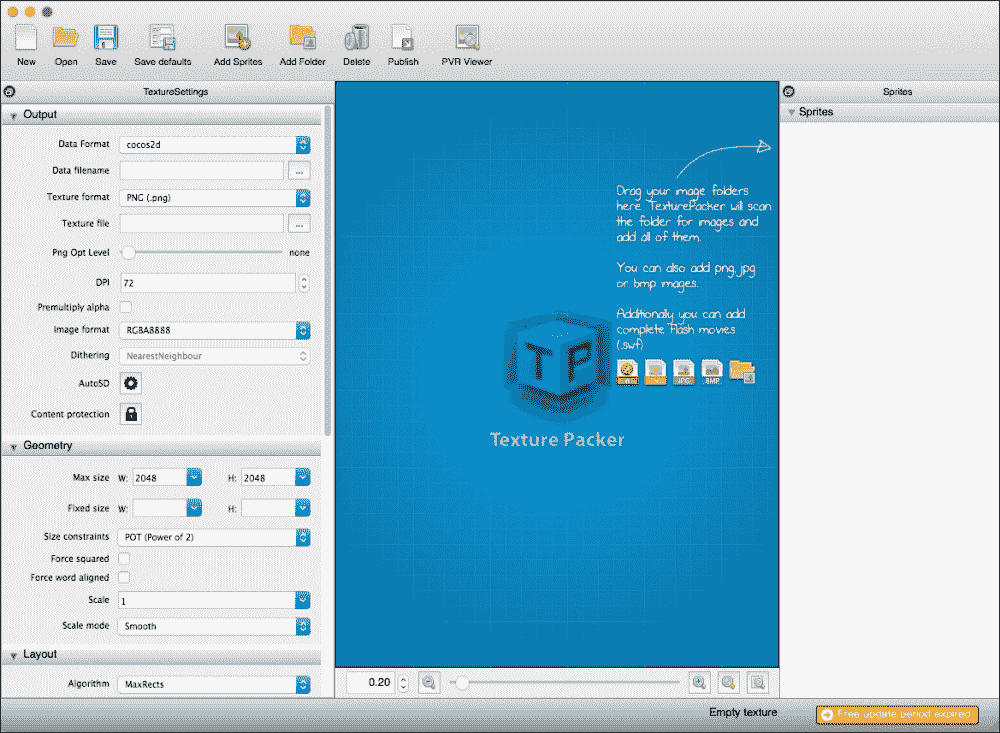

1.  在本食谱中，我们将使用以下截图所示的精灵：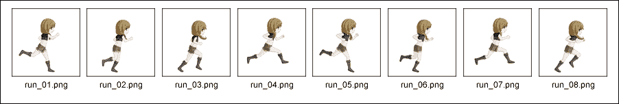

1.  您只需将图像拖入 Texture Packer 窗口，它将自动读取所有文件并将它们排列好。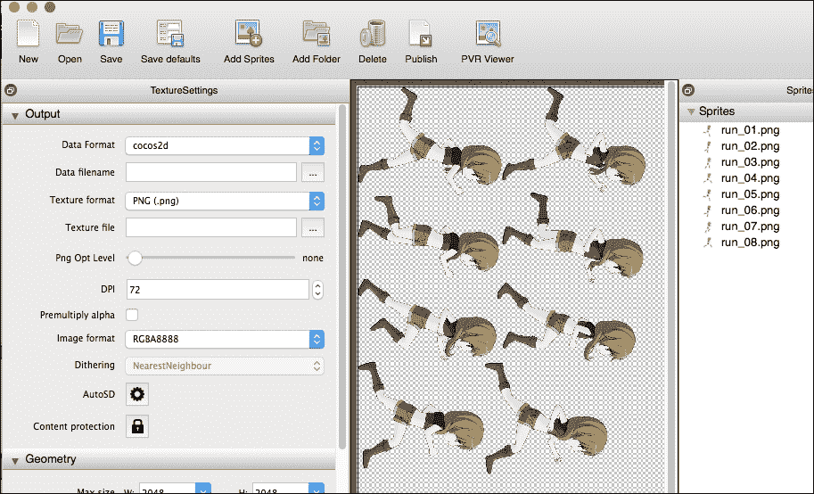

1.  就这样。那么，让我们发布精灵表图像和`plist`，点击**发布**按钮。这就是您如何获取精灵表图像和`plist`。

## 它是如何工作的...

您可以获取精灵表图像和`plist`文件。在本部分，我们解释了如何一键发布适用于所有设备的精灵表。

1.  点击带有齿轮图标的**AutoSD**按钮，您将看到一个额外的窗口出现，如图所示：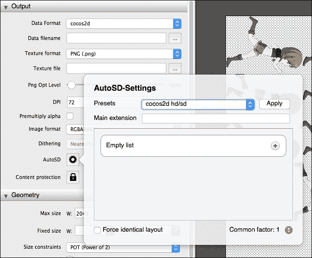

1.  选择**cocos2d-x HDR/HD/SD**并点击**应用**按钮。点击后，设置默认的缩放、扩展、大小等，如图所示：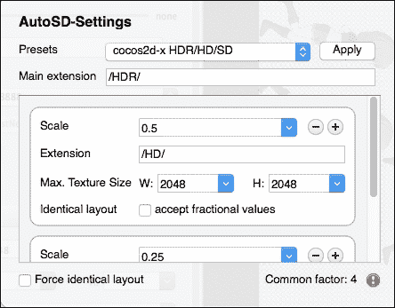

1.  接下来，您必须点击**发布**按钮，您将看到一个选择数据文件名的窗口。重要的是要选择名为`HDR`的文件夹，如图所示：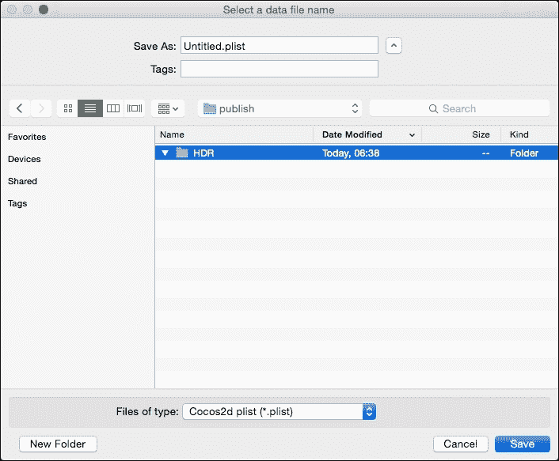

1.  最后，您将自动获得三个尺寸的精灵表，如图所示：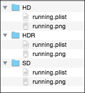

`HDR`文件夹中的精灵表是最大尺寸的。被拖放进来的图像是 HDR 图像。这些图像适合调整成高清或标清图像。

## 还有更多…

您可以使用如下命令使用 Texture Packer：

```cpp
texturepacker foo_*.png --format cocos2d --data hoge.plist --sheet hoge.png
```

前面的命令是使用名为 `foo_*.png` 的图像创建名为 `hoge.plist` 和 `hoge.png` 的精灵图集。例如，如果文件夹中有 `foo_1.png` 到 `foo_10.png`，则精灵图集将从这 10 张图像创建。

此外，该命令还有其他选项，如下表所示：

| 选项 | 描述 |
| --- | --- |
| `--help` | 显示帮助文本 |
| `--version` | 打印版本信息 |
| `--max-size` | 设置最大纹理大小 |
| `--format cocos2d` | 要写入的格式，默认为 cocos2d |
| `--data` | 要写入的数据文件名称 |
| `--sheet` | 要写入的图集名称 |

除了这些选项之外，您还可以通过以下命令查看其他选项：

```cpp
texturepacker --help
```

# 使用 Tiled 地图编辑器

瓦片地图是由单元格组成的网格，单元格中的值表示该位置应该放置的内容。例如，(0,0) 是一条道路，(0,1) 是草地，(0,2) 是河流等等。瓦片地图非常有用，但手动创建它们相当困难。**Tiled** 是一个可以用来创建瓦片地图的工具。Tiled 是一个免费的应用程序。然而，这个应用程序是一个非常强大、有用且流行的工具。Tiled 地图有多种类型，例如，2D 地图如《龙之谷》，水平滚动游戏地图如《超级马里奥》等等。在这个菜谱中，您基本上可以使用纹理打包器。

## 准备工作

如果您没有 Tiled 地图编辑器，您可以从 [`www.mapeditor.org/`](https://www.mapeditor.org/) 下载它。

然后，下载后，您将安装应用程序并将 `dmg` 文件中的 `example` 文件夹复制到您的计算机的工作空间中。

Tiled 地图编辑器是一个免费的应用程序。然而，如果您喜欢，可以向这个软件捐赠。

## 如何操作...

在这部分，我们解释如何使用 Tiled 工具从头开始创建一个新的地图。

1.  启动 Tiled 并在菜单中选择**文件** | **新建**。打开如下所示的附加窗口：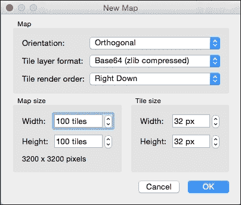

1.  在**瓦片层格式**中选择 XML，并在**地图大小**中更改**宽度**和**高度**为 50 个瓦片。最后，点击**确定**。这样您就可以看到 Tiled 的窗口，如下所示：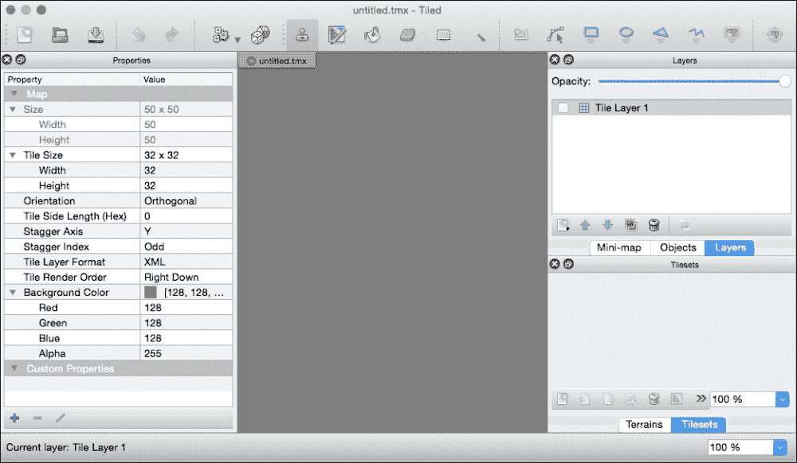

1.  在菜单中选择**地图** | **新建瓦片集…**。您可以选择瓦片集窗口。通过点击窗口中间的**浏览…**按钮选择瓦片集图像。在这种情况下，您将选择 Tiled 的 `example` 文件夹中的 `tmw_desert_spacing.png` 文件。这个瓦片集包含宽度为 32px、高度为 32px、边距和间距为 1px 的瓦片。因此，您必须将这些值更改为如下截图所示：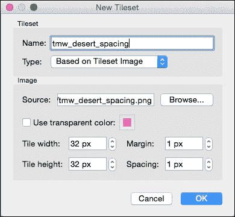

1.  最后，点击**确定**按钮，您将看到如下截图所示的新编辑器窗口：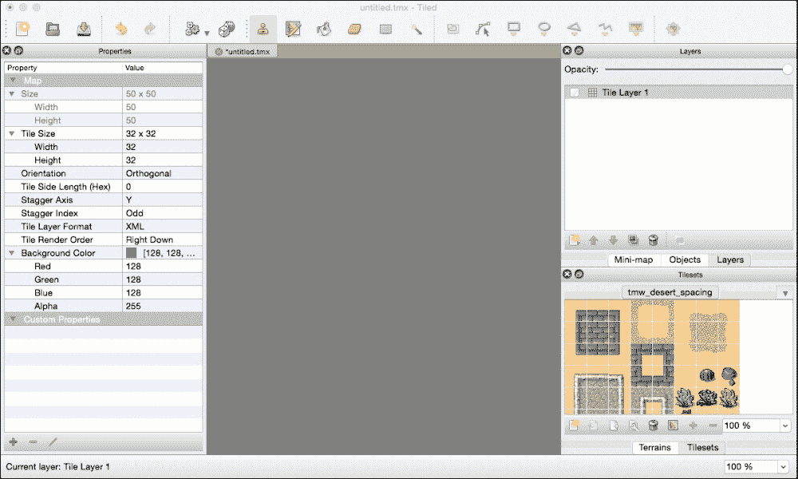

1.  接下来，让我们尝试使用您选择的瓦片来绘制地面层。从右侧和下方的面板中选择瓦片，然后在工具栏中选择桶形图标。然后，点击地图，您将看到用相同瓦片绘制的地面。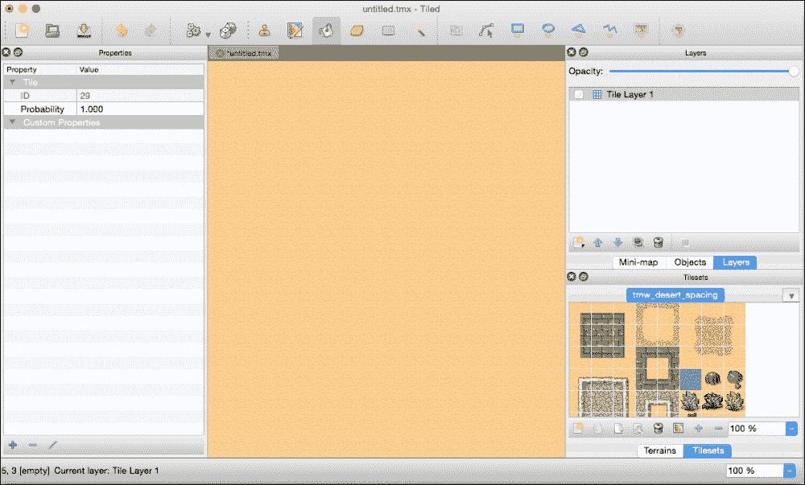

1.  您可以在地图上排列瓦片。在右下角的面板中选择瓦片，然后在工具栏中选择印章图标。然后，点击地图。这样您就可以将瓦片放置在地图上。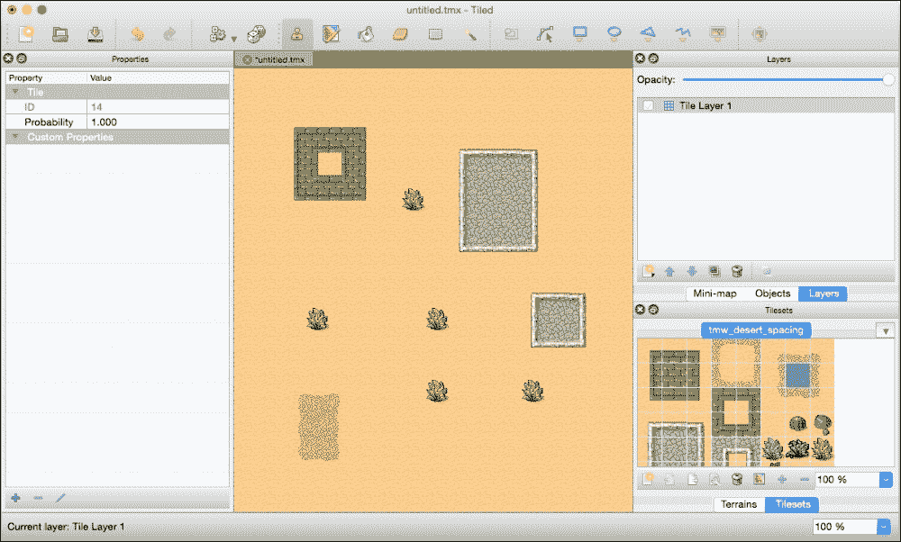

1.  在您完成地图排列后，需要将其保存为新的文件。在菜单中转到 **文件** | **另存为…** 并保存您创建的新文件。要使用 Cococs2d-x，您必须将 `tmx` 文件和瓦片集图像文件添加到项目中的 `Resources/res` 文件夹。在这个菜谱中，我们在 Tiled 的 `example` 文件夹中添加了 `desert.tmx` 和 `tmw_desert_spacing.png`。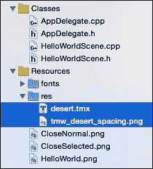

1.  从现在开始，您必须在 Xcode 中工作。按照以下代码编辑 `HelloWorld::init` 方法：

    ```cpp
    bool HelloWorld::init()
    {
        if ( !Layer::init() )
        {
            return false;
        }
        Vec2 origin = Director::getInstance()- >getVisibleOrigin();
        _map = TMXTiledMap::create("res/desert.tmx");
        _map->setPosition(Vec2()+origin);
        this->addChild(_map);

        return true;
    }
    ```

1.  构建并运行后，您可以在模拟器或设备上看到以下图像：

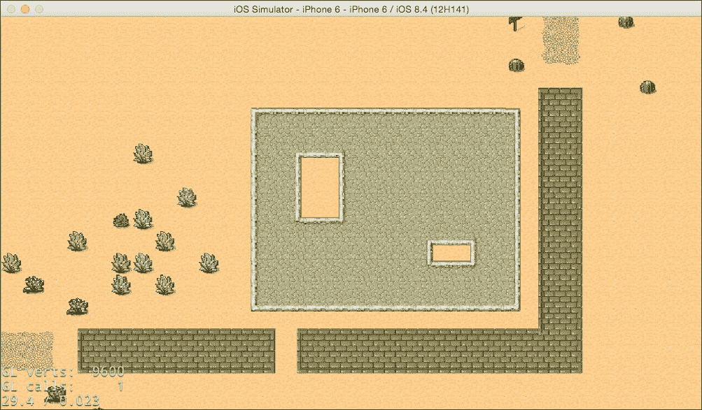

## 工作原理...

Tiled 地图所需文件是 `tmx` 文件和瓦片集图像文件。这就是为什么您必须将这些文件添加到您的项目中。您可以使用 `TMXTiledMap` 类查看 Tiled 地图对象。您必须将 `tmx` 文件路径指定给 `TMXTiledMap::create` 方法。`TMXTiledMap` 对象是节点。只有当您使用 `addChild` 方法添加 `TMXTiledMap` 对象时，您才能看到瓦片地图。

```cpp
_map = TMXTiledMap::create("res/desert.tmx");
_map->setPosition(Vec2()+origin);
this->addChild(_map);
```

### 小贴士

`TMXTileMap` 对象的锚点位置是 `Vec2(0,0)`。正常节点的锚点位置是 `Vec2(0.5f, 0.5f)`。

## 更多内容…

瓦片地图非常大。因此，我们尝试通过滚动来移动地图。在这种情况下，您触摸屏幕，并通过触摸点到屏幕中心的距离来滚动地图。

1.  在 `HelloWorld::init` 方法中添加以下代码：

    ```cpp
    auto touchListener = EventListenerTouchOneByOne::create();
    touchListener->onTouchBegan = CC_CALLBACK_2(HelloWorld::onTouchBegan, this);
    touchListener->onTouchEnded = CC_CALLBACK_2(HelloWorld::onTouchEnded, this);
    _eventDispatcher- >addEventListenerWithSceneGraphPriority(touchListener, this);
    ```

1.  在 `HelloWorldScene.h` 中定义 `touch` 方法和一些属性，如下面的代码所示：

    ```cpp
    bool onTouchBegan(cocos2d::Touch* touch, cocos2d::Event* event);
    void onTouchEnded(cocos2d::Touch* touch, cocos2d::Event* event);
    void update(float dt);
    cocos2d::Vec2 _location;
    cocos2d::TMXTiledMap* _map;
    ```

1.  在 `HelloWorldScene.cpp` 中添加 `touch` 方法，如下面的代码所示：

    ```cpp
    bool HelloWorld::onTouchBegan(Touch* touch, Event* event)
    {
        return true;
    }

    void HelloWorld::onTouchEnded(Touch* touch, Event* event)
    {
        auto size = Director::getInstance()->getVisibleSize();
        auto origin = Director::getInstance()- >getVisibleOrigin();
        auto center = Vec2(size/2)+origin;
        _location = touch->getLocation() - center;
        _location.x = floorf(_location.x);
        _location.y = floorf(_location.y);
        this->scheduleUpdate();
    }
    ```

1.  最后，在 `HelloWorldScene.cpp` 中添加 `update` 方法，如下面的代码所示：

    ```cpp
    void HelloWorld::update(float dt)
    {
        auto mapSize = _map->getContentSize();
        auto winSize = Director::getInstance()- >getVisibleSize();
        auto origin = Director::getInstance()- >getVisibleOrigin();

        auto currentLocation = _map->getPosition();
        if (_location.x > 0) {
            currentLocation.x--;
            _location.x--;
        } else if (_location.x < 0) {
            currentLocation.x++;
            _location.x++;
        }
        if (_location.y > 0) {
            currentLocation.y--;
            _location.y--;
        } else if (_location.y < 0) {
            currentLocation.y++;
            _location.y++;
        }

        if (currentLocation.x > origin.x) {
            currentLocation.x = origin.x;
        } else if (currentLocation.x < winSize.width + origin.x - mapSize.width) {
            currentLocation.x = winSize.width + origin.x - mapSize.width;}
        if (currentLocation.y > origin.y) {
            currentLocation.y = origin.y;
        } else if (currentLocation.y < winSize.height + origin.y - mapSize.height) {currentLocation.y = winSize.height + origin.y - mapSize.height;}

        _map->setPosition(currentLocation);
        if (fabsf(_location.x)<1.0f && fabsf(_location.y)<1.0f) {
            this->unscheduleUpdate();
        }
    }
    ```

之后，运行此项目并触摸屏幕。这样您就可以在您滑动方向上移动地图。

# 获取瓦片地图中对象的属性

现在，您可以移动 Tiled 地图。然而，您可能会注意到地图上的对象。例如，如果移动方向上有木材或墙壁，您就不能超过该对象移动。在这个菜谱中，您将通过获取其属性来注意到地图上的对象。

## 准备工作

在这个菜谱中，您将为树对象创建一个新的属性并为其设置一个值。

1.  启动 Tiled 应用程序并重新打开 `desert.tmx` 文件。

1.  在 **Tilesets** 窗口中选择树对象。

1.  在 **属性** 窗口的左下角点击加号图标添加一个新属性。然后，将弹出一个窗口指定属性的名称。在文本区域中输入 `isTree`。

1.  在你命名了新属性后，它将显示在属性列表中。然而，你会发现它的值是空的。所以，你必须设置新的值。在这种情况下，你需要设置一个真值，如下面的图像所示：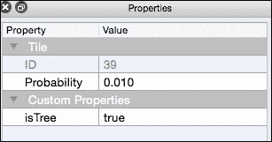

1.  保存它并更新项目中的 `desert.tmx`。

## 如何做到这一点...

在这个菜谱中，你将获取你触摸的对象的属性。

1.  编辑 `HelloWorld::init` 方法以显示瓦片图并添加触摸事件监听器。

    ```cpp
    bool HelloWorld::init()
    {
        if ( !Layer::init() )
        {
            return false;
        }
        Vec2 origin = Director::getInstance()->getVisibleOrigin();
        _map = TMXTiledMap::create("res/desert.tmx");
        _map->setPosition(Vec2()+origin);
        this->addChild(_map);

        auto touchListener = EventListenerTouchOneByOne::create();
        touchListener->onTouchBegan = CC_CALLBACK_2(HelloWorld::onTouchBegan, this);
        _eventDispatcher- >addEventListenerWithSceneGraphPriority(touchListener, this);

        return true;
    }
    ```

1.  添加 `HelloWorld::getTilePosition` 方法。如果你通过指定触摸位置调用此方法，你可以获取瓦片的网格行/列位置。

    ```cpp
    Vec2 HelloWorld::getTilePosition(Vec2 point)
    {
        auto mapContentSize = _map->getContentSize();
        auto tilePoint = point - _map->getPosition();
        auto tileSize = _map->getTileSize();
        auto mapRowCol = _map->getMapSize();
        auto scale = mapContentSize.width / (mapRowCol.width * tileSize.width);
        tilePoint.x = floorf(tilePoint.x / (tileSize.width * scale));
        tilePoint.y = floorf((mapContentSize.height - tilePoint.y)/(tileSize.height*scale));
        return tilePoint;
    }
    ```

1.  最后，你可以获取你触摸的对象的属性。添加如下所示的 `HelloWorld::onTouchBegan` 方法：

    ```cpp
    bool HelloWorld::onTouchBegan(Touch* touch, Event* event)
    {
        auto touchPoint = touch->getLocation();
        auto tilePoint = this->getTilePosition(touchPoint);
        TMXLayer* groundLayer = _map->getLayer("Ground");
        int gid = groundLayer->getTileGIDAt(tilePoint);
        if (gid!=0) {
            auto properties = _map- >getPropertiesForGID(gid).asValueMap();
            if (properties.find("isTree")!=properties.end()) {
                if(properties.at("isTree").asBool()) {
                    CCLOG("it's tree!");
                }
            }
        }
        return true;
    }
    ```

让我们构建并运行这个项目。如果你触摸了设置了新 `isTree` 属性的树，你可以在日志中看到 *它是树!*。

## 它是如何工作的...

在这个菜谱中有两个要点。第一个要点是在瓦片图中获取瓦片的行/列位置。第二个要点是在瓦片图中获取对象的属性。

首先，让我们解释一下如何在瓦片图中获取瓦片的行/列位置。

1.  使用 `TMXTiledMap::getContentSize` 方法获取地图大小。

    ```cpp
    auto mapContentSize = _map->getContentSize();
    ```

1.  从触摸点和地图位置计算地图上的 `point`。

    ```cpp
    auto tilePoint = point - _map->getPosition();
    ```

1.  使用 `TMXTiledMap::getTileSize` 方法获取瓦片大小。

    ```cpp
    auto tileSize = _map->getTileSize();
    ```

1.  使用 `TMXTiledMap::getMapSize` 方法在地图中获取瓦片的行/列。

    ```cpp
    auto mapRowCol = _map->getMapSize();
    ```

1.  使用原始大小 `mapContentSize` 和通过列宽和瓦片宽计算出的实际大小来获取放大显示。

    ```cpp
    auto scale = mapContentSize.width / (mapRowCol.width * tileSize.width);
    ```

1.  瓦片坐标的原点位于左上角。这就是为什么你触摸的瓦片的行/列位置是使用瓦片的大小、行和放大显示来计算的，如下面的代码所示：

    ```cpp
    tilePoint.x = floorf(tilePoint.x / (tileSize.width * scale));
    tilePoint.y = floorf((mapContentSize.height - tilePoint.y)/(tileSize.height*scale));
    ```

    `tilePoint.x` 是列位置，`tilePoint.y` 是行位置。

接下来，让我们看看如何获取 Tiled 地图中对象的属性。

1.  使用触摸点获取你触摸的瓦片的行/列位置。

    ```cpp
    auto touchPoint = touch->getLocation();
    auto tilePoint = this->getTilePosition(touchPoint);
    ```

1.  从瓦片图中获取名为 `"Ground"` 的层。

    ```cpp
    TMXLayer* groundLayer = _map->getLayer("Ground");
    ```

1.  在这个层上有一个名为 `Ground` 的对象。使用瓦片的行/列从该层获取 `TileGID`。

    ```cpp
    int gid = groundLayer->getTileGIDAt(tilePoint);
    ```

1.  最后，使用 `TMXTiledMap::getPropertiesForGID` 方法从地图中获取属性作为 `ValueMap`。然后，从其中获取 `isTree` 属性的值，如下面的代码所示：

    ```cpp
    auto properties = _map->getPropertiesForGID(gid).asValueMap();
    if (properties.find("isTree")!=properties.end()) {
        if(properties.at("isTree").asBool()) {
            CCLOG("it's tree!");
        }
    }
    ```

在这个菜谱中，我们只展示了日志。然而，在你的实际游戏中，你将需要将分数添加到对象、爆炸等。

# 使用物理编辑器

在第九章中，*控制物理*，你学习了关于**物理引擎**的内容。我们可以创建物理体来使用 Cocos2d-x API。然而，我们只能创建圆形或方形形状。实际上，在真实游戏中，你必须使用复杂形状。在这个菜谱中，你将学习如何使用**物理编辑器**创建许多形状。

## 准备工作

物理编辑器是由创建纹理打包器的同一家公司开发的。物理编辑器是一个付费应用程序。但你可以使用免费试用版。如果你还没有，你可以通过访问[`www.codeandweb.com/physicseditor`](https://www.codeandweb.com/physicseditor)来下载它。

在这里，你准备使用此工具的图像。这里，我们将使用以下类似齿轮的图像。此图像的名称是`gear.png`。


## 如何操作...

首先，你需要创建一个物理文件来使用物理编辑器。

1.  启动物理编辑器。然后，将图像`gear.png`拖到左侧面板。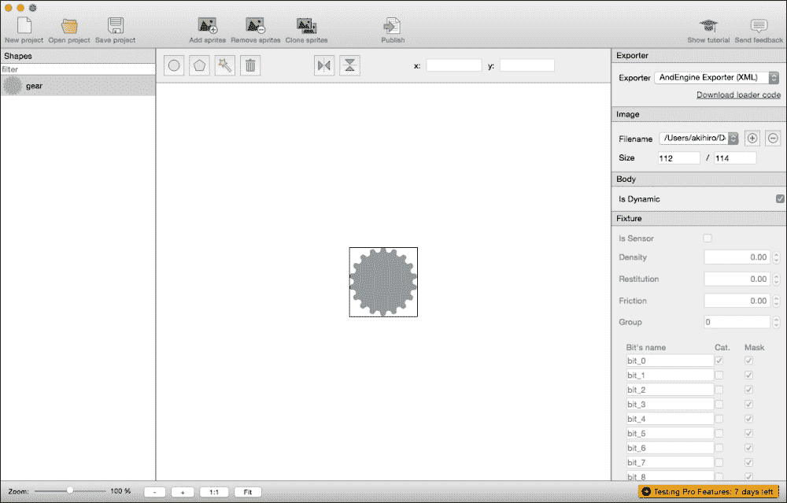

1.  点击工具栏中从左数第三个的形状追踪器图标。形状追踪器图标如下所示：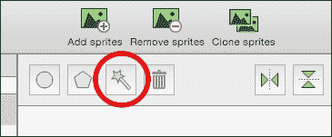

1.  在此之后，你可以看到如下所示的弹出窗口：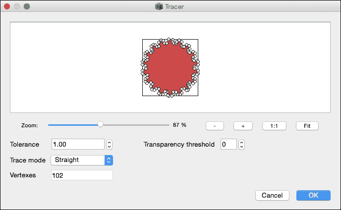

    你可以更改**容差**值。如果**顶点**值太大，渲染器会变慢。因此，你需要设置合适的**顶点**值来更改**容差**值。最后，点击**确定**按钮。你将看到以下内容：

    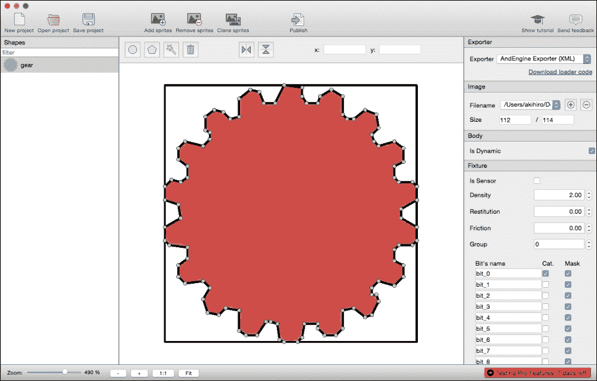

1.  在**导出器**中选择`Cocos2d-x`。在这个工具中，锚点的默认值是`Vec2(0,0)`。在 Cocos2d-x 中，锚点的默认值是`Vec2(0.5f, 0.5f)`。因此，你应该将锚点更改为中心，如下面的截图所示：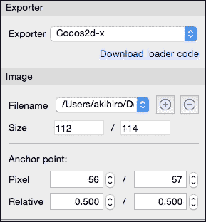

1.  选择**类别**、**碰撞**和**接触**的复选框。你需要向下滚动才能在右侧面板中看到此窗口。你可以勾选所有复选框并点击右侧面板底部的所有按钮。

1.  将`plist`文件发布到 Cocos2d-x 中使用此形状。点击**发布**按钮并保存为之前的名称。

1.  你可以在**导出器**选择器下看到**下载加载器代码**链接。点击链接。之后，打开浏览器并浏览到 github 页面。Cocos2d-x 无法加载物理编辑器的`plist`。然而，加载器代码在 github 上提供。因此，你必须克隆此项目并将代码添加到项目中的`Cocos2d-x`文件夹。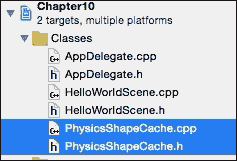

接下来，你将编写代码，通过使用物理编辑器数据来创建物理体。在这种情况下，齿轮对象将出现在接触点。

1.  包含文件`PhysicsShapeCache.h`。

    ```cpp
    #include "PhysicsShapeCache.h"
    ```

1.  创建一个具有如下代码所示物理世界的场景：

    ```cpp
    Scene* HelloWorld::createScene()
    {
        auto scene = Scene::createWithPhysics();
        auto layer = HelloWorld::create();
        PhysicsWorld* world = scene->getPhysicsWorld();
        world->setDebugDrawMask(PhysicsWorld::DEBUGDRAW_ALL);
        scene->addChild(layer);
        return scene;
    }
    ```

1.  在场景中创建一个与屏幕大小相同的墙壁，并添加触摸事件监听器。然后，按照以下代码加载 Physics Editor 的数据：

    ```cpp
    bool HelloWorld::init()
    {
        if ( !Layer::init() )
        {
            return false;
        }

        Size visibleSize = Director::getInstance()->getVisibleSize();
        Vec2 origin = Director::getInstance()->getVisibleOrigin();

        auto wall = Node::create();
        auto wallBody = PhysicsBody::createEdgeBox(visibleSize, PhysicsMaterial(0.1f, 1.0f, 0.0f));
        wallBody->setContactTestBitmask(true);
        wall->setPhysicsBody(wallBody);
        wall->setPosition(Vec2(visibleSize/2)+origin);
        this->addChild(wall);

        auto touchListener = EventListenerTouchOneByOne::create();
        touchListener->onTouchBegan = CC_CALLBACK_2(HelloWorld::onTouchBegan, this);
        _eventDispatcher- >addEventListenerWithSceneGraphPriority(touchListener, this);

        PhysicsShapeCache::getInstance()- >addShapesWithFile("res/gear.plist");

        return true;
    }
    ```

1.  使齿轮对象在触摸屏幕时执行以下代码所示的操作：

    ```cpp
    bool HelloWorld::onTouchBegan(Touch* touch, Event* event)
    {
        auto touchPoint = touch->getLocation();
        auto body = PhysicsShapeCache::getInstance()- >createBodyWithName("gear");
        auto sprite = Sprite::create("res/gear.png");
        sprite->setPhysicsBody(body);
        sprite->setPosition(touchPoint);
        this->addChild(sprite);
        return true;
    }
    ```

1.  然后，构建并运行此项目。触摸屏幕后，齿轮对象将出现在触摸点。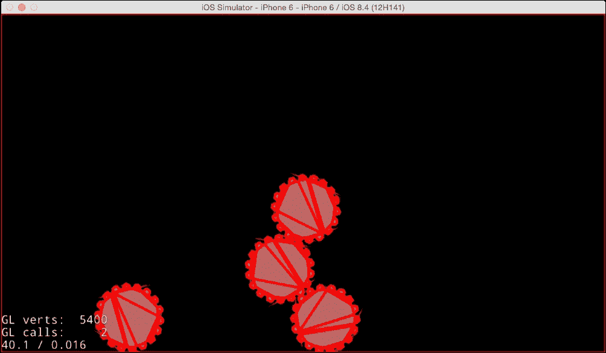

## 工作原理...

1.  首先，您必须添加两个文件，`plist` 和图像。物理体在您使用 Physics Editor 发布的 `plist` 文件中定义。然而，您使用齿轮图像来创建精灵。因此，您必须将 `plist` 文件和 `gear.png` 添加到您的项目中。

1.  Cocos2d-x 无法读取 Physics Editor 的数据。因此，您必须添加在 github 上提供的加载器类。

1.  要使用物理引擎，您必须创建一个带有物理世界的场景，并且应该将调试绘制模式设置为简单，以便更好地理解物理体。

    ```cpp
    auto scene = Scene::createWithPhysics();
    auto layer = HelloWorld::create();
    PhysicsWorld* world = scene->getPhysicsWorld();
    world->setDebugDrawMask(PhysicsWorld::DEBUGDRAW_ALL);
    ```

1.  没有边框或墙壁，物理对象会从屏幕上掉落。因此，您必须设置一个与屏幕大小相同的墙壁。

    ```cpp
    auto wall = Node::create();
    auto wallBody = PhysicsBody::createEdgeBox(visibleSize, PhysicsMaterial(0.1f, 1.0f, 0.0f));
    wallBody->setContactTestBitmask(true);
    wall->setPhysicsBody(wallBody);
    wall->setPosition(Vec2(visibleSize/2)+origin);
    this->addChild(wall);
    ```

1.  加载由 Physics Editor 创建的物理数据的 `plist`。`PhysicsShapeCache` 将一次性加载 `plist`。之后，物理数据将缓存在 `PhysicsShapeCache` 类中。

    ```cpp
    PhysicsShapeCache::getInstance()- >addShapesWithFile("res/gear.plist");
    ```

1.  在 `HelloWorld::onTouchBegan` 方法中，在触摸点创建齿轮对象。您可以使用 `PhysicsShapeCache::createBodyWithName` 方法以及物理对象数据来创建物理体。

    ```cpp
    auto body = PhysicsShapeCache::getInstance()- >createBodyWithName("gear");
    ```

# 使用 Glyph Designer

在游戏中，您必须经常使用文本。在这种情况下，如果您使用系统字体来显示文本，您将遇到一些问题。这就是为什么每个设备都有不同的字体。位图字体比 TTF 字体渲染更快。因此，Cocos2d-x 使用位图字体在屏幕左下角显示 fps 信息。因此，您应该将位图字体添加到您的游戏中以显示文本。在本教程中，您将学习如何使用 **Glyph Designer**，这是制作原始位图字体的工具，以及如何在 Cocos2d-x 中使用位图字体。

## 准备工作

Glyph Designer 是一款付费应用程序。但您可以使用免费试用版。如果您没有它，您可以通过访问以下网址下载它：

[`71squared.com/glyphdesigner`](https://71squared.com/glyphdesigner)

接下来，我们将找到一个适合您游戏氛围的免费字体。在这种情况下，我们将使用 dafont 网站上的 `Arcade` 字体（[`www.dafont.com/arcade-ya.font`](http://www.dafont.com/arcade-ya.font)）。下载后，您需要将其安装到您的计算机上。

在 dafont 网站上有很多字体。但是，每个字体的许可协议都不同。如果您使用了该字体，您需要检查其许可协议。

## 如何操作...

在本节中，您将学习如何使用 Glyph Designer。

1.  启动 Glyph Designer。在左侧面板中，有你在计算机上安装的所有字体。你可以从那里选择你想要在游戏中使用的字体。这里我们将使用你不久前下载的`Arcade`字体。如果你还没有安装它，你可以加载它。要加载字体，你必须点击工具栏中的**加载字体**按钮。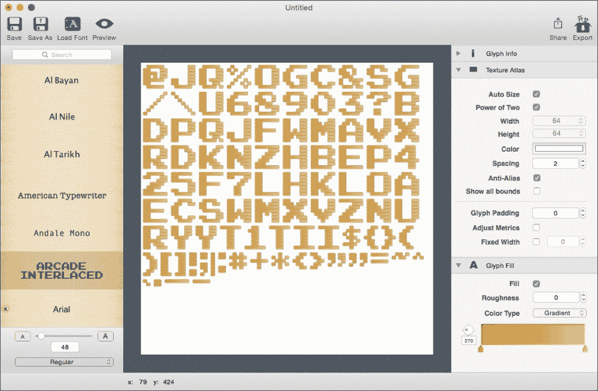

1.  选择或加载字体后，它将在中心面板中显示。如果你的游戏使用了字体的一部分，你必须保留所需的字符以节省内存和应用程序容量。要选择字符，你可以使用右面板中的**包含字形**窗口。你需要向下滚动才能在右面板中看到这个窗口。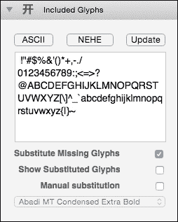

1.  对于其他设置，你可以指定大小、颜色和阴影。在**字体颜色**选项中，你可以设置渐变。

1.  最后，你可以通过点击工具栏右侧的**导出**图标来创建一个原始字体。

1.  导出后，你将拥有两个扩展名为 `.fnt` 和 `.png` 的文件。

## 工作原理...

位图字体有两个文件，`.fnt` 和 `.png`。这些文件是成对使用的，用于位图字体。现在，你将学习如何在 Cocos2d-x 中使用位图字体。

1.  你必须将 Glyph Designer 中创建的字体添加到项目中的`Resources/font`文件夹。

1.  将以下代码添加到你的游戏中以显示"`Cocos2d-x`"。

    ```cpp
    auto label = Label::createWithBMFont("fonts/arcade.fnt", "Cocos2d-x");
    label->setPosition(Vec2(visibleSize/2)+origin);
    this->addChild(label);
    ```

1.  构建并运行你的项目后，你将看到以下内容：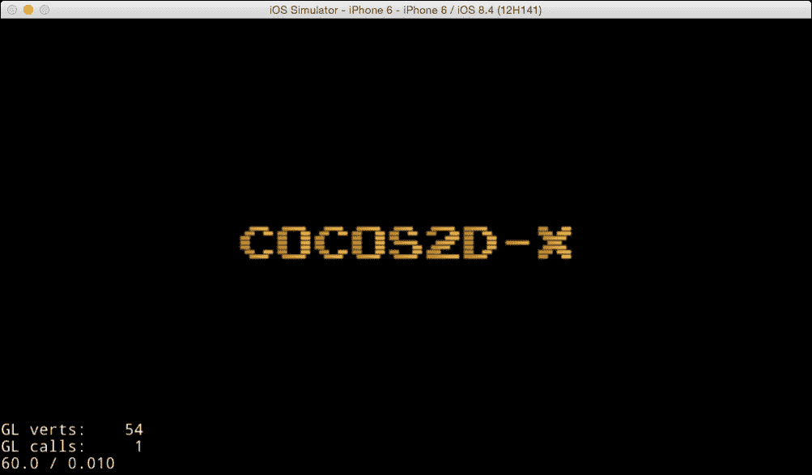

## 还有更多...

有些字体不是等宽的。真型字体在文字处理程序中使用已经足够好。然而，等宽字体更吸引人。例如，点字符需要使用等宽字体。当你想要将等宽字体转换为非等宽字体时，你可以按照以下步骤进行：

1.  在右面板的**纹理图集**中勾选名为**固定宽度**的复选框。

1.  预览你的字体，并点击工具栏中的**预览**图标。然后，你可以在文本框中检查你想要检查的字符。

1.  如果你想要更改字符间距，那么你需要更改**固定宽度**复选框旁边的数字。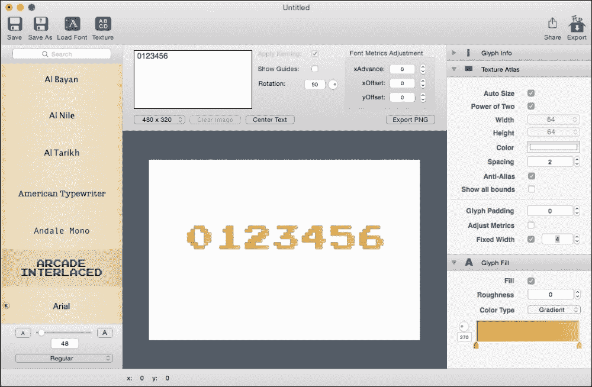
