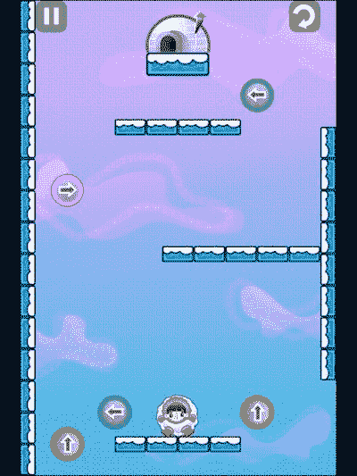
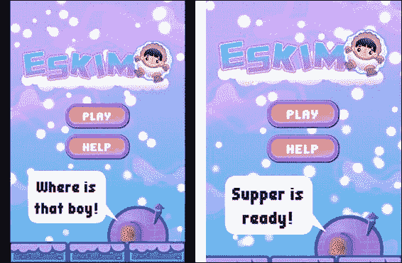
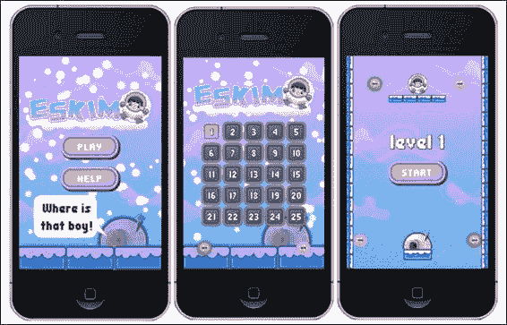
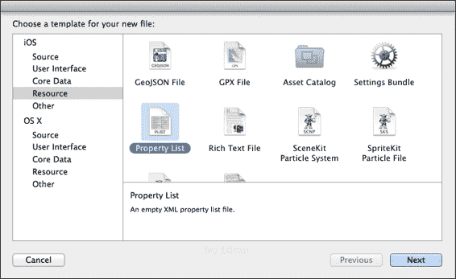
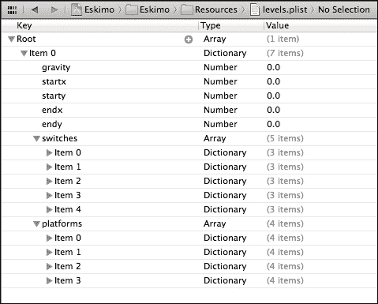

# 第九章。在水平上 – 雪人

*在我们的下一款游戏中，我们将介绍大多数游戏都需要的一些重要功能，但这些功能与游戏玩法没有直接关系。因此，我们将跳过架构方面，讨论读取和写入数据、使用场景转换以及创建整个应用程序都可以监听的自定义事件。*

*但当然，我还会添加一些游戏玩法想法！*

这次，你将学习如何：

+   创建场景转换

+   加载外部数据

+   使用`UserDefault`保存数据

+   使用分发器创建自己的游戏事件

+   使用加速度计

+   重复使用 Box2D 实体

# 游戏 – 雪人

小雪人男孩晚点了晚餐。如果你选择接受这个任务，你的任务是引导这个小家伙回到他的冰屋。

这是一个 Box2D 游戏，控制非常简单。倾斜设备，雪人就会移动。如果你轻触屏幕，雪人会在雪球和冰块之间切换形状，每种形状都有其自身的物理特性和操纵度。例如，球体具有更高的摩擦力，而冰块则没有。

雪人到达目的地的唯一方式是撞击屏幕上分布的引力开关。

雪人结合了街机游戏和益智游戏元素，因为每个关卡都是计划好的，有一个完美的解决方案，即如何将小雪人带回家。然而，请注意，存在多种解决方案。



下载`4198_09_FINAL_PROJECT.zip`文件，并在有机会时运行游戏。再次强调，不需要进行多余的输入，因为游戏中使用的逻辑对你来说几乎都是老生常谈的，我们将深入探讨新内容。

## 游戏设置

这是一个仅包含肖像的游戏，基于加速度计，因此它不应该自动旋转。它是为普通 iPhone 设计的，其屏幕分辨率大小设置为`kResolutionShowAll`，因此屏幕设置与我们的前一款游戏相似。

为 iPhone 屏幕设计游戏并使用`kResolutionShowAll`参数，当在不符合 iPhone 1.5 比例的屏幕上玩游戏时，将产生所谓的**信箱**视图。这意味着你会在游戏屏幕周围看到边框。或者，你也可以使用`kResolutionNoBorders`参数，这将产生**缩放**效果，使游戏在全屏播放，但边框周围的区域将被裁剪。

以下截图说明了这两种情况：



左边的是 iPad 上的游戏屏幕，使用`kResolutionShowAll`。右边使用的是`kResolutionNoBorders`。注意第二个屏幕是如何缩放和裁剪的。当使用`kResolutionNoBorders`时，重要的是要设计你的游戏，确保没有关键的游戏元素出现在边框太近的地方，因为它可能不会被显示。

## 组织游戏

再次强调，有一个`b2Sprite`类，`Eskimo`和`Platform`类扩展了`b2Sprite`。然后是常规的`Sprite`类，`GSwitch`（代表重力开关）和`Igloo`。逻辑在这最后两个和`Eskimo`之间运行碰撞检测，但我选择不将它们作为传感器体，因为我想要展示 Cocos2d-x 元素和 Box2D 元素的 2D 碰撞逻辑可以很好地共存。

但最重要的是，这个游戏现在有三个场景。到目前为止，在这本书中，我们每个游戏只使用了一个场景。这个游戏的场景对象将包装`MenuLayer`、`LevelSelectLayer`和`GameLayer`。以下是关于这三个的简要说明：

+   在`MenuLayer`中，你可以选择玩游戏，这将带你到`LevelSelectLayer`，或者玩游戏教程，这将带你到`GameLayer`。

+   在`LevelSelectLayer`中，你可以选择你想玩哪个可用关卡，这将带你到`GameLayer`。或者你也可以回到`MenuLayer`。

+   在`GameLayer`中，你玩游戏，游戏结束后可能会回到`MenuLayer`。

以下图像展示了游戏中的所有三个场景：



# 在 Cocos2d-x 中使用场景

场景本身就是小程序。如果你有 Android 开发经验，你可能会把场景想象成活动。在所有基于节点的类中，`Scene` 应用程序在架构上最为相关，因为`Director` 类运行场景，实际上就是在运行你的应用程序。

与场景一起工作的部分好处也是部分缺点：它们完全独立且互不干扰。在规划你的游戏类结构时，场景之间共享信息的需求将是一个重要因素。

此外，内存管理可能成为一个问题。当前正在运行的场景不会放弃其资源，直到一个新的场景启动并运行。因此，当你使用过渡动画时，请记住，在几秒钟内，两个场景都将存在于内存中。

在 Eskimo 中，我以两种不同的方式初始化场景。使用`MenuLayer` 和 `LevelSelectLayer`，每次用户导航到这两个场景中的任何一个时，都会创建一个新的层对象（要么是新的`MenuLayer`，要么是新的`LevelSelectLayer`）。

然而，`GameLayer`是不同的。它是一个单例`Layer`类，在第一次实例化后永远不会从内存中消失，因此加快了从关卡选择到实际游戏的时间。但这可能并不适用于每个游戏。正如我之前提到的，在场景之间切换时，两个场景会在内存中持续几秒钟。但在这里，我们通过在整个过程中保持一个层在内存中，增加了这个问题。然而，Eskimo 在内存方面并不大。请注意，我们仍然可以选择为`GameLayer`应该被销毁的条件创建特殊条件，以及它不应该销毁的条件。

所以，让我来展示如何创建场景过渡。首先，使用一个每次创建时都会创建其 `Layer` 新副本的 `Scene` 类。

# 时间行动 - 创建场景过渡

你当然一直在使用场景。

1.  在 `AppDelegate.cpp` 中隐藏着类似的行：

    ```cpp
    auto scene = GameLayer::scene();
    // run
    director->runWithScene(scene);
    ```

1.  因此，为了更改场景，你只需要告诉 `Director` 类你希望它运行哪个场景。Cocos2d-x 将会移除当前场景中的所有内容（如果有的话，所有它们的析构函数都会被调用），并实例化一个新的层并将其包裹在新的 `Scene` 中。

1.  进一步分解步骤，这是通常为 `Director` 创建新场景的方式：

    ```cpp
    Scene* MenuLayer::scene()
    {
        // 'scene' is an autorelease object
        auto scene = Scene::create();
        // add layer as a child to scene
        auto layer = new MenuLayer();
        scene->addChild(layer);
        layer->release();
        return scene;
    }
    ```

1.  静态方法 `MenuLayer::scene` 将创建一个空白场景，然后创建 `MenuLayer` 的新实例并将其作为子节点添加到新场景中。

1.  现在你可以告诉 `Director` 运行它，如下所示：

    ```cpp
    Director::getInstance()->replaceScene(MenuLayer::scene());
    ```

1.  如果你希望使用过渡效果，逻辑会有一些变化。所以，在我们的 `MenuLayer.cpp` 类中，这是如何过渡到 `LevelSelectLayer` 的：

    ```cpp
    auto newScene = TransitionMoveInR::create(0.2f,  LevelSelectLayer::scene());
    Director::getInstance()->replaceScene(newScene);
    ```

    上述代码创建了一个新的过渡对象，该对象将从屏幕的右侧滑入新场景，并覆盖当前场景。过渡将花费 `0.2` 秒。

## *刚才发生了什么？*

你已经使用 Cocos2d-x 创建了一个场景过渡动画。

如我之前提到的，这种场景更改形式将导致每次都创建一个新的新层实例，并在每次被新场景替换时销毁。所以，在我们的游戏中，`MenuLayer` 和 `LevelSelectLayer` 会根据用户在它们之间切换的次数被实例化和销毁。

还可以选择使用 `pushScene` 而不是 `replaceScene`。这会创建一个 `scene` 对象的堆栈，并将它们全部保留在内存中。这个堆栈可以通过 `popScene` 和 `popToRootScene` 进行导航。

现在让我来展示如何使用单例层做同样的事情。

到现在为止，你可能会发现 `Tests` 项目中有很多这些过渡类的例子，在 `tests/cpp-tests/Classes/TransitionsTest`。

# 时间行动 - 使用单例层类创建过渡

我们首先需要确保相关的层只能实例化一次。

1.  `GameLayer` 中的 `scene` 静态方法看起来是这样的：

    ```cpp
    Scene* GameLayer::scene(int level, int levelsCompleted)
    {
        // 'scene' is an autorelease object
        auto scene = Scene::create();
       // add layer as a child to scene
        scene->addChild(GameLayer::create(level, levelsCompleted));
       return scene;
    }
    ```

    该层在创建时接收两个参数：它应该加载的游戏关卡以及玩家完成的游戏关卡数量。我们创建一个新的 `Scene` 对象并将 `GameLayer` 作为其子节点添加。

1.  但看看 `GameLayer` 中的静态 `create` 方法：

    ```cpp
    GameLayer * GameLayer::create (int level, int levelsCompleted) {
        if (!_instance) {
            _instance = new GameLayer();
        } else {
            _instance->clearLayer();
        }
        _instance->setLevelsCompleted(levelsCompleted);
        _instance->loadLevel(level);
        _instance->scheduleUpdate();
        return _instance;
    }
    ```

1.  在 `GameLayer.cpp` 的顶部声明了一个 `_instance` 静态属性，如下所示：

    ```cpp
    static GameLayer* _instance = nullptr;
    ```

    我们可以检查，如果 `GameLayer` 的一个实例当前在内存中，并在必要时实例化它。

1.  场景过渡到 `GameLayer` 表面上看起来与常规过渡完全一样。所以，在 `LevelSelectLayer` 中，我们有以下内容：

    ```cpp
    auto newScene = TransitionMoveInR::create(0.2f,  GameLayer::scene(_firstIndex + i, _levelsCompleted));
    Director::sharedDirector()->replaceScene(newScene);
    ```

## *刚才发生了什么？*

我们已经创建了一个带有`Layer`类的`Scene`过渡，该类永远不会被销毁，因此我们不需要为每个新关卡实例化新的平台和重力开关精灵。

当然，这个过程当然存在问题和限制。例如，我们不能在这两个`GameLayer`对象之间进行转换，因为我们始终只有一个这样的对象。

在离开`GameLayer`和返回到它时，也有一些特殊考虑。例如，当我们返回到`GameLayer`时，我们必须确保我们的主循环正在运行。

唯一的方法是在离开`GameLayer`时取消调度它，并在返回时再次调度，如下所示：

```cpp
//when leaving
unscheduleUpdate();
auto newScene = TransitionMoveInL::create(0.2f, MenuLayer::scene());
Director::sharedDirector()->replaceScene(newScene);

//when returning
_instance->scheduleUpdate();
```

### 小贴士

再次从架构的角度来看，还有更好的选择。可能最好的选择是创建自己的游戏元素缓存或游戏管理器，其中包含所有需要实例化的对象，并使其成为一个单例，每个场景都可以访问。这也是在场景之间共享与游戏相关的数据的最佳方式。

# 从 .plist 文件加载外部数据

Eskimo 只有五个游戏关卡，还有一个教程关卡（您可以自由添加更多）。这些关卡的数据存储在`Resources`文件夹中的`levels.plist`文件中。`.plist`文件是一个 XML 格式的数据文件，因此可以在任何文本编辑器中创建。然而，Xcode 提供了一个很好的 GUI 来编辑这些文件。

让我来向您展示如何在 Xcode 中创建它们。

# 动手实践 – 创建 .plist 文件

当然，您可以在任何文本编辑器中创建此文件，但 Xcode 使创建和编辑`.plist`文件变得格外简单。

1.  在 Xcode 中，转到**新建** | **文件...**，然后选择**资源**和**属性列表**。当被问及保存文件的位置时，选择您想要的任何位置。

1.  您需要决定您的`.plist`文件中的**根**元素将是什么——可以是**数组**或**字典**类型（默认）。对于 Eskimo，**根**元素是一个包含一系列字典的**数组**，每个字典都包含游戏中的一个关卡的数据。

1.  通过选择**根**元素，您会在**类型**声明旁边看到一个加号指示器。点击此加号将向**根**添加一个元素。然后您可以为此新项目选择数据类型。选项包括**布尔值**、**数据**、**日期**、**数字**、**字符串**，以及再次是**数组**和**字典**。最后两个可以包含树中的子项，就像**根**元素一样。

1.  继续向树中添加元素，尝试匹配以下截图中的项目：

## *发生了什么？*

您已经在 Xcode 中创建了一个属性列表文件。这是 Cocos2d-x 可以加载和解析的 XML 结构化数据。您已经在加载粒子效果和精灵表信息时使用过它们。

# 加载关卡数据

在 Eskimo 中，由于我只有五个级别，我选择使用一个包含所有级别的 `.plist` 文件。这可能不是大型游戏中的最佳选择。

虽然苹果设备可以快速加载和解析 `.plist` 文件，但其他目标可能不一定如此。因此，通过将数据组织到多个文件中来限制 `.plist` 文件的大小。你可能见过将他们的级别分成多个组或包的游戏。这是一种简单的方法，可以为你的游戏创建一个额外的预加载屏幕，用于解析级别数据。这也可以用作将文件大小保持在最小值的方法。

在 Eskimo 中，我们可以有包含 10 个级别的 `.plist` 文件，例如，然后是 10 组这样的文件，总共 100 个级别。

因此，现在是时候加载我们的 `.plist` 文件并解析我们级别的数据了。

# 行动时间 - 从 .plist 文件中检索数据

级别数据在 `GameLayer` 中加载。

1.  在 `GameLayer` 构造函数内部，我们这样加载数据：

    ```cpp
    _levels = FileUtils::getInstance()- >getValueVectorFromFile("levels.plist");
    ```

    Cocos2d-x 将负责将 `FileUtils` 映射到正确的目标。框架支持的每个平台都有一个 `FileUtils`，并且它们都可以与 `.plist` 格式一起工作。太棒了！如果 `.plist` 文件中的数据是 **数组**，你必须将其转换为 `ValueVector`；如果是 **字典**，你必须将其转换为 `ValueMap`。我们将在加载特定级别的数据时这样做。

    ### 注意

    如果我们将级别分成多个 `.plist` 文件，那么每次加载一个新的 `.plist` 文件时，我们都需要有逻辑来刷新 `_levels` 数组。

1.  在 `loadLevel` 方法内部，我们这样加载级别的数据：

    ```cpp
    ValueMap levelData = _levels.at(_currentLevel).asValueMap();
    ```

    在这里，`.plist` 文件中的数据是 **字典**，因此我们必须将数据转换为 `ValueMap`。

    加载和解析到此结束。现在我们可以继续检索我们级别的数据。

    每个级别字典以关于级别重力的数据（一个级别可能以不同的重力值开始）开始，玩家应该放置的起点，以及冰屋应该放置的终点。

1.  这些值在我们的代码中是这样检索的：

    ```cpp
    _gravity = levelData.at("gravity").asInt();
    switch (_gravity) {
        case kDirectionUp:
            _world->SetGravity(b2Vec2(0,FORCE_GRAVITY));
            break;
        case kDirectionDown:
            _world->SetGravity(b2Vec2(0,-FORCE_GRAVITY));
            break;
        case kDirectionLeft:
            _world->SetGravity(b2Vec2(-FORCE_GRAVITY, 0));
            break;
        case kDirectionRight:
            _world->SetGravity(b2Vec2(FORCE_GRAVITY, 0));
            break;
    }

    _player->setSpritePosition(Vec2(
        levelData.at("startx").asFloat() * TILE,
        levelData.at("starty").asFloat() * TILE
    ));

    _igloo->initIgloo(_gravity, Vec2(
        levelData.at("endx").asFloat() * TILE,
        levelData.at("endy").asFloat() * TILE
    ));
    ```

1.  在这个相同的字典中，我们有一个平台数组和一个重力开关数组。这些是这样检索的：

    ```cpp
    ValueVector platforms =  levelData.at("platforms").asValueVector();
    ValueVector switches =  levelData.at("switches").asValueVector();
    ```

1.  这些数组包含更多字典，包含每个级别中平台和重力开关的创建和放置数据。这些数据传递给相应的 `Platform` 和 `GSwitch` 类，然后 - 你就得到了一个级别。

    ```cpp
    for ( auto platformData : platforms){
       ValueMap data = platformData.asValueMap();
       platform->initPlatform ( data.at("width").asInt() * TILE,
                             data.at("angle").asFloat(),
                             Vec2(data.at("x").asFloat() * TILE,
                             data.at("y").asFloat() * TILE));
    }

     for (int i = 0; i < switches.size(); i++) {
            auto gswitch = _gSwitchPool.at(i);
            ValueMap data = switches.at(i).asValueMap();
            gswitch->initGSwitch(data.at("gravity").asInt(),
                        Vec2(data.at("x").asFloat() * TILE,
                        data.at("y").asFloat() * TILE));
    }
    ```

## *发生了什么事？*

使用 Cocos2d-x 解析和检索属性列表文件非常简单。你将始终与值数组或值字典一起工作，并将它们分别映射到 `ValueVector` 或 `ValueMap`。

# 保存游戏数据

当你规划你的游戏时，你可能会很快决定你希望存储与你的应用程序相关的数据，例如最高分或用户偏好。在 Cocos2d-x 中，你可以通过简单地访问 `UserDefault` 单例来实现这一点。

使用`UserDefault`，你可以通过每个数据类型的一个简单调用来存储整数、浮点数、双精度浮点数、字符串和布尔值，如下所示：

```cpp
UserDefault::getInstance()->setIntegerForKey("levelsCompleted", _levelsCompleted);
UserDefault::getInstance()->flush();
```

其他方法有`setFloatForKey`、`setDoubleForKey`、`setStringForKey`和`setBoolForKey`。要检索数据，请使用它们各自的 getter。

我将向你展示如何在我们的游戏中使用它。

# 行动时间 – 存储完成关卡

打开`LevelSelectLayer`类。

1.  这就是从层构造函数内部检索完成关卡数量的方式：

    ```cpp
    _levelsCompleted = UserDefault::getInstance()- >getIntegerForKey("levelsCompleted");
    ```

1.  初始时，如果没有数据存在，`_levelsCompleted`将等于`0`。因此，我们将关卡 1 存储为“解锁”。这是如何做到的：

    ```cpp
    if (_levelsCompleted == 0) {
        _levelsCompleted = 1;
        UserDefault::getInstance()->setIntegerForKey("levelsCompleted", 1);
        UserDefault::getInstance()->flush();
    }
    ```

1.  然后，每次我们开始一个新的关卡时，如果新关卡编号大于存储的值，我们就更新完成关卡的数量。

    ```cpp
    if (_currentLevel > _levelsCompleted) {
        _levelsCompleted = _currentLevel;
        UserDefault::getInstance()->setIntegerForKey("levelsCompleted", _levelsCompleted);
        UserDefault::getInstance()->flush();
    }
    ```

    ### 注意

    你不必每次更新数据中的每一个位时都刷新数据（使用`flush`）。你可以将多个更新分组在一个刷新中，或者找到你逻辑中的一个安全位置，在退出应用之前安全地刷新更新。节点为此提供了极有帮助的方法：`onEnter`、`onExit`、`onEnterTransitionDidFinish`和`onExitTransitionDidStart`。

## *发生了什么？*

对于与你的游戏、设置和首选项相关的少量数据，`UserDefault`是存储信息的绝佳方式。Cocos2d-x 将再次将其映射到每个目标系统可用的本地存储。

# 在你的游戏中使用事件

框架的早期版本使用了一个受 Objective-C 启发的功能，即通知。但这个特定的 API 已经走向了被弃用的道路。相反，你应该使用无所不知的`Director`及其`Dispatcher`（这是我们之前在监听触摸事件时一直在与之交谈的对象）。

如果你曾经使用过 MVC 框架或开发过游戏 AI 系统，你可能熟悉一个称为**观察者模式**的设计模式。这包括一个中心消息分发对象，其他对象可以订阅（观察）以监听特殊消息，或者指示它将它们自己的消息分发给其他订阅者。换句话说，它是一个事件模型。

使用 Cocos2d-x，这做得非常快且简单。让我给你一个在 Eskimo 中使用的例子。

# 行动时间 – 使用事件分发器

如果我们想让`Platform`精灵监听特殊通知`NOTIFICATION_GRAVITY_SWITCH`，我们只需要将`Platform`添加为观察者。

1.  在`Platform`类的构造函数中，你会找到这些行：

    ```cpp
    auto onGravityChanged = [=] (EventCustom * event) {
           if (this->isVisible()) {
                switchTexture();
            }
    };
    Director::getInstance()->getEventDispatcher()- addEventListenerWithSceneGraphPriority(EventListenerCustom::create  (GameLayer::NOTIFICATION_GRAVITY_SWITCH, onGravityChanged), this);
    ```

    当然，这只是一行代码！最好为分发器和添加监听器代码创建一个宏；所以，可能像这样：

    ```cpp
    #define EVENT_DISPATCHER Director::getInstance()- >getEventDispatcher()
    #define ADD_NOTIFICATION( __target__, __notification__,  __handler__) EVENT_DISPATCHER- addEventListenerWithSceneGraphPriority(EventListenerCustom::create  (__notification__, __handler__), __target__);
    ```

    这样，我们之前使用的相同行代码将看起来像这样：

    ```cpp
    ADD_NOTIFICATION(this, GameLayer::NOTIFICATION_GRAVITY_SWITCH, onGravityChanged);
    ```

1.  消息（或通知）`NOTIFICATION_GRAVITY_SWITCH`在`GameLayer`中作为一个静态字符串创建：

    ```cpp
    const char* GameLayer::NOTIFICATION_GRAVITY_SWITCH =  "NOTIFICATION_GRAVITY_SWITCH";
    ```

    对`Director`类调度程序的这一行调用告诉它“平台”对象将监听这个定义的消息，并且当这样的消息被调度时，每个“平台”对象都会调用`onGravityChanged`方法。这个方法不需要像我这里展示的那样是一个块，但将处理程序尽可能靠近“添加监听器”调用是更易读的。因此，简单的块是组织监听器和它们的处理程序的好方法。

1.  在游戏中，每个重力切换都有颜色编码，当 Eskimo 撞击一个切换时，平台的纹理会改变以反映新的重力，通过切换到激活的重力切换的颜色。这一切都是通过我们在主循环中检测到与`GSwitch`对象的碰撞时在`GameLayer`内部发出的简单通知来完成的。这就是我们这样做的方式：

    ```cpp
    Director::getInstance()->getEventDispatcher()- >dispatchCustomEvent( GameLayer::NOTIFICATION_GRAVITY_SWITCH);
    ```

    或者，如果你使用宏，可以使用以下代码：

    ```cpp
    EVENT_DISPATCHER->dispatchCustomEvent(  GameLayer::NOTIFICATION_GRAVITY_SWITCH);
    ```

1.  你还可以在自定义事件中添加一个`UserData`对象作为调度的第二个参数。这可以从事件处理程序中的`EventCustom *`事件中检索，如下所示：

    ```cpp
    event->getUserData();
    ```

1.  当“平台”对象被销毁时，节点析构函数将负责将其作为监听器移除。

## *刚才发生了什么？*

你刚刚学会了如何让你的开发者生活变得容易得多。将一个应用程序级的事件模型添加到你的游戏中是一种提高对象之间流动性和交互性的强大方式，而且使用起来非常简单，我相信你很快就会在所有游戏中实现这个功能。

# 使用加速度计

现在，让我们转向与游戏玩法相关的一些新主题，首先是使用加速度计数据。同样，这很简单。

# 行动时间 - 读取加速度计数据

就像你对“触摸”事件所做的那样，你需要告诉框架你想要读取加速度计数据。

1.  你可以通过在任意“层”类中的这个调用告诉框架你希望使用加速度计：

    ```cpp
    Device::setAccelerometerEnabled(true);
    ```

1.  然后，就像你对“触摸”事件所做的那样，你按照以下方式订阅事件调度程序中的“加速度”事件：

    ```cpp
    auto listenerAccelerometer =  
    EventListenerAcceleration::create(CC_CALLBACK_2 (GameLayer::onAcceleration, this));
    _eventDispatcher->addEventListenerWithSceneGraphPriority(listenerAccelerometer,  this);
    ```

1.  在 Eskimo 中，加速度计数据改变了名为`_acceleration`的“点”向量的值。

    ```cpp
    void GameLayer::onAcceleration(Acceleration *acc, Event *event) {
        _acceleration = Vec2(acc->x * ACCELEROMETER_MULTIPLIER,
                            acc->y * ACCELEROMETER_MULTIPLIER);
    }
    ```

    这个值随后在主循环中被读取，并用于移动 Eskimo。在游戏中，每次只更新一个轴，这取决于当前的引力。所以你只能使用加速度计数据在`X`轴或`Y`轴上移动 Eskimo，但不能同时移动两个轴。

    ### 注意

    请记住，在“加速度”数据中还有一个`Z`轴值。将来某天这可能会派上用场！

## *刚才发生了什么？*

是的。用几行代码，你就为你的游戏添加了加速度控制。

在这些加速度值上添加额外的过滤器是一种常见的做法，因为不同设备的结果可能会有所不同。这些过滤器是应用于加速度的比率，以保持值在某个范围内。你还可以在网上找到这些比率的多种公式。但这些都取决于你需要控制有多敏感，或者有多响应。

在游戏中，我们只有在精灵触摸平台时才更新爱斯基摩人的加速度计数据。我们可以通过检查 `_player` 身体是否有接触列表来快速确定这一点，如下所示：

```cpp
if (_player->getBody()->GetContactList()) 
```

# 重复使用 b2Bodies

在爱斯基摩人中，我们有一个 `b2Bodies` 的池，这些 `b2Bodies` 被用于 `Platform` 对象中，并且每当玩家点击屏幕时，我们也改变小爱斯基摩人的形状。这是可能的，因为 Box2D 使得在不销毁实际身体的情况下更改 `b2Body` 配件的数据变得非常容易。

让我来给你展示一下。

# 行动时间 – 更改 b2Body 配件

你所要做的只是调用 `body->DestroyFixture`。不出所料，这应该在模拟步骤之外完成。

1.  在 `Eskimo` 类的 `makeCircleShape` 和 `makeBoxShape` 方法中，你会找到以下这些行：

    ```cpp
    if (_body->GetFixtureList() ) {
        _body->DestroyFixture(_body->GetFixtureList());
    }
    ```

    在这里，我们只是声明如果这个身体有配件，就销毁它。当玩家点击屏幕时，我们可以从方形配件切换到圆形配件，但使用相同的身体。

1.  我们也使用这个特性来处理平台。池中的平台如果没有在当前关卡中使用，则设置为不活动状态，如下所示：

    ```cpp
    _body->SetActive(false);
    ```

    这将它们从模拟中移除。

1.  当它们被重新初始化以用于关卡时，我们销毁它们现有的配件，更新它以匹配 `.plist` 文件中的数据，并将身体再次设置为活动状态。这就是我们这样做的方式：

    ```cpp
    //Define shape
    b2PolygonShape box;
    box.SetAsBox(width * 0.5f /PTM_RATIO, PLATFORM_HEIGHT *  0.5f / PTM_RATIO);

    //Define fixture
    b2FixtureDef fixtureDef;
    fixtureDef.shape = &box;
    fixtureDef.density = 1;
    fixtureDef.restitution = 0;

    //reutilize body from the pool: so destroy any existent fixture
    if (_body->GetFixtureList()) {
        _body->DestroyFixture(_body->GetFixtureList());
    }
    _body->CreateFixture(&fixtureDef);
    _body->SetTransform(b2Vec2(position.x / PTM_RATIO, position.y /  PTM_RATIO), _DEGREES_TO_RADIANS(-angle));
    _body->SetActive(true);
    ```

## *刚才发生了什么？*

因此，就像我们一直在对精灵池应用相同的逻辑一样，我们也可以将相同的逻辑应用到 `b2Bodies` 上，而无需在主循环中实例化任何东西。

现在，让我们看看 Android 如何处理所有这些关卡加载业务。

# 行动时间 – 在 Android 上运行游戏

是时候将游戏部署到 Android 上。

1.  导航到 `proj.android` 文件夹，在文本编辑器中打开文件 `AndroidManifest.xml`。然后转到 `jni` 文件夹，在文本编辑器中打开文件 `Android.mk`。

1.  在 `AndroidManifest.xml` 文件中，编辑 `activity` 标签中的以下行，如下所示：

    ```cpp
    android:screenOrientation="portrait"   
    ```

1.  接下来，让我们编辑 make 文件，所以打开 `Android.mk` 文件，并编辑 `LOCAL_SRC_FILES` 中的行，如下所示：

    ```cpp
    LOCAL_SRC_FILES := hellocpp/main.cpp \
                       ../../Classes/AppDelegate.cpp \
                       ../../Classes/b2Sprite.cpp \
                       ../../Classes/Eskimo.cpp \
                       ../../Classes/GSwitch.cpp \
                       ../../Classes/Igloo.cpp \
                       ../../Classes/Platform.cpp \
                       ../../Classes/LevelSelectLayer.cpp \
                       ../../Classes/MenuLayer.cpp \
                       ../../Classes/GameLayer.cpp
    ```

1.  现在将项目导入 Eclipse 并构建它。

1.  你现在可以保存它并在你的 Android 设备上运行游戏。

## *刚才发生了什么？*

到现在为止，你应该已经精通在 Android 上运行你的代码，并且希望你在 Eclipse 上的体验是好的。

好了，这就是全部了！

玩这个游戏。查看源代码（里面满是注释）。添加一些新关卡，让这个小爱斯基摩人的生活变得地狱般艰难！

## 来试试吧，英雄

通过一些新的想法，Eskimo 的游戏玩法可以进一步改进，这些想法会迫使玩家犯更多的错误。

在这类游戏中，评估玩家在关卡中所达到的“完整性”程度是一个常见特征。每个关卡可能都有一个时间限制，以及为爱斯基摩人准备的拾取物品，玩家在每关结束时会被评估，并根据其表现获得铜星、银星或金星。而且，只有获得一定数量的金星，才能解锁新的关卡组。

# 摘要

是的，你有一个很酷的游戏想法，太好了！但是，在结构和优化它上将会投入大量的努力。Cocos2d-x 可以帮助你完成这项工作的两个方面。

是的，场景可能会根据你的需求变得有些繁琐，但它们无疑是无可争议的内存管理器。当`Director`销毁一个场景时，它会彻底销毁它。

加载外部数据不仅可以帮助减小内存大小，还可以将更多开发者引入你的项目，他们专注于关卡设计和创建它们的外部数据文件。

并且，事件可以迅速成为你游戏结构中不可或缺的一部分。很快，你就会发现自己开始用事件来处理游戏状态和菜单交互性，以及其他事情。

现在，让我们转向一种全新的语言！
