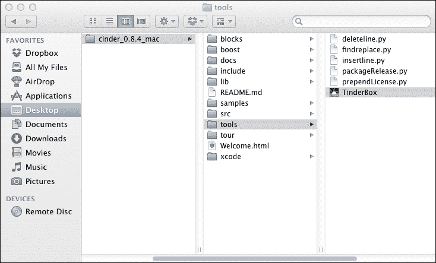
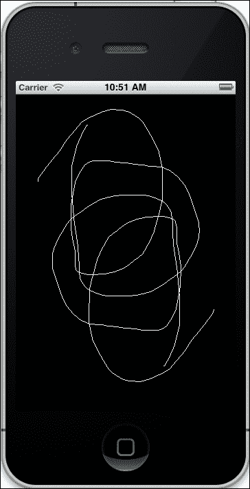

# 第一章. 入门

在本章中，我们将介绍以下内容：

+   为基本应用程序创建项目

+   为屏幕保护程序应用程序创建项目

+   为 iOS 触摸应用程序创建项目

+   理解应用程序的基本结构

+   响应鼠标输入

+   响应键盘输入

+   响应触摸输入

+   访问拖放到应用程序窗口上的文件

+   调整场景以适应窗口大小

+   在 Windows 上使用资源

+   在 OSX 和 iOS 上使用资源

+   使用资产

# 简介

在本章中，我们将学习使用 Cinder 创建应用程序的基础知识。

我们将首先使用一个名为 TinderBox 的强大工具在不同的平台上创建 Cinder 支持的不同类型的应用程序。

我们将介绍应用程序的基本结构，并查看如何响应用户输入事件。

最后，我们将学习如何在 Windows 和 Mac 上使用资源。

# 为基本应用程序创建项目

在本配方中，我们将学习如何为 Windows 和 Mac OSX 的基本桌面应用程序创建项目。

## 准备工作

可以使用一个名为 TinderBox 的强大工具来创建项目。TinderBox 包含在您的 Cinder 下载中，并为 Microsoft Visual C++ 2010 和 OSX Xcode 提供了创建不同应用程序项目的模板。

要找到 Tinderbox，请转到您的 Cinder 文件夹，其中包含一个名为 `tools` 的文件夹，其中包含 TinderBox 应用程序。



第一次打开 TinderBox 时，您将被要求指定 Cinder 的安装文件夹。您只需在第一次打开 TinderBox 时这样做。如果您需要重新定义 Cinder 安装的位置，您可以通过选择**文件**菜单然后选择**首选项**在 Windows 上，或者在 OS X 上选择**TinderBox**菜单然后选择**首选项**来完成。

## 如何操作…

我们将使用 TinderBox，这是一个与 Cinder 一起捆绑提供的实用工具，它允许轻松创建项目。按照以下步骤创建一个基本应用程序的项目：

1.  打开 TinderBox 并选择您项目的位置。在主 **TinderBox** 窗口中，选择**目标**为 **BasicApp**，**模板**为 **OpenGL**，如下面的截图所示：

1.  选择您项目的位置。**命名前缀**和**项目名称**字段将默认为项目名称，如下面的截图所示：

1.  选择您项目要使用的编译器，可以是 Microsoft Visual C++ 2010 和/或 OS X Xcode。

1.  点击**创建**按钮，TinderBox 将显示您新项目所在的文件夹。TinderBox 将保持打开状态；您现在可以关闭它。

## 它是如何工作的...

TinderBox 将为所选平台（Visual C++ 2010 和 OS X Xcode）创建所选项目，并创建编译的 Cinder 库的引用。它还将创建应用程序类，并将其作为`ci::app::AppBasic`的子类。它还将创建一些带有基本示例的示例代码，以帮助你开始。

## 更多内容...

默认情况下，你的项目名称和命名前缀将是创建项目所在的文件夹名称。如果你想编辑，可以这样做，但请确保**项目名称**和**命名前缀**字段没有空格，否则可能会出错。

命名前缀将被用来通过添加`App`后缀来命名你的应用程序类。例如，如果你将**命名前缀**字段设置为`MyCinderTest`，你的应用程序类将是`MyCinderTestApp`。

# 创建屏幕保护程序应用程序的项目

在本食谱中，我们将学习如何为 Windows 和 Mac OS X 创建桌面屏幕保护程序的项目。

## 准备就绪

要准备好使用 TinderBox，请参阅上一节“为基本应用程序创建项目”中的“准备就绪”部分。

## 如何操作...

我们将使用 TinderBox，这是一个与 Cinder 捆绑提供的实用工具，它允许轻松创建项目。按照以下步骤创建一个屏幕保护程序应用程序的项目：

1.  打开 TinderBox 并选择你的项目位置。在主**TinderBox**窗口中选择**屏幕保护程序**作为**目标**，选择**OpenGL**作为**模板**，如图所示：

1.  选择你想要创建项目的编译器，可以是 Microsoft Visual C++ 2010 和/或 OS X Xcode。

1.  点击**创建**，TinderBox 将引导你到创建项目所在的文件夹。

## 它是如何工作的...

TinderBox 将为你创建一个项目，并将其链接到编译的 Cinder 库。它还将创建应用程序类，并将其作为`ci::app::AppScreenSaver`的子类，这是具有屏幕保护程序应用程序所有基本功能的类。它还将创建一些带有基本示例的示例代码，以帮助你开始。

# 创建 iOS 触摸应用程序的项目

在本食谱中，我们将学习如何为在 iOS 设备（如 iPhone 和 iPad）上运行的应用程序创建项目。

## 准备就绪

要准备好使用 TinderBox，请参阅“为基本应用程序创建项目”食谱中的“准备就绪”部分。

请注意，iOS 触摸应用程序只能在 iOS 设备（如 iPhone 和 iPad）上运行，并且使用 TinderBox 创建的项目仅适用于 OSX Xcode。

## 如何操作...

我们将使用 TinderBox，这是一个与 Cinder 捆绑提供的实用工具，它允许轻松创建项目。按照以下步骤创建一个 iOS 触摸应用程序的项目：

1.  打开 TinderBox，选择您项目的位置。在主**TinderBox**窗口中，选择**Cocoa Touch**作为**目标**，选择**简单**作为**模板**，如图所示：

1.  选择您想要创建项目的编译器，无论是 Microsoft Visual C++ 2010 还是 OS X Xcode。

1.  点击**创建**，TinderBox 将指导您到创建项目所在的文件夹。

## 它是如何工作的...

TinderBox 将创建一个 OS X Xcode 项目，并创建对编译后的 Cinder 库的引用。它还将创建应用程序类，作为`ci::app::AppCocoaTouch`的子类，这是具有屏幕保护程序应用程序所有基本功能的类。它还将创建一些带有基本示例的示例代码，以帮助您开始。

此应用程序基于苹果的 Cocoa Touch 框架构建，用于创建 iOS 应用程序。

# 理解应用程序的基本结构

您的应用程序类可以在程序执行的不同点调用多个方法。以下表格列出了这些方法：

| 方法 | 用途 |
| --- | --- |
| `prepareSettings` | 此方法在应用程序初始化之前，在创建渲染器之前被调用一次。在这里，我们可以在应用程序初始化之前定义一些参数，例如帧率或窗口大小。如果没有指定，应用程序将使用默认值初始化。 |
| `setup` | 此方法在应用程序生命周期开始时仅被调用一次。在这里，您初始化所有成员并为应用程序的运行做准备。 |
| `update` | 此方法在应用程序运行期间循环调用，在`draw`方法之前。它用于动画和更新应用程序组件的状态。尽管您可以在`draw`方法中更新它们，但出于组织上的考虑，建议您将更新和绘图例程分开。 |
| `draw` | 此方法在应用程序运行期间更新之后循环调用。所有绘图代码都应该放在这里。 |
| `shutdown` | 此方法在应用程序退出之前被调用。使用它来执行任何必要的清理，例如释放内存和分配的资源或关闭硬件设备。 |

要执行我们的代码，我们必须用我们自己的代码覆盖这些方法。

## 准备工作

不必覆盖所有前面的方法；您可以使用应用程序特定需要的那些。例如，如果您不想进行任何绘图，可以省略`draw`方法。

在本食谱中，为了学习目的，我们将实现所有这些方法。

在您的类声明中声明以下方法：

```cpp
Void prepareSettings( Settings *settings );
Void setup();
Void update();
Void draw();
Void shutdown();
```

## 如何实现...

我们将实现几个方法，这些方法构成了应用程序的基本结构。执行以下步骤以实现：

1.  实现`prepareSettings`方法。在这里，我们可以定义，例如，窗口的大小、其标题和帧率：

    ```cpp
    void MyApp::prepareSettings( Settings *settings ){
      settings->setSize( 1024, 768 );
      settings->setTitle( "My Application Window" );
      settings->setFrameRate( 60 );
    }
    ```

1.  实现`setup`方法。在这里，我们应该初始化应用程序类的所有成员。例如，为了初始化从网络摄像头捕获，我们会声明以下成员：

    ```cpp
    int mCamWidth;
    int mCamHeight;
    Capture mCapture;
    And initialize them in the setup
    void Myapp::setup(){
      mCamWidth = 640;
      mCamHeight = 480;
      mCapture = Capture( mCamWidth, mCamHeight );
    }
    ```

1.  实现更新`update`方法。例如，我们将打印当前帧数到控制台：

    ```cpp
    void MyApp::update(){
      console() < < geElapsedFrames() < < std::endl;
    }
    ```

1.  使用所有绘图命令实现`draw`方法。在这里，我们用黑色清除背景并绘制一个红色圆圈：

    ```cpp
    void MyApp::draw(){
      gl::clear( Color::black() );
      gl::color( Color( 1.0f, 0.0f, 0.0f ) );
      gl::drawSolidCircle( Vec2f( 300.0f, 300.0f ), 100.0f  );
    }
    ```

1.  实现关闭`shutdown`方法。此方法应包含清理代码，例如，关闭线程或保存应用程序的状态。

1.  这里是一个将一些参数保存为 XML 格式的示例代码：

    ```cpp
    void MyApp::shutdown(){
      XmlTree doc = XmlTree::createDoc();
      XmlTree settings = xmlTree( "Settings", "" );
      //add some attributes to the settings node
      doc.push_back( settings );
      doc.write( writeFile( "Settings.xml" ) );
    }
    ```

## 工作原理...

我们应用程序的超类实现了前面的方法作为虚拟空方法。

当应用程序运行时，会调用这些方法，调用我们实现的代码或如果未实现，则调用父类的空方法。

在步骤 1 中，我们在`prepareSettings`方法中定义了几个应用程序参数。不建议使用`setup`方法来初始化这些参数，因为这意味着渲染器必须使用默认值初始化，然后在设置过程中进行调整。结果是额外的初始化时间。

## 还有更多...

还有其他回调响应用户输入，如鼠标和键盘事件、窗口大小调整以及将文件拖放到应用程序窗口上。这些在*响应鼠标输入*、*响应键盘输入*、*响应触摸输入*、*访问拖放到应用程序窗口上的文件*和*调整窗口大小后的场景*配方中进行了更详细的描述。

## 参见

要了解如何使用 TinderBox 创建基本应用程序，请阅读*为基本应用程序创建项目*配方。

# 响应鼠标输入

应用程序可以通过几个事件处理程序响应鼠标交互，这些处理程序根据执行的操作而调用。

下表列出了响应鼠标交互的现有处理程序：

| 方法 | 用法 |
| --- | --- |
| `mouseDown` | 当用户按下鼠标按钮时调用 |
| `mouseUp` | 当用户释放鼠标按钮时调用 |
| `mouseWheel` | 当用户旋转鼠标滚轮时调用 |
| `mouseMove` | 当鼠标移动而没有按钮按下时调用 |
| `mouseDrag` | 当鼠标移动时按下任何按钮时调用 |

实现前面的所有方法不是强制性的；您只需实现应用程序所需的方法。

## 准备工作

根据您需要响应的鼠标事件实现必要的处理程序。例如，要创建一个响应所有可用鼠标事件的应用程序，您必须在主类声明中实现以下代码：

```cpp
void mouseDown( MouseEvent event );
void mouseUp( MouseEvent event );
void mouseWheel( MouseEvent event );
void mouseMove( MouseEvent event );
void mouseDrag( MouseEvent event );
```

作为参数传递的`MouseEvent`对象包含有关鼠标事件的信息。

## 如何实现...

我们将学习如何使用 `ci::app::MouseEvent` 类来响应鼠标事件。执行以下步骤来完成此操作：

1.  要获取事件发生的屏幕坐标位置，可以输入以下代码行：

    ```cpp
    Vec2i mousePos = event.getPos();
    ```

    或者，我们可以通过调用 `getX` 和 `getY` 方法来获取单独的 x 和 y 坐标：

    ```cpp
    int mouseX = event.getX();
    int mouseY = event.getY();
    ```

1.  `MouseEvent` 对象还通过调用 `isLeft`、`isMiddle` 或 `isRight` 方法来告诉我们哪个鼠标按钮触发了事件。它们返回一个 `bool` 值，分别指示是否是左键、中键或右键。

    ```cpp
    bool leftButton = event.isLeft();
    bool rightButton = event.isRight();
    bool middleButton = event.isMiddle();
    ```

1.  要知道事件是否是由按下鼠标按钮触发的，我们可以调用 `isLeftDown`、`isRightDown` 和 `isMiddleDown` 方法，这些方法根据鼠标的左键、右键或中键是否被按下返回 `true`。

    ```cpp
    bool leftDown = event.isLeftDown();
    bool rightDown = event.isRightDown();
    bool middleDown = event.isMiddleDown();
    ```

1.  `getWheelIncrement` 方法返回一个表示鼠标滚轮移动增量的 `float` 值。

    ```cpp
    float wheelIncrement = event.getWheelIncrement();
    ```

1.  还可以知道在事件期间是否按下了特殊键。`isShiftDown` 方法在按下 *Shift* 键时返回 `true`，`isAltDown` 方法在按下 *Alt* 键时返回 `true`，`isControlDown` 在按下 *control* 键时返回 `true`，`isMetaDown` 在 Windows 上按下 Windows 键或在 OS X 上按下 *option* 键时返回 `true`，`isAccelDown` 在 Windows 上按下 *Ctrl* 键或在 OS X 上按下 *command* 键时返回 `true`。

## 工作原理

Cinder 应用内部响应系统的原生鼠标事件。然后，它使用原生信息创建一个 `ci::app::MouseEvent` 对象，并调用应用程序类必要的鼠标事件处理器。

## 还有更多...

也可以通过调用 `getNativeModifiers` 方法来访问原生修饰符掩码。这些是 Cinder 内部使用的平台特定值，可能对高级应用有所帮助。

# 响应按键输入

Cinder 应用可以通过多个回调来响应按键事件。

下表列出了由键盘交互触发的可用回调：

| 方法 | 用法 |
| --- | --- |
| `keyDown` | 当用户首次按下键时调用，如果键被持续按下，则重复调用。 |
| `keyUp` | 当按键释放时调用。 |

这两个方法都接收一个 `ci::app::KeyEvent` 对象作为参数，其中包含有关事件的信息，例如按下的键码或是否按下了任何特殊键（如 *Shift* 或 *control*）。

实现所有前面的按键事件处理器不是强制性的；你可以只实现应用程序需要的那些。

## 准备工作

根据需要响应的按键事件实现必要的事件处理器。例如，要创建一个响应键按下和键释放事件的程序，必须声明以下方法：

```cpp
void keyDown( KeyEvent event );
void keyUp( KeyEvent event );
```

`ci::app::KeyEvent` 参数包含有关按键事件的信息。

## 如何实现...

我们将学习如何使用 `ci::app::KeyEvent` 类来了解如何理解按键事件。执行以下步骤：

1.  要获取触发按键事件的字符的 ASCII 码，你可以输入以下代码行：

    ```cpp
    char character = event.getChar();
    ```

1.  要响应不映射到 ASCII 字符表的特殊键，我们必须调用 `getCode` 方法，该方法检索一个可以映射到 `ci::app::KeyEvent` 类中字符表的 `int` 值。例如，要测试按键事件是否由 *Esc* 键触发，你可以输入以下代码行：

    ```cpp
    bool escPressed = event.getCode() == KeyEvent::KEY_ESCAPE;
    ```

    如果 Esc 键触发了事件，则 `escPressed` 将为 `true`，否则为 `false`。

1.  `ci::app::KeyEvent` 参数还包含有关在事件期间按下的修饰键的信息。`isShiftDown` 方法在按下 *Shift* 键时返回 `true`，`isAltDown` 在按下 *Alt* 键时返回 `true`，`isControlDown` 在按下 *control* 键时返回 `true`，`isMetaDown` 在 Windows 上按下 Windows 键或在 OS X 上按下 *command* 键时返回 `true`，而 `isAccelDown` 在 Windows 上按下 *Ctrl* 键或在 OS X 上按下 *command* 键时返回 `true`。

## 它是如何工作的…

Cinder 应用程序内部响应系统的原生按键事件。当接收到原生按键事件时，它基于原生信息创建一个 `ci::app::KeyEvent` 对象，并在我们的应用程序类上调用相应的回调。

## 还有更多...

还可以通过调用 `getNativeKeyCode` 方法来访问原生键码。此方法返回一个包含键的原生、平台特定代码的 `int` 值。对于高级用途来说，这可能很重要。

# 响应触摸输入

Cinder 应用程序可以接收多个触摸事件。

在以下表中列出了由触摸交互调用的可用触摸事件处理器：

| 方法 | 用法 |
| --- | --- |
| `touchesBegan` | 当检测到新的触摸时调用此方法 |
| `touchesMoved` | 当现有触摸移动时调用此方法 |
| `touchesEnded` | 当现有触摸被移除时调用此方法 |

所有的前面方法都接收一个 `ci::app::TouchEvent` 对象作为参数，该对象包含一个 `std::vector`，其中包含 `ci::app::TouchEvent::Touch` 对象，包含每个检测到的触摸信息。由于许多设备可以同时检测和响应多个触摸，因此触摸事件可能包含多个触摸是可能且常见的。

实现所有前面的事件处理器不是强制性的；你可以使用你应用程序特别需要的那些。

Cinder 应用程序可以响应在运行 Windows 7、OS X 或 iOS 的任何触摸设备上的触摸事件。

## 准备工作

根据你想要响应的触摸事件实现必要的触摸事件处理器。例如，要响应所有可用的触摸事件（触摸添加、触摸移动和触摸移除），你需要声明并实现以下方法：

```cpp
void touchesBegan( TouchEvent event );
void touchesMoved( TouchEvent event );
void touchesEnded( TouchEvent event );
```

## 如何做到这一点…

我们将学习如何使用`ci::app::TouchEvent`类来理解触摸事件。执行以下步骤来完成此操作：

1.  要访问触摸列表，您可以输入以下代码行：

    ```cpp
    const std::vector<TouchEvent::Touch>& touches = event.getTouches();
    ```

    遍历容器以访问每个单独的元素。

    ```cpp
    for( std::vector<TouchEvent::Touch>::const_iterator it = touches.begin(); it != touches.end(); ++it ){
      const TouchEvent::Touch& touch = *it;
      //do something with the touch object
    }
    ```

1.  您可以通过调用返回包含其位置的`Vec2f`值的`getPos`方法来获取触摸的位置，或者使用`getX`和`getY`方法分别接收 x 和 y 坐标，例如：

    ```cpp
    for( std::vector<TouchEvent::Touch>::const_iterator it = touches.begin(); it != touches.end(); ++it ){
      const TouchEvent::Touch& touch = *it;
      vec2f pos = touch.getPos();
      float x = touch.getX();
      float y = touch.getY(); 
    }
    ```

1.  `getId`方法返回一个包含`touch`对象的唯一 ID 的`uint32_t`值。此 ID 在触摸的生命周期内是持久的，这意味着您可以使用它来跟踪在不同的触摸事件中访问的特定触摸。

    例如，要创建一个我们可以用手指画线的应用程序，我们可以创建一个`std::map`，将每条线（以`ci::PolyLine<Vec2f>`对象的形式）与一个`uint32_t`键关联，该键是触摸的唯一 ID。

    我们需要通过在源文件开头添加以下代码片段将包含`std::map`和`PolyLine`的文件包含到我们的项目中：

    ```cpp
    #include "cinder/polyline.h"
    #include <map>
    ```

1.  我们现在可以声明容器：

    ```cpp
    std::map< uint32_t, PolyLine<Vec2f> > mLines;
    ```

1.  在`touchesBegan`方法中，我们为每个检测到的触摸创建一条新线并将其映射到每个触摸的唯一 ID：

    ```cpp
    const std::vector<TouchEvent::Touch>& touches = event.getTouches();
    for( std::vector<TouchEvent::Touch>::const_iterator it = touches.begin(); it != touches.end(); ++it ){
      const TouchEvent::Touch& touch = *it;
      mLines[ touch.getId() ] = PolyLine<Vec2f>();
    }
    ```

1.  在`touchesMoved`方法中，我们将每个触摸的位置添加到其对应的线条中：

    ```cpp
    const std::vector<TouchEvent::Touch>& touches = event.getTouches();
    for( std::vector<TouchEvent::Touch>::const_iterator it = touches.begin(); it != touches.end(); ++it ){
      const TouchEvent::Touch& touch = *it;
      mLines[ touch.getId() ].push_back( touch.getPos() ); 
    }
    ```

1.  在`touchesEnded`方法中，我们移除与被移除的触摸对应的线条：

    ```cpp
    const std::vector<TouchEvent::Touch>& touches = event.getTouches();
    for( std::vector<TouchEvent::Touch>::const_iterator it = touches.begin(); it != touches.end(); ++it ){
      const TouchEvent::Touch& touch = *it;
      mLines.erase( touch.getId() );
    }
    ```

1.  最后，可以绘制线条。在这里，我们用黑色清除背景，用白色绘制线条。以下是对`draw`方法的实现：

    ```cpp
    gl::clear( Color::black() );
    gl::color( Color::white() );
    for( std::map<uint32_t, PolyLine<Vec2f> >::iterator it = mLines.begin(); it != mLines.end(); ++it ){
      gl::draw( it->second );
    }
    ```

    以下是我们绘制了一些线条后应用程序运行的截图：

    

## 它是如何工作的…

Cinder 应用程序会内部响应系统对任何触摸事件的调用。然后，它将创建一个包含事件信息的`ci::app::TouchEvent`对象，并调用我们应用程序类中的相应事件处理器。在 Windows 和 Mac 平台上，响应触摸事件的方式变得统一。

`ci::app::TouchEvent`类只包含一个访问器方法，该方法返回一个对`std::vector<TouchEvent::Touch>`容器的`const`引用。该容器为每个检测到的触摸包含一个`ci::app::TouchEvent::Touch`对象，并包含有关触摸的信息。

`ci::app::TouchEvent::Touch`对象包含有关触摸的信息，包括位置和前一个位置、唯一 ID、时间戳以及指向原生事件对象的指针，该指针映射到 Cocoa Touch 上的`UITouch`和 Windows 7 上的`TOUCHPOINT`。

## 更多内容…

在任何时候，也可以通过调用`getActiveTouches`方法来获取所有活动触摸的容器。它返回一个对`std::vector<TouchEvent::Touch>`容器的`const`引用。当处理触摸应用程序时，它提供了灵活性，因为它可以在触摸事件方法之外访问。

例如，如果你想在每个活动触摸周围绘制一个实心红色圆圈，你可以在你的`draw`方法中添加以下代码片段：

```cpp
const std::vector<TouchEvent::Touch>&activeTouches = getActiveTouches();
gl::color( Color( 1.0f, 0.0f, 0.0f ) );
for( std::vector<TouchEvent::Touch>::const_iterator it = activeTouches.begin(); it != activeTouches.end(); ++it ){
  const TouchEvent::Touch& touch = *it;
gl::drawSolidCircle( touch.getPos(), 10.0f );
}
```

# 访问拖放到应用程序窗口上的文件

Cinder 应用程序可以通过`fileDrop`回调来响应拖放到应用程序窗口上的文件。此方法接受一个包含事件信息的`ci::app::FileDropEvent`对象作为参数。

## 准备工作

你的应用程序必须实现一个接受`ci::app::FileDropEvent`对象作为参数的`fileDrop`方法。

将以下方法添加到应用程序的类声明中：

```cpp
void fileDrop( FileDropEvent event );
```

## 如何操作...

我们将学习如何使用`ci::app::FileDropEvent`对象来处理文件拖放事件。执行以下步骤：

1.  在方法实现中，你可以通过调用`getFiles`方法来访问应用程序上拖放的文件列表，使用`ci::app::FileDropEvent`参数。此方法返回一个包含`fs::path`对象的`conststd::vector`容器：

    ```cpp
    const vector<fs::path >& files = event.getFiles();
    ```

1.  文件被拖放到窗口中的位置可以通过以下回调方法访问：

    +   要获取包含文件拖放位置的`ci::Vec2i`对象，请输入以下代码行：

        ```cpp
        Vec2i dropPosition = event.getPos();
        ```

    +   要分别获取 x 和 y 坐标，你可以使用`getX`和`getY`方法，例如：

        ```cpp
        int pOS X = event.getX();
        int posY = event.getY();
        ```

1.  你可以通过使用`getNumFiles`方法来查找拖放文件的数量：

    ```cpp
    int numFiles = event.getNumFiles();
    ```

1.  要访问特定文件，如果你已经知道它的索引，你可以使用`getFile`方法并将索引作为参数传递。

    例如，要访问索引为`2`的文件，你可以使用以下代码行：

    ```cpp
    const fs::path& file = event.getFile( 2 );
    ```

## 它是如何工作的...

Cinder 应用程序将响应系统的本地文件拖放事件。然后，它将创建一个包含事件信息的`ci::app::FileDropEvent`对象，并在我们的应用程序中调用`fileDrop`回调。这样，Cinder 在 Windows 和 OS X 平台之间创建了一种统一的响应文件拖放事件的方式。

## 还有更多...

Cinder 使用`ci::fs::path`对象来定义路径。这些是`boost::filesystem::path`对象的`typedef`实例，在处理路径时提供了更大的灵活性。要了解更多关于`fs::path`对象的信息，请参阅[`www.boost.org/doc/libs/1_50_0/libs/filesystem/doc/index.htm`](http://www.boost.org/doc/libs/1_50_0/libs/filesystem/doc/index.htm)上的`boost::filesystem`库参考。

# 调整窗口大小后的场景调整

Cinder 应用程序可以通过实现调整大小事件来响应窗口调整大小。此方法接受一个包含事件信息的`ci::app::ResizeEvent`参数。

## 准备工作

如果你的应用程序没有`resize`方法，请实现一个。在应用程序的类声明中添加以下代码行：

```cpp
void resize( ResizeEvent event );
```

在方法实现中，你可以使用`ResizeEvent`参数来获取关于窗口新大小和格式的信息。

## 如何操作...

我们将学习如何使用`ci::app::ResizeEvent`参数来响应窗口大小调整事件。执行以下步骤：

1.  要找到窗口的新大小，你可以使用`getSize`方法，该方法返回一个`ci::Vec2iwith`对象，窗口的宽度作为 x 分量，高度作为 y 分量。

    ```cpp
    Vec2i windowSize = event.getSize();
    ```

    `getWidth`和`getHeight`方法都返回`int`值，分别代表窗口的宽度和高度，例如：

    ```cpp
    int width = event.getWidth();
    int height = event.getHeight();
    ```

1.  `getAspectRatio`方法返回一个`float`值，表示窗口的宽高比，即其宽度和高度的比例：

    ```cpp
    float ratio = event.getAspectRatio();
    ```

1.  任何需要调整的屏幕元素都必须使用新的窗口大小来重新计算其属性。例如，为了有一个在窗口中心绘制且所有边都有 20 像素边距的矩形，我们必须首先在类声明中声明一个`ci::Rectf`对象：

    ```cpp
    Rect frect;
    ```

    在设置中，我们设置其属性，使其在窗口的所有边都有 20 像素的边距：

    ```cpp
    rect.x1 = 20.0f;
    rect.y1 = 20.0f;
    rect.x2 = getWindowWidth() – 20.0f;
    rect.y2 = getWindowHeight() – 20.0f;
    ```

1.  要用红色绘制矩形，请将以下代码片段添加到`draw`方法中：

    ```cpp
    gl::color( Color( 1.0f, 0.0f, 0.0f ) );
    gl::drawSolidRect( rect );
    ```

1.  在`resize`方法中，我们必须重新计算矩形的属性，以便它调整大小以保持窗口所有边的 20 像素边距：

    ```cpp
    rect.x1 = 20.0f;
    rect.y1 = 20.0f;
    rect.x2 = event.getWidth() – 20.0f;
    rect.y2 = event.getHeight() – 20.0f;
    ```

1.  运行应用程序并调整窗口大小。矩形将根据窗口大小保持其相对大小和位置。

## 它是如何工作的…

Cinder 应用程序会内部响应系统的窗口大小调整事件。然后它将创建`ci::app::ResizeEvent`对象，并在我们的应用程序类上调用`resize`方法。这样 Cinder 创建了一种在 Windows 和 Mac 平台之间处理大小调整事件的一致方式。

# 在 Windows 上使用资源

对于 Windows 应用程序来说，使用外部文件来加载图像、播放音频或视频，或在 XML 文件中加载或保存设置是很常见的。

资源是应用程序的外部文件，它们嵌入在应用程序的可执行文件中。资源文件对用户隐藏，以避免修改。

## 准备工作

资源应存储在项目文件夹中名为`resources`的文件夹中。如果此文件夹不存在，请创建它。

在 Windows 上，资源必须在名为`Resources.rc`的文件中引用。此文件应放置在`vc10`文件夹中，紧邻 Visual C++解决方案。如果此文件不存在，你必须创建它作为一个空文件。如果`resources.rs`文件尚未包含在你的项目解决方案中，你必须通过右键单击**资源**过滤器并选择**添加**然后**现有项**来添加它。导航到该文件并选择它。按照惯例，此文件应与项目解决方案在同一文件夹中。

## 如何操作…

我们将使用 Visual C++ 2010 向 Windows 应用程序添加资源。执行以下步骤：

1.  在**头文件**过滤器中打开 Visual C++解决方案，并打开`resources.h`文件。

1.  将 `#pragma once` 宏添加到你的文件中，以防止它在你的项目中多次包含，并包含 `CinderResources.h` 文件。

    ```cpp
    #pragma once
    #include "cinder/CinderResources.h"
    ```

1.  在 Windows 上，每个资源都必须有一个唯一的 ID 号。按照惯例，ID 被定义为从 128 开始的连续数字，但如果你有更好的选择，可以使用其他 ID。务必确保不要重复使用相同的 ID。你还必须定义一个类型字符串。类型字符串用于识别同一类型的资源，例如，在声明图像资源时可以使用字符串 `IMAGE`，声明视频资源时使用 `VIDEO` 等。

1.  为了简化编写多平台代码，Cinder 有一个宏可以声明在 Windows 和 Mac 上都可以使用的资源。

    例如，要声明名为 `image.png` 的图像文件的资源，我们会在以下代码行中输入：

    ```cpp
    #define RES_IMAGE CINDER_RESOURCE(../resources/, image.png, 128, IMAGE)
    ```

    `CINDER_RESOURCE` 宏的第一个参数是资源文件所在文件夹的相对路径，在这种情况下是默认的 `resources` 文件夹。

    第二个参数是文件名，之后是此资源的唯一 ID，最后是其类型字符串。

1.  现在，我们需要将我们的 `resources` 宏添加到 `resources.rs` 文件中，如下所示：

    ```cpp
    #include "..\include\Resources.h"
    RES_IMAGE
    ```

1.  此资源现在已准备好在我们的应用程序中使用。要将此图像加载到 `ci::gl::Texture` 中，我们只需在我们的应用程序源代码中包含 `Texture.h` 文件：

    ```cpp
    #include "cinder/gl/Texture.h"
    ```

1.  我们现在可以声明纹理：

    ```cpp
    gl::Texture mImage;
    ```

1.  在设置中，我们通过加载资源创建纹理：

    ```cpp
    mImage = gl::Texture( loadImage( loadResource( RES_IMAGE ) );
    ```

1.  纹理现在已准备好在屏幕上绘制。要在位置 (20, 20) 绘制图像，我们将在 `draw` 方法内部输入以下代码行：

    ```cpp
    gl::draw( mImage, Vec2f( 20.0f, 20.0f ) );
    ```

## 它是如何工作的...

`resources.rc` 文件由资源编译器使用，将资源嵌入到可执行文件中作为二进制数据。

## 更多内容...

Cinder 允许编写代码以使用资源，这些资源在所有支持的平台上是一致的，但在 Windows 和 OS X/iOS 上处理资源的方式略有不同。要了解如何在 Mac 上使用资源，请阅读 *在 iOS 和 OS X 上使用资源* 烹饪配方。

# 在 iOS 和 OS X 上使用资源

对于 Windows 应用程序来说，使用外部文件来加载图像、播放音频或视频，或在 XML 文件上加载或保存设置是很常见的。

资源是应用程序外部文件，包含在应用程序包中。资源文件对用户隐藏，以避免修改。

Cinder 允许编写代码以使用资源，这种方式在编写 Windows 或 Mac 应用程序时是相同的，但处理资源的方式略有不同。要了解如何在 Windows 上使用资源，请阅读 *在 Windows 上使用资源* 烹饪配方。

## 准备工作

应将资源存储在 `project` 文件夹中名为 `resources` 的文件夹中。如果此文件夹不存在，请创建它。

## 如何做到这一点…

我们将使用 Xcode 在 iOS 和 OS X 上添加资源到我们的应用程序。执行以下步骤：

1.  将任何你希望使用的资源文件放置在 `resources` 文件夹中。

1.  通过在 Xcode 项目的 **Resources** 过滤器上右键单击并选择 **添加** 然后选择 **现有文件**，导航到 `resources` 文件夹，并选择你想要添加的资源文件。

1.  要在你的代码中加载资源，你使用 `loadResource` 方法并传递资源文件的名称。例如，要加载名为 `image.png` 的图像，你应在类声明中首先创建 `gl::Texture` 成员：

    ```cpp
    gl::Texture mImage;
    ```

1.  在 `setup` 方法中，我们使用以下资源初始化纹理：

    ```cpp
    mImage = loadImage( loadResource( "image.png" ));
    ```

1.  纹理现在已准备好在窗口中绘制。要在位置 (20, 20) 绘制它，请在 `draw` 方法中输入以下代码行：

    ```cpp
    gl::draw( mImage, Vec2f( 20.0f, 20.0f ) );
    ```

## 它是如何工作的……

在 iOS 和 OS X 上，应用程序实际上是包含运行应用程序所需所有文件的文件夹，例如 Unix 可执行文件、使用的框架和资源。你可以通过点击任何 Mac 应用程序并选择 **显示包内容** 来访问这些文件夹的内容。

当你在你的 Xcode 项目中的 `resources` 文件夹中添加资源时，这些文件会在构建阶段被复制到你的应用程序包的 `resources` 文件夹中。

## 更多内容……

你也可以使用在 Windows 应用程序中使用的相同 `loadResource` 方法来加载资源。这对于编写跨平台应用程序非常有用，这样你的代码就不需要做任何更改。

你应该在 `Resources.h` 文件中创建 `resource` 宏，并添加唯一资源 ID 及其类型字符串。例如，要加载图像 `image.png`，你可以输入以下代码片段：

```cpp
#pragma once
#include "cinder/CinderResources.h"
#define RES_IMAGE CINDER_RESOURCE(../resources/, image.png, 128, IMAGE)
```

这就是 `Resources.rc` 文件应该看起来像的：

```cpp
#include "..\include\Resources.h"

RES_IMAGE
```

使用前面的示例来加载图像，唯一的区别是我们将使用以下代码行来加载纹理：

```cpp
mImage = loadImage( loadResource( RES_IMAGE ) );
```

资源唯一 ID 和类型字符串在 Mac 应用程序中将被忽略，但添加它们允许创建跨平台代码。

# 使用资源

在这个菜谱中，我们将学习我们如何加载和使用资源。

## 准备工作

作为这个菜谱的示例，我们将加载并显示一个资源图像。

在你的项目目录中的 `assets` 文件夹内放置一个图像文件，并将其命名为 `image.png`。

在你的源代码顶部包含以下文件：

```cpp
#include "cinder/gl/Texture.h"
#include "cinder/ImageIO.h"
```

还应添加以下有用的 `using` 语句：

```cpp
using namespace ci;
using namespace ci::app;
using namespace std;
```

## 如何做……

作为示例，我们将学习我们如何加载并显示图像资源。执行以下步骤：

1.  声明一个 `ci::gl::Texture` 对象：

    ```cpp
    gl::Texture image;
    ```

1.  在 `setup` 方法中，让我们加载图像资源。如果无法加载资源，我们将使用 `try/catch` 块。

    ```cpp
        try{
            image = loadImage( loadAsset( "image.png" ) );
        } catch( ... ){
            console() << "asset not found" << endl;
        }
    ```

1.  在 `draw` 方法中，我们将绘制纹理。我们将使用一个 `if` 语句来检查纹理是否已成功初始化：

    ```cpp
    if( image ){
      gl::draw( image, getWindowBounds() );
        }
    ```

## 它是如何工作的……

第一个应用使用了一个名为 Cinder 的资产，它将尝试找到其默认的`assets`文件夹。它将首先在可执行文件或应用程序包文件夹中搜索，具体取决于平台，然后继续向上搜索其父文件夹，最多五层。这样做是为了适应不同的项目设置。

## 还有更多...

你可以使用`addAssetDirectory`方法添加一个额外的`assets`文件夹，该方法接受一个`ci::fs::path`对象作为参数。每次 Cinder 搜索资产时，它都会首先在其默认的`asset`文件夹中查找，然后查找用户可能添加的每个文件夹。

你也可以在`assets`文件夹内创建子文件夹，例如，如果我们的图片位于名为`My Images`的子文件夹中，我们就会在`setup`方法中输入以下代码片段：

```cpp
try{
     image = loadImage( loadAsset( "My Images/image.png" ) );
}catch( ... ){
     console() << "asset not found" << endl;
 }
```

你也可以知道特定文件夹的路径。为此，使用`getAssetPath`方法，该方法接受一个带有文件名的`ci::fs::path`对象作为参数。
