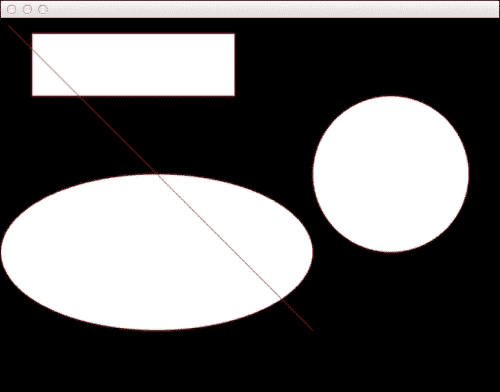
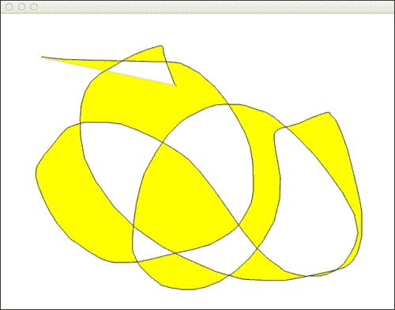
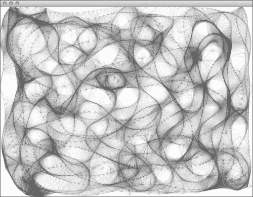
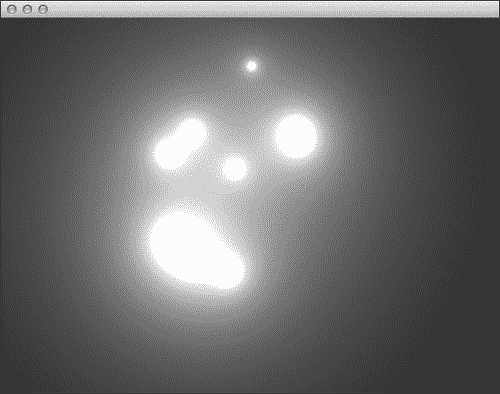
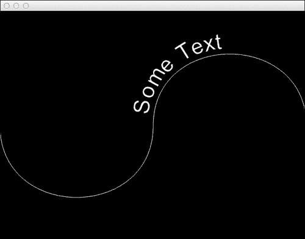
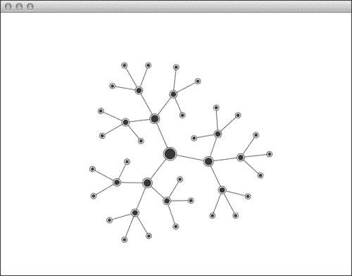

# 第七章。使用 2D 图形

在本章中，我们将学习如何使用 2D 图形和内置 Cinder 工具进行工作和绘图。

本章中的食谱将涵盖以下内容：

+   绘制 2D 几何原语

+   使用鼠标绘制任意形状

+   实现涂鸦算法

+   实现 2D 元球

+   在曲线上动画文本

+   添加模糊效果

+   实现力导向图

# 绘制 2D 几何原语

在本食谱中，我们将学习如何绘制以下 2D 几何形状，作为填充和描边形状：

+   圆形

+   椭圆

+   直线

+   矩形

## 准备工作

包含必要的头文件以使用 Cinder 命令在 OpenGL 中进行绘制。

在你的源文件顶部添加以下代码行：

```cpp
#include "cinder/gl/gl.h"
```

## 如何做到这一点…

我们将使用 Cinder 的 2D 绘图方法创建几个几何原语。执行以下步骤来完成：

1.  让我们先声明成员变量以保存我们将要绘制的形状的信息。

    创建两个 `ci::Vec2f` 对象来存储线的起点和终点，一个 `ci::Rectf` 对象来绘制矩形，一个 `ci::Vec2f` 对象来定义圆的中心，以及一个 `float` 对象来定义其半径。最后，我们将创建 `aci::Vec2f` 来定义椭圆的半径，以及两个 `float` 对象来定义其宽度和高度。

    让我们再声明两个 `ci::Color` 对象来定义描边和填充颜色。

    ```cpp
    Vec2f mLineBegin,mLineEnd;
    Rect fmRect;
    Vec2f mCircleCenter;
    float mCircleRadius;
    Vec2f mEllipseCenter;
    float mElipseWidth, mEllipseHeight;
    Color mFillColor, mStrokeColor;
    ```

1.  在 `setup` 方法中，让我们初始化前面的成员：

    ```cpp
    mLineBegin = Vec2f( 10, 10 );
    mLineEnd = Vec2f( 400, 400 );

    mCircleCenter = Vec2f( 500, 200 );
    mCircleRadius = 100.0f;

    mEllipseCenter = Vec2f( 200, 300 );
    mEllipseWidth = 200.0f;
    ellipseHeight = 100.0f;

    mRect = Rectf( Vec2f( 40, 20 ), Vec2f( 300, 100 ) );

    mFillColor = Color( 1.0f, 1.0f, 1.0f );
    mStrokeColor = Color( 1.0f, 0.0f, 0.0f );
    ```

1.  在 `draw` 方法中，让我们首先绘制填充形状。

    让我们清除背景并将 `mFillColor` 设置为绘图颜色。

    ```cpp
    gl::clear( Color( 0, 0, 0 ) );
    gl::color( mFillColor );
    ```

1.  通过调用 `ci::gl::drawSolidRect`、`ci::gl::drawSolidCircle` 和 `ci::gl::drawSolidEllipse` 方法绘制填充形状。

    在 `draw` 方法中添加以下代码片段：

    ```cpp
    gl::drawSolidRect( mRect );
    gl::drawSolidCircle( mCircleCenter, mCircleRadius );
    gl::drawSolidEllipse( mEllipseCenter, mEllipseWidth, ellipseHeight );
    ```

1.  要将我们的形状作为描边图形绘制，让我们首先将 `mStrokeColor` 设置为绘图颜色。

    ```cpp
    gl::color( mStrokeColor );
    ```

1.  让我们再次绘制我们的形状，这次只使用描边，通过调用 `ci::gl::drawLine`、`ci::gl::drawStrokeRect`、`ci::gl::drawStrokeCircle` 和 `ci::gl::drawStrokedEllipse` 方法。

    在 `draw` 方法中添加以下代码片段：

    ```cpp
    gl::drawLine( mLineBegin, mLineEnd );
    gl::drawStrokedRect( mRect );
    gl::drawStrokedCircle( mCircleCenter, mCircleRadius );
    gl::drawStrokedEllipse( mEllipseCenter, mEllipseWidth, ellipseHeight );
    ```

    这将产生以下结果：

    

## 它是如何工作的…

Cinder 的绘图方法使用 OpenGL 调用来提供快速且易于使用的绘图例程。

`ci::gl::color` 方法设置绘图颜色，以便所有形状都将使用该颜色绘制，直到再次调用 `ci::gl::color` 设置另一个颜色。

## 还有更多…

你也可以通过调用 `glLineWidth` 方法并传递一个 `float` 类型的参数来设置描边宽度。

例如，要将描边设置为 5 像素宽，你应该编写以下代码：

```cpp
glLineWidth( 5.0f );
```

# 使用鼠标绘制任意形状

在本食谱中，我们将学习如何使用鼠标绘制任意形状。

每当用户按下鼠标按钮时，我们将开始一个新的轮廓，并在用户拖动鼠标时进行绘制。

该形状将使用填充和描边来绘制。

## 准备工作

包含必要的文件以使用 Cinder 命令绘制并创建一个 `ci::Shape2d` 对象。

在源文件的顶部添加以下代码片段：

```cpp
#include "cinder/gl/gl.h"
#include "cinder/shape2d.h"
```

## 如何操作……

我们将创建一个 `ci::Shape2d` 对象，并使用鼠标坐标创建顶点。执行以下步骤来完成此操作：

1.  声明一个 `ci::Shape2d` 对象来定义我们的形状，以及两个 `ci::Color` 对象来定义填充和描边颜色。

    ```cpp
    Shape2d mShape;
    Color fillColor, strokeColor;
    ```

1.  在 `setup` 方法中初始化颜色。

    我们将使用黑色进行描边，黄色进行填充。

    ```cpp
    mFillColor = Color( 1.0f, 1.0f, 0.0f );
    mStrokeColor = Color( 0.0f, 0.0f, 0.0f );
    ```

1.  由于绘制将使用鼠标完成，因此需要使用 `mouseDown` 和 `mouseDrag` 事件。

    声明必要的回调方法。

    ```cpp
    void mouseDown( MouseEvent event );
    void mouseDrag( MouseEvent event );
    ```

1.  在 `mouseDown` 的实现中，我们将通过调用 `moveTo` 方法创建一个新的轮廓。

    以下代码片段显示了方法应该的样子：

    ```cpp
    void MyApp::mouseDown( MouseEvent event ){
      mShape.moveTo( event.getpos() );
    }
    ```

1.  在 `mouseDrag` 方法中，我们将通过调用 `lineTo` 方法向我们的形状中添加一条线。

    其实现应该像以下代码片段所示：

    ```cpp
    void MyApp::mouseDrag( MouseEvent event ){
      mShape.lineTo( event.getPos() );  
    }
    ```

1.  在 `draw` 方法中，我们首先需要清除背景，然后将 `mFillColor` 设置为绘图颜色，并绘制 `mShape`。

    ```cpp
    gl::clear( Color::white() );
    gl::color( mFillColor );
    gl::drawSolid( mShape );
    ```

1.  剩下的只是将 `mStrokeColor` 设置为绘图颜色，并将 `mShape` 作为描边形状绘制。

    ```cpp
    gl::color( mStrokeColor );
    gl::draw( mShape );
    ```

1.  构建并运行应用程序。按下鼠标按钮开始绘制新的轮廓，并拖动以绘制。

## 工作原理……

`ci:Shape2d` 是一个定义二维任意形状的类，允许有多个轮廓。

`ci::Shape2d::moveTo` 方法创建一个以参数传递的坐标为起点的新的轮廓。然后，`ci::Shape2d::lineTo` 方法从最后位置创建一条直线到作为参数传递的坐标。

绘制实心图形时，形状在内部被划分为三角形。

## 更多……

在使用 `ci::Shape2d` 构建形状时，也可以添加曲线。

| 方法 | 说明 |
| --- | --- |
| `quadTo (constVec2f& p1, constVec2f& p2)` | 使用 `p1` 作为控制点，从最后位置添加一个二次曲线到 `p2` |
| `curveTo (constVec2f& p1, constVec2f& p2, constVec2f& p3)` | 使用 `p1` 和 `p2` 作为控制点，从最后位置添加一个曲线到 `p3` |
| `arcTo (constVec2f& p, constVec2f& t, float radius)` | 使用 `t` 作为切点，半径作为弧的半径，从最后位置添加一个弧到 `p1` |

# 实现涂鸦算法

在这个菜谱中，我们将实现一个涂鸦算法，使用 Cinder 实现起来非常简单，但在绘制时会产生有趣的效果。您可以在 [`www.zefrank.com/scribbler/about.html`](http://www.zefrank.com/scribbler/about.html) 上了解更多关于连接相邻点的概念。您可以在 [`www.zefrank.com/scribbler/`](http://www.zefrank.com/scribbler/) 或 [`mrdoob.com/projects/harmony/`](http://mrdoob.com/projects/harmony/) 上找到一个涂鸦的例子。

## 如何操作……

我们将实现一个展示涂鸦的应用程序。执行以下步骤来完成此操作：

1.  包含必要的头文件：

    ```cpp
    #include<vector>
    ```

1.  向您的应用程序主类添加属性：

    ```cpp
    vector <Vec2f> mPath;
    float mMaxDist;
    ColorA mColor;
    bool mDrawPath;
    ```

1.  实现以下`setup`方法：

    ```cpp
    void MainApp::setup()
    {
      mDrawPath = false;
      mMaxDist = 50.f;
      mColor = ColorA(0.3f,0.3f,0.3f, 0.05f);
      setWindowSize(800, 600);

      gl::enableAlphaBlending();
      gl::clear( Color::white() );
    }
    ```

1.  由于绘图将使用鼠标完成，因此需要使用`mouseDown`和`mouseUp`事件。实现以下方法：

    ```cpp
    void MainApp::mouseDown( MouseEvent event )
    {
      mDrawPath = true;
    }

    void MainApp::mouseUp( MouseEvent event )
    {
      mDrawPath = false;
    }
    ```

1.  最后，绘制方法的实现如下代码片段所示：

    ```cpp
    void MainApp::draw(){
      if( mDrawPath ) {
      drawPoint( getMousePos() );
        }
    }

    void MainApp::drawPoint(Vec2f point) {
      mPath.push_back( point );

      gl::color(mColor);
      vector<Vec2f>::iterator it;
      for(it = mPath.begin(); it != mPath.end(); ++it) {
      if( (*it).distance(point) <mMaxDist ) {
      gl::drawLine(point, (*it));
            }
        }
    }
    ```

## 它是如何工作的…

当左鼠标按钮按下时，我们在容器中添加一个新的点，并绘制连接它和其他附近点的线条。我们正在寻找的新添加的点与其邻域中的点之间的距离必须小于`mMaxDist`属性的值。请注意，我们只在程序启动时，在`setup`方法的末尾清除一次绘图区域，因此我们不需要为每一帧重新绘制所有连接，这将非常慢。



# 实现二维元球

在这个配方中，我们将学习如何实现称为元球的有机外观对象。

## 准备工作

在这个配方中，我们将使用来自第五章中“应用排斥和吸引力的配方”的代码库，即*构建粒子系统*中的*构建粒子系统*。

## 如何做…

我们将使用着色器程序实现元球的渲染。执行以下步骤来完成此操作：

1.  在`assets`文件夹中创建一个名为`passThru_vert.glsl`的文件，并将以下代码片段放入其中：

    ```cpp
    void main()
    {
      gl_Position = ftransform();
      gl_TexCoord[0] = gl_MultiTexCoord0;
      gl_FrontColor = gl_Color; 
    }
    ```

1.  在`assets`文件夹中创建一个名为`mb_frag.glsl`的文件，并将以下代码片段放入其中：

    ```cpp
    #version 120

    uniform vec2 size;
    uniform int num;
    uniform vec2 positions[100];
    uniform float radius[100];

    void main(void)
    {

      // Get coordinates
      vec 2 texCoord = gl_TexCoord[0].st;

      vec4 color = vec4(1.0,1.0,1.0, 0.0);
      float a = 0.0;

      int i;  
      for(i = 0; i<num; i++) {
        color.a += (radius[i] / sqrt( ((texCoord.x*size.x)-
        positions[i].x)*((texCoord.x*size.x)-positions[i].x) + 
        ((texCoord.y*size.y)-
        positions[i].y)*((texCoord.y*size.y)-positions[i].y) ) 
        ); 
        }

      // Set color
      gl_FragColor = color;
    }
    ```

1.  添加必要的头文件。

    ```cpp
    #include "cinder/Utilities.h"
    #include "cinder/gl/GlslProg.h"
    ```

1.  向应用程序的主类添加一个属性，即我们的 GLSL 着色器程序的`GlslProg`对象。

    ```cpp
    gl::GlslProg  mMetaballsShader;
    ```

1.  在`setup`方法中，更改`repulsionFactor`和`numParticle`的值。

    ```cpp
    repulsionFactor = -40.f;
    int numParticle = 10;
    ```

1.  在`setup`方法的末尾，加载我们的 GLSL 着色器程序，如下所示：

    ```cpp
    mMetaballsShader = gl::GlslProg( loadAsset("passThru_vert.glsl"), loadAsset("mb_frag.glsl") );
    ```

1.  最后的主要更改是在`draw`方法中，如下代码片段所示：

    ```cpp
    void MainApp::draw()
    {
      gl::enableAlphaBlending();
      gl::clear( Color::black() );

      int particleNum = mParticleSystem.particles.size();

      mMetaballsShader.bind();
      mMetaballsShader.uniform( "size", Vec2f(getWindowSize()) );
      mMetaballsShader.uniform( "num", particleNum );

      for (int i = 0; i<particleNum; i++) {
      mMetaballsShader.uniform( "positions[" + toString(i) + 
      "]", mParticleSystem.particles[i]->position );
      mMetaballsShader.uniform( "radius[" + toString(i) + 
        "]", mParticleSystem.particles[i]->radius );
      }

      gl::color(Color::white());
      gl::drawSolidRect( getWindowBounds() );
      mMetaballsShader.unbind();
    }
    ```

## 它是如何工作的…

本配方最重要的部分是步骤 2 中提到的片段着色器程序。着色器根据从我们的粒子系统传递给着色器的位置和半径生成基于渲染元球的纹理。在步骤 7 中，您可以了解如何将信息传递给着色器程序。我们使用`setMatricesWindow`和`setViewport`来设置 OpenGL 进行绘图。



## 参见

+   **关于元球体的维基百科文章**：[`zh.wikipedia.org/wiki/元球体`](http://zh.wikipedia.org/wiki/元球体)

# 在曲线上动画化文本

在这个配方中，我们将学习如何围绕用户定义的曲线动画化文本。

我们将创建`Letter`和`Word`类来管理动画，一个`ci::Path2d`对象来定义曲线，以及一个`ci::Timer`对象来定义动画的持续时间。

## 准备工作

创建并添加以下文件到您的项目中：

+   `Word.h`

+   `Word.cpp`

+   `Letter.h`

+   `Letter.cpp`

## 如何做…

我们将创建一个单词并沿 `ci::Path2d` 对象动画化其字母。执行以下步骤来完成：

1.  在 `Letter.h` 文件中，包含必要的 `text`、`ci::Vec2f` 和 `ci::gl::Texture` 文件。

    还需添加 `#pragma once` 宏

    ```cpp
    #pragma once

    #include "cinder/vector.h"
    #include "cinder/text.h"
    #include "cinder/gl/Texture.h"
    ```

1.  声明具有以下成员和方法的 `Letter` 类：

    ```cpp
    class Letter{
    public:
        Letter( ci::Font font, conststd::string& letter );

        void draw();
        void setPos( const ci::Vec2f& newPos );

        ci::Vec2f pos;
        float rotation;
        ci::gl::Texture texture;
        float width;
    };
    ```

1.  移动到 `Letter.cpp` 文件以实现类。

    在构造函数中，创建一个 `ci::TextBox` 对象，设置其参数，并将其渲染到纹理上。同时，将宽度设置为纹理宽度加上 10 的填充值：

    ```cpp
    Letter::Letter( ci::Font font, conststd::string& letter ){
        ci::TextBoxtextBox;  
        textBox = ci::TextBox().font( font ).size( ci::Vec2i( ci::TextBox::GROW, ci::TextBox::GROW ) ).text( letter ).premultiplied();
        texture = textBox.render();
        width = texture.getWidth() + 10.0f;
    }
    ```

1.  在 `draw` 方法中，我们将绘制纹理并使用 OpenGL 变换将纹理移动到其位置，并根据旋转进行旋转：

    ```cpp
    void Letter::draw(){
        glPushMatrix();
        glTranslatef( pos.x, pos.y, 0.0f );
        glRotatef( ci::toDegrees( rotation ), 0.0f, 0.0f, 1.0f );
        glTranslatef( 0.0f, -texture.getHeight(), 0.0f );
        ci::gl::draw( texture );
        glPopMatrix();
    }
    ```

1.  在 `setPos` 方法的实现中，我们将更新位置并计算其旋转，使字母垂直于其移动。我们通过计算其速度的反正切来实现这一点：

    ```cpp
    void Letter::setPos( const ci::Vec2f&newPos ){
        ci::Vec2f vel = newPos - pos;
        rotation = atan2( vel.y, vel.x );
        pos = newPos;
    }
    ```

1.  `Letter` 类已准备就绪！现在移动到 `Word.h` 文件，添加 `#pragma once` 宏，并包含 `Letter.h` 文件：

    ```cpp
    #pragma once
    #include "Letter.h"
    ```

1.  声明具有以下成员和方法的 `Word` 类：

    ```cpp
    class Word{
    public:
        Word( ci::Font font, conststd::string& text );

        ~Word();

        void update( const ci::Path2d& curve, float curveLength, float  progress );
        void draw();

          std::vector< Letter* > letters;
          float length;
    };
    ```

1.  移动到 `Word.cpp` 文件并包含 `Word.h` 文件：

    ```cpp
    #include "Word.h"
    ```

1.  在构造函数中，我们将遍历 `text` 中的每个字符并添加一个新的 `Letter` 对象。我们还将通过计算所有字母宽度的总和来计算文本的总长度：

    ```cpp
    Word::Word( ci::Font font, conststd::string& text ){
      length = 0.0f;
      for( int i=0; i<text.size(); i++ ){
      std::string letterText( 1, text[i] );
              Letter *letter = new Letter( font, letterText );
      letters.push_back( letter );
      length += letter->width;
        }
    }
    ```

    在析构函数中，我们将删除所有 `Letter` 对象以清理类使用的内存：

    ```cpp
    Word::~Word(){
      for( std::vector<Letter*>::iterator it = letters.begin(); it != letters.end(); ++it ){
      delete *it;
        }
    }
    ```

1.  在 `update` 方法中，我们将传递 `ci::Path2d` 对象的引用、路径的总长度以及动画进度的归一化值（从 0.0 到 1.0）。

    我们将计算每个单独字母沿曲线的位置，考虑到 `Word` 的长度和当前进度：

    ```cpp
    void Word::update( const ci::Path2d& curve, float curveLength,   float progress ){
      float maxProgress = 1.0f - ( length / curveLength );
      float currentProgress = progress * maxProgress;
      float progressOffset = 0.0f;
      for( int i=0; i<letters.size(); i++ ){
            ci::Vec2f pos = curve.getPosition
            ( currentProgress + progressOffset );
            letters[i]->setPos( pos );
            progressOffset += ( letters[i]->width / curveLength );
        }
    }
    ```

1.  在 `draw` 方法中，我们将遍历所有字母并调用每个字母的 `draw` 方法：

    ```cpp
    void Word::draw(){
      for( std::vector< Letter* >::iterator it = letters.begin(); it != letters.end(); ++it ){
            (*it)->draw();
        }
    }
    ```

1.  随着 `Word` 和 `Letter` 类的准备就绪，现在是时候移动到我们的应用程序的类源文件了。首先，包含必要的源文件并添加有用的 `using` 语句：

    ```cpp
    #include "cinder/Timer.h"
    #include "Word.h"

    using namespace ci;
    using namespace ci::app;
    using namespace std;
    ```

1.  声明以下成员：

    ```cpp
    Word * mWord;
    Path2d mCurve;
    float mPathLength;
    Timer mTimer;
    double mSeconds;
    ```

1.  在 `setup` 方法中，我们将首先创建 `std::string` 和 `ci::Font`，并使用它们来初始化 `mWord`。我们还将使用我们希望动画持续的时间来初始化 `mSeconds`：

    ```cpp
    string text = "Some Text";
    Font font = Font( "Arial", 46 );
    mWord = new Word( font, text );
    mSeconds = 5.0;
    ```

1.  我们现在需要通过创建关键点和通过调用 `curveTo` 连接它们来创建曲线：

    ```cpp
    Vec2f curveBegin( 0.0f, getWindowCenter().y );
    Vec2f curveCenter = getWindowCenter();
    Vec2f curveEnd( getWindowWidth(), getWindowCenter().y );

    mCurve.moveTo( curveBegin );
    mCurve.curveTo( Vec2f( curveBegin.x, curveBegin.y + 200.0f ), Vec2f( curveCenter.x, curveCenter.y + 200.0f ), curveCenter );
    mCurve.curveTo( Vec2f( curveCenter.x, curveCenter.y - 200.0f ), Vec2f( curveEnd.x, curveEnd.y - 200.0f ), curveEnd );
    ```

1.  让我们通过计算每个点与其相邻点之间的距离之和来计算路径的长度。在 `setup` 方法中添加以下代码片段：

    ```cpp
    mPathLength = 0.0f;
    for( int i=0; i<mCurve.getNumPoints()-1; i++ ){
      mPathLength += mCurve.getPoint( i ).distance( mCurve.getPoint( i+1 ) );
        }
    ```

1.  我们需要检查 `mTimer` 是否正在运行，并通过计算已过秒数与 `mSeconds` 之间的比率来计算进度。在 `update` 方法中添加以下代码片段：

    ```cpp
    if( mTimer.isStopped() == false ){
      float progress;
      if( mTimer.getSeconds() >mSeconds ){
        mTimer.stop();
        progress = 1.0f;
            } else {
      progress = (float)( mTimer.getSeconds() / mSeconds );
            }
    mWord->update( mCurve, mPathLength, progress );
        }
    ```

1.  在 `draw` 方法中，我们需要清除背景，启用 alpha 混合，绘制 `mWord`，并绘制路径：

    ```cpp
    gl::clear( Color( 0, 0, 0 ) ); 
    gl::enableAlphaBlending();
    mWord->draw(); 
    gl::draw( mCurve );
    ```

1.  最后，每当用户按下任何键时，我们需要启动计时器。

    声明 `keyUp` 事件处理程序：

    ```cpp
    void keyUp( KeyEvent event );
    ```

1.  以下是对`keyUp`事件处理器的实现：

    ```cpp
    void CurveTextApp::keyUp( KeyEvent event ){
    mTimer.start();
    }
    ```

1.  构建并运行应用程序。按任意键开始动画。

# 添加模糊效果

在这个菜谱中，我们将学习如何在绘制纹理时应用模糊效果。

## 准备工作

在这个菜谱中，我们将使用 Geeks3D 提供的 Gaussian blur 着色器，[请访问这里](http://www.geeks3d.com/20100909/shader-library-gaussian-blur-post-processing-filter-in-glsl/)。

## 如何做到这一点…

我们将实现一个 Cinder 应用程序示例，以说明该机制。执行以下步骤：

1.  在`assets`文件夹中创建一个名为`passThru_vert.glsl`的文件，并将以下代码片段放入其中：

    ```cpp
    void main()
    {
      gl_Position = ftransform();
      gl_TexCoord[0] = gl_MultiTexCoord0;
      gl_FrontColor = gl_Color; 
    }
    ```

1.  在`assets`文件夹中创建一个名为`gaussian_v_frag.glsland`的文件，并将以下代码片段放入其中：

    ```cpp
    #version 120

    uniform sampler2D sceneTex; // 0

    uniform float rt_w; // render target width
    uniform float rt_h; // render target height
    uniform float vx_offset;

    float offset[3] = float[]( 0.0, 1.3846153846, 3.2307692308 );
    float weight[3] = float[]( 0.2270270270, 0.3162162162, 0.0702702703 );

    void main() 
    { 
      vec3 tc = vec3(1.0, 0.0, 0.0);
      if (gl_TexCoord[0].x<(vx_offset-0.01)){
    vec2 uv = gl_TexCoord[0].xy;
    tc = texture2D(sceneTex, uv).rgb * weight[0];
    for (int i=1; i<3; i++) {
    tc += texture2D(sceneTex, uv + vec2(0.0, offset[i])/rt_h).rgb * weight[i];
      tc += texture2D(sceneTex, uv - vec2(0.0, offset[i])/rt_h).rgb * weight[i];
        }
      }
    else if (gl_TexCoord[0].x>=(vx_offset+0.01)){
      tc = texture2D(sceneTex, gl_TexCoord[0].xy).rgb;
      }
    gl_FragColor = vec4(tc, 1.0);
    }
    ```

    在`assets`文件夹中创建一个名为`gaussian_h_frag.glsl`的文件，并将以下代码片段放入其中：

    ```cpp
    #version 120

    uniform sampler2D sceneTex; // 0

    uniform float rt_w; // render target width
    uniform float rt_h; // render target height
    uniform float vx_offset;

    float offset[3] = float[]( 0.0, 1.3846153846, 3.2307692308 );
    float weight[3] = float[]( 0.2270270270, 0.3162162162, 0.0702702703 );

    void main() 
    { 
    vec3 tc = vec3(1.0, 0.0, 0.0);
    if (gl_TexCoord[0].x<(vx_offset-0.01)){
    vec2 uv = gl_TexCoord[0].xy;
    tc = texture2D(sceneTex, uv).rgb * weight[0];
    for (int i=1; i<3; i++) 
        {
        tc += texture2D(sceneTex, uv + vec2(offset[i])/rt_w, 0.0).rgb * weight[i];
        tc += texture2D(sceneTex, uv - vec2(offset[i])/rt_w, 0.0).rgb * weight[i];
        }
      }
    else if (gl_TexCoord[0].x>=(vx_offset+0.01))
      {
      tc = texture2D(sceneTex, gl_TexCoord[0].xy).rgb;
      }
    gl_FragColor = vec4(tc, 1.0);
    }
    ```

1.  添加必要的头文件：

    ```cpp
    #include "cinder/Utilities.h"
    #include "cinder/gl/GlslProg.h"
    #include "cinder/gl/Texture.h"
    #include "cinder/ImageIo.h"
    #include "cinder/gl/Fbo.h"
    ```

1.  将属性添加到应用程序的主类中：

    ```cpp
    gl::GlslProg  mGaussianVShader, mGaussianHShader;
    gl::Texture mImage, mImageBlur;
    gl::Fbo    mFboBlur1, mFboBlur2;
    float           offset, level;
    params::InterfaceGl mParams;
    ```

1.  实现以下`setup`方法：

    ```cpp
    void MainApp::setup(){
      setWindowSize(512, 512);

      level = 0.5f;
      offset = 0.6f;

      mGaussianVShader = gl::GlslProg( loadAsset("passThru_vert.glsl"), loadAsset("gaussian_v_frag.glsl") );
      mGaussianHShader = gl::GlslProg( loadAsset("passThru_vert.glsl"), loadAsset("gaussian_h_frag.glsl") );
      mImage = gl::Texture(loadImage(loadAsset("image.png")));

      mFboBlur1 = gl::Fbo
      (mImage.getWidth(), mImage.getHeight());
      mFboBlur2 = gl::Fbo
      (mImage.getWidth(), mImage.getHeight());

    // Setup the parameters
      mParams = params::InterfaceGl
      ( "Parameters", Vec2i( 200, 100 ) );
      mParams.addParam
      ( "level", &level, "min=0 max=1 step=0.01" );
      mParams.addParam
      ( "offset", &offset, "min=0 max=1 step=0.01");
    }
    ```

1.  在`draw`方法的开头计算模糊强度：

    ```cpp
    float rt_w = mImage.getWidth()*3.f-mImage.getWidth()*2.f*level;
    float rt_h = mImage.getHeight()*3.f-mImage.getHeight()*2.f*level;
    ```

1.  在`draw`函数中，使用第一步着色器将图像渲染到`mFboBlur1`：

    ```cpp
    mFboBlur1.bindFramebuffer();
    gl::setViewport( mFboBlur1.getBounds() );
    mImage.bind(0);
    mGaussianVShader.bind();
    mGaussianVShader.uniform("sceneTex", 0);
    mGaussianVShader.uniform("rt_w", rt_w);
    mGaussianVShader.uniform("rt_h", rt_h);
    mGaussianVShader.uniform("vx_offset", offset);
    gl::drawSolidRect(mFboBlur1.getBounds());
    mGaussianVShader.unbind();
    mFboBlur1.unbindFramebuffer();
    ```

1.  在`draw`函数中，使用第二步着色器渲染`mFboBlur1`中的纹理：

    ```cpp
    mFboBlur2.bindFramebuffer();
    mFboBlur1.bindTexture(0);
    mGaussianHShader.bind();
    mGaussianHShader.uniform("sceneTex", 0);
    mGaussianHShader.uniform("rt_w", rt_w);
    mGaussianHShader.uniform("rt_h", rt_h);
    mGaussianHShader.uniform("vx_offset", offset);
    gl::drawSolidRect(mFboBlur2.getBounds());
    mGaussianHShader.unbind();
    mFboBlur2.unbindFramebuffer();
    ```

1.  将`mImageBlur`设置为从`mFboBlur2`的结果纹理：

    ```cpp
    mImageBlur = mFboBlur2.getTexture();
    ```

1.  在`draw`方法的末尾，绘制带有结果的纹理和 GUI：

    ```cpp
    gl::clear( Color::black() );
    gl::setMatricesWindow(getWindowSize());
    gl::setViewport(getWindowBounds());
    gl::draw(mImageBlur);
    params::InterfaceGl::draw();
    ```

## 工作原理…

由于高斯模糊着色器需要应用两次——垂直和水平处理——我们必须使用**帧缓冲对象**（**FBO**），这是一种在图形卡内存中绘制到纹理的机制。在第 8 步中，我们从`mImage`对象中绘制原始图像，并应用存储在`gaussian_v_frag.glsl`文件中的着色程序，该文件已加载到`mGaussianVShaderobject`中。此时，所有内容都绘制到`mFboBlur1`中。下一步是使用`mFboBlur2`中的纹理，并在第 9 步中应用第二个遍历的着色器。最终处理后的纹理存储在第 10 步的`mImageBlur`中。在第 7 步中，我们计算模糊强度。


# 实现一个力导向图

力导向图是一种使用简单的物理，如排斥和弹簧，来绘制美观图形的方法。我们将使我们的图形交互式，以便用户可以拖动节点并看到图形如何重新组织自己。

## 准备工作

在本食谱中，我们将使用第五章中*Building Particle Systems*食谱的代码库，即*在 2D 中创建粒子系统*。有关如何绘制节点及其之间连接的详细信息，请参阅第六章中的*Connecting particles*食谱，*Rendering and Texturing Particle Systems*。

## 如何做到这一点…

我们将创建一个交互式力导向图。执行以下步骤：

1.  向你的主应用程序类添加属性。

    ```cpp
    vector< pair<Particle*, Particle*> > mLinks;
    float mLinkLength;
    Particle*   mHandle;
    bool mIsHandle;
    ```

1.  在`setup`方法中设置默认值并创建一个图。

    ```cpp
    void MainApp::setup(){
      mLinkLength = 40.f;
      mIsHandle   = false;

      float drag = 0.95f;

      Particle *particle = newParticle(getWindowCenter(), 10.f, 10.f, drag );
      mParticleSystem.addParticle( particle );

      Vec2f r = Vec2f::one()*mLinkLength;
      for (int i = 1; i<= 3; i++) {
        r.rotate( M_PI * (i/3.f) );
        Particle *particle1 = newParticle( particle->position+r, 7.f,7.f, drag );
        mParticleSystem.addParticle( particle1 );
        mLinks.push_back(make_pair(mParticleSystem.particles[0], particle1));

        Vec2f r2 = (particle1->position-particle->position);
        r2.normalize();
        r2 *= mLinkLength;
        for (int ii = 1; ii <= 3; ii++) {
          r2.rotate( M_PI * (ii/3.f) );
          Particle *particle2 = newParticle( particle1->position+r2, 5.f, 5.f, drag );
          mParticleSystem.addParticle( particle2 );
          mLinks.push_back(make_pair(particle1, particle2));

          Vec2f r3 = (particle2->position-particle1->position);
          r3.normalize();
          r3 *= mLinkLength;
          for (int iii = 1; iii <= 3; iii++) {
    r3.rotate( M_PI * (iii/3.f) );
    Particle *particle3 = newParticle( particle2->position+r3, 3.f, 3.f, drag );
    mParticleSystem.addParticle( particle3 );
    mLinks.push_back(make_pair(particle2, particle3));
                }
            }
        }
    }
    ```

1.  实现与鼠标的交互。

    ```cpp
    void MainApp::mouseDown(MouseEvent event){
      mIsHandle = false;

      float maxDist = 20.f;
      float minDist = maxDist;
      for( std::vector<Particle*>::iterator it = mParticleSystem.particles.begin(); it != mParticleSystem.particles.end(); ++it ){
      float dist = (*it)->position.distance( event.getPos() );
      if(dist<maxDist&&dist<minDist) {
      mHandle = (*it);
      mIsHandle = true;
      minDist = dist;
            }
        }
    }

    void MainApp::mouseUp(MouseEvent event){
    mIsHandle = false;
    }
    ```

1.  在`update`方法内部，计算影响粒子的所有力。

    ```cpp
    void MainApp::update() {
      for( std::vector<Particle*>::iterator it1 = mParticleSystem.particles.begin(); it1 != mParticleSystem.particles.end(); ++it1 )
        {
        for( std::vector<Particle*>::iterator it2 = mParticleSystem.particles.begin(); it2 != mParticleSystem.particles.end(); ++it2 ){
          Vec2f conVec = (*it2)->position - (*it1)->position;
          if(conVec.length() <0.1f)continue;

            float distance = conVec.length();
            conVec.normalize();
            float force = (mLinkLength*2.0f - distance)* -0.1f;
            force = math<float>::min(0.f, force);

                (*it1)->forces +=  conVec * force*0.5f;
                (*it2)->forces += -conVec * force*0.5f;
            }
        }

    for( vector<pair<Particle*, Particle*> > ::iterator it = mLinks.begin(); it != mLinks.end(); ++it ){
      Vec2f conVec = it->second->position - it->first->position;
      float distance = conVec.length();
      float diff = (distance-mLinkLength)/distance;
      it->first->forces += conVec * 0.5f*diff;
      it->second->forces -= conVec * 0.5f*diff;
          }

      if(mIsHandle) {
        mHandle->position = getMousePos();
        mHandle->forces = Vec2f::zero();
        }

      mParticleSystem.update();
    }
    ```

1.  在`draw`方法中实现绘制粒子和它们之间的链接。

    ```cpp
    void MainApp::draw()
    {
      gl::enableAlphaBlending();
      gl::clear( Color::white() );
      gl::setViewport(getWindowBounds());
      gl::setMatricesWindow( getWindowWidth(), getWindowHeight() );

      gl::color( ColorA(0.f,0.f,0.f, 0.8f) );
      for( vector<pair<Particle*, Particle*> > ::iterator it = mLinks.begin(); it != mLinks.end(); ++it )
        {
        Vec2f conVec = it->second->position - it->first->position;
        conVec.normalize();
        gl::drawLine(it->first->position + conVec * ( it->first->radius+2.f ),
        it->second->position - conVec * ( it->second->radius+2.f ) );
        }

      gl::color( ci::ColorA(0.f,0.f,0.f, 0.8f) );
      mParticleSystem.draw();
    } 
    ```

1.  在`Particle.cpp`源文件中，应实现每个粒子的绘制，如下所示：

    ```cpp
    void Particle::draw(){
      ci::gl::drawSolidCircle( position, radius);
      ci::gl::drawStrokedCircle( position, radius+2.f);
    }
    ```

## 它是如何工作的…

在步骤 2 中，在`setup`方法中，我们为图的每个级别创建粒子，并在它们之间添加链接。在步骤 4 中的`update`方法中，我们计算影响所有粒子的力，这些力使每个粒子相互排斥，以及来自连接节点的弹簧的力。在排斥扩散粒子时，弹簧试图将它们保持在`mLinkLength`中定义的固定距离。



## 参见

+   **关于力导向图绘制的维基百科文章**：[`en.wikipedia.org/wiki/Force-based_algorithms_(graph_drawing)`](http://en.wikipedia.org/wiki/Force-based_algorithms_(graph_drawing))
