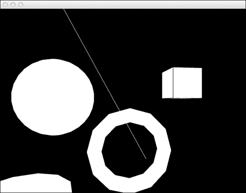
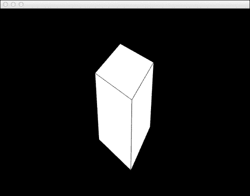
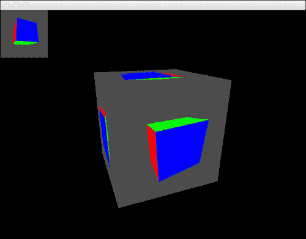
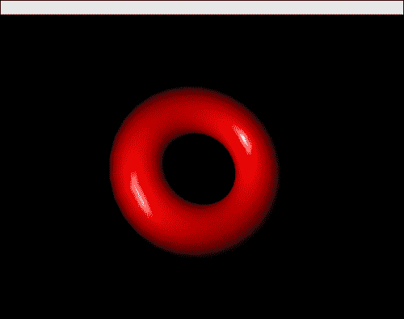
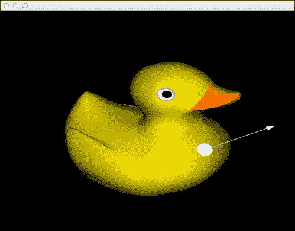
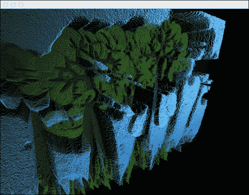
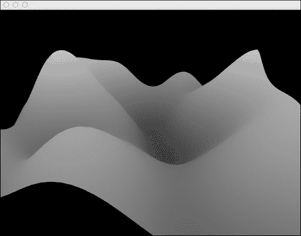

# 第八章。使用 3D 图形

在本章中，我们将学习如何使用和绘制 3D 图形。本章的配方将涵盖以下内容：

+   绘制 3D 几何原语

+   旋转、缩放和移动

+   在离屏画布上绘图

+   使用鼠标在 3D 中绘图

+   添加灯光

+   3D 选择

+   从图像创建高度图

+   使用 Perlin 噪声创建地形

+   保存网格数据

# 简介

在本章中，我们将学习创建 3D 图形的基础知识。我们将使用 OpenGL 和 Cinder 包含的一些有用的包装器来处理一些高级 OpenGL 功能。

# 绘制 3D 几何原语

在这个配方中，我们将学习如何绘制以下 3D 几何形状：

+   立方体

+   球体

+   线

+   环面

+   圆柱体

## 准备工作

包含必要的头文件以使用 Cinder 命令和语句在 OpenGL 中绘图。将以下代码添加到源文件顶部：

```cpp
#include "cinder/gl/gl.h"
#include "cinder/Camera.h"

using namespace ci;
```

## 如何做…

我们将使用 Cinder 的 3D 绘图方法创建几个几何原语。

1.  声明成员变量，包含我们的原语信息：

    ```cpp
    Vec3f mCubePos, mCubeSize;
    Vec3f mSphereCenter;
    float mSphereRadius; 
    Vec3f mLineBegin, mLineEnd; 
    Vec3f mTorusPos;
    float mTorusOuterRadius, mTorusInnerRadius; 
    Vec3f mCylinderPos;
    float mCylinderBaseRadius, mCylinderTopRadius, mCylinderHeight;
    ```

1.  使用位置和几何形状的大小初始化成员变量。在 `setup` 方法中添加以下代码：

    ```cpp
    mCubePos = Vec3f( 100.0f, 300.0f, 100.0f );
    mCubeSize = Vec3f( 100.0f, 100.0f, 100.0f );

    mSphereCenter = Vec3f( 500, 250, 0.0f );
    mSphereRadius = 100.0f;

    mLineBegin = Vec3f( 200, 0, 200 );
    mLineEnd = Vec3f( 500, 500, -200 );

    mTorusPos = Vec3f( 300.0f, 100.0f, 0.0f );
    mTorusOuterRadius = 100.0f;
    mTorusInnerRadius = 20.0f;

    mCylinderPos = Vec3f( 500.0f, 0.0f, -200.0f );
    mCylinderBaseRadius = 50.0f;
    mCylinderTopRadius = 80.0f;
    mCylinderHeight = 100.0f;
    ```

1.  在我们绘制形状之前，让我们也创建一个相机来围绕我们的形状旋转，以便给我们一个更好的透视感。声明一个 `ci::CameraPersp` 对象：

    ```cpp
    CameraPerspmCamera;
    ```

1.  在 `setup` 方法中初始化它：

    ```cpp
    mCamera = CameraPersp( getWindowWidth(), getWindowHeight(), 60.0f );
    ```

1.  在 `update` 方法中，我们将使相机围绕我们的场景旋转。在 `update` 方法中添加以下代码：

    ```cpp
    Vec2f windowCenter = getWindowCenter();
    floatcameraAngle = getElapsedSeconds();
    floatcameraDist = 450.0f;
    float x = sinf( cameraAngle ) * cameraDist + windowCenter.x;
    float z = cosf( cameraAngle ) * cameraDist;
    mCamera.setEyePoint( Vec3f( x, windowCenter.y, z ) );
    mCamera.lookAt( Vec3f( windowCenter.x, windowCenter.y, 0.0f ) );
    ```

1.  在 `draw` 方法中，我们将使用黑色清除背景，并使用 `mCamera` 定义窗口的矩阵。我们还将启用 OpenGL 读取和写入深度缓冲区。在 `draw` 方法中添加以下代码：

    ```cpp
      gl::clear( Color::black() ); 
      gl::setMatrices( mCamera );
      gl::enableDepthRead();
      gl::enableDepthWrite();
    ```

1.  Cinder 允许您绘制填充和描边的立方体，因此让我们绘制一个白色填充和黑色描边的立方体：

    ```cpp
    gl::color( Color::white() );
    gl::drawCube( mCubePos, mCubeSize );
    gl::color( Color::black() );
    gl::drawStrokedCube( mCubePos, mCubeSize );
    ```

1.  让我们再次将绘图颜色定义为白色，并使用 `mSphereCenter` 和 `mSphereRadius` 作为球体的位置和半径，以及段数为 `30` 来绘制一个球体。

    ```cpp
    gl::color( Color::white() );
    gl::drawSphere( mSphereCenter, mSphereRadius, 30 );
    ```

1.  绘制一条从 `mLineBegin` 开始到 `mLineEnd` 结束的线：

    ```cpp
    gl::drawLine( mLineBegin, mLineEnd );
    ```

1.  Cinder 在原点 `[0,0]` 的坐标处绘制一个 `Torus`。因此，我们需要将其平移到 `mTorusPos` 处期望的位置。我们将使用 `mTorusOuterRadius` 和 `mTorusInnerRadius` 来定义形状的内径和外径：

    ```cpp
    gl::pushMatrices();
    gl::translate( mTorusPos );
    gl::drawTorus( mTorusOutterRadius, mTorusInnerRadius );
    gl::popMatrices();
    ```

1.  最后，Cinder 将在原点 `[0,0]` 处绘制一个圆柱体，因此我们需要将其平移到 `mCylinderPosition` 中定义的位置。我们还将使用 `mCylinderBaseRadius` 和 `mCylinderTopRadius` 来设置圆柱体的底部和顶部大小，以及 `mCylinderHeight` 来设置其高度：

    ```cpp
    gl::pushMatrices();
    gl::translate( mCylinderPos );
    gl::drawCylinder( mCylinderBaseRadius, mCylinderTopRadius, mCylinderHeight );
    gl::popMatrices();
    ```

    

## 它是如何工作的…

Cinder 的绘图方法内部使用 OpenGL 调用来提供快速且易于使用的绘图例程。

方法 `ci::gl::color` 设置绘图颜色，使得所有形状都将使用该颜色进行绘制，直到再次调用 `ci::gl::color` 设置另一种颜色。

## 相关内容

要了解更多关于 OpenGL 变换（如平移、缩放和旋转）的信息，请阅读配方 *旋转、缩放和平移*。

# 旋转、缩放和平移

在本配方中，我们将学习如何使用 OpenGL 变换来转换我们的图形。

我们将在 `[0,0,0]` 坐标处绘制一个单位立方体，然后将其平移到窗口中心，应用旋转，并将其缩放到更可见的大小。

## 准备工作

包含必要的文件以使用 OpenGL 绘图并添加有用的 `using` 语句。将以下代码添加到源文件顶部：

```cpp
#include "cinder/gl/gl.h"
using namespace ci;
using namespace ci::app;
using namespace std;
```

## 如何操作…

我们将应用旋转、平移和缩放来改变我们的立方体渲染方式。我们将使用 Cinder 的 OpenGL 包装器。

1.  让我们声明变量来存储平移、旋转和缩放变换的值：

    ```cpp
        Vec3f mTranslation;
        Vec3f mScale;
        Vec3f mRotation;
    ```

1.  为了定义平移量，让我们在 x 轴上平移窗口宽度的一半，在 y 轴上平移窗口高度的一半。这将使我们绘制的 `[0,0,0]` 上的任何内容移动到窗口中心。在 `setup` 方法中添加以下代码：

    ```cpp
    mTranslation.x = getWindowWidth() / 2;
    mTranslation.y = getWindowHeight() / 2;
    mTranslation.z = 0.0f;
    ```

1.  让我们将缩放因子设置为 x 轴上的 `100`，y 轴上的 `200`，z 轴上的 `100`。我们绘制的任何内容在 x 和 z 轴上将是原来的 100 倍，在 y 轴上是原来的 200 倍。在 `setup` 方法中添加以下代码：

    ```cpp
    mScale.x = 100.0f;
    mScale.y = 200.0f;
    mScale.z = 100.0f;
    ```

1.  在 `update` 方法中，我们将通过增加 x 和 y 轴上的旋转来动画化旋转值。

    ```cpp
    mRotation.x += 1.0f;
    mRotation.y += 1.0f;
    ```

1.  在 `draw` 方法中，我们首先用黑色清除背景，设置窗口矩阵以允许在 3D 中绘图，并启用 OpenGL 读取和写入深度缓冲区：

    ```cpp
    gl::clear( Color( 0, 0, 0 ) ); 
    gl::setMatricesWindowPersp( getWindowWidth(), getWindowHeight() );
    gl::enableDepthRead();
    gl::enableDepthWrite();
    ```

1.  让我们在堆栈中添加一个新的矩阵，并使用之前定义的变量进行平移、缩放和旋转：

    ```cpp
    gl::pushMatrices();
    gl::translate( mTranslation );
    gl::scale( mScale );
    gl::rotate( mRotation );
    ```

1.  在原点 `[0,0,0]` 处绘制一个单位四边形，填充为白色，轮廓为黑色：

    ```cpp
    gl::color( Color::white() );
    gl::drawCube( Vec3f(), Vec3f( 1.0f, 1.0f, 1.0f ) );
    gl::color( Color::black() );
    gl::drawStrokedCube( Vec3f(), Vec3f( 1.0f, 1.0f, 1.0f ) );
    ```

1.  最后，移除之前添加的矩阵：

    ```cpp
    gl::popMatrices();
    ```

    

## 它是如何工作的…

调用 `ci::gl::enableDepthRead` 和 `ci::gl::enableDepthWrite` 分别启用对深度缓冲区的读取和写入。深度缓冲区是存储深度信息的地方。

当启用读取和写入深度缓冲区时，OpenGL 将对对象进行排序，使较近的对象在较远对象之前绘制。当读取和写入深度缓冲区时，禁用的对象将按照它们创建的顺序绘制。

方法 `ci::gl::translate`、`ci::gl::rotate` 和 `ci::gl::scale` 是用于平移、旋转和缩放的 OpenGL 命令的包装器，允许您将 Cinder 类型作为参数传递。

在 OpenGL 中，通过将顶点坐标与变换矩阵相乘来应用变换。当我们调用 `ci::gl::pushMatrices` 方法时，我们将当前变换矩阵的副本添加到矩阵栈中。调用 `ci::gl::translate`、`ci::gl::rotate` 或 `ci::gl::scale` 将将相应的变换应用到栈中的最后一个矩阵，这将应用到调用变换方法之后创建的任何几何体。调用 `ci::gl::popMatrix` 将从栈中移除最后一个变换矩阵，这样添加到最后一个矩阵的变换将不再影响我们的几何体。

# 在离屏画布上绘制

在本教程中，我们将学习如何使用 OpenGL **帧缓冲对象**（**FBO**）在离屏画布上绘制。

我们将在 FBO 中绘制，并将其绘制到屏幕上，同时纹理化一个旋转的立方体。

## 准备工作

包含必要的文件以使用 OpenGL 和 FBO，以及有用的 `include` 指令。

将以下代码添加到源文件顶部：

```cpp
#include "cinder/gl/gl.h"
#include "cinder/gl/Fbo.h"

using namespace ci;
```

## 如何操作…

我们将使用一个 `ci::gl::Fbo` 对象，它是 OpenGL FBO 的包装器，以在离屏目标上绘制。

1.  声明一个 `ci::gl::Fbo` 对象以及一个 `ci::Vec3f` 对象来定义立方体的旋转：

    ```cpp
    gl::FbomFbo;
    Vec3f mCubeRotation;
    ```

1.  在 `setup` 方法中添加以下代码以初始化 `mFbo`，大小为 256 x 256 像素：

    ```cpp
    mFbo = gl::Fbo( 256, 256 );
    ```

1.  在 `update` 方法中动画化 `mCubeRotation`：

    ```cpp
    mCubeRotation.x += 1.0f;
    mCubeRotation.y += 1.0f;
    ```

1.  声明一个我们将绘制到 FBO 的方法：

    ```cpp
    void drawToFbo();
    ```

1.  在 `drawToFbo` 的实现中，我们首先创建一个 `ci::gl::SaveFramebufferBinding` 对象，然后绑定 `mFbo`。

    ```cpp
    gl::SaveFramebufferBinding fboBindingSave;
    mFbo.bindFramebuffer();
    ```

1.  现在，我们将使用深灰色清除背景，并使用 FBO 的宽度和高度设置矩阵。

    ```cpp
    gl::clear( Color( 0.3f, 0.3f, 0.3f ) );
    gl::setMatricesWindowPersp( mFbo.getWidth(), mFbo.getHeight() );
    ```

1.  现在，我们将绘制一个大小为 `100` 的旋转彩色立方体，位于 FBO 的中心，并使用 `mCubeRotation` 旋转立方体。

    ```cpp
    gl::pushMatrices();
    Vec3f cubeTranslate( mFbo.getWidth() / 2, mFbo.getHeight() / 2, 0.0f );
    gl::translate( cubeTranslate );
    gl::rotate( mCubeRotation );
    gl::drawColorCube( Vec3f(), Vec3f( 100, 100, 100 ) );
    gl::popMatrices();
    ```

1.  让我们转向 `draw` 方法的实现。首先调用 `drawToFbo` 方法，用黑色清除背景，设置窗口的矩阵，并启用对深度缓冲区的读写。在 `draw` 方法中添加以下代码：

    ```cpp
    drawToFbo();
    gl::clear( Color( 0, 0, 0 ) ); 
    gl::setMatricesWindowPersp( getWindowWidth(), getWindowHeight() );
    gl::enableDepthRead();
    gl::enableDepthWrite();
    ```

    让我们使用 mFbo 纹理在窗口的左上角绘制我们的 Fbo：

    ```cpp
    gl::draw( mFbo.getTexture(), Rectf( 0.0f, 0.0f, 100.0f, 100.0f ) );
    ```

1.  启用并绑定 `mFbo` 的纹理：

    ```cpp
    mFbo.getTexture().enableAndBind();
    ```

1.  使用 `mCubeRotation` 定义其旋转，在窗口中心绘制一个旋转的立方体：

    ```cpp
    gl::pushMatrices();
    Vec3f center( getWindowWidth() / 2, getWindowHeight() / 2, 0.0f );
    gl::translate( center );
    gl::rotate( mCubeRotation );
    gl::drawCube( Vec3f(), Vec3f( 200.0f, 200.0f, 200.0f ) );
    gl::popMatrices();
    ```

1.  为了完成，解绑 `mFbo` 的纹理：

    ```cpp
    mFbo.unbindTexture();
    ```

    

## 它是如何工作的…

类 `ci::gl::Fbo` 包装了一个 OpenGL FBO**。**

帧缓冲对象是 OpenGL 对象，包含一组可以作为渲染目标的缓冲区。OpenGL 上下文提供了一个默认的帧缓冲区，渲染在其中发生。帧缓冲对象允许将渲染到替代的离屏位置。

FBO 有一个颜色纹理，图形存储在其中，它可以像常规 OpenGL 纹理一样绑定和绘制。

在第 5 步中，我们创建了一个 `ci::gl::SaveFramebufferBinding` 对象，这是一个辅助类，用于恢复之前的 FBO 状态。当使用 OpenGL ES 时，此对象将在销毁时恢复并绑定之前绑定的 FBO（通常是 *screen* FBO）。

## 参见

查看关于 OpenGL 变换的更多信息的配方 *旋转、缩放和移动*。

# 使用鼠标在 3D 中绘制

在这个配方中，我们将使用鼠标在 3D 空间中绘制。当拖动鼠标时，我们将绘制线条；当同时拖动并按下 *Shift* 键时，我们将旋转 3D 场景。

## 准备工作

包含绘制所需的必要文件，以及使用 Cinder 的透视、Maya 相机和多边形的文件。

```cpp
#include "cinder/gl/gl.h"
#include "cinder/Camera.h"
#include "cinder/MayaCamUI.h"
#include "cinder/PolyLine.h"
```

还要添加以下 `using` 语句：

```cpp
using namespace ci;
using namespace ci::app;
using namespace std;
```

## 如何操作…

我们将使用 `ci::CameraPersp` 和 `ci::Ray` 类将鼠标坐标转换为我们的旋转 3D 场景。

1.  声明一个 `ci::MayaCamUI` 对象和一个 `ci::PolyLine<ci::Vec3f>` 的 `std::vector` 对象来存储绘制的线条：

    ```cpp
    MayaCamUI mCamera;
    vector<PolyLine<Vec3f> > mLines;
    ```

1.  在 `setup` 方法中，我们将创建 `ci::CameraPersp` 并将其设置为中心点为窗口的中心。我们还将设置相机为 `mCamera:` 的当前相机。

    ```cpp
    CameraPersp cameraPersp( getWindowWidth(),getWindowHeight(), 60.0f );
    Vec3f center( getWindowWidth() / 2, getWindowHeight() / 2,0.0f );
    cameraPersp.setCenterOfInterestPoint( center );
    mCamera.setCurrentCam( cameraPersp );
    ```

1.  在 `draw` 方法中，让我们用黑色清除背景，并使用我们的相机设置窗口的矩阵。

    ```cpp
      gl::clear( Color( 0, 0, 0 ) ); 
    gl::setMatrices( mCamera.getCamera() );
    ```

1.  现在，让我们迭代 `mLines` 并绘制每个 `ci::PolyLine`。将以下代码添加到 `draw` 方法中：

    ```cpp
    for( vector<PolyLine<Vec3f> > ::iterator it = mLines.begin(); it != mLines.end(); ++it ){
    gl::draw( *it );
        }
    ```

1.  在场景设置好并且线条正在绘制时，我们需要创建 3D 透视！让我们首先声明一个将坐标从屏幕位置转换为全局位置的方法。将以下方法声明添加到以下代码中：

    ```cpp
        Vec3f screenToWorld( const Vec2f&point ) const;
    ```

1.  在 `screenToWorld` 的实现中，我们需要使用相机的透视从 `point` 生成一条射线。在 `screenToWorld` 中添加以下代码：

    ```cpp
    float u = point.x / (float)getWindowWidth();
    float v = point.y / (float)getWindowHeight();

    const CameraPersp& cameraPersp = mCamera.getCamera();

    Ray ray = cameraPersp.generateRay( u, 1.0f - v, cameraPersp.getAspectRatio() );
    ```

1.  现在，我们需要计算射线将在相机中心兴趣点的垂直平面上相交的位置，然后返回交点。在 `screenToWorld` 的实现中添加以下代码：

    ```cpp
    float result = 0.0f;
    Vec3f planePos = cameraPersp.getCenterOfInterestPoint();
    Vec3f normal = cameraPersp.getViewDirection();

    ray.calcPlaneIntersection( planePos, normal, &result );

    Vec3f intersection= ray.calcPosition( result );
    return intersection;
    ```

1.  让我们使用之前定义的方法用鼠标绘制。声明 `mouseDown` 和 `mouseDrag` 事件处理器：

    ```cpp
    void mouseDown( MouseEvent event );
    void mouseDrag( MouseEvent event );
    ```

1.  在 `mouseDown` 的实现中，我们将检查是否按下了 *Shift* 键。如果是，我们将调用 `mCamera` 的 `mouseDown` 方法；否则，我们将向 `mLines` 中添加 `ci::PolyLine<ci::Vec3f>`，使用 `screenToWorld` 计算鼠标光标的全局位置，并将其添加：

    ```cpp
    void MyApp::mouseDown( MouseEvent event ){
      if( event.isShiftDown() ){
      mCamera.mouseDown( event.getPos() );
        }
    else {    
            mLines.push_back( PolyLine<Vec3f>() );
            Vec3f point = screenToWorld( event.getPos() );
            mLines.back().push_back( point );
        }
    }
    ```

1.  在 `mouseDrag` 的实现中，我们将检查是否按下了 *Shift* 键。如果是，我们将调用 `mCamera` 的 `mouseDrag` 方法；否则，我们将计算鼠标光标的全局位置并将其添加到 `mLines` 的最后一行。

    ```cpp
    void Pick3dApp::mouseDrag( MouseEvent event ){
        if( event.isShiftDown() ){
        mCamera.mouseDrag( event.getPos(), event.isLeftDown(), event.isMiddleDown(), event.isRightDown() );
        } else {
            Vec3f point = screenToWorld( event.getPos() );
            mLines.back().push_back( point );
        }
    }
    ```

1.  构建并运行应用程序。按住并拖动鼠标以绘制线条。按住 *Shift* 键并按住并拖动鼠标以旋转场景。

## 它是如何工作的…

我们使用 `ci::MayaCamUI` 来轻松旋转场景。

`ci::Ray`类是对射线的表示，包含一个起点、方向和无限长度。它提供了有用的方法来计算射线与三角形或平面的交点。

为了计算鼠标光标的全局位置，我们计算了一个从相机眼睛位置沿相机视图方向的射线。

我们然后计算了射线与场景中心的平面的交点，该平面垂直于相机。

然后将计算出的位置添加到`ci::PolyLine<ci::Vec3f>`对象中，以绘制线条。

## 参见

+   要了解更多关于如何使用`ci::MayaCamUI`的信息，请参阅第二章中的配方*使用 MayaCamUI*，*准备工作*。

+   要了解如何在 2D 中绘制，请阅读第七章中的配方*使用鼠标绘制任意形状*，*使用 2D 图形*。

# 添加灯光

在本章中，我们将学习如何使用 OpenGL 灯光照亮 3D 场景。

## 准备工作

包含必要的文件以使用 OpenGL 灯光、材质和绘制。将以下代码添加到源文件顶部：

```cpp
#include "cinder/gl/gl.h"
#include "cinder/gl/Light.h"
#include "cinder/gl/Material.h"
```

还需添加以下`using`语句：

```cpp
using namespace ci;
using namespace ci::app;
using namespace std;
```

## 如何操作…

我们将使用默认的 OpenGL 灯光渲染方法来照亮我们的场景。我们将使用`ci::gl::Material`和`ci::gl::Light`类，这些类是 OpenGL 功能的包装器。

1.  声明`ci::gl::Material`以定义正在绘制的物体的材质属性，以及`ci::Vec3f`以定义灯光的位置。

    ```cpp
    gl::Material mMaterial;
    Vec3f mLightPos;
    ```

1.  让我们在`setup`方法中添加以下代码来设置材质的`Ambient`、`Diffuse`、`Specular`、`Emission`和`Shininess`属性。

    ```cpp
    mMaterial.setAmbient( Color::black() );
    mMaterial.setDiffuse( Color( 1.0f, 0.0f, 0.0f ) );
    mMaterial.setSpecular( Color::white() );
    mMaterial.setEmission( Color::black() );
    mMaterial.setShininess( 128.0f );
    ```

1.  在`update`方法中，我们将使用鼠标来定义灯光位置。在`update`方法中添加以下代码：

    ```cpp
    mLightPos.x = getMousePos().x;
    mLightPos.y = getMousePos().y;
    mLightPos.z = 200.0f;
    ```

1.  在`draw`方法中，我们将首先清除背景，设置窗口的矩阵，并启用读取和写入深度缓冲区。

    ```cpp
    gl::clear( Color::black() );
    gl::setMatricesWindowPersp( getWindowWidth(), getWindowHeight() );
    gl::enableDepthWrite();
    gl::enableDepthRead();
    ```

1.  让我们使用`ci::gl::Light`对象创建一个 OpenGL 灯光。我们将将其定义为`POINT`灯光，并将其 ID 设置为`0`。我们还将将其位置设置为`mLightPos`并定义其衰减。

    ```cpp
    gl::Light light( gl::Light::POINT, 0 );
    light.setPosition( mLightPos );
    light.setAttenuation( 1.0f, 0.0f, 0.0f );
    ```

1.  让我们启用 OpenGL 灯光、之前创建的灯光并应用材质。

    ```cpp
    glEnable( GL_LIGHTING );
    light.enable();
    mMaterial.apply();
    ```

1.  让我们在窗口中心绘制一个旋转的`Torus`，并使用经过的时间来旋转它。将以下代码添加到`draw`方法中：

    ```cpp
    gl::pushMatrices();
    gl::translate( getWindowCenter() );
    float seconds = (float)getElapsedSeconds() * 100.0f;
    glRotatef( seconds, 1.0f, 0.0f, 0.0f );
    glRotatef( seconds, 0.0f, 1.0f, 0.0f );
    gl::drawTorus( 100.0f, 40.0f, 30, 30 );
    gl::popMatrices();
    ```

1.  最后，禁用灯光：

    ```cpp
    light.disable();
    ```

1.  构建并运行应用程序；您将看到一个红色的旋转环面。移动鼠标以更改灯光的位置。

## 的工作原理…

我们正在使用`ci::gl::Material`和`ci::gl::Light`对象，这些是定义灯光和材质属性的辅助类。

在`setup`方法中定义的材质属性按以下方式工作：

| 材质属性 | 功能 |
| --- | --- |
| 环境光 | 物体如何反射来自各个方向的光线。 |
| Diffuse | 物体如何反射来自特定方向或位置的光。 |
| Specular | 由于漫射光照，物体将反射的光。 |
| Emission | 物体发出的光线。 |
| Shininess | 物体反射镜面光的角度。必须是介于 1 和 128 之间的值。 |

材料的环境、漫射和镜面颜色将与来自光源的环境、漫射和镜面颜色相乘，默认情况下这些颜色都是白色。

可以定义三种不同类型的灯光。在先前的例子中，我们将我们的光源定义为类型 `ci::gl::Light::POINT`。

这里是可用的灯光类型及其属性：

| 灯光类型 | 属性 |
| --- | --- |
| `ci::gl::Light::POINT` | 点光源是从空间中的特定位置发出的光线，向所有方向照明。 |
| `ci::gl::Light::DIRECTION` | 方向光模拟来自非常远的位置的光，所有光束都是平行的，并且以相同方向到达。 |
| `ci::gl::Light::SPOTLIGHT` | 聚光灯是从空间中的特定位置和特定方向发出的光线。 |

我们还定义了衰减值。OpenGL 中的灯光允许定义常量衰减、线性衰减和二次衰减的值。这些值定义了随着与光源距离的增加，光线如何变暗。

要照亮几何体，必须计算每个顶点的法线。使用 Cinder 的命令创建的所有形状都会为我们计算法线，所以我们不必担心这一点。

## 更多内容…

还可以定义来自光源的环境、漫射和镜面颜色。这些颜色中定义的值将与材料的相应颜色相乘。

这里是允许您定义灯光颜色的 `ci::gl::Light` 方法：

| 方法 | 灯光 |
| --- | --- |
| `setAmbient( const Color& color )` | 环境光的颜色。 |
| `setDiffuse( const Color& color )` | 漫射光的颜色。 |
| `setSpecular( const Color& color )` | 镜面光的颜色。 |

可以创建多个光源。灯光的数量取决于显卡的实现，但至少总是 `8` 个。

要创建更多光源，只需创建更多的 `ci::gl::Light` 对象，并确保每个都获得一个唯一的 ID。

## 参见

请阅读 *计算顶点法线* 菜谱，了解如何计算用户创建的几何体的顶点法线。

# 3D 选择

在这个菜谱中，我们将计算鼠标光标与 3D 模型的交点。

## 准备工作

包含必要的文件以使用 OpenGL 绘图，使用纹理和加载图像，加载 3D 模型，定义 OpenGL 灯光和材料，并使用 Cinder 的 Maya 相机。

```cpp
#include "cinder/gl/gl.h"
#include "cinder/gl/Texture.h"
#include "cinder/gl/Light.h"
#include "cinder/gl/Material.h"
#include "cinder/TriMesh.h"
#include "cinder/ImageIo.h"
#include "cinder/MayaCamUI.h"
```

此外，添加以下 `using` 语句：

```cpp
using namespace ci;
using namespace ci::app;
using namespace std;
```

我们将使用一个 3D 模型，所以将文件及其纹理放在 `assets` 文件夹中。在这个例子中，我们将使用一个名为 `ducky.msh` 的网格文件和一个名为 `ducky.png` 的纹理。

## 如何操作…

1.  我们将使用 `ci::CameraPersp` 和 `ci::Ray` 类将鼠标坐标转换为我们的旋转 3D 场景并计算与 3D 模型的交点。

1.  声明成员以定义 3D 模型及其与鼠标的交点，以及一个用于轻松导航的 `ci::MayaCamUI` 对象和一个用于照明的 `ci::gl::Material`：

    ```cpp
    TriMesh mMesh;
    gl::Texture mTexture;
    MayaCamUI mCam;
    bool mIntersects;
    Vec3f mNormal, mHitPos;
    AxisAlignedBox3f mMeshBounds;
    gl::Material mMaterial;
    ```

1.  声明一个方法，我们将计算 `ci::Ray` 类与组成 `mMesh` 的三角形之间的交点。

    ```cpp
    void calcIntersectionWithMeshTriangles( const ci::Ray& ray );
    ```

1.  在 `setup` 方法中，让我们加载模型和纹理并计算其边界框：

    ```cpp
    mMesh.read( loadAsset( "ducky.msh" ) );
    mTexture = loadImage( loadAsset( "ducky.png" ) );
    mMeshBounds = mMesh.calcBoundingBox();
    ```

1.  让我们在 `setup` 方法中定义相机并使其看起来位于模型的中心。在 `setup` 方法中添加以下代码：

    ```cpp
    CameraPersp cam;
    Vec3f modelCenter = mMeshBounds.getCenter();
    cam.setEyePoint( modelCenter + Vec3f( 0.0f, 0.0f, 20.0f ) );
    cam.setCenterOfInterestPoint( modelCenter );
    mCam.setCurrentCam( cam );
    ```

1.  最后，设置模型的照明材质。

    ```cpp
    mMaterial.setAmbient( Color::black() );
    mMaterial.setDiffuse( Color::white() );
    mMaterial.setEmission( Color::black() );
    ```

1.  声明 `mouseDown` 和 `mouseDrag` 事件的处理器。

    ```cpp
    void mouseDown( MouseEvent event );
    void mouseDrag( MouseEvent event );
    ```

1.  通过调用 `mCam` 的必要方法来实现这些方法：

    ```cpp
    void MyApp::mouseDown( MouseEvent event ){
      mCam.mouseDown( event.getPos() );
    }

    void MyApp::mouseDrag( MouseEvent event ){
      mCam.mouseDrag( event.getPos(), event.isLeftDown(), event.isMiddleDown(), event.isRightDown() );
    }
    ```

1.  让我们实现 `update` 方法并计算鼠标光标与我们的模型之间的交点。让我们先获取鼠标位置，然后计算从我们的相机发出的 `ci::Ray`：

    ```cpp
    Vec2f mousePos = getMousePos();
    float u = mousePos.x / (float)getWindowWidth();
    float v = mousePos.y / (float)getWindowHeight();
    CameraPersp cameraPersp = mCam.getCamera();
    Ray ray = cameraPersp.generateRay( u, 1.0f - v, cameraPersp.getAspectRatio() );
    ```

1.  让我们进行快速测试，检查射线是否与模型的边界框相交。如果结果是 `true`，我们将调用 `calcIntersectionWithMeshTriangles` 方法。

    ```cpp
        if( mMeshBounds.intersects( ray ) == false ){
      mIntersects = false;
        } else {
      calcIntersectionWithMeshTriangles( ray );
        }
    ```

1.  让我们实现 `calcIntersectionWithMeshTriangles` 方法。我们将遍历我们模型的全部三角形，计算最近的交点并存储其索引。

    ```cpp
    float distance = 0.0f;
    float resultDistance = 999999999.9f;
    int resultIndex = -1;
    int numTriangles = mMesh.getNumTriangles();
    for( int i=0; i<numTriangles; i++ ){
            Vec3f v1, v2, v3;
            mMesh.getTriangleVertices( i, &v1, &v2, &v3 );
            if( ray.calcTriangleIntersection( v1, v2, v3, &distance ) ){
            if( distance <resultDistance ){
            resultDistance = distance;
            resultIndex = i;
                }
            }
        }
    ```

1.  让我们检查是否有任何交点并计算其位置和法向量。如果没有找到交点，我们将简单地设置 `mIntersects` 为 `false`。

    ```cpp
    if( resultIndex> -1 ){
            mHitPos = ray.calcPosition( resultDistance );
            mIntersects = true;
            Vec3f v1, v2, v3;
            mMesh.getTriangleVertices( resultIndex, &v1, &v2, &v3 );
            mNormal = ( v2 - v1 ).cross( v3 - v1 );
            mNormal.normalize();
        } else {
          mIntersects = false;
        }
    ```

1.  在计算出交点后，让我们绘制模型、交点和法向量。首先用黑色清除背景，使用我们的相机设置窗口的矩阵，并启用深度缓冲区的读写。在 `draw` 方法中添加以下代码：

    ```cpp
    gl::clear( Color( 0, 0, 0 ) ); 
    gl::setMatrices( mCam.getCamera() );
    gl::enableDepthRead();
    gl::enableDepthWrite();
    ```

1.  现在，让我们创建一个光源并将其位置设置为相机的眼睛位置。我们还将启用光源并应用材质。

    ```cpp
    gl::Light light( gl::Light::POINT, 0 );
    light.setPosition( mCam.getCamera().getEyePoint() );
    light.setAttenuation( 1.0f, 0.0f, 0.0f );
    glEnable( GL_LIGHTING );
    light.enable();
    mMaterial.apply();
    ```

1.  现在，启用并绑定模型的纹理，绘制模型，然后禁用纹理和照明。

    ```cpp
    mTexture.enableAndBind();
    gl::draw( mMesh );
    mTexture.unbind();
    glDisable( GL_LIGHTING ); 
    ```

1.  最后，我们将检查 `mIntersects` 是否为 `true`，并在交点处绘制一个球体以及法向量。

    ```cpp
    if( mIntersects ){
      gl::color( Color::white() );
      gl::drawSphere( mHitPos, 0.2f );
      gl::drawVector( mHitPos, mHitPos + ( mNormal * 2.0f ) );
        }
    ```

    

## 它是如何工作的…

要计算 3D 中鼠标与模型的交点，我们从一个鼠标位置向相机的观察方向生成一个射线。

由于性能原因，我们首先计算射线是否与模型的边界框相交。如果与模型相交，我们进一步计算射线与组成模型的每个三角形的交点。对于找到的每个交点，我们检查其距离并仅计算最近交点的交点和法向量。

# 从图像创建高度图

在这个菜谱中，我们将学习如何根据用户选择的图像创建点云。我们将创建一个点阵，其中每个点将对应一个像素。每个点的 x 和 y 坐标将等于图像上像素的位置，而 z 坐标将基于其颜色计算。

## 准备工作

包含必要的文件以使用 OpenGL、图像表面、VBO 网格和加载图像。

将以下代码添加到源文件顶部：

```cpp
#include "cinder/gl/gl.h"
#include "cinder/Surface.h"
#include "cinder/gl/Vbo.h"
#include "cinder/MayaCamUI.h"
#include "cinder/ImageIo.h"
```

还要添加以下`using`语句：

```cpp
using namespace ci;
using namespace ci::app;
using namespace std;
```

## 如何做…

我们将学习如何从图像中读取像素值并创建点云。

1.  声明`ci::Surface32f`以存储图像像素，`ci::gl::VboMesh`我们将用作点云，以及`ci::MayaCamUI`以方便地旋转我们的场景。

    ```cpp
    Surface32f mImage;
    gl::VboMesh mPointCloud;gl::VboMesh mPointCloud;
    MayaCamUI mCam;
    ```

1.  在`setup`方法中，我们首先打开一个文件加载对话框，然后让用户选择要使用的图像并检查它是否返回一个有效的路径。

    ```cpp
    fs::path imagePath = getOpenFilePath( "", ImageIo::getLoadExtensions() );
    if( imagePath.empty() == false ){
    ```

1.  接下来，让我们加载图像并初始化`mPointCloud`。我们将设置`ci::gl::VboMesh::Layout`以具有动态位置和颜色，这样我们就可以稍后更改它们。

    ```cpp
    mImage = loadImage( imagePath );
    int numPixels = mImage.getWidth() * mImage.getHeight();
    gl::VboMesh::Layout layout;
    layout.setDynamicColorsRGB();
    layout.setDynamicPositions();
    mPointCloud = gl::VboMesh( numPixels, 0, layout, GL_POINTS );
    ```

1.  接下来，我们将遍历图像的像素并更新`mPointCloud`中的顶点。

    ```cpp
    Surface32f::IterpixelIt = mImage.getIter();
    gl::VboMesh::VertexItervertexIt( mPointCloud );
    while( pixelIt.line() ){
      while( pixelIt.pixel() ){
                        Color color( pixelIt.r(), pixelIt.g(), pixelIt.b() );
        float height = color.get( CM_RGB ).length();
        float x = pixelIt.x();
        float y = mImage.getHeight() - pixelIt.y();
        float z = height * 100.0f;
        vertexIt.setPosition( x,y, z );
        vertexIt.setColorRGB( color );
                        ++vertexIt;
                    }
                }
    ```

1.  现在，我们将设置相机，使其围绕点云的中心旋转，并关闭我们在第二步开始时的`if`语句。

    ```cpp
            Vec3f center( (float)mImage.getWidth()/2.0f, (float)mImage.getHeight()/2.0f, 50.0f );
        CameraPersp camera( getWindowWidth(), getWindowHeight(), 60.0f );
        camera.setEyePoint( Vec3f( center.x, center.y, (float)mImage.getHeight() ) );
        camera.setCenterOfInterestPoint( center );
        mCam.setCurrentCam( camera );
        }
    ```

1.  让我们声明并实现必要的鼠标事件处理程序以使用`mCam`。

    ```cpp
    void mouseDown( MouseEvent event );	
    void mouseDrag( MouseEvent event );
    ```

1.  并实现它们：

    ```cpp
    void MyApp::mouseDown( MouseEvent event ){
      mCam.mouseDown( event.getPos() );
    }

    void MyApp::mouseDrag( MouseEvent event ){
      mCam.mouseDrag( event.getPos(), event.isLeft(), event.isMiddle(), event.isRight() );
    }
    ```

1.  在`draw`方法中，我们将首先清除背景，设置由`mCam`定义的窗口矩阵，并启用读取和写入深度缓冲区。

    ```cpp
    gl::clear( Color( 0, 0, 0 ) ); 
    gl::setMatrices( mCam.getCamera() );
    gl::enableDepthRead();
    gl::enableDepthWrite();
    ```

1.  最后，我们将检查`mPointCloud`是否是一个有效的对象，并绘制它。

    ```cpp
    if( mPointCloud ){
      gl::draw( mPointCloud );
        }
    ```

1.  构建并运行应用程序。您将看到一个对话框提示您选择一个图像文件。选择它，您将看到图像的点云表示。拖动鼠标光标以旋转场景。

## 它是如何工作的…

我们首先将图像加载到`ci::Surface32f`中。此表面将像素存储为范围从`0`到`1`的浮点数。

我们创建了一个点阵，其中`x`和`y`坐标代表图像上像素的位置，而`z`坐标是颜色向量的长度。

点云由一个`ci::gl::VboMesh`表示，它是一个由顶点、法线、颜色和索引组成的网格，其下是一个顶点缓冲对象。它允许优化几何图形的绘制。

# 使用 Perlin 噪声创建地形

在这个菜谱中，我们将学习如何使用**Perlin 噪声**在 3D 中构建表面，以创建类似于地形的有机构变形。

## 准备工作

包含必要的文件以使用 OpenGL 绘制、Perlin 噪声、Maya 相机进行导航和 Cinder 的数学工具。将以下代码添加到源文件顶部：

```cpp
#include "cinder/gl/gl.h"
#include "cinder/Perlin.h"
#include "cinder/MayaCamUI.h"
#include "cinder/CinderMath.h"
```

还要添加以下`using`语句：

```cpp
using namespace ci;
using namespace ci::app;
using namespace std;
```

## 如何做…

我们将创建一个 3D 点阵，并使用 Perlin 噪声计算一个平滑的表面。

1.  在应用程序类声明之前添加以下代码来声明存储地形顶点的`struct`：

    ```cpp
    struct Vertice{
        Vec3f position;
        Color color;
    };
    ```

1.  在应用程序类声明中添加以下成员：

    ```cpp
    vector< vector<Vertice> > mTerrain;
    int mNumRows, mNumLines;
    MayaCamUI mCam;
    Perlin mPerlin;
    ```

1.  在`setup`方法中，定义将构成地形网格的行数和列数。还要定义每个点之间的间隔距离。

    ```cpp
    mNumRows = 50;
    mNumLines = 50;
    float gap = 5.0f;
    ```

1.  通过创建一个位于`x`和`z`轴上的点网格，将顶点添加到`mTerrain`中。我们将使用`ci::Perlin`生成的值来计算每个点的海拔高度。我们还将使用点的海拔高度来定义它们的颜色：

    ```cpp
       mTerrain.resize( mNumRows );
        for( int i=0; i<mNumRows; i++ ){
            mTerrain[i].resize( mNumLines );
            for( int j=0; j<mNumLines; j++ ){
                float x = (float)i * gap;
                float z = (float)j * gap;
                float y = mPerlin.noise( x*0.01f, z*0.01 ) * 100.0f;
                mTerrain[i][j].position = Vec3f( x, y, z );
                float colorVal = lmap( y, -100.0f, 100.0f, 0.0f, 1.0f );
                mTerrain[i][j].color = Color( colorVal, colorVal, colorVal );
            }
        }
    ```

1.  现在让我们定义我们的相机，使其指向地形的中心。

    ```cpp
    float width = mNumRows * gap;
    float height = mNumLines * gap;
    Vec3f center( width/2.0f, height/2.0f, 0.0f );
    Vec3f eye( center.x, center.y, 300.0f );
    CameraPersp camera( getWindowWidth(), getWindowHeight(), 60.0f );
    camera.setEyePoint( eye );
    camera.setCenterOfInterestPoint( center );
    mCam.setCurrentCam( camera );
    ```

1.  声明鼠标事件处理程序以使用`mCam`。

    ```cpp
    Void mouseDown( MouseEvent event );
    void mouseDrag( MouseEvent event );
            }
    ```

1.  现在让我们实现鼠标处理程序。

    ```cpp
    void MyApp::mouseDown( MouseEvent event ){
      mCam.mouseDown( event.getPos() );
    }
    void MyApp::mouseDrag( MouseEvent event ){
      mCam.mouseDrag( event.getPos(), event.isLeft(), event.isMiddle(), event.isRight() );
    }
    ```

1.  在`draw`方法中，让我们首先清除背景，使用`mCam`设置矩阵，并启用深度缓冲区的读写。

    ```cpp
    gl::clear( Color( 0, 0, 0 ) ); 
    gl::setMatrices( mCam.getCamera() );
    gl::enableDepthRead();
    gl::enableDepthWrite();
    ```

1.  现在启用 OpenGL 以使用`VERTEX`和`COLOR`数组：

    ```cpp
    glEnableClientState( GL_VERTEX_ARRAY );
    glEnableClientState( GL_COLOR_ARRAY );
    ```

1.  我们将使用嵌套的`for`循环遍历地形，并将每个地形条绘制为`GL_TRIANGLE_STRIP`。

    ```cpp
    for( int i=0; i<mNumRows-1; i++ ){
      vector<Vec3f> vertices;
      vector<ColorA> colors;
      for( int j=0; j<mNumLines; j++ ){

        vertices.push_back( mTerrain[i][j].position );
        vertices.push_back( mTerrain[i+1][j].position );
        colors.push_back( mTerrain[i][j].color );
        colors.push_back( mTerrain[i+1][j].color );

                }
      glColor3f( 1.0f, 1.0f, 1.0f );
      glVertexPointer( 3, GL_FLOAT, 0, &vertices[0] );
      glColorPointer( 4, GL_FLOAT, 0, &colors[0] );
      glDrawArrays( GL_TRIANGLE_STRIP, 0, vertices.size() );
      }
    ```

    

## 它是如何工作的...

Perlin 噪声是一个连续的随机数生成器，能够创建有机纹理和过渡。

我们使用`ci::Perlin`对象创建的值来计算构成地形的顶点的高度，并在顶点之间创建平滑的过渡。

## 更多内容...

我们还可以通过向用于计算 Perlin 噪声的坐标添加递增偏移来动画化我们的地形。在你的类声明中声明以下成员变量：

```cpp
float offsetX, offsetZ;
```

在`setup`方法中初始化它们。

```cpp
offsetX = 0.0f;
offsetZ = 0.0f;
```

在`update`方法中，通过添加`0.01`来动画化每个偏移值。

```cpp
offsetX += 0.01f;
offsetZ += 0.01f;
```

同样，在`update`方法中，我们将遍历`mTerrain`的所有顶点。对于每个顶点，我们将使用其`x`和`z`坐标，通过`mPerlin noise`计算`Y`坐标，但我们将偏移坐标。

```cpp
  for( int i=0; i<mNumRows; i++ ){
  for( int j=0; j<mNumLines; j++ ){
  Vertice& vertice = mTerrain[i][j];
  float x = vertice.position.x;
  float z = vertice.position.z;
  float y = mPerlin.noise( x*0.01f + offsetX, z*0.01f + offsetZ ) * 100.0f;
            vertice.position.y = y;
        }
    }
```

# 保存网格数据

假设你正在使用`TriMesh`类来存储 3D 几何形状，我们将向你展示如何将其保存到文件中。

## 准备工作

我们假设你正在使用存储在`TriMesh`对象中的 3D 模型。示例应用程序加载 3D 几何形状可以在`Cinder samples`目录中的文件夹：`OBJLoaderDemo`中找到。

## 如何操作...

我们将实现保存 3D 网格数据。

1.  包含必要的头文件：

    ```cpp
    #include "cinder/ObjLoader.h"
    #include "cinder/Utilities.h"
    ```

1.  按照以下方式实现你的`keyDown`方法：

    ```cpp
    if( event.getChar() == 's' ) {
      fs::path path = getSaveFilePath(getDocumentsDirectory() / fs::path("mesh.trimesh") );
      if( ! path.empty() ) {
        mMesh.write( writeFile( path ) );
            }
    }
      else if( event.getChar() == 'o' ) {
      fs::path path = getSaveFilePath(getDocumentsDirectory() / fs::path("mesh.obj") );
      if( ! path.empty() ) {
      ObjLoader::write( writeFile( path ), mMesh );
        }
    }
    ```

## 它是如何工作的...

在 Cinder 中，我们使用`TriMesh`类来存储 3D 几何形状。使用`TriMesh`，我们可以存储和操作从 3D 模型文件加载的几何形状，或者通过代码添加每个顶点。

每当你按下键盘上的*S*键时，会弹出一个保存对话框，询问你将`TriMesh`对象的二进制数据保存到何处。当你按下*O*键时，OBJ 格式文件将被保存到你的`documents`文件夹中。如果你不需要与其他软件交换数据，二进制数据的保存和加载通常更快。
