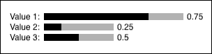
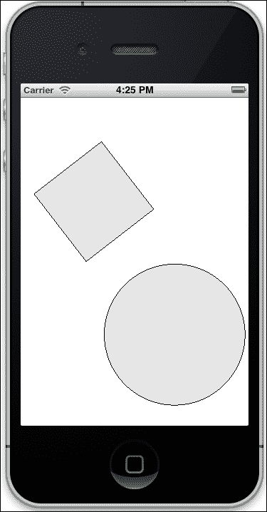

# 第十章。与用户交互

在这一章中，我们将学习如何接收和响应用户的输入。本章将涵盖以下菜谱：

+   创建一个对鼠标做出响应的交互式对象

+   将鼠标事件添加到我们的交互式对象中

+   创建一个滑块

+   创建一个响应式文本框

+   使用多点触控拖动、缩放和旋转对象

# 简介

在这一章中，我们将创建图形对象，它们通过鼠标和触摸交互来响应用户。我们将学习如何创建具有自己事件的简单图形界面，以获得更大的灵活性。

# 创建一个对鼠标做出响应的交互式对象

在这个菜谱中，我们将创建一个 `InteractiveObject` 类，用于制作与鼠标光标交互的图形对象，并执行以下操作：

| 动作 | 描述 |
| --- | --- |
| 按下 | 用户在对象上按下鼠标按钮。 |
| 在对象外按下 | 用户在对象外按下鼠标按钮。 |
| 释放 | 在对象上按下鼠标按钮后释放，鼠标仍在对象上。 |
| 在对象外释放 | 鼠标按钮在对象外被释放。 |
| 悬停 | 光标移至对象上。 |
| 移出 | 光标移出对象。 |
| 拖动 | 光标在对象上被拖动，并且在按下对象之后。 |

对于之前的每个操作，都会调用一个虚拟方法，这将改变绘制对象的颜色。

此对象可以用作基类，以创建具有更有趣图形的交互式对象，例如纹理。

## 准备工作

将以下文件创建并添加到您的项目中：

+   `InteractiveObject.h`

+   `InteractiveObject.cpp`

在包含您的应用程序类的源文件中，包含 `InteractiveObject.h` 文件并添加以下 `using` 语句：

```cpp
#include "InteractiveObject.h"
using namespace ci;
using namespace ci::app;
using namespace std;
```

## 如何操作…

我们将创建一个 `InteractiveObject` 类，并使其对鼠标事件做出响应。

1.  移动到文件 `InteractiveObject.h` 并添加 `#pragma once` 指令以及包含以下文件：

    ```cpp
    #pragma once

    #include "cinder/Rect.h"
    #include "cinder/Color.h"
    #include "cinder/app/MouseEvent.h"
    #include "cinder/gl/gl.h"
    #include "cinder/app/App.h"
    ```

1.  声明 `InteractiveObject` 类：

    ```cpp
    class InteractiveObject{
    public:
    InteractiveObject( const ci::Rectf& rect );
    virtual ~InteractiveObject();
    virtual void draw();
    virtual void pressed();
    virtual void pressedOutside();
    virtual void released();
    virtual void releasedOutside();
    virtual void rolledOver();
    virtual void rolledOut();
    virtual void dragged();
    void mouseDown( ci::app::MouseEvent& event );
    void mouseUp( ci::app::MouseEvent& event );
    void mouseDrag( ci::app::MouseEvent& event );
    void mouseMove( ci::app::MouseEvent& event );

    ci::Rectf rect;
    ci::Color pressedColor, idleColor, overColor, strokeColor;

    protected:
    bool mPressed, mOver;
    };
    ```

1.  继续到 `InteractiveObject.cpp` 文件，让我们首先包含 `InteractiveObject.h` 文件并添加以下 `using` 语句：

    ```cpp
    #include "InteractiveObject.h"

    using namespace ci;
    using namespace ci::app;
    using namespace std;
    ```

1.  让我们从实现 `构造函数` 和 `析构函数` 开始。

    ```cpp
    InteractiveObject::InteractiveObject( const Rectf& rect ){
      this->rect = rect;
      pressedColor = Color( 1.0f, 0.0f, 0.0f );
      idleColor = Color( 0.7f, 0.7f, 0.7f );
      overColor = Color( 1.0f, 1.0f, 1.0f );
      strokeColor = Color( 0.0f, 0.0f, 0.0f );
      mPressed = false;
      mOver = false;
    }

    InteractiveObject::~InteractiveObject(){    
    }
    ```

1.  在 `InteractiveObject::draw` 方法中，我们将使用适当的颜色绘制矩形：

    ```cpp
    void InteractiveObject::draw(){
     if( mPressed ){
      gl::color( pressedColor );
     } else if( mOver ){
      gl::color( overColor );
     } else {
      gl::color( idleColor );
     }
     gl::drawSolidRect( rect );
     gl::color( strokeColor );
     gl::drawStrokedRect( rect );
    }
    ```

1.  在 `pressed`、`released`、`rolledOver`、`rolledOut` 和 `dragged` 方法中，我们将简单地向控制台输出刚刚发生的动作：

    ```cpp
    void InteractiveObject::pressed(){
      console() << "pressed" << endl;
    }

    void InteractiveObject::pressedOutside(){
      console() << "pressed outside" << endl;
    }

    void InteractiveObject::released(){
      console() << "released" << endl;
    }

    void InteractiveObject::releasedOutside(){
      console() << "released outside" << endl;
    }

    void InteractiveObject::rolledOver(){
      console() << "rolled over" << endl;
    }

    void InteractiveObject::rolledOut(){
      console() << "rolled out" << endl;
    }

    void InteractiveObject::dragged(){
      console() << "dragged" << endl;
    }
    ```

1.  在鼠标事件处理程序中，我们将检查光标是否在对象内，并相应地更新 `mPressed` 和 `mOver` 变量。每次检测到动作时，我们也会调用相应的函数。

    ```cpp
    void InteractiveObject::mouseDown( MouseEvent& event ){
      if( rect.contains( event.getPos() ) ){
        mPressed = true;
        mOver = false;
        pressed();
      }else{
          pressedOutside();
      }
    }

    void InteractiveObject::mouseUp( MouseEvent& event ){
     if( rect.contains( event.getPos() ) ){
      if( mPressed ){
       mPressed = false;
       mOver = true;
       released();
      }
     } else {
      mPressed = false;
      mOver = false;
      releasedOutside();
     } 
    }

    void InteractiveObject::mouseDrag( MouseEvent& event ){
     if( mPressed && rect.contains( event.getPos() ) ){
      mPressed = true;
      mOver = false;
      dragged();
     } 
    }

    void InteractiveObject::mouseMove( MouseEvent& event ){
     if( rect.contains( event.getPos() ) ){
      if( mOver == false ){
       mPressed = false;
       mOver = true;
       rolledOver();
      }
     } else {
      if( mOver ){
       mPressed = false;
       mOver = false;
       rolledOut();
      } 
     }
    ```

1.  在我们的 `InteractiveObject` 类准备好之后，让我们转向应用程序的类源文件。让我们首先声明一个 `InteractiveObject` 对象。

    ```cpp
    shared_ptr<InteractiveObject> mObject;
    ```

1.  在 `setup` 方法中，我们将初始化 `mObject`。

    ```cpp
    Rectf rect( 100.0f, 100.0f, 300.0f, 300.0f );
    mObject = shared_ptr<InteractiveObject>( new InteractiveObject( rect ) );
    ```

1.  我们需要声明鼠标事件处理程序。

    ```cpp
    void mouseDown( MouseEvent event );	
    void mouseUp( MouseEvent event );
    void mouseDrag( MouseEvent event );
    void mouseMove( MouseEvent event );
    ```

1.  在前面方法的实现中，我们将简单地调用 `mObject` 的相应方法。

    ```cpp
    void MyApp::mouseDown( MouseEvent event ){
      mObject->mouseDown( event );
    }

    void MyApp::mouseUp( MouseEvent event ){
      mObject->mouseUp( event );
    }

    void MyApp::mouseDrag( MouseEvent event ){
      mObject->mouseDrag( event );
    }

    void MyApp::mouseMove( MouseEvent event ){
      mObject->mouseMove( event );
    }
    ```

1.  在 `draw` 方法的实现中，我们将用黑色清除背景并调用 `mObject` 的 `draw` 方法。

    ```cpp
    gl::clear( Color( 0, 0, 0 ) ); 
    mObject->draw();
    ```

1.  现在构建并运行应用程序。使用鼠标与对象进行交互。无论何时按下、释放、悬停或移出对象，都会向控制台发送一条消息，指示行为。

## 它是如何工作的…

`InteractiveObject` 类应作为交互对象的基类使用。`pressed`、`released`、`rolledOver`、`rolledOut` 和 `dragged` 方法是专门设计为可重写的。

`InteractiveObject` 的鼠标处理程序在检测到动作时调用前面的方法。通过重写这些方法，可以实现特定的行为。

虚拟析构函数被声明，以便扩展类可以有自己的析构函数。

# 将鼠标事件添加到我们的交互对象中

在这个菜谱中，我们将继续使用之前的菜谱，*创建一个响应鼠标的交互对象*，并将鼠标事件添加到我们的 `InteractiveObject` 类中，以便其他对象可以注册并在鼠标事件发生时接收通知。

## 准备工作

从菜谱 *创建一个响应鼠标的交互对象* 中获取代码并将其添加到你的项目中，因为我们将继续使用之前创建的内容。

## 如何操作…

我们将使 `InteractiveObject` 类在与其光标交互时发送自己的事件。

1.  让我们创建一个类，用作发送事件时的参数。在 `InteractiveObject.h` 文件中 `InteractiveObject` 类声明之前添加以下代码：

    ```cpp
    class InteractiveObject;
    class InteractiveObjectEvent: public ci::app::Event{
    public:
    enum EventType{ Pressed, PressedOutside, Released,
     ReleasedOutside, RolledOut, RolledOver, Dragged };
    InteractiveObjectEvent( InteractiveObject *sender, 
     EventType type ){
     this->sender = sender;
     this->type = type;
    }

    InteractiveObject *sender;
    EventType type;
    };
    ```

1.  在 `InteractiveObject` 类中，我们需要声明一个成员，使用 `ci::CallbakcMgr` 类来管理已注册的对象。将以下代码声明为受保护的成员：

    ```cpp
    ci::CallbackMgr< void(InteractiveObjectEvent) > mEvents;
    ```

1.  现在，我们需要添加一个方法，以便其他对象可以注册以接收事件。由于该方法将使用模板，我们将在 `InteraciveObject.h` 文件中声明和实现它。添加以下成员方法：

    ```cpp
    template< class T >
    ci::CallbackId addListener( T* listener, 
     void (T::*callback)(InteractiveObjectEvent) ){
     return mEvents.registerCb( std::bind1st( 
      std::mem_fun( callback ), listener ) );
    }
    ```

1.  让我们再创建一个方法，以便对象可以注销以停止接收进一步的事件。声明以下方法：

    ```cpp
    void removeListener( ci::CallbackId callId );
    ```

1.  让我们实现 `removeListener` 方法。在 `InteractiveObject.cpp` 文件中添加以下代码：

    ```cpp
    void InteractiveObject::removeListener( CallbackId callbackId ){
      mEvents.unregisterCb( callbackId );
    }
    ```

1.  修改 `mouseDown`、`mouseUp`、`mouseDrag` 和 `mouseMove` 方法，以便在发生任何事件时调用 `mEvents`。这些方法的实现应如下所示：

    ```cpp
    void InteractiveObject::mouseDown( MouseEvent& event ){
     if( rect.contains( event.getPos() ) ){
      mPressed = true;
      mOver = false;
      pressed();
      mEvents.call( InteractiveObjectEvent( this,
       InteractiveObjectEvent::Pressed ) );
     } else {
      pressedOutside();
      mEvents.call( InteractiveObjectEvent( this, 
       InteractiveObjectEvent::PressedOutside ) );
     } 
    }

    void InteractiveObject::mouseUp( MouseEvent& event ){
     if( rect.contains( event.getPos() ) ){
      if( mPressed ){
       mPressed = false;
       mOver = true;
       released();
       mEvents.call( InteractiveObjectEvent( this, 
        InteractiveObjectEvent::Released ) );
      }
     } else {
      mPressed = false;
      mOver = false;
      releasedOutside();
      mEvents.call( InteractiveObjectEvent( this, 
       InteractiveObjectEvent::ReleasedOutside ) );
     } 
    }

    void InteractiveObject::mouseDrag( MouseEvent& event ){
     if( mPressed && rect.contains( event.getPos() ) ){
      mPressed = true;
      mOver = false;

      dragged();
      mEvents.call( InteractiveObjectEvent( this,
      InteractiveObjectEvent::Dragged ) );
     }
    }

    void InteractiveObject::mouseMove( MouseEvent& event ){
     if( rect.contains( event.getPos() ) ){
      if( mOver == false ){
       mPressed = false;
       mOver = true;
       rolledOver();
       mEvents.call( InteractiveObjectEvent( this, 
        InteractiveObjectEvent::RolledOver ) );
      }
     } else {
      if( mOver ){
       mPressed = false;
       mOver = false;
       rolledOut();
       mEvents.call( InteractiveObjectEvent( this, 
        InteractiveObjectEvent::RolledOut ) );
      }
     }
    }
    ```

1.  在我们的 `InteractiveObject` 类准备好之后，我们需要将我们的应用程序类注册以接收其事件。在你的应用程序类声明中添加以下方法：

    ```cpp
    void receivedEvent( InteractiveObjectEvent event );
    ```

1.  让我们实现 `receivedEvent` 方法。我们将检查接收到的事件类型，并将消息打印到控制台。

    ```cpp
    void MyApp::receivedEvent( InteractiveObjectEvent event ){
    string text;
    switch( event.type ){
    case InteractiveObjectEvent::Pressed:
    text = "Pressed event";
    break;
    case InteractiveObjectEvent::PressedOutside:
    text = "Pressed outside event";
    break;
    case InteractiveObjectEvent::Released:
    text = "Released event";
    break;
    case InteractiveObjectEvent::ReleasedOutside:
    text = "Released outside event";
    break;
    case InteractiveObjectEvent::RolledOver:
    text = "RolledOver event";
    break;
    case InteractiveObjectEvent::RolledOut:
    text = "RolledOut event";
    break;
    case InteractiveObjectEvent::Dragged:
    text = "Dragged event";
    break;
    default:
    text = "Unknown event";      
        }
    console() << "Received " + text << endl;
    }
    ```

1.  剩下的只是注册事件。在 `setup` 方法中，在 `mObject` 初始化后添加以下代码：

    ```cpp
    mObject->addListener( this, &InteractiveObjectApp::receivedEvent );
    ```

1.  现在构建并运行应用程序，并使用鼠标与窗口上的矩形进行交互。每当在 `mObject` 上发生鼠标事件时，我们的方法 `receivedEvent` 将被调用。

## 它是如何工作的...

我们正在使用模板类 `ci::CallbakMgr` 来管理我们的事件监听器。这个类接受一个模板，其中包含可以注册的方法的签名。在我们的前一个代码中，我们声明 `mEvents` 为 `ci::CallbakcMgr<void(InteractiveObjectEvent)>;` 类型，这意味着只有返回 `void` 并接收 `InteractiveObejctEvent` 作为参数的方法可以被注册。

模板方法 `registerEvent` 将接受一个对象指针和方法指针。这些通过 `std::bind1st` 绑定到 `std::function` 并添加到 `mEvents` 中。该方法将返回一个 `ci::CallbackId`，用于标识监听器。`ci::CallbackId` 可以用来注销监听器。

## 更多内容...

`InteractiveObject` 类对于创建用户界面非常有用。如果我们想使用三个纹理（用于显示按下、悬停和空闲状态）创建一个 `Button` 类，我们可以这样做：

1.  包含 `InteractiveObject.h` 和 `cinder/gl/texture.h` 文件：

    ```cpp
    #include "InteractiveObject.h"
    #include "cinder/gl/Texture.h"
    ```

1.  声明以下类：

    ```cpp
    class Button: public InteractiveObject{
    public:
    Button( const ci::Rectf& rect, ci::gl::Texture idleTex, 
     ci::gl::Texture overTex, ci::gl::Texture pressTex)
    :InteractiveObject( rect )
    {
     mIdleTex = idleTex;
     mOverTex = overTex;
     mPressTex = pressTex;
    }

    virtual void draw(){
     if( mPressed ){
      ci::gl::draw( mPressTex, rect );
     } else if( mOver ){
      ci::gl::draw( mOverTex, rect );
     } else {
      ci::gl::draw( mPressTex, rect );
     }
    }

    protected:
    ci::gl::Texture mIdleTex, mOverTex, mPressTex;
    };
    ```

# 创建滑块

在这个菜谱中，我们将学习如何通过扩展本章中提到的 *创建一个响应鼠标的交互对象* 菜谱中的 `InteractiveObject` 类来创建滑块 UI 元素。



## 准备工作

请参考 *创建一个响应鼠标的交互对象* 菜谱以找到 `InteractiveObject` 类的头文件和源代码。

## 如何实现...

我们将创建一个 `Slider` 类，并展示如何使用它。

1.  将一个名为 `Slider.h` 的新头文件添加到你的项目中：

    ```cpp
    #pragma once

    #include "cinder/gl/gl.h"
    #include "cinder/Color.h"

    #include "InteractiveObject.h"

    using namespace std;
    using namespace ci;
    using namespace ci::app;

    class Slider : publicInteractiveObject {
    public:
    Slider( ) : InteractiveObject( Rectf(0,0, 100,10) ) {
     mValue = 0.f;
    }
    Vec2f   getPosition() { return rect.getUpperLeft(); }
    void    setPosition(Vec2f position) { rect.offset(position); }
    void    setPosition(float x, float y) { setPosition(Vec2f(x,y)); }
    float   getWidth() { return getSize().x; }
    float   getHeight() { return getSize().y; }
    Vec2f   getSize() { return rect.getSize(); }
    void    setSize(Vec2f size) { 
     rect.x2 = rect.x1+size.x; rect.y2 = rect.y1+size.y; 
    }
    void    setSize(float width, float height) { 
     setSize(Vec2f(width,height)); 
    }
    virtual float getValue() { return mValue; }
    virtual void setValue(float value) {
     mValue = ci::math<float>::clamp(value);
    }

    virtual void pressed() {
     InteractiveObject::pressed();
     dragged();
    }

    virtual void dragged() {
     InteractiveObject::dragged();
     Vec2i mousePos = AppNative::get()->getMousePos();
     setValue( (mousePos.x - rect.x1) / rect.getWidth() );
    }

    virtual void draw() {
     gl::color(Color::gray(0.7f));
     gl::drawSolidRect(rect);
     gl::color(Color::black());
     Rectf fillRect = Rectf(rect);
     fillRect.x2 = fillRect.x1 + fillRect.getWidth() * mValue;
     gl::drawSolidRect( fillRect );
    }

    protected:
    float mValue;
    };
    ```

1.  在你的主应用程序类的源文件中包含之前创建的头文件：

    ```cpp
    #include "Slider.h"
    ```

1.  将新属性添加到你的主类中：

    ```cpp
    shared_ptr<Slider> mSlider1;
    shared_ptr<Slider> mSlider2;
    shared_ptr<Slider> mSlider3;
    ```

1.  在 `setup` 方法中初始化 `slider` 对象：

    ```cpp
    mSlider1 = shared_ptr<Slider>( new Slider() );
    mSlider1->setPosition(70.f, 20.f);
    mSlider1->setSize(200.f, 10.f);
    mSlider1->setValue(0.75f);

    mSlider2 = shared_ptr<Slider>( new Slider() );
    mSlider2->setPosition(70.f, 35.f);
    mSlider2->setValue(0.25f);

    mSlider3 = shared_ptr<Slider>( new Slider() );
    mSlider3->setPosition(70.f, 50.f);
    mSlider3->setValue(0.5f);
    ```

1.  在你的 `draw` 方法中添加以下代码来绘制滑块：

    ```cpp
    gl::enableAlphaBlending();
    gl::clear( Color::white() );
    gl::setViewport(getWindowBounds());
    gl::setMatricesWindow(getWindowSize());

    mSlider1->draw();
    gl::drawStringRight("Value 1:", mSlider1->getPosition()+Vec2f(-5.f, 3.f), Color::black());
    gl::drawString(toString(mSlider1->getValue()), mSlider1->getPosition()+Vec2f(mSlider1->getWidth()+5.f, 3.f), Color::black());

    mSlider2->draw();
    gl::drawStringRight("Value 2:", mSlider2->getPosition()+Vec2f(-5.f, 3.f), Color::black());
    gl::drawString(toString(mSlider2->getValue()), mSlider2->getPosition()+Vec2f(mSlider2->getWidth()+5.f, 3.f), Color::black());

    mSlider3->draw();
    gl::drawStringRight("Value 3:", mSlider3->getPosition()+Vec2f(-5.f, 3.f), Color::black());
    gl::drawString(toString(mSlider3->getValue()), mSlider3->getPosition()+Vec2f(mSlider3->getWidth()+5.f, 3.f), Color::black());
    ```

## 它是如何工作的...

我们通过继承和重写 `InteractiveObject` 类的方法和属性创建了 `Slider` 类。在第 1 步中，我们扩展了它，添加了控制 `slider` 对象位置和尺寸的方法。`getValue` 和 `setValue` 方法可以用来检索或设置 `slider` 的实际状态，其值可以从 `0` 变化到 `1`。

在第 4 步中，你可以找到通过设置初始位置、大小和值来初始化示例滑块的代码，这些值是在创建 `Slider` 对象后立即设置的。我们正在绘制示例滑块，包括标题和当前状态的信息。

## 相关内容

+   菜谱 *创建一个响应鼠标的交互对象*。

+   菜谱 *使用多点触控拖动、缩放和旋转对象*。

# 创建一个响应式文本框

在这个菜谱中，我们将学习如何创建一个响应用户按键的文本框。当鼠标悬停在其上时，它将是活动的，当鼠标在框外释放时，它将是非活动的。

## 准备工作

从菜谱 *创建一个响应鼠标的交互对象* 中获取以下文件并将其添加到你的项目中：

+   `InteractiveObject.h`

+   `InteractiveObject.cpp`

创建并添加以下文件到你的项目中：

+   `InteractiveTextBox.h`

+   `InteractiveTextBox.cpp`

## 如何操作…

我们将创建一个继承自 `InteractiveObject` 并添加文本功能的 `InteractiveTextBox` 类。

1.  转到文件 `InteractiveTextBox.h` 并添加 `#pragma once` 宏，包含必要的文件。

    ```cpp
    #pragma once

    #include "InteractiveObject.h"
    #include "cinder/Text.h"
    #include "cinder/gl/Texture.h"
    #include "cinder/app/KeyEvent.h"
    #include "cinder/app/AppBasic.h"
    ```

1.  现在声明 `InteractiveTextBox` 类，使其成为 `InteractiveObject` 的子类，并具有以下成员和方法：

    ```cpp
    class InteractiveTextBox: public InteractiveObject{
    public:
        InteractiveTextBox( const ci::Rectf& rect );

        virtual void draw();
        virtual void pressed();
        virtual void releasedOutside();

        void keyDown( ci::app::KeyEvent& event );
        protected:
            ci::TextBox mTextBox;
        std::string mText;
        bool mActive;
        bool mFirstText;
    };
    ```

1.  现在转到 `InteractiveTextBox.cpp` 文件，包含 `InteractiveTextBox.h` 文件，并添加以下 `using` 语句：

    ```cpp
    #include "InteractiveTextBox.h"

    using namespace std;
    using namespace ci;
    using namespace ci::app;
    ```

1.  现在让我们通过初始化父类和设置内部的 `ci::TextBox` 来实现构造函数。

    ```cpp
    InteractiveTextBox::InteractiveTextBox( const Rectf& rect ):
    InteractiveObject( rect )
    {
      mActive = false;
      mText = "Write some text";
      mTextBox.setText( mText );
      mTextBox.setFont( Font( "Arial", 24 ) );
      mTextBox.setPremultiplied( true );
      mTextBox.setSize( Vec2i( rect.getWidth(), rect.getHeight() ) );
      mTextBox.setBackgroundColor( Color::white() );
      mTextBox.setColor( Color::black() );
      mFirstText = true;
    }
    ```

1.  在 `InteractiveTextBox::draw` 方法中，我们将根据 `mTextBox` 是否处于活动状态来设置其背景颜色。我们还将 `mTextBox` 渲染到 `ci::gl::Texture` 中并绘制它。

    ```cpp
    void InteractiveTextBox::draw(){
     if( mActive ){
      mTextBox.setBackgroundColor( Color( 0.7f, 0.7f, 1.0f ) );
     } else {
      mTextBox.setBackgroundColor( Color::white() );
     }
     gl::color( Color::white() );
     gl::Texture texture = mTextBox.render();
     gl::draw( texture, rect );
    }
    ```

1.  现在让我们实现重写的 `pressed` 和 `releasedOutside` 方法来定义 `mActive` 的值。

    ```cpp
    void InteractiveTextBox::pressed(){
      mActive = true;
    }

    void InteractiveTextBox::releasedOutside(){
      mActive = false;
    }
    ```

1.  最后，我们需要实现 `keyPressed` 方法。

    如果 `mActive` 为假，此方法将直接返回。否则，如果释放的键是 *退格* 键，我们将从 `mText` 中删除最后一个字母，或者，如果按下了其他任何键，我们将添加相应的字母。

    ```cpp
    void InteractiveTextBox::keyDown( KeyEvent& event ){
     if( mActive == false ) return;
     if( mFirstText ){
      mText = "";
      mFirstText = false;
    ```

    ```cpp
     }
     if( event.getCode() == KeyEvent::KEY_BACKSPACE ){
      if( mText.size() > 0 ){
       mText = mText.substr( 0, mText.size()-1 );
      }
     } else {
      const char character = event.getChar();
      mText += string( &character, 1 );
     }
     mTextBox.setText( mText );
    }
    ```

1.  现在转到你的应用程序类源文件，包含以下文件和 `using` 语句：

    ```cpp
    #include "InteractiveTextBox.h"

    using namespace ci;
    using namespace ci::app;
    using namespace std;
    ```

1.  在你的应用程序类中声明以下成员：

    ```cpp
    shared_ptr<InteractiveTextBox> mTextBox;
    ```

1.  让我们在 `setup` 方法中初始化 `mTextBox`：

    ```cpp
    Rectf rect( 100.0f, 100.0f, 300.0f, 200.0f );
    mTextBox = shared_ptr<InteractiveTextBox>( new InteractiveTextBox( rect ) );
    ```

1.  在 `draw` 方法中，我们将用黑色清除背景，启用 `AlphaBlending`，并绘制我们的 `mTextBox`：

    ```cpp
      gl::enableAlphaBlending();
      gl::clear( Color( 0, 0, 0 ) );
      mTextBox->draw();
    ```

1.  我们现在需要声明以下鼠标事件处理器：

    ```cpp
    void mouseDown( MouseEvent event );
    void mouseUp( MouseEvent event );
    void mouseDrag( MouseEvent event );
    void mouseMove( MouseEvent event );
    ```

1.  并通过调用 `mTextBox` 的相应鼠标事件处理器来实现它们：

    ```cpp
    void MyApp::mouseDown( MouseEvent event ){
      mTextBox->mouseDown( event );
    }

    void MyApp::mouseUp( MouseEvent event ){
      mTextBox->mouseUp( event );
    }

    void MyApp::mouseDrag( MouseEvent event ){
      mTextBox->mouseDrag( event );
    }

    void MyApp::mouseMove( MouseEvent event ){
      mTextBox->mouseMove( event );
    }
    ```

1.  现在我们只需要对键释放事件处理器做同样的处理。首先声明它：

    ```cpp
    void keyDown( KeyEvent event );
    ```

1.  在其实现中，我们将调用 `mTextBox` 的 `keyUp` 方法。

    ```cpp
    void InteractiveObjectApp::keyDown( KeyEvent event ){
      mTextBox->keyDown( event );
    }
    ```

1.  现在构建并运行应用程序。你会看到一个带有短语 **Write some text** 的白色文本框。按下文本框并输入一些文本。点击文本框外以将文本框设置为非活动状态。

## 它是如何工作的…

内部，我们的 `InteractiveTextBox` 使用一个 `ci::TextBox` 对象。这个类管理一个具有指定宽度和高度的框内的文本。我们利用这一点，根据用户按下的键更新文本。

# 使用多点触控拖动、缩放和旋转对象

在本食谱中，我们将学习如何通过扩展本章中提到的 *创建一个对鼠标做出响应的交互对象* 食谱中提到的 `InteractiveObject` 类来创建负责多指手势的对象，例如拖动、缩放或旋转。我们将构建一个使用 iOS 设备多指功能的 iOS 应用程序。



## 准备工作

请参考 *创建一个对鼠标做出响应的交互对象* 食谱以找到 `InteractiveObject` 类的头文件和源代码，以及从 第一章 中创建 iOS 触摸应用程序项目的食谱。

## 如何操作…

我们将创建一个带有示例对象的 iPhone 应用程序，这些对象可以被拖动、缩放或旋转。

1.  向你的项目添加一个名为 `TouchInteractiveObject.h` 的新头文件：

    ```cpp
    #pragma once

    #include "cinder/app/AppNative.h"
    #include "cinder/gl/gl.h"
    #include "cinder/Color.h"

    #include "InteractiveObject.h"

    using namespace std;
    using namespace ci;
    using namespace ci::app;

    class TouchInteractiveObject : public InteractiveObject {
    public:
    TouchInteractiveObject( const Vec2f& position, 
     const Vec2f& size );
    bool    touchesBegan(TouchEvent event);
    bool    touchesMoved(TouchEvent event);
    bool    touchesEnded(TouchEvent event);
    Vec2f   getPosition() { return position; }
    void    setPosition(Vec2f position) { this->position = position; }
    void    setPosition(float x, float y) { setPosition(Vec2f(x,y)); }
    float   getWidth() { return getSize().x; }
    float   getHeight() { return getSize().y; }
    Vec2f   getSize() { return rect.getSize(); }
    void    setSize(Vec2f size) { 
     size.x = max(30.f,size.x); 
     size.y = max(30.f,size.y); 
     rect = Rectf(getPosition()-size*0.5f,getPosition()+size*0.5f);
    }
    void    setSize(float width, float height) {
     setSize(Vec2f(width,height)); 
    }
    float   getRotation() { return rotation; }
    void    setRotation( float rotation ) { 
     this->rotation = rotation;
    }
    virtual void draw();

    protected:
    Vec2f   position;
    float   rotation;
    bool    scaling;

    unsigned int    dragTouchId;
    unsigned int    scaleTouchId;
    };
    ```

1.  向你的项目添加一个名为 `TouchInteractiveObject.cpp` 的新源文件，并通过添加以下代码行包含之前创建的头文件：

    ```cpp
    #include "TouchInteractiveObject.h"
    ```

1.  实现 `TouchInteractiveObject` 的构造函数：

    ```cpp
    TouchInteractiveObject::TouchInteractiveObject( 
     const Vec2f& position, const Vec2f& size )
      : InteractiveObject( Rectf() )
    {
     scaling = false;
     rotation = 0.f;
     setPosition(position);
     setSize(size);
     AppNative::get()->registerTouchesBegan(this, 
      &TouchInteractiveObject::touchesBegan);
     AppNative::get()->registerTouchesMoved(this, 
      &TouchInteractiveObject::touchesMoved);
     AppNative::get()->registerTouchesEnded(this, 
      &TouchInteractiveObject::touchesEnded);
    }
    ```

1.  实现触摸事件的处理程序：

    ```cpp
    bool TouchInteractiveObject::touchesBegan(TouchEvent event)
    ```

    ```cpp
    {
     Vec2f bVec1 = getSize()*0.5f;
     Vec2f bVec2 = Vec2f(getWidth()*0.5f, -getHeight()*0.5f);
     bVec1.rotate((rotation) * (M_PI/180.f));
     bVec2.rotate((rotation) * (M_PI/180.f));
     Vec2f bVec;
     bVec.x = math<float>::max( abs(bVec1.x), abs(bVec2.x));
     bVec.y = math<float>::max( abs(bVec1.y), abs(bVec2.y));
     Area activeArea = Area(position-bVec, position+bVec);
     for (vector<TouchEvent::Touch>::const_iterator it 
       = event.getTouches().begin(); 
       it != event.getTouches().end(); ++it) {
      if(activeArea.contains( it->getPos() )) {
       if(mPressed) {
        scaling = true;
        scaleTouchId = it->getId();
       } else {
        mPressed = true;
        dragTouchId = it->getId();
       }
      } 
     }
     return false;
    }

    bool TouchInteractiveObject::touchesMoved(TouchEvent event)
    {
     if(!mPressed) return false;
     const TouchEvent::Touch* dragTouch;
     const TouchEvent::Touch* scaleTouch;
     for (vector<TouchEvent::Touch>::const_iterator it 
       = event.getTouches().begin(); 
       it != event.getTouches().end(); ++it) {
      if (scaling && scaleTouchId == it->getId()) {
       scaleTouch = &(*it);
      }
      if(dragTouchId == it->getId()) {
       dragTouch = &(*it);
      }
     }
     if(scaling) {
      Vec2f prevPos = (dragTouch->getPrevPos() 
       + scaleTouch->getPrevPos()) * 0.5f;
      Vec2f curPos = (dragTouch->getPos() 
       + scaleTouch->getPos())*0.5f;
      setPosition(getPosition() + curPos - prevPos);
      Vec2f prevVec = dragTouch->getPrevPos() 
       - scaleTouch->getPrevPos();
      Vec2f curVec = dragTouch->getPos() - scaleTouch->getPos();

      float scaleFactor = (curVec.length() - prevVec.length()) 
       / prevVec.length();
      float sizeFactor = prevVec.length() / getSize().length();
      setSize(getSize() + getSize() * sizeFactor * scaleFactor);

      float angleDif = atan2(curVec.x, curVec.y) 
       - atan2(prevVec.x, prevVec.y);
      rotation += -angleDif * (180.f/M_PI);
     } else {
      setPosition(getPosition() + dragTouch->getPos() 
       - dragTouch->getPrevPos() );
     }
     return false;
    }

    bool TouchInteractiveObject::touchesEnded(TouchEvent event)
    {
     if(!mPressed) return false;
     for (vector<TouchEvent::Touch>::const_iterator it 
       = event.getTouches().begin(); 
       it != event.getTouches().end(); ++it) {
      if(dragTouchId == it->getId()) {
       mPressed = false;
       scaling = false;
      }
      if(scaleTouchId == it->getId()) {
       scaling = false;
      } 
     }
     return false;
    }
    ```

1.  现在，为 `TouchInteractiveObjects` 实现基本的 `draw` 方法：

    ```cpp
    void TouchInteractiveObject::draw() {
     Rectf locRect = Rectf(Vec2f::zero(), getSize());
     gl::pushMatrices();
     gl::translate(getPosition());
     gl::rotate(getRotation());
     gl::pushMatrices();
     gl::translate(-getSize()*0.5f);
     gl::color(Color::gray( mPressed ? 0.6f : 0.9f ));
     gl::drawSolidRect(locRect);
     gl::color(Color::black());
     gl::drawStrokedRect(locRect);
     gl::popMatrices();
     gl::popMatrices();
    }
    ```

1.  这里是继承 `TouchInteractiveObject` 所有功能并重写 `draw` 方法的类，在这种情况下，我们希望我们的交互对象是一个圆形。将以下类定义添加到你的主源文件中：

    ```cpp
    class Circle : publicTouchInteractiveObject {
    public:
     Circle(const Vec2f& position, const Vec2f& size)
       : TouchInteractiv eObject(position, size) {}

     virtual void draw() {
      gl::color(Color::gray( mPressed ? 0.6f : 0.9f ));
      gl::drawSolidEllipse(getPosition(), 
       getSize().x*0.5f, getSize().y*0.5f);
      gl::color(Color::black());
      gl::drawStrokedEllipse(getPosition(), 
       getSize().x*0.5f, getSize().y*0.5f);
     } 
    };
    ```

1.  现在看看你的主应用程序类文件。包含必要的头文件：

    ```cpp
    #include "cinder/app/AppNative.h"
    #include "cinder/Camera.h"
    #include "cinder/Rand.h"

    #include "TouchInteractiveObject.h"
    ```

1.  添加 `typedef` 声明：

    ```cpp
    typedef shared_ptr<TouchInteractiveObject> tio_ptr;
    ```

1.  向你的应用程序类添加成员以处理对象：

    ```cpp
    tio_ptr mObj1;
    tio_ptr mCircle;
    ```

1.  在 `setup` 方法中初始化对象：

    ```cpp
    mObj1 = tio_ptr( new TouchInteractiveObject(getRandPos(), Vec2f(100.f,100.f)) );
    mCircle = tio_ptr( new Circle(getRandPos(), Vec2f(100.f,100.f)) );
    ```

1.  `draw` 方法很简单，如下所示：

    ```cpp
    gl::setMatricesWindow(getWindowSize());
    gl::clear( Color::white() );
    mObj1->draw();
    mCircle->draw();
    ```

1.  正如你在 `setup` 方法中看到的，我们使用了 `getRandPos` 函数，该函数返回屏幕边界内带有一些边距的随机位置：

    ```cpp
    Vec2f MainApp::getRandPos()
    {
      return Vec2f( randFloat(30.f, getWindowWidth()-30.f),  randFloat(30.f, getWindowHeight()-30.f));
    }
    ```

## 它是如何工作的…

我们通过继承和重写 `InteractiveObject` 的方法和属性创建了 `TouchInteractiveObject` 类。我们还通过控制位置和尺寸的方法扩展了它。

在步骤 3 中，我们初始化属性并注册触摸事件的回调。下一步是实现这些回调。在 `touchesBegan` 事件中，我们检查对象是否被任何新的触摸所接触，但所有关于移动和手势的计算都在 `touchesMoved` 事件期间发生。

在步骤 6 中，你可以看到通过重写 `draw` 方法，如何简单地更改外观并保留 `TouchInteractiveObject` 的所有交互功能。

## 还有更多…

你可能会注意到一个问题，即当你拖动多个对象时，它们是重叠的。为了解决这个问题，我们将添加一个简单的对象激活管理器。

1.  在你的 Cinder 应用程序中添加一个新的类定义：

    ```cpp
    class ObjectsManager {
    public:
        ObjectsManager() { }

        void addObject( tio_ptr obj) {
            objects.push_front(obj);
        }

        void update() {
            bool rel = false;
            deque<tio_ptr>::const_iterator it;
            for(it = objects.begin(); it != objects.end(); ++it) {
                if( rel ) 
                    (*it)->release();
                else if( (*it)->isActive() )
                    rel = true;
            }
        }

    protected:
        deque<tio_ptr> objects;
    };
    ```

1.  向你的应用程序的主类添加一个新的成员：

    ```cpp
    shared_ptr<ObjectsManager> mObjMgr;
    ```

1.  在`setup`方法的末尾初始化`mObjMgr`，这是对象的管理器，并添加之前初始化的交互对象：

    ```cpp
    mObjMgr = shared_ptr<ObjectsManager>( new ObjectsManager() );
    mObjMgr->addObject( mObj1 );
    mObjMgr->addObject( mCircle );
    ```

1.  按照以下方式将`update`方法添加到你的主类中：

    ```cpp
    void MainApp::update()
    {
        mObjMgr->update();
    }
    ```

1.  向`TouchInteractiveObject`类添加两个新方法：

    ```cpp
    bool    isActive() { return mPressed; }
    void    release() { mPressed = false; }
    ```
