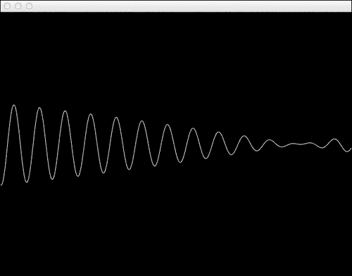
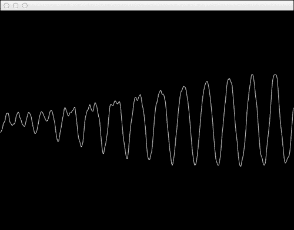
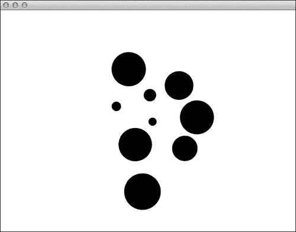
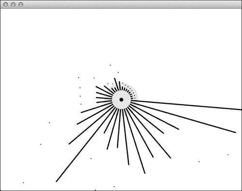
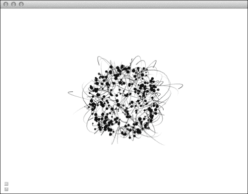

# 第十二章。使用音频输入和输出

在本章中，我们将通过物理模拟驱动声音生成的示例来学习如何生成声音。我们还将展示使用音频反应动画可视化声音的示例。

以下食谱将涵盖：

+   生成正弦振荡器

+   使用频率调制生成声音

+   添加延迟效果

+   在物体碰撞时生成声音

+   可视化 FFT

+   制作声音反应粒子

# 生成正弦振荡器

在本食谱中，我们将学习如何通过操纵声卡的 **PCM** （**脉冲编码调制**）音频缓冲区来生成正弦波振荡器。正弦波的频率将由鼠标的 y 坐标定义。

我们还将绘制正弦波以进行可视化表示。

## 准备工作

包含以下文件：

```cpp
#include "cinder/audio/Output.h"
#include "cinder/audio/Callback.h"
#include "cinder/Rand.h"
#include "cinder/CinderMath.h"
```

并添加以下有用的 `using` 语句：

```cpp
using namespace ci;
using namespace ci::app;
using namespace std;
```

## 如何操作…

我们将按照以下步骤创建正弦波振荡器：

1.  声明以下成员变量和回调方法：

    ```cpp
    void audioCallback( uint64_t inSampleOffset, uint32_t ioSampleCount, audio::Buffer32f *buffer );
    float mFrequency;
    float mPhase, mPhaseAdd;
    vector<float> mOutput;
    ```

1.  在 `setup` 模块中，我们将初始化变量并使用以下代码创建音频回调：

    ```cpp
    mFrequency = 0.0f;
    mPhase = 0.0f;
    mPhaseAdd = 0.0f;
    audio::Output::play( audio::createCallback( this, &SineApp::audioCallback ) );
    ```

1.  在 `update` 模块中，我们将根据鼠标的 `y` 位置更新 `mFrequency`。鼠标的位置将被映射并夹在 `0` 和 `5000` 之间的频率值：

    ```cpp
    float maxFrequency = 5000.0f;
    float targetFrequency = ( getMousePos().y / (float)getWindowHeight() ) * maxFrequency;
    mFrequency = math<float>::clamp( targetFrequency, 0.0f, maxFrequency );
    ```

    让我们实现音频回调。我们首先根据需要调整 `mOutput` 的大小。然后我们将计算并插值 `mPhaseAdd`，接着遍历音频缓冲区中的所有值，并根据 `mPhase` 的正弦值计算它们的值，并将 `mPhaseAdd` 添加到 `mPhase`：

    ```cpp
    if( mOutput.size() != ioSampleCount ){
     mOutput.resize( ioSampleCount );
    }
    int numChannels = buffer->mNumberChannels;
    mPhaseAdd += ( ( mFrequency / 44100.0f ) - mPhaseAdd ) * 0.1f;
    for( int i=0; i<ioSampleCount; i++ ){
     mPhase += mPhaseAdd;
     float output = math<float>::sin( mPhase * 2.0f * M_PI );
     for( int j=0; j<numChannels; j++ ){
      buffer->mData[ i*numChannels + j ] = output;
     }
     mOutput[i] = output;
    }
    ```

1.  最后，我们需要绘制正弦波。在 `draw` 方法中，我们将用黑色清除背景，并使用存储在 `mOutput` 中的值绘制放大后的正弦波，使用线条条带：

    ```cpp
    gl::clear( Color( 0, 0, 0 ) );
    if( mOutput.size() > 0 ){
     Vec2f scale;
     scale.x = (float)getWindowWidth() / (float)mOutput.size();
     scale.y = 100.0f;
     float centerY= getWindowHeight() / 2.0f;
     gl::begin( GL_LINE_STRIP );
     for( int i=0; i<mOutput.size(); i++ ){
      float x = (float)i * scale.x;
      float y = mOutput[i] * scale.y + centerY;
      gl::vertex( x,  y );
     } 
     gl::end();
    }
    ```

1.  构建并运行应用程序。垂直移动鼠标以更改频率。以下屏幕截图显示了表示生成的正弦波的线条：

## 它是如何工作的…

我们正在操作 PCM 缓冲区。PCM 是一种通过在固定间隔内对值进行采样来表示音频的方法。通过访问 PCM 缓冲区，我们可以直接操纵声卡将输出的音频信号。

每当调用 `audioCallback` 方法时，我们都会收到 PCM 缓冲区的一个样本，其中我们计算生成连续正弦波所需的值。

在 `update` 模块中，我们通过映射鼠标的 `y` 位置来计算频率。

在 `audioCallback` 实现的以下行中，我们根据 `44100` 的采样率计算 `mPhase` 需要增加多少以生成频率为 `mFrequency` 的波：

```cpp
mPhaseAdd += ( ( mFrequency / 44100.0f ) - mPhaseAdd ) * 0.1f;
```

# 使用频率调制生成声音

在本食谱中，我们将学习如何使用另一个低频正弦波来调制正弦波振荡器。

我们将基于前一个菜谱，其中鼠标的 `y` 位置控制正弦波的频率；在这个菜谱中，我们将使用鼠标的 `x` 位置来控制调制频率。

## 准备工作

我们将使用前一个菜谱中的代码，*生成正弦振荡器*。

## 如何做…

我们将使用前一个菜谱中创建的正弦波与另一个低频正弦波相乘。

1.  添加以下成员变量：

    ```cpp
    float mModFrequency;
    float mModPhase, mModPhaseAdd;
    ```

1.  在 `setup` 模块中添加以下内容以初始化之前创建的变量：

    ```cpp
    mModFrequency = 0.0f;
    mModPhase = 0.0f;
    mModPhaseAdd = 0.0f;
    ```

1.  在 `update` 模块中，添加以下代码以根据鼠标光标的 `x` 位置计算调制频率：

    ```cpp
    float maxModFrequency= 30.0f;
    float targetModFrequency= ( getMousePos().x / (float)getWindowWidth() ) * maxModFrequency;
    mModFrequency = math<float>::clamp( targetModFrequency, 0.0f, maxModFrequency );
    ```

1.  我们需要使用 `mModFrequency`、`mModPhase` 和 `mModPhaseAdd` 计算另一个正弦波，并使用它来调制我们的第一个正弦波。

    以下是对 `audioCallback` 的实现：

    ```cpp
    if( mOutput.size() != ioSampleCount ){
     mOutput.resize( ioSampleCount );
    }
    mPhaseAdd += ( ( mFrequency / 44100.0f ) - mPhaseAdd ) * 0.1f;
    mModPhaseAdd += ( ( mModFrequency / 44100.0f ) - mModPhaseAdd )
      * 0.1f;
    int numChannels= buffer->mNumberChannels;
    for( int i=0; i<ioSampleCount; i++ ){
     mPhase += mPhaseAdd;
     mModPhase += mModPhaseAdd;
     float output = math<float>::sin( mPhase * 2.0f * M_PI ) 
       * math<float>::sin( mModPhase * 2.0f * M_PI );
     for( int j=0; j<numChannels; j++ ){
      buffer->mData[ i*numChannels + j ] = output;
     }
     mOutput[i] = output;
    }
    ```

1.  构建并运行应用程序。将鼠标光标移至 y 轴以确定频率，移至 x 轴以确定调制频率。

我们可以在前一个菜谱中看到正弦波的变化，它在乘以另一个低频正弦波时，幅度会发生变化。



## 它是如何工作的…

我们使用低频振荡（**LFO**）计算第二个正弦波，并使用它来调制第一个正弦波。为了调制波，我们将它们相乘。

# 添加延迟效果

在这个菜谱中，我们将学习如何将延迟效果添加到前一个菜谱中生成的频率调制音频。

## 准备工作

我们将使用前一个菜谱，*使用频率调制生成声音* 的源代码。

## 如何做…

我们将通过以下步骤存储我们的音频值并在一段时间后播放它们，以实现延迟效果：

1.  添加以下成员变量：

    ```cpp
    int mDelay;
    float mMix, mFeedback;
    vector<float> mDelayLine;
    int mDelayIndex;
    int mDelaySize;
    ```

    让我们初始化上面创建的变量，并用零初始化我们的延迟行。

    然后在 `setup` 方法中添加以下内容：

    ```cpp
    mDelay = 200;
    mMix = 0.2f;
    mFeedback = 0.3f;
    mDelaySize = mDelay * 44.1f;
    for( int i=0; i<mDelaySize; i++ ){
     mDelayLine.push_back( 0.0f );
    }
    ```

1.  在我们 `audioCallback` 方法的实现中，我们将从缓冲区中读取在频率调制中生成的值，并计算延迟。

    最终值再次传递到缓冲区以输出。

    在 `audioCallback` 方法中添加以下代码：

    ```cpp
    for( int i=0; i<ioSampleCount; i++ ){
     float output = buffer->mData[ i*numChannels ];
     int readIndex= mDelayIndex - mDelaySize + 1;
     if( readIndex< 0 ) readIndex += mDelaySize;
     float delay = mDelayLine[ readIndex * numChannels ];
     mDelayLine[ mDelayIndex ] = output + delay * mFeedback;
     if( ++mDelayIndex == mDelaySize ){
      mDelayIndex = 0;
     }
     output = math<float>::clamp(output+mMix*delay,-1.0f,1.0f);
     mOutput[i] = output;
     for( int j=0; j<numChannels; j++ ){
      buffer->mData[ i*numChannels + j ] = output;
     } 
    }
    ```

1.  构建并运行应用程序。通过在 x 轴上移动鼠标，你控制振荡器频率，通过在 y 轴上移动鼠标，你控制调制频率。输出将包含以下截图所示的延迟效果：

## 它是如何工作的…

延迟是一种音频效果，其中输入被存储，然后在确定的时间后播放。我们通过创建一个大小为 `mDelay` 乘以频率率的缓冲区来实现这一点。每次 `audioCallback` 被调用时，我们从延迟行中读取，并使用当前输出值更新延迟行。然后我们将延迟值添加到输出中，并前进 `mDelayIndex`。

# 在对象碰撞时生成声音

在本配方中，我们将学习如何将简单的物理应用到对象粒子，并在两个对象碰撞时生成声音。

## 准备工作

在本例中，我们使用本章中描述的“生成正弦振荡器”配方中的代码，请参阅该配方。

## 如何操作…

我们将创建一个 Cinder 应用程序来展示该机制：

1.  包含以下必要的头文件：

    ```cpp
    #include "cinder/audio/Output.h"
    #include "cinder/audio/Callback.h"
    #include "cinder/Rand.h"
    #include "cinder/CinderMath.h"
    #include "ParticleSystem.h"
    ```

1.  向应用程序的`main`类添加成员以进行粒子模拟：

    ```cpp
    ParticleSystem mParticleSystem;
    Vec2fattrPosition;
    float attrFactor;
    float attrRadius;
    ```

1.  向应用程序的`main`类添加成员以使粒子交互式：

    ```cpp
    bool    dragging;
    Particle *dragParticle;
    ```

1.  添加生成声音的成员：

    ```cpp
    void audioCallback( uint64_t inSampleOffset, uint32_t ioSampleCount,audio::Buffer32f *buffer );
    float mSndFrequency;
    float mPhase, mPhaseAdd;
    vector<float> mOutput;
    ```

1.  在`setup`方法中初始化粒子系统：

    ```cpp
    mRunning= true;
    dragging = false;
    attrPosition = getWindowCenter();
    attrRadius = 75.f;
    attrFactor = 0.02f;
    int numParticle= 10;
    for( int i=0; i<numParticle; i++ ){
     float x = Rand::randFloat( 0.0f, getWindowWidth() );
     float y = Rand::randFloat( 0.0f, getWindowHeight() );
     float radius = Rand::randFloat(2.f, 40.f);
     Rand::randomize();
     float mass = radius;
     float drag = 0.95f;
     Particle *particle = new Particle( Vec2f( x, y ), radius,
      mass, drag );
     mParticleSystem.addParticle( particle );
    }
    ```

1.  在`setup`方法中初始化生成声音的成员并注册音频回调：

    ```cpp
    mSndFrequency = 0.0f;
    mPhase = 0.0f;
    mPhaseAdd = 0.0f;
    audio::Output::play( audio::createCallback( this, &MainApp::audioCallback ) );
    ```

1.  实现一个`resize`方法，以便在应用程序窗口调整大小时更新吸引子位置：

    ```cpp
    void MainApp::resize(ResizeEvent event)
    {
      attrPosition = getWindowCenter();
    }
    ```

1.  实现鼠标事件处理程序以与粒子进行交互：

    ```cpp
    void MainApp::mouseDown(MouseEvent event)
    ```

    ```cpp
    {
     dragging = false;
     std::vector<Particle*>::iterator it;
     for( it = mParticleSystem.particles.begin(); 
       it != mParticleSystem.particles.end(); ++it ) {
      if( (*it)->position.distance(event.getPos()) 
        < (*it)->radius ) {
       dragging = true;
       dragParticle = (*it);
      }
     }
    }

    void MainApp::mouseUp(MouseEvent event) {
     dragging = false;
    }
    ```

1.  在`update`方法中，添加以下代码进行声音频率计算：

    ```cpp
    float maxFrequency = 15000.0f;
    float targetFrequency = ( getMousePos().y / (float)getWindowHeight() ) * maxFrequency;
    targetFrequency = mSndFrequency - 10000.f;
    mSndFrequency = math<float>::clamp( targetFrequency, 0.0f, maxFrequency );
    ```

1.  在`update`方法中，添加以下代码进行粒子运动计算。在此阶段，我们正在检测碰撞并计算声音频率：

    ```cpp
    std::vector<Particle*>::iterator it;
    for( it = mParticleSystem.particles.begin(); 
      it != mParticleSystem.particles.end(); ++it ) {
     std::vector<Particle*>::iterator it2;
     for( it2 = mParticleSystem.particles.begin(); 
       it2 != mParticleSystem.particles.end(); ++it2 ) {
      float d = (*it)->position.distance( (*it2)->position );
      float d2 = (*it)->radius + (*it2)->radius;
      if(d >0.f&& d <= d2 ) {
       (*it)->forces += -1.1f * ( (*it2)->position 
         - (*it)->position );
       (*it2)->forces += -1.1f * ( (*it)->position 
         - (*it2)->position );
       mSndFrequency = 2000.f;
       mSndFrequency+= 10000.f
         * (1.f - ((*it)->radius / 40.f));
       mSndFrequency+= 10000.f 
         * (1.f - ((*it2)->radius / 40.f));
      }
     }
     Vec2f attrForce = attrPosition - (*it)->position;
     attrForce *= attrFactor;
     (*it)->forces += attrForce;
    }
    mSndFrequency = math<float>::clamp( mSndFrequency, 
     0.0f, maxFrequency );maxFrequency );
    ```

1.  更新拖拽粒子的位置（如果有），并更新粒子系统：

    ```cpp
    if(dragging) {
      dragParticle->forces = Vec2f::zero();
      dragParticle->position = getMousePos();
    }

    mParticleSystem.update();
    ```

1.  通过以下方式实现`draw`方法来绘制粒子：

    ```cpp
    gl::clear( Color::white() );
    gl::setViewport(getWindowBounds());
    gl::setMatricesWindow( getWindowWidth(), getWindowHeight() );
    gl::color( Color::black() );
    mParticleSystem.draw();
    ```

1.  实现与“生成正弦振荡器”配方中所述的音频回调处理程序。

## 它是如何工作的…

我们正在生成应用了物理和碰撞检测的随机粒子。当检测到碰撞时，根据粒子的半径计算正弦波的频率。



在`update`方法中，我们正在遍历粒子并检查它们之间的距离以检测碰撞，如果发生碰撞。从碰撞粒子的半径计算出一个频率，半径越大，声音的频率越低。

# 可视化 FFT

在本配方中，我们将展示一个示例，说明如何在圆形布局上使用**FFT**（**快速傅里叶变换**）数据可视化，并添加一些平滑动画。

## 准备工作

将您最喜欢的音乐作品以`music.mp3`的名称保存在资产文件夹中。

## 如何操作…

我们将根据以下步骤创建基于示例 FFT 分析的可视化：

1.  包含以下必要的头文件：

    ```cpp
    #include "cinder/gl/gl.h"
    #include "cinder/audio/Io.h"
    #include "cinder/audio/Output.h"
    #include "cinder/audio/FftProcessor.h"
    #include "cinder/audio/PcmBuffer.h"
    ```

1.  向您的应用程序主类添加以下成员：

    ```cpp
    void drawFft();
    audio::TrackRef mTrack;
    audio::PcmBuffer32fRef mPcmBuffer;
    uint16_t bandCount;
    float levels[32];
    float levelsPts[32];
    ```

1.  在`setup`方法中，初始化成员并从资产文件夹中加载声音文件。我们使用 FFT 将信号分解成 32 个频率：

    ```cpp
    bandCount = 32;
    std::fill(boost::begin(levels), boost::end(levels), 0.f);
    std::fill(boost::begin(levelsPts), boost::end(levelsPts), 0.f);
    mTrack = audio::Output::addTrack( audio::load( getAssetPath("music.mp3").c_str() ) );
    mTrack->enablePcmBuffering( true );
    ```

1.  按照以下方式实现`update`方法：

    ```cpp
    mPcmBuffer = mTrack->getPcmBuffer();
    for( int i = 0; i< ( bandCount ); i++ ) {
      levels[i] = max(0.f, levels[i] - 1.f );
      levelsPts[i] = max(0.f, levelsPts[i] - 0.95f );
    }
    ```

1.  按照以下方式实现`draw`方法：

    ```cpp
    gl::enableAlphaBlending();
    gl::clear( Color( 1.0f, 1.0f, 1.0f ) );
    gl::color( Color::black() );
    gl::pushMatrices();
    gl::translate(getWindowCenter());
    gl::rotate( getElapsedSeconds() * 10.f );
    drawFft();
    gl::popMatrices();
    ```

1.  按照以下方式实现`drawFft`方法：

    ```cpp
    float centerMargin= 25.0f;
    if( !mPcmBuffer ) return;
    std::shared_ptr<float> fftRef = audio::calculateFft( 
     mPcmBuffer->getChannelData( audio::CHANNEL_FRONT_LEFT ), 
     bandCount );
    if( !fftRef ) {
    return;
    }
    float *fftBuffer = fftRef.get();
    gl::color( Color::black() );
    gl::drawSolidCircle(Vec2f::zero(), 5.f);
    glLineWidth(3.f);
    float avgLvl= 0.f;
    for( int i= 0; i<bandCount; i++ ) {
      Vec2f p = Vec2f(0.f, 500.f);
      p.rotate( 2.f * M_PI * (i/(float)bandCount) );
      float lvl = fftBuffer[i] / bandCount * p.length();
      lvl = min(lvl, p.length());
      levels[i] = max(levels[i], lvl);
      levelsPts[i] = max(levelsPts[i], levels[i]);
      p.limit(1.f + centerMargin + levels[i]);
      gl::drawLine(p.limited(centerMargin), p);
      glPointSize(2.f);
      glBegin(GL_POINTS);
      gl::vertex(p+p.normalized()*levelsPts[i]);
      glEnd();
      glPointSize(1.f);
      avgLvl += lvl;
    }
    avgLvl /= (float)bandCount;
glLineWidth(1.f);
    gl::color( ColorA(0.f,0.f,0.f, 0.1f) );
    gl::drawSolidCircle(Vec2f::zero(), 5.f+avgLvl);
    ```

## 它是如何工作的…

我们可以将可视化分为频段，中心带有 alpha 值的灰色圆圈。频段是`audio::calculateFft`函数计算出的数据的直接表示，并通过向中心回退进行一些平滑动画。以下屏幕截图所示的灰色圆圈代表所有频段的平均电平：

FFT 是一种计算**DFT**（**离散傅里叶变换**）的算法，它将信号分解为不同频率的列表。



# 制作声音响应的粒子

在这个菜谱中，我们将展示一个基于音频响应粒子的音频可视化示例。

## 准备工作

将您最喜欢的音乐作品以`music.mp3`的名称保存在资产文件夹中：

请参阅第六章，了解如何使用瓦片绘制粒子的说明：

## 如何做到这一点…

我们将按照以下步骤创建一个示例音频响应可视化：

1.  添加以下必要的头文件：

    ```cpp
    #include "cinder/Rand.h"
    #include "cinder/MayaCamUI.h"
    #include "cinder/audio/Io.h"
    #include "cinder/audio/Output.h"
    #include "cinder/audio/FftProcessor.h"
    #include "cinder/audio/PcmBuffer.h"
    #include "ParticleSystem.h"
    ```

1.  添加以下用于音频播放和分析的成员：

    ```cpp
    audio::TrackRef mTrack;
    audio::PcmBuffer32fRef mPcmBuffer;
    float beatForce;
    float beatSensitivity;
    float avgLvlOld;
    float randAngle;
    ```

1.  添加以下用于粒子模拟的成员：

    ```cpp
    ParticleSystem mParticleSystem;
    Vec3f   attrPosition;
    float attrFactor;
    CameraPersp mCam;
    ```

1.  在`setup`方法内部，初始化成员和粒子的模拟：

    ```cpp
    beatForce = 150.f;
    beatSensitivity = 0.03f;
    avgLvlOld = 0.f;
    randAngle = 15.f;
    attrPosition = Vec3f::zero();
    attrFactor = 0.05f;
    int numParticle = 450;
    for( int i=0; i<numParticle; i++ ){
     float x = Rand::randFloat( 0.0f, getWindowWidth() );
     float y = Rand::randFloat( 0.0f, getWindowHeight() );
     float z = Rand::randFloat( 0.0f, getWindowHeight() );
     float radius = Rand::randFloat(2.f, 5.f);
     float mass = radius;
     if(i>300) {
      radius = 1.f;
      mass = 1.0f; 
     }
     float drag = 0.95f;
     Particle *particle = new Particle( Vec3f( x, y, z ), radius,
      mass, drag );
     mParticleSystem.addParticle( particle );
    }
    ```

1.  在`setup`方法内部，初始化相机和音频播放：

    ```cpp
    mCam.setPerspective(45.0f, 640.f/480.f, 0.1, 10000);
    mCam.setEyePoint(Vec3f(0.f,0.f,500.f));
    mCam.setCenterOfInterestPoint(Vec3f::zero());
    mTrack = audio::Output::addTrack( audio::load( getAssetPath("music.mp3").c_str() ) );
    mTrack->enablePcmBuffering( true );
    ```

1.  实现用于更新相机属性以适应窗口大小的`resize`方法：

    ```cpp
    void MainApp::resize(ResizeEvent event)
    {
    mCam.setPerspective(45.0f, getWindowAspectRatio(), 0.1, 10000);
    }
    ```

1.  在`update`方法内部，实现简单的节拍检测。我们使用 FFT 将信号分解为 32 个频率：

    ```cpp
    float beatValue = 0.f;
    mPcmBuffer = mTrack->getPcmBuffer();
    if( mPcmBuffer ) {
     int bandCount= 32;
     std::shared_ptr<float> fftRef = audio::calculateFft( 
      mPcmBuffer->getChannelData( audio::CHANNEL_FRONT_LEFT ), 
      bandCount );
     if( fftRef ) {
      float * fftBuffer = fftRef.get();
      float avgLvl= 0.f;
      for( int i= 0; i<bandCount; i++ ) {
       avgLvl += fftBuffer[i] / (float)bandCount;
      }
      avgLvl /= (float)bandCount;
      if(avgLvl>avgLvlOld+beatSensitivity) {
       beatValue = avgLvl - beatSensitivity;
      }
      avgLvlOld = avgLvl;
     }
    }
    ```

1.  此外，在`update`方法内部，计算粒子模拟：

    ```cpp
    std::vector<Particle*>::iterator it;
    for( it = mParticleSystem.particles.begin(); it != mParticleSystem.particles.end(); ++it ) {
        Vec3f attrForce = attrPosition - (*it)->position;
    attrForce *= attrFactor;
    if( attrPosition.distance( (*it)->position ) <100.f ) {
      attrForce = (*it)->position - attrPosition;
      attrForce *= 0.02f;
        }
        (*it)->forces += attrForce;
        Vec3f bearForceVec = (*it)->position - attrPosition;
        bearForceVec.normalize();
        bearForceVec.rotate(randVec3f(), randAngle);
        bearForceVec *= beatValue*randFloat(beatForce*0.5f, beatForce);
        (*it)->forces += bearForceVec;
        std::vector<Particle*>::iterator it2;
        for( it2 = mParticleSystem.particles.begin(); it2 != mParticleSystem.particles.end(); ++it2 ) {
            (*it)->forces +=  ( (*it)->position - (*it2)->position ) *0.5f * 0.0001f;
        }
    }
    mParticleSystem.update();
    ```

1.  按照以下方式实现`draw`方法：

    ```cpp
    gl::enableAlphaBlending();
    gl::clear( ColorA::white() );
    gl::setViewport(getWindowBounds());
    gl::setModelView(mCam);
    float r = getElapsedSeconds()*10.f;
    gl::rotate(Vec3f::one()*r);
    mParticleSystem.draw();
    ```

## 如何工作…

粒子被绘制为黑点，或者更准确地说是一个球体和一个尾巴。由于特定的频率差异，施加了从吸引子中心排斥粒子的力，并添加了一个随机向量到这些力中。



## 更多内容…

您可能想要为特定的音乐作品自定义可视化：

### 添加 GUI 调整参数

我们将按照以下步骤添加影响粒子行为的 GUI：

1.  添加以下必要的头文件：

    ```cpp
    #include "cinder/params/Params.h"
    ```

1.  将以下成员添加到您的应用程序的`main`类中：

    ```cpp
    params::InterfaceGl    mParams;
    ```

1.  在`setup`方法结束时，使用以下代码初始化 GUI：

    ```cpp
    mParams = params::InterfaceGl( "Parameters", Vec2i( 200, 100 ) );
    mParams.addParam( "beatForce", &beatForce, "step=0.01" );
    mParams.addParam( "beatSensitivity", &beatSensitivity, "step=0.01" );
    mParams.addParam( "randAngle", &randAngle, "step=0.01" );
    ```

1.  在`draw`方法结束时，添加以下代码：

    ```cpp
    params::InterfaceGl::draw();
    ```
