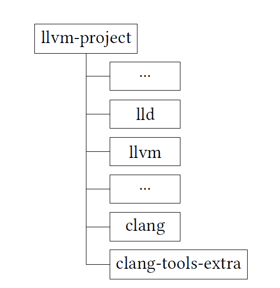
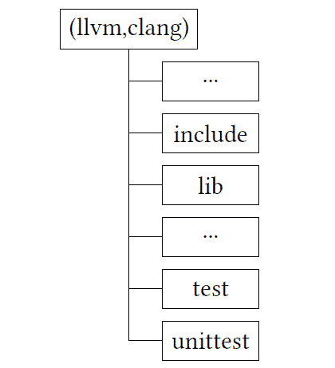

# 第一章：环境设置

在本章中，我们将讨论为未来使用 Clang 进行实验而设置环境的基本步骤。该设置适用于基于 Unix 的系统，如 Linux 和 Mac OS（Darwin）。此外，你将获得有关如何下载、配置和构建 LLVM 源代码的重要信息。我们将继续一个简短的会话，解释如何构建和使用**LLVM 调试器（LLDB**），它将作为本书中代码调查的主要工具。最后，我们将完成一个简单的 Clang 工具，可以检查 C/C++文件的编译错误。我们将使用 LLDB 为创建的工具和 clang 内部进行简单的调试会话。我们将涵盖以下主题：

+   先决条件

+   了解 LLVM

+   源代码编译

+   如何创建自定义 Clang 工具

## 1.1 技术要求

下载和构建 LLVM 代码非常简单，不需要任何付费工具。你需要以下内容：

+   基于 Unix 的操作系统（Linux，Darwin）

+   命令行 git

+   构建工具：CMake 和 Ninja

我们将使用调试器作为源代码调查工具。LLVM 有自己的调试器，LLDB。我们将从 LLVM monorepo 构建它作为我们的第一个工具：[`github.com/llvm/llvm-project.git`](https://github.com/llvm/llvm-project.git)。

任何构建过程都包括两个步骤。第一个是项目配置，最后一个步骤是构建本身。LLVM 使用 CMake 作为项目配置工具。它还可以使用广泛的构建工具，如 Unix Makefiles 和 Ninja。它还可以为流行的 IDE 生成项目文件，如 Visual Studio 和 XCode。我们将使用 Ninja 作为构建工具，因为它可以加快构建过程，并且大多数 LLVM 开发者都在使用它。你可以在这里找到有关这些工具的更多信息：[`llvm.org/docs/GettingStarted.html`](https://llvm.org/docs/GettingStarted.html)。

本章的源代码位于本书 GitHub 仓库的`chapter1`文件夹中：[`github.com/PacktPublishing/Clang-Compiler-Frontend-Packt/tree/main/chapter1`](https://github.com/PacktPublishing/Clang-Compiler-Frontend-Packt/tree/main/chapter1)

### 1.1.1 CMake 作为项目配置工具

CMake 是一个源代码、跨平台的构建系统生成器。自 2013 年发布的 3.3 版本以来，它一直被用作 LLVM 的主要构建系统。

在 LLVM 开始使用 CMake 之前，它使用 autoconf，这是一个生成配置脚本的工具，可以在广泛的类 Unix 系统上用于构建和安装软件。然而，autoconf 有几个限制，例如难以使用和维护，以及对跨平台构建的支持不佳。CMake 被选为 autoconf 的替代品，因为它解决了这些限制，并且更容易使用和维护。

除了用作 LLVM 的构建系统之外，CMake 还被用于许多其他软件项目，包括 Qt、OpenCV 和 Google Test。

### 1.1.2 Ninja 作为构建工具

Ninja 是一个专注于速度的小型构建系统。它被设计成与构建生成器（如 CMake）一起使用，CMake 会生成一个描述项目构建规则的构建文件。

Ninja 的主要优势之一是其速度。它通过仅重建完成构建所需的最小文件集，能够比其他构建系统（如 Unix Makefiles）更快地执行构建。这是因为它跟踪构建目标之间的依赖关系，并且只重建过时的目标。

此外，Ninja 简单易用。它拥有一个小巧且直观的命令行界面，并且它使用的构建文件是简单的文本文件，易于阅读和理解。

总体而言，当速度是关键因素，并且需要简单易用的工具时，Ninja 是构建系统的良好选择。

最有用的 Ninja 选项之一是 `-j`。此选项允许您指定要并行运行的线程数。您可能需要根据所使用的硬件来指定该数值。

我们下一个目标是下载 LLVM 代码并调查项目结构。我们还需要设置构建过程所需的必要工具，并为未来使用 LLVM 代码的实验建立环境。这将确保我们拥有进行工作的工具和依赖项，以便高效地继续工作。

## 1.2 了解 LLVM

让我们从介绍一些关于 LLVM 的基础知识开始，包括项目历史以及其结构。

### 1.2.1 简短的 LLVM 历史

Clang 编译器是 LLVM 项目的一部分。该项目始于 2000 年，由 Chris Lattner 和 Vikram Adve 在伊利诺伊大学厄巴纳-香槟分校作为他们的项目启动 [26]。

LLVM 最初被设计为一个下一代代码生成基础设施，可用于构建多种编程语言的优化编译器。然而，它已经发展成为一个功能齐全的平台，可用于构建各种工具，包括调试器、性能分析器和静态分析工具。

LLVM 已在软件行业中得到广泛应用，并被许多公司和组织用于构建各种工具和应用。它也被用于学术研究和教学，并激发了其他领域类似项目的开发。

当苹果公司在 2005 年聘请了 Chris Lattner 并组建了一支团队来开发 LLVM 时，项目得到了额外的推动。LLVM 成为了苹果公司（XCode）开发工具的一个组成部分。

最初，**GNU 编译器集合（GCC**）被用作 LLVM 的 C/C++前端。但这也存在一些问题。其中之一与 GNU **通用公共许可证（GPL**）有关，这阻止了在某些专有项目中的前端使用。另一个缺点是当时 GCC 对 Objective-C 的支持有限，这对苹果公司来说很重要。Clang 项目由 Chris Lattner 于 2006 年启动，旨在解决这些问题。

Clang 最初被设计为 C 语言家族（包括 C、Objective-C、C++和 Objective-C++）的统一解析器。这种统一旨在通过使用单个前端实现来简化维护，而不是为每种语言维护多个实现。该项目很快就取得了成功。Clang 和 LLVM 成功的一个主要原因是它们的模块化。LLVM 中的所有内容都是一个库，包括 Clang。这为基于 Clang 和 LLVM 创建大量惊人的工具打开了机会，例如 clang-tidy 和 clangd，这些将在本书的后续章节中介绍（第**5**章*，Clang-Tidy Linter Framework* 和 第**8**章*，IDE 支持与 Clangd*）。

LLVM 和 Clang 具有非常清晰的架构，并且是用 C++编写的。这使得任何 C++开发者都可以对其进行研究和使用。我们可以看到围绕 LLVM 形成的巨大社区以及其使用量的极快增长。

### 1.2.2 操作系统支持

我们计划在这里专注于个人电脑的操作系统，例如 Linux、Darwin 和 Windows。另一方面，Clang 不仅限于个人电脑，还可以用于编译 iOS 和不同嵌入式系统等移动平台的代码。

#### Linux

GCC 是 Linux 上的默认开发工具集，特别是`gcc`（用于 C 程序）和`g++`（用于 C++程序）是默认的编译器。Clang 也可以用于在 Linux 上编译源代码。此外，它模仿`gcc`并支持其大多数选项。然而，LLVM 对某些 GNU 工具的支持可能有限；例如，GNU Emacs 不支持 LLDB 作为调试器。但尽管如此，Linux 是最适合 LLVM 开发和研究的操作系统，因此我们将主要使用这个操作系统（Fedora 39）进行未来的示例。

#### Darwin（macOS）

Clang 被认为是 Darwin 的主要构建工具。整个构建基础设施基于 LLVM，Clang 是默认的 C/C++编译器。开发工具，如调试器（LLDB），也来自 LLVM。您可以从 XCode 获取主要开发工具，它们基于 LLVM。然而，您可能需要安装额外的命令行工具，例如 CMake 和 Ninja，无论是作为单独的包还是通过 MacPorts 或 Homebrew 等包系统。

例如，您可以使用 Homebrew 获取 CMake，如下所示：

```cpp
$ brew install cmake
```

或者对于 MacPorts：

```cpp
$ sudo port install cmake
```

#### Windows

在 Windows 上，Clang 可以用作命令行编译器，也可以作为更大开发环境（如 Visual Studio）的一部分。Windows 上的 Clang 包括对**Microsoft Visual C++ (MSVC)** ABI 的支持，因此您可以使用 Clang 编译使用**Microsoft C 运行时库**（CRT）和 C++ **标准模板库**（STL）的程序。Clang 还支持许多与 GCC 相同的语言特性，因此在许多情况下，它可以用作 Windows 上 GCC 的替代品。

值得注意的是`clang-cl` [9]。它是一个用于 Clang 的命令行编译器驱动程序，旨在作为 MSVC 编译器`cl.exe`的替代品。它是作为 Clang 编译器的一部分引入的，并创建用于与 LLVM 工具链一起使用。

与`cl.exe`类似，`clang-cl`被设计为 Windows 程序构建过程的一部分，它支持与 MSVC 编译器相同的许多命令行选项。它可以在 Windows 上编译 C、C++和 Objective-C 代码，并且也可以用于链接目标文件和库以创建可执行程序或**动态链接库**（DLLs）。

Windows 的开发过程与类 Unix 系统不同，这需要额外的具体说明，可能会使本书的材料相当复杂。为了避免这种复杂性，我们的主要目标是专注于基于 Unix 的系统，如 Linux 和 Darwin，本书将省略 Windows 特定的示例。

### 1.2.3 LLVM/Clang 项目结构

Clang 源代码是 LLVM **单一仓库**（monorepo）的一部分。LLVM 从 2019 年开始使用 monorepo 作为其向 Git 过渡的一部分 [4]。这一决定是由几个因素驱动的，例如更好的代码重用、提高效率和协作。因此，您可以在一个地方找到所有 LLVM 项目。正如前言中提到的，本书将使用 LLVM 版本 18.x。以下命令将允许您下载它：

```cpp
$ git clone https://github.com/llvm/llvm-project.git -b release/18.x
$ cd llvm-project
```

**图 1.1**：获取 LLVM 代码库

重要提示

18 版本是 LLVM 的最新版本，预计将于 2024 年 3 月发布。本书基于 2024 年 1 月 23 日的版本，当时创建了发布分支。

本书将使用**llvm-project**的最重要的部分，如图图 1.2 所示。



**图 1.2**：LLVM 项目树

有：

+   `lld` : LLVM 链接器工具。您可能希望将其用作标准链接器工具（如 GNU `ld`）的替代品。

+   `llvm` : LLVM 项目的通用库

+   `clang` : Clang 驱动程序和前端

+   `clang-tools-extra` : 这些是本书第二部分将涵盖的不同 Clang 工具

大多数项目都具有图 1.3 中所示的结构。



**图 1.3**：典型的 LLVM 项目结构

LLVM 项目，如`clang`或`llvm`，通常包含两个主要文件夹：`include`和`lib`。`include`文件夹包含项目接口（头文件），而`lib`文件夹包含实现。每个 LLVM 项目都有各种不同的测试，可以分为两个主要组：位于`unittests`文件夹中的单元测试，使用 Google Test 框架实现，以及使用**LLVM 集成测试器 (LIT**)框架实现的端到端测试。您可以在*第 4.5.2 节**中获取更多关于 LLVM/Clang 测试的信息，*LLVM 测试框架*。

对我们来说，最重要的项目是`clang`和`clang-tools-extra`。`clang`文件夹包含前端和驱动。

重要提示

编译器驱动用于运行编译的不同阶段（解析、优化、链接等）。您可以在*第 2.3 节**中获取更多关于它的信息，*Clang 驱动概述*。

例如，词法分析器的实现位于`clang/lib/Lex`文件夹中。您还可以看到包含端到端测试的`clang/test`文件夹，以及包含前端和驱动单元测试的`clang/unittest`文件夹。

另一个重要的文件夹是`clang-tools-extra`。它包含基于不同 Clang 库的一些工具。具体如下：

+   `clang-tools-extra/clangd`：一个语言服务器，为 VSCode 等 IDE 提供导航信息

+   `clang-tools-extra/clang-tidy`：一个功能强大的 lint 框架，具有数百种不同的检查

+   `clang-tools-extra/clang-format`：一个代码格式化工具

在获取源代码并设置构建工具后，我们就可以编译 LLVM 源代码了。

## 1.3 源代码编译

我们以调试模式编译源代码，使其适合未来的调试器调查。我们使用 LLDB 作为调试器。我们将从构建过程概述开始，并以构建 LLDB 作为具体示例。

### 1.3.1 使用 CMake 进行配置

创建一个构建文件夹，编译器和相关工具将在其中构建：

```cpp
$ mkdir build
$ cd build
```

最小配置命令看起来像这样：

```cpp
$ cmake -DCMAKE_BUILD_TYPE=Debug ../llvm
```

命令需要指定构建类型（例如，在我们的例子中是`Debug`）以及指向包含构建配置文件的文件夹的主要参数。配置文件存储为`CMakeLists.txt`，位于`llvm`文件夹中，这解释了`../llvm`参数的使用。该命令在构建文件夹中生成`Makefile`，因此您可以使用简单的`make`命令来启动构建过程。

我们将在本书中使用更高级的配置命令。其中一个命令看起来像这样：

```cpp
cmake -G Ninja -DCMAKE_BUILD_TYPE=Debug -DCMAKE_INSTALL_PREFIX=../install -DLLVM_TARGETS_TO_BUILD="X86" -DLLVM_ENABLE_PROJECTS="lldb;clang;clang-tools-extra" -DLLVM_USE_SPLIT_DWARF=ON ../llvm
```

**图 1.4**：基本的 CMake 配置

指定了几个 LLVM/cmake 选项：

+   `-G Ninja`指定 Ninja 作为构建生成器，否则它将使用 make（这很慢）。

+   `-DCMAKE_BUILD_TYPE=Debug` 设置构建模式。将创建带有调试信息的构建。Clang 内部调查有一个主要构建配置。

+   `-DCMAKE_INSTALL_PREFIX=../install` 指定安装文件夹。

+   `-DLLVM_TARGETS_TO_BUILD="X86"` 设置要构建的确切目标。这将避免构建不必要的目标。

+   `-DLLVM_ENABLE_PROJECTS="lldb;clang;clang-tools-extra"` 指定我们想要构建的 LLVM 项目。

+   `-DLLVM_USE_SPLIT_DWARF=ON` 将调试信息分割成单独的文件。此选项在 LLVM 构建过程中可以节省磁盘空间以及内存消耗。

我们使用`-DLLVM_USE_SPLIT_DWARF=ON`来在磁盘上节省一些空间。例如，启用选项的 Clang 构建（`ninja clang`构建命令）占用 20 GB，但禁用选项时将占用 27 GB 空间。请注意，此选项要求用于构建的编译器支持它。您也可能注意到我们为特定架构创建构建：`X86`。此选项也为我们节省了一些空间，因为否则，所有支持的架构都将被构建，所需空间也将从 20 GB 增加到 27 GB。

重要提示

如果您的宿主平台不是 X86，例如 ARM，您可能希望避免使用`-DLLVM_TARGETS_TO_BUILD="X86"`设置。对于 ARM，您可以使用以下配置：`-DLLVM_TARGETS_TO_BUILD="ARM;X86;AArch64"` [15]。支持的完整平台列表可以在[7]中找到，截至 2023 年 3 月，包括 19 个不同的目标。

您也可以使用默认设置，不指定`LLVM_TARGETS_TO_BUILD`配置设置。请准备好构建时间和使用空间都会增加。

如果您使用动态库而不是静态库，可以节省更多空间。配置设置`-DBUILD_SHARED_LIBS=ON`将构建每个 LLVM 组件为共享库。使用的空间将是 14 GB，整体配置命令将如下所示：

```cpp
cmake -G Ninja -DCMAKE_BUILD_TYPE=Debug -DCMAKE_INSTALL_PREFIX=../install -DLLVM_TARGETS_TO_BUILD="X86" -DLLVM_ENABLE_PROJECTS="lldb;clang;clang-tools-extra" -DLLVM_USE_SPLIT_DWARF=ON -DBUILD_SHARED_LIBS=ON ../llvm
```

**图 1.5**：启用共享库而不是静态库的 CMake 配置

为了性能考虑，在 Linux 上，您可能希望使用`gold`链接器而不是默认链接器。`gold`链接器是 GNU 链接器的替代品，它是 GNU 二进制实用工具（binutils）包的一部分开发的。它旨在比 GNU 链接器更快、更高效，尤其是在链接大型项目时。它实现这一目标的一种方式是使用更有效的符号解析算法和更紧凑的文件格式来生成可执行文件。可以通过`-DLLVM_USE_LINKER=gold`选项启用它。结果配置命令将如下所示：

```cpp
cmake -G Ninja -DCMAKE_BUILD_TYPE=Debug -DCMAKE_INSTALL_PREFIX=../install -DLLVM_TARGETS_TO_BUILD="X86" -DLLVM_ENABLE_PROJECTS="lldb;clang;clang-tools-extra" -DLLVM_USE_LINKER=gold -DLLVM_USE_SPLIT_DWARF=ON -DBUILD_SHARED_LIBS=ON ../llvm
```

**图 1.6**：使用 gold 链接器的 CMake 配置

调试构建可能会非常慢，因此您可能想考虑一个替代方案。在可调试性和性能之间取得良好平衡的是带有调试信息的发布构建。要获得此构建，您可以在整体配置命令中将 `CMAKE``_BUILD``_TYPE` 标志更改为 `RelWithDebInfo`。命令将如下所示：

```cpp
cmake -G Ninja -DCMAKE_BUILD_TYPE=RelWithDebInfo _DCMAKE_INSTALL_PREFIX=../install -DLLVM_TARGETS_TO_BUILD="X86" -DLLVM_ENABLE_PROJECTS="lldb;clang;clang-tools-extra" -DLLVM_USE_SPLIT_DWARF=ON ../llvm
```

**图 1.7**: 使用 RelWithDebInfo 构建类型的 CMake 配置

以下表格列出了一些流行的选项（[`llvm.org/docs/CMake.html`](https://llvm.org/docs/CMake.html)）。

|

* * *

|

* * *

|

| 选项 | 描述 |
| --- | --- |

|

* * *

|

* * *

|

| `CMAKE``_BUILD``_TYPE` | 指定构建配置。 |
| --- | --- |
|  | 可能的值有 `Release&#124;Debug&#124;RelWithDebInfo&#124;MinSizeRel` . |
|  | `Release` 和 `RelWithDebInfo` 优化了性能，而 |
|  | `MinSizeRel` 优化了大小。 |

|

* * *

|

* * *

|

| `CMAKE``_INSTALL``_PREFIX` | 安装前缀 |
| --- | --- |

|

* * *

|

* * *

|

| `CMAKE``_C,CXX``_FLAGS` | 用于编译的额外 C/C++ 标志 |
| --- | --- |

|

* * *

|

* * *

|

| `CMAKE``_C,CXX``_COMPILER` | 用于编译的 C/C++ 编译器。 |
| --- | --- |
|  | 您可能想指定一个非默认编译器来使用一些 |
|  | 选项，这些选项不可用或不支持默认编译器。 |

|

* * *

|

* * *

|

| `LLVM``_ENABLE``_PROJECTS` | 要启用的项目。我们将使用 `clang;clang-tools-extra` . |
| --- | --- |

|

* * *

|

* * *

|

| `LLVM``_USE``_LINKER` | 指定要使用的链接器。 |
| --- | --- |
|  | 有几个选项，包括 `gold` 和 `lld` 。 |

|

* * *

|

* * *

|

|  |  |
| --- | --- |

**表 1.1**: 配置选项

### 1.3.2 构建

我们需要调用 Ninja 来构建项目。如果您想构建所有指定的项目，可以在没有参数的情况下运行 Ninja：

```cpp
$ ninja
```

Clang 构建命令将如下所示：

```cpp
$ ninja clang
```

您还可以使用以下命令为编译器运行单元和端到端测试：

```cpp
$ ninja check-clang
```

编译器二进制文件是 `bin/clang`，可以在 `build` 文件夹中找到。

您还可以将二进制文件安装到 `-DCMAKE``_INSTALL``_PREFIX` 选项指定的文件夹中。可以按照以下方式完成：

```cpp
$ ninja install
```

`../install` 文件夹（在图 1.4 中指定为安装文件夹）将具有以下结构：

```cpp
$ ls ../install
bin  include  lib  libexec  share
```

### 1.3.3 LLVM 调试器，其构建和使用

LLVM 调试器 LLDB 是在观察 GNU 调试器 (GDB) 的基础上创建的。其中一些命令与 GDB 的对应命令相同。您可能会问：“如果我们已经有了好的调试器，为什么还需要一个新的调试器？” 答案可以在 GCC 和 LLVM 使用的不同架构解决方案中找到。LLVM 使用模块化架构，编译器的不同部分可以被重用。例如，Clang 前端可以在调试器中重用，从而支持现代 C/C++ 特性。例如，`lldb` 中的打印命令可以指定任何有效的语言结构，您可以使用 `lldb` 打印命令使用一些现代 C++ 特性。

相比之下，GCC 使用单一架构，很难将 C/C++ 前端与其他部分分离。因此，GDB 必须单独实现语言特性，这可能需要一些时间，才能在现代 GCC 中实现的语言特性在 GDB 中可用。

您可以在以下示例中找到有关 LLDB 构建和一些典型使用场景的信息。我们将为发布构建创建一个单独的文件夹：

```cpp
$ cd llvm-project
$ mkdir release
$ cd release
```

**图 1.8**: LLVM 的发布构建

我们以发布模式配置我们的项目，并仅指定 `lldb` 和 `clang` 项目：

```cpp
cmake -G Ninja -DCMAKE_BUILD_TYPE=Release -DCMAKE_INSTALL_PREFIX=../install -DLLVM_TARGETS_TO_BUILD="X86" -DLLVM_ENABLE_PROJECTS="lldb;clang" ../llvm
```

**图 1.9**: 使用发布构建类型的 CMake 配置

我们将使用系统可用的最大线程来构建 Clang 和 LLDB：

```cpp
$ ninja clang lldb -j $(nproc)
```

您可以使用以下命令安装创建的执行文件：

```cpp
$ ninja install-clang install-lldb
```

二进制文件将通过 `-DCMAKE_INSTALL_PREFIX` 配置命令参数指定的文件夹安装。

我们将使用以下简单的 C++ 程序作为示例调试会话：

```cpp
1 int main() { 

2   return 0; 

3 }
```

**图 1.10**: 测试 C++ 程序：main.cpp

可以使用以下命令编译程序（`<...>` 用于引用克隆 llvm-project 的文件夹）：

```cpp
$ <...>/llvm-project/install/bin/clang main.cpp -o main -g -O0
```

如您所注意到的，我们没有使用优化（`-O0` 选项）并将调试信息存储在二进制文件中（使用 `-g` 选项）。

创建的执行文件的典型调试会话如图图 1.11 所示。

```cpp
1$ <...>/llvm-project/install/bin/lldb main 

2 (lldb) target create "./main" 

3 ... 

4 (lldb) b main 

5 Breakpoint 1: where = main‘main + 11 at main.cpp:2:3,... 

6 (lldb) r 

7 Process 1443051 launched: ... 

8 Process 1443051 stopped 

9 * thread #1, name = ’main’, stop reason = breakpoint 1.1 

10    frame #0: 0x000055555555513b main‘main at main.cpp:2:3 

11    1    int main() { 

12 -> 2     return 0; 

13    3    } 

14 (lldb) q
```

**图 1.11**: LLDB 会话示例

需要采取以下几项行动：

+   使用 `<...>/llvm-project/install/bin/lldb` `main` 运行调试会话，其中 `main` 是我们想要调试的可执行文件。参见图 1.11，*第 1 行*。

+   我们在 `main` 函数中设置了一个断点。参见图 1.11，*第 4 行*。

+   使用 `"r"` 命令运行会话。参见图 1.11，*第 6 行*。

+   我们可以看到，进程在断点处被中断。参见图 1.11，*第 8 行、第 12 行*。

+   我们使用 `"q"` 命令结束会话。参见图 1.11，*第 14 行*。

我们将使用 LLDB 作为我们 Clang 内部调查的工具之一。我们将使用图 1.11 中显示的相同命令序列。您也可以使用具有与 LLDB 相似命令集的其他调试器，如 GDB。

## 1.4 测试项目 – 使用 Clang 工具进行语法检查

对于我们的第一个测试项目，我们将创建一个简单的 Clang 工具，该工具运行编译器并检查提供的源文件的语法。我们将创建一个所谓的树外 LLVM 项目，即一个将使用 LLVM 但位于主 LLVM 源树之外的项目。

创建项目需要采取以下几项行动：

+   必须构建和安装所需的 LLVM 库和头文件。

+   我们必须为我们的测试项目创建一个构建配置文件。

+   使用 LLVM 的源代码必须被创建。

我们将首先安装 Clang 支持库和头文件。我们将使用以下 CMake 配置命令：

```cpp
cmake -G Ninja -DCMAKE_BUILD_TYPE=Debug -DCMAKE_INSTALL_PREFIX=../install -DLLVM_TARGETS_TO_BUILD="X86" -DLLVM_ENABLE_PROJECTS="clang" -DLLVM_USE_LINKER=gold -DLLVM_USE_SPLIT_DWARF=ON -DBUILD_SHARED_LIBS=ON ../llvm
```

**图 1.12**：简单语法检查 Clang 工具的 LLVM CMake 配置

如您所注意到的，我们只启用了一个项目：`clang`。所有其他选项都是我们调试构建的标准选项。必须从 LLVM 源树中创建的 `build` 文件夹中运行该命令，正如在 *第 1.3.1 节**，* *使用 CMake 进行配置* 中所建议的。

重要提示

图 1.12 中指定的配置将是本书中使用的默认构建配置。

与共享库的配置相比，除了减小大小外，还有简化依赖项指定的优势。您只需指定项目直接依赖的共享库，动态链接器会处理其余部分。

可以使用以下命令安装所需的库和头文件：

```cpp
$ ninja install
```

库和头文件将安装到 `install` 文件夹中，正如 `CMAKE_INSTALL_PREFIX` 选项所指定的。

我们必须为我们的项目创建两个文件：

+   `CMakeLists.txt`：项目配置文件

+   `TestProject.cpp`：项目源代码

项目配置文件 `CMakeLists.txt` 将通过 `LLVM_HOME` 环境变量接受 LLVM 安装文件夹的路径。文件如下：

```cpp
1 cmake_minimum_required(VERSION 3.16) 

2 project("syntax-check") 

3  

4 if ( NOT DEFINED ENV{LLVM_HOME}) 

5   message(FATAL_ERROR "$LLVM_HOME is not defined") 

6 else() 

7   message(STATUS "$LLVM_HOME found: $ENV{LLVM_HOME}") 

8   set(LLVM_HOME $ENV{LLVM_HOME} CACHE PATH "Root of LLVM installation") 

9   set(LLVM_LIB ${LLVM_HOME}/lib)

```

```cpp
10  set(LLVM_DIR ${LLVM_LIB}/cmake/llvm) 

11   find_package(LLVM REQUIRED CONFIG) 

12   include_directories(${LLVM_INCLUDE_DIRS}) 

13   link_directories(${LLVM_LIBRARY_DIRS}) 

14   set(SOURCE_FILES SyntaxCheck.cpp) 

15   add_executable(syntax-check ${SOURCE_FILES}) 

16   set_target_properties(syntax-check PROPERTIES COMPILE_FLAGS "-fno-rtti") 

17   target_link_libraries(syntax-check 

18    LLVMSupport 

19    clangBasic 

20    clangFrontend 

21    clangSerialization 

22    clangTooling 

23   ) 

24 endif()
```

**图 1.13**：简单语法检查 Clang 工具的 CMake 文件

文件最重要的部分如下：

+   *第 2 行*：我们指定项目名称（syntax-check）。这也是我们可执行文件的名字。

+   *第 4-7 行*：测试 `LLVM_HOME` 环境变量。

+   *第 10 行*：我们设置 LLVM CMake 辅助工具的路径。

+   *第 11 行*：我们从 *第 10 行* 指定的路径加载 LLVM CMake 包。

+   *第 14 行*：我们指定应编译的源文件。

+   *第 16 行*：我们设置了一个额外的编译标志：`-fno-rtti`。当 LLVM 没有启用 RTTI 构建时，该标志是必需的。这是为了减少代码和可执行文件的大小 [11]。

+   *第 18-22 行*：我们指定要链接到我们的程序所需的库。

我们工具的源代码如下：

```cpp
1 #include "clang/Frontend/FrontendActions.h" // clang::SyntaxOnlyAction 

2 #include "clang/Tooling/CommonOptionsParser.h" 

3 #include "clang/Tooling/Tooling.h" 

4 #include "llvm/Support/CommandLine.h" // llvm::cl::extrahelp 

5  

6 namespace { 

7 llvm::cl::OptionCategory TestCategory("Test project"); 

8 llvm::cl::extrahelp 

9     CommonHelp(clang::tooling::CommonOptionsParser::HelpMessage); 

10 } // namespace 

11  

12 int main(int argc, const char **argv) { 

13   llvm::Expected<clang::tooling::CommonOptionsParser> OptionsParser = 

14       clang::tooling::CommonOptionsParser::create(argc, argv, TestCategory); 

15   if (!OptionsParser) { 

16     llvm::errs() << OptionsParser.takeError(); 

17     return 1; 

18   } 

19   clang::tooling::ClangTool Tool(OptionsParser->getCompilations(), 

20                                  OptionsParser->getSourcePathList()); 

21   return Tool.run( 

22       clang::tooling::newFrontendActionFactory<clang::SyntaxOnlyAction>() 

23           .get()); 

24 }
```

**图 1.14**：SyntaxCheck.cpp

文件最重要的部分如下：

+   *第 7-9 行*：大多数编译器工具都有相同的命令行参数集。LLVM 命令行库 [12] 提供了一些 API 来处理编译器命令选项。我们在 *第 7 行* 上设置了库。我们还在第 8-10 行设置了额外的帮助信息。

+   *第 13-18 行*：我们解析命令行参数。

+   *第 19-24 行*：我们创建并运行我们的 Clang 工具。

+   *第 22-23 行*：我们使用 `clang::SyntaxOnlyAction` 前端动作，该动作将在输入文件上运行语法和语义检查。您可以在 *第 2.4.1 节**前端动作* 中获取更多关于前端动作的信息。

我们必须指定 LLVM `install`文件夹的路径来构建我们的工具。如前所述，路径必须通过`LLVM_HOME`环境变量指定。我们的配置命令（见图 1.12）指定了 LLVM 项目源树中的`install`文件夹的路径。因此，我们可以按以下方式构建我们的工具：

```cpp
export LLVM_HOME=<...>/llvm-project/install
mkdir build
cd build
cmake -G Ninja ..
ninja
```

**图 1.15**：语法检查的构建命令

我们可以按以下方式运行工具：

```cpp
$ cd build
$ ./syntax-check --help
USAGE: syntax-check [options] <source0> [... <sourceN>]
...
```

**图 1.16**：语法检查 –help 输出

如果我们在有效的 C++源文件上运行程序，程序将依次终止，但如果在损坏的 C++文件上运行，它将产生错误信息：

```cpp
$ ./syntax-check mainbroken.cpp -- -std=c++17
mainbroken.cpp:2:11: error: expected ’;’ after return statement
  return 0
          ^
          ;
1  error generated.
Error while processing mainbroken.cpp.
```

**图 1.17**：对存在语法错误的文件进行的语法检查

在图 1.17 中，我们使用`- -`向编译器传递额外的参数，具体表示我们想使用 C++17，选项为`-std=c++17`。

我们也可以使用 LLDB 调试器运行我们的工具：

```cpp
$  <...>/llvm-project/install/bin/lldb \
                        ./syntax-check \
                        --           \
                        main.cpp     \
                        -- -std=c++17
```

**图 1.18**：在调试器下运行的语法检查

我们将`syntax-check`作为主二进制文件运行，并将`main.cpp`源文件作为工具的参数（图 1.18）。我们还向语法检查的可执行文件传递了额外的编译标志（-std=c++17）。

我们可以设置断点并按以下方式运行程序：

```cpp
1(lldb) b clang::ParseAST 

2 ... 

3 (lldb) r 

4 ... 

5 Running without flags. 

6 Process 608249 stopped 

7 * thread #1, name = ’syntax-check’, stop reason = breakpoint 1.1 

8    frame #0: ... clang::ParseAST(...) at ParseAST.cpp:117:3 

9    114 

10    115  void clang::ParseAST(Sema &S, bool PrintStats, bool SkipFunctionBodies) { 

11    116    // Collect global stats on Decls/Stmts (until we have a module streamer). 

12 -> 117    if (PrintStats) { 

13    118     Decl::EnableStatistics(); 

14    119     Stmt::EnableStatistics(); 

15    120    } 

16 (lldb) c 

17 Process 608249 resuming 

18 Process 608249 exited with status = 0 (0x00000000) 

19 (lldb)
```

**图 1.19**：Clang 工具测试项目的 LLDB 会话

我们在`clang::ParseAST`函数中设置了一个断点（图 1.19，第 1 行）。该函数是源代码解析的主要入口点。我们在第 3 行运行程序，并在第 16 行的断点后继续执行。

当我们在书中调查 Clang 的源代码时，我们将使用相同的调试技术。

## 1.5 摘要

在本章中，我们介绍了 LLVM 项目的历史，获取了 LLVM 的源代码，并探讨了其内部结构。我们了解了用于构建 LLVM 的工具，例如 CMake 和 Ninja。我们研究了构建 LLVM 的各种配置选项以及如何使用它们来优化资源，包括磁盘空间。我们在调试和发布模式下构建了 Clang 和 LLDB，并使用生成的工具编译了一个基本程序，并用调试器运行它。我们还创建了一个简单的 Clang 工具，并用 LLDB 调试器运行它。

下一章将向您介绍编译器设计架构，并解释它在 Clang 的上下文中的表现。我们将主要关注 Clang 前端，但也会涵盖 Clang 驱动程序的重要概念——它是管理编译过程所有阶段的骨干，从解析到链接。

## 1.6 进一步阅读

+   开始使用 LLVM 系统：[`llvm.org/docs/GettingStarted.html`](https://llvm.org/docs/GettingStarted.html)

+   使用 CMake 构建 LLVM：[`llvm.org/docs/CMake.html`](https://llvm.org/docs/CMake.html)

+   Clang 编译器用户手册：[`clang.llvm.org/docs/UsersManual.html`](https://clang.llvm.org/docs/UsersManual.html)
