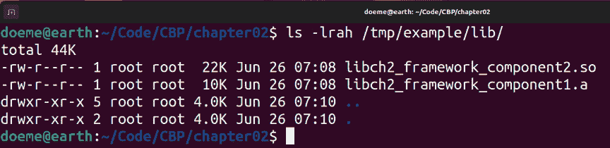
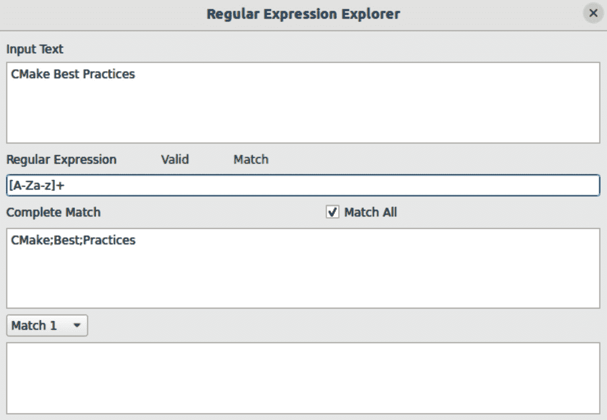
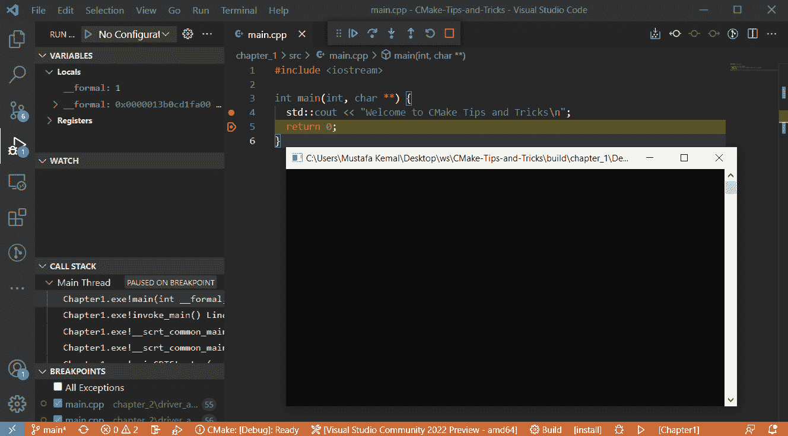

# 第二章：以最佳方式访问 CMake

在上一章中，我们已经了解了 CMake 并学习了它的基本概念。现在，我们将学习如何与它交互。学习如何与 CMake 交互非常重要。在开始使用 CMake 构建你的软件项目之前，你必须先学会如何配置、构建和安装现有项目。这将使你能够与 CMake 项目进行交互。

本章将探讨 CMake 作为一个界面所提供的功能，并检查一些流行的 IDE 和编辑器集成。本章将涵盖以下内容：

+   通过命令行界面使用 CMake

+   使用 `cmake-gui` 和 `ccmake` 界面

+   IDE 和编辑器集成（Visual Studio、**Visual Studio Code**（**VSCode**）和 Qt Creator）

由于我们有很多内容要讲解，因此不要浪费时间，直接开始技术要求。

# 技术要求

在深入详细内容之前，有一些要求需要满足，才能跟上示例的步伐：

+   **CMake 最佳实践库**：这是包含本书所有示例内容的主要库。可以在线访问：[`github.com/PacktPublishing/CMake-Best-Practices---2nd-Edition/`](https://github.com/PacktPublishing/CMake-Best-Practices---2nd-Edition/)。

+   后续章节中关于打包和依赖管理的一些示例使用了 OpenSSL 来说明如何与第三方库一起工作。要安装它，可以使用操作系统提供的包管理器，例如 `apt-get`、`chocolatey` 或 `brew`，或者从 OpenSSL wiki 中提供的任何链接下载：[`wiki.openssl.org/index.php/Binaries`](https://wiki.openssl.org/index.php/Binaries)。选择 OpenSSL 是因为它可以在多种平台上免费使用，并且易于安装。

# 通过命令行界面使用 CMake

尽管 CMake 已经很好地集成到许多 IDE 和编辑器中，但它本质上是一个 **命令行** 工具，因此学习如何在 **命令行界面** (**CLI**) 中使用 CMake 是充分发挥其潜力的关键。通过命令行使用 CMake 还可以帮助理解 CMake 的内部工作原理和概念。在本节中，我们将学习如何使用 CLI 执行最基本的 CMake 操作。

与 CMake CLI 的交互可以通过在操作系统终端中输入 `cmake` 命令来完成，前提是已安装 CMake 且 `cmake` 可执行文件已包含在系统的 `PATH` 变量（或等效项）中。你可以通过在终端中输入 `cmake` 而不带任何参数来验证这一点，如下图所示：


图 2.1 – 调用 cmake 命令

如果您的终端提示缺少命令，您应该安装 CMake（在 *第一章*，*启动 CMake* 中有详细说明），或通过将其添加到系统的 `PATH` 变量中使其可被发现。请参考您的操作系统指南，了解如何将路径添加到系统的 `PATH` 变量。

安装 CMake 并将其添加到 `PATH` 变量中（如果需要），之后您应该测试 CMake 是否可用。您可以在命令行中执行的最基本命令是 `cmake --version`，该命令可以让您检查 CMake 的版本：


图 2.2 – 在终端中检查 CMake 版本

CMake 将以 `cmake version <maj.min.rev>` 的形式输出版本字符串。您应该看到一个包含您安装的 CMake 版本号的输出。

注意

如果版本与已安装的版本不匹配，可能是您的系统上安装了多个 CMake 版本。由于本书中的示例是为 CMake 版本 3.23 及以上编写的，建议在继续之前先解决该问题。

安装 CMake 后，您还应该安装构建系统和编译器。对于 Debian 类操作系统（例如 Debian 和 Ubuntu），可以通过执行 `sudo apt install build-essential` 命令轻松完成。此软件包本质上包含 `gcc`、`g++` 和 `make`。

CLI 的使用将在 Ubuntu 22.04 环境中进行演示。除了少数边缘情况外，其他环境中的使用方法相同。那些边缘情况将在后续中提到。

## 学习 CMake CLI 基础知识

你应该学习的关于使用 CMake CLI 的三个基本知识点如下：

+   配置 CMake 项目

+   构建 CMake 项目

+   安装 CMake 项目

学习基础知识后，您将能够构建并安装任何您选择的 CMake 项目。让我们从配置开始。

### 通过 CLI 配置项目

要通过命令行配置 CMake 项目，您可以使用 `cmake -G "Unix Makefiles" -S <project_root> -B <output_directory>` 结构。`-S` 参数用于指定要配置的 CMake 项目，而 `-B` 指定 *配置* 输出目录。最后，`-G` 参数允许我们指定用于生成构建系统的生成器。配置过程的结果将写入 `<output_directory>`。

作为示例，让我们将本书的示例项目配置到项目根目录 `build` 目录中：


图 2.3 – 克隆示例代码库

重要提示

项目必须已经存在于您的环境中。如果没有，请在终端中执行 `git clone` `https://github.com/PacktPublishing/CMake-Best-Practices---2nd-Edition.git` 通过 Git 克隆该项目。

现在进入 `CMake-Best-Practices---2nd-Edition/chapter02/simple_example` 目录并执行 `cmake -G "Unix Makefiles" -S . -B ./build`，如以下截图所示：


图 2.4 – 使用 CMake 配置示例代码

这个命令就像是对 CMake 说，*使用“Unix Makefiles”(-G "Unix Makefiles") 生成器在当前目录(-S .)为 CMake 项目生成构建系统，并将其输出到构建(-B ./build)目录*。

CMake 将把当前文件夹中的项目配置到 `build` 文件夹中。由于我们省略了构建类型，CMake 使用了 `Debug` 构建类型（这是项目的默认 `CMAKE_BUILD_TYPE` 值）。

在接下来的部分中，我们将了解在配置步骤中使用的基本设置。

#### 更改构建类型

CMake 默认情况下不会假定任何构建类型。要设置构建类型，必须向 `configure` 命令提供一个名为 `CMAKE_BUILD_TYPE` 的额外变量。要提供额外的变量，变量必须以 `-D` 为前缀。

要获取 `Release` 构建而不是 `Debug`，请在 `configure` 命令中添加 `CMAKE_BUILD_TYPE` 变量，如前所述：`cmake -G "Unix Makefiles" -S . -B ./build`。

注意

`CMAKE_BUILD_TYPE` 变量仅适用于单配置生成器，例如 Unix Makefiles 和 Ninja。在多配置生成器中，如 Visual Studio，构建类型是一个构建时参数，而不是配置时参数。因此，不能通过使用 `CMAKE_BUILD_TYPE` 参数来配置。请参见 *为多配置生成器安装特定配置* 部分，了解如何在这些生成器中更改构建类型。

#### 更改生成器类型

根据环境，CMake 默认尝试选择合适的生成器。要显式指定生成器，必须提供 `-G` 参数，并指定一个有效的生成器名称。例如，如果您想使用 Ninja 作为构建系统而不是 make，可以按如下方式更改：

```cpp
cmake -G "Ninja" -DCMAKE_BUILD_TYPE=Debug -S . -B ./build
```

输出应与以下图中所示的命令输出相似：


图 2.5 – 检查 CMake 的 Ninja 生成器输出

这将导致 CMake 生成 Ninja 构建文件，而不是 Makefiles。

为了查看您环境中所有可用的生成器类型，可以执行 `cmake --help` 命令。可用的生成器将在 **Help text generators** 部分的末尾列出，如下所示：


图 2.6 – 帮助中可用生成器的列表

带有星号的生成器是您当前环境的默认生成器。

#### 更改编译器

在 CMake 中，要使用的编译器是通过每种语言的 `CMAKE_<LANG>_COMPILER` 变量来指定的。为了更改某种语言的编译器，必须将 `CMAKE_<LANG>_COMPILER` 参数传递给 `Configure` 命令。对于 C/C++ 项目，通常被覆盖的变量是 `CMAKE_C_COMPILER`（C 编译器）和 `CMAKE_CXX_COMPILER`（C++ 编译器）。编译器标志同样由 `CMAKE_<LANG>_FLAGS` 变量控制。此变量可用于存储与配置无关的编译器标志。

作为示例，让我们尝试在一个 `g++-12` 不是默认编译器的环境中使用它作为 C++ 编译器：

```cpp
cmake -G "Unix Makefiles" -DCMAKE_CXX_COMPILER=/usr/bin/g++-12 -S .
   -B ./build
```

在这里，我们可以看到使用的是 `g++-12`，而不是系统默认的编译器 `g++-11`：


图 2.7 – 使用不同编译器（g++-10）配置项目

如果没有指定编译器，CMake 会优先在此环境中使用 `g++-9`：


图 2.8 – 无编译器偏好配置行为

#### 将标志传递给编译器

为了说明如何指定编译器标志，假设你想启用所有警告并将其视为错误。这些行为分别通过 `gcc` 工具链中的 `-Wall` 和 `-Werror` 编译器标志进行控制；因此，我们需要将这些标志传递给 C++ 编译器。以下代码说明了如何实现：

```cpp
cmake -G "Unix Makefiles" -DCMAKE_CXX_FLAGS="-Wall -Werror"
-S . -B ./build
```

我们可以看到，在下面的示例中，命令中指定的标志（`-Wall` 和 `-Werror`）被传递给了编译器：


图 2.9 – 将标志传递给 C++ 编译器

构建标志可以通过在其后添加大写的构建类型字符串来为每种构建类型定制。以下列出了四个不同构建类型的四个变量。它们在根据编译器标志指定构建类型时非常有用。仅当配置的构建类型匹配时，指定在这些变量中的标志才有效：

+   `CMAKE_<LANG>_FLAGS_DEBUG`

+   `CMAKE_<LANG>_FLAGS_RELEASE`

+   `CMAKE_<LANG>_FLAGS_RELWITHDEBINFO`

+   `CMAKE_<LANG>_FLAGS_MINSIZEREL`

除了前面的示例，如果你只想在 `Release` 构建中将警告视为错误，构建类型特定的编译器标志可以让你做到这一点。

这是一个说明如何使用构建类型特定编译器标志的示例：

```cpp
cmake -G "Unix Makefiles" -DCMAKE_CXX_FLAGS="-Wall -Werror" -DCMAKE_CXX_FLAGS_RELEASE="-fpermissive" -DCMAKE_BUILD_TYPE=Debug -S . -B ./build
```

请注意，在前面的命令中存在一个额外的 `CMAKE_CXX_FLAGS_RELEASE` 参数。只有在构建类型为 `Release` 时，这个变量中的内容才会被传递给编译器。由于构建类型被指定为 `Debug`，我们可以看到传递给编译器的标志中没有 `-fpermissive` 标志，如下图所示：


图 2.10 – 基于构建类型指定标志；在 Debug 构建中缺少 -fpermissive 标志

在 *图 2.10* 中，注意到 `-fpermissive` 标志在构建命令中没有出现，而且 grep 的结果为空。这证实了 `CMAKE_CXX_FLAGS_RELEASE` 变量在 `Debug` 构建类型中没有被使用。当构建类型指定为 `Release` 时，我们可以看到 `-O3` 标志存在：

```cpp
cmake -G "Unix Makefiles" -DCMAKE_CXX_FLAGS="-Wall -Werror" -
  DCMAKE_CXX_FLAGS_RELEASE="-fpermissive" -DCMAKE_BUILD_TYPE=
    Release -S . -B ./build
```

在这一行中，你告诉 CMake，在当前目录中配置 CMake 项目并将其构建到 build/ 文件夹，使用 “*Unix Makefiles*” 生成器。对于所有构建类型，毫不犹豫地将 -*Wall 和 –Werror* 标志传递给编译器。如果构建类型是 Release，还需要传递 -fpermissive 标志。

这是当构建类型设置为 `Release` 时命令的输出：


图 2.11 – 基于构建类型指定标志；在 Release 构建中存在 -fpermissive 标志

在 *图 2.11* 中，我们可以确认 `-fpermissive` 标志也传递给了编译器。请注意，尽管 `RelWithDebInfo` 和 `MinSizeRel` 也是 Release 构建，但它们与 `Release` 构建类型是不同的，因此在 `CMAKE_<LANG>_FLAGS_RELEASE` 变量中指定的标志不会应用到它们。

#### 快捷方式 – 使用 CMake 预设

在命令行中使用 CMake 提供了大量的配置选项，这给予了对构建过程的很多控制。然而，它也可能变得相当困难，因为需要跟踪项目的各种配置所需的标志和参数组合。在 CMake 3.21 引入 *CMake 预设* 之前，跟踪构建项目所需的所有不同标志可能是一个相当大的挑战。但幸运的是，CMake 预设简化了很多繁琐的工作，因为几乎所有通过命令行传递给 CMake 的选项都可以在预设中表示。这就是为什么它们成为预先配置各种 CMake 选项组合的好方法。我们将在 *第九章* 中深入探讨 CMake 预设，*创建可复现的构建环境*，但如今越来越多的项目已经预先提供了预设。

要列出所有可用的预设，请使用以下命令：

```cpp
cmake --list-presets
```

要使用预设调用来配置项目，请使用以下命令：

```cpp
cmake --preset my-preset-name
```

提示

一旦你熟悉了如何配置 CMake 的基本选项，我们强烈建议使用 CMake 预设，以便轻松管理所有不同的构建配置、编译器标志等。

#### 列出缓存变量

你可以通过执行 `cmake -L ./build/` 命令列出所有缓存变量（见 *图 2.12*）。默认情况下，这不会显示与每个变量相关的高级变量和帮助字符串。如果你想同时显示它们，请改用 `cmake -LAH ./build/` 命令。


图 2.12 – CMake 导出的缓存变量列表

### 通过 CLI 构建配置好的项目

要构建配置好的项目，执行 `cmake --build ./build` 命令。

此命令告诉 CMake *构建已经在* *构建文件夹中配置好的 CMake 项目*。

您也可以等效地执行 `cd build && make`。使用 `cmake --build` 的好处是它使您无需调用特定于构建系统的命令。当构建 CI 流水线或构建脚本时，它尤其有用。通过这种方式，您可以更改构建系统生成器，而不必更改构建命令。

您可以在以下示例中看到 `cmake --build ./build` 命令的输出示例：


图 2.13 – 构建配置好的项目

#### 并行构建

在执行构建命令时，您还可以自定义构建时间的细节。最显著的构建时间配置是用于构建项目的作业数量。要指定作业数，可以将 `--parallel <job_count>` 添加到您的 `cmake --build` 命令中。

要进行并行构建，执行 `cmake --build ./build --parallel 2`，其中数字 `2` 表示作业数。构建系统推荐的作业数量是最多*每个硬件线程一个作业*。在多核系统中，还建议使用比可用硬件线程数少至少一个作业数，以避免在构建过程中影响系统的响应能力。

注意

通常，您可以在每个硬件线程上使用多个作业并获得更快的构建时间，因为构建过程大多数是 I/O 限制的，但效果可能因人而异。请进行实验并观察。

此外，一些构建系统，如 Ninja，将尽量利用系统中可用的所有硬件线程，因此，如果您的目标是使用系统中的所有硬件线程，则为这些构建系统指定作业数是多余的。您可以通过在 Linux 环境中执行 `nproc` 命令来获取硬件线程数。

在期望在不同环境中调用的命令中，最好不要为依赖环境的变量使用固定值，例如 CI/CD 脚本和构建脚本。下面是一个示例 `build` 命令，利用 `nproc` 动态确定并行作业的数量：

```cpp
cmake --build ./build/ --parallel $(($(nproc)-1))
```

让我们观察不同的作业数量如何影响构建时间。我们将使用 `time` 工具来测量每次命令执行的时间。环境详情如下：

+   **操作系统**: Ubuntu 22.04

+   **CPU**: 第 11 代 Intel i9-11900H @2.5GHz

+   **内存**: 32 GB

使用一个作业（`--parallel 1`），构建时间结果如下：


图 2.14 – 使用一个作业的并行构建时间结果

使用两个作业（`--parallel 4`）的构建时间结果如下：


图 2.15 – 使用两个任务的并行构建时间结果

即使是在一个非常简单的项目中，我们也能清楚地看到额外的任务如何帮助加快构建时间。

#### 仅构建特定目标

默认情况下，CMake 会构建所有已配置的可用目标。由于构建所有目标并不总是理想的，CMake 允许通过 `--target` 子选项来构建目标的子集。该子选项可以多次指定，如下所示：

```cpp
cmake --build ./build/ --target "ch2_framework_component1" --target
  "ch2_framework_component2"
```

此命令将构建范围限制为仅包括 `ch2_framework_component1` 和 `ch2_framework_component2` 目标。如果这些目标还依赖于其他目标，它们也将被构建。

#### 在构建之前删除之前的构建产物

如果你想执行一次干净的构建，可能需要先删除之前运行时生成的产物。为此，可以使用 `--clean-first` 子选项。这个子选项会调用一个特殊的目标，清除构建过程中生成的所有产物（执行 make clean）。

这里是一个如何为名为 `build` 的构建文件夹执行此操作的示例：

```cpp
cmake --build ./build/ --clean-first
```

#### 调试你的构建过程

正如我们在前面 *传递标志给编译器* 部分所做的那样，你可能希望检查在构建过程中哪些命令被调用，以及它们使用了哪些参数。`--verbose` 子命令指示 CMake 在支持详细模式的命令下，以详细模式调用所有构建命令。这使我们能够轻松调查棘手的编译和链接错误。

要以详细模式构建名为 `build` 的文件夹，请按如下示例调用 `--build`：

```cpp
cmake --build ./build/ --verbose
```

#### 向构建工具传递命令行参数

如果你需要将参数传递给底层构建工具，可以在命令末尾添加 `--` 并写下将要传递的参数：

```cpp
cmake --build ./build/ -- --trace
```

在前述的情况下，`--trace` 将直接传递给构建工具，在我们例子中是 `make`。这将使 `make` 打印每个构建配方的追踪信息。

### 通过命令行接口安装项目

如果需要，CMake 本身允许将产物安装到环境中。为了做到这一点，CMake 代码必须已经使用 CMake `install()` 指令指定在调用 `cmake --install`（或构建系统等效命令）时要安装的内容。`chapter_2` 的内容已经以这种方式配置，以展示该命令。

我们将在 *第四章*中学习如何使 CMake 目标可安装，*打包、部署和安装 CMake 项目*。

`cmake --install` 命令需要一个已经配置并构建过的项目。如果你还没有配置并构建 CMake 项目，请先配置并构建它。然后，发出 `cmake --install <project_binary_dir>` 命令来安装 CMake 项目。由于在我们的示例中 `build` 用作项目的二进制目录，`<project_binary_dir>` 将被替换为 `build`。

以下图展示了 `install` 命令的示例：


图 2.16 – 安装项目

默认安装目录在不同环境之间有所不同。在类 Unix 环境中，默认安装目录为 `/usr/local`，而在 Windows 环境中，默认安装目录为 `C:/Program Files`。

提示

请记住，在尝试安装项目之前，项目必须已经构建完成。

为了能够成功安装项目，您必须具有适当的权限/许可，以便写入安装目标目录。

#### 更改默认安装路径

要更改默认安装目录，您可以指定额外的 `--prefix` 参数，如此处所示，以更改安装目录：

```cpp
cmake --install build --prefix /tmp/example
```

以下图展示了在调用 `cmake --install` 并使用 `/tmp/example` 前缀后，`/tmp/example` 文件夹的内容：


图 2.17 – 将项目安装到不同路径

如此处所示，安装根目录已成功更改为 `/tmp/example`。

#### 安装时剥离二进制文件

在软件世界中，构建工件通常会捆绑一些额外的信息，例如调试所需的符号表。这些信息对于执行最终产品可能并不必要，并且可能大幅增加二进制文件的大小。如果您希望减少最终产品的存储占用，剥离二进制文件可能是一个不错的选择。剥离的另一个额外好处是，它使得逆向工程二进制文件变得更加困难，因为二进制文件中的关键信息符号被剥离掉了。

CMake 的 `--install` 命令允许在安装操作时剥离二进制文件。可以通过在 `--install` 命令中指定额外的 `--strip` 选项来启用此功能，如下所示：

```cpp
cmake --install build --strip
```

在下面的示例中，您可以观察到未剥离和剥离二进制文件之间的大小差异。请注意，剥离静态库有其自身的限制，并且 CMake 默认情况下不会执行此操作。您可以在此图中看到未剥离二进制文件的大小：



图 2.18 – 工件大小（未剥离）

使用剥离过的 (`cmake –install build --strip`) 二进制文件，大小差异如下图所示：


图 2.19 – 工件大小（剥离）

#### 仅安装特定组件（基于组件的安装）

如果项目在 `install()` 命令中使用了 CMake 的 `COMPONENT` 功能，您可以通过指定组件名称来安装特定组件。`COMPONENT` 功能允许将安装过程分为多个子部分。为了说明这个功能，`chapter_2` 示例被结构化为两个组件，分别命名为 `libraries` 和 `executables`。

要安装特定组件，需要在 `cmake --install` 命令中添加一个额外的 `--component` 参数：

```cpp
cmake --install build --component ch2.executables
```

这是一个示例调用：


图 2.20 – 仅安装特定组件

#### 安装特定配置（仅适用于多配置生成器）

一些生成器支持相同构建配置的多种配置（例如，Visual Studio）。对于这种生成器，`--install` 选项提供了一个额外的 `--config` 参数，用于指定要安装的二进制文件的配置。

这是一个示例：

```cpp
cmake --install build --config Debug
```

注意

正如你可能注意到的，示例中使用的命令参数非常长且明确。这是故意的。明确指定参数可以确保我们每次执行时都能得到一致的结果，无论在哪个环境下运行我们的命令。例如，如果没有 `-G` 参数，CMake 会默认使用环境中的首选构建系统生成器，这可能不是我们想要的结果。我们的座右铭是，*明确总比隐含好*。明确指定参数可以使我们的意图更清晰，并自然地使得在 CI 系统/脚本中编写更具未来兼容性和可维护性的 CMake 代码。

我们已经讲解了 CMake 命令行用法的基础知识。接下来让我们继续学习 CMake 的另一种可用界面形式——CMake 的图形界面。

# 使用 CMake-GUI 和 ccmake 进行高级配置

虽然它们看起来不同，但大多数界面做的事情基本相同；因此，我们在上一部分已经覆盖的内容在这里同样有效。记住，我们将改变的是交互的形式，而不是我们实际交互的工具。

注意

在继续之前，请检查你的终端中是否可以使用 `ccmake` 命令。如果不能，请确认你的 `PATH` 变量是否设置正确，并检查你的安装情况。

## 学习如何使用 ccmake（CMake curses GUI）

`ccmake` 是基于终端的 `ncurses`。

由于 `ccmake` 并不是默认安装的 CMake 包的一部分，它需要单独安装，可以通过操作系统的包管理器安装，或者从 CMake 官方网站下载并安装。使用 `ccmake` 和在 CLI 中使用 CMake 完全相同，只是它无法调用构建和安装步骤。主要的区别是，`ccmake` 会显示一个基于终端的图形界面，便于交互式地编辑缓存的 CMake 变量。当你在尝试设置时，这是一个非常方便的工具。`ccmake` 的状态栏会显示每个设置项的描述及其可能的值。

要开始使用 `ccmake`，在项目配置步骤中使用 `ccmake` 代替 `cmake`。在我们的示例中，我们将完全复制之前在 *通过 CLI 配置项目* 部分中讲解的命令行示例：

```cpp
ccmake -S . -B ./build
```

以下是前面命令的示例输出：


图 2.21 – ccmake 主屏幕

执行命令后，将出现基于终端的 UI。初始页面是主页面，可以在其中编辑 CMake 变量。`EMPTY CACHE`表示没有进行过先前的配置，CMake 缓存文件（`CMakeCache.txt`）目前为空。要开始编辑变量，必须首先进行项目配置。按键盘上的*C*键即可进行配置，如`Keys:`部分所示。

按下*C*键后，将执行 CMake 配置步骤，并显示带有配置输出的日志输出屏幕：


图 2.22 – 配置后 ccmake 日志屏幕

要关闭日志输出屏幕并返回主屏幕，请按*E*键。返回后，你会发现`EMPTY CACHE`已被`CMakeCache.txt`文件中的变量名替换。要选择一个变量，使用键盘上的上下箭头键。当前选中的变量会以白色高亮显示，如下图所示：


图 2.23 – 配置后 ccmake 主屏幕

在前面的截图中，选择了`CMAKE_BUILD_TYPE`变量。在右侧，显示了 CMake 变量的当前值。对于`CMAKE_BUILD_TYPE`，目前它是空的。变量值旁边的星号表示该变量的值在先前的配置中刚刚发生了变化。你可以按*Enter*键编辑它，或者按键盘上的*D*键删除它。下图展示了更改变量后的`ccmake`主屏幕：


图 2.24 – 变量更改后的 ccmake 主屏幕

让我们将`CMAKE_BUILD_TYPE`设置为`Release`并重新配置：


图 2.25 – ccmake 配置输出（Release）

我们可以观察到，构建类型现在已设置为`Release`。返回上一屏幕，按下`g`（生成）按钮以保存更改。按下`q`（不生成，退出）按钮可以丢弃更改。

要编辑其他变量，例如`CMAKE_CXX_COMPILER`和`CMAKE_CXX_FLAGS`，需要启用高级模式。通过调用`mark_as_advanced()` CMake 函数，这些变量默认被标记为高级标志，因此它们在图形界面中默认是隐藏的。在主屏幕上，按`t`键切换到高级模式：


图 2.26 – 高级模式下的 ccmake

启用高级模式后，一整套新选项会变得可见。你可以像普通变量一样观察和修改它们的值。你可能已经注意到，之前隐藏的变量`CHAPTER2_BUILD_DRIVER_APPLICATION`现在出现了。这是一个用户定义的 CMake 变量。该变量定义如下：

```cpp
# Option to exclude driver application from build.
set(CHAPTER2_BUILD_DRIVER_APPLICATION TRUE CACHE BOOL "Whether to
ccmak  include driver application in build. Default: True")
# Hide this option from GUI's by default.
mark_as_advanced(CHAPTER2_BUILD_DRIVER_APPLICATION)
```

`CHAPTER2_BUILD_DRIVER_APPLICATION`变量被定义为布尔类型的缓存变量，默认值为`true`。它被标记为高级选项，因此在非高级模式下不会显示。

## 通过 cmake-gui 使用 CMake

如果你是那种觉得命令行界面（CLI）不直观，或者你更喜欢 GUI 而不是 CLI 的人，CMake 也提供了一个跨平台的 GUI。与`ccmake`相比，`cmake-gui`提供了更多功能，如**环境编辑器**和**正则表达式资源管理器**。

CMake GUI 并不总是默认包含在 CMake 安装中；根据使用的操作系统，它可能需要单独安装。它的主要目的是允许用户配置 CMake 项目。要启动`cmake-gui`，可以在终端中输入`cmake-gui`命令。在 Windows 上，它也可以从开始菜单找到。如果这些方法都无法工作，请进入 CMake 安装路径，它应该位于`bin\`目录中。

注意

如果你在 Windows 环境下启动`cmake-gui`，并打算使用 Visual Studio 提供的工具链，请从 IDE 的相应“本地工具命令提示符”启动`cmake-gui`。如果你有多个版本的 IDE，请确保使用正确的本地工具命令提示符。否则，CMake 可能无法找到所需的工具（如编译器），或者可能会找到错误的工具。有关详细信息，请参考[`docs.microsoft.com/en-us/visualstudio/ide/reference/command-prompt-powershell?view=vs-2019`](https://docs.microsoft.com/en-us/visualstudio/ide/reference/command-prompt-powershell?view=vs-2019)。

这是 CMake GUI 的主窗口：


图 2.27 – CMake GUI 主窗口

CMake GUI 的主屏幕基本包含以下内容：

+   源代码路径字段

+   输出路径字段

+   预设选择列表

+   **配置**和**生成**按钮

+   缓存变量列表

这些是我们将要交互的四个基本内容。要开始配置项目，请通过点击**浏览源代码...**按钮选择项目的根目录。然后，通过点击**浏览构建...**按钮选择项目的输出目录。此路径将是通过所选生成器生成的输出文件的路径。

如果项目包含 CMake 预设，可以从预设列表中选择预设。任何由预设修改的缓存变量将显示在缓存变量列表中。在以下示例中，选择了一个配置 Clang 13 作为编译器，并将**调试**作为构建类型的预设：


图 2.28 – 从 CMake GUI 选择预设

设置源路径和输出路径后，点击**配置**以开始配置选定的项目。CMake GUI 将允许你选择生成器、平台选择（如果生成器支持）、工具集和编译器等详细信息，如下图所示：


图 2.29 – CMake GUI 生成器选择界面

根据你的环境填写这些详细信息后，点击**完成**继续。CMake GUI 将开始使用给定的详细信息配置你的项目，并在日志区域报告输出。成功配置后，你还应该能在缓存变量列表区域看到缓存变量：


图 2.30 – 配置后的 CMake GUI

如果一切正常，点击`.sln`和`.cxxproj`以及其他文件。生成项目后，`makefiles`），然后会显示生成的文件。之后，你可以使用 IDE 来构建项目。

重要提示

请注意，生成的项目只是生成器的产物，对生成的项目文件（`.sln`，`.cxxproj`）所做的更改不会被保存，并将在下次生成时丢失。修改`CMakeLists.txt`文件或编辑`CMakeCache.txt`文件（无论是直接还是间接）时，别忘了重新生成项目文件。对于版本控制，应该将生成的项目文件视为构建产物，不应将其添加到版本控制中。你可以通过适当的生成器在 CMake 中重新生成项目，随时从头开始获取它们。

有时，项目可能需要调整某些缓存变量，或者你可能决定使用不同的构建类型。例如，要更改任何缓存变量，点击所需缓存变量的值；它应变为可编辑。根据变量类型，可能会显示复选框而不是字符串。如果所需变量未在列表中显示，它可能是*高级*变量，只有在`cmake-gui`处于高级模式时才能看到。


图 2.31 – cmake-gui 高级模式

调整任何缓存值后，点击**配置**，然后点击**生成**以应用更改。

提示

另一个有用的功能是分组功能，它允许将缓存变量根据其公共前缀进行分组（如果存在）。组名由变量名的第一部分决定，直到第一个下划线为止。

我们已经涵盖了 `cmake-gui` 的最基本功能。在继续学习其他杂项内容之前，如果你需要重新加载缓存值或删除缓存并从头开始，你可以在**文件**菜单中找到**重新加载缓存**和**删除缓存**菜单项。

## 调整环境变量

CMake GUI 提供了一个便捷的环境变量编辑器，允许对环境变量执行增、删、改、查操作。要访问它，只需点击主屏幕上的**环境变量…**按钮。点击后，**环境变量编辑器**窗口将弹出，如下图所示：


图 2.32 – CMake GUI 环境变量编辑器

**环境变量编辑器**窗口包含当前环境中存在的环境变量列表。要编辑环境变量，只需双击表格中所需环境变量的值字段。该窗口还允许使用**添加条目**和**删除条目**按钮来添加和删除信息。

## 使用 CMake 评估正则表达式

你是否曾经想过，CMake 是如何评估正则表达式的，它到底会给出什么结果？如果是的话，你可能以前通过 `message()` 手动调试它，打印正则表达式匹配结果变量。那如果我告诉你有一种更好的方法呢？让我向你介绍 CMake GUI 中的**正则表达式浏览器**工具：



图 2.33 – CMake GUI 正则表达式浏览器

这个隐藏的宝藏让你可以使用 CMake 的正则表达式引擎调试正则表达式。它位于**工具**菜单中，名称为**正则表达式浏览器…**。使用起来非常简单：

1.  将表达式输入到**正则表达式**字段中。

    该工具将检查表达式是否有效。如果有效，屏幕上的**有效**文本将显示为绿色。如果 CMake 的正则表达式引擎不喜欢你给出的表达式，它将变为红色。

1.  将测试字符串输入到**输入文本**字段中。正则表达式将与此文本进行匹配。

1.  如果有任何匹配，窗口上的**匹配**字样将从红色变为绿色。匹配的字符串将显示在**完全匹配**字段中。

1.  匹配时，捕获组将分别分配给**匹配 1**、**匹配 2**、… **匹配 N**，如果有的话。

在本节中，我们学习了如何使用 CMake 的本地图形界面。接下来，我们将继续通过了解一些 CMake 的 IDE 和编辑器集成来学习如何使用 CMake。

# 在 Visual Studio、VSCode 和 Qt Creator 中使用 CMake

作为软件开发中的常用工具，CMake 与各种 IDE 和源代码编辑器都有集成。在使用 IDE 或编辑器时，利用这些集成可能对用户来说更加方便。本节将介绍 CMake 如何与一些流行的 IDE 和编辑器集成。

如果你期待的是如何使用 IDE 或编辑器的指南，那么这一部分不涉及这方面的内容。本节的重点是探索并了解 CMake 与这些工具的集成。假设你已经具备与将要交互的 IDE/编辑器的使用经验。

让我们从 Visual Studio 开始。

## Visual Studio

**Visual Studio**是支持 CMake 的后来的参与者之一。与其他流行的 IDE 不同，Visual Studio 直到 2017 年才开始原生支持 CMake。在那一年，微软决定行动，推出了内置支持 CMake 项目的功能，并随 Visual Studio 2017 一起发布。从那时起，这成为了 Visual Studio IDE 的一个重要功能。

要开始使用，请获取 Visual Studio 2017 或更高版本的副本。对于旧版本的 Visual Studio，这个功能完全不可用。在我们的示例中，我们将使用 Visual Studio 2022 社区版。

### 从头开始创建 CMake 项目

Visual Studio 的项目创建功能基于项目模板。从 Visual Studio 2017 及以后版本，项目模板中也包含了 CMake 项目模板。我们将学习如何使用这个模板来创建新的 CMake 项目。

要使用 Visual Studio 创建一个新的 CMake 项目，请点击欢迎页面上的**创建新项目**按钮。或者，你也可以通过点击**文件** | **新建** | **项目**来访问，或者使用*Ctrl* + *Shift* + *N*（**新建项目**）快捷键。Visual Studio 2022 的欢迎屏幕如下所示：


图 2.34 – Visual Studio 2022 欢迎屏幕

在**创建新项目**屏幕上，双击项目模板列表中的**CMake 项目**。你可以通过使用位于列表顶部的搜索栏来筛选项目模板：


图 2.35 – Visual Studio 2022 创建新项目屏幕

点击`CMakeProject1`之后。


图 2.36 – Visual Studio 2022 新项目配置屏幕

填写完详细信息后，点击`CMakeLists.txt`文件、C++源文件和一个 C++头文件，文件名与选择的项目名称相同。新创建的项目布局如下图所示：


图 2.37 – 使用 Visual Studio 创建新 CMake 项目后的第一印象

### 打开现有 CMake 项目

要打开一个现有的 CMake 项目，请转到项目的 `CMakeLists.txt` 文件。下图显示了 **Open** 菜单的样子：


图 2.38 – CMake 项目打开菜单

接下来，让我们看看如何配置和构建 CMake 项目。

### 配置和构建 CMake 项目

要在 Visual Studio 中构建 CMake 项目，请进入 `configure` 步骤并生成所需的构建系统文件。配置完成后，点击 **Build** | **Build All** 来构建项目。你也可以通过使用 *F7* 快捷键来触发 **Build All**。

请注意，每当你保存 `CMakeLists.txt` 文件时，Visual Studio 会自动调用 `configure`，该文件是项目的一部分。

### 执行 CMake 目标上的常见操作

Visual Studio 使用 *启动目标* 概念来进行需要目标的操作，如构建、调试和启动。要将 CMake 目标设置为启动目标，请使用工具栏上的 **Select Startup Target** 下拉框。Visual Studio 会在配置时自动将 CMake 目标填充到这个下拉框中：


图 2.39 – 启动目标选择下拉菜单

设置启动目标后，你可以像在 Visual Studio 中一样调用调试、构建或启动等操作：

1.  要进行调试，首先点击 **Debug** | **Startup Target**，然后点击 **Debug** | **Start Debugging** 或使用 *F5* 快捷键。

1.  要在不调试的情况下启动，请点击 **Start without debug** 或使用 *Ctrl* + *F5* 快捷键。

1.  要进行构建，点击 **Build**，点击 **Build** | **Build <target>**，或使用 *Ctrl* + *B* 快捷键。

    按钮位置如下面的图所示：


图 2.40 – 工具栏按钮位置

本节我们已经介绍了 Visual Studio CMake 集成的基础知识。在下一节中，我们将继续学习另一个 Microsoft 产品——VSCode。

## Visual Studio Code

VSCode 是微软开发的开源代码编辑器。它不是一个 IDE，但通过扩展可以变得强大并拥有类似 IDE 的功能。扩展市场有各种各样的附加内容，从主题到语言服务器。你几乎可以找到任何东西的扩展，这使得 VSCode 既强大又受到广泛用户的喜爱。毫不奇怪，VSCode 也有官方的 CMake 扩展。该扩展最初由 Colby Pike（也被称为 *vector-of-bool*）开发，但现在由 Microsoft 官方维护。

本节我们将学习如何安装扩展并使用它执行基本的 CMake 任务。

在继续之前，VSCode 必须已经安装在你的环境中。如果没有，请访问 [`code.visualstudio.com/learn/get-started/basics`](https://code.visualstudio.com/learn/get-started/basics) 获取下载和安装的详细信息。

同时，我们将频繁访问命令面板。强烈建议经常使用它，以便熟悉它。对于那些问*“命令面板到底是什么？”*的人，下面是一个截图：


图 2.41 – VSCode 命令面板

是的，*就是*那个东西。说实话，直到现在我才知道它有个名字。访问命令面板的快捷键是*F1*和*Ctrl* + *Shift* + *P*。命令面板是 VSCode 的核心，它能加速 VSCode 的工作流程。

### 安装扩展

安装扩展是相当简单的。你可以通过 CLI 安装，使用以下命令（如果你使用的是 Insiders 版本，请将`code`替换为`code-insiders`）：

```cpp
code --install-extension ms-vscode.cmake-tools
```

另外，你也可以通过 VSCode 的图形界面做同样的操作。打开 VSCode 并在扩展搜索框中输入`CMake Tools`，然后选择**CMake Tools**（由**Microsoft**提供）。要小心不要与 CMake 扩展混淆。点击**安装**按钮来安装：


图 2.42 – VSCode 扩展市场

安装完成后，扩展就可以使用了。

### 快速开始项目

VSCode CMake Tools 扩展提供了一个`cmake quick start`。选择**CMake: Quick Start**并按下键盘上的*Enter*键。


图 2.43 – 命令面板 – 定位 CMake: Quick Start

首先，扩展会询问使用哪个工具链。选择适合你新项目的工具链。关于工具链的更多信息将在*处理工具链*部分中讨论。

在选择好工具链后，系统会提示你输入项目名称。这将是你顶级 CMake 项目的名称。输入你选择的名称。

最后，将显示一个示例应用程序代码的选择。在此选择中，你将被要求创建一个可执行应用程序项目或一个库项目。选择其中之一，瞧！你就拥有了一个工作中的 CMake 项目。选择后，`CMakeLists.txt`和`main.cpp`文件将被生成。这些文件的内容在可执行文件和库的选择之间稍有不同。

### 打开现有项目

在 VSCode 中打开 CMake 项目并没有什么特别的。只需打开包含项目顶级`CMakeLists.txt`文件的文件夹。CMake Tools 扩展将自动识别该文件夹为 CMake 项目，所有与 CMake 相关的命令将会在 VSCode 的命令面板上可用。打开现有项目时，系统会询问是否配置该项目。


图 2.44 – VSCode 询问是否配置现有项目

如果项目支持 CMake 预设，你将自动被询问选择哪个预设。如果项目不支持预设，那么你将被要求选择一个编译器工具链，稍后在本章的*处理 kits* 部分将对此进行解释。


图 2.45 – 在 VSCode 中选择 CMake 预设

至此，我们已经准备好配置项目。

### 配置、构建和清理项目

要配置一个 CMake 项目，从命令面板中选择**CMake: Configure**菜单项。要构建项目，选择构建目标，点击**CMake: Set Build Target**菜单项。这将让你选择在触发构建时将构建哪个目标。最后，选择**CMake: Build**以构建选定的构建目标。如果要在不将其设置为构建目标的情况下构建特定目标，可以使用**CMake: Build Target**菜单项。

要清理构建产物，请使用`clean`目标并删除所有构建产物。

### 调试目标

要调试一个目标，选择**CMake: Set Debug Target**菜单项，从命令面板中选择调试目标。你将看到列出所有可调试的目标：


图 2.46 – 调试目标选择

选择目标并从命令面板中选择**CMake: Debug**（*Ctrl* + *F5*）。选定的目标将在调试器下启动。

如果你想在不使用调试器的情况下运行选定的目标，请选择**CMake: Run Without Debugging**（*Shift* + *F5*）。



图 2.47 – 正在调试的可执行 Chapter1 目标

在下一节中，我们将讨论如何为调试目标提供参数。

#### 向调试目标传递参数

你要调试的目标可能需要命令行参数。要向调试目标传递命令行参数，请打开 VSCode 的 `settings.json` 并追加以下行：

```cpp
"cmake.debugConfig": {
        "args": [
            "<argument1>",
            "<argument2>"
        ]
    }
```

在 `args` JSON 数组中，你可以放置目标所需的任何数量的参数。这些参数将无条件地传递给所有未来的调试目标。如果你想对参数进行精细控制，最好还是定义一个 `launch.json` 文件。

### 处理 kits

CMake Tools 扩展中的 kit 代表了一组可用于构建项目的工具组合；因此，*kit* 这个术语几乎可以视为工具链的同义词。Kit 使得在多编译器环境中工作变得更加简便，允许用户选择使用哪种编译器。Kit 可以通过扩展自动发现，或者通过工具链文件读取，或由用户手动定义。

要查看项目的可用 kits，请从命令面板中选择**CMake: Select a Kit**菜单项（*F1* 或 *Ctrl* + *Shift* + *P*）。


图 2.48 – Kit 选择列表

选择的工具包将用于配置 CMake 项目，这意味着工具包中定义的工具将用于编译该项目。选择工具包将自动触发 CMake 配置。

默认情况下，扩展会自动扫描工具包。因此，发现的工具链会作为选项列在工具包选择菜单中。如果您的工具链没有显示在这里，这意味着 CMake Tools 未能发现它。在这种情况下，首先尝试重新扫描工具包。如果仍然没有显示，您可以手动将其添加到用户本地的 `cmake-tools-kits.json (1)` 文件中来定义额外的工具包。

通常不需要添加新的工具包，因为扩展可以很好地自动发现工具链。如果遇到异常情况失败，这里有一个工具包模板，您可以自定义并将其附加到用户本地的 `cmake-tools-kits.json` 文件中，以定义一个新的工具包。要打开用户本地的工具包文件，请从命令面板中选择 **CMake: 编辑用户本地 CMake 工具包** 菜单项：

```cpp
  {
    "name":"<name of the kit>",
    "compilers" {
      "CXX":"<absolute-path-to-c++-compiler>",
      "C": "<absolute-path-to-c-compiler>"
    }
  }
```

注意

在较旧版本的 CMake Tools 扩展中，`cmake-tools-kits.json` 文件可能被命名为 `cmake-kits.json`。

请记住，如果您的工具包名称与 CMake Tools 自动生成的名称冲突，CMake Tools 在扫描时会覆盖您的条目。因此，请始终为您的工具包定义提供唯一的名称。

有关工具包的更多信息，请参阅 [`github.com/microsoft/vscode-cmake-tools/blob/dev/gcampbell/KitCmakePath/docs/kits.md`](https://github.com/microsoft/vscode-cmake-tools/blob/dev/gcampbell/KitCmakePath/docs/kits.md)。

## Qt Creator

Qt Creator 是另一个支持 CMake 项目的 IDE。CMake 支持相当不错，并且默认提供，无需额外的插件。在本节中，我们将快速了解 Qt Creator 对 CMake 的支持。

和往常一样，确保您的 IDE 已正确安装并在环境中配置好。

本示例使用的是 Qt Creator 版本 5.0.1。

### 添加您的 CMake 安装

为了在 Qt Creator 中使用 CMake，必须在 Qt Creator 中定义 CMake 的路径。要查看和定义 CMake 路径，请导航至 **编辑** | **首选项** | **CMake**。


图 2.49 – Qt Creator CMake 路径设置

根据 CMake 的安装方式，Qt Creator 可能能够自动检测到正确的版本。如果没有，您可以手动配置它。要选择在 Qt Creator 中运行的 CMake 可执行文件，请选择所需的条目并点击 **设置为默认** 按钮。

要添加新的 CMake 可执行文件，点击 **添加**。这将把一个新的条目添加到 **手动** 部分，并弹出一个窗口，您可以在其中填写新条目的详细信息：


图 2.50 – 添加新的 CMake 可执行文件

该窗口中的字段在这里有详细描述：

+   **名称**：用于区分新 CMake 可执行文件条目的唯一名称。

+   `cmake`/`cmake.exe`。

+   **版本**：CMake 的版本（由 Qt Creator 推测）。

+   **帮助文件**：可选的 Qt Creator 帮助文件，用于该可执行文件。这样在按下 *F1* 时，CMake 帮助文件会显示出来。

+   `CMakeLists.txt` 文件的更改。

填写完详细信息后，点击 **应用** 将新的 CMake 可执行文件添加到 Qt Creator 中。如果你希望 Qt Creator 使用它，别忘了将其设置为默认。

### 创建 CMake 项目

在 Qt Creator 中创建 CMake 项目遵循与创建常规项目相同的步骤。Qt Creator 不将 CMake 视为外部构建系统生成器。相反，它允许用户在三种构建系统生成器之间进行选择，分别是 *qmake*、*cmake* 和 *qbs*。任何类型的 Qt 项目都可以通过这些构建系统生成器中的任意一种从头开始创建。

要在 Qt Creator 中创建 CMake 项目，请点击 **文件** | **新建文件或项目...** (*Ctrl* + *N*)，然后在 **新建文件或项目** 窗口中选择项目类型。我们以 **Qt Widgets 应用程序** 作为示例。


图 2.51 – Qt Creator 新建文件或项目窗口

选择后，项目创建向导将出现。根据需要填写详细信息。在 **定义构建系统** 步骤中选择 **CMake**，如以下截图所示：


图 2.52 – Qt Creator 新建项目向导中的构建系统选择

就是这样！你已经创建了一个带有 CMake 构建系统的 Qt 应用程序。

下图展示了一个新创建的 CMake 项目：


图 2.53 – 生成的基于 CMake 的 Qt 小部件应用程序项目

### 打开现有的 CMake 项目

要在 Qt Creator 中打开现有的 CMake 项目，请点击 **文件** | **打开文件或项目...** (*Ctrl* + *O*) 菜单项。选择项目的顶层 **CMakeLists.txt** 文件，然后点击 **打开**。Qt Creator 会提示你选择一个工具链（kit）来构建项目。选择你首选的工具链后，点击 **配置项目** 按钮。项目将被打开，并且 CMake 配置步骤会使用所选工具链执行。

例如，以下图所示的是使用 Qt Creator 打开的 *CMake Best Practices* 项目：


图 2.54 – 在 Qt Creator 中查看 CMake Best Practices 示例项目

第一次打开 CMake 项目时，Qt Creator 会在项目的根目录中创建一个名为 `CMakeLists.txt.user` 的文件。该文件包含一些 Qt 特有的细节，这些细节不能存储在 `CMakeLists.txt` 文件中，例如工具链信息和编辑器设置。

### 配置和构建

在大多数情况下（例如，打开项目并保存对 `CMakeLists.txt` 的更改），Qt Creator 会自动运行 CMake 配置，而无需手动执行。若要手动运行 CMake 配置，请点击 **Build** | **Run CMake** 菜单项。

配置完成后，点击最左侧的锤子图标以构建项目。或者，可以使用 *Ctrl* + *B* 快捷键。这将构建整个 CMake 项目。若要仅构建特定的 CMake 目标，请使用位于 `cm` 旁边的定位器，然后按下空格键。


图 2.55 – Qt Creator 定位器建议

定位器将显示可构建的 CMake 目标。可以通过高亮选择目标并按 *Enter* 键，或直接用鼠标点击目标来选择。


图 2.56 – 定位器中显示的可用 CMake 构建目标

选择的 CMake 目标（以及其依赖项）将被构建。

### 运行和调试

要运行或调试一个 CMake 目标，请按 Kit 选择器按钮（左侧导航栏中的计算机图标），并选择 CMake 目标。然后，点击运行按钮（Kit 选择器下方的 *播放图标*）来运行，或者点击调试按钮（带有错误的 *播放图标*）来调试。

下图显示了 Kit 选择器菜单的内容：


图 2.57 – 显示 CMake 目标的 Kit 选择器

在这里，我们结束了使用 CMake 和 Qt Creator 的基础内容。有关更高级的主题，您可以参考 *进一步阅读* 部分提供的资源。

# 总结

在本章中，我们介绍了与 CMake 交互的基本方法，包括 CLI 和 GUI。我们还讨论了各种 IDE 和编辑器的集成，它们对于日常工作流程至关重要。使用任何工具都需要了解如何与其交互。学习交互方式使我们能够更好地利用工具本身，也能帮助我们更轻松地达成目标。

在下一章中，我们将讨论 CMake 项目的构建块，这将使你能够从零开始创建一个结构良好、适合生产的 CMake 项目。

# 问题

为了巩固你在本章学到的内容，试着回答以下问题。如果你在回答时遇到困难，请返回相关章节并重新阅读该主题：

1.  描述如何通过命令行接口（CLI）将 CMake 项目配置到项目根目录下的构建文件夹，涉及以下各项：

    1.  另一个 C++ 编译器，位于 `/usr/bin/clang++`

    1.  Ninja 生成器

    1.  `-Wall` 编译器标志，用于 `Debug` 构建类型

1.  描述如何使用命令行和 CMake 构建之前在 *Q1* 中配置的项目，涉及以下各项：

    1.  八个并行任务

    1.  Unix Makefiles 生成器中的 `--trace` 选项

1.  描述如何使用 `directory/opt/project` 命令行通过 CMake 安装之前在 *Q1* 中构建的项目？

1.  假设 `CMake-Best-Practices` 项目已经配置并构建完成，必须执行哪个命令来仅安装 `ch2.libraries` 组件？

1.  CMake 中的高级变量是什么？

# 答案

1.  下面是答案：

    1.  `cmake –S . -B ./build -DCMAKE_CXX_COMPILER:STRING= "/``usr/bin/clang++ "`

    1.  `cmake –S . -B ./build -``G "Ninja"`

    1.  `cmake –S . -B ./build -``DCMAKE_BUILD_FLAGS_DEBUG:STRING= "-Wall"`

1.  在 Q1 中之前配置的项目可以通过以下命令使用 CMake 在命令行中构建：

    1.  `cmake --build ./build --``parallel 8`

    1.  `cmake --build ./build --` `VERBOSE=1`

1.  `cmake --install ./``build --prefix=/opt/project`

1.  `cmake --install ./build --``component ch2.libraries`

1.  它是一个 CMake 缓存变量，标记为 *高级*，通过 `mark_as_advanced()` 函数使其在图形界面中隐藏。

# 进一步阅读

本章讨论的主题有很多相关的指南和文档。你可以在这里找到一份不完全的推荐阅读材料清单：

+   CMake CLI 文档：[`cmake.org/cmake/help/latest/manual/cmake.1.html`](https://cmake.org/cmake/help/latest/manual/cmake.1.html)。

+   Visual Studio 中的 CMake 项目：[`docs.microsoft.com/en-us/cpp/build/cmake-projects-in-visual-studio?view=msvc-160`](https://docs.microsoft.com/en-us/cpp/build/cmake-projects-in-visual-studio?view=msvc-160)。

+   Visual Studio 中的 CMake 支持：[`devblogs.microsoft.com/cppblog/cmake-support-in-visual-studio/`](https://devblogs.microsoft.com/cppblog/cmake-support-in-visual-studio/)。

+   VSCode 的 CMake Tools 扩展：[`devblogs.microsoft.com/cppblog/cmake-tools-extension-for-visual-studio-code/`](https://devblogs.microsoft.com/cppblog/cmake-tools-extension-for-visual-studio-code/)。

+   VSCode CMake Tools 文档：[`github.com/microsoft/vscode-cmake-tools/tree/main/docs#cmake-tools-for-visual-studio-code-documentation`](https://github.com/microsoft/vscode-cmake-tools/tree/main/docs#cmake-tools-for-visual-studio-code-documentation)

+   在 VSCode 中调试：[`code.visualstudio.com/docs/editor/debugging`](https://code.visualstudio.com/docs/editor/debugging)。

+   Qt Creator 定位器指南：[`doc.qt.io/qtcreator/creator-editor-locator.html`](https://doc.qt.io/qtcreator/creator-editor-locator.html)。

+   Qt Creator 用户界面：[`doc.qt.io/qtcreator/creator-quick-tour.html`](https://doc.qt.io/qtcreator/creator-quick-tour.html)。
