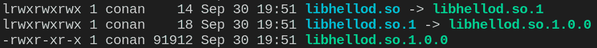

# 第三章：创建一个 CMake 项目

到现在为止，你应该已经熟悉了如何使用 CMake 及其基本概念，如两阶段构建。目前，我们只讨论了如何使用 CMake 与现有代码配合，但更有趣的部分是如何使用 CMake 构建应用程序。在本章中，你将学习如何构建可执行文件和库，并学习如何将它们一起使用。我们将深入探讨创建不同类型的库，并展示一些关于如何构建 CMake 项目的好实践。由于库通常伴随着多种编译器设置，我们将学习如何设置它们，并在必要时将这些设置传递给依赖库。由于项目中的依赖关系可能变得相当复杂，我们还将学习如何可视化不同目标之间的依赖关系。

本章将涵盖以下主题：

+   设置项目

+   创建一个“hello world”可执行文件

+   创建一个简单的库

+   整合它们

# 技术要求

和之前的章节一样，所有示例都已使用 CMake 3.21 测试，并在以下编译器之一上运行：

+   GCC 9 或更新版本

+   Clang 12 或更新版本

+   MSVC 19 或更新版本

本章的所有示例和源代码可以在本书的 GitHub 仓库中找到，[`github.com/PacktPublishing/CMake-Best-Practices---2nd-Edition`](https://github.com/PacktPublishing/CMake-Best-Practices---2nd-Edition)，在 `chapter03` 子文件夹中。

# 设置项目

虽然 CMake 可以处理几乎任何项目文件结构，但有一些关于如何组织文件的好实践。本书中的示例遵循以下常见模式：

```cpp
├── CMakeLists.txt
├── build
├── include/project_name
└── src
```

在一个最小化项目结构中，包含三个文件夹和一个文件。它们如下：

+   `build`：存放`build`文件和二进制文件的文件夹。当克隆一个新项目时，通常不会看到 `build` 文件夹，因为它将由 CMake 生成。它通常被命名为 `build`，但也可以有任何名称。

+   `include/project_name`：该文件夹包含所有外部可访问的公共头文件。添加一个包含项目名称的子文件夹是有帮助的，因为头文件的引用通常是通过 `<project_name/somefile.h>` 完成的，这样更容易判断头文件来自哪个库。

+   `src`：这个文件夹包含所有私有的源文件和头文件。

+   `CMakeLists.txt`：这是根 CMake 文件。`build` 文件夹几乎可以放在任何位置。将其放在项目根目录下是非常方便的。然而，我们强烈建议避免选择任何非空文件夹作为 `build` 文件夹。特别是，将构建文件放入 `include` 或 `src` 中被认为是一个不好的做法。通常会有 `test` 或 `doc` 等附加文件夹，用于组织测试和文档页面。

## 使用嵌套项目

当你将项目嵌套在彼此内部时，每个项目应当映射上面的文件结构，并且每个`CMakeLists.txt`文件应编写成使子项目能够独立构建。这意味着每个子项目的`CMakeLists.txt`文件应该指定`cmake_minimum_required`，并可选择性地定义项目。我们将在*第十章*中深入讨论大型项目和超级构建，*处理分布式仓库和依赖关系的超级构建*。

嵌套项目看起来像这样：

```cpp
├── CMakeLists.txt
├── build
├── include/project_name
├── src
└── subproject
    ├── CMakeLists.txt
    ├── include
    │   └── subproject
    └── src
```

在这里，文件夹结构在`subproject`文件夹中得到了重复。坚持这种文件夹结构并使子项目能够独立构建，可以更容易地移动项目。这也允许开发人员只构建项目的一部分，这在大型项目中尤为有用，因为在这些项目中，构建时间可能会相当长。

现在我们已经完成了文件结构的设置，接下来让我们从创建一个简单的独立可执行文件开始，不涉及任何特殊的依赖项。本章后面，我们将创建各种类型的库并将它们组合在一起。

# 创建一个“hello world”可执行文件

首先，我们将从一个简单的 hello world C++程序创建一个简单的可执行文件。下面的 C++程序将打印出`Welcome to CMake`和`Best Practices`：

```cpp
#include <iostream>
int main(int, char **) {
  std::cout << "Welcome to CMake Best Practices\n";
  return 0;
}
```

要构建这个，我们需要编译它并给可执行文件命名。让我们看看用来构建这个可执行文件的`CMakeLists.txt`文件长什么样：

```cpp
cmake_minimum_required(VERSION 3.21)
project(
    hello_world_standalone
    VERSION 1.0
    DESCRIPTION "A simple C++ project"
    HOMEPAGE_URL  https://github.com/PacktPublishing/CMake-Best-Practices---2nd-Edition
    LANGUAGES CXX
)
add_executable(hello_world)
target_sources(hello_world PRIVATE src/main.cpp)
```

在第一行`cmake_minimum_required(VERSION 3.21)`中，我们告诉 CMake 预期使用的 CMake 版本以及 CMake 将启用哪些功能。如果尝试使用低于指定版本的 CMake 构建这个项目，会导致错误。在本书中，我们使用 CMake 3.21 进行所有示例，但为了兼容性，你可以选择较低的版本。

对于这个例子，版本 3.1 将是绝对的最低要求，因为在此之前，`target_sources`命令是不可用的。一个好的做法是将`cmake_minimum_required`命令放在每个`CMakeLists.txt`文件的顶部。

接下来，使用`project()`命令设置项目。第一个参数是项目的名称——在我们的例子中是`"hello_world_standalone"`。

接下来，项目的版本设置为 1.0。接下来是简短的描述和主页的 URL。最后，`LANGUAGES CXX`属性指定我们正在构建一个 C++项目。除了项目名称，所有其他参数都是可选的。

调用`add_executable(hello_world)`命令会创建一个名为`hello_world`的目标。这也将是由这个目标创建的可执行文件的名称。

现在目标已经创建，使用`target_sources`将 C++源文件添加到目标中。在这种情况下，`hello_world`是目标名称，如`add_executable`中所指定。`PRIVATE`定义指定源文件仅用于构建此目标，并且对任何依赖的目标不可见。在作用域说明符之后，是一组相对于当前`CMakeLists.txt`文件路径的源文件列表。如果需要，可以通过`CMAKE_CURRENT_SOURCE_DIR`变量访问当前正在处理的`CMakeLists.txt`文件的位置。

源文件可以直接添加到`add_executable`函数中，或者使用`target_sources`函数单独添加。通过`target_sources`添加可以显式地定义源文件的使用范围，使用`PRIVATE`、`PUBLIC`或`INTERFACE`。然而，除`PRIVATE`外的任何指定仅对库目标有意义。当源文件直接添加到`add_executable`命令时，它们默认是`PRIVATE`的。

一个常见的模式是将项目的主可执行文件命名为项目的名称，可以通过使用`PROJECT_NAME`变量来实现，例如：

```cpp
project(hello_world
...
)
add_executable(${PROJECT_NAME})
```

尽管乍一看这似乎很方便，但这不是一个好的做法。项目的名称和目标承载着不同的语义，因此应该视为两个独立的事物，因此应避免使用`PROJECT_NAME`作为目标的名称。

可执行文件很重要，而且相对容易创建，但除非你正在构建一个巨大的整体应用，否则库是模块化和分发代码的好方式。在下一节中，我们将学习如何构建库以及如何处理不同的链接方法。

# 创建一个简单的库

创建库的过程与创建可执行文件相似，尽管由于库目标通常会被其他目标使用（无论是同一项目中的目标，还是其他项目中的目标），因此需要考虑一些额外的因素。由于库通常有一个内部部分和一个公开的 API，我们在将文件添加到项目时必须考虑这一点。

一个简单的库项目将是这样的：

```cpp
cmake_minimum_required(VERSION 3.21)
project(
  ch3_hello
  VERSION 1.0
  DESCRIPTION
    "A simple C++ project to demonstrate creating executables and
      libraries in CMake"
  LANGUAGES CXX)
add_library(hello)
add_library(ch3_hello::hello ALIAS hello)
target_sources(
  hello
  PRIVATE src/hello.cpp src/internal.cpp)
target_compile_features(hello PUBLIC cxx_std_17)
target_include_directories(
  hello
  PRIVATE src/hello
  PUBLIC include)
```

同样，文件以设置`cmake_minimum_required`和项目信息开始，你现在应该已经很熟悉这些内容了。

接下来，使用`add_library`创建库的目标——在这种情况下，库的类型未被确定。我们可以传递`STATIC`或`SHARED`来显式地确定库的链接类型。如果省略这一部分，我们允许库的任何下游使用者选择如何构建和链接它。通常，静态库最容易处理，但在编译时间和模块化分发方面有一些缺点。有关构建共享库的更多信息，请参见*共享库中的符号可见性*子部分。

如果省略库的类型，`BUILD_SHARED_LIBS`变量决定默认情况下库是作为共享库还是静态库构建。此变量不应在项目的`CMakeLists.txt`文件中无条件设置；它应始终由用户传递。

除了定义库目标外，良好的实践是还定义一个库别名，可以通过以下代码实现：

```cpp
add_library(ch3_hello::hello ALIAS hello)
```

这会创建一个别名，名为`ch3_hello::hello`，它指代`hello`目标。

接下来，使用`target_sources`添加库的源文件。第一个参数是目标名称，后面是由`PRIVATE`、`PUBLIC`或`INTERFACE`关键字分隔的源文件。在实际操作中，源文件几乎总是使用`PRIVATE`修饰符添加。`PRIVATE`和`PUBLIC`关键字指定了源文件在哪些地方用于编译。指定`PRIVATE`意味着源文件仅会在`hello`目标本身中使用。如果使用`PUBLIC`，则源文件会添加到`hello`以及任何链接到`hello`的目标中。如前所述，这通常不是期望的行为。`INTERFACE`关键字意味着源文件不会添加到`hello`中，但会添加到任何与`hello`链接的目标中。这通常只适用于头文件，而不适用于源文件。一般来说，任何指定为`PRIVATE`的目标都可以视为该目标的构建要求。标记为`PUBLIC`的源文件是构建和接口要求，而标记为`INTERFACE`的源文件仅为接口要求。最后，使用`target_include_directories`设置库的`include`目录。通过此命令指定的文件夹中的所有文件可以通过`#include <file.hpp>`（使用尖括号）而非`#include ""`来访问，尽管使用引号的版本仍然有效。`include`目录在`PRIVATE`、`PUBLIC`和`INTERFACE`的语义上与源文件类似。

`PRIVATE`包含的路径不会被包括在目标属性`INTERFACE_INCLUDE_DIRECTORIES`中。当目标依赖于库时，CMake 会读取此属性，以确定哪些`include`目录对被依赖目标可见。

由于库的 C++代码使用了与现代 C++版本相关的特性，例如 C++11/14/17/20 或即将发布的 C++23，我们必须设置`cxx_std_17`属性。由于此标准对于编译库本身以及与库的接口都是必要的，因此它设置为`PUBLIC`。只有当头文件中包含需要特定标准的代码时，才有必要将其设置为`PUBLIC`或`INTERFACE`。如果仅内部代码依赖于某个标准，则更倾向于将其设置为`PRIVATE`。通常，尽量将公共 C++标准设置为能正常工作的最低版本。也可以只启用某个现代 C++标准的特定特性，但这相对较少见。

可用的编译特性完整列表可以在[`cmake.org/cmake/help/latest/prop_gbl/CMAKE_CXX_KNOWN_FEATURES.html`](https://cmake.org/cmake/help/latest/prop_gbl/CMAKE_CXX_KNOWN_FEATURES.html)找到。

## 库别名

库别名是一种在不创建新构建目标的情况下引用库的方式，有时也被称为命名空间。一个常见的模式是为从项目安装的每个库创建一个形如`MyProject::Library`的库别名。

它们可以用于语义上将多个目标分组。它们还可以帮助避免命名冲突，特别是当项目中包含常见的目标（例如名为`utils`、`helpers`等的库）时。一个好的做法是将同一项目的所有目标放在同一个命名空间下。当你从其他项目链接库时，包含命名空间可以防止你不小心链接错误的库。被认为是好习惯的是，为所有库创建一个带有命名空间的别名，将它们分组，以便可以通过命名空间引用它们：

```cpp
add_library(ch3_hello::hello ALIAS hello)
...
target_link_libraries(SomeLibrary PRIVATE ch3_hello::hello)
```

除了帮助确定目标的来源外，CMake 还使用命名空间来识别导入的目标，并创建更好的诊断消息，正如我们在安装和打包部分中看到的，在*第四章*中，*CMake 项目的打包、部署和安装*，以及在*第五章*中，*集成第三方库和依赖管理*，我们将讲解依赖管理时也会涉及此内容。

始终使用命名空间

作为好习惯，始终使用命名空间别名目标，并通过`namespace::`前缀引用它们。

通常，当你从项目外部引用目标时，使用包含命名空间的完整名称并通过`target_link_library`添加它们。虽然别名是语义化命名 CMake 构建目标的一种方式，但它们对构建后实际生成的库文件名称的影响有限。不过，CMake 提供了方便的函数来控制命名并确保库符合不同操作系统的命名约定。

## 命名库

当你使用`add_library(<name>)`创建库时，库的名称必须在项目内全局唯一，因为名称冲突会导致错误。默认情况下，库的实际文件名是根据平台的约定构造的，例如 Linux 上的`lib<name>.so`，以及 Windows 上的`<name>.lib`或`<name>.dll`。通过设置目标的`OUTPUT_NAME`属性，可以更改文件名的默认行为。以下示例中，输出文件的名称已从`ch3_hello`更改为`hello`：

```cpp
add_library(ch3_hello)
set_target_properties(
   ch3_hello
   PROPERTIES OUTPUT_NAME hello
)
```

避免使用以`lib`为前缀或后缀的库名，因为 CMake 可能会根据平台自动在文件名的前面或后面附加适当的字符串。

共享库常用的命名约定是将版本添加到文件名中，以指定构建版本和 API 版本。通过为库目标指定`VERSION`和`SOVERSION`属性，CMake 将在构建和安装库时创建必要的文件名和符号链接：

```cpp
set_target_properties(
    hello
    PROPERTIES VERSION ${PROJECT_VERSION} # Contains 1.2.3
    SOVERSION ${PROJECT_VERSION_MAJOR} # Contains only 1
)
```

在 Linux 上，以上示例将生成名为`libhello.so.1.0.0`的文件，并且从`libhello.so`和`libhello.so.1`到实际库文件的符号链接也会创建。以下截图显示了生成的文件和指向它的符号链接：



图 3.1 – 构建时带有 SOVERSION 属性的库文件和生成的符号链接

在项目中常见的一种约定是为不同的构建配置添加不同的文件名后缀。CMake 通过设置`CMAKE_<CONFIG>_POSTFIX`全局变量或者添加`<CONFIG>_POSTFIX`属性到目标来处理这一点。如果设置了这个变量，后缀会自动添加到非可执行目标上。与大多数全局变量一样，它们应通过命令行或预设传递给 CMake，而不是硬编码在`CMakeLists.txt`文件中。

调试库的后缀也可以明确地为单个目标设置，如下例所示：

```cpp
set_target_properties(
hello
PROPERTIES DEBUG_POSTFIX d)
```

这样，在调试配置下构建时，库文件和符号链接将被命名为`libhellod.so`。由于在 CMake 中，库链接是通过目标而非文件名进行的，选择正确的文件名会自动完成，因此我们无需手动跟踪。然而，在链接共享库时需要注意的一点是符号的可见性。我们将在下一节中讨论这个问题。

## 共享库中的符号可见性

要链接共享库，链接器必须知道哪些符号可以从库外部使用。这些符号可以是类、函数、类型等，公开它们的过程称为导出。

编译器在指定符号可见性时有不同的方式和默认行为，这使得以平台无关的方式指定这一点变得有些麻烦。首先是编译器的默认可见性；GCC 和 Clang 默认假定所有符号都是可见的，而 Visual Studio 编译器默认隐藏所有符号，除非显式导出。通过设置`CMAKE_WINDOWS_EXPORT_ALL_SYMBOLS`，可以改变 MSVC 的默认行为，但这是一个粗暴的解决方法，只能在库的所有符号都应该导出的情况下使用。

虽然将所有符号设置为公开可见是确保链接顺利的简单方法，但它也有一些缺点。

通过导出所有内容，无法防止依赖目标使用内部代码。

由于每个符号都可以被外部代码使用，链接器无法丢弃死代码，因此生成的库往往会变得臃肿。如果库包含模板，这一点尤其明显，因为模板会显著增加符号的数量。

由于每个符号都被导出，唯一可以判断哪些符号应该被视为隐藏或内部的线索只能来自文档。

暴露库的内部符号可能会暴露应该保持隐藏的内容。

设置所有符号为可见

当你设置共享库中的所有符号都可见时，尤其是在关注安全问题或二进制大小很重要的情况下，要小心。

### 更改默认可见性

要更改符号的默认可见性，将`<LANG>_VISIBILITY_PRESET`属性设置为`HIDDEN`。此属性可以全局设置，也可以针对单个库目标进行设置。`<LANG>`会替换为库所使用的编程语言，例如 C++使用`CXX`，C 语言使用`C`。如果所有符号都应该是隐藏的并且要导出，它们必须在代码中特别标记。最常见的做法是指定一个预处理器定义来决定一个符号是否可见：

```cpp
class HELLO_EXPORT Hello {
…
};
```

`HELLO_EXPORT`定义将包含关于符号在库编译时是否会导出的信息，或者在链接库时是否应当导入。GCC 和 Clang 使用`__attribute__(…)`关键字来确定此行为，而在 Windows 上使用的是`_declspec(…)`。编写能够跨平台处理的头文件并不是一件容易的事，特别是当你还需要考虑库可能被构建为静态库和对象库时。幸运的是，CMake 提供了`generate_export_header`宏，它由`GenerateExportHeader`模块导入，以简化这一过程。

在以下示例中，`hello`库的符号默认设置为隐藏。然后，使用`GenerateExportHeader`模块导入的`generate_export_header`宏单独启用它们。此外，示例还将`VISIBILITY_INLINES_HIDDEN`属性设置为`TRUE`，以通过隐藏内联类成员函数来进一步减少导出符号表。设置内联符号的可见性并非严格必要，但通常在设置默认可见性时会这样做：

```cpp
add_library(hello SHARED)
set_property(TARGET hello PROPERTY CXX_VISIBILITY_PRESET "hidden")
set_property(TARGET hello PROPERTY VISIBILITY_INLINES_HIDDEN TRUE)
include(GenerateExportHeader)
generate_export_header(hello EXPORT_FILE_NAME export/hello/
  export_hello.hpp)
target_include_directories(hello PUBLIC "${CMAKE_CURRENT_BINARY_DIR}
  /export")
```

调用`generate_export_header`会在`CMAKE_CURRENT_BINARY_DIR/export/hello`目录下创建一个名为`export_hello.hpp`的文件，该文件可以在库的其他文件中包含。将这些生成的文件放在构建目录的子文件夹中是一种好的做法，这样只有部分目录会被添加到`include`路径中。生成的文件的`include`结构应该与库其他部分的`include`结构保持一致。所以，在这个例子中，如果所有公共头文件都是通过`#include <hello/a_public_header.h>`方式包含的，那么导出头文件也应该放在名为`hello`的文件夹中。生成的文件还必须添加到安装指令中，正如在*第四章*中所解释的那样，*打包、部署和安装 CMake 项目*。此外，为了生成导出文件，必须为目标设置必要的编译器标志来导出符号。

由于生成的头文件必须包含在声明要导出的类、函数和类型的文件中，因此`CMAKE_CURRENT_BINARY_DIR/export/`被添加到`target_include_directories`中。请注意，这必须是`PUBLIC`，以便依赖的库也能够找到该文件。

关于`generate_export_header`宏还有许多其他选项，但我们在本节中所看到的已经涵盖了大部分常见用例。有关设置符号可见性的更多信息，请参阅官方 CMake 文档：[`cmake.org/cmake/help/latest/module/GenerateExportHeader.html`](https://cmake.org/cmake/help/latest/module/GenerateExportHeader.html)。

## 接口库或头文件库

头文件库有点特殊，因为它们不需要编译；相反，它们导出自己的头文件，以便可以直接在其他库中包含。在大多数方面，头文件库的工作方式与普通库相似，但它们的头文件是通过`INTERFACE`关键字公开的，而不是通过`PUBLIC`关键字。

由于头文件库不需要编译，它们不会将源代码添加到目标中。以下代码创建了一个最小的头文件库：

```cpp
project(
  ch3_hello_header_only
  VERSION 1.0
  DESCRIPTION "Chapter 3 header-only example"
  LANGUAGES CXX)
add_library(hello_header_only INTERFACE)
target_include_directories(hello_header_only INTERFACE include/)
target_compile_features( hello_header_only INTERFACE cxx_std_17)
```

还值得注意的是，在 CMake 版本`3.19`之前，`INTERFACE`库不能添加任何`target_sources`。现在，头文件库可以列出源代码，但这种用法很少见。

### 对象库——仅供内部使用

有时，你可能想要拆分代码，以便某些部分可以被重用，而无需创建完整的库。一个常见的做法是，当你想在可执行文件和单元测试中使用一些代码，而无需重新编译所有内容两次时。

为此，CMake 提供了对象库，其中源代码会被编译，但不会被归档或链接。通过调用`add_library(MyLibrary OBJECT)`来创建一个对象库。

自 CMake 3.12 以来，这些目标可以像普通库一样通过将它们添加到`target_link_libraries`函数中来使用。在 3.12 版本之前，目标库需要通过生成表达式添加，即`$<TARGET_OBJECTS:MyLibrary>`。这将在构建系统生成期间扩展为一个对象列表。虽然这仍然可以做到，但不再推荐这样做，因为它会迅速变得难以维护，尤其是在项目中有多个目标库的情况下。

何时使用目标库

目标库有助于加速构建和模块化代码，而无需将模块公开。

使用目标库时，所有不同类型的库都被涵盖。库本身编写和维护都很有趣，但除非它们集成到更大的项目中，否则它们什么也做不了。所以，让我们看看到目前为止我们定义的所有库如何在可执行文件中使用。

# 汇总 - 使用你的库

到目前为止，我们已经创建了三种不同的库——一个二进制库，可以静态或动态链接，一个接口或仅头文件库，以及一个已预编译但未链接的目标库。

让我们学习如何在共享项目中将它们用于可执行文件。将它们作为系统库安装或作为外部依赖项使用将在*第五章*，*集成第三方库*和*依赖管理*中讨论。

所以，我们可以将`add_library`调用放在同一个`CMakeLists.txt`文件中，或者通过使用`add_subdirectory`将它们集成在一起。两者都是有效的选项，具体取决于项目的设置，如本章的*设置项目*和*处理嵌套项目*部分所述。

在下面的示例中，我们假设在`hello_lib`、`hello_header_only`和`hello_object`目录中已定义了三个带有`CMakeLists.txt`文件的库。这些库可以通过`add_subdirectory`命令包含进来。在这里，我们创建了一个名为`chapter3`的新目标，即我们的可执行文件。然后，通过`target_link_libraries`将这些库添加到可执行文件中：

```cpp
add_subdirectory(hello_lib)
add_subdirectory(hello_header_only)
add_subdirectory(hello_object)
add_executable(chapter3)
target_sources(chapter3 PRIVATE src/main.cpp)
target_link_libraries(chapter3 PRIVATE hello_header_only hello_lib
  hello_object)
```

`target_link_libraries`的目标可以是一个可执行文件，也可以是另一个库。同样，库是通过访问说明符进行链接的，访问说明符可以是以下之一：

+   `PRIVATE`：该库用于链接，但它不是公共接口的一部分。链接的库只有在构建目标时才是必需的。

+   `INTERFACE`：该库不会被链接，但它是公共接口的一部分。当你在其他地方使用该目标时，链接的库是必需的。这通常只在你链接其他只包含头文件的库时使用。

+   `PUBLIC`：该库被链接，并且它是公共接口的一部分。因此，该库既是构建依赖项，也是使用依赖项。

注意 – 不良做法

本书的作者强烈不推荐以下做法，因为它们往往会创建难以维护的项目，并使得在不同的构建环境之间移植变得困难。不过，我们将其包括在内以确保内容的完整性。

在 `PUBLIC`、`PRIVATE` 或 `INTERFACE` 后面传递另一个目标时，您还可以传递库的完整路径或库的文件名，例如 `/usr/share/lib/mylib.so` 或仅 `mylib.so`。这些做法是可以实现的，但不推荐使用，因为它们会使 CMake 项目变得不易移植。此外，您还可以通过传递类似 `-nolibc` 这样的内容来传递链接器标志，尽管同样不推荐这样做。如果所有目标都需要特殊的链接器标志，最好通过命令行传递它们。如果单个库需要特殊的标志，则使用 `target_link_options` 是推荐的做法，最好与命令行上设置的选项结合使用。

在下一节中，我们将讨论如何设置编译器和链接器选项。

## 设置编译器和链接器选项

C++ 编译器有很多选项，涉及一些常见的标志设置，同时从外部设置预处理器定义也是一种常见做法。在 CMake 中，这些选项是通过 `target_compile_options` 命令传递的。更改链接器行为则通过 `target_link_options` 命令实现。不幸的是，编译器和链接器可能在设置标志的方式上有所不同。例如，在 GCC 和 Clang 中，选项是通过连字符（`-`）传递的，而 Microsoft 编译器则使用斜杠（`/`）作为选项的前缀。但通过使用生成器表达式（在*第一章*《启动 CMake》中介绍过），可以方便地在 CMake 中处理这些差异，以下是一个示例：

```cpp
target_compile_options(
  hello
  PRIVATE $<$<CXX_COMPILER_ID:MSVC>:/SomeOption>
          $<$<CXX_COMPILER_ID:GNU,Clang,AppleClang>:-someOption>
)
```

让我们详细看看这个生成器表达式。

`$<$<CXX_COMPILER_ID:MSVC>:/SomeOption>` 是一个嵌套的生成器表达式，按从内到外的顺序进行求值。生成器表达式在构建系统生成期间进行求值。首先，`$<CXX_COMPILER_ID:MSVC>` 如果 C++ 编译器为 `MSVC`，则求值为 `true`。如果是这种情况，那么外部表达式将返回 `/SomeOption`，然后传递给编译器。如果内部表达式求值为 `false`，则什么都不会传递。

`$<$<CXX_COMPILER_ID:GNU,Clang,AppleClang>:-fopenmp>` 类似地工作，但它不仅检查单一的值，而是传递一个包含 `GNU,Clang,AppleClang` 的列表。如果 `CXX_COMPILER_ID` 与这些值中的任何一个匹配，则内部表达式求值为 `true`，并将 `someOption` 传递给编译器。

将编译器或链接器选项传递为 `PRIVATE` 标记它们是此目标的构建要求，而不需要在库接口中使用。如果将 `PRIVATE` 替换为 `PUBLIC`，则编译选项也会成为一个使用要求，所有依赖于原始目标的目标将使用相同的编译选项。将编译器选项暴露给依赖目标需要谨慎处理。如果某个编译选项仅用于使用目标，但不用于构建目标，则可以使用 `keyword INTERFACE`。这通常出现在构建仅包含头文件的库时。

编译选项的特殊情况是预处理器或编译定义，这些定义会传递给底层程序。它们是通过 `target_compile_definitions` 函数传递的。

### 使用编译数据库调试编译选项

要查看所有编译选项，可以查看生成的构建文件，例如 Makefile 或 Visual Studio 项目。更方便的方法是让 CMake 将所有编译命令导出为 JSON 编译数据库。

通过启用 `CMAKE_EXPORT_COMPILE_COMMANDS` 变量，CMake 会在 `build` 文件夹中创建一个名为 `compile_commands.json` 的文件，里面包含完整的编译命令。

启用此选项并运行 CMake 后，将生成类似以下内容的结果：

```cpp
{
  "directory": "/workspaces/CMake-Best-Pracitces/build",
  "command": "/usr/bin/g++ -I/workspaces/CMake-Best-Practices/
  chapter_3/hello_header_only/include -I/workspaces/CMake-Tips-and-
  Tricks/chapter_3/hello_lib/include -I/workspaces/CMake-Tips-and-
  Tricks/chapter_3/hello_object_lib/include -g -fopenmp -o
  chapter_3/CMakeFiles/chapter3.dir/src/main.cpp.o -c /workspaces
  /CMake-Best-Practices/chapter_3/src/main.cpp",
  "file": "/workspaces/CMake-Best-Practices/chapter_3/src/main.cpp"
},
```

注意从之前示例中手动指定的 `-fopenMP` 标志的添加。`compile_commands.json` 可以作为一种与构建系统无关的方式来加载命令。一些 IDE，如 VS Code 和 Clion，能够解析该 JSON 文件并自动生成项目信息。

编译命令数据库的完整规范可以在 [`clang.llvm.org/docs/JSONCompilationDatabase.html`](https://clang.llvm.org/docs/JSONCompilationDatabase.html) 找到。

目前，越来越多的工具使用 `compile_commands.json` 数据库来确定传递的确切编译选项，因此许多项目默认启用此功能。特别是，大多数来自 LLVM 的工具，例如 `clang-tidy` 静态分析工具或用于代码补全的 `clangd`，都能从访问编译数据库中获益匪浅。如果编译选项出现问题，也可以通过该数据库方便地调试编译选项：[`clang.llvm.org/docs/JSONCompilationDatabase.html`](https://clang.llvm.org/docs/JSONCompilationDatabase.html)。

# 总结

现在你已经完成了本章的内容，准备好使用 CMake 创建应用程序和库，并开始构建比“hello world”更复杂的项目。你已经学会了如何将不同的目标链接在一起，以及如何将编译器和链接器选项传递给目标。我们还讨论了仅供内部使用的对象库，并讲解了共享库的符号可见性。最后，你学会了如何自动化文档化这些依赖关系，以便对大型项目有一个概览。

在下一章中，你将学习如何在不同平台上打包和安装你的应用程序和库。

# 问题

请回答以下问题，测试你对本章的理解：

1.  创建可执行目标的 CMake 命令是什么？

1.  创建库目标的 CMake 命令是什么？

1.  如何指定一个库是静态链接还是动态链接？

1.  对象库有什么特别之处，在哪里使用它们最为方便？

1.  如何指定共享库的默认符号可见性？

1.  如何为目标指定编译器选项，如何查看编译命令？

# 答案

1.  创建可执行目标的 CMake 命令是：

    `add_executable`

1.  创建库目标的 CMake 命令是：

    `add_library`

1.  通过添加 `SHARED` 或 `STATIC` 关键字，或者设置 `BUILD_SHARED_LIBS` 全局变量

1.  对象库是已编译但未链接的库。它们用于在内部分离代码，并减少编译时间。

1.  通过全局设置 `<LANG>_VISIBILITY_PRESET` 属性

1.  通过调用 `target_compile_options` 函数。编译选项可以在 `compile_commands.json` 文件中查看，该文件会在将 `CMAKE_EXPORT_COMPILE_COMMANDS` 变量设置为 `true` 时生成。
