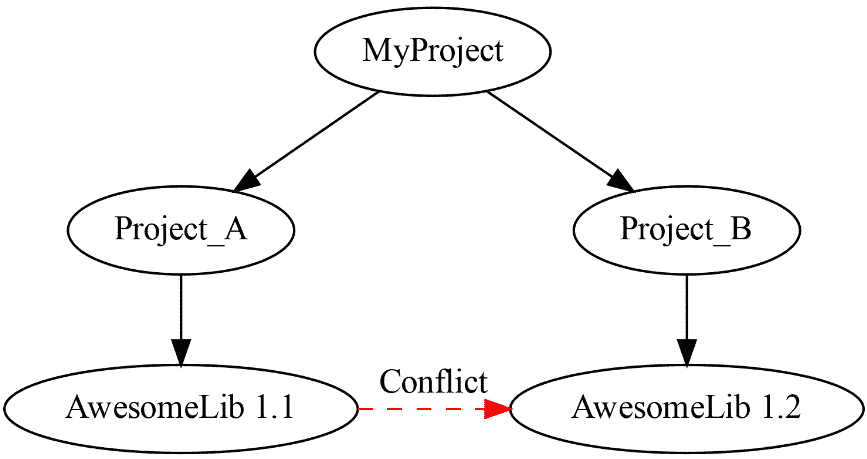
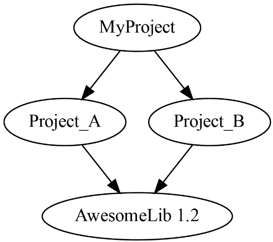

# 第五章：集成第三方库和依赖管理

迄今为止，在本书中，我们已经介绍了如何使用**CMake**构建和安装我们自己的代码。在本章中，我们将探讨如何使用那些不是 CMake 项目一部分的文件、库和程序。本章的第一部分将讲解如何一般性地查找这些内容，而后半部分将专注于如何管理依赖关系，以便构建你的 CMake 项目。

使用 CMake 的一个最大优势是，它内置了依赖管理功能，用于发现许多第三方库。在本章中，我们将探讨如何集成已安装在系统上的库和本地下载的依赖项。此外，你还将学习如何将第三方库作为二进制文件下载并使用，或者如何从源代码直接在 CMake 项目中构建它们。

我们将探讨如何为 CMake 编写指令，以便可靠地查找系统上的几乎任何库。最后，我们将看看如何在 CMake 中使用 Conan 和 vcpkg 等包管理器。依赖管理的实践，如本章所述，将帮助你创建稳定和可移植的 CMake 构建。不管你是使用预编译的二进制文件，还是从头开始编译它们，设置 CMake 以结构化且一致的方式处理依赖关系，将减少未来修复损坏构建时所花费的时间。以下是我们将在本章中讨论的主要主题：

+   使用 CMake 查找文件、程序和路径

+   在 CMake 项目中使用第三方库

+   在 CMake 中使用包管理器

+   获取依赖项作为源代码

+   依赖提供者 – 获取依赖的新方式

# 技术要求

与前几章一样，所有示例都使用 CMake 3.24 进行测试，并能在以下任何编译器上运行：

+   GCC 9 或更新版本

+   Clang 12 或更新版本

+   MSVC 19 或更新版本

此外，一些示例需要安装 OpenSSL 3 才能编译。某些示例从各种在线位置拉取依赖项，因此还需要互联网连接。所有示例和源代码都可以从本书的 GitHub 仓库获得，地址是 [`github.com/PacktPublishing/CMake-Best-Practices---2nd-Edition/`](https://github.com/PacktPublishing/CMake-Best-Practices---2nd-Edition/)。

外部包管理器的示例需要在系统上安装 Conan（版本 1.40 或更新）和 vcpkg 才能运行。你可以在这里获取这些软件：

+   **Conan**: [`conan.io/`](https://conan.io/)

+   **Vcpkg**: [`github.com/microsoft/vcpkg`](https://github.com/microsoft/vcpkg)

# 使用 CMake 查找文件、程序和路径

大多数项目很快会增长到一个规模和复杂性，依赖于项目外部管理的文件、库，甚至可能是程序。CMake 提供了内置命令来查找这些内容。乍一看，搜索和查找内容的过程似乎非常简单。然而，经过仔细分析，实际上需要考虑很多因素。首先，我们必须处理查找文件或程序时的搜索顺序。然后，我们可能需要添加更多可能包含文件的位置，最后，还必须考虑不同操作系统之间的差异。

在比单个文件更高的抽象层级上，CMake 可以查找定义了目标、包含路径和特定于包的变量的整个包。更多细节请参见*在 CMake 项目中使用第三方库*一节。

有五个 `find_...` 命令，它们共享非常相似的选项和行为：

+   `find_file`：用于定位单个文件

+   `find_path`：用于查找包含特定文件的目录

+   `find_library`：用于查找库文件

+   `find_program`：用于查找可执行程序

+   `find_package`：用于查找完整的包集合

这些命令的工作方式类似，但在查找位置方面有一些小但重要的差异。特别是，`find_package` 不仅仅是定位文件；它不仅查找包，还将文件内容提供给 CMake 项目，方便使用。在本章中，我们将首先介绍较简单的 `find` 函数，然后再讲解如何查找复杂的包。

## 查找文件和路径

查找最底层和最基本的内容是文件和路径。`find_file` 和 `find_path` 函数具有相同的签名。它们的唯一区别是，`find_path` 将文件找到的目录存储在结果中，而 `find_file` 会存储包括文件名在内的完整路径。`find_file` 命令的签名如下所示：

```cpp
find_file (
          <VAR>
          name | NAMES name1 [name2 ...]
          [HINTS [path | ENV var]... ]
          [PATHS [path | ENV var]... ]
          [PATH_SUFFIXES suffix1 [suffix2 ...]]
          [DOC "cache documentation string"]
          [NO_CACHE]
          [REQUIRED]
          [NO_DEFAULT_PATH]
          [NO_PACKAGE_ROOT_PATH]
          [NO_CMAKE_PATH]
          [NO_CMAKE_ENVIRONMENT_PATH]
          [NO_SYSTEM_ENVIRONMENT_PATH]
          [NO_CMAKE_SYSTEM_PATH]
          [CMAKE_FIND_ROOT_PATH_BOTH |
           ONLY_CMAKE_FIND_ROOT_PATH |
           NO_CMAKE_FIND_ROOT_PATH]
         )
```

上述命令要么直接搜索单个文件（如果名称已直接传递），要么搜索可能的名称列表（如果使用了 `NAMES` 选项）。结果路径会存储在传递的 `<VAR>` 变量中。如果文件无法找到，变量将包含 `<VARIABLENAME>-NOTFOUND`。

传递一个名称列表在搜索文件时非常有用，特别是当文件名存在变体时，例如大小写不同或命名约定不同，可能包含或不包含版本号等。传递名称列表时，名称应按首选顺序排序，因为一旦找到第一个文件，搜索就会停止。

搜索包含版本号的文件

推荐在搜索包含版本号的文件之前，先搜索没有版本号的文件名。这是为了确保本地构建的文件优先于操作系统安装的文件。

`HINTS` 和 `PATHS` 选项包含附加的位置，文件将在这些位置下进行搜索。`PATH_SUFFIXES` 可以包含几个子目录，这些子目录将在其他位置下进行搜索。

`find_…` 命令在定义的地方并按定义的顺序搜索内容。命令的 `NO_..._PATH` 参数可用于跳过相应的路径。下表显示了搜索位置的顺序以及跳过位置的选项：

| **位置** | **命令中的跳过选项** |
| --- | --- |
| 包根变量 | `NO_PACKAGE_ROOT_PATH` |
| CMake 特定的缓存变量 | `NO_CMAKE_PATH` |
| CMake 特定的环境变量 | `NO_CMAKE_ENVIRONMENT_PATH` |
| 来自 `HINTS` 选项的路径 |  |
| 系统特定的环境变量 | `NO_SYSTEM_ENVIRONMENT_PATH` |
| 系统特定的缓存变量 | `NO_CMAKE_SYSTEM_PATH` |
| 来自 `PATHS` 选项的路径 |  |

让我们更仔细地看一下搜索顺序以及不同位置的含义：

+   `find_file` 是 `find_package` 命令的一部分。有关详细讨论，请参考 *在 CMake 项目中使用第三方库* 部分。

+   `CMAKE_PREFIX_PATH`、`CMAKE_INCLUDE_PATH` 和 `CMAKE_FRAMEWORK_PATH` 是 macOS 的缓存变量。通常，设置 `CMAKE_PREFIX_PATH` 缓存变量比其他两种类型更为优选，因为它用于所有的 `find_` 命令。前缀路径是进行搜索的基准点，常见的文件结构如 `bin`、`lib`、`include` 等都位于该路径下。`CMAKE_PREFIX_PATH` 是路径列表，对于每个条目，`find_file` 将在 `<prefix>/include` 或 `<prefix>/include/${CMAKE_LIBRARY_ARCHITECTURE}` 下搜索（如果相应的变量已被设置）。通常，CMake 会自动设置这些变量，开发人员不应更改它们。特定架构的路径优先于通用路径。

+   如果标准目录结构不适用，则应仅使用 `CMAKE_INCLUDE_PATH` 和 `CMAKE_FRAMEWORK_PATH` 缓存变量。它们不会在路径中添加额外的 `include` 后缀。

+   通过将 `NO_CMAKE_PATH` 选项传递给命令，或者通过全局设置 `CMAKE_FIND_USE_PATH` 变量为 `false`，可以跳过这些路径的搜索。

+   `CMAKE_PREFIX_PATH`、`CMAKE_INCLUDE_PATH` 和 `CMAKE_FRAMEWORK_PATH` 是系统环境变量。这些变量的工作方式与缓存变量相同，但通常是从 CMake 调用外部设置的。

+   请注意，在 Unix 平台上，列表是通过冒号 (`:`) 分隔的，而不是分号 (`;`)，以符合平台特定的环境变量。

+   来自 `HINTS` 选项的路径是手动指定的附加搜索位置。它们可以从其他值（如属性值）构造，或者可能依赖于先前找到的文件或路径。

+   `INCLUDE` 和 `PATH` 环境变量每个都可以包含一个目录列表供查找。再者，在 Unix 平台上，列表用冒号 (`:`) 分隔，而不是分号 (`;`)。

    +   在 Windows 上，`PATHS` 条目的处理方式更为复杂。对于每个条目，通过删除任何尾部的 `bin` 或 `sbin` 目录来提取基础路径。如果设置了 `CMAKE_LIBRARY_ARCHITECTURE`，则会将 `include/${CMAKE_LIBRARY_ARCHITECTURE}` 子目录作为每个路径的优先级进行添加。之后，会搜索 `include`（不带后缀）。然后，再搜索原始路径，这个路径可能以 `bin` 或 `sbin` 结尾，也可能不以其结尾。如果传递了 `NO_SYSTEM_ENVIRONMENT_PATH` 变量或将 `CMAKE_FIND_USE_CMAKE_SYSTEM_PATH` 变量设置为 `false`，将跳过环境变量中的位置。

    +   假设 `PATH` 选项包含 `C:\myfolder\bin;C:\yourfolder`，并且设置了 `CMAKE_LIBRARY_ARCHITECTURE` 为 `x86_64`，则搜索顺序如下：

        1.  `C:\myfolder\include\x86_64`

        1.  `C:\myfolder\include\`

        1.  `C:\myfolder\bin`

        1.  `C:\yourfolder\include\x86_64`

        1.  `C:\yourfolder\include\`

        1.  `C:\yourfolder\`

+   `CMAKE_SYSTEM_PREFIX_PATH` 和 `CMAKE_SYSTEM_FRAMEWORK_PATH` 变量的作用类似于 CMake 特定的缓存变量。这些变量不应由开发者修改，而是当 CMake 设置平台工具链时进行配置。唯一的例外是当提供了工具链文件时，例如使用 sysroot 或进行交叉编译时，如在 *第十二章* 中解释的，*跨平台编译与* *自定义工具链*。

+   除了 `NO_CMAKE_SYSTEM_PATH` 选项，`CMAKE_FIND_USE_CMAKE_SYSTEM_PATH` 变量可以设置为 `false`，以跳过系统特定缓存变量提供的位置。

+   与 `HINTS` 选项一样，`PATHS` 选项中指定的路径是手动提供的附加搜索位置。虽然技术上没有禁止，按照惯例，`PATHS` 变量应是固定路径，不应依赖于其他值。

如果只希望搜索由 `HINTS` 或 `PATHS` 提供的位置，添加 `NO_DEFAULT_PATH` 选项将跳过所有其他位置。

有时，你可能希望忽略某些特定的搜索路径。在这种情况下，可以在 `CMAKE_IGNORE_PATH` 或 `CMAKE_SYSTEM_IGNORE_PATH` 中指定路径列表。这两个变量是为交叉编译场景设计的，其他情况下很少使用。

### 查找交叉编译时的文件

进行交叉编译时，查找文件的过程通常有所不同，因为交叉编译工具链被收集在其自身的独立目录结构下，这与系统工具链不混合。通常，首先你会想要在工具链的目录中查找文件。通过设置 `CMAKE_FIND_ROOT` 变量，可以将所有查找的源更改为新位置。

此外，`CMAKE_SYSROOT`、`CMAKE_SYSROOT_COMPILE`和`CMAKE_SYSROOT_LINK`变量会影响搜索位置，但它们只应在工具链文件中设置，而不是由项目本身设置。如果任何常规搜索位置已经在 sysroot 中或由`CMAKE_FIND_ROOT`指定的位置下，它们将不会被更改。任何以波浪号（`~`）开头的路径，并传递给`find_`命令时，不会被更改，以避免跳过位于用户主目录下的目录。

默认情况下，CMake 首先在前述段落中提供的任何变量指定的位置进行搜索，然后继续搜索主机系统。通过将`CMAKE_FIND_ROOT_PATH_MODE_INCLUDE`变量设置为`BOTH`、`NEVER`或`ONLY`，可以全局更改此行为。或者，您可以将`find_file`的`CMAKE_FIND_ROOT_PATH_BOTH`选项、`ONLY_CMAKE_FIND_ROOT_PATH`选项或`NO_CMAKE_FIND_ROOT_PATH`选项进行设置。

下表显示了在不同搜索模式下设置任何选项或变量时的搜索顺序：

| **模式** | **选项** | **搜索顺序** |
| --- | --- | --- |
| `BOTH` | `CMAKE_FIND_ROOT_PATH_BOTH` |

+   `CMAKE_FIND_ROOT_PATH`

+   `CMAKE_SYSROOT_COMPILE`

+   `CMAKE_SYSROOT_LINK`

+   `CMAKE_SYSROOT`

+   所有常规搜索位置

|

| `NEVER` | `NO_CMAKE_FIND_ROOT_PATH` |
| --- | --- |

+   所有常规搜索位置

|

| `ONLY` | `ONLY_CMAKE_FIND_ROOT_PATH` | `CMAKE_FIND_ROOT_PATH`

+   `CMAKE_SYSROOT_COMPILE`

+   `CMAKE_SYSROOT_LINK`

+   `CMAKE_SYSROOT`

+   任何常规路径，其他位置之一，或`CMAKE_STAGING_PREFIX`下

|

`CMAKE_STAGING_PREFIX`变量用于为交叉编译提供安装路径。通过安装内容到其中，`CMAKE_SYSROOT`不应被更改。关于交叉编译工具链的设置，我们将在*第十二章*，“*跨平台编译与自定义工具链*”中详细讨论。

## 查找程序

查找可执行文件与查找文件和路径非常相似，`find_program`命令的签名几乎与`find_file`相同。此外，`find_program`有`NAMES_PER_DIR`选项，指示命令一次只搜索一个目录，并在每个目录中搜索所有提供的文件名，而不是在每个文件中搜索每个目录。

在 Windows 上，`.exe`和`.com`文件扩展名会自动添加到提供的文件名中，但`.bat`或`.cmd`不会。

`find_program`使用的缓存变量与`find_file`使用的缓存变量略有不同：

+   `find_program`会自动将`bin`和`sbin`添加到由`CMAKE_PREFIX_PATH`提供的搜索位置中

+   `CMAKE_LIBRARY_ARCHITECTURE`中的值会被忽略，并且没有任何效果

+   `CMAKE_PROGRAM_PATH`替代了`CMAKE_INCLUDE_PATH`

+   `CMAKE_APPBUNDLE_PATH`替代了`CMAKE_FRAMEWORK_PATH`

+   `CMAKE_FIND_ROOT_PATH_MODE_PROGRAM`用于更改查找程序的模式

与其他`find`命令一样，`find_program`会在 CMake 无法找到程序时设置`<varname>-NOTFOUND`变量。这通常对于判断是否启用某个依赖特定外部程序的自定义构建步骤非常有用。

## 查找库

查找库是查找文件的一种特殊情况，因此`find_library`命令支持与`find_file`相同的选项集。此外，与`find_program`命令类似，它还有额外的`NAMES_PER_DIR`选项，该选项会首先检查所有文件名，然后再进入下一个目录。查找常规文件和查找库之间的区别在于，`find_library`会自动根据平台特定的命名约定来处理文件名。在 Unix 平台上，文件名前会加上`lib`，而在 Windows 上，会添加`.dll`或`.lib`扩展名。

同样，缓存变量与`find_file`和`find_program`中使用的变量略有不同：

+   `find_library`通过`CMAKE_PREFIX_PATH`将`lib`添加到搜索路径中，并使用`CMAKE_LIBRARY_PATH`代替`CMAKE_INCLUDE_PATH`来查找库。`CMAKE_FRAMEWORK_PATH`变量的使用方式类似于`find_file`。`CMAKE_LIBRARY_ARCHITECTURE`变量与`find_file`中的用法相同。

+   通过将相应的文件夹附加到搜索路径来实现此操作。`find_library`以与`find_file`相同的方式搜索`PATH`环境变量中的位置，但会在每个前缀中附加`lib`。另外，如果已设置`LIB`环境变量，它将使用该变量，而不是使用`INCLUDE`变量。

+   `CMAKE_FIND_ROOT_PATH_MODE_LIBRARY`用于更改搜索库的模式。

CMake 通常会识别 32 位和 64 位搜索位置的命名约定，例如某些平台使用`lib32`和`lib64`文件夹来存放同名的不同库。此行为由`FIND_LIBRARY_USE_LIB[32|64|X32]_PATHS`变量控制，该变量决定了应先搜索什么。项目还可以使用`CMAKE_FIND_LIBRARY_CUSTOM_LIB_SUFFIX`变量定义自己的后缀，从而覆盖其他变量的行为。然而，通常情况下不需要这样做，修改`CMakeLists.txt`文件中的搜索顺序会迅速使项目变得难以维护，并且对不同系统之间的可移植性产生重大影响。

### 查找静态库或共享库

在大多数情况下，直接将库的基本名称传递给 CMake 就足够了，但有时需要覆盖默认行为。这样做的原因之一是，在某些平台上，应该优先使用库的静态版本而不是共享版本，或者反之。最好的方法是将`find_library`调用拆分为两个调用，而不是试图在一个调用中实现此目标。如果静态库和动态库位于不同的目录中，这样的做法更为稳健：

```cpp
find_library(MYSTUFF_LIBRARY libmystuff.a)
find_library(MYSTUFF_LIBRARY mystuff)
```

在 Windows 上，这种方法无法使用，因为静态库和 DLL 的导入库具有相同的 `.lib` 后缀，因此无法通过名称区分它们。`find_file`、`find_path`、`find_program` 和 `find_library` 命令在查找特定内容时非常有用。另一方面，查找依赖项发生在更高的层次。这正是 CMake 擅长的地方，通过提供 `find_package` 方法。使用 `find_package`，我们无需首先查找所有的 `include` 文件，再查找所有的库文件，然后手动将它们添加到每个目标中，最后还要考虑所有平台特有的行为。接下来，让我们深入了解如何查找依赖项的过程。

# 在 CMake 项目中使用第三方库

如果你在认真实践软件开发，迟早你会遇到项目依赖外部库的情况。与其寻找单独的库文件或头文件，推荐的将第三方代码集成到 CMake 项目的方式是使用 `find_package` 命令来使用 CMake 包。包为 CMake 和生成的构建系统提供了有关依赖项的一系列信息。它们可以以两种形式集成到项目中，分别是通过它们的配置详情（也称为 *config 包）或所谓的 `find` 模块包。配置包通常由上游项目提供，而使用 `find` 模块的包通常由 CMake 本身或使用该包的项目定义。两种类型的包都可以通过 `find_package` 查找，结果是一组导入的目标和/或一组包含与构建系统相关的信息的变量。

`findPkgConfig` 模块使用 [freedesktop.org](https://www.freedesktop.org/wiki/) 提供的 `pkg-config` 工具查找依赖项的相关元信息，也间接地支持包。

通常，`find` 模块用于定位依赖项，例如当上游没有提供包配置所需的信息时。它们不应与 CMake 工具模块混淆，后者是与 `include()` 一起使用的。

尽量使用上游提供的包，而不是使用 `find` 模块。

如果可能，使用上游来源提供的包，而不是创建 `find` 模块。如果上游项目缺少必要的信息，尽量在源头上修复，而不是编写一个新的 `find` 模块。

请注意，`find_package` 命令有两种签名：基本的或简短的签名和完整的或长的签名。在几乎所有场景中，使用简短的签名就足够找到了我们需要的包，并且它应该更受青睐，因为它更容易维护。简短形式支持模块包和配置包，而长形式仅支持配置模式。

简短模式的签名如下：

```cpp
find_package(<PackageName> [version] [EXACT] [QUIET] [MODULE]
             [REQUIRED] [[COMPONENTS] [components...]]
             [OPTIONAL_COMPONENTS components...]
             [NO_POLICY_SCOPE])
```

假设我们想编写一个程序，通过使用 OpenSSL 库的适当功能将字符串转换为 SHA-256 哈希。为了编译和链接这个例子，我们必须告诉 CMake 项目需要 OpenSSL 库，然后将其附加到目标上。暂时假设所需的库已经通过默认位置安装在您的系统上；例如，通过使用 Linux 的常规包管理器如 apt、RPM 或类似的工具，Windows 的 Chocolatey，或 macOS 的 brew。

一个样例 `CMakeLists.txt` 文件可能如下所示：

```cpp
find_package(OpenSSL REQUIRED COMPONENTS SSL)
add_executable(find_package_example)
target_link_libraries(find_package_example PRIVATE OpenSSL::SSL)
```

前述示例执行以下操作：

1.  在示例的第一行中，有一个 `find_package(OpenSSL REQUIRED COMPONENTS SSL)` 调用。这告诉 CMake 我们正在寻找 OpenSSL 的一组库和头文件。具体来说，我们正在寻找 *SSL* 组件，并忽略 OpenSSL 包提供的任何其他组件。`REQUIRED` 关键字告诉 CMake 找到此包对于构建此项目是必需的。如果找不到该包，CMake 将失败并显示错误。

1.  一旦找到了包，我们告诉 CMake 使用 `target_link_libary` 将库链接到目标。具体地，我们告诉 CMake 链接由 OpenSSL 包提供的 `OpenSSL::SSL` 目标。

如果一个依赖项必须是特定版本，则可以指定为 `major[.minor[.patch[.tweak]]]` 格式的单个版本，或者作为 `versionMin..[<]versionMax` 格式的版本范围。对于版本范围，`versionMin` 和 `versionMax` 应具有相同的格式，通过指定 `<`，将排除上限版本。在这种情况下，`find_package` 调用将看起来像这样：

```cpp
find_package(OpenSSL 3.0 REQUIRED)
```

这将告诉 CMake 查找任何版本为 3.0.x 的 OpenSSL。在这种情况下，补丁级别的数字将被忽略以匹配版本号。如果版本需要精确匹配，可以指定 `EXACT` 关键字，但这很少使用。

不幸的是，截至 2024 年 5 月，CMake 无法查询模块以获取可用的组件。因此，我们必须依赖于模块或库提供者的文档来查找可用的组件。可以使用以下命令查询可用的模块：

```cpp
cmake --help-module-list #< lists all available modules
cmake --help-module <mod> #< prints the documentation for module
  <mod>
cmake --help-modules #< lists all modules and their documentation
```

可以在 [`cmake.org/cmake/help/latest/manual/cmake-modules.7.html`](https://cmake.org/cmake/help/latest/manual/cmake-modules.7.html) 找到一系列与 CMake 一起提供的模块。

查找单独的库和文件

可以查找单独的库和文件，但首选方式是使用包。在 *编写您自己的查找模块* 部分将介绍如何查找单独的文件并使其可用于 CMake。

在模块模式下运行时，`find_package` 命令会查找名为 `Find<PackageName>.cmake` 的文件；首先在由 `CMAKE_MODULE_PATH` 指定的路径中查找，然后在 CMake 安装提供的 `find` 模块中查找。如果你想了解如何创建 CMake 包，可以查看 *第四章*，*CMake 项目的打包、部署与安装*。

在配置模式下运行时，`find_package` 会按照以下模式查找文件：

+   `<``小写包名>-config.cmake`

+   `<``PackageName>Config.cmake`

+   `<小写包名>-config-version.cmake`（如果指定了版本详情）

+   `<PackageName>ConfigVersion.cmake`（如果指定了版本详情）

所有搜索将按照一组明确定义的顺序进行；如果需要，某些位置可以通过将相应的选项传递给 CMake 来跳过。`find_package` 比其他 `find_` 命令包含更多选项。下表显示了搜索顺序的高级概述：

| **位置** | **命令中的跳过选项** |
| --- | --- |
| 包根变量 | `NO_PACKAGE_ROOT_PATH` |
| CMake 特定缓存变量 | `NO_CMAKE_PATH` |
| CMake 特定环境变量 | `NO_CMAKE_ENVIRONMENT_PATH` |
| 在 `HINTS` 选项中指定的路径 |  |
| 系统特定环境变量 | `NO_SYSTEM_ENVIRONMENT_PATH` |
| 用户包注册表 | `NO_CMAKE_PACKAGE_REGISTRY` |
| 系统特定缓存变量 | `NO_CMAKE_SYSTEM_PATH` |
| 系统包注册表 | `NO_CMAKE_SYSTEM_PACKAGE_REGISTRY` |
| 在 `PATHS` 选项中指定的路径 |  |

让我们更仔细地看看搜索顺序和搜索位置：

+   `find_package` 调用会存储在名为 `<PackageName>_ROOT` 的变量中。它们是搜索属于某个包的文件的优先级。包根变量的作用与 `CMAKE_PREFIX_PATH` 相同，不仅适用于 `find_package` 的调用，也适用于在该包的 `find` 模块中可能发生的所有其他 `find_` 调用。

+   `CMAKE_PREFIX_PATH`。对于 macOS，还会考虑将 `CMAKE_FRAMEWORK_PATH` 变量作为搜索位置。

+   通过将 `CMAKE_FIND_USE_CMAKE_PATH` 变量设置为 `false`，可以跳过 CMake 特定缓存变量中的位置。

+   `CMAKE_PREFIX_PATH` 和 `CMAKE_FRAMEWORK_PATH` 作为缓存变量时，CMake 也会考虑它们是否被设置为环境变量。

+   将 `CMAKE_FIND_USE_ENVIRONMENT_PATH` 变量设置为 `false` 会禁用此行为。

+   `find_package` 中的 `HINTS` 是一个可选路径，传递给 `find_package`。

+   `PATH` 环境变量用于查找包和文件，并且会去除末尾的 `bin` 和 `sbin` 目录。此时，系统的默认位置，如 `/usr`、`/lib` 等，通常会被搜索。

+   `CMAKE_PREFIX_PATH`选项。包注册表是告诉 CMake 在哪里查找依赖项的另一种方式。包注册表是包含一组包的特殊位置。用户注册表对当前用户账户有效，而系统包注册表在系统范围内有效。在 Windows 上，用户包注册表的位置存储在 Windows 注册表中，路径如下：

    +   `HKEY_CURRENT_USER\Software\Kitware\CMake\Packages\<packageName>\`

+   在 Unix 平台上，它被存储在用户的主目录中，路径如下：

    +   `~/.``cmake/packages/<PackageName>`

+   `find_package`、平台特定的`CMAKE_SYSTEM_PREFIX_PATH`、`CMAKE_SYSTEM_FRAMEWORK_PATH`和`CMAKE_SYSTEM_APPBUNDLE_PATH`缓存变量的工作方式与其他查找调用类似。它们由 CMake 本身设置，不应由项目修改。

+   `HKEY_LOCAL_MACHINE\Software\Kitware\CMake\Packages\<packageName>\`

+   Unix 系统不提供系统包注册表。* `PATHS`来自`find_package`，是传递给`find_package`的可选路径。通常，`HINTS`选项是根据其他值计算的，或者依赖于变量，而`PATHS`选项是固定路径。

具体来说，在配置模式下查找包时，CMake 将会在各种前缀下查找以下文件结构：

```cpp
<prefix>/
<prefix>/(cmake|CMake)/
<prefix>/<packageName>*/
<prefix>/<packageName>*/(cmake|CMake)/
<prefix>/(lib/<arch>|lib*|share)/cmake/<packageName>*/
<prefix>/(lib/<arch>|lib*|share)/<packageName>*/
<prefix>/(lib/<arch>|lib*|share)/<packageName>*/(cmake|CMake)/
<prefix>/<packageName>*/(lib/<arch>|lib*|share)/cmake/
  <packageName>*/
<prefix>/<packageName>*/(lib/<arch>|lib*|share)/<packageName>*/
<prefix>/<packageName>*/(lib/<arch>|lib*|share)/<packageName>*/
  (cmake|CMake)/
```

在 macOS 平台上，还会搜索以下文件夹：

```cpp
<prefix>/<packageName>.framework/Resources/
<prefix>/<packageName>.framework/Resources/CMake/
<prefix>/<packageName>.framework/Versions/*/Resources/
<prefix>/<packageName>.framework/Versions/*/Resources/CMake/
<prefix>/<packageName>.app/Contents/Resources/
<prefix>/<packageName>.app/Contents/Resources/CMake/
```

您可以在官方 CMake 文档中了解有关包的更多信息，链接：[`cmake.org/cmake/help/latest/manual/cmake-packages.7.html`](https://cmake.org/cmake/help/latest/manual/cmake-packages.7.html)。

就模块而言，到目前为止，我们只讨论了如何查找现有的模块。但是如果我们想查找那些既没有集成到 CMake 中，也不在标准位置，或者没有为 CMake 提供配置说明的依赖项怎么办呢？好吧，让我们在下一节中了解一下。

## 编写您自己的查找模块

尽管 CMake 几乎已成为行业标准，但仍然有许多库没有使用 CMake 进行管理，或者虽然使用 CMake 管理，但没有导出 CMake 包。如果它们能够安装到系统的默认位置或使用包管理器时，这些库通常不成问题。不幸的是，这并非总是可行。一个常见的情况是使用专有的第三方库，该库只为某个特定项目所需，或者使用与系统包管理器安装的版本不同的库进行构建，或者该包在包管理器中不可用。

如果你正在同时开发多个项目，可能希望为每个项目在本地处理依赖项。无论哪种方式，最好将项目设置成这样：依赖项在本地管理，而不是过度依赖系统中已安装的内容。因此，使用包管理工具（如 Conan 或 vcpkg），如*在 CMake 中使用包管理工具*章节中所述，优于自己编写`find`模块。

创建完全可重现的构建在*第十二章*中有描述，*跨平台编译与自定义工具链*；不过，了解如何编写自己的`find`模块很有用，并且能帮助我们深入了解 CMake 的包如何工作。如果没有模块或配置文件用于某个依赖项，通常编写自己的所谓`find`模块是最快的解决方法。目标是提供足够的信息，以便稍后我们可以通过`find_package`使用任何包。

`find`模块是 CMake 的指令，告诉它如何找到库所需的头文件和二进制文件，并创建供 CMake 使用的导入目标。如本章前面所述，在模块模式下调用`find_package`时，CMake 会在`CMAKE_MODULE_PATH`中搜索名为`Find<PackageName>.cmake`的文件。

假设我们正在构建一个项目，其中依赖项已经被下载或构建，并已放入一个名为`dep`的文件夹中，然后再使用它们。在这个示例中，假设我们使用一个名为`obscure`的库；在这种情况下，`find`模块将被命名为`FindObscure.cmake`。因此，项目结构可能如下所示：

```cpp
./chapter05/find_module
├── cmake
│   └── FindObscure.cmake <- This what we need to write
├── CMakeLists.txt
├── dep <- The folder where we locally keep depdendencies
└── src
    └── main.cpp
```

我们首先要做的就是将`cmake`文件夹添加到`CMAKE_MODULE_PATH`中，这其实是一个列表。因此，首先我们在`CMakeLists.txt`文件中添加以下行：

```cpp
list(APPEND CMAKE_MODULE_PATH "${CMAKE_CURRENT_SOURCE_DIR}/cmake")
```

这告诉 CMake，它应该在`cmake`文件夹中查找`find`模块。通常，`find`模块按以下顺序执行：

1.  它查找属于该包的文件。

1.  它为包设置包含目录和库目录的变量。

1.  它为导入的包设置目标。

1.  它为目标设置属性。

一个简单的`FindModules.cmake`文件，用于名为`obscure`的库，可能如下所示：

```cpp
cmake_minimum_required(VERSION 3.21)
find_library(
    OBSCURE_LIBRARY
    NAMES obscure
    HINTS ${PROJECT_SOURCE_DIR}/dep/
    PATH_SUFFIXES  lib  bin  build/Release  build/Debug
)
find_path(
    OBSCURE_INCLUDE_DIR
    NAMES obscure/obscure.hpp
    HINTS ${PROJECT_SOURCE_DIR}/dep/include/
)
include(FindPackageHandleStandardArgs)
find_package_handle_standard_args(
    Obscure
    DEFAULT_MSG
    OBSCURE_LIBRARY
    OBSCURE_INCLUDE_DIR
)
mark_as_advanced(OBSCURE_LIBRARY OBSCURE_INCLUDE_DIR)
if(NOT TARGET Obscure::Obscure)
    add_library(Obscure::Obscure UNKNOWN IMPORTED )
    set_target_properties(Obscure::Obscure  PROPERTIES
               IMPORTED_LOCATION "${OBSCURE_LIBRARY}"
               INTERFACE_INCLUDE_DIRECTORIES
                 "${OBSCURE_INCLUDE_DIR}"
               IMPORTED_LINK_INTERFACE_LANGUAGES "CXX"
)
endif()
```

看这个示例时，我们可以观察到以下几件事情：

1.  首先，使用`find_library`命令搜索属于依赖项的实际`library`文件。如果找到，文件的路径（包括实际文件名）将存储在`OBSCURE_LIBRARY`变量中。通常做法是将变量命名为`<PACKAGENAME>_LIBRARY`。`NAMES`参数是一个可能的库名称列表。这些名称会自动扩展为常见的前缀和扩展名。因此，尽管在前面的示例中我们寻找的是名为`obscure`的文件，但实际上会找到一个名为`libobscure.so`或`obscure.dll`的文件。关于搜索顺序、提示和路径的更多细节将在本节后面讲解。

1.  接下来，`find`模块尝试定位`include`路径。这是通过找到库的已知路径模式来完成的，通常是公共头文件之一。结果存储在`OBSCURE_INCLUDE_DIR`变量中。同样的，常见做法是将该变量命名为`<PACKAGENAME>_INCLUDE_DIR`。

1.  由于处理`find`模块的所有要求可能会非常繁琐且重复，CMake 提供了`FindPackageHandleStandardArgs`模块，它提供了一个便捷的函数来处理所有常见情况。它提供了`find_package_handle_standard_args`函数，处理`REQUIRED`、`QUIET`以及`find_package`的版本相关参数。`find_package_handle_standard_args`有简短签名和长签名两种形式。在这个例子中，使用了简短签名：

    ```cpp
    find_package_handle_standard_args(<PackageName>
    ```

    ```cpp
      (DEFAULT_MSG|<custom-failure-message>)
    ```

    ```cpp
      <required-var>...
    ```

    ```cpp
      )
    ```

1.  对于大多数情况，`find_package_handle_standard_args`的简写形式已足够使用。在简写形式中，`find_package_handle_standard_args`函数将包名作为第一个参数，并传递该包所需的变量列表。`DEFAULT_MSG`参数指定在成功或失败时打印默认消息，这取决于`find_package`是否使用`REQUIRED`或`QUIET`选项被调用。消息可以自定义，但我们建议尽可能使用默认消息。这样，所有`find_package`命令的消息保持一致。在前面的示例中，`find_package_handle_standard_args`检查传入的`OBSCURE_LIBRARY`和`OBSCURE_INCLUDE_DIR`变量是否有效。如果有效，`<PACKAGENAME>_FOUND`变量会被设置。

1.  如果一切顺利，`find`模块定义了目标。在此之前，最好检查一下我们尝试创建的目标是否已经存在（以避免在多次调用`find_package`查找相同依赖时覆盖已有目标）。创建目标是通过`add_library`完成的。由于我们无法确定它是静态库还是动态库，因此类型设为`UNKNOWN`并设置`IMPORTED`标志。

1.  最后，库的属性被设置。我们推荐的最小设置是`IMPORTED_LOCATION`属性和`INTERFACE_INCLUDE_DIR`中`include`文件的位置。

如果一切按预期工作，那么可以像这样使用库：

```cpp
find_package(Obscure REQUIRED)
...
target_link_libraries(find_module_example PRIVATE  Obscure::Obscure)
```

现在，我们了解了如何将其他库添加到项目中，如果它们已经可用。那么，我们如何将这些库首先引入到系统中呢？我们将在下一节中解决这个问题。

# 使用 CMake 的包管理器

将依赖项加入项目的最简单方法是通过 `apt-get`、brew 或 Chocolatey 定期安装它们。安装所有内容的缺点是，你可能会污染系统，导致存在多个不同版本的库，并且你需要的版本可能根本无法找到。特别是在你同时处理多个具有不同依赖要求的项目时，这种情况尤为严重。开发者通常会为每个项目本地下载依赖项，以确保每个项目能够独立工作。处理依赖项的一个非常好的方法是使用像 Conan 或 vcpkg 这样的包管理器。

使用专门的包管理器在依赖管理方面有许多优点。处理 C++ 依赖项时，两个更受欢迎的包管理器是 Conan 和 vcpkg。它们都能处理复杂的构建系统，要掌握它们需要单独写一本书，因此我们这里只介绍入门所需的基本内容。在本书中，我们将重点介绍如何使用 CMake 项目中已有的包，而不是如何创建自己的包。

从版本 3.24 开始，CMake 支持一个叫做 `find_package` 或 `FetchContent_MakeAvailable` 的概念，用于调用外部程序或脚本以定位或安装依赖项。依赖提供者必须在第一次调用项目函数时通过 `CMAKE_PROJECT_TOP_LEVEL_INCLUDES` 进行设置，这通常应该通过命令行或使用 CMake 预设来完成。

尽管这个概念在写作时对 CMake 来说相对较新，但它看起来非常有前景。Conan 2.0 对依赖提供者提供了实验性的支持，而 vcpkg 目前还没有此功能。

## 使用 Conan 获取依赖项

在过去的几年里，Conan 包管理器获得了很高的关注度，并且与 CMake 的集成非常好。**Conan** 是一个去中心化的包管理器，基于客户端/服务器架构。这意味着本地客户端从一个或多个远程服务器获取或上传包。2023 年 2 月，Conan 团队发布了 Conan 2，它与 Conan 1 不再兼容。如果你还在使用 Conan 1，我们建议你迁移到 Conan 2，因为它在多个方面对 Conan 1.x 进行了改进和变化，包括与 CMake 的更好集成、改进的包创建和管理功能，以及提升的用户体验。

Conan 最强大的功能之一是它可以为多个平台、配置和版本创建并管理二进制包。在创建包时，这些包会通过一个 `conanfile.py` 文件进行描述，文件列出了所有依赖项、源代码和构建指令。

这些包通过 Conan 客户端构建并上传到远程服务器。这还有一个额外的好处，即如果没有适合你本地配置的二进制包，包可以从源代码本地构建。

使用 Conan 与 CMake 的基本工作流程如下：

1.  在你的项目中创建一个 `conanfile.txt`，其中包含依赖项和设置的列表。

1.  使用 Conan 安装依赖项，并使用 Conan 提供的生成器来创建 CMake 可以使用的文件，以便查找和链接依赖项。

1.  运行 CMake 并整合 Conan 生成的信息来构建项目。

Conan 有两个重要的核心概念。第一个是 `conanfile`。配置文件通常位于用户的主目录中，可以有多个不同的配置文件，但最常使用的是默认配置文件。

要创建新的配置文件，可以使用 `conan profile` `new` 命令：

```cpp
conan profile detect --name myprofile
```

这将从系统上检测到的标准编译器创建一个新的配置文件。如果省略 `--name` 参数，将创建默认的配置文件。生成的配置文件可能如下所示：

```cpp
[settings]
arch=x86_64
build_type=Release
compiler=gcc
compiler.cppstd=gnu20
compiler.libcxx=libstdc++11
compiler.version=12
os=Linux
```

对于不同的编译器设置，配置文件可以根据需要进行自定义。

Conan 的另一个核心概念是 `CMakeDeps` 和 `CMakeToolchain`。

`CMakeDeps` 生成供 `find_package` 使用的信息，并提供更多灵活性，而 `CMakeToolchain` 更方便使用，但在配置方面有一些限制。

`CMakeToolchain` 生成器适用于小型独立项目。对于较大的项目，或者涉及交叉编译工具链时，建议使用 `CMakeDeps` 生成器。

使用 Conan 与 CMake 集成有两种主要方式。一种是单独调用 Conan，让它生成 CMake 消耗的包信息，另一种是将其作为 CMake 的依赖项提供者插入。哪种方式最适合取决于个人偏好和项目设置。虽然单独调用 Conan 可以在配置 Conan 时提供最大的自由度，但它可能会限制 CMake 方面工具链和预设选项的选择。将 Conan 作为依赖项提供者更加方便，并且可以访问 CMake 的全部功能，但它限制了可用的 Conan 配置数量。从 CMake 的角度来看，使用 Conan 作为依赖项提供者的一个优点是，不需要为所有不同的构建配置预先指定所有 Conan 配置文件，而是可以使用正常的 CMake 定义动态创建它们。首先，让我们看看如何将 Conan 作为依赖项提供者使用。

### 将 Conan 用作依赖项提供者

要将 Conan 作为依赖项提供者，我们需要两件事：

+   `conanfile.txt` 用于列出依赖项

+   Conan 的依赖项提供者定义

首先，`conanfile.txt` 被放置在 `CMakeLists.txt` 旁边，结果项目结构类似于以下内容：

```cpp
my_project/
├── src/
│   └── main.cpp
├── CMakeLists.txt
└── conanfile.txt
```

在 `conanfile.txt` 中，我们列出了要使用的依赖项，并告诉 Conan 使用 `CMakeDeps` 生成器来生成依赖项的包信息：

```cpp
[requires]
fmt/10.2.1
[generators]
CMakeDeps
```

首先，`[requires]` 部分描述了要导入哪些包；在这种情况下，导入了 `fmt` 版本 *10.2.1* 包。

`[generators]` 部分描述了可以使用的生成器。对于将 Conan 作为依赖项提供程序，使用 `CMakeDeps` 生成器。

要在 CMake 中使用该依赖项，可以使用前面所示的 `find_package` 命令，因此 `CMakeLists.txt` 文件可能如下所示：

```cpp
find_package(fmt 10.2.1 REQUIRED)
add_executable(conan_example src/main.cpp)
target_link_libraries(conan_example PRIVATE fmt::fmt)
```

请注意，使用 Conan 包与使用“常规” CMake 包没有区别，不需要在 `CMakeLists.txt` 中添加任何特定于 Conan 的代码，这有助于在不同系统之间保持可移植性。

到这里，我们差不多准备好了。接下来需要告诉 CMake 使用 Conan 作为依赖项提供程序。为此，CMake 依赖项提供程序的定义文件可以从这里获取：[`github.com/conan-io/cmake-conan`](https://github.com/conan-io/cmake-conan)

在这个仓库中，有一个 `conan_provider.cmake` 文件，可以手动下载该文件，或者可以将 Git 仓库用作子模块，选择最适合你的方式。在包含示例的 GitHub 仓库中，文件作为子模块包含。你可以通过克隆该仓库并调用 `git submodule update --init --recursive` 来获取它。

有了这个文件，我们就拥有了开始构建所需的一切。通过将此文件作为 `CMAKE_PROJECT_TOP_LEVEL_INCLUDES` 传递给 CMake，依赖项提供程序会自动安装，任何对 `find_package()` 的调用都会首先通过 Conan，看看依赖项是否列在 `conanfile.txt` 中。最终调用 CMake 可能如下所示：

```cpp
cmake -S . -B build -DCMAKE_PROJECT_TOP_LEVEL_INCLUDES=./cmake-conan/conan_provider.cmake -DCMAKE_BUILD_TYPE=Release
```

默认情况下，Conan 依赖项提供程序会自动检测任何配置文件信息并将其传递给 Conan。如果没有默认配置文件，它将创建一个。如果所选的构建配置或编译器在 Conan 仓库中没有可用的二进制包，Conan 会尝试在本地构建该包，这可能会花费一些时间，具体取决于包的大小。

尽管推荐将 Conan 用作依赖项提供程序，但有些人可能希望对 Conan 有更多的控制权，独立使用 Conan 并与 CMake 配合使用。让我们来看看这如何实现。

### 在 CMake 中使用 Conan

为了有效地与 CMake 一起使用 Conan，我们可以利用 `CMakeDeps` 和 `CMakeToolchain` 生成器。这些生成器帮助弥合 Conan 的依赖项管理和 CMake 的构建系统配置之间的差距。

如果单独使用 Conan，则必须为每个可以与 CMake 配合使用的构建配置创建一个 Conan 配置文件。

首先，让我们安装依赖项，并让 Conan 创建用于与 CMake 配合使用的必要文件。库和头文件将安装到用户主目录中的 Conan 缓存中，但我们可以告诉 Conan 将 CMake 的包定义安装到哪里。可以是任何目录，但实际上通常将其生成到 CMake 构建目录中会更方便：

```cpp
conan install . --output-folder ./build --build=missing --settings=build_type=Debug
```

这将安装 `conanfile.txt` 中列出的所有依赖项，并在构建文件夹中创建一堆文件。我们还传递了 `build=missing` 标志。如果 Conan 仓库中没有可用的二进制包，Conan 将尝试在本地构建该包。我们还传递了我们希望安装该包的构建类型。如果省略此选项，则仅会安装默认配置文件中的配置，这可能会导致其他配置的包检测失败。通常，最好显式指定构建类型，使用 `-DCMAKE_BUILD_TYPE=Debug`，但在使用 Conan 时，这变得是强制性的，以避免因找不到依赖项而带来的麻烦。

如果我们只使用 Conan 的 `CMakeDeps` 生成器，这将创建必要的文件，供在构建文件夹中使用 `find_package()`。首选方法是通过命令行将构建文件夹传递给 `CMAKE_PREFIX_PATH`，或者使用类似以下的前缀：

```cpp
cmake -S . -B build/ -DCMAKE_PREFIX_PATH=./build -DCMAKE_BUILD_TYPE=Debug
```

或者，它也可以像这样追加到 `CMakeLists.txt` 文件中：

```cpp
list(APPEND CMAKE_PREFIX_PATH ${CMAKE_CURRENT_BINARY_DIR})
```

这样，CMake 项目就可以构建，并且可以使用依赖项。在大多数情况下，`CMakeDeps` 生成器是您希望使用的，因为它在交叉编译时利用了 CMake 的优势，同时又能享受 Conan 管理包的便利。

如果您希望将构建配置完全交给 Conan 处理，可以使用 Conan 的 `CMakeToolchain` 生成器。这个生成器不仅会创建包信息，还会生成一个 CMake 工具链定义和用于使用它们的预设。CMake 工具链的详细内容可以参考 *第九章*，*创建可重复的构建环境*。

同样，安装 Conan 包的命令如下：

```cpp
conan install . --output-folder ./build --build=missing --settings=build_type=Debug –g CMakeToolchain
```

使用 `CMakeToolchain` 生成器将在构建文件夹中创建一个工具链文件，其中包含解析依赖项的所有信息。此外，还将创建 `CMakeUserPresets.json`，其中包含用于使用生成的工具链的预设。运行 Conan 后，可以使用以下命令使用该预设：

```cpp
cmake --preset conan-debug
```

这将使用从 Conan 生成的工具链配置 CMake 项目。虽然这看起来非常方便，但它的缺点是所有构建环境的配置都必须通过 Conan 配置文件或 `conan install` 命令的标志来完成。使用现有的 CMake 配置选项变得更加困难。特别是，如果项目或开发人员已经定义了自己的预设，这些预设会被 Conan 生成的预设覆盖。因此，建议仅在具有相对简单构建环境要求的小型独立项目中使用 `CMakeToolchain` 生成器。

尽管 Conan 是一个非常强大的包管理器，并且与 CMake 的集成非常好，但它并不是唯一的选择。另一个常用的包管理器是来自微软的 vcpkg。让我们更详细地了解一下它。

## 使用 vcpkg 进行依赖管理

另一个流行的开源包管理器是**vcpkg**，来自微软。它的工作方式类似于 Conan，都是以客户端/服务器架构的形式进行设置。最初，它是为与 Visual Studio 编译器环境一起使用而构建的，后来才添加了 CMake 支持。包可以通过手动安装，调用 vcpkg 的所谓**经典模式**，或者直接通过 CMake 以**清单模式**安装。使用 vcpkg 经典模式安装包的命令如下：

```cpp
vcpkg install [packages]
```

当以清单模式运行时，项目的依赖项在项目根目录下的`vcpkg.json`文件中定义。清单模式有一个很大的优势，就是它与 CMake 的集成更加顺畅，因此在可能的情况下，建议使用清单模式。一个 vcpkg 清单可能如下所示：

```cpp
{
      "name" : "vcpkg-example",
      "version-semver" : "0.0.1",
      "dependencies" :
      [
      "someLibrary",
      "anotherLibrary",
]
}
```

为了让 CMake 找到包，必须将 vcpkg 工具链文件传递给 CMake，因此调用 CMake 的命令如下所示：

```cpp
cmake -S . -B ./build --toolchain=~/.local/opt/vcpkg/scripts/buildsystems/vcpkg.cmake
```

如果以清单模式运行，`vcpkg.json`文件中指定的包将会自动下载并本地安装。如果以经典模式运行，则必须在运行 CMake 之前手动安装这些包。当传递 vcpkg 工具链文件时，已安装的包可以像往常一样使用，方法是使用`find_package`和`target_link_libraries`。

微软建议将 vcpkg 安装为与 CMake 根项目处于同一级别的子模块，但它几乎可以安装在任何地方。

设置工具链文件可能会在交叉编译时导致问题，因为`CMAKE_TOOLCHAIN_FILE`可能已经指向了另一个文件。在这种情况下，可以通过`VCPKG_CHAINLOAD_TOOLCHAIN_FILE`变量传递第二个工具链文件。然后，调用 CMake 的命令可能如下所示：

```cpp
cmake -S <source_dir> -D <binary_dir> -DCMAKE_TOOLCHAIN_FILE=[vcpkg
root]/scripts/buildsystems/vcpkg.cmake -DVCPKG_CHAINLOAD_TOOLCHAIN_
FILE=/path/to/other/toolchain.cmake
```

Conan 和 vcpkg 只是 C++和 CMake 中流行的两个包管理器。当然，还有许多其他包管理器，但要描述它们所有，恐怕需要一本专门的书。特别是当项目变得更加复杂时，我们强烈建议使用包管理器。

选择哪个包管理器取决于项目开发的背景和个人偏好。Conan 相比 vcpkg 有一个轻微的优势，因为它在更多平台上受支持，因为它可以在所有 Python 支持的地方运行。在功能和跨编译能力方面，两者大致相等。总体来说，Conan 提供了更多的高级配置选项和对包的控制，但代价是需要更复杂的处理。另一种处理本地依赖的方法是通过使用容器、sysroot 等创建完全隔离的环境。这将在*第九章*中讨论，*创建可重现的构建* *环境*。暂时我们假设我们正在使用标准系统安装运行 CMake。

在处理项目特定的依赖时，使用包管理器进行依赖管理是推荐的做法。然而，有时包管理器不可用，这可能是因为一些神秘的公司政策或其他原因。在这种情况下，CMake 也支持将依赖项作为源代码下载并将其集成到项目中作为外部目标。

# 获取依赖作为源代码

有几种方法可以将依赖项作为源代码添加到项目中。一种相对简单但危险的方法是手动下载或克隆它们到项目中的子文件夹，然后使用`add_subdirectory`将此文件夹添加进来。虽然这种方法有效且速度较快，但很快会变得乏味且难以维护。因此，应尽早将其自动化。

直接将第三方软件的副本下载并集成到产品中的做法称为**供应商集成**。虽然这种方式的优点是通常使构建软件变得简单，但它会在打包库时产生问题。通过使用包管理器或将第三方软件安装到系统中的某个位置，可以避免供应商集成。

## 通过纯 CMake 下载依赖作为源代码

获取外部内容的基础是 CMake 的`ExternalProject`模块和更复杂的`FetchContent`模块，后者是建立在`ExternalProject`基础上的。虽然`ExternalProject`提供了更多的灵活性，但`FetchContent`通常更方便使用，尤其是当下载的项目本身也使用 CMake 构建时。它们都可以将项目作为源文件下载并用于构建。

### 使用 FetchContent

对于使用 CMake 构建的外部项目，使用`FetchContent`模块是添加源依赖的最佳方式。对于二进制依赖，仍然首选使用`find_package`和`find`模块。`ExternalProject`和`FetchContent`的主要区别之一是，`FetchContent`在配置时下载并配置外部项目，而`ExternalProject`则在构建步骤中完成所有操作。这个缺点是，在配置时无法使用源代码及其配置。

在使用 `FetchContent` 之前，你会使用 Git 子模块来手动下载依赖项，然后通过 `add_subdirectory` 将其添加。这在某些情况下有效，但维护起来可能会显得不方便且繁琐。

`FetchContent` 提供了一系列函数，用于拉取源代码依赖，主要是 `FetchContent_Declare`，它定义了下载和构建的参数，以及 `FetchContent_MakeAvailable`，它将依赖的目标填充并使其可用于构建。在以下示例中，`bertrand` 这个用于契约设计的库通过 GitHub 从 Git 拉取并使其可供使用：

```cpp
include(FetchContent)
FetchContent_Declare(
  bertrand
  GIT_REPOSITORY https://github.com/bernedom/bertrand.git
  GIT_TAG 0.0.17)
FetchContent_MakeAvailable(bertrand)
add_executable(fetch_content_example)
target_link_libraries(
    fetch_content_example
    PRIVATE bertrand::bertrand
)
```

在获取依赖源时，应该尽可能使用 `FetchContent_Declare` 紧跟着 `FetchContent_MakeAvailable`，因为它使代码库更加易于维护，且其简洁性带来更多的可维护性。`FetchContent` 可以从 HTTP/S、Git、SVN、Mercurial 和 CVS 下载源代码，使用这些方法时，最好遵循最佳实践，如为下载的内容指定 MD5 校验和或使用 Git 哈希值等。

`FetchContent_MakeAvailable` 是使外部基于 CMake 的项目可用的推荐方式，但如果你希望对外部项目有更多控制，也可以手动填充项目。以下示例与前面的示例效果相同，但方法更加冗长：

```cpp
FetchContent_Declare(
  bertrand
  GIT_REPOSITORY https://github.com/bernedom/bertrand.git
  GIT_TAG 0.0.17)
if(NOT bertrand_POPULATED)
FetchContent_Populate(bertrand)
add_subdirectory(${bertrand_SOURCE_DIR} ${bertrand_BINARY_DIR})
endif()
```

`FetchContent_Populate` 具有其他选项，可以更精细地控制构建。其签名如下：

```cpp
FetchContent_Populate( <name>
  [QUIET]
  [SUBBUILD_DIR <subBuildDir>]
  [SOURCE_DIR <srcDir>]
  [BINARY_DIR <binDir>]
  ...
)
```

让我们来看一下 `FetchContent_Populate` 的选项：

+   `QUIET`：如果指定了此选项，成功时将抑制填充输出。如果命令失败，输出将会显示，即使指定了该选项也会显示出来，以便进行调试。

+   `SUBBUILD_DIR`：此选项指定外部项目的位置。默认值为 `${CMAKE_CURRENT_BINARY_DIR}/<name>-subbuild`。通常，这个选项应保持默认设置。

+   `SOURCE_DIR` 和 `BINARY_DIR` 改变了外部项目源代码和构建目录的位置。默认设置为 `${CMAKE_CURRENT_BINARY_DIR}/<lcName>-src` 作为 `SOURCE_DIR`，以及 `${CMAKE_CURRENT_BINARY_DIR}/<lcName>-build` 作为 `BINARY_DIR`。

+   在后台，`FetchContent` 使用的是较早的 `ExternalProject` 模块，下一节将介绍该模块。任何额外添加的参数都将传递给底层的 `ExternalProject_Add`。然而，`FetchContent` 禁止你编辑不同步骤的命令，因此如果试图修改 `CONFIGURE_COMMAND`、`BUILD_COMMAND`、`INSTALL_COMMAND` 或 `TEST_COMMAND`，将导致 `FetchContent_Populate` 失败并报错。

注意

如果你发现自己需要向底层的 `ExternalProject_Add` 传递选项，考虑直接使用 `ExternalProject`，而不是先通过 `FetchContent`。有关如何使用 `ExternalProject` 的更多细节，请参阅下一节。

关于源目录和构建目录的信息，以及项目是否已被填充，可以通过读取 `<name>_SOURCE_DIR`、`<name>_BINARY_DIR` 和 `<name>_POPULATED` 变量，或者调用 `FetchContent_GetProperties` 获取。请注意，`<name>` 将始终以大写字母和小写字母的形式提供。这样，CMake 即使面对不同的大小写形式，也能识别这些包。

`FetchContent` 的另一个重要优点是，它能够处理外部项目共享公共依赖项的情况，避免它们被多次下载和构建。第一次通过 `FetchContent` 定义依赖项时，相关信息会被缓存，任何进一步的定义都会被默默忽略。这样做的好处是，父项目可以覆盖子项目的依赖关系。

假设我们有一个顶层项目叫做 `MyProject`，它获取了两个外部项目 `Project_A` 和 `Project_B`，每个项目都依赖于一个第三方外部项目 `AwesomeLib`，但依赖的是不同的小版本。在大多数情况下，我们不希望下载并使用两个版本的 `AwesomeLib`，而是只使用一个版本以避免冲突。下面的图示展示了依赖关系图可能的样子：



图 5.1 – 项目 Project_A 和项目 Project_B 依赖于不同版本的 AwesomeLib

为了解决这个问题，我们可以通过在顶层的 `CMakeLists.txt` 文件中添加 `FetchContent_Declare` 调用来指定拉取哪个版本的 `AwesomeLib`。声明的顺序在 `CMakeLists.txt` 文件中并不重要，重要的是它的声明级别。由于 `Project_A` 和 `Project_B` 都包含填充 `AwesomeLib` 的代码，顶层项目不需要使用 `FetchContent_MakeAvailable` 或 `FetchContent_Populate`。最终生成的顶层 `CMakeLists.txt` 文件可能如下所示：

```cpp
include(FetchContent)
FetchContent_Declare(Project_A GIT_REPOSITORY ... GIT_TAG ...)
FetchContent_Declare(Project_B GIT_REPOSITORY ... GIT_TAG ...)
# Force AwesomeLib dependency to a certain version
FetchContent_Declare(AwesomeLib
GIT_REPOSITORY … GIT_TAG 1.2 )
FetchContent_MakeAvailable(Project_A)
FetchContent_MakeAvailable(Project_B)
```

这将强制所有项目将 `AwesomeLib` 锁定为版本 1.2。当然，这仅在 `Project_A` 和 `Project_B` 所需的版本接口兼容的情况下有效，从而生成如下所示的依赖关系图：



图 5.2 – MyProject 声明 AwesomeLib 版本后的修正依赖关系图

将依赖项作为源代码添加有一些优点，但也有一个主要缺点，那就是它会显著增加配置和构建时间。在 *第十章*，《处理超构建中的分布式仓库和依赖关系》中，我们将讨论超构建和分布式仓库，并提供有关如何处理源代码依赖项的更多信息。

在本章开始时，我们查看了`find_package`，它可以用来包含二进制依赖项，但我们没有讨论如何方便地使用 CMake 下载本地二进制依赖项。虽然可以使用`FetchContent`来完成此操作，但这并不是它的目的。相反，像 Conan 和 vcpkg 这样的专用包管理器更为适合。`FetchContent`在内部使用的是较旧且更复杂的`ExternalProject`模块。虽然`ExternalProject`提供了更多控制权，但使用起来也更复杂。接下来，我们来看一下如何使用它。

### 使用 ExternalProject

`ExternalProject`模块用于下载并构建那些没有完全集成到主项目中的外部项目。在构建外部项目时，构建是完全隔离的，这意味着它不会自动继承任何与架构或平台相关的设置。这种隔离可以避免目标或组件命名冲突。外部项目会创建一个主要目标和几个子目标，包含以下隔离的构建步骤：

1.  `ExternalProject`可以通过多种方式下载内容，比如纯 HTTPS 下载，或通过访问版本控制系统，如 Git、Subversion、Mercurial 和 CVS。如果内容是归档文件，下载步骤也会将其解压。

1.  **更新和修补**：如果内容是从**源代码管理**（**SCM**）中拉取的，下载的源代码可以被修补或更新到最新版本。

1.  **配置**：如果下载的源代码使用 CMake，则执行配置步骤。对于非 CMake 项目，可以提供一个自定义命令来进行配置。

1.  **构建**：默认情况下，依赖项使用与主项目相同的构建工具进行构建，但如果不希望如此，可以提供自定义命令。如果提供了自定义构建命令，则用户需要确保传递必要的编译器标志，以确保结果与 ABI 兼容。

1.  **安装**：可以将隔离的构建安装到本地，通常是主项目的构建树中的某个位置。

1.  **测试**：如果外部内容附带了一组测试，主项目可以选择运行这些测试。默认情况下，不会运行测试。

所有步骤，包括下载，都在构建时执行。因此，根据外部项目的不同，这可能会显著增加构建时间。CMake 会缓存下载和构建内容，因此除非外部项目已更改，否则额外的开销主要是第一次运行时的开销。虽然可以为外部构建添加更多步骤，但对于大多数项目，默认步骤已经足够。稍后我们将看到，步骤可以根据需要进行自定义或省略。

在以下示例中，使用契约设计的`bertrand`库通过 HTTPS 下载并在当前的`build`目录中本地安装：

```cpp
include(ExternalProject)
ExternalProject_Add(
  bertrand
  URL https://github.com/bernedom/bertrand/archive
    /refs/tags/0.0.17.tar.gz
  URL_HASH MD5=354141c50b8707f2574b69f30cef0238
  INSTALL_DIR ${CMAKE_CURRENT_BINARY_DIR}/bertrand_install
   CMAKE_CACHE_ARGS -DBERTRAND_BUILD_TESTING:BOOL=OFF
-DCMAKE_INSTALL_PREFIX:PATH=<INSTALL_DIR>
)
```

请注意，`ExternalProject` 模块默认不可用，必须在第一行使用 `include(ExternalProject)` 引入。由于外部库安装在本地构建目录中，因此指定了 `INSTALL_DIR` 选项。由于 `bertrand` 本身是一个 CMake 项目，安装目录通过使用 `CMAKE_INSTALL_PREFIX` 变量传递给 `<INSTALL_DIR>` 以构建该项目。`<INSTALL_DIR>` 是一个占位符，指向 `INSTALL_DIR` 选项。`ExternalProject` 知道各种目录的占位符，如 `<SOURCE_DIR>`、`<BINARY_DIR>` 和 `<DOWNLOAD_DIR>`。有关完整列表，请查阅模块文档 [`cmake.org/cmake/help/latest/module/ExternalProject.html`](https://cmake.org/cmake/help/latest/module/ExternalProject.html)。

验证你的下载

强烈建议你在任何 URL 中添加下载哈希值，因为这样如果文件内容发生变化，你会收到通知。

为了使其生效，任何依赖于 `bertrand` 的目标必须在外部依赖项构建之后构建。由于 `bertrand` 是一个仅包含头文件的库，我们希望将 `include` 路径添加到目标中。在 CMake 中为另一个目标使用外部项目可能类似如下所示：

```cpp
ExternalProject_Get_Property(bertrand INSTALL_DIR)
set(BERTRAND_DOWNLOADED_INSTALL_DIR "${INSTALL_DIR}")
# Create a target to build an executable
add_executable(external_project_example)
# make the executable to be built depend on the external project
# to force downloading first
add_dependencies(external_project_example bertrand)
# make the header file for bertrand available
target_include_directories(external_project_example PRIVATE
  ${BERTRAND_DOWNLOADED_INSTALL_DIR}/include)
```

在第一行中，通过 `ExternalProject_Get_Property` 获取安装目录并存储在 `INSTALL_DIR` 变量中。不幸的是，变量名总是与属性名称相同，因此建议你在获取后立即将其存储在一个唯一名称的变量中，以便更好地表达其用途。

接下来，我们创建要构建的目标，并使其依赖于 `ExternalProject_Add` 创建的目标。这是强制正确构建顺序所必需的。

最后，使用 `target_include_directories` 将本地安装路径添加到目标中。此外，我们还可以导入外部库提供的 CMake 目标，但本示例的目的是说明当外部项目不是由 CMake 构建时，如何实现这一操作。

从 SCM 系统下载时会使用相应的选项。对于 Git，这通常如下所示：

```cpp
ExternalProject_Add(MyProject GIT_REPOSITORY
  https://github.com/PacktPublishing/SomeRandomProject.git
    GIT_TAG 56cc1aaf50918f208e2ff2ef5e8ec0111097fb8d )
```

请注意，`GIT_TAG` 可以是 Git 的任何有效修订号，包括标签名称和长短哈希。如果省略 `GIT_TAG`，将下载默认分支的最新版本—通常叫做 main 或 master。我们强烈建议你始终指定要下载的版本。最稳健的方法是定义提交哈希，因为标签有可能被移动，尽管在实践中这种情况很少发生。从 SVN 下载与从 Git 下载类似。有关更多详情，请查阅 `ExternalProject` 的官方文档。

#### 使用非 CMake 项目和交叉编译

`ExternalProject` 的常见用例是构建那些不是由 CMake 处理而是由 Autotools 或 Automake 处理的依赖项。在这种情况下，你需要指定配置和构建命令，如下所示：

```cpp
find_program(MAKE_EXECUTABLE NAMES nmake gmake make)
ExternalProject_Add(MyAutotoolsProject
   URL    someUrl
   INSTALL_DIR ${CMAKE_CURRENT_BINARY_DIR}/myProject_install
   CONFIGURE_COMMAND <SOURCE_DIR>/configure --prefix=<INSTALL_DIR>
    BUILD_COMMAND ${MAKE_EXECUTABLE}
)
```

请注意，第一个 `find_program` 命令用于查找 `make` 的版本并将其存储在 `MAKE_EXECUTABLE` 变量中。外部项目的一个常见问题是，你必须仔细控制依赖项的安装位置。大多数项目希望将其安装到默认的系统位置，这通常需要管理员权限，并且可能会不小心污染系统。因此，通常需要将必要的选项传递给配置或构建步骤。另一种处理方式是完全避免安装过程，通过将 `INSTALL_COMMAND` 替换为空字符串，如下所示：

```cpp
ExternalProject_Add(MyAutotoolsProject
   URL    someUrl
   CONFIGURE_COMMAND <SOURCE_DIR>/configure
    BUILD_COMMAND ${MAKE_EXECUTABLE}
    INSTALL_COMMAND ""
)
```

使用非 CMake 项目（例如这个项目）的一大问题是，它们没有定义直接使用依赖项所需的目标。因此，要在另一个目标中使用外部构建的库，通常需要将完整的库名称添加到 `target_link_libraries` 调用中。这个方法的主要缺点是，你需要手动维护不同平台上文件的名称和位置。`find_library` 或 `find_file` 调用几乎没什么用处，因为它们发生在配置时，而 `ExternalProject` 只会在构建时创建所需的文件。

另一个常见的用例是使用 `ExternalProject` 为不同的目标平台构建现有源目录的内容。在这种情况下，处理下载的参数可以直接省略。如果外部项目使用 CMake 构建，可以将工具链文件作为 CMake 选项传递给外部项目。关于工具链文件的更多信息，请参阅 *第十二章*，*跨平台编译和自定义工具链*。一个常见的陷阱是，`ExternalProject` 不会识别外部项目源代码的任何变化，因此 CMake 可能不会重新构建它们。为了避免这种情况，应该传递 `BUILD_ALWAYS` 选项，但这会导致构建时间显著增加：

```cpp
ExternalProject_Add(ProjectForADifferentPlatform
SOURCE_DIR $
    {CMAKE_CURRENT_LIST_DIR}/ProjectForADifferentPlatform
INSTALL_DIR ${CMAKE_CURRENT_BINARY_DIR}/
  ProjectForADifferentPlatform-install
CMAKE_ARGS
-D CMAKE_TOOLCHAIN_FILE=${CMAKE_CURRENT_LIST_DIR}/fwtoolchain.cmake
-D CMAKE_BUILD_TYPE=Release
-D CMAKE_INSTALL_PREFIX=<INSTALL_DIR>
BUILD_ALWAYS YES
)
```

#### 管理 ExternalProject 中的步骤

如前一节所述，`ExternalProject` 的步骤可以进一步配置，并以更细粒度的方式使用。可以通过传递 `STEP_TARGETS` 选项或调用 `ExternalProject_Add_StepsTargets` 来告诉 `ExternalProject` 为每个步骤创建常规目标。以下调用将外部项目的配置步骤和构建步骤暴露为目标：

```cpp
ExternalProject_Add(MyProject
   # various options
   STEP_TARGETS configure build
)
ExternalProject_Add_StepTargets(MyProject configure build)
```

目标命名为 `<mainName>-step`。在上述示例中，将创建两个额外的目标：`MyProject-configure` 和 `MyProject-build`。创建步骤目标有两个主要用途：你可以创建按下载、配置、构建、安装和测试顺序排序的自定义步骤，或者可以使步骤依赖于其他目标。这些目标可以是常规目标，由 `add_executable`、`add_library` 或 `add_custom_target` 创建，或者是来自其他可执行文件的目标。一个常见的情况是外部项目相互依赖，因此一个项目的配置步骤必须依赖于另一个项目。在下一个示例中，`ProjectB` 的配置步骤将依赖于 `ProjectA` 的完成：

```cpp
ExternalProject_Add(ProjectA
... # various options
        STEP_TARGETS install
)
ExternalProject_Add(ProjectB
... # various options
)
ExternalProject_Add_StepDependencies(ProjectB configure ProjectA)
```

最后，我们还可以创建自定义步骤并插入到外部项目中。添加步骤的过程通过 `ExternalProject_Add_Step` 命令完成。自定义步骤不能与任何预定义的步骤同名（如 `mkdir`、`download`、`update`、`patch`、`configure`、`build`、`install` 或 `test`）。以下示例将在构建后创建一个步骤，将外部项目的许可证信息添加到特定的 `tar` 文件中：

```cpp
ExternalProject_Add_Step(bertrand_downloaded copy_license
     COMMAND ${CMAKE_COMMAND} -E tar "cvzf" ${CMAKE_CURRENT_
       BINARY_DIR}/licenses.tar.gz <SOURCE_DIR>/LICENSE
         DEPENDEES build
)
```

总的来说，`ExternalProject` 是一个非常强大的工具；然而，它的管理可能会变得非常复杂。通常，正是这种灵活性使得 `ExternalProject` 难以使用。虽然它可以帮助隔离构建，但它常常迫使项目维护者手动将外部项目内部工作的信息暴露给 CMake，这与 CMake 原本应当解决的问题相矛盾。

# 总结

在本章中，我们介绍了查找文件、库和程序的一般方法，以及更复杂的 CMake 包查找。你学会了如何在 CMake 无法自动找到包时，创建一个导入的包定义，方法是提供你自己的 `find` 模块。我们还探讨了基于源代码的依赖关系，使用 `ExternalProject` 和 `FetchContent`，以及即使是非 CMake 项目也可以通过 CMake 构建。

此外，如果你希望在依赖管理方面更加复杂，我们介绍了 Conan 和 vcpkg 作为两种与 CMake 集成非常好的包管理工具。

依赖管理是一个难以涵盖的复杂话题，有时可能令人感到繁琐。然而，花时间按照本章所述的技巧正确设置依赖管理是值得的。CMake 的多功能性以及它寻找依赖的多种方式是其最大优点，也是其最大弱点。通过使用各种 `find_` 命令、`FetchContent`、`ExternalProject` 或将任何可用的包管理器与 CMake 集成，几乎可以将任何依赖集成到项目中。然而，选择合适的方法可能会非常困难。尽管如此，我们还是建议尽可能使用 `find_package`。随着 CMake 越来越受欢迎，其他项目无缝集成的机会也会增大。

在下一章中，你将学习如何自动生成并打包你的代码文档。

# 问题

1.  CMake 中存在哪些 `find_` 程序？

1.  应为由 `find` 模块导入的目标设置哪些属性？

1.  在查找内容时，`HINTS` 和 `PATHS` 哪个选项优先？

1.  依赖管理技术的优先顺序是什么？

1.  `ExternalProject` 在哪个阶段下载外部内容？

1.  `FetchContent` 在哪个阶段下载外部内容？

# 答案

1.  答案是 `find_file`、`find_path`、`find_library`、`find_program` 和 `find_package`。

1.  `IMPORTED_LOCATION` 和 `INTERFACE_INCLUDE_DIRECTORIES` 属性。

1.  `HINTS` 优先于 `PATHS`。

1.  包管理器作为依赖提供者是最推荐的处理依赖的方式，其次是使用独立的包管理器，然后是 `FetchContent`，最后，只有在其他方法都失败时，才应使用 `ExternalProject`。

1.  `ExternalProject` 在构建时下载外部内容。

1.  `FetchContent` 在配置时下载外部内容。
