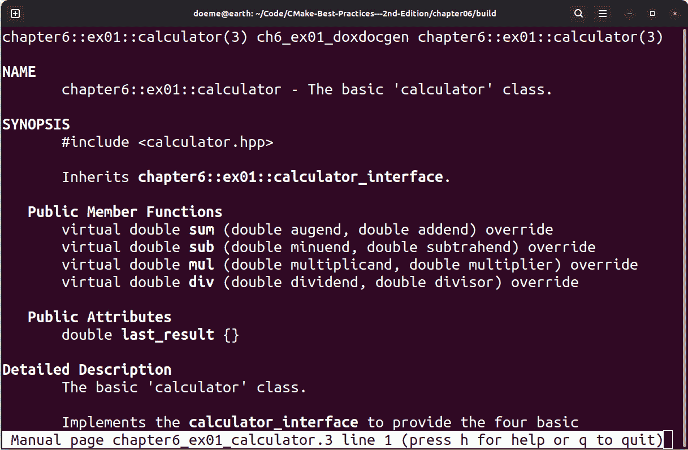
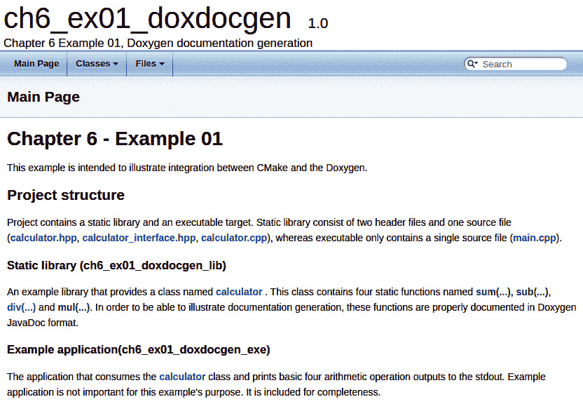
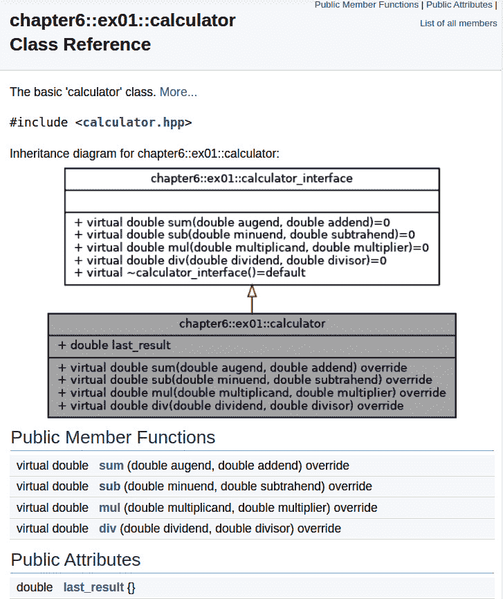
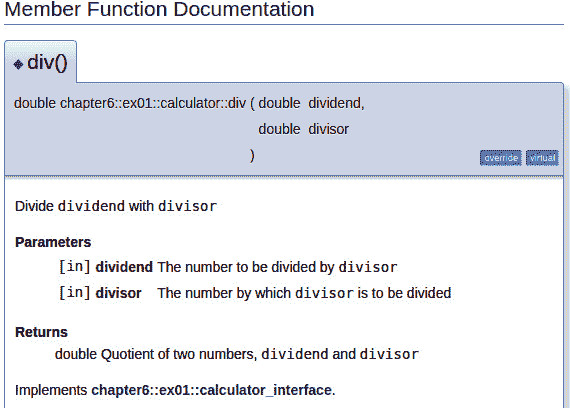
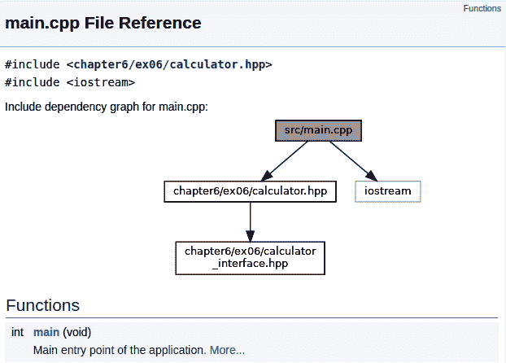
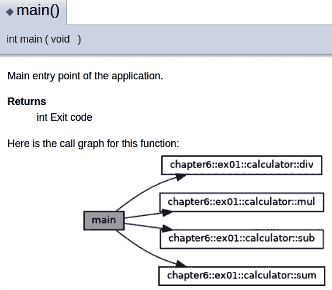
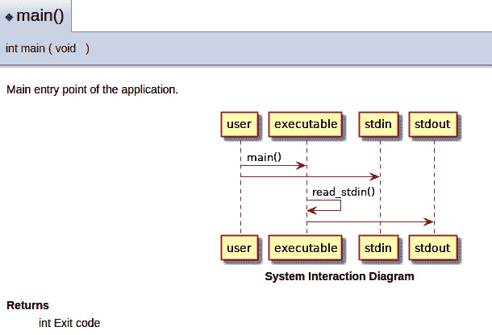
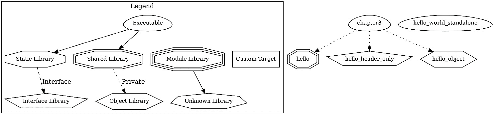

# 第六章：自动生成文档

文档无疑是所有项目中不可或缺的一部分。文档传递的是用户无法直接获得的信息，它是一种分享项目意图、功能、能力和限制的方式，使技术人员和非技术人员都能参与项目的工作。然而，编写文档确实是一个费时的过程。因此，利用现有的工具来生成文档非常重要。

本章将展示如何将 Doxygen、`dot` 和 PlantUML 集成到 CMake 中，以加速文档生成过程。这些工具将帮助我们减少代码和文档之间的上下文切换，并减轻文档维护的负担。

为了理解本章所介绍的技巧，我们将涵盖以下主要内容：

+   从代码生成文档

+   使用 CPack 打包和分发文档

+   创建 CMake 目标的依赖图

让我们从技术要求开始。

# 技术要求

在深入本章内容之前，你应该对*第四章*《打包、部署和安装 CMake 项目》和*第五章*《集成第三方库和依赖管理》有一个清晰的了解。本章将使用的技术都已在这两章中涵盖。此外，建议从[`github.com/PacktPublishing/CMake-Best-Practices---2nd-Edition/tree/main/chapter06`](https://github.com/PacktPublishing/CMake-Best-Practices---2nd-Edition/tree/main/chapter06)获取本章的示例内容。所有示例都假设你将使用项目提供的开发环境容器，相关链接为：[`github.com/PacktPublishing/CMake-Best-Practices---2nd-Edition`](https://github.com/PacktPublishing/CMake-Best-Practices---2nd-Edition)。这是一个类似于 Debian 的环境，已经预先安装了所有必要的依赖。如果使用不同的环境，命令和输出可能会有所不同。如果你没有使用提供的 Docker 容器，请确保你已经在环境中安装了 Doxygen、PlantUML 和 Graphviz。有关安装详细信息，请查阅你的包管理器索引。

让我们通过学习如何从现有代码生成文档，来深入了解文档的领域。

# 从代码生成文档

大多数人，无论是有意识的还是无意识的，都以有组织的方式构建他们的软件项目。这种组织结构是**面向对象**（**OO**）设计、编程语言规则、个人偏好、习惯或项目规则等方法论和程序的积极副作用。尽管规则和约定往往显得枯燥，但遵守它们会导致一个更易理解的项目结构。当程序、规则、秩序和组织存在时，计算机就能理解其中的内容。文档生成软件利用这一点来为我们带来好处。

生成文档的最显著工具之一是 Doxygen。作为 C++ 中代码文档的事实标准，它与 CMake 的集成非常顺畅。我们将学习如何将 Doxygen 与 CMake 集成，以自动为 CMake 项目生成文档。

## 了解 Doxygen 是什么

Doxygen 是一个非常流行的 C++ 项目文档生成软件，它可以从代码中生成文档。Doxygen 理解 C 和 C++ 语法，并能够像编译器一样查看代码结构。这使得 Doxygen 可以深入了解软件项目的结构，查看所有类定义、命名空间、匿名函数、封装、变量、继承关系等内容。Doxygen 将这些信息与程序员编写的内联代码文档结合起来。最终的结果是兼容在线和离线阅读的各种格式的人类可读文档。

为了能够理解代码注释，Doxygen 要求注释必须符合一组预定义的格式。如何创建 Doxygen 可以理解的代码注释的完整文档可以在这里找到：[`www.doxygen.nl/manual/docblocks.html`](https://www.doxygen.nl/manual/docblocks.html)。在我们的示例中，我们将使用**Javadoc**风格的注释，这种注释方式常见，但你可以根据个人偏好选择适合的方式。下面是一个 C++ 函数的 Javadoc 注释示例：

```cpp
/**
* Does foo with @p bar and @p baz
*
* @param [in] bar Level of awesomeness
* @param [in] baz Reason of awesomeness
*/
void foo(int bar, const char* baz){}
```

Doxygen 还需要一个**Doxyfile**，它本质上包含了所有文档生成的参数，例如输出格式、排除的文件模式、项目名称等。由于配置参数的数量庞大，初始配置 Doxygen 可能会让人感到畏惧，但不用担心——CMake 也会为你生成一个 Doxyfile。

随着我们进一步深入本章，你将开始看到为你的项目使用文档生成软件的好处。通过这样做，保持文档与代码的一致性变得更加容易，而且能够查看代码结构也使得绘制图表变得更加简单。

让我们看看 Doxygen 和 CMake 如何协同工作。

## 使用 Doxygen 与 CMake

CMake 作为一个面向 C++ 的构建系统生成器，能够很好地支持集成 C++ 项目中常用的外部工具。正如你所期待的，将 Doxygen 与 CMake 集成非常简单。我们将使用 CMake 的 `FindDoxygen.cmake` 模块将 Doxygen 集成到我们的项目中。该模块默认由 CMake 安装提供，无需额外的设置。

`FindDoxygen.cmake`，顾名思义，是一个模块包文件，专门供 `find_package()` CMake 函数使用。它的主要作用是定位环境中的 Doxygen，并提供一些额外的工具函数以启用 CMake 项目中的文档生成。为了展示 Doxygen 的功能，我们将遵循 `第六章` `- 示例 01` 的示例。本节的目标是为一个简单的计算器库及其 `README` 文件生成文档。这个库的接口定义如下：

```cpp
class calculator : private calculator_interface {
public:
  /**
    * Calculate the sum of two numbers, @p augend lhs and
      @p addend
    *
    * @param [in] augend The number to which @p addend is
      added
    * @param [in] addend The number which is added to
      @p augend
    *
    * @return double Sum of two numbers, @p lhs and @p rhs
    */
  virtual double sum(double augend, double addend)
    override;
   /**
    * Calculate the difference of @p rhs from @p lhs
    *
    * @param [in] minuend    The number to which @p
      subtrahend is subtracted
    * @param [in] subtrahend The number which is to be
      subtracted from @p minuend
   *
    * @return double Difference of two numbers, @p minuend
      and @p subtrahend
   */
  virtual double sub(double minuend, double subtrahend)
    override;
  /*...*/}; // class calculator
```

`calculator` 类实现了在 `calculator_interface` 类中定义的类接口。它已按照 Javadoc 格式进行了适当的文档编写。我们期望 Doxygen 生成 `calculator` 和 `calculator_interface` 类，并附带继承关系图。类定义位于 `calculator.hpp` 文件中，位于 `chapter6/ex01_doxdocgen` 目录下的 `include/chapter6/ex01` 子目录中。此外，我们在 `chapter6/ex01_doxdocgen` 目录下还有一个名为 `README.md` 的 Markdown 文件，其中包含关于示例项目布局的基本信息。我们期望这个文件成为文档的主页。由于我们的输入材料已准备好，让我们像往常一样，继续深入查看示例的 `CMakeLists.txt` 文件，即 `chapter6/ex01_doxdocgen/CMakeLists.txt` 文件。该 `CMakeLists.txt` 文件首先查找 Doxygen 包，如下所示：

```cpp
find_package(Doxygen)
set(DOXYGEN_OUTPUT_DIRECTORY"${CMAKE_CURRENT_BINARY_DIR}
  /docs")
set(DOXYGEN_GENERATE_HTML YES)
set(DOXYGEN_GENERATE_MAN YES)
set(DOXYGEN_MARKDOWN_SUPPORT YES)
set(DOXYGEN_AUTOLINK_SUPPORT YES)
set(DOXYGEN_HAVE_DOT YES)
set(DOXYGEN_COLLABORATION_GRAPH YES)
set(DOXYGEN_CLASS_GRAPH YES)
set(DOXYGEN_UML_LOOK YES)
set(DOXYGEN_DOT_UML_DETAILS YES)
set(DOXYGEN_DOT_WRAP_THRESHOLD 100)
set(DOXYGEN_CALL_GRAPH YES)
set(DOXYGEN_QUIET YES)
```

`find_package(...)` 调用将利用 CMake 安装提供的 `FindDoxygen.cmake` 模块来查找环境中是否存在 Doxygen。省略 `REQUIRED` 参数，目的是允许包维护者打包项目时，无需事先安装 Doxygen，确保在继续之前能够检测到 Doxygen。后续的几行代码设置了几个 Doxygen 配置。这些配置将被写入由 CMake 生成的 Doxyfile 文件中。每个选项的详细描述如下：

+   `DOXYGEN_OUTPUT_DIRECTORY`：设置 Doxygen 的输出目录。

+   `DOXYGEN_GENERATE_HTML`：指示 Doxygen 生成 **超文本标记语言** (**HTML**) 输出。

+   `DOXYGEN_GENERATE_MAN`：指示 Doxygen 生成 `MAN` 页面的输出。

+   `DOXYGEN_AUTOLINK_SUPPORT`：允许 Doxygen 自动将语言符号和文件名链接到相关的文档页面（如果可用）。

+   `DOXYGEN_HAVE_DOT`：告诉 Doxygen 环境中有 `dot` 命令可用，可以用来生成图表。这将使 Doxygen 能够通过图表（如依赖图、继承图和协作图）来丰富生成的文档。

+   `DOXYGEN_COLLABORATION_GRAPH`：告诉 Doxygen 为类生成协作图。

+   `DOXYGEN_CLASS_GRAPH`：告诉 Doxygen 为类生成类图。

+   `DOXYGEN_UML_LOOK`：指示 Doxygen 生成类似于**统一建模语言**（**UML**）的图表。

+   `DOXYGEN_DOT_UML_DETAILS`：向 UML 图表中添加类型和参数信息。

+   `DOXYGEN_DOT_WRAP_THRESHOLD`：设置 UML 图表的换行阈值。

+   `DOXYGEN_CALL_GRAPH`：指示 Doxygen 为函数文档生成调用图。

+   `DOXYGEN_QUIET`：抑制生成的 Doxygen 输出到**标准输出**（**stdout**）。

Doxygen 的选项集合非常广泛，提供了比我们所覆盖的选项更多的功能。如果你想进一步自定义文档生成，请查看在 [`www.doxygen.nl/manual/config.html`](https://www.doxygen.nl/manual/config.html) 上列出的完整参数列表。要在 CMake 中设置任何 Doxygen 选项，请在变量名之前添加 `DOXYGEN_` 前缀，并使用 `set()` 设置所需的值。说完这些附注后，让我们回到示例代码。前面显示的 CMake 代码后面是目标声明。以下代码行定义了一个常规的静态库，包含我们示例代码的文档：

```cpp
add_library(ch6_ex01_doxdocgen_lib STATIC)
target_sources(ch6_ex01_doxdocgen_lib PRIVATE
  src/calculator.cpp)
target_include_directories(ch6_ex01_doxdocgen_lib PUBLIC
  include)
target_compile_features(ch6_ex01_doxdocgen_lib PRIVATE
  cxx_std_11)
```

随后，以下代码行定义了一个可执行文件，它使用之前定义的静态库目标：

```cpp
add_executable(ch6_ex01_doxdocgen_exe src/main.cpp)
target_compile_features(ch6_ex01_doxdocgen_exe PRIVATE
  cxx_std_11)
target_link_libraries(ch6_ex01_doxdocgen_exe PRIVATE
  ch6_ex01_doxdocgen_lib)
```

最后，调用 `doxygen_add_docs(...)` 函数来指定我们希望生成文档的代码，如下所示：

```cpp
doxygen_add_docs(
  ch6_ex01_doxdocgen_generate_docs
  "${CMAKE_CURRENT_LIST_DIR}"
  ALL
  COMMENT "Generating documentation for Chapter 6 - Example
    01 with Doxygen"
)
```

`doxygen_add_docs(...)` 函数是 `FindDoxygen.cmake` 模块提供的一个函数。它的唯一目的是提供一种便捷的方式来创建用于文档生成的 CMake 目标，而无需显式处理 Doxygen。`doxygen_add_docs(...)` 函数的函数签名如下（非相关参数已省略）：

```cpp
doxygen_add_docs(targetName
    [filesOrDirs...]
    [ALL]
    [COMMENT comment])
```

`targetName` 函数的第一个参数是文档目标的名称。该函数将生成一个名为 `targetName` 的自定义目标。此目标将在构建时触发 Doxygen，并从代码生成文档。接下来的参数列表 `filesOrDirs` 是包含我们要生成文档的代码的文件或目录列表。`ALL` 参数用于使 CMake 的 `ALL` 元目标依赖于 `doxygen_add_docs(...)` 函数创建的文档目标，因此当构建 `ALL` 元目标时，文档生成会自动触发。最后，`COMMENT` 参数用于在构建目标时让 CMake 将一条消息打印到输出中。`COMMENT` 主要用于诊断目的，帮助我们快速了解文档是否正在生成。

在简要介绍了 `doxygen_add_docs(...)` 之后，让我们回到示例代码，并解释一下在我们的场景中 `doxygen_add_docs(...)` 函数调用的作用。它创建了一个名为 `ch6_ex01_doxdocgen_generate_docs` 的目标，将 `${CMAKE_CURRENT_LIST_DIR}` 添加到文档生成目录，请求 `ALL` 元目标依赖于它，并指定了一个在目标构建时打印的 `COMMENT` 参数。

好的——现在是时候测试这是否有效了。进入 `chapter06/` 目录并使用以下命令在 `build/` 目录中配置项目：

```cpp
cd chapter06/
cmake -S . -B build/
```

检查 CMake 输出，以查看配置是否成功。如果配置成功，那就意味着 CMake 成功地在环境中找到了 Doxygen。你应该能在 CMake 输出中看到这一点，具体如下所示：

```cpp
Found Doxygen: /usr/bin/doxygen (found version „1.9.1")
  found components: doxygen dot
```

配置成功后，我们尝试使用以下命令构建它：

```cpp
cmake --build build/
```

在构建输出中，你应该能够看到我们在 `COMMENT` 参数中输入的文本被打印到 CMake 输出中。这意味着文档目标正在构建，并且 Doxygen 正在运行。注意，我们没有为 CMake 的 `build` 命令指定 `--target` 参数，这实际上导致 CMake 构建了 `ALL` 元目标。由于我们为 `doxygen_add_docs(...)` 函数提供了 `ALL` 参数，`ch6_ex01_doxdocgen_generate_docs` 目标也会被构建。`build` 命令的输出应该类似于这里给出的输出：

```cpp
 [ 62%] Generating documentation for Chapter 6 - Example 01 with Doxygen
[ 62%] Built target ch6_ex01_doxdocgen_generate_docs
[ 75%] Building CXX object ex02_doxplantuml/CMakeFiles/ch6_ex02_doxplantuml.dir/src/main.cpp.o
[ 87%] Linking CXX executable ch6_ex02_doxplantuml
[ 87%] Built target ch6_ex02_doxplantuml
[100%] Generating documentation for Chapter 6 - Example 02 with Doxygen
[100%] Built target ch6_ex02_doxdocgen_generate_docs
```

看起来我们已经成功构建了项目和文档。让我们检查生成的文档，位于 `${CMAKE_CURRENT_BINARY_DIR}/docs` 输出文件夹中，如下所示：

```cpp
14:27 $ ls build/ex01_doxdocgen/docs/
html  man
```

在这里，我们可以看到 Doxygen 已经将 `HTML` 和 `MAN` 页面输出到 `html/` 和 `man/` 目录中。让我们检查每种类型的结果。要检查生成的 `MAN` 页面，只需输入以下内容：

```cpp
man build/ex01_doxdocgen/docs/man/man3
  /chapter6_ex01_calculator.3
```

要在仓库提供的开发容器中使用 `man`，首先运行 `sudo unminimize`，因为该容器镜像已针对大小进行了优化。该命令将打开 Man 页面并显示类似于此截图的内容：



图 6.1 使用 Doxygen 生成的示例手册页

很好！我们的代码注释变成了手册页。同样，让我们检查 HTML 输出。使用你喜欢的浏览器打开 `build/ex01_doxdocgen/docs/html/index.html` 文件，如下所示：

```cpp
google-chrome build/ex01_doxdocgen/docs/html/index.html
```

这将显示文档的主页，如下所示的截图所示：



图 6.2 – 文档的主页

在上面的截图中，我们可以看到 Doxygen 已经将 `README.md` Markdown 文件的内容渲染到主页中。请注意，主页仅作为示例提供。Doxygen 可以将任意数量的 Markdown 文件嵌入到生成的文档中。它甚至会将文件名、类名和函数名替换为指向相关文档的链接。这是通过 Doxygen 的 `AUTOLINK` 功能和 `@ref` Doxygen 命令实现的。点击 `calculator` 类下的 `calculator` 链接。`calculator` 类的文档页面应该如下所示：



图 6.3 – 生成的计算器类 HTML 文档（基础布局）

在上面的截图中，我们可以看到 Doxygen 知道 `calculator` 类继承自 `calculator_interface`，并为 `calculator` 类绘制了继承图。

注意

Doxygen 需要 `dot` 工具来渲染图表。`dot` 工具包含在 Graphviz 软件包中。

此外，生成的图表包含 UML 风格的函数名称和封装符号。让我们看看下面截图中显示的详细成员函数文档：



图 6.4 – 生成的计算器类 div() 函数文档

如我们在 *图 6.3* 中所见，Doxygen 在将内容排版成清晰、可读的布局方面做得相当不错。如果你在阅读这个 API 文档，你应该会很高兴。最后，让我们导航到 `main.cpp`，查看 `main.cpp` 的文档，以说明什么是依赖图。你可以在以下截图中看到文档页面的表示：



图 6.5 – main.cpp 文档页面

在上面的截图中显示的依赖图表明，`main.cpp` 文件直接依赖于 `iostream` 和 `chapter6/ex06/calculator.hpp` 文件，并间接依赖于 `chapter6/ex06/calculator_interface.hpp` 文件。将依赖信息包含在文档中是非常有用的。使用者将准确知道文件依赖关系，而无需深入代码。如果你再往下滚动一点，你会看到 `main()` 函数的调用图，如下所示的截图所示：



图 6.6 – main() 函数调用图

太棒了！我们只用了不到 20 行额外的 CMake 代码，就生成了带有图表的文档，支持两种不同的格式。多酷啊！现在，凭借这个功能，要找借口避免文档化就变得很难了。不过，本章的旅程还没有结束。接下来的部分将通过教我们如何将自定义 UML 图表嵌入文档，进一步丰富我们的知识。让我们继续！

## 将自定义 UML 图表嵌入文档

在上一部分，我们学习了如何利用 Doxygen 为我们的 CMake 项目生成图表和文档，但并非每个图表都能从代码中推断出来。我们可能想要绘制自定义图表，以说明一个实体与外部系统之间的复杂关系，而这些关系在代码上下文中是无法体现的。为了解决这个问题，显而易见的选择是将该上下文以某种方式引入到代码或注释中，再次利用文档生成。那么，正如预期的那样，这也是 Doxygen 可以做到的。Doxygen 允许在注释中嵌入 PlantUML 图表，这将使我们能够绘制任何 PlantUML 支持的图表。但在开始将 PlantUML 代码放入 Doxygen 注释之前，有一件小事需要处理：在 Doxygen 中启用 PlantUML 支持。我们已经有了一个起点。让我们开始吧！

在 Doxygen 中启用 PlantUML 支持非常简单。Doxygen 需要一个 `PLANTUML_JAR_PATH` 变量，该变量必须设置为 `plantuml.jar` 文件在环境中的位置。因此，我们需要找出该文件的位置。为此，我们将使用 `find_path(...)` CMake 函数。`find_path(...)` 函数与 `find_program(...)` 类似，不同之处在于它用于定位文件路径，而不是程序位置。也就是说，我们应该能够通过 `find_path(...)` 找到 `plantuml.jar` 的路径，然后将该路径提供给 Doxygen，接下来就可以……获利了！让我们来验证这个理论。我们将按照 `第六章` `- 示例 02` 来进行这一部分的操作。照例，我们先来查看示例代码的 `CMakeLists.txt` 文件，文件位于 `chapter06/ex02_doxplantuml/CMakeLists.txt` 路径下。从 `find_path(...)` 调用开始，具体如下：

```cpp
find_path(PLANTUML_JAR_PATH NAMES plantuml.jar HINTS
  "/usr/share/plantuml" REQUIRED)
find_package(Doxygen REQUIRED)
set(DOXYGEN_OUTPUT_DIRECTORY "${CMAKE_CURRENT_BINARY_DIR}
  /docs")
set(DOXYGEN_GENERATE_HTML YES)
set(DOXYGEN_AUTOLINK_SUPPORT YES)
set(DOXYGEN_PLANTUML_JAR_PATH "${PLANTUML_JAR_PATH}")
set(DOXYGEN_QUIET YES)
```

在这里的`find_path(...)`调用中，`PLANTUML_JAR_PATH`是输出变量的名称。`NAMES`是将在搜索位置中查找的文件名。`HINTS`是除默认搜索位置之外的额外路径。这些路径对于在非标准位置发现文件非常有用。最后，`REQUIRED`参数用于将`plantuml.jar`作为一个必需项，因此当找不到`plantuml.jar`时，CMake 会失败并退出。以下的 Doxygen 配置部分与我们之前的示例《第六章 示例 01》完全相同，只不过我们将`DOXYGEN_PLANTUML_JAR_PATH`设置为通过`find_path(...)`调用找到的 PlantUML 目录路径。此外，未在此示例中需要的变量也被省略了。此时，Doxygen 应该能够使用 PlantUML。让我们通过一个示例 PlantUML 图表来测试一下，它被嵌入到了 `src/main.cpp` 源文件中，如下所示：

```cpp
 /**
* @brief Main entry point of the application
  @startuml{system_interaction.png} "System Interaction Diagram"
  user -> executable : main()
  user -> stdin : input text
  executable -> stdin: read_stdin()
  stdin -> executable
  executable -> stdout: print_to_stdout()
  stdout -> user : visual feedback
  @enduml
*
* @return int Exit code
*/
int main(void) {
...
}
```

`@startuml` 和 `@enduml` Doxygen 注释关键词分别用于标示 PlantUML 图表的开始和结束。常规的 PlantUML 代码可以放在`@startuml - @enduml`块中。在我们的示例中，我们展示了一个应用程序的简单系统交互图。如果一切顺利，我们应该能在`main()`函数的文档中看到嵌入的 PlantUML 图表。让我们通过构建包含以下代码的示例来生成文档：

```cpp
cd chapter06/
cmake -S ./ -B build/
cmake --build build/
```

第二个示例的文档现在应该已经生成。通过运行以下命令，使用你选择的浏览器打开生成的 `build/ex02_doxplantuml/docs/html/index.html` HTML 文档：

```cpp
google-chrome build/ex02_doxplantuml/docs/html/main_8cpp.html
```

如果你向下滚动到 main 函数，你会看到我们的 UML 时序图，如下所示：



图 6.7 – 嵌入在 main() 函数文档中的 PlantUML 图表

在*图 6.6*中，我们可以看到 Doxygen 生成了一个 PlantUML 图表并将其嵌入到了文档中。通过这个功能，我们现在能够将自定义图表嵌入到我们生成的文档中了。这将帮助我们在不需要使用外部绘图工具的情况下，解释复杂的系统和关系。

现在我们已经拥有了生成文档的正确工具，接下来是学习如何打包和交付这些文档。在接下来的部分，我们将学习文档交付的方式，以及涉及的相关软件。

# 使用 CPack 打包和分发文档

打包文档与打包软件及其构件并没有什么不同——毕竟，文档本身就是项目的一个构件。因此，我们将使用在*第四章*《打包、部署和安装 CMake 项目》中学到的技术来打包我们的文档。

注意

如果你还没有阅读*第四章*《打包、部署和安装 CMake 项目》，强烈建议在阅读本节之前先阅读该章节。

为了说明这一部分，我们将回到`第六章` `- 示例 01`。我们将使我们在这个示例中生成的文档可安装并可打包。让我们重新回到位于`chapter06/ex01_doxdocgen/`文件夹中的`CMakeLists.txt`文件。通过以下代码，我们将使`html`和`man`文档可安装：

```cpp
include(GNUInstallDirs)
install(DIRECTORY "${CMAKE_CURRENT_BINARY_DIR}/docs/html/"
  DESTINATION "${CMAKE_INSTALL_DOCDIR}" COMPONENT
    ch6_ex01_html)
install(DIRECTORY "${CMAKE_CURRENT_BINARY_DIR}/docs/man/"
  DESTINATION "${CMAKE_INSTALL_MANDIR}" COMPONENT
    ch6_ex01_man)
```

记得我们之前在*第四章*中使用`install(DIRECTORY...)`来安装任何类型的文件夹，同时保持其结构吗？*打包、部署和安装 CMake 项目*？这正是我们在这里所做的。我们通过安装`docs/html`和`docs/man`到`GNUInstallDirs`模块提供的默认文档和 man 页面目录中，使生成的文档可安装。此外，还要记住，如果某个内容是可安装的，那么它也意味着可以打包，因为 CMake 可以从`install(...)`调用生成所需的打包代码。所以，让我们也包括`CPack`模块，以便为这个示例启用打包功能。代码在以下片段中展示：

```cpp
set(CPACK_PACKAGE_NAME cbp_chapter6_example01)
set(CPACK_PACKAGE_VENDOR "CBP Authors")
set(CPACK_GENERATOR "DEB;RPM;TBZ2")
set(CPACK_DEBIAN_PACKAGE_MAINTAINER "CBP Authors")
include(CPack)
```

就这样！就这么简单。让我们尝试通过调用以下命令来构建并打包示例项目：

```cpp
cd chapter06/
cmake -S . -B build/
cmake --build build/
cpack --config  build/CPackConfig.cmake -B build/pak
```

好的，让我们总结一下这里发生了什么。我们已经配置并构建了`chapter06/`代码，并通过调用 CPack 将项目打包到`build/pak`文件夹中，使用了生成的`CPackConfig.cmake`文件。为了检查一切是否正常，我们通过调用以下命令将生成的包的内容提取到`/tmp/ch6-ex01`路径下：

```cpp
dpkg -x build/pak/cbp_chapter6_example01-1.0-Linux.deb
  /tmp/ch6-ex01
export MANPATH=/tmp/ch6-ex01/usr/share/man/
```

提取完成后，文档应能在`/tmp/ch6-ex01/usr/share`路径下访问。由于我们使用了非默认路径，因此我们使用`MANPATH`环境变量让`man`命令知道我们的文档路径。让我们先检查是否可以通过调用`man`命令访问 man 页面，如下所示：

```cpp
man chapter6_ex01_calculator
```

`chapter6_ex01_calculator`的名称是由 Doxygen 根据`chapter6::ex01::calculator`类名自动推断出来的。你应该能够看到我们在上一节中讨论的 man 页面输出。

到目前为止，我们已经学习了很多关于生成和打包文档的内容。接下来，我们将学习如何生成 CMake 目标的依赖图。

# 创建 CMake 目标的依赖图

在前面的部分中，我们已经涵盖了软件代码的文档编写和图形化，但在一个大型项目中，我们可能还需要对 CMake 代码进行文档化和可视化。CMake 目标之间的关系可能非常复杂，这可能使得追踪所有依赖关系变得困难。幸运的是，CMake 通过提供一个显示所有目标之间依赖关系的图表来帮助我们。通过调用`cmake --graphviz=my-project.dot /path/to/build/dir`，CMake 将生成包含目标相互依赖关系的 DOT 语言文件。DOT 语言是一种描述图的语言，可以被多种程序解释，其中最著名的是免费的 Graphviz。DOT 文件可以转换为图像，甚至可以使用 Graphviz 中的`dot`命令行工具，如下所示：`dot -Tpng filename.dot -o out.png`。

如*第三章*所示，提供了更多的目标，让我们在该章节的`build`文件夹中运行此命令。这将生成类似于以下的输出：



图 6.8 – 使用 DOT 语言可视化的第三章项目结构

行为和选项可以通过`CMakeGraphVizOptions`中提供的变量进行控制。在创建 DOT 图时，CMake 会在`PROJECT_SOURCE_DIR`和`PROJECT_BINARY_DIR`目录中查找名为`CMakeGraphVizOptions.cmake`的文件，如果找到，将使用其中提供的值。这样的配置文件示例如下：

```cpp
set(GRAPHVIZ_GRAPH_NAME "CMake Best Practices")
set(GRAPHVIZ_GENERATE_PER_TARGET FALSE)
set(GRAPHVIZ_GENERATE_DEPENDERS FALSE)
```

默认情况下，CMake 会为所有目标创建依赖图。将`GRAPHVIZ_GENERATE_PER_TARGET`和`GRAPHVIZ_GENERATE_DEPENDERS`设置为`FALSE`将减少生成的文件数量。所有可用选项的完整列表可以在 CMake 文档中的[`cmake.org/cmake/help/latest/module/CMakeGraphVizOptions.html`](https://cmake.org/cmake/help/latest/module/CMakeGraphVizOptions.html)找到。

# 总结

本章我们简要介绍了 Doxygen，并学习了如何从代码生成文档，以及如何打包生成的文档以便部署。在任何软件项目中，掌握这些技能都是至关重要的。从代码生成文档大大减少了技术文档的工作量，并几乎没有维护成本。作为一名软件专业人士，自动化确定性的任务，并生成可推导的信息以不同的表现形式呈现，是最理想的。这种方法为其他需要更多人工解决问题技能的工程任务创造了时间和空间。自动化任务减少了维护成本，使产品更加稳定，并减少了对人工资源的整体需求。它是一种通过让机器完成相同的工作，将纯粹的人力劳动转化为消耗电力的方式。机器在执行确定性任务方面比人类更优秀。它们永远不会生病，几乎不会损坏，易于扩展且永不疲倦。自动化是一种利用这种未经驯服的力量的方法。

本书的主要方向不是教你如何做事情，而是教你如何让机器为某个特定任务工作。这种方法确实需要先学习，但请记住，如果你在做一个可以由机器手动完成多次的昂贵操作，那就是在浪费你宝贵的时间。投资于自动化——它是一个快速回报的有利投资。

在下章中，我们将学习如何通过将单元测试、代码清理工具、静态代码分析、微基准测试和代码覆盖率工具集成到 CMake 项目中，来提高代码质量，当然，我们也会自动化这些任务。

下章见！

# 问题

完成本章后，你应该能够回答以下问题：

1.  什么是 Doxygen？

1.  将 Doxygen 集成到 CMake 项目中的最简单方法是什么？

1.  Doxygen 能绘制图表和图形吗？如果能，我们如何启用这个功能？

1.  应该使用哪些 Doxygen 标签将 PlantUML 图表嵌入 Doxygen 文档中？

1.  应该采取哪些配置步骤来启用 Doxygen 使用 PlantUML？

1.  由于 `build/` 文件夹下已有 man/page 输出，如何使这些文档可以安装？

# 答案

1.  Doxygen 是 C 和 C++ 项目中文档生成工具的事实标准。

1.  由于 CMake 已经提供了一个 `find` 模块来查找 Doxygen，可以通过使用 `find_package(...)` CMake 命令来实现这一点。

1.  是的——只要环境中有 `dot`、Graphviz 和 PlantUML 等绘图软件，Doxygen 就可以绘制图形。要启用 DOT 绘图，只需将 `HAVE_DOT` 设置为 `TRUE`。对于 PlantUML，则需要将 `PLANTUML_JAR_PATH` 设置为包含 `plantuml.jar` 文件的路径。

1.  `@startuml` 和 `@enduml`。

1.  `PLANTUML_JAR_PATH` 需要设置为包含 `plantuml.jar` 文件的路径。

1.  通过`install(DIRECTORY)`命令的帮助。
