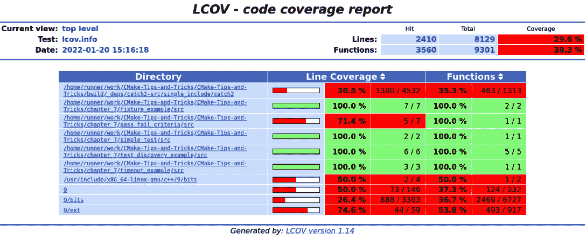

# 第七章：与 CMake 无缝集成代码质量工具

到目前为止，我们集中于构建和安装项目，生成文档以及处理外部依赖项。编写高质量软件的另一个重要任务是测试，并通过其他手段确保代码质量达到预期水平。为了实现高代码质量，仅仅编写单元测试并偶尔执行是不够的。如果你想开发高质量的软件，拥有与构建系统轻松集成的合适测试工具不仅不是奢侈，而是必须的。只有构建和测试能够无缝配合，程序员才能专注于编写良好的测试，而不是花时间确保这些测试能够运行。像测试驱动开发这样的方式为软件质量带来了巨大价值。

然而，提高质量的不仅仅是编写普通的测试。编写良好的测试是一回事；通过覆盖率报告检查测试的有效性，并通过静态代码分析确保整体代码质量是另一回事。

虽然测试、覆盖率和静态代码分析有助于确定代码是否按预期运行，但一个常见的问题是，一些工具仅与特定编译器兼容，或需要特殊的编译器设置。为了利用这些工具，可能需要使用不同的编译器以不同的方式编译相同的源代码。幸运的是，CMake 正是擅长这一点，这也是为什么 CMake 能够帮助提升代码质量，使得这些质量工具易于访问的原因。

很多确保高代码质量的工具有一个好处，那就是它们通常可以自动化。随着如今 CI/CD 系统的普及，创建高程度的自动化检查以确保软件质量变得相当容易，尤其是使用 CMake 时，这些工具通常可以在定义软件构建方式的地方进行配置和执行。本章将教你如何使用 CMake 定义和协调测试，并创建代码覆盖率报告，以查看哪些部分的代码已被测试。我们还将探讨如何集成各种代码清理工具和静态代码分析器，在编译时就检查代码质量。我们会展示如何将所有这些工具集成在一起，以及如何创建一个专门的构建类型来运行静态代码质量工具。最后，我们还会看看如何设置微基准测试，检查代码的运行时性能。

本章涵盖以下主要内容：

+   定义、发现和运行测试

+   生成代码覆盖率报告

+   清理代码

+   使用 CMake 进行静态代码分析

+   为质量工具创建自定义构建类型

# 技术要求

与之前的章节一样，示例在 CMake 3.24 下进行测试，并可以在以下任意编译器上运行：

+   GCC 9 或更高版本

+   Clang 12 或更高版本

+   MSVC 19 或更高版本

一些关于代码覆盖率、清理工具和静态代码分析的示例需要 GCC 或 Clang 才能运行，无法在 MSVC 上运行。要在 Windows 上运行 Clang，请查看 *第九章*，*创建可重现的构建* *环境*，该章节介绍了工具链文件的使用。一些示例需要安装 Catch2 单元测试套件才能编译。某些示例会从不同的在线位置拉取依赖项，因此也需要连接互联网。

除了一个有效的编译器外，以下软件也用于示例中：

+   `Gcov`、`Gcovr` 和 `lcov` 用于 Linux 示例中的代码覆盖率

+   `Opencppcoverage` 用于 Windows 示例中的代码覆盖率

+   `Clang-tidy`、`Cppcheck`、`Cpplint` 和 `include-what-you-use` 用于静态代码分析器的示例

本书的所有示例和源代码都可以在 [`github.com/PacktPublishing/CMake-Best-Practices---2nd-Edition`](https://github.com/PacktPublishing/CMake-Best-Practices---2nd-Edition) 的 GitHub 仓库中找到。

如果缺少某些软件，相关示例将从构建中排除。

# 定义、发现和运行测试

测试是任何注重软件质量的工程师的主食。各种语言中用于编写单元测试的框架数量庞大，尤其是在 C++ 中，CMake 包含了与大多数流行框架一起使用的模块。

在非常抽象的层面上，所有单元测试框架都执行以下操作：

+   允许对测试用例进行定义和分组

+   包含某种形式的断言来检查不同的测试条件

+   发现并运行测试用例，可以是全部或其中的某些测试

+   以多种格式（如纯文本、JSON 和 XML）生成测试结果

使用 CTest 工具，CMake 提供了一种内置的执行几乎任何测试的方法。任何已设置 `enable_testing()` 并通过 `add_test()` 添加了至少一个测试的 CMake 项目，都启用了测试支持。任何对 `enable_testing()` 的调用都会启用当前目录及其子目录中的测试发现，因此通常建议在顶层 `CMakeLists.txt` 文件中设置它，且在任何调用 `add_subdirectory` 之前进行设置。CMake 的 CTest 模块会自动设置 `enable_testing`，如果与 `include(CTest)` 一起使用，除非将 `BUILD_TESTING` 选项设置为 `OFF`。

不建议构建和运行依赖于 `BUILD_TESTING` 选项的测试。一个常见的做法是将所有与测试相关的部分放入自己的子文件夹中，并且只有在 `BUILD_TESTING` 设置为 `ON` 时才包含该子文件夹。

CTest 模块通常应该仅在项目的顶级 `CMakeLists.txt` 文件中包含。自 CMake 版本 3.21 起，可以使用 `PROJECT_IS_TOP_LEVEL` 变量来测试当前的 `CMakeLists.txt` 文件是否为顶级文件。对于项目的顶级目录及通过 `ExternalProject` 添加的项目的顶级目录，该变量的值为 `true`。对于通过 `add_subdirectory` 或 `FetchContent` 添加的目录，值为 `false`。因此，CTest 应该像这样被包含：

```cpp
project(CMakeBestPractice)
...
if(PROJECT_IS_TOP_LEVEL)
   include(CTest)
endif()
```

通常，项目应该依赖 `BUILD_TESTING` 标志来确定是否应该构建和包含测试。然而，特别是对于开源项目或具有复杂测试需求的项目，提供一个额外的 `option()` 来禁用仅特定项目的测试对于开发者来说是非常方便的。生成的 CMake 代码可能如下所示：

```cpp
option(MYPROJECT_BUILD_TESTING "enable testing for MyProject" ${BUILD_TESTING})
...
If(MYPROJECT_BUILD_TESTING AND BUILD_TESTING)
   add_subdirectory(test)
endif()
```

单元测试本质上是小型程序，它们在内部运行一系列断言，如果任何断言失败，它们将返回一个非零的返回值。有许多框架和库可以帮助组织测试和编写断言，但从外部来看，检查断言并返回相应的值是核心功能。

测试可以通过 `add_test` 函数添加到任何 `CMakeLists.txt` 文件中：

```cpp
add_test(NAME <name> COMMAND <command> [<arg>...]
         [CONFIGURATIONS <config>...]
         [WORKING_DIRECTORY <dir>]
         [COMMAND_EXPAND_LISTS])
```

`COMMAND` 可以是项目中定义的可执行目标的名称，也可以是任意可执行文件的完整路径。任何测试所需的参数也包括在内。使用目标名称是首选的方式，因为这样 CMake 会自动替换可执行文件的路径。`CONFIGURATION` 选项用于告诉 CMake 测试适用于哪些构建配置。对于大多数测试用例，这一点无关紧要，但对于微基准测试等，这可能非常有用。`WORKING_DIRECTORY` 应该是绝对路径。默认情况下，测试在 `CMAKE_CURRENT_BINARY_DIR` 中执行。`COMMAND_EXPAND_LISTS` 选项确保作为 `COMMAND` 选项一部分传递的任何列表都会被展开。

包含一个测试的简单项目可能如下所示：

```cpp
cmake_minimum_required(VERSION 3.21)
project("simple_test" VERSION 1.0)
enable_testing()
add_executable(simple_test)
target_sources(simple_test PRIVATE src/main.cpp)
add_test(NAME example_test COMMAND simple_test)
```

在这个示例中，使用一个名为 `simple_test` 的可执行目标作为一个名为 `example_test` 的测试。

CTest 将消耗有关测试的信息并执行它们。测试通过单独运行 `ctest` 命令或作为 CMake 构建步骤的一部分执行的特殊目标来执行。无论哪种执行方式，都要求项目在执行之前已经构建。以下两条命令都将执行测试：

```cpp
ctest --test-dir <build_dir>
cmake --build <build_dir> --target test
```

将 CTest 作为构建的目标来调用的优点是，CMake 会首先检查所有需要的目标是否已构建并且是最新版本，但直接运行 `ctest` 则提供了更多对执行测试的控制。

`ctest` 的输出可能类似于以下内容：

```cpp
Test project /workspaces/ CMake-Best-Practices---2nd-Edition/build
    Start 1: example_test
1/3 Test #1: example_test .....................***Failed    0.00 sec
    Start 2: pass_fail_test
2/3 Test #2: pass_fail_test ...................   Passed    0.00 sec
    Start 3: timeout_test
3/3 Test #3: timeout_test .....................   Passed    0.50 sec
67% tests passed, 1 tests failed out of 3
Total Test time (real) =   0.51 sec
The following tests FAILED:
          1 - example_test (Failed)
Errors while running CTest
Output from these tests are in: /workspaces/CMake-Tips-and-Tricks
  /build/Testing/Temporary/LastTest.log
Use "--rerun-failed --output-on-failure" to re-run the failed cases
  verbosely.
```

通常，测试会抑制所有输出到 `stdout`。通过传递 `-V` 或 `--verbose` 命令行参数，输出将始终打印出来。然而，通常情况下，你只对失败的测试的输出感兴趣。因此，`--output-on-failure` 参数通常是更好的选择。这样，只有失败的测试会产生输出。对于非常详细的测试，可以使用 `--test-output-size-passed <size>` 和 `--test-output-size-failed <size>` 选项来限制输出的大小，其中 size 为字节数。

在构建树中有一个或多个对 `add_test` 的调用，会导致 CMake 在 `CMAKE_CURRENT_BINARY_DIR` 中为 CTest 写出一个输入文件。CTest 的输入文件不一定位于项目的顶层，而是位于定义它们的位置。要列出所有测试但不执行它们，可以使用 CTest 的 `-N` 选项。

CTest 的一个非常有用的功能是，它在每次运行之间缓存测试的状态。这使得你只需运行上次运行中失败的测试。要做到这一点，可以运行 `ctest --rerun-failed`。如果没有测试失败或之前没有运行过任何测试，所有测试都会被执行。

有时，你可能不想执行完整的测试集——例如，如果需要修复某个单一失败的测试。`-E` 和 `-R` 命令行选项分别表示 `-E` 选项排除匹配模式的测试，而 `-R` 选项选择需要包含的测试。这些选项可以组合使用。以下命令将执行所有以 `FeatureX` 开头的测试，但排除名为 `FeatureX_Test_1` 的测试：

```cpp
ctest -R ^FeatureX -E FeatureX_Test_1
```

另一种有选择性地执行测试的方法是使用 `LABELS` 属性为测试标记标签，然后使用 CTest 的 `-L` 选项选择要执行的标签。一个测试可以分配多个标签，标签之间用分号分隔，如以下示例所示：

```cpp
add_test(NAME labeled_test_1 COMMAND someTest)
set_tests_properties(labeled_test PROPERTIES LABELS "example")
add_test(NAME labeled_test_2 COMMAND anotherTest)
set_tests_properties(labeled_test_2 PROPERTIES LABELS "will_fail" )
add_test(NAME labeled_test_3 COMMAND YetAnotherText)
set_tests_properties(labeled_test_3 PROPERTIES LABELS "example;will_fail")
```

`-L` 命令行选项接受一个正则表达式，用于过滤标签：

```cpp
ctest -L example
```

这将只执行 `labeled_test_1` 和 `labeled_test_3`，因为它们都被分配了 `example` 标签，但不会执行 `labeled_test_2` 或任何其他没有分配标签的测试。

通过相应地制定正则表达式，可以将多个标签组合在一起：

```cpp
ctest -L "example|will_fail"
```

这将执行所有来自示例的测试，但不会执行其他没有分配标签的测试。

使用标签特别有助于标记设计上会失败的测试或类似的测试，或者仅在某些执行上下文中相关的测试。

正则表达式或标签基础的测试选择的最后一个替代方法是使用 `-I` 选项，它接受分配的测试编号。`-I` 选项的参数有些复杂：

```cpp
ctest -I [Start,End,Stride,test#,test#,...|Test file]
```

使用 `Start`、`End` 和 `Stride`，可以指定要执行的测试范围。三个数字表示与显式测试编号 `test#` 结合的范围。或者，也可以传递包含参数的文件。

以下调用将执行从 `1` 到 `10` 的所有奇数测试：

```cpp
ctest -I 1,10,2
```

因此，测试 `1`、`3`、`5`、`7` 和 `9` 将被执行。以下命令将只执行测试 `8`：

```cpp
ctest -I ,0,,6,7
```

请注意，在此调用中，`End`被设置为`0`，因此没有执行测试范围。要结合范围和显式的测试编号，以下命令将执行从`1`到`10`的所有奇数测试，并另外测试`6`和`8`：

```cpp
ctest -I 1,10,2,6,8
```

处理`-I`选项的繁琐以及添加新测试可能会重新分配编号，是这种方法在实践中很少使用的两个原因。通常，更倾向于通过标签或测试名称进行过滤。

编写测试时的另一个常见陷阱是测试不够独立。因此，测试`2`可能意外地依赖于测试`1`的先前执行。为了防止这种意外依赖，CTest 可以通过`--schedule-random`命令行参数随机化测试执行顺序。这将确保测试以任意顺序执行。

## 自动发现测试

使用`add_test`定义测试是将测试暴露给 CTest 的一种方式。一个缺点是，这将把整个可执行文件注册为一个单独的测试。然而，在大多数情况下，一个可执行文件将包含许多单元测试，而不仅仅是一个，因此当其中一个测试失败时，可能很难确定究竟是哪个测试失败了。

考虑一个包含以下测试代码的 C++文件，假设 Fibonacci 函数包含一个 bug，因此`Fibonacci(0)`不会返回`1`，而是返回其他值：

```cpp
TEST_CASE("Fibonacci(0) returns 1"){ REQUIRE(Fibonacci(0) == 1);}
TEST_CASE("Fibonacci(1) returns 1"){ REQUIRE(Fibonacci(1) == 1); }
TEST_CASE("Fibonacci(2) returns 2"){ REQUIRE(Fibonacci(2) == 2); }
TEST_CASE("Fibonacci(5) returns 8"){ REQUIRE(Fibonacci(5) == 8); }
```

如果将所有这些测试编译到同一个可执行文件中，名为`Fibonacci`，那么通过`add_test`将它们添加进去时，只会显示可执行文件失败，但不会告诉我们它在前面代码块中的哪个场景下失败了。

测试的结果将类似于以下内容：

```cpp
Test project /workspaces/CMake-Tips-and-Tricks/build
    Start 5: Fibonacci
1/1 Test #5: Fibonacci ........................***Failed    0.00 sec
0% tests passed, 1 tests failed out of 1
Total Test time (real) =   0.01 sec
The following tests FAILED:
          5 - Fibonacci (Failed)
```

这样做对确定哪个测试用例失败并没有太大帮助。幸运的是，使用 Catch2 和 GoogleTest 时，可以通过将内部测试暴露给 CTest 来使它们作为常规测试执行。对于 GoogleTest，CMake 本身提供了执行此操作的模块；Catch2 则在其自己的 CMake 集成中提供了这一功能。使用 Catch2 发现测试是通过`catch_discover_tests`，而对于 GoogleTest，则使用`gtest_discover_tests`。以下示例将把在 Catch2 框架中编写的测试暴露给 CTest：

```cpp
find_package(Catch2)
include(Catch)
add_executable(Fibonacci)
catch_discover_tests(Fibonacci)
```

请注意，为了使该函数可用，必须包含`Catch`模块。对于 GoogleTest，它的工作方式非常相似：

```cpp
include(GoogleTest)
add_executable(Fibonacci)
gtest_discover_tests(Fibonacci)
```

当使用发现功能时，在测试可执行文件中定义的每个测试用例将被 CTest 视为其自己的测试。如果像这样暴露测试，则调用 CTest 的结果可能如下所示：

```cpp
    Start 5: Fibonacci(0) returns 1
1/4 Test #5: Fibonacci(0) returns 1 .........***Failed    0.00 sec
    Start 6: Fibonacci(1) returns 1
2/4 Test #6: Fibonacci(1) returns 1 .........   Passed    0.00 sec
    Start 7: Fibonacci(2) returns 2
3/4 Test #7: Fibonacci(2) returns 2 .........   Passed    0.00 sec
    Start 8: Fibonacci(5) returns 8
4/4 Test #8: Fibonacci(5) returns 8 .........   Passed    0.00 sec
75% tests passed, 1 tests failed out of 4
Total Test time (real) =   0.02 sec
The following tests FAILED:
          5 - Fibonacci(0) returns 1 (Failed)
```

现在，我们可以清楚地看到哪些已定义的测试用例失败了。在这种情况下，`Fibonacci(0) returns 1` 测试用例没有按预期行为工作。当使用具有集成测试功能的编辑器或 IDE 时，这尤其有用。发现功能通过运行指定的可执行文件来工作，可以选择仅打印测试名称并将其内部注册到 CTest，因此每个构建步骤会有一些额外的开销。更细粒度地发现测试也有一个优点，即其执行可以更好地由 CMake 并行化，如本章的*并行运行测试和管理测试资源*部分所述。

`gtest_discover_tests` 和 `catch_discover_tests` 都有多种选项，例如为测试名称添加前缀或后缀，或将属性列表添加到生成的测试中。有关这些函数的完整文档可以在这里找到：

+   **Catch2**: [`github.com/catchorg/Catch2/blob/devel/docs/cmake-integration.md`](https://github.com/catchorg/Catch2/blob/devel/docs/cmake-integration.md)

+   **GoogleTest**: [`cmake.org/cmake/help/v3.21/module/GoogleTest.html`](https://cmake.org/cmake/help/v3.21/module/GoogleTest.html)

Catch2 和 GoogleTest 只是众多测试框架中的两个；可能还有其他未广为人知的测试套件也具备相同功能。

现在，我们从寻找测试转向更深入地了解如何控制测试行为。

## 确定测试成功或失败的高级方法

默认情况下，CTest 会根据命令的返回值来判断测试是否失败或通过。`0` 表示所有测试成功；任何非 `0` 的返回值都被视为失败。

有时，仅凭返回值不足以判断测试是否通过。如果需要检查程序输出中是否包含某个字符串，可以使用 `FAIL_REGULAR_EXPRESSION` 和 `PASS_REGULAR_EXPRESSION` 测试属性，如下例所示：

```cpp
set_tests_properties(some_test PROPERTIES
                   FAIL_REGULAR_EXPRESSION "[W|w]arning|[E|e]rror"
                   PASS_REGULAR_EXPRESSION "[S|s]uccess")
```

这些属性会导致 `some_test` 测试失败，如果输出中包含 `"Warning"` 或 `"Error"`。如果发现 `"Success"` 字符串，则认为测试通过。如果设置了 `PASS_REGULAR_EXPRESSION`，则仅当字符串存在时，测试才会被认为通过。在这两种情况下，返回值将被忽略。如果需要忽略某个测试的特定返回值，可以使用 `SKIP_RETURN_CODE` 选项。

有时，测试预期会失败。在这种情况下，将 `WILL_FAIL` 设置为 `true` 会导致测试结果反转：

```cpp
add_test(NAME SomeFailingTerst COMMAND SomeFailingTest)
set_tests_properties(SomeFailingTest PROPERTIES WILL_FAIL True)
```

这通常比禁用测试更好，因为它仍然会在每次测试运行时执行，如果测试意外开始通过，开发人员会立即知道。一个特殊的测试失败情况是测试未返回或完成需要太长时间。对于这种情况，CTest 提供了添加测试超时的功能，甚至可以在失败时重试测试。

## 处理超时和重试测试

有时，我们不仅仅关注测试的成功或失败，还关注测试完成所需的时间。`TIMEOUT`测试属性使用一个秒数来确定测试的最大运行时间。如果测试超出了设定的时间，它将被终止并视为失败。以下命令将测试的执行时间限制为 10 秒：

```cpp
set_tests_properties(timeout_test PROPERTIES TIMEOUT 10)
```

`TIMEOUT`属性通常对于那些有可能因某些原因进入无限循环或永远挂起的测试非常有用。

另外，CTest 还接受`--timeout`参数，设置一个全局超时，这个超时适用于所有没有指定`TIMEOUT`属性的测试。对于那些已定义`TIMEOUT`的测试，`CmakeLists.txt`中定义的超时会优先于命令行传递的超时设置。

为了避免长时间的测试执行，CTest 命令行接受`--stop-time`参数，该参数以当天的实时时间作为完整测试集的时间限制。以下命令会为每个测试设置一个默认的超时为 30 秒，且所有测试必须在 23:59 之前完成：

```cpp
ctest --timeout 30 --stop-time 23:59
```

有时，我们可能会遇到由于一些不可控因素而导致的测试超时。常见的情况是需要进行某种网络通信或依赖某种带宽有限资源的测试。有时，唯一能让测试继续运行的方法是重新尝试。为此，可以将`--repeat after-timeout:n`命令行参数传递给 CTest，其中*n*是一个数字。

`--repeat`参数实际上有三个选项：

+   `after-timeout`：如果发生超时，这会重新尝试测试若干次。通常，若发生重复超时，应将`--timeout`选项传递给 CTest。

+   `until-pass`：这个选项会一直重新运行测试，直到通过或者达到重试次数为止。在 CI 环境中，作为一般规则设置此选项是不推荐的，因为测试通常应该总是通过的。

+   `until-fail`：测试会重新运行若干次，直到失败为止。这通常用于测试偶尔失败的情况，目的是找出这种失败发生的频率。`--repeat-until-fail`参数与`--repeat:until-fail:n`的作用完全相同。

如前所述，测试失败的原因可能是测试依赖的资源不可用。外部资源不可用的常见情况是它们被测试请求淹没。*并行运行测试和管理测试资源*部分探讨了避免此类问题的一些方法。另一种常见的超时原因是，当测试运行时，外部资源尚未可用。

在下一部分中，我们将看到如何编写测试夹具，确保在测试运行之前资源已经启动。

## 编写测试夹具

测试通常应该彼此独立。也有一些情况，测试可能依赖于一个前提条件，而这个前提条件并不由测试本身控制。例如，某个测试可能要求一个服务器正在运行，才能测试客户端。这些依赖关系可以通过在 CMake 中定义测试固定装置（test fixtures）来表达，使用`FIXTURE_SETUP`、`FIXTURE_CLEANUP`和`FIXTURE_REQUIRED`测试属性。所有三个属性都接受一个字符串列表来标识一个固定装置。一个测试可以通过定义`FIXTURE_REQUIRED`属性来表明它需要某个特定的固定装置。这将确保在执行该测试之前，名为`fixture`的测试已经成功完成。同样，一个测试可以在`FIXTURE_CLEANUP`中声明，表示它必须在依赖该固定装置的测试完成后执行。清理部分中定义的固定装置无论测试成功与否，都会被执行。考虑以下示例，它可以在代码库的`chapter07/fixture_example`目录中找到：

```cpp
 add_test(NAME start_server COMMAND ch7_fixture_server)
set_tests_properties(start_server PROPERTIES FIXTURES_SETUP ch7_server)
add_test(NAME stop_server COMMAND ch7_fixture_server --stop)
set_tests_properties(stop_server PROPERTIES FIXTURES_CLEANUP ch7_server)
add_test(NAME ch7_fixture_test COMMAND ch7_fixture_sample)
set_tests_properties(ch7_fixture_test PROPERTIES FIXTURES_REQUIRED ch7_server)
```

在这个例子中，名为`echo_server`的程序作为固定装置使用，以便另一个名为`echo_client`的程序可以使用它。`echo_server`的执行通过`--start`和`--stop`参数被制定为两个测试，分别命名为`start_server`和`stop_server`。`start_server`测试被标记为固定装置的设置部分，命名为`server`。`stop_server`测试同样被设置，但标记为固定装置的清理部分。最后，实际的测试`client_test`被设置，并作为必要的前提条件传递给`server`固定装置。

如果现在使用 CTest 运行`client_test`，固定装置会自动与测试一起调用。固定装置测试会作为常规测试出现在 CTest 的输出中，如下所示的示例输出所示：

```cpp
ctest -R ch7_fixture_test
Test project CMake-Best-Practices:
    Start  9: start_server
1/3 Test  #9: start_server ..............   Passed    0.00 sec
    Start 11: client_test
2/3 Test #11: client_test................   Passed    0.00 sec
    Start 10: stop_server
3/3 Test #10: stop_server ...............   Passed    0.00 sec
```

请注意，CTest 是通过正则表达式过滤器调用的，仅匹配客户端测试，但 CTest 仍然启动了固定装置。为了避免在并行执行测试时过度加载测试固定装置，可以将它们定义为资源，如下一节所示。

## 并行运行测试并管理测试资源

如果一个项目有很多测试，并行执行它们会加速测试过程。默认情况下，CTest 按序列运行测试；通过向 CTest 调用传递`-j`选项，可以并行运行测试。或者，也可以在`CTEST_PARALLEL_LEVEL`环境变量中定义并行线程的数量。默认情况下，CTest 假设每个测试只会在单个 CPU 上运行。如果一个测试需要多个处理器才能成功运行，则可以为该测试设置`PROCESSORS`属性，以定义所需的处理器数量：

```cpp
add_test(NAME concurrency_test COMMAND concurrency_tests)
set_tests_properties(concurrency_test PROPERTIES PROCESSORS 2)
```

这将告诉 CTest，`concurrency_test` 测试需要两个 CPU 才能运行。当使用 `-j 8` 并行运行测试时，`concurrency_test` 将占用八个并行执行“插槽”中的两个。如果此时，`PROCESSORS` 属性被设置为 `8`，则意味着没有其他测试可以与 `concurrency_test` 并行运行。当为 `PROCESSORS` 设置一个大于系统上可用的并行插槽或 CPU 数量的值时，测试将在整个池可用时运行。有时候，一些测试不仅需要特定数量的处理器，还需要独占运行，而不与任何其他测试一起运行。为了实现这一点，可以为测试设置 `RUN_SERIAL` 属性为 `true`。这可能会严重影响整体测试性能，因此使用时需要谨慎。一个更细粒度的控制方式是使用 `RESOURCE_LOCK` 属性，它包含一个字符串列表。这些字符串没有特别的含义，除了 CTest 会阻止两个测试并行运行，如果它们列出了相同的字符串。通过这种方式，可以实现部分序列化，而不会中止整个测试执行。这也是指定测试是否需要某个特定唯一资源（如某个文件、数据库等）的好方法。考虑以下示例：

```cpp
set_tests_properties(database_test_1 database_test_2 database_test_3
  PROPERTIES RESOURCE_LOCK database)
set_tests_properties(some_other_test PROPERTIES RESOURCE_LOCK fileX)
set_tests_properties(yet_another_test PROPERTIES RESOURCE_LOCK
  "database;fileX ")
```

在这个例子中，`database_test_1`、`database_test_2` 和 `database_test_3` 测试被阻止并行运行。`some_other_test` 测试不受数据库测试的影响，但 `yet_another_test` 将不会与任何数据库测试和 `some_other_test` 一起运行。

作为资源的夹具

虽然技术上不是必需的，但如果 `RESOURCE_LOCK` 与 `FIXTURE_SETUP`、`FIXTURE_CLEANUP` 和 `FIXTURE_REQUIRED` 一起使用，最好为相同的资源使用相同的标识符。

使用 `RESOURCE_LOCK` 管理测试的并行性在测试需要独占访问某些资源时非常方便。在大多数情况下，这完全足够管理并行性。从 CMake 3.16 开始，这可以通过 `RESOURCE_GROUPS` 属性在更细粒度的级别上进行控制。资源组不仅允许你指定*哪些*资源被使用，还允许你指定*使用多少*资源。常见的场景是定义特定贪婪操作可能需要的内存量，或者避免超过某个服务的连接限制。资源组通常在使用 GPU 进行通用计算的项目中出现，定义每个测试需要多少 GPU 插槽。

与简单的资源锁相比，资源组在复杂性上迈出了很大一步。要使用它们，CTest 必须执行以下操作：

+   **了解一个测试需要哪些资源才能运行**：这通过在项目中设置测试属性来定义

+   **了解系统中可用的资源**：这是在运行测试时在项目之外完成的

+   **传递关于测试使用哪些资源的信息**：这是通过使用环境变量来完成的。

类似于资源锁，资源组是用来标识资源的任意字符串。实际与标签绑定的资源定义由用户来指定。资源组定义为 `name:value` 对，如果有多个组，则通过逗号分隔。测试可以通过 `RESOURCE_GROUPS` 属性定义要使用的资源，如下所示：

```cpp
set_property(TEST SomeTest PROPERTY RESOURCE_GROUPS
    cpus:2,mem_mb:500
    servers:1,clients:1
    servers:1,clients:2
    4,servers:1,clients:1
 )
```

在前面的示例中，`SomeTest` 表示它使用了两个 CPU 和 500 MB 的内存。它总共使用了六个客户端-服务器对实例，每对包含多个服务器和客户端实例。第一对由一个服务器实例和一个客户端实例组成；第二对需要一个服务器，但有两个客户端实例。

最后一行，`4, servers:1,clients:1`，是用来告诉 CTest 使用四个相同的实例对，由一个 `servers` 资源和一个 `clients` 资源组成。这意味着这个测试不会运行，除非总共可以提供六个服务器和七个客户端，以及所需的 CPU 和内存。

可用的系统资源在一个 JSON 文件中指定，该文件传递给 CTest，方法是通过 `ctest --resource-spec-file` 命令行参数，或在调用 CMake 时设置 `CTEST_RESOURCE_SPEC_FILE` 变量。设置变量应该通过使用 `cmake -D` 来完成，而不是在 `CMakeLists.txt` 中进行，因为指定系统资源应该在项目外部完成。

前面示例的一个资源规格文件可能如下所示：

```cpp
{
    "version": {
        "major": 1,
        "minor": 0
    },
    "local": [
        {
            "mem_mb": [
                {
                    "id": "memory_pool_0",
                    "slots": 4096
                }
            ],
            "cpus" :
            [
                {
                    "id": "cpu_0",
                    "slots": 8
                }
            ],
            "servers": [
                {
                    "id": "0",
                    "slots": 4
                },
                {
                    "id": "1",
                    "slots": 4
                }
            ],
            "clients": [
                {
                    "id": "0",
                    "slots": 8
                },
                {
                    "id": "1",
                    "slots": 8
                }
            ]
        }
    ]
}
```

该文件指定了一个具有 4096 MB 内存、8 个 CPU、2x4 服务器实例和 2x8 客户端实例的系统，总共 8 个服务器和 16 个客户端。如果无法用可用的系统资源满足测试的资源请求，则测试无法运行，并抛出类似如下的错误：

```cpp
ctest -j $(nproc) --resource-spec-file ../resources.json
Test project /workspaces/CMake-Tips-and-Tricks/chapter_7
  /resource_group_example/build
    Start 2: resource_test_2
                  Start 3: resource_test_3
Insufficient resources for test resource_test_3:
  Test requested resources of type 'mem_mb' in the following
    amounts:
    8096 slots
  but only the following units were available:
    'memory_pool_0': 4096 slots
Resource spec file:
  ../resources.json
```

当前的示例可以在这个规格下运行，因为它需要总共六个服务器和七个客户端。CTest 无法确保指定的资源是否真正可用；这项任务由用户或 CI 系统负责。例如，一个资源文件可能指定有八个 CPU 可用，但硬件实际上只有四个核心。

关于分配的资源组的信息通过环境变量传递给测试。`CTEST_RESOURCE_GROUP_COUNT` 环境变量指定分配给测试的资源组的总数。如果未设置该变量，则表示 CTest 是在没有环境文件的情况下调用的。测试应该检查这一点并相应地采取行动。如果一个测试在没有资源的情况下无法运行，它应该失败，或者通过返回在 `SKIP_RETURN_CODE` 或 `SKIP_REGULAR_EXPRESSION` 属性中定义的相应返回代码或字符串来表明它未运行。分配给测试的资源组通过一对环境变量传递：

+   `CTEST_RESOURCE_GROUP_<ID>`，它将包含资源组的类型。在之前的示例中，这将是 `"mem_mb"`、`"cpus"`、`"clients"` 或 `"servers"`。

+   `CTEST_RESOURCE_GROUP_<ID>_<TYPE>`，它将包含一个 `id:slots` 的类型对。

如何使用资源组以及如何在内部分配资源，取决于测试的实现。到目前为止，我们已经看到了如何使用 CTest 执行测试，但定义和发现测试同样重要。

编写和运行测试显然是提升代码质量的主要推动力之一。然而，另一个有趣的指标往往是你的代码实际被多少测试覆盖。调查和报告代码覆盖率可以提供有趣的线索，不仅可以了解软件的测试广度，还能发现代码中的空白区域。

# 生成代码覆盖率报告

了解你的代码被测试覆盖的程度是一个很大的好处，通常可以给人留下软件测试充分的良好印象。它还可以为开发者提供有关未被测试覆盖的执行路径和边缘情况的提示。

## 获取 C++ 代码覆盖率

有一些工具可以帮助你获取 C++ 代码覆盖率。可以说，最流行的工具是来自 GNU 的*Gcov*。它已经存在多年，并且与 GCC 和 Clang 配合得很好。尽管它与微软的 Visual Studio 不兼容，但使用 Clang 来构建和运行软件为 Windows 提供了可行的替代方案。或者，`OpenCppCoverage` 工具可以在 Windows 上获取 MSVC 构建的覆盖率数据。

Gcov 生成的覆盖率信息可以通过 Gcovr 或 LCOV 工具汇总为报告。

## 使用 Clang 或 GCC 生成覆盖率报告

在这一部分，我们将看看如何使用 Gcovr 创建代码覆盖率报告。生成这些报告的大致过程如下：

1.  被测试的程序和库需要使用特殊的标志进行编译，以便它们暴露出覆盖率信息。

1.  程序运行后，覆盖率信息会存储在一个文件中。

1.  覆盖率分析工具，如 Gcovr 或 LCOV，会分析覆盖率文件并生成报告。

1.  可选地，报告可以存储或进一步分析，以显示覆盖率的趋势。

代码覆盖率的常见设置是，你想要了解项目代码中有多少部分被单元测试覆盖。为了做到这一点，代码必须使用必要的标志进行编译，以便信息能够被暴露出来。

`<LANG>_COMPILER_FLAGS` 缓存变量应通过命令行传递给 CMake。使用 GCC 或 Clang 时，这可能看起来像这样：

```cpp
cmake -S <sourceDir> -B <BuildDir> -DCMAKE_CXX_FLAGS=--coverage
```

另一种方法是定义各自的预设，如在*第九章*中所述，*创建可复现的构建* *环境*。在构建代码覆盖率时，通常一个好的做法是启用调试信息并使用`-Og`标志禁用任何优化。此外，指定`-fkeep-inline-functions`和`-fkeep-static-consts`编译器标志将防止在函数未被使用的情况下优化掉静态和内联函数。这将确保所有可能的执行分支都被编译到代码中；否则，覆盖率报告可能会产生误导，特别是对于内联函数。

覆盖率报告不仅适用于单个可执行文件，还适用于库。但是，库必须在启用覆盖率标志的情况下编译。

由于覆盖率的编译器标志是全局设置的，这些选项将传递给通过`FetchContent`或`ExternalProject`添加的项目，这可能会显著增加编译时间。

使用启用覆盖率标志的 GCC 或 Clang 编译源代码将会在每个目标文件和可执行文件的构建目录中创建`.gcno`文件。这些文件包含关于各自编译单元中可用的调用和执行路径的 Gcov 元信息。为了找出哪些路径被使用，必须运行程序。

查看 Gcov 和 GCC 的版本

提取代码覆盖率信息时常见的失败和挫折原因是 GCC 和 Gcov 的版本不匹配。请始终通过`g++ --version`和`gcov --version`检查它们是否相同。

在我们想要了解测试代码覆盖率的场景中，运行 CTest 将生成覆盖率结果。或者，直接运行可执行文件也会产生相同的结果。启用覆盖率的可执行文件将会在构建目录中生成`.gcda`文件，其中包含关于各自目标文件中调用的信息。

一旦这些文件生成，运行 Gcovr 将会生成有关覆盖率的信息。默认情况下，Gcovr 将信息输出到`stdout`，但它也可以生成 HTML 页面、JSON 文件或 SonarQube 报告。

一个常见的陷阱是，Gcovr 期望所有源代码和目标文件都位于同一目录中，但这在 CMake 中并非如此。因此，我们必须通过`-r`选项将相应的目录传递给 Gcov，如下所示：

```cpp
gcovr -r <SOURCE_DIR> <BINARY_DIR> -html
```

这样的调用可能会生成一个看起来像这样的 HTML 文件：


图 7.1 – 覆盖率运行示例输出

Gcovr 的另一个替代方案是 LCOV，它的工作方式非常相似。与 Gcovr 不同，LCOV 不能直接生成 HTML 或 XML 输出，而是将任何覆盖率信息组装成一个中间格式，然后可以通过各种转换器进行处理。为了生成 HTML 输出，通常使用`genhtml`工具。使用 LCOV 生成报告的命令可能如下所示：

```cpp
lcov -c -d <BINARY_DIR> -o <OUTPUT_FILE>
genhtml -o <HTML_OUTPUT_PATH> <LCOV_OUTPUT>
```

使用 LCOV 生成的覆盖率报告可能如下所示：



图 7.2 – 使用 LCOV 生成的示例覆盖率报告

请注意，这些调用只会为最后一次运行创建覆盖率报告。如果你想将它们汇总成一个时间序列，以查看代码覆盖率是增加还是减少，有许多 CI 工具可供使用，如 Codecov 和 Cobertura，来完成这项工作。这些工具通常可以解析 Gcovr 或 LCOV 的输出，并将其汇总为精美的图形，展示覆盖率的趋势。有关 Gcovr 的详细文档可以在[`gcovr.com/en/stable/`](https://gcovr.com/en/stable/)找到。

## 为 MSVC 创建覆盖率报告

在使用 MSVC 构建软件时，`OpenCppCoverage`工具是 Gcov 的替代方案。它通过分析 MSVC 编译器生成的程序数据库（`.pdb`），而不是通过使用不同的标志重新编译源代码来工作。生成单个可执行文件的 HTML 覆盖率报告的命令可能如下所示：

```cpp
OpenCppCoverage.exe --export_type html:coverage.html --
  MyProgram.exe arg1 arg2
```

由于这将仅生成单个可执行文件的覆盖率报告，`OpenCppCoverage`允许你读取先前回合的输入，并将其合并成如下报告：

```cpp
OpenCppCoverage.exe --export_type binary:program1.cov --
  program1.exe
OpenCppCoverage.exe --export_type binary:program2.cov --
  program2.exe
OpenCppCoverage.exe --input_coverage=program1.cov --input_coverage=
  program2.cov --export_type html:coverage.html
```

这将把前两次运行的输入合并成一个公共报告。为了处理覆盖率信息，`export_type`选项必须设置为`binary`。

覆盖率报告的一个常见用途是找出项目中由测试定义所覆盖的代码量。在这种情况下，使用 CTest 作为测试驱动程序是很方便的。由于 CTest 将实际测试作为子进程运行，因此必须将`--cover_children`选项传递给`OpenCppCoverage`。为了避免生成系统库的覆盖率报告，可能需要添加模块和源过滤器。命令可能如下所示：

```cpp
OpenCppCoverage.exe  --cover_children --modules <build_dir> --
  sources <source_dir> -- ctest.exe --build-config Debug
```

这种方法的一个小缺点是，覆盖率报告会包括 CTest 本身的覆盖率报告。生成的 HTML 报告可能如下所示：


图 7.3 – 使用 OpenCppCoverage 生成的覆盖率报告

如果你使用 Visual Studio，命令行的替代方案是使用插件。插件可以在 Visual Studio 市场中找到：[`marketplace.visualstudio.com/items?itemName=OpenCppCoverage.OpenCppCoveragePlugin`](https://marketplace.visualstudio.com/items?itemName=OpenCppCoverage.OpenCppCoveragePlugin)

要查看完整的文档，请参考 `OpenCppCoverage` 的 GitHub 页面：[`github.com/OpenCppCoverage/OpenCppCoverage`](https://github.com/OpenCppCoverage/OpenCppCoverage)

知道代码测试覆盖了多少内容是了解代码质量的非常有价值的信息。事实上，在许多受监管的行业中，比如医疗、航空和汽车行业，监管机构可能要求提供代码覆盖率报告。然而，仅仅知道代码执行了多少是不够的；底层代码的质量更为重要。一些编译器提供了有用的工具，通过所谓的 sanitizer 来检测代码中的常见错误。在下一节中，您将学习如何使用 CMake 来应用这些 sanitizer。

# 清理代码

当今的编译器不仅仅是将文本转换为二进制代码的程序。它们是复杂的软件套件，内置了确保代码质量的功能。编译器对代码质量问题的关注程度急剧增加，尤其是随着 LLVM 和 Clang 的出现。这些质量工具通常被称为 **sanitizers**，并通过向编译器和链接器传递特定标志来启用。

代码 sanitizer 是通过使用编译器为二进制代码添加注释和钩子，从而带来额外的质量检查，能够检测各种运行时问题。代码执行时，系统会检查这些注释，若发现任何违规行为，会进行报告。Sanitizer 相对较快，但显然会对程序的运行时行为产生影响。如果 sanitizer 检测到任何问题，程序会调用 `abort()` 终止，并返回非零值。这在测试中尤为有用，因为这意味着任何违反 sanitizer 的测试都会被标记为失败。

以下是最常见的几种 sanitizer 类型：

+   **地址 sanitizer**（**ASan**）用于检测内存访问错误，如越界访问和使用后释放错误。在某些平台上，ASan 甚至可以使用硬件辅助来运行。

+   **泄漏 sanitizer**（**LSan**）是 ASan 的一部分，可用于检测内存泄漏。

+   在 GCC 和 Clang 中，存在一些 ASan 的专用版本，比如 **内核地址 sanitizer**（**KASAN**），用于检测 Linux 内核中的内存错误。

+   **内存 sanitizer**（**MSan**）用于检测未初始化的内存读取。

+   **线程 sanitizer**（**TSan**）会报告数据竞争问题。由于 TSan 的工作方式，它不能与 ASan 和 LSan 一起运行。

+   **未定义行为 sanitizer**（**UBSan**）用于检测并报告代码导致未定义行为的情况。使用未初始化的变量或操作符优先级的歧义是常见的例子。

Clang 套件在 sanitizers 的可用性方面处于领先地位，其次是 GCC。微软在采用这些特性上稍慢，但从 MSVC 版本 16.9（随 Visual Studio 19 一起发布）开始，微软的编译器至少支持 ASan。有关各个 sanitizer 的详细功能以及如何详细配置它们，请参考各编译器的有用文档。

通过传递各种编译器标志启用 sanitizers，这些标志会使编译器将额外的调试信息添加到二进制文件中。当执行二进制文件时，sanitizer 代码会执行检查，并将任何错误打印到`stderr`。由于代码需要执行才能让 sanitizers 找到潜在的 bug，因此，高代码覆盖率对于提高 sanitizers 的可靠性至关重要。

要在 GCC 或 Clang 中启用 ASan，必须传递`-fsanitize=<sanitizer>`编译器标志。对于 MSVC，相应的选项是`/fsanitize=<sanitizer>`。

编译器标志通过`CMAKE_CXX_FLAGS`缓存变量传递给 CMake。因此，从命令行调用启用 sanitizers 的 CMake 命令应该如下所示：

```cpp
cmake -S <sourceDir> -B <BuildDir> -DCMAKE_CXX_FLAGS=-fsanitize=
  <sanitizer>
```

在使用 CMake 预设时，也可以在其中定义包含编译器标志的缓存变量。预设在*第九章*《创建可重现的构建环境》中有详细介绍。全局设置`sanitizer`选项也会影响在标志设置后使用`FetchContent`或`ExternalProject`的任何包含项目，因此在这里请小心操作。对于 ASan，使用在 GCC 和 Clang 中的`-fsanitizer=address`，在 MSVC 中使用`/fsanitizer=address`。MSan 通过`-fsanitize=memory`启用，LSan 通过`-fsanitize=leak`启用，TSan 通过`-fsanitize=thread`启用，UBSan 在撰写本文时仅在 GCC 和 Clang 中通过`-fsanitize=undefined`启用。为了获得 ASan、LSan 和 MSan 更简洁的输出，可以告诉编译器显式保留帧指针。通过在 GCC 和 Clang 中设置`-fno-omit-framepointer`来实现。MSVC 仅在 x86 构建中通过`/Oy-`选项支持此功能。

注意

不推荐在`CMakeLists.txt`中设置`CMAKE_CXX_FLAGS`变量来启用 sanitizers，因为 sanitizers 既不构建也没有任何使用要求来使用项目定义的目标。此外，在`CMakeLists.txt`中设置`CMAKE_CXX_FLAGS`变量可能与用户从命令行传递的标志发生冲突。

Sanitizers 是提高代码质量的非常强大的工具。结合单元测试和覆盖率报告，它们提供了确保代码质量的四个主要概念中的三个。第四种自动确保代码质量的方式是使用静态代码分析器。

# 使用 CMake 进行静态代码分析

单元测试、清理器和覆盖率报告都依赖于实际运行代码来检测可能的错误。静态代码分析则是在不运行代码的情况下进行分析。其优点是所有编译的代码都可以进行分析，而不仅仅是测试覆盖的部分。当然，这也意味着可以发现不同类型的故障。静态代码分析的一个缺点是，它可能需要很长时间才能运行完所有测试。

CMake 支持多种静态代码分析工具，这些工具通过设置属性或全局变量来启用。除*link what you use*外，所有工具都是外部程序，需要安装并在系统路径中找到。*Link what you use* 使用系统的链接器，因此不需要进一步安装。CMake 支持的工具如下：

+   `LANG>_CLANG_TIDY` 属性或 `CMAKE_<LANG>_CLANG_TIDY` 变量。

+   `<LANG>_CPPCHECK` 属性或 `CMAKE_<LANG>_CPPCHECK` 变量。

+   `<LANG>_CPPLINT` 属性或 `CMAKE_<LANG>_CPPLINT` 变量。Cpplint 最初由 Google 开发，因此它内置了 Google C++ 风格。

+   `<LANG>_INCLUDE_WHAT_YOU_USE` 属性或 `CMAKE_<LANG>_INCLUDE_WHAT_YOU_USE` 变量。

+   `LINK_WHAT_YOU_USE` 属性或 `CMAKE_LINK_WHAT_YOU_USE` 变量。请注意，这与所选择的语言无关。

对于所有工具，`<LANG>` 是 `C` 或 `CXX`。这些属性包含一个以分号分隔的列表，其中包含各自的可执行文件和命令行参数。从 CMake 3.21 开始，静态代码分析器的自动执行仅支持 Ninja 和 Makefile 生成器。Visual Studio 通过 IDE 设置处理静态代码分析器，而 CMake 无法控制这些设置。lwyu 是一个特殊的情况，因为它使用特定的标志来处理 `ldd` 或 `ld` 链接器，并且不是一个特殊工具。因此，`LINK_WHAT_YOU_USE` 属性仅是一个布尔值，而不是一个命令行。这也意味着 lwyu 仅在 ELF 平台上受支持。

与本章前面的覆盖率报告和清理器类似，静态代码分析工具通过将命令传递到相应变量中来启用 CMake，可以通过命令行或使用预设来实现。如果设置了该变量，静态代码分析器将在编译源文件时自动执行。启用 `clang-tidy` 构建可能如下所示：

```cpp
cmake -S <sourceDir> -B <buildDir>-DCMAKE_CXX_CLANG_TIDY="clang-
  tidy;-checks=*;-header-filter=<sourceDir>/*"
```

命令和参数以分号分隔的列表形式格式化。在上述示例中，通过 `-checks=*` 启用所有 `clang-tidy` 检查，并添加了一个过滤器，仅将 `clang-tidy` 应用于当前项目的 `include` 文件，使用 `-header-filter=<sourceDir/*>`。

使用 Cppcheck、Cpplint 和 iwyu 时，相同的模式也适用，以下示例展示了这一点：

```cpp
cmake -S <sourceDir> -B <buildDir> -DCMAKE_CXX_CPPCYHECK="cppcheck;-
  -enable=warning;--inconclusive;--force;--inline-support"
cmake -S <sourceDir> -B <buildDir> -DCMAKE_CXX_CPPLINT="cpplint"
cmake -S <sourceDir> -B <buildDir> -CMAKE_CXX_INCLUDE_WHAT_YOU_USE=
  "iwyu;-Xiwyu;any;-Xiwyu;iwyu;-Xiwyu;args;--verbose=5"
```

静态代码分析器将在编译项目中的文件时运行。任何发现的输出将与通常的编译器警告或错误一起打印出来。默认情况下，分析器的所有非关键问题不会导致构建失败。对于零容忍警告的高质量软件，可以传递适当的标志给 Cppcheck 和 Clang-Tidy：

+   对于 Clang-Tidy，传递 `--warnings-as-errors=*` 将导致在发现任何问题时编译失败

+   对于 Cppcheck，传递 `--error-exitcode=1` 参数将在发现问题时使 Cppcheck 以 `1` 而非 `0` 退出，导致构建失败

**iwyu** 和 **cpplint** 不幸的是，缺少类似的标志。

Clang-Tidy 的一个非常棒的功能是它可以自动对源文件应用修复。这可以通过向 Clang-Tidy 额外传递 `--fix` 和 `--fix-error` 标志来实现。

构建增量时的注意事项

所有静态代码分析器仅在文件实际编译时工作。为了确保静态代码分析器捕捉到所有错误，必须在干净的构建上运行它们。

除 lwyu 外，所有静态代码分析器都会查看源文件以发现任何问题；相反，**lwyu** 会查看二进制文件以查找未使用的依赖项。

lwyu 分析器旨在帮助加速构建并减少依赖树的复杂性。lwyu 的命令在 `CMAKE_LINK_WHAT_YOU_USE_CHECK` 中定义。这个变量只是一个布尔选项，而不是像其他工具那样的外部命令。如果设置，它会将相应的标志传递给链接器，以输出任何未使用的直接依赖项。从 CMake 版本 3.21 开始，这被定义为 `ldd –u -r` 命令。使用 `ldd` 意味着此分析器仅适用于 ELF 平台。可以通过传递一个简单的选项来启用 lwyu，像这样：

```cpp
cmake -S <sourceDir> -B <buildDir> -DCMAKE_LINK_WHAT_YOU_USE=TRUE
```

lwyu 的输出可能如下所示：

```cpp
[100%] Linking CXX executable ch7_lwyu_example
Warning: Unused direct dependencies:
        /lib/x86_64-linux-gnu/libssl.so.1.1
        /lib/x86_64-linux-gnu/libcrypto.so.1.1
```

这个例子显示了 `libssl.so` 已经链接但没有被使用，甚至是那些通过任何依赖项间接链接的。

各种静态代码分析器与 iwyu 和 lwyu 的组合有助于保持代码库简洁并避免常见的代码异味。到目前为止，本章我们已经讨论了如何定义测试、使用清理工具和静态代码分析，它们主要用于检查代码是否正确工作。我们看到的一个问题是，如果必须为所有单独的目标启用这些组合，`CMakeLists.txt` 可能会变得杂乱无章，尤其是对于大型项目。一个干净的替代方案是提供一个自定义构建类型，全球启用编译时代码分析。

# 为质量工具创建自定义构建类型

到目前为止，我们讨论了 CMake 默认提供的构建类型，例如`Debug`、`Release`、`RelWithDebInfo`和`MinSizeRel`。这些构建类型可以通过自定义构建类型进行扩展，从而将全局标志传递给所有目标。对于依赖特定编译器标志的代码质量工具，提供自定义构建类型可以显著简化`CMakeLists.txt`，特别是对于大型项目。创建自定义构建类型通常比直接修改全局的`CMAKE_<LANG>_FLAGS`更为推荐。

不要覆盖`CMAKE_<LANG>_FLAGS`

设置全局编译器选项时，应使用通用的`CMAKE_<LANG>_FLAGS`，并将其写入`CMakeLists.txt`文件中。这些标志应该在项目外部设置，可以通过命令行传递或通过工具链文件提供。如果在项目内部修改这些标志，容易与外部传递的设置发生冲突。

对于像 MSVC 或 Ninja Multi-Config 这样的多配置生成器，可用的构建类型会存储在`CMAKE_CONFIGURATION_TYPES`缓存变量中。对于像 Make 或 Ninja 这样的单配置生成器，当前的构建类型会存储在`CMAKE_BUILD_TYPE`变量中。自定义构建类型应在顶级项目中定义。

可以在`CMakeLists.txt`中添加一个名为`Coverage`的自定义构建类型，示例如下：

```cpp
 if(isMultiConfig)
    if(NOT "Coverage" IN_LIST CMAKE_CONFIGURATION_TYPES)
        list(APPEND CMAKE_CONFIGURATION_TYPES Coverage)
    endif()
else()
    set(allowedBuildTypes Debug Release Coverage RelWithDebugInfo MinSizeRel)
    set_property(
        CACHE CMAKE_BUILD_TYPE
        PROPERTY STRINGS "${allowedBuildTypes}"
    )
    if(NOT CMAKE_BUILD_TYPE)
        set(CMAKE_BUILD_TYPE Debug CACHE STRING "" FORCE)
    elseif(NOT CMAKE_BUILD_TYPE IN_LIST allowedBuildTypes)
        message(FATAL_ERROR "Unknown build type: ${CMAKE_BUILD_TYPE}")
    endif()
endif()
```

让我们来分析一下前面示例中的操作：

+   首先，需要确定当前的`Generator`是多配置生成器还是单配置生成器。这一信息会存储在`GENERATOR_IS_MULTI_CONFIG`全局属性中。由于该属性不能直接用于`if`语句，因此需要检索该属性并将其存储在`IS_MULTI_CONFIG`变量中。

+   如果当前的生成器确实是一个多配置生成器，那么名为`Coverage`的自定义构建配置将被添加到`CMAKE_CONFIGURATION_TYPES`中，并在生成器中可用，但前提是它尚不存在。

+   如果生成器是单配置生成器，则通过设置`CMAKE_BUILD_TYPE`缓存变量的`STRINGS`属性来添加`Coverage`构建类型的提示。这将在 CMake GUI 中创建一个下拉菜单，显示有效选项。为了方便起见，支持的构建类型存储在`KNOWN_BUILD_TYPES`变量中。

+   由于当前构建类型通常是由外部为单配置生成器提供的，因此最好检查未知的构建类型，并在指定了未知的构建类型时中止配置。将消息打印为`FATAL_ERROR`将导致 CMake 停止构建。

通过这种方式，`Coverage`构建类型被添加到 CMake 中，但此时构建类型尚未配置为向构建中添加自定义编译器和链接器标志。要定义这些标志，使用了两组缓存变量：

+   `CMAKE_<LANG>_FLAGS_<CONFIGURATION>`

+   `CMAKE_<TARGET_TYPE>_LINKER_FLAGS_<CONFIGURATION>`

`<CONFIGURATION>` 是自定义构建类型的名称，`<LANG>` 是编程语言，`<TARGET_TYPE>` 的链接器标志可以是可执行文件或各种类型的库。基于现有构建类型来创建自定义构建配置非常有用，这样可以重用任何配置选项。以下示例设置了一个基于 `Debug` 构建类型标志的 `Coverage` 构建类型，适用于 Clang 或 GCC 兼容的编译器：

```cpp
set(CMAKE_C_FLAGS_COVERAGE
    "${CMAKE_C_FLAGS_DEBUG} --coverage" CACHE STRING ""
)
set(CMAKE_CXX_FLAGS_COVERAGE
    "${CMAKE_CXX_FLAGS_DEBUG} --coverage" CACHE STRING ""
)
set(CMAKE_EXE_LINKER_FLAGS_COVERAGE
    "${CMAKE_EXE_LINKER_FLAGS_DEBUG} --coverage" CACHE STRING ""
)
set(CMAKE_SHARED_LINKER_FLAGS_COVERAGE
    "${CMAKE_SHARED_LINKER_FLAGS_DEBUG} --coverage"
     CACHE STRING ""
)
```

标志也可以包含生成器表达式，以便在设置标志时考虑不同的编译器。将标志标记为 `advanced` 将有助于防止用户意外更改这些变量：

```cpp
mark_as_advanced(CMAKE_C_FLAGS_COVERAGE
                 CMAKE_CXX_FLAGS_COVERAGE
                 CMAKE_EXE_LINKER_FLAGS_COVERAGE
                 CMAKE_SHARED_LINKER_FLAGS_COVERAGE
                 CMAKE_STATIC_LINKGER_FLAGS_COVERAGE
                 CMAKE_MODULE_LINKER_FLAGS_COVERAGE
)
```

有时候，库的文件名应当反映它们是通过特殊构建类型创建的。为自定义构建类型设置 `CMAKE_<CONFIGURATION>_POSTFIX` 可以实现这一点。这在调试构建中已经是常见做法，这样文件在打包时可以与发布构建区分开来。与此相关的是 `DEBUG_CONFIGURATIONS` 全局属性，它包含被认为是非优化的配置，用于调试。如果自定义构建被认为是非发布构建，应该考虑如以下方式将其添加到该属性中：

```cpp
set_property(GLOBAL APPEND PROPERTY DEBUG_CONFIGURATIONS Coverage)
```

`DEBUG_CONFIGURATION` 属性应该在顶层项目中设置，在任何 `target_link_libraries` 调用之前。`DEBUG_CONFIGURATIONS` 属性目前仅由 `target_link_libraries` 使用，出于历史原因，库可能会以 `debug` 前缀标记或优化，表明它们只应在相应的构建配置下链接。如今，这种做法很少使用，因为生成器表达式提供了更细粒度的控制。

本章到此结束。我们已经涵盖了测试和质量工具的最常见方面，并希望我们能为你在追求卓越软件质量的道路上做出贡献。

# 总结

维护高质量的软件是一个庞大而复杂的任务，今天，有如此多的工具和技术可供测试软件，以至于可能难以掌握。通过本章描述的技术和工具，我们希望简要概述了现代 C++ 开发中最常见的任务和工具。CTest 和 CMake 可以帮助协调各种测试类型，从而最大化工具的效能。在本章中，你已经看到如何定义和运行测试，如何并行执行测试，以及如何管理测试资源。我们还探讨了如何定义测试夹具，以及如何定义更高级的方法来根据测试输出确定测试是否成功或失败。

我们展示了如何使用 Gcov 设置代码覆盖率报告，以及如何定义自定义构建类型来传递必要的编译器标志。我们还介绍了如何将各种静态代码分析工具包含到 CMake 项目中，以及如何使用各种编译器的 sanitizer。

在下一章中，我们将学习如何在 CMake 中使用外部程序，以及如何执行平台无关的任务。

# 问题

1.  在 CMake 中，测试是如何定义的？

1.  如何告诉 CTest 执行特定的测试？

1.  如何将一个不稳定的测试重复执行，直到它成功或失败？

1.  如何以并行和随机顺序运行测试？

1.  如何防止多个测试同时使用唯一的测试资源？

1.  如何为目标启用静态代码分析工具？

1.  如何定义自定义构建类型？

# 答案

1.  测试是通过使用`add_test`函数定义的。

1.  通过使用`ctest -R`对测试名称应用正则表达式，或者通过使用测试编号，使用`ctest -I`。

1.  通过调用`ctest --repeat:until-pass:n`或`ctest --repeat:until-fail:n`。

1.  通过运行`ctest -j <num_of_jobs> --schedule-random`。

1.  通过为相应的测试设置`RESOURCE_LOCK`或`RESOURCE_GROUP`属性。

1.  静态代码分析工具是通过将命令行（包括任何参数）传递给相应的目标属性来启用的。

1.  通过将其添加到多配置类型生成器的`CMAKE_CONFIGURATION_TYPES`属性中，或通过将其添加到`CMAKE_BUILD_TYPE`属性中。
