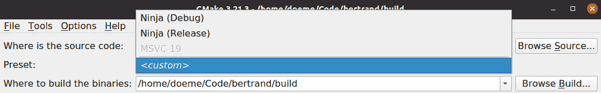
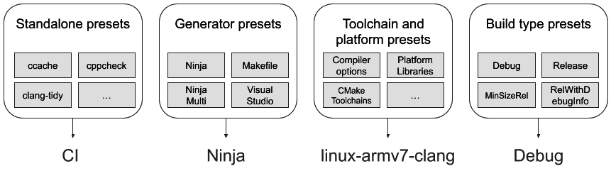

# 第九章：创建可重现的构建环境

构建软件可能会很复杂，尤其是涉及依赖项或特殊工具时。在一台机器上编译通过的软件，在另一台机器上可能无法正常工作，因为缺少某个关键的软件。单单依赖软件项目文档的正确性来搞清楚所有构建要求通常是不够的，因此，程序员往往需要花费大量时间梳理各种错误信息，以找出构建失败的原因。

在构建或 **持续集成** (**CI**) 环境中，许多人因为害怕任何更改都可能破坏软件的构建能力，而避免升级任何东西。情况甚至严重到公司因为担心无法再发布产品，而拒绝升级其使用的编译器工具链。创建关于构建环境的稳健且可移植的信息是彻底改变游戏规则的举措。通过预设，CMake 提供了定义配置项目的常见方式的可能性。当与工具链文件、Docker 容器和 **系统根目录** (**sysroots**) 结合使用时，创建一个可在不同机器上重建的构建环境变得更加容易。

在本章中，你将学习如何定义 CMake 预设以配置、构建和测试 CMake 项目，以及如何定义和使用工具链文件。我们将简要介绍如何使用容器构建软件，并学习如何使用 sysroot 工具链文件创建隔离的构建环境。本章的主要内容如下：

+   使用 CMake 预设

+   组织预设的最佳实践

+   使用 CMake 构建容器

+   使用 sysroot 隔离构建环境

所以，让我们系好安全带，开始吧！

# 技术要求

和前几章一样，示例已在 CMake 3.25 版本下测试，并可在以下任一编译器上运行：

+   GCC 9 或更新版本

+   Clang 12 或更新版本

+   MSVC 19 或更新版本

对于使用构建容器的示例，需要 Docker。

所有示例和源代码都可以在本书的 GitHub 仓库中找到。对于本章，CMake 预设和构建容器的示例位于仓库的根文件夹中。如果缺少任何软件，相应的示例将从构建中排除。仓库地址：[`github.com/PacktPublishing/CMake-Best-Practices---2nd-Edition`](https://github.com/PacktPublishing/CMake-Best-Practices---2nd-Edition)

# 使用 CMake 预设

在多个配置、编译器和平台上构建软件是 CMake 的最大优点，但这也是其最大的弱点之一，因为这通常让程序员难以弄清楚哪些构建设置实际上经过测试并能在特定软件上工作。自 3.19 版本以来，CMake 引入了一个叫做 **预设（presets）** 的功能。这个功能是处理这些场景的一个非常可靠且方便的工具。在引入预设之前，开发者需要依赖文档和模糊的约定来搞清楚 CMake 项目的首选配置。预设可以指定构建目录、生成器、目标架构、主机工具链、缓存变量和用于项目的环境变量。从 CMake 3.19 版本开始，预设经历了很大的发展，增加了构建、测试和打包预设，以及最新加入的：工作流预设。

要使用预设，项目的顶级目录必须包含一个名为 `CMakePresets.json` 或 `CMakeUserPresets.json` 的文件。如果两个文件都存在，它们会通过先解析 `CMakePresets.json`，然后再解析 `CMakeUserPresets.json` 来内部合并。两个文件的格式相同，但用途略有不同：

+   `CMakePresets.json` 应由项目本身提供，并处理项目特定的任务，比如运行 CI 构建，或者在项目中提供的情况下，知道使用哪些工具链进行交叉编译。由于 `CMakePresets.json` 是项目特定的，它不应该引用项目结构外的任何文件或路径。由于这些预设与项目紧密相关，通常也会将其保存在版本控制中。

+   另一方面，`CMakeUserPresets.json` 通常由开发者为自己的机器或构建环境定义。`CMakeUserPresets.json` 可以根据需要非常具体，可能包含项目外的路径或特定系统设置的路径。因此，项目不应该提供此文件，也不应该将其放入版本控制中。

预设是将缓存变量、编译器标志等从 `CMakeLists.txt` 文件中移出的好方法，同时还能以可以与 CMake 一起使用的方式保留这些信息，从而提高项目的可移植性。如果有预设，可以通过调用以下命令 `cmake --list-presets` 从源目录列出预设，这将生成如下输出：

```cpp
Available configure presets:
  "ninja-debug"   - Ninja (Debug)
  "ninja-release" - Ninja (Release)
```

这将列出带引号的预设名称，如果设置了 `displayName` 属性，也会显示该属性。要从命令行使用属性时，使用带引号的名称。

CMake GUI 将在源目录中显示所有可用的预设，类似如下：



图 9.1 – 在 CMake GUI 中列出可用的预设

从 CMake 3.21 版本开始，`ccmake` 命令行配置工具不支持预设。可以通过以下方式从顶级目录选择**配置**预设：

```cpp
cmake --preset=name
```

`CMakePresets.json` 和 `CMakeUserPresets.json` 的整体结构如下：

```cpp
{
   "version": 6,
   "cmakeMinimumRequired": {"major": 3,"minor": 25,"patch": 0  },
   "configurePresets": [...],
   "buildPresets": [...],
   "testPresets": [...],
  "packagePresets": [...],
  "workflowPresets": [...],
   "vendor": {
      "microsoft.com/VisualStudioSettings/CMake/1.9": {                      "intelliSenseMode": "windows-msvc-x64"
      }  }
}
```

`version` 字段指定要使用的 JSON 架构。版本 1 是 CMake 3.19 的首次发布，仅支持 `configurePresets`。随后的版本添加了 `buildPresets`、`testPresets`、`packagePresets` 和 `workflowPresets`。在编写本书时，最新版本是版本 9，该版本随 CMake 3.30 发布。

可选的 `cmakeMinimumRequired` 字段可以用来定义构建此项目所需的最低 CMake 版本。由于最低要求通常也会在 `CMakeLists.txt` 文件中声明，因此此字段通常会被省略。

四个列表：`configurePresets`、`buildPresets`、`testPresets` 和 `packagePresets`，分别包含用于配置、构建、测试和打包项目的配置列表。构建、测试和打包的预设要求至少有一个配置预设，如我们将在本节后面看到的那样。`workflowPresets` 是一个特殊情况，它描述了由其他预设组成的典型工作流。

`vendor` 字段包含一个可选的映射，用于存储供应商或 IDE 特定的信息。CMake 不会解释此字段的内容，除非验证 JSON 格式。映射的键应该是由斜杠分隔的供应商特定域。在前面的示例中，供应商预设的键是 `microsoft.com/VisualStudioSettings/CMake/1.9`。供应商字段中的值可以是任何有效的 JSON 格式。所有预设文件必须至少包含一个配置预设，因此让我们更仔细地看一下。

## 配置预设

要使用预设，必须至少存在一个配置预设，用于为 CMake 配置构建系统的环境。它们至少应该指定构建路径以及配置时使用的生成器。通常，配置预设还会设置一些常见的缓存变量，比如用于单配置生成器的 `CMAKE_BUILD_TYPE`。一个包含配置预设的预设，用于在调试模式下使用 Ninja 生成器构建项目，可能像这样：

```cpp
{
  "version": 3,
  "configurePresets": [
    {
      "name": "ninja",
      "displayName": "Ninja Debug",
      "description": "build in debug mode using Ninja generator",
      "generator": "Ninja",
      "binaryDir": "build",
      "cacheVariables": { "CMAKE_BUILD_TYPE": "Debug" }
    }
  ]
}
```

所有预设必须具有在预设块中唯一的名称。由于某些 GUI 应用程序仅显示已分配 `displayName` 字段的预设，因此强烈建议设置此字段。

预设命名约定

一个好的实践是，在 `CMakePresets.json` 文件中定义的预设名称应避免与开发者可能在 `CMakeUserPresets.json` 中定义的名称冲突。一个常见的约定是，将项目定义的预设以 `ci-` 为前缀，以标记它们用于 CI 环境。

在版本 1 和 2 的预设中，`binaryDir`和`generator`字段是必需的；在版本 3 中，它们变为可选。如果未设置任一字段，其行为与未使用预设的 CMake 相同。CMake 命令的命令行选项将在相关情况下覆盖预设中指定的值。因此，如果设置了`binaryDir`，在调用`cmake --preset=`时，它会自动创建，但如果传递了`-B`选项，则其值会被 CMake 覆盖。

缓存变量可以通过`key:value`对来定义，如前面的示例所示，或者作为 JSON 对象，这样可以指定变量类型。文件路径可以像这样指定：

```cpp
"cacheVariables": {
  "CMAKE_TOOLCHAIN_FILE": {
    "type": "FILEPATH",
    "value": "${sourceDir}/cmake/toolchain.cmake"
  }
}
```

如果以`key:value`的形式使用，则类型将被视为`STRING`，除非它是`true`或`false`（没有引号），在这种情况下将被解释为`BOOL`。例如，`$ {sourceDir}`是一个宏，当使用预设时会展开。

已知的宏如下：

+   `${sourceDir}`：这指向项目的源目录，`${sourceParentDir}`指向源目录的父目录。可以通过`${sourceDirName}`获取源目录的目录名，不包括路径。例如，如果`${sourceDir}`是`/home/sandy/MyProject`，那么`${sourceDirName}`将是`MyProject`，而`${sourceParentDir}`将是`/home/sandy/`。

+   `${generator}`：这是当前使用的预设指定的生成器。对于构建和测试预设，它包含配置预设使用的生成器。

+   `${hostSystemName}`：这是主机操作系统的系统名称，与`CMAKE_HOST_SYSTEM`变量相同。该值要么是`uname -s`的结果，要么是 Linux、Windows 或 Darwin（用于 macOS）。

+   `$env{<variable-name>}`：这包含名为`<variable-name>`的环境变量。如果该变量在预设的环境字段中定义，则使用此值，而不是从父环境或系统环境中获取的值。使用`$penv{<variable-name>}`的作用类似，但值始终从父环境中获取，而不是从环境字段中获取，即使该变量已定义。这允许向现有环境变量添加前缀或后缀。由于`$env{...}`不允许循环引用，因此不能向变量添加前缀或后缀。需要注意的是，在 Windows 环境中，变量是不区分大小写的，但在预设中使用的变量仍然区分大小写。因此，建议保持环境变量的大小写一致。

+   `$vendor{<macro-name>}`：这是供 IDE 供应商插入其自定义宏的扩展点。由于 CMake 无法解释这些宏，使用`$vendor{…}`宏的预设将被忽略。

+   `${dollar}`：这是一个占位符，代表字面上的美元符号`$`。

修改预设的环境与设置缓存变量类似：通过设置包含`key:value`对的映射的`environment`字段。即使值为空或为`null`，环境变量始终会被设置。环境变量可以互相引用，只要不包含循环引用。考虑以下示例：

```cpp
{
  "version": 3,
  "configurePresets": [
    {
      "name": "ci-ninja",
      "generator": "Ninja",
      "binaryDir": "build",
      "environment": {
        "PATH": "${sourceDir}/scripts:$penv{PATH}",
        "LOCAL_PATH": "$env{PATH}",
        "EMPTY" : null
    }
  ]
}
```

在这个示例中，`PATH`环境变量通过在项目结构内部预先添加路径进行修改。使用`$penv{PATH}`宏确保值来自预设之外。然后，`LOCAL_PATH`变量通过使用`$env{PATH}`宏引用修改后的`PATH`环境变量。只要`PATH`环境变量不包含`$env{LOCAL_PATH}`（这将产生循环引用），这种引用是允许的。通过传递`null`，`EMPTY`环境变量被取消设置。注意，`null`不需要加引号。除非使用构建预设或测试预设，否则环境*不会*传递到相应的步骤。如果使用了构建预设或测试预设，但不希望应用来自配置预设的环境，可以通过将`inheritConfigureEnvironment`字段设置为`false`来明确声明。

### 从预设中继承

预设可以通过`inherits`字段继承其他相同类型的预设，该字段可以包含单个预设或预设列表。在继承父级字段时，预设可以被覆盖或添加额外的字段。这对于避免为常见构建块重复代码非常有用。结合`hidden`字段使用时，可以使`CMakePreset.json`文件更小。考虑以下示例：

```cpp
{
   "version": 3,
   "configurePresets": [
      {
         "name": "ci-ninja",
         "generator": "Ninja",
         "hidden": true,
         "binaryDir": "build"
      },
      {
         "name": "ci-ninja-debug",
         "inherits": "ci-ninja",
         "cacheVariables": {
            "CMAKE_BUILD_TYPE": "Debug"
         }
      },
      {
          "name": "ci-ninja-release",
          "inherits": "ci-ninja",
          "cacheVariables": {
             "CMAKE_BUILD_TYPE": "Release"
         }
      }
   ]
}
```

在示例中，`ci-ninja-debug`和`ci-ninja-release`预设都从隐藏的`ci-ninja` `build`预设继承，并额外设置了`CMAKE_BUILD_TYPE`缓存变量，以对应的配置进行构建。隐藏预设仍然可以使用，但在执行`cmake --list-presets`时不会显示。`CMakeUserPreset.json`中定义的预设可以从`CMakePreset.json`继承，但反过来不行。

在前面的示例中，预设继承自单一父预设，但预设也可以从多个父预设继承。以下示例展示了`CMakeUserPreset.json`与前面示例中的`CMakePreset.json`如何协同工作：

```cpp
{
    "version": 6,
    "configurePresets": [
    {
      "name": "gcc-11",
      "hidden": true,
      "binaryDir": "build",
      "cacheVariables": {
          "CMAKE_C_COMPILER": "gcc-11",
          "CMAKE_CXX_COMPILER": "g++-11"
       }
     },
     {
       "name": "ninja-debug-gcc",
       "inherits": ["ci-ninja-debug","gcc-11"],
       "cacheVariables": {
            "CMAKE_BUILD_TYPE": "Debug"
         }
     },
   ]
}
```

在这里，用户提供了一个预设，明确选择了 GCC 11 作为名为`gcc-11`的编译器。之后，`ninja-debug-gcc`预设从项目提供的`CMakePreset.json`中定义的`ci-ninja-debug`预设继承值，并与用户提供的`gcc-11`预设结合。如果两个父预设为相同字段定义了不同的值，则`inherits`列表中首先出现的那个预设的值优先。

### 预设条件

有时，预设仅在某些条件下才有意义，例如针对特定的构建平台。例如，使用 Visual Studio 生成器的配置预设仅在 Windows 环境中才有用。对于这些情况，如果条件不满足，可以使用`condition`选项禁用预设。任何在父预设中定义的条件都会被继承。条件可以是常量、字符串比较，或检查列表是否包含某个值。从预设版本 3 开始提供这些功能。以下配置预设仅在你在 Windows 环境下工作时启用：

```cpp
{
  "name": "ci-msvc-19",
  "generator": "Visual Studio 16 2019",
  "binaryDir": "build",
  "condition": {
    "type": "equals",
    "lhs": "${hostSystemName}",
    "rhs": "Windows"
  }
}
```

在上述示例中，构建预设会在使用`${hostSystemName}`宏获取主机系统的名称并与`Windows`字符串进行比较后启用。如果`${hostSystemName}`匹配，则启用预设；否则，禁用该预设，尝试使用它会导致错误。在比较字符串时，大小写是重要的：对于不区分大小写的测试，可以使用`matches`或`notMatches`类型，它们接受正则表达式。

对于更复杂的条件，支持使用`allOf`、`anyOf`和`not`运算符进行布尔逻辑嵌套。例如，如果一个配置预设只应在 Windows 和 Linux 下启用，而在 macOS 下不启用，则预设和条件可以如下所示：

```cpp
{
"name": "WindowsAndLinuxOnly",
"condition": {
    "type": "anyOf",
    "conditions": [
        {
            "type": "equals",
            "lhs": "${hostSystemName}",
            "rhs": "Windows"
        },
        {
            "type": "equals",
            "lhs": "${hostSystemName}",
            "rhs": "Linux"
        }
    ]
}
```

每个条件也可以包含进一步的嵌套条件（如果需要的话），尽管这样做会迅速增加预设的复杂性。

到目前为止，我们在示例中只见过配置预设，但正如本章开头所提到的，还有构建预设和测试预设。构建和测试预设的语法与配置预设非常相似，许多字段，如`name`、`displayName`和`inherit`，以及条件的工作方式与配置预设相同。一旦指定了配置预设，我们就可以开始指定构建、测试和打包预设。

## 构建、测试和打包预设

构建预设必须在`configurePreset`字段中指定一个配置预设，或从另一个指定了配置预设的构建预设中继承。构建目录由配置预设决定，除非`inheritConfigureEnvironment`字段设置为`false`，否则会继承配置预设的环境。构建预设主要用于多配置生成器，但如果需要，也可以用于单配置生成器。可选地，构建预设可以指定一个要构建的目标列表。一个构建预设的示例如下：

```cpp
{
    "version": 6,
    "configurePresets": [
        {
            "name": "ci-msvc-19",
            "displayName": "msvc 19",
            "description": "Configuring for msvc 19",
            "generator": "Visual Studio 16 2019",
            "binaryDir" : "build"
        }
    ],
    "buildPresets": [
        {
            "name": "ci-msvc-debug",
            "configurePreset": "ci-msvc-19",
            "configuration": "Debug"
        },
        {
            "name": "ci-msvc-release",
            "configurePreset": "ci-msvc-19",
            "configuration": "Release"
        },
        {
            "name": "ci-documentation",
            "configurePreset": "ci-msvc-19",
            "targets": [
                "api-doc",
                "doc"
            ]
        }
    ]
}
```

在上面的示例中，定义了三个构建预设。前两个分别叫做`ci-msvc-debug`和`ci-msvc-release`，用于指定 Visual Studio 的构建配置，并且不指定任何目标。第三个构建预设叫做`ci-documentation`，并将`api-doc`和`doc`目标列为文档构建的一部分。调用任何`ci-msvc`构建预设都会构建`"all"`目标，而`ci-documentation`则只会构建列出的目标。可用的构建预设列表可以通过`cmake --build --list-presets`命令获取。

测试预设与构建预设非常相似，不同之处在于它们与 CTest 一起使用。类似地，在项目根目录下运行`ctest --list-presets`命令将列出可用的测试预设。测试预设是一个非常有用的工具，可以用来选择或排除特定的测试、指定固定选项，或者控制测试的输出。大部分在*第七章*中描述的测试选项，*无缝集成代码质量工具与 CMake*，都可以通过测试预设来控制。一个测试预设的示例如下：

```cpp
{
    "version": 3,
    "configurePresets": [
        {
            "name": "ci-ninja",
            ...
        }
    "testPresets": [
{
            "name": "ci-feature-X",
            "configurePreset": "ci-ninja",
            "filter": {
                "include": {
                    "name": "feature-X"
                },
                "exclude": {
                    "label": "integration"
                }
}
        }
    ]
}
```

在上面的示例中，添加了一个测试预设，用于过滤包含`feature-X`的测试，但排除了标记为`integration`的任何测试。这等同于从构建目录调用以下命令：

```cpp
ctest --tests-regex feature-X --label-exclude integration
```

包预设与构建和测试预设非常相似，也需要设置一个配置预设。一个包预设的示例如下：

```cpp
"packagePresets": [
    {
        "name": "ci-package-tgz",
        "configurePreset": "ci-ninja-release",
        "generators": [
            "TGZ"
        ],
        "packageDirectory": "${sourceDir}/dist"
    }
]
```

这个包预设将使用 TGZ 生成器构建一个包，并将结果包放入`dist`目录中。由于打包依赖于生成器，并且 CPack 需要相当复杂的配置，因此预设通常用于将包放置在预定义位置，并与工作流预设一起使用，正如我们将在下一节看到的那样。

## 工作流预设

工作流预设顾名思义，是一种从配置到构建、测试和打包的完整工作流定义方式。如果其中的任何一步失败，工作流将中断，后续步骤不会被执行。工作流预设主要用于自动化构建系统，但当然也可以在本地使用。

列出工作流预设的语法如下：

```cpp
cmake --workflow --list-presets
```

要调用工作流预设，使用以下命令：

```cpp
cmake --workflow --preset=ci-ninja-debug-workflow
```

这将执行完整的`ci-ninja-debug-workflow`工作流。工作流定义为一系列的步骤，如下所示：

```cpp
"workflowPresets": [
    {
        "name": "ci-ninja-debug-workflow",
        "displayName": "CI",
        "description": "Continuous Integration",
        "steps": [
            {
                "type": "configure",
                "name": "ci-ninja-debug"
            },
            {
                "type": "build",
                "name": "ci-ninja-debug-build"
            },
            {
                "type": "test",
                "name": "ci-unit-tests-debug"
            },
            {
                "type": "package",
                "name": "ci-package-tgz"
            }
        ]
    }
]
```

该命令定义了一个工作流，配置、构建、测试并打包项目。

所有工作流步骤必须使用相同的配置预设

有一点值得注意的是，所有步骤必须定义相同的配置步骤，否则工作流将不正确，CMake 会失败。

虽然它们缺乏像 GitHub Actions、Jenkins 和 Azure DevOps 那样定义完整构建流水线的复杂性，但它们的优势在于能够让开发人员轻松遵循定义好的工作流。工作流预设是应对 CMake 预设“组合爆炸”问题的一种尝试，尤其是当有很多预设时。虽然它们在一定程度上有助于解决这个问题，但它们也要求所有中间步骤都明确地定义，并显式使用相同的配置预设。这样一来，可能迫使开发人员添加更多的预设，这些预设在某种程度上是“差不多但不完全相同”的。

目前还没有一劳永逸的解决方案，但如果预设组织得当，并且遵循一定的纪律，仍然可以获得很多好处。

### 组织预设的最佳实践

随着项目的增长——特别是当它们面向多个平台时——CMake 预设的数量也可能迅速增加。这会使得跟踪预设并找到正确的预设变得困难。设置工作流预设可以有所帮助，但这仅仅是解决问题的一半，缺点往往是，使用工作流预设会为所有中间步骤创建更多的预设。

组织预设的第一步是找到一个好的命名方案。这样可以轻松地弄清楚某个预设的作用，也有助于让开发人员猜测所需的预设名称（如果它存在的话）。

一个好的方案应该包含以下构建信息：

+   `ci` 或 `dev`

+   要使用的**生成器**

+   **工具链**，例如要使用的编译器和目标平台

+   **构建类型**，例如调试版或发布版

使用这种方式，我们最终得到一个类似于`<env>-<generator>-<toolchain>-<buildType>`的方案，因此用于构建 Linux x86_64 的预设可能被命名为`ci-ninja-linux-x86_64-clang-debug`。

命名方案适用于各种预设，但对于配置预设最为有用。这里的`env`可以是`ci`或`dev`，取决于预设是用于 CI 还是本地使用。一个好的经验法则是将所有`ci`预设放入`CMakePresets.json`并进行版本控制，而将`dev`预设放入`CMakeUserPresets.json`并且不进行检查。生成器部分可以是 CMake 支持的任何生成器，例如 Makefiles、Ninja 或 MSVC（用于 Microsoft Visual Studio）。工具链是一个由目标平台、编译器和操作系统组合而成的部分，通常称为目标三元组或目标四元组，例如`linux-armv7-clang12`。

构建类型是常见的构建类型之一，如调试版、发布版、带调试信息的发布版（relWithDebInfo）或最小大小发布版（minSizeRel），但如果项目配置了自定义构建类型，也可以使用它。对于像 ninja-multi 这样的多配置生成器，构建类型可以在配置预设中省略，并在构建预设中使用。为了聚合预设，可以使用继承和隐藏的预设。那么，哪个预设应该放入哪个部分呢？



图 9.2 – 按类型分组预设以组合可用预设

让我们更仔细地看看用于组合可用预设的不同类型的预设：

+   `ci` 预设应使用相同或至少相似的一组预设。通常，此类别包含多个预设，针对不同方面，例如一个用于设置 Ccache，另一个用于指向 clang-tidy。

+   **生成器预设**：它们定义要使用的 CMake 生成器。对于包预设，这也可以是包生成器。默认情况下，它们是隐藏的。通常，只有在 CI 或本地实际使用的生成器应该存在。

+   `hidden`。

+   **构建类型预设**：这些定义构建类型，例如 release、debug、RelWithDebInfo 或 MinSizeRel。

+   **组合预设**：这些预设通过 inherit 关键字将所有先前的预设组合成可用预设。它们是可见的，并且指定了构建目录，通常是直接指定或通过其中一个先前的预设指定。

以这种方式设置预设有助于保持它们的组织性。CMake 预设支持包含不同的文件，因此将类别放入不同的文件中可能有助于保持它们的组织性。

CMake 预设可以说是自从引入目标以来，改变了 CMake 使用方式的少数几个特性之一。它们是一个很好的折衷方案，可以将常见的配置和构建选项与项目一起提供，同时保持 `CMakeLists.txt` 文件与平台无关。最终，无法避免 CMake 支持大量工具和平台，或者 C++ 软件可以通过多种方式构建这一问题。适应这种灵活性需要维护所有这些配置；预设显然是一个不错的选择。然而，有时候，提供必要的设置还不够，你还希望共享一个构建环境，确保软件能够编译。一种实现方法是通过定义一个包含 CMake 和必要库的构建容器。

# 使用 CMake 的构建容器

容器化带来的好处是开发人员可以在一定程度上控制构建环境。容器化的构建环境对于设置 CI 环境也非常有帮助。目前有许多容器运行时，其中 Docker 是最流行的。深入探讨容器化超出了本书的范围，因此我们将在本书的示例中使用 Docker。

构建容器包含一个完全定义的构建系统，包括 CMake 和构建某个软件所需的任何工具和库。通过提供容器定义（例如 Dockerfile），以及项目文件，或者通过公开可访问的容器注册表，任何人都可以使用该容器来构建软件。巨大的优势是开发者不需要安装额外的库或工具，从而避免污染主机机器，除了运行容器所需的软件。缺点是构建可能需要更长的时间，并且并非所有 IDE 和工具都支持以便捷的方式与容器协作。值得注意的是，Visual Studio Code 对在容器中工作提供了很好的支持。您可以访问[`code.visualstudio.com/docs/remote/containers`](https://code.visualstudio.com/docs/remote/containers)了解更多细节。

从很高的层次来看，使用构建容器的工作流程如下：

1.  定义容器并构建它。

1.  将本地代码的副本挂载到构建容器中。

1.  在容器内运行任何构建命令。

用于构建一个简单 C++ 应用程序的非常简单的 Docker 定义可能如下所示：

```cpp
FROM alpine:3.20.2
RUN apk add --no-cache cmake ninja g++ bash make git
RUN <any command to install additional libraries etc.>
```

这将基于 Alpine Linux 3.15 定义一个小型容器，并安装`cmake`、`ninja`、`bash`、`make`和`git`。任何实际使用的容器可能会安装额外的工具和库以方便工作；然而，仅为了说明如何使用容器构建软件，拥有这样一个最小的容器就足够了。以下 Docker 命令将构建容器镜像，并使用`builder_minimal`名称进行标签：

```cpp
docker build . -t builder_minimal
```

一旦容器是本地的克隆，源代码被挂载到容器中，所有的 CMake 命令都在容器内部执行。假设用户从`source`目录执行 Docker 命令，配置 CMake 构建项目的命令可能看起来像这样：

```cpp
docker run --user 1000:1000 --rm -v $(pwd):/workspace
  builder_minimal cmake -S /workspace -B /workspace/build
docker run --user 1000:1000 --rm -v $(pwd):/workspace
  builder_minimal cmake --build /workspace/build
```

这将启动我们创建的容器并执行其中的 CMake 命令。通过`-v`选项，本地目录会挂载到容器中的`/workspace`。由于我们的 Docker 容器默认使用*root*作为用户，因此需要通过`--user`选项传递用户 ID 和组 ID。对于类 Unix 操作系统，用户 ID 应与主机上的用户 ID 匹配，这样创建的任何文件也可以在容器外部编辑。`--rm`标志告诉 Docker 在完成后删除镜像。

与容器交互的另一种方式是通过向`docker` `run`命令传递`-ti`标志来以交互模式运行它：

```cpp
docker run --user 1000:1000 --rm -ti -v $(pwd):/workspace
  builder_minimal
```

这将在容器内启动一个 shell，可以在其中调用`build`命令，而无需每次都重新启动容器。

编辑器或 IDE 和构建容器如何协同工作有几种策略。最便捷的方式当然是 IDE 本身原生支持，或者通过像 Visual Studio Code 这样的方便扩展支持。如果没有这种支持，将合适的编辑器打包进容器并从容器内启动也是一个可行的策略来方便地开发软件。另一种方法是在宿主系统上运行编辑器，并重新配置它，使其不直接调用 CMake，而是启动容器并在其中执行 CMake。

我们在这里展示的只是使用容器作为构建环境的最低要求，但我们希望它能作为使用容器的第一步。随着越来越多的集成开发环境（IDE）开始支持容器化构建环境，使用它们将变得更加容易。容器使得构建环境在不同机器之间变得非常可移植，并有助于确保项目中的所有开发者都使用相同的构建环境。将容器定义文件放在版本控制下也是一个好主意，这样对构建环境的必要更改就能与代码一起进行跟踪。

容器是创建隔离构建环境的一种好且可移植的方式。然而，如果出于某种原因无法使用容器，另一种创建隔离和可移植构建环境的方法是使用 sysroot。

# 使用 sysroot 来隔离构建环境

简而言之，sysroot 是构建系统认为的根目录，用来定位头文件和库文件。简而言之，它们包含为目标平台编译软件时所需的简化版根文件系统。它们通常在交叉编译软件到其他平台时使用，如 *第十二章* 中所述，*跨平台编译与自定义工具链*。如果容器无法用于传递整个构建环境，sysroot 可以作为提供已定义构建环境的替代方案。

要在 CMake 中使用 sysroot，需使用工具链文件。顾名思义，这些文件定义了编译和链接软件所使用的工具，并指明了查找任何库的路径。在正常的构建过程中，CMake 会通过系统自检自动检测工具链。工具链文件通过 `CMAKE_TOOLCHAIN_FILE` 变量传递给 CMake，方法如下：

```cpp
cmake -S <source_dir> -B <binary_dir> -DCMAKE_TOOLCHAIN_FILE=
  <path/to/toolchain.cmake>
```

从版本 3.21 开始，CMake 额外支持 `--toolchain` 选项来传递工具链文件，这相当于传递 `CMAKE_TOOLCHAIN_FILE` 缓存变量。

另外，工具链文件可以作为缓存变量通过 CMake 预设传递。最基本的情况下，使用 sysroot 的工具链文件会定义`CMAKE_SYSROOT`变量来指向 sysroot，`CMAKE_<LANG>_COMPILER`变量来指向与 sysroot 中的库兼容的编译器。为了避免混淆来自 sysroot 之外的依赖与安装在主机系统上的文件，通常还会设置控制`find_`命令查找位置的变量。一个最小的工具链文件可能如下所示：

```cpp
set(CMAKE_SYSTEM_NAME Linux)
set(CMAKE_SYSROOT /path/to/sysroot/)
set(CMAKE_STAGING_PREFIX path/to/staging/directory)
set(CMAKE_C_COMPILER /path/to/sysroot/usr/bin/gcc-10)
set(CMAKE_CXX_COMPILER /path/to/sysroot/usr/bin/g++-10)
set(CMAKE_FIND_ROOT_PATH_MODE_PROGRAM NEVER)
set(CMAKE_FIND_ROOT_PATH_MODE_LIBRARY ONLY)
set(CMAKE_FIND_ROOT_PATH_MODE_INCLUDE ONLY)
set(CMAKE_FIND_ROOT_PATH_MODE_PACKAGE BOTH)
```

让我们详细看看这里发生了什么：

1.  首先，通过设置`CMAKE_SYSTEM_NAME`变量，设置目标系统的系统名称。这是为其在 sysroot 内部编译文件的系统。

1.  然后，通过设置`CMAKE_SYSROOT`变量，设置 sysroot 本身的路径。`CMAKE_STAGING_PREFIX`是可选的，用于指定一个位置来安装项目的任何产物。指定一个暂存前缀有助于保持 sysroot 和主机文件系统的清洁，因为如果没有它，所有产物的安装都会发生在主机文件系统上。

1.  接下来，通过设置`CMAKE_C_COMPILER`和`CMAKE_CXX_COMPILER`变量，编译器会设置为与 sysroot 一起提供的编译器二进制文件。

1.  最后，设置任何`find_`命令在 CMake 中的搜索行为。`CMAKE_FIND_ROOT_PATH_MODE_*`变量可以取`ONLY`、`NEVER`和`BOTH`中的任何一个值。如果设置为`ONLY`，CMake 只会在 sysroot 内搜索该类型的文件；如果设置为`NEVER`，搜索将仅考虑主机文件结构。如果设置为`BOTH`，则会同时搜索主机系统路径和 sysroot 路径。需要注意的是，`CMAKE_STAGING_PREFIX`被视为系统路径，因此为了同时搜索 sysroot 和暂存目录，必须选择`BOTH`。在这个例子中，配置的方式是将所有头文件和库限制在 sysroot 中，而任何`find_program`的调用只会在主机系统中查找，`find_package`则会在两个地方查找。

设置`CMAKE_SYSROOT`变量不会自动设置构建产物的安装位置。在生成的二进制文件与主机系统兼容的情况下，这可能是预期的行为。在许多情况下，比如交叉编译时，这不是我们想要的行为，因此通常推荐设置`CMAKE_STAGING_PREFIX`。设置暂存目录有两个效果：首先，它会导致所有产物安装到暂存目录中；其次，暂存目录会被添加到`find_`命令的搜索前缀中。需要注意的是，暂存目录会被添加到`CMAKE_SYSTEM_PREFIX_PATH`，这带来的一个问题是，前面例子中的`CMAKE_FIND_ROOT_PATH_MODE_XXX`变量必须设置为`BOTH`，这样才能找到安装在暂存区域中的软件包、库和程序。

CMAKE_STAGING_PREFIX 和 CMAKE_INSTALL_PREFIX

如果同时设置了 `CMAKE_STAGING_PREFIX` 和 `CMAKE_INSTALL_PREFIX`，则 staging 前缀将具有优先权。因此，作为经验法则，只要工具链与主机系统兼容，通常可以省略 staging，或者倾向于定义它。

与容器相比，sysroots 的一个缺点是它们不能像容器那样启动并直接执行命令。因此，如果工具链和 sysroot 与主机平台不兼容，则生成的任何文件都无法执行，除非移至目标平台或使用仿真器。

# 总结

本章中，我们学习到 CMake 的主要优势之一是它在使用多种工具链为大量平台构建软件方面的多功能性。其缺点是，有时开发者难以找到适合的软件配置。不过，通过提供 CMake 预设、容器和 sysroots，通常可以更容易地开始 CMake 项目。

本章详细讲解了如何定义 CMake 预设来定义工作配置设置，并创建构建和测试定义。然后，我们简要介绍了如何创建 Docker 容器以及如何在容器内调用 CMake 命令，最后简要回顾了 sysroots 和工具链文件。有关工具链和 sysroots 的更多内容将在 *第十二章* 中讲解，*跨平台编译和* *自定义工具链*。

在下一章中，您将学习如何将大型分布式项目作为超级构建进行处理。在那里，您将学习如何处理不同版本以及如何以可管理的方式从多个仓库组装项目。

# 问题

1.  `CMakePresets.json` 和 `CMakeUserPresets.json` 有何区别？

1.  预设如何在命令行中使用？

1.  存在哪三种类型的预设，它们之间如何相互依赖？

1.  配置预设应至少定义什么内容？

1.  当从多个预设继承时，如果某个值被多次指定，哪个预设优先？

1.  常见的构建容器工作策略有哪些？

1.  用于与 sysroots 一起使用的工具链文件通常定义了什么？

# 答案

1.  `CMakePresets.json` 通常与项目一起维护和交付，而 `CMakeUserPresets.json` 则由用户维护。在语法和内容上，它们没有区别。

1.  可以通过调用 `cmake --preset=presetName`、`cmake --build --preset=presetName` 或 `ctest --preset=presetName` 来完成。

1.  存在配置、构建、打包、测试和工作流预设。构建、测试和打包预设依赖于配置预设来确定 `build` 目录。

1.  配置预设应定义名称、生成器和要使用的构建目录。

1.  第一个设置值的预设具有优先权。

1.  这可以通过使用编辑器对构建容器的本地支持、从容器内运行编辑器，或者每次启动容器以在其中调用单个命令来完成。

1.  它们定义了系统名称、sysroot 的位置、要使用的编译器以及`find_`命令的行为方式。
