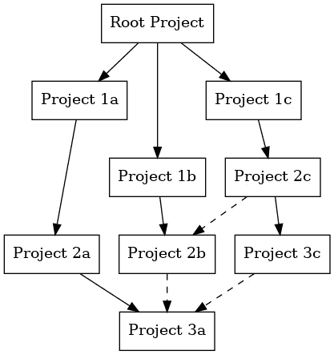
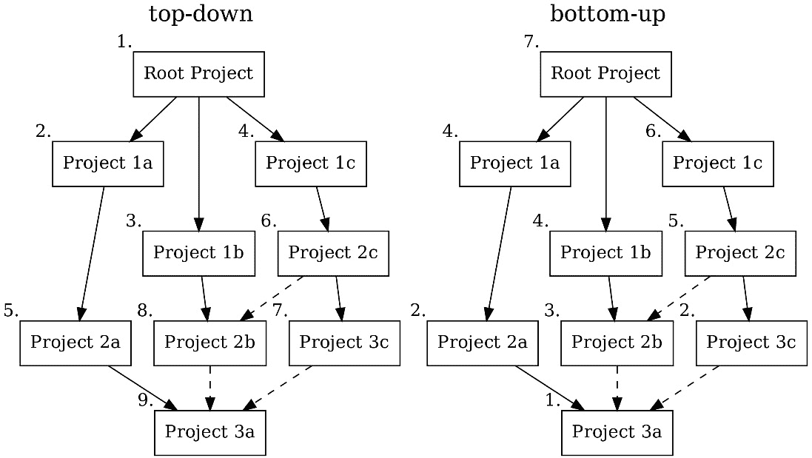

# 第十五章：迁移到 CMake

虽然 CMake 正在发展成为 C++ 和 C 项目的事实上的行业标准，但仍然有一些项目—有时甚至是大型项目—使用不同的构建系统。当然，只要它满足你的需求，这并没有问题。然而，在某些时候，出于某种原因，你可能希望切换到 CMake。例如，也许软件应该能够通过不同的 IDE 或在不同的平台上进行构建，或者依赖管理变得繁琐。另一个常见的情况是，当代码库结构从一个包含所有库的大型单一仓库，变更为每个库项目都有独立仓库时。无论什么原因，迁移到 CMake 可能是一个挑战，尤其是对于大型项目，但结果可能是值得的。

虽然一次性转换整个项目是首选方式，但通常会有一些非技术性要求使得这种方式不可行。例如，在迁移过程中，某些部分的开发可能仍然需要继续进行，或者因为一些超出团队控制的需求，项目的某些部分无法一开始就进行迁移。

因此，通常需要逐步的方法。更改构建系统很可能会影响任何 CI/CD 过程，因此这也应该考虑在内。本章将探讨一些高级策略，讲解如何逐步将项目迁移到 CMake。然而，注意具体的迁移路径很大程度上依赖于各自的具体情况。例如，从基于单一仓库的 Makefile 项目迁移，和从跨多个仓库的 Gradle 构建迁移，操作方式是不同的。

改变构建系统，可能还包括项目结构的变化，可能会对所有相关人员造成很大的干扰，因为他们已经习惯了现有的结构和构建系统。因此，决定切换构建系统不应轻率做出，只有在收益显著的情况下才能进行更改。

本章虽然侧重于迁移项目到 CMake 的过程，但通常迁移的目的并不是为了切换构建系统，而是为了实现其他主要目标，比如简化项目结构或减少项目各部分之间的耦合，从而使它们能够更容易地独立维护。在谈论迁移的好处时，记住这些好处不一定非得是纯粹的技术性好处，比如通过更好地并行化构建来提升构建速度。好处也可以来自“社会”层面，例如，拥有一种标准化且广为人知的构建软件方式，可以减少新开发者的入门时间。

本章将涵盖以下主题：

+   高级迁移策略

+   迁移小型项目

+   将大型项目迁移到 CMake

在本章中，我们将介绍一些从任何构建系统迁移到 CMake 的高级概念。正如你所看到的，迁移小型项目可能相当简单，而大型复杂项目则需要更多的前期规划。在本章结束时，你将对将不同规模的项目迁移到 CMake 的不同策略有一个清晰的了解。此外，我们还会提供一些迁移时需要检查的提示，并附上一份大致的迁移步骤指南，以及如何与遗留构建系统互动。

# 技术要求

本章没有具体的技术要求，因为它展示的是概念，而不是具体示例。然而，建议在迁移到 CMake 时使用最新版本的 CMake。本章中的示例假设使用的是 CMake 3.21 或更高版本。

# 高级迁移策略

在将软件项目迁移到 CMake 之前，首先需要回答一些关于现有项目的问题，并定义最终目标应该是什么。从非常抽象的层面来看，通常软件项目会定义如何处理以下事项：

+   软件的各个部分——即库和可执行文件——如何编译，以及它们如何被链接在一起

+   使用哪些外部依赖，它们是如何被找到的，如何在项目中使用

+   构建哪些测试以及如何运行它们

+   软件如何安装或打包

+   提供额外的信息，如许可证信息、文档、更新日志等

一些项目可能只定义前述点的一个子集。但通常来说，这些是我们作为开发人员希望在项目设置中处理的任务。这些任务通常以结构化的方式定义，例如使用 Makefile 或特定于 IDE 的项目定义。项目的组织和结构方式有无数种，而一种设置有效的方式可能不适用于另一种设置。因此，在任何情况下，都需要对具体情况进行个别评估。

有一些工具可以自动将一些构建系统（如`qmake`、Autotools 或 Visual Studio）转换为 CMake，但生成的 CMake 文件质量至多堪忧，并且它们通常假设某些约定。因此，不建议使用这些工具。

此外，一个项目可能会定义它如何在 CI/CD 流水线中构建、测试和部署，虽然这与项目描述密切相关，但 CI/CD 流水线的定义通常不会被视为*项目描述的一部分*，而是作为*使用*项目定义的内容。更换构建系统往往会影响 CI/CD 流水线，且通常，想要现代化或更改 CI/CD 基础设施的需求可能是更改构建系统的触发因素。

需要意识到，迁移工作只有在不再使用旧的构建方式时才算完成。因此，我们建议在项目迁移到 CMake 后，删除所有旧的构建指令，以消除维护与旧构建方式的向后兼容性所需的工作。

在理想的情况下，项目的所有部分都应该迁移到 CMake。然而，也有一些情况是无法做到的，或者如果某个部分是否应该迁移，从经济角度来看也值得怀疑。例如，项目可能依赖于一个不再积极维护并且即将淘汰的库。最佳情况是，可以利用迁移工作作为一个契机来完全移除这个依赖；然而，更常见的是，这并不可行。在无法完全移除遗留依赖的情况下，可能的好做法是将其从项目中移除，使其不再被视为内部依赖，而是作为一个外部依赖，并且拥有自己的发布周期。此外，如果无法移除或移除工作量过大，可以对这个特定的库做出例外处理，使用遗留的构建系统和 `ExternalProject` 解决方案，作为临时措施。对于本章讨论的迁移策略，我们将依赖分为内部依赖和外部依赖。内部依赖是由与要迁移的项目相同的组织或人员积极开发的依赖，以便开发人员可以有可能修改构建过程。而外部依赖是开发人员对构建过程或代码几乎没有控制权的依赖。

迁移项目时需要考虑的一件事是，在迁移过程中有多少人会被阻止继续在项目上工作，以及需要同时维护旧的构建方式和 CMake 的时间长短。改变构建系统对开发者的工作流程有很大干扰。很可能会有一些时候，项目的某些部分在完全迁移之前无法继续开发。解决这一问题的最简单方法是暂时停止功能开发，让每个人都参与迁移工作。然而，如果这不可行，良好的沟通和有效的工作分配往往是所需要的。话虽如此，避免在迁移过程中半途而废：将一个大项目的某些部分迁移了，而其他部分仍然使用旧的构建方式，这很可能会带来两者构建方式的缺点，却无法享受到任何一种的好处。

那么，迁移项目时该如何推进呢？对于那些主要依赖外部库的小型项目，这可能会相对简单。

# 迁移小型项目

我们将*小型项目*定义为仅包含少数目标的项目，这些目标通常是一起部署的。小型项目是自包含在单一仓库中的，通常你可以很快地了解它们。这些项目可能构建一个单一的库或带有少量外部依赖项的可执行文件。在这些情况下，迁移到 CMake 通常相对简单。对于小型项目，在第一次迁移时，将所有内容放在一个文件中可能是最简单的方式，以便快速获得早期结果。如果项目已经正确构建，将文件重新排列并将 `CMakeLists.txt` 文件拆分为多个部分并使用 `add_subdirectory()` 会更加容易。

向 CMake 迁移的一般方法如下：

1.  在项目的根目录下创建一个空的 `CMakeLists.txt` 文件。

1.  确定项目中的目标和相关文件，并在 `CMakeLists.txt` 文件中创建适当的目标。

1.  查找所有外部依赖项和`include`路径，并在必要时将它们添加到 CMake 目标中。

1.  确定必要的编译器特性、标志和编译器定义（如果有的话），并将它们提供给 CMake。

1.  通过创建必要的目标并调用 `add_test()`，将所有测试迁移到 CTest。

1.  确定与 CMake 相关的任何安装或打包说明，包括需要安装的资源文件等。

1.  清理并优化项目，使其更整洁。如果需要，可以创建预设，重新排列文件和文件夹，并拆分 `CMakeLists.txt` 文件。

自然地，每个步骤到底需要做什么，很大程度上取决于原始项目的组织方式和使用的技术。通常，迁移过程需要多次迭代 `CMakeLists.txt` 文件，直到一切正常工作。如果第一次实现的 CMake 项目看起来还不太完美，这通常是很正常的。

对于小型项目，处理依赖关系是比较困难的任务之一，因为存在一些隐含的假设，关于依赖关系的存放位置及其在项目内部的结构或隐藏方式。使用包管理器，如在*第五章*中所述，*集成第三方库和依赖管理*，可以显著减少处理依赖关系的复杂性。

通常，迁移小型、主要是自包含的项目相对直接，尽管根据原始设置的混乱程度，重新整理和使一切重新正常工作可能需要相当多的工作。在大型组织中，多个此类小型项目可能会一起用于软件组合，再次可以被描述为一个项目。它们的迁移需要更多的规划才能顺利进行。

# 将大型项目迁移到 CMake

迁移包含多个库和多个可执行文件的大型项目可能是一项挑战。仔细分析，这些项目实际上可能是多个层次嵌套的项目，包含一个或多个根项目，这些根项目整合了多个子项目，而这些子项目又包含或需要多个子项目。根据组织软件组合的大小和复杂性，可能会并存多个共享公共子项目的根项目，这可能会使迁移变得更加复杂。创建项目和子项目的依赖图（如以下图示）通常能帮助我们确定迁移顺序。每个项目可能包含多个项目或目标，它们有自己的依赖关系：



图 15.1 – 一个示例项目层次结构，展示了各种依赖关系

在迁移之前，首先需要彻底分析项目之间的依赖关系以及它们需要按照什么顺序构建。根据项目的状态，生成的图可能相当庞大，因此确定从哪里开始可能会是一个挑战。实际上，依赖图通常不像本书中展示的那样整洁。是否先理清项目的结构然后迁移到 CMake，还是先迁移到 CMake 再理清项目结构，取决于实际情况。如果项目非常大且复杂，首先从图中找到尽可能自包含的“岛屿”，然后从那里开始。

对于复杂的层次化项目，有两种主要的迁移策略需要考虑。一种是自上而下的方法，其中根项目首先进行迁移和替换，然后子项目按*最少传入依赖关系*的顺序排列。第二种是自下而上的方法，逐个迁移各个项目，从依赖关系*最多*的项目开始。

自上而下的方法有一个好处，那就是可以确保整个项目能够尽早使用 CMake 构建、测试和打包，但这需要将现有的构建系统集成到 CMake 中，使用`ExternalProject`。自上而下方法的缺点可能是在早期阶段，生成的 CMake 项目包含了大量用于处理由旧系统构建的包的自定义代码。实际上，使用一些临时的解决方法将现有项目包含到构建中，通常是实现快速且良好结果的最务实方法，并且可以在一定程度上减轻为相同子项目维护两个构建系统的工作量。

自下而上的方法有一个好处，即每个迁移到 CMake 的库可以使用已经迁移的依赖项。缺点是根项目只能在所有子项目都能用 CMake 构建后才可以替换。尽管项目是从下往上迁移的，但一个好的做法是在早期就创建根 CMake 项目。它与原始构建系统中的根项目并存。这样可以在新的 CMake 项目中提前放入外部依赖项并安装配置和打包指令。

下图展示了自上而下和自下而上的策略并排展示的情况。框旁的数字代表迁移顺序：



图 15.2 – 迁移顺序示例

除了整体迁移策略，另一个需要考虑的因素是项目是设置为超级构建（superbuild）还是常规项目。当采用自上而下的策略时，超级构建结构可能更容易迁移，因为它的一个优点是设计上更容易集成非 CMake 项目。关于超级构建结构的更多信息，请参考 *第十章*，*在超级构建中处理分布式代码库和依赖项*。

无论选择自上而下还是自下而上的方法来迁移单个项目，迁移大型项目的总体策略看起来都将是以下的方式：

1.  分析依赖关系、项目层级和部署单元。

1.  决定迁移策略，并确定是采用常规项目结构还是超级构建。

1.  创建或迁移根项目，并通过 `ExternalProject`、`FetchContent` 或中间 `find` 模块将所有尚未转换的项目拉入，如果使用的是二进制包。

1.  使用 CMake 处理项目范围的依赖关系。

1.  将子项目逐一转换为 CMake，如本章最后一节所述。如果使用中间查找模块，逐一替换它们：

    1.  如果需要，可以在此时将依赖关系处理更改为包管理器。

    1.  查找常见选项，将它们传播到根项目，并创建预设。

1.  在迁移子项目时，如果尚未完成，请在 CMake 中组织打包。

1.  清理、重新组织文件和项目，提升性能，等等。

通过分析现有项目层次结构和依赖关系来开始迁移，有助于你制定迁移计划，以便与所有相关人员进行沟通。创建类似之前的可视化图通常是一个很好的工具，尽管对于非常大的项目，这本身可能成为一个相当大的挑战。制定迁移计划时，另一个重要的点是识别哪些是常常一起部署的，以及哪个子项目的发布频率是多少。那些很少变动和发布的项目，可能没有那些频繁更新和发布的项目那样迫切需要迁移。识别部署单元与项目的打包方式密切相关。根据打包的组织方式，可能需要等到所有项目都迁移完成后，才能将打包迁移到 CMake。

到目前为止，我们主要讨论了子项目，但在分析现有结构时，重要的是要识别哪些子项目实际上是应该作为独立项目构建的，既可以在完整项目的上下文中构建，也可以作为常规 CMake 目标处理，后者很少在项目外部构建。

创建一个根 `CMakeLists.txt` 文件，将涵盖基本的项目设置，并包含必要的模块，如 `FetchContent`、`CTest`、`CPack` 等。虽然不直接在 `CMakeLists.txt` 文件中，但交叉编译所需的工具链文件、构建容器或 sysroots 也将在此设置。对于大型项目，根 `CMakeLists.txt` 文件通常不直接包含目标。相反，它通过 `add_subdirectory` 或 `FetchContent` 来包含，或者在超构建的情况下，使用 `ExternalProject`。根 `CMakeLists.txt` 文件应具有以下结构：

1.  **项目定义**以及 CMake 的最低版本要求。

1.  **全局属性和默认变量**，例如最低语言标准、自定义构建类型、搜索路径和模块路径。

1.  项目范围内使用的任何 **模块和助手函数**。

1.  项目范围内的 `find_package()`。

1.  `add_subdirectory`、`FetchContent` 或在超构建的情况下，`ExternalProject`。

1.  **整个项目的测试**。通常，每个子项目都会有自己的单元测试，但集成测试或系统测试可能会位于顶层。

1.  **打包**指令，用于 CPack。

根据定义的复杂性，将外部依赖、测试和打包的处理分到自己的子目录中，可能有助于保持 CMake 文件简短且简洁。

项目范围内使用的外部依赖项可能是大型软件框架，如 Qt 或 Boost，或是小型但常用的实用库，使用频繁。

对于自上而下的方法，子项目将在开始时导入，然后逐一迁移。而在使用自下而上的策略时，构建目标和子项目一开始很可能是空的，随着项目的迁移逐渐被填充。在迁移子项目时，注意寻找可以传播到根项目或移动到预设选项中的常见依赖关系或构建选项。

一旦所有子项目迁移完成，通常还有一些维护任务待完成，例如整理打包文件、协调和归类测试等。此外，迁移完成后，CMake 文件中仍然可能会有一些杂乱的内容，因此进行一次额外的清理，集中整理功能，将确保迁移后的项目能够顺利使用。

通常，迁移大型项目是一项挑战，尤其是在构建过程复杂且（遗憾的是，通常是这样）缺乏适当文档的情况下。软件有许多不同的构建方式，本节描述的策略试图提供一种通用的方法。然而，最终每个迁移过程都是独一无二的。有些情况下，构建系统复杂到描述的迁移策略反而成为障碍；例如，包含尚未迁移的项目到 CMake 中的难度如此之大，以至于逐步迁移可能比从头开始构建还要费力。让我们更详细地看看，当采用自上而下的方式时，如何将使用原始构建系统的子项目纳入其中。

## 在进行自上而下迁移时整合遗留项目

对于自上而下的迁移策略，现有的项目在开始时就会提供给 CMake。最简单的方法是使用`ExternalProject`，无论是否计划使用 superbuild。导入的目标可以直接定义，也可以通过 find 模块定义。对于常规项目，这只是一个中间步骤，目的是能够相对快速地构建完整项目，并将配置和构建顺序的控制交给 CMake。生成的 CMake 代码可能看起来不太好看，但首要目标是让根项目能够通过 CMake 构建。不过，在迁移子项目时，确保一步步清理它。对于由单一代码库组成或通过 Git 子模块或类似方式拉取依赖的常规项目，`ExternalProject_Add` 可以通过指定 `SOURCE_DIR` 属性来省略下载。包含 Autotools 项目的 CMake 代码可能如下所示：

```cpp
include(ExternalProject)
set(ExtInstallDir ${CMAKE_CURRENT_BINARY_DIR}/install)
ExternalProject_Add(SubProjectXYZ_ext
    SOURCE_DIR ${CMAKE_CURRENT_LIST_DIR}/SubProjectXYZ/
    INSTALL_DIR ${ExtInstallDir}
    CONFIGURE_COMMAND <SOURCE_DIR>/configure --prefix <INSTALL_DIR>
    INSTALL_COMMAND make install
    BUILD_COMMAND make
)
add_library(SubProjectXYZ::SubProjectXYZ IMPORTED SHARED)
set_target_properties(SubProjectXYZ::SubProjectXYZ
    PROPERTIES IMPORTED_LOCATION " ${CMAKE_CURRENT_LIST_DIR}
      /SubProjectXYZ/lib/libSubProjectXYZ.so"
    INTERFACE_INCLUDE_DIRECTORIES "${CMAKE_CURRENT_LIST_DIR}
      /SubProjectXYZ/include"
   IMPORTED_LINK_INTERFACE_LANGUAGES "CXX"
)
...
add_dependencies(SomeTarget SubProjectXZY_ext)
target_link_libraries(SomeTarget SubProjectXYZ:: SubProjectXYZ)
```

由于`ExternalProject`只在构建时提供内容，因此这种方法仅适用于已经存在于本地文件夹中的子项目。因为它们包括一个在配置时必须存在的导入目标目录，而在使用`target_link_libraries`时，这些目录必须在配置时就已经存在，因此导出的路径应该指向源目录，而不是外部项目的安装位置。

这些做法是临时的权宜之计。

这里描述的使用`ExternalProject`和`FetchContent`的做法，旨在为迁移过程中能够将遗留项目包含到 CMake 构建中提供临时的解决方案。这些做法并不适合在生产环境中使用。此模式允许使用原始构建系统，并提供一个导入的目标，用于链接已经迁移的项目。是否通过创建这样的中间项目结构来实现早期用 CMake 构建整个项目的努力是值得的，需要根据每个案例单独考虑。

如果从 Microsoft Visual Studio 迁移而不是使用`ExternalProject`，则可以使用`include_external_msproject()`函数直接包含项目文件。

通过这些内容，你应该掌握了从其他构建系统迁移到 CMake 所需的所有概念。

# 总结

在本章中，你学习了关于将各种规模的项目迁移到 CMake 的一些概念和策略。迁移项目到 CMake 所需的努力和实际工作将很大程度上依赖于项目的具体设置。然而，采用这里描述的方法后，选择合适的策略应该会更容易。改变构建过程和开发者工作流程通常是破坏性的，因此你必须仔细考虑这种努力是否值得。尽管如此，将项目迁移到 CMake 将开启所有用于构建高质量软件的功能和做法的可能性，正如本书所述。此外，拥有一个清晰且维护良好的构建系统将使开发者能够专注于他们的主要任务，即编写代码和发布软件。

这将带我们进入本书的最后一章，内容是如何访问 CMake 社区、寻找进一步的阅读材料并为 CMake 本身做贡献。

# 问题

1.  迁移大型项目的两种主要策略是什么？

1.  在选择自下而上的方法迁移项目时，应该首先迁移哪些子项目或目标？

1.  在选择自上而下的方法时，应该首先迁移哪些项目？

1.  自上而下的方法有哪些优缺点？

1.  使用自下而上的方法进行迁移有哪些优缺点？

# 答案

1.  大型项目可以选择自上而下或自下而上的方式进行迁移。

1.  在使用自下而上的方法时，应该首先迁移具有最多传入依赖项的项目或目标。

1.  选择自上而下方法时，应优先迁移那些依赖最少的项目。

1.  自上而下的方法可以快速使用 CMake 作为入口点构建整个项目。此外，每个已迁移的项目完成后，旧的构建系统可以被丢弃。缺点是，自上而下的方法需要一些中间代码。

1.  自下而上的方法比自上而下的方法需要更少的中间代码，并且可以从一开始就写出干净的 CMake 代码。缺点是，只有在所有子项目都迁移完成后，才能构建整个项目。
