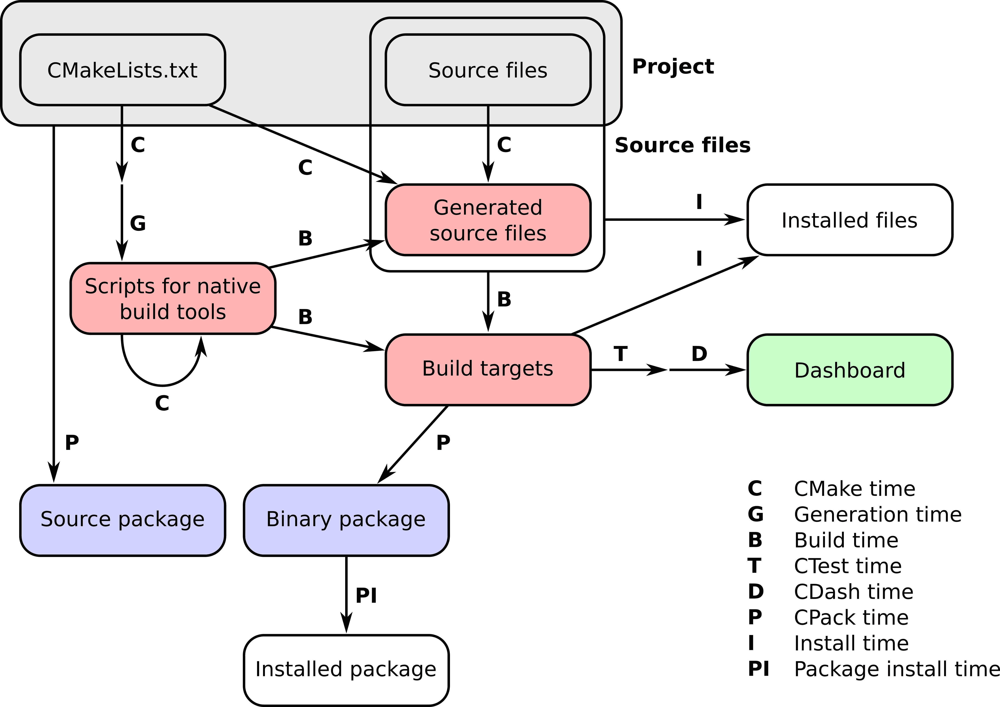

# 前言

计算机软件几乎存在于我们日常生活的方方面面：它触发我们的闹钟，推动我们的通信、银行业务、天气预报、公交时刻表、日历、会议、旅行、相册、电视、音乐流媒体、社交媒体、餐饮和电影预订，从黎明到黄昏。

我们周围的软件包含许多层：应用程序建立在框架之上，框架建立在库之上，库使用更小的库和可执行文件，一直到底层更小的软件组件。库和可执行文件反过来需要从源代码构建。我们通常只看到最外层，但所有这些层都需要仔细组织和构建。本书是关于如何使用 CMake 从源代码构建库和可执行文件的。

CMake 及其姊妹工具 CTest、CPack 和 CDash 已经成为从源代码构建软件的领先工具集，在使用和受欢迎程度上超过了许多其他类似工具，如备受尊敬的 GNU Autotools 和较新的基于 Python 的 SCons 构建系统。


（搜索兴趣随时间变化，针对三个流行的构建系统：CMake、Automake 和 SCons。兴趣是通过对相关术语的搜索次数来衡量的。该图表是使用 Google 趋势提供的数据获得的。）

CMake 项目的历史始于 1999 年，当时 Kitware，即其开发背后的公司，受委托设计一套新的工具来简化研究人员日常软件工作。目标很明确：提供一套工具，使得在不同平台上配置、构建、测试和部署同一项目变得更加容易。关于 CMake 项目随后设计选择的精彩叙述可以在[`www.aosabook.org/en/cmake.html`](https://www.aosabook.org/en/cmake.html)找到。

CMake 是一个*构建系统生成器*，提供了一个强大的领域特定语言（DSL）来描述构建系统应该实现的目标。在我们看来，这是 CMake 的主要优势之一，因为它允许使用相同的 CMake 脚本生成*平台原生构建系统*。CMake 软件工具集让开发者完全控制一个项目的整个生命周期：

+   **CMake** 让你描述你的项目，无论是构建可执行文件、库还是两者，都必须如何在所有主要硬件和操作系统上进行配置、构建和安装。

+   **CTest** 允许你定义测试、测试套件以及设置它们应该如何执行。

+   **CPack** 提供了一个 DSL 来满足你所有的打包需求，无论你的项目应该以源代码还是平台原生二进制形式打包和分发。

+   **CDash** 将有助于将项目测试结果报告到在线仪表板上。

一句古老的谚语说，你挖得越深，找到的石头就越多。为了准备这本书，我们深入挖掘了许多软件层，CMake 是我们的矿场。在各种平台上构建各种软件组件和库时，我们遇到了许多石头和文物，每个都有自己的怪癖，有时感到沮丧。但我们相信我们已经清理了许多石头，并很高兴与您，我们的读者分享我们的发现和配方。总会有石头留下，但每块石头都会带来新的见解，我们鼓励您与社区分享这些见解。

# 本书的目标读者

编写能够在多种平台上原生、可靠且高效运行的软件对于各行各业和社会至关重要。软件构建系统在这一任务中占据中心位置。它们是软件开发生命周期管理的关键部分：从孵化和原型开发到测试，直至打包、部署和分发。CMake 旨在帮助您管理这些操作：如果您是希望使用 CMake 管理构建系统的软件开发者，或者希望理解和修改他人编写的 CMake 代码，那么本书适合您。

# 本书内容概述

我们编写这本书作为一系列逐步的任务和配方。在每个点，我们介绍足够的 CMake 信息来展示如何实现我们的目标，而不会让您被细节淹没。到本书结束时，您将能够处理越来越复杂的操作，并自信地利用配方中的内容在您自己的实际项目中。

本书将涵盖以下主题：

+   使用 CMake 配置、构建、测试和安装代码项目

+   检测操作系统、处理器、库、文件和程序以进行条件编译

+   提高代码的可移植性

+   借助 CMake 将大型代码库重构为模块

+   构建多语言项目

+   了解如何调整他人编写的 CMake 配置文件

+   打包项目以供分发

+   将项目迁移至 CMake

由 CMake 管理项目的流程发生在多个阶段，我们称之为*时刻*。这些可以简洁地概括在以下图中：



+   **CMake 时刻**或**配置时刻**。这是 CMake 运行的时候。在这个阶段，CMake 将处理您项目中的`CMakeLists.txt`文件并进行配置。

+   **生成时刻**。在成功配置后，CMake 将生成由本地构建工具执行项目后续步骤所需的脚本。

+   **构建时间**。这是在平台上调用本地构建工具的时候，这些工具会使用之前由 CMake 生成的平台和工具本地的构建脚本。在这个阶段，编译器将被调用，目标（可执行文件和库）将在特定的构建目录中构建。注意递归的 CMake 时间箭头：这可能看起来令人困惑，但它是一种机制，我们将在本书中多次使用它来实现真正平台无关的构建。

+   **CTest 时间**或**测试时间**。这是我们运行项目测试套件以检查目标是否按预期执行的时候。

+   **CDash 时间**或**报告时间**。这是将测试项目的结果上传到仪表板以与其他开发人员共享的时候。

+   **安装时间**。这是将项目的目标、源文件、可执行文件和库从构建目录安装到安装位置的时候。

+   **CPack 时间**或**打包时间**。这是我们打包项目以供分发的时候，无论是作为源代码还是二进制。

+   **包安装时间**。这是新创建的包被系统全局安装的时候。

本书的组织结构如下：

第一章，*从简单的可执行文件到库*，展示了如何开始使用 CMake 配置和构建简单的可执行文件和库。

第二章，*检测环境*，解释了如何使用简单的 CMake 命令与操作系统和处理器架构交互。

第三章，*检测外部库和程序*，展示了 CMake 如何简化项目依赖项的检测。

第四章，*创建和运行测试*，解释了如何利用 CMake 和 CTest 的力量来定义和运行测试。

第五章，*配置时间和构建时间操作*，展示了如何使用跨平台的 CMake 命令在构建过程的不同阶段执行自定义操作。

第六章，*生成源代码*，讨论了 CMake 命令，用于自动生成源代码。

第七章，*项目结构化*，展示了强大的 CMake 语法，用于组织项目，使其更易于维护。

第八章，*超级构建模式*，解释了强大的 CMake 超级构建模式，用于管理关键项目依赖项，同时控制副作用。

第九章，*混合语言项目*，展示了如何使用 CMake 构建混合不同编程语言的项目。

第十章，*编写安装程序*，负责使用 CMake 的跨平台能力来安装项目。

第十一章，*打包项目*，展示了如何使用 CPack 生成源代码和平台原生源代码存档，以及如何构建 Python 和 Conda 包以供分发。

第十二章，*构建文档*，展示了如何使用 CMake 为你的代码构建文档。

第十三章，*替代生成器和交叉编译*，展示了如何使用 CMake 在不同平台之间交叉编译项目。

第十四章，*测试仪表板*，展示了如何将测试结果报告给在线仪表板。

第十五章，*将项目移植到 CMake*，展示了将项目移植到基于 CMake 的构建系统的最佳实践、技巧和诀窍。

# 为了从本书中获得最大收益

这是一本由程序员为程序员编写的书。我们假设具备以下基本知识和熟悉度：

+   你最喜欢的操作系统上的命令行

+   你最喜欢的操作系统上用于构建软件的原生工具

+   编译语言 C++、C 或 Fortran，以及你最喜欢的操作系统上的相应编译器

+   Python 编程语言

# 下载示例代码文件

你可以从[`github.com/dev-cafe/cmake-cookbook`](https://github.com/dev-cafe/cmake-cookbook)下载本书的示例代码。更多详情请参阅*设置你的系统*部分。

# 下载彩色图像

我们还提供了一个包含本书中使用的屏幕截图/图表的彩色图像的 PDF 文件。你可以在这里下载：[`www.packtpub.com/sites/default/files/downloads/CMakeCookbook_ColorImages.pdf`](http://www.packtpub.com/sites/default/files/downloads/CMakeCookbook_ColorImages.pdf)。

# 使用的约定

本书中使用了多种文本约定。

`CodeInText`：表示文本中的代码命令、文件夹名、文件名、模块名和目标名。

代码块设置如下：

```cpp
cmake_minimum_required(VERSION 3.5 FATAL_ERROR)

project(recipe-01 LANGUAGES CXX)

add_executable(hello-world hello-world.cpp)
```

任何命令行输入都以粗体书写，并在要输入的命令前包含一个`**$**`提示符：

```cpp
$ mkdir -p build
$ cd build
$ cmake ..
```

为了区分命令行输入和输出，我们将输出保持非粗体：

```cpp
$ ./hello-world

Hello World!
```

重要提示以这种方式出现。

提示和技巧以这种方式出现。

# 额外的阅读资源

CMake 的在线文档非常全面，我们将在本书中引用它：[`cmake.org/documentation/`](https://cmake.org/documentation/)

在准备本书时，我们还受到了其他资源的启发：

+   丹尼尔·普法伊费尔的演讲，可在 GitHub 上找到：[`github.com/boostcon/cppnow_presentations_2017/blob/master/05-19-2017_friday/effective_cmake__daniel_pfeifer__cppnow_05-19-2017.pdf`](https://github.com/boostcon/cppnow_presentations_2017/blob/master/05-19-2017_friday/effective_cmake__daniel_pfeifer__cppnow_05-19-2017.pdf)

+   Eric Noulard 的 CMake 教程，可在 GitHub 上找到：[`github.com/TheErk/CMake-tutorial`](https://github.com/TheErk/CMake-tutorial)

+   Craig Scott 关于 CMake 的博客文章：[`crascit.com/tag/cmake/`](https://crascit.com/tag/cmake/)

我们还推荐浏览 Viktor Kirilov 精心收集的 CMake 资源、脚本、模块和示例列表：[`github.com/onqtam/awesome-cmake`](https://github.com/onqtam/awesome-cmake)。

值得一提的是，我们的书籍并不是市面上唯一涵盖 CMake 的书籍：

+   *《Mastering CMake》*由 Ken Martin 和 Bill Hoffman 于 2015 年编写，Kitware Inc.出版。

+   *《Professional CMake》*由 Craig Scott 编写：[`crascit.com/professional-cmake/`](https://crascit.com/professional-cmake/)

# 联系我们

我们始终欢迎读者的反馈。

**源代码改进和问题**：请将拉取请求直接发送到[`github.com/dev-cafe/cmake-cookbook`](https://github.com/dev-cafe/cmake-cookbook)，并通过[`github.com/dev-cafe/cmake-cookbook/issues`](https://github.com/dev-cafe/cmake-cookbook/issues)报告特定食谱的问题。

**一般反馈**：发送电子邮件至`feedback@packtpub.com`，并在您的消息主题中提及书名。如果您对本书的任何方面有疑问，请发送电子邮件至`questions@packtpub.com`。

**勘误**：尽管我们已经尽一切努力确保内容的准确性，但错误仍然会发生。如果您在这本书中发现了错误，我们非常感谢您向我们报告。请访问[www.packtpub.com/submit-errata](http://www.packtpub.com/submit-errata)，选择您的书籍，点击勘误提交表单链接，并输入详细信息。

**盗版**：如果您在互联网上遇到任何形式的我们作品的非法副本，我们非常感谢您提供位置地址或网站名称。请通过`copyright@packtpub.com`与我们联系，并附上材料链接。

**如果您有兴趣成为作者**：如果您在某个领域拥有专业知识，并且对撰写或参与编写书籍感兴趣，请访问[authors.packtpub.com](http://authors.packtpub.com/)。

# 评论

请留下评论。在阅读和使用本书后，为何不在购买它的网站上留下评论呢？潜在读者可以看到并使用您的客观意见来做出购买决定，我们 Packt 可以了解您对我们产品的看法，我们的作者可以看到您对他们书籍的反馈。谢谢！

如需了解更多关于 Packt 的信息，请访问[packtpub.com](https://www.packtpub.com/)。
