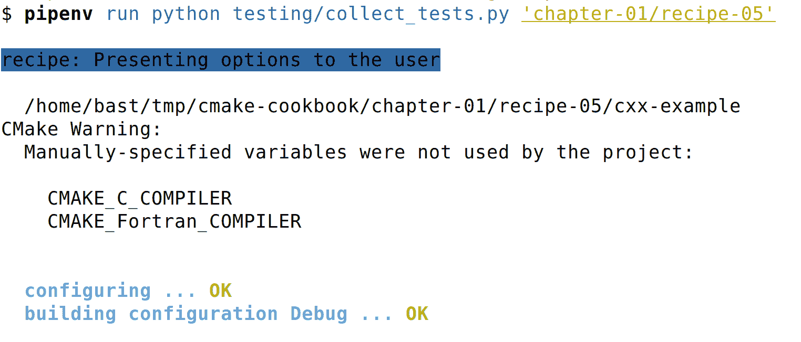

# 第一章：设置您的系统

在深入了解 CMake 和本书中的食谱之前，您需要设置您的系统以成功运行所有示例。在本节中，我们将讨论以下主题：

1.  如何获取食谱的代码

1.  如何在 GNU/Linux、macOS 和 Windows 上安装运行代码示例所需的所有工具

1.  仓库的自动化测试是如何工作的

1.  如何报告食谱中的问题并提出改进建议

我们努力使本书中主题的讨论尽可能对初学者友好。然而，本书并不是从零开始的。我们假设您对所选平台上的原生软件构建工具有基本的了解。拥有使用 Git 进行版本控制的基本经验也是有帮助的（但不是必需的），以便与保存食谱源代码的仓库进行交互。

# 获取代码

本书中食谱的源代码可在 GitHub 上找到，地址为[`github.com/dev-cafe/cmake-cookbook`](https://github.com/dev-cafe/cmake-cookbook)。代码采用标准的开源 MIT 许可证：这是一种宽容的软件许可证，您可以以任何您认为合适的方式重用和混编代码，只要在软件/源代码的任何副本中包含原始版权和许可证通知即可。许可证的全文可在[`opensource.org/licenses/MIT`](https://opensource.org/licenses/MIT)查看。

为了自己测试食谱，您需要安装 Git，安装方法如下：

+   所有主要的 GNU/Linux 发行版都提供了预打包的 Git，*通过*它们的包管理器。如果不是您的情况，可以从 Git 项目网站[`git-scm.com`](https://git-scm.com)下载二进制分发版。

+   在 macOS 上，可以使用 Homebrew 或 MacPorts 来安装 Git。

+   在 Windows 上，您可以从 Git 项目网站[`git-scm.com`](https://git-scm.com)下载 Git 可执行文件。

或者，您可以通过 GitHub 桌面客户端访问示例，地址为[`desktop.github.com`](https://desktop.github.com)。

另一种选择是从[`github.com/dev-cafe/cmake-cookbook`](https://github.com/dev-cafe/cmake-cookbook)下载并提取 ZIP 文件。

安装 Git 后，您可以将其克隆到本地机器上，如下所示：

```cpp
$ git clone https://github.com/dev-cafe/cmake-cookbook.git
```

这将创建一个名为`cmake-cookbook`的文件夹。本书和仓库按章节和食谱组织。章节编号和仓库中食谱的顺序反映了文本中的顺序。每个食谱进一步组织成示例文件夹。有些食谱有多个示例，通常是在不同的编程语言中说明类似的 CMake 概念时。

食谱在 GNU/Linux、macOS 和 Windows 上使用最先进的持续集成服务进行测试。我们将在稍后讨论测试设置。

我们已经为本书中示例对应的精确版本打上了标签`v1.0`。为了与书中的文本最大限度地重叠，你可以按照以下方式获取这个特定版本：

```cpp
$ git clone --single-branch -b v1.0 https://github.com/dev-cafe/cmake-cookbook.git
```

我们预计会收到错误修复，并且 GitHub 仓库会不断发展。为了获取最新更新，你可能更愿意关注仓库的`master`分支。

# Docker 镜像

你可能会发现，在软件环境中测试本书的配方（该环境包含所有预装的依赖项）最简单的方法是使用我们基于 Ubuntu 18.04 设置的 Docker 镜像。你可以在你喜欢的操作系统上安装 Docker，按照官方文档的指导进行操作，网址为[`docs.docker.com`](https://docs.docker.com)。

安装 Docker 后，你可以运行我们的镜像，并在完整的软件环境中测试配方，如下所示：

```cpp
$ docker run -it devcafe/cmake-cookbook_ubuntu-18.04
$ git clone https://github.com/dev-cafe/cmake-cookbook.git
$ cd cmake-cookbook
$ pipenv install --three
$ pipenv run python testing/collect_tests.py 'chapter-*/recipe-*'
```

# 安装预置软件

在容器中运行本书配方的替代方法是直接在主机操作系统上安装依赖项。为此，我们组装了一个最小工具栈，可以作为我们所有配方的基本起点。你需要安装以下内容：

1.  CMake

1.  特定语言的工具，即编译器

1.  构建自动化工具

1.  Python

我们还将详细说明如何安装一些配方所需的额外依赖项。

# 获取 CMake

本书所需的 CMake 最低版本为 3.5。只有少数特定配方和示例会展示在 3.5 版本之后引入的有用功能，这些将需要更新的 CMake 版本。每个配方的介绍中都有一个信息框，指出代码的可用位置、给出的示例以及所需的最低 CMake 版本。信息框将如下所示：

本配方的代码可在[`github.com/dev-cafe/cmake-cookbook/tree/v1.0/chapter-03/recipe-10`](https://github.com/dev-cafe/cmake-cookbook/tree/v1.0/chapter-03/recipe-10)找到，并包含一个 C 语言示例。该配方适用于 CMake 版本 3.5（及以上），并在 GNU/Linux、macOS 和 Windows 上进行了测试。

尽管大多数配方仍然适用于较旧版本的 CMake，但我们没有尝试测试这一假设，因为我们认为 CMake 3.5 是大多数系统和发行版上的默认版本。我们也认为升级到较新版本的 CMake 是一个简单的步骤。

CMake 可以通过多种方式安装。下载并提取 Kitware 维护的二进制分发版将在所有平台上工作。下载页面位于[`cmake.org/download/`](https://cmake.org/download/)。

大多数 GNU/Linux 发行版在其包管理器中都有 CMake 可用。然而，在某些发行版上，打包的版本可能相当陈旧，因此下载由 Kitware 维护的二进制文件仍然是首选选项。以下命令将从 CMake 打包的版本下载并安装 CMake 3.5.2 到`$HOME/Deps/cmake`（根据您的喜好调整此路径）：

```cpp
$ cmake_version="3.5.2"
$ target_path=$HOME/Deps/cmake/${cmake_version}
$ cmake_url="https://cmake.org/files/v${cmake_version%.*}/cmake-${cmake_version}-Linux-x86_64.tar.gz"
$ mkdir -p "${target_path}"
$ curl -Ls "${cmake_url}" | tar -xz -C "${target_path}" --strip-components=1
$ export PATH=$HOME/Deps/cmake/${cmake_version}/bin${PATH:+:$PATH}
$ cmake --version
```

Homebrew for macOS 可靠地提供最新版本的 CMake：

```cpp
$ brew upgrade cmake
```

在 Windows 上，您可以使用提供 CMake 支持的 Visual Studio 2017。Visual Studio 2017 的安装在第十三章，*替代生成器和交叉编译*，食谱 1，*使用 Visual Studio 2017 构建 CMake 项目*中有详细记录。

或者，您可以从[`www.msys2.org`](https://www.msys2.org)下载 MSYS2 安装程序，按照其中的说明更新包列表，然后使用包管理器`pacman`安装 CMake。以下代码假设我们正在构建 64 位版本：

```cpp
$ pacman -S mingw64/mingw-w64-x86_64-cmake
```

对于 32 位版本，请使用以下命令（尽管为了简洁起见，我们将来只会提及 64 位版本）：

```cpp
$ pacman -S mingw64/mingw-w64-i686-cmake
```

MSYS2 的另一个不错的特点是，它为 Windows 提供了一个终端，感觉和行为类似于 Unix 类操作系统上的终端，提供了一个有用的开发环境。

# 编译器

我们将需要 C++、C 和 Fortran 的编译器。这些应该相当新，因为我们在大多数食谱中需要对最新语言标准的支持。CMake 对许多编译器提供了非常好的支持，无论是商业的还是非商业的供应商。为了使食谱保持跨平台一致性，并尽可能操作系统独立，我们使用了开源编译器：

+   在 GNU/Linux 上，GNU 编译器集合（GCC）是显而易见的选择。它是免费的，适用于所有发行版。例如，在 Ubuntu 上，您可以按照以下方式安装编译器：

```cpp
$ sudo apt-get install g++ gcc gfortran 
```

+   Clang，属于 LLVM 家族，也是 C++和 C 的一个好选择：

```cpp
$ sudo apt-get install clang clang++ gfortran
```

+   在 macOS 上，随 XCode 一起提供的 LLVM 编译器适用于 C++和 C。在我们的 macOS 测试中，我们使用了 GCC 的 Fortran 编译器。这需要单独安装，使用包管理器。例如，Homebrew 的命令如下：

```cpp
$ brew install gcc
```

+   在 Windows 上，您可以使用 Visual Studio 进行 C++和 C 食谱。或者，您可以使用 MSYS2 安装程序并安装整个工具链，包括 C++、C 和 Fortran 编译器，使用以下单个命令在 MSYS2 环境中（对于 64 位版本）：

```cpp
$ pacman -S mingw64/mingw-w64-x86_64-toolchain
```

# 构建自动化工具

这些构建自动化工具将为构建和链接本食谱中介绍的项目提供基础设施。您最终安装和使用的工具很大程度上取决于您的操作系统和个人喜好：

+   在 GNU/Linux 上，安装编译器时，GNU Make 很可能会自动安装。

+   在 macOS 上，XCode 将提供 GNU Make。

+   在 Windows 上，Visual Studio 将为你提供完整的基础设施。在 MSYS2 环境中，GNU Make 作为`mingw64/mingw-w64-x86_64-toolchain`包的一部分安装，这是我们之前安装的。

为了最大程度的可移植性，我们尽可能地使配方对这些系统依赖细节保持中立。这种方法的一个明显优势是，配置、构建和链接对于每个平台和每组编译器都是本地的。

Ninja 程序是一个不同的构建自动化工具，适用于 GNU/Linux、macOS 和 Windows。Ninja 是一个新的构建工具，专注于速度，特别是增量重建。预打包的二进制文件可以在项目的 GitHub 仓库中找到，网址为[`github.com/ninja-build/ninja/releases`](https://github.com/ninja-build/ninja/releases)。

使用 CMake 和 Ninja 与 Fortran 项目需要一些注意。需要 CMake 3.7.2 或更高版本，以及 Kitware 维护的 Ninja 版本，可在[`github.com/Kitware/ninja/releases`](https://github.com/Kitware/ninja/releases)找到。

在 GNU/Linux 上，你可以通过以下一系列命令安装 Ninja：

```cpp
$ mkdir -p ninja
$ ninja_url="https://github.com/Kitware/ninja/releases/download/v1.8.2.g3bbbe.kitware.dyndep-1.jobserver-1/ninja-1.8.2.g3bbbe.kitware.dyndep-1.jobserver-1_x86_64-linux-gnu.tar.gz"
$ curl -Ls ${ninja_url} | tar -xz -C ninja --strip-components=1
$ export PATH=$HOME/Deps/ninja${PATH:+:$PATH} 
```

在 Windows 上，使用 MSYS2 环境（假设是 64 位版本），执行以下命令：

```cpp
$ pacman -S mingw64/mingw-w64-x86_64-ninja
```

我们建议阅读[`www.aosabook.org/en/posa/ninja.html`](http://www.aosabook.org/en/posa/ninja.html)上的文章，以获得关于 Ninja 的历史和设计选择的启发性讨论。

# Python

本书是关于 CMake 的，但其中一些配方，以及整个用于测试的基础设施，需要 Python。因此，首先，你需要一个可用的 Python 安装：解释器、头文件和库。Python 2.7 的生命周期已于 2020 年结束，因此我们将使用 Python 3.5。

在 Ubuntu 14.04 LTS 上（这是 Travis CI 使用的环境，我们将在后面讨论），可以按如下方式安装 Python 3.5：

```cpp
$ sudo apt-get install python3.5-dev
```

在 Windows 上，使用 MSYS2 环境，可以按如下方式安装 Python 环境（假设是 64 位版本）：

```cpp
$ pacman -S mingw64/mingw-w64-x86_64-python3
$ pacman -S mingw64/mingw-w64-x86_64-python3-pip
$ python3 -m pip install pipenv 
```

还需要特定的 Python 模块，以便运行我们设置的测试机制。这些可以通过使用你喜欢的包管理器全局安装，或者在隔离环境中安装。后者方法强烈推荐，因为它提供了以下优势：

+   你可以安装包并清理安装，而不会影响系统环境。

+   无需管理员权限即可安装包。

+   你降低了版本和依赖冲突的风险。

+   你可以更好地控制包依赖关系，以实现可重复性。

我们已经为此准备了一个`Pipfile`。结合其`Pipfile.lock`，您可以使用 Pipenv（[`pipenv.readthedocs.io`](http://pipenv.readthedocs.io)）来生成一个隔离环境，其中安装了所有软件包。要在配方示例仓库中创建此环境，请在仓库的顶级目录中运行以下命令：

```cpp
$ pip install --user pip pipenv --upgrade
$ pipenv install --python python3.5
```

**`pipenv shell`**命令将使您进入一个命令行环境，其中包含特定版本的 Python 和所有可用的软件包。执行`exit`将带您回到一个干净的环境。您也可以使用`pipenv run`直接在隔离环境中执行命令。

或者，可以使用仓库中的`requirements.txt`文件，结合 Virtualenv（[`docs.python-guide.org/en/latest/dev/virtualenvs/`](http://docs.python-guide.org/en/latest/dev/virtualenvs/)）和`pip`，来达到同样的效果：

```cpp
$ virtualenv --python=python3.5 venv
$ source venv/bin/activate
$ pip install -r requirements.txt
```

可以通过使用`deactivate`命令退出虚拟环境。

另一种选择是使用 Conda 环境。为此，我们建议安装 Miniconda。以下指令将安装最新的 Miniconda 到目录`$HOME/Deps/conda`，适用于 GNU/Linux（从[`repo.continuum.io/miniconda/Miniconda3-latest-Linux-x86_64.sh`](https://repo.continuum.io/miniconda/Miniconda3-latest-Linux-x86_64.sh)下载）或 macOS（从[`repo.continuum.io/miniconda/Miniconda3-latest-MacOSX-x86_64.sh`](https://repo.continuum.io/miniconda/Miniconda3-latest-MacOSX-x86_64.sh)下载）：

```cpp
$ curl -Ls https://repo.continuum.io/miniconda/Miniconda3-latest-Linux-x86_64.sh > miniconda.sh
$ bash miniconda.sh -b -p "$HOME"/Deps/conda &> /dev/null
$ touch "$HOME"/Deps/conda/conda-meta/pinned
$ export PATH=$HOME/Deps/conda/bin${PATH:+:$PATH}
$ conda config --set show_channel_urls True
$ conda config --set changeps1 no
$ conda update --all
$ conda clean -tipy
```

在 Windows 上，您可以从[`repo.continuum.io/miniconda/Miniconda3-latest-Windows-x86_64.exe`](https://repo.continuum.io/miniconda/Miniconda3-latest-Windows-x86_64.exe)下载最新的 Miniconda。可以使用 PowerShell 按照以下方式安装软件包：

```cpp
$basedir = $pwd.Path + "\"
$filepath = $basedir + "Miniconda3-latest-Windows-x86_64.exe"
$Anaconda_loc = "C:\Deps\conda"
$args = "/InstallationType=JustMe /AddToPath=0 /RegisterPython=0 /S /D=$Anaconda_loc"
Start-Process -FilePath $filepath -ArgumentList $args -Wait -Passthru

$conda_path = $Anaconda_loc + "\Scripts\conda.exe"
$args = "config --set show_channel_urls True"
Start-Process -FilePath "$conda_path" -ArgumentList $args -Wait -Passthru
$args = "config --set changeps1 no"
Start-Process -FilePath "$conda_path" -ArgumentList $args -Wait -Passthru
$args = "update --all"
Start-Process -FilePath "$conda_path" -ArgumentList $args -Wait -Passthru
$args = "clean -tipy"
Start-Process -FilePath "$conda_path" -ArgumentList $args -Wait -Passthru
```

安装 Conda 后，可以按照以下方式安装 Python 模块：

```cpp
$ conda create -n cmake-cookbook python=3.5
$ conda activate cmake-cookbook
$ conda install --file requirements.txt
```

执行`conda deactivate`将使您退出隔离环境。

# 额外软件

一些配方将需要额外的软件，这些将在以下部分中介绍。

# BLAS 和 LAPACK

大多数 Linux 发行版都提供了 BLAS 和 LAPACK 的软件包。例如，在 Ubuntu 14.04 LTS 上，您可以运行以下命令：

```cpp
$ sudo apt-get install libatlas-dev liblapack-dev liblapacke-dev
```

在 macOS 上，随 XCode 一起提供的 Accelerate 库足以满足我们的需求。

在 Windows 上，使用 MSYS2 环境，可以按照以下方式安装这些库（假设是 64 位版本）：

```cpp
$ pacman -S mingw64/mingw-w64-x86_64-openblas
```

或者，您可以从 GitHub 下载 BLAS 和 LAPACK 的参考实现（[`github.com/Reference-LAPACK/lapack`](https://github.com/Reference-LAPACK/lapack)），并从源代码编译这些库。商业供应商可能会为其 BLAS 和 LAPACK API 的实现提供软件包，这些软件包作为适用于您平台的安装程序提供。

# 消息传递接口（MPI）

有许多商业和非商业的 MPI 实现。对于我们的入门目的，安装任何免费提供的非商业实现就足够了。在 Ubuntu 14.04 LTS 上，我们推荐 OpenMPI。可以使用以下命令安装它：

```cpp
$ sudo apt-get install openmpi-bin libopenmpi-dev
```

对于 macOS，Homebrew 分发 MPICH：

```cpp
$ brew install mpich
```

也可以从[`www.open-mpi.org/software/`](https://www.open-mpi.org/software/)公开的源代码编译 OpenMPI。

对于 Windows，Microsoft MPI 实现可以通过[`msdn.microsoft.com/en-us/library/bb524831(v=vs.85).aspx`](https://msdn.microsoft.com/en-us/library/bb524831(v=vs.85).aspx)安装。

# Eigen 线性代数模板库

有些配方需要 Eigen 线性代数模板库，版本 3.3 或更高。如果您的包管理器不提供 Eigen，您可以从在线源代码存档([`eigen.tuxfamily.org`](http://eigen.tuxfamily.org))安装它。例如，在 GNU/Linux 和 macOS 上，您可以将 Eigen 安装到目录`$HOME/Deps/eigen`，如下所示：

```cpp
$ eigen_version="3.3.4"
$ mkdir -p eigen
$ curl -Ls http://bitbucket.org/eigen/eigen/get/${eigen_version}.tar.gz | tar -xz -C eigen --strip-components=1
$ cd eigen
$ cmake -H. -Bbuild_eigen -DCMAKE_INSTALL_PREFIX="$HOME/Deps/eigen" &> /dev/null
$ cmake --build build_eigen -- install &> /dev/null
```

# Boost 库

Boost 包适用于每个操作系统；大多数 Linux 发行版都通过其包管理器提供包。例如，在 Ubuntu 14.04 LTS 上，可以使用以下命令安装 Boost Filesystem、Boost Python 和 Boost Test 库：

```cpp
$ sudo apt-get install libboost-filesystem-dev libboost-python-dev libboost-test-dev
```

对于 macOS，MacPorts 和 Homebrew 都为较新版本的 Boost 提供了包。我们在 macOS 上的测试设置按如下方式安装 Boost：

```cpp
$ brew cask uninstall --force oclint
$ brew uninstall --force --ignore-dependencies boost
$ brew install boost 
$ brew install boost-python3
```

预构建的 Windows 二进制分发版也可以从 Boost 网站[`www.boost.org`](http://www.boost.org)下载。或者，您可以从[`www.boost.org`](https://www.boost.org)下载源代码并自行编译库。

# 交叉编译器

在 Debian/Ubuntu 类系统上，可以使用以下命令安装交叉编译器：

```cpp
$ sudo apt-get install gcc-mingw-w64 g++-mingw-w64 gfortran-mingw-w64
```

在 macOS 上，使用 Brew，交叉编译器可以按如下方式安装：

```cpp
$ brew install mingw-w64
```

其他包管理器提供相应的包。

使用打包的交叉编译器的替代方案是使用 M 交叉环境([`mxe.cc`](https://mxe.cc))从源代码构建它们。

# ZeroMQ、pkg-config、UUID 和 Doxygen

在 Ubuntu 14.04 LTS 上，这些包可以按如下方式安装：

```cpp
$ sudo apt-get install pkg-config libzmq3-dev doxygen graphviz-dev uuid-dev
```

在 macOS 上，我们建议使用 Brew 安装：

```cpp
$ brew install ossp-uuid pkg-config zeromq doxygen
```

`pkg-config`程序和 UUID 库仅在类 Unix 系统上可用。

在 Windows 上，使用 MSYS2 环境，这些依赖项可以按如下方式安装（假设是 64 位版本）：

```cpp
$ pacman -S mingw64/mingw-w64-x86_64-zeromq
$ pacman -S mingw64/mingw-w64-x86_64-pkg-config
$ pacman -S mingw64/mingw-w64-x86_64-doxygen
$ pacman -S mingw64/mingw-w64-x86_64-graphviz
```

# Conda 构建和部署工具

探索使用 Conda 打包的配方将需要系统上安装了 Miniconda 和 Conda 构建和部署工具。之前给出了安装 Miniconda 的说明。要在 GNU/Linux 和 macOS 上安装 Conda 构建和部署工具，请运行以下命令：

```cpp
$ conda install --yes --quiet conda-build anaconda-client jinja2 setuptools
$ conda clean -tipsy
$ conda info -a
```

这些工具可以按如下方式在 Windows 上安装：

```cpp
$conda_path = "C:\Deps\conda\Scripts\conda.exe"

$args = "install --yes --quiet conda-build anaconda-client jinja2 setuptools"
Start-Process -FilePath "$conda_path" -ArgumentList $args -Wait -Passthru

$args = "clean -tipsy"
Start-Process -FilePath "$conda_path" -ArgumentList $args -Wait -Passthru

$args = "info -a"
Start-Process -FilePath "$conda_path" -ArgumentList $args -Wait -Passthru
```

# 测试配方

这些配方在先进的持续集成（CI）服务上进行了测试：Travis（[`travis-ci.org`](https://travis-ci.org)）用于 GNU/Linux 和 macOS，Appveyor（[`www.appveyor.com`](https://www.appveyor.com)）用于 Windows，以及 CircleCI（[`circleci.com`](https://circleci.com)）用于使用商业编译器的额外 GNU/Linux 测试。CI 服务的配置文件可以在仓库中找到（[`github.com/dev-cafe/cmake-cookbook/`](https://github.com/dev-cafe/cmake-cookbook/)）：`.travis.yml` 用于 Travis，`.appveyor.yml` 用于 Appveyor，以及 `.circleci/config.yml` 用于 CircleCI。Travis 和 Appveyor 的额外安装脚本可以在 `testing/dependencies` 文件夹中找到。

我们在 Travis GNU/Linux 基础设施上使用 CMake 3.5.2 和 CMake 3.12.1 测试这些配方。在 Travis macOS 基础设施上使用 CMake 3.12.1。在 Appveyor 上，测试使用 CMake 3.11.3。在 CircleCI 上，使用 CMake 3.12.1。

测试机制是一套包含在 `testing` 文件夹中的 Python 脚本。脚本 `collect_tests.py` 将运行测试并报告它们的状态。可以单独测试配方，也可以批量测试；`collect_tests.py` 接受一个正则表达式作为命令行输入，例如：

```cpp
$ pipenv run python testing/collect_tests.py 'chapter-0[1,7]/recipe-0[1,2,5]'
```

此命令将运行第一章和第七章中第 1、2 和 5 个配方的测试。输出示例如下：



要获取更详细的输出，请设置`VERBOSE_OUTPUT=ON`：

```cpp
$ env VERBOSE_OUTPUT=ON pipenv run python testing/collect_tests.py 'chapter-*/recipe-*'
```

# 报告问题和提出改进建议

请在[`github.com/dev-cafe/cmake-cookbook/issues`](https://github.com/dev-cafe/cmake-cookbook/issues)报告问题。

为了贡献更改，我们建议分叉仓库[`github.com/dev-cafe/cmake-cookbook`](https://github.com/dev-cafe/cmake-cookbook)并使用拉取请求提交更改，遵循[`help.github.com/articles/creating-a-pull-request-from-a-fork/`](https://help.github.com/articles/creating-a-pull-request-from-a-fork/)。

对于非简单的更改，我们建议首先在[`github.com/dev-cafe/cmake-cookbook/issues`](https://github.com/dev-cafe/cmake-cookbook/issues)上打开一个问题来描述和讨论提议的更改，然后再发送拉取请求。
