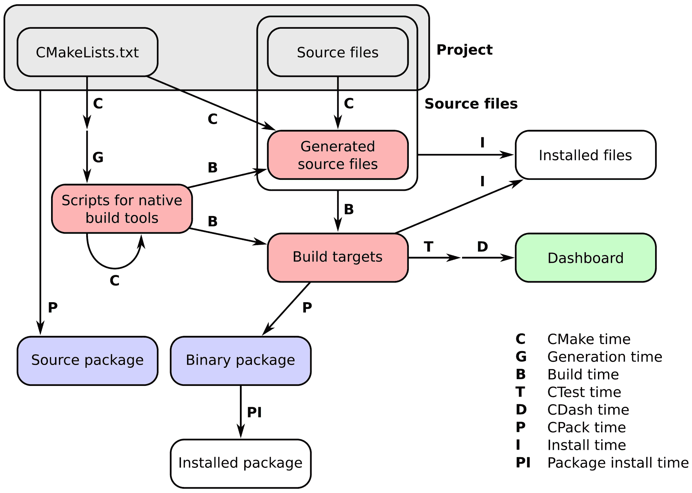

# 第六章：配置时间和构建时间操作

在本章中，我们将涵盖以下食谱：

+   使用平台无关的文件操作

+   在配置时间运行自定义命令

+   在构建时间运行自定义命令：I. 使用 `add_custom_command`

+   在构建时间运行自定义命令：II. 使用 `add_custom_target`

+   在构建时间对特定目标运行自定义命令

+   探测编译和链接

+   探测编译器标志

+   探测执行

+   使用生成器表达式微调配置和编译

# 引言

在本章中，我们将学习如何在配置时间和构建时间执行自定义操作。让我们简要回顾一下与由 CMake 管理的项目工作流程相关的*时间*概念：

1.  **CMake 时间**或**配置时间**：这是当 CMake 正在运行并处理项目中的`CMakeLists.txt`文件时。

1.  **生成时间**：这是当生成用于本地构建工具的文件，如 Makefiles 或 Visual Studio 项目文件时。

1.  **构建时间**：这是当平台和工具本地的构建工具被调用时，在之前由 CMake 生成的平台和工具本地的构建脚本上。此时，编译器将被调用，目标（可执行文件和库）将在特定的构建目录中被构建。

1.  **CTest 时间**或**测试时间**：当我们运行测试套件以检查目标是否按预期执行时。

1.  **CDash 时间**或**报告时间**：当测试项目的结果上传到一个仪表板以与其他开发者共享时。

1.  **安装时间**：当从构建目录到安装位置安装目标、源文件、可执行文件和库时。

1.  **CPack 时间**或**打包时间**：当我们打包我们的项目以供分发，无论是作为源代码还是二进制。

1.  **包安装时间**：当新制作的包被系统全局安装时。

完整的流程及其对应的时间在下图中描述：



本章关注于在配置时间和构建时间自定义行为。我们将学习如何使用这些命令：

+   `execute_process` 以从 CMake 内部执行任意进程并检索其输出

+   `add_custom_target` 以创建将执行自定义命令的目标

+   `add_custom_command` 以指定必须执行以生成文件或在其他目标的特定构建事件上的命令

# 使用平台无关的文件操作

本食谱的代码可在[`github.com/dev-cafe/cmake-cookbook/tree/v1.0/chapter-05/recipe-01`](https://github.com/dev-cafe/cmake-cookbook/tree/v1.0/chapter-05/recipe-01) 获取，并包含一个 C++示例。该食谱适用于 CMake 版本 3.5（及更高版本），并在 GNU/Linux、macOS 和 Windows 上进行了测试。

在构建某些项目时，我们可能需要与主机平台文件系统进行交互。与文件的交互可能只是检查文件是否存在，创建一个新文件来存储临时信息，创建或提取存档等等。使用 CMake，我们不仅能够在不同的平台上生成构建系统，还能够执行这些操作，而不需要复杂的逻辑来抽象不同的操作系统。本节将展示如何以可移植的方式提取先前下载的存档。

# 准备就绪

我们将展示如何提取包含 Eigen 库的存档，并使用提取的源文件来编译我们的项目。在本节中，我们将重用来自第三章，*检测外部库和程序*，第七部分，*检测 Eigen 库*的线性代数示例`linear-algebra.cpp`。本节还假设包含 Eigen 源代码的存档已下载在与项目本身相同的目录中。

# 如何做到这一点

项目需要解包 Eigen 存档，并相应地设置目标的包含目录：

1.  让我们首先声明一个 C++11 项目：

```cpp
cmake_minimum_required(VERSION 3.5 FATAL_ERROR)

project(recipe-01 LANGUAGES CXX)

set(CMAKE_CXX_STANDARD 11)
set(CMAKE_CXX_EXTENSIONS OFF)
set(CMAKE_CXX_STANDARD_REQUIRED ON)
```

1.  我们向构建系统添加一个自定义目标。该自定义目标将在构建目录内提取存档：

```cpp
add_custom_target(unpack-eigen
  ALL
  COMMAND
    ${CMAKE_COMMAND} -E tar xzf ${CMAKE_CURRENT_SOURCE_DIR}/eigen-eigen-5a0156e40feb.tar.gz
  COMMAND
    ${CMAKE_COMMAND} -E rename eigen-eigen-5a0156e40feb eigen-3.3.4
  WORKING_DIRECTORY
    ${CMAKE_CURRENT_BINARY_DIR}
  COMMENT
    "Unpacking Eigen3 in ${CMAKE_CURRENT_BINARY_DIR}/eigen-3.3.4"
  )
```

1.  我们为源文件添加一个可执行目标：

```cpp
add_executable(linear-algebra linear-algebra.cpp)
```

1.  由于我们的源文件的编译依赖于 Eigen 头文件，我们需要明确指定可执行目标对自定义目标的依赖：

```cpp
add_dependencies(linear-algebra unpack-eigen)
```

1.  最后，我们可以指定我们需要编译源文件的包含目录：

```cpp
target_include_directories(linear-algebra
  PRIVATE
    ${CMAKE_CURRENT_BINARY_DIR}/eigen-3.3.4
  )
```

# 它是如何工作的

让我们更仔细地看一下`add_custom_target`的调用：

```cpp
add_custom_target(unpack-eigen
  ALL
  COMMAND
    ${CMAKE_COMMAND} -E tar xzf ${CMAKE_CURRENT_SOURCE_DIR}/eigen-eigen-5a0156e40feb.tar.gz
  COMMAND
    ${CMAKE_COMMAND} -E rename eigen-eigen-5a0156e40feb eigen-3.3.4
  WORKING_DIRECTORY
    ${CMAKE_CURRENT_BINARY_DIR}
  COMMENT
    "Unpacking Eigen3 in ${CMAKE_CURRENT_BINARY_DIR}/eigen-3.3.4"
  )
```

我们正在向构建系统引入一个名为`unpack-eigen`的目标。由于我们传递了`ALL`参数，该目标将始终被执行。`COMMAND`参数允许您指定要执行的命令。在本例中，我们希望提取存档并将提取的目录重命名为`eigen-3.3.4`。这是通过这两个命令实现的：

1.  `${CMAKE_COMMAND} -E tar xzf ${CMAKE_CURRENT_SOURCE_DIR}/eigen-eigen-5a0156e40feb.tar.gz`

1.  `${CMAKE_COMMAND} -E rename eigen-eigen-5a0156e40feb eigen-3.3.4`

注意我们是如何调用 CMake 命令本身，使用`-E`标志来执行实际的工作。对于许多常见操作，CMake 实现了一个在它运行的所有操作系统上都通用的接口。这使得构建系统的生成在很大程度上独立于特定的平台。`add_custom_target`命令中的下一个参数是工作目录，在我们的例子中对应于构建目录：`CMAKE_CURRENT_BINARY_DIR`。最后一个参数`COMMENT`用于指定在执行自定义目标时 CMake 应该打印出什么消息。

# 还有更多

`add_custom_target` 命令可用于在构建过程中执行一系列没有输出的自定义命令。正如我们在本食谱中所展示的，自定义目标可以被指定为项目中其他目标的依赖项。此外，自定义目标也可以依赖于其他目标，从而提供了在我们的构建中设置执行顺序的可能性。

使用 CMake 的 `-E` 标志，我们可以以操作系统无关的方式运行许多常见操作。在特定操作系统上可以运行的完整命令列表可以通过运行 `cmake -E` 或 `cmake -E help` 获得。例如，这是一个在 Linux 系统上的命令摘要：

```cpp
Usage: cmake -E <command> [arguments...]
Available commands: 
  capabilities - Report capabilities built into cmake in JSON format
  chdir dir cmd [args...] - run command in a given directory
  compare_files file1 file2 - check if file1 is same as file2
  copy <file>... destination - copy files to destination (either file or directory)
  copy_directory <dir>... destination - copy content of <dir>... directories to 'destination' directory
  copy_if_different <file>... destination - copy files if it has changed
  echo [<string>...] - displays arguments as text
  echo_append [<string>...] - displays arguments as text but no new line
  env [--unset=NAME]... [NAME=VALUE]... COMMAND [ARG]...
                            - run command in a modified environment
  environment - display the current environment
  make_directory <dir>... - create parent and <dir> directories
  md5sum <file>... - create MD5 checksum of files
  remove [-f] <file>... - remove the file(s), use -f to force it
  remove_directory dir - remove a directory and its contents
  rename oldname newname - rename a file or directory (on one volume)
  server - start cmake in server mode
  sleep <number>... - sleep for given number of seconds
  tar [cxt][vf][zjJ] file.tar [file/dir1 file/dir2 ...]
                            - create or extract a tar or zip archive
  time command [args...] - run command and return elapsed time
  touch file - touch a file.
  touch_nocreate file - touch a file but do not create it.
Available on UNIX only:
  create_symlink old new - create a symbolic link new -> old
```

# 在配置时运行自定义命令

本食谱的代码可在 [`github.com/dev-cafe/cmake-cookbook/tree/v1.0/chapter-05/recipe-02`](https://github.com/dev-cafe/cmake-cookbook/tree/v1.0/chapter-05/recipe-02) 获取。该食谱适用于 CMake 版本 3.5（及以上），并在 GNU/Linux、macOS 和 Windows 上进行了测试。

运行 CMake 会生成构建系统，从而指定本地构建工具必须执行哪些命令来构建您的项目，以及以什么顺序执行。我们已经看到 CMake 在配置时运行许多子任务，以找出工作编译器和必要的依赖项。在本食谱中，我们将讨论如何在配置时通过使用 `execute_process` 命令来运行自定义命令。

# 如何做到这一点

在 第三章，*检测外部库和程序*，食谱 3，*检测 Python 模块和包*中，我们已经展示了在尝试查找 NumPy Python 模块时使用 `execute_process` 的情况。在这个例子中，我们将使用 `execute_process` 命令来检查特定的 Python 模块（在这种情况下，Python CFFI）是否存在，如果存在，我们将发现其版本：

1.  对于这个简单的示例，我们将不需要任何语言支持：

```cpp
cmake_minimum_required(VERSION 3.5 FATAL_ERROR)

project(recipe-02 LANGUAGES NONE)
```

1.  我们将要求 Python 解释器执行一个简短的 Python 代码片段，为此我们使用 `find_package` 来发现解释器：

```cpp
find_package(PythonInterp REQUIRED)
```

1.  然后我们调用 `execute_process` 来运行一个简短的 Python 代码片段；我们将在下一节中更详细地讨论这个命令：

```cpp
# this is set as variable to prepare
# for abstraction using loops or functions
set(_module_name "cffi")

execute_process(
  COMMAND
    ${PYTHON_EXECUTABLE} "-c" "import ${_module_name}; print(${_module_name}.__version__)"
  OUTPUT_VARIABLE _stdout
  ERROR_VARIABLE _stderr
  OUTPUT_STRIP_TRAILING_WHITESPACE
  ERROR_STRIP_TRAILING_WHITESPACE
  )
```

1.  然后，我们打印结果：

```cpp
if(_stderr MATCHES "ModuleNotFoundError")
  message(STATUS "Module ${_module_name} not found")
else()
  message(STATUS "Found module ${_module_name} v${_stdout}")
endif()
```

1.  一个示例配置产生以下结果（假设 Python CFFI 包已安装在相应的 Python 环境中）：

```cpp
$ mkdir -p build
$ cd build
$ cmake ..

-- Found PythonInterp: /home/user/cmake-cookbook/chapter-05/recipe-02/example/venv/bin/python (found version "3.6.5") 
-- Found module cffi v1.11.5
```

# 它是如何工作的

`execute_process` 命令会在当前执行的 CMake 进程中产生一个或多个子进程，从而提供了一种强大且方便的方式来在配置项目时运行任意命令。在一次 `execute_process` 调用中可以执行多个命令。然而，请注意，每个命令的输出将被管道传输到下一个命令。该命令接受多个参数：

+   `WORKING_DIRECTORY` 允许您指定在哪个目录中执行命令。

+   `RESULT_VARIABLE`将包含运行进程的结果。这要么是一个整数，表示成功执行，要么是一个包含错误条件的字符串。

+   `OUTPUT_VARIABLE`和`ERROR_VARIABLE`将包含执行命令的标准输出和标准错误。请记住，由于命令的输出被输入，只有最后一个命令的标准输出将被保存到`OUTPUT_VARIABLE`中。

+   `INPUT_FILE`、`OUTPUT_FILE`和`ERROR_FILE`指定最后一个命令的标准输入和标准输出文件名，以及所有命令的标准错误文件名。

+   通过设置`OUTPUT_QUIET`和`ERROR_QUIET`，CMake 将分别忽略标准输出和标准错误。

+   通过设置`OUTPUT_STRIP_TRAILING_WHITESPACE`和`ERROR_STRIP_TRAILING_WHITESPACE`，可以分别去除标准输出和标准错误中运行命令的尾随空格。

通过这些解释，我们可以回到我们的示例：

```cpp
set(_module_name "cffi")

execute_process(
  COMMAND
    ${PYTHON_EXECUTABLE} "-c" "import ${_module_name}; print(${_module_name}.__version__)"
  OUTPUT_VARIABLE _stdout
  ERROR_VARIABLE _stderr
  OUTPUT_STRIP_TRAILING_WHITESPACE
  ERROR_STRIP_TRAILING_WHITESPACE
  )

if(_stderr MATCHES "ModuleNotFoundError")
  message(STATUS "Module ${_module_name} not found")
else()
  message(STATUS "Found module ${_module_name} v${_stdout}")
endif()
```

该命令检查`python -c "import cffi; print(cffi.__version__)"`的输出。如果找不到模块，`_stderr`将包含`ModuleNotFoundError`，我们在 if 语句中对此进行检查，在这种情况下，我们会打印`找不到 cffi 模块`。如果导入成功，Python 代码将打印模块版本，该版本被输入到`_stdout`，以便我们可以打印以下内容：

```cpp
message(STATUS "Found module ${_module_name} v${_stdout}")
```

# 还有更多内容

在本示例中，我们仅打印了结果，但在实际项目中，我们可以警告、中止配置或设置可以查询以切换某些配置选项的变量。

将代码示例扩展到多个 Python 模块，如 Cython，避免代码重复，这将是一个有趣的练习。一种选择可能是使用`foreach`循环遍历模块名称；另一种方法可能是将代码抽象为函数或宏。我们将在第七章，*项目结构化*中讨论此类抽象。

在第九章，*混合语言项目*中，我们将使用 Python CFFI 和 Cython，而本节内容可以作为一个有用且可复用的代码片段，用于检测这些包是否存在。

# 在构建时运行自定义命令：I. 使用`add_custom_command`

本节代码可在[`github.com/dev-cafe/cmake-cookbook/tree/v1.0/chapter-05/recipe-03`](https://github.com/dev-cafe/cmake-cookbook/tree/v1.0/chapter-05/recipe-03)找到，并包含一个 C++示例。本节内容适用于 CMake 版本 3.5（及以上），并在 GNU/Linux、macOS 和 Windows 上进行了测试。

项目构建目标可能依赖于只能在构建时执行的命令的结果，即在构建系统生成完成后。CMake 提供了三种选项来在构建时执行自定义命令：

1.  使用`add_custom_command`生成要在目标内编译的输出文件。

1.  使用 `add_custom_target` 执行没有输出的命令。

1.  使用 `add_custom_command` 执行没有输出的命令，在目标构建之前或之后。

这三个选项强制特定的语义，并且不可互换。接下来的三个配方将阐明它们的使用案例。

# 准备就绪

我们将重用 第三章，*检测外部库和程序*，第 4 个配方，*检测 BLAS 和 LAPACK 数学库* 中的 C++ 示例，以说明 `add_custom_command` 第一种变体的使用。在该代码示例中，我们探测现有的 BLAS 和 LAPACK 库，并编译了一个微小的 C++ 包装器库，以调用我们需要的线性代数例程的 Fortran 实现。

我们将代码分成两部分。`linear-algebra.cpp` 的源文件与 第三章，*检测外部库和程序*，第 4 个配方，*检测 BLAS 和 LAPACK 数学库* 相比没有变化，并将包含线性代数包装器库的头文件并链接到编译库。然而，该库的源文件将被打包成一个与示例项目一起交付的压缩 tar 存档。该存档将在构建时提取，并在可执行文件之前编译线性代数包装器库。

# 如何做到这一点

我们的 `CMakeLists.txt` 将不得不包含一个自定义命令来提取线性代数包装器库的源文件。让我们详细看一下：

1.  我们从熟悉的 CMake 版本、项目名称和支持的语言的定义开始：

```cpp
cmake_minimum_required(VERSION 3.5 FATAL_ERROR)

project(recipe-03 LANGUAGES CXX Fortran)
```

1.  我们一如既往地选择 C++11 标准：

```cpp
set(CMAKE_CXX_STANDARD 11)
set(CMAKE_CXX_EXTENSIONS OFF)
set(CMAKE_CXX_STANDARD_REQUIRED ON)
```

1.  然后是时候在我们的系统上寻找 BLAS 和 LAPACK 库了：

```cpp
find_package(BLAS REQUIRED)
find_package(LAPACK REQUIRED)
```

1.  我们声明一个变量 `wrap_BLAS_LAPACK_sources`，用于保存 `wrap_BLAS_LAPACK.tar.gz` 存档中包含的源文件的名称：

```cpp
set(wrap_BLAS_LAPACK_sources
  ${CMAKE_CURRENT_BINARY_DIR}/wrap_BLAS_LAPACK/CxxBLAS.hpp
  ${CMAKE_CURRENT_BINARY_DIR}/wrap_BLAS_LAPACK/CxxBLAS.cpp
  ${CMAKE_CURRENT_BINARY_DIR}/wrap_BLAS_LAPACK/CxxLAPACK.hpp
  ${CMAKE_CURRENT_BINARY_DIR}/wrap_BLAS_LAPACK/CxxLAPACK.cpp
  )
```

1.  我们声明自定义命令以提取 `wrap_BLAS_LAPACK.tar.gz` 存档并更新提取文件的时间戳。请注意，`wrap_BLAS_LAPACK_sources` 变量的内容是自定义命令的预期输出：

```cpp
add_custom_command(
  OUTPUT
    ${wrap_BLAS_LAPACK_sources}
  COMMAND
    ${CMAKE_COMMAND} -E tar xzf ${CMAKE_CURRENT_SOURCE_DIR}/wrap_BLAS_LAPACK.tar.gz
  COMMAND
```

```cpp
    ${CMAKE_COMMAND} -E touch ${wrap_BLAS_LAPACK_sources}
  WORKING_DIRECTORY
    ${CMAKE_CURRENT_BINARY_DIR}
  DEPENDS
    ${CMAKE_CURRENT_SOURCE_DIR}/wrap_BLAS_LAPACK.tar.gz
  COMMENT
    "Unpacking C++ wrappers for BLAS/LAPACK"
  VERBATIM
  )
```

1.  接下来，我们添加一个库目标，其源文件是新提取的文件：

```cpp
add_library(math "")

target_sources(math
  PRIVATE
    ${CMAKE_CURRENT_BINARY_DIR}/wrap_BLAS_LAPACK/CxxBLAS.cpp
    ${CMAKE_CURRENT_BINARY_DIR}/wrap_BLAS_LAPACK/CxxLAPACK.cpp
  PUBLIC
    ${CMAKE_CURRENT_BINARY_DIR}/wrap_BLAS_LAPACK/CxxBLAS.hpp
    ${CMAKE_CURRENT_BINARY_DIR}/wrap_BLAS_LAPACK/CxxLAPACK.hpp
  )

target_include_directories(math
  INTERFACE
    ${CMAKE_CURRENT_BINARY_DIR}/wrap_BLAS_LAPACK
  )

target_link_libraries(math
  PUBLIC
    ${LAPACK_LIBRARIES}
  )
```

1.  最后，添加了 `linear-algebra` 可执行目标。此可执行目标链接到包装器库：

```cpp
add_executable(linear-algebra linear-algebra.cpp)

target_link_libraries(linear-algebra
  PRIVATE
    math
  )
```

1.  有了这个，我们就可以配置、构建和执行示例：

```cpp
$ mkdir -p build
$ cd build
$ cmake ..
$ cmake --build .
$ ./linear-algebra 1000

C_DSCAL done
C_DGESV done
info is 0
check is 4.35597e-10
```

# 它是如何工作的

让我们更仔细地看一下 `add_custom_command` 的调用：

```cpp
add_custom_command(
  OUTPUT
    ${wrap_BLAS_LAPACK_sources}
  COMMAND
    ${CMAKE_COMMAND} -E tar xzf ${CMAKE_CURRENT_SOURCE_DIR}/wrap_BLAS_LAPACK.tar.gz
  COMMAND
    ${CMAKE_COMMAND} -E touch ${wrap_BLAS_LAPACK_sources}
  WORKING_DIRECTORY
    ${CMAKE_CURRENT_BINARY_DIR}
  DEPENDS
    ${CMAKE_CURRENT_SOURCE_DIR}/wrap_BLAS_LAPACK.tar.gz
  COMMENT
    "Unpacking C++ wrappers for BLAS/LAPACK"
  VERBATIM
  )
```

`add_custom_command` 向目标添加规则，以便它们知道如何通过执行命令来生成输出。*任何目标* 在 `add_custom_command` 的同一目录中声明，即在同一个 `CMakeLists.txt` 中，并且使用输出中的 *任何文件* 作为其源文件，将在构建时被赋予生成这些文件的规则。目标和自定义命令之间的依赖关系在构建系统生成时自动处理，而源文件的实际生成发生在构建时。

在我们特定的情况下，输出是包含在压缩的 tar 存档中的源文件。为了检索和使用这些文件，必须在构建时解压缩存档。这是通过使用 CMake 命令本身与`-E`标志来实现的，以实现平台独立性。下一个命令更新提取文件的时间戳。我们这样做是为了确保我们不会处理陈旧的源文件。`WORKING_DIRECTORY`指定执行命令的位置。在我们的例子中，这是`CMAKE_CURRENT_BINARY_DIR`，即当前正在处理的构建目录。`DEPENDS`关键字后面的参数列出了自定义命令的依赖项。在我们的例子中，压缩的 tar 存档是一个依赖项。`COMMENT`字段将由 CMake 用于在构建时打印状态消息。最后，`VERBATIM`告诉 CMake 为特定的生成器和平台生成正确的命令，从而确保完全的平台独立性。

让我们也仔细看看创建带有包装器的库的方式：

```cpp
add_library(math "")

target_sources(math
  PRIVATE
    ${CMAKE_CURRENT_BINARY_DIR}/wrap_BLAS_LAPACK/CxxBLAS.cpp
    ${CMAKE_CURRENT_BINARY_DIR}/wrap_BLAS_LAPACK/CxxLAPACK.cpp
  PUBLIC
    ${CMAKE_CURRENT_BINARY_DIR}/wrap_BLAS_LAPACK/CxxBLAS.hpp
    ${CMAKE_CURRENT_BINARY_DIR}/wrap_BLAS_LAPACK/CxxLAPACK.hpp
  )

target_include_directories(math
  INTERFACE
    ${CMAKE_CURRENT_BINARY_DIR}/wrap_BLAS_LAPACK
  )

target_link_libraries(math
  PUBLIC
    ${LAPACK_LIBRARIES}
  )
```

我们声明一个没有源文件的库目标。这是因为我们随后使用`target_sources`来填充目标的源文件。这实现了非常重要的任务，即让依赖于此目标的其他目标知道它们需要哪些包含目录和头文件，以便成功使用该库。C++源文件对于目标是`PRIVATE`，因此仅用于构建库。头文件是`PUBLIC`，因为目标及其依赖项都需要使用它们来成功编译。使用`target_include_directories`指定包含目录，并将`wrap_BLAS_LAPACK`声明为`INTERFACE`，因为只有`math`目标的依赖项才需要它。

`add_custom_command`的这种形式有两个限制：

+   只有当所有依赖于其输出的目标都在同一个`CMakeLists.txt`中指定时，它才有效。

+   对于不同的独立目标使用相同的输出，`add_custom_command`可能会重新执行自定义命令规则。这可能导致冲突，应予以避免。

第二个限制可以通过仔细使用`add_dependencies`引入依赖关系来避免，但为了规避这两个问题，正确的方法是使用`add_custom_target`命令，我们将在下一个示例中详细说明。

# 在构建时运行自定义命令：II. 使用 add_custom_target

本示例的代码可在[`github.com/dev-cafe/cmake-cookbook/tree/v1.0/chapter-05/recipe-04`](https://github.com/dev-cafe/cmake-cookbook/tree/v1.0/chapter-05/recipe-04)找到，并包含一个 C++示例。该示例适用于 CMake 版本 3.5（及更高版本），并在 GNU/Linux、macOS 和 Windows 上进行了测试。

正如我们在前一个配方中讨论的，`add_custom_command`有一些局限性，可以通过使用`add_custom_target`来规避。这个 CMake 命令将在构建系统中引入新的目标。这些目标反过来执行不返回输出的命令，与`add_custom_command`相反。命令`add_custom_target`和`add_custom_command`可以结合使用。这样，自定义目标可以在与其依赖项不同的目录中指定，这在为项目设计模块化 CMake 基础设施时非常有用。

# 准备工作

对于这个配方，我们将重用前一个配方的源代码示例。然而，我们将稍微修改源文件的布局。特别是，我们不再将压缩的 tar 存档存储在顶层目录中，而是将其放置在一个名为`deps`的子目录中。这个子目录包含自己的`CMakeLists.txt`，它将被主`CMakeLists.txt`包含。

# 如何操作

我们将从主`CMakeLists.txt`开始，然后转到`deps/CMakeLists.txt`：

1.  与之前一样，我们声明一个 C++11 项目：

```cpp
cmake_minimum_required(VERSION 3.5 FATAL_ERROR)

project(recipe-04 LANGUAGES CXX Fortran)

set(CMAKE_CXX_STANDARD 11)
set(CMAKE_CXX_EXTENSIONS OFF)
set(CMAKE_CXX_STANDARD_REQUIRED ON)
```

1.  此时，我们转到`deps/CMakeLists.txt`。这是通过`add_subdirectory`命令实现的：

```cpp
add_subdirectory(deps)
```

1.  在`deps/CMakeLists.txt`内部，我们首先定位必要的库（BLAS 和 LAPACK）：

```cpp
find_package(BLAS REQUIRED)
find_package(LAPACK REQUIRED)
```

1.  然后，我们将 tarball 存档的内容收集到一个变量`MATH_SRCS`中：

```cpp
set(MATH_SRCS
  ${CMAKE_CURRENT_BINARY_DIR}/wrap_BLAS_LAPACK/CxxBLAS.cpp
  ${CMAKE_CURRENT_BINARY_DIR}/wrap_BLAS_LAPACK/CxxLAPACK.cpp
  ${CMAKE_CURRENT_BINARY_DIR}/wrap_BLAS_LAPACK/CxxBLAS.hpp
  ${CMAKE_CURRENT_BINARY_DIR}/wrap_BLAS_LAPACK/CxxLAPACK.hpp
  )
```

1.  列出要提取的源文件后，我们定义一个自定义目标和一个自定义命令。这种组合在`${CMAKE_CURRENT_BINARY_DIR}`中提取存档。然而，我们现在处于不同的作用域，并引用`deps/CMakeLists.txt`，因此 tarball 将被提取到主项目构建目录下的`deps`子目录中：

```cpp
add_custom_target(BLAS_LAPACK_wrappers
  WORKING_DIRECTORY
    ${CMAKE_CURRENT_BINARY_DIR}
  DEPENDS
    ${MATH_SRCS}
  COMMENT
    "Intermediate BLAS_LAPACK_wrappers target"
  VERBATIM
  )

add_custom_command(
  OUTPUT
    ${MATH_SRCS}
  COMMAND
    ${CMAKE_COMMAND} -E tar xzf ${CMAKE_CURRENT_SOURCE_DIR}/wrap_BLAS_LAPACK.tar.gz
  WORKING_DIRECTORY
    ${CMAKE_CURRENT_BINARY_DIR}
  DEPENDS
    ${CMAKE_CURRENT_SOURCE_DIR}/wrap_BLAS_LAPACK.tar.gz
  COMMENT
    "Unpacking C++ wrappers for BLAS/LAPACK"
  )
```

1.  然后，我们将`math`库作为目标添加，并指定相应的源文件、包含目录和链接库：

```cpp
add_library(math "")

target_sources(math
  PRIVATE
    ${MATH_SRCS}
  )

target_include_directories(math
  INTERFACE
    ${CMAKE_CURRENT_BINARY_DIR}/wrap_BLAS_LAPACK
  )

# BLAS_LIBRARIES are included in LAPACK_LIBRARIES
target_link_libraries(math
  PUBLIC
    ${LAPACK_LIBRARIES} 
  )
```

1.  一旦`deps/CMakeLists.txt`中的命令执行完毕，我们返回到父作用域，定义可执行目标，并将其与我们在下一目录定义的`math`库链接：

```cpp
add_executable(linear-algebra linear-algebra.cpp)

target_link_libraries(linear-algebra
  PRIVATE
    math
  )
```

# 它是如何工作的

使用`add_custom_target`，用户可以在目标内部执行自定义命令。这与我们之前讨论的`add_custom_command`配方有所不同。通过`add_custom_target`添加的目标没有输出，因此总是被执行。因此，可以在子目录中引入自定义目标，并且仍然能够在顶层的`CMakeLists.txt`中引用它。

在本例中，我们通过结合使用`add_custom_target`和`add_custom_command`提取了一个源文件归档。随后，这些源文件被用来编译一个库，我们设法在不同的（父）目录范围内将其链接起来。在构建`CMakeLists.txt`文件时，我们简要注释了 tarball 在`deps`下被提取，即项目构建目录的下一级子目录。这是因为，在 CMake 中，构建树的结构模仿了源树的层次结构。

在这个配方中，有一个值得注意的细节，我们应该讨论的是，我们将数学库源文件标记为`PRIVATE`的奇特事实：

```cpp
set(MATH_SRCS
  ${CMAKE_CURRENT_BINARY_DIR}/wrap_BLAS_LAPACK/CxxBLAS.cpp
  ${CMAKE_CURRENT_BINARY_DIR}/wrap_BLAS_LAPACK/CxxLAPACK.cpp
  ${CMAKE_CURRENT_BINARY_DIR}/wrap_BLAS_LAPACK/CxxBLAS.hpp
  ${CMAKE_CURRENT_BINARY_DIR}/wrap_BLAS_LAPACK/CxxLAPACK.hpp
  )

# ...

add_library(math "")

target_sources(math
  PRIVATE
    ${MATH_SRCS}
  )

# ...
```

尽管这些源文件是`PRIVATE`，我们在父作用域中编译了`linear-algebra.cpp`，并且该源代码包含了`CxxBLAS.hpp`和`CxxLAPACK.hpp`。为什么在这里使用`PRIVATE`，以及如何可能编译`linear-algebra.cpp`并构建可执行文件？如果我们将头文件标记为`PUBLIC`，CMake 会在 CMake 时停止并报错，“找不到源文件”，因为尚未在文件树中生成（提取）的源文件不存在。

这是一个已知的限制（参见[`gitlab.kitware.com/cmake/cmake/issues/14633`](https://gitlab.kitware.com/cmake/cmake/issues/14633)，以及相关博客文章：[`samthursfield.wordpress.com/2015/11/21/cmake-dependencies-between-targets-and-files-and-custom-commands`](https://samthursfield.wordpress.com/2015/11/21/cmake-dependencies-between-targets-and-files-and-custom-commands)）。我们通过将源文件声明为`PRIVATE`来规避这个限制。这样做，我们在 CMake 时没有得到任何对不存在源文件的文件依赖。然而，CMake 内置的 C/C++文件依赖扫描器在构建时识别了它们，并且源文件被编译和链接。

# 在构建时为特定目标运行自定义命令

本配方的代码可在[`github.com/dev-cafe/cmake-cookbook/tree/v1.0/chapter-05/recipe-05`](https://github.com/dev-cafe/cmake-cookbook/tree/v1.0/chapter-05/recipe-05)找到，并包含一个 Fortran 示例。该配方适用于 CMake 版本 3.5（及以上），并在 GNU/Linux、macOS 和 Windows（使用 MSYS Makefiles）上进行了测试。

本配方将展示如何使用`add_custom_command`的第二个签名来执行无输出的自定义操作。这对于在特定目标构建或链接之前或之后执行某些操作非常有用。由于自定义命令仅在目标本身需要构建时执行，我们实现了对它们执行的目标级控制。我们将通过一个示例来演示这一点，在该示例中，我们在目标构建之前打印其链接行，然后在编译后的可执行文件之后测量其静态大小分配。

# 准备工作

在本配方中，我们将使用以下示例 Fortran 代码（`example.f90`）：

```cpp
program example

  implicit none

  real(8) :: array(20000000)
  real(8) :: r
  integer :: i

  do i = 1, size(array)
    call random_number(r)
    array(i) = r
  end do

  print *, sum(array)

end program
```

这段代码是 Fortran 的事实对后续讨论影响不大，但我们选择 Fortran 是因为那里有很多遗留的 Fortran 代码，其中静态大小分配是一个问题。

在这段代码中，我们定义了一个包含 20,000,000 个双精度浮点的数组，我们期望这个数组占用 160MB 内存。我们在这里所做的并不是推荐的编程实践，因为在一般情况下，无论代码中是否使用，都会消耗内存。更好的方法是在需要时动态分配数组，并在使用后立即释放。

示例代码用随机数填充数组并计算它们的总和 - 这是为了确保数组确实被使用，编译器不会优化分配。我们将使用一个 Python 脚本（`static-size.py`）来测量示例二进制文件的静态分配大小，该脚本围绕 `size` 命令：

```cpp
import subprocess
import sys

# for simplicity we do not check number of
# arguments and whether the file really exists
file_path = sys.argv[-1]

try:
    output = subprocess.check_output(['size', file_path]).decode('utf-8')
except FileNotFoundError:
    print('command "size" is not available on this platform')
    sys.exit(0)

size = 0.0
for line in output.split('\n'):
    if file_path in line:
        # we are interested in the 4th number on this line
        size = int(line.split()[3])

print('{0:.3f} MB'.format(size/1.0e6))
```

为了打印链接行，我们将使用第二个 Python 辅助脚本（`echo-file.py`）来打印文件内容：

```cpp
import sys

# for simplicity we do not verify the number and
# type of arguments
file_path = sys.argv[-1]

try:
    with open(file_path, 'r') as f:
        print(f.read())
except FileNotFoundError:
    print('ERROR: file {0} not found'.format(file_path))
```

# 如何实现

让我们看一下我们的 `CMakeLists.txt`：

1.  我们首先声明一个 Fortran 项目：

```cpp
cmake_minimum_required(VERSION 3.5 FATAL_ERROR)

project(recipe-05 LANGUAGES Fortran)
```

1.  这个例子依赖于 Python 解释器，以便我们可以以可移植的方式执行辅助脚本：

```cpp
find_package(PythonInterp REQUIRED)
```

1.  在这个例子中，我们默认使用 `"Release"` 构建类型，以便 CMake 添加优化标志，以便我们稍后有东西可以打印：

```cpp
if(NOT CMAKE_BUILD_TYPE)
  set(CMAKE_BUILD_TYPE Release CACHE STRING "Build type" FORCE)
endif()
```

1.  现在，我们定义可执行目标：

```cpp
add_executable(example "")

target_sources(example
  PRIVATE
    example.f90
  )
```

1.  然后，我们定义一个自定义命令，在链接 `example` 目标之前打印链接行：

```cpp
add_custom_command(
  TARGET
    example
  PRE_LINK
```

```cpp
  COMMAND
    ${PYTHON_EXECUTABLE}
      ${CMAKE_CURRENT_SOURCE_DIR}/echo-file.py
      ${CMAKE_CURRENT_BINARY_DIR}/CMakeFiles/example.dir/link.txt
  COMMENT
    "link line:"
  VERBATIM
  )
```

1.  最后，我们定义一个自定义命令，在成功构建后打印可执行文件的静态大小：

```cpp
add_custom_command(
  TARGET
    example
  POST_BUILD
  COMMAND
    ${PYTHON_EXECUTABLE}
      ${CMAKE_CURRENT_SOURCE_DIR}/static-size.py
      $<TARGET_FILE:example>
  COMMENT
    "static size of executable:"
  VERBATIM
  )
```

1.  让我们来测试一下。观察打印出的链接行和可执行文件的静态大小：

```cpp
$ mkdir -p build
$ cd build
$ cmake ..
$ cmake --build .

Scanning dependencies of target example
[ 50%] Building Fortran object CMakeFiles/example.dir/example.f90.o
[100%] Linking Fortran executable example
link line:
/usr/bin/f95 -O3 -DNDEBUG -O3 CMakeFiles/example.dir/example.f90.o -o example 

static size of executable:
160.003 MB
[100%] Built target example
```

# 工作原理

一旦声明了库或可执行目标，就可以通过使用 `add_custom_command` 将附加命令附加到目标上。正如我们所见，这些命令将在特定时间执行，与它们所附加的目标的执行上下文相关。CMake 理解以下选项，用于自定义命令的执行顺序：

+   `PRE_BUILD`：用于在执行与目标相关的任何其他规则之前执行的命令。但是，这只支持 Visual Studio 7 或更高版本。

+   `PRE_LINK`：使用此选项，命令将在目标编译后但在链接器或归档器调用之前执行。使用 `PRE_BUILD` 与 Visual Studio 7 或更高版本以外的生成器将被解释为 `PRE_LINK`。

+   `POST_BUILD`：如前所述，命令将在执行给定目标的所有规则之后运行。

在这个例子中，我们向可执行目标添加了两个自定义命令。`PRE_LINK` 命令将屏幕上打印出 `${CMAKE_CURRENT_BINARY_DIR}/CMakeFiles/example.dir/link.txt` 的内容。该文件包含链接命令，在我们的例子中，链接行结果如下：

```cpp
link line:
/usr/bin/f95 -O3 -DNDEBUG -O3 CMakeFiles/example.dir/example.f90.o -o example
```

我们为此使用了一个 Python 包装器，以不依赖于可能不具有可移植性的 shell 命令。

在第二步中，`POST_BUILD`自定义命令调用了 Python 辅助脚本`static-size.py`，其参数为生成器表达式`$<TARGET_FILE:example>`。CMake 将在*生成时间*，即构建系统生成时，将生成器表达式扩展为目标文件路径。Python 脚本`static-size.py`反过来使用`size`命令来获取可执行文件的静态分配大小，将其转换为 MB，并打印结果。在我们的例子中，我们得到了预期的 160 MB：

```cpp
static size of executable:
160.003 MB
```

# 探究编译和链接

本食谱的代码可在[`github.com/dev-cafe/cmake-cookbook/tree/v1.0/chapter-05/recipe-06`](https://github.com/dev-cafe/cmake-cookbook/tree/v1.0/chapter-05/recipe-06)找到，并提供了一个 C++示例。该食谱适用于 CMake 版本 3.9（及以上），并在 GNU/Linux、macOS 和 Windows 上进行了测试。代码仓库还包含了一个与 CMake 3.5 兼容的示例。

在构建系统生成过程中最常见的操作之一是评估我们试图在哪种系统上构建项目。这意味着尝试找出哪些功能有效，哪些无效，并相应地调整项目的编译，无论是通过发出依赖项未满足的信号，还是在我们的代码库中启用适当的变通方法。接下来的几个食谱将展示如何使用 CMake 执行这些操作。特别是，我们将考虑以下内容：

1.  如何确保特定的代码片段能够成功编译成可执行文件。

1.  如何确保编译器理解所需的标志。

1.  如何确保特定的代码片段能够成功编译成*运行的可执行文件*。

# 准备就绪

本食谱将展示如何使用相应的`Check<LANG>SourceCompiles.cmake`标准模块中的`check_<lang>_source_compiles`函数，以评估给定的编译器是否能够将预定义的代码片段编译成可执行文件。该命令可以帮助您确定：

+   您的编译器支持所需的功能。

+   链接器工作正常并理解特定的标志。

+   使用`find_package`找到的包含目录和库是可用的。

在本食谱中，我们将展示如何检测 OpenMP 4.5 标准中的任务循环功能，以便在 C++可执行文件中使用。我们将使用一个示例 C++源文件来探测编译器是否支持这样的功能。CMake 提供了一个额外的命令`try_compile`来探测编译。本食谱将展示如何使用这两种方法。

您可以使用 CMake 命令行界面来获取特定模块（`cmake --help-module <module-name>`）和命令（`cmake --help-command <command-name>`）的文档。在我们的例子中，`cmake --help-module CheckCXXSourceCompiles`将输出`check_cxx_source_compiles`函数的文档到屏幕，而`cmake --help-command try_compile`将做同样的事情，为`try_compile`命令。

# 如何操作

我们将同时使用`try_compile`和`check_cxx_source_compiles`，并比较这两个命令的工作方式：

1.  我们首先创建一个 C++11 项目：

```cpp
cmake_minimum_required(VERSION 3.9 FATAL_ERROR)

project(recipe-06 LANGUAGES CXX)

set(CMAKE_CXX_STANDARD 11)
set(CMAKE_CXX_EXTENSIONS OFF)
set(CMAKE_CXX_STANDARD_REQUIRED ON)
```

1.  我们找到编译器的 OpenMP 支持：

```cpp
find_package(OpenMP)

if(OpenMP_FOUND)
  # ... <- the steps below will be placed here
else()
  message(STATUS "OpenMP not found: no test for taskloop is run")
endif()
```

1.  如果找到了 OpenMP，我们继续前进并探测所需功能是否可用。为此，我们设置一个临时目录。这将由`try_compile`用于生成其中间文件。我们将这个放在前一步引入的 if 子句中：

```cpp
set(_scratch_dir ${CMAKE_CURRENT_BINARY_DIR}/omp_try_compile)
```

1.  我们调用`try_compile`来生成一个小项目，尝试编译源文件`taskloop.cpp`。成功或失败将被保存到`omp_taskloop_test_1`变量中。我们需要为这个小样本编译设置适当的编译器标志、包含目录和链接库。由于我们使用的是*导入的目标* `OpenMP::OpenMP_CXX`，这只需通过设置`LINK_LIBRARIES`选项为`try_compile`来简单完成。如果编译成功，那么任务循环功能是可用的，我们向用户打印一条消息：

```cpp
try_compile(
  omp_taskloop_test_1
  ${_scratch_dir}
  SOURCES
    ${CMAKE_CURRENT_SOURCE_DIR}/taskloop.cpp
  LINK_LIBRARIES
    OpenMP::OpenMP_CXX
  ) 
message(STATUS "Result of try_compile: ${omp_taskloop_test_1}")
```

1.  为了使用`check_cxx_source_compiles`函数，我们需要包含`CheckCXXSourceCompiles.cmake`模块文件。这是随 CMake 一起分发的，与 C（`CheckCSourceCompiles.cmake`）和 Fortran（`CheckFortranSourceCompiles.cmake`）的类似文件一起：

```cpp
include(CheckCXXSourceCompiles)
```

1.  我们通过使用`file(READ ...)`命令读取其内容，将我们尝试编译和链接的源文件的内容复制到 CMake 变量中：

```cpp
file(READ ${CMAKE_CURRENT_SOURCE_DIR}/taskloop.cpp _snippet)
```

1.  我们设置`CMAKE_REQUIRED_LIBRARIES`。这是为了在下一步中正确调用编译器所必需的。注意使用了*导入的* `OpenMP::OpenMP_CXX`目标，这将同时设置适当的编译器标志和包含目录：

```cpp
set(CMAKE_REQUIRED_LIBRARIES OpenMP::OpenMP_CXX)
```

1.  我们调用`check_cxx_source_compiles`函数并传入我们的代码片段。检查的结果将被保存到`omp_taskloop_test_2`变量中：

```cpp
check_cxx_source_compiles("${_snippet}" omp_taskloop_test_2)
```

1.  在调用`check_cxx_source_compiles`之前，我们取消设置之前定义的变量，并向用户打印一条消息：

```cpp
unset(CMAKE_REQUIRED_LIBRARIES)
message(STATUS "Result of check_cxx_source_compiles: ${omp_taskloop_test_2}"
```

1.  最后，我们测试这个配方：

```cpp
$ mkdir -p build
$ cd build
$ cmake ..

-- ...
-- Found OpenMP_CXX: -fopenmp (found version "4.5") 
-- Found OpenMP: TRUE (found version "4.5") 
-- Result of try_compile: TRUE
-- Performing Test omp_taskloop_test_2
-- Performing Test omp_taskloop_test_2 - Success
-- Result of check_cxx_source_compiles: 1
```

# 工作原理

`try_compile`和`check_cxx_source_compiles`都将编译并链接一个源文件到一个可执行文件。如果这些操作成功，那么输出变量，对于前者是`omp_task_loop_test_1`，对于后者是`omp_task_loop_test_2`，将被设置为`TRUE`。这两个命令完成任务的方式略有不同，然而。`check_<lang>_source_compiles`系列命令是`try_compile`命令的一个简化包装。因此，它提供了一个最小化的接口：

1.  要编译的代码片段必须作为 CMake 变量传递。大多数情况下，这意味着必须使用 `file(READ ...)` 读取文件，正如我们在示例中所做的那样。然后，该片段将保存到构建目录的 `CMakeFiles/CMakeTmp` 子目录中的文件中。

1.  通过在调用函数之前设置以下 CMake 变量来微调编译和链接：

    +   `CMAKE_REQUIRED_FLAGS` 用于设置编译器标志

    +   `CMAKE_REQUIRED_DEFINITIONS` 用于设置预处理器宏

    +   `CMAKE_REQUIRED_INCLUDES` 用于设置包含目录列表

    +   `CMAKE_REQUIRED_LIBRARIES` 用于设置链接到可执行文件的库列表

1.  在调用 `check_<lang>_compiles_function` 后，必须手动取消设置这些变量，以确保同一变量的后续使用不会包含虚假内容。

在 CMake 3.9 中引入了 OpenMP 导入目标，但当前的方案也可以通过手动设置所需的标志和库，使其与早期版本的 CMake 兼容，方法如下：`set(CMAKE_REQUIRED_FLAGS ${OpenMP_CXX_FLAGS})` 和 `set(CMAKE_REQUIRED_LIBRARIES ${OpenMP_CXX_LIBRARIES})`。

对于 Fortran，CMake 假定样本片段采用固定格式，但这并不总是正确的。为了克服假阴性，需要为 `check_fortran_source_compiles` 设置 `-ffree-form` 编译器标志。这可以通过 `set(CMAKE_REQUIRED_FLAGS "-ffree-form")` 实现。

这种最小接口反映了测试编译是通过在 CMake 调用中直接生成和执行构建和链接命令来进行的。

`try_compile` 命令提供了更完整的接口和两种不同的操作模式：

1.  第一种方式接受一个完整的 CMake 项目作为输入，并根据其 `CMakeLists.txt` 配置、构建和链接它。这种操作模式提供了更多的灵活性，因为要编译的项目可以任意复杂。

1.  第二种方式，我们使用的方式，提供了一个源文件以及用于包含目录、链接库和编译器标志的配置选项。

`try_compile` 因此基于调用 CMake 的项目，要么是已经存在 `CMakeLists.txt` 的项目（在第一种操作模式下），要么是根据传递给 `try_compile` 的参数动态生成的项目。

# 还有更多

本方案中概述的检查类型并不总是万无一失的，可能会产生假阳性和假阴性。例如，你可以尝试注释掉包含 `CMAKE_REQUIRED_LIBRARIES` 的行，示例仍将报告“成功”。这是因为编译器将忽略 OpenMP 指令。

当你怀疑返回了错误的结果时，应该怎么办？`CMakeOutput.log`和`CMakeError.log`文件位于构建目录的`CMakeFiles`子目录中，它们提供了出错线索。它们报告了 CMake 运行的操作的标准输出和标准错误。如果你怀疑有误报，应该检查前者，通过搜索设置为保存编译检查结果的变量。如果你怀疑有漏报，应该检查后者。

调试`try_compile`需要小心。CMake 会删除该命令生成的所有文件，即使检查不成功。幸运的是，`--debug-trycompile`将阻止 CMake 进行清理。如果你的代码中有多个`try_compile`调用，你将只能一次调试一个：

1.  运行一次 CMake，不带`--debug-trycompile`。所有`try_compile`命令都将运行，并且它们的执行目录和文件将被清理。

1.  从 CMake 缓存中删除保存检查结果的变量。缓存保存在`CMakeCache.txt`文件中。要清除变量的内容，可以使用`-U`CLI 开关，后跟变量的名称，该名称将被解释为全局表达式，因此可以使用`*`和`?`：

```cpp
$ cmake -U <variable-name>
```

1.  再次运行 CMake，使用`--debug-trycompile`选项。只有清除缓存的检查会被重新运行。这次执行目录和文件不会被清理。

`try_compile`提供了更多的灵活性和更清晰的接口，特别是当要编译的代码不是简短的代码片段时。我们建议在需要测试编译的代码是简短、自包含且不需要广泛配置的情况下，使用`check_<lang>_source_compiles`。在所有其他情况下，`try_compile`被认为是更优越的替代方案。

# 探测编译器标志

本节代码可在[`github.com/dev-cafe/cmake-cookbook/tree/v1.0/chapter-05/recipe-07`](https://github.com/dev-cafe/cmake-cookbook/tree/v1.0/chapter-05/recipe-07)获取，并包含一个 C++示例。本节适用于 CMake 版本 3.5（及以上），并在 GNU/Linux、macOS 和 Windows 上进行了测试。

设置编译器标志至关重要，以确保代码正确编译。不同的编译器供应商为相似的任务实现不同的标志。即使是同一供应商的不同编译器版本，也可能在可用的标志上略有差异。有时，会引入新的标志，这些标志对于调试或优化目的极为方便。在本节中，我们将展示如何检查所选编译器是否支持某些标志。

# 准备工作

消毒器（参考[`github.com/google/sanitizers`](https://github.com/google/sanitizers)）已经成为静态和动态代码分析的极其有用的工具。只需使用适当的标志重新编译代码并链接必要的库，您就可以调查和调试与内存错误（地址消毒器）、未初始化读取（内存消毒器）、线程安全（线程消毒器）和未定义行为（未定义行为消毒器）相关的问题。与类似的分析工具相比，消毒器通常引入的性能开销要小得多，并且往往提供更详细的问题检测信息。缺点是您的代码，可能还有部分工具链，需要使用额外的标志重新编译。

在本教程中，我们将设置一个项目以使用激活的不同消毒器编译代码，并展示如何检查正确的编译器标志是否可用。

# 如何操作

消毒器已经有一段时间与 Clang 编译器一起可用，并且后来也被引入到 GCC 工具集中。它们是为 C 和 C++程序设计的，但最近的 Fortran 版本将理解相同的标志并生成正确检测的库和可执行文件。然而，本教程将重点介绍一个 C++示例。

1.  通常，我们首先声明一个 C++11 项目：

```cpp
cmake_minimum_required(VERSION 3.5 FATAL_ERROR)

project(recipe-07 LANGUAGES CXX)

set(CMAKE_CXX_STANDARD 11)
set(CMAKE_CXX_EXTENSIONS OFF)
set(CMAKE_CXX_STANDARD_REQUIRED ON)
```

1.  我们声明一个列表`CXX_BASIC_FLAGS`，包含构建项目时始终使用的编译器标志，`-g3`和`-O1`：

```cpp
list(APPEND CXX_BASIC_FLAGS "-g3" "-O1")
```

1.  我们包含 CMake 模块`CheckCXXCompilerFlag.cmake`。类似的模块也可用于 C（`CheckCCompilerFlag.cmake`）和 Fortran（`CheckFortranCompilerFlag.cmake`，自 CMake 3.3 起）：

```cpp
include(CheckCXXCompilerFlag)
```

1.  我们声明一个`ASAN_FLAGS`变量，它包含激活地址消毒器所需的标志，并设置`CMAKE_REQUIRED_FLAGS`变量，该变量由`check_cxx_compiler_flag`函数内部使用：

```cpp
set(ASAN_FLAGS "-fsanitize=address -fno-omit-frame-pointer")
set(CMAKE_REQUIRED_FLAGS ${ASAN_FLAGS})
```

1.  我们调用`check_cxx_compiler_flag`以确保编译器理解`ASAN_FLAGS`变量中的标志。调用函数后，我们取消设置`CMAKE_REQUIRED_FLAGS`：

```cpp
check_cxx_compiler_flag(${ASAN_FLAGS} asan_works)
unset(CMAKE_REQUIRED_FLAGS)
```

1.  如果编译器理解这些选项，我们将变量转换为列表，方法是替换空格为分号：

```cpp
if(asan_works)
  string(REPLACE " " ";" _asan_flags ${ASAN_FLAGS})
```

1.  我们为我们的代码示例添加一个带有地址消毒器的可执行目标：

```cpp
  add_executable(asan-example asan-example.cpp)
```

1.  我们将可执行文件的编译器标志设置为包含基本和地址消毒器标志：

```cpp
  target_compile_options(asan-example
    PUBLIC
      ${CXX_BASIC_FLAGS}
      ${_asan_flags}
    )
```

1.  最后，我们将地址消毒器标志也添加到链接器使用的标志集中。这关闭了`if(asan_works)`块：

```cpp
  target_link_libraries(asan-example PUBLIC ${_asan_flags})
endif()
```

完整的教程源代码还展示了如何为线程、内存和未定义行为消毒器编译和链接示例可执行文件。这些在这里没有详细讨论，因为我们使用相同的模式来检查编译器标志。

一个用于在您的系统上查找消毒器支持的自定义 CMake 模块可在 GitHub 上获得：[`github.com/arsenm/sanitizers-cmake`](https://github.com/arsenm/sanitizers-cmake)。

# 它是如何工作的

`check_<lang>_compiler_flag`函数只是`check_<lang>_source_compiles`函数的包装器，我们在上一节中讨论过。这些包装器为常见用例提供了一个快捷方式，即不重要检查特定的代码片段是否编译，而是检查编译器是否理解一组标志。

对于 sanitizer 的编译器标志来说，它们还需要传递给链接器。为了使用`check_<lang>_compiler_flag`函数实现这一点，我们需要在调用之前设置`CMAKE_REQUIRED_FLAGS`变量。否则，作为第一个参数传递的标志只会在调用编译器时使用，导致错误的否定结果。

在本节中还有一个要点需要注意，那就是使用字符串变量和列表来设置编译器标志。如果在`target_compile_options`和`target_link_libraries`函数中使用字符串变量，将会导致编译器和/或链接器错误。CMake 会将这些选项用引号括起来，导致解析错误。这就解释了为什么需要以列表的形式表达这些选项，并进行后续的字符串操作，将字符串变量中的空格替换为分号。我们再次提醒，CMake 中的列表是分号分隔的字符串。

# 另请参阅

我们将在第七章，*项目结构化*，第三部分，*编写测试和设置编译器标志的函数*中重新审视并概括测试和设置编译器标志的模式。

# 探测执行

本节的代码可在[`github.com/dev-cafe/cmake-cookbook/tree/v1.0/chapter-05/recipe-08`](https://github.com/dev-cafe/cmake-cookbook/tree/v1.0/chapter-05/recipe-08)找到，并提供了一个 C/C++示例。本节适用于 CMake 版本 3.6（及以上），并在 GNU/Linux 和 macOS 上进行了测试。代码仓库还包含了一个与 CMake 3.5 兼容的示例。

到目前为止，我们已经展示了如何检查给定的源代码片段是否能被选定的编译器编译，以及如何确保所需的编译器和链接器标志可用。本节将展示如何检查代码片段是否可以在当前系统上编译、链接和运行。

# 准备工作

本节的代码示例是对第三章，*检测外部库和程序*，第九部分，*检测外部库：I. 使用`pkg-config`*的轻微变体。在那里，我们展示了如何在系统上找到 ZeroMQ 库并将其链接到 C 程序中。在本节中，我们将检查使用 GNU/Linux 系统 UUID 库的小型 C 程序是否可以实际运行，然后再生成实际的 C++程序。

# 如何操作

我们希望检查 GNU/Linux 上的 UUID 系统库是否可以链接，然后再开始构建我们自己的 C++项目。这可以通过以下一系列步骤实现：

1.  我们首先声明一个混合 C 和 C++11 程序。这是必要的，因为我们要编译和运行的测试代码片段是用 C 语言编写的：

```cpp
cmake_minimum_required(VERSION 3.6 FATAL_ERROR)

project(recipe-08 LANGUAGES CXX C)

```

```cpp
set(CMAKE_CXX_STANDARD 11)
set(CMAKE_CXX_EXTENSIONS OFF)
set(CMAKE_CXX_STANDARD_REQUIRED ON)
```

1.  我们需要在我们的系统上找到 UUID 库。这可以通过使用 `pkg-config` 来实现。我们要求搜索返回一个 CMake 导入目标，使用 `IMPORTED_TARGET` 参数：

```cpp
find_package(PkgConfig REQUIRED QUIET)
pkg_search_module(UUID REQUIRED uuid IMPORTED_TARGET)
if(TARGET PkgConfig::UUID)
  message(STATUS "Found libuuid")
endif()
```

1.  接下来，我们包含 `CheckCSourceRuns.cmake` 模块。对于 C++ 有一个类似的 `CheckCXXSourceRuns.cmake` 模块。然而，对于 Fortran 语言，在 CMake 3.11 中没有这样的模块：

```cpp
include(CheckCSourceRuns)
```

1.  我们声明一个包含要编译和运行的 C 代码片段的 `_test_uuid` 变量：

```cpp
set(_test_uuid
  "
#include <uuid/uuid.h>

int main(int argc, char * argv[]) {
  uuid_t uuid;

  uuid_generate(uuid);

  return 0;
}
  ")
```

1.  我们声明 `CMAKE_REQUIRED_LIBRARIES` 变量以微调对 `check_c_source_runs` 函数的调用。接下来，我们使用测试代码片段作为第一个参数和对 `_runs` 变量作为第二个参数调用 `check_c_source_runs`，以保存执行的检查结果。我们还取消设置 `CMAKE_REQUIRED_LIBRARIES` 变量：

```cpp
set(CMAKE_REQUIRED_LIBRARIES PkgConfig::UUID)
check_c_source_runs("${_test_uuid}" _runs)
unset(CMAKE_REQUIRED_LIBRARIES)
```

1.  如果检查未成功，可能是因为代码片段未编译或未运行，我们以致命错误停止配置：

```cpp
if(NOT _runs)
  message(FATAL_ERROR "Cannot run a simple C executable using libuuid!")
endif()
```

1.  否则，我们继续添加 C++ 可执行文件作为目标并链接到 UUID：

```cpp
add_executable(use-uuid use-uuid.cpp)

target_link_libraries(use-uuid
  PUBLIC
    PkgConfig::UUID
  )
```

# 工作原理

`check_<lang>_source_runs` 函数对于 C 和 C++ 的操作原理与 `check_<lang>_source_compiles` 相同，但在实际运行生成的可执行文件时增加了额外步骤。与 `check_<lang>_source_compiles` 一样，`check_<lang>_source_runs` 的执行可以通过以下变量进行指导：

+   `CMAKE_REQUIRED_FLAGS` 用于设置编译器标志

+   `CMAKE_REQUIRED_DEFINITIONS` 用于设置预处理器宏

+   `CMAKE_REQUIRED_INCLUDES` 用于设置包含目录列表

+   `CMAKE_REQUIRED_LIBRARIES` 用于设置链接到可执行文件的库列表

由于我们使用了由 `pkg_search_module` 生成的导入目标，因此只需将 `CMAKE_REQUIRES_LIBRARIES` 设置为 `PkgConfig::UUID`，即可正确设置包含目录。

正如 `check_<lang>_source_compiles` 是 `try_compile` 的包装器，`check_<lang>_source_runs` 是 CMake 中另一个更强大的命令 `try_run` 的包装器。因此，可以通过适当地包装 `try_run` 来编写一个提供与 C 和 C++ 模块相同功能的 `CheckFortranSourceRuns.cmake` 模块。

`pkg_search_module` 仅在 CMake 3.6 中学会了如何定义导入目标，但当前的配方也可以通过手动设置 `check_c_source_runs` 所需的包含目录和库来与早期版本的 CMake 一起工作，如下所示：`set(CMAKE_REQUIRED_INCLUDES ${UUID_INCLUDE_DIRS})` 和 `set(CMAKE_REQUIRED_LIBRARIES ${UUID_LIBRARIES})`。

# 使用生成器表达式微调配置和编译

本配方的代码可在[`github.com/dev-cafe/cmake-cookbook/tree/v1.0/chapter-05/recipe-09`](https://github.com/dev-cafe/cmake-cookbook/tree/v1.0/chapter-05/recipe-09)获取，并包含一个 C++示例。该配方适用于 CMake 版本 3.9（及更高版本），并在 GNU/Linux、macOS 和 Windows 上进行了测试。

CMake 提供了一种特定于领域的语言来描述如何配置和构建项目。自然地，描述特定条件的变量被引入，并且基于这些变量的条件语句被包含在`CMakeLists.txt`中。

在本配方中，我们将重新审视生成器表达式，我们在第四章，*创建和运行测试*中广泛使用它们，以紧凑地引用明确的测试可执行路径。生成器表达式提供了一个强大而紧凑的模式，用于逻辑和信息表达，这些表达在构建系统生成期间被评估，并产生特定于每个构建配置的信息。换句话说，生成器表达式对于引用仅在生成时已知的信息非常有用，但在配置时未知或难以知道；这在文件名、文件位置和库文件后缀的情况下尤其如此。

在本例中，我们将使用生成器表达式来有条件地设置预处理器定义，并有条件地链接消息传递接口（MPI）库，使我们能够构建相同的源代码，无论是顺序执行还是使用 MPI 并行性。

在本例中，我们将使用一个导入的目标来链接 MPI，该功能仅从 CMake 3.9 开始提供。然而，生成器表达式的方面可以转移到 CMake 3.0 或更高版本。

# 准备就绪

我们将编译以下示例源代码（`example.cpp`）：

```cpp
#include <iostream>

#ifdef HAVE_MPI
#include <mpi.h>
#endif

int main() {
#ifdef HAVE_MPI
  // initialize MPI
  MPI_Init(NULL, NULL);

  // query and print the rank
  int rank;
  MPI_Comm_rank(MPI_COMM_WORLD, &rank);
  std::cout << "hello from rank " << rank << std::endl;

  // initialize MPI
  MPI_Finalize();
#else
  std::cout << "hello from a sequential binary" << std::endl;
#endif /* HAVE_MPI */
}
```

代码包含预处理器语句（`#ifdef HAVE_MPI` ... `#else` ... `#endif`），以便我们可以使用相同的源代码编译顺序或并行可执行文件。

# 如何操作

在编写`CMakeLists.txt`文件时，我们将重用我们在第三章，*检测外部库和程序*，第 6 个配方，*检测 MPI 并行环境*中遇到的构建块：

1.  我们声明一个 C++11 项目：

```cpp
cmake_minimum_required(VERSION 3.9 FATAL_ERROR)

project(recipe-09 LANGUAGES CXX)

set(CMAKE_CXX_STANDARD 11)
set(CMAKE_CXX_EXTENSIONS OFF)
set(CMAKE_CXX_STANDARD_REQUIRED ON)
```

1.  然后，我们引入一个选项`USE_MPI`，以选择 MPI 并行化，并默认设置为`ON`。如果它是`ON`，我们使用`find_package`来定位 MPI 环境：

```cpp
option(USE_MPI "Use MPI parallelization" ON)

if(USE_MPI)
  find_package(MPI REQUIRED)
endif()
```

1.  然后，我们定义可执行目标，并根据条件设置相应的库依赖项（`MPI::MPI_CXX`）和预处理器定义（`HAVE_MPI`），我们将在稍后解释：

```cpp
add_executable(example example.cpp)

target_link_libraries(example
  PUBLIC
    $<$<BOOL:${MPI_FOUND}>:MPI::MPI_CXX>
  )

target_compile_definitions(example
  PRIVATE
    $<$<BOOL:${MPI_FOUND}>:HAVE_MPI>
  )
```

1.  如果找到 MPI，我们还打印由`FindMPI.cmake`导出的`INTERFACE_LINK_LIBRARIES`，以演示非常方便的`cmake_print_properties()`函数：

```cpp
if(MPI_FOUND)
  include(CMakePrintHelpers)
  cmake_print_properties(
    TARGETS MPI::MPI_CXX
    PROPERTIES INTERFACE_LINK_LIBRARIES
    )
endif()
```

1.  让我们首先使用默认的 MPI 并行化开关`ON`配置代码。观察`cmake_print_properties()`的输出：

```cpp
$ mkdir -p build_mpi
$ cd build_mpi
$ cmake ..

-- ...
-- 
 Properties for TARGET MPI::MPI_CXX:
 MPI::MPI_CXX.INTERFACE_LINK_LIBRARIES = "-Wl,-rpath -Wl,/usr/lib/openmpi -Wl,--enable-new-dtags -pthread;/usr/lib/openmpi/libmpi_cxx.so;/usr/lib/openmpi/libmpi.so"
```

1.  我们编译并运行并行示例：

```cpp
$ cmake --build .
$ mpirun -np 2 ./example

hello from rank 0
hello from rank 1
```

1.  现在，让我们向上移动一个目录，创建一个新的构建目录，这次构建顺序版本：

```cpp
$ mkdir -p build_seq
$ cd build_seq
$ cmake -D USE_MPI=OFF ..
$ cmake --build .
$ ./example

hello from a sequential binary
```

# 工作原理

项目的构建系统由 CMake 在两个阶段生成：配置阶段，其中解析`CMakeLists.txt`，生成阶段，实际生成构建环境。生成器表达式在这个第二阶段评估，并可用于使用只能在生成时知道的信息调整构建系统。因此，生成器表达式在交叉编译时特别有用，其中一些信息只有在解析`CMakeLists.txt`后才可用，或者在多配置项目中，构建系统为项目的所有不同配置（如`Debug`和`Release`）一次性生成。

在我们的例子中，我们将使用生成器表达式来有条件地设置链接依赖和编译定义。为此，我们可以关注这两个表达式：

```cpp
target_link_libraries(example
  PUBLIC
    $<$<BOOL:${MPI_FOUND}>:MPI::MPI_CXX>
  )

target_compile_definitions(example
  PRIVATE
    $<$<BOOL:${MPI_FOUND}>:HAVE_MPI>
  )
```

如果`MPI_FOUND`为真，那么`$<BOOL:${MPI_FOUND}>`将评估为 1。在这种情况下，`$<$<BOOL:${MPI_FOUND}>:MPI::MPI_CXX>`将评估为`MPI::MPI_CXX`，第二个生成器表达式将评估为`HAVE_MPI`。如果我们设置`USE_MPI`为`OFF`，`MPI_FOUND`为假，两个生成器表达式都将评估为空字符串，因此不会引入链接依赖，也不会设置预处理器定义。

我们可以通过引入 if 语句来实现相同的效果：

```cpp
if(MPI_FOUND)
  target_link_libraries(example
    PUBLIC
      MPI::MPI_CXX
    )

  target_compile_definitions(example
    PRIVATE
      HAVE_MPI
    )
endif()
```

这个解决方案可能不那么紧凑，但可能更易读。我们经常可以使用生成器表达式重新表达 if 语句，选择通常是个人喜好的问题。然而，生成器表达式在需要访问或操作显式文件路径时特别有用，因为这些路径使用变量和 if 子句构造起来可能很困难，在这种情况下，我们明显倾向于使用生成器表达式以提高可读性。在第四章，*创建和运行测试*中，我们使用生成器表达式来解析特定目标的文件路径。在第十一章，*打包项目*中，我们也会欣赏生成器表达式。

# 还有更多

CMake 提供了三种类型的生成器表达式：

+   逻辑表达式，基本模式为`$<condition:outcome>`。基本条件是`0`表示假，`1`表示真，但任何布尔值都可以用作条件，只要使用正确的关键字即可。

+   信息表达式，基本模式为`$<information>`或`$<information:input>`。这些表达式评估为某些构建系统信息，例如，包含目录，目标属性等。这些表达式的输入参数可能是目标的名称，如表达式`$<TARGET_PROPERTY:tgt,prop>`，其中获取的信息将是`tgt`目标的`prop`属性。

+   输出表达式，基本模式为`$<operation>`或`$<operation:input>`。这些表达式生成输出，可能基于某些输入参数。它们的输出可以直接在 CMake 命令中使用，也可以与其他生成器表达式结合使用。例如，`-I$<JOIN:$<TARGET_PROPERTY:INCLUDE_DIRECTORIES>, -I>`将生成一个包含正在处理的目标的包含目录的字符串，每个目录前都添加了`-I`。

# 另请参阅

如需查看生成器表达式的完整列表，请查阅[`cmake.org/cmake/help/latest/manual/cmake-generator-expressions.7.html`](https://cmake.org/cmake/help/latest/manual/cmake-generator-expressions.7.html)。
