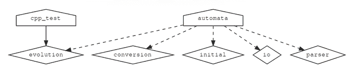
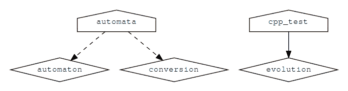

# 第八章：项目结构

在本章中，我们将涵盖以下配方：

+   使用函数和宏实现代码复用

+   将 CMake 源代码拆分为模块

+   编写一个函数来测试和设置编译器标志

+   使用命名参数定义函数或宏

+   重新定义函数和宏

+   弃用函数、宏和变量

+   使用`add_subdirectory`限制作用域

+   使用`target_sources`避免全局变量

+   组织 Fortran 项目

# 引言

在前几章中，我们已经探索了使用 CMake 配置和构建项目所需的多个构建块。在本章中，我们将讨论如何组合这些构建块，并引入抽象概念以避免庞大的`CMakeLists.txt`文件，并最小化代码重复、全局变量、全局状态和显式排序。我们的目标是展示模块化 CMake 代码结构的范式，并限制变量的作用域。我们将讨论的策略也将帮助我们控制中等至大型代码项目的 CMake 代码复杂性。

# 使用函数和宏实现代码复用

本配方的代码可在[`github.com/dev-cafe/cmake-cookbook/tree/v1.0/chapter-07/recipe-01`](https://github.com/dev-cafe/cmake-cookbook/tree/v1.0/chapter-07/recipe-01)获取，并包含一个 C++示例。该配方适用于 CMake 版本 3.5（及以上），并在 GNU/Linux、macOS 和 Windows 上进行了测试。

在任何编程语言中，函数允许我们抽象（隐藏）细节并避免代码重复，CMake 也不例外。在本配方中，我们将讨论宏和函数作为示例，并引入一个宏，使我们定义测试和设置测试顺序更加方便。我们不是通过调用`add_test`和`set_tests_properties`来定义每个集合并设置每个测试的预期`COST`（第四章，*创建和运行测试*，配方 8，*并行运行测试*），我们的目标是定义一个宏，能够一次性处理这两项任务。

# 准备工作

我们将从第四章，*创建和运行测试*，配方 2，*使用 Catch2 库定义单元测试*中介绍的示例开始。`main.cpp`、`sum_integers.cpp`和`sum_integers.hpp`文件保持不变，可以用来计算作为命令行参数提供的整数之和。单元测试的源代码(`test.cpp`)也保持不变。我们还需要 Catch2 头文件`catch.hpp`。与第四章，*创建和运行测试*，配方 2，*使用 Catch2 库定义单元测试*不同，我们将把源文件结构化为子目录，并形成以下文件树（稍后我们将讨论 CMake 代码）：

```cpp
.
├── CMakeLists.txt
├── src
│   ├── CMakeLists.txt
│   ├── main.cpp
│   ├── sum_integers.cpp
│   └── sum_integers.hpp
└── tests
    ├── catch.hpp
    ├── CMakeLists.txt
    └── test.cpp
```

# 如何操作

让我们按照所需的步骤进行：

1.  顶层的`CMakeLists.txt`文件定义了最低 CMake 版本、项目名称和支持的语言，并要求使用 C++11 标准：

```cpp
cmake_minimum_required(VERSION 3.5 FATAL_ERROR)

project(recipe-01 LANGUAGES CXX)

set(CMAKE_CXX_STANDARD 11)
set(CMAKE_CXX_EXTENSIONS OFF)
set(CMAKE_CXX_STANDARD_REQUIRED ON)
```

1.  我们进一步根据 GNU 标准定义了二进制和库路径：

```cpp
include(GNUInstallDirs)

set(CMAKE_ARCHIVE_OUTPUT_DIRECTORY
  ${CMAKE_BINARY_DIR}/${CMAKE_INSTALL_LIBDIR})
set(CMAKE_LIBRARY_OUTPUT_DIRECTORY
  ${CMAKE_BINARY_DIR}/${CMAKE_INSTALL_LIBDIR})
set(CMAKE_RUNTIME_OUTPUT_DIRECTORY
  ${CMAKE_BINARY_DIR}/${CMAKE_INSTALL_BINDIR})
```

1.  最后，我们使用`add_subdirectory`调用来将我们的 CMake 代码结构化为`src/CMakeLists.txt`和`tests/CMakeLists.txt`部分。我们还启用了测试：

```cpp
add_subdirectory(src)

enable_testing()
add_subdirectory(tests)
```

1.  在`src/CMakeLists.txt`文件中定义了源代码目标：

```cpp
set(CMAKE_INCLUDE_CURRENT_DIR_IN_INTERFACE ON)

add_library(sum_integers sum_integers.cpp)

add_executable(sum_up main.cpp)

target_link_libraries(sum_up sum_integers)
```

1.  在`tests/CMakeLists.txt`中，我们首先构建并链接`cpp_test`可执行文件：

```cpp
add_executable(cpp_test test.cpp)
target_link_libraries(cpp_test sum_integers)
```

1.  然后我们定义了一个新的宏，`add_catch_test`，我们将在后面讨论它：

```cpp
macro(add_catch_test _name _cost)
  math(EXPR num_macro_calls "${num_macro_calls} + 1")
  message(STATUS "add_catch_test called with ${ARGC} arguments: ${ARGV}")

  set(_argn "${ARGN}")
  if(_argn)
    message(STATUS "oops - macro received argument(s) we did not expect: ${ARGN}")
  endif()

  add_test(
    NAME
      ${_name}
    COMMAND
      $<TARGET_FILE:cpp_test>
      [${_name}] --success --out
      ${PROJECT_BINARY_DIR}/tests/${_name}.log --durations yes
    WORKING_DIRECTORY
      ${CMAKE_CURRENT_BINARY_DIR}
    )

  set_tests_properties(
    ${_name}
    PROPERTIES
      COST ${_cost}
    )
endmacro()
```

1.  最后，我们使用`add_catch_test`定义了两个测试，此外，我们还设置并打印了一个变量的值：

```cpp
set(num_macro_calls 0)

add_catch_test(short 1.5)
add_catch_test(long 2.5 extra_argument)

message(STATUS "in total there were ${num_macro_calls} calls to add_catch_test")
```

1.  现在，我们准备测试一下。首先，我们配置项目（显示的有趣输出行）：

```cpp
$ mkdir -p build
$ cd build
$ cmake ..

-- ...
-- add_catch_test called with 2 arguments: short;1.5
-- add_catch_test called with 3 arguments: long;2.5;extra_argument
-- oops - macro received argument(s) we did not expect: extra_argument
-- in total there were 2 calls to add_catch_test
-- ...
```

1.  最后，我们构建并运行测试：

```cpp
$ cmake --build .
$ ctest
```

1.  注意，首先启动的是长测试：

```cpp
    Start 2: long
1/2 Test #2: long ............................. Passed 0.00 sec
    Start 1: short
2/2 Test #1: short ............................ Passed 0.00 sec

100% tests passed, 0 tests failed out of 2
```

# 它是如何工作的

本食谱中的新特性是`add_catch_test`宏。宏期望两个参数，`_name`和`_cost`，我们可以在宏内部使用这些参数来调用`add_test`和`set_tests_properties`。前面的下划线是我们的选择，但通过这种方式，我们向读者表明这些参数具有局部作用域，并且只能在宏内部访问。还要注意，宏会自动填充`${ARGC}`（参数数量）和`${ARGV}`（参数列表），我们在输出中验证了这一点：

```cpp
-- add_catch_test called with 2 arguments: short;1.5
-- add_catch_test called with 3 arguments: long;2.5;extra_argument
```

宏还定义了`${ARGN}`，它保存了最后一个预期参数之后的参数列表。此外，我们还可以使用`${ARGV0}`、`${ARGV1}`等来引用参数。观察我们是如何在这个调用中捕获意外参数（`extra_argument`）的：

```cpp
add_catch_test(long 2.5 extra_argument)
```

我们使用以下方式完成了这一步骤：

```cpp
set(_argn "${ARGN}")
if(_argn)
  message(STATUS "oops - macro received argument(s) we did not expect: ${ARGN}")
endif()
```

在这个条件检查中，我们不得不引入一个新的变量，并且不能直接查询`ARGN`，因为它在通常的 CMake 意义上不是一个变量。通过这个宏，我们不仅能够通过名称和命令定义测试，还能够指示预期的成本，这导致由于`COST`属性，“长”测试在“短”测试之前启动。

我们可以使用具有相同语法的函数而不是宏来实现这一点：

```cpp
function(add_catch_test _name _cost)
  ...
endfunction()
```

宏和函数之间的区别在于它们的变量作用域。宏在调用者的作用域内执行，而函数有自己的变量作用域。换句话说，如果我们需要设置或修改应该对调用者可用的变量，我们通常使用宏。如果没有设置或修改输出变量，我们更倾向于使用函数。我们注意到，在函数中也可以修改父作用域的变量，但这必须使用`PARENT_SCOPE`明确指示：

```cpp
set(variable_visible_outside "some value" PARENT_SCOPE)
```

为了展示范围，我们在宏定义之后编写了以下调用：

```cpp
set(num_macro_calls 0)

add_catch_test(short 1.5)
add_catch_test(long 2.5 extra_argument)

message(STATUS "in total there were ${num_macro_calls} calls to add_catch_test")
```

在宏内部，我们将`num_macro_calls`增加 1：

```cpp
math(EXPR num_macro_calls "${num_macro_calls} + 1")
```

这是产生的输出：

```cpp
-- in total there were 2 calls to add_catch_test
```

如果我们把宏改为函数，测试仍然有效，但`num_macro_calls`在整个父作用域的调用过程中将保持为 0。想象一下，CMake 宏就像函数一样，它们直接被替换到调用它们的位置（在 C 语言中称为内联）。想象一下，CMake 函数就像黑盒子，除非你明确将其定义为`PARENT_SCOPE`，否则什么都不会返回。CMake 函数没有返回值。

# 还有更多

在宏中嵌套函数调用和在函数中嵌套宏调用是可能的，但我们需要仔细考虑变量的作用域。如果可以使用函数实现某个功能，那么这可能比宏更可取，因为它提供了对父作用域状态的更多默认控制。

我们还应该提到在`src/CMakeLists.txt`中使用`CMAKE_INCLUDE_CURRENT_DIR_IN_INTERFACE`：

```cpp
set(CMAKE_INCLUDE_CURRENT_DIR_IN_INTERFACE ON)
```

此命令将当前目录添加到此`CMakeLists.txt`文件中定义的所有目标的`INTERFACE_INCLUDE_DIRECTORIES`属性中。换句话说，我们不需要使用`target_include_directories`来指示`cpp_test`的头文件位置。

# 将 CMake 源代码拆分为模块

本例的代码可在[`github.com/dev-cafe/cmake-cookbook/tree/v1.0/chapter-07/recipe-02`](https://github.com/dev-cafe/cmake-cookbook/tree/v1.0/chapter-07/recipe-02)找到。本例适用于 CMake 版本 3.5（及更高版本），并在 GNU/Linux、macOS 和 Windows 上进行了测试。

项目通常从一个`CMakeLists.txt`文件开始，但随着时间的推移，这个文件会增长，在本例中，我们将演示一种将`CMakeLists.txt`拆分为较小单元的方法。将`CMakeLists.txt`拆分为可以在主`CMakeLists.txt`或其他模块中包含的模块有几个动机：

+   主要的`CMakeLists.txt`更容易阅读。

+   CMake 模块可以在其他项目中重用。

+   结合函数，模块可以帮助我们限制变量的作用域。

在本例中，我们将演示如何定义和包含一个宏，该宏允许我们获取彩色的 CMake 输出（用于重要状态消息或警告）。

# 准备工作

在本例中，我们将使用两个文件，主`CMakeLists.txt`和`cmake/colors.cmake`：

```cpp
.
├── cmake
│   └── colors.cmake
└── CMakeLists.txt
```

`cmake/colors.cmake`文件包含彩色输出的定义：

```cpp
# colorize CMake output

# code adapted from stackoverflow: http://stackoverflow.com/a/19578320
# from post authored by https://stackoverflow.com/users/2556117/fraser

macro(define_colors)
  if(WIN32)
    # has no effect on WIN32
    set(ColourReset "")
    set(ColourBold "")
    set(Red "")
    set(Green "")
    set(Yellow "")
    set(Blue "")
    set(Magenta "")
    set(Cyan "")
    set(White "")
    set(BoldRed "")
    set(BoldGreen "")
    set(BoldYellow "")
    set(BoldBlue "")
    set(BoldMagenta "")
    set(BoldCyan "")
    set(BoldWhite "")
  else()
    string(ASCII 27 Esc)
    set(ColourReset "${Esc}m")
    set(ColourBold "${Esc}[1m")
```

```cpp
    set(Red "${Esc}[31m")
    set(Green "${Esc}[32m")
    set(Yellow "${Esc}[33m")
    set(Blue "${Esc}[34m")
    set(Magenta "${Esc}[35m")
    set(Cyan "${Esc}[36m")
    set(White "${Esc}[37m")
    set(BoldRed "${Esc}[1;31m")
    set(BoldGreen "${Esc}[1;32m")
    set(BoldYellow "${Esc}[1;33m")
    set(BoldBlue "${Esc}[1;34m")
    set(BoldMagenta "${Esc}[1;35m")
    set(BoldCyan "${Esc}[1;36m")
    set(BoldWhite "${Esc}[1;37m")
  endif()
endmacro()
```

# 如何操作

这就是我们如何使用颜色定义来生成彩色状态消息的方法：

1.  我们从一个熟悉的开头开始：

```cpp
cmake_minimum_required(VERSION 3.5 FATAL_ERROR)

project(recipe-02 LANGUAGES NONE)
```

1.  然后，我们将`cmake`子目录添加到 CMake 将搜索的模块路径列表中：

```cpp
list(APPEND CMAKE_MODULE_PATH "${CMAKE_CURRENT_SOURCE_DIR}/cmake")
```

1.  然后，我们包含`colors.cmake`模块并调用其中定义的宏：

```cpp
include(colors)
define_colors()
```

1.  最后，我们打印几条不同颜色的消息：

```cpp
message(STATUS "This is a normal message")
message(STATUS "${Red}This is a red${ColourReset}")
message(STATUS "${BoldRed}This is a bold red${ColourReset}")
message(STATUS "${Green}This is a green${ColourReset}")
message(STATUS "${BoldMagenta}This is bold${ColourReset}")
```

1.  让我们测试一下（如果使用 macOS 或 Linux，此输出应该以彩色显示在屏幕上）：

![

# 工作原理

这是一个示例，其中不编译任何代码，也不需要语言支持，我们通过`LANGUAGES NONE`表明了这一点：

```cpp
project(recipe-02 LANGUAGES NONE)
```

我们定义了`define_colors`宏，并将其放置在`cmake/colors.cmake`中。我们选择使用宏而不是函数，因为我们还希望在调用范围内使用宏内部定义的变量来改变消息的颜色。我们包含了宏，并使用以下行调用了`define_colors`：

```cpp
include(colors)
define_colors()
```

然而，我们还需要告诉 CMake 在哪里查找宏：

```cpp
list(APPEND CMAKE_MODULE_PATH "${CMAKE_CURRENT_SOURCE_DIR}/cmake")
```

`include(colors)`命令指示 CMake 在`${CMAKE_MODULE_PATH}`中搜索名为`colors.cmake`的模块。

而不是这样写：

```cpp
list(APPEND CMAKE_MODULE_PATH "${CMAKE_CURRENT_SOURCE_DIR}/cmake")

include(colors)
```

我们可以使用以下明确的包含：

```cpp
include(cmake/colors.cmake)
```

# 还有更多

推荐的做法是在模块中定义宏或函数，然后调用宏或函数。使用模块包含作为函数调用是不好的做法。包含模块不应该做更多的事情，除了定义函数和宏以及发现程序、库和路径。实际的包含命令不应该定义或修改变量，这样做的原因是，重复的包含，可能是意外的，不应该引入任何不希望的副作用。在食谱 5，“重新定义函数和宏”中，我们将创建一个防止意外包含的保护措施。

# 编写一个测试和设置编译器标志的函数

本食谱的代码可在[`github.com/dev-cafe/cmake-cookbook/tree/v1.0/chapter-07/recipe-03`](https://github.com/dev-cafe/cmake-cookbook/tree/v1.0/chapter-07/recipe-03)找到，并包含一个 C/C++示例。该食谱适用于 CMake 版本 3.5（及以上），并在 GNU/Linux、macOS 和 Windows 上进行了测试。

在前两个食谱中，我们使用了宏；在本食谱中，我们将使用一个函数来抽象细节并避免代码重复。在示例中，我们将实现一个接受编译器标志列表的函数。该函数将尝试使用这些标志逐一编译测试代码，并返回编译器理解的第一标志。通过这样做，我们将学习一些新特性：函数、列表操作、字符串操作以及检查编译器是否支持编译器标志。

# 准备

遵循前一个食谱的推荐实践，我们将在一个模块（`set_compiler_flag.cmake`）中定义函数，包含该模块，然后调用该函数。该模块包含以下代码，我们将在后面讨论：

```cpp
include(CheckCCompilerFlag)
include(CheckCXXCompilerFlag)
include(CheckFortranCompilerFlag)
function(set_compiler_flag _result _lang)
  # build a list of flags from the arguments
  set(_list_of_flags)
```

```cpp
  # also figure out whether the function
  # is required to find a flag
  set(_flag_is_required FALSE)
  foreach(_arg IN ITEMS ${ARGN})
    string(TOUPPER "${_arg}" _arg_uppercase)
    if(_arg_uppercase STREQUAL "REQUIRED")
      set(_flag_is_required TRUE)
    else()
      list(APPEND _list_of_flags "${_arg}")
    endif()
  endforeach()

  set(_flag_found FALSE)
  # loop over all flags, try to find the first which works
  foreach(flag IN ITEMS ${_list_of_flags})

    unset(_flag_works CACHE)
    if(_lang STREQUAL "C")
      check_c_compiler_flag("${flag}" _flag_works)
    elseif(_lang STREQUAL "CXX")
      check_cxx_compiler_flag("${flag}" _flag_works)
    elseif(_lang STREQUAL "Fortran")
      check_Fortran_compiler_flag("${flag}" _flag_works)
    else()
      message(FATAL_ERROR "Unknown language in set_compiler_flag: ${_lang}")
    endif()

    # if the flag works, use it, and exit
    # otherwise try next flag
    if(_flag_works)
      set(${_result} "${flag}" PARENT_SCOPE)
      set(_flag_found TRUE)
      break()
    endif()
  endforeach()

  # raise an error if no flag was found
  if(_flag_is_required AND NOT _flag_found)
    message(FATAL_ERROR "None of the required flags were supported")
  endif()
endfunction()
```

# 如何操作

这是我们如何在`CMakeLists.txt`中使用`set_compiler_flag`函数的方法：

1.  在前言中，我们定义了最低 CMake 版本、项目名称和支持的语言（在这种情况下，C 和 C++）：

```cpp
cmake_minimum_required(VERSION 3.5 FATAL_ERROR)

project(recipe-03 LANGUAGES C CXX)
```

1.  然后，我们明确地包含`set_compiler_flag.cmake`：

```cpp
include(set_compiler_flag.cmake)
```

1.  然后，我们尝试一组 C 标志：

```cpp
set_compiler_flag(
  working_compile_flag C REQUIRED
  "-foo"             # this should fail
  "-wrong"           # this should fail
  "-wrong"           # this should fail
  "-Wall"            # this should work with GNU
  "-warn all"        # this should work with Intel
  "-Minform=inform"  # this should work with PGI
  "-nope"            # this should fail
  )

message(STATUS "working C compile flag: ${working_compile_flag}")
```

1.  我们尝试一组 C++标志：

```cpp
set_compiler_flag(
  working_compile_flag CXX REQUIRED
  "-foo"    # this should fail
  "-g"      # this should work with GNU, Intel, PGI
  "/RTCcsu" # this should work with MSVC
  )

message(STATUS "working CXX compile flag: ${working_compile_flag}")
```

1.  现在，我们可以配置项目并验证输出。仅显示相关输出，输出可能因编译器而异：

```cpp
$ mkdir -p build
$ cd build
$ cmake ..
```

```cpp
-- ...
-- Performing Test _flag_works
-- Performing Test _flag_works - Failed
-- Performing Test _flag_works
-- Performing Test _flag_works - Failed
-- Performing Test _flag_works
-- Performing Test _flag_works - Failed
-- Performing Test _flag_works
-- Performing Test _flag_works - Success
-- working C compile flag: -Wall
-- Performing Test _flag_works
-- Performing Test _flag_works - Failed
-- Performing Test _flag_works
-- Performing Test _flag_works - Success
-- working CXX compile flag: -g
-- ...
```

# 工作原理

我们在这里使用的模式是：

1.  定义一个函数或宏并将其放入模块中

1.  包含模块

1.  调用函数或宏

从输出中，我们可以看到代码检查列表中的每个标志，一旦检查成功，它就会打印出成功的编译标志。让我们看看`set_compiler_flag.cmake`模块内部。这个模块反过来包含了三个模块：

```cpp
include(CheckCCompilerFlag)
include(CheckCXXCompilerFlag)
include(CheckFortranCompilerFlag)
```

这些是标准的 CMake 模块，CMake 将在`${CMAKE_MODULE_PATH}`中找到它们。这些模块提供了`check_c_compiler_flag`、`check_cxx_compiler_flag`和`check_fortran_compiler_flag`宏，分别。然后是函数定义：

```cpp
function(set_compiler_flag _result _lang)
  ...
endfunction()
```

`set_compiler_flag`函数期望两个参数，我们称它们为`_result`（这将保存成功的编译标志或空字符串""）和`_lang`（指定语言：C、C++或 Fortran）。

我们希望能够这样调用函数：

```cpp
set_compiler_flag(working_compile_flag C REQUIRED "-Wall" "-warn all")
```

这个调用有五个参数，但函数头只期望两个。这意味着`REQUIRED`、`"-Wall"`和`"-warn all"`将被放入`${ARGN}`中。从`${ARGN}`中，我们首先使用`foreach`构建一个标志列表。同时，我们从标志列表中过滤掉`REQUIRED`，并使用它来设置`_flag_is_required`：

```cpp
# build a list of flags from the arguments
set(_list_of_flags)
# also figure out whether the function
# is required to find a flag
set(_flag_is_required FALSE)
foreach(_arg IN ITEMS ${ARGN})
  string(TOUPPER "${_arg}" _arg_uppercase)
  if(_arg_uppercase STREQUAL "REQUIRED")
    set(_flag_is_required TRUE)
  else()
    list(APPEND _list_of_flags "${_arg}")
  endif()
endforeach()
```

现在，我们将循环遍历`${_list_of_flags}`，尝试每个标志，如果`_flag_works`被设置为`TRUE`，我们将`_flag_found`设置为`TRUE`并终止进一步的搜索：

```cpp
set(_flag_found FALSE)
# loop over all flags, try to find the first which works
foreach(flag IN ITEMS ${_list_of_flags})

  unset(_flag_works CACHE)
  if(_lang STREQUAL "C")
    check_c_compiler_flag("${flag}" _flag_works)
  elseif(_lang STREQUAL "CXX")
    check_cxx_compiler_flag("${flag}" _flag_works)
  elseif(_lang STREQUAL "Fortran")
    check_Fortran_compiler_flag("${flag}" _flag_works)
  else()
    message(FATAL_ERROR "Unknown language in set_compiler_flag: ${_lang}")
  endif()
  # if the flag works, use it, and exit
  # otherwise try next flag
  if(_flag_works)
    set(${_result} "${flag}" PARENT_SCOPE)
    set(_flag_found TRUE)
    break()
  endif()
endforeach()
```

在`unset(_flag_works CACHE)`这一行是为了确保`check_*_compiler_flag`的结果不会在多次调用中使用相同的`_flag_works`结果变量时被缓存。

如果找到标志并且`_flag_works`被设置为`TRUE`，我们定义映射到`_result`的变量：

```cpp
set(${_result} "${flag}" PARENT_SCOPE)
```

这需要使用`PARENT_SCOPE`，因为我们希望修改的变量在函数体外打印和使用。此外，请注意我们是如何使用`${_result}`语法从父作用域传递的变量`_result`进行解引用的。这是必要的，以确保在调用函数时，无论其名称如何，都将工作标志设置为从父作用域传递的变量的值。如果没有找到标志并且提供了`REQUIRED`关键字，我们通过错误消息停止配置：

```cpp
# raise an error if no flag was found
if(_flag_is_required AND NOT _flag_found)
  message(FATAL_ERROR "None of the required flags were supported")
endif()
```

# 还有更多

我们可以通过宏来完成这项任务，但使用函数，我们可以更好地控制作用域。我们知道，函数只能修改结果变量。

此外，请注意，某些标志需要在编译和链接时都设置，通过为`check_<LANG>_compiler_flag`函数设置`CMAKE_REQUIRED_FLAGS`来正确报告成功。正如我们在第五章，*配置时间和构建时间操作*，第 7 个配方，*探测编译标志*中讨论的，这是针对 sanitizers 的情况。

# 定义一个带有命名参数的函数或宏

本食谱的代码可在[`github.com/dev-cafe/cmake-cookbook/tree/v1.0/chapter-07/recipe-04`](https://github.com/dev-cafe/cmake-cookbook/tree/v1.0/chapter-07/recipe-04)找到，并包含一个 C++示例。该食谱适用于 CMake 版本 3.5（及以上），并在 GNU/Linux、macOS 和 Windows 上进行了测试。

在前面的食谱中，我们探索了函数和宏并使用了位置参数。在本食谱中，我们将定义一个带有命名参数的函数。我们将增强来自食谱 1 的示例，即*使用函数和宏重用代码*，并使用以下方式定义测试：

```cpp
add_catch_test(short 1.5)
```

我们将能够调用以下内容：

```cpp
add_catch_test(
  NAME
    short
  LABELS
    short
    cpp_test
  COST
    1.5
  )
```

# 准备就绪

我们将使用来自食谱 1 的示例，即*使用函数和宏重用代码*，并保持 C++源文件不变，文件树基本相同：

```cpp
.
├── cmake
│   └── testing.cmake
├── CMakeLists.txt
├── src
│   ├── CMakeLists.txt
│   ├── main.cpp
│   ├── sum_integers.cpp
│   └── sum_integers.hpp
```

```cpp
└── tests
    ├── catch.hpp
    ├── CMakeLists.txt
    └── test.cpp
```

# 如何做到这一点

我们将在 CMake 代码中引入小的修改，如下所示：

1.  由于我们将包含位于`cmake`下的模块，因此在顶层`CMakeLists.txt`中只添加了一行额外的代码：

```cpp
list(APPEND CMAKE_MODULE_PATH "${CMAKE_CURRENT_SOURCE_DIR}/cmake")
```

1.  我们保持`src/CMakeLists.txt`不变。

1.  在`tests/CMakeLists.txt`中，我们将`add_catch_test`函数定义移动到`cmake/testing.cmake`，并定义了两个测试：

```cpp
add_executable(cpp_test test.cpp)
target_link_libraries(cpp_test sum_integers)

include(testing)

add_catch_test(
  NAME
    short
  LABELS
    short
    cpp_test
  COST
    1.5
  )

add_catch_test(
  NAME
    long
  LABELS
    long
    cpp_test
  COST
    2.5
  )
```

1.  `add_catch_test`函数现在在`cmake/testing.cmake`中定义：

```cpp
function(add_catch_test)
  set(options)
  set(oneValueArgs NAME COST)
  set(multiValueArgs LABELS DEPENDS REFERENCE_FILES)
  cmake_parse_arguments(add_catch_test
    "${options}"
    "${oneValueArgs}"
    "${multiValueArgs}"
    ${ARGN}
    )

  message(STATUS "defining a test ...")
  message(STATUS " NAME: ${add_catch_test_NAME}")
  message(STATUS " LABELS: ${add_catch_test_LABELS}")
  message(STATUS " COST: ${add_catch_test_COST}")
  message(STATUS " REFERENCE_FILES: ${add_catch_test_REFERENCE_FILES}")

  add_test(
    NAME
      ${add_catch_test_NAME}
    COMMAND
      $<TARGET_FILE:cpp_test>
      [${add_catch_test_NAME}] --success --out
      ${PROJECT_BINARY_DIR}/tests/${add_catch_test_NAME}.log --durations yes
    WORKING_DIRECTORY
      ${CMAKE_CURRENT_BINARY_DIR}
    )

  set_tests_properties(${add_catch_test_NAME}
    PROPERTIES
      LABELS "${add_catch_test_LABELS}"
    )

  if(add_catch_test_COST)
    set_tests_properties(${add_catch_test_NAME}
      PROPERTIES
        COST ${add_catch_test_COST}
      )
  endif()

  if(add_catch_test_DEPENDS)
    set_tests_properties(${add_catch_test_NAME}
      PROPERTIES
        DEPENDS ${add_catch_test_DEPENDS}
      )
  endif()

  if(add_catch_test_REFERENCE_FILES)
    file(
      COPY
        ${add_catch_test_REFERENCE_FILES}
      DESTINATION
        ${CMAKE_CURRENT_BINARY_DIR}
      )
  endif()
endfunction()
```

1.  我们准备好测试输出。首先，我们配置以下内容：

```cpp
$ mkdir -p build
$ cd build
$ cmake ..

-- ...
-- defining a test ...
--     NAME: short
--     LABELS: short;cpp_test
--     COST: 1.5
--     REFERENCE_FILES: 
-- defining a test ...
--     NAME: long
--     LABELS: long;cpp_test
--     COST: 2.5
--     REFERENCE_FILES:
-- ...
```

1.  然后，编译并测试代码：

```cpp
$ cmake --build .
$ ctest
```

# 它是如何工作的

本食谱中的新内容是命名参数，因此我们可以专注于`cmake/testing.cmake`模块。CMake 提供了`cmake_parse_arguments`命令，我们用函数名（`add_catch_test`）调用它，选项（在我们的例子中没有），单值参数（这里，`NAME`和`COST`），以及多值参数（这里，`LABELS`，`DEPENDS`，和`REFERENCE_FILES`）：

```cpp
function(add_catch_test)
  set(options)
  set(oneValueArgs NAME COST)
  set(multiValueArgs LABELS DEPENDS REFERENCE_FILES)
  cmake_parse_arguments(add_catch_test
    "${options}"
    "${oneValueArgs}"
    "${multiValueArgs}"
    ${ARGN}
    )
  ...
endfunction()
```

`cmake_parse_arguments`命令解析选项和参数，并在我们的情况下定义以下内容：

+   `add_catch_test_NAME`

+   `add_catch_test_COST`

+   `add_catch_test_LABELS`

+   `add_catch_test_DEPENDS`

+   `add_catch_test_REFERENCE_FILES`

然后我们可以在函数内部查询和使用这些变量。这种方法为我们提供了实现具有更健壮接口和更易读的函数/宏调用的函数和宏的机会。

# 还有更多

选项关键字（在本示例中未使用）由`cmake_parse_arguments`定义为`TRUE`或`FALSE`。对`add_catch_test`函数的进一步增强可能是提供测试命令作为命名参数，为了更简洁的示例，我们省略了这一点。

`cmake_parse_arguments`命令在 CMake 3.5 发布之前在`CMakeParseArguments.cmake`模块中可用。因此，可以通过在`cmake/testing.cmake`模块文件的顶部使用`include(CMakeParseArguments)`命令来使本食谱与早期版本的 CMake 兼容。

# 重新定义函数和宏

本食谱的代码可在[`github.com/dev-cafe/cmake-cookbook/tree/v1.0/chapter-07/recipe-05`](https://github.com/dev-cafe/cmake-cookbook/tree/v1.0/chapter-07/recipe-05)找到。该食谱适用于 CMake 版本 3.5（及以上），并在 GNU/Linux、macOS 和 Windows 上进行了测试。

我们提到过，模块包含*不应该*用作函数调用，因为模块可能会被（意外地）多次包含。在本食谱中，我们将编写我们自己的简单包含保护，如果我们尝试多次包含模块，它将警告我们。内置的`include_guard`命令自 CMake 3.10 版本起可用，并且行为类似于 C/C++头文件的`#pragma once`。对于这个版本的 CMake，我们将讨论和演示如何重新定义函数和宏。我们将展示如何检查 CMake 版本，对于 3.10 以下的版本，我们将使用我们自己的自定义包含保护。

# 准备工作

在本例中，我们将使用三个文件：

```cpp
.
├── cmake
│   ├── custom.cmake
│   └── include_guard.cmake
└── CMakeLists.txt
```

自定义的`custom.cmake`模块包含以下代码：

```cpp
include_guard(GLOBAL)

message(STATUS "custom.cmake is included and processed")
```

稍后我们将讨论`cmake/include_guard.cmake`和`CMakeLists.txt`。

# 如何操作

这是我们的三个 CMake 文件的逐步分解：

1.  在本食谱中，我们不会编译任何代码，因此我们的语言要求是`NONE`：

```cpp
cmake_minimum_required(VERSION 3.5 FATAL_ERROR)

project(recipe-05 LANGUAGES NONE)
```

1.  然后我们定义一个`include_guard`宏，我们将其放置在一个单独的模块中：

```cpp
# (re)defines include_guard
include(cmake/include_guard.cmake)
```

1.  `cmake/include_guard.cmake`文件包含以下内容（我们稍后将详细讨论）：

```cpp
macro(include_guard)
  if (CMAKE_VERSION VERSION_LESS "3.10")
    # for CMake below 3.10 we define our
    # own include_guard(GLOBAL)
    message(STATUS "calling our custom include_guard")

    # if this macro is called the first time
    # we start with an empty list
    if(NOT DEFINED included_modules)
        set(included_modules)
    endif()

    if ("${CMAKE_CURRENT_LIST_FILE}" IN_LIST included_modules)
      message(WARNING "module ${CMAKE_CURRENT_LIST_FILE} processed more than once")
    endif()

    list(APPEND included_modules ${CMAKE_CURRENT_LIST_FILE})
  else()
    # for CMake 3.10 or higher we augment
    # the built-in include_guard
    message(STATUS "calling the built-in include_guard")

    _include_guard(${ARGV})
  endif()
endmacro()
```

1.  在主`CMakeLists.txt`中，然后我们模拟意外地两次包含自定义模块：

```cpp
include(cmake/custom.cmake)
include(cmake/custom.cmake)
```

1.  最后，我们使用以下命令进行配置：

```cpp
$ mkdir -p build
$ cd build
$ cmake ..
```

1.  使用 CMake 3.10 及以上版本的结果如下：

```cpp
-- calling the built-in include_guard
-- custom.cmake is included and processed
-- calling the built-in include_guard
```

1.  使用 CMake 3.10 以下版本的结果如下：

```cpp
-- calling our custom include_guard
-- custom.cmake is included and processed
-- calling our custom include_guard
CMake Warning at cmake/include_guard.cmake:7 (message):
  module
  /home/user/example/cmake/custom.cmake
  processed more than once
Call Stack (most recent call first):
  cmake/custom.cmake:1 (include_guard)
  CMakeLists.txt:12 (include)
```

# 它是如何工作的

我们的`include_guard`宏包含两个分支，一个用于 CMake 3.10 以下版本，另一个用于 CMake 3.10 及以上版本：

```cpp
macro(include_guard)
  if (CMAKE_VERSION VERSION_LESS "3.10")
    # ...
  else()
    # ...
  endif()
endmacro()
```

如果 CMake 版本低于 3.10，我们进入第一个分支，内置的`include_guard`不可用，因此我们定义我们自己的：

```cpp
message(STATUS "calling our custom include_guard")

# if this macro is called the first time
# we start with an empty list
if(NOT DEFINED included_modules)
    set(included_modules)
endif()

if ("${CMAKE_CURRENT_LIST_FILE}" IN_LIST included_modules)
  message(WARNING "module ${CMAKE_CURRENT_LIST_FILE} processed more than once")
endif()

list(APPEND included_modules ${CMAKE_CURRENT_LIST_FILE})
```

如果宏第一次被调用，那么`included_modules`变量未定义，因此我们将其设置为空列表。然后我们检查`${CMAKE_CURRENT_LIST_FILE}`是否是`included_modules`列表的元素。如果是，我们发出警告。如果不是，我们将`${CMAKE_CURRENT_LIST_FILE}`添加到此列表中。在 CMake 输出中，我们可以验证第二次包含自定义模块确实会导致警告。

对于 CMake 3.10 及以上的情况则不同；在这种情况下，存在一个内置的`include_guard`，我们用我们自己的宏接收的参数调用它：

```cpp
macro(include_guard)
  if (CMAKE_VERSION VERSION_LESS "3.10")
    # ...
  else()
    message(STATUS "calling the built-in include_guard")

    _include_guard(${ARGV})
  endif()
endmacro()
```

在这里，`_include_guard(${ARGV})`指向内置的`include_guard`。在这种情况下，我们通过添加自定义消息（“调用内置的`include_guard`”）来增强内置命令。这种模式为我们提供了一种重新定义自己的或内置的函数和宏的机制。这在调试或记录目的时可能很有用。

这种模式可能很有用，但应谨慎应用，因为 CMake 不会警告宏或函数的重新定义。

# 弃用函数、宏和变量

本示例的代码可在 [`github.com/dev-cafe/cmake-cookbook/tree/v1.0/chapter-07/recipe-06`](https://github.com/dev-cafe/cmake-cookbook/tree/v1.0/chapter-07/recipe-06) 获取。该示例适用于 CMake 版本 3.5（及以上），并在 GNU/Linux、macOS 和 Windows 上进行了测试。

弃用是在项目发展过程中向开发者发出信号的重要机制，表明某个函数、宏或变量将在未来的某个时候被移除或替换。在一定时期内，该函数、宏或变量将继续可用，但会发出警告，最终可以升级为错误。

# 准备就绪

我们将从以下 CMake 项目开始：

```cpp
cmake_minimum_required(VERSION 3.5 FATAL_ERROR)

project(recipe-06 LANGUAGES NONE)

macro(custom_include_guard)
  if(NOT DEFINED included_modules)
    set(included_modules)
  endif()

  if ("${CMAKE_CURRENT_LIST_FILE}" IN_LIST included_modules)
    message(WARNING "module ${CMAKE_CURRENT_LIST_FILE} processed more than once")
  endif()

  list(APPEND included_modules ${CMAKE_CURRENT_LIST_FILE})
endmacro()

include(cmake/custom.cmake)

message(STATUS "list of all included modules: ${included_modules}")
```

这段代码定义了一个自定义的包含保护，包含了一个自定义模块（与前一个示例相同的模块），并打印了所有包含的模块列表。对于 CMake 3.10 及以上版本，我们知道从之前的示例中有一个内置的 `include_guard`。但不是简单地移除 `custom_include_guard` 和 `${included_modules}`，我们将通过弃用警告来弃用宏和变量，这样在某个时刻我们可以将其转换为 `FATAL_ERROR`，使代码停止并强制开发者切换到内置命令。

# 如何操作

弃用函数、宏和变量可以按如下方式进行：

1.  首先，我们定义一个函数，用于弃用变量：

```cpp
function(deprecate_variable _variable _access)
  if(_access STREQUAL "READ_ACCESS")
    message(DEPRECATION "variable ${_variable} is deprecated")
  endif()
endfunction()
```

1.  然后，如果 CMake 版本大于 3.9，我们重新定义 `custom_include_guard` 并将 `variable_watch` 附加到 `included_modules`：

```cpp
if (CMAKE_VERSION VERSION_GREATER "3.9")
  # deprecate custom_include_guard
  macro(custom_include_guard)
    message(DEPRECATION "custom_include_guard is deprecated - use built-in include_guard instead")
    _custom_include_guard(${ARGV})
  endmacro()

  # deprecate variable included_modules
  variable_watch(included_modules deprecate_variable)
endif()
```

1.  在 CMake 版本低于 3.10 的项目中配置会产生以下结果：

```cpp
$ mkdir -p build
$ cd build
$ cmake ..

-- custom.cmake is included and processed
-- list of all included modules: /home/user/example/cmake/custom.cmake
```

1.  CMake 3.10 及以上版本将产生预期的弃用警告：

```cpp
CMake Deprecation Warning at CMakeLists.txt:26 (message):
  custom_include_guard is deprecated - use built-in include_guard instead
Call Stack (most recent call first):
  cmake/custom.cmake:1 (custom_include_guard)
  CMakeLists.txt:34 (include)

-- custom.cmake is included and processed
CMake Deprecation Warning at CMakeLists.txt:19 (message):
  variable included_modules is deprecated
Call Stack (most recent call first):
  CMakeLists.txt:9999 (deprecate_variable)
  CMakeLists.txt:36 (message)

-- list of all included modules: /home/user/example/cmake/custom.cmake
```

# 工作原理

弃用函数或宏相当于重新定义它，如前一个示例所示，并打印带有 `DEPRECATION` 的消息：

```cpp
macro(somemacro)
  message(DEPRECATION "somemacro is deprecated")
  _somemacro(${ARGV})
endmacro()
```

弃用变量可以通过首先定义以下内容来实现：

```cpp
function(deprecate_variable _variable _access)
  if(_access STREQUAL "READ_ACCESS")
    message(DEPRECATION "variable ${_variable} is deprecated")
  endif()
endfunction()
```

接下来，该函数将附加到即将被弃用的变量上：

```cpp
variable_watch(somevariable deprecate_variable)
```

如果在这种情况下读取了 `${included_modules}`（`READ_ACCESS`），则 `deprecate_variable` 函数会发出带有 `DEPRECATION` 的消息。

# 使用 add_subdirectory 限制作用域

本示例的代码可在 [`github.com/dev-cafe/cmake-cookbook/tree/v1.0/chapter-07/recipe-07`](https://github.com/dev-cafe/cmake-cookbook/tree/v1.0/chapter-07/recipe-07) 获取，并包含一个 C++示例。该示例适用于 CMake 版本 3.5（及以上），并在 GNU/Linux、macOS 和 Windows 上进行了测试。

在本章剩余的食谱中，我们将讨论项目结构化的策略，以及如何限制变量和副作用的范围，目的是降低代码复杂性并简化项目的维护。在本食谱中，我们将把一个项目拆分成多个`CMakeLists.txt`文件，每个文件都有有限的范围，这些文件将使用`add_subdirectory`命令进行处理。

# 准备工作

由于我们希望展示和讨论如何组织一个非平凡的项目，我们需要一个比“hello world”项目更复杂的示例。我们将开发一个相对简单的代码，它可以计算并打印基本细胞自动机：

+   [`en.wikipedia.org/wiki/Cellular_automaton#Elementary_cellular_automata`](https://en.wikipedia.org/wiki/Cellular_automaton#Elementary_cellular_automata)

+   [`mathworld.wolfram.com/ElementaryCellularAutomaton.html`](http://mathworld.wolfram.com/ElementaryCellularAutomaton.html)

我们的代码将能够计算 256 种基本细胞自动机中的任何一种，例如规则 90（Wolfram 代码）：

```cpp
$ ./bin/automata 40 15 90

length: 40
number of steps: 15
rule: 90
                    *
                   * *
                  *   *
                 * * * *
                *       *
               * *     * *
              *   *   *   *
             * * * * * * * *
            *               *
           * *             * *
          *   *           *   *
         * * * *         * * * *
        *       *       *       *
       * *     * *     * *     * *
      *   *   *   *   *   *   *   *
     * * * * * * * * * * * * * * * *
```

我们示例代码项目的结构如下：

```cpp
.
├── CMakeLists.txt
├── external
│   ├── CMakeLists.txt
│   ├── conversion.cpp
│   ├── conversion.hpp
│   └── README.md
├── src
│   ├── CMakeLists.txt
│   ├── evolution
│   │   ├── CMakeLists.txt
│   │   ├── evolution.cpp
│   │   └── evolution.hpp
│   ├── initial
│   │   ├── CMakeLists.txt
│   │   ├── initial.cpp
│   │   └── initial.hpp
│   ├── io
│   │   ├── CMakeLists.txt
│   │   ├── io.cpp
│   │   └── io.hpp
│   ├── main.cpp
│   └── parser
│       ├── CMakeLists.txt
│       ├── parser.cpp
│       └── parser.hpp
└── tests
    ├── catch.hpp
    ├── CMakeLists.txt
    └── test.cpp
```

在这里，我们将代码拆分为多个库，以模拟现实世界中的中型到大型项目，其中源代码可以组织成库，然后链接到可执行文件中。

主函数在`src/main.cpp`中：

```cpp
#include "conversion.hpp"
#include "evolution.hpp"
#include "initial.hpp"
#include "io.hpp"
#include "parser.hpp"

#include <iostream>
int main(int argc, char *argv[]) {

  // parse arguments
  int length, num_steps, rule_decimal;
  std::tie(length, num_steps, rule_decimal) = parse_arguments(argc, argv);

  // print information about parameters
  std::cout << "length: " << length << std::endl;
  std::cout << "number of steps: " << num_steps << std::endl;
  std::cout << "rule: " << rule_decimal << std::endl;

  // obtain binary representation for the rule
  std::string rule_binary = binary_representation(rule_decimal);

  // create initial distribution
  std::vector<int> row = initial_distribution(length);

  // print initial configuration
  print_row(row);

  // the system evolves, print each step
  for (int step = 0; step < num_steps; step++) {
    row = evolve(row, rule_binary);
    print_row(row);
  }
}
```

`external/conversion.cpp`文件包含将十进制转换为二进制的代码。我们在这里模拟这段代码是由`src`之外的“外部”库提供的：

```cpp
#include "conversion.hpp"

#include <bitset>
#include <string>

std::string binary_representation(const int decimal) {
  return std::bitset<8>(decimal).to_string();
}
```

`src/evolution/evolution.cpp`文件在时间步长内传播系统：

```cpp
#include "evolution.hpp"

#include <string>
#include <vector>

std::vector<int> evolve(const std::vector<int> row, const std::string rule_binary) {
  std::vector<int> result;
  for (auto i = 0; i < row.size(); ++i) {

    auto left = (i == 0 ? row.size() : i) - 1;
    auto center = i;
    auto right = (i + 1) % row.size();

    auto ancestors = 4 * row[left] + 2 * row[center] + 1 * row[right];
    ancestors = 7 - ancestors;

    auto new_state = std::stoi(rule_binary.substr(ancestors, 1));

    result.push_back(new_state);
  }

  return result;
}
```

`src/initial/initial.cpp`文件生成初始状态：

```cpp
#include "initial.hpp"

#include <vector>

std::vector<int> initial_distribution(const int length) {

  // we start with a vector which is zeroed out
  std::vector<int> result(length, 0);

  // more or less in the middle we place a living cell
  result[length / 2] = 1;

  return result;
}
```

`src/io/io.cpp`文件包含打印一行的函数：

```cpp
#include "io.hpp"

#include <algorithm>
#include <iostream>
#include <vector>

void print_row(const std::vector<int> row) {
  std::for_each(row.begin(), row.end(), [](int const &value) {
    std::cout << (value == 1 ? '*' : ' ');
  });
  std::cout << std::endl;
}
```

`src/parser/parser.cpp`文件解析命令行输入：

```cpp
#include "parser.hpp"

#include <cassert>
#include <string>
#include <tuple>

std::tuple<int, int, int> parse_arguments(int argc, char *argv[]) {
  assert(argc == 4 && "program called with wrong number of arguments");

  auto length = std::stoi(argv[1]);
  auto num_steps = std::stoi(argv[2]);
  auto rule_decimal = std::stoi(argv[3]);

  return std::make_tuple(length, num_steps, rule_decimal);
}
```

最后，`tests/test.cpp`包含使用 Catch2 库的两个单元测试：

```cpp
#include "evolution.hpp"

// this tells catch to provide a main()
// only do this in one cpp file
#define CATCH_CONFIG_MAIN
#include "catch.hpp"

#include <string>
#include <vector>

TEST_CASE("Apply rule 90", "[rule-90]") {
  std::vector<int> row = {0, 1, 0, 1, 0, 1, 0, 1, 0};
  std::string rule = "01011010";
  std::vector<int> expected_result = {1, 0, 0, 0, 0, 0, 0, 0, 1};
  REQUIRE(evolve(row, rule) == expected_result);
}

TEST_CASE("Apply rule 222", "[rule-222]") {
  std::vector<int> row = {0, 0, 0, 0, 1, 0, 0, 0, 0};
  std::string rule = "11011110";
  std::vector<int> expected_result = {0, 0, 0, 1, 1, 1, 0, 0, 0};
  REQUIRE(evolve(row, rule) == expected_result);
}
```

相应的头文件包含函数签名。有人可能会说，对于这个小小的代码示例来说，项目包含的子目录太多了，但请记住，这只是一个简化的示例，通常每个库都包含许多源文件，理想情况下像这里一样组织在单独的目录中。

# 如何做

让我们深入了解所需的 CMake 基础设施的详细解释：

1.  顶层的`CMakeLists.txt`与食谱 1，*使用函数和宏的代码重用*非常相似：

```cpp
cmake_minimum_required(VERSION 3.5 FATAL_ERROR)

project(recipe-07 LANGUAGES CXX)

set(CMAKE_CXX_STANDARD 11)
set(CMAKE_CXX_EXTENSIONS OFF)
set(CMAKE_CXX_STANDARD_REQUIRED ON)

include(GNUInstallDirs)
set(CMAKE_ARCHIVE_OUTPUT_DIRECTORY
  ${CMAKE_BINARY_DIR}/${CMAKE_INSTALL_LIBDIR})
set(CMAKE_LIBRARY_OUTPUT_DIRECTORY
  ${CMAKE_BINARY_DIR}/${CMAKE_INSTALL_LIBDIR})
set(CMAKE_RUNTIME_OUTPUT_DIRECTORY
  ${CMAKE_BINARY_DIR}/${CMAKE_INSTALL_BINDIR})

# defines targets and sources
add_subdirectory(src)

# contains an "external" library we will link to
add_subdirectory(external)

# enable testing and define tests
enable_testing()
add_subdirectory(tests)
```

1.  目标和源文件在`src/CMakeLists.txt`中定义（转换目标除外）：

```cpp
add_executable(automata main.cpp)

add_subdirectory(evolution)
add_subdirectory(initial)
add_subdirectory(io)
add_subdirectory(parser)

target_link_libraries(automata
  PRIVATE
    conversion
    evolution
    initial
    io
    parser
  )
```

1.  转换库在`external/CMakeLists.txt`中定义：

```cpp
add_library(conversion "")

target_sources(conversion
  PRIVATE
    ${CMAKE_CURRENT_LIST_DIR}/conversion.cpp
  PUBLIC
    ${CMAKE_CURRENT_LIST_DIR}/conversion.hpp
  )

target_include_directories(conversion
  PUBLIC
    ${CMAKE_CURRENT_LIST_DIR}
  )
```

1.  `src/CMakeLists.txt`文件添加了更多的子目录，这些子目录又包含`CMakeLists.txt`文件。它们的结构都类似；`src/evolution/CMakeLists.txt`包含以下内容：

```cpp
add_library(evolution "")

target_sources(evolution
  PRIVATE
    evolution.cpp
  PUBLIC
    ${CMAKE_CURRENT_LIST_DIR}/evolution.hpp
  )
target_include_directories(evolution
  PUBLIC
    ${CMAKE_CURRENT_LIST_DIR}
  )
```

1.  单元测试在`tests/CMakeLists.txt`中注册：

```cpp
add_executable(cpp_test test.cpp)

target_link_libraries(cpp_test evolution)

add_test(
  NAME
    test_evolution
  COMMAND
    $<TARGET_FILE:cpp_test>
  )
```

1.  配置和构建项目会产生以下输出：

```cpp
$ mkdir -p build
$ cd build
$ cmake ..
$ cmake --build .

Scanning dependencies of target conversion
[ 7%] Building CXX object external/CMakeFiles/conversion.dir/conversion.cpp.o
[ 14%] Linking CXX static library ../lib64/libconversion.a
[ 14%] Built target conversion
Scanning dependencies of target evolution
[ 21%] Building CXX object src/evolution/CMakeFiles/evolution.dir/evolution.cpp.o
[ 28%] Linking CXX static library ../../lib64/libevolution.a
[ 28%] Built target evolution
Scanning dependencies of target initial
[ 35%] Building CXX object src/initial/CMakeFiles/initial.dir/initial.cpp.o
[ 42%] Linking CXX static library ../../lib64/libinitial.a
[ 42%] Built target initial
Scanning dependencies of target io
[ 50%] Building CXX object src/io/CMakeFiles/io.dir/io.cpp.o
[ 57%] Linking CXX static library ../../lib64/libio.a
[ 57%] Built target io
Scanning dependencies of target parser
[ 64%] Building CXX object src/parser/CMakeFiles/parser.dir/parser.cpp.o
[ 71%] Linking CXX static library ../../lib64/libparser.a
[ 71%] Built target parser
Scanning dependencies of target automata
[ 78%] Building CXX object src/CMakeFiles/automata.dir/main.cpp.o
[ 85%] Linking CXX executable ../bin/automata
[ 85%] Built target automata
Scanning dependencies of target cpp_test
[ 92%] Building CXX object tests/CMakeFiles/cpp_test.dir/test.cpp.o
[100%] Linking CXX executable ../bin/cpp_test
[100%] Built target cpp_test
```

1.  最后，我们运行单元测试：

```cpp
$ ctest

Running tests...
    Start 1: test_evolution
```

```cpp
1/1 Test #1: test_evolution ................... Passed 0.00 sec

100% tests passed, 0 tests failed out of 1
```

# 它是如何工作的

我们本可以将所有代码放入一个源文件中。这样做是不切实际的；每次编辑都需要完全重新编译。将源文件分割成更小、更易管理的单元是有意义的。我们同样可以将所有源文件编译成一个单一的库或可执行文件，但在实践中，项目更倾向于将源文件的编译分割成更小、定义明确的库。这样做既是为了限定作用域和简化依赖扫描，也是为了简化代码维护。这意味着，像我们这里所做的那样，使用多个库构建项目是一个典型的情况。

为了讨论 CMake 结构，我们可以从定义每个库的单个`CMakeLists.txt`文件开始，例如`src/evolution/CMakeLists.txt`：

```cpp
add_library(evolution "")

target_sources(evolution
  PRIVATE
    evolution.cpp
  PUBLIC
    ${CMAKE_CURRENT_LIST_DIR}/evolution.hpp
  )

target_include_directories(evolution
  PUBLIC
    ${CMAKE_CURRENT_LIST_DIR}
  )
```

这些单独的`CMakeLists.txt`文件尽可能靠近源代码定义库。在这个例子中，我们首先用`add_library`定义库名，然后定义其源文件和包含目录，以及它们的目标可见性：实现文件（这里为`evolution.cpp`）是`PRIVATE`，而接口头文件`evolution.hpp`被定义为`PUBLIC`，因为我们将在`main.cpp`和`test.cpp`中访问它。将目标尽可能靠近代码定义的优点是，了解该库且可能对 CMake 框架知识有限的代码开发人员只需要编辑此目录中的文件；换句话说，库依赖关系被封装了。

向上移动一级，库在`src/CMakeLists.txt`中组装：

```cpp
add_executable(automata main.cpp)

add_subdirectory(evolution)
add_subdirectory(initial)
add_subdirectory(io)
add_subdirectory(parser)

target_link_libraries(automata
  PRIVATE
    conversion
    evolution
    initial
    io
    parser
  )
```

这个文件反过来又被引用在顶层的`CMakeLists.txt`中。这意味着我们使用`CMakeLists.txt`文件的树构建了我们的项目，从一棵库的树开始。这种方法对许多项目来说是典型的，并且它可以扩展到大型项目，而不需要在目录之间携带全局变量中的源文件列表。`add_subdirectory`方法的一个额外好处是它隔离了作用域，因为在一个子目录中定义的变量不会自动在父作用域中访问。

# 还有更多

使用`add_subdirectory`调用树构建项目的一个限制是，CMake 不允许我们在当前目录作用域之外使用`target_link_libraries`与目标链接。这对于本食谱中所示的示例来说不是问题。在下一个食谱中，我们将展示一种替代方法，其中我们不使用`add_subdirectory`，而是使用模块包含来组装不同的`CMakeLists.txt`文件，这允许我们链接到当前目录之外定义的目标。

CMake 可以使用 Graphviz 图形可视化软件（[`www.graphviz.org`](http://www.graphviz.org/)）来生成项目的依赖关系图：

```cpp
$ cd build
$ cmake --graphviz=example.dot ..
$ dot -T png example.dot -o example.png
```

生成的图表将显示不同目录中目标之间的依赖关系：



在本书中，我们一直在进行*源外*构建，以保持源代码树和构建树分离。这是推荐的实践，允许我们使用相同的源代码配置不同的构建（顺序或并行，`Debug`或`Release`），而不需要复制源代码，也不需要在源代码树中散布生成的和对象文件。通过以下代码片段，您可以保护您的项目免受源内构建的影响：

```cpp
if(${PROJECT_SOURCE_DIR} STREQUAL ${PROJECT_BINARY_DIR})
    message(FATAL_ERROR "In-source builds not allowed. Please make a new directory (called a build directory) and run CMake from there.")
endif()
```

认识到构建树的结构模仿了源代码树的结构是很有用的。在我们的示例中，在`src/CMakeLists.txt`中插入以下`message`打印输出是相当有教育意义的：

```cpp
message("current binary dir is ${CMAKE_CURRENT_BINARY_DIR}")
```

在配置项目以进行`build`时，我们会看到打印输出指向`build/src`。

# 另请参见

我们注意到，从 CMake 3.12 版本开始，`OBJECT`库是组织大型项目的另一种可行方法。我们对示例的唯一修改将是在库的`CMakeLists.txt`文件中。源代码将被编译成对象文件：既不会被归档到静态归档中，也不会被链接到共享库中。例如：

```cpp
add_library(io OBJECT "")

target_sources(io
  PRIVATE
    io.cpp
  PUBLIC
    ${CMAKE_CURRENT_LIST_DIR}/io.hpp
  )

target_include_directories(io
  PUBLIC
    ${CMAKE_CURRENT_LIST_DIR}
  )
```

顶层`CMakeLists.txt`保持不变：`automata`可执行目标将这些对象文件链接到最终的可执行文件中。使用要求，如包含目录、编译标志和链接库设置在`OBJECT`库上将正确继承。有关 CMake 3.12 中引入的`OBJECT`库新功能的更多详细信息，请参阅官方文档：[`cmake.org/cmake/help/v3.12/manual/cmake-buildsystem.7.html#object-libraries`](https://cmake.org/cmake/help/v3.12/manual/cmake-buildsystem.7.html#object-libraries)

# 使用 target_sources 避免全局变量

本配方的代码可在[`github.com/dev-cafe/cmake-cookbook/tree/v1.0/chapter-07/recipe-08`](https://github.com/dev-cafe/cmake-cookbook/tree/v1.0/chapter-07/recipe-08)找到，并包含一个 C++示例。本配方适用于 CMake 3.5（及以上）版本，并在 GNU/Linux、macOS 和 Windows 上进行了测试。

在本配方中，我们将讨论与前一个配方不同的方法，并使用模块包含而不是使用`add_subdirectory`来组装不同的`CMakeLists.txt`文件。这种方法受到[`crascit.com/2016/01/31/enhanced-source-file-handling-with-target_sources/`](https://crascit.com/2016/01/31/enhanced-source-file-handling-with-target_sources/)的启发，允许我们使用`target_link_libraries`链接到当前目录之外定义的目标。

# 准备工作

我们将使用与之前配方相同的源代码。唯一的变化将在`CMakeLists.txt`文件中，我们将在接下来的章节中讨论这些变化。

# 如何操作

让我们详细看看 CMake 所需的各个文件：

1.  顶层`CMakeLists.txt`包含以下内容：

```cpp
cmake_minimum_required(VERSION 3.5 FATAL_ERROR)

project(recipe-08 LANGUAGES CXX)

set(CMAKE_CXX_STANDARD 11)
set(CMAKE_CXX_EXTENSIONS OFF)
set(CMAKE_CXX_STANDARD_REQUIRED ON)
```

```cpp
include(GNUInstallDirs)
set(CMAKE_ARCHIVE_OUTPUT_DIRECTORY
  ${CMAKE_BINARY_DIR}/${CMAKE_INSTALL_LIBDIR})
set(CMAKE_LIBRARY_OUTPUT_DIRECTORY
  ${CMAKE_BINARY_DIR}/${CMAKE_INSTALL_LIBDIR})
set(CMAKE_RUNTIME_OUTPUT_DIRECTORY
  ${CMAKE_BINARY_DIR}/${CMAKE_INSTALL_BINDIR})

# defines targets and sources
include(src/CMakeLists.txt)
include(external/CMakeLists.txt)

enable_testing()
add_subdirectory(tests)
```

1.  `external/CMakeLists.txt`文件与之前的配方相比没有变化。

1.  `src/CMakeLists.txt` 文件定义了两个库（`automaton` 和 `evolution`）：

```cpp
add_library(automaton "")
add_library(evolution "")

include(${CMAKE_CURRENT_LIST_DIR}/evolution/CMakeLists.txt)
include(${CMAKE_CURRENT_LIST_DIR}/initial/CMakeLists.txt)
include(${CMAKE_CURRENT_LIST_DIR}/io/CMakeLists.txt)
include(${CMAKE_CURRENT_LIST_DIR}/parser/CMakeLists.txt)

add_executable(automata "")

target_sources(automata
  PRIVATE
    ${CMAKE_CURRENT_LIST_DIR}/main.cpp
  )

target_link_libraries(automata
  PRIVATE
    automaton
    conversion
  )
```

1.  `src/evolution/CMakeLists.txt` 文件包含以下内容：

```cpp
target_sources(automaton
  PRIVATE
    ${CMAKE_CURRENT_LIST_DIR}/evolution.cpp
```

```cpp
  PUBLIC
    ${CMAKE_CURRENT_LIST_DIR}/evolution.hpp
  )

target_include_directories(automaton
  PUBLIC
    ${CMAKE_CURRENT_LIST_DIR}
  )

target_sources(evolution
  PRIVATE
    ${CMAKE_CURRENT_LIST_DIR}/evolution.cpp
  PUBLIC
    ${CMAKE_CURRENT_LIST_DIR}/evolution.hpp
  )

target_include_directories(evolution
  PUBLIC
    ${CMAKE_CURRENT_LIST_DIR}
  )
```

1.  剩余的`CMakeLists.txt`文件与`src/initial/CMakeLists.txt`相同：

```cpp
target_sources(automaton
  PRIVATE
    ${CMAKE_CURRENT_LIST_DIR}/initial.cpp
  PUBLIC
    ${CMAKE_CURRENT_LIST_DIR}/initial.hpp
  )

target_include_directories(automaton
  PUBLIC
    ${CMAKE_CURRENT_LIST_DIR}
  )
```

1.  配置、构建和测试的结果与之前的配方相同：

```cpp
$ mkdir -p build
$ cd build
$ cmake ..
$ cmake --build build
$ ctest

```

```cpp
Running tests...
 Start 1: test_evolution
1/1 Test #1: test_evolution ................... Passed 0.00 sec

100% tests passed, 0 tests failed out of 1
```

# 它是如何工作的

与之前的配方不同，我们定义了三个库：

+   `conversion`（在`external`中定义）

+   `automaton`（包含除转换之外的所有源文件）

+   `evolution`（在`src/evolution`中定义，并由`cpp_test`链接）

在这个例子中，我们通过使用`include()`引用`CMakeLists.txt`文件来保持父作用域中所有目标的可用性：

```cpp
include(src/CMakeLists.txt)
include(external/CMakeLists.txt)
```

我们可以构建一个包含树，记住当我们进入子目录（`src/CMakeLists.txt`）时，我们需要使用相对于父作用域的路径：

```cpp
include(${CMAKE_CURRENT_LIST_DIR}/evolution/CMakeLists.txt)
include(${CMAKE_CURRENT_LIST_DIR}/initial/CMakeLists.txt)
include(${CMAKE_CURRENT_LIST_DIR}/io/CMakeLists.txt)
include(${CMAKE_CURRENT_LIST_DIR}/parser/CMakeLists.txt)
```

这样，我们可以在通过`include()`语句访问的文件树中的任何地方定义和链接目标。然而，我们应该选择一个对维护者和代码贡献者来说最直观的地方来定义它们。

# 还有更多

我们可以再次使用 CMake 和 Graphviz（[`www.graphviz.org/`](http://www.graphviz.org/)）来生成这个项目的依赖图：

```cpp
$ cd build
$ cmake --graphviz=example.dot ..
$ dot -T png example.dot -o example.png
```

对于当前的设置，我们得到以下依赖图：



# 组织 Fortran 项目

本配方的代码可在[`github.com/dev-cafe/cmake-cookbook/tree/v1.0/chapter-07/recipe-09`](https://github.com/dev-cafe/cmake-cookbook/tree/v1.0/chapter-07/recipe-09)找到，并包含一个 Fortran 示例。该配方适用于 CMake 版本 3.5（及更高版本），并在 GNU/Linux、macOS 和 Windows 上使用 MSYS Makefiles 进行了测试。

我们用一个配方来讨论如何结构化和组织 Fortran 项目，原因有二：

1.  仍然有许多 Fortran 项目存在，特别是在数值软件领域（对于更全面的通用目的 Fortran 软件项目列表，请参见[`fortranwiki.org/fortran/show/Libraries`](http://fortranwiki.org/fortran/show/Libraries)）。

1.  Fortran 90（及以后版本）对于不使用 CMake 的项目来说，构建起来可能会更加困难，因为 Fortran 模块文件要求编译顺序。换句话说，对于手动编写的 Makefile，通常需要为 Fortran 模块文件编写一个依赖扫描器。

正如我们将在本配方中看到的，现代 CMake 允许我们以非常紧凑和模块化的方式表达配置和构建过程。作为一个例子，我们将使用前两个配方中的基本细胞自动机，现在移植到 Fortran。

# 准备就绪

文件树结构与前两个配方非常相似。我们用 Fortran 源代码替换了 C++，在这种情况下，我们没有头文件：

```cpp
.
├── CMakeLists.txt
├── external
│   ├── CMakeLists.txt
│   ├── conversion.f90
│   └── README.md
├── src
│   ├── CMakeLists.txt
│   ├── evolution
│   │   ├── ancestors.f90
│   │   ├── CMakeLists.txt
│   │   ├── empty.f90
│   │   └── evolution.f90
│   ├── initial
│   │   ├── CMakeLists.txt
│   │   └── initial.f90
│   ├── io
│   │   ├── CMakeLists.txt
│   │   └── io.f90
│   ├── main.f90
│   └── parser
│       ├── CMakeLists.txt
│       └── parser.f90
└── tests
    ├── CMakeLists.txt
    └── test.f90
```

主程序在`src/main.f90`中：

```cpp
program example

  use parser, only: get_arg_as_int
  use conversion, only: binary_representation
  use initial, only: initial_distribution
  use io, only: print_row
  use evolution, only: evolve

  implicit none

  integer :: num_steps
  integer :: length
  integer :: rule_decimal
  integer :: rule_binary(8)
  integer, allocatable :: row(:)
  integer :: step

  ! parse arguments
  num_steps = get_arg_as_int(1)
  length = get_arg_as_int(2)
  rule_decimal = get_arg_as_int(3)

  ! print information about parameters
  print *, "number of steps: ", num_steps
  print *, "length: ", length
  print *, "rule: ", rule_decimal

  ! obtain binary representation for the rule
  rule_binary = binary_representation(rule_decimal)

  ! create initial distribution
  allocate(row(length))
  call initial_distribution(row)

  ! print initial configuration
  call print_row(row)

  ! the system evolves, print each step
  do step = 1, num_steps
    call evolve(row, rule_binary)
    call print_row(row)
  end do

  deallocate(row)

end program
```

与之前的配方一样，我们将`conversion`模块放在`external/conversion.f90`中：

```cpp
module conversion

  implicit none
  public binary_representation
  private

contains

  pure function binary_representation(n_decimal)
    integer, intent(in) :: n_decimal
    integer :: binary_representation(8)
    integer :: pos
    integer :: n

    binary_representation = 0
    pos = 8
    n = n_decimal
    do while (n > 0)
      binary_representation(pos) = mod(n, 2)
      n = (n - binary_representation(pos))/2
      pos = pos - 1
    end do
  end function

end module
```

`evolution`库，它实现了时间步长，被人工分为三个文件。大部分内容收集在`src/evolution/evolution.f90`：

```cpp
module evolution

  implicit none
  public evolve
  private

contains

  subroutine not_visible()
    ! no-op call to demonstrate private/public visibility
    call empty_subroutine_no_interface()
  end subroutine

  pure subroutine evolve(row, rule_binary)
    use ancestors, only: compute_ancestors

    integer, intent(inout) :: row(:)
    integer, intent(in) :: rule_binary(8)
    integer :: i
    integer :: left, center, right
    integer :: ancestry
    integer, allocatable :: new_row(:)

    allocate(new_row(size(row)))

    do i = 1, size(row)
      left = i - 1
      center = i
      right = i + 1

      if (left < 1) left = left + size(row)
      if (right > size(row)) right = right - size(row)

      ancestry = compute_ancestors(row, left, center, right)
      new_row(i) = rule_binary(ancestry)
    end do

    row = new_row
    deallocate(new_row)

  end subroutine

end module
```

祖先的计算在`src/evolution/ancestors.f90`中执行：

```cpp
module ancestors

  implicit none
  public compute_ancestors
  private

contains

  pure integer function compute_ancestors(row, left, center, right) result(i)
    integer, intent(in) :: row(:)
    integer, intent(in) :: left, center, right

    i = 4*row(left) + 2*row(center) + 1*row(right)
    i = 8 - i
  end function

end module
```

我们还在`src/evolution/empty.f90`中有一个“空”模块：

```cpp
module empty

  implicit none
  public empty_subroutine
  private

contains

  subroutine empty_subroutine()
  end subroutine

end module

subroutine empty_subroutine_no_interface()
  use empty, only: empty_subroutine
  call empty_subroutine()
end subroutine
```

我们将在下一节解释这些选择。

起始条件的代码位于`src/initial/initial.f90`：

```cpp
module initial

  implicit none
  public initial_distribution
  private

contains

  pure subroutine initial_distribution(row)
    integer, intent(out) :: row(:)

    row = 0
    row(size(row)/2) = 1
  end subroutine

end module
```

`src/io/io.f90`文件包含一个打印行的函数：

```cpp
module io

  implicit none
  public print_row
  private

contains

  subroutine print_row(row)
    integer, intent(in) :: row(:)
    character(size(row)) :: line
    integer :: i

    do i = 1, size(row)
      if (row(i) == 1) then
        line(i:i) = '*'
      else
        line(i:i) = ' '
      end if
    end do

    print *, line
  end subroutine

end module
```

`src/parser/parser.f90`文件解析命令行参数：

```cpp
module parser

  implicit none
  public get_arg_as_int
  private

contains

  integer function get_arg_as_int(n) result(i)
    integer, intent(in) :: n
    character(len=32) :: arg

    call get_command_argument(n, arg)
    read(arg , *) i
  end function

end module
```

最后，我们有测试源文件在`tests/test.f90`：

```cpp
program test

  use evolution, only: evolve

  implicit none

  integer :: row(9)
  integer :: expected_result(9)
  integer :: rule_binary(8)
  integer :: i

  ! test rule 90
  row = (/0, 1, 0, 1, 0, 1, 0, 1, 0/)
  rule_binary = (/0, 1, 0, 1, 1, 0, 1, 0/)
  call evolve(row, rule_binary)
  expected_result = (/1, 0, 0, 0, 0, 0, 0, 0, 1/)
  do i = 1, 9
    if (row(i) /= expected_result(i)) then
      print *, 'ERROR: test for rule 90 failed'
      call exit(1)
    end if
  end do
  ! test rule 222
  row = (/0, 0, 0, 0, 1, 0, 0, 0, 0/)
  rule_binary = (/1, 1, 0, 1, 1, 1, 1, 0/)
  call evolve(row, rule_binary)
  expected_result = (/0, 0, 0, 1, 1, 1, 0, 0, 0/)
  do i = 1, 9
    if (row(i) /= expected_result(i)) then
      print *, 'ERROR: test for rule 222 failed'
      call exit(1)
    end if
  end do

end program
```

# 如何做到这一点

我们现在将讨论相应的 CMake 结构：

1.  顶层的`CMakeLists.txt`与第 7 个配方类似；我们只将`CXX`替换为`Fortran`并删除 C++11 要求：

```cpp
cmake_minimum_required(VERSION 3.5 FATAL_ERROR)

project(recipe-09 LANGUAGES Fortran)

include(GNUInstallDirs)
set(CMAKE_ARCHIVE_OUTPUT_DIRECTORY
  ${CMAKE_BINARY_DIR}/${CMAKE_INSTALL_LIBDIR})
set(CMAKE_LIBRARY_OUTPUT_DIRECTORY
  ${CMAKE_BINARY_DIR}/${CMAKE_INSTALL_LIBDIR})
set(CMAKE_RUNTIME_OUTPUT_DIRECTORY
  ${CMAKE_BINARY_DIR}/${CMAKE_INSTALL_BINDIR})

# defines targets and sources
add_subdirectory(src)

# contains an "external" library we will link to
add_subdirectory(external)

# enable testing and define tests
enable_testing()
add_subdirectory(tests)
```

1.  目标和源文件在`src/CMakeLists.txt`中定义（除了`conversion`目标）：

```cpp
add_executable(automata main.f90)

add_subdirectory(evolution)
add_subdirectory(initial)
add_subdirectory(io)
add_subdirectory(parser)

target_link_libraries(automata
  PRIVATE
    conversion
    evolution
    initial
    io
    parser
  )
```

1.  `转换`库在`external/CMakeLists.txt`中定义：

```cpp
add_library(conversion "")

target_sources(conversion
  PUBLIC
    ${CMAKE_CURRENT_LIST_DIR}/conversion.f90
  )
```

1.  `src/CMakeLists.txt`文件添加了进一步的子目录，这些子目录又包含`CMakeLists.txt`文件。它们的结构都类似；例如，`src/initial/CMakeLists.txt`包含以下内容：

```cpp
add_library(initial "")

target_sources(initial
  PUBLIC
    ${CMAKE_CURRENT_LIST_DIR}/initial.f90
  )
```

1.  例外是`src/evolution/CMakeLists.txt`中的`evolution`库，我们将其分为三个源文件：

```cpp
add_library(evolution "")

target_sources(evolution
  PRIVATE
    empty.f90
  PUBLIC
    ${CMAKE_CURRENT_LIST_DIR}/ancestors.f90
    ${CMAKE_CURRENT_LIST_DIR}/evolution.f90
  )
```

1.  单元测试在`tests/CMakeLists.txt`中注册：

```cpp
add_executable(fortran_test test.f90)

target_link_libraries(fortran_test evolution)

add_test(
  NAME
    test_evolution
  COMMAND
    $<TARGET_FILE:fortran_test>
  )
```

1.  配置和构建项目会产生以下输出：

```cpp
$ mkdir -p build
$ cd build
$ cmake ..
$ cmake --build .

Scanning dependencies of target conversion
[ 4%] Building Fortran object external/CMakeFiles/conversion.dir/conversion.f90.o
[ 8%] Linking Fortran static library ../lib64/libconversion.a
[ 8%] Built target conversion
Scanning dependencies of target evolution
[ 12%] Building Fortran object src/evolution/CMakeFiles/evolution.dir/ancestors.f90.o
[ 16%] Building Fortran object src/evolution/CMakeFiles/evolution.dir/empty.f90.o
[ 20%] Building Fortran object src/evolution/CMakeFiles/evolution.dir/evolution.f90.o
[ 25%] Linking Fortran static library ../../lib64/libevolution.a
[ 25%] Built target evolution
Scanning dependencies of target initial
[ 29%] Building Fortran object src/initial/CMakeFiles/initial.dir/initial.f90.o
[ 33%] Linking Fortran static library ../../lib64/libinitial.a
[ 33%] Built target initial
Scanning dependencies of target io
[ 37%] Building Fortran object src/io/CMakeFiles/io.dir/io.f90.o
[ 41%] Linking Fortran static library ../../lib64/libio.a
[ 41%] Built target io
Scanning dependencies of target parser
[ 45%] Building Fortran object src/parser/CMakeFiles/parser.dir/parser.f90.o
[ 50%] Linking Fortran static library ../../lib64/libparser.a
[ 50%] Built target parser
Scanning dependencies of target example
[ 54%] Building Fortran object src/CMakeFiles/example.dir/__/external/conversion.f90.o
[ 58%] Building Fortran object src/CMakeFiles/example.dir/evolution/ancestors.f90.o
[ 62%] Building Fortran object src/CMakeFiles/example.dir/evolution/evolution.f90.o
[ 66%] Building Fortran object src/CMakeFiles/example.dir/initial/initial.f90.o
[ 70%] Building Fortran object src/CMakeFiles/example.dir/io/io.f90.o
[ 75%] Building Fortran object src/CMakeFiles/example.dir/parser/parser.f90.o
[ 79%] Building Fortran object src/CMakeFiles/example.dir/main.f90.o
[ 83%] Linking Fortran executable ../bin/example
[ 83%] Built target example
Scanning dependencies of target fortran_test
[ 87%] Building Fortran object tests/CMakeFiles/fortran_test.dir/__/src/evolution/ancestors.f90.o
[ 91%] Building Fortran object tests/CMakeFiles/fortran_test.dir/__/src/evolution/evolution.f90.o
[ 95%] Building Fortran object tests/CMakeFiles/fortran_test.dir/test.f90.o
[100%] Linking Fortran executable
```

1.  最后，我们运行单元测试：

```cpp
$ ctest

Running tests...
 Start 1: test_evolution
1/1 Test #1: test_evolution ................... Passed 0.00 sec

100% tests passed, 0 tests failed out of 1
```

# 它是如何工作的

按照第 7 个配方，*使用`add_subdirectory`限制范围*，我们将从下至上讨论 CMake 结构，从定义每个库的单独`CMakeLists.txt`文件开始，例如`src/evolution/CMakeLists.txt`：

```cpp
add_library(evolution "")

target_sources(evolution
  PRIVATE
```

```cpp
    empty.f90
  PUBLIC
    ${CMAKE_CURRENT_LIST_DIR}/ancestors.f90
    ${CMAKE_CURRENT_LIST_DIR}/evolution.f90
  )
```

这些单独的`CMakeLists.txt`文件尽可能接近源文件定义库，遵循与前两个配方相同的推理：了解此库的代码开发人员，可能对 CMake 框架的了解有限，只需要编辑此目录中的文件：分而治之。

我们首先使用`add_library`定义库的名称，然后定义其源文件和包含目录，以及它们的目标可见性。在这种情况下，`ancestors.f90`和`evolution.f90`都是`PUBLIC`，因为它们的模块接口被库外部访问，而`empty.f90`的模块接口没有被库外部访问，因此我们将此源文件标记为`PRIVATE`。

向上移动一级，库在`src/CMakeLists.txt`中组装：

```cpp
add_executable(automata main.f90)

add_subdirectory(evolution)
add_subdirectory(initial)
add_subdirectory(io)
add_subdirectory(parser)

target_link_libraries(automata
  PRIVATE
    conversion
    evolution
    initial
    io
    parser
  )
```

反过来，此文件在顶层的`CMakeLists.txt`中被引用。这意味着我们使用`CMakeLists.txt`文件的树构建了我们的项目库树，使用`add_subdirectory`添加。如第 7 个配方，*使用`add_subdirectory`限制范围*所述，这种方法可以扩展到大型项目，无需在目录之间携带源文件列表的全局变量，并且具有隔离作用域和命名空间的额外好处。

将此 Fortran 示例与 C++版本（配方 7）进行比较，我们可以注意到，在 Fortran 情况下，我们不得不做的 CMake 工作较少；我们不需要使用`target_include_directories`，因为没有头文件，接口是通过生成的 Fortran 模块文件进行通信的。此外，我们也不必担心源文件在`target_sources`中列出的顺序，也不必在库之间施加任何显式依赖关系！CMake 能够从源文件依赖关系中推断出 Fortran 模块依赖关系。结合使用`target_sources`与`PRIVATE`和`PUBLIC`，我们可以以紧凑且稳健的方式表达接口。

# 还有更多内容。

在本配方中，我们没有指定 Fortran 模块文件应放置的目录，并保持了这种透明性。可以通过设置`CMAKE_Fortran_MODULE_DIRECTORY` CMake 变量来指定模块文件的位置。请注意，也可以将其设置为目标属性，即`Fortran_MODULE_DIRECTORY`，从而实现更精细的控制。请参阅[`cmake.org/cmake/help/v3.5/prop_tgt/Fortran_MODULE_DIRECTORY.html`](https://cmake.org/cmake/help/v3.5/prop_tgt/Fortran_MODULE_DIRECTORY.html#prop_tgt:Fortran_MODULE_DIRECTORY)。
