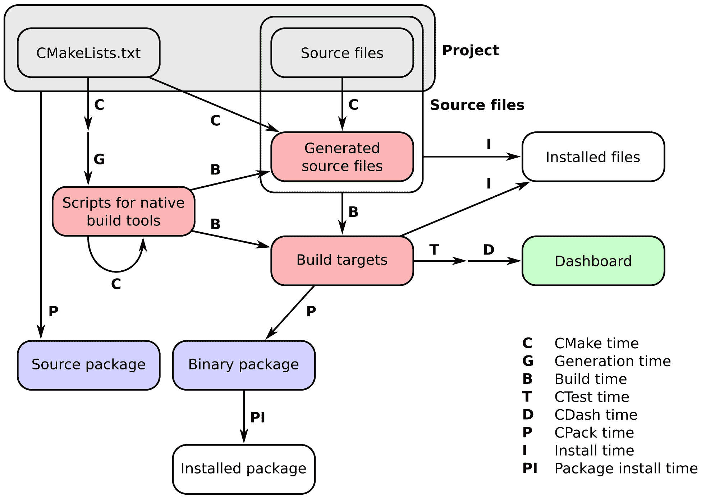

# 第十一章：编写安装程序

在本章中，我们将涵盖以下节：

+   安装你的项目

+   生成导出头文件

+   导出你的目标

+   安装超级构建

# 引言

在前几章中，我们已经展示了如何使用 CMake 配置、构建和测试我们的项目。安装项目是开发者工具箱中同样重要的一部分，本章将展示如何实现这一点。本章的节涵盖了以下图中概述的安装时操作：



我们将引导你完成精简一个简单的 C++项目安装的各个步骤：从确保项目中构建的重要文件被复制到正确的目录，到确保依赖于你的工作的其他项目可以使用 CMake 检测到它。本章的四个节将基于第一章，*从简单可执行文件到库*，第三部分，*构建和链接共享和静态库*中给出的简单示例。在那里我们尝试构建一个非常简单的库并将其链接到一个可执行文件中。我们还展示了如何从相同的源文件构建静态和共享库。在本章中，我们将更深入地讨论并正式化安装时发生的事情。

# 安装你的项目

本节的代码可在[`github.com/dev-cafe/cmake-cookbook/tree/v1.0/chapter-10/recipe-01`](https://github.com/dev-cafe/cmake-cookbook/tree/v1.0/chapter-10/recipe-01)找到，并包含一个 C++示例。本节适用于 CMake 版本 3.6（及更高版本），并在 GNU/Linux、macOS 和 Windows 上进行了测试。

在本节的第一节中，我们将介绍我们的小项目以及将在后续节中使用的一些基本概念。安装文件、库和可执行文件是一项非常基本的任务，但它可能会带来一些陷阱。我们将引导你了解这些陷阱，并展示如何使用 CMake 有效地避免其中的许多陷阱。

# 准备工作

来自第一章，*从简单可执行文件到库*，第三部分，*构建和链接共享和静态库*的代码几乎未作改动地被使用：我们仅添加了对 UUID 库的依赖。这种依赖是有条件的，如果找不到 UUID 库，我们将通过预处理器排除使用它的代码。代码被适当地组织到自己的`src`子目录中。项目的布局如下：

```cpp
.
├── CMakeLists.txt
├── src
│   ├── CMakeLists.txt
│   ├── hello-world.cpp
│   ├── Message.cpp
│   └── Message.hpp
└── tests
    └── CMakeLists.txt
```

我们已经可以看到，我们有一个根`CMakeLists.txt`，在`src`子目录下有一个叶子，在`tests`子目录下有另一个叶子。

`Message.hpp`头文件包含以下内容：

```cpp
#pragma once

#include <iosfwd>
#include <string>

class Message {
public:
  Message(const std::string &m) : message_(m) {}

  friend std::ostream &operator<<(std::ostream &os, Message &obj) {
    return obj.printObject(os);
  }

private:
  std::string message_;
  std::ostream &printObject(std::ostream &os);
};

std::string getUUID();
```

这是`Message.cpp`中相应的实现：

```cpp
#include "Message.hpp"

#include <iostream>
#include <string>

#ifdef HAVE_UUID
#include <uuid/uuid.h>
#endif

std::ostream &Message::printObject(std::ostream &os) {
  os << "This is my very nice message: " << std::endl;
  os << message_ << std::endl;
  os << "...and here is its UUID: " << getUUID();

  return os;
}

#ifdef HAVE_UUID
std::string getUUID() {
  uuid_t uuid;
```

```cpp
  uuid_generate(uuid);
  char uuid_str[37];
  uuid_unparse_lower(uuid, uuid_str);
  uuid_clear(uuid);
  std::string uuid_cxx(uuid_str);
  return uuid_cxx;
}
#else
std::string getUUID() { return "Ooooops, no UUID for you!"; }
#endif
```

最后，示例`hello-world.cpp`可执行文件如下：

```cpp
#include <cstdlib>
#include <iostream>

#include "Message.hpp"

int main() {
  Message say_hello("Hello, CMake World!");

  std::cout << say_hello << std::endl;

  Message say_goodbye("Goodbye, CMake World");

  std::cout << say_goodbye << std::endl;

  return EXIT_SUCCESS;
}
```

# 如何操作

让我们首先浏览一下根`CMakeLists.txt`文件：

1.  我们像往常一样，首先要求一个最小 CMake 版本并定义一个 C++11 项目。请注意，我们已使用`VERSION`关键字为`project`命令设置了项目版本：

```cpp
# CMake 3.6 needed for IMPORTED_TARGET option
# to pkg_search_module
cmake_minimum_required(VERSION 3.6 FATAL_ERROR)

```

```cpp
project(recipe-01
  LANGUAGES CXX
  VERSION 1.0.0
  )

# <<< General set up >>>

set(CMAKE_CXX_STANDARD 11)
set(CMAKE_CXX_EXTENSIONS OFF)
set(CMAKE_CXX_STANDARD_REQUIRED ON)
```

1.  用户可以通过`CMAKE_INSTALL_PREFIX`变量定义安装前缀。CMake 将为该变量设置一个合理的默认值：在 Unix 上是`/usr/local`，在 Windows 上是`C:\Program Files`。我们打印一条状态消息报告其值：

```cpp
message(STATUS "Project will be installed to ${CMAKE_INSTALL_PREFIX}")
```

1.  默认情况下，我们为项目首选`Release`配置。用户将能够使用`CMAKE_BUILD_TYPE`变量设置此项，我们检查是否是这种情况。如果不是，我们将其设置为我们自己的默认合理值：

```cpp
if(NOT CMAKE_BUILD_TYPE)
  set(CMAKE_BUILD_TYPE Release CACHE STRING "Build type" FORCE)
endif()

message(STATUS "Build type set to ${CMAKE_BUILD_TYPE}")
```

1.  接下来，我们告诉 CMake 在哪里构建可执行文件、静态库和共享库目标。这便于用户在不打算实际安装项目的情况下访问这些构建目标。我们使用标准的 CMake `GNUInstallDirs.cmake`模块。这将确保一个合理且可移植的项目布局：

```cpp
include(GNUInstallDirs)

set(CMAKE_ARCHIVE_OUTPUT_DIRECTORY
  ${PROJECT_BINARY_DIR}/${CMAKE_INSTALL_LIBDIR})
set(CMAKE_LIBRARY_OUTPUT_DIRECTORY
  ${PROJECT_BINARY_DIR}/${CMAKE_INSTALL_LIBDIR})
set(CMAKE_RUNTIME_OUTPUT_DIRECTORY
  ${PROJECT_BINARY_DIR}/${CMAKE_INSTALL_BINDIR})
```

1.  虽然之前的命令固定了构建输出在构建目录内的位置，但以下命令需要固定可执行文件、库和包含文件在安装前缀内的位置。这些将大致遵循相同的布局，但我们定义了新的`INSTALL_LIBDIR`、`INSTALL_BINDIR`、`INSTALL_INCLUDEDIR`和`INSTALL_CMAKEDIR`变量，用户可以覆盖这些变量，如果他们愿意的话：

```cpp
# Offer the user the choice of overriding the installation directories
set(INSTALL_LIBDIR ${CMAKE_INSTALL_LIBDIR} CACHE PATH "Installation directory for libraries")
set(INSTALL_BINDIR ${CMAKE_INSTALL_BINDIR} CACHE PATH "Installation directory for executables")
set(INSTALL_INCLUDEDIR ${CMAKE_INSTALL_INCLUDEDIR} CACHE PATH "Installation directory for header files")
if(WIN32 AND NOT CYGWIN)
  set(DEF_INSTALL_CMAKEDIR CMake)
else()
  set(DEF_INSTALL_CMAKEDIR share/cmake/${PROJECT_NAME})
endif()
set(INSTALL_CMAKEDIR ${DEF_INSTALL_CMAKEDIR} CACHE PATH "Installation directory for CMake files")
```

1.  我们向用户报告组件将被安装到的路径：

```cpp
# Report to user
foreach(p LIB BIN INCLUDE CMAKE)
  file(TO_NATIVE_PATH ${CMAKE_INSTALL_PREFIX}/${INSTALL_${p}DIR} _path )
  message(STATUS "Installing ${p} components to ${_path}")
  unset(_path)
endforeach()
```

1.  根`CMakeLists.txt`文件中的最后指令添加了`src`子目录，启用了测试，并添加了`tests`子目录：

```cpp
add_subdirectory(src)

enable_testing()

add_subdirectory(tests)
```

我们现在继续分析`src/CMakeLists.txt`叶文件。该文件定义了实际要构建的目标：

1.  我们的项目依赖于 UUID 库。如第五章，*配置时间和构建时间操作*，配方 8，*探测执行*所示，我们可以使用以下代码片段找到它：

```cpp
# Search for pkg-config and UUID
find_package(PkgConfig QUIET)
if(PKG_CONFIG_FOUND)
  pkg_search_module(UUID uuid IMPORTED_TARGET)
  if(TARGET PkgConfig::UUID)
    message(STATUS "Found libuuid")
    set(UUID_FOUND TRUE)
  endif()
endif()
```

1.  我们希望从源代码构建一个共享库，并声明一个名为`message-shared`的目标：

```cpp
add_library(message-shared SHARED "")
```

1.  使用`target_sources`命令指定此目标的源：

```cpp
target_sources(message-shared
  PRIVATE
    ${CMAKE_CURRENT_LIST_DIR}/Message.cpp
  )
```

1.  我们为目标声明编译定义和链接库。请注意，所有这些都是`PUBLIC`，以确保所有依赖目标将正确继承它们：

```cpp
target_compile_definitions(message-shared
  PUBLIC
    $<$<BOOL:${UUID_FOUND}>:HAVE_UUID>
  )

target_link_libraries(message-shared
  PUBLIC
    $<$<BOOL:${UUID_FOUND}>:PkgConfig::UUID>
  )
```

1.  然后我们设置目标的额外属性。我们将在稍后对此进行评论。

```cpp
set_target_properties(message-shared
  PROPERTIES
    POSITION_INDEPENDENT_CODE 1
    SOVERSION ${PROJECT_VERSION_MAJOR}
    OUTPUT_NAME "message"
    DEBUG_POSTFIX "_d"
    PUBLIC_HEADER "Message.hpp"
    MACOSX_RPATH ON
    WINDOWS_EXPORT_ALL_SYMBOLS ON
  )
```

1.  最后，我们为我们的“Hello, world”程序添加一个可执行目标：

```cpp
add_executable(hello-world_wDSO hello-world.cpp)
```

1.  `hello-world_wDSO`可执行目标与共享库链接：

```cpp
target_link_libraries(hello-world_wDSO
  PUBLIC
    message-shared
  )
```

`src/CMakeLists.txt`文件也包含了安装指令。在考虑这些之前，我们需要为我们的可执行文件固定`RPATH`：

1.  通过 CMake 路径操作，我们设置了`message_RPATH`变量。这将适当地为 GNU/Linux 和 macOS 设置`RPATH`：

```cpp
# Prepare RPATH
file(RELATIVE_PATH _rel ${CMAKE_INSTALL_PREFIX}/${INSTALL_BINDIR} ${CMAKE_INSTALL_PREFIX})
if(APPLE)
  set(_rpath "@loader_path/${_rel}")
else()
  set(_rpath "\$ORIGIN/${_rel}")
endif()
file(TO_NATIVE_PATH "${_rpath}/${INSTALL_LIBDIR}" message_RPATH)
```

1.  我们现在可以使用这个变量来为我们的可执行目标`hello-world_wDSO`修复`RPATH`。这是通过目标属性实现的。我们还设置了额外的属性，稍后我们将对这些属性进行更多评论：

```cpp
set_target_properties(hello-world_wDSO
  PROPERTIES
    MACOSX_RPATH ON
    SKIP_BUILD_RPATH OFF
    BUILD_WITH_INSTALL_RPATH OFF
    INSTALL_RPATH "${message_RPATH}"
    INSTALL_RPATH_USE_LINK_PATH ON
  )
```

1.  我们终于准备好安装我们的库、头文件和可执行文件了！我们使用 CMake 提供的安装命令来指定这些文件应该去哪里。请注意，路径是相对的；我们将在下面进一步详细说明这一点：

```cpp
install(
  TARGETS
    message-shared
    hello-world_wDSO
  ARCHIVE
    DESTINATION ${INSTALL_LIBDIR}
    COMPONENT lib
  RUNTIME
    DESTINATION ${INSTALL_BINDIR}
    COMPONENT bin
  LIBRARY
    DESTINATION ${INSTALL_LIBDIR}
    COMPONENT lib
  PUBLIC_HEADER
    DESTINATION ${INSTALL_INCLUDEDIR}/message
    COMPONENT dev
  )
```

测试目录中的`CMakeLists.txt`文件包含简单的指令，以确保“Hello, World”可执行文件运行正确：

```cpp
add_test(
  NAME test_shared
  COMMAND $<TARGET_FILE:hello-world_wDSO>
  )
```

现在让我们配置、构建并安装项目，然后查看结果。一旦添加了任何安装指令，CMake 就会生成一个名为`install`的新目标，该目标将运行安装规则：

```cpp
$ mkdir -p build
$ cd build
$ cmake -G"Unix Makefiles" -DCMAKE_INSTALL_PREFIX=$HOME/Software/recipe-01
$ cmake --build . --target install
```

在 GNU/Linux 上，构建目录的内容将是以下内容：

```cpp
build
├── bin
│   └── hello-world_wDSO
├── CMakeCache.txt
├── CMakeFiles
├── cmake_install.cmake
├── CTestTestfile.cmake
├── install_manifest.txt
├── lib64
│   ├── libmessage.so -> libmessage.so.1
│   └── libmessage.so.1
├── Makefile
├── src
├── Testing
└── tests
```

另一方面，在安装前缀下，你可以找到以下结构：

```cpp
$HOME/Software/recipe-01/
├── bin
│   └── hello-world_wDSO
├── include
│   └── message
│       └── Message.hpp
└── lib64
    ├── libmessage.so -> libmessage.so.1
    └── libmessage.so.1
```

这意味着安装指令中给出的位置是相对于用户给出的`CMAKE_INSTALL_PREFIX`实例的。

# 它是如何工作的

这个配方有三个要点需要我们更详细地讨论：

+   使用`GNUInstallDirs.cmake`来定义我们目标安装的标准位置

+   共享库和可执行目标设置的属性，特别是`RPATH`的处理

+   安装指令

# 安装到标准位置

对于你的项目安装来说，一个好的布局是什么？只要你自己的项目是唯一的消费者，这个问题就只有有限的关联性。然而，一旦你开始向外界发货，人们就会期望你在安装项目时提供一个合理的布局。幸运的是，有一些标准我们可以遵守，而 CMake 可以帮助我们做到这一点。实际上，`GNUInstallDirs.cmake`模块所做的是定义一组变量。这些变量是不同类型的文件应该被安装的子目录的名称。在我们的例子中，我们使用了以下内容：

+   `CMAKE_INSTALL_BINDIR`：这将给出*用户可执行文件*应位于的子目录，即所选安装前缀下的`bin`目录。

+   `CMAKE_INSTALL_LIBDIR`：这扩展到*对象代码库*应位于的子目录，即静态和共享库。在 64 位系统上，这是`lib64`，而在 32 位系统上，它只是`lib`。

+   `CMAKE_INSTALL_INCLUDEDIR`：最后，我们使用这个变量来获取我们的 C 头文件的正确子目录。这个变量扩展为`include`。

然而，用户可能想要覆盖这些选择。我们在根`CMakeLists.txt`文件中允许了以下节：

```cpp
# Offer the user the choice of overriding the installation directories
set(INSTALL_LIBDIR ${CMAKE_INSTALL_LIBDIR} CACHE PATH "Installation directory for libraries")
set(INSTALL_BINDIR ${CMAKE_INSTALL_BINDIR} CACHE PATH "Installation directory for executables")
set(INSTALL_INCLUDEDIR ${CMAKE_INSTALL_INCLUDEDIR} CACHE PATH "Installation directory for header files")
```

这实际上重新定义了`INSTALL_BINDIR`、`INSTALL_LIBDIR`和`INSTALL_INCLUDEDIR`便利变量，以便在我们的项目中使用。我们还定义了额外的`INSTALL_CMAKEDIR`变量，但其作用将在接下来的几个配方中详细讨论。

`GNUInstallDirs.cmake`模块定义了额外的变量，这些变量将帮助将安装的文件放置在所选安装前缀的预期子目录中。请咨询 CMake 在线文档：[`cmake.org/cmake/help/v3.6/module/GNUInstallDirs.html`](https://cmake.org/cmake/help/v3.6/module/GNUInstallDirs.html)

# 目标属性和 RPATH 处理

让我们更仔细地看一下设置在共享库目标上的属性。我们必须设置以下内容：

+   `POSITION_INDEPENDENT_CODE 1`: 这设置了生成位置无关代码所需的编译器标志。有关更多详细信息，请咨询[`en.wikipedia.org/wiki/Position-independent_code`](https://en.wikipedia.org/wiki/Position-independent_code)。

+   `SOVERSION ${PROJECT_VERSION_MAJOR}`: 这是我们的共享库提供的应用程序编程接口（API）的版本。遵循语义版本，我们决定将其设置为与项目的主要版本相同。CMake 目标也有一个`VERSION`属性。这可以用来指定目标的构建版本。注意`SOVERSION`和`VERSION`可能不同：我们可能希望随着时间的推移提供同一 API 的多个构建。在本示例中，我们不关心这种粒度控制：仅设置 API 版本与`SOVERSION`属性就足够了，CMake 将为我们设置`VERSION`为相同的值。有关更多详细信息，请参阅官方文档：[`cmake.org/cmake/help/latest/prop_tgt/SOVERSION.html`](https://cmake.org/cmake/help/latest/prop_tgt/SOVERSION.html)

+   `OUTPUT_NAME "message"`: 这告诉 CMake 库的基本名称是`message`，而不是目标名称`message-shared`：在构建时将生成`libmessage.so.1`。还会生成到`libmessage.so`的适当符号链接，正如前面给出的构建目录和安装前缀的内容所示。

+   `DEBUG_POSTFIX "_d"`: 这告诉 CMake，如果我们以`Debug`配置构建项目，则要在生成的共享库中添加`_d`后缀。

+   `PUBLIC_HEADER "Message.hpp"`: 我们使用此属性来设置定义库提供的 API 函数的头文件列表，在这种情况下只有一个。这主要是为 macOS 上的框架共享库目标设计的，但它也可以用于其他操作系统和目标，正如我们目前所做的。有关更多详细信息，请参阅官方文档：[`cmake.org/cmake/help/v3.6/prop_tgt/PUBLIC_HEADER.html`](https://cmake.org/cmake/help/v3.6/prop_tgt/PUBLIC_HEADER.html)。

+   `MACOSX_RPATH ON`: 这将在 macOS 上将共享库的“install_name”字段的目录部分设置为`@rpath`。

+   `WINDOWS_EXPORT_ALL_SYMBOLS ON`：这将强制在 Windows 上编译时导出所有符号。请注意，这通常不是一种好的做法，我们将在第 2 个菜谱中展示，即“生成导出头文件”，如何在不同平台上处理符号可见性。

现在让我们讨论`RPATH`。我们正在将`hello-world_wDSO`可执行文件链接到`libmessage.so.1`。这意味着当调用可执行文件时，将加载共享库。因此，为了使加载器成功完成其工作，需要在某个地方编码有关库位置的信息。关于库位置有两种方法：

+   可以通过设置环境变量让链接器知道：

    +   在 GNU/Linux 上，这需要将路径附加到`LD_LIBRARY_PATH`环境变量。请注意，这很可能会污染系统上所有应用程序的链接器路径，并可能导致符号冲突（[`gms.tf/ld_library_path-considered-harmful.html`](https://gms.tf/ld_library_path-considered-harmful.html)）。

    +   在 macOS 上，您可以同样设置`DYLD_LIBRARY_PATH`变量。这和 GNU/Linux 上的`LD_LIBRARY_PATH`有同样的缺点，但可以通过使用`DYLD_FALLBACK_LIBRARY_PATH`变量来部分缓解这种情况。请参阅以下链接中的示例：[`stackoverflow.com/a/3172515/2528668`](https://stackoverflow.com/a/3172515/2528668)。

+   它可以被编码到可执行文件中，使用`RPATH`设置运行时搜索路径。

后一种方法更可取且更稳健。但是，在设置动态共享对象的`RPATH`时应该选择哪个路径？我们需要确保无论是在构建树还是在安装树中运行可执行文件，它总是能找到正确的共享库。这是通过为`hello-world_wDSO`目标设置`RPATH`相关属性来实现的，以便查找相对于可执行文件本身位置的路径，无论是通过`$ORIGIN`（在 GNU/Linux 上）还是`@loader_path`（在 macOS 上）变量：

```cpp
# Prepare RPATH
file(RELATIVE_PATH _rel ${CMAKE_INSTALL_PREFIX}/${INSTALL_BINDIR} ${CMAKE_INSTALL_PREFIX})
if(APPLE)
  set(_rpath "@loader_path/${_rel}")
else()
  set(_rpath "\$ORIGIN/${_rel}")
endif()
file(TO_NATIVE_PATH "${_rpath}/${INSTALL_LIBDIR}" message_RPATH)
```

一旦设置了`message_RPATH`变量，目标属性将完成剩余的工作：

```cpp
set_target_properties(hello-world_wDSO
  PROPERTIES
    MACOSX_RPATH ON
    SKIP_BUILD_RPATH OFF
    BUILD_WITH_INSTALL_RPATH OFF
    INSTALL_RPATH "${message_RPATH}"
    INSTALL_RPATH_USE_LINK_PATH ON
  )
```

让我们详细检查这个命令：

+   `SKIP_BUILD_RPATH OFF`：告诉 CMake 生成适当的`RPATH`，以便能够在构建树内运行可执行文件。

+   `BUILD_WITH_INSTALL_RPATH OFF`：关闭生成具有与安装树相同的`RPATH`的可执行目标。这将阻止我们在构建树内运行可执行文件。

+   `INSTALL_RPATH "${message_RPATH}"`：将安装的可执行目标的`RPATH`设置为先前计算的路径。

+   `INSTALL_RPATH_USE_LINK_PATH ON`：告诉 CMake 将链接器搜索路径附加到可执行文件的`RPATH`。

关于加载器在 Unix 系统上如何工作的更多信息，可以在这篇博客文章中找到：[`longwei.github.io/rpath_origin/`](http://longwei.github.io/rpath_origin/)。

# 安装指令

最后，让我们考虑安装指令。我们需要安装一个可执行文件、一个库和一个头文件。可执行文件和库是构建目标，因此我们使用`install`命令的`TARGETS`选项。可以一次性设置多个目标的安装规则：CMake 知道它们是什么类型的目标；也就是说，它们是可执行文件、共享库还是静态库：

```cpp
install(
  TARGETS
    message-shared
    hello-world_wDSO
```

可执行文件将被安装在`RUNTIME DESTINATION`，我们将其设置为 `${INSTALL_BINDIR}`。共享库被安装到`LIBRARY DESTINATION`，我们将其设置为 `${INSTALL_LIBDIR}`。静态库将被安装到`ARCHIVE DESTINATION`，我们也将其设置为 `${INSTALL_LIBDIR}`：

```cpp
  ARCHIVE
    DESTINATION ${INSTALL_LIBDIR}
    COMPONENT lib
  RUNTIME
    DESTINATION ${INSTALL_BINDIR}
    COMPONENT bin
  LIBRARY
    DESTINATION ${INSTALL_LIBDIR}
    COMPONENT lib
```

请注意，我们不仅指定了`DESTINATION`，还指定了`COMPONENT`。当使用`cmake --build . --target install`命令安装项目时，所有组件都如预期那样被安装了。然而，有时可能只希望安装其中一些组件。这就是`COMPONENT`关键字可以帮助我们的地方。例如，要仅安装库，我们可以运行以下命令：

```cpp
$ cmake -D COMPONENT=lib -P cmake_install.cmake
```

由于`Message.hpp`头文件被设置为项目的公共头文件，我们可以使用`PUBLIC_HEADER`关键字将其与其他目标一起安装到选定的目的地： `${INSTALL_INCLUDEDIR}/message`。库的用户现在可以通过以下方式包含头文件：`#include <message/Message.hpp>`，前提是正确的位置通过`-I`选项传递给编译器。

安装指令中的各种目的地被解释为相对路径，除非使用绝对路径。但是相对于什么？CMake 可以根据触发安装的工具以不同的方式计算绝对路径。当我们使用`cmake --build . --target install`时，正如我们所做的那样，路径将相对于`CMAKE_INSTALL_PREFIX`计算。然而，当使用 CPack 时，绝对路径将相对于`CPACK_PACKAGING_INSTALL_PREFIX`计算。CPack 的使用将在第十一章，*打包项目*，第 1 个配方，*生成源代码和二进制包*中展示。

另一种机制在 Unix Makefiles 和 Ninja 生成器中可用：`DESTDIR`。可以将整个安装树重新定位到由`DESTDIR`指定的目录下。也就是说，`env DESTDIR=/tmp/stage cmake --build . --target install`将相对于`CMAKE_INSTALL_PREFIX`安装项目，并在`/tmp/stage`目录下。您可以在这里了解更多信息：[`www.gnu.org/prep/standards/html_node/DESTDIR.html`](https://www.gnu.org/prep/standards/html_node/DESTDIR.html)。

# 还有更多

正确设置 `RPATH` 可能相当棘手，但对于第三方用户来说至关重要。默认情况下，CMake 设置可执行文件的 `RPATH`，假设它们将从构建树中运行。然而，在安装时，`RPATH` 被清除，导致用户想要运行 `hello-world_wDSO` 时出现问题。在 Linux 上使用 `ldd` 工具，我们可以检查构建树中的 `hello-world_wDSO` 可执行文件，以查看加载器将在哪里查找 `libmessage.so`：

```cpp
libmessage.so.1 => /home/user/cmake-cookbook/chapter-10/recipe-01/cxx-example/build/lib64/libmessage.so.1 (0x00007f7a92e44000)
```

在安装前缀中运行 `ldd hello-world_wDSO` 将导致以下结果：

```cpp
    libmessage.so.1 => Not found
```

这显然是错误的。然而，始终将 `RPATH` 硬编码指向构建树或安装前缀也同样错误：这两个位置中的任何一个都可能被删除，导致可执行文件损坏。这里提出的解决方案为构建树中的可执行文件和安装前缀中的可执行文件设置了不同的 `RPATH`，以便它总是指向“有意义”的地方；也就是说，尽可能靠近可执行文件。在构建树中运行 `ldd` 显示相同的结果：

```cpp
libmessage.so.1 => /home/roberto/Workspace/robertodr/cmake-cookbook/chapter-10/recipe-01/cxx-example/build/lib64/libmessage.so.1 (0x00007f7a92e44000)
```

另一方面，在安装前缀中，我们现在得到以下结果：

```cpp
libmessage.so.1 => /home/roberto/Software/ch10r01/bin/../lib64/libmessage.so.1 (0x00007fbd2a725000)
```

我们已经使用带有 `TARGETS` 签名的 CMake 安装命令，因为我们需要安装构建目标。但是，该命令还有四个额外的签名：

+   `FILES` 和 `PROGRAMS` 签名。这些用于安装文件或程序，分别。安装时，文件将被复制，并为其设置适当的权限。也就是说，对于文件，所有者具有读写权限，组和其他用户和组具有读权限。对于程序，还将授予执行权限。请注意，`PROGRAMS` 签名旨在用于不是构建目标的可执行文件。另请参见：[`cmake.org/cmake/help/v3.6/command/install.html#installing-files`](https://cmake.org/cmake/help/v3.6/command/install.html#installing-files)。

+   `DIRECTORY` 签名。顾名思义，这是用来安装目录的。当只给出一个目录名时，它通常被理解为相对于当前源目录。可以对目录的安装进行细粒度控制。请查阅在线文档：[`cmake.org/cmake/help/v3.6/command/install.html#installing-directories`](https://cmake.org/cmake/help/v3.6/command/install.html#installing-directories)。

+   `SCRIPT` 签名。您可以使用此签名在 CMake 脚本中定义自定义安装规则。请参阅 [`cmake.org/cmake/help/v3.6/command/install.html#custom-installation-logic`](https://cmake.org/cmake/help/v3.6/command/install.html#custom-installation-logic)。

+   `EXPORT` 签名。我们将对此签名的讨论推迟到第 3 个配方，即*导出您的目标*。

# 生成导出头文件

本节的代码可在[`github.com/dev-cafe/cmake-cookbook/tree/v1.0/chapter-10/recipe-02`](https://github.com/dev-cafe/cmake-cookbook/tree/v1.0/chapter-10/recipe-02)找到，并包含一个 C++示例。本节适用于 CMake 版本 3.6（及以上），并在 GNU/Linux、macOS 和 Windows 上进行了测试。

让我们设想一下，我们介绍的小型库已经变得非常流行，许多人都在使用它。然而，一些客户也希望在安装时提供一个静态库。其他客户注意到，共享库中的所有符号都是可见的。最佳实践规定，共享库只应公开最小数量的符号，从而限制代码中定义的对象和函数对外界的可见性。我们希望确保默认情况下，我们共享库中定义的所有符号对库外都是隐藏的。这将迫使项目贡献者明确界定库与外部代码之间的接口，因为他们必须明确标记那些也打算在项目外部使用的符号。因此，我们希望做以下事情：

+   从同一组源文件构建共享和静态库。

+   确保只有共享库中的符号可见性得到适当界定。

第三部分，*构建和链接静态和共享库*，在第一章，*从简单的可执行文件到库*，已经展示了 CMake 提供了实现第一点的平台无关功能。然而，我们没有解决符号可见性的问题。我们将使用当前的节重新审视这两点。

# 准备工作

我们仍将主要使用与上一节相同的代码，但我们需要修改`src/CMakeLists.txt`和`Message.hpp`头文件。后者将包含新的自动生成的头文件`messageExport.h`：

```cpp
#pragma once

#include <iosfwd>
#include <string>

#include "messageExport.h"

class message_EXPORT Message {
public:
  Message(const std::string &m) : message_(m) {}

  friend std::ostream &operator<<(std::ostream &os, Message &obj) {
    return obj.printObject(os);
  }

private:
  std::string message_;
  std::ostream &printObject(std::ostream &os);
};

std::string getUUID();
```

`message_EXPORT`预处理器指令在`Message`类的声明中被引入。这个指令将允许编译器生成对库用户可见的符号。

# 如何操作

除了项目名称之外，根目录的`CMakeLists.txt`文件保持不变。让我们首先看一下`src`子目录中的`CMakeLists.txt`文件，所有额外的工作实际上都在这里进行。我们将根据上一节中的文件来突出显示更改：

1.  我们声明了我们的`SHARED`库目标及其消息库的源文件。请注意，编译定义和链接库保持不变：

```cpp
add_library(message-shared SHARED "")

target_sources(message-shared
  PRIVATE
    ${CMAKE_CURRENT_LIST_DIR}/Message.cpp
  )

target_compile_definitions(message-shared
  PUBLIC
    $<$<BOOL:${UUID_FOUND}>:HAVE_UUID>
  )

target_link_libraries(message-shared
  PUBLIC
    $<$<BOOL:${UUID_FOUND}>:PkgConfig::UUID>
  )
```

1.  我们还设置了目标属性。我们在`PUBLIC_HEADER`目标属性的参数中添加了`${CMAKE_BINARY_DIR}/${INSTALL_INCLUDEDIR}/messageExport.h`头文件。`CXX_VISIBILITY_PRESET`和`VISIBILITY_INLINES_HIDDEN`属性将在下一节讨论：

```cpp
set_target_properties(message-shared
  PROPERTIES
    POSITION_INDEPENDENT_CODE 1
    CXX_VISIBILITY_PRESET hidden
    VISIBILITY_INLINES_HIDDEN 1
    SOVERSION ${PROJECT_VERSION_MAJOR}
    OUTPUT_NAME "message"
    DEBUG_POSTFIX "_d"
    PUBLIC_HEADER "Message.hpp;${CMAKE_BINARY_DIR}/${INSTALL_INCLUDEDIR}/messageExport.h"
    MACOSX_RPATH ON
  )
```

1.  我们包含了标准的 CMake 模块`GenerateExportHeader.cmake`，并调用了`generate_export_header`函数。这将生成位于构建目录子目录中的`messageExport.h`头文件。我们很快将详细讨论这个函数和生成的头文件：

```cpp
include(GenerateExportHeader)
generate_export_header(message-shared
  BASE_NAME "message"
  EXPORT_MACRO_NAME "message_EXPORT"
  EXPORT_FILE_NAME "${CMAKE_BINARY_DIR}/${INSTALL_INCLUDEDIR}/messageExport.h"
  DEPRECATED_MACRO_NAME "message_DEPRECATED"
  NO_EXPORT_MACRO_NAME "message_NO_EXPORT"
  STATIC_DEFINE "message_STATIC_DEFINE"
  NO_DEPRECATED_MACRO_NAME "message_NO_DEPRECATED"
  DEFINE_NO_DEPRECATED
  )
```

1.  每当需要将符号的可见性从默认的隐藏值更改时，都应该包含导出头文件。我们在`Message.hpp`头文件中做到了这一点，因为我们希望在库中暴露一些符号。现在我们将`${CMAKE_BINARY_DIR}/${INSTALL_INCLUDEDIR}`目录列为`message-shared`目标的`PUBLIC`包含目录：

```cpp
target_include_directories(message-shared
  PUBLIC
    ${CMAKE_BINARY_DIR}/${INSTALL_INCLUDEDIR}
  ) 
```

现在我们可以将注意力转向静态库的生成：

1.  我们添加了一个库目标来生成静态库。将使用与共享库相同的源代码编译来获得这个目标：

```cpp
add_library(message-static STATIC "")

target_sources(message-static
  PRIVATE
    ${CMAKE_CURRENT_LIST_DIR}/Message.cpp
  )
```

1.  我们设置了编译定义、包含目录和链接库，就像我们为共享库目标所做的那样。然而，请注意，我们添加了`message_STATIC_DEFINE`编译定义。这是为了确保我们的符号被正确暴露：

```cpp
target_compile_definitions(message-static
  PUBLIC
    message_STATIC_DEFINE
    $<$<BOOL:${UUID_FOUND}>:HAVE_UUID>
  )

target_include_directories(message-static
  PUBLIC
    ${CMAKE_BINARY_DIR}/${INSTALL_INCLUDEDIR}
  )

target_link_libraries(message-static
  PUBLIC
    $<$<BOOL:${UUID_FOUND}>:PkgConfig::UUID>
  )
```

1.  我们还为`message-static`目标设置了属性。这些将在下一节中讨论：

```cpp
set_target_properties(message-static
  PROPERTIES
    POSITION_INDEPENDENT_CODE 1
    ARCHIVE_OUTPUT_NAME "message"
    DEBUG_POSTFIX "_sd"
    RELEASE_POSTFIX "_s"
    PUBLIC_HEADER "Message.hpp;${CMAKE_BINARY_DIR}/${INSTALL_INCLUDEDIR}/messageExport.h"
  )
```

1.  除了链接`message-shared`库目标的`hello-world_wDSO`可执行目标之外，我们还定义了另一个可执行目标`hello-world_wAR`。这个目标链接的是静态库：

```cpp
add_executable(hello-world_wAR hello-world.cpp)

target_link_libraries(hello-world_wAR
  PUBLIC
    message-static
  )
```

1.  安装指令现在列出了额外的`message-static`和`hello-world_wAR`目标，但其他方面没有变化：

```cpp
install(
  TARGETS
    message-shared
    message-static
    hello-world_wDSO
    hello-world_wAR
  ARCHIVE
    DESTINATION ${INSTALL_LIBDIR}
    COMPONENT lib
  RUNTIME
    DESTINATION ${INSTALL_BINDIR}
    COMPONENT bin
  LIBRARY
    DESTINATION ${INSTALL_LIBDIR}
    COMPONENT lib
  PUBLIC_HEADER
    DESTINATION ${INSTALL_INCLUDEDIR}/message
    COMPONENT dev
  )
```

# 它是如何工作的

这个配方展示了如何为共享库设置符号的可见性。最佳实践是默认隐藏所有符号，只明确暴露我们希望被库依赖者使用的那些符号。这通过两个步骤实现。首先，我们需要指示编译器隐藏符号。当然，不同的编译器将有不同的选项可用，直接在我们的`CMakeLists.txt`中手动设置这些将不是跨平台的。CMake 提供了一种设置符号可见性的健壮且跨平台的方法，即通过在共享库目标上设置两个属性：

+   `CXX_VISIBILITY_PRESET hidden`：这将隐藏所有符号，除非明确标记为其他。当使用 GNU 编译器时，这为目标添加了`-fvisibility=hidden`标志。

+   `VISIBILITY_INLINES_HIDDEN 1`：这将隐藏内联函数的符号。如果使用 GNU 编译器，这对应于`-fvisibility-inlines-hidden`。

在 Windows 上，这是默认行为。实际上，回想一下，在前一个配方中，我们需要通过将`WINDOWS_EXPORT_ALL_SYMBOLS`属性设置为`ON`来覆盖它。

我们如何标记我们希望可见的符号？这是由预处理器决定的，因此我们需要提供预处理器宏，这些宏扩展为给定编译器在所选平台上将理解的可见性属性。再次，CMake 通过`GenerateExportHeader.cmake`模块文件来救援。该模块定义了`generate_export_header`函数，我们按如下方式调用它：

```cpp
include(GenerateExportHeader)
generate_export_header(message-shared
  BASE_NAME "message"
  EXPORT_MACRO_NAME "message_EXPORT"
  EXPORT_FILE_NAME "${CMAKE_BINARY_DIR}/${INSTALL_INCLUDEDIR}/messageExport.h"
  DEPRECATED_MACRO_NAME "message_DEPRECATED"
  NO_EXPORT_MACRO_NAME "message_NO_EXPORT"
  STATIC_DEFINE "message_STATIC_DEFINE"
  NO_DEPRECATED_MACRO_NAME "message_NO_DEPRECATED"
  DEFINE_NO_DEPRECATED
  )
```

该函数生成包含所需预处理器宏的`messageExport.h`头文件。文件在目录`${CMAKE_BINARY_DIR}/${INSTALL_INCLUDEDIR}`中生成，如通过`EXPORT_FILE_NAME`选项所请求。如果此选项留空，头文件将在当前二进制目录中生成。该函数的第一

+   `BASE_NAME`：这设置生成的头文件和宏的基本名称为传入的值。

+   `EXPORT_MACRO_NAME`：这设置导出宏的名称。

+   `EXPORT_FILE_NAME`：这设置生成的导出头文件的名称。

+   `DEPRECATED_MACRO_NAME`：这设置废弃宏的名称。这用于标记废弃代码，如果客户端使用它，编译器将发出废弃警告。

+   `NO_EXPORT_MACRO_NAME`：这设置不导出宏的名称。

+   `STATIC_DEFINE`：这是用于当也从相同源代码编译静态库时使用的宏的名称。

+   `NO_DEPRECATED_MACRO_NAME`：这设置用于排除编译中废弃代码的宏的名称。

+   `DEFINE_NO_DEPRECATED`：这指示 CMake 生成预处理器代码，以排除编译中的废弃代码。

在 GNU/Linux 上使用 GNU 编译器时，CMake 将生成以下`messageExport.h`导出头文件：

```cpp
#ifndef message_EXPORT_H
#define message_EXPORT_H

#ifdef message_STATIC_DEFINE
#  define message_EXPORT
#  define message_NO_EXPORT
#else
#  ifndef message_EXPORT
#    ifdef message_shared_EXPORTS
        /* We are building this library */
#      define message_EXPORT __attribute__((visibility("default")))
#    else
        /* We are using this library */
#      define message_EXPORT __attribute__((visibility("default")))
#    endif
#  endif

#  ifndef message_NO_EXPORT
#    define message_NO_EXPORT __attribute__((visibility("hidden")))
#  endif
#endif

#ifndef message_DEPRECATED
#  define message_DEPRECATED __attribute__ ((__deprecated__))
#endif

#ifndef message_DEPRECATED_EXPORT
#  define message_DEPRECATED_EXPORT message_EXPORT message_DEPRECATED
#endif

#ifndef message_DEPRECATED_NO_EXPORT
#  define message_DEPRECATED_NO_EXPORT message_NO_EXPORT message_DEPRECATED
#endif

#if 1 /* DEFINE_NO_DEPRECATED */
#  ifndef message_NO_DEPRECATED
#    define message_NO_DEPRECATED
#  endif
#endif

#endif
```

我们可以通过在类和函数前加上`message_EXPORT`宏来向用户公开它们。通过在前面加上`message_DEPRECATED`宏可以实现废弃。

静态库由相同的源代码构建。然而，所有符号都应在静态档案中可见，并且从`messageExport.h`头文件的内容可以看出，`message_STATIC_DEFINE`宏来救援。一旦目标被声明，我们就将其设置为编译定义。静态库上的额外目标属性如下：

+   `ARCHIVE_OUTPUT_NAME "message"`：这将确保库文件的名称只是 message，而不是 message-static。

+   `DEBUG_POSTFIX "_sd"`：这将给定的后缀附加到库。这独特地将库标识为在`Debug`配置中的*静态*。

+   `RELEASE_POSTFIX "_s"`：这与前面的属性类似，但仅在目标在`Release`配置中构建时附加后缀给静态库。

# 还有更多内容

在构建共享库时隐藏内部符号是一种良好的实践。这意味着库的尺寸会缩小，因为你向用户暴露的内容少于库中实际拥有的内容。这定义了应用程序二进制接口（ABI），大多数情况下应该与应用程序编程接口（API）一致。这分为两个阶段进行：

1.  我们使用适当的编译器标志。

1.  我们使用预处理器变量（在我们的例子中是`message_EXPORT`）来标记要导出的符号。在编译时，这些符号（如类和函数）的隐藏将被解除。

静态库只是对象文件的存档。因此，首先将源代码编译成对象文件，然后存档器将它们捆绑成一个存档。这里没有 ABI 的概念：所有符号默认都是可见的，编译器的可见性标志不影响静态存档。然而，如果你打算从相同的源文件构建共享库和静态库，你需要一种方法来赋予`message_EXPORT`预处理器变量在代码中*两种情况下*出现的意义。这就是`GenerateExportHeader.cmake`模块的作用。它将定义一个包含所有逻辑的头文件，用于给出这个预处理器变量的正确定义。对于共享库，它将根据平台和编译器的组合提供所需的内容。请注意，意义也会根据我们是*构建*还是*使用*共享库而改变。幸运的是，CMake 为我们处理了这一点，无需进一步干预。对于静态库，它将扩展为一个空字符串，做我们期望的事情：什么都不做。

细心的读者会注意到，按照这里所示构建静态库和共享库实际上需要*编译源代码两次*。对于我们简单的例子来说，这不是一个昂贵的操作，但对于比我们例子稍大的项目来说，这显然可能会变得相当繁重。为什么我们选择这种方法而不是在第 3 个菜谱中展示的使用`OBJECT`库的方法，即“构建和链接静态和共享库”，在第一章“从简单的可执行文件到库”中？`OBJECT`库负责编译库的第一步：从源代码到对象文件。在这一步中，预处理器介入并评估`message_EXPORT`。由于`OBJECT`库的编译只发生一次，`message_EXPORT`要么被评估为与构建共享库或静态库兼容的值。因此，为了避免歧义，我们选择了更稳健的方法，即编译两次，让预处理器正确评估可见性变量。

关于动态共享对象、静态存档和符号可见性的更多详细信息，我们建议阅读这篇文章：[`people.redhat.com/drepper/dsohowto.pdf`](http://people.redhat.com/drepper/dsohowto.pdf)。

# 导出你的目标

本食谱的代码可在[`github.com/dev-cafe/cmake-cookbook/tree/v1.0/chapter-10/recipe-03`](https://github.com/dev-cafe/cmake-cookbook/tree/v1.0/chapter-10/recipe-03)找到，并包含一个 C++示例。该食谱适用于 CMake 版本 3.6（及以上），并在 GNU/Linux、macOS 和 Windows 上进行了测试。

我们可以想象我们的消息库在开源社区中取得了巨大的成功。人们非常喜欢它，并在自己的项目中使用它来将消息打印到屏幕上。用户特别喜欢每条打印的消息都有一个唯一标识符的事实。但用户也希望库在编译和安装到他们的系统后更容易被发现。本食谱将展示如何使用 CMake 导出我们的目标，以便使用 CMake 的其他项目可以轻松地获取它们。

# 准备工作

源代码与前一个食谱相比未更改，项目的结构如下：

```cpp
.
├── cmake
│   └── messageConfig.cmake.in
├── CMakeLists.txt
├── src
│   ├── CMakeLists.txt
│   ├── hello-world.cpp
│   ├── Message.cpp
│   └── Message.hpp
└── tests
    ├── CMakeLists.txt
    └── use_target
        ├── CMakeLists.txt
        └── use_message.cpp
```

请注意，我们添加了一个包含`messageConfig.cmake.in`文件的`cmake`子目录。该文件将包含我们导出的目标。我们还添加了一个测试，以检查项目的安装和导出是否按预期工作。

# 如何操作

再次，根`CMakeLists.txt`文件与前一个食谱相比未更改。转到包含我们源文件的叶目录`src`：

1.  我们需要找到 UUID 库，我们可以重用之前食谱中使用的代码：

```cpp
# Search for pkg-config and UUID
find_package(PkgConfig QUIET)
if(PKG_CONFIG_FOUND)
  pkg_search_module(UUID uuid IMPORTED_TARGET)
  if(TARGET PkgConfig::UUID)
    message(STATUS "Found libuuid")
    set(UUID_FOUND TRUE)
  endif()
endif()
```

1.  接下来，我们设置我们的共享库目标并生成导出头文件，如前一个食谱所示：

```cpp
add_library(message-shared SHARED "")

include(GenerateExportHeader)
generate_export_header(message-shared
  BASE_NAME "message"
  EXPORT_MACRO_NAME "message_EXPORT"
  EXPORT_FILE_NAME "${CMAKE_BINARY_DIR}/${INSTALL_INCLUDEDIR}/messageExport.h"
  DEPRECATED_MACRO_NAME "message_DEPRECATED"
  NO_EXPORT_MACRO_NAME "message_NO_EXPORT"
  STATIC_DEFINE "message_STATIC_DEFINE"
  NO_DEPRECATED_MACRO_NAME "message_NO_DEPRECATED"
  DEFINE_NO_DEPRECATED
  )

target_sources(message-shared
  PRIVATE
    ${CMAKE_CURRENT_LIST_DIR}/Message.cpp
  )
```

1.  我们为目标设置`PUBLIC`和`INTERFACE`编译定义。注意后者使用`$<INSTALL_INTERFACE:...>`生成器表达式：

```cpp
target_compile_definitions(message-shared
  PUBLIC
    $<$<BOOL:${UUID_FOUND}>:HAVE_UUID>
  INTERFACE
    $<INSTALL_INTERFACE:USING_message>
  )
```

1.  接下来，设置包含目录。再次注意使用`$<BUILD_INTERFACE:...>`和`$<INSTALL_INTERFACE:...>`生成器表达式。我们将在后面对此进行评论：

```cpp
target_include_directories(message-shared
  PUBLIC
    $<BUILD_INTERFACE:${CMAKE_BINARY_DIR}/${INSTALL_INCLUDEDIR}>
    $<INSTALL_INTERFACE:${INSTALL_INCLUDEDIR}>
  )
```

1.  我们通过列出链接库和目标属性来完成共享库目标。这些与前一个食谱中未更改：

```cpp
target_link_libraries(message-shared
  PUBLIC
    $<$<BOOL:${UUID_FOUND}>:PkgConfig::UUID>
  )

set_target_properties(message-shared
  PROPERTIES
    POSITION_INDEPENDENT_CODE 1
    CXX_VISIBILITY_PRESET hidden
    VISIBILITY_INLINES_HIDDEN 1
    SOVERSION ${PROJECT_VERSION_MAJOR}
    OUTPUT_NAME "message"
    DEBUG_POSTFIX "_d"
    PUBLIC_HEADER "Message.hpp;${CMAKE_BINARY_DIR}/${INSTALL_INCLUDEDIR}/messageExport.h"
    MACOSX_RPATH ON
  )
```

同样，对于`message-static`库目标也是如此：

1.  我们首先声明它并列出其源文件：

```cpp
add_library(message-static STATIC "")

target_sources(message-static
  PRIVATE
    ${CMAKE_CURRENT_LIST_DIR}/Message.cpp
  )
```

1.  我们给出`PUBLIC`和`INTERFACE`编译定义，就像在前一个食谱中一样，但现在使用`$<INSTALL_INTERFACE:...>`生成器表达式：

```cpp
target_compile_definitions(message-static
  PUBLIC
    message_STATIC_DEFINE
    $<$<BOOL:${UUID_FOUND}>:HAVE_UUID>
  INTERFACE
    $<INSTALL_INTERFACE:USING_message>
  )
```

1.  我们使用与共享目标相同的命令列出包含目录：

```cpp
target_include_directories(message-static
  PUBLIC
    $<BUILD_INTERFACE:${CMAKE_BINARY_DIR}/${INSTALL_INCLUDEDIR}>
    $<INSTALL_INTERFACE:${INSTALL_INCLUDEDIR}>
  )
```

1.  链接库和目标属性与前一个食谱相比未更改：

```cpp
target_link_libraries(message-static
  PUBLIC
    $<$<BOOL:${UUID_FOUND}>:PkgConfig::UUID>
  )

set_target_properties(message-static
  PROPERTIES
    POSITION_INDEPENDENT_CODE 1
    ARCHIVE_OUTPUT_NAME "message"
    DEBUG_POSTFIX "_sd"
    RELEASE_POSTFIX "_s"
    PUBLIC_HEADER "Message.hpp;${CMAKE_BINARY_DIR}/${INSTALL_INCLUDEDIR}/messageExport.h"
  )
```

1.  使用与前一个食谱中完全相同的命令生成可执行文件：

```cpp
add_executable(hello-world_wDSO hello-world.cpp)

target_link_libraries(hello-world_wDSO
  PUBLIC
    message-shared
  )

# Prepare RPATH

file(RELATIVE_PATH _rel ${CMAKE_INSTALL_PREFIX}/${INSTALL_BINDIR} ${CMAKE_INSTALL_PREFIX})
if(APPLE)
  set(_rpath "@loader_path/${_rel}")
else()
  set(_rpath "\$ORIGIN/${_rel}")
endif()
file(TO_NATIVE_PATH "${_rpath}/${INSTALL_LIBDIR}" message_RPATH)

set_target_properties(hello-world_wDSO
  PROPERTIES
    MACOSX_RPATH ON
    SKIP_BUILD_RPATH OFF
    BUILD_WITH_INSTALL_RPATH OFF
    INSTALL_RPATH "${message_RPATH}"
    INSTALL_RPATH_USE_LINK_PATH ON
  )

add_executable(hello-world_wAR hello-world.cpp)

target_link_libraries(hello-world_wAR
  PUBLIC
    message-static
  )
```

我们现在准备查看安装规则：

1.  我们将所有目标的安装规则列在一起，因为 CMake 可以正确地将每个目标放置在适当的目的地。这次，我们添加了`EXPORT`关键字，以便 CMake 将为我们导出的目标生成一个导出的目标文件：

```cpp
install(
  TARGETS
    message-shared
    message-static
    hello-world_wDSO
    hello-world_wAR
  EXPORT
    messageTargets
  ARCHIVE
    DESTINATION ${INSTALL_LIBDIR}
    COMPONENT lib
  RUNTIME
    DESTINATION ${INSTALL_BINDIR}
    COMPONENT bin
  LIBRARY
    DESTINATION ${INSTALL_LIBDIR}
    COMPONENT lib
  PUBLIC_HEADER
    DESTINATION ${INSTALL_INCLUDEDIR}/message
    COMPONENT dev
  )
```

1.  自动生成的导出目标文件名为`messageTargets.cmake`，我们需要为它明确指定安装规则。该文件的目的地是在根`CMakeLists.txt`文件中定义的`INSTALL_CMAKEDIR`：

```cpp
install(
  EXPORT
    messageTargets
  NAMESPACE
    "message::"
  DESTINATION
    ${INSTALL_CMAKEDIR}
  COMPONENT
    dev
  )
```

1.  最后，我们需要生成适当的 CMake 配置文件。这些文件将确保下游项目能够找到由 message 库导出的目标。为此，我们首先包含`CMakePackageConfigHelpers.cmake`标准模块：

```cpp
include(CMakePackageConfigHelpers)
```

1.  我们让 CMake 生成一个包含我们库版本信息的文件：

```cpp
write_basic_package_version_file(
  ${CMAKE_CURRENT_BINARY_DIR}/messageConfigVersion.cmake
```

```cpp
  VERSION ${PROJECT_VERSION}
  COMPATIBILITY SameMajorVersion
  )
```

1.  使用`configure_package_config_file`函数，我们生成实际的 CMake 配置文件。这是基于模板`cmake/messageConfig.cmake.in`文件：

```cpp
configure_package_config_file(
  ${PROJECT_SOURCE_DIR}/cmake/messageConfig.cmake.in
  ${CMAKE_CURRENT_BINARY_DIR}/messageConfig.cmake
  INSTALL_DESTINATION ${INSTALL_CMAKEDIR}
  )
```

1.  作为最后一步，我们为这两个自动生成的配置文件设置安装规则：

```cpp
install(
  FILES
    ${CMAKE_CURRENT_BINARY_DIR}/messageConfig.cmake
    ${CMAKE_CURRENT_BINARY_DIR}/messageConfigVersion.cmake
  DESTINATION
    ${INSTALL_CMAKEDIR}
  )
```

`cmake/messageConfig.cmake.in`模板文件的内容是什么？该文件的头部作为对其用户的文档。让我们看看实际的 CMake 命令：

1.  我们从一个占位符开始，该占位符将被`configure_package_config_file`命令替换：

```cpp
@PACKAGE_INIT@
```

1.  我们包含目标的自动生成的导出文件：

```cpp
include("${CMAKE_CURRENT_LIST_DIR}/messageTargets.cmake")
```

1.  然后我们使用 CMake 提供的`check_required_components`函数检查静态库、共享库以及两个“Hello, World”可执行文件是否存在：

```cpp
check_required_components(
  "message-shared"
  "message-static"
```

```cpp
  "message-hello-world_wDSO"
  "message-hello-world_wAR"
  )
```

1.  我们检查目标`PkgConfig::UUID`是否存在。如果不存在，我们再次搜索 UUID 库，但仅限于不在 Windows 系统上时：

```cpp
if(NOT WIN32)
  if(NOT TARGET PkgConfig::UUID)
    find_package(PkgConfig REQUIRED QUIET)
    pkg_search_module(UUID REQUIRED uuid IMPORTED_TARGET)
  endif()
endif()
```

让我们尝试一下：

```cpp
$ mkdir -p build
$ cd build
$ cmake -DCMAKE_INSTALL_PREFIX=$HOME/Software/recipe-03 ..
$ cmake --build . --target install
```

安装树具有以下结构：

```cpp
$HOME/Software/recipe-03/
├── bin
│   ├── hello-world_wAR
│   └── hello-world_wDSO
├── include
│   └── message
│       ├── messageExport.h
│       └── Message.hpp
├── lib64
│   ├── libmessage_s.a
│   ├── libmessage.so -> libmessage.so.1
│   └── libmessage.so.1
└── share
    └── cmake
        └── recipe-03
            ├── messageConfig.cmake
            ├── messageConfigVersion.cmake
            ├── messageTargets.cmake
            └── messageTargets-release.cmake
```

您会注意到出现了一个`share`子目录，其中包含了所有我们要求 CMake 自动生成的文件。从现在开始，使用我们的`message`库的用户可以在他们自己的`CMakeLists.txt`文件中通过设置`message_DIR`CMake 变量指向安装树中的`share/cmake/message`目录来定位`message`库：

```cpp
find_package(message 1 CONFIG REQUIRED)
```

# 它是如何工作的

这个配方涵盖了很多内容；让我们来理解它。CMake 目标是对构建系统将要执行的操作非常有用的抽象。使用`PRIVATE`、`PUBLIC`和`INTERFACE`关键字，我们可以设置同一项目内的目标将如何相互作用。实际上，这让我们定义了目标 A 的依赖项将如何影响依赖于 A 的目标 B。当其他项目想要将一个库作为依赖项使用时，可以充分体会到这种机制的强大之处。如果库维护者提供了适当的 CMake 配置文件，那么所有依赖项都可以很容易地用很少的 CMake 命令来解决。

这个问题可以通过遵循`message-static`、`message-shared`、`hello-world_wDSO`和`hello-world_wAR`目标的配方中概述的模式来解决。我们将单独分析`message-shared`目标的 CMake 命令，但这里的讨论是通用的：

1.  在项目构建中生成目标并布置其依赖项。对于`message-shared`，链接 UUID 库是一个`PUBLIC`要求，因为它将用于构建项目内的目标以及下游项目中的目标。编译定义和包含目录需要在`PUBLIC` *或* `INTERFACE`级别设置。其中一些将用于构建项目内的目标，而其他一些仅与下游项目相关。此外，其中一些仅在项目安装后才相关。这就是`$<BUILD_INTERFACE:...>`和`$<INSTALL_INTERFACE:...>`生成器表达式发挥作用的地方。只有`message`库外部的下游目标才需要这些，也就是说，只有在目标安装后它们才会变得可见。在我们的示例中，以下适用：

    +   `$<BUILD_INTERFACE:${CMAKE_BINARY_DIR}/${INSTALL_INCLUDEDIR}>`仅在`message-shared`库目标在我们的项目内使用时，才会扩展为`${CMAKE_BINARY_DIR}/${INSTALL_INCLUDEDIR}`。

    +   `$<INSTALL_INTERFACE:${INSTALL_INCLUDEDIR}>`仅在`message-shared`库目标作为另一个构建树内的导出目标使用时，才会扩展为`${INSTALL_INCLUDEDIR}`。

1.  描述目标的安装规则，包括 CMake 将生成的`EXPORT`文件的名称。

1.  描述 CMake 生成的导出文件的安装规则。`messageTargets.cmake`文件将安装到`INSTALL_CMAKEDIR`。目标导出文件的安装规则的`NAMESPACE`选项将在目标名称前加上给定的字符串。这有助于避免来自不同项目的目标之间的潜在名称冲突。`INSTALL_CMAKEDIR`变量在根`CMakeLists.txt`文件中设置：

```cpp
if(WIN32 AND NOT CYGWIN)
  set(DEF_INSTALL_CMAKEDIR CMake)
else()
  set(DEF_INSTALL_CMAKEDIR share/cmake/${PROJECT_NAME})
endif()
set(INSTALL_CMAKEDIR ${DEF_INSTALL_CMAKEDIR} CACHE PATH "Installation directory for CMake files")
```

我们`CMakeLists.txt`的最后一部分生成配置文件。在包含`CMakePackageConfigHelpers.cmake`模块之后，这分为三个步骤完成：

1.  我们调用`write_basic_package_version_file` CMake 函数来生成一个包版本文件。宏的第一个参数是版本文件的路径：`messageConfigVersion.cmake`。然后，我们使用`PROJECT_VERSION` CMake 变量以 Major.Minor.Patch 格式指定版本。还可以指定与库的新版本的兼容性。在我们的例子中，我们保证当库具有相同的 major 版本时兼容，因此使用了`SameMajorVersion`参数。

1.  接下来，我们配置模板文件`messageConfig.cmake.in`；该文件位于项目的`cmake`子目录中。

1.  最后，我们为新生成的文件设置安装规则。两者都将安装在`INSTALL_CMAKEDIR`下。

# 还有更多内容

消息库的客户端现在非常满意，因为他们终于可以在自己的系统上安装该库，并且让 CMake 为他们发现它，而无需对其自己的`CMakeLists.txt`进行太多修改。

```cpp
find_package(message VERSION 1 REQUIRED)
```

客户端现在可以按以下方式配置他们的项目：

```cpp
$ cmake -Dmessage_DIR=/path/to/message/share/cmake/message ..
```

我们示例中包含的测试展示了如何检查目标的安装是否按计划进行。查看`tests`文件夹的结构，我们注意到`use_target`子目录：

```cpp
tests/
├── CMakeLists.txt
└── use_target
    ├── CMakeLists.txt
    └── use_message.cpp
```

该目录包含一个使用导出目标的小型项目。有趣的部分在于指定测试的`CMakeLists.txt`文件：

1.  我们测试小型项目是否可以配置为使用已安装的库。这是使用目标测试夹具的设置步骤，如第四章，*创建和运行测试*，食谱 10，*使用测试夹具*所示：

```cpp
add_test(
  NAME use-target_configure
  COMMAND
    ${CMAKE_COMMAND} -H${CMAKE_CURRENT_LIST_DIR}/use_target
                     -B${CMAKE_CURRENT_BINARY_DIR}/build_use-target
                     -G${CMAKE_GENERATOR}
                     -Dmessage_DIR=${CMAKE_INSTALL_PREFIX}/${
                     INSTALL_CMAKEDIR}
                     -DCMAKE_BUILD_TYPE=$<CONFIGURATION>
  )
set_tests_properties(use-target_configure
  PROPERTIES
    FIXTURES_SETUP use-target
  )
```

1.  我们测试小型项目是否可以构建：

```cpp
add_test(
  NAME use-target_build
  COMMAND
    ${CMAKE_COMMAND} --build ${CMAKE_CURRENT_BINARY_DIR}/build_use-target
                     --config $<CONFIGURATION>
  )
set_tests_properties(use-target_build
  PROPERTIES
    FIXTURES_REQUIRED use-target
  )
```

1.  小型项目的测试也会运行：

```cpp
set(_test_target)
if(MSVC)
  set(_test_target "RUN_TESTS")
else()
  set(_test_target "test")
endif()
add_test(
  NAME use-target_test
  COMMAND
    ${CMAKE_COMMAND} --build ${CMAKE_CURRENT_BINARY_DIR}/build_use-target
                     --target ${_test_target}
                     --config $<CONFIGURATION>
  )
set_tests_properties(use-target_test
  PROPERTIES
    FIXTURES_REQUIRED use-target
  )
unset(_test_target)
```

1.  最后，我们拆卸夹具：

```cpp
add_test(
  NAME use-target_cleanup
  COMMAND
    ${CMAKE_COMMAND} -E remove_directory ${CMAKE_CURRENT_BINARY_DIR}/build_use-target
  )
set_tests_properties(use-target_cleanup
  PROPERTIES
    FIXTURES_CLEANUP use-target
  )
```

请注意，这些测试只能在项目安装*之后*运行。

# 安装超级构建

本食谱的代码可在[`github.com/dev-cafe/cmake-cookbook/tree/v1.0/chapter-10/recipe-04`](https://github.com/dev-cafe/cmake-cookbook/tree/v1.0/chapter-10/recipe-04)找到，并包含一个 C++示例。该食谱适用于 CMake 版本 3.6（及以上），并在 GNU/Linux、macOS 和 Windows 上进行了测试。

我们的示例`message`库取得了巨大成功，许多其他程序员都在使用它，并且非常满意。您也想在自己的项目中使用它，但不确定如何正确管理依赖关系。您可以将`message`库的源代码与您自己的代码一起打包，但如果该库已经在系统上安装了呢？第八章，*超级构建模式*，展示了这是一个典型的超级构建场景，但您不确定如何安装这样的项目。本食谱将引导您了解安装超级构建的细节。

# 准备就绪

本食谱将构建一个简单的可执行文件，该文件链接到`message`库。项目的布局如下：

```cpp
├── cmake
│   ├── install_hook.cmake.in
│   └── print_rpath.py
├── CMakeLists.txt
├── external
│   └── upstream
│       ├── CMakeLists.txt
│       └── message
│           └── CMakeLists.txt
└── src
    ├── CMakeLists.txt
    └── use_message.cpp
```

主`CMakeLists.txt`文件协调超级构建。`external`子目录包含处理依赖关系的 CMake 指令。`cmake`子目录包含一个 Python 脚本和一个模板 CMake 脚本。这些将用于微调安装，首先配置 CMake 脚本，然后执行以调用 Python 脚本打印已安装的`use_message`可执行文件的`RPATH`：

```cpp
import shlex
import subprocess
import sys

def main():
    patcher = sys.argv[1]
    elfobj = sys.argv[2]

    tools = {'patchelf': '--print-rpath', 'chrpath': '--list', 'otool': '-L'}
    if patcher not in tools.keys():
        raise RuntimeError('Unknown tool {}'.format(patcher))
    cmd = shlex.split('{:s} {:s} {:s}'.format(patcher, tools[patcher], elfobj))
    rpath = subprocess.run(
        cmd,
        bufsize=1,
        stdout=subprocess.PIPE,
        stderr=subprocess.PIPE,
        universal_newlines=True)
    print(rpath.stdout)

if __name__ == "__main__":
    main()
```

使用平台原生工具打印`RPATH`很容易，我们将在本食谱后面讨论这些工具。

最后，`src`子目录包含实际项目要编译的`CMakeLists.txt`和源文件。`use_message.cpp`源文件包含以下内容：

```cpp
#include <cstdlib>
#include <iostream>

#ifdef USING_message
#include <message/Message.hpp>
void messaging() {
  Message say_hello("Hello, World! From a client of yours!");
  std::cout << say_hello << std::endl;

  Message say_goodbye("Goodbye, World! From a client of yours!");
  std::cout << say_goodbye << std::endl;
}
#else
void messaging() {
  std::cout << "Hello, World! From a client of yours!" << std::endl;

  std::cout << "Goodbye, World! From a client of yours!" << std::endl;
}
#endif

int main() {
  messaging();
  return EXIT_SUCCESS;
}
```

# 如何操作

我们将从查看协调超级构建的根`CMakeLists.txt`文件开始：

1.  其序言与之前的食谱相比没有变化。我们首先声明一个 C++11 项目，设置一个合理的默认安装前缀、构建类型、目标的输出目录以及安装树中组件的布局：

```cpp
cmake_minimum_required(VERSION 3.6 FATAL_ERROR)

project(recipe-04
  LANGUAGES CXX
  VERSION 1.0.0
  )

# <<< General set up >>>

set(CMAKE_CXX_STANDARD 11)
set(CMAKE_CXX_EXTENSIONS OFF)
set(CMAKE_CXX_STANDARD_REQUIRED ON)

if(NOT CMAKE_BUILD_TYPE)
  set(CMAKE_BUILD_TYPE Release CACHE STRING "Build type" FORCE)
endif()

message(STATUS "Build type set to ${CMAKE_BUILD_TYPE}")

message(STATUS "Project will be installed to ${CMAKE_INSTALL_PREFIX}")

include(GNUInstallDirs)

set(CMAKE_ARCHIVE_OUTPUT_DIRECTORY
  ${PROJECT_BINARY_DIR}/${CMAKE_INSTALL_LIBDIR})
set(CMAKE_LIBRARY_OUTPUT_DIRECTORY
  ${PROJECT_BINARY_DIR}/${CMAKE_INSTALL_LIBDIR})
set(CMAKE_RUNTIME_OUTPUT_DIRECTORY
  ${PROJECT_BINARY_DIR}/${CMAKE_INSTALL_BINDIR})

# Offer the user the choice of overriding the installation directories
set(INSTALL_LIBDIR ${CMAKE_INSTALL_LIBDIR} CACHE PATH "Installation directory for libraries")
set(INSTALL_BINDIR ${CMAKE_INSTALL_BINDIR} CACHE PATH "Installation directory for executables")
set(INSTALL_INCLUDEDIR ${CMAKE_INSTALL_INCLUDEDIR} CACHE PATH "Installation directory for header files")
if(WIN32 AND NOT CYGWIN)
  set(DEF_INSTALL_CMAKEDIR CMake)
else()
  set(DEF_INSTALL_CMAKEDIR share/cmake/${PROJECT_NAME})
endif()
set(INSTALL_CMAKEDIR ${DEF_INSTALL_CMAKEDIR} CACHE PATH "Installation directory for CMake files")

# Report to user
foreach(p LIB BIN INCLUDE CMAKE)
  file(TO_NATIVE_PATH ${CMAKE_INSTALL_PREFIX}/${INSTALL_${p}DIR} _path )
  message(STATUS "Installing ${p} components to ${_path}")
  unset(_path)
endforeach()
```

1.  我们设置`EP_BASE`目录属性。这将设置超级构建中子项目的布局。所有子项目都将在`CMAKE_BINARY_DIR`的`subprojects`文件夹下检出和构建：

```cpp
set_property(DIRECTORY PROPERTY EP_BASE ${CMAKE_BINARY_DIR}/subprojects)
```

1.  然后我们声明`STAGED_INSTALL_PREFIX`变量。该变量指向构建目录下的`stage`子目录。项目将在构建期间安装在这里。这是一种沙盒化安装过程的方法，并给我们一个机会来检查整个超级构建是否将按照正确的布局安装：

```cpp
set(STAGED_INSTALL_PREFIX ${CMAKE_BINARY_DIR}/stage)
message(STATUS "${PROJECT_NAME} staged install: ${STAGED_INSTALL_PREFIX}")
```

1.  我们添加`external/upstream`子目录。这包含管理我们的上游依赖项的 CMake 指令，在我们的例子中，是`message`库：

```cpp
add_subdirectory(external/upstream)
```

1.  然后我们包含`ExternalProject.cmake`标准模块：

```cpp
include(ExternalProject)
```

1.  我们将自己的项目作为外部项目添加，调用`ExternalProject_Add`命令。`SOURCE_DIR`选项指定源代码位于`src`子目录中。我们还传递了所有适当的 CMake 参数来配置我们的项目。注意使用`STAGED_INSTALL_PREFIX`作为子项目的安装前缀：

```cpp
ExternalProject_Add(${PROJECT_NAME}_core
  DEPENDS
    message_external
  SOURCE_DIR
    ${CMAKE_CURRENT_SOURCE_DIR}/src
  CMAKE_ARGS
    -DCMAKE_INSTALL_PREFIX=${STAGED_INSTALL_PREFIX}
    -DCMAKE_BUILD_TYPE=${CMAKE_BUILD_TYPE}
    -DCMAKE_CXX_COMPILER=${CMAKE_CXX_COMPILER}
    -DCMAKE_CXX_FLAGS=${CMAKE_CXX_FLAGS}
    -DCMAKE_CXX_STANDARD=${CMAKE_CXX_STANDARD}
    -DCMAKE_CXX_EXTENSIONS=${CMAKE_CXX_EXTENSIONS}
    -DCMAKE_CXX_STANDARD_REQUIRED=${CMAKE_CXX_STANDARD_REQUIRED}
    -Dmessage_DIR=${message_DIR}
  CMAKE_CACHE_ARGS
    -DCMAKE_PREFIX_PATH:PATH=${CMAKE_PREFIX_PATH}
  BUILD_ALWAYS
    1
  )
```

1.  现在我们为`recipe-04_core`目标构建的`use_message`可执行文件添加一个测试。这将运行位于构建树内的`use_message`可执行文件的临时安装：

```cpp
enable_testing()

add_test(
  NAME
    check_use_message
  COMMAND
    ${STAGED_INSTALL_PREFIX}/${INSTALL_BINDIR}/use_message
  )
```

1.  最后，我们可以声明安装规则。这次它们相当简单。由于所需的一切都已按照正确的布局安装在临时区域中，我们只需要将临时区域的全部内容复制到安装前缀：

```cpp
install(
  DIRECTORY
    ${STAGED_INSTALL_PREFIX}/
  DESTINATION
    .
  USE_SOURCE_PERMISSIONS
  )
```

1.  我们使用`SCRIPT`参数声明一个额外的安装规则。CMake 脚本`install_hook.cmake`将被执行，但仅限于 GNU/Linux 和 macOS。该脚本将打印已安装可执行文件的`RPATH`并运行它。我们将在下一节中详细讨论这一点：

```cpp
if(UNIX)
  set(PRINT_SCRIPT "${CMAKE_CURRENT_LIST_DIR}/cmake/print_rpath.py")
  configure_file(cmake/install_hook.cmake.in install_hook.cmake @ONLY)
  install(
    SCRIPT
      ${CMAKE_CURRENT_BINARY_DIR}/install_hook.cmake
    )
endif()
```

您可能已经注意到，`-Dmessage_DIR=${message_DIR}`作为 CMake 参数传递给了我们自己的项目。这将正确设置消息库依赖项的位置。`message_DIR`的值在`external/upstream/message`目录下的`CMakeLists.txt`文件中定义。该文件处理对`message`库的依赖——让我们看看它是如何处理的：

1.  我们首先尝试找到该软件包。可能用户已经在系统上的某个地方安装了它，并在配置时传递了`message_DIR`选项：

```cpp
find_package(message 1 CONFIG QUIET)
```

1.  如果情况确实如此，并且找到了`message`，我们向用户报告目标的位置和版本，并添加一个虚拟的`message_external`目标。虚拟目标是正确处理超级构建依赖项所必需的：

```cpp
if(message_FOUND)
  get_property(_loc TARGET message::message-shared PROPERTY LOCATION)
  message(STATUS "Found message: ${_loc} (found version ${message_VERSION})")
  add_library(message_external INTERFACE)  # dummy
```

1.  如果未找到该库，我们将把它作为外部项目添加，从其在线 Git 存储库下载并编译它。安装前缀、构建类型和安装目录布局都是从根`CMakeLists.txt`文件设置的，C++编译器和标志也是如此。该项目将被安装到`STAGED_INSTALL_PREFIX`，然后进行测试：

```cpp
else()
  include(ExternalProject)
  message(STATUS "Suitable message could not be located, Building message instead.")
  ExternalProject_Add(message_external
    GIT_REPOSITORY
      https://github.com/dev-cafe/message.git
    GIT_TAG
      master
    UPDATE_COMMAND
      ""
    CMAKE_ARGS
      -DCMAKE_INSTALL_PREFIX=${STAGED_INSTALL_PREFIX}
      -DCMAKE_BUILD_TYPE=${CMAKE_BUILD_TYPE}
      -DCMAKE_CXX_COMPILER=${CMAKE_CXX_COMPILER}
    CMAKE_CACHE_ARGS
      -DCMAKE_CXX_FLAGS:STRING=${CMAKE_CXX_FLAGS}
    TEST_AFTER_INSTALL
      1
    DOWNLOAD_NO_PROGRESS
      1
    LOG_CONFIGURE
      1
    LOG_BUILD
      1
    LOG_INSTALL
      1
    )
```

1.  最后，我们将`message_DIR`目录设置为指向新构建的`messageConfig.cmake`文件的位置。请注意，路径被保存到 CMake 缓存中：

```cpp
  if(WIN32 AND NOT CYGWIN)
    set(DEF_message_DIR ${STAGED_INSTALL_PREFIX}/CMake)
  else()
    set(DEF_message_DIR ${STAGED_INSTALL_PREFIX}/share/cmake/message)
  endif()
  file(TO_NATIVE_PATH "${DEF_message_DIR}" DEF_message_DIR)
  set(message_DIR ${DEF_message_DIR}
      CACHE PATH "Path to internally built messageConfig.cmake" FORCE)
endif()
```

我们终于准备好编译我们自己的项目，并成功地将其链接到`message`库，无论是系统上已有的还是为了这个目的新构建的。由于这是一个超级构建，位于`src`子目录下的代码是一个完全独立的 CMake 项目：

1.  我们声明一个 C++11 项目，一如既往：

```cpp
cmake_minimum_required(VERSION 3.6 FATAL_ERROR)

project(recipe-04_core
  LANGUAGES CXX
  )

set(CMAKE_CXX_STANDARD 11)
set(CMAKE_CXX_EXTENSIONS OFF)
set(CMAKE_CXX_STANDARD_REQUIRED ON)

include(GNUInstallDirs)

set(CMAKE_ARCHIVE_OUTPUT_DIRECTORY
  ${CMAKE_BINARY_DIR}/${CMAKE_INSTALL_LIBDIR})
set(CMAKE_LIBRARY_OUTPUT_DIRECTORY
  ${CMAKE_BINARY_DIR}/${CMAKE_INSTALL_LIBDIR})
set(CMAKE_RUNTIME_OUTPUT_DIRECTORY
  ${CMAKE_BINARY_DIR}/${CMAKE_INSTALL_BINDIR})
```

1.  我们尝试查找`message`库。在我们的超级构建中，配置将正确设置`message_DIR`：

```cpp
find_package(message 1 CONFIG REQUIRED)
get_property(_loc TARGET message::message-shared PROPERTY LOCATION)
message(STATUS "Found message: ${_loc} (found version ${message_VERSION})")
```

1.  我们准备好添加我们的可执行目标`use_message`。这是从`use_message.cpp`源文件构建的，并链接了`message::message-shared`目标：

```cpp
add_executable(use_message use_message.cpp)

target_link_libraries(use_message
  PUBLIC
    message::message-shared
  )
```

1.  为目标属性设置`use_message`。再次注意`RPATH`修复：

```cpp
# Prepare RPATH
file(RELATIVE_PATH _rel ${CMAKE_INSTALL_PREFIX}/${CMAKE_INSTALL_BINDIR} ${CMAKE_INSTALL_PREFIX})
if(APPLE)
  set(_rpath "@loader_path/${_rel}")
else()
  set(_rpath "\$ORIGIN/${_rel}")
endif()
file(TO_NATIVE_PATH "${_rpath}/${CMAKE_INSTALL_LIBDIR}" use_message_RPATH)

set_target_properties(use_message
  PROPERTIES
    MACOSX_RPATH ON
    SKIP_BUILD_RPATH OFF
    BUILD_WITH_INSTALL_RPATH OFF
    INSTALL_RPATH "${use_message_RPATH}"
    INSTALL_RPATH_USE_LINK_PATH ON
  )
```

1.  最后，我们为`use_message`目标设置安装规则：

```cpp
install(
  TARGETS
    use_message
  RUNTIME
    DESTINATION ${CMAKE_INSTALL_BINDIR}
    COMPONENT bin
  )
```

现在让我们看看`install_hook.cmake.in`模板 CMake 脚本的内容：

1.  CMake 脚本在我们的主项目范围之外执行，因此对在那里定义的变量或目标没有任何概念。因此，我们设置一个变量，其中包含已安装的`use_message`可执行文件的完整路径。请注意使用`@INSTALL_BINDIR@`，它将由`configure_file`解析：

```cpp
set(_executable ${CMAKE_INSTALL_PREFIX}/@INSTALL_BINDIR@/use_message)
```

1.  我们需要找到用于打印已安装可执行文件的`RPATH`的平台原生工具的可执行文件。我们将搜索`chrpath`、`patchelf`和`otool`。一旦找到其中一个已安装的工具，搜索就会退出，并向用户显示有帮助的状态消息：

```cpp
set(_patcher)
list(APPEND _patchers chrpath patchelf otool)
foreach(p IN LISTS _patchers)
  find_program(${p}_FOUND
    NAMES
      ${p}
    )
  if(${p}_FOUND)
    set(_patcher ${p})
    message(STATUS "ELF patching tool ${_patcher} FOUND")
    break()
  endif()
endforeach()
```

1.  我们检查`_patcher`变量是否不为空。这意味着没有可用的 ELF 修补工具，我们想要执行的操作将会失败。我们发出致命错误，并通知用户需要安装其中一个 ELF 修补工具：

```cpp
if(NOT _patcher)
  message(FATAL_ERROR "ELF patching tool NOT FOUND!\nPlease install one of chrpath, patchelf or otool")
```

1.  如果找到了 ELF 修补工具之一，我们继续进行。我们调用`print_rpath.py` Python 脚本，将`_executable`变量作为参数传递。我们为此目的使用`execute_process`：

```cpp
find_package(PythonInterp REQUIRED QUIET)
execute_process(
  COMMAND
    ${PYTHON_EXECUTABLE} @PRINT_SCRIPT@ "${_patcher}"  
 "${_executable}"
  RESULT_VARIABLE _res
  OUTPUT_VARIABLE _out
  ERROR_VARIABLE _err
  OUTPUT_STRIP_TRAILING_WHITESPACE
  )
```

1.  我们检查`_res`变量以获取返回代码。如果执行成功，我们打印在`_out`变量中捕获的标准输出流。否则，我们在退出前打印捕获的标准输出和错误流，并显示致命错误：

```cpp
  if(_res EQUAL 0)
    message(STATUS "RPATH for ${_executable} is ${_out}")
  else()
    message(STATUS "Something went wrong!")
    message(STATUS "Standard output from print_rpath.py: ${_out}")
    message(STATUS "Standard error from print_rpath.py: ${_err}")
    message(FATAL_ERROR "${_patcher} could NOT obtain RPATH for ${_executable}")
  endif()
endif()
```

1.  我们再次调用`execute_process`来运行已安装的`use_message`可执行文件：

```cpp
execute_process(
  COMMAND ${_executable}
  RESULT_VARIABLE _res
  OUTPUT_VARIABLE _out
  ERROR_VARIABLE _err
  OUTPUT_STRIP_TRAILING_WHITESPACE
  )
```

1.  最后，我们向用户报告`execute_process`的结果：

```cpp
if(_res EQUAL 0)
  message(STATUS "Running ${_executable}:\n ${_out}")
else()
  message(STATUS "Something went wrong!")
  message(STATUS "Standard output from running ${_executable}:\n ${_out}")
  message(STATUS "Standard error from running ${_executable}:\n ${_err}")
  message(FATAL_ERROR "Something went wrong with ${_executable}")
endif()
```

# 工作原理

超级构建是我们 CMake 工具箱中非常有用的模式。它允许我们通过将它们分成更小、更易于管理的子项目来管理复杂项目。此外，我们可以将 CMake 用作项目构建的包管理器。CMake 可以搜索我们的依赖项，如果它们在系统上找不到，可以为我们新构建它们。基本模式需要三个`CMakeLists.txt`文件：

+   根`CMakeLists.txt`文件包含项目和依赖项共享的设置。它还将我们自己的项目作为外部项目包含在内。在我们的例子中，我们选择了名称`${PROJECT_NAME}_core`；也就是说，`recipe-04_core`，因为项目名称`recipe-04`用于超级构建。

+   外部`CMakeLists.txt`文件将尝试找到我们的上游依赖项，并包含根据是否找到依赖项来切换导入目标或构建它们的逻辑。为每个依赖项提供单独的子目录，并包含结构类似的`CMakeLists.txt`文件，这是一个好习惯。

+   最后，我们自己的项目的`CMakeLists.txt`文件是一个独立的 CMake 项目文件，因为原则上，我们可以单独配置和构建它，而不需要超级构建提供的额外依赖管理设施。

首先，我们将考虑在`message`库的依赖未得到满足时的超级构建配置：

```cpp
$ mkdir -p build
$ cd build
$ cmake -DCMAKE_INSTALL_PREFIX=$HOME/Software/recipe-04 ..
```

我们将让 CMake 为我们找到库，这是我们得到的输出：

```cpp
-- The CXX compiler identification is GNU 7.3.0
-- Check for working CXX compiler: /nix/store/gqg2vrcq7krqi9rrl6pphvsg81sb8pjw-gcc-wrapper-7.3.0/bin/g++
-- Check for working CXX compiler: /nix/store/gqg2vrcq7krqi9rrl6pphvsg81sb8pjw-gcc-wrapper-7.3.0/bin/g++ -- works
-- Detecting CXX compiler ABI info
-- Detecting CXX compiler ABI info - done
-- Detecting CXX compile features
-- Detecting CXX compile features - done
-- Project will be installed to /home/roberto/Software/recipe-04
-- Build type set to Release
-- Installing LIB components to /home/roberto/Software/recipe-04/lib64
-- Installing BIN components to /home/roberto/Software/recipe-04/bin
-- Installing INCLUDE components to /home/roberto/Software/recipe-04/include
-- Installing CMAKE components to /home/roberto/Software/recipe-04/share/cmake/recipe-04
-- recipe-04 staged install: /home/roberto/Workspace/robertodr/cmake-cookbook/chapter-10/recipe-04/cxx-example/build/stage
-- Suitable message could not be located, Building message instead.
-- Configuring done
-- Generating done
-- Build files have been written to: /home/roberto/Workspace/robertodr/cmake-cookbook/chapter-10/recipe-04/cxx-example/build
```

如所指示，CMake 报告以下内容：

+   安装将被分阶段到构建树中。分阶段安装是一种沙盒化实际安装过程的方法。作为开发者，这对于检查所有库、可执行文件和文件是否安装在正确位置之前运行安装命令很有用。对于用户来说，它提供了相同的最终结构，但在构建目录内。这样，即使没有运行适当的安装，我们的项目也可以立即使用。

+   系统上没有找到合适的`message`库。然后，CMake 将在构建我们的项目之前运行提供用于构建库的命令，以满足这个依赖。

如果库已经在系统上的已知位置，我们可以传递

CMake 的`-Dmessage_DIR`选项：

```cpp
$ cmake -DCMAKE_INSTALL_PREFIX=$HOME/Software/use_message -Dmessage_DIR=$HOME/Software/message/share/cmake/message ..
```

实际上，库已被找到并导入。只会执行我们自己项目的构建操作：

```cpp
-- The CXX compiler identification is GNU 7.3.0
-- Check for working CXX compiler: /nix/store/gqg2vrcq7krqi9rrl6pphvsg81sb8pjw-gcc-wrapper-7.3.0/bin/g++
-- Check for working CXX compiler: /nix/store/gqg2vrcq7krqi9rrl6pphvsg81sb8pjw-gcc-wrapper-7.3.0/bin/g++ -- works
-- Detecting CXX compiler ABI info
-- Detecting CXX compiler ABI info - done
-- Detecting CXX compile features
-- Detecting CXX compile features - done
-- Project will be installed to /home/roberto/Software/recipe-04
-- Build type set to Release
-- Installing LIB components to /home/roberto/Software/recipe-04/lib64
-- Installing BIN components to /home/roberto/Software/recipe-04/bin
-- Installing INCLUDE components to /home/roberto/Software/recipe-04/include
-- Installing CMAKE components to /home/roberto/Software/recipe-04/share/cmake/recipe-04
-- recipe-04 staged install: /home/roberto/Workspace/robertodr/cmake-cookbook/chapter-10/recipe-04/cxx-example/build/stage
-- Checking for one of the modules 'uuid'
-- Found message: /home/roberto/Software/message/lib64/libmessage.so.1 (found version 1.0.0)
-- Configuring done
-- Generating done
-- Build files have been written to: /home/roberto/Workspace/robertodr/cmake-cookbook/chapter-10/recipe-04/cxx-example/build
```

项目的最终安装规则将复制分阶段安装前缀的内容到`CMAKE_INSTALL_PREFIX`：

```cpp
install(
  DIRECTORY
    ${STAGED_INSTALL_PREFIX}/
  DESTINATION
    .
  USE_SOURCE_PERMISSIONS
  )
```

注意使用`.`而不是`${CMAKE_INSTALL_PREFIX}`绝对路径，这样这个规则也可以被 CPack 工具正确理解。CPack 的使用将在第十一章，*打包项目*，第一部分，*生成源代码和二进制包*中展示。

`recipe-04_core`项目构建一个简单的可执行目标，该目标链接到`message`共享库。正如本章前面所讨论的，需要正确设置`RPATH`，以便可执行文件能够正确运行。本章的第一部分展示了如何使用 CMake 实现这一点，同样的模式在这里被用于处理创建`use_message`可执行文件的`CMakeLists.txt`：

```cpp
file(RELATIVE_PATH _rel ${CMAKE_INSTALL_PREFIX}/${CMAKE_INSTALL_BINDIR} ${CMAKE_INSTALL_PREFIX})
if(APPLE)
  set(_rpath "@loader_path/${_rel}")
else()
  set(_rpath "\$ORIGIN/${_rel}")
endif()
file(TO_NATIVE_PATH "${_rpath}/${CMAKE_INSTALL_LIBDIR}" use_message_RPATH)

set_target_properties(use_message
  PROPERTIES
    MACOSX_RPATH ON
    SKIP_BUILD_RPATH OFF
    BUILD_WITH_INSTALL_RPATH OFF
    INSTALL_RPATH "${use_message_RPATH}"
    INSTALL_RPATH_USE_LINK_PATH ON
  )
```

为了验证这确实足够，我们可以使用平台原生工具打印已安装可执行文件的`RPATH`。我们将对该工具的调用封装在一个 Python 脚本中，该脚本进一步封装在一个 CMake 脚本中。最终，CMake 脚本作为安装规则使用`SCRIPT`关键字被调用：

```cpp
if(UNIX)
  set(PRINT_SCRIPT "${CMAKE_CURRENT_LIST_DIR}/cmake/print_rpath.py")
  configure_file(cmake/install_hook.cmake.in install_hook.cmake @ONLY)
  install(
    SCRIPT
      ${CMAKE_CURRENT_BINARY_DIR}/install_hook.cmake
    )
endif()
```

这个额外的脚本在安装过程的最后执行：

```cpp
$ cmake --build build --target install
```

在 GNU/Linux 系统上，我们将看到以下输出：

```cpp
Install the project...
-- Install configuration: "Release"
-- Installing: /home/roberto/Software/recipe-04/.
-- Installing: /home/roberto/Software/recipe-04/./lib64
-- Installing: /home/roberto/Software/recipe-04/./lib64/libmessage.so
-- Installing: /home/roberto/Software/recipe-04/./lib64/libmessage_s.a
-- Installing: /home/roberto/Software/recipe-04/./lib64/libmessage.so.1
-- Installing: /home/roberto/Software/recipe-04/./include
-- Installing: /home/roberto/Software/recipe-04/./include/message
-- Installing: /home/roberto/Software/recipe-04/./include/message/Message.hpp
-- Installing: /home/roberto/Software/recipe-04/./include/message/messageExport.h
-- Installing: /home/roberto/Software/recipe-04/./share
-- Installing: /home/roberto/Software/recipe-04/./share/cmake
-- Installing: /home/roberto/Software/recipe-04/./share/cmake/message
-- Installing: /home/roberto/Software/recipe-04/./share/cmake/message/messageTargets-release.cmake
-- Installing: /home/roberto/Software/recipe-04/./share/cmake/message/messageConfigVersion.cmake
-- Installing: /home/roberto/Software/recipe-04/./share/cmake/message/messageConfig.cmake
-- Installing: /home/roberto/Software/recipe-04/./share/cmake/message/messageTargets.cmake
-- Installing: /home/roberto/Software/recipe-04/./bin
-- Installing: /home/roberto/Software/recipe-04/./bin/hello-world_wAR
-- Installing: /home/roberto/Software/recipe-04/./bin/use_message
-- Installing: /home/roberto/Software/recipe-04/./bin/hello-world_wDSO
-- ELF patching tool chrpath FOUND
-- RPATH for /home/roberto/Software/recipe-04/bin/use_message is /home/roberto/Software/recipe-04/bin/use_message: RUNPATH=$ORIGIN/../lib64:/home/roberto/Workspace/robertodr/cmake-cookbook/chapter-10/recipe-04/cxx-example/build/stage/lib64:/nix/store/di389pfcw2krnmh8nmkn55d1rnzmba37-CMake-Cookbook/lib64:/nix/store/di389pfcw2krnmh8nmkn55d1rnzmba37-CMake-Cookbook/lib:/nix/store/mjs2b8mmid86lvbzibzdlz8w5yrjgcnf-util-linux-2.31.1/lib:/nix/store/2kcrj1ksd2a14bm5sky182fv2xwfhfap-glibc-2.26-131/lib:/nix/store/4zd34747fz0ggzzasy4icgn3lmy89pra-gcc-7.3.0-lib/lib
-- Running /home/roberto/Software/recipe-04/bin/use_message:
 This is my very nice message: 
Hello, World! From a client of yours!
...and here is its UUID: a8014bf7-5dfa-45e2-8408-12e9a5941825
This is my very nice message: 
Goodbye, World! From a client of yours!
...and here is its UUID: ac971ef4-7606-460f-9144-1ad96f713647
```

我们建议用于处理可执行和可链接格式（ELF）对象的工具包括 PatchELF（[`nixos.org/patchelf.html`](https://nixos.org/patchelf.html)）、chrpath（[`linux.die.net/man/1/chrpath`](https://linux.die.net/man/1/chrpath)）和 otool（[`www.manpagez.com/man/1/otool/`](http://www.manpagez.com/man/1/otool/)）。第一个工具适用于 GNU/Linux 和 macOS，而 chrpath 和 otool 分别适用于 GNU/Linux 和 macOS。
