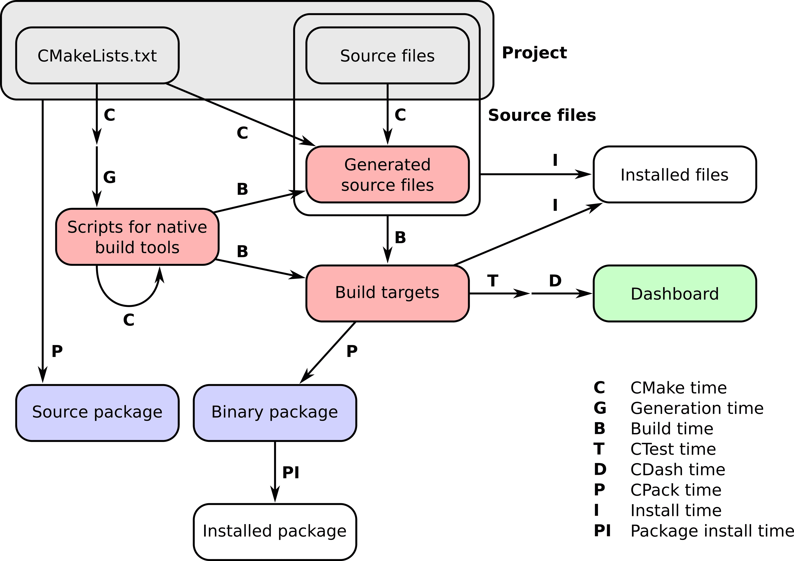

# 第十二章：打包项目

在本章中，我们将涵盖以下食谱：

+   生成源代码和二进制包

+   通过 PyPI 分发使用 CMake/pybind11 构建的 C++/Python 项目

+   通过 PyPI 分发使用 CMake/CFFI 构建的 C/Fortran/Python 项目

+   将简单项目作为 Conda 包分发

+   将具有依赖项的项目作为 Conda 包分发

# 引言

到目前为止，我们已经从源代码编译并安装（示例）软件包——这意味着通过 Git 获取项目，并手动执行配置、构建、测试和安装步骤。然而，在实践中，软件包通常使用包管理器（如 Apt、DNF、Pacman、pip 和 Conda）进行安装。我们需要能够以各种格式分发我们的代码项目：作为源代码存档或作为二进制安装程序。

这就是我们在熟悉的 CMake 项目使用方案中提到的打包时间，显示了项目的各个阶段：



在本章中，我们将探讨不同的打包策略。我们将首先讨论使用 CMake 家族中的工具 CPack 进行打包。我们还将提供将 CMake 项目打包并上传到 Python Package Index（PyPI，[`pypi.org`](https://pypi.org））和 Anaconda Cloud（[https://anaconda.org](https://anaconda.org)）的食谱——这些都是通过包管理器 pip 和 Conda（[`conda.io/docs/`](https://conda.io/docs/））分发包的标准且流行的平台。对于 PyPI，我们将演示如何打包和分发混合 C++/Python 或 C/Fortran/Python 项目。对于 Conda，我们将展示如何打包依赖于其他库的 C++项目。

# 生成源代码和二进制包

本食谱的代码可在[https://github.com/dev-cafe/cmake-cookbook/tree/v1.0/chapter-11/recipe-01](https://github.com/dev-cafe/cmake-cookbook/tree/v1.0/chapter-11/recipe-01)找到。该食谱适用于 CMake 版本 3.6（及以上），并在 GNU/Linux、macOS 和 Windows 上进行了测试。

如果您的代码是开源的，用户将期望能够下载您项目的源代码，并使用您精心定制的 CMake 脚本自行构建。当然，打包操作可以用脚本完成，但 CPack 提供了更紧凑和便携的替代方案。本食谱将指导您创建多种打包替代方案：

+   **源代码存档**：您可以使用这些格式直接将源代码作为您喜欢的格式的压缩存档发货。您的用户不必担心您的特定版本控制系统。

+   **二进制存档**：使用这些格式将新构建的目标打包成您喜欢的格式的压缩存档。这些可能非常有用，但可能不足以分发库和可执行文件。

+   **平台原生二进制安装程序**：CPack 能够生成多种不同格式的二进制安装程序，因此您可以将软件分发目标定位到许多不同的平台。特别是，我们将展示如何生成安装程序：

    +   以`.deb`格式为 Debian 基础的 GNU/Linux 发行版：[`manpages.debian.org/unstable/dpkg-dev/deb.5.en.html`](https://manpages.debian.org/unstable/dpkg-dev/deb.5.en.html)

    +   以`.rpm`格式为 Red Hat 基础的 GNU/Linux 发行版：[`rpm.org/`](http://rpm.org/)

    +   以`.dmg`格式为 macOS 捆绑包：[`developer.apple.com/library/archive/documentation/CoreFoundation/Conceptual/CFBundles/BundleTypes/BundleTypes.html`](https://developer.apple.com/library/archive/documentation/CoreFoundation/Conceptual/CFBundles/BundleTypes/BundleTypes.html)

    +   以 NSIS 格式为 Windows：[`nsis.sourceforge.net/Main_Page`](http://nsis.sourceforge.net/Main_Page)

# 准备工作

我们将使用第十章[72e949cc-6881-4be1-9710-9ac706c14a4d.xhtml]中介绍的`message`库的源代码，*编写安装程序*，第 3 个配方，*导出目标*。项目树由以下目录和文件组成：

```cpp
.
├── cmake
│   ├── coffee.icns
│   ├── Info.plist.in
│   └── messageConfig.cmake.in
├── CMakeCPack.cmake
├── CMakeLists.txt
├── INSTALL.md
├── LICENSE
├── src
│   ├── CMakeLists.txt
│   ├── hello-world.cpp
│   ├── Message.cpp
│   └── Message.hpp
└── tests
    ├── CMakeLists.txt
    └── use_target
        ├── CMakeLists.txt
        └── use_message.cpp
```

由于本配方的重点将是有效使用 CPack，我们将不对源代码本身进行评论。我们只会在`CMakeCPack.cmake`中添加打包指令，我们将在稍后讨论。此外，我们添加了`INSTALL.md`和一个`LICENSE`文件：它们包含项目安装说明和许可证，并且是打包指令所必需的。

# 如何操作

让我们看看需要添加到此项目的打包指令。我们将它们收集在`CMakeCPack.cmake`中，该文件在`CMakeLists.txt`的末尾使用`include(CMakeCPack.cmake)`包含：

1.  我们声明包的名称。这与项目名称相同，因此我们使用`PROJECT_NAME` CMake 变量：

```cpp
set(CPACK_PACKAGE_NAME "${PROJECT_NAME}")
```

1.  我们声明了包的供应商：

```cpp
set(CPACK_PACKAGE_VENDOR "CMake Cookbook")
```

1.  打包的源代码将包括一个描述文件。这是包含安装说明的纯文本文件：

```cpp
set(CPACK_PACKAGE_DESCRIPTION_FILE "${PROJECT_SOURCE_DIR}/INSTALL.md")
```

1.  我们还添加了包的简要概述：

```cpp
set(CPACK_PACKAGE_DESCRIPTION_SUMMARY "message: a small messaging library")
```

1.  许可证文件也将包含在包中：

```cpp
set(CPACK_RESOURCE_FILE_LICENSE "${PROJECT_SOURCE_DIR}/LICENSE")
```

1.  从分发的包中安装时，文件将被放置在`/opt/recipe-01`目录中：

```cpp
set(CPACK_PACKAGING_INSTALL_PREFIX "/opt/${PROJECT_NAME}")
```

1.  包的主版本、次版本和补丁版本设置为 CPack 的变量：

```cpp
set(CPACK_PACKAGE_VERSION_MAJOR "${PROJECT_VERSION_MAJOR}")
set(CPACK_PACKAGE_VERSION_MINOR "${PROJECT_VERSION_MINOR}")
set(CPACK_PACKAGE_VERSION_PATCH "${PROJECT_VERSION_PATCH}")
```

1.  我们设置了一组文件和目录，以在打包操作期间忽略：

```cpp
set(CPACK_SOURCE_IGNORE_FILES "${PROJECT_BINARY_DIR};/.git/;.gitignore")
```

1.  我们列出了源代码存档的打包生成器——在我们的例子中是`ZIP`，用于生成`.zip`存档，以及`TGZ`，用于`.tar.gz`存档。

```cpp
set(CPACK_SOURCE_GENERATOR "ZIP;TGZ")
```

1.  我们还列出了二进制存档生成器：

```cpp
set(CPACK_GENERATOR "ZIP;TGZ")
```

1.  我们现在还声明了平台原生的二进制安装程序，从 DEB 和 RPM 包生成器开始，仅适用于 GNU/Linux：

```cpp
if(UNIX)
  if(CMAKE_SYSTEM_NAME MATCHES Linux)
    list(APPEND CPACK_GENERATOR "DEB")
    set(CPACK_DEBIAN_PACKAGE_MAINTAINER "robertodr")
    set(CPACK_DEBIAN_PACKAGE_SECTION "devel")
    set(CPACK_DEBIAN_PACKAGE_DEPENDS "uuid-dev")

    list(APPEND CPACK_GENERATOR "RPM")
    set(CPACK_RPM_PACKAGE_RELEASE "1")
    set(CPACK_RPM_PACKAGE_LICENSE "MIT")
    set(CPACK_RPM_PACKAGE_REQUIRES "uuid-devel")
  endif()
endif()
```

1.  如果我们使用的是 Windows，我们将希望生成一个 NSIS 安装程序：

```cpp
if(WIN32 OR MINGW)
  list(APPEND CPACK_GENERATOR "NSIS")
  set(CPACK_NSIS_PACKAGE_NAME "message")
  set(CPACK_NSIS_CONTACT "robertdr")
  set(CPACK_NSIS_ENABLE_UNINSTALL_BEFORE_INSTALL ON)
endif()
```

1.  另一方面，在 macOS 上，捆绑包是我们的首选安装程序：

```cpp
if(APPLE)
  list(APPEND CPACK_GENERATOR "Bundle")
  set(CPACK_BUNDLE_NAME "message")
  configure_file(${PROJECT_SOURCE_DIR}/cmake/Info.plist.in Info.plist @ONLY)
  set(CPACK_BUNDLE_PLIST ${CMAKE_CURRENT_BINARY_DIR}/Info.plist)
  set(CPACK_BUNDLE_ICON ${PROJECT_SOURCE_DIR}/cmake/coffee.icns)
endif()
```

1.  我们向用户打印有关当前系统上可用的包装生成器的信息性消息：

```cpp
message(STATUS "CPack generators: ${CPACK_GENERATOR}")
```

1.  最后，我们包含了`CPack.cmake`标准模块。这将向构建系统添加一个`package`和一个`package_source`目标：

```cpp
include(CPack)
```

我们现在可以像往常一样配置项目：

```cpp
$ mkdir -p build
$ cd build
$ cmake ..
```

使用以下命令，我们可以列出可用的目标（示例输出是在使用 Unix Makefiles 作为生成器的 GNU/Linux 系统上获得的）：

```cpp
$ cmake --build . --target help

The following are some of the valid targets for this Makefile:
... all (the default if no target is provided)
... clean
... depend
... install/strip
... install
... package_source
... package
... install/local
... test
... list_install_components
... edit_cache
... rebuild_cache
... hello-world
... message
```

我们可以看到`package`和`package_source`目标可用。源包可以通过以下命令生成：

```cpp
$ cmake --build . --target package_source

Run CPack packaging tool for source...
CPack: Create package using ZIP
CPack: Install projects
CPack: - Install directory: /home/user/cmake-cookbook/chapter-11/recipe-01/cxx-example
CPack: Create package
CPack: - package: /home/user/cmake-cookbook/chapter-11/recipe-01/cxx-example/build/recipe-01-1.0.0-Source.zip generated.
CPack: Create package using TGZ
CPack: Install projects
CPack: - Install directory: /home/user/cmake-cookbook/chapter-11/recipe-01/cxx-example
CPack: Create package
CPack: - package: /home/user/cmake-cookbook/chapter-11/recipe-01/cxx-example/build/recipe-01-1.0.0-Source.tar.gz generated.
```

同样，我们可以构建二进制包：

```cpp
$ cmake --build . --target package
```

在我们的例子中，我们获得了以下二进制包列表：

```cpp
message-1.0.0-Linux.deb
message-1.0.0-Linux.rpm
message-1.0.0-Linux.tar.gz
message-1.0.0-Linux.zip
```

# 工作原理

CPack 可以用来生成许多不同类型的包用于分发。在生成构建系统时，我们在`CMakeCPack.cmake`中列出的 CPack 指令用于在构建目录中生成一个`CPackConfig.cmake`文件。当运行 CMake 命令为`package`或`package_source`目标时，CPack 会自动使用自动生成的配置文件作为参数调用。确实，这两个新目标只是简单地包装了对 CPack 的调用。就像 CMake 一样，CPack 也有生成器的概念。在 CMake 的上下文中，生成器是用于生成原生构建脚本的工具，例如 Unix Makefiles 或 Visual Studio 项目文件，而在 CPack 的上下文中，这些是用于打包的工具。我们列出了这些，特别注意不同的平台，使用`CPACK_SOURCE_GENERATOR`和`CPACK_GENERATOR`变量为源和二进制包。因此，Debian 打包工具将被调用用于`DEB`包生成器，而在给定平台上适当的存档工具将被调用用于`TGZ`生成器。我们可以直接从`build`目录调用 CPack，并使用`-G`命令行选项选择要使用的生成器。RPM 包可以通过以下方式生成：

```cpp
$ cd build
$ cpack -G RPM

CPack: Create package using RPM
CPack: Install projects
CPack: - Run preinstall target for: recipe-01
CPack: - Install project: recipe-01
CPack: Create package
CPackRPM: Will use GENERATED spec file: /home/user/cmake-cookbook/chapter-11/recipe-01/cxx-example/build/_CPack_Packages/Linux/RPM/SPECS/recipe-01.spec
CPack: - package: /home/user/cmake-cookbook/chapter-11/recipe-01/cxx-example/build/recipe-01-1.0.0-Linux.rpm generated.
```

对于任何分发，无论是源还是二进制，我们只需要打包最终用户严格需要的那些内容，因此整个构建目录和与版本控制相关的任何其他文件都必须从要打包的文件列表中排除。在我们的示例中，排除列表是通过以下命令声明的：

```cpp
set(CPACK_SOURCE_IGNORE_FILES "${PROJECT_BINARY_DIR};/.git/;.gitignore")
```

我们还需要指定有关我们包的基本信息，例如名称、简短描述和版本。这些信息是通过 CMake 变量设置的，然后在包含相应的模块时传递给 CPack。

自 CMake 3.9 起，`project()`命令接受一个`DESCRIPTION`字段，其中包含对项目的简短描述。CMake 将设置一个`PROJECT_DESCRIPTION`，可以用来设置`CPACK_PACKAGE_DESCRIPTION_SUMMARY`。

让我们详细看看我们为示例项目可以生成的不同类型的包的说明。

# 源代码存档

在我们的示例中，我们决定为源归档使用`TGZ`和`ZIP`生成器。这将分别产生`.tar.gz`和`.zip`归档文件。我们可以检查生成的`.tar.gz`文件的内容：

```cpp
$ tar tzf recipe-01-1.0.0-Source.tar.gz

recipe-01-1.0.0-Source/opt/
recipe-01-1.0.0-Source/opt/recipe-01/
recipe-01-1.0.0-Source/opt/recipe-01/cmake/
recipe-01-1.0.0-Source/opt/recipe-01/cmake/coffee.icns
recipe-01-1.0.0-Source/opt/recipe-01/cmake/Info.plist.in
recipe-01-1.0.0-Source/opt/recipe-01/cmake/messageConfig.cmake.in
recipe-01-1.0.0-Source/opt/recipe-01/CMakeLists.txt
recipe-01-1.0.0-Source/opt/recipe-01/src/
recipe-01-1.0.0-Source/opt/recipe-01/src/Message.hpp
recipe-01-1.0.0-Source/opt/recipe-01/src/CMakeLists.txt
recipe-01-1.0.0-Source/opt/recipe-01/src/Message.cpp
recipe-01-1.0.0-Source/opt/recipe-01/src/hello-world.cpp
recipe-01-1.0.0-Source/opt/recipe-01/LICENSE
recipe-01-1.0.0-Source/opt/recipe-01/tests/
recipe-01-1.0.0-Source/opt/recipe-01/tests/CMakeLists.txt
recipe-01-1.0.0-Source/opt/recipe-01/tests/use_target/
recipe-01-1.0.0-Source/opt/recipe-01/tests/use_target/CMakeLists.txt
recipe-01-1.0.0-Source/opt/recipe-01/tests/use_target/use_message.cpp
recipe-01-1.0.0-Source/opt/recipe-01/INSTALL.md
```

正如预期的那样，只有源树的内容被包括在内。注意，`INSTALL.md`和`LICENSE`文件也被包括在内，这是通过`CPACK_PACKAGE_DESCRIPTION_FILE`和`CPACK_RESOURCE_FILE_LICENSE`变量指定的。

`package_source`目标不被 Visual Studio 系列的生成器理解：[`gitlab.kitware.com/cmake/cmake/issues/13058`](https://gitlab.kitware.com/cmake/cmake/issues/13058)。

# 二进制归档文件

在创建二进制归档文件时，CPack 将根据我们的`CMakeCPack.cmake`文件中描述的安装说明，将目标的内容打包。因此，在我们的示例中，hello-world 可执行文件、消息共享库以及相应的头文件都将被打包在`.tar.gz`和`.zip`格式中。此外，CMake 配置文件也将被打包。这对于需要链接到我们库的其他项目非常有用。在包中使用的安装前缀可能与从构建树安装项目时使用的前缀不同。可以使用`CPACK_PACKAGING_INSTALL_PREFIX`变量来实现这一点。在我们的示例中，我们将其设置为系统上的特定位置：`/opt/recipe-01`。

我们可以分析生成的`.tar.gz`归档文件的内容：

```cpp
$ tar tzf recipe-01-1.0.0-Linux.tar.gz

recipe-01-1.0.0-Linux/opt/
recipe-01-1.0.0-Linux/opt/recipe-01/
recipe-01-1.0.0-Linux/opt/recipe-01/bin/
recipe-01-1.0.0-Linux/opt/recipe-01/bin/hello-world
recipe-01-1.0.0-Linux/opt/recipe-01/share/
recipe-01-1.0.0-Linux/opt/recipe-01/share/cmake/
recipe-01-1.0.0-Linux/opt/recipe-01/share/cmake/recipe-01/
recipe-01-1.0.0-Linux/opt/recipe-01/share/cmake/recipe-01/messageConfig.cmake
recipe-01-1.0.0-Linux/opt/recipe-01/share/cmake/recipe-01/messageTargets-hello-world.cmake
recipe-01-1.0.0-Linux/opt/recipe-01/share/cmake/recipe-01/messageConfigVersion.cmake
recipe-01-1.0.0-Linux/opt/recipe-01/share/cmake/recipe-01/messageTargets-hello-world-release.cmake
recipe-01-1.0.0-Linux/opt/recipe-01/share/cmake/recipe-01/messageTargets-release.cmake
recipe-01-1.0.0-Linux/opt/recipe-01/share/cmake/recipe-01/messageTargets.cmake
recipe-01-1.0.0-Linux/opt/recipe-01/include/
recipe-01-1.0.0-Linux/opt/recipe-01/include/message/
recipe-01-1.0.0-Linux/opt/recipe-01/include/message/Message.hpp
recipe-01-1.0.0-Linux/opt/recipe-01/include/message/messageExport.h
recipe-01-1.0.0-Linux/opt/recipe-01/lib64/
recipe-01-1.0.0-Linux/opt/recipe-01/lib64/libmessage.so
recipe-01-1.0.0-Linux/opt/recipe-01/lib64/libmessage.so.1
```

# 平台原生二进制安装程序

我们预计每个平台原生二进制安装程序的配置会有所不同。这些差异可以在一个`CMakeCPack.cmake`中通过 CPack 进行管理，正如我们在示例中所做的那样。

对于 GNU/Linux，该节配置了`DEB`和`RPM`生成器：

```cpp
if(UNIX)
  if(CMAKE_SYSTEM_NAME MATCHES Linux)
    list(APPEND CPACK_GENERATOR "DEB")
    set(CPACK_DEBIAN_PACKAGE_MAINTAINER "robertodr")
    set(CPACK_DEBIAN_PACKAGE_SECTION "devel")
    set(CPACK_DEBIAN_PACKAGE_DEPENDS "uuid-dev")

    list(APPEND CPACK_GENERATOR "RPM")
    set(CPACK_RPM_PACKAGE_RELEASE "1")
    set(CPACK_RPM_PACKAGE_LICENSE "MIT")
    set(CPACK_RPM_PACKAGE_REQUIRES "uuid-devel")
  endif()
endif()
```

我们的示例依赖于 UUID 库，`CPACK_DEBIAN_PACKAGE_DEPENDS`和`CPACK_RPM_PACKAGE_REQUIRES`选项允许我们在我们的包和其他数据库中的包之间指定依赖关系。我们可以使用`dpkg`和`rpm`程序分别分析生成的`.deb`和`.rpm`包的内容。

请注意，`CPACK_PACKAGING_INSTALL_PREFIX`也会影响这些包生成器：我们的包将被安装到`/opt/recipe-01`。

CMake 确实提供了对跨平台和便携式构建系统的支持。以下节将使用 Nullsoft Scriptable Install System（NSIS）创建一个安装程序：

```cpp
if(WIN32 OR MINGW)
  list(APPEND CPACK_GENERATOR "NSIS")
  set(CPACK_NSIS_PACKAGE_NAME "message")
  set(CPACK_NSIS_CONTACT "robertdr")
  set(CPACK_NSIS_ENABLE_UNINSTALL_BEFORE_INSTALL ON)
endif()
```

最后，如果我们正在 macOS 上构建项目，以下节将启用 Bundle 打包器：

```cpp
if(APPLE)
  list(APPEND CPACK_GENERATOR "Bundle")
  set(CPACK_BUNDLE_NAME "message")
  configure_file(${PROJECT_SOURCE_DIR}/cmake/Info.plist.in Info.plist @ONLY)
  set(CPACK_BUNDLE_PLIST ${CMAKE_CURRENT_BINARY_DIR}/Info.plist)
  set(CPACK_BUNDLE_ICON ${PROJECT_SOURCE_DIR}/cmake/coffee.icns)
endif()
```

在 macOS 示例中，我们首先需要为包配置一个属性列表文件，这可以通过`configure_file`命令实现。然后，`Info.plist`的位置和包的图标被设置为 CPack 的变量。

你可以在这里阅读更多关于属性列表格式的信息：[`en.wikipedia.org/wiki/Property_list`](https://en.wikipedia.org/wiki/Property_list)。

# 还有更多

我们没有像之前为了简化而将 CPack 配置设置列在`CMakeCPack.cmake`中，而是可以将`CPACK_*`变量的每个生成器设置放在一个单独的文件中，例如`CMakeCPackOptions.cmake`，并使用`set(CPACK_PROJECT_CONFIG_FILE "${PROJECT_SOURCE_DIR}/CMakeCPackOptions.cmake")`将这些设置包含到`CMakeCPack.cmake`中。这个文件也可以在 CMake 时配置，然后在 CPack 时包含，提供了一种干净的方式来配置多格式包生成器（另请参见：[`cmake.org/cmake/help/v3.6/module/CPack.html`](https://cmake.org/cmake/help/v3.6/module/CPack.html)）。

与 CMake 家族中的所有工具一样，CPack 功能强大且多才多艺，提供了比本食谱中展示的更多的灵活性和选项。感兴趣的读者应阅读 CPack 的官方文档，了解命令行界面的详细信息（[`cmake.org/cmake/help/v3.6/manual/cpack.1.html`](https://github.com/dev-cafe/cmake-cookbook/tree/v1.0/chapter-11/recipe-01)）以及详细介绍 CPack 如何使用额外生成器打包项目的 man 页面（[`cmake.org/cmake/help/v3.6/module/CPack.html`](https://cmake.org/cmake/help/v3.6/module/CPack.html)）。

# 通过 PyPI 分发使用 CMake/pybind11 构建的 C++/Python 项目

本食谱的代码可在[`github.com/dev-cafe/cmake-cookbook/tree/v1.0/chapter-11/recipe-02`](https://github.com/dev-cafe/cmake-cookbook/tree/v1.0/chapter-11/recipe-02)找到。该食谱适用于 CMake 版本 3.11（及以上），并在 GNU/Linux、macOS 和 Windows 上进行了测试。

在本食谱中，我们将以第九章，*混合语言项目*，第 5 个食谱，*使用 pybind11 构建 C++和 Python 项目*中的 pybind11 示例为起点，添加相关的安装目标和 pip 打包信息，并将项目上传到 PyPI。我们的目标将是得到一个可以使用 pip 安装的项目，并在幕后运行 CMake 并获取 pybind11 依赖项。

# 准备就绪

要通过 PyPI 分发包，您需要在[`pypi.org`](https://pypi.org)上注册一个用户账户，但也可以先从本地路径进行安装练习。

我们还普遍建议使用 pip 安装此包和其他 Python 包，使用 Pipenv（[`docs.pipenv.org`](https://docs.pipenv.org/)）或虚拟环境（[`virtualenv.pypa.io/en/stable/`](https://virtualenv.pypa.io/en/stable/)）而不是安装到系统环境中。

我们的起点是来自第九章，*混合语言项目*，第 5 个食谱，*使用 pybind11 构建 C++和 Python 项目*的 pybind11 示例，其中包含一个顶级`CMakeLists.txt`文件和一个`account/CMakeLists.txt`文件，该文件配置了账户示例目标并使用以下项目树：

```cpp
.
├── account
│   ├── account.cpp
│   ├── account.hpp
│   ├── CMakeLists.txt
│   └── test.py
└── CMakeLists.txt
```

在这个配方中，我们将保持`account.cpp`，`account.hpp`和`test.py`脚本不变。我们将修改`account/CMakeLists.txt`并添加一些文件，以便 pip 能够构建和安装包。为此，我们需要在根目录中添加三个额外的文件：`README.rst`，`MANIFEST.in`和`setup.py`。

`README.rst`包含有关项目的文档：

```cpp
Example project
===============

Project description in here ...
```

`MANIFEST.in`列出了应与 Python 模块和包一起安装的文件：

```cpp
include README.rst CMakeLists.txt
recursive-include account *.cpp *.hpp CMakeLists.txt
```

最后，`setup.py`包含构建和安装项目的指令：

```cpp
import distutils.command.build as _build
import os
import sys
from distutils import spawn
from distutils.sysconfig import get_python_lib

from setuptools import setup

def extend_build():
    class build(_build.build):
        def run(self):
            cwd = os.getcwd()
            if spawn.find_executable('cmake') is None:
                sys.stderr.write("CMake is required to build this package.\n")
                sys.exit(-1)
            _source_dir = os.path.split(__file__)[0]
            _build_dir = os.path.join(_source_dir, 'build_setup_py')
            _prefix = get_python_lib()
            try:
                cmake_configure_command = [
                    'cmake',
                    '-H{0}'.format(_source_dir),
                    '-B{0}'.format(_build_dir),
                    '-DCMAKE_INSTALL_PREFIX={0}'.format(_prefix),
                ]
                _generator = os.getenv('CMAKE_GENERATOR')
                if _generator is not None:
                    cmake_configure_command.append('-
G{0}'.format(_generator))
                spawn.spawn(cmake_configure_command)
                spawn.spawn(
                    ['cmake', '--build', _build_dir, '--target', 'install'])
                os.chdir(cwd)
            except spawn.DistutilsExecError:
                sys.stderr.write("Error while building with CMake\n")
                sys.exit(-1)
            _build.build.run(self)

    return build

_here = os.path.abspath(os.path.dirname(__file__))

if sys.version_info[0] < 3:
    with open(os.path.join(_here, 'README.rst')) as f:
        long_description = f.read()
else:
    with open(os.path.join(_here, 'README.rst'), encoding='utf-8') as f:
        long_description = f.read()

_this_package = 'account'

version = {}
with open(os.path.join(_here, _this_package, 'version.py')) as f:
    exec(f.read(), version)

setup(
    name=_this_package,
    version=version['__version__'],
    description='Description in here.',
    long_description=long_description,
    author='Bruce Wayne',
    author_email='bruce.wayne@example.com',
    url='http://example.com',
    license='MIT',
    packages=[_this_package],
    include_package_data=True,
    classifiers=[
        'Development Status :: 3 - Alpha',
        'Intended Audience :: Science/Research',
        'Programming Language :: Python :: 2.7',
        'Programming Language :: Python :: 3.6'
    ],
    cmdclass={'build': extend_build()})
```

我们将把`__init__.py`放入`account`子目录中：

```cpp
from .version import __version__
from .account import Account

__all__ = [
    '__version__',
    'Account',
]
```

我们还将把`version.py`放入`account`子目录中：

```cpp
__version__ = '0.0.0'
```

这意味着我们的项目将具有以下文件结构：

```cpp
.
├── account
│   ├── account.cpp
│   ├── account.hpp
│   ├── CMakeLists.txt
│   ├── __init__.py
│   ├── test.py
│   └── version.py
├── CMakeLists.txt
├── MANIFEST.in
├── README.rst
└── setup.py
```

# 如何做到这一点

这个配方建立在第九章，*混合语言项目*，配方 5，*使用 pybind11 构建 C++和 Python 项目*的基础上。让我们详细看看：

首先，我们扩展`account/CMakeLists.txt`。唯一的添加是最后一个指令，它指定了安装目标：

```cpp
install(
  TARGETS
    account
  LIBRARY
    DESTINATION account
  )
```

就是这样！有了安装目标和`README.rst`，`MANIFEST.in`，`setup.py`，`__init__.py`和`version.py`文件，我们就可以测试使用 pybind11 接口的示例代码的安装了：

1.  为此，在你的计算机上创建一个新的目录，我们将在那里测试安装。

1.  在新创建的目录中，我们从本地路径运行`pipenv install`。调整本地路径以指向包含`setup.py`脚本的目录：

```cpp
$ pipenv install /path/to/cxx-example
```

1.  现在我们在 Pipenv 环境中启动一个 Python shell：

```cpp
$ pipenv run python
```

1.  在 Python shell 中，我们可以测试我们的 CMake 包：

```cpp
>>> from account import Account
>>> account1 = Account()
>>> account1.deposit(100.0)
>>> account1.deposit(100.0)
>>> account1.withdraw(50.0)
>>> print(account1.get_balance())
150.0
```

# 它是如何工作的

`${CMAKE_CURRENT_BINARY_DIR}`目录包含使用 pybind11 编译的`account.cpython-36m-x86_64-linux-gnu.so`Python 模块，但请注意，其名称取决于操作系统（在这种情况下，64 位 Linux）和 Python 环境（在这种情况下，Python 3.6）。`setup.py`脚本将在后台运行 CMake，并将 Python 模块安装到正确的路径，具体取决于所选的 Python 环境（系统 Python 或 Pipenv 或虚拟环境）。但现在我们在安装模块时面临两个挑战：

+   命名可能会改变。

+   路径是在 CMake 之外设置的。

我们可以通过使用以下安装目标来解决这个问题，其中`setup.py`将定义安装目标位置：

```cpp
install(
  TARGETS
    account
  LIBRARY
    DESTINATION account
  )
```

在这里，我们指导 CMake 将编译后的 Python 模块文件安装到相对于安装目标位置的`account`子目录中（第十章，*编写安装程序*，详细讨论了如何设置目标位置）。后者将由`setup.py`通过定义`CMAKE_INSTALL_PREFIX`指向正确的路径，这取决于 Python 环境。

现在让我们检查一下我们是如何在`setup.py`中实现这一点的；我们将从脚本的底部开始：

```cpp
setup(
    name=_this_package,
    version=version['__version__'],
    description='Description in here.',
    long_description=long_description,
    author='Bruce Wayne',
    author_email='bruce.wayne@example.com',
    url='http://example.com',
    license='MIT',
    packages=[_this_package],
    include_package_data=True,
    classifiers=[
        'Development Status :: 3 - Alpha',
        'Intended Audience :: Science/Research',
        'Programming Language :: Python :: 2.7',
        'Programming Language :: Python :: 3.6'
    ],
    cmdclass={'build': extend_build()})
```

脚本包含多个占位符和希望自我解释的指令，但我们将重点关注最后一个指令`cmdclass`，在这里我们通过一个自定义函数扩展默认的构建步骤，我们称之为`extend_build`。这个函数是默认构建步骤的子类：

```cpp
def extend_build():
    class build(_build.build):
        def run(self):
            cwd = os.getcwd()
            if spawn.find_executable('cmake') is None:
                sys.stderr.write("CMake is required to build this package.\n")
                sys.exit(-1)
            _source_dir = os.path.split(__file__)[0]
            _build_dir = os.path.join(_source_dir, 'build_setup_py')
            _prefix = get_python_lib()
            try:
                cmake_configure_command = [
                    'cmake',
                    '-H{0}'.format(_source_dir),
                    '-B{0}'.format(_build_dir),
                    '-DCMAKE_INSTALL_PREFIX={0}'.format(_prefix),
                ]
                _generator = os.getenv('CMAKE_GENERATOR')
                if _generator is not None:
                    cmake_configure_command.append('-G{0}'.format(_generator))
                spawn.spawn(cmake_configure_command)
                spawn.spawn(
                    ['cmake', '--build', _build_dir, '--target', 'install'])
                os.chdir(cwd)
            except spawn.DistutilsExecError:
                sys.stderr.write("Error while building with CMake\n")
                sys.exit(-1)
            _build.build.run(self)

    return build
```

首先，该函数检查系统上是否安装了 CMake。函数的核心执行两个 CMake 命令：

```cpp
cmake_configure_command = [
    'cmake',
    '-H{0}'.format(_source_dir),
    '-B{0}'.format(_build_dir),
    '-DCMAKE_INSTALL_PREFIX={0}'.format(_prefix),
]
_generator = os.getenv('CMAKE_GENERATOR')
if _generator is not None:
    cmake_configure_command.append('-G{0}'.format(_generator))
spawn.spawn(cmake_configure_command)
spawn.spawn(
    ['cmake', '--build', _build_dir, '--target', 'install'])
```

在这里，我们可以通过设置`CMAKE_GENERATOR`环境变量来更改默认的生成器。安装前缀定义如下：

```cpp
_prefix = get_python_lib()
```

`distutils.sysconfig`导入的`get_python_lib`函数提供了安装前缀的根目录。`cmake --build _build_dir --target install`命令以可移植的方式一步构建并安装我们的项目。我们使用名称`_build_dir`而不是简单的`build`的原因是，在测试本地安装时，您的项目可能已经包含一个`build`目录，这会与新安装发生冲突。对于已经上传到 PyPI 的包，构建目录的名称并不重要。

# 还有更多内容。

现在我们已经测试了本地安装，我们准备将包上传到 PyPI。但是，在这样做之前，请确保`setup.py`中的元数据（如项目名称、联系信息和许可证信息）是合理的，并且项目名称在 PyPI 上尚未被占用。在将包上传到[`pypi.org`](https://pypi.org)之前，先测试上传到 PyPI 测试实例[`test.pypi.org`](https://test.pypi.org)并下载，这是一个良好的实践。

在上传之前，我们需要在主目录中创建一个名为`.pypirc`的文件，其中包含（替换`yourusername`和`yourpassword`）：

```cpp
[distutils]account
index-servers=
    pypi
    pypitest

[pypi]
username = yourusername
password = yourpassword

[pypitest]
repository = https://test.pypi.org/legacy/
username = yourusername
password = yourpassword
```

我们将分两步进行。首先，我们在本地创建分发：

```cpp
$ python setup.py sdist
```

在第二步中，我们使用 Twine（我们将其安装到本地 Pipenv 中）上传生成的分发数据：

```cpp
$ pipenv run twine upload dist/* -r pypitest

Uploading distributions to https://test.pypi.org/legacy/
Uploading yourpackage-0.0.0.tar.gz
```

接下来，尝试从测试实例安装到一个隔离的环境中：

```cpp
$ pipenv shell
$ pip install --index-url https://test.pypi.org/simple/ yourpackage
```

一旦这个工作正常，我们就可以准备上传到生产 PyPI 了：

```cpp
$ pipenv run twine upload dist/* -r pypi
```

# 通过 PyPI 分发使用 CMake/CFFI 构建的 C/Fortran/Python 项目

本食谱的代码可在[`github.com/dev-cafe/cmake-cookbook/tree/v1.0/chapter-11/recipe-03`](https://github.com/dev-cafe/cmake-cookbook/tree/v1.0/chapter-11/recipe-03)找到，并包含 C++和 Fortran 示例。该食谱适用于 CMake 版本 3.5（及以上），并在 GNU/Linux、macOS 和 Windows 上进行了测试。

这个配方是之前的配方和第九章，*混合语言项目，*配方 6，*使用 Python CFFI 混合 C、C++、Fortran 和 Python*的混合体。我们将重用之前配方的许多构建块，但不是使用 pybind11，而是使用 Python CFFI 来提供 Python 接口。在这个配方中，我们的目标是通过 PyPI 共享一个 Fortran 项目，但它同样可以是 C 或 C++项目，或者任何暴露 C 接口的语言项目。

# 准备工作

我们将从以下文件树开始：

```cpp
.
├── account
│   ├── account.h
│   ├── CMakeLists.txt
│   ├── implementation
│   │   └── fortran_implementation.f90
│   ├── __init__.py
│   ├── interface_file_names.cfg.in
│   ├── test.py
│   └── version.py
├── CMakeLists.txt
├── MANIFEST.in
├── README.rst
└── setup.py
```

顶级的`CMakeLists.txt`文件和`account`下的所有源文件，除了`account/CMakeLists.txt`，与第九章，*混合语言项目*，配方 6，*使用 Python CFFI 混合 C、C++、Fortran 和 Python*中出现的方式相同。我们很快会讨论需要应用到`account/CMakeLists.txt`的小改动。`README.rst`文件与之前的配方相同。`setup.py`脚本与之前的配方相比包含一条额外的行（包含`install_requires=['cffi']`的行）：

```cpp
# ... up to this line the script is unchanged

setup(
    name=_this_package,
    version=version['__version__'],
    description='Description in here.',
    long_description=long_description,
    author='Bruce Wayne',
    author_email='bruce.wayne@example.com',
    url='http://example.com',
    license='MIT',
    packages=[_this_package],
    install_requires=['cffi'],
    include_package_data=True,
    classifiers=[
        'Development Status :: 3 - Alpha',
        'Intended Audience :: Science/Research',
        'Programming Language :: Python :: 2.7',
        'Programming Language :: Python :: 3.6'
    ],
    cmdclass={'build': extend_build()})
```

`MANIFEST.in`列出了应与 Python 模块和包一起安装的文件，并包含以下内容：

```cpp
include README.rst CMakeLists.txt
recursive-include account *.h *.f90 CMakeLists.txt
```

在`account`子目录下，我们看到了两个新文件。同样，有一个`version.py`文件，它保存了`setup.py`的项目版本：

```cpp
__version__ = '0.0.0'
```

子目录还包含`interface_file_names.cfg.in`文件，我们很快就会讨论它：

```cpp
[configuration]
header_file_name = account.h
library_file_name = $<TARGET_FILE_NAME:account>
```

# 如何操作

让我们讨论实现打包所需的步骤：

1.  我们扩展了第九章，*混合语言项目*，配方 6，*使用 Python CFFI 混合 C、C++、Fortran 和 Python*中的`account/CMakeLists.txt`。唯一的添加指令如下：

```cpp
file(
  GENERATE OUTPUT ${CMAKE_CURRENT_BINARY_DIR}/interface_file_names.cfg
  INPUT ${CMAKE_CURRENT_SOURCE_DIR}/interface_file_names.cfg.in
  )

set_target_properties(account
  PROPERTIES
    PUBLIC_HEADER "account.h;${CMAKE_CURRENT_BINARY_DIR}/account_export.h"
    RESOURCE "${CMAKE_CURRENT_BINARY_DIR}/interface_file_names.cfg"
  )

install(
  TARGETS
    account
  LIBRARY
    DESTINATION account/lib
  RUNTIME
    DESTINATION account/lib
  PUBLIC_HEADER
    DESTINATION account/include
  RESOURCE
    DESTINATION account
  )
```

就这样！安装目标和附加文件就位后，我们就可以开始测试安装了。为此，在你的电脑上创建一个新的目录，我们将在那里进行安装测试。

1.  在新创建的目录中，我们从本地路径运行`pipenv install`。调整本地路径以指向包含`setup.py`脚本的目录：

```cpp
$ pipenv install /path/to/fortran-example
```

1.  现在我们在 Pipenv 环境中启动一个 Python shell：

```cpp
$ pipenv run python
```

1.  在 Python shell 中，我们可以测试我们的 CMake 包：

```cpp
>>> import account
>>> account1 = account.new()
>>> account.deposit(account1, 100.0)
>>> account.deposit(account1, 100.0)
>>> account.withdraw(account1, 50.0)
>>> print(account.get_balance(account1))
150.0
```

# 它是如何工作的

与第九章，*混合语言项目*，配方 6，*使用 Python CFFI 混合 C、C++、Fortran 和 Python*相比，使用 Python CFFI 和 CMake 安装混合语言项目的扩展包括两个额外步骤：

1.  我们需要`setup.py`层。

1.  我们安装目标，以便 CFFI 层所需的头文件和共享库文件根据所选 Python 环境安装在正确的路径中。

`setup.py`的结构与之前的食谱几乎相同，我们请您参考之前的食谱来讨论这个文件。唯一的增加是包含`install_requires=['cffi']`的行，以确保安装我们的示例包也会获取并安装所需的 Python CFFI。`setup.py`脚本将自动安装`__init__.py`和`version.py`，因为这些是从`setup.py`脚本引用的。`MANIFEST.in`稍作修改，以打包不仅包括`README.rst`和 CMake 文件，还包括头文件和 Fortran 源文件：

```cpp
include README.rst CMakeLists.txt
recursive-include account *.h *.f90 CMakeLists.txt
```

在本食谱中，我们将面临三个挑战，即打包使用 Python CFFI 和`setup.py`的 CMake 项目：

+   我们需要将`account.h`和`account_export.h`头文件以及共享库复制到依赖于 Python 环境的 Python 模块位置。

+   我们需要告诉`__init__.py`在哪里找到这些头文件和库。在第九章，*混合语言项目*，第 6 个食谱，*使用 Python CFFI 混合 C、C++、Fortran 和 Python*中，我们通过使用环境变量解决了这些问题，但每次我们计划使用 Python 模块时设置这些变量是不切实际的。

+   在 Python 方面，我们不知道共享库文件的确切名称（后缀），因为它取决于操作系统。

让我们从最后一点开始：我们不知道确切的名称，但在生成构建系统时 CMake 知道，因此我们在`interface_file_names.cfg.in`中使用生成器表达式来扩展占位符：

```cpp
[configuration]
header_file_name = account.h
library_file_name = $<TARGET_FILE_NAME:account>
```

此输入文件用于生成`${CMAKE_CURRENT_BINARY_DIR}/interface_file_names.cfg`：

```cpp
file(
  GENERATE OUTPUT ${CMAKE_CURRENT_BINARY_DIR}/interface_file_names.cfg
  INPUT ${CMAKE_CURRENT_SOURCE_DIR}/interface_file_names.cfg.in
  )
```

然后，我们将两个头文件定义为`PUBLIC_HEADER`（另请参见第十章，*编写安装程序*），并将配置文件定义为`RESOURCE`：

```cpp
set_target_properties(account
  PROPERTIES
    PUBLIC_HEADER "account.h;${CMAKE_CURRENT_BINARY_DIR}/account_export.h"
    RESOURCE "${CMAKE_CURRENT_BINARY_DIR}/interface_file_names.cfg"
  )
```

最后，我们将库、头文件和配置文件安装到一个相对于由`setup.py`定义的路径的结构中：

```cpp
install(
  TARGETS
    account
  LIBRARY
    DESTINATION account/lib
  RUNTIME
    DESTINATION account/lib
  PUBLIC_HEADER
    DESTINATION account/include
  RESOURCE
    DESTINATION account
  )
```

请注意，我们将`DESTINATION`设置为`LIBRARY`和`RUNTIME`，指向`account/lib`。这对于 Windows 来说很重要，因为共享库具有可执行入口点，因此我们必须同时指定两者。

Python 包将能够通过`account/__init__.py`中的这一部分找到这些文件：

```cpp
# this interface requires the header file and library file
# and these can be either provided by interface_file_names.cfg
# in the same path as this file
# or if this is not found then using environment variables
_this_path = Path(os.path.dirname(os.path.realpath(__file__)))
_cfg_file = _this_path / 'interface_file_names.cfg'
if _cfg_file.exists():
    config = ConfigParser()
    config.read(_cfg_file)
    header_file_name = config.get('configuration', 'header_file_name')
    _header_file = _this_path / 'include' / header_file_name
    _header_file = str(_header_file)
    library_file_name = config.get('configuration', 'library_file_name')
    _library_file = _this_path / 'lib' / library_file_name
    _library_file = str(_library_file)
else:
    _header_file = os.getenv('ACCOUNT_HEADER_FILE')
    assert _header_file is not None
    _library_file = os.getenv('ACCOUNT_LIBRARY_FILE')
    assert _library_file is not None
```

在这种情况下，`_cfg_file`将被找到并解析，`setup.py`将在`include`下找到头文件，在`lib`下找到库，并将这些传递给 CFFI 以构造库对象。这也是我们使用`lib`作为安装目标`DESTINATION`而不是`CMAKE_INSTALL_LIBDIR`的原因，否则可能会让`account/__init__.py`感到困惑。

# 还有更多

对于将包上传到 PyPI 测试和生产实例的后续步骤，我们请读者参考之前的食谱，因为这些步骤是类似的。

# 将一个简单项目作为 Conda 包分发

本节的代码可在[`github.com/dev-cafe/cmake-cookbook/tree/v1.0/chapter-11/recipe-04`](https://github.com/dev-cafe/cmake-cookbook/tree/v1.0/chapter-11/recipe-04)找到。本节适用于 CMake 版本 3.5（及更高版本），并在 GNU/Linux、macOS 和 Windows 上进行了测试。

尽管 PyPI 是分发 Python 包的标准且流行的平台，但 Anaconda（[`anaconda.org`](https://anaconda.org)）更为通用，因为它不仅允许分发带有 Python 接口的 Python 或混合语言项目，还允许为非 Python 项目进行打包和依赖管理。在本节中，我们将为使用 CMake 配置和构建的非常简单的 C++示例项目准备一个 Conda 包，该项目没有除 C++之外的其他依赖项。在下一节中，我们将准备并讨论一个更复杂的 Conda 包。

# 准备就绪

我们的目标将是打包以下简单的示例代码（`example.cpp`）：

```cpp
#include <iostream>

int main() {
  std::cout << "hello from your conda package!" << std::endl;

  return 0;
}
```

# 如何操作

以下是按步骤进行的方法：

1.  `CMakeLists.txt`文件以最小版本要求、项目名称和支持的语言开始：

```cpp
cmake_minimum_required(VERSION 3.5 FATAL_ERROR)

project(recipe-04 LANGUAGES CXX)

set(CMAKE_CXX_STANDARD 11)
set(CMAKE_CXX_EXTENSIONS OFF)
set(CMAKE_CXX_STANDARD_REQUIRED ON)
```

1.  我们希望构建`hello-conda`可执行文件，该文件由`example.cpp`构建：

```cpp
add_executable(hello-conda "")

target_sources(hello-conda
  PRIVATE
    example.cpp
  )
```

1.  我们通过定义安装目标来结束`CMakeLists.txt`：

```cpp
install(
  TARGETS
    hello-conda
  DESTINATION
    bin
  )
```

1.  我们将在名为`meta.yaml`的文件中描述 Conda 包，我们将把它放在`conda-recipe`下，以达到以下文件结构：

```cpp
.
├── CMakeLists.txt
├── conda-recipe
│   └── meta.yaml
└── example.cpp
```

1.  `meta.yaml`文件由以下内容组成：

```cpp
package:
  name: conda-example-simple
  version: "0.0.0"

source:
  path: ../ # this can be changed to git-url

build:
  number: 0
  binary_relocation: true
  script:
    - cmake -H. -Bbuild_conda -G "${CMAKE_GENERATOR}" -DCMAKE_INSTALL_PREFIX=${PREFIX} # [not win]
    - cmake -H. -Bbuild_conda -G "%CMAKE_GENERATOR%" -DCMAKE_INSTALL_PREFIX="%LIBRARY_PREFIX%" # [win]
    - cmake --build build_conda --target install

requirements:
  build:
    - cmake >=3.5
    - {{ compiler('cxx') }}

about:
  home: http://www.example.com
  license: MIT
  summary: "Summary in here ..."
```

1.  现在我们可以尝试构建包：

```cpp
$ conda build conda-recipe
```

1.  我们将在屏幕上看到大量输出，但一旦构建完成，我们就可以安装包。我们将首先进行本地安装：

```cpp
$ conda install --use-local conda-example-simple
```

1.  现在我们准备测试它——打开一个新的终端（假设已激活 Anaconda）并输入以下内容：

```cpp
$ hello-conda 
hello from your conda package!
```

1.  测试成功后，我们可以再次删除该包：

```cpp
$ conda remove conda-example-simple
```

# 工作原理

`CMakeLists.txt`中的安装目标是本节的关键组件：

```cpp
install(
  TARGETS
    hello-conda
  DESTINATION
    bin
  )
```

此目标确保二进制文件安装在`${CMAKE_INSTALL_PREFIX}/bin`中。前缀变量在`meta.yaml`的构建步骤中由 Conda 定义：

```cpp
build:
  number: 0
  binary_relocation: true
  script:
    - cmake -H. -Bbuild_conda -G "${CMAKE_GENERATOR}" 
-DCMAKE_INSTALL_PREFIX=${PREFIX} # [not win]
    - cmake -H. -Bbuild_conda -G "%CMAKE_GENERATOR%" 
-DCMAKE_INSTALL_PREFIX="%LIBRARY_PREFIX%" # [win]
    - cmake --build build_conda --target install
```

构建步骤配置项目，将安装前缀设置为`${PREFIX}`（由 Conda 设置的内在变量），构建并安装项目。将构建目录命名为`build_conda`的动机与前面的节类似：特定的构建目录名称使得更容易基于可能已经包含名为`build`的目录的目录进行本地安装实验。

通过将包安装到 Anaconda 环境中，我们使可执行文件对系统可用。

# 还有更多

配置文件`meta.yaml`可用于指定项目的构建、测试和安装步骤，原则上任何复杂度的项目都可以使用。请参考官方文档进行深入讨论：[`conda.io/docs/user-guide/tasks/build-packages/define-metadata.html`](https://conda.io/docs/user-guide/tasks/build-packages/define-metadata.html)。

要将 Conda 包上传到 Anaconda 云，请遵循 Anaconda 云官方文档：[`docs.anaconda.com/anaconda-cloud/user-guide/`](https://docs.anaconda.com/anaconda-cloud/user-guide/)。同时，可以考虑使用 Miniconda 作为 Anaconda 的轻量级替代品：[`conda.io/miniconda.html`](https://conda.io/miniconda.html)。

# 以 Conda 包形式分发具有依赖关系的项目

本食谱的代码可在[`github.com/dev-cafe/cmake-cookbook/tree/v1.0/chapter-11/recipe-05`](https://github.com/dev-cafe/cmake-cookbook/tree/v1.0/chapter-11/recipe-05)找到。该食谱适用于 CMake 版本 3.5（及以上），并在 GNU/Linux、macOS 和 Windows 上进行了测试。

在本食谱中，我们将基于前一个食谱的发现，为示例 CMake 项目准备一个更真实、更复杂的 Conda 包，该项目将依赖于并利用 Intel 数学内核库（MKL）中提供的 DGEMM 函数实现，用于矩阵乘法。Intel MKL 作为 Conda 包提供。本食谱将为我们提供准备和共享具有依赖关系的 Conda 包的工具集。

# 准备就绪

对于本食谱，我们将使用与前一个简单 Conda 食谱相同的文件命名和目录结构：

```cpp
.
├── CMakeLists.txt
├── conda-recipe
│   └── meta.yaml
└── example.cpp
```

示例源文件（`example.cpp`）执行矩阵乘法，并将 MKL 库返回的结果与“noddy”实现进行比较：

```cpp
#include "mkl.h"

#include <cassert>
#include <cmath>
#include <iostream>
#include <random>

int main() {
  // generate a uniform distribution of real number between -1.0 and 1.0
  std::random_device rd;
  std::mt19937 mt(rd());
  std::uniform_real_distribution<double> dist(-1.0, 1.0);

  int m = 500;
  int k = 1000;
  int n = 2000;

  double *A = (double *)mkl_malloc(m * k * sizeof(double), 64);
  double *B = (double *)mkl_malloc(k * n * sizeof(double), 64);
  double *C = (double *)mkl_malloc(m * n * sizeof(double), 64);
  double *D = new double[m * n];

  for (int i = 0; i < (m * k); i++) {
    A[i] = dist(mt);
  }

  for (int i = 0; i < (k * n); i++) {
    B[i] = dist(mt);
  }

  for (int i = 0; i < (m * n); i++) {
    C[i] = 0.0;
  }

  double alpha = 1.0;
  double beta = 0.0;
  cblas_dgemm(CblasRowMajor,
              CblasNoTrans,
              CblasNoTrans,
              m,
              n,
              k,
              alpha,
              A,
              k,
              B,
              n,
              beta,
              C,
              n);

  // D_mn = A_mk B_kn
  for (int r = 0; r < m; r++) {
    for (int c = 0; c < n; c++) {
      D[r * n + c] = 0.0;
      for (int i = 0; i < k; i++) {
        D[r * n + c] += A[r * k + i] * B[i * n + c];
      }
    }
  }

  // compare the two matrices
  double r = 0.0;
  for (int i = 0; i < (m * n); i++) {
    r += std::pow(C[i] - D[i], 2.0);
  }
  assert(r < 1.0e-12 && "ERROR: matrices C and D do not match");

  mkl_free(A);
  mkl_free(B);
  mkl_free(C);
  delete[] D;

  std::cout << "MKL DGEMM example worked!" << std::endl;

  return 0;
}
```

我们还需要一个修改过的`meta.yaml`。但是，与前一个食谱相比，唯一的更改是在需求下添加了`mkl-devel`依赖项的行：

```cpp
package:
  name: conda-example-dgemm
  version: "0.0.0"

source:
  path: ../ # this can be changed to git-url

build:
  number: 0
  script:
    - cmake -H. -Bbuild_conda -G "${CMAKE_GENERATOR}" 
-DCMAKE_INSTALL_PREFIX=${PREFIX} # [not win]
    - cmake -H. -Bbuild_conda -G "%CMAKE_GENERATOR%" 
-DCMAKE_INSTALL_PREFIX="%LIBRARY_PREFIX%" # [win]
    - cmake --build build_conda --target install

requirements:
  build:
    - cmake >=3.5
    - {{ compiler('cxx') }}
  host:
    - mkl-devel 2018

about:
  home: http://www.example.com
  license: MIT
  summary: "Summary in here ..."
```

# 如何操作

以下是准备我们包的步骤：

1.  `CMakeLists.txt`文件以最小版本要求、项目名称和支持的语言开始：

```cpp
cmake_minimum_required(VERSION 3.5 FATAL_ERROR)

project(recipe-05 LANGUAGES CXX)

set(CMAKE_CXX_STANDARD 11)
set(CMAKE_CXX_EXTENSIONS OFF)
set(CMAKE_CXX_STANDARD_REQUIRED ON)
```

1.  我们希望构建`dgemm-example`可执行文件，它由`example.cpp`构建：

```cpp
add_executable(dgemm-example "")

target_sources(dgemm-example
  PRIVATE
    example.cpp
  )
```

1.  然后，我们需要定位通过`mkl-devel`安装的 MKL 库。我们准备了一个名为`IntelMKL`的`INTERFACE`库。这可以像任何其他目标一样使用，并将为任何依赖目标设置包含目录、编译器选项和链接库。设置旨在模仿 Intel MKL 链接行顾问建议的内容（[`software.intel.com/en-us/articles/intel-mkl-link-line-advisor/`](https://software.intel.com/en-us/articles/intel-mkl-link-line-advisor/)）。首先，我们设置编译器选项：

```cpp
add_library(IntelMKL INTERFACE)

target_compile_options(IntelMKL
  INTERFACE
    $<$<OR:$<CXX_COMPILER_ID:GNU>,$<CXX_COMPILER_ID:AppleClang>>:-m64>
  )
```

1.  接下来，我们搜索`mkl.h`头文件，并为`IntelMKL`目标设置`include`目录：

```cpp
find_path(_mkl_h
  NAMES
    mkl.h
  HINTS
    ${CMAKE_INSTALL_PREFIX}/include
  )
target_include_directories(IntelMKL
  INTERFACE
    ${_mkl_h}
  )
message(STATUS "MKL header file FOUND: ${_mkl_h}")
```

1.  最后，我们定位库并设置`IntelMKL`目标的链接库：

```cpp
find_library(_mkl_libs
  NAMES
    mkl_rt
  HINTS
    ${CMAKE_INSTALL_PREFIX}/lib
  )
message(STATUS "MKL single dynamic library FOUND: ${_mkl_libs}")

find_package(Threads QUIET)
target_link_libraries(IntelMKL
  INTERFACE
    ${_mkl_libs}
    $<$<OR:$<CXX_COMPILER_ID:GNU>,$<CXX_COMPILER_ID:AppleClang>>:Threads::Threads>
    $<$<OR:$<CXX_COMPILER_ID:GNU>,$<CXX_COMPILER_ID:AppleClang>>:m>
  )
```

1.  我们使用`cmake_print_properties`函数打印有关`IntelMKL`目标的有用消息：

```cpp
include(CMakePrintHelpers)
cmake_print_properties(
  TARGETS
    IntelMKL
  PROPERTIES
    INTERFACE_COMPILE_OPTIONS
    INTERFACE_INCLUDE_DIRECTORIES
    INTERFACE_LINK_LIBRARIES
  )
```

1.  我们将`dgemm-example`目标与这些库链接：

```cpp
target_link_libraries(dgemm-example
  PRIVATE
    IntelMKL
  )
```

1.  我们通过定义安装目标来结束`CMakeLists.txt`：

```cpp
install(
  TARGETS
    dgemm-example
  DESTINATION
    bin
  )
```

1.  现在我们可以尝试构建包：

```cpp
$ conda build conda-recipe
```

1.  我们将在屏幕上看到大量输出，但一旦构建完成，我们就可以安装该包。我们将首先在本地进行此操作：

```cpp
$ conda install --use-local conda-example-dgemm
```

1.  现在我们准备测试它 – 打开一个新的终端（假设 Anaconda 已激活）并输入：

```cpp
$ dgemm-example 
MKL DGEMM example worked!
```

1.  测试成功后，我们可以再次删除该包：

```cpp
$ conda remove conda-example-dgemm
```

# 它是如何工作的

与之前的配方相比，`meta.yaml`中的唯一变化是`mkl-devel`依赖项。从 CMake 的角度来看，挑战在于定位 Anaconda 安装的 MKL 库。幸运的是，我们知道它们位于`${CMAKE_INSTALL_PREFIX}`。在线提供的 Intel MKL 链接行顾问（[`software.intel.com/en-us/articles/intel-mkl-link-line-advisor/`](https://software.intel.com/en-us.articles/intel-mkl-link-line-advisor/)）可以用来查找根据所选平台和编译器将 MKL 链接到我们项目的方法。我们决定将这些信息封装成一个`INTERFACE`库。对于 MKL 的情况，这种解决方案是理想的：该库不是我们项目或任何子项目创建的目标，但它仍然需要以可能非常复杂的方式处理；即：设置编译器标志、包含目录和链接库。CMake `INTERFACE`库是构建系统中的目标，但不直接创建任何构建输出。然而，由于它们是目标，我们可以在它们上面设置属性。就像“真实”目标一样，它们也可以被安装、导出和导入。

首先，我们声明一个名为`IntelMKL`的新库，并带有`INTERFACE`属性。然后我们需要根据需要设置属性，我们遵循在目标上使用`INTERFACE`属性调用适当的 CMake 命令的模式，使用以下命令：

+   `target_compile_options`，用于设置`INTERFACE_COMPILE_OPTIONS`。在我们的例子中，必须设置`-m64`，但仅在使用 GNU 或 AppleClang 编译器时。请注意，我们使用生成器表达式来执行此操作。

+   `target_include_directories`，用于设置`INTERFACE_INCLUDE_DIRECTORIES`。这些可以在系统中找到`mkl.h`头文件后设置。这是通过`find_path` CMake 命令完成的。

+   `target_link_libraries`，用于设置`INTERFACE_LINK_LIBRARIES`。我们决定链接到单个动态库`libmkl_rt.so`，并使用`find_library` CMake 命令搜索它。GNU 或 AppleClang 编译器还需要将可执行文件链接到本机线程和数学库。再次，这些情况都优雅地使用生成器表达式处理。

我们刚刚在 IntelMKL 目标上设置的属性可以通过`cmake_print_properties`命令打印出来供用户查看。最后，我们链接到`IntelMKL`目标。正如预期的那样，这将设置编译器标志、包含目录和链接库，以确保成功编译：

```cpp
target_link_libraries(dgemm-example
  PRIVATE
    IntelMKL
  )
```

# 还有更多

Anaconda 云包含大量包。有了前面的配方，就有可能并且相对简单地为可能依赖于其他 Conda 包的 CMake 项目构建 Conda 包。探索这种可能性，并分享您的软件包，以便其他人可以在您的开发基础上构建！
