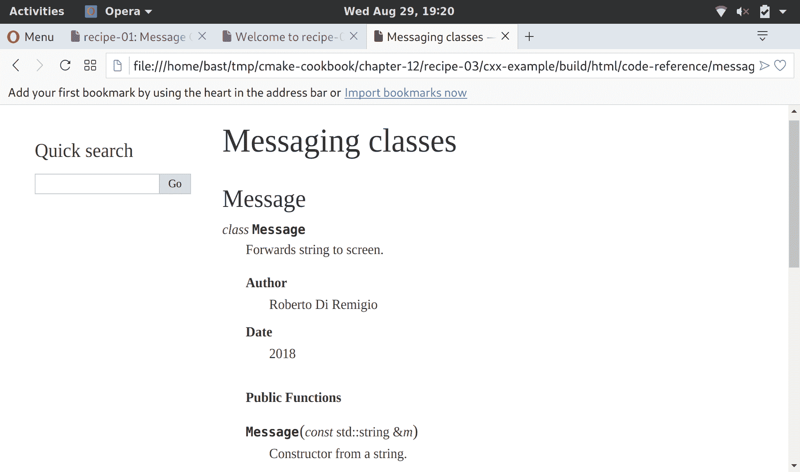

# 第十三章：构建文档

在本章中，我们将涵盖以下食谱：

+   使用 Doxygen 构建文档

+   使用 Sphinx 构建文档

+   结合 Doxygen 和 Sphinx

# 引言

文档在所有软件项目中都是必不可少的：对于用户，解释如何获取和构建代码，并说明如何有效地使用您的代码或库，对于开发者，描述库的内部细节，并帮助其他程序员参与并贡献于您的项目。本章将展示如何使用 CMake 构建代码文档，使用两个流行的框架：Doxygen 和 Sphinx。

# 使用 Doxygen 构建文档

本食谱的代码可在[`github.com/dev-cafe/cmake-cookbook/tree/v1.0/chapter-12/recipe-01`](https://github.com/dev-cafe/cmake-cookbook/tree/v1.0/chapter-12/recipe-01)找到，并包含一个 C++示例。该食谱适用于 CMake 版本 3.5（及以上），并在 GNU/Linux、macOS 和 Windows 上进行了测试。

Doxygen（[`www.doxygen.nl`](http://www.doxygen.nl)）是一个非常流行的源代码文档工具。您可以在代码中添加文档标签作为注释。运行 Doxygen 将提取这些注释并在 Doxyfile 配置文件中定义的格式中创建文档。Doxygen 可以输出 HTML、XML，甚至是 LaTeX 或 PDF。本食谱将向您展示如何使用 CMake 构建您的 Doxygen 文档。

# 准备就绪

我们将使用之前章节中介绍的`message`库的简化版本。源树组织如下：

```cpp
.
├── cmake
│   └── UseDoxygenDoc.cmake
├── CMakeLists.txt
├── docs
│   ├── Doxyfile.in
│   └── front_page.md
└── src
    ├── CMakeLists.txt
    ├── hello-world.cpp
    ├── Message.cpp
    └── Message.hpp
```

我们的源代码仍然位于`src`子目录下，自定义 CMake 模块位于`cmake`子目录下。由于我们的重点是文档，我们删除了对 UUID 的依赖并简化了源代码。最显著的区别是头文件中的大量代码注释：

```cpp
#pragma once

#include <iosfwd>
#include <string>

/*! \file Message.hpp */

/*! \class Message
 * \brief Forwards string to screen
 * \author Roberto Di Remigio
 * \date 2018
 */
class Message {
public:
  /*! \brief Constructor from a string
   * \param[in] m a message
   */
  Message(const std::string &m) : message_(m) {}
  /*! \brief Constructor from a character array
   * \param[in] m a message
   */
  Message(const char *m) : message_(std::string(m)) {}

  friend std::ostream &operator<<(std::ostream &os, Message &obj) {
    return obj.printObject(os);
  }

private:
  /*! The message to be forwarded to screen */
  std::string message_;
  /*! \brief Function to forward message to screen
   * \param[in, out] os output stream
   */
  std::ostream &printObject(std::ostream &os);
};
```

这些注释采用`/*! */`格式，并包含一些特殊标签，这些标签被 Doxygen 理解（参见[`www.stack.nl/~dimitri/doxygen/manual/docblocks.html`](http://www.stack.nl/~dimitri/doxygen/manual/docblocks.html)）。

# 如何操作

首先，让我们讨论根目录中的`CMakeLists.txt`文件：

1.  如您所熟悉，我们声明一个 C++11 项目，如下所示：

```cpp
cmake_minimum_required(VERSION 3.5 FATAL_ERROR)

project(recipe-01 LANGUAGES CXX)

set(CMAKE_CXX_STANDARD 11)
set(CMAKE_CXX_EXTENSIONS OFF)
set(CMAKE_CXX_STANDARD_REQUIRED ON)
```

1.  我们定义共享和静态库以及可执行文件的输出目录，如下所示：

```cpp
include(GNUInstallDirs)
set(CMAKE_ARCHIVE_OUTPUT_DIRECTORY
  ${CMAKE_BINARY_DIR}/${CMAKE_INSTALL_LIBDIR})
set(CMAKE_LIBRARY_OUTPUT_DIRECTORY
  ${CMAKE_BINARY_DIR}/${CMAKE_INSTALL_LIBDIR})
set(CMAKE_RUNTIME_OUTPUT_DIRECTORY
  ${CMAKE_BINARY_DIR}/${CMAKE_INSTALL_BINDIR})
```

1.  我们将`cmake`子目录附加到`CMAKE_MODULE_PATH`。这是 CMake 找到我们的自定义模块所必需的：

```cpp
list(APPEND CMAKE_MODULE_PATH "${CMAKE_SOURCE_DIR}/cmake")
```

1.  包含自定义模块`UseDoxygenDoc.cmake`。我们将在后面讨论其内容：

```cpp
include(UseDoxygenDoc)
```

1.  然后我们添加`src`子目录：

```cpp
add_subdirectory(src)
```

`src`子目录中的`CMakeLists.txt`文件包含以下构建块：

1.  我们添加一个`message`静态库，如下所示：

```cpp
add_library(message STATIC
  Message.hpp
  Message.cpp
  )
```

1.  然后我们添加一个可执行目标，`hello-world`：

```cpp
add_executable(hello-world hello-world.cpp)
```

1.  然后，`hello-world`可执行文件应该链接到消息库：

```cpp
target_link_libraries(hello-world
  PUBLIC
    message
  )
```

在根`CMakeLists.txt`文件的最后一节中，我们调用了`add_doxygen_doc`函数。这添加了一个新的`docs`目标，该目标将调用 Doxygen 来构建我们的文档：

```cpp
add_doxygen_doc(
  BUILD_DIR
    ${CMAKE_CURRENT_BINARY_DIR}/_build
  DOXY_FILE
    ${CMAKE_CURRENT_SOURCE_DIR}/docs/Doxyfile.in
  TARGET_NAME
    docs
  COMMENT
    "HTML documentation"
  )
```

最后，让我们看一下`UseDoxygenDoc.cmake`模块，其中定义了`add_doxygen_doc`函数：

1.  我们找到`Doxygen`和`Perl`可执行文件，如下所示：

```cpp
find_package(Perl REQUIRED)
find_package(Doxygen REQUIRED)
```

1.  然后，我们声明`add_doxygen_doc`函数。该函数理解单值参数：`BUILD_DIR`、`DOXY_FILE`、`TARGET_NAME`和`COMMENT`。我们使用 CMake 的标准命令`cmake_parse_arguments`来解析这些参数：

```cpp
function(add_doxygen_doc)
  set(options)
  set(oneValueArgs BUILD_DIR DOXY_FILE TARGET_NAME COMMENT)
  set(multiValueArgs)

  cmake_parse_arguments(DOXY_DOC
    "${options}"
    "${oneValueArgs}"
    "${multiValueArgs}"
    ${ARGN}
    )

  # ...

endfunction()
```

1.  `Doxyfile`包含构建文档所需的所有 Doxygen 设置。模板`Doxyfile.in`作为函数参数`DOXY_FILE`传递，并被解析到`DOXY_DOC_DOXY_FILE`变量中。我们按照以下方式配置模板文件`Doxyfile.in`：

```cpp
configure_file(
  ${DOXY_DOC_DOXY_FILE}
  ${DOXY_DOC_BUILD_DIR}/Doxyfile
  @ONLY
  )
```

1.  然后，我们定义一个名为`DOXY_DOC_TARGET_NAME`的自定义目标，它将使用`Doxyfile`中的设置执行 Doxygen，并将结果输出到`DOXY_DOC_BUILD_DIR`：

```cpp
add_custom_target(${DOXY_DOC_TARGET_NAME}
  COMMAND
    ${DOXYGEN_EXECUTABLE} Doxyfile
  WORKING_DIRECTORY
    ${DOXY_DOC_BUILD_DIR}
  COMMENT
    "Building ${DOXY_DOC_COMMENT} with Doxygen"
  VERBATIM
  )
```

1.  最终，会向用户打印一条状态消息：

```cpp
message(STATUS "Added ${DOXY_DOC_TARGET_NAME} [Doxygen] target to build documentation")
```

我们可以像往常一样配置项目：

```cpp
$ mkdir -p build
$ cd build
$ cmake ..
$ cmake --build .
```

通过调用我们的自定义`docs`目标，可以构建文档：

```cpp
$ cmake --build . --target docs
```

你会注意到，在构建树中会出现一个`_build`子目录。这包含 Doxygen 从你的源文件生成的 HTML 文档。使用你喜欢的浏览器打开`index.html`将显示 Doxygen 欢迎页面。

如果你导航到类列表，你可以例如浏览`Message`类的文档：


# 工作原理

CMake 默认不支持文档构建。但是，我们可以使用`add_custom_target`来执行任意操作，这是我们在本食谱中利用的机制。需要注意的是，我们需要确保系统上存在构建文档所需的工具（在本例中为 Doxygen 和 Perl）。

此外，请注意`UseDoxygenDoc.cmake`自定义模块仅执行以下操作：

+   执行对 Doxygen 和 Perl 可执行文件的搜索

+   定义一个函数

实际创建`docs`目标的操作留给了稍后调用`add_doxygen_doc`函数。这是一种“显式优于隐式”的模式，我们认为这是良好的 CMake 实践：不要使用模块包含来执行类似宏（或函数）的操作。

我们通过使用函数而不是宏来实现`add_doxygen_doc`，以限制变量定义的作用域和可能的副作用。在这种情况下，函数和宏都可以工作（并且会产生相同的结果），但我们建议除非需要修改父作用域中的变量，否则应优先使用函数而不是宏。

CMake 3.9 中添加了一个新的改进的`FindDoxygen.cmake`模块。实现了便利函数`doxygen_add_docs`，它将作为我们在本食谱中介绍的宏。有关更多详细信息，请查看在线文档[`cmake.org/cmake/help/v3.9/module/FindDoxygen.html`](https://cmake.org/cmake/help/v3.9/module/FindDoxygen.html)。

# 使用 Sphinx 构建文档

本食谱的代码可在[`github.com/dev-cafe/cmake-cookbook/tree/v1.0/chapter-12/recipe-02`](https://github.com/dev-cafe/cmake-cookbook/tree/v1.0/chapter-12/recipe-02)找到，并包含一个 C++示例。该食谱适用于 CMake 版本 3.5（及以上），并在 GNU/Linux、macOS 和 Windows 上进行了测试。

Sphinx 是一个 Python 程序，也是一个非常流行的文档系统（[`www.sphinx-doc.org`](http://www.sphinx-doc.org)）。当与 Python 项目一起使用时，它可以解析源文件中的所谓 docstrings，并自动为函数和类生成文档页面。然而，Sphinx 不仅限于 Python，还可以解析 reStructuredText、Markdown 纯文本文件，并生成 HTML、ePUB 或 PDF 文档。与在线 Read the Docs 服务（[`readthedocs.org`](https://readthedocs.org)）结合使用，它提供了一种快速开始编写和部署文档的绝佳方式。本食谱将向您展示如何使用 CMake 基于 Sphinx 构建文档。

# 准备工作

我们希望构建一个简单的网站来记录我们的消息库。源树现在看起来如下：

```cpp
.
├── cmake
│   ├── FindSphinx.cmake
│   └── UseSphinxDoc.cmake
├── CMakeLists.txt
├── docs
│   ├── conf.py.in
│   └── index.rst
└── src
    ├── CMakeLists.txt
    ├── hello-world.cpp
    ├── Message.cpp
    └── Message.hpp
```

我们在`cmake`子目录中有一些自定义模块，`docs`子目录包含我们网站的主页，以纯文本 reStructuredText 格式，`index.rst`，以及一个 Python 模板文件，`conf.py.in`，用于 Sphinx 的设置。此文件可以使用 Sphinx 安装的一部分`sphinx-quickstart`实用程序自动生成。

# 如何操作

与之前的食谱相比，我们将修改根`CMakeLists.txt`文件，并实现一个函数（`add_sphinx_doc`）：

1.  在将`cmake`文件夹附加到`CMAKE_MODULE_PATH`之后，我们如下包含`UseSphinxDoc.cmake`自定义模块：

```cpp
list(APPEND CMAKE_MODULE_PATH "${CMAKE_SOURCE_DIR}/cmake")

include(UseSphinxDoc)
```

1.  `UseSphinxDoc.cmake`模块定义了`add_sphinx_doc`函数。我们使用关键字参数调用此函数，以设置我们的 Sphinx 文档构建。自定义文档目标将被称为`docs`：

```cpp
add_sphinx_doc(
  SOURCE_DIR
    ${CMAKE_CURRENT_SOURCE_DIR}/docs
  BUILD_DIR
    ${CMAKE_CURRENT_BINARY_DIR}/_build
  CACHE_DIR
    ${CMAKE_CURRENT_BINARY_DIR}/_doctrees
  HTML_DIR
    ${CMAKE_CURRENT_BINARY_DIR}/sphinx_html
  CONF_FILE
    ${CMAKE_CURRENT_SOURCE_DIR}/docs/conf.py.in
  TARGET_NAME
    docs
  COMMENT
    "HTML documentation"
  )
```

`UseSphinxDoc.cmake`模块遵循我们在前一个食谱中使用的相同“显式优于隐式”模式：

1.  我们需要找到 Python 解释器和`Sphinx`可执行文件，如下所示：

```cpp
find_package(PythonInterp REQUIRED)
find_package(Sphinx REQUIRED)
```

1.  然后我们定义带有单值关键字参数的`add_sphinx_doc`函数。这些参数由`cmake_parse_arguments`命令解析：

```cpp
function(add_sphinx_doc)
  set(options)
  set(oneValueArgs
    SOURCE_DIR
    BUILD_DIR
    CACHE_DIR
    HTML_DIR
    CONF_FILE
    TARGET_NAME
    COMMENT
    )
  set(multiValueArgs)

  cmake_parse_arguments(SPHINX_DOC
    "${options}"
    "${oneValueArgs}"
    "${multiValueArgs}"
    ${ARGN}
    )

  # ...

endfunction()
```

1.  模板文件`conf.py.in`，作为`CONF_FILE`关键字参数传递，配置为在`SPHINX_DOC_BUILD_DIR`中的`conf.py`：

```cpp
configure_file(
  ${SPHINX_DOC_CONF_FILE}
  ${SPHINX_DOC_BUILD_DIR}/conf.py
  @ONLY
  )
```

1.  我们添加了一个名为`SPHINX_DOC_TARGET_NAME`的自定义目标，以协调使用 Sphinx 构建文档：

```cpp
add_custom_target(${SPHINX_DOC_TARGET_NAME}
  COMMAND
    ${SPHINX_EXECUTABLE}
       -q
       -b html
       -c ${SPHINX_DOC_BUILD_DIR}
       -d ${SPHINX_DOC_CACHE_DIR}
       ${SPHINX_DOC_SOURCE_DIR}
       ${SPHINX_DOC_HTML_DIR}
  COMMENT
    "Building ${SPHINX_DOC_COMMENT} with Sphinx"
  VERBATIM
  )
```

1.  最后，我们向用户打印出一条状态消息：

```cpp
message(STATUS "Added ${SPHINX_DOC_TARGET_NAME} [Sphinx] target to build documentation")
```

1.  我们配置项目并构建`docs`目标：

```cpp
$ mkdir -p build
$ cd build
$ cmake ..
$ cmake --build . --target docs
```

这将在构建树的`SPHINX_DOC_HTML_DIR`子目录中生成 HTML 文档。再次，您可以使用您喜欢的浏览器打开`index.html`并查看闪亮（但仍然稀疏）的文档：


# 它是如何工作的

再次，我们利用了`add_custom_target`的强大功能，向我们的构建系统添加了一个任意构建目标。在这种情况下，文档将使用 Sphinx 构建。由于 Sphinx 是一个可以与其他 Python 模块扩展的 Python 程序，因此`docs`目标将依赖于 Python 解释器。我们确保通过使用`find_package`来满足依赖关系。请注意，`FindSphinx.cmake`模块还不是标准的 CMake 模块；它的副本包含在项目源代码的`cmake`子目录下。

# 结合 Doxygen 和 Sphinx

本食谱的代码可在[`github.com/dev-cafe/cmake-cookbook/tree/v1.0/chapter-12/recipe-03`](https://github.com/dev-cafe/cmake-cookbook/tree/v1.0/chapter-12/recipe-03)找到，并包含一个 C++示例。该食谱适用于 CMake 版本 3.5（及以上），并在 GNU/Linux、macOS 和 Windows 上进行了测试。

我们有一个 C++项目，因此，Doxygen 是生成源代码文档的理想选择。然而，我们也希望发布面向用户的文档，例如解释我们的设计选择。我们更愿意使用 Sphinx 来实现这一点，因为生成的 HTML 也可以在移动设备上工作，而且我们可以将文档部署到 Read the Docs（[`readthedocs.org`](https://readthedocs.org)）。本食谱将说明如何使用 Breathe 插件（[`breathe.readthedocs.io`](https://breathe.readthedocs.io)）来桥接 Doxygen 和 Sphinx。

# 准备就绪

本食谱的源代码树与前两个食谱类似：

```cpp
.
├── cmake
│   ├── FindPythonModule.cmake
│   ├── FindSphinx.cmake
│   └── UseBreathe.cmake
├── CMakeLists.txt
├── docs
│   ├── code-reference
│   │   ├── classes-and-functions.rst
│   │   └── message.rst
│   ├── conf.py.in
│   ├── Doxyfile.in
│   └── index.rst
└── src
    ├── CMakeLists.txt
    ├── hello-world.cpp
    ├── Message.cpp
    └── Message.hpp
```

现在，`docs`子目录中包含了`Doxyfile.in`和`conf.py.in`模板文件，分别用于 Doxygen 和 Sphinx 的设置。此外，我们还有一个`code-reference`子目录。

紧随`code-reference`的文件包含 Breathe 指令，以在 Sphinx 中包含 Doxygen 生成的文档：

```cpp
Messaging classes
=================

Message
-------
.. doxygenclass:: Message
   :project: recipe-03
   :members:
   :protected-members:
   :private-members:
```

这将输出`Message`类的文档。

# 如何操作

`src`目录中的`CMakeLists.txt`文件未更改。根目录中的`CMakeLists.txt`文件的唯一更改如下：

1.  我们包含`UseBreathe.cmake`自定义模块：

```cpp
list(APPEND CMAKE_MODULE_PATH "${CMAKE_SOURCE_DIR}/cmake")

include(UseBreathe)
```

1.  我们调用了`add_breathe_doc`函数。该函数在自定义模块中定义，并接受关键字参数来设置结合 Doxygen 和 Sphinx 的构建：

```cpp
add_breathe_doc(
  SOURCE_DIR
    ${CMAKE_CURRENT_SOURCE_DIR}/docs
  BUILD_DIR
    ${CMAKE_CURRENT_BINARY_DIR}/_build
  CACHE_DIR
    ${CMAKE_CURRENT_BINARY_DIR}/_doctrees
  HTML_DIR
    ${CMAKE_CURRENT_BINARY_DIR}/html
  DOXY_FILE
    ${CMAKE_CURRENT_SOURCE_DIR}/docs/Doxyfile.in
  CONF_FILE
    ${CMAKE_CURRENT_SOURCE_DIR}/docs/conf.py.in
  TARGET_NAME
    docs
  COMMENT
    "HTML documentation"
  )
```

让我们检查`UseBreatheDoc.cmake`模块。这遵循了我们之前两个配方中描述的明确优于隐式的相同模式。该模块详细描述如下：

1.  文档生成依赖于 Doxygen：

```cpp
find_package(Doxygen REQUIRED)
find_package(Perl REQUIRED)
```

1.  我们还依赖于 Python 解释器和`Sphinx`：

```cpp
find_package(PythonInterp REQUIRED)
find_package(Sphinx REQUIRED)
```

1.  此外，我们还必须找到`breathe` Python 模块。我们使用`FindPythonModule.cmake`模块：

```cpp
include(FindPythonModule)
find_python_module(breathe REQUIRED)
```

1.  我们定义了`add_breathe_doc`函数。该函数有一个单值关键字参数，我们将使用`cmake_parse_arguments`命令对其进行解析：

```cpp
function(add_breathe_doc)
  set(options)
  set(oneValueArgs
    SOURCE_DIR
    BUILD_DIR
    CACHE_DIR
    HTML_DIR
    DOXY_FILE
    CONF_FILE
    TARGET_NAME
    COMMENT
    )
  set(multiValueArgs)

  cmake_parse_arguments(BREATHE_DOC
    "${options}"
    "${oneValueArgs}"
    "${multiValueArgs}"
    ${ARGN}
    )

  # ...

endfunction()
```

1.  `BREATHE_DOC_CONF_FILE`模板文件用于 Sphinx，配置为`conf.py`在`BREATHE_DOC_BUILD_DIR`中：

```cpp
configure_file(
  ${BREATHE_DOC_CONF_FILE}
  ${BREATHE_DOC_BUILD_DIR}/conf.py
  @ONLY
  )
```

1.  相应地，Doxygen 的`BREATHE_DOC_DOXY_FILE`模板文件配置为`Doxyfile`在`BREATHE_DOC_BUILD_DIR`中：

```cpp
configure_file(
  ${BREATHE_DOC_DOXY_FILE}
  ${BREATHE_DOC_BUILD_DIR}/Doxyfile
  @ONLY
  )
```

1.  然后我们添加了自定义目标`BREATHE_DOC_TARGET_NAME`。请注意，只运行了 Sphinx；对 Doxygen 的必要调用在`BREATHE_DOC_SPHINX_FILE`内部发生：

```cpp
add_custom_target(${BREATHE_DOC_TARGET_NAME}
  COMMAND
    ${SPHINX_EXECUTABLE}
       -q
       -b html
       -c ${BREATHE_DOC_BUILD_DIR}
       -d ${BREATHE_DOC_CACHE_DIR}
       ${BREATHE_DOC_SOURCE_DIR}
       ${BREATHE_DOC_HTML_DIR}
  COMMENT
    "Building ${BREATHE_DOC_TARGET_NAME} documentation with Breathe, Sphinx and Doxygen"
  VERBATIM
  )
```

1.  最后，向用户打印一条状态消息：

```cpp
message(STATUS "Added ${BREATHE_DOC_TARGET_NAME} [Breathe+Sphinx+Doxygen] target to build documentation")
```

1.  配置完成后，我们可以像往常一样构建文档：

```cpp
$ mkdir -p build
$ cd build
$ cmake ..
$ cmake --build . --target docs
```

文档将可在构建树的`BREATHE_DOC_HTML_DIR`子目录中找到。启动浏览器打开`index.html`文件后，您可以导航到`Message`类的文档：



# 工作原理

您会注意到，尽管在声明自定义`BREATHE_DOC_TARGET_NAME`目标时只给出了对 Sphinx 的调用，但 Doxygen 和 Sphinx 都运行了。这是由于 Sphinx 的`conf.py`文件中定义的以下设置：

```cpp
def run_doxygen(folder):
    """Run the doxygen make command in the designated folder"""

    try:
        retcode = subprocess.call("cd {}; doxygen".format(folder), shell=True)
        if retcode < 0:
            sys.stderr.write(
                "doxygen terminated by signal {}".format(-retcode))
    except OSError as e:
        sys.stderr.write("doxygen execution failed: {}".format(e))

def setup(app):
    run_doxygen('@BREATHE_DOC_BUILD_DIR@')
```

Doxygen 将生成 XML 输出，Breathe 插件将能够以与所选 Sphinx 文档样式一致的形式呈现这些输出。
